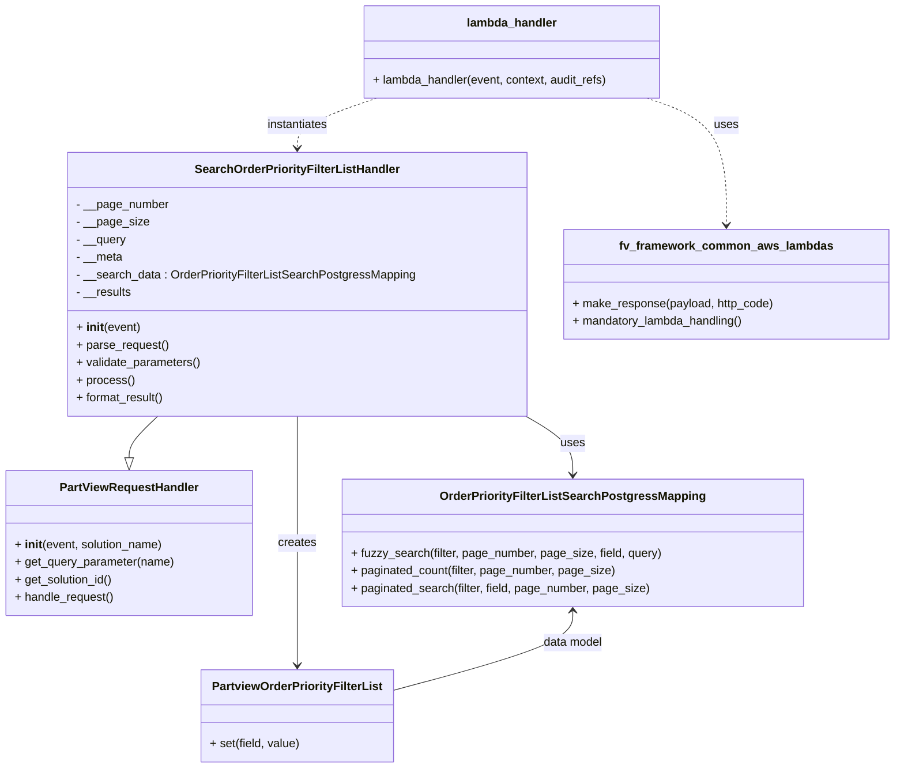
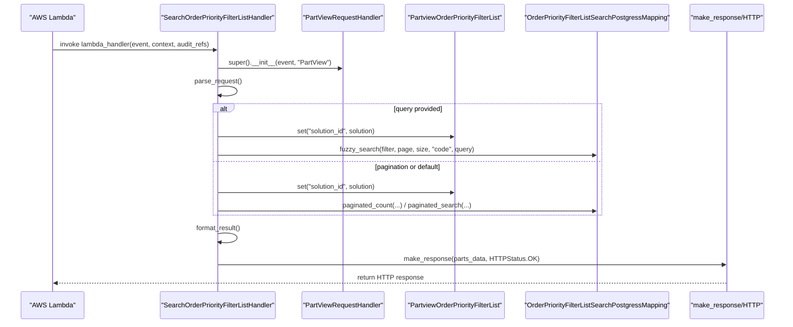

# Diagram: partview_core/partview_service/partview_service/api/search/search_order_priority_filter_list.py

> Auto-generated by Obscura crawlers

## Diagram 1

### SVG

<svg id="container" width="1210.16015625" xmlns="http://www.w3.org/2000/svg" class="classDiagram" height="1048" viewBox="0 0 1210.16015625 1048" role="graphics-document document" aria-roledescription="class"><g><defs><marker id="container_class-aggregationStart" class="marker aggregation class" refX="18" refY="7" markerWidth="190" markerHeight="240" orient="auto"><path d="M 18,7 L9,13 L1,7 L9,1 Z"></path></marker></defs><defs><marker id="container_class-aggregationEnd" class="marker aggregation class" refX="1" refY="7" markerWidth="20" markerHeight="28" orient="auto"><path d="M 18,7 L9,13 L1,7 L9,1 Z"></path></marker></defs><defs><marker id="container_class-extensionStart" class="marker extension class" refX="18" refY="7" markerWidth="190" markerHeight="240" orient="auto"><path d="M 1,7 L18,13 V 1 Z"></path></marker></defs><defs><marker id="container_class-extensionEnd" class="marker extension class" refX="1" refY="7" markerWidth="20" markerHeight="28" orient="auto"><path d="M 1,1 V 13 L18,7 Z"></path></marker></defs><defs><marker id="container_class-compositionStart" class="marker composition class" refX="18" refY="7" markerWidth="190" markerHeight="240" orient="auto"><path d="M 18,7 L9,13 L1,7 L9,1 Z"></path></marker></defs><defs><marker id="container_class-compositionEnd" class="marker composition class" refX="1" refY="7" markerWidth="20" markerHeight="28" orient="auto"><path d="M 18,7 L9,13 L1,7 L9,1 Z"></path></marker></defs><defs><marker id="container_class-dependencyStart" class="marker dependency class" refX="6" refY="7" markerWidth="190" markerHeight="240" orient="auto"><path d="M 5,7 L9,13 L1,7 L9,1 Z"></path></marker></defs><defs><marker id="container_class-dependencyEnd" class="marker dependency class" refX="13" refY="7" markerWidth="20" markerHeight="28" orient="auto"><path d="M 18,7 L9,13 L14,7 L9,1 Z"></path></marker></defs><defs><marker id="container_class-lollipopStart" class="marker lollipop class" refX="13" refY="7" markerWidth="190" markerHeight="240" orient="auto"><circle stroke="black" fill="transparent" cx="7" cy="7" r="6"></circle></marker></defs><defs><marker id="container_class-lollipopEnd" class="marker lollipop class" refX="1" refY="7" markerWidth="190" markerHeight="240" orient="auto"><circle stroke="black" fill="transparent" cx="7" cy="7" r="6"></circle></marker></defs><g class="root"><g class="clusters"></g><g class="edgePaths"><path d="M213.759,568L207.278,574.167C200.797,580.333,187.836,592.667,181.356,602.125C174.875,611.583,174.875,618.167,174.875,621.458L174.875,624.75" id="id_SearchOrderPriorityFilterListHandler_PartViewRequestHandler_1" class="edge-thickness-normal edge-pattern-solid relation" style=";;;" data-edge="true" data-et="edge" data-id="id_SearchOrderPriorityFilterListHandler_PartViewRequestHandler_1" data-points="W3sieCI6MjEzLjc1ODU2ODU0ODM4NzEsInkiOjU2OH0seyJ4IjoxNzQuODc1LCJ5Ijo2MDV9LHsieCI6MTc0Ljg3NSwieSI6NjQyfV0=" marker-end="url(#container_class-extensionEnd)"></path><path d="M710.013,568L720.533,574.167C731.054,580.333,752.095,592.667,762.616,606C773.137,619.333,773.137,633.667,773.137,640.833L773.137,648" id="id_SearchOrderPriorityFilterListHandler_OrderPriorityFilterListSearchPostgressMapping_2" class="edge-thickness-normal edge-pattern-solid relation" style=";;;" data-edge="true" data-et="edge" data-id="id_SearchOrderPriorityFilterListHandler_OrderPriorityFilterListSearchPostgressMapping_2" data-points="W3sieCI6NzEwLjAxMjUyODgwMTg0MzIsInkiOjU2OH0seyJ4Ijo3NzMuMTM2NzE4NzUsInkiOjYwNX0seyJ4Ijo3NzMuMTM2NzE4NzUsInkiOjY1NH1d" marker-end="url(#container_class-dependencyEnd)"></path><path d="M402.922,568L402.922,574.167C402.922,580.333,402.922,592.667,402.922,621.5C402.922,650.333,402.922,695.667,402.922,741C402.922,786.333,402.922,831.667,402.922,859.5C402.922,887.333,402.922,897.667,402.922,902.833L402.922,908" id="id_SearchOrderPriorityFilterListHandler_PartviewOrderPriorityFilterList_3" class="edge-thickness-normal edge-pattern-solid relation" style=";;;" data-edge="true" data-et="edge" data-id="id_SearchOrderPriorityFilterListHandler_PartviewOrderPriorityFilterList_3" data-points="W3sieCI6NDAyLjkyMTg3NSwieSI6NTY4fSx7IngiOjQwMi45MjE4NzUsInkiOjYwNX0seyJ4Ijo0MDIuOTIxODc1LCJ5Ijo3NDF9LHsieCI6NDAyLjkyMTg3NSwieSI6ODc3fSx7IngiOjQwMi45MjE4NzUsInkiOjkxNH1d" marker-end="url(#container_class-dependencyEnd)"></path><path d="M510.283,134L492.389,140.167C474.496,146.333,438.709,158.667,420.815,170C402.922,181.333,402.922,191.667,402.922,196.833L402.922,202" id="id_lambda_handler_SearchOrderPriorityFilterListHandler_4" class="edge-thickness-normal edge-pattern-dashed relation" style=";;;" data-edge="true" data-et="edge" data-id="id_lambda_handler_SearchOrderPriorityFilterListHandler_4" data-points="W3sieCI6NTEwLjI4MjU3ODEyNSwieSI6MTM0fSx7IngiOjQwMi45MjE4NzUsInkiOjE3MX0seyJ4Ijo0MDIuOTIxODc1LCJ5IjoyMDh9XQ==" marker-end="url(#container_class-dependencyEnd)"></path><path d="M875.889,134L893.783,140.167C911.676,146.333,947.463,158.667,965.357,187.5C983.25,216.333,983.25,261.667,983.25,284.333L983.25,307" id="id_lambda_handler_fv_framework_common_aws_lambdas_5" class="edge-thickness-normal edge-pattern-dashed relation" style=";;;" data-edge="true" data-et="edge" data-id="id_lambda_handler_fv_framework_common_aws_lambdas_5" data-points="W3sieCI6ODc1Ljg4OTI5Njg3NSwieSI6MTM0fSx7IngiOjk4My4yNSwieSI6MTcxfSx7IngiOjk4My4yNSwieSI6MzEzfV0=" marker-end="url(#container_class-dependencyEnd)"></path><path d="M773.137,834L773.137,841.167C773.137,848.333,773.137,862.667,733.096,880.649C693.056,898.631,612.975,920.262,572.935,931.077L532.895,941.893" id="id_OrderPriorityFilterListSearchPostgressMapping_PartviewOrderPriorityFilterList_6" class="edge-thickness-normal edge-pattern-solid relation" style=";;;" data-edge="true" data-et="edge" data-id="id_OrderPriorityFilterListSearchPostgressMapping_PartviewOrderPriorityFilterList_6" data-points="W3sieCI6NzczLjEzNjcxODc1LCJ5Ijo4Mjh9LHsieCI6NzczLjEzNjcxODc1LCJ5Ijo4Nzd9LHsieCI6NTMyLjg5NDUzMTI1LCJ5Ijo5NDEuODkyNjQwNDY0MjU3NX1d" marker-start="url(#container_class-dependencyStart)"></path></g><g class="edgeLabels"><g class="edgeLabel"><g class="label" data-id="id_SearchOrderPriorityFilterListHandler_PartViewRequestHandler_1" transform="translate(0, 0)"><foreignObject width="0" height="0">

</foreignObject></g></g><g class="edgeLabel" transform="translate(773.13671875, 605)"><g class="label" data-id="id_SearchOrderPriorityFilterListHandler_OrderPriorityFilterListSearchPostgressMapping_2" transform="translate(-16.4921875, -12)"><foreignObject width="32.984375" height="24">

uses

</foreignObject></g></g><g class="edgeLabel" transform="translate(402.921875, 741)"><g class="label" data-id="id_SearchOrderPriorityFilterListHandler_PartviewOrderPriorityFilterList_3" transform="translate(-26.171875, -12)"><foreignObject width="52.34375" height="24">

creates

</foreignObject></g></g><g class="edgeLabel" transform="translate(402.921875, 171)"><g class="label" data-id="id_lambda_handler_SearchOrderPriorityFilterListHandler_4" transform="translate(-42.9140625, -12)"><foreignObject width="85.828125" height="24">

instantiates

</foreignObject></g></g><g class="edgeLabel" transform="translate(983.25, 171)"><g class="label" data-id="id_lambda_handler_fv_framework_common_aws_lambdas_5" transform="translate(-16.4921875, -12)"><foreignObject width="32.984375" height="24">

uses

</foreignObject></g></g><g class="edgeLabel" transform="translate(773.13671875, 877)"><g class="label" data-id="id_OrderPriorityFilterListSearchPostgressMapping_PartviewOrderPriorityFilterList_6" transform="translate(-41.4609375, -12)"><foreignObject width="82.921875" height="24">

data model

</foreignObject></g></g></g><g class="nodes"><g class="node default" id="classId-SearchOrderPriorityFilterListHandler-0" transform="translate(402.921875, 388)"><g class="basic label-container"><path d="M-311.41796875 -180 L311.41796875 -180 L311.41796875 180 L-311.41796875 180" stroke="none" stroke-width="0" fill="#ECECFF" style=""></path><path d="M-311.41796875 -180 C-74.3265465235445 -180, 162.764875702911 -180, 311.41796875 -180 M-311.41796875 -180 C-104.35522027403272 -180, 102.70752820193457 -180, 311.41796875 -180 M311.41796875 -180 C311.41796875 -41.829313444337885, 311.41796875 96.34137311132423, 311.41796875 180 M311.41796875 -180 C311.41796875 -56.25326652863076, 311.41796875 67.49346694273848, 311.41796875 180 M311.41796875 180 C163.52482522973426 180, 15.631681709468523 180, -311.41796875 180 M311.41796875 180 C170.34868559597183 180, 29.27940244194366 180, -311.41796875 180 M-311.41796875 180 C-311.41796875 89.2409404467023, -311.41796875 -1.5181191065954067, -311.41796875 -180 M-311.41796875 180 C-311.41796875 80.08329367831301, -311.41796875 -19.833412643373975, -311.41796875 -180" stroke="#9370DB" stroke-width="1.3" fill="none" stroke-dasharray="0 0" style=""></path></g><g class="annotation-group text" transform="translate(0, -156)"></g><g class="label-group text" transform="translate(-134.3359375, -156)"><g class="label" style="font-weight: bolder" transform="translate(0,-12)"><foreignObject width="268.671875" height="24">

SearchOrderPriorityFilterListHandler

</foreignObject></g></g><g class="members-group text" transform="translate(-299.41796875, -108)"><g class="label" style="" transform="translate(0,-12)"><foreignObject width="126.640625" height="24">

- __page_number

</foreignObject></g><g class="label" style="" transform="translate(0,12)"><foreignObject width="97.4375" height="24">

- __page_size

</foreignObject></g><g class="label" style="" transform="translate(0,36)"><foreignObject width="68.5" height="24">

- __query

</foreignObject></g><g class="label" style="" transform="translate(0,60)"><foreignObject width="63.96875" height="24">

- __meta

</foreignObject></g><g class="label" style="" transform="translate(0,84)"><foreignObject width="464.5" height="24">

- __search_data : OrderPriorityFilterListSearchPostgressMapping

</foreignObject></g><g class="label" style="" transform="translate(0,108)"><foreignObject width="76.3125" height="24">

- __results

</foreignObject></g></g><g class="methods-group text" transform="translate(-299.41796875, 60)"><g class="label" style="" transform="translate(0,-12)"><foreignObject width="87.390625" height="24">

+ <strong>init</strong>(event)

</foreignObject></g><g class="label" style="" transform="translate(0,12)"><foreignObject width="126.046875" height="24">

+ parse_request()

</foreignObject></g><g class="label" style="" transform="translate(0,36)"><foreignObject width="170.953125" height="24">

+ validate_parameters()

</foreignObject></g><g class="label" style="" transform="translate(0,60)"><foreignObject width="77.96875" height="24">

+ process()

</foreignObject></g><g class="label" style="" transform="translate(0,84)"><foreignObject width="121.5" height="24">

+ format_result()

</foreignObject></g></g><g class="divider" style=""><path d="M-311.41796875 -132 C-80.9926429687452 -132, 149.4326828125096 -132, 311.41796875 -132 M-311.41796875 -132 C-115.05328575470628 -132, 81.31139724058744 -132, 311.41796875 -132" stroke="#9370DB" stroke-width="1.3" fill="none" stroke-dasharray="0 0" style=""></path></g><g class="divider" style=""><path d="M-311.41796875 36 C-129.57192977692188 36, 52.274109196156246 36, 311.41796875 36 M-311.41796875 36 C-62.35823898397382 36, 186.70149078205236 36, 311.41796875 36" stroke="#9370DB" stroke-width="1.3" fill="none" stroke-dasharray="0 0" style=""></path></g></g><g class="node default" id="classId-PartViewRequestHandler-1" transform="translate(174.875, 741)"><g class="basic label-container"><path d="M-166.875 -99 L166.875 -99 L166.875 99 L-166.875 99" stroke="none" stroke-width="0" fill="#ECECFF" style=""></path><path d="M-166.875 -99 C-95.06470632109792 -99, -23.25441264219583 -99, 166.875 -99 M-166.875 -99 C-47.00361342183517 -99, 72.86777315632966 -99, 166.875 -99 M166.875 -99 C166.875 -52.04627570000593, 166.875 -5.092551400011857, 166.875 99 M166.875 -99 C166.875 -43.89117125704823, 166.875 11.217657485903544, 166.875 99 M166.875 99 C99.66976652671563 99, 32.46453305343127 99, -166.875 99 M166.875 99 C42.49238328686154 99, -81.89023342627692 99, -166.875 99 M-166.875 99 C-166.875 49.247016144704226, -166.875 -0.5059677105915483, -166.875 -99 M-166.875 99 C-166.875 54.459118754843665, -166.875 9.91823750968733, -166.875 -99" stroke="#9370DB" stroke-width="1.3" fill="none" stroke-dasharray="0 0" style=""></path></g><g class="annotation-group text" transform="translate(0, -75)"></g><g class="label-group text" transform="translate(-91.359375, -75)"><g class="label" style="font-weight: bolder" transform="translate(0,-12)"><foreignObject width="182.71875" height="24">

PartViewRequestHandler

</foreignObject></g></g><g class="members-group text" transform="translate(-154.875, -27)"></g><g class="methods-group text" transform="translate(-154.875, 3)"><g class="label" style="" transform="translate(0,-12)"><foreignObject width="204.1875" height="24">

+ <strong>init</strong>(event, solution_name)

</foreignObject></g><g class="label" style="" transform="translate(0,12)"><foreignObject width="218.390625" height="24">

+ get_query_parameter(name)

</foreignObject></g><g class="label" style="" transform="translate(0,36)"><foreignObject width="135.703125" height="24">

+ get_solution_id()

</foreignObject></g><g class="label" style="" transform="translate(0,60)"><foreignObject width="136.21875" height="24">

+ handle_request()

</foreignObject></g></g><g class="divider" style=""><path d="M-166.875 -51 C-46.13821766894269 -51, 74.59856466211463 -51, 166.875 -51 M-166.875 -51 C-46.56842695943631 -51, 73.73814608112738 -51, 166.875 -51" stroke="#9370DB" stroke-width="1.3" fill="none" stroke-dasharray="0 0" style=""></path></g><g class="divider" style=""><path d="M-166.875 -27 C-55.31102612769823 -27, 56.252947744603546 -27, 166.875 -27 M-166.875 -27 C-93.54097055263054 -27, -20.20694110526108 -27, 166.875 -27" stroke="#9370DB" stroke-width="1.3" fill="none" stroke-dasharray="0 0" style=""></path></g></g><g class="node default" id="classId-OrderPriorityFilterListSearchPostgressMapping-2" transform="translate(773.13671875, 741)"><g class="basic label-container"><path d="M-309.04296875 -87 L309.04296875 -87 L309.04296875 87 L-309.04296875 87" stroke="none" stroke-width="0" fill="#ECECFF" style=""></path><path d="M-309.04296875 -87 C-185.23085265556878 -87, -61.418736561137564 -87, 309.04296875 -87 M-309.04296875 -87 C-88.95850718871571 -87, 131.12595437256857 -87, 309.04296875 -87 M309.04296875 -87 C309.04296875 -48.74950629286721, 309.04296875 -10.49901258573442, 309.04296875 87 M309.04296875 -87 C309.04296875 -25.99142984097501, 309.04296875 35.01714031804998, 309.04296875 87 M309.04296875 87 C91.68476005068828 87, -125.67344864862343 87, -309.04296875 87 M309.04296875 87 C146.29744427139744 87, -16.448080207205123 87, -309.04296875 87 M-309.04296875 87 C-309.04296875 27.71882204856429, -309.04296875 -31.562355902871417, -309.04296875 -87 M-309.04296875 87 C-309.04296875 19.28685087403494, -309.04296875 -48.42629825193012, -309.04296875 -87" stroke="#9370DB" stroke-width="1.3" fill="none" stroke-dasharray="0 0" style=""></path></g><g class="annotation-group text" transform="translate(0, -63)"></g><g class="label-group text" transform="translate(-172.2734375, -63)"><g class="label" style="font-weight: bolder" transform="translate(0,-12)"><foreignObject width="344.546875" height="24">

OrderPriorityFilterListSearchPostgressMapping

</foreignObject></g></g><g class="members-group text" transform="translate(-297.04296875, -15)"></g><g class="methods-group text" transform="translate(-297.04296875, 15)"><g class="label" style="" transform="translate(0,-12)"><foreignObject width="421.8125" height="24">

+ fuzzy_search(filter, page_number, page_size, field, query)

</foreignObject></g><g class="label" style="" transform="translate(0,12)"><foreignObject width="362.015625" height="24">

+ paginated_count(filter, page_number, page_size)

</foreignObject></g><g class="label" style="" transform="translate(0,36)"><foreignObject width="408.828125" height="24">

+ paginated_search(filter, field, page_number, page_size)

</foreignObject></g></g><g class="divider" style=""><path d="M-309.04296875 -39 C-138.3239473963676 -39, 32.3950739572648 -39, 309.04296875 -39 M-309.04296875 -39 C-122.40663823838923 -39, 64.22969227322153 -39, 309.04296875 -39" stroke="#9370DB" stroke-width="1.3" fill="none" stroke-dasharray="0 0" style=""></path></g><g class="divider" style=""><path d="M-309.04296875 -15 C-71.65623620591822 -15, 165.73049633816356 -15, 309.04296875 -15 M-309.04296875 -15 C-181.29236664237771 -15, -53.5417645347554 -15, 309.04296875 -15" stroke="#9370DB" stroke-width="1.3" fill="none" stroke-dasharray="0 0" style=""></path></g></g><g class="node default" id="classId-PartviewOrderPriorityFilterList-3" transform="translate(402.921875, 977)"><g class="basic label-container"><path d="M-129.97265625 -63 L129.97265625 -63 L129.97265625 63 L-129.97265625 63" stroke="none" stroke-width="0" fill="#ECECFF" style=""></path><path d="M-129.97265625 -63 C-61.99956412065646 -63, 5.973528008687083 -63, 129.97265625 -63 M-129.97265625 -63 C-46.615601367175856 -63, 36.74145351564829 -63, 129.97265625 -63 M129.97265625 -63 C129.97265625 -18.352410758565966, 129.97265625 26.295178482868067, 129.97265625 63 M129.97265625 -63 C129.97265625 -36.80312179726256, 129.97265625 -10.606243594525118, 129.97265625 63 M129.97265625 63 C70.07409425583208 63, 10.175532261664145 63, -129.97265625 63 M129.97265625 63 C70.41585441397845 63, 10.859052577956902 63, -129.97265625 63 M-129.97265625 63 C-129.97265625 24.867937692220337, -129.97265625 -13.264124615559325, -129.97265625 -63 M-129.97265625 63 C-129.97265625 17.351172788590397, -129.97265625 -28.297654422819207, -129.97265625 -63" stroke="#9370DB" stroke-width="1.3" fill="none" stroke-dasharray="0 0" style=""></path></g><g class="annotation-group text" transform="translate(0, -39)"></g><g class="label-group text" transform="translate(-112.3203125, -39)"><g class="label" style="font-weight: bolder" transform="translate(0,-12)"><foreignObject width="224.640625" height="24">

PartviewOrderPriorityFilterList

</foreignObject></g></g><g class="members-group text" transform="translate(-117.97265625, 9)"></g><g class="methods-group text" transform="translate(-117.97265625, 39)"><g class="label" style="" transform="translate(0,-12)"><foreignObject width="123.625" height="24">

+ set(field, value)

</foreignObject></g></g><g class="divider" style=""><path d="M-129.97265625 -15 C-29.668992570341146 -15, 70.63467110931771 -15, 129.97265625 -15 M-129.97265625 -15 C-33.2767680992135 -15, 63.419120051573 -15, 129.97265625 -15" stroke="#9370DB" stroke-width="1.3" fill="none" stroke-dasharray="0 0" style=""></path></g><g class="divider" style=""><path d="M-129.97265625 9 C-60.26314145945476 9, 9.446373331090484 9, 129.97265625 9 M-129.97265625 9 C-51.48474606473195 9, 27.0031641205361 9, 129.97265625 9" stroke="#9370DB" stroke-width="1.3" fill="none" stroke-dasharray="0 0" style=""></path></g></g><g class="node default" id="classId-fv_framework_common_aws_lambdas-4" transform="translate(983.25, 388)"><g class="basic label-container"><path d="M-218.91015625 -75 L218.91015625 -75 L218.91015625 75 L-218.91015625 75" stroke="none" stroke-width="0" fill="#ECECFF" style=""></path><path d="M-218.91015625 -75 C-115.79367634466418 -75, -12.677196439328355 -75, 218.91015625 -75 M-218.91015625 -75 C-73.95382275057483 -75, 71.00251074885034 -75, 218.91015625 -75 M218.91015625 -75 C218.91015625 -27.84258852356629, 218.91015625 19.314822952867416, 218.91015625 75 M218.91015625 -75 C218.91015625 -28.72484650076315, 218.91015625 17.5503069984737, 218.91015625 75 M218.91015625 75 C59.01956309035751 75, -100.87103006928498 75, -218.91015625 75 M218.91015625 75 C55.619880850664686 75, -107.67039454867063 75, -218.91015625 75 M-218.91015625 75 C-218.91015625 35.714977707391476, -218.91015625 -3.5700445852170475, -218.91015625 -75 M-218.91015625 75 C-218.91015625 24.727979452446526, -218.91015625 -25.544041095106948, -218.91015625 -75" stroke="#9370DB" stroke-width="1.3" fill="none" stroke-dasharray="0 0" style=""></path></g><g class="annotation-group text" transform="translate(0, -51)"></g><g class="label-group text" transform="translate(-138.8359375, -51)"><g class="label" style="font-weight: bolder" transform="translate(0,-12)"><foreignObject width="277.671875" height="24">

fv_framework_common_aws_lambdas

</foreignObject></g></g><g class="members-group text" transform="translate(-206.91015625, -3)"></g><g class="methods-group text" transform="translate(-206.91015625, 27)"><g class="label" style="" transform="translate(0,-12)"><foreignObject width="274.984375" height="24">

+ make_response(payload, http_code)

</foreignObject></g><g class="label" style="" transform="translate(0,12)"><foreignObject width="236.3125" height="24">

+ mandatory_lambda_handling()

</foreignObject></g></g><g class="divider" style=""><path d="M-218.91015625 -27 C-64.57461333937084 -27, 89.76092957125832 -27, 218.91015625 -27 M-218.91015625 -27 C-47.81808695583982 -27, 123.27398233832037 -27, 218.91015625 -27" stroke="#9370DB" stroke-width="1.3" fill="none" stroke-dasharray="0 0" style=""></path></g><g class="divider" style=""><path d="M-218.91015625 -3 C-84.40179799350861 -3, 50.10656026298278 -3, 218.91015625 -3 M-218.91015625 -3 C-107.18231298465048 -3, 4.54553028069904 -3, 218.91015625 -3" stroke="#9370DB" stroke-width="1.3" fill="none" stroke-dasharray="0 0" style=""></path></g></g><g class="node default" id="classId-lambda_handler-5" transform="translate(693.0859375, 71)"><g class="basic label-container"><path d="M-204.94921875 -63 L204.94921875 -63 L204.94921875 63 L-204.94921875 63" stroke="none" stroke-width="0" fill="#ECECFF" style=""></path><path d="M-204.94921875 -63 C-62.17138808318586 -63, 80.60644258362828 -63, 204.94921875 -63 M-204.94921875 -63 C-81.68908066328001 -63, 41.57105742343998 -63, 204.94921875 -63 M204.94921875 -63 C204.94921875 -29.169323174717455, 204.94921875 4.66135365056509, 204.94921875 63 M204.94921875 -63 C204.94921875 -32.09634261925055, 204.94921875 -1.1926852385010989, 204.94921875 63 M204.94921875 63 C46.33044442233478 63, -112.28832990533044 63, -204.94921875 63 M204.94921875 63 C119.44434682941738 63, 33.93947490883477 63, -204.94921875 63 M-204.94921875 63 C-204.94921875 23.085000913168933, -204.94921875 -16.829998173662133, -204.94921875 -63 M-204.94921875 63 C-204.94921875 26.22764818224271, -204.94921875 -10.54470363551458, -204.94921875 -63" stroke="#9370DB" stroke-width="1.3" fill="none" stroke-dasharray="0 0" style=""></path></g><g class="annotation-group text" transform="translate(0, -39)"></g><g class="label-group text" transform="translate(-59.9765625, -39)"><g class="label" style="font-weight: bolder" transform="translate(0,-12)"><foreignObject width="119.953125" height="24">

lambda_handler

</foreignObject></g></g><g class="members-group text" transform="translate(-192.94921875, 9)"></g><g class="methods-group text" transform="translate(-192.94921875, 39)"><g class="label" style="" transform="translate(0,-12)"><foreignObject width="325.921875" height="24">

+ lambda_handler(event, context, audit_refs)

</foreignObject></g></g><g class="divider" style=""><path d="M-204.94921875 -15 C-42.892251860563476 -15, 119.16471502887305 -15, 204.94921875 -15 M-204.94921875 -15 C-70.27557031490377 -15, 64.39807812019245 -15, 204.94921875 -15" stroke="#9370DB" stroke-width="1.3" fill="none" stroke-dasharray="0 0" style=""></path></g><g class="divider" style=""><path d="M-204.94921875 9 C-68.79869984316986 9, 67.35181906366029 9, 204.94921875 9 M-204.94921875 9 C-48.62671917114457 9, 107.69578040771086 9, 204.94921875 9" stroke="#9370DB" stroke-width="1.3" fill="none" stroke-dasharray="0 0" style=""></path></g></g></g></g></g></svg>

## Diagram 2

### SVG

<svg id="container" width="1996.5" xmlns="http://www.w3.org/2000/svg" height="811" viewBox="-50 -10 1996.5 811" role="graphics-document document" aria-roledescription="sequence"><g><rect x="1705.5" y="725" fill="#eaeaea" stroke="#666" width="191" height="65" name="Response" rx="3" ry="3" class="actor actor-bottom"></rect><text x="1801" y="757.5" dominant-baseline="central" alignment-baseline="central" class="actor actor-box" style="text-anchor: middle; font-size: 16px; font-weight: 400;"><tspan x="1801" dy="0">"make_response/HTTP"</tspan></text></g><g><rect x="1285.5" y="725" fill="#eaeaea" stroke="#666" width="370" height="65" name="SearchMapping" rx="3" ry="3" class="actor actor-bottom"></rect><text x="1470.5" y="757.5" dominant-baseline="central" alignment-baseline="central" class="actor actor-box" style="text-anchor: middle; font-size: 16px; font-weight: 400;"><tspan x="1470.5" dy="0">"OrderPriorityFilterListSearchPostgressMapping"</tspan></text></g><g><rect x="984.5" y="725" fill="#eaeaea" stroke="#666" width="251" height="65" name="Model" rx="3" ry="3" class="actor actor-bottom"></rect><text x="1110" y="757.5" dominant-baseline="central" alignment-baseline="central" class="actor actor-box" style="text-anchor: middle; font-size: 16px; font-weight: 400;"><tspan x="1110" dy="0">"PartviewOrderPriorityFilterList"</tspan></text></g><g><rect x="721.5" y="725" fill="#eaeaea" stroke="#666" width="213" height="65" name="RequestHandlerBase" rx="3" ry="3" class="actor actor-bottom"></rect><text x="828" y="757.5" dominant-baseline="central" alignment-baseline="central" class="actor actor-box" style="text-anchor: middle; font-size: 16px; font-weight: 400;"><tspan x="828" dy="0">"PartViewRequestHandler"</tspan></text></g><g><rect x="362.5" y="725" fill="#eaeaea" stroke="#666" width="297" height="65" name="Handler" rx="3" ry="3" class="actor actor-bottom"></rect><text x="511" y="757.5" dominant-baseline="central" alignment-baseline="central" class="actor actor-box" style="text-anchor: middle; font-size: 16px; font-weight: 400;"><tspan x="511" dy="0">"SearchOrderPriorityFilterListHandler"</tspan></text></g><g><rect x="0" y="725" fill="#eaeaea" stroke="#666" width="150" height="65" name="Lambda" rx="3" ry="3" class="actor actor-bottom"></rect><text x="75" y="757.5" dominant-baseline="central" alignment-baseline="central" class="actor actor-box" style="text-anchor: middle; font-size: 16px; font-weight: 400;"><tspan x="75" dy="0">"AWS Lambda"</tspan></text></g><g><line id="actor5" x1="1801" y1="65" x2="1801" y2="725" class="actor-line 200" stroke-width="0.5px" stroke="#999" name="Response"></line><g id="root-5"><rect x="1705.5" y="0" fill="#eaeaea" stroke="#666" width="191" height="65" name="Response" rx="3" ry="3" class="actor actor-top"></rect><text x="1801" y="32.5" dominant-baseline="central" alignment-baseline="central" class="actor actor-box" style="text-anchor: middle; font-size: 16px; font-weight: 400;"><tspan x="1801" dy="0">"make_response/HTTP"</tspan></text></g></g><g><line id="actor4" x1="1470.5" y1="65" x2="1470.5" y2="725" class="actor-line 200" stroke-width="0.5px" stroke="#999" name="SearchMapping"></line><g id="root-4"><rect x="1285.5" y="0" fill="#eaeaea" stroke="#666" width="370" height="65" name="SearchMapping" rx="3" ry="3" class="actor actor-top"></rect><text x="1470.5" y="32.5" dominant-baseline="central" alignment-baseline="central" class="actor actor-box" style="text-anchor: middle; font-size: 16px; font-weight: 400;"><tspan x="1470.5" dy="0">"OrderPriorityFilterListSearchPostgressMapping"</tspan></text></g></g><g><line id="actor3" x1="1110" y1="65" x2="1110" y2="725" class="actor-line 200" stroke-width="0.5px" stroke="#999" name="Model"></line><g id="root-3"><rect x="984.5" y="0" fill="#eaeaea" stroke="#666" width="251" height="65" name="Model" rx="3" ry="3" class="actor actor-top"></rect><text x="1110" y="32.5" dominant-baseline="central" alignment-baseline="central" class="actor actor-box" style="text-anchor: middle; font-size: 16px; font-weight: 400;"><tspan x="1110" dy="0">"PartviewOrderPriorityFilterList"</tspan></text></g></g><g><line id="actor2" x1="828" y1="65" x2="828" y2="725" class="actor-line 200" stroke-width="0.5px" stroke="#999" name="RequestHandlerBase"></line><g id="root-2"><rect x="721.5" y="0" fill="#eaeaea" stroke="#666" width="213" height="65" name="RequestHandlerBase" rx="3" ry="3" class="actor actor-top"></rect><text x="828" y="32.5" dominant-baseline="central" alignment-baseline="central" class="actor actor-box" style="text-anchor: middle; font-size: 16px; font-weight: 400;"><tspan x="828" dy="0">"PartViewRequestHandler"</tspan></text></g></g><g><line id="actor1" x1="511" y1="65" x2="511" y2="725" class="actor-line 200" stroke-width="0.5px" stroke="#999" name="Handler"></line><g id="root-1"><rect x="362.5" y="0" fill="#eaeaea" stroke="#666" width="297" height="65" name="Handler" rx="3" ry="3" class="actor actor-top"></rect><text x="511" y="32.5" dominant-baseline="central" alignment-baseline="central" class="actor actor-box" style="text-anchor: middle; font-size: 16px; font-weight: 400;"><tspan x="511" dy="0">"SearchOrderPriorityFilterListHandler"</tspan></text></g></g><g><line id="actor0" x1="75" y1="65" x2="75" y2="725" class="actor-line 200" stroke-width="0.5px" stroke="#999" name="Lambda"></line><g id="root-0"><rect x="0" y="0" fill="#eaeaea" stroke="#666" width="150" height="65" name="Lambda" rx="3" ry="3" class="actor actor-top"></rect><text x="75" y="32.5" dominant-baseline="central" alignment-baseline="central" class="actor actor-box" style="text-anchor: middle; font-size: 16px; font-weight: 400;"><tspan x="75" dy="0">"AWS Lambda"</tspan></text></g></g><g></g><defs><symbol id="computer" width="24" height="24"><path transform="scale(.5)" d="M2 2v13h20v-13h-20zm18 11h-16v-9h16v9zm-10.228 6l.466-1h3.524l.467 1h-4.457zm14.228 3h-24l2-6h2.104l-1.33 4h18.45l-1.297-4h2.073l2 6zm-5-10h-14v-7h14v7z"></path></symbol></defs><defs><symbol id="database" fill-rule="evenodd" clip-rule="evenodd"><path transform="scale(.5)" d="M12.258.001l.256.004.255.005.253.008.251.01.249.012.247.015.246.016.242.019.241.02.239.023.236.024.233.027.231.028.229.031.225.032.223.034.22.036.217.038.214.04.211.041.208.043.205.045.201.046.198.048.194.05.191.051.187.053.183.054.18.056.175.057.172.059.168.06.163.061.16.063.155.064.15.066.074.033.073.033.071.034.07.034.069.035.068.035.067.035.066.035.064.036.064.036.062.036.06.036.06.037.058.037.058.037.055.038.055.038.053.038.052.038.051.039.05.039.048.039.047.039.045.04.044.04.043.04.041.04.04.041.039.041.037.041.036.041.034.041.033.042.032.042.03.042.029.042.027.042.026.043.024.043.023.043.021.043.02.043.018.044.017.043.015.044.013.044.012.044.011.045.009.044.007.045.006.045.004.045.002.045.001.045v17l-.001.045-.002.045-.004.045-.006.045-.007.045-.009.044-.011.045-.012.044-.013.044-.015.044-.017.043-.018.044-.02.043-.021.043-.023.043-.024.043-.026.043-.027.042-.029.042-.03.042-.032.042-.033.042-.034.041-.036.041-.037.041-.039.041-.04.041-.041.04-.043.04-.044.04-.045.04-.047.039-.048.039-.05.039-.051.039-.052.038-.053.038-.055.038-.055.038-.058.037-.058.037-.06.037-.06.036-.062.036-.064.036-.064.036-.066.035-.067.035-.068.035-.069.035-.07.034-.071.034-.073.033-.074.033-.15.066-.155.064-.16.063-.163.061-.168.06-.172.059-.175.057-.18.056-.183.054-.187.053-.191.051-.194.05-.198.048-.201.046-.205.045-.208.043-.211.041-.214.04-.217.038-.22.036-.223.034-.225.032-.229.031-.231.028-.233.027-.236.024-.239.023-.241.02-.242.019-.246.016-.247.015-.249.012-.251.01-.253.008-.255.005-.256.004-.258.001-.258-.001-.256-.004-.255-.005-.253-.008-.251-.01-.249-.012-.247-.015-.245-.016-.243-.019-.241-.02-.238-.023-.236-.024-.234-.027-.231-.028-.228-.031-.226-.032-.223-.034-.22-.036-.217-.038-.214-.04-.211-.041-.208-.043-.204-.045-.201-.046-.198-.048-.195-.05-.19-.051-.187-.053-.184-.054-.179-.056-.176-.057-.172-.059-.167-.06-.164-.061-.159-.063-.155-.064-.151-.066-.074-.033-.072-.033-.072-.034-.07-.034-.069-.035-.068-.035-.067-.035-.066-.035-.064-.036-.063-.036-.062-.036-.061-.036-.06-.037-.058-.037-.057-.037-.056-.038-.055-.038-.053-.038-.052-.038-.051-.039-.049-.039-.049-.039-.046-.039-.046-.04-.044-.04-.043-.04-.041-.04-.04-.041-.039-.041-.037-.041-.036-.041-.034-.041-.033-.042-.032-.042-.03-.042-.029-.042-.027-.042-.026-.043-.024-.043-.023-.043-.021-.043-.02-.043-.018-.044-.017-.043-.015-.044-.013-.044-.012-.044-.011-.045-.009-.044-.007-.045-.006-.045-.004-.045-.002-.045-.001-.045v-17l.001-.045.002-.045.004-.045.006-.045.007-.045.009-.044.011-.045.012-.044.013-.044.015-.044.017-.043.018-.044.02-.043.021-.043.023-.043.024-.043.026-.043.027-.042.029-.042.03-.042.032-.042.033-.042.034-.041.036-.041.037-.041.039-.041.04-.041.041-.04.043-.04.044-.04.046-.04.046-.039.049-.039.049-.039.051-.039.052-.038.053-.038.055-.038.056-.038.057-.037.058-.037.06-.037.061-.036.062-.036.063-.036.064-.036.066-.035.067-.035.068-.035.069-.035.07-.034.072-.034.072-.033.074-.033.151-.066.155-.064.159-.063.164-.061.167-.06.172-.059.176-.057.179-.056.184-.054.187-.053.19-.051.195-.05.198-.048.201-.046.204-.045.208-.043.211-.041.214-.04.217-.038.22-.036.223-.034.226-.032.228-.031.231-.028.234-.027.236-.024.238-.023.241-.02.243-.019.245-.016.247-.015.249-.012.251-.01.253-.008.255-.005.256-.004.258-.001.258.001zm-9.258 20.499v.01l.001.021.003.021.004.022.005.021.006.022.007.022.009.023.01.022.011.023.012.023.013.023.015.023.016.024.017.023.018.024.019.024.021.024.022.025.023.024.024.025.052.049.056.05.061.051.066.051.07.051.075.051.079.052.084.052.088.052.092.052.097.052.102.051.105.052.11.052.114.051.119.051.123.051.127.05.131.05.135.05.139.048.144.049.147.047.152.047.155.047.16.045.163.045.167.043.171.043.176.041.178.041.183.039.187.039.19.037.194.035.197.035.202.033.204.031.209.03.212.029.216.027.219.025.222.024.226.021.23.02.233.018.236.016.24.015.243.012.246.01.249.008.253.005.256.004.259.001.26-.001.257-.004.254-.005.25-.008.247-.011.244-.012.241-.014.237-.016.233-.018.231-.021.226-.021.224-.024.22-.026.216-.027.212-.028.21-.031.205-.031.202-.034.198-.034.194-.036.191-.037.187-.039.183-.04.179-.04.175-.042.172-.043.168-.044.163-.045.16-.046.155-.046.152-.047.148-.048.143-.049.139-.049.136-.05.131-.05.126-.05.123-.051.118-.052.114-.051.11-.052.106-.052.101-.052.096-.052.092-.052.088-.053.083-.051.079-.052.074-.052.07-.051.065-.051.06-.051.056-.05.051-.05.023-.024.023-.025.021-.024.02-.024.019-.024.018-.024.017-.024.015-.023.014-.024.013-.023.012-.023.01-.023.01-.022.008-.022.006-.022.006-.022.004-.022.004-.021.001-.021.001-.021v-4.127l-.077.055-.08.053-.083.054-.085.053-.087.052-.09.052-.093.051-.095.05-.097.05-.1.049-.102.049-.105.048-.106.047-.109.047-.111.046-.114.045-.115.045-.118.044-.12.043-.122.042-.124.042-.126.041-.128.04-.13.04-.132.038-.134.038-.135.037-.138.037-.139.035-.142.035-.143.034-.144.033-.147.032-.148.031-.15.03-.151.03-.153.029-.154.027-.156.027-.158.026-.159.025-.161.024-.162.023-.163.022-.165.021-.166.02-.167.019-.169.018-.169.017-.171.016-.173.015-.173.014-.175.013-.175.012-.177.011-.178.01-.179.008-.179.008-.181.006-.182.005-.182.004-.184.003-.184.002h-.37l-.184-.002-.184-.003-.182-.004-.182-.005-.181-.006-.179-.008-.179-.008-.178-.01-.176-.011-.176-.012-.175-.013-.173-.014-.172-.015-.171-.016-.17-.017-.169-.018-.167-.019-.166-.02-.165-.021-.163-.022-.162-.023-.161-.024-.159-.025-.157-.026-.156-.027-.155-.027-.153-.029-.151-.03-.15-.03-.148-.031-.146-.032-.145-.033-.143-.034-.141-.035-.14-.035-.137-.037-.136-.037-.134-.038-.132-.038-.13-.04-.128-.04-.126-.041-.124-.042-.122-.042-.12-.044-.117-.043-.116-.045-.113-.045-.112-.046-.109-.047-.106-.047-.105-.048-.102-.049-.1-.049-.097-.05-.095-.05-.093-.052-.09-.051-.087-.052-.085-.053-.083-.054-.08-.054-.077-.054v4.127zm0-5.654v.011l.001.021.003.021.004.021.005.022.006.022.007.022.009.022.01.022.011.023.012.023.013.023.015.024.016.023.017.024.018.024.019.024.021.024.022.024.023.025.024.024.052.05.056.05.061.05.066.051.07.051.075.052.079.051.084.052.088.052.092.052.097.052.102.052.105.052.11.051.114.051.119.052.123.05.127.051.131.05.135.049.139.049.144.048.147.048.152.047.155.046.16.045.163.045.167.044.171.042.176.042.178.04.183.04.187.038.19.037.194.036.197.034.202.033.204.032.209.03.212.028.216.027.219.025.222.024.226.022.23.02.233.018.236.016.24.014.243.012.246.01.249.008.253.006.256.003.259.001.26-.001.257-.003.254-.006.25-.008.247-.01.244-.012.241-.015.237-.016.233-.018.231-.02.226-.022.224-.024.22-.025.216-.027.212-.029.21-.03.205-.032.202-.033.198-.035.194-.036.191-.037.187-.039.183-.039.179-.041.175-.042.172-.043.168-.044.163-.045.16-.045.155-.047.152-.047.148-.048.143-.048.139-.05.136-.049.131-.05.126-.051.123-.051.118-.051.114-.052.11-.052.106-.052.101-.052.096-.052.092-.052.088-.052.083-.052.079-.052.074-.051.07-.052.065-.051.06-.05.056-.051.051-.049.023-.025.023-.024.021-.025.02-.024.019-.024.018-.024.017-.024.015-.023.014-.023.013-.024.012-.022.01-.023.01-.023.008-.022.006-.022.006-.022.004-.021.004-.022.001-.021.001-.021v-4.139l-.077.054-.08.054-.083.054-.085.052-.087.053-.09.051-.093.051-.095.051-.097.05-.1.049-.102.049-.105.048-.106.047-.109.047-.111.046-.114.045-.115.044-.118.044-.12.044-.122.042-.124.042-.126.041-.128.04-.13.039-.132.039-.134.038-.135.037-.138.036-.139.036-.142.035-.143.033-.144.033-.147.033-.148.031-.15.03-.151.03-.153.028-.154.028-.156.027-.158.026-.159.025-.161.024-.162.023-.163.022-.165.021-.166.02-.167.019-.169.018-.169.017-.171.016-.173.015-.173.014-.175.013-.175.012-.177.011-.178.009-.179.009-.179.007-.181.007-.182.005-.182.004-.184.003-.184.002h-.37l-.184-.002-.184-.003-.182-.004-.182-.005-.181-.007-.179-.007-.179-.009-.178-.009-.176-.011-.176-.012-.175-.013-.173-.014-.172-.015-.171-.016-.17-.017-.169-.018-.167-.019-.166-.02-.165-.021-.163-.022-.162-.023-.161-.024-.159-.025-.157-.026-.156-.027-.155-.028-.153-.028-.151-.03-.15-.03-.148-.031-.146-.033-.145-.033-.143-.033-.141-.035-.14-.036-.137-.036-.136-.037-.134-.038-.132-.039-.13-.039-.128-.04-.126-.041-.124-.042-.122-.043-.12-.043-.117-.044-.116-.044-.113-.046-.112-.046-.109-.046-.106-.047-.105-.048-.102-.049-.1-.049-.097-.05-.095-.051-.093-.051-.09-.051-.087-.053-.085-.052-.083-.054-.08-.054-.077-.054v4.139zm0-5.666v.011l.001.02.003.022.004.021.005.022.006.021.007.022.009.023.01.022.011.023.012.023.013.023.015.023.016.024.017.024.018.023.019.024.021.025.022.024.023.024.024.025.052.05.056.05.061.05.066.051.07.051.075.052.079.051.084.052.088.052.092.052.097.052.102.052.105.051.11.052.114.051.119.051.123.051.127.05.131.05.135.05.139.049.144.048.147.048.152.047.155.046.16.045.163.045.167.043.171.043.176.042.178.04.183.04.187.038.19.037.194.036.197.034.202.033.204.032.209.03.212.028.216.027.219.025.222.024.226.021.23.02.233.018.236.017.24.014.243.012.246.01.249.008.253.006.256.003.259.001.26-.001.257-.003.254-.006.25-.008.247-.01.244-.013.241-.014.237-.016.233-.018.231-.02.226-.022.224-.024.22-.025.216-.027.212-.029.21-.03.205-.032.202-.033.198-.035.194-.036.191-.037.187-.039.183-.039.179-.041.175-.042.172-.043.168-.044.163-.045.16-.045.155-.047.152-.047.148-.048.143-.049.139-.049.136-.049.131-.051.126-.05.123-.051.118-.052.114-.051.11-.052.106-.052.101-.052.096-.052.092-.052.088-.052.083-.052.079-.052.074-.052.07-.051.065-.051.06-.051.056-.05.051-.049.023-.025.023-.025.021-.024.02-.024.019-.024.018-.024.017-.024.015-.023.014-.024.013-.023.012-.023.01-.022.01-.023.008-.022.006-.022.006-.022.004-.022.004-.021.001-.021.001-.021v-4.153l-.077.054-.08.054-.083.053-.085.053-.087.053-.09.051-.093.051-.095.051-.097.05-.1.049-.102.048-.105.048-.106.048-.109.046-.111.046-.114.046-.115.044-.118.044-.12.043-.122.043-.124.042-.126.041-.128.04-.13.039-.132.039-.134.038-.135.037-.138.036-.139.036-.142.034-.143.034-.144.033-.147.032-.148.032-.15.03-.151.03-.153.028-.154.028-.156.027-.158.026-.159.024-.161.024-.162.023-.163.023-.165.021-.166.02-.167.019-.169.018-.169.017-.171.016-.173.015-.173.014-.175.013-.175.012-.177.01-.178.01-.179.009-.179.007-.181.006-.182.006-.182.004-.184.003-.184.001-.185.001-.185-.001-.184-.001-.184-.003-.182-.004-.182-.006-.181-.006-.179-.007-.179-.009-.178-.01-.176-.01-.176-.012-.175-.013-.173-.014-.172-.015-.171-.016-.17-.017-.169-.018-.167-.019-.166-.02-.165-.021-.163-.023-.162-.023-.161-.024-.159-.024-.157-.026-.156-.027-.155-.028-.153-.028-.151-.03-.15-.03-.148-.032-.146-.032-.145-.033-.143-.034-.141-.034-.14-.036-.137-.036-.136-.037-.134-.038-.132-.039-.13-.039-.128-.041-.126-.041-.124-.041-.122-.043-.12-.043-.117-.044-.116-.044-.113-.046-.112-.046-.109-.046-.106-.048-.105-.048-.102-.048-.1-.05-.097-.049-.095-.051-.093-.051-.09-.052-.087-.052-.085-.053-.083-.053-.08-.054-.077-.054v4.153zm8.74-8.179l-.257.004-.254.005-.25.008-.247.011-.244.012-.241.014-.237.016-.233.018-.231.021-.226.022-.224.023-.22.026-.216.027-.212.028-.21.031-.205.032-.202.033-.198.034-.194.036-.191.038-.187.038-.183.04-.179.041-.175.042-.172.043-.168.043-.163.045-.16.046-.155.046-.152.048-.148.048-.143.048-.139.049-.136.05-.131.05-.126.051-.123.051-.118.051-.114.052-.11.052-.106.052-.101.052-.096.052-.092.052-.088.052-.083.052-.079.052-.074.051-.07.052-.065.051-.06.05-.056.05-.051.05-.023.025-.023.024-.021.024-.02.025-.019.024-.018.024-.017.023-.015.024-.014.023-.013.023-.012.023-.01.023-.01.022-.008.022-.006.023-.006.021-.004.022-.004.021-.001.021-.001.021.001.021.001.021.004.021.004.022.006.021.006.023.008.022.01.022.01.023.012.023.013.023.014.023.015.024.017.023.018.024.019.024.02.025.021.024.023.024.023.025.051.05.056.05.06.05.065.051.07.052.074.051.079.052.083.052.088.052.092.052.096.052.101.052.106.052.11.052.114.052.118.051.123.051.126.051.131.05.136.05.139.049.143.048.148.048.152.048.155.046.16.046.163.045.168.043.172.043.175.042.179.041.183.04.187.038.191.038.194.036.198.034.202.033.205.032.21.031.212.028.216.027.22.026.224.023.226.022.231.021.233.018.237.016.241.014.244.012.247.011.25.008.254.005.257.004.26.001.26-.001.257-.004.254-.005.25-.008.247-.011.244-.012.241-.014.237-.016.233-.018.231-.021.226-.022.224-.023.22-.026.216-.027.212-.028.21-.031.205-.032.202-.033.198-.034.194-.036.191-.038.187-.038.183-.04.179-.041.175-.042.172-.043.168-.043.163-.045.16-.046.155-.046.152-.048.148-.048.143-.048.139-.049.136-.05.131-.05.126-.051.123-.051.118-.051.114-.052.11-.052.106-.052.101-.052.096-.052.092-.052.088-.052.083-.052.079-.052.074-.051.07-.052.065-.051.06-.05.056-.05.051-.05.023-.025.023-.024.021-.024.02-.025.019-.024.018-.024.017-.023.015-.024.014-.023.013-.023.012-.023.01-.023.01-.022.008-.022.006-.023.006-.021.004-.022.004-.021.001-.021.001-.021-.001-.021-.001-.021-.004-.021-.004-.022-.006-.021-.006-.023-.008-.022-.01-.022-.01-.023-.012-.023-.013-.023-.014-.023-.015-.024-.017-.023-.018-.024-.019-.024-.02-.025-.021-.024-.023-.024-.023-.025-.051-.05-.056-.05-.06-.05-.065-.051-.07-.052-.074-.051-.079-.052-.083-.052-.088-.052-.092-.052-.096-.052-.101-.052-.106-.052-.11-.052-.114-.052-.118-.051-.123-.051-.126-.051-.131-.05-.136-.05-.139-.049-.143-.048-.148-.048-.152-.048-.155-.046-.16-.046-.163-.045-.168-.043-.172-.043-.175-.042-.179-.041-.183-.04-.187-.038-.191-.038-.194-.036-.198-.034-.202-.033-.205-.032-.21-.031-.212-.028-.216-.027-.22-.026-.224-.023-.226-.022-.231-.021-.233-.018-.237-.016-.241-.014-.244-.012-.247-.011-.25-.008-.254-.005-.257-.004-.26-.001-.26.001z"></path></symbol></defs><defs><symbol id="clock" width="24" height="24"><path transform="scale(.5)" d="M12 2c5.514 0 10 4.486 10 10s-4.486 10-10 10-10-4.486-10-10 4.486-10 10-10zm0-2c-6.627 0-12 5.373-12 12s5.373 12 12 12 12-5.373 12-12-5.373-12-12-12zm5.848 12.459c.202.038.202.333.001.372-1.907.361-6.045 1.111-6.547 1.111-.719 0-1.301-.582-1.301-1.301 0-.512.77-5.447 1.125-7.445.034-.192.312-.181.343.014l.985 6.238 5.394 1.011z"></path></symbol></defs><defs><marker id="arrowhead" refX="7.9" refY="5" markerUnits="userSpaceOnUse" markerWidth="12" markerHeight="12" orient="auto-start-reverse"><path d="M -1 0 L 10 5 L 0 10 z"></path></marker></defs><defs><marker id="crosshead" markerWidth="15" markerHeight="8" orient="auto" refX="4" refY="4.5"><path fill="none" stroke="#000000" stroke-width="1pt" d="M 1,2 L 6,7 M 6,2 L 1,7" style="stroke-dasharray: 0, 0;"></path></marker></defs><defs><marker id="filled-head" refX="15.5" refY="7" markerWidth="20" markerHeight="28" orient="auto"><path d="M 18,7 L9,13 L14,7 L9,1 Z"></path></marker></defs><defs><marker id="sequencenumber" refX="15" refY="15" markerWidth="60" markerHeight="40" orient="auto"><circle cx="15" cy="15" r="6"></circle></marker></defs><g><line x1="500" y1="249" x2="1481.5" y2="249" class="loopLine"></line><line x1="1481.5" y1="249" x2="1481.5" y2="531" class="loopLine"></line><line x1="500" y1="531" x2="1481.5" y2="531" class="loopLine"></line><line x1="500" y1="249" x2="500" y2="531" class="loopLine"></line><line x1="500" y1="395" x2="1481.5" y2="395" class="loopLine" style="stroke-dasharray: 3, 3;"></line><polygon points="500,249 550,249 550,262 541.6,269 500,269" class="labelBox"></polygon><text x="525" y="262" text-anchor="middle" dominant-baseline="middle" alignment-baseline="middle" class="labelText" style="font-size: 16px; font-weight: 400;">alt</text><text x="1015.75" y="267" text-anchor="middle" class="loopText" style="font-size: 16px; font-weight: 400;"><tspan x="1015.75">[query provided]</tspan></text><text x="990.75" y="413" text-anchor="middle" class="loopText" style="font-size: 16px; font-weight: 400;">[pagination or default]</text></g><text x="292" y="80" text-anchor="middle" dominant-baseline="middle" alignment-baseline="middle" class="messageText" dy="1em" style="font-size: 16px; font-weight: 400;">invoke lambda_handler(event, context, audit_refs)</text><line x1="76" y1="113" x2="507" y2="113" class="messageLine0" stroke-width="2" stroke="none" marker-end="url(#arrowhead)" style="fill: none;"></line><text x="668" y="128" text-anchor="middle" dominant-baseline="middle" alignment-baseline="middle" class="messageText" dy="1em" style="font-size: 16px; font-weight: 400;">super().__init__(event, "PartView")</text><line x1="512" y1="161" x2="824" y2="161" class="messageLine0" stroke-width="2" stroke="none" marker-end="url(#arrowhead)" style="fill: none;"></line><text x="512" y="176" text-anchor="middle" dominant-baseline="middle" alignment-baseline="middle" class="messageText" dy="1em" style="font-size: 16px; font-weight: 400;">parse_request()</text><path d="M 512,209 C 572,199 572,239 512,229" class="messageLine0" stroke-width="2" stroke="none" marker-end="url(#arrowhead)" style="fill: none;"></path><text x="809" y="299" text-anchor="middle" dominant-baseline="middle" alignment-baseline="middle" class="messageText" dy="1em" style="font-size: 16px; font-weight: 400;">set("solution_id", solution)</text><line x1="512" y1="332" x2="1106" y2="332" class="messageLine0" stroke-width="2" stroke="none" marker-end="url(#arrowhead)" style="fill: none;"></line><text x="989" y="347" text-anchor="middle" dominant-baseline="middle" alignment-baseline="middle" class="messageText" dy="1em" style="font-size: 16px; font-weight: 400;">fuzzy_search(filter, page, size, "code", query)</text><line x1="512" y1="380" x2="1466.5" y2="380" class="messageLine0" stroke-width="2" stroke="none" marker-end="url(#arrowhead)" style="fill: none;"></line><text x="809" y="440" text-anchor="middle" dominant-baseline="middle" alignment-baseline="middle" class="messageText" dy="1em" style="font-size: 16px; font-weight: 400;">set("solution_id", solution)</text><line x1="512" y1="473" x2="1106" y2="473" class="messageLine0" stroke-width="2" stroke="none" marker-end="url(#arrowhead)" style="fill: none;"></line><text x="989" y="488" text-anchor="middle" dominant-baseline="middle" alignment-baseline="middle" class="messageText" dy="1em" style="font-size: 16px; font-weight: 400;">paginated_count(...) / paginated_search(...)</text><line x1="512" y1="521" x2="1466.5" y2="521" class="messageLine0" stroke-width="2" stroke="none" marker-end="url(#arrowhead)" style="fill: none;"></line><text x="512" y="546" text-anchor="middle" dominant-baseline="middle" alignment-baseline="middle" class="messageText" dy="1em" style="font-size: 16px; font-weight: 400;">format_result()</text><path d="M 512,579 C 572,569 572,609 512,599" class="messageLine0" stroke-width="2" stroke="none" marker-end="url(#arrowhead)" style="fill: none;"></path><text x="1155" y="624" text-anchor="middle" dominant-baseline="middle" alignment-baseline="middle" class="messageText" dy="1em" style="font-size: 16px; font-weight: 400;">make_response(parts_data, HTTPStatus.OK)</text><line x1="512" y1="657" x2="1797" y2="657" class="messageLine0" stroke-width="2" stroke="none" marker-end="url(#arrowhead)" style="fill: none;"></line><text x="940" y="672" text-anchor="middle" dominant-baseline="middle" alignment-baseline="middle" class="messageText" dy="1em" style="font-size: 16px; font-weight: 400;">return HTTP response</text><line x1="1800" y1="705" x2="79" y2="705" class="messageLine1" stroke-width="2" stroke="none" marker-end="url(#arrowhead)" style="stroke-dasharray: 3, 3; fill: none;"></line></svg>
