# Diagram: partview_core/partview_service/partview_service/api/search/search_package_container.py


> Auto-generated by Obscura crawlers

## Diagram 1

```mermaid
classDiagram
class SearchPackageContainer {
  - __search_options: dict
  - __version
  - __results
  - __is_async_export: bool
  - __async_key_existed: bool
  - __allowed_formats
  - __search_data
  - __timezone: str
  - __partview_config: PartViewConfiguration
  - __active_exceptions_list: list
  + __init__(event)
  + parse_request()
  + process()
  + format_result()
  + get_export_data()
  + create_csv(result, timezone)
  + get_packages(is_csv=False, request_type="full")
  + add_*_query_parameter_search_option(...)
  + collapse_search_options()
  + update_delivery_from_eta()
  + needsExceptionInJoin(): bool
}
class PartViewRequestHandler
class PartViewConfiguration
class PackageContainerSearchPostgresqlMappingWithExceptions
class PackageContainerSearchPostgresqlMappingWithoutExceptions
class PackageContainerExceptionCountSearchPostgresqlMapping
class PackageContainerLifeCycleStateCountSearchPostgresqlMapping
class PackageContainerSearchPostgresqlMappingWithExceptions
class PackageContainerSearchPostgresqlMappingWithoutExceptions
class PackageContainerExceptionHelper
class ExceptionHelper
class FilterResultCache
class CSV_LAMBDAS
class VersionOptions
class SearchQueryParameters
class Part
class Datetime
class CullNulls
class BadRequestError
class PackageContainerStatus

SearchPackageContainer --|> PartViewRequestHandler : extends
SearchPackageContainer o-- PartViewConfiguration : uses
SearchPackageContainer --> PackageContainerSearchPostgresqlMappingWithExceptions : selects if exceptions
SearchPackageContainer --> PackageContainerSearchPostgresqlMappingWithoutExceptions : selects if no exceptions
SearchPackageContainer --> PackageContainerExceptionCountSearchPostgresqlMapping : uses
SearchPackageContainer --> PackageContainerLifeCycleStateCountSearchPostgresqlMapping : uses
SearchPackageContainer --> Part : uses (part_number_search_mangle)
SearchPackageContainer --> Datetime : uses
SearchPackageContainer --> CullNulls : uses
SearchPackageContainer --> ExceptionHelper : uses
SearchPackageContainer --> PackageContainerExceptionHelper : uses
SearchPackageContainer --> FilterResultCache : uses (cache)
SearchPackageContainer --> CSV_LAMBDAS : uses (async export)
SearchPackageContainer --> VersionOptions : reads
SearchPackageContainer --> SearchQueryParameters : reads
SearchPackageContainer --> BadRequestError : raises
SearchPackageContainer --> PackageContainerStatus : reads
```



### SVG

<svg id="container" width="4745.0078125" xmlns="http://www.w3.org/2000/svg" class="classDiagram" height="798" viewBox="0 0 4745.0078125 798" role="graphics-document document" aria-roledescription="class"><style>#container{font-family:"trebuchet ms",verdana,arial,sans-serif;font-size:16px;fill:#333;}@keyframes edge-animation-frame{from{stroke-dashoffset:0;}}@keyframes dash{to{stroke-dashoffset:0;}}#container .edge-animation-slow{stroke-dasharray:9,5!important;stroke-dashoffset:900;animation:dash 50s linear infinite;stroke-linecap:round;}#container .edge-animation-fast{stroke-dasharray:9,5!important;stroke-dashoffset:900;animation:dash 20s linear infinite;stroke-linecap:round;}#container .error-icon{fill:#552222;}#container .error-text{fill:#552222;stroke:#552222;}#container .edge-thickness-normal{stroke-width:1px;}#container .edge-thickness-thick{stroke-width:3.5px;}#container .edge-pattern-solid{stroke-dasharray:0;}#container .edge-thickness-invisible{stroke-width:0;fill:none;}#container .edge-pattern-dashed{stroke-dasharray:3;}#container .edge-pattern-dotted{stroke-dasharray:2;}#container .marker{fill:#333333;stroke:#333333;}#container .marker.cross{stroke:#333333;}#container svg{font-family:"trebuchet ms",verdana,arial,sans-serif;font-size:16px;}#container p{margin:0;}#container g.classGroup text{fill:#9370DB;stroke:none;font-family:"trebuchet ms",verdana,arial,sans-serif;font-size:10px;}#container g.classGroup text .title{font-weight:bolder;}#container .nodeLabel,#container .edgeLabel{color:#131300;}#container .edgeLabel .label rect{fill:#ECECFF;}#container .label text{fill:#131300;}#container .labelBkg{background:#ECECFF;}#container .edgeLabel .label span{background:#ECECFF;}#container .classTitle{font-weight:bolder;}#container .node rect,#container .node circle,#container .node ellipse,#container .node polygon,#container .node path{fill:#ECECFF;stroke:#9370DB;stroke-width:1px;}#container .divider{stroke:#9370DB;stroke-width:1;}#container g.clickable{cursor:pointer;}#container g.classGroup rect{fill:#ECECFF;stroke:#9370DB;}#container g.classGroup line{stroke:#9370DB;stroke-width:1;}#container .classLabel .box{stroke:none;stroke-width:0;fill:#ECECFF;opacity:0.5;}#container .classLabel .label{fill:#9370DB;font-size:10px;}#container .relation{stroke:#333333;stroke-width:1;fill:none;}#container .dashed-line{stroke-dasharray:3;}#container .dotted-line{stroke-dasharray:1 2;}#container #compositionStart,#container .composition{fill:#333333!important;stroke:#333333!important;stroke-width:1;}#container #compositionEnd,#container .composition{fill:#333333!important;stroke:#333333!important;stroke-width:1;}#container #dependencyStart,#container .dependency{fill:#333333!important;stroke:#333333!important;stroke-width:1;}#container #dependencyStart,#container .dependency{fill:#333333!important;stroke:#333333!important;stroke-width:1;}#container #extensionStart,#container .extension{fill:transparent!important;stroke:#333333!important;stroke-width:1;}#container #extensionEnd,#container .extension{fill:transparent!important;stroke:#333333!important;stroke-width:1;}#container #aggregationStart,#container .aggregation{fill:transparent!important;stroke:#333333!important;stroke-width:1;}#container #aggregationEnd,#container .aggregation{fill:transparent!important;stroke:#333333!important;stroke-width:1;}#container #lollipopStart,#container .lollipop{fill:#ECECFF!important;stroke:#333333!important;stroke-width:1;}#container #lollipopEnd,#container .lollipop{fill:#ECECFF!important;stroke:#333333!important;stroke-width:1;}#container .edgeTerminals{font-size:11px;line-height:initial;}#container .classTitleText{text-anchor:middle;font-size:18px;fill:#333;}#container .label-icon{display:inline-block;height:1em;overflow:visible;vertical-align:-0.125em;}#container .node .label-icon path{fill:currentColor;stroke:revert;stroke-width:revert;}#container :root{--mermaid-font-family:"trebuchet ms",verdana,arial,sans-serif;}</style><g><defs><marker id="container_class-aggregationStart" class="marker aggregation class" refX="18" refY="7" markerWidth="190" markerHeight="240" orient="auto"><path d="M 18,7 L9,13 L1,7 L9,1 Z"></path></marker></defs><defs><marker id="container_class-aggregationEnd" class="marker aggregation class" refX="1" refY="7" markerWidth="20" markerHeight="28" orient="auto"><path d="M 18,7 L9,13 L1,7 L9,1 Z"></path></marker></defs><defs><marker id="container_class-extensionStart" class="marker extension class" refX="18" refY="7" markerWidth="190" markerHeight="240" orient="auto"><path d="M 1,7 L18,13 V 1 Z"></path></marker></defs><defs><marker id="container_class-extensionEnd" class="marker extension class" refX="1" refY="7" markerWidth="20" markerHeight="28" orient="auto"><path d="M 1,1 V 13 L18,7 Z"></path></marker></defs><defs><marker id="container_class-compositionStart" class="marker composition class" refX="18" refY="7" markerWidth="190" markerHeight="240" orient="auto"><path d="M 18,7 L9,13 L1,7 L9,1 Z"></path></marker></defs><defs><marker id="container_class-compositionEnd" class="marker composition class" refX="1" refY="7" markerWidth="20" markerHeight="28" orient="auto"><path d="M 18,7 L9,13 L1,7 L9,1 Z"></path></marker></defs><defs><marker id="container_class-dependencyStart" class="marker dependency class" refX="6" refY="7" markerWidth="190" markerHeight="240" orient="auto"><path d="M 5,7 L9,13 L1,7 L9,1 Z"></path></marker></defs><defs><marker id="container_class-dependencyEnd" class="marker dependency class" refX="13" refY="7" markerWidth="20" markerHeight="28" orient="auto"><path d="M 18,7 L9,13 L14,7 L9,1 Z"></path></marker></defs><defs><marker id="container_class-lollipopStart" class="marker lollipop class" refX="13" refY="7" markerWidth="190" markerHeight="240" orient="auto"><circle stroke="black" fill="transparent" cx="7" cy="7" r="6"></circle></marker></defs><defs><marker id="container_class-lollipopEnd" class="marker lollipop class" refX="1" refY="7" markerWidth="190" markerHeight="240" orient="auto"><circle stroke="black" fill="transparent" cx="7" cy="7" r="6"></circle></marker></defs><g class="root"><g class="clusters"></g><g class="edgePaths"><path d="M2672.77,337.234L2245.868,390.529C1818.966,443.823,965.163,550.411,538.261,608.997C111.359,667.583,111.359,678.167,111.359,683.458L111.359,688.75" id="id_SearchPackageContainer_PartViewRequestHandler_1" class="edge-thickness-normal edge-pattern-solid relation" style=";;;" data-edge="true" data-et="edge" data-id="id_SearchPackageContainer_PartViewRequestHandler_1" data-points="W3sieCI6MjY3Mi43Njk1MzEyNSwieSI6MzM3LjIzNDQyNTA4NDE4Njg1fSx7IngiOjExMS4zNTkzNzUsInkiOjY1N30seyJ4IjoxMTEuMzU5Mzc1LCJ5Ijo3MDZ9XQ==" marker-end="url(#container_class-extensionEnd)"></path><path d="M2655.679,342.408L2272.795,394.84C1889.911,447.272,1124.143,552.136,741.259,612.735C358.375,673.333,358.375,689.667,358.375,697.833L358.375,706" id="id_SearchPackageContainer_PartViewConfiguration_2" class="edge-thickness-normal edge-pattern-solid relation" style=";;;" data-edge="true" data-et="edge" data-id="id_SearchPackageContainer_PartViewConfiguration_2" data-points="W3sieCI6MjY3Mi43Njk1MzEyNSwieSI6MzQwLjA2NzkxOTUxMzY5Nzl9LHsieCI6MzU4LjM3NSwieSI6NjU3fSx7IngiOjM1OC4zNzUsInkiOjcwNn1d" marker-start="url(#container_class-aggregationStart)"></path><path d="M2672.77,345.558L2349.123,397.465C2025.477,449.372,1378.184,553.186,1054.537,612.26C730.891,671.333,730.891,685.667,730.891,692.833L730.891,700" id="id_SearchPackageContainer_PackageContainerSearchPostgresqlMappingWithExceptions_3" class="edge-thickness-normal edge-pattern-solid relation" style=";;;" data-edge="true" data-et="edge" data-id="id_SearchPackageContainer_PackageContainerSearchPostgresqlMappingWithExceptions_3" data-points="W3sieCI6MjY3Mi43Njk1MzEyNSwieSI6MzQ1LjU1NzU3OTgzNzM2MzMzfSx7IngiOjczMC44OTA2MjUsInkiOjY1N30seyJ4Ijo3MzAuODkwNjI1LCJ5Ijo3MDZ9XQ==" marker-end="url(#container_class-dependencyEnd)"></path><path d="M2672.77,357.352L2435.799,407.294C2198.828,457.235,1724.887,557.117,1487.916,614.225C1250.945,671.333,1250.945,685.667,1250.945,692.833L1250.945,700" id="id_SearchPackageContainer_PackageContainerSearchPostgresqlMappingWithoutExceptions_4" class="edge-thickness-normal edge-pattern-solid relation" style=";;;" data-edge="true" data-et="edge" data-id="id_SearchPackageContainer_PackageContainerSearchPostgresqlMappingWithoutExceptions_4" data-points="W3sieCI6MjY3Mi43Njk1MzEyNSwieSI6MzU3LjM1MjI2MzA3NzQ0NTZ9LHsieCI6MTI1MC45NDUzMTI1LCJ5Ijo2NTd9LHsieCI6MTI1MC45NDUzMTI1LCJ5Ijo3MDZ9XQ==" marker-end="url(#container_class-dependencyEnd)"></path><path d="M2672.77,379.997L2522.607,426.164C2372.445,472.331,2072.121,564.666,1921.959,618C1771.797,671.333,1771.797,685.667,1771.797,692.833L1771.797,700" id="id_SearchPackageContainer_PackageContainerExceptionCountSearchPostgresqlMapping_5" class="edge-thickness-normal edge-pattern-solid relation" style=";;;" data-edge="true" data-et="edge" data-id="id_SearchPackageContainer_PackageContainerExceptionCountSearchPostgresqlMapping_5" data-points="W3sieCI6MjY3Mi43Njk1MzEyNSwieSI6Mzc5Ljk5NzA1Nzc5MTE3NTQ1fSx7IngiOjE3NzEuNzk2ODc1LCJ5Ijo2NTd9LHsieCI6MTc3MS43OTY4NzUsInkiOjcwNn1d" marker-end="url(#container_class-dependencyEnd)"></path><path d="M2672.77,442.02L2610.163,477.85C2547.557,513.68,2422.345,585.34,2359.739,628.337C2297.133,671.333,2297.133,685.667,2297.133,692.833L2297.133,700" id="id_SearchPackageContainer_PackageContainerLifeCycleStateCountSearchPostgresqlMapping_6" class="edge-thickness-normal edge-pattern-solid relation" style=";;;" data-edge="true" data-et="edge" data-id="id_SearchPackageContainer_PackageContainerLifeCycleStateCountSearchPostgresqlMapping_6" data-points="W3sieCI6MjY3Mi43Njk1MzEyNSwieSI6NDQyLjAyMDQ1MzI2NDMyM30seyJ4IjoyMjk3LjEzMjgxMjUsInkiOjY1N30seyJ4IjoyMjk3LjEzMjgxMjUsInkiOjcwNn1d" marker-end="url(#container_class-dependencyEnd)"></path><path d="M2672.77,592.702L2663.955,603.419C2655.141,614.135,2637.512,635.567,2628.697,653.45C2619.883,671.333,2619.883,685.667,2619.883,692.833L2619.883,700" id="id_SearchPackageContainer_Part_7" class="edge-thickness-normal edge-pattern-solid relation" style=";;;" data-edge="true" data-et="edge" data-id="id_SearchPackageContainer_Part_7" data-points="W3sieCI6MjY3Mi43Njk1MzEyNSwieSI6NTkyLjcwMjI3NzkyMjkyNjJ9LHsieCI6MjYxOS44ODI4MTI1LCJ5Ijo2NTd9LHsieCI6MjYxOS44ODI4MTI1LCJ5Ijo3MDZ9XQ==" marker-end="url(#container_class-dependencyEnd)"></path><path d="M2786.863,608L2783.594,616.167C2780.326,624.333,2773.788,640.667,2770.519,656C2767.25,671.333,2767.25,685.667,2767.25,692.833L2767.25,700" id="id_SearchPackageContainer_Datetime_8" class="edge-thickness-normal edge-pattern-solid relation" style=";;;" data-edge="true" data-et="edge" data-id="id_SearchPackageContainer_Datetime_8" data-points="W3sieCI6Mjc4Ni44NjMzODE5ODQyNDA3LCJ5Ijo2MDh9LHsieCI6Mjc2Ny4yNSwieSI6NjU3fSx7IngiOjI3NjcuMjUsInkiOjcwNn1d" marker-end="url(#container_class-dependencyEnd)"></path><path d="M2906.945,608L2906.945,616.167C2906.945,624.333,2906.945,640.667,2906.945,656C2906.945,671.333,2906.945,685.667,2906.945,692.833L2906.945,700" id="id_SearchPackageContainer_CullNulls_9" class="edge-thickness-normal edge-pattern-solid relation" style=";;;" data-edge="true" data-et="edge" data-id="id_SearchPackageContainer_CullNulls_9" data-points="W3sieCI6MjkwNi45NDUzMTI1LCJ5Ijo2MDh9LHsieCI6MjkwNi45NDUzMTI1LCJ5Ijo2NTd9LHsieCI6MjkwNi45NDUzMTI1LCJ5Ijo3MDZ9XQ==" marker-end="url(#container_class-dependencyEnd)"></path><path d="M3050.082,608L3053.978,616.167C3057.875,624.333,3065.668,640.667,3069.564,656C3073.461,671.333,3073.461,685.667,3073.461,692.833L3073.461,700" id="id_SearchPackageContainer_ExceptionHelper_10" class="edge-thickness-normal edge-pattern-solid relation" style=";;;" data-edge="true" data-et="edge" data-id="id_SearchPackageContainer_ExceptionHelper_10" data-points="W3sieCI6MzA1MC4wODE5NTI5MDExNDYsInkiOjYwOH0seyJ4IjozMDczLjQ2MDkzNzUsInkiOjY1N30seyJ4IjozMDczLjQ2MDkzNzUsInkiOjcwNn1d" marker-end="url(#container_class-dependencyEnd)"></path><path d="M3141.121,499.665L3173.16,525.888C3205.198,552.11,3269.275,604.555,3301.313,637.944C3333.352,671.333,3333.352,685.667,3333.352,692.833L3333.352,700" id="id_SearchPackageContainer_PackageContainerExceptionHelper_11" class="edge-thickness-normal edge-pattern-solid relation" style=";;;" data-edge="true" data-et="edge" data-id="id_SearchPackageContainer_PackageContainerExceptionHelper_11" data-points="W3sieCI6MzE0MS4xMjEwOTM3NSwieSI6NDk5LjY2NTQ1NDM3ODg5MzR9LHsieCI6MzMzMy4zNTE1NjI1LCJ5Ijo2NTd9LHsieCI6MzMzMy4zNTE1NjI1LCJ5Ijo3MDZ9XQ==" marker-end="url(#container_class-dependencyEnd)"></path><path d="M3141.121,426.471L3217.067,464.892C3293.013,503.314,3444.905,580.157,3520.851,625.745C3596.797,671.333,3596.797,685.667,3596.797,692.833L3596.797,700" id="id_SearchPackageContainer_FilterResultCache_12" class="edge-thickness-normal edge-pattern-solid relation" style=";;;" data-edge="true" data-et="edge" data-id="id_SearchPackageContainer_FilterResultCache_12" data-points="W3sieCI6MzE0MS4xMjEwOTM3NSwieSI6NDI2LjQ3MDkxNzY1NjY1MTd9LHsieCI6MzU5Ni43OTY4NzUsInkiOjY1N30seyJ4IjozNTk2Ljc5Njg3NSwieSI6NzA2fV0=" marker-end="url(#container_class-dependencyEnd)"></path><path d="M3141.121,400.94L3248.652,443.616C3356.182,486.293,3571.243,571.647,3678.774,621.49C3786.305,671.333,3786.305,685.667,3786.305,692.833L3786.305,700" id="id_SearchPackageContainer_CSV_LAMBDAS_13" class="edge-thickness-normal edge-pattern-solid relation" style=";;;" data-edge="true" data-et="edge" data-id="id_SearchPackageContainer_CSV_LAMBDAS_13" data-points="W3sieCI6MzE0MS4xMjEwOTM3NSwieSI6NDAwLjkzOTY0NDQ0OTk3MjQzfSx7IngiOjM3ODYuMzA0Njg3NSwieSI6NjU3fSx7IngiOjM3ODYuMzA0Njg3NSwieSI6NzA2fV0=" marker-end="url(#container_class-dependencyEnd)"></path><path d="M3141.121,385.014L3278.958,430.345C3416.794,475.676,3692.467,566.338,3830.304,618.836C3968.141,671.333,3968.141,685.667,3968.141,692.833L3968.141,700" id="id_SearchPackageContainer_VersionOptions_14" class="edge-thickness-normal edge-pattern-solid relation" style=";;;" data-edge="true" data-et="edge" data-id="id_SearchPackageContainer_VersionOptions_14" data-points="W3sieCI6MzE0MS4xMjEwOTM3NSwieSI6Mzg1LjAxNDQyNTgwMjI3MTl9LHsieCI6Mzk2OC4xNDA2MjUsInkiOjY1N30seyJ4IjozOTY4LjE0MDYyNSwieSI6NzA2fV0=" marker-end="url(#container_class-dependencyEnd)"></path><path d="M3141.121,371.876L3315.337,419.397C3489.552,466.917,3837.983,561.959,4012.199,616.646C4186.414,671.333,4186.414,685.667,4186.414,692.833L4186.414,700" id="id_SearchPackageContainer_SearchQueryParameters_15" class="edge-thickness-normal edge-pattern-solid relation" style=";;;" data-edge="true" data-et="edge" data-id="id_SearchPackageContainer_SearchQueryParameters_15" data-points="W3sieCI6MzE0MS4xMjEwOTM3NSwieSI6MzcxLjg3NjAwMTM5MjE3OTR9LHsieCI6NDE4Ni40MTQwNjI1LCJ5Ijo2NTd9LHsieCI6NDE4Ni40MTQwNjI1LCJ5Ijo3MDZ9XQ==" marker-end="url(#container_class-dependencyEnd)"></path><path d="M3141.121,362.343L3352.745,411.452C3564.37,460.562,3987.618,558.781,4199.243,615.057C4410.867,671.333,4410.867,685.667,4410.867,692.833L4410.867,700" id="id_SearchPackageContainer_BadRequestError_16" class="edge-thickness-normal edge-pattern-solid relation" style=";;;" data-edge="true" data-et="edge" data-id="id_SearchPackageContainer_BadRequestError_16" data-points="W3sieCI6MzE0MS4xMjEwOTM3NSwieSI6MzYyLjM0MjgxNDYyMDEwNzg0fSx7IngiOjQ0MTAuODY3MTg3NSwieSI6NjU3fSx7IngiOjQ0MTAuODY3MTg3NSwieSI6NzA2fV0=" marker-end="url(#container_class-dependencyEnd)"></path><path d="M3141.121,355.265L3390.281,405.554C3639.44,455.843,4137.759,556.422,4386.919,613.877C4636.078,671.333,4636.078,685.667,4636.078,692.833L4636.078,700" id="id_SearchPackageContainer_PackageContainerStatus_17" class="edge-thickness-normal edge-pattern-solid relation" style=";;;" data-edge="true" data-et="edge" data-id="id_SearchPackageContainer_PackageContainerStatus_17" data-points="W3sieCI6MzE0MS4xMjEwOTM3NSwieSI6MzU1LjI2NDkzMzY1MDgwOTQ0fSx7IngiOjQ2MzYuMDc4MTI1LCJ5Ijo2NTd9LHsieCI6NDYzNi4wNzgxMjUsInkiOjcwNn1d" marker-end="url(#container_class-dependencyEnd)"></path></g><g class="edgeLabels"><g class="edgeLabel" transform="translate(111.359375, 657)"><g class="label" data-id="id_SearchPackageContainer_PartViewRequestHandler_1" transform="translate(-28.5078125, -12)"><foreignObject width="57.015625" height="24"><div xmlns="http://www.w3.org/1999/xhtml" class="labelBkg" style="display: table-cell; white-space: nowrap; line-height: 1.5; max-width: 200px; text-align: center;"><span class="edgeLabel"><p>extends</p></span></div></foreignObject></g></g><g class="edgeLabel" transform="translate(358.375, 657)"><g class="label" data-id="id_SearchPackageContainer_PartViewConfiguration_2" transform="translate(-16.4921875, -12)"><foreignObject width="32.984375" height="24"><div xmlns="http://www.w3.org/1999/xhtml" class="labelBkg" style="display: table-cell; white-space: nowrap; line-height: 1.5; max-width: 200px; text-align: center;"><span class="edgeLabel"><p>uses</p></span></div></foreignObject></g></g><g class="edgeLabel" transform="translate(730.890625, 657)"><g class="label" data-id="id_SearchPackageContainer_PackageContainerSearchPostgresqlMappingWithExceptions_3" transform="translate(-73.5, -12)"><foreignObject width="147" height="24"><div xmlns="http://www.w3.org/1999/xhtml" class="labelBkg" style="display: table-cell; white-space: nowrap; line-height: 1.5; max-width: 200px; text-align: center;"><span class="edgeLabel"><p>selects if exceptions</p></span></div></foreignObject></g></g><g class="edgeLabel" transform="translate(1250.9453125, 657)"><g class="label" data-id="id_SearchPackageContainer_PackageContainerSearchPostgresqlMappingWithoutExceptions_4" transform="translate(-84.9765625, -12)"><foreignObject width="169.953125" height="24"><div xmlns="http://www.w3.org/1999/xhtml" class="labelBkg" style="display: table-cell; white-space: nowrap; line-height: 1.5; max-width: 200px; text-align: center;"><span class="edgeLabel"><p>selects if no exceptions</p></span></div></foreignObject></g></g><g class="edgeLabel" transform="translate(1771.796875, 657)"><g class="label" data-id="id_SearchPackageContainer_PackageContainerExceptionCountSearchPostgresqlMapping_5" transform="translate(-16.4921875, -12)"><foreignObject width="32.984375" height="24"><div xmlns="http://www.w3.org/1999/xhtml" class="labelBkg" style="display: table-cell; white-space: nowrap; line-height: 1.5; max-width: 200px; text-align: center;"><span class="edgeLabel"><p>uses</p></span></div></foreignObject></g></g><g class="edgeLabel" transform="translate(2297.1328125, 657)"><g class="label" data-id="id_SearchPackageContainer_PackageContainerLifeCycleStateCountSearchPostgresqlMapping_6" transform="translate(-16.4921875, -12)"><foreignObject width="32.984375" height="24"><div xmlns="http://www.w3.org/1999/xhtml" class="labelBkg" style="display: table-cell; white-space: nowrap; line-height: 1.5; max-width: 200px; text-align: center;"><span class="edgeLabel"><p>uses</p></span></div></foreignObject></g></g><g class="edgeLabel" transform="translate(2619.8828125, 657)"><g class="label" data-id="id_SearchPackageContainer_Part_7" transform="translate(-110.875, -24)"><foreignObject width="221.75" height="48"><div xmlns="http://www.w3.org/1999/xhtml" class="labelBkg" style="display: table; white-space: break-spaces; line-height: 1.5; max-width: 200px; text-align: center; width: 200px;"><span class="edgeLabel"><p>uses (part_number_search_mangle)</p></span></div></foreignObject></g></g><g class="edgeLabel" transform="translate(2767.25, 657)"><g class="label" data-id="id_SearchPackageContainer_Datetime_8" transform="translate(-16.4921875, -12)"><foreignObject width="32.984375" height="24"><div xmlns="http://www.w3.org/1999/xhtml" class="labelBkg" style="display: table-cell; white-space: nowrap; line-height: 1.5; max-width: 200px; text-align: center;"><span class="edgeLabel"><p>uses</p></span></div></foreignObject></g></g><g class="edgeLabel" transform="translate(2906.9453125, 657)"><g class="label" data-id="id_SearchPackageContainer_CullNulls_9" transform="translate(-16.4921875, -12)"><foreignObject width="32.984375" height="24"><div xmlns="http://www.w3.org/1999/xhtml" class="labelBkg" style="display: table-cell; white-space: nowrap; line-height: 1.5; max-width: 200px; text-align: center;"><span class="edgeLabel"><p>uses</p></span></div></foreignObject></g></g><g class="edgeLabel" transform="translate(3073.4609375, 657)"><g class="label" data-id="id_SearchPackageContainer_ExceptionHelper_10" transform="translate(-16.4921875, -12)"><foreignObject width="32.984375" height="24"><div xmlns="http://www.w3.org/1999/xhtml" class="labelBkg" style="display: table-cell; white-space: nowrap; line-height: 1.5; max-width: 200px; text-align: center;"><span class="edgeLabel"><p>uses</p></span></div></foreignObject></g></g><g class="edgeLabel" transform="translate(3333.3515625, 657)"><g class="label" data-id="id_SearchPackageContainer_PackageContainerExceptionHelper_11" transform="translate(-16.4921875, -12)"><foreignObject width="32.984375" height="24"><div xmlns="http://www.w3.org/1999/xhtml" class="labelBkg" style="display: table-cell; white-space: nowrap; line-height: 1.5; max-width: 200px; text-align: center;"><span class="edgeLabel"><p>uses</p></span></div></foreignObject></g></g><g class="edgeLabel" transform="translate(3596.796875, 657)"><g class="label" data-id="id_SearchPackageContainer_FilterResultCache_12" transform="translate(-44.765625, -12)"><foreignObject width="89.53125" height="24"><div xmlns="http://www.w3.org/1999/xhtml" class="labelBkg" style="display: table-cell; white-space: nowrap; line-height: 1.5; max-width: 200px; text-align: center;"><span class="edgeLabel"><p>uses (cache)</p></span></div></foreignObject></g></g><g class="edgeLabel" transform="translate(3786.3046875, 657)"><g class="label" data-id="id_SearchPackageContainer_CSV_LAMBDAS_13" transform="translate(-69.8046875, -12)"><foreignObject width="139.609375" height="24"><div xmlns="http://www.w3.org/1999/xhtml" class="labelBkg" style="display: table-cell; white-space: nowrap; line-height: 1.5; max-width: 200px; text-align: center;"><span class="edgeLabel"><p>uses (async export)</p></span></div></foreignObject></g></g><g class="edgeLabel" transform="translate(3968.140625, 657)"><g class="label" data-id="id_SearchPackageContainer_VersionOptions_14" transform="translate(-20.0078125, -12)"><foreignObject width="40.015625" height="24"><div xmlns="http://www.w3.org/1999/xhtml" class="labelBkg" style="display: table-cell; white-space: nowrap; line-height: 1.5; max-width: 200px; text-align: center;"><span class="edgeLabel"><p>reads</p></span></div></foreignObject></g></g><g class="edgeLabel" transform="translate(4186.4140625, 657)"><g class="label" data-id="id_SearchPackageContainer_SearchQueryParameters_15" transform="translate(-20.0078125, -12)"><foreignObject width="40.015625" height="24"><div xmlns="http://www.w3.org/1999/xhtml" class="labelBkg" style="display: table-cell; white-space: nowrap; line-height: 1.5; max-width: 200px; text-align: center;"><span class="edgeLabel"><p>reads</p></span></div></foreignObject></g></g><g class="edgeLabel" transform="translate(4410.8671875, 657)"><g class="label" data-id="id_SearchPackageContainer_BadRequestError_16" transform="translate(-21.25, -12)"><foreignObject width="42.5" height="24"><div xmlns="http://www.w3.org/1999/xhtml" class="labelBkg" style="display: table-cell; white-space: nowrap; line-height: 1.5; max-width: 200px; text-align: center;"><span class="edgeLabel"><p>raises</p></span></div></foreignObject></g></g><g class="edgeLabel" transform="translate(4636.078125, 657)"><g class="label" data-id="id_SearchPackageContainer_PackageContainerStatus_17" transform="translate(-20.0078125, -12)"><foreignObject width="40.015625" height="24"><div xmlns="http://www.w3.org/1999/xhtml" class="labelBkg" style="display: table-cell; white-space: nowrap; line-height: 1.5; max-width: 200px; text-align: center;"><span class="edgeLabel"><p>reads</p></span></div></foreignObject></g></g></g><g class="nodes"><g class="node default" id="classId-SearchPackageContainer-0" transform="translate(2906.9453125, 308)"><g class="basic label-container"><path d="M-234.17578125 -300 L234.17578125 -300 L234.17578125 300 L-234.17578125 300" stroke="none" stroke-width="0" fill="#ECECFF" style=""></path><path d="M-234.17578125 -300 C-77.79880841277097 -300, 78.57816442445807 -300, 234.17578125 -300 M-234.17578125 -300 C-50.768716774826686 -300, 132.63834770034663 -300, 234.17578125 -300 M234.17578125 -300 C234.17578125 -126.15605303853636, 234.17578125 47.68789392292729, 234.17578125 300 M234.17578125 -300 C234.17578125 -168.30931306824428, 234.17578125 -36.61862613648856, 234.17578125 300 M234.17578125 300 C107.01783047514338 300, -20.14012029971323 300, -234.17578125 300 M234.17578125 300 C121.25084481610693 300, 8.325908382213868 300, -234.17578125 300 M-234.17578125 300 C-234.17578125 76.98776184662574, -234.17578125 -146.0244763067485, -234.17578125 -300 M-234.17578125 300 C-234.17578125 143.95059701356223, -234.17578125 -12.098805972875539, -234.17578125 -300" stroke="#9370DB" stroke-width="1.3" fill="none" stroke-dasharray="0 0" style=""></path></g><g class="annotation-group text" transform="translate(0, -276)"></g><g class="label-group text" transform="translate(-90.1640625, -276)"><g class="label" style="font-weight: bolder" transform="translate(0,-12)"><foreignObject width="180.328125" height="24"><div xmlns="http://www.w3.org/1999/xhtml" style="display: table-cell; white-space: nowrap; line-height: 1.5; max-width: 228px; text-align: center;"><span class="nodeLabel markdown-node-label" style=""><p>SearchPackageContainer</p></span></div></foreignObject></g></g><g class="members-group text" transform="translate(-222.17578125, -228)"><g class="label" style="" transform="translate(0,-12)"><foreignObject width="173.546875" height="24"><div xmlns="http://www.w3.org/1999/xhtml" style="display: table-cell; white-space: nowrap; line-height: 1.5; max-width: 231px; text-align: center;"><span class="nodeLabel markdown-node-label" style=""><p>- __search_options: dict</p></span></div></foreignObject></g><g class="label" style="" transform="translate(0,12)"><foreignObject width="79.859375" height="24"><div xmlns="http://www.w3.org/1999/xhtml" style="display: table-cell; white-space: nowrap; line-height: 1.5; max-width: 137px; text-align: center;"><span class="nodeLabel markdown-node-label" style=""><p>- __version</p></span></div></foreignObject></g><g class="label" style="" transform="translate(0,36)"><foreignObject width="76.3125" height="24"><div xmlns="http://www.w3.org/1999/xhtml" style="display: table-cell; white-space: nowrap; line-height: 1.5; max-width: 134px; text-align: center;"><span class="nodeLabel markdown-node-label" style=""><p>- __results</p></span></div></foreignObject></g><g class="label" style="" transform="translate(0,60)"><foreignObject width="183.640625" height="24"><div xmlns="http://www.w3.org/1999/xhtml" style="display: table-cell; white-space: nowrap; line-height: 1.5; max-width: 241px; text-align: center;"><span class="nodeLabel markdown-node-label" style=""><p>- __is_async_export: bool</p></span></div></foreignObject></g><g class="label" style="" transform="translate(0,84)"><foreignObject width="201.015625" height="24"><div xmlns="http://www.w3.org/1999/xhtml" style="display: table-cell; white-space: nowrap; line-height: 1.5; max-width: 259px; text-align: center;"><span class="nodeLabel markdown-node-label" style=""><p>- __async_key_existed: bool</p></span></div></foreignObject></g><g class="label" style="" transform="translate(0,108)"><foreignObject width="148.1875" height="24"><div xmlns="http://www.w3.org/1999/xhtml" style="display: table-cell; white-space: nowrap; line-height: 1.5; max-width: 206px; text-align: center;"><span class="nodeLabel markdown-node-label" style=""><p>- __allowed_formats</p></span></div></foreignObject></g><g class="label" style="" transform="translate(0,132)"><foreignObject width="115.265625" height="24"><div xmlns="http://www.w3.org/1999/xhtml" style="display: table-cell; white-space: nowrap; line-height: 1.5; max-width: 173px; text-align: center;"><span class="nodeLabel markdown-node-label" style=""><p>- __search_data</p></span></div></foreignObject></g><g class="label" style="" transform="translate(0,156)"><foreignObject width="121.28125" height="24"><div xmlns="http://www.w3.org/1999/xhtml" style="display: table-cell; white-space: nowrap; line-height: 1.5; max-width: 179px; text-align: center;"><span class="nodeLabel markdown-node-label" style=""><p>- __timezone: str</p></span></div></foreignObject></g><g class="label" style="" transform="translate(0,180)"><foreignObject width="309.03125" height="24"><div xmlns="http://www.w3.org/1999/xhtml" style="display: table-cell; white-space: nowrap; line-height: 1.5; max-width: 366px; text-align: center;"><span class="nodeLabel markdown-node-label" style=""><p>- __partview_config: PartViewConfiguration</p></span></div></foreignObject></g><g class="label" style="" transform="translate(0,204)"><foreignObject width="216.8125" height="24"><div xmlns="http://www.w3.org/1999/xhtml" style="display: table-cell; white-space: nowrap; line-height: 1.5; max-width: 274px; text-align: center;"><span class="nodeLabel markdown-node-label" style=""><p>- __active_exceptions_list: list</p></span></div></foreignObject></g></g><g class="methods-group text" transform="translate(-222.17578125, 36)"><g class="label" style="" transform="translate(0,-12)"><foreignObject width="87.390625" height="24"><div xmlns="http://www.w3.org/1999/xhtml" style="display: table-cell; white-space: nowrap; line-height: 1.5; max-width: 177px; text-align: center;"><span class="nodeLabel markdown-node-label" style=""><p>+ <strong>init</strong>(event)</p></span></div></foreignObject></g><g class="label" style="" transform="translate(0,12)"><foreignObject width="126.046875" height="24"><div xmlns="http://www.w3.org/1999/xhtml" style="display: table-cell; white-space: nowrap; line-height: 1.5; max-width: 183px; text-align: center;"><span class="nodeLabel markdown-node-label" style=""><p>+ parse_request()</p></span></div></foreignObject></g><g class="label" style="" transform="translate(0,36)"><foreignObject width="77.96875" height="24"><div xmlns="http://www.w3.org/1999/xhtml" style="display: table-cell; white-space: nowrap; line-height: 1.5; max-width: 135px; text-align: center;"><span class="nodeLabel markdown-node-label" style=""><p>+ process()</p></span></div></foreignObject></g><g class="label" style="" transform="translate(0,60)"><foreignObject width="121.5" height="24"><div xmlns="http://www.w3.org/1999/xhtml" style="display: table-cell; white-space: nowrap; line-height: 1.5; max-width: 179px; text-align: center;"><span class="nodeLabel markdown-node-label" style=""><p>+ format_result()</p></span></div></foreignObject></g><g class="label" style="" transform="translate(0,84)"><foreignObject width="140.9375" height="24"><div xmlns="http://www.w3.org/1999/xhtml" style="display: table-cell; white-space: nowrap; line-height: 1.5; max-width: 198px; text-align: center;"><span class="nodeLabel markdown-node-label" style=""><p>+ get_export_data()</p></span></div></foreignObject></g><g class="label" style="" transform="translate(0,108)"><foreignObject width="214.59375" height="24"><div xmlns="http://www.w3.org/1999/xhtml" style="display: table-cell; white-space: nowrap; line-height: 1.5; max-width: 272px; text-align: center;"><span class="nodeLabel markdown-node-label" style=""><p>+ create_csv(result, timezone)</p></span></div></foreignObject></g><g class="label" style="" transform="translate(0,132)"><foreignObject width="354.1875" height="24"><div xmlns="http://www.w3.org/1999/xhtml" style="display: table-cell; white-space: nowrap; line-height: 1.5; max-width: 412px; text-align: center;"><span class="nodeLabel markdown-node-label" style=""><p>+ get_packages(is_csv=False, request_type="full")</p></span></div></foreignObject></g><g class="label" style="" transform="translate(0,156)"><foreignObject width="317.171875" height="24"><div xmlns="http://www.w3.org/1999/xhtml" style="display: table-cell; white-space: nowrap; line-height: 1.5; max-width: 375px; text-align: center;"><span class="nodeLabel markdown-node-label" style=""><p>+ add_*_query_parameter_search_option(...)</p></span></div></foreignObject></g><g class="label" style="" transform="translate(0,180)"><foreignObject width="201.75" height="24"><div xmlns="http://www.w3.org/1999/xhtml" style="display: table-cell; white-space: nowrap; line-height: 1.5; max-width: 259px; text-align: center;"><span class="nodeLabel markdown-node-label" style=""><p>+ collapse_search_options()</p></span></div></foreignObject></g><g class="label" style="" transform="translate(0,204)"><foreignObject width="212.40625" height="24"><div xmlns="http://www.w3.org/1999/xhtml" style="display: table-cell; white-space: nowrap; line-height: 1.5; max-width: 270px; text-align: center;"><span class="nodeLabel markdown-node-label" style=""><p>+ update_delivery_from_eta()</p></span></div></foreignObject></g><g class="label" style="" transform="translate(0,228)"><foreignObject width="232.6875" height="24"><div xmlns="http://www.w3.org/1999/xhtml" style="display: table-cell; white-space: nowrap; line-height: 1.5; max-width: 290px; text-align: center;"><span class="nodeLabel markdown-node-label" style=""><p>+ needsExceptionInJoin() : : bool</p></span></div></foreignObject></g></g><g class="divider" style=""><path d="M-234.17578125 -252 C-128.56565191181016 -252, -22.955522573620357 -252, 234.17578125 -252 M-234.17578125 -252 C-56.891146934350644 -252, 120.39348738129871 -252, 234.17578125 -252" stroke="#9370DB" stroke-width="1.3" fill="none" stroke-dasharray="0 0" style=""></path></g><g class="divider" style=""><path d="M-234.17578125 12 C-58.7302153094345 12, 116.715350631131 12, 234.17578125 12 M-234.17578125 12 C-134.39589607522686 12, -34.616010900453716 12, 234.17578125 12" stroke="#9370DB" stroke-width="1.3" fill="none" stroke-dasharray="0 0" style=""></path></g></g><g class="node default" id="classId-PartViewRequestHandler-1" transform="translate(111.359375, 748)"><g class="basic label-container"><path d="M-103.359375 -42 L103.359375 -42 L103.359375 42 L-103.359375 42" stroke="none" stroke-width="0" fill="#ECECFF" style=""></path><path d="M-103.359375 -42 C-51.958078183244055 -42, -0.55678136648811 -42, 103.359375 -42 M-103.359375 -42 C-56.534914277310435 -42, -9.71045355462087 -42, 103.359375 -42 M103.359375 -42 C103.359375 -8.565830014151572, 103.359375 24.868339971696855, 103.359375 42 M103.359375 -42 C103.359375 -20.318356899798612, 103.359375 1.3632862004027757, 103.359375 42 M103.359375 42 C20.901462454799244 42, -61.55645009040151 42, -103.359375 42 M103.359375 42 C55.72056753712724 42, 8.081760074254476 42, -103.359375 42 M-103.359375 42 C-103.359375 10.966932094860706, -103.359375 -20.06613581027859, -103.359375 -42 M-103.359375 42 C-103.359375 15.21230833457296, -103.359375 -11.57538333085408, -103.359375 -42" stroke="#9370DB" stroke-width="1.3" fill="none" stroke-dasharray="0 0" style=""></path></g><g class="annotation-group text" transform="translate(0, -18)"></g><g class="label-group text" transform="translate(-91.359375, -18)"><g class="label" style="font-weight: bolder" transform="translate(0,-12)"><foreignObject width="182.71875" height="24"><div xmlns="http://www.w3.org/1999/xhtml" style="display: table-cell; white-space: nowrap; line-height: 1.5; max-width: 231px; text-align: center;"><span class="nodeLabel markdown-node-label" style=""><p>PartViewRequestHandler</p></span></div></foreignObject></g></g><g class="members-group text" transform="translate(-91.359375, 30)"></g><g class="methods-group text" transform="translate(-91.359375, 60)"></g><g class="divider" style=""><path d="M-103.359375 6 C-44.12876171087942 6, 15.101851578241167 6, 103.359375 6 M-103.359375 6 C-38.47888273999811 6, 26.401609520003774 6, 103.359375 6" stroke="#9370DB" stroke-width="1.3" fill="none" stroke-dasharray="0 0" style=""></path></g><g class="divider" style=""><path d="M-103.359375 24 C-51.63351297837265 24, 0.09234904325469984 24, 103.359375 24 M-103.359375 24 C-40.772919507651 24, 21.813535984698007 24, 103.359375 24" stroke="#9370DB" stroke-width="1.3" fill="none" stroke-dasharray="0 0" style=""></path></g></g><g class="node default" id="classId-PartViewConfiguration-2" transform="translate(358.375, 748)"><g class="basic label-container"><path d="M-93.65625 -42 L93.65625 -42 L93.65625 42 L-93.65625 42" stroke="none" stroke-width="0" fill="#ECECFF" style=""></path><path d="M-93.65625 -42 C-42.630926641092756 -42, 8.394396717814487 -42, 93.65625 -42 M-93.65625 -42 C-48.54100372447649 -42, -3.4257574489529787 -42, 93.65625 -42 M93.65625 -42 C93.65625 -20.65812367248216, 93.65625 0.6837526550356827, 93.65625 42 M93.65625 -42 C93.65625 -11.67076439176402, 93.65625 18.65847121647196, 93.65625 42 M93.65625 42 C28.052186252707045 42, -37.55187749458591 42, -93.65625 42 M93.65625 42 C35.9404540363033 42, -21.7753419273934 42, -93.65625 42 M-93.65625 42 C-93.65625 24.262262096409387, -93.65625 6.524524192818774, -93.65625 -42 M-93.65625 42 C-93.65625 16.664964409081, -93.65625 -8.670071181837997, -93.65625 -42" stroke="#9370DB" stroke-width="1.3" fill="none" stroke-dasharray="0 0" style=""></path></g><g class="annotation-group text" transform="translate(0, -18)"></g><g class="label-group text" transform="translate(-81.65625, -18)"><g class="label" style="font-weight: bolder" transform="translate(0,-12)"><foreignObject width="163.3125" height="24"><div xmlns="http://www.w3.org/1999/xhtml" style="display: table-cell; white-space: nowrap; line-height: 1.5; max-width: 210px; text-align: center;"><span class="nodeLabel markdown-node-label" style=""><p>PartViewConfiguration</p></span></div></foreignObject></g></g><g class="members-group text" transform="translate(-81.65625, 30)"></g><g class="methods-group text" transform="translate(-81.65625, 60)"></g><g class="divider" style=""><path d="M-93.65625 6 C-23.930725714706796 6, 45.79479857058641 6, 93.65625 6 M-93.65625 6 C-51.5700516556169 6, -9.483853311233801 6, 93.65625 6" stroke="#9370DB" stroke-width="1.3" fill="none" stroke-dasharray="0 0" style=""></path></g><g class="divider" style=""><path d="M-93.65625 24 C-29.100148013072968 24, 35.455953973854065 24, 93.65625 24 M-93.65625 24 C-21.327998603565973 24, 51.000252792868054 24, 93.65625 24" stroke="#9370DB" stroke-width="1.3" fill="none" stroke-dasharray="0 0" style=""></path></g></g><g class="node default" id="classId-PackageContainerSearchPostgresqlMappingWithExceptions-3" transform="translate(730.890625, 748)"><g class="basic label-container"><path d="M-228.859375 -42 L228.859375 -42 L228.859375 42 L-228.859375 42" stroke="none" stroke-width="0" fill="#ECECFF" style=""></path><path d="M-228.859375 -42 C-114.78438894578639 -42, -0.709402891572779 -42, 228.859375 -42 M-228.859375 -42 C-64.19371221584936 -42, 100.47195056830128 -42, 228.859375 -42 M228.859375 -42 C228.859375 -17.259975645088545, 228.859375 7.48004870982291, 228.859375 42 M228.859375 -42 C228.859375 -15.991433661582086, 228.859375 10.017132676835828, 228.859375 42 M228.859375 42 C65.05782799267075 42, -98.7437190146585 42, -228.859375 42 M228.859375 42 C125.2351496837927 42, 21.610924367585397 42, -228.859375 42 M-228.859375 42 C-228.859375 17.651703024210757, -228.859375 -6.696593951578485, -228.859375 -42 M-228.859375 42 C-228.859375 14.472484272320237, -228.859375 -13.055031455359526, -228.859375 -42" stroke="#9370DB" stroke-width="1.3" fill="none" stroke-dasharray="0 0" style=""></path></g><g class="annotation-group text" transform="translate(0, -18)"></g><g class="label-group text" transform="translate(-216.859375, -18)"><g class="label" style="font-weight: bolder" transform="translate(0,-12)"><foreignObject width="433.71875" height="24"><div xmlns="http://www.w3.org/1999/xhtml" style="display: table-cell; white-space: nowrap; line-height: 1.5; max-width: 476px; text-align: center;"><span class="nodeLabel markdown-node-label" style=""><p>PackageContainerSearchPostgresqlMappingWithExceptions</p></span></div></foreignObject></g></g><g class="members-group text" transform="translate(-216.859375, 30)"></g><g class="methods-group text" transform="translate(-216.859375, 60)"></g><g class="divider" style=""><path d="M-228.859375 6 C-133.15467160341993 6, -37.449968206839856 6, 228.859375 6 M-228.859375 6 C-120.47097332897027 6, -12.082571657940548 6, 228.859375 6" stroke="#9370DB" stroke-width="1.3" fill="none" stroke-dasharray="0 0" style=""></path></g><g class="divider" style=""><path d="M-228.859375 24 C-51.08968336986712 24, 126.68000826026577 24, 228.859375 24 M-228.859375 24 C-47.45583984945131 24, 133.94769530109738 24, 228.859375 24" stroke="#9370DB" stroke-width="1.3" fill="none" stroke-dasharray="0 0" style=""></path></g></g><g class="node default" id="classId-PackageContainerSearchPostgresqlMappingWithoutExceptions-4" transform="translate(1250.9453125, 748)"><g class="basic label-container"><path d="M-241.1953125 -42 L241.1953125 -42 L241.1953125 42 L-241.1953125 42" stroke="none" stroke-width="0" fill="#ECECFF" style=""></path><path d="M-241.1953125 -42 C-116.05275675418213 -42, 9.089798991635746 -42, 241.1953125 -42 M-241.1953125 -42 C-62.38777061615093 -42, 116.41977126769814 -42, 241.1953125 -42 M241.1953125 -42 C241.1953125 -11.800387860120082, 241.1953125 18.399224279759835, 241.1953125 42 M241.1953125 -42 C241.1953125 -16.3848614195556, 241.1953125 9.230277160888797, 241.1953125 42 M241.1953125 42 C55.73436088589753 42, -129.72659072820494 42, -241.1953125 42 M241.1953125 42 C135.02574546433348 42, 28.856178428666965 42, -241.1953125 42 M-241.1953125 42 C-241.1953125 14.830967508724356, -241.1953125 -12.338064982551288, -241.1953125 -42 M-241.1953125 42 C-241.1953125 20.875102727250972, -241.1953125 -0.24979454549805524, -241.1953125 -42" stroke="#9370DB" stroke-width="1.3" fill="none" stroke-dasharray="0 0" style=""></path></g><g class="annotation-group text" transform="translate(0, -18)"></g><g class="label-group text" transform="translate(-229.1953125, -18)"><g class="label" style="font-weight: bolder" transform="translate(0,-12)"><foreignObject width="458.390625" height="24"><div xmlns="http://www.w3.org/1999/xhtml" style="display: table-cell; white-space: nowrap; line-height: 1.5; max-width: 501px; text-align: center;"><span class="nodeLabel markdown-node-label" style=""><p>PackageContainerSearchPostgresqlMappingWithoutExceptions</p></span></div></foreignObject></g></g><g class="members-group text" transform="translate(-229.1953125, 30)"></g><g class="methods-group text" transform="translate(-229.1953125, 60)"></g><g class="divider" style=""><path d="M-241.1953125 6 C-67.77797327239247 6, 105.63936595521506 6, 241.1953125 6 M-241.1953125 6 C-112.01199411550724 6, 17.17132426898553 6, 241.1953125 6" stroke="#9370DB" stroke-width="1.3" fill="none" stroke-dasharray="0 0" style=""></path></g><g class="divider" style=""><path d="M-241.1953125 24 C-108.66319308573745 24, 23.868926328525106 24, 241.1953125 24 M-241.1953125 24 C-139.62800458563572 24, -38.060696671271444 24, 241.1953125 24" stroke="#9370DB" stroke-width="1.3" fill="none" stroke-dasharray="0 0" style=""></path></g></g><g class="node default" id="classId-PackageContainerExceptionCountSearchPostgresqlMapping-5" transform="translate(1771.796875, 748)"><g class="basic label-container"><path d="M-229.65625 -42 L229.65625 -42 L229.65625 42 L-229.65625 42" stroke="none" stroke-width="0" fill="#ECECFF" style=""></path><path d="M-229.65625 -42 C-125.23947041474425 -42, -20.822690829488494 -42, 229.65625 -42 M-229.65625 -42 C-49.757224180393166 -42, 130.14180163921367 -42, 229.65625 -42 M229.65625 -42 C229.65625 -13.413115125935448, 229.65625 15.173769748129104, 229.65625 42 M229.65625 -42 C229.65625 -11.90892369525238, 229.65625 18.18215260949524, 229.65625 42 M229.65625 42 C81.82284329859291 42, -66.01056340281417 42, -229.65625 42 M229.65625 42 C99.84335640474819 42, -29.969537190503615 42, -229.65625 42 M-229.65625 42 C-229.65625 21.791083987732435, -229.65625 1.5821679754648699, -229.65625 -42 M-229.65625 42 C-229.65625 15.254607574277475, -229.65625 -11.49078485144505, -229.65625 -42" stroke="#9370DB" stroke-width="1.3" fill="none" stroke-dasharray="0 0" style=""></path></g><g class="annotation-group text" transform="translate(0, -18)"></g><g class="label-group text" transform="translate(-217.65625, -18)"><g class="label" style="font-weight: bolder" transform="translate(0,-12)"><foreignObject width="435.3125" height="24"><div xmlns="http://www.w3.org/1999/xhtml" style="display: table-cell; white-space: nowrap; line-height: 1.5; max-width: 479px; text-align: center;"><span class="nodeLabel markdown-node-label" style=""><p>PackageContainerExceptionCountSearchPostgresqlMapping</p></span></div></foreignObject></g></g><g class="members-group text" transform="translate(-217.65625, 30)"></g><g class="methods-group text" transform="translate(-217.65625, 60)"></g><g class="divider" style=""><path d="M-229.65625 6 C-53.19004323097545 6, 123.2761635380491 6, 229.65625 6 M-229.65625 6 C-69.57356607833486 6, 90.50911784333027 6, 229.65625 6" stroke="#9370DB" stroke-width="1.3" fill="none" stroke-dasharray="0 0" style=""></path></g><g class="divider" style=""><path d="M-229.65625 24 C-65.04586105297875 24, 99.5645278940425 24, 229.65625 24 M-229.65625 24 C-87.23549727918075 24, 55.1852554416385 24, 229.65625 24" stroke="#9370DB" stroke-width="1.3" fill="none" stroke-dasharray="0 0" style=""></path></g></g><g class="node default" id="classId-PackageContainerLifeCycleStateCountSearchPostgresqlMapping-6" transform="translate(2297.1328125, 748)"><g class="basic label-container"><path d="M-245.6796875 -42 L245.6796875 -42 L245.6796875 42 L-245.6796875 42" stroke="none" stroke-width="0" fill="#ECECFF" style=""></path><path d="M-245.6796875 -42 C-114.85601431957917 -42, 15.967658860841652 -42, 245.6796875 -42 M-245.6796875 -42 C-83.41894260467748 -42, 78.84180229064503 -42, 245.6796875 -42 M245.6796875 -42 C245.6796875 -10.988012520905638, 245.6796875 20.023974958188724, 245.6796875 42 M245.6796875 -42 C245.6796875 -12.225299239577495, 245.6796875 17.54940152084501, 245.6796875 42 M245.6796875 42 C73.17286728803487 42, -99.33395292393027 42, -245.6796875 42 M245.6796875 42 C80.46907112426649 42, -84.74154525146702 42, -245.6796875 42 M-245.6796875 42 C-245.6796875 22.449054815386422, -245.6796875 2.8981096307728436, -245.6796875 -42 M-245.6796875 42 C-245.6796875 8.542275881053996, -245.6796875 -24.915448237892008, -245.6796875 -42" stroke="#9370DB" stroke-width="1.3" fill="none" stroke-dasharray="0 0" style=""></path></g><g class="annotation-group text" transform="translate(0, -18)"></g><g class="label-group text" transform="translate(-233.6796875, -18)"><g class="label" style="font-weight: bolder" transform="translate(0,-12)"><foreignObject width="467.359375" height="24"><div xmlns="http://www.w3.org/1999/xhtml" style="display: table-cell; white-space: nowrap; line-height: 1.5; max-width: 509px; text-align: center;"><span class="nodeLabel markdown-node-label" style=""><p>PackageContainerLifeCycleStateCountSearchPostgresqlMapping</p></span></div></foreignObject></g></g><g class="members-group text" transform="translate(-233.6796875, 30)"></g><g class="methods-group text" transform="translate(-233.6796875, 60)"></g><g class="divider" style=""><path d="M-245.6796875 6 C-139.8227151937895 6, -33.96574288757898 6, 245.6796875 6 M-245.6796875 6 C-118.21958920433843 6, 9.240509091323133 6, 245.6796875 6" stroke="#9370DB" stroke-width="1.3" fill="none" stroke-dasharray="0 0" style=""></path></g><g class="divider" style=""><path d="M-245.6796875 24 C-128.78320334869082 24, -11.886719197381638 24, 245.6796875 24 M-245.6796875 24 C-134.52258163611918 24, -23.365475772238398 24, 245.6796875 24" stroke="#9370DB" stroke-width="1.3" fill="none" stroke-dasharray="0 0" style=""></path></g></g><g class="node default" id="classId-PackageContainerExceptionHelper-7" transform="translate(3333.3515625, 748)"><g class="basic label-container"><path d="M-137.671875 -42 L137.671875 -42 L137.671875 42 L-137.671875 42" stroke="none" stroke-width="0" fill="#ECECFF" style=""></path><path d="M-137.671875 -42 C-58.71526119610991 -42, 20.241352607780186 -42, 137.671875 -42 M-137.671875 -42 C-78.41713798179545 -42, -19.162400963590898 -42, 137.671875 -42 M137.671875 -42 C137.671875 -23.012772567849215, 137.671875 -4.0255451356984295, 137.671875 42 M137.671875 -42 C137.671875 -18.895395299283503, 137.671875 4.209209401432993, 137.671875 42 M137.671875 42 C42.79903952608808 42, -52.07379594782384 42, -137.671875 42 M137.671875 42 C55.220402679873274 42, -27.231069640253452 42, -137.671875 42 M-137.671875 42 C-137.671875 24.152837550815104, -137.671875 6.305675101630207, -137.671875 -42 M-137.671875 42 C-137.671875 17.865896544314356, -137.671875 -6.268206911371287, -137.671875 -42" stroke="#9370DB" stroke-width="1.3" fill="none" stroke-dasharray="0 0" style=""></path></g><g class="annotation-group text" transform="translate(0, -18)"></g><g class="label-group text" transform="translate(-125.671875, -18)"><g class="label" style="font-weight: bolder" transform="translate(0,-12)"><foreignObject width="251.34375" height="24"><div xmlns="http://www.w3.org/1999/xhtml" style="display: table-cell; white-space: nowrap; line-height: 1.5; max-width: 299px; text-align: center;"><span class="nodeLabel markdown-node-label" style=""><p>PackageContainerExceptionHelper</p></span></div></foreignObject></g></g><g class="members-group text" transform="translate(-125.671875, 30)"></g><g class="methods-group text" transform="translate(-125.671875, 60)"></g><g class="divider" style=""><path d="M-137.671875 6 C-37.61667964898085 6, 62.4385157020383 6, 137.671875 6 M-137.671875 6 C-31.25855503458635 6, 75.1547649308273 6, 137.671875 6" stroke="#9370DB" stroke-width="1.3" fill="none" stroke-dasharray="0 0" style=""></path></g><g class="divider" style=""><path d="M-137.671875 24 C-73.6750118728468 24, -9.67814874569359 24, 137.671875 24 M-137.671875 24 C-34.46959910966919 24, 68.73267678066162 24, 137.671875 24" stroke="#9370DB" stroke-width="1.3" fill="none" stroke-dasharray="0 0" style=""></path></g></g><g class="node default" id="classId-ExceptionHelper-8" transform="translate(3073.4609375, 748)"><g class="basic label-container"><path d="M-72.21875 -42 L72.21875 -42 L72.21875 42 L-72.21875 42" stroke="none" stroke-width="0" fill="#ECECFF" style=""></path><path d="M-72.21875 -42 C-21.974290996599343 -42, 28.270168006801313 -42, 72.21875 -42 M-72.21875 -42 C-18.49118137072042 -42, 35.23638725855916 -42, 72.21875 -42 M72.21875 -42 C72.21875 -24.1337138845549, 72.21875 -6.267427769109801, 72.21875 42 M72.21875 -42 C72.21875 -21.696778909152506, 72.21875 -1.3935578183050126, 72.21875 42 M72.21875 42 C30.991239317206507 42, -10.236271365586987 42, -72.21875 42 M72.21875 42 C27.432461628286433 42, -17.353826743427135 42, -72.21875 42 M-72.21875 42 C-72.21875 19.197624348581684, -72.21875 -3.6047513028366325, -72.21875 -42 M-72.21875 42 C-72.21875 20.472371071310477, -72.21875 -1.055257857379047, -72.21875 -42" stroke="#9370DB" stroke-width="1.3" fill="none" stroke-dasharray="0 0" style=""></path></g><g class="annotation-group text" transform="translate(0, -18)"></g><g class="label-group text" transform="translate(-60.21875, -18)"><g class="label" style="font-weight: bolder" transform="translate(0,-12)"><foreignObject width="120.4375" height="24"><div xmlns="http://www.w3.org/1999/xhtml" style="display: table-cell; white-space: nowrap; line-height: 1.5; max-width: 170px; text-align: center;"><span class="nodeLabel markdown-node-label" style=""><p>ExceptionHelper</p></span></div></foreignObject></g></g><g class="members-group text" transform="translate(-60.21875, 30)"></g><g class="methods-group text" transform="translate(-60.21875, 60)"></g><g class="divider" style=""><path d="M-72.21875 6 C-32.79493231068731 6, 6.628885378625384 6, 72.21875 6 M-72.21875 6 C-23.68904496826306 6, 24.840660063473877 6, 72.21875 6" stroke="#9370DB" stroke-width="1.3" fill="none" stroke-dasharray="0 0" style=""></path></g><g class="divider" style=""><path d="M-72.21875 24 C-35.28081783027643 24, 1.6571143394471335 24, 72.21875 24 M-72.21875 24 C-24.241593325264297 24, 23.735563349471406 24, 72.21875 24" stroke="#9370DB" stroke-width="1.3" fill="none" stroke-dasharray="0 0" style=""></path></g></g><g class="node default" id="classId-FilterResultCache-9" transform="translate(3596.796875, 748)"><g class="basic label-container"><path d="M-75.7734375 -42 L75.7734375 -42 L75.7734375 42 L-75.7734375 42" stroke="none" stroke-width="0" fill="#ECECFF" style=""></path><path d="M-75.7734375 -42 C-38.77261463298909 -42, -1.771791765978179 -42, 75.7734375 -42 M-75.7734375 -42 C-26.775292819999265 -42, 22.22285186000147 -42, 75.7734375 -42 M75.7734375 -42 C75.7734375 -18.06706937480573, 75.7734375 5.865861250388541, 75.7734375 42 M75.7734375 -42 C75.7734375 -20.033983043504165, 75.7734375 1.9320339129916704, 75.7734375 42 M75.7734375 42 C35.31202892618574 42, -5.149379647628521 42, -75.7734375 42 M75.7734375 42 C30.00824117619762 42, -15.756955147604756 42, -75.7734375 42 M-75.7734375 42 C-75.7734375 8.684090906284808, -75.7734375 -24.631818187430383, -75.7734375 -42 M-75.7734375 42 C-75.7734375 22.041670314469656, -75.7734375 2.083340628939311, -75.7734375 -42" stroke="#9370DB" stroke-width="1.3" fill="none" stroke-dasharray="0 0" style=""></path></g><g class="annotation-group text" transform="translate(0, -18)"></g><g class="label-group text" transform="translate(-63.7734375, -18)"><g class="label" style="font-weight: bolder" transform="translate(0,-12)"><foreignObject width="127.546875" height="24"><div xmlns="http://www.w3.org/1999/xhtml" style="display: table-cell; white-space: nowrap; line-height: 1.5; max-width: 176px; text-align: center;"><span class="nodeLabel markdown-node-label" style=""><p>FilterResultCache</p></span></div></foreignObject></g></g><g class="members-group text" transform="translate(-63.7734375, 30)"></g><g class="methods-group text" transform="translate(-63.7734375, 60)"></g><g class="divider" style=""><path d="M-75.7734375 6 C-43.98844444858257 6, -12.203451397165146 6, 75.7734375 6 M-75.7734375 6 C-35.06278251957501 6, 5.647872460849982 6, 75.7734375 6" stroke="#9370DB" stroke-width="1.3" fill="none" stroke-dasharray="0 0" style=""></path></g><g class="divider" style=""><path d="M-75.7734375 24 C-18.66356165826167 24, 38.44631418347666 24, 75.7734375 24 M-75.7734375 24 C-35.831253364219876 24, 4.110930771560248 24, 75.7734375 24" stroke="#9370DB" stroke-width="1.3" fill="none" stroke-dasharray="0 0" style=""></path></g></g><g class="node default" id="classId-CSV_LAMBDAS-10" transform="translate(3786.3046875, 748)"><g class="basic label-container"><path d="M-63.734375 -42 L63.734375 -42 L63.734375 42 L-63.734375 42" stroke="none" stroke-width="0" fill="#ECECFF" style=""></path><path d="M-63.734375 -42 C-14.595997012811992 -42, 34.542380974376016 -42, 63.734375 -42 M-63.734375 -42 C-22.82717119259292 -42, 18.080032614814158 -42, 63.734375 -42 M63.734375 -42 C63.734375 -9.770741044939378, 63.734375 22.458517910121245, 63.734375 42 M63.734375 -42 C63.734375 -19.376537430013247, 63.734375 3.2469251399735057, 63.734375 42 M63.734375 42 C22.81964212142043 42, -18.09509075715914 42, -63.734375 42 M63.734375 42 C27.063660335358918 42, -9.607054329282164 42, -63.734375 42 M-63.734375 42 C-63.734375 15.217163403404477, -63.734375 -11.565673193191046, -63.734375 -42 M-63.734375 42 C-63.734375 15.766871203389616, -63.734375 -10.466257593220767, -63.734375 -42" stroke="#9370DB" stroke-width="1.3" fill="none" stroke-dasharray="0 0" style=""></path></g><g class="annotation-group text" transform="translate(0, -18)"></g><g class="label-group text" transform="translate(-51.734375, -18)"><g class="label" style="font-weight: bolder" transform="translate(0,-12)"><foreignObject width="103.46875" height="24"><div xmlns="http://www.w3.org/1999/xhtml" style="display: table-cell; white-space: nowrap; line-height: 1.5; max-width: 151px; text-align: center;"><span class="nodeLabel markdown-node-label" style=""><p>CSV_LAMBDAS</p></span></div></foreignObject></g></g><g class="members-group text" transform="translate(-51.734375, 30)"></g><g class="methods-group text" transform="translate(-51.734375, 60)"></g><g class="divider" style=""><path d="M-63.734375 6 C-22.947088029564192 6, 17.840198940871616 6, 63.734375 6 M-63.734375 6 C-25.55393244307814 6, 12.626510113843722 6, 63.734375 6" stroke="#9370DB" stroke-width="1.3" fill="none" stroke-dasharray="0 0" style=""></path></g><g class="divider" style=""><path d="M-63.734375 24 C-35.35572177145491 24, -6.977068542909812 24, 63.734375 24 M-63.734375 24 C-33.75307028458589 24, -3.7717655691717837 24, 63.734375 24" stroke="#9370DB" stroke-width="1.3" fill="none" stroke-dasharray="0 0" style=""></path></g></g><g class="node default" id="classId-VersionOptions-11" transform="translate(3968.140625, 748)"><g class="basic label-container"><path d="M-68.1015625 -42 L68.1015625 -42 L68.1015625 42 L-68.1015625 42" stroke="none" stroke-width="0" fill="#ECECFF" style=""></path><path d="M-68.1015625 -42 C-28.141520285051918 -42, 11.818521929896164 -42, 68.1015625 -42 M-68.1015625 -42 C-23.629763693203195 -42, 20.84203511359361 -42, 68.1015625 -42 M68.1015625 -42 C68.1015625 -22.629769409693175, 68.1015625 -3.25953881938635, 68.1015625 42 M68.1015625 -42 C68.1015625 -13.143494064018167, 68.1015625 15.713011871963666, 68.1015625 42 M68.1015625 42 C21.866327173314694 42, -24.36890815337061 42, -68.1015625 42 M68.1015625 42 C21.898438513630786 42, -24.304685472738427 42, -68.1015625 42 M-68.1015625 42 C-68.1015625 23.858038607379477, -68.1015625 5.716077214758954, -68.1015625 -42 M-68.1015625 42 C-68.1015625 17.0276111489925, -68.1015625 -7.944777702015003, -68.1015625 -42" stroke="#9370DB" stroke-width="1.3" fill="none" stroke-dasharray="0 0" style=""></path></g><g class="annotation-group text" transform="translate(0, -18)"></g><g class="label-group text" transform="translate(-56.1015625, -18)"><g class="label" style="font-weight: bolder" transform="translate(0,-12)"><foreignObject width="112.203125" height="24"><div xmlns="http://www.w3.org/1999/xhtml" style="display: table-cell; white-space: nowrap; line-height: 1.5; max-width: 161px; text-align: center;"><span class="nodeLabel markdown-node-label" style=""><p>VersionOptions</p></span></div></foreignObject></g></g><g class="members-group text" transform="translate(-56.1015625, 30)"></g><g class="methods-group text" transform="translate(-56.1015625, 60)"></g><g class="divider" style=""><path d="M-68.1015625 6 C-20.590692842125122 6, 26.920176815749755 6, 68.1015625 6 M-68.1015625 6 C-24.458684811233354 6, 19.18419287753329 6, 68.1015625 6" stroke="#9370DB" stroke-width="1.3" fill="none" stroke-dasharray="0 0" style=""></path></g><g class="divider" style=""><path d="M-68.1015625 24 C-14.440329639855605 24, 39.22090322028879 24, 68.1015625 24 M-68.1015625 24 C-31.714506720641097 24, 4.672549058717806 24, 68.1015625 24" stroke="#9370DB" stroke-width="1.3" fill="none" stroke-dasharray="0 0" style=""></path></g></g><g class="node default" id="classId-SearchQueryParameters-12" transform="translate(4186.4140625, 748)"><g class="basic label-container"><path d="M-100.171875 -42 L100.171875 -42 L100.171875 42 L-100.171875 42" stroke="none" stroke-width="0" fill="#ECECFF" style=""></path><path d="M-100.171875 -42 C-46.1903213421361 -42, 7.791232315727797 -42, 100.171875 -42 M-100.171875 -42 C-43.019039910769024 -42, 14.133795178461952 -42, 100.171875 -42 M100.171875 -42 C100.171875 -16.692980426486606, 100.171875 8.614039147026787, 100.171875 42 M100.171875 -42 C100.171875 -18.369167347839646, 100.171875 5.261665304320708, 100.171875 42 M100.171875 42 C35.0490340097746 42, -30.073806980450797 42, -100.171875 42 M100.171875 42 C40.63071069017009 42, -18.91045361965982 42, -100.171875 42 M-100.171875 42 C-100.171875 9.853759019761625, -100.171875 -22.29248196047675, -100.171875 -42 M-100.171875 42 C-100.171875 16.26239783280124, -100.171875 -9.475204334397517, -100.171875 -42" stroke="#9370DB" stroke-width="1.3" fill="none" stroke-dasharray="0 0" style=""></path></g><g class="annotation-group text" transform="translate(0, -18)"></g><g class="label-group text" transform="translate(-88.171875, -18)"><g class="label" style="font-weight: bolder" transform="translate(0,-12)"><foreignObject width="176.34375" height="24"><div xmlns="http://www.w3.org/1999/xhtml" style="display: table-cell; white-space: nowrap; line-height: 1.5; max-width: 223px; text-align: center;"><span class="nodeLabel markdown-node-label" style=""><p>SearchQueryParameters</p></span></div></foreignObject></g></g><g class="members-group text" transform="translate(-88.171875, 30)"></g><g class="methods-group text" transform="translate(-88.171875, 60)"></g><g class="divider" style=""><path d="M-100.171875 6 C-33.142857934134256 6, 33.88615913173149 6, 100.171875 6 M-100.171875 6 C-46.80222840819105 6, 6.567418183617903 6, 100.171875 6" stroke="#9370DB" stroke-width="1.3" fill="none" stroke-dasharray="0 0" style=""></path></g><g class="divider" style=""><path d="M-100.171875 24 C-21.7067785470728 24, 56.7583179058544 24, 100.171875 24 M-100.171875 24 C-40.85990753751784 24, 18.452059924964317 24, 100.171875 24" stroke="#9370DB" stroke-width="1.3" fill="none" stroke-dasharray="0 0" style=""></path></g></g><g class="node default" id="classId-Part-13" transform="translate(2619.8828125, 748)"><g class="basic label-container"><path d="M-27.0703125 -42 L27.0703125 -42 L27.0703125 42 L-27.0703125 42" stroke="none" stroke-width="0" fill="#ECECFF" style=""></path><path d="M-27.0703125 -42 C-14.84677310655509 -42, -2.6232337131101815 -42, 27.0703125 -42 M-27.0703125 -42 C-13.801817495172635 -42, -0.5333224903452702 -42, 27.0703125 -42 M27.0703125 -42 C27.0703125 -9.468668456219802, 27.0703125 23.062663087560395, 27.0703125 42 M27.0703125 -42 C27.0703125 -14.498843887088128, 27.0703125 13.002312225823744, 27.0703125 42 M27.0703125 42 C8.691610109772473 42, -9.687092280455055 42, -27.0703125 42 M27.0703125 42 C11.946049127860947 42, -3.178214244278106 42, -27.0703125 42 M-27.0703125 42 C-27.0703125 9.44589646128388, -27.0703125 -23.10820707743224, -27.0703125 -42 M-27.0703125 42 C-27.0703125 21.466703462039256, -27.0703125 0.9334069240785112, -27.0703125 -42" stroke="#9370DB" stroke-width="1.3" fill="none" stroke-dasharray="0 0" style=""></path></g><g class="annotation-group text" transform="translate(0, -18)"></g><g class="label-group text" transform="translate(-15.0703125, -18)"><g class="label" style="font-weight: bolder" transform="translate(0,-12)"><foreignObject width="30.140625" height="24"><div xmlns="http://www.w3.org/1999/xhtml" style="display: table-cell; white-space: nowrap; line-height: 1.5; max-width: 79px; text-align: center;"><span class="nodeLabel markdown-node-label" style=""><p>Part</p></span></div></foreignObject></g></g><g class="members-group text" transform="translate(-15.0703125, 30)"></g><g class="methods-group text" transform="translate(-15.0703125, 60)"></g><g class="divider" style=""><path d="M-27.0703125 6 C-14.902003794075396 6, -2.7336950881507924 6, 27.0703125 6 M-27.0703125 6 C-8.105749498159089 6, 10.858813503681823 6, 27.0703125 6" stroke="#9370DB" stroke-width="1.3" fill="none" stroke-dasharray="0 0" style=""></path></g><g class="divider" style=""><path d="M-27.0703125 24 C-12.843609404913526 24, 1.3830936901729487 24, 27.0703125 24 M-27.0703125 24 C-15.526016255308946 24, -3.9817200106178916 24, 27.0703125 24" stroke="#9370DB" stroke-width="1.3" fill="none" stroke-dasharray="0 0" style=""></path></g></g><g class="node default" id="classId-Datetime-14" transform="translate(2767.25, 748)"><g class="basic label-container"><path d="M-45.3984375 -42 L45.3984375 -42 L45.3984375 42 L-45.3984375 42" stroke="none" stroke-width="0" fill="#ECECFF" style=""></path><path d="M-45.3984375 -42 C-22.04706941162074 -42, 1.3042986767585205 -42, 45.3984375 -42 M-45.3984375 -42 C-10.443674090304093 -42, 24.511089319391814 -42, 45.3984375 -42 M45.3984375 -42 C45.3984375 -10.936643062211317, 45.3984375 20.126713875577366, 45.3984375 42 M45.3984375 -42 C45.3984375 -19.57293760553303, 45.3984375 2.8541247889339374, 45.3984375 42 M45.3984375 42 C23.281130248030887 42, 1.163822996061775 42, -45.3984375 42 M45.3984375 42 C17.685565011765295 42, -10.02730747646941 42, -45.3984375 42 M-45.3984375 42 C-45.3984375 17.520990856038047, -45.3984375 -6.958018287923906, -45.3984375 -42 M-45.3984375 42 C-45.3984375 23.11416748759224, -45.3984375 4.228334975184481, -45.3984375 -42" stroke="#9370DB" stroke-width="1.3" fill="none" stroke-dasharray="0 0" style=""></path></g><g class="annotation-group text" transform="translate(0, -18)"></g><g class="label-group text" transform="translate(-33.3984375, -18)"><g class="label" style="font-weight: bolder" transform="translate(0,-12)"><foreignObject width="66.796875" height="24"><div xmlns="http://www.w3.org/1999/xhtml" style="display: table-cell; white-space: nowrap; line-height: 1.5; max-width: 116px; text-align: center;"><span class="nodeLabel markdown-node-label" style=""><p>Datetime</p></span></div></foreignObject></g></g><g class="members-group text" transform="translate(-33.3984375, 30)"></g><g class="methods-group text" transform="translate(-33.3984375, 60)"></g><g class="divider" style=""><path d="M-45.3984375 6 C-12.685851911830262 6, 20.026733676339475 6, 45.3984375 6 M-45.3984375 6 C-25.603096434987098 6, -5.8077553699741955 6, 45.3984375 6" stroke="#9370DB" stroke-width="1.3" fill="none" stroke-dasharray="0 0" style=""></path></g><g class="divider" style=""><path d="M-45.3984375 24 C-25.71905434362632 24, -6.039671187252637 24, 45.3984375 24 M-45.3984375 24 C-12.902022887907428 24, 19.594391724185144 24, 45.3984375 24" stroke="#9370DB" stroke-width="1.3" fill="none" stroke-dasharray="0 0" style=""></path></g></g><g class="node default" id="classId-CullNulls-15" transform="translate(2906.9453125, 748)"><g class="basic label-container"><path d="M-44.296875 -42 L44.296875 -42 L44.296875 42 L-44.296875 42" stroke="none" stroke-width="0" fill="#ECECFF" style=""></path><path d="M-44.296875 -42 C-17.17314709567131 -42, 9.950580808657378 -42, 44.296875 -42 M-44.296875 -42 C-15.698984201112353 -42, 12.898906597775294 -42, 44.296875 -42 M44.296875 -42 C44.296875 -9.182091023466008, 44.296875 23.635817953067985, 44.296875 42 M44.296875 -42 C44.296875 -9.735165844762115, 44.296875 22.52966831047577, 44.296875 42 M44.296875 42 C17.066100475211606 42, -10.164674049576789 42, -44.296875 42 M44.296875 42 C14.198955782218732 42, -15.898963435562536 42, -44.296875 42 M-44.296875 42 C-44.296875 21.95236876034522, -44.296875 1.9047375206904391, -44.296875 -42 M-44.296875 42 C-44.296875 10.427124266502116, -44.296875 -21.14575146699577, -44.296875 -42" stroke="#9370DB" stroke-width="1.3" fill="none" stroke-dasharray="0 0" style=""></path></g><g class="annotation-group text" transform="translate(0, -18)"></g><g class="label-group text" transform="translate(-32.296875, -18)"><g class="label" style="font-weight: bolder" transform="translate(0,-12)"><foreignObject width="64.59375" height="24"><div xmlns="http://www.w3.org/1999/xhtml" style="display: table-cell; white-space: nowrap; line-height: 1.5; max-width: 114px; text-align: center;"><span class="nodeLabel markdown-node-label" style=""><p>CullNulls</p></span></div></foreignObject></g></g><g class="members-group text" transform="translate(-32.296875, 30)"></g><g class="methods-group text" transform="translate(-32.296875, 60)"></g><g class="divider" style=""><path d="M-44.296875 6 C-18.63048167774961 6, 7.0359116445007786 6, 44.296875 6 M-44.296875 6 C-14.653248877322032 6, 14.990377245355937 6, 44.296875 6" stroke="#9370DB" stroke-width="1.3" fill="none" stroke-dasharray="0 0" style=""></path></g><g class="divider" style=""><path d="M-44.296875 24 C-11.618540804403736 24, 21.059793391192528 24, 44.296875 24 M-44.296875 24 C-22.056391540594642 24, 0.18409191881071507 24, 44.296875 24" stroke="#9370DB" stroke-width="1.3" fill="none" stroke-dasharray="0 0" style=""></path></g></g><g class="node default" id="classId-BadRequestError-16" transform="translate(4410.8671875, 748)"><g class="basic label-container"><path d="M-74.28125 -42 L74.28125 -42 L74.28125 42 L-74.28125 42" stroke="none" stroke-width="0" fill="#ECECFF" style=""></path><path d="M-74.28125 -42 C-40.4355834243534 -42, -6.589916848706807 -42, 74.28125 -42 M-74.28125 -42 C-22.133494455335217 -42, 30.014261089329565 -42, 74.28125 -42 M74.28125 -42 C74.28125 -16.519217341378138, 74.28125 8.961565317243725, 74.28125 42 M74.28125 -42 C74.28125 -17.212675650127753, 74.28125 7.574648699744493, 74.28125 42 M74.28125 42 C44.3584583371388 42, 14.435666674277591 42, -74.28125 42 M74.28125 42 C22.332683690732424 42, -29.615882618535153 42, -74.28125 42 M-74.28125 42 C-74.28125 17.84006414033827, -74.28125 -6.319871719323459, -74.28125 -42 M-74.28125 42 C-74.28125 12.960397887026549, -74.28125 -16.079204225946903, -74.28125 -42" stroke="#9370DB" stroke-width="1.3" fill="none" stroke-dasharray="0 0" style=""></path></g><g class="annotation-group text" transform="translate(0, -18)"></g><g class="label-group text" transform="translate(-62.28125, -18)"><g class="label" style="font-weight: bolder" transform="translate(0,-12)"><foreignObject width="124.5625" height="24"><div xmlns="http://www.w3.org/1999/xhtml" style="display: table-cell; white-space: nowrap; line-height: 1.5; max-width: 174px; text-align: center;"><span class="nodeLabel markdown-node-label" style=""><p>BadRequestError</p></span></div></foreignObject></g></g><g class="members-group text" transform="translate(-62.28125, 30)"></g><g class="methods-group text" transform="translate(-62.28125, 60)"></g><g class="divider" style=""><path d="M-74.28125 6 C-33.97809993081887 6, 6.325050138362258 6, 74.28125 6 M-74.28125 6 C-29.743448107430297 6, 14.794353785139407 6, 74.28125 6" stroke="#9370DB" stroke-width="1.3" fill="none" stroke-dasharray="0 0" style=""></path></g><g class="divider" style=""><path d="M-74.28125 24 C-20.228497563167338 24, 33.824254873665325 24, 74.28125 24 M-74.28125 24 C-27.713235663234926 24, 18.85477867353015 24, 74.28125 24" stroke="#9370DB" stroke-width="1.3" fill="none" stroke-dasharray="0 0" style=""></path></g></g><g class="node default" id="classId-PackageContainerStatus-17" transform="translate(4636.078125, 748)"><g class="basic label-container"><path d="M-100.9296875 -42 L100.9296875 -42 L100.9296875 42 L-100.9296875 42" stroke="none" stroke-width="0" fill="#ECECFF" style=""></path><path d="M-100.9296875 -42 C-56.00301330805516 -42, -11.076339116110319 -42, 100.9296875 -42 M-100.9296875 -42 C-31.32472043732284 -42, 38.28024662535432 -42, 100.9296875 -42 M100.9296875 -42 C100.9296875 -24.481572168853692, 100.9296875 -6.963144337707384, 100.9296875 42 M100.9296875 -42 C100.9296875 -12.018417699411003, 100.9296875 17.963164601177994, 100.9296875 42 M100.9296875 42 C57.468151544375296 42, 14.006615588750591 42, -100.9296875 42 M100.9296875 42 C54.68314677530571 42, 8.436606050611417 42, -100.9296875 42 M-100.9296875 42 C-100.9296875 25.024056186324124, -100.9296875 8.048112372648248, -100.9296875 -42 M-100.9296875 42 C-100.9296875 21.790195568522012, -100.9296875 1.5803911370440247, -100.9296875 -42" stroke="#9370DB" stroke-width="1.3" fill="none" stroke-dasharray="0 0" style=""></path></g><g class="annotation-group text" transform="translate(0, -18)"></g><g class="label-group text" transform="translate(-88.9296875, -18)"><g class="label" style="font-weight: bolder" transform="translate(0,-12)"><foreignObject width="177.859375" height="24"><div xmlns="http://www.w3.org/1999/xhtml" style="display: table-cell; white-space: nowrap; line-height: 1.5; max-width: 224px; text-align: center;"><span class="nodeLabel markdown-node-label" style=""><p>PackageContainerStatus</p></span></div></foreignObject></g></g><g class="members-group text" transform="translate(-88.9296875, 30)"></g><g class="methods-group text" transform="translate(-88.9296875, 60)"></g><g class="divider" style=""><path d="M-100.9296875 6 C-48.55741163658421 6, 3.814864226831574 6, 100.9296875 6 M-100.9296875 6 C-38.50173914423285 6, 23.9262092115343 6, 100.9296875 6" stroke="#9370DB" stroke-width="1.3" fill="none" stroke-dasharray="0 0" style=""></path></g><g class="divider" style=""><path d="M-100.9296875 24 C-35.21173628969319 24, 30.506214920613616 24, 100.9296875 24 M-100.9296875 24 C-29.911402627695196 24, 41.10688224460961 24, 100.9296875 24" stroke="#9370DB" stroke-width="1.3" fill="none" stroke-dasharray="0 0" style=""></path></g></g></g></g></g></svg>

## Diagram 2

```mermaid
flowchart TD
  A[lambda_handler(event, context, audit_refs)] --> B[SearchPackageContainer(event) as request_handler]
  B --> C{"SH" in request_handler.get_authorizer().get("org_profiles")}
  C -- yes --> D[can_use_cache(event, request_handler)]
  C -- no --> E[retval = None]
  D --> F{cache returned body?}
  F -- yes --> G[make_response(retval,200) and return]
  F -- no --> H[request_handler.handle_request()]
  E --> H
  H --> I[SearchPackageContainer.parse_request()]
  I --> J[SearchPackageContainer.process()]
  J --> K[SearchPackageContainer.format_result()]
  K --> L[return response]
  subgraph cache-check
    D
    F
  end
```

> SVG rendering failed for this diagram.
