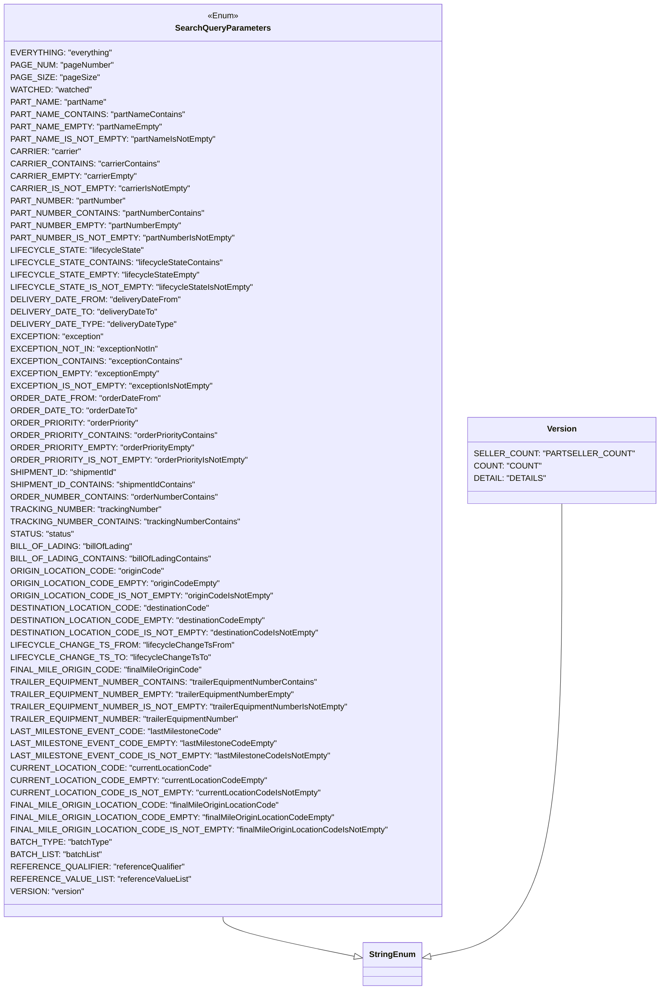

# Diagram: partview_core/partview_service/partview_service/api/search/search_package_container_query_parameters.py

> Auto-generated by Obscura crawlers

## Mermaid

> SVG rendering failed for this diagram.
