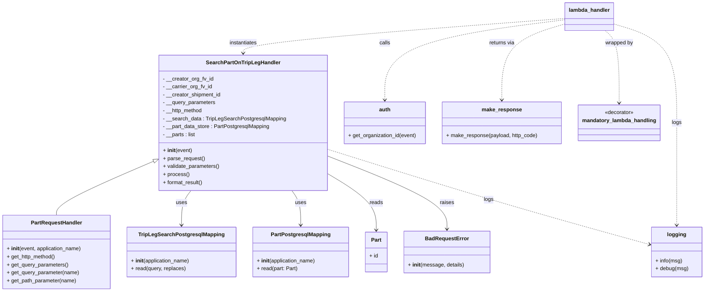
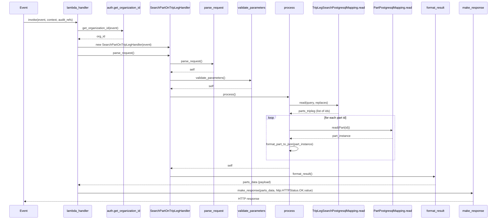

# Diagram: partview_core/partview_service/partview_service/api/search/search_part_on_trip_leg_handler.py

> Auto-generated by Obscura crawlers

## Diagram 1

### SVG

<svg id="container" width="2101.876953125" xmlns="http://www.w3.org/2000/svg" class="classDiagram" height="878" viewBox="0 0 2101.876953125 878" role="graphics-document document" aria-roledescription="class"><g><defs><marker id="container_class-aggregationStart" class="marker aggregation class" refX="18" refY="7" markerWidth="190" markerHeight="240" orient="auto"><path d="M 18,7 L9,13 L1,7 L9,1 Z"></path></marker></defs><defs><marker id="container_class-aggregationEnd" class="marker aggregation class" refX="1" refY="7" markerWidth="20" markerHeight="28" orient="auto"><path d="M 18,7 L9,13 L1,7 L9,1 Z"></path></marker></defs><defs><marker id="container_class-extensionStart" class="marker extension class" refX="18" refY="7" markerWidth="190" markerHeight="240" orient="auto"><path d="M 1,7 L18,13 V 1 Z"></path></marker></defs><defs><marker id="container_class-extensionEnd" class="marker extension class" refX="1" refY="7" markerWidth="20" markerHeight="28" orient="auto"><path d="M 1,1 V 13 L18,7 Z"></path></marker></defs><defs><marker id="container_class-compositionStart" class="marker composition class" refX="18" refY="7" markerWidth="190" markerHeight="240" orient="auto"><path d="M 18,7 L9,13 L1,7 L9,1 Z"></path></marker></defs><defs><marker id="container_class-compositionEnd" class="marker composition class" refX="1" refY="7" markerWidth="20" markerHeight="28" orient="auto"><path d="M 18,7 L9,13 L1,7 L9,1 Z"></path></marker></defs><defs><marker id="container_class-dependencyStart" class="marker dependency class" refX="6" refY="7" markerWidth="190" markerHeight="240" orient="auto"><path d="M 5,7 L9,13 L1,7 L9,1 Z"></path></marker></defs><defs><marker id="container_class-dependencyEnd" class="marker dependency class" refX="13" refY="7" markerWidth="20" markerHeight="28" orient="auto"><path d="M 18,7 L9,13 L14,7 L9,1 Z"></path></marker></defs><defs><marker id="container_class-lollipopStart" class="marker lollipop class" refX="13" refY="7" markerWidth="190" markerHeight="240" orient="auto"><circle stroke="black" fill="transparent" cx="7" cy="7" r="6"></circle></marker></defs><defs><marker id="container_class-lollipopEnd" class="marker lollipop class" refX="1" refY="7" markerWidth="190" markerHeight="240" orient="auto"><circle stroke="black" fill="transparent" cx="7" cy="7" r="6"></circle></marker></defs><g class="root"><g class="clusters"></g><g class="edgePaths"><path d="M464.717,484.008L415.648,505.174C366.578,526.339,268.44,568.669,219.37,596.001C170.301,623.333,170.301,635.667,170.301,641.833L170.301,648" id="id_SearchPartOnTripLegHandler_PartRequestHandler_1" class="edge-thickness-normal edge-pattern-solid relation" style=";;;" data-edge="true" data-et="edge" data-id="id_SearchPartOnTripLegHandler_PartRequestHandler_1" data-points="W3sieCI6NDgwLjU1NjY0MDYyNSwieSI6NDc3LjE3NjI2MDQzODg0MjF9LHsieCI6MTcwLjMwMDc4MTI1LCJ5Ijo2MTF9LHsieCI6MTcwLjMwMDc4MTI1LCJ5Ijo2NDh9XQ==" marker-start="url(#container_class-extensionStart)"></path><path d="M572.98,574L568.262,580.167C563.545,586.333,554.11,598.667,549.393,616C544.676,633.333,544.676,655.667,544.676,666.833L544.676,678" id="id_SearchPartOnTripLegHandler_TripLegSearchPostgresqlMapping_2" class="edge-thickness-normal edge-pattern-solid relation" style=";;;" data-edge="true" data-et="edge" data-id="id_SearchPartOnTripLegHandler_TripLegSearchPostgresqlMapping_2" data-points="W3sieCI6NTcyLjk3OTYxNzgwMzQyMzMsInkiOjU3NH0seyJ4Ijo1NDQuNjc1NzgxMjUsInkiOjYxMX0seyJ4Ijo1NDQuNjc1NzgxMjUsInkiOjY4NH1d" marker-end="url(#container_class-dependencyEnd)"></path><path d="M874.155,574L878.542,580.167C882.929,586.333,891.703,598.667,896.09,616C900.477,633.333,900.477,655.667,900.477,666.833L900.477,678" id="id_SearchPartOnTripLegHandler_PartPostgresqlMapping_3" class="edge-thickness-normal edge-pattern-solid relation" style=";;;" data-edge="true" data-et="edge" data-id="id_SearchPartOnTripLegHandler_PartPostgresqlMapping_3" data-points="W3sieCI6ODc0LjE1NTM4Mjg0NDkxNywieSI6NTc0fSx7IngiOjkwMC40NzY1NjI1LCJ5Ijo2MTF9LHsieCI6OTAwLjQ3NjU2MjUsInkiOjY4NH1d" marker-end="url(#container_class-dependencyEnd)"></path><path d="M977.51,520.512L1002.407,535.593C1027.305,550.675,1077.1,580.837,1101.997,609.585C1126.895,638.333,1126.895,665.667,1126.895,679.333L1126.895,693" id="id_SearchPartOnTripLegHandler_Part_4" class="edge-thickness-normal edge-pattern-solid relation" style=";;;" data-edge="true" data-et="edge" data-id="id_SearchPartOnTripLegHandler_Part_4" data-points="W3sieCI6OTc3LjUwOTc2NTYyNSwieSI6NTIwLjUxMTg2NzY1MTc1MTN9LHsieCI6MTEyNi44OTQ1MzEyNSwieSI6NjExfSx7IngiOjExMjYuODk0NTMxMjUsInkiOjY5OX1d" marker-end="url(#container_class-dependencyEnd)"></path><path d="M977.51,468.648L1037.27,492.373C1097.03,516.099,1216.55,563.549,1276.31,600.441C1336.07,637.333,1336.07,663.667,1336.07,676.833L1336.07,690" id="id_SearchPartOnTripLegHandler_BadRequestError_5" class="edge-thickness-normal edge-pattern-solid relation" style=";;;" data-edge="true" data-et="edge" data-id="id_SearchPartOnTripLegHandler_BadRequestError_5" data-points="W3sieCI6OTc3LjUwOTc2NTYyNSwieSI6NDY4LjY0Nzc2MDgwMDI0OTY3fSx7IngiOjEzMzYuMDcwMzEyNSwieSI6NjExfSx7IngiOjEzMzYuMDcwMzEyNSwieSI6Njk2fV0=" marker-end="url(#container_class-dependencyEnd)"></path><path d="M1689.127,59.319L1599.434,70.933C1509.74,82.546,1330.354,105.773,1240.66,146.053C1150.967,186.333,1150.967,243.667,1150.967,272.333L1150.967,301" id="id_lambda_handler_auth_6" class="edge-thickness-normal edge-pattern-dashed relation" style=";;;" data-edge="true" data-et="edge" data-id="id_lambda_handler_auth_6" data-points="W3sieCI6MTY4OS4xMjY5NTMxMjUsInkiOjU5LjMxOTQ2NjA1MjA1MDMyfSx7IngiOjExNTAuOTY2Nzk2ODc1LCJ5IjoxMjl9LHsieCI6MTE1MC45NjY3OTY4NzUsInkiOjMwN31d" marker-end="url(#container_class-dependencyEnd)"></path><path d="M1689.127,55.509L1529.111,67.758C1369.096,80.006,1049.064,104.503,889.049,121.918C729.033,139.333,729.033,149.667,729.033,154.833L729.033,160" id="id_lambda_handler_SearchPartOnTripLegHandler_7" class="edge-thickness-normal edge-pattern-dashed relation" style=";;;" data-edge="true" data-et="edge" data-id="id_lambda_handler_SearchPartOnTripLegHandler_7" data-points="W3sieCI6MTY4OS4xMjY5NTMxMjUsInkiOjU1LjUwOTQ1ODM4NTM3NTI3fSx7IngiOjcyOS4wMzMyMDMxMjUsInkiOjEyOX0seyJ4Ijo3MjkuMDMzMjAzMTI1LCJ5IjoxNjZ9XQ==" marker-end="url(#container_class-dependencyEnd)"></path><path d="M1689.127,72.001L1658.048,81.501C1626.968,91,1564.809,110,1533.73,148.167C1502.65,186.333,1502.65,243.667,1502.65,272.333L1502.65,301" id="id_lambda_handler_make_response_8" class="edge-thickness-normal edge-pattern-dashed relation" style=";;;" data-edge="true" data-et="edge" data-id="id_lambda_handler_make_response_8" data-points="W3sieCI6MTY4OS4xMjY5NTMxMjUsInkiOjcyLjAwMDY5NTI0MjEyNTYzfSx7IngiOjE1MDIuNjUwMzkwNjI1LCJ5IjoxMjl9LHsieCI6MTUwMi42NTAzOTA2MjUsInkiOjMwN31d" marker-end="url(#container_class-dependencyEnd)"></path><path d="M1808.528,92L1815.491,98.167C1822.454,104.333,1836.38,116.667,1843.344,153C1850.307,189.333,1850.307,249.667,1850.307,279.833L1850.307,310" id="id_lambda_handler_mandatory_lambda_handling_9" class="edge-thickness-normal edge-pattern-dashed relation" style=";;;" data-edge="true" data-et="edge" data-id="id_lambda_handler_mandatory_lambda_handling_9" data-points="W3sieCI6MTgwOC41Mjc5NjE4Mjc1MzE3LCJ5Ijo5Mn0seyJ4IjoxODUwLjMwNjY0MDYyNSwieSI6MTI5fSx7IngiOjE4NTAuMzA2NjQwNjI1LCJ5IjozMTZ9XQ==" marker-end="url(#container_class-dependencyEnd)"></path><path d="M977.51,448.744L1062.843,475.787C1148.176,502.829,1318.842,556.915,1479.166,604.896C1639.491,652.878,1789.474,694.756,1864.466,715.696L1939.457,736.635" id="id_SearchPartOnTripLegHandler_logging_10" class="edge-thickness-normal edge-pattern-dashed relation" style=";;;" data-edge="true" data-et="edge" data-id="id_SearchPartOnTripLegHandler_logging_10" data-points="W3sieCI6OTc3LjUwOTc2NTYyNSwieSI6NDQ4Ljc0NDA1MTE4MTAzMTZ9LHsieCI6MTQ4OS41MDc4MTI1LCJ5Ijo2MTF9LHsieCI6MTk0NS4yMzYzMjgxMjUsInkiOjczOC4yNDgzMTUxMjQyN31d" marker-end="url(#container_class-dependencyEnd)"></path><path d="M1833.08,72.001L1864.16,81.501C1895.239,91,1957.398,110,1988.477,159.667C2019.557,209.333,2019.557,289.667,2019.557,370C2019.557,450.333,2019.557,530.667,2019.557,582C2019.557,633.333,2019.557,655.667,2019.557,666.833L2019.557,678" id="id_lambda_handler_logging_11" class="edge-thickness-normal edge-pattern-dashed relation" style=";;;" data-edge="true" data-et="edge" data-id="id_lambda_handler_logging_11" data-points="W3sieCI6MTgzMy4wODAwNzgxMjUsInkiOjcyLjAwMDY5NTI0MjEyNTYzfSx7IngiOjIwMTkuNTU2NjQwNjI1LCJ5IjoxMjl9LHsieCI6MjAxOS41NTY2NDA2MjUsInkiOjM3MH0seyJ4IjoyMDE5LjU1NjY0MDYyNSwieSI6NjExfSx7IngiOjIwMTkuNTU2NjQwNjI1LCJ5Ijo2ODR9XQ==" marker-end="url(#container_class-dependencyEnd)"></path></g><g class="edgeLabels"><g class="edgeLabel"><g class="label" data-id="id_SearchPartOnTripLegHandler_PartRequestHandler_1" transform="translate(0, 0)"><foreignObject width="0" height="0">

</foreignObject></g></g><g class="edgeLabel" transform="translate(544.67578125, 611)"><g class="label" data-id="id_SearchPartOnTripLegHandler_TripLegSearchPostgresqlMapping_2" transform="translate(-16.4921875, -12)"><foreignObject width="32.984375" height="24">

uses

</foreignObject></g></g><g class="edgeLabel" transform="translate(900.4765625, 611)"><g class="label" data-id="id_SearchPartOnTripLegHandler_PartPostgresqlMapping_3" transform="translate(-16.4921875, -12)"><foreignObject width="32.984375" height="24">

uses

</foreignObject></g></g><g class="edgeLabel" transform="translate(1126.89453125, 611)"><g class="label" data-id="id_SearchPartOnTripLegHandler_Part_4" transform="translate(-20.0078125, -12)"><foreignObject width="40.015625" height="24">

reads

</foreignObject></g></g><g class="edgeLabel" transform="translate(1336.0703125, 611)"><g class="label" data-id="id_SearchPartOnTripLegHandler_BadRequestError_5" transform="translate(-21.25, -12)"><foreignObject width="42.5" height="24">

raises

</foreignObject></g></g><g class="edgeLabel" transform="translate(1150.966796875, 129)"><g class="label" data-id="id_lambda_handler_auth_6" transform="translate(-16.4453125, -12)"><foreignObject width="32.890625" height="24">

calls

</foreignObject></g></g><g class="edgeLabel" transform="translate(729.033203125, 129)"><g class="label" data-id="id_lambda_handler_SearchPartOnTripLegHandler_7" transform="translate(-42.9140625, -12)"><foreignObject width="85.828125" height="24">

instantiates

</foreignObject></g></g><g class="edgeLabel" transform="translate(1502.650390625, 129)"><g class="label" data-id="id_lambda_handler_make_response_8" transform="translate(-38.9296875, -12)"><foreignObject width="77.859375" height="24">

returns via

</foreignObject></g></g><g class="edgeLabel" transform="translate(1850.306640625, 129)"><g class="label" data-id="id_lambda_handler_mandatory_lambda_handling_9" transform="translate(-42.3203125, -12)"><foreignObject width="84.640625" height="24">

wrapped by

</foreignObject></g></g><g class="edgeLabel" transform="translate(1459.03498, 601.34293)"><g class="label" data-id="id_SearchPartOnTripLegHandler_logging_10" transform="translate(-14.8203125, -12)"><foreignObject width="29.640625" height="24">

logs

</foreignObject></g></g><g class="edgeLabel" transform="translate(2019.556640625, 370)"><g class="label" data-id="id_lambda_handler_logging_11" transform="translate(-14.8203125, -12)"><foreignObject width="29.640625" height="24">

logs

</foreignObject></g></g></g><g class="nodes"><g class="node default" id="classId-SearchPartOnTripLegHandler-0" transform="translate(729.033203125, 370)"><g class="basic label-container"><path d="M-248.4765625 -204 L248.4765625 -204 L248.4765625 204 L-248.4765625 204" stroke="none" stroke-width="0" fill="#ECECFF" style=""></path><path d="M-248.4765625 -204 C-102.26238279665725 -204, 43.9517969066855 -204, 248.4765625 -204 M-248.4765625 -204 C-56.85116061759845 -204, 134.7742412648031 -204, 248.4765625 -204 M248.4765625 -204 C248.4765625 -64.97246038782157, 248.4765625 74.05507922435686, 248.4765625 204 M248.4765625 -204 C248.4765625 -50.80261902031032, 248.4765625 102.39476195937937, 248.4765625 204 M248.4765625 204 C132.51511174092377 204, 16.553660981847543 204, -248.4765625 204 M248.4765625 204 C147.88042221690944 204, 47.2842819338189 204, -248.4765625 204 M-248.4765625 204 C-248.4765625 57.794577321366745, -248.4765625 -88.41084535726651, -248.4765625 -204 M-248.4765625 204 C-248.4765625 116.04425082401077, -248.4765625 28.08850164802155, -248.4765625 -204" stroke="#9370DB" stroke-width="1.3" fill="none" stroke-dasharray="0 0" style=""></path></g><g class="annotation-group text" transform="translate(0, -180)"></g><g class="label-group text" transform="translate(-106.0625, -180)"><g class="label" style="font-weight: bolder" transform="translate(0,-12)"><foreignObject width="212.125" height="24">

SearchPartOnTripLegHandler

</foreignObject></g></g><g class="members-group text" transform="translate(-236.4765625, -132)"><g class="label" style="" transform="translate(0,-12)"><foreignObject width="152.0625" height="24">

- __creator_org_fv_id

</foreignObject></g><g class="label" style="" transform="translate(0,12)"><foreignObject width="148.34375" height="24">

- __carrier_org_fv_id

</foreignObject></g><g class="label" style="" transform="translate(0,36)"><foreignObject width="176.40625" height="24">

- __creator_shipment_id

</foreignObject></g><g class="label" style="" transform="translate(0,60)"><foreignObject width="158.8125" height="24">

- __query_parameters

</foreignObject></g><g class="label" style="" transform="translate(0,84)"><foreignObject width="122.109375" height="24">

- __http_method

</foreignObject></g><g class="label" style="" transform="translate(0,108)"><foreignObject width="366.890625" height="24">

- __search_data : TripLegSearchPostgresqlMapping

</foreignObject></g><g class="label" style="" transform="translate(0,132)"><foreignObject width="322.296875" height="24">

- __part_data_store : PartPostgresqlMapping

</foreignObject></g><g class="label" style="" transform="translate(0,156)"><foreignObject width="99.421875" height="24">

- __parts : list

</foreignObject></g></g><g class="methods-group text" transform="translate(-236.4765625, 84)"><g class="label" style="" transform="translate(0,-12)"><foreignObject width="87.390625" height="24">

+ <strong>init</strong>(event)

</foreignObject></g><g class="label" style="" transform="translate(0,12)"><foreignObject width="126.046875" height="24">

+ parse_request()

</foreignObject></g><g class="label" style="" transform="translate(0,36)"><foreignObject width="170.953125" height="24">

+ validate_parameters()

</foreignObject></g><g class="label" style="" transform="translate(0,60)"><foreignObject width="77.96875" height="24">

+ process()

</foreignObject></g><g class="label" style="" transform="translate(0,84)"><foreignObject width="121.5" height="24">

+ format_result()

</foreignObject></g></g><g class="divider" style=""><path d="M-248.4765625 -156 C-99.63202123051056 -156, 49.21252003897888 -156, 248.4765625 -156 M-248.4765625 -156 C-144.5654264882054 -156, -40.65429047641081 -156, 248.4765625 -156" stroke="#9370DB" stroke-width="1.3" fill="none" stroke-dasharray="0 0" style=""></path></g><g class="divider" style=""><path d="M-248.4765625 60 C-148.81373558463468 60, -49.1509086692694 60, 248.4765625 60 M-248.4765625 60 C-141.18560955704731 60, -33.89465661409463 60, 248.4765625 60" stroke="#9370DB" stroke-width="1.3" fill="none" stroke-dasharray="0 0" style=""></path></g></g><g class="node default" id="classId-PartRequestHandler-1" transform="translate(170.30078125, 759)"><g class="basic label-container"><path d="M-162.30078125 -111 L162.30078125 -111 L162.30078125 111 L-162.30078125 111" stroke="none" stroke-width="0" fill="#ECECFF" style=""></path><path d="M-162.30078125 -111 C-62.80106011467464 -111, 36.69866102065072 -111, 162.30078125 -111 M-162.30078125 -111 C-86.28468529434345 -111, -10.268589338686894 -111, 162.30078125 -111 M162.30078125 -111 C162.30078125 -48.75538763749832, 162.30078125 13.489224725003353, 162.30078125 111 M162.30078125 -111 C162.30078125 -45.84999969255291, 162.30078125 19.300000614894174, 162.30078125 111 M162.30078125 111 C63.01142002681081 111, -36.27794119637838 111, -162.30078125 111 M162.30078125 111 C54.432796735542226 111, -53.43518777891555 111, -162.30078125 111 M-162.30078125 111 C-162.30078125 59.58702940411667, -162.30078125 8.17405880823334, -162.30078125 -111 M-162.30078125 111 C-162.30078125 60.05071295431965, -162.30078125 9.1014259086393, -162.30078125 -111" stroke="#9370DB" stroke-width="1.3" fill="none" stroke-dasharray="0 0" style=""></path></g><g class="annotation-group text" transform="translate(0, -87)"></g><g class="label-group text" transform="translate(-74.1328125, -87)"><g class="label" style="font-weight: bolder" transform="translate(0,-12)"><foreignObject width="148.265625" height="24">

PartRequestHandler

</foreignObject></g></g><g class="members-group text" transform="translate(-150.30078125, -39)"></g><g class="methods-group text" transform="translate(-150.30078125, -9)"><g class="label" style="" transform="translate(0,-12)"><foreignObject width="226.46875" height="24">

+ <strong>init</strong>(event, application_name)

</foreignObject></g><g class="label" style="" transform="translate(0,12)"><foreignObject width="148.40625" height="24">

+ get_http_method()

</foreignObject></g><g class="label" style="" transform="translate(0,36)"><foreignObject width="185.109375" height="24">

+ get_query_parameters()

</foreignObject></g><g class="label" style="" transform="translate(0,60)"><foreignObject width="218.390625" height="24">

+ get_query_parameter(name)

</foreignObject></g><g class="label" style="" transform="translate(0,84)"><foreignObject width="210.75" height="24">

+ get_path_parameter(name)

</foreignObject></g></g><g class="divider" style=""><path d="M-162.30078125 -63 C-36.87705666948551 -63, 88.54666791102898 -63, 162.30078125 -63 M-162.30078125 -63 C-35.084302619287016 -63, 92.13217601142597 -63, 162.30078125 -63" stroke="#9370DB" stroke-width="1.3" fill="none" stroke-dasharray="0 0" style=""></path></g><g class="divider" style=""><path d="M-162.30078125 -39 C-97.1022198468314 -39, -31.903658443662806 -39, 162.30078125 -39 M-162.30078125 -39 C-55.89724585233249 -39, 50.50628954533502 -39, 162.30078125 -39" stroke="#9370DB" stroke-width="1.3" fill="none" stroke-dasharray="0 0" style=""></path></g></g><g class="node default" id="classId-TripLegSearchPostgresqlMapping-2" transform="translate(544.67578125, 759)"><g class="basic label-container"><path d="M-162.07421875 -75 L162.07421875 -75 L162.07421875 75 L-162.07421875 75" stroke="none" stroke-width="0" fill="#ECECFF" style=""></path><path d="M-162.07421875 -75 C-77.76131950298266 -75, 6.551579744034683 -75, 162.07421875 -75 M-162.07421875 -75 C-78.85602346954495 -75, 4.362171810910098 -75, 162.07421875 -75 M162.07421875 -75 C162.07421875 -26.323213931981392, 162.07421875 22.353572136037215, 162.07421875 75 M162.07421875 -75 C162.07421875 -44.588105583435954, 162.07421875 -14.176211166871909, 162.07421875 75 M162.07421875 75 C61.91853131454475 75, -38.2371561209105 75, -162.07421875 75 M162.07421875 75 C59.81796787102668 75, -42.43828300794664 75, -162.07421875 75 M-162.07421875 75 C-162.07421875 24.718786564801967, -162.07421875 -25.562426870396067, -162.07421875 -75 M-162.07421875 75 C-162.07421875 22.34069010439623, -162.07421875 -30.31861979120754, -162.07421875 -75" stroke="#9370DB" stroke-width="1.3" fill="none" stroke-dasharray="0 0" style=""></path></g><g class="annotation-group text" transform="translate(0, -51)"></g><g class="label-group text" transform="translate(-122.1640625, -51)"><g class="label" style="font-weight: bolder" transform="translate(0,-12)"><foreignObject width="244.328125" height="24">

TripLegSearchPostgresqlMapping

</foreignObject></g></g><g class="members-group text" transform="translate(-150.07421875, -3)"></g><g class="methods-group text" transform="translate(-150.07421875, 27)"><g class="label" style="" transform="translate(0,-12)"><foreignObject width="177.984375" height="24">

+ <strong>init</strong>(application_name)

</foreignObject></g><g class="label" style="" transform="translate(0,12)"><foreignObject width="164.96875" height="24">

+ read(query, replaces)

</foreignObject></g></g><g class="divider" style=""><path d="M-162.07421875 -27 C-40.923169638651714 -27, 80.22787947269657 -27, 162.07421875 -27 M-162.07421875 -27 C-65.03820629340187 -27, 31.99780616319626 -27, 162.07421875 -27" stroke="#9370DB" stroke-width="1.3" fill="none" stroke-dasharray="0 0" style=""></path></g><g class="divider" style=""><path d="M-162.07421875 -3 C-44.165492013707805 -3, 73.74323472258439 -3, 162.07421875 -3 M-162.07421875 -3 C-57.71879187437507 -3, 46.63663500124986 -3, 162.07421875 -3" stroke="#9370DB" stroke-width="1.3" fill="none" stroke-dasharray="0 0" style=""></path></g></g><g class="node default" id="classId-PartPostgresqlMapping-3" transform="translate(900.4765625, 759)"><g class="basic label-container"><path d="M-143.7265625 -75 L143.7265625 -75 L143.7265625 75 L-143.7265625 75" stroke="none" stroke-width="0" fill="#ECECFF" style=""></path><path d="M-143.7265625 -75 C-49.906159850314765 -75, 43.91424279937047 -75, 143.7265625 -75 M-143.7265625 -75 C-73.78669368852962 -75, -3.846824877059248 -75, 143.7265625 -75 M143.7265625 -75 C143.7265625 -19.100486600719655, 143.7265625 36.79902679856069, 143.7265625 75 M143.7265625 -75 C143.7265625 -32.747709158588236, 143.7265625 9.504581682823527, 143.7265625 75 M143.7265625 75 C83.76909938832989 75, 23.81163627665977 75, -143.7265625 75 M143.7265625 75 C37.59343630879847 75, -68.53968988240305 75, -143.7265625 75 M-143.7265625 75 C-143.7265625 43.123406201600034, -143.7265625 11.24681240320006, -143.7265625 -75 M-143.7265625 75 C-143.7265625 28.64174851294046, -143.7265625 -17.71650297411908, -143.7265625 -75" stroke="#9370DB" stroke-width="1.3" fill="none" stroke-dasharray="0 0" style=""></path></g><g class="annotation-group text" transform="translate(0, -51)"></g><g class="label-group text" transform="translate(-85.46875, -51)"><g class="label" style="font-weight: bolder" transform="translate(0,-12)"><foreignObject width="170.9375" height="24">

PartPostgresqlMapping

</foreignObject></g></g><g class="members-group text" transform="translate(-131.7265625, -3)"></g><g class="methods-group text" transform="translate(-131.7265625, 27)"><g class="label" style="" transform="translate(0,-12)"><foreignObject width="177.984375" height="24">

+ <strong>init</strong>(application_name)

</foreignObject></g><g class="label" style="" transform="translate(0,12)"><foreignObject width="122.34375" height="24">

+ read(part: Part)

</foreignObject></g></g><g class="divider" style=""><path d="M-143.7265625 -27 C-33.09732543746307 -27, 77.53191162507386 -27, 143.7265625 -27 M-143.7265625 -27 C-72.79596626983674 -27, -1.8653700396734791 -27, 143.7265625 -27" stroke="#9370DB" stroke-width="1.3" fill="none" stroke-dasharray="0 0" style=""></path></g><g class="divider" style=""><path d="M-143.7265625 -3 C-28.897778343843157 -3, 85.93100581231369 -3, 143.7265625 -3 M-143.7265625 -3 C-43.475489390594376 -3, 56.77558371881125 -3, 143.7265625 -3" stroke="#9370DB" stroke-width="1.3" fill="none" stroke-dasharray="0 0" style=""></path></g></g><g class="node default" id="classId-Part-4" transform="translate(1126.89453125, 759)"><g class="basic label-container"><path d="M-32.69140625 -60 L32.69140625 -60 L32.69140625 60 L-32.69140625 60" stroke="none" stroke-width="0" fill="#ECECFF" style=""></path><path d="M-32.69140625 -60 C-9.983603378822586 -60, 12.724199492354828 -60, 32.69140625 -60 M-32.69140625 -60 C-16.357583674750177 -60, -0.023761099500354987 -60, 32.69140625 -60 M32.69140625 -60 C32.69140625 -32.81946239448413, 32.69140625 -5.638924788968254, 32.69140625 60 M32.69140625 -60 C32.69140625 -13.730614993543007, 32.69140625 32.538770012913986, 32.69140625 60 M32.69140625 60 C8.95043692560009 60, -14.790532398799819 60, -32.69140625 60 M32.69140625 60 C17.37332954375028 60, 2.0552528375005608 60, -32.69140625 60 M-32.69140625 60 C-32.69140625 26.21736599945342, -32.69140625 -7.565268001093159, -32.69140625 -60 M-32.69140625 60 C-32.69140625 21.586021948642305, -32.69140625 -16.82795610271539, -32.69140625 -60" stroke="#9370DB" stroke-width="1.3" fill="none" stroke-dasharray="0 0" style=""></path></g><g class="annotation-group text" transform="translate(0, -36)"></g><g class="label-group text" transform="translate(-15.0703125, -36)"><g class="label" style="font-weight: bolder" transform="translate(0,-12)"><foreignObject width="30.140625" height="24">

Part

</foreignObject></g></g><g class="members-group text" transform="translate(-20.69140625, 12)"><g class="label" style="" transform="translate(0,-12)"><foreignObject width="26.3125" height="24">

+ id

</foreignObject></g></g><g class="methods-group text" transform="translate(-20.69140625, 60)"></g><g class="divider" style=""><path d="M-32.69140625 -12 C-10.215026720257693 -12, 12.261352809484613 -12, 32.69140625 -12 M-32.69140625 -12 C-9.259781313693061 -12, 14.171843622613878 -12, 32.69140625 -12" stroke="#9370DB" stroke-width="1.3" fill="none" stroke-dasharray="0 0" style=""></path></g><g class="divider" style=""><path d="M-32.69140625 36 C-12.01149909421283 36, 8.66840806157434 36, 32.69140625 36 M-32.69140625 36 C-19.25219061550237 36, -5.812974981004739 36, 32.69140625 36" stroke="#9370DB" stroke-width="1.3" fill="none" stroke-dasharray="0 0" style=""></path></g></g><g class="node default" id="classId-BadRequestError-5" transform="translate(1336.0703125, 759)"><g class="basic label-container"><path d="M-126.484375 -63 L126.484375 -63 L126.484375 63 L-126.484375 63" stroke="none" stroke-width="0" fill="#ECECFF" style=""></path><path d="M-126.484375 -63 C-68.56090212693657 -63, -10.637429253873137 -63, 126.484375 -63 M-126.484375 -63 C-57.60477327340037 -63, 11.274828453199262 -63, 126.484375 -63 M126.484375 -63 C126.484375 -36.85642646966919, 126.484375 -10.712852939338369, 126.484375 63 M126.484375 -63 C126.484375 -31.249443688167368, 126.484375 0.5011126236652643, 126.484375 63 M126.484375 63 C29.017707436763246 63, -68.44896012647351 63, -126.484375 63 M126.484375 63 C43.57984949069983 63, -39.32467601860034 63, -126.484375 63 M-126.484375 63 C-126.484375 33.16986668290778, -126.484375 3.339733365815569, -126.484375 -63 M-126.484375 63 C-126.484375 24.071956150262608, -126.484375 -14.856087699474784, -126.484375 -63" stroke="#9370DB" stroke-width="1.3" fill="none" stroke-dasharray="0 0" style=""></path></g><g class="annotation-group text" transform="translate(0, -39)"></g><g class="label-group text" transform="translate(-62.28125, -39)"><g class="label" style="font-weight: bolder" transform="translate(0,-12)"><foreignObject width="124.5625" height="24">

BadRequestError

</foreignObject></g></g><g class="members-group text" transform="translate(-114.484375, 9)"></g><g class="methods-group text" transform="translate(-114.484375, 39)"><g class="label" style="" transform="translate(0,-12)"><foreignObject width="166.6875" height="24">

+ <strong>init</strong>(message, details)

</foreignObject></g></g><g class="divider" style=""><path d="M-126.484375 -15 C-55.064999866064696 -15, 16.35437526787061 -15, 126.484375 -15 M-126.484375 -15 C-69.59652421982791 -15, -12.708673439655826 -15, 126.484375 -15" stroke="#9370DB" stroke-width="1.3" fill="none" stroke-dasharray="0 0" style=""></path></g><g class="divider" style=""><path d="M-126.484375 9 C-74.8285154305542 9, -23.172655861108424 9, 126.484375 9 M-126.484375 9 C-47.496990902530385 9, 31.49039319493923 9, 126.484375 9" stroke="#9370DB" stroke-width="1.3" fill="none" stroke-dasharray="0 0" style=""></path></g></g><g class="node default" id="classId-auth-6" transform="translate(1150.966796875, 370)"><g class="basic label-container"><path d="M-123.45703125 -63 L123.45703125 -63 L123.45703125 63 L-123.45703125 63" stroke="none" stroke-width="0" fill="#ECECFF" style=""></path><path d="M-123.45703125 -63 C-50.63591462709198 -63, 22.185201995816044 -63, 123.45703125 -63 M-123.45703125 -63 C-44.26269269328813 -63, 34.93164586342374 -63, 123.45703125 -63 M123.45703125 -63 C123.45703125 -26.695965546173632, 123.45703125 9.608068907652736, 123.45703125 63 M123.45703125 -63 C123.45703125 -32.66580269542653, 123.45703125 -2.3316053908530563, 123.45703125 63 M123.45703125 63 C40.85776996668366 63, -41.741491316632676 63, -123.45703125 63 M123.45703125 63 C63.621156742763766 63, 3.785282235527532 63, -123.45703125 63 M-123.45703125 63 C-123.45703125 17.453713082091554, -123.45703125 -28.092573835816893, -123.45703125 -63 M-123.45703125 63 C-123.45703125 29.033589660881354, -123.45703125 -4.932820678237292, -123.45703125 -63" stroke="#9370DB" stroke-width="1.3" fill="none" stroke-dasharray="0 0" style=""></path></g><g class="annotation-group text" transform="translate(0, -39)"></g><g class="label-group text" transform="translate(-16.6640625, -39)"><g class="label" style="font-weight: bolder" transform="translate(0,-12)"><foreignObject width="33.328125" height="24">

auth

</foreignObject></g></g><g class="members-group text" transform="translate(-111.45703125, 9)"></g><g class="methods-group text" transform="translate(-111.45703125, 39)"><g class="label" style="" transform="translate(0,-12)"><foreignObject width="206.25" height="24">

+ get_organization_id(event)

</foreignObject></g></g><g class="divider" style=""><path d="M-123.45703125 -15 C-62.40601192805067 -15, -1.3549926061013338 -15, 123.45703125 -15 M-123.45703125 -15 C-62.44305593033368 -15, -1.4290806106673557 -15, 123.45703125 -15" stroke="#9370DB" stroke-width="1.3" fill="none" stroke-dasharray="0 0" style=""></path></g><g class="divider" style=""><path d="M-123.45703125 9 C-40.67432044231833 9, 42.108390365363334 9, 123.45703125 9 M-123.45703125 9 C-61.80718979963929 9, -0.15734834927857833 9, 123.45703125 9" stroke="#9370DB" stroke-width="1.3" fill="none" stroke-dasharray="0 0" style=""></path></g></g><g class="node default" id="classId-make_response-7" transform="translate(1502.650390625, 370)"><g class="basic label-container"><path d="M-178.2265625 -63 L178.2265625 -63 L178.2265625 63 L-178.2265625 63" stroke="none" stroke-width="0" fill="#ECECFF" style=""></path><path d="M-178.2265625 -63 C-43.626259207024475 -63, 90.97404408595105 -63, 178.2265625 -63 M-178.2265625 -63 C-65.96182660512977 -63, 46.302909289740455 -63, 178.2265625 -63 M178.2265625 -63 C178.2265625 -37.395421092000646, 178.2265625 -11.790842184001285, 178.2265625 63 M178.2265625 -63 C178.2265625 -25.697267988762434, 178.2265625 11.605464022475132, 178.2265625 63 M178.2265625 63 C35.98170054419006 63, -106.26316141161988 63, -178.2265625 63 M178.2265625 63 C102.77424713691533 63, 27.32193177383067 63, -178.2265625 63 M-178.2265625 63 C-178.2265625 17.003218198862214, -178.2265625 -28.99356360227557, -178.2265625 -63 M-178.2265625 63 C-178.2265625 19.98973598665163, -178.2265625 -23.020528026696738, -178.2265625 -63" stroke="#9370DB" stroke-width="1.3" fill="none" stroke-dasharray="0 0" style=""></path></g><g class="annotation-group text" transform="translate(0, -39)"></g><g class="label-group text" transform="translate(-57.46875, -39)"><g class="label" style="font-weight: bolder" transform="translate(0,-12)"><foreignObject width="114.9375" height="24">

make_response

</foreignObject></g></g><g class="members-group text" transform="translate(-166.2265625, 9)"></g><g class="methods-group text" transform="translate(-166.2265625, 39)"><g class="label" style="" transform="translate(0,-12)"><foreignObject width="274.984375" height="24">

+ make_response(payload, http_code)

</foreignObject></g></g><g class="divider" style=""><path d="M-178.2265625 -15 C-93.23231956172141 -15, -8.238076623442822 -15, 178.2265625 -15 M-178.2265625 -15 C-44.79601241243256 -15, 88.63453767513488 -15, 178.2265625 -15" stroke="#9370DB" stroke-width="1.3" fill="none" stroke-dasharray="0 0" style=""></path></g><g class="divider" style=""><path d="M-178.2265625 9 C-84.7968192691308 9, 8.632923961738413 9, 178.2265625 9 M-178.2265625 9 C-80.45036667962361 9, 17.325829140752774 9, 178.2265625 9" stroke="#9370DB" stroke-width="1.3" fill="none" stroke-dasharray="0 0" style=""></path></g></g><g class="node default" id="classId-mandatory_lambda_handling-8" transform="translate(1850.306640625, 370)"><g class="basic label-container"><path d="M-119.4296875 -54 L119.4296875 -54 L119.4296875 54 L-119.4296875 54" stroke="none" stroke-width="0" fill="#ECECFF" style=""></path><path d="M-119.4296875 -54 C-40.48012841562324 -54, 38.46943066875352 -54, 119.4296875 -54 M-119.4296875 -54 C-42.71044466128323 -54, 34.00879817743353 -54, 119.4296875 -54 M119.4296875 -54 C119.4296875 -31.60569787024115, 119.4296875 -9.211395740482303, 119.4296875 54 M119.4296875 -54 C119.4296875 -30.256485398828236, 119.4296875 -6.512970797656472, 119.4296875 54 M119.4296875 54 C64.33784814217907 54, 9.246008784358153 54, -119.4296875 54 M119.4296875 54 C61.2112640161626 54, 2.9928405323252036 54, -119.4296875 54 M-119.4296875 54 C-119.4296875 27.901154547132695, -119.4296875 1.8023090942653894, -119.4296875 -54 M-119.4296875 54 C-119.4296875 20.918902125119153, -119.4296875 -12.162195749761693, -119.4296875 -54" stroke="#9370DB" stroke-width="1.3" fill="none" stroke-dasharray="0 0" style=""></path></g><g class="annotation-group text" transform="translate(-44.0625, -30)"><g class="label" style="" transform="translate(0,-12)"><foreignObject width="88.125" height="24">

«decorator»

</foreignObject></g></g><g class="label-group text" transform="translate(-107.4296875, -6)"><g class="label" style="font-weight: bolder" transform="translate(0,-12)"><foreignObject width="214.859375" height="24">

mandatory_lambda_handling

</foreignObject></g></g><g class="members-group text" transform="translate(-107.4296875, 42)"></g><g class="methods-group text" transform="translate(-107.4296875, 72)"></g><g class="divider" style=""><path d="M-119.4296875 18 C-24.857138397233214 18, 69.71541070553357 18, 119.4296875 18 M-119.4296875 18 C-65.50335653245656 18, -11.577025564913129 18, 119.4296875 18" stroke="#9370DB" stroke-width="1.3" fill="none" stroke-dasharray="0 0" style=""></path></g><g class="divider" style=""><path d="M-119.4296875 36 C-47.17263431788649 36, 25.08441886422702 36, 119.4296875 36 M-119.4296875 36 C-28.589970434289 36, 62.249746631422 36, 119.4296875 36" stroke="#9370DB" stroke-width="1.3" fill="none" stroke-dasharray="0 0" style=""></path></g></g><g class="node default" id="classId-logging-9" transform="translate(2019.556640625, 759)"><g class="basic label-container"><path d="M-74.3203125 -75 L74.3203125 -75 L74.3203125 75 L-74.3203125 75" stroke="none" stroke-width="0" fill="#ECECFF" style=""></path><path d="M-74.3203125 -75 C-20.734217217810105 -75, 32.85187806437979 -75, 74.3203125 -75 M-74.3203125 -75 C-37.92484559714628 -75, -1.5293786942925607 -75, 74.3203125 -75 M74.3203125 -75 C74.3203125 -34.641101866560625, 74.3203125 5.71779626687875, 74.3203125 75 M74.3203125 -75 C74.3203125 -21.403475866343378, 74.3203125 32.193048267313245, 74.3203125 75 M74.3203125 75 C33.76540011627988 75, -6.789512267440244 75, -74.3203125 75 M74.3203125 75 C34.72223199413961 75, -4.8758485117207755 75, -74.3203125 75 M-74.3203125 75 C-74.3203125 33.327581702514195, -74.3203125 -8.34483659497161, -74.3203125 -75 M-74.3203125 75 C-74.3203125 16.06539901742169, -74.3203125 -42.86920196515662, -74.3203125 -75" stroke="#9370DB" stroke-width="1.3" fill="none" stroke-dasharray="0 0" style=""></path></g><g class="annotation-group text" transform="translate(0, -51)"></g><g class="label-group text" transform="translate(-27.109375, -51)"><g class="label" style="font-weight: bolder" transform="translate(0,-12)"><foreignObject width="54.21875" height="24">

logging

</foreignObject></g></g><g class="members-group text" transform="translate(-62.3203125, -3)"></g><g class="methods-group text" transform="translate(-62.3203125, 27)"><g class="label" style="" transform="translate(0,-12)"><foreignObject width="80.53125" height="24">

+ info(msg)

</foreignObject></g><g class="label" style="" transform="translate(0,12)"><foreignObject width="97.53125" height="24">

+ debug(msg)

</foreignObject></g></g><g class="divider" style=""><path d="M-74.3203125 -27 C-20.55524842562339 -27, 33.20981564875322 -27, 74.3203125 -27 M-74.3203125 -27 C-22.483354786515243 -27, 29.353602926969515 -27, 74.3203125 -27" stroke="#9370DB" stroke-width="1.3" fill="none" stroke-dasharray="0 0" style=""></path></g><g class="divider" style=""><path d="M-74.3203125 -3 C-42.584444598192505 -3, -10.848576696385003 -3, 74.3203125 -3 M-74.3203125 -3 C-27.973755358188328 -3, 18.372801783623345 -3, 74.3203125 -3" stroke="#9370DB" stroke-width="1.3" fill="none" stroke-dasharray="0 0" style=""></path></g></g><g class="node default" id="classId-lambda_handler-10" transform="translate(1761.103515625, 50)"><g class="basic label-container"><path d="M-71.9765625 -42 L71.9765625 -42 L71.9765625 42 L-71.9765625 42" stroke="none" stroke-width="0" fill="#ECECFF" style=""></path><path d="M-71.9765625 -42 C-35.595292323361164 -42, 0.7859778532776716 -42, 71.9765625 -42 M-71.9765625 -42 C-16.56686182175376 -42, 38.84283885649248 -42, 71.9765625 -42 M71.9765625 -42 C71.9765625 -25.173123573933392, 71.9765625 -8.346247147866784, 71.9765625 42 M71.9765625 -42 C71.9765625 -21.068762228531693, 71.9765625 -0.13752445706338534, 71.9765625 42 M71.9765625 42 C21.660479391331776 42, -28.655603717336447 42, -71.9765625 42 M71.9765625 42 C32.47753725360342 42, -7.021487992793155 42, -71.9765625 42 M-71.9765625 42 C-71.9765625 11.917520550613933, -71.9765625 -18.164958898772134, -71.9765625 -42 M-71.9765625 42 C-71.9765625 22.760151737317436, -71.9765625 3.520303474634872, -71.9765625 -42" stroke="#9370DB" stroke-width="1.3" fill="none" stroke-dasharray="0 0" style=""></path></g><g class="annotation-group text" transform="translate(0, -18)"></g><g class="label-group text" transform="translate(-59.9765625, -18)"><g class="label" style="font-weight: bolder" transform="translate(0,-12)"><foreignObject width="119.953125" height="24">

lambda_handler

</foreignObject></g></g><g class="members-group text" transform="translate(-59.9765625, 30)"></g><g class="methods-group text" transform="translate(-59.9765625, 60)"></g><g class="divider" style=""><path d="M-71.9765625 6 C-43.18115992773369 6, -14.385757355467376 6, 71.9765625 6 M-71.9765625 6 C-23.490881948233543 6, 24.994798603532914 6, 71.9765625 6" stroke="#9370DB" stroke-width="1.3" fill="none" stroke-dasharray="0 0" style=""></path></g><g class="divider" style=""><path d="M-71.9765625 24 C-32.38584980355733 24, 7.204862892885345 24, 71.9765625 24 M-71.9765625 24 C-14.763639134683046 24, 42.44928423063391 24, 71.9765625 24" stroke="#9370DB" stroke-width="1.3" fill="none" stroke-dasharray="0 0" style=""></path></g></g></g></g></g></svg>

## Diagram 2

### SVG

<svg id="container" width="2768" xmlns="http://www.w3.org/2000/svg" height="1246" viewBox="-50 -10 2768 1246" role="graphics-document document" aria-roledescription="sequence"><g><rect x="2518" y="1160" fill="#eaeaea" stroke="#666" width="150" height="65" name="Responder" rx="3" ry="3" class="actor actor-bottom"></rect><text x="2593" y="1192.5" dominant-baseline="central" alignment-baseline="central" class="actor actor-box" style="text-anchor: middle; font-size: 16px; font-weight: 400;"><tspan x="2593" dy="0">make_response</tspan></text></g><g><rect x="2318" y="1160" fill="#eaeaea" stroke="#666" width="150" height="65" name="Formatter" rx="3" ry="3" class="actor actor-bottom"></rect><text x="2393" y="1192.5" dominant-baseline="central" alignment-baseline="central" class="actor actor-box" style="text-anchor: middle; font-size: 16px; font-weight: 400;"><tspan x="2393" dy="0">format_result</tspan></text></g><g><rect x="2045" y="1160" fill="#eaeaea" stroke="#666" width="223" height="65" name="PartDB" rx="3" ry="3" class="actor actor-bottom"></rect><text x="2156.5" y="1192.5" dominant-baseline="central" alignment-baseline="central" class="actor actor-box" style="text-anchor: middle; font-size: 16px; font-weight: 400;"><tspan x="2156.5" dy="0">PartPostgresqlMapping.read</tspan></text></g><g><rect x="1699" y="1160" fill="#eaeaea" stroke="#666" width="296" height="65" name="SearchDB" rx="3" ry="3" class="actor actor-bottom"></rect><text x="1847" y="1192.5" dominant-baseline="central" alignment-baseline="central" class="actor actor-box" style="text-anchor: middle; font-size: 16px; font-weight: 400;"><tspan x="1847" dy="0">TripLegSearchPostgresqlMapping.read</tspan></text></g><g><rect x="1499" y="1160" fill="#eaeaea" stroke="#666" width="150" height="65" name="Processor" rx="3" ry="3" class="actor actor-bottom"></rect><text x="1574" y="1192.5" dominant-baseline="central" alignment-baseline="central" class="actor actor-box" style="text-anchor: middle; font-size: 16px; font-weight: 400;"><tspan x="1574" dy="0">process</tspan></text></g><g><rect x="1281" y="1160" fill="#eaeaea" stroke="#666" width="168" height="65" name="Validator" rx="3" ry="3" class="actor actor-bottom"></rect><text x="1365" y="1192.5" dominant-baseline="central" alignment-baseline="central" class="actor actor-box" style="text-anchor: middle; font-size: 16px; font-weight: 400;"><tspan x="1365" dy="0">validate_parameters</tspan></text></g><g><rect x="1081" y="1160" fill="#eaeaea" stroke="#666" width="150" height="65" name="Parser" rx="3" ry="3" class="actor actor-bottom"></rect><text x="1156" y="1192.5" dominant-baseline="central" alignment-baseline="central" class="actor actor-box" style="text-anchor: middle; font-size: 16px; font-weight: 400;"><tspan x="1156" dy="0">parse_request</tspan></text></g><g><rect x="801" y="1160" fill="#eaeaea" stroke="#666" width="230" height="65" name="Handler" rx="3" ry="3" class="actor actor-bottom"></rect><text x="916" y="1192.5" dominant-baseline="central" alignment-baseline="central" class="actor actor-box" style="text-anchor: middle; font-size: 16px; font-weight: 400;"><tspan x="916" dy="0">SearchPartOnTripLegHandler</tspan></text></g><g><rect x="551" y="1160" fill="#eaeaea" stroke="#666" width="200" height="65" name="Auth" rx="3" ry="3" class="actor actor-bottom"></rect><text x="651" y="1192.5" dominant-baseline="central" alignment-baseline="central" class="actor actor-box" style="text-anchor: middle; font-size: 16px; font-weight: 400;"><tspan x="651" dy="0">auth.get_organization_id</tspan></text></g><g><rect x="312" y="1160" fill="#eaeaea" stroke="#666" width="150" height="65" name="Lambda" rx="3" ry="3" class="actor actor-bottom"></rect><text x="387" y="1192.5" dominant-baseline="central" alignment-baseline="central" class="actor actor-box" style="text-anchor: middle; font-size: 16px; font-weight: 400;"><tspan x="387" dy="0">lambda_handler</tspan></text></g><g><rect x="0" y="1160" fill="#eaeaea" stroke="#666" width="150" height="65" name="Client" rx="3" ry="3" class="actor actor-bottom"></rect><text x="75" y="1192.5" dominant-baseline="central" alignment-baseline="central" class="actor actor-box" style="text-anchor: middle; font-size: 16px; font-weight: 400;"><tspan x="75" dy="0">Event</tspan></text></g><g><line id="actor10" x1="2593" y1="65" x2="2593" y2="1160" class="actor-line 200" stroke-width="0.5px" stroke="#999" name="Responder"></line><g id="root-10"><rect x="2518" y="0" fill="#eaeaea" stroke="#666" width="150" height="65" name="Responder" rx="3" ry="3" class="actor actor-top"></rect><text x="2593" y="32.5" dominant-baseline="central" alignment-baseline="central" class="actor actor-box" style="text-anchor: middle; font-size: 16px; font-weight: 400;"><tspan x="2593" dy="0">make_response</tspan></text></g></g><g><line id="actor9" x1="2393" y1="65" x2="2393" y2="1160" class="actor-line 200" stroke-width="0.5px" stroke="#999" name="Formatter"></line><g id="root-9"><rect x="2318" y="0" fill="#eaeaea" stroke="#666" width="150" height="65" name="Formatter" rx="3" ry="3" class="actor actor-top"></rect><text x="2393" y="32.5" dominant-baseline="central" alignment-baseline="central" class="actor actor-box" style="text-anchor: middle; font-size: 16px; font-weight: 400;"><tspan x="2393" dy="0">format_result</tspan></text></g></g><g><line id="actor8" x1="2156.5" y1="65" x2="2156.5" y2="1160" class="actor-line 200" stroke-width="0.5px" stroke="#999" name="PartDB"></line><g id="root-8"><rect x="2045" y="0" fill="#eaeaea" stroke="#666" width="223" height="65" name="PartDB" rx="3" ry="3" class="actor actor-top"></rect><text x="2156.5" y="32.5" dominant-baseline="central" alignment-baseline="central" class="actor actor-box" style="text-anchor: middle; font-size: 16px; font-weight: 400;"><tspan x="2156.5" dy="0">PartPostgresqlMapping.read</tspan></text></g></g><g><line id="actor7" x1="1847" y1="65" x2="1847" y2="1160" class="actor-line 200" stroke-width="0.5px" stroke="#999" name="SearchDB"></line><g id="root-7"><rect x="1699" y="0" fill="#eaeaea" stroke="#666" width="296" height="65" name="SearchDB" rx="3" ry="3" class="actor actor-top"></rect><text x="1847" y="32.5" dominant-baseline="central" alignment-baseline="central" class="actor actor-box" style="text-anchor: middle; font-size: 16px; font-weight: 400;"><tspan x="1847" dy="0">TripLegSearchPostgresqlMapping.read</tspan></text></g></g><g><line id="actor6" x1="1574" y1="65" x2="1574" y2="1160" class="actor-line 200" stroke-width="0.5px" stroke="#999" name="Processor"></line><g id="root-6"><rect x="1499" y="0" fill="#eaeaea" stroke="#666" width="150" height="65" name="Processor" rx="3" ry="3" class="actor actor-top"></rect><text x="1574" y="32.5" dominant-baseline="central" alignment-baseline="central" class="actor actor-box" style="text-anchor: middle; font-size: 16px; font-weight: 400;"><tspan x="1574" dy="0">process</tspan></text></g></g><g><line id="actor5" x1="1365" y1="65" x2="1365" y2="1160" class="actor-line 200" stroke-width="0.5px" stroke="#999" name="Validator"></line><g id="root-5"><rect x="1281" y="0" fill="#eaeaea" stroke="#666" width="168" height="65" name="Validator" rx="3" ry="3" class="actor actor-top"></rect><text x="1365" y="32.5" dominant-baseline="central" alignment-baseline="central" class="actor actor-box" style="text-anchor: middle; font-size: 16px; font-weight: 400;"><tspan x="1365" dy="0">validate_parameters</tspan></text></g></g><g><line id="actor4" x1="1156" y1="65" x2="1156" y2="1160" class="actor-line 200" stroke-width="0.5px" stroke="#999" name="Parser"></line><g id="root-4"><rect x="1081" y="0" fill="#eaeaea" stroke="#666" width="150" height="65" name="Parser" rx="3" ry="3" class="actor actor-top"></rect><text x="1156" y="32.5" dominant-baseline="central" alignment-baseline="central" class="actor actor-box" style="text-anchor: middle; font-size: 16px; font-weight: 400;"><tspan x="1156" dy="0">parse_request</tspan></text></g></g><g><line id="actor3" x1="916" y1="65" x2="916" y2="1160" class="actor-line 200" stroke-width="0.5px" stroke="#999" name="Handler"></line><g id="root-3"><rect x="801" y="0" fill="#eaeaea" stroke="#666" width="230" height="65" name="Handler" rx="3" ry="3" class="actor actor-top"></rect><text x="916" y="32.5" dominant-baseline="central" alignment-baseline="central" class="actor actor-box" style="text-anchor: middle; font-size: 16px; font-weight: 400;"><tspan x="916" dy="0">SearchPartOnTripLegHandler</tspan></text></g></g><g><line id="actor2" x1="651" y1="65" x2="651" y2="1160" class="actor-line 200" stroke-width="0.5px" stroke="#999" name="Auth"></line><g id="root-2"><rect x="551" y="0" fill="#eaeaea" stroke="#666" width="200" height="65" name="Auth" rx="3" ry="3" class="actor actor-top"></rect><text x="651" y="32.5" dominant-baseline="central" alignment-baseline="central" class="actor actor-box" style="text-anchor: middle; font-size: 16px; font-weight: 400;"><tspan x="651" dy="0">auth.get_organization_id</tspan></text></g></g><g><line id="actor1" x1="387" y1="65" x2="387" y2="1160" class="actor-line 200" stroke-width="0.5px" stroke="#999" name="Lambda"></line><g id="root-1"><rect x="312" y="0" fill="#eaeaea" stroke="#666" width="150" height="65" name="Lambda" rx="3" ry="3" class="actor actor-top"></rect><text x="387" y="32.5" dominant-baseline="central" alignment-baseline="central" class="actor actor-box" style="text-anchor: middle; font-size: 16px; font-weight: 400;"><tspan x="387" dy="0">lambda_handler</tspan></text></g></g><g><line id="actor0" x1="75" y1="65" x2="75" y2="1160" class="actor-line 200" stroke-width="0.5px" stroke="#999" name="Client"></line><g id="root-0"><rect x="0" y="0" fill="#eaeaea" stroke="#666" width="150" height="65" name="Client" rx="3" ry="3" class="actor actor-top"></rect><text x="75" y="32.5" dominant-baseline="central" alignment-baseline="central" class="actor actor-box" style="text-anchor: middle; font-size: 16px; font-weight: 400;"><tspan x="75" dy="0">Event</tspan></text></g></g><g></g><defs><symbol id="computer" width="24" height="24"><path transform="scale(.5)" d="M2 2v13h20v-13h-20zm18 11h-16v-9h16v9zm-10.228 6l.466-1h3.524l.467 1h-4.457zm14.228 3h-24l2-6h2.104l-1.33 4h18.45l-1.297-4h2.073l2 6zm-5-10h-14v-7h14v7z"></path></symbol></defs><defs><symbol id="database" fill-rule="evenodd" clip-rule="evenodd"><path transform="scale(.5)" d="M12.258.001l.256.004.255.005.253.008.251.01.249.012.247.015.246.016.242.019.241.02.239.023.236.024.233.027.231.028.229.031.225.032.223.034.22.036.217.038.214.04.211.041.208.043.205.045.201.046.198.048.194.05.191.051.187.053.183.054.18.056.175.057.172.059.168.06.163.061.16.063.155.064.15.066.074.033.073.033.071.034.07.034.069.035.068.035.067.035.066.035.064.036.064.036.062.036.06.036.06.037.058.037.058.037.055.038.055.038.053.038.052.038.051.039.05.039.048.039.047.039.045.04.044.04.043.04.041.04.04.041.039.041.037.041.036.041.034.041.033.042.032.042.03.042.029.042.027.042.026.043.024.043.023.043.021.043.02.043.018.044.017.043.015.044.013.044.012.044.011.045.009.044.007.045.006.045.004.045.002.045.001.045v17l-.001.045-.002.045-.004.045-.006.045-.007.045-.009.044-.011.045-.012.044-.013.044-.015.044-.017.043-.018.044-.02.043-.021.043-.023.043-.024.043-.026.043-.027.042-.029.042-.03.042-.032.042-.033.042-.034.041-.036.041-.037.041-.039.041-.04.041-.041.04-.043.04-.044.04-.045.04-.047.039-.048.039-.05.039-.051.039-.052.038-.053.038-.055.038-.055.038-.058.037-.058.037-.06.037-.06.036-.062.036-.064.036-.064.036-.066.035-.067.035-.068.035-.069.035-.07.034-.071.034-.073.033-.074.033-.15.066-.155.064-.16.063-.163.061-.168.06-.172.059-.175.057-.18.056-.183.054-.187.053-.191.051-.194.05-.198.048-.201.046-.205.045-.208.043-.211.041-.214.04-.217.038-.22.036-.223.034-.225.032-.229.031-.231.028-.233.027-.236.024-.239.023-.241.02-.242.019-.246.016-.247.015-.249.012-.251.01-.253.008-.255.005-.256.004-.258.001-.258-.001-.256-.004-.255-.005-.253-.008-.251-.01-.249-.012-.247-.015-.245-.016-.243-.019-.241-.02-.238-.023-.236-.024-.234-.027-.231-.028-.228-.031-.226-.032-.223-.034-.22-.036-.217-.038-.214-.04-.211-.041-.208-.043-.204-.045-.201-.046-.198-.048-.195-.05-.19-.051-.187-.053-.184-.054-.179-.056-.176-.057-.172-.059-.167-.06-.164-.061-.159-.063-.155-.064-.151-.066-.074-.033-.072-.033-.072-.034-.07-.034-.069-.035-.068-.035-.067-.035-.066-.035-.064-.036-.063-.036-.062-.036-.061-.036-.06-.037-.058-.037-.057-.037-.056-.038-.055-.038-.053-.038-.052-.038-.051-.039-.049-.039-.049-.039-.046-.039-.046-.04-.044-.04-.043-.04-.041-.04-.04-.041-.039-.041-.037-.041-.036-.041-.034-.041-.033-.042-.032-.042-.03-.042-.029-.042-.027-.042-.026-.043-.024-.043-.023-.043-.021-.043-.02-.043-.018-.044-.017-.043-.015-.044-.013-.044-.012-.044-.011-.045-.009-.044-.007-.045-.006-.045-.004-.045-.002-.045-.001-.045v-17l.001-.045.002-.045.004-.045.006-.045.007-.045.009-.044.011-.045.012-.044.013-.044.015-.044.017-.043.018-.044.02-.043.021-.043.023-.043.024-.043.026-.043.027-.042.029-.042.03-.042.032-.042.033-.042.034-.041.036-.041.037-.041.039-.041.04-.041.041-.04.043-.04.044-.04.046-.04.046-.039.049-.039.049-.039.051-.039.052-.038.053-.038.055-.038.056-.038.057-.037.058-.037.06-.037.061-.036.062-.036.063-.036.064-.036.066-.035.067-.035.068-.035.069-.035.07-.034.072-.034.072-.033.074-.033.151-.066.155-.064.159-.063.164-.061.167-.06.172-.059.176-.057.179-.056.184-.054.187-.053.19-.051.195-.05.198-.048.201-.046.204-.045.208-.043.211-.041.214-.04.217-.038.22-.036.223-.034.226-.032.228-.031.231-.028.234-.027.236-.024.238-.023.241-.02.243-.019.245-.016.247-.015.249-.012.251-.01.253-.008.255-.005.256-.004.258-.001.258.001zm-9.258 20.499v.01l.001.021.003.021.004.022.005.021.006.022.007.022.009.023.01.022.011.023.012.023.013.023.015.023.016.024.017.023.018.024.019.024.021.024.022.025.023.024.024.025.052.049.056.05.061.051.066.051.07.051.075.051.079.052.084.052.088.052.092.052.097.052.102.051.105.052.11.052.114.051.119.051.123.051.127.05.131.05.135.05.139.048.144.049.147.047.152.047.155.047.16.045.163.045.167.043.171.043.176.041.178.041.183.039.187.039.19.037.194.035.197.035.202.033.204.031.209.03.212.029.216.027.219.025.222.024.226.021.23.02.233.018.236.016.24.015.243.012.246.01.249.008.253.005.256.004.259.001.26-.001.257-.004.254-.005.25-.008.247-.011.244-.012.241-.014.237-.016.233-.018.231-.021.226-.021.224-.024.22-.026.216-.027.212-.028.21-.031.205-.031.202-.034.198-.034.194-.036.191-.037.187-.039.183-.04.179-.04.175-.042.172-.043.168-.044.163-.045.16-.046.155-.046.152-.047.148-.048.143-.049.139-.049.136-.05.131-.05.126-.05.123-.051.118-.052.114-.051.11-.052.106-.052.101-.052.096-.052.092-.052.088-.053.083-.051.079-.052.074-.052.07-.051.065-.051.06-.051.056-.05.051-.05.023-.024.023-.025.021-.024.02-.024.019-.024.018-.024.017-.024.015-.023.014-.024.013-.023.012-.023.01-.023.01-.022.008-.022.006-.022.006-.022.004-.022.004-.021.001-.021.001-.021v-4.127l-.077.055-.08.053-.083.054-.085.053-.087.052-.09.052-.093.051-.095.05-.097.05-.1.049-.102.049-.105.048-.106.047-.109.047-.111.046-.114.045-.115.045-.118.044-.12.043-.122.042-.124.042-.126.041-.128.04-.13.04-.132.038-.134.038-.135.037-.138.037-.139.035-.142.035-.143.034-.144.033-.147.032-.148.031-.15.03-.151.03-.153.029-.154.027-.156.027-.158.026-.159.025-.161.024-.162.023-.163.022-.165.021-.166.02-.167.019-.169.018-.169.017-.171.016-.173.015-.173.014-.175.013-.175.012-.177.011-.178.01-.179.008-.179.008-.181.006-.182.005-.182.004-.184.003-.184.002h-.37l-.184-.002-.184-.003-.182-.004-.182-.005-.181-.006-.179-.008-.179-.008-.178-.01-.176-.011-.176-.012-.175-.013-.173-.014-.172-.015-.171-.016-.17-.017-.169-.018-.167-.019-.166-.02-.165-.021-.163-.022-.162-.023-.161-.024-.159-.025-.157-.026-.156-.027-.155-.027-.153-.029-.151-.03-.15-.03-.148-.031-.146-.032-.145-.033-.143-.034-.141-.035-.14-.035-.137-.037-.136-.037-.134-.038-.132-.038-.13-.04-.128-.04-.126-.041-.124-.042-.122-.042-.12-.044-.117-.043-.116-.045-.113-.045-.112-.046-.109-.047-.106-.047-.105-.048-.102-.049-.1-.049-.097-.05-.095-.05-.093-.052-.09-.051-.087-.052-.085-.053-.083-.054-.08-.054-.077-.054v4.127zm0-5.654v.011l.001.021.003.021.004.021.005.022.006.022.007.022.009.022.01.022.011.023.012.023.013.023.015.024.016.023.017.024.018.024.019.024.021.024.022.024.023.025.024.024.052.05.056.05.061.05.066.051.07.051.075.052.079.051.084.052.088.052.092.052.097.052.102.052.105.052.11.051.114.051.119.052.123.05.127.051.131.05.135.049.139.049.144.048.147.048.152.047.155.046.16.045.163.045.167.044.171.042.176.042.178.04.183.04.187.038.19.037.194.036.197.034.202.033.204.032.209.03.212.028.216.027.219.025.222.024.226.022.23.02.233.018.236.016.24.014.243.012.246.01.249.008.253.006.256.003.259.001.26-.001.257-.003.254-.006.25-.008.247-.01.244-.012.241-.015.237-.016.233-.018.231-.02.226-.022.224-.024.22-.025.216-.027.212-.029.21-.03.205-.032.202-.033.198-.035.194-.036.191-.037.187-.039.183-.039.179-.041.175-.042.172-.043.168-.044.163-.045.16-.045.155-.047.152-.047.148-.048.143-.048.139-.05.136-.049.131-.05.126-.051.123-.051.118-.051.114-.052.11-.052.106-.052.101-.052.096-.052.092-.052.088-.052.083-.052.079-.052.074-.051.07-.052.065-.051.06-.05.056-.051.051-.049.023-.025.023-.024.021-.025.02-.024.019-.024.018-.024.017-.024.015-.023.014-.023.013-.024.012-.022.01-.023.01-.023.008-.022.006-.022.006-.022.004-.021.004-.022.001-.021.001-.021v-4.139l-.077.054-.08.054-.083.054-.085.052-.087.053-.09.051-.093.051-.095.051-.097.05-.1.049-.102.049-.105.048-.106.047-.109.047-.111.046-.114.045-.115.044-.118.044-.12.044-.122.042-.124.042-.126.041-.128.04-.13.039-.132.039-.134.038-.135.037-.138.036-.139.036-.142.035-.143.033-.144.033-.147.033-.148.031-.15.03-.151.03-.153.028-.154.028-.156.027-.158.026-.159.025-.161.024-.162.023-.163.022-.165.021-.166.02-.167.019-.169.018-.169.017-.171.016-.173.015-.173.014-.175.013-.175.012-.177.011-.178.009-.179.009-.179.007-.181.007-.182.005-.182.004-.184.003-.184.002h-.37l-.184-.002-.184-.003-.182-.004-.182-.005-.181-.007-.179-.007-.179-.009-.178-.009-.176-.011-.176-.012-.175-.013-.173-.014-.172-.015-.171-.016-.17-.017-.169-.018-.167-.019-.166-.02-.165-.021-.163-.022-.162-.023-.161-.024-.159-.025-.157-.026-.156-.027-.155-.028-.153-.028-.151-.03-.15-.03-.148-.031-.146-.033-.145-.033-.143-.033-.141-.035-.14-.036-.137-.036-.136-.037-.134-.038-.132-.039-.13-.039-.128-.04-.126-.041-.124-.042-.122-.043-.12-.043-.117-.044-.116-.044-.113-.046-.112-.046-.109-.046-.106-.047-.105-.048-.102-.049-.1-.049-.097-.05-.095-.051-.093-.051-.09-.051-.087-.053-.085-.052-.083-.054-.08-.054-.077-.054v4.139zm0-5.666v.011l.001.02.003.022.004.021.005.022.006.021.007.022.009.023.01.022.011.023.012.023.013.023.015.023.016.024.017.024.018.023.019.024.021.025.022.024.023.024.024.025.052.05.056.05.061.05.066.051.07.051.075.052.079.051.084.052.088.052.092.052.097.052.102.052.105.051.11.052.114.051.119.051.123.051.127.05.131.05.135.05.139.049.144.048.147.048.152.047.155.046.16.045.163.045.167.043.171.043.176.042.178.04.183.04.187.038.19.037.194.036.197.034.202.033.204.032.209.03.212.028.216.027.219.025.222.024.226.021.23.02.233.018.236.017.24.014.243.012.246.01.249.008.253.006.256.003.259.001.26-.001.257-.003.254-.006.25-.008.247-.01.244-.013.241-.014.237-.016.233-.018.231-.02.226-.022.224-.024.22-.025.216-.027.212-.029.21-.03.205-.032.202-.033.198-.035.194-.036.191-.037.187-.039.183-.039.179-.041.175-.042.172-.043.168-.044.163-.045.16-.045.155-.047.152-.047.148-.048.143-.049.139-.049.136-.049.131-.051.126-.05.123-.051.118-.052.114-.051.11-.052.106-.052.101-.052.096-.052.092-.052.088-.052.083-.052.079-.052.074-.052.07-.051.065-.051.06-.051.056-.05.051-.049.023-.025.023-.025.021-.024.02-.024.019-.024.018-.024.017-.024.015-.023.014-.024.013-.023.012-.023.01-.022.01-.023.008-.022.006-.022.006-.022.004-.022.004-.021.001-.021.001-.021v-4.153l-.077.054-.08.054-.083.053-.085.053-.087.053-.09.051-.093.051-.095.051-.097.05-.1.049-.102.048-.105.048-.106.048-.109.046-.111.046-.114.046-.115.044-.118.044-.12.043-.122.043-.124.042-.126.041-.128.04-.13.039-.132.039-.134.038-.135.037-.138.036-.139.036-.142.034-.143.034-.144.033-.147.032-.148.032-.15.03-.151.03-.153.028-.154.028-.156.027-.158.026-.159.024-.161.024-.162.023-.163.023-.165.021-.166.02-.167.019-.169.018-.169.017-.171.016-.173.015-.173.014-.175.013-.175.012-.177.01-.178.01-.179.009-.179.007-.181.006-.182.006-.182.004-.184.003-.184.001-.185.001-.185-.001-.184-.001-.184-.003-.182-.004-.182-.006-.181-.006-.179-.007-.179-.009-.178-.01-.176-.01-.176-.012-.175-.013-.173-.014-.172-.015-.171-.016-.17-.017-.169-.018-.167-.019-.166-.02-.165-.021-.163-.023-.162-.023-.161-.024-.159-.024-.157-.026-.156-.027-.155-.028-.153-.028-.151-.03-.15-.03-.148-.032-.146-.032-.145-.033-.143-.034-.141-.034-.14-.036-.137-.036-.136-.037-.134-.038-.132-.039-.13-.039-.128-.041-.126-.041-.124-.041-.122-.043-.12-.043-.117-.044-.116-.044-.113-.046-.112-.046-.109-.046-.106-.048-.105-.048-.102-.048-.1-.05-.097-.049-.095-.051-.093-.051-.09-.052-.087-.052-.085-.053-.083-.053-.08-.054-.077-.054v4.153zm8.74-8.179l-.257.004-.254.005-.25.008-.247.011-.244.012-.241.014-.237.016-.233.018-.231.021-.226.022-.224.023-.22.026-.216.027-.212.028-.21.031-.205.032-.202.033-.198.034-.194.036-.191.038-.187.038-.183.04-.179.041-.175.042-.172.043-.168.043-.163.045-.16.046-.155.046-.152.048-.148.048-.143.048-.139.049-.136.05-.131.05-.126.051-.123.051-.118.051-.114.052-.11.052-.106.052-.101.052-.096.052-.092.052-.088.052-.083.052-.079.052-.074.051-.07.052-.065.051-.06.05-.056.05-.051.05-.023.025-.023.024-.021.024-.02.025-.019.024-.018.024-.017.023-.015.024-.014.023-.013.023-.012.023-.01.023-.01.022-.008.022-.006.023-.006.021-.004.022-.004.021-.001.021-.001.021.001.021.001.021.004.021.004.022.006.021.006.023.008.022.01.022.01.023.012.023.013.023.014.023.015.024.017.023.018.024.019.024.02.025.021.024.023.024.023.025.051.05.056.05.06.05.065.051.07.052.074.051.079.052.083.052.088.052.092.052.096.052.101.052.106.052.11.052.114.052.118.051.123.051.126.051.131.05.136.05.139.049.143.048.148.048.152.048.155.046.16.046.163.045.168.043.172.043.175.042.179.041.183.04.187.038.191.038.194.036.198.034.202.033.205.032.21.031.212.028.216.027.22.026.224.023.226.022.231.021.233.018.237.016.241.014.244.012.247.011.25.008.254.005.257.004.26.001.26-.001.257-.004.254-.005.25-.008.247-.011.244-.012.241-.014.237-.016.233-.018.231-.021.226-.022.224-.023.22-.026.216-.027.212-.028.21-.031.205-.032.202-.033.198-.034.194-.036.191-.038.187-.038.183-.04.179-.041.175-.042.172-.043.168-.043.163-.045.16-.046.155-.046.152-.048.148-.048.143-.048.139-.049.136-.05.131-.05.126-.051.123-.051.118-.051.114-.052.11-.052.106-.052.101-.052.096-.052.092-.052.088-.052.083-.052.079-.052.074-.051.07-.052.065-.051.06-.05.056-.05.051-.05.023-.025.023-.024.021-.024.02-.025.019-.024.018-.024.017-.023.015-.024.014-.023.013-.023.012-.023.01-.023.01-.022.008-.022.006-.023.006-.021.004-.022.004-.021.001-.021.001-.021-.001-.021-.001-.021-.004-.021-.004-.022-.006-.021-.006-.023-.008-.022-.01-.022-.01-.023-.012-.023-.013-.023-.014-.023-.015-.024-.017-.023-.018-.024-.019-.024-.02-.025-.021-.024-.023-.024-.023-.025-.051-.05-.056-.05-.06-.05-.065-.051-.07-.052-.074-.051-.079-.052-.083-.052-.088-.052-.092-.052-.096-.052-.101-.052-.106-.052-.11-.052-.114-.052-.118-.051-.123-.051-.126-.051-.131-.05-.136-.05-.139-.049-.143-.048-.148-.048-.152-.048-.155-.046-.16-.046-.163-.045-.168-.043-.172-.043-.175-.042-.179-.041-.183-.04-.187-.038-.191-.038-.194-.036-.198-.034-.202-.033-.205-.032-.21-.031-.212-.028-.216-.027-.22-.026-.224-.023-.226-.022-.231-.021-.233-.018-.237-.016-.241-.014-.244-.012-.247-.011-.25-.008-.254-.005-.257-.004-.26-.001-.26.001z"></path></symbol></defs><defs><symbol id="clock" width="24" height="24"><path transform="scale(.5)" d="M12 2c5.514 0 10 4.486 10 10s-4.486 10-10 10-10-4.486-10-10 4.486-10 10-10zm0-2c-6.627 0-12 5.373-12 12s5.373 12 12 12 12-5.373 12-12-5.373-12-12-12zm5.848 12.459c.202.038.202.333.001.372-1.907.361-6.045 1.111-6.547 1.111-.719 0-1.301-.582-1.301-1.301 0-.512.77-5.447 1.125-7.445.034-.192.312-.181.343.014l.985 6.238 5.394 1.011z"></path></symbol></defs><defs><marker id="arrowhead" refX="7.9" refY="5" markerUnits="userSpaceOnUse" markerWidth="12" markerHeight="12" orient="auto-start-reverse"><path d="M -1 0 L 10 5 L 0 10 z"></path></marker></defs><defs><marker id="crosshead" markerWidth="15" markerHeight="8" orient="auto" refX="4" refY="4.5"><path fill="none" stroke="#000000" stroke-width="1pt" d="M 1,2 L 6,7 M 6,2 L 1,7" style="stroke-dasharray: 0, 0;"></path></marker></defs><defs><marker id="filled-head" refX="15.5" refY="7" markerWidth="20" markerHeight="28" orient="auto"><path d="M 18,7 L9,13 L14,7 L9,1 Z"></path></marker></defs><defs><marker id="sequencenumber" refX="15" refY="15" markerWidth="60" markerHeight="40" orient="auto"><circle cx="15" cy="15" r="6"></circle></marker></defs><g><line x1="1435.5" y1="651" x2="2167.5" y2="651" class="loopLine"></line><line x1="2167.5" y1="651" x2="2167.5" y2="900" class="loopLine"></line><line x1="1435.5" y1="900" x2="2167.5" y2="900" class="loopLine"></line><line x1="1435.5" y1="651" x2="1435.5" y2="900" class="loopLine"></line><polygon points="1435.5,651 1485.5,651 1485.5,664 1477.1,671 1435.5,671" class="labelBox"></polygon><text x="1461" y="664" text-anchor="middle" dominant-baseline="middle" alignment-baseline="middle" class="labelText" style="font-size: 16px; font-weight: 400;">loop</text><text x="1826.5" y="669" text-anchor="middle" class="loopText" style="font-size: 16px; font-weight: 400;"><tspan x="1826.5">[for each part id]</tspan></text></g><text x="230" y="80" text-anchor="middle" dominant-baseline="middle" alignment-baseline="middle" class="messageText" dy="1em" style="font-size: 16px; font-weight: 400;">invoke(event, context, audit_refs)</text><line x1="76" y1="113" x2="383" y2="113" class="messageLine0" stroke-width="2" stroke="none" marker-end="url(#arrowhead)" style="fill: none;"></line><text x="518" y="128" text-anchor="middle" dominant-baseline="middle" alignment-baseline="middle" class="messageText" dy="1em" style="font-size: 16px; font-weight: 400;">get_organization_id(event)</text><line x1="388" y1="161" x2="647" y2="161" class="messageLine0" stroke-width="2" stroke="none" marker-end="url(#arrowhead)" style="fill: none;"></line><text x="521" y="176" text-anchor="middle" dominant-baseline="middle" alignment-baseline="middle" class="messageText" dy="1em" style="font-size: 16px; font-weight: 400;">org_id</text><line x1="650" y1="209" x2="391" y2="209" class="messageLine1" stroke-width="2" stroke="none" marker-end="url(#arrowhead)" style="stroke-dasharray: 3, 3; fill: none;"></line><text x="650" y="224" text-anchor="middle" dominant-baseline="middle" alignment-baseline="middle" class="messageText" dy="1em" style="font-size: 16px; font-weight: 400;">new SearchPartOnTripLegHandler(event)</text><line x1="388" y1="257" x2="912" y2="257" class="messageLine0" stroke-width="2" stroke="none" marker-end="url(#arrowhead)" style="fill: none;"></line><text x="650" y="272" text-anchor="middle" dominant-baseline="middle" alignment-baseline="middle" class="messageText" dy="1em" style="font-size: 16px; font-weight: 400;">parse_request()</text><line x1="388" y1="305" x2="912" y2="305" class="messageLine0" stroke-width="2" stroke="none" marker-end="url(#arrowhead)" style="fill: none;"></line><text x="1035" y="320" text-anchor="middle" dominant-baseline="middle" alignment-baseline="middle" class="messageText" dy="1em" style="font-size: 16px; font-weight: 400;">parse_request()</text><line x1="917" y1="353" x2="1152" y2="353" class="messageLine0" stroke-width="2" stroke="none" marker-end="url(#arrowhead)" style="fill: none;"></line><text x="1038" y="368" text-anchor="middle" dominant-baseline="middle" alignment-baseline="middle" class="messageText" dy="1em" style="font-size: 16px; font-weight: 400;">self</text><line x1="1155" y1="401" x2="920" y2="401" class="messageLine1" stroke-width="2" stroke="none" marker-end="url(#arrowhead)" style="stroke-dasharray: 3, 3; fill: none;"></line><text x="1139" y="416" text-anchor="middle" dominant-baseline="middle" alignment-baseline="middle" class="messageText" dy="1em" style="font-size: 16px; font-weight: 400;">validate_parameters()</text><line x1="917" y1="449" x2="1361" y2="449" class="messageLine0" stroke-width="2" stroke="none" marker-end="url(#arrowhead)" style="fill: none;"></line><text x="1142" y="464" text-anchor="middle" dominant-baseline="middle" alignment-baseline="middle" class="messageText" dy="1em" style="font-size: 16px; font-weight: 400;">self</text><line x1="1364" y1="497" x2="920" y2="497" class="messageLine1" stroke-width="2" stroke="none" marker-end="url(#arrowhead)" style="stroke-dasharray: 3, 3; fill: none;"></line><text x="1244" y="512" text-anchor="middle" dominant-baseline="middle" alignment-baseline="middle" class="messageText" dy="1em" style="font-size: 16px; font-weight: 400;">process()</text><line x1="917" y1="545" x2="1570" y2="545" class="messageLine0" stroke-width="2" stroke="none" marker-end="url(#arrowhead)" style="fill: none;"></line><text x="1709" y="560" text-anchor="middle" dominant-baseline="middle" alignment-baseline="middle" class="messageText" dy="1em" style="font-size: 16px; font-weight: 400;">read(query, replaces)</text><line x1="1575" y1="593" x2="1843" y2="593" class="messageLine0" stroke-width="2" stroke="none" marker-end="url(#arrowhead)" style="fill: none;"></line><text x="1712" y="608" text-anchor="middle" dominant-baseline="middle" alignment-baseline="middle" class="messageText" dy="1em" style="font-size: 16px; font-weight: 400;">parts_tripleg (list of ids)</text><line x1="1846" y1="641" x2="1578" y2="641" class="messageLine1" stroke-width="2" stroke="none" marker-end="url(#arrowhead)" style="stroke-dasharray: 3, 3; fill: none;"></line><text x="1864" y="701" text-anchor="middle" dominant-baseline="middle" alignment-baseline="middle" class="messageText" dy="1em" style="font-size: 16px; font-weight: 400;">read(Part(id))</text><line x1="1575" y1="734" x2="2152.5" y2="734" class="messageLine0" stroke-width="2" stroke="none" marker-end="url(#arrowhead)" style="fill: none;"></line><text x="1867" y="749" text-anchor="middle" dominant-baseline="middle" alignment-baseline="middle" class="messageText" dy="1em" style="font-size: 16px; font-weight: 400;">part_instance</text><line x1="2155.5" y1="782" x2="1578" y2="782" class="messageLine1" stroke-width="2" stroke="none" marker-end="url(#arrowhead)" style="stroke-dasharray: 3, 3; fill: none;"></line><text x="1575" y="797" text-anchor="middle" dominant-baseline="middle" alignment-baseline="middle" class="messageText" dy="1em" style="font-size: 16px; font-weight: 400;">format_part_to_json(part_instance)</text><path d="M 1575,830 C 1635,820 1635,860 1575,850" class="messageLine0" stroke-width="2" stroke="none" marker-end="url(#arrowhead)" style="fill: none;"></path><text x="1247" y="915" text-anchor="middle" dominant-baseline="middle" alignment-baseline="middle" class="messageText" dy="1em" style="font-size: 16px; font-weight: 400;">self</text><line x1="1573" y1="948" x2="920" y2="948" class="messageLine1" stroke-width="2" stroke="none" marker-end="url(#arrowhead)" style="stroke-dasharray: 3, 3; fill: none;"></line><text x="1653" y="963" text-anchor="middle" dominant-baseline="middle" alignment-baseline="middle" class="messageText" dy="1em" style="font-size: 16px; font-weight: 400;">format_result()</text><line x1="917" y1="996" x2="2389" y2="996" class="messageLine0" stroke-width="2" stroke="none" marker-end="url(#arrowhead)" style="fill: none;"></line><text x="1392" y="1011" text-anchor="middle" dominant-baseline="middle" alignment-baseline="middle" class="messageText" dy="1em" style="font-size: 16px; font-weight: 400;">parts_data (payload)</text><line x1="2392" y1="1044" x2="391" y2="1044" class="messageLine1" stroke-width="2" stroke="none" marker-end="url(#arrowhead)" style="stroke-dasharray: 3, 3; fill: none;"></line><text x="1489" y="1059" text-anchor="middle" dominant-baseline="middle" alignment-baseline="middle" class="messageText" dy="1em" style="font-size: 16px; font-weight: 400;">make_response(parts_data, http.HTTPStatus.OK.value)</text><line x1="388" y1="1092" x2="2589" y2="1092" class="messageLine0" stroke-width="2" stroke="none" marker-end="url(#arrowhead)" style="fill: none;"></line><text x="1336" y="1107" text-anchor="middle" dominant-baseline="middle" alignment-baseline="middle" class="messageText" dy="1em" style="font-size: 16px; font-weight: 400;">HTTP response</text><line x1="2592" y1="1140" x2="79" y2="1140" class="messageLine1" stroke-width="2" stroke="none" marker-end="url(#arrowhead)" style="stroke-dasharray: 3, 3; fill: none;"></line></svg>
