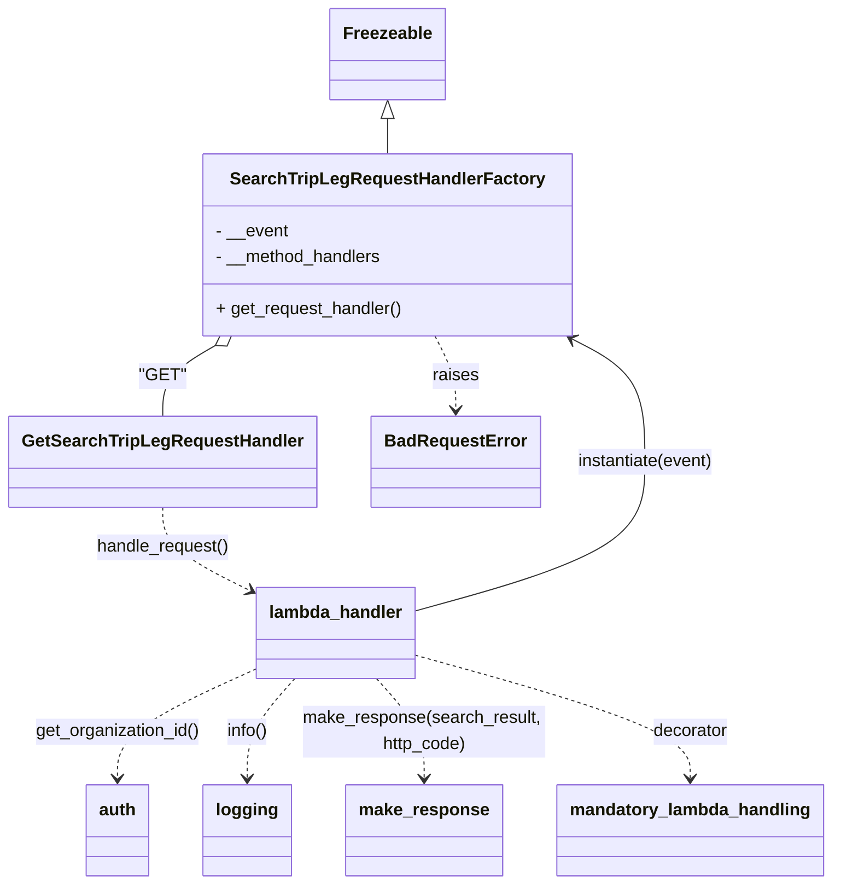

# Diagram: partview_core/partview_service/partview_service/api/search/search_trip_leg_handler.py

> Auto-generated by Obscura crawlers

## Mermaid

### SVG

<svg id="container" width="745.33984375" xmlns="http://www.w3.org/2000/svg" class="classDiagram" height="816" viewBox="0 0 745.33984375 816" role="graphics-document document" aria-roledescription="class"><g><defs><marker id="container_class-aggregationStart" class="marker aggregation class" refX="18" refY="7" markerWidth="190" markerHeight="240" orient="auto"><path d="M 18,7 L9,13 L1,7 L9,1 Z"></path></marker></defs><defs><marker id="container_class-aggregationEnd" class="marker aggregation class" refX="1" refY="7" markerWidth="20" markerHeight="28" orient="auto"><path d="M 18,7 L9,13 L1,7 L9,1 Z"></path></marker></defs><defs><marker id="container_class-extensionStart" class="marker extension class" refX="18" refY="7" markerWidth="190" markerHeight="240" orient="auto"><path d="M 1,7 L18,13 V 1 Z"></path></marker></defs><defs><marker id="container_class-extensionEnd" class="marker extension class" refX="1" refY="7" markerWidth="20" markerHeight="28" orient="auto"><path d="M 1,1 V 13 L18,7 Z"></path></marker></defs><defs><marker id="container_class-compositionStart" class="marker composition class" refX="18" refY="7" markerWidth="190" markerHeight="240" orient="auto"><path d="M 18,7 L9,13 L1,7 L9,1 Z"></path></marker></defs><defs><marker id="container_class-compositionEnd" class="marker composition class" refX="1" refY="7" markerWidth="20" markerHeight="28" orient="auto"><path d="M 18,7 L9,13 L1,7 L9,1 Z"></path></marker></defs><defs><marker id="container_class-dependencyStart" class="marker dependency class" refX="6" refY="7" markerWidth="190" markerHeight="240" orient="auto"><path d="M 5,7 L9,13 L1,7 L9,1 Z"></path></marker></defs><defs><marker id="container_class-dependencyEnd" class="marker dependency class" refX="13" refY="7" markerWidth="20" markerHeight="28" orient="auto"><path d="M 18,7 L9,13 L14,7 L9,1 Z"></path></marker></defs><defs><marker id="container_class-lollipopStart" class="marker lollipop class" refX="13" refY="7" markerWidth="190" markerHeight="240" orient="auto"><circle stroke="black" fill="transparent" cx="7" cy="7" r="6"></circle></marker></defs><defs><marker id="container_class-lollipopEnd" class="marker lollipop class" refX="1" refY="7" markerWidth="190" markerHeight="240" orient="auto"><circle stroke="black" fill="transparent" cx="7" cy="7" r="6"></circle></marker></defs><g class="root"><g class="clusters"></g><g class="edgePaths"><path d="M342.703,109.25L342.703,110.542C342.703,111.833,342.703,114.417,342.703,119.875C342.703,125.333,342.703,133.667,342.703,137.833L342.703,142" id="id_Freezeable_SearchTripLegRequestHandlerFactory_1" class="edge-thickness-normal edge-pattern-solid relation" style=";;;" data-edge="true" data-et="edge" data-id="id_Freezeable_SearchTripLegRequestHandlerFactory_1" data-points="W3sieCI6MzQyLjcwMzEyNSwieSI6OTJ9LHsieCI6MzQyLjcwMzEyNSwieSI6MTE3fSx7IngiOjM0Mi43MDMxMjUsInkiOjE0Mn1d" marker-start="url(#container_class-extensionStart)"></path><path d="M189.665,318.955L181.969,323.629C174.274,328.303,158.883,337.652,151.188,348.493C143.492,359.333,143.492,371.667,143.492,377.833L143.492,384" id="id_SearchTripLegRequestHandlerFactory_GetSearchTripLegRequestHandler_2" class="edge-thickness-normal edge-pattern-solid relation" style=";;;" data-edge="true" data-et="edge" data-id="id_SearchTripLegRequestHandlerFactory_GetSearchTripLegRequestHandler_2" data-points="W3sieCI6MjA0LjQwNzkyODcxOTAwODI1LCJ5IjozMTB9LHsieCI6MTQzLjQ5MjE4NzUsInkiOjM0N30seyJ4IjoxNDMuNDkyMTg3NSwieSI6Mzg0fV0=" marker-start="url(#container_class-aggregationStart)"></path><path d="M384.747,310L387.833,316.167C390.92,322.333,397.093,334.667,400.179,346C403.266,357.333,403.266,367.667,403.266,372.833L403.266,378" id="id_SearchTripLegRequestHandlerFactory_BadRequestError_3" class="edge-thickness-normal edge-pattern-dashed relation" style=";;;" data-edge="true" data-et="edge" data-id="id_SearchTripLegRequestHandlerFactory_BadRequestError_3" data-points="W3sieCI6Mzg0Ljc0NjUxMzQyOTc1MjA0LCJ5IjozMTB9LHsieCI6NDAzLjI2NTYyNSwieSI6MzQ3fSx7IngiOjQwMy4yNjU2MjUsInkiOjM4NH1d" marker-end="url(#container_class-dependencyEnd)"></path><path d="M227.746,617.238L206.898,626.865C186.051,636.492,144.355,655.746,123.508,672.54C102.66,689.333,102.66,703.667,102.66,710.833L102.66,718" id="id_lambda_handler_auth_4" class="edge-thickness-normal edge-pattern-dashed relation" style=";;;" data-edge="true" data-et="edge" data-id="id_lambda_handler_auth_4" data-points="W3sieCI6MjI3Ljc0NjA5Mzc1LCJ5Ijo2MTcuMjM3NTExODkzNDM0OH0seyJ4IjoxMDIuNjYwMTU2MjUsInkiOjY3NX0seyJ4IjoxMDIuNjYwMTU2MjUsInkiOjcyNH1d" marker-end="url(#container_class-dependencyEnd)"></path><path d="M263.128,626L256.012,634.167C248.896,642.333,234.665,658.667,227.549,674C220.434,689.333,220.434,703.667,220.434,710.833L220.434,718" id="id_lambda_handler_logging_5" class="edge-thickness-normal edge-pattern-dashed relation" style=";;;" data-edge="true" data-et="edge" data-id="id_lambda_handler_logging_5" data-points="W3sieCI6MjYzLjEyNzcwNDMyNjkyMzEsInkiOjYyNn0seyJ4IjoyMjAuNDMzNTkzNzUsInkiOjY3NX0seyJ4IjoyMjAuNDMzNTkzNzUsInkiOjcyNH1d" marker-end="url(#container_class-dependencyEnd)"></path><path d="M371.699,563.499L405.929,553.749C440.159,543.999,508.618,524.5,542.848,501.583C577.078,478.667,577.078,452.333,577.078,426C577.078,399.667,577.078,373.333,566.022,354.459C554.966,335.584,532.853,324.168,521.797,318.46L510.741,312.752" id="id_lambda_handler_SearchTripLegRequestHandlerFactory_6" class="edge-thickness-normal edge-pattern-solid relation" style=";;;" data-edge="true" data-et="edge" data-id="id_lambda_handler_SearchTripLegRequestHandlerFactory_6" data-points="W3sieCI6MzcxLjY5OTIxODc1LCJ5Ijo1NjMuNDk4Njk3MjM4MTQ0OH0seyJ4Ijo1NzcuMDc4MTI1LCJ5Ijo1MDV9LHsieCI6NTc3LjA3ODEyNSwieSI6NDI2fSx7IngiOjU3Ny4wNzgxMjUsInkiOjM0N30seyJ4Ijo1MDUuNDA5NzM2NTcwMjQ3OSwieSI6MzEwfV0=" marker-end="url(#container_class-dependencyEnd)"></path><path d="M336.318,626L343.433,634.167C350.549,642.333,364.78,658.667,371.896,674C379.012,689.333,379.012,703.667,379.012,710.833L379.012,718" id="id_lambda_handler_make_response_7" class="edge-thickness-normal edge-pattern-dashed relation" style=";;;" data-edge="true" data-et="edge" data-id="id_lambda_handler_make_response_7" data-points="W3sieCI6MzM2LjMxNzYwODE3MzA3NjksInkiOjYyNn0seyJ4IjozNzkuMDExNzE4NzUsInkiOjY3NX0seyJ4IjozNzkuMDExNzE4NzUsInkiOjcyNH1d" marker-end="url(#container_class-dependencyEnd)"></path><path d="M371.699,604.585L412.734,616.321C453.77,628.057,535.84,651.528,576.875,670.431C617.91,689.333,617.91,703.667,617.91,710.833L617.91,718" id="id_lambda_handler_mandatory_lambda_handling_8" class="edge-thickness-normal edge-pattern-dashed relation" style=";;;" data-edge="true" data-et="edge" data-id="id_lambda_handler_mandatory_lambda_handling_8" data-points="W3sieCI6MzcxLjY5OTIxODc1LCJ5Ijo2MDQuNTg0OTI5Mjg2OTc3MX0seyJ4Ijo2MTcuOTEwMTU2MjUsInkiOjY3NX0seyJ4Ijo2MTcuOTEwMTU2MjUsInkiOjcyNH1d" marker-end="url(#container_class-dependencyEnd)"></path><path d="M143.492,468L143.492,474.167C143.492,480.333,143.492,492.667,156.642,505.483C169.792,518.299,196.092,531.598,209.242,538.247L222.392,544.897" id="id_GetSearchTripLegRequestHandler_lambda_handler_9" class="edge-thickness-normal edge-pattern-dashed relation" style=";;;" data-edge="true" data-et="edge" data-id="id_GetSearchTripLegRequestHandler_lambda_handler_9" data-points="W3sieCI6MTQzLjQ5MjE4NzUsInkiOjQ2OH0seyJ4IjoxNDMuNDkyMTg3NSwieSI6NTA1fSx7IngiOjIyNy43NDYwOTM3NSwieSI6NTQ3LjYwNDEwMDUxMjU2NDF9XQ==" marker-end="url(#container_class-dependencyEnd)"></path></g><g class="edgeLabels"><g class="edgeLabel"><g class="label" data-id="id_Freezeable_SearchTripLegRequestHandlerFactory_1" transform="translate(0, 0)"><foreignObject width="0" height="0">

</foreignObject></g></g><g class="edgeLabel" transform="translate(143.4921875, 347)"><g class="label" data-id="id_SearchTripLegRequestHandlerFactory_GetSearchTripLegRequestHandler_2" transform="translate(-19.9296875, -12)"><foreignObject width="39.859375" height="24">

"GET"

</foreignObject></g></g><g class="edgeLabel" transform="translate(403.265625, 347)"><g class="label" data-id="id_SearchTripLegRequestHandlerFactory_BadRequestError_3" transform="translate(-21.25, -12)"><foreignObject width="42.5" height="24">

raises

</foreignObject></g></g><g class="edgeLabel" transform="translate(102.66015625, 675)"><g class="label" data-id="id_lambda_handler_auth_4" transform="translate(-76.84375, -12)"><foreignObject width="153.6875" height="24">

get_organization_id()

</foreignObject></g></g><g class="edgeLabel" transform="translate(220.43359375, 675)"><g class="label" data-id="id_lambda_handler_logging_5" transform="translate(-19.40625, -12)"><foreignObject width="38.8125" height="24">

info()

</foreignObject></g></g><g class="edgeLabel" transform="translate(577.078125, 426)"><g class="label" data-id="id_lambda_handler_SearchTripLegRequestHandlerFactory_6" transform="translate(-64.53125, -12)"><foreignObject width="129.0625" height="24">

instantiate(event)

</foreignObject></g></g><g class="edgeLabel" transform="translate(379.01171875, 675)"><g class="label" data-id="id_lambda_handler_make_response_7" transform="translate(-112.1328125, -24)"><foreignObject width="224.265625" height="48">

make_response(search_result, http_code)

</foreignObject></g></g><g class="edgeLabel" transform="translate(617.91015625, 675)"><g class="label" data-id="id_lambda_handler_mandatory_lambda_handling_8" transform="translate(-35.171875, -12)"><foreignObject width="70.34375" height="24">

decorator

</foreignObject></g></g><g class="edgeLabel" transform="translate(143.4921875, 505)"><g class="label" data-id="id_GetSearchTripLegRequestHandler_lambda_handler_9" transform="translate(-61.9921875, -12)"><foreignObject width="123.984375" height="24">

handle_request()

</foreignObject></g></g></g><g class="nodes"><g class="node default" id="classId-Freezeable-0" transform="translate(342.703125, 50)"><g class="basic label-container"><path d="M-51.1953125 -42 L51.1953125 -42 L51.1953125 42 L-51.1953125 42" stroke="none" stroke-width="0" fill="#ECECFF" style=""></path><path d="M-51.1953125 -42 C-22.60259339854985 -42, 5.9901257029003006 -42, 51.1953125 -42 M-51.1953125 -42 C-29.374737842029674 -42, -7.554163184059348 -42, 51.1953125 -42 M51.1953125 -42 C51.1953125 -13.893095341442894, 51.1953125 14.213809317114212, 51.1953125 42 M51.1953125 -42 C51.1953125 -12.360324623376663, 51.1953125 17.279350753246675, 51.1953125 42 M51.1953125 42 C18.948966696180513 42, -13.297379107638974 42, -51.1953125 42 M51.1953125 42 C10.942436469183768 42, -29.310439561632464 42, -51.1953125 42 M-51.1953125 42 C-51.1953125 9.734481141436952, -51.1953125 -22.531037717126097, -51.1953125 -42 M-51.1953125 42 C-51.1953125 12.675996630861622, -51.1953125 -16.648006738276756, -51.1953125 -42" stroke="#9370DB" stroke-width="1.3" fill="none" stroke-dasharray="0 0" style=""></path></g><g class="annotation-group text" transform="translate(0, -18)"></g><g class="label-group text" transform="translate(-39.1953125, -18)"><g class="label" style="font-weight: bolder" transform="translate(0,-12)"><foreignObject width="78.390625" height="24">

Freezeable

</foreignObject></g></g><g class="members-group text" transform="translate(-39.1953125, 30)"></g><g class="methods-group text" transform="translate(-39.1953125, 60)"></g><g class="divider" style=""><path d="M-51.1953125 6 C-26.54883479203856 6, -1.9023570840771171 6, 51.1953125 6 M-51.1953125 6 C-11.555893529397814 6, 28.083525441204372 6, 51.1953125 6" stroke="#9370DB" stroke-width="1.3" fill="none" stroke-dasharray="0 0" style=""></path></g><g class="divider" style=""><path d="M-51.1953125 24 C-21.438726799339214 24, 8.317858901321571 24, 51.1953125 24 M-51.1953125 24 C-14.93873848107578 24, 21.31783553784844 24, 51.1953125 24" stroke="#9370DB" stroke-width="1.3" fill="none" stroke-dasharray="0 0" style=""></path></g></g><g class="node default" id="classId-SearchTripLegRequestHandlerFactory-1" transform="translate(342.703125, 226)"><g class="basic label-container"><path d="M-167.51171875 -84 L167.51171875 -84 L167.51171875 84 L-167.51171875 84" stroke="none" stroke-width="0" fill="#ECECFF" style=""></path><path d="M-167.51171875 -84 C-41.362424374525375 -84, 84.78687000094925 -84, 167.51171875 -84 M-167.51171875 -84 C-70.93673793378929 -84, 25.638242882421423 -84, 167.51171875 -84 M167.51171875 -84 C167.51171875 -45.239375126148246, 167.51171875 -6.478750252296493, 167.51171875 84 M167.51171875 -84 C167.51171875 -19.354909902390403, 167.51171875 45.29018019521919, 167.51171875 84 M167.51171875 84 C56.895418639611165 84, -53.72088147077767 84, -167.51171875 84 M167.51171875 84 C38.931527475088586 84, -89.64866379982283 84, -167.51171875 84 M-167.51171875 84 C-167.51171875 49.04659764357393, -167.51171875 14.093195287147864, -167.51171875 -84 M-167.51171875 84 C-167.51171875 27.2868418296532, -167.51171875 -29.426316340693603, -167.51171875 -84" stroke="#9370DB" stroke-width="1.3" fill="none" stroke-dasharray="0 0" style=""></path></g><g class="annotation-group text" transform="translate(0, -60)"></g><g class="label-group text" transform="translate(-137.4296875, -60)"><g class="label" style="font-weight: bolder" transform="translate(0,-12)"><foreignObject width="274.859375" height="24">

SearchTripLegRequestHandlerFactory

</foreignObject></g></g><g class="members-group text" transform="translate(-155.51171875, -12)"><g class="label" style="" transform="translate(0,-12)"><foreignObject width="67.1875" height="24">

- __event

</foreignObject></g><g class="label" style="" transform="translate(0,12)"><foreignObject width="155.75" height="24">

- __method_handlers

</foreignObject></g></g><g class="methods-group text" transform="translate(-155.51171875, 60)"><g class="label" style="" transform="translate(0,-12)"><foreignObject width="173.59375" height="24">

+ get_request_handler()

</foreignObject></g></g><g class="divider" style=""><path d="M-167.51171875 -36 C-49.32388922931831 -36, 68.86394029136338 -36, 167.51171875 -36 M-167.51171875 -36 C-75.10718353720948 -36, 17.29735167558104 -36, 167.51171875 -36" stroke="#9370DB" stroke-width="1.3" fill="none" stroke-dasharray="0 0" style=""></path></g><g class="divider" style=""><path d="M-167.51171875 36 C-40.75039547947877 36, 86.01092779104246 36, 167.51171875 36 M-167.51171875 36 C-64.96277708617352 36, 37.586164577652966 36, 167.51171875 36" stroke="#9370DB" stroke-width="1.3" fill="none" stroke-dasharray="0 0" style=""></path></g></g><g class="node default" id="classId-GetSearchTripLegRequestHandler-2" transform="translate(143.4921875, 426)"><g class="basic label-container"><path d="M-135.4921875 -42 L135.4921875 -42 L135.4921875 42 L-135.4921875 42" stroke="none" stroke-width="0" fill="#ECECFF" style=""></path><path d="M-135.4921875 -42 C-72.67611989109085 -42, -9.860052282181684 -42, 135.4921875 -42 M-135.4921875 -42 C-54.27605107803389 -42, 26.940085343932225 -42, 135.4921875 -42 M135.4921875 -42 C135.4921875 -10.221957626683718, 135.4921875 21.556084746632564, 135.4921875 42 M135.4921875 -42 C135.4921875 -22.48502705771539, 135.4921875 -2.970054115430777, 135.4921875 42 M135.4921875 42 C77.86934413865441 42, 20.24650077730881 42, -135.4921875 42 M135.4921875 42 C62.53533178391416 42, -10.42152393217168 42, -135.4921875 42 M-135.4921875 42 C-135.4921875 17.004646371720803, -135.4921875 -7.9907072565583945, -135.4921875 -42 M-135.4921875 42 C-135.4921875 10.377509556079971, -135.4921875 -21.244980887840057, -135.4921875 -42" stroke="#9370DB" stroke-width="1.3" fill="none" stroke-dasharray="0 0" style=""></path></g><g class="annotation-group text" transform="translate(0, -18)"></g><g class="label-group text" transform="translate(-123.4921875, -18)"><g class="label" style="font-weight: bolder" transform="translate(0,-12)"><foreignObject width="246.984375" height="24">

GetSearchTripLegRequestHandler

</foreignObject></g></g><g class="members-group text" transform="translate(-123.4921875, 30)"></g><g class="methods-group text" transform="translate(-123.4921875, 60)"></g><g class="divider" style=""><path d="M-135.4921875 6 C-40.711515773864946 6, 54.06915595227011 6, 135.4921875 6 M-135.4921875 6 C-37.493572133795695 6, 60.50504323240861 6, 135.4921875 6" stroke="#9370DB" stroke-width="1.3" fill="none" stroke-dasharray="0 0" style=""></path></g><g class="divider" style=""><path d="M-135.4921875 24 C-37.527889099020655 24, 60.43640930195869 24, 135.4921875 24 M-135.4921875 24 C-44.84944344975818 24, 45.79330060048363 24, 135.4921875 24" stroke="#9370DB" stroke-width="1.3" fill="none" stroke-dasharray="0 0" style=""></path></g></g><g class="node default" id="classId-BadRequestError-3" transform="translate(403.265625, 426)"><g class="basic label-container"><path d="M-74.28125 -42 L74.28125 -42 L74.28125 42 L-74.28125 42" stroke="none" stroke-width="0" fill="#ECECFF" style=""></path><path d="M-74.28125 -42 C-33.84014771158918 -42, 6.6009545768216356 -42, 74.28125 -42 M-74.28125 -42 C-31.02802206694581 -42, 12.225205866108382 -42, 74.28125 -42 M74.28125 -42 C74.28125 -14.727989436022835, 74.28125 12.54402112795433, 74.28125 42 M74.28125 -42 C74.28125 -22.06066802165877, 74.28125 -2.121336043317541, 74.28125 42 M74.28125 42 C31.121837613749193 42, -12.037574772501614 42, -74.28125 42 M74.28125 42 C24.981041926785743 42, -24.319166146428515 42, -74.28125 42 M-74.28125 42 C-74.28125 9.846838280837197, -74.28125 -22.306323438325606, -74.28125 -42 M-74.28125 42 C-74.28125 24.688902665040445, -74.28125 7.377805330080889, -74.28125 -42" stroke="#9370DB" stroke-width="1.3" fill="none" stroke-dasharray="0 0" style=""></path></g><g class="annotation-group text" transform="translate(0, -18)"></g><g class="label-group text" transform="translate(-62.28125, -18)"><g class="label" style="font-weight: bolder" transform="translate(0,-12)"><foreignObject width="124.5625" height="24">

BadRequestError

</foreignObject></g></g><g class="members-group text" transform="translate(-62.28125, 30)"></g><g class="methods-group text" transform="translate(-62.28125, 60)"></g><g class="divider" style=""><path d="M-74.28125 6 C-26.892642880190536 6, 20.495964239618928 6, 74.28125 6 M-74.28125 6 C-38.85974584566564 6, -3.438241691331285 6, 74.28125 6" stroke="#9370DB" stroke-width="1.3" fill="none" stroke-dasharray="0 0" style=""></path></g><g class="divider" style=""><path d="M-74.28125 24 C-26.40219599755597 24, 21.476858004888058 24, 74.28125 24 M-74.28125 24 C-26.217629982250905 24, 21.84599003549819 24, 74.28125 24" stroke="#9370DB" stroke-width="1.3" fill="none" stroke-dasharray="0 0" style=""></path></g></g><g class="node default" id="classId-auth-4" transform="translate(102.66015625, 766)"><g class="basic label-container"><path d="M-28.6640625 -42 L28.6640625 -42 L28.6640625 42 L-28.6640625 42" stroke="none" stroke-width="0" fill="#ECECFF" style=""></path><path d="M-28.6640625 -42 C-5.876559921885381 -42, 16.91094265622924 -42, 28.6640625 -42 M-28.6640625 -42 C-5.9017949054784395 -42, 16.86047268904312 -42, 28.6640625 -42 M28.6640625 -42 C28.6640625 -12.07589710975422, 28.6640625 17.84820578049156, 28.6640625 42 M28.6640625 -42 C28.6640625 -13.033210393662696, 28.6640625 15.933579212674609, 28.6640625 42 M28.6640625 42 C9.153387995843499 42, -10.357286508313003 42, -28.6640625 42 M28.6640625 42 C8.65873232864871 42, -11.346597842702579 42, -28.6640625 42 M-28.6640625 42 C-28.6640625 11.74151288166771, -28.6640625 -18.51697423666458, -28.6640625 -42 M-28.6640625 42 C-28.6640625 20.639897694001217, -28.6640625 -0.7202046119975662, -28.6640625 -42" stroke="#9370DB" stroke-width="1.3" fill="none" stroke-dasharray="0 0" style=""></path></g><g class="annotation-group text" transform="translate(0, -18)"></g><g class="label-group text" transform="translate(-16.6640625, -18)"><g class="label" style="font-weight: bolder" transform="translate(0,-12)"><foreignObject width="33.328125" height="24">

auth

</foreignObject></g></g><g class="members-group text" transform="translate(-16.6640625, 30)"></g><g class="methods-group text" transform="translate(-16.6640625, 60)"></g><g class="divider" style=""><path d="M-28.6640625 6 C-9.044187092865613 6, 10.575688314268774 6, 28.6640625 6 M-28.6640625 6 C-15.71680720448236 6, -2.7695519089647185 6, 28.6640625 6" stroke="#9370DB" stroke-width="1.3" fill="none" stroke-dasharray="0 0" style=""></path></g><g class="divider" style=""><path d="M-28.6640625 24 C-6.701222974631886 24, 15.261616550736228 24, 28.6640625 24 M-28.6640625 24 C-7.17137135622405 24, 14.3213197875519 24, 28.6640625 24" stroke="#9370DB" stroke-width="1.3" fill="none" stroke-dasharray="0 0" style=""></path></g></g><g class="node default" id="classId-logging-5" transform="translate(220.43359375, 766)"><g class="basic label-container"><path d="M-39.109375 -42 L39.109375 -42 L39.109375 42 L-39.109375 42" stroke="none" stroke-width="0" fill="#ECECFF" style=""></path><path d="M-39.109375 -42 C-21.72565280283716 -42, -4.341930605674321 -42, 39.109375 -42 M-39.109375 -42 C-22.357679717473296 -42, -5.605984434946592 -42, 39.109375 -42 M39.109375 -42 C39.109375 -24.63735698486128, 39.109375 -7.274713969722562, 39.109375 42 M39.109375 -42 C39.109375 -17.488840400200647, 39.109375 7.022319199598705, 39.109375 42 M39.109375 42 C16.21746192019522 42, -6.674451159609561 42, -39.109375 42 M39.109375 42 C18.40345284747108 42, -2.3024693050578406 42, -39.109375 42 M-39.109375 42 C-39.109375 21.394918297454456, -39.109375 0.7898365949089126, -39.109375 -42 M-39.109375 42 C-39.109375 9.278320939848044, -39.109375 -23.443358120303913, -39.109375 -42" stroke="#9370DB" stroke-width="1.3" fill="none" stroke-dasharray="0 0" style=""></path></g><g class="annotation-group text" transform="translate(0, -18)"></g><g class="label-group text" transform="translate(-27.109375, -18)"><g class="label" style="font-weight: bolder" transform="translate(0,-12)"><foreignObject width="54.21875" height="24">

logging

</foreignObject></g></g><g class="members-group text" transform="translate(-27.109375, 30)"></g><g class="methods-group text" transform="translate(-27.109375, 60)"></g><g class="divider" style=""><path d="M-39.109375 6 C-9.88306417302493 6, 19.34324665395014 6, 39.109375 6 M-39.109375 6 C-16.210477266297012 6, 6.688420467405976 6, 39.109375 6" stroke="#9370DB" stroke-width="1.3" fill="none" stroke-dasharray="0 0" style=""></path></g><g class="divider" style=""><path d="M-39.109375 24 C-16.31926962756944 24, 6.47083574486112 24, 39.109375 24 M-39.109375 24 C-19.01637424926914 24, 1.0766265014617176 24, 39.109375 24" stroke="#9370DB" stroke-width="1.3" fill="none" stroke-dasharray="0 0" style=""></path></g></g><g class="node default" id="classId-make_response-6" transform="translate(379.01171875, 766)"><g class="basic label-container"><path d="M-69.46875 -42 L69.46875 -42 L69.46875 42 L-69.46875 42" stroke="none" stroke-width="0" fill="#ECECFF" style=""></path><path d="M-69.46875 -42 C-30.145630371062396 -42, 9.177489257875209 -42, 69.46875 -42 M-69.46875 -42 C-36.09948428250046 -42, -2.730218565000925 -42, 69.46875 -42 M69.46875 -42 C69.46875 -24.163798808863188, 69.46875 -6.327597617726376, 69.46875 42 M69.46875 -42 C69.46875 -18.19731919735641, 69.46875 5.605361605287179, 69.46875 42 M69.46875 42 C34.28747431739006 42, -0.8938013652198862 42, -69.46875 42 M69.46875 42 C27.8768325344819 42, -13.715084931036202 42, -69.46875 42 M-69.46875 42 C-69.46875 18.253485601039927, -69.46875 -5.493028797920147, -69.46875 -42 M-69.46875 42 C-69.46875 16.226941200830247, -69.46875 -9.546117598339507, -69.46875 -42" stroke="#9370DB" stroke-width="1.3" fill="none" stroke-dasharray="0 0" style=""></path></g><g class="annotation-group text" transform="translate(0, -18)"></g><g class="label-group text" transform="translate(-57.46875, -18)"><g class="label" style="font-weight: bolder" transform="translate(0,-12)"><foreignObject width="114.9375" height="24">

make_response

</foreignObject></g></g><g class="members-group text" transform="translate(-57.46875, 30)"></g><g class="methods-group text" transform="translate(-57.46875, 60)"></g><g class="divider" style=""><path d="M-69.46875 6 C-23.851412765014125 6, 21.76592446997175 6, 69.46875 6 M-69.46875 6 C-17.873819834330796 6, 33.72111033133841 6, 69.46875 6" stroke="#9370DB" stroke-width="1.3" fill="none" stroke-dasharray="0 0" style=""></path></g><g class="divider" style=""><path d="M-69.46875 24 C-29.545330641385306 24, 10.378088717229389 24, 69.46875 24 M-69.46875 24 C-34.7068449133607 24, 0.05506017327860491 24, 69.46875 24" stroke="#9370DB" stroke-width="1.3" fill="none" stroke-dasharray="0 0" style=""></path></g></g><g class="node default" id="classId-mandatory_lambda_handling-7" transform="translate(617.91015625, 766)"><g class="basic label-container"><path d="M-119.4296875 -42 L119.4296875 -42 L119.4296875 42 L-119.4296875 42" stroke="none" stroke-width="0" fill="#ECECFF" style=""></path><path d="M-119.4296875 -42 C-32.4296297435296 -42, 54.570428012940795 -42, 119.4296875 -42 M-119.4296875 -42 C-32.49612334596361 -42, 54.43744080807278 -42, 119.4296875 -42 M119.4296875 -42 C119.4296875 -23.153818839013407, 119.4296875 -4.307637678026815, 119.4296875 42 M119.4296875 -42 C119.4296875 -23.469931289441526, 119.4296875 -4.9398625788830515, 119.4296875 42 M119.4296875 42 C71.27813525439159 42, 23.12658300878317 42, -119.4296875 42 M119.4296875 42 C42.31654488662075 42, -34.796597726758506 42, -119.4296875 42 M-119.4296875 42 C-119.4296875 9.32033287081046, -119.4296875 -23.35933425837908, -119.4296875 -42 M-119.4296875 42 C-119.4296875 17.346586527809468, -119.4296875 -7.306826944381065, -119.4296875 -42" stroke="#9370DB" stroke-width="1.3" fill="none" stroke-dasharray="0 0" style=""></path></g><g class="annotation-group text" transform="translate(0, -18)"></g><g class="label-group text" transform="translate(-107.4296875, -18)"><g class="label" style="font-weight: bolder" transform="translate(0,-12)"><foreignObject width="214.859375" height="24">

mandatory_lambda_handling

</foreignObject></g></g><g class="members-group text" transform="translate(-107.4296875, 30)"></g><g class="methods-group text" transform="translate(-107.4296875, 60)"></g><g class="divider" style=""><path d="M-119.4296875 6 C-64.09484337375972 6, -8.759999247519417 6, 119.4296875 6 M-119.4296875 6 C-65.38663506425912 6, -11.343582628518249 6, 119.4296875 6" stroke="#9370DB" stroke-width="1.3" fill="none" stroke-dasharray="0 0" style=""></path></g><g class="divider" style=""><path d="M-119.4296875 24 C-42.91320777817759 24, 33.60327194364481 24, 119.4296875 24 M-119.4296875 24 C-30.244241443434802 24, 58.941204613130395 24, 119.4296875 24" stroke="#9370DB" stroke-width="1.3" fill="none" stroke-dasharray="0 0" style=""></path></g></g><g class="node default" id="classId-lambda_handler-8" transform="translate(299.72265625, 584)"><g class="basic label-container"><path d="M-71.9765625 -42 L71.9765625 -42 L71.9765625 42 L-71.9765625 42" stroke="none" stroke-width="0" fill="#ECECFF" style=""></path><path d="M-71.9765625 -42 C-17.920998273830953 -42, 36.13456595233809 -42, 71.9765625 -42 M-71.9765625 -42 C-24.69243727249183 -42, 22.59168795501634 -42, 71.9765625 -42 M71.9765625 -42 C71.9765625 -14.685082396262885, 71.9765625 12.62983520747423, 71.9765625 42 M71.9765625 -42 C71.9765625 -23.308725776791462, 71.9765625 -4.617451553582924, 71.9765625 42 M71.9765625 42 C22.03499137392786 42, -27.90657975214428 42, -71.9765625 42 M71.9765625 42 C41.39196550660292 42, 10.807368513205844 42, -71.9765625 42 M-71.9765625 42 C-71.9765625 16.49598683015664, -71.9765625 -9.008026339686722, -71.9765625 -42 M-71.9765625 42 C-71.9765625 9.169999160181234, -71.9765625 -23.66000167963753, -71.9765625 -42" stroke="#9370DB" stroke-width="1.3" fill="none" stroke-dasharray="0 0" style=""></path></g><g class="annotation-group text" transform="translate(0, -18)"></g><g class="label-group text" transform="translate(-59.9765625, -18)"><g class="label" style="font-weight: bolder" transform="translate(0,-12)"><foreignObject width="119.953125" height="24">

lambda_handler

</foreignObject></g></g><g class="members-group text" transform="translate(-59.9765625, 30)"></g><g class="methods-group text" transform="translate(-59.9765625, 60)"></g><g class="divider" style=""><path d="M-71.9765625 6 C-19.28274394874782 6, 33.41107460250436 6, 71.9765625 6 M-71.9765625 6 C-40.422382808707354 6, -8.868203117414701 6, 71.9765625 6" stroke="#9370DB" stroke-width="1.3" fill="none" stroke-dasharray="0 0" style=""></path></g><g class="divider" style=""><path d="M-71.9765625 24 C-22.498087019100026 24, 26.980388461799947 24, 71.9765625 24 M-71.9765625 24 C-25.252553482308137 24, 21.471455535383726 24, 71.9765625 24" stroke="#9370DB" stroke-width="1.3" fill="none" stroke-dasharray="0 0" style=""></path></g></g></g></g></g></svg>
