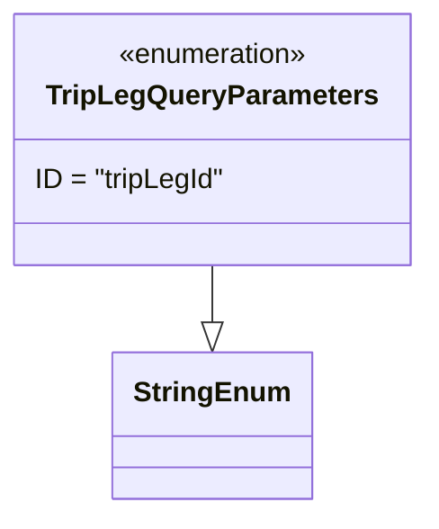

# Diagram: partview_core/partview_service/partview_service/api/trip_leg/TripLegQueryParameters.py

> Auto-generated by Obscura crawlers

## Mermaid

### SVG

<svg id="container" width="239.8046875" xmlns="http://www.w3.org/2000/svg" class="classDiagram" height="294" viewBox="0 0 239.8046875 294" role="graphics-document document" aria-roledescription="class"><g><defs><marker id="container_class-aggregationStart" class="marker aggregation class" refX="18" refY="7" markerWidth="190" markerHeight="240" orient="auto"><path d="M 18,7 L9,13 L1,7 L9,1 Z"></path></marker></defs><defs><marker id="container_class-aggregationEnd" class="marker aggregation class" refX="1" refY="7" markerWidth="20" markerHeight="28" orient="auto"><path d="M 18,7 L9,13 L1,7 L9,1 Z"></path></marker></defs><defs><marker id="container_class-extensionStart" class="marker extension class" refX="18" refY="7" markerWidth="190" markerHeight="240" orient="auto"><path d="M 1,7 L18,13 V 1 Z"></path></marker></defs><defs><marker id="container_class-extensionEnd" class="marker extension class" refX="1" refY="7" markerWidth="20" markerHeight="28" orient="auto"><path d="M 1,1 V 13 L18,7 Z"></path></marker></defs><defs><marker id="container_class-compositionStart" class="marker composition class" refX="18" refY="7" markerWidth="190" markerHeight="240" orient="auto"><path d="M 18,7 L9,13 L1,7 L9,1 Z"></path></marker></defs><defs><marker id="container_class-compositionEnd" class="marker composition class" refX="1" refY="7" markerWidth="20" markerHeight="28" orient="auto"><path d="M 18,7 L9,13 L1,7 L9,1 Z"></path></marker></defs><defs><marker id="container_class-dependencyStart" class="marker dependency class" refX="6" refY="7" markerWidth="190" markerHeight="240" orient="auto"><path d="M 5,7 L9,13 L1,7 L9,1 Z"></path></marker></defs><defs><marker id="container_class-dependencyEnd" class="marker dependency class" refX="13" refY="7" markerWidth="20" markerHeight="28" orient="auto"><path d="M 18,7 L9,13 L14,7 L9,1 Z"></path></marker></defs><defs><marker id="container_class-lollipopStart" class="marker lollipop class" refX="13" refY="7" markerWidth="190" markerHeight="240" orient="auto"><circle stroke="black" fill="transparent" cx="7" cy="7" r="6"></circle></marker></defs><defs><marker id="container_class-lollipopEnd" class="marker lollipop class" refX="1" refY="7" markerWidth="190" markerHeight="240" orient="auto"><circle stroke="black" fill="transparent" cx="7" cy="7" r="6"></circle></marker></defs><g class="root"><g class="clusters"></g><g class="edgePaths"><path d="M119.902,152L119.902,156.167C119.902,160.333,119.902,168.667,119.902,174.125C119.902,179.583,119.902,182.167,119.902,183.458L119.902,184.75" id="id_TripLegQueryParameters_StringEnum_1" class="edge-thickness-normal edge-pattern-solid relation" style=";;;" data-edge="true" data-et="edge" data-id="id_TripLegQueryParameters_StringEnum_1" data-points="W3sieCI6MTE5LjkwMjM0Mzc1LCJ5IjoxNTJ9LHsieCI6MTE5LjkwMjM0Mzc1LCJ5IjoxNzd9LHsieCI6MTE5LjkwMjM0Mzc1LCJ5IjoyMDJ9XQ==" marker-end="url(#container_class-extensionEnd)"></path></g><g class="edgeLabels"><g class="edgeLabel"><g class="label" data-id="id_TripLegQueryParameters_StringEnum_1" transform="translate(0, 0)"><foreignObject width="0" height="0">

</foreignObject></g></g></g><g class="nodes"><g class="node default" id="classId-StringEnum-0" transform="translate(119.90234375, 244)"><g class="basic label-container"><path d="M-54.234375 -42 L54.234375 -42 L54.234375 42 L-54.234375 42" stroke="none" stroke-width="0" fill="#ECECFF" style=""></path><path d="M-54.234375 -42 C-30.056987925309247 -42, -5.879600850618495 -42, 54.234375 -42 M-54.234375 -42 C-14.54444184069748 -42, 25.14549131860504 -42, 54.234375 -42 M54.234375 -42 C54.234375 -17.534400557399966, 54.234375 6.931198885200068, 54.234375 42 M54.234375 -42 C54.234375 -15.003909755815496, 54.234375 11.992180488369009, 54.234375 42 M54.234375 42 C23.81961319636847 42, -6.595148607263063 42, -54.234375 42 M54.234375 42 C27.073583433280252 42, -0.0872081334394963 42, -54.234375 42 M-54.234375 42 C-54.234375 16.69598899173449, -54.234375 -8.608022016531017, -54.234375 -42 M-54.234375 42 C-54.234375 18.795311213425457, -54.234375 -4.4093775731490865, -54.234375 -42" stroke="#9370DB" stroke-width="1.3" fill="none" stroke-dasharray="0 0" style=""></path></g><g class="annotation-group text" transform="translate(0, -18)"></g><g class="label-group text" transform="translate(-42.234375, -18)"><g class="label" style="font-weight: bolder" transform="translate(0,-12)"><foreignObject width="84.46875" height="24">

StringEnum

</foreignObject></g></g><g class="members-group text" transform="translate(-42.234375, 30)"></g><g class="methods-group text" transform="translate(-42.234375, 60)"></g><g class="divider" style=""><path d="M-54.234375 6 C-20.89352246341013 6, 12.447330073179742 6, 54.234375 6 M-54.234375 6 C-24.38485782637231 6, 5.4646593472553775 6, 54.234375 6" stroke="#9370DB" stroke-width="1.3" fill="none" stroke-dasharray="0 0" style=""></path></g><g class="divider" style=""><path d="M-54.234375 24 C-21.295370753640583 24, 11.643633492718834 24, 54.234375 24 M-54.234375 24 C-28.63543581277093 24, -3.036496625541858 24, 54.234375 24" stroke="#9370DB" stroke-width="1.3" fill="none" stroke-dasharray="0 0" style=""></path></g></g><g class="node default" id="classId-TripLegQueryParameters-1" transform="translate(119.90234375, 80)"><g class="basic label-container"><path d="M-111.90234375 -72 L111.90234375 -72 L111.90234375 72 L-111.90234375 72" stroke="none" stroke-width="0" fill="#ECECFF" style=""></path><path d="M-111.90234375 -72 C-35.81371633309705 -72, 40.274911083805904 -72, 111.90234375 -72 M-111.90234375 -72 C-42.3039374237309 -72, 27.2944689025382 -72, 111.90234375 -72 M111.90234375 -72 C111.90234375 -21.919339748304324, 111.90234375 28.16132050339135, 111.90234375 72 M111.90234375 -72 C111.90234375 -32.44579567699698, 111.90234375 7.1084086460060405, 111.90234375 72 M111.90234375 72 C63.84291221254926 72, 15.783480675098517 72, -111.90234375 72 M111.90234375 72 C61.24034068580075 72, 10.578337621601506 72, -111.90234375 72 M-111.90234375 72 C-111.90234375 26.941529653105484, -111.90234375 -18.116940693789033, -111.90234375 -72 M-111.90234375 72 C-111.90234375 17.952818470852478, -111.90234375 -36.094363058295045, -111.90234375 -72" stroke="#9370DB" stroke-width="1.3" fill="none" stroke-dasharray="0 0" style=""></path></g><g class="annotation-group text" transform="translate(-55.5546875, -48)"><g class="label" style="" transform="translate(0,-12)"><foreignObject width="111.109375" height="24">

«enumeration»

</foreignObject></g></g><g class="label-group text" transform="translate(-90.5078125, -24)"><g class="label" style="font-weight: bolder" transform="translate(0,-12)"><foreignObject width="181.015625" height="24">

TripLegQueryParameters

</foreignObject></g></g><g class="members-group text" transform="translate(-99.90234375, 24)"><g class="label" style="" transform="translate(0,-12)"><foreignObject width="109.296875" height="24">

ID = "tripLegId"

</foreignObject></g></g><g class="methods-group text" transform="translate(-99.90234375, 72)"></g><g class="divider" style=""><path d="M-111.90234375 0 C-50.92390701521338 0, 10.054529719573239 0, 111.90234375 0 M-111.90234375 0 C-49.49812532379981 0, 12.906093102400376 0, 111.90234375 0" stroke="#9370DB" stroke-width="1.3" fill="none" stroke-dasharray="0 0" style=""></path></g><g class="divider" style=""><path d="M-111.90234375 48 C-45.24842964717564 48, 21.40548445564872 48, 111.90234375 48 M-111.90234375 48 C-63.81541490444051 48, -15.728486058881018 48, 111.90234375 48" stroke="#9370DB" stroke-width="1.3" fill="none" stroke-dasharray="0 0" style=""></path></g></g></g></g></g></svg>
