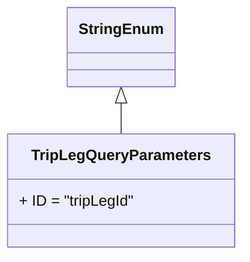

# Diagram: partview_core/partview_service/partview_service/api/trip_leg/common/TripLegQueryParameters.py

> Auto-generated by Obscura crawlers

## Mermaid

### SVG

<svg id="container" width="252.0390625" xmlns="http://www.w3.org/2000/svg" class="classDiagram" height="270" viewBox="0 0 252.0390625 270" role="graphics-document document" aria-roledescription="class"><g><defs><marker id="container_class-aggregationStart" class="marker aggregation class" refX="18" refY="7" markerWidth="190" markerHeight="240" orient="auto"><path d="M 18,7 L9,13 L1,7 L9,1 Z"></path></marker></defs><defs><marker id="container_class-aggregationEnd" class="marker aggregation class" refX="1" refY="7" markerWidth="20" markerHeight="28" orient="auto"><path d="M 18,7 L9,13 L1,7 L9,1 Z"></path></marker></defs><defs><marker id="container_class-extensionStart" class="marker extension class" refX="18" refY="7" markerWidth="190" markerHeight="240" orient="auto"><path d="M 1,7 L18,13 V 1 Z"></path></marker></defs><defs><marker id="container_class-extensionEnd" class="marker extension class" refX="1" refY="7" markerWidth="20" markerHeight="28" orient="auto"><path d="M 1,1 V 13 L18,7 Z"></path></marker></defs><defs><marker id="container_class-compositionStart" class="marker composition class" refX="18" refY="7" markerWidth="190" markerHeight="240" orient="auto"><path d="M 18,7 L9,13 L1,7 L9,1 Z"></path></marker></defs><defs><marker id="container_class-compositionEnd" class="marker composition class" refX="1" refY="7" markerWidth="20" markerHeight="28" orient="auto"><path d="M 18,7 L9,13 L1,7 L9,1 Z"></path></marker></defs><defs><marker id="container_class-dependencyStart" class="marker dependency class" refX="6" refY="7" markerWidth="190" markerHeight="240" orient="auto"><path d="M 5,7 L9,13 L1,7 L9,1 Z"></path></marker></defs><defs><marker id="container_class-dependencyEnd" class="marker dependency class" refX="13" refY="7" markerWidth="20" markerHeight="28" orient="auto"><path d="M 18,7 L9,13 L14,7 L9,1 Z"></path></marker></defs><defs><marker id="container_class-lollipopStart" class="marker lollipop class" refX="13" refY="7" markerWidth="190" markerHeight="240" orient="auto"><circle stroke="black" fill="transparent" cx="7" cy="7" r="6"></circle></marker></defs><defs><marker id="container_class-lollipopEnd" class="marker lollipop class" refX="1" refY="7" markerWidth="190" markerHeight="240" orient="auto"><circle stroke="black" fill="transparent" cx="7" cy="7" r="6"></circle></marker></defs><g class="root"><g class="clusters"></g><g class="edgePaths"><path d="M126.02,109.25L126.02,110.542C126.02,111.833,126.02,114.417,126.02,119.875C126.02,125.333,126.02,133.667,126.02,137.833L126.02,142" id="id_StringEnum_TripLegQueryParameters_1" class="edge-thickness-normal edge-pattern-solid relation" style=";;;" data-edge="true" data-et="edge" data-id="id_StringEnum_TripLegQueryParameters_1" data-points="W3sieCI6MTI2LjAxOTUzMTI1LCJ5Ijo5Mn0seyJ4IjoxMjYuMDE5NTMxMjUsInkiOjExN30seyJ4IjoxMjYuMDE5NTMxMjUsInkiOjE0Mn1d" marker-start="url(#container_class-extensionStart)"></path></g><g class="edgeLabels"><g class="edgeLabel"><g class="label" data-id="id_StringEnum_TripLegQueryParameters_1" transform="translate(0, 0)"><foreignObject width="0" height="0">

</foreignObject></g></g></g><g class="nodes"><g class="node default" id="classId-StringEnum-0" transform="translate(126.01953125, 50)"><g class="basic label-container"><path d="M-54.234375 -42 L54.234375 -42 L54.234375 42 L-54.234375 42" stroke="none" stroke-width="0" fill="#ECECFF" style=""></path><path d="M-54.234375 -42 C-31.855724697142435 -42, -9.47707439428487 -42, 54.234375 -42 M-54.234375 -42 C-17.367638959588973 -42, 19.499097080822054 -42, 54.234375 -42 M54.234375 -42 C54.234375 -8.63379285418204, 54.234375 24.73241429163592, 54.234375 42 M54.234375 -42 C54.234375 -14.450653973701769, 54.234375 13.098692052596462, 54.234375 42 M54.234375 42 C17.924641184255243 42, -18.385092631489513 42, -54.234375 42 M54.234375 42 C12.759981211660708 42, -28.714412576678583 42, -54.234375 42 M-54.234375 42 C-54.234375 17.70510489520911, -54.234375 -6.589790209581778, -54.234375 -42 M-54.234375 42 C-54.234375 18.29141461675313, -54.234375 -5.41717076649374, -54.234375 -42" stroke="#9370DB" stroke-width="1.3" fill="none" stroke-dasharray="0 0" style=""></path></g><g class="annotation-group text" transform="translate(0, -18)"></g><g class="label-group text" transform="translate(-42.234375, -18)"><g class="label" style="font-weight: bolder" transform="translate(0,-12)"><foreignObject width="84.46875" height="24">

StringEnum

</foreignObject></g></g><g class="members-group text" transform="translate(-42.234375, 30)"></g><g class="methods-group text" transform="translate(-42.234375, 60)"></g><g class="divider" style=""><path d="M-54.234375 6 C-27.138765000027707 6, -0.04315500005541395 6, 54.234375 6 M-54.234375 6 C-19.795299497490234 6, 14.643776005019532 6, 54.234375 6" stroke="#9370DB" stroke-width="1.3" fill="none" stroke-dasharray="0 0" style=""></path></g><g class="divider" style=""><path d="M-54.234375 24 C-20.577304927349488 24, 13.079765145301025 24, 54.234375 24 M-54.234375 24 C-24.893783352835236 24, 4.446808294329529 24, 54.234375 24" stroke="#9370DB" stroke-width="1.3" fill="none" stroke-dasharray="0 0" style=""></path></g></g><g class="node default" id="classId-TripLegQueryParameters-1" transform="translate(126.01953125, 202)"><g class="basic label-container"><path d="M-118.01953125 -60 L118.01953125 -60 L118.01953125 60 L-118.01953125 60" stroke="none" stroke-width="0" fill="#ECECFF" style=""></path><path d="M-118.01953125 -60 C-48.66564099083372 -60, 20.688249268332555 -60, 118.01953125 -60 M-118.01953125 -60 C-38.09597472421768 -60, 41.827581801564634 -60, 118.01953125 -60 M118.01953125 -60 C118.01953125 -19.52797226400905, 118.01953125 20.944055471981898, 118.01953125 60 M118.01953125 -60 C118.01953125 -20.414951325294155, 118.01953125 19.17009734941169, 118.01953125 60 M118.01953125 60 C64.9932462139162 60, 11.966961177832403 60, -118.01953125 60 M118.01953125 60 C36.000588317552115 60, -46.01835461489577 60, -118.01953125 60 M-118.01953125 60 C-118.01953125 12.357533213747054, -118.01953125 -35.28493357250589, -118.01953125 -60 M-118.01953125 60 C-118.01953125 20.622829630782093, -118.01953125 -18.754340738435815, -118.01953125 -60" stroke="#9370DB" stroke-width="1.3" fill="none" stroke-dasharray="0 0" style=""></path></g><g class="annotation-group text" transform="translate(0, -36)"></g><g class="label-group text" transform="translate(-90.5078125, -36)"><g class="label" style="font-weight: bolder" transform="translate(0,-12)"><foreignObject width="181.015625" height="24">

TripLegQueryParameters

</foreignObject></g></g><g class="members-group text" transform="translate(-106.01953125, 12)"><g class="label" style="" transform="translate(0,-12)"><foreignObject width="121.53125" height="24">

+ ID = "tripLegId"

</foreignObject></g></g><g class="methods-group text" transform="translate(-106.01953125, 60)"></g><g class="divider" style=""><path d="M-118.01953125 -12 C-50.1039928352419 -12, 17.811545579516206 -12, 118.01953125 -12 M-118.01953125 -12 C-26.836636599197874 -12, 64.34625805160425 -12, 118.01953125 -12" stroke="#9370DB" stroke-width="1.3" fill="none" stroke-dasharray="0 0" style=""></path></g><g class="divider" style=""><path d="M-118.01953125 36 C-62.450358017276294 36, -6.8811847845525875 36, 118.01953125 36 M-118.01953125 36 C-57.86273513006802 36, 2.294060989863965 36, 118.01953125 36" stroke="#9370DB" stroke-width="1.3" fill="none" stroke-dasharray="0 0" style=""></path></g></g></g></g></g></svg>
