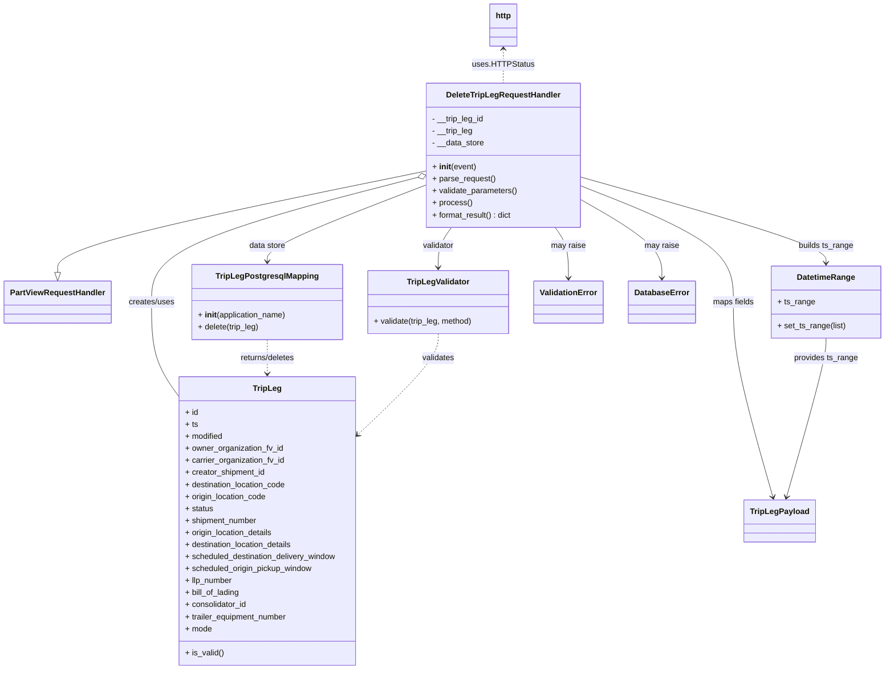

# Diagram: partview_core/partview_service/partview_service/api/trip_leg/handlers/delete_trip_leg_handler.py


> Auto-generated by Obscura crawlers

## Diagram 1



### SVG

<svg id="container" width="1752.9921875" xmlns="http://www.w3.org/2000/svg" class="classDiagram" height="1336" viewBox="0 0 1752.9921875 1336" role="graphics-document document" aria-roledescription="class"><style>#container{font-family:"trebuchet ms",verdana,arial,sans-serif;font-size:16px;fill:#333;}@keyframes edge-animation-frame{from{stroke-dashoffset:0;}}@keyframes dash{to{stroke-dashoffset:0;}}#container .edge-animation-slow{stroke-dasharray:9,5!important;stroke-dashoffset:900;animation:dash 50s linear infinite;stroke-linecap:round;}#container .edge-animation-fast{stroke-dasharray:9,5!important;stroke-dashoffset:900;animation:dash 20s linear infinite;stroke-linecap:round;}#container .error-icon{fill:#552222;}#container .error-text{fill:#552222;stroke:#552222;}#container .edge-thickness-normal{stroke-width:1px;}#container .edge-thickness-thick{stroke-width:3.5px;}#container .edge-pattern-solid{stroke-dasharray:0;}#container .edge-thickness-invisible{stroke-width:0;fill:none;}#container .edge-pattern-dashed{stroke-dasharray:3;}#container .edge-pattern-dotted{stroke-dasharray:2;}#container .marker{fill:#333333;stroke:#333333;}#container .marker.cross{stroke:#333333;}#container svg{font-family:"trebuchet ms",verdana,arial,sans-serif;font-size:16px;}#container p{margin:0;}#container g.classGroup text{fill:#9370DB;stroke:none;font-family:"trebuchet ms",verdana,arial,sans-serif;font-size:10px;}#container g.classGroup text .title{font-weight:bolder;}#container .nodeLabel,#container .edgeLabel{color:#131300;}#container .edgeLabel .label rect{fill:#ECECFF;}#container .label text{fill:#131300;}#container .labelBkg{background:#ECECFF;}#container .edgeLabel .label span{background:#ECECFF;}#container .classTitle{font-weight:bolder;}#container .node rect,#container .node circle,#container .node ellipse,#container .node polygon,#container .node path{fill:#ECECFF;stroke:#9370DB;stroke-width:1px;}#container .divider{stroke:#9370DB;stroke-width:1;}#container g.clickable{cursor:pointer;}#container g.classGroup rect{fill:#ECECFF;stroke:#9370DB;}#container g.classGroup line{stroke:#9370DB;stroke-width:1;}#container .classLabel .box{stroke:none;stroke-width:0;fill:#ECECFF;opacity:0.5;}#container .classLabel .label{fill:#9370DB;font-size:10px;}#container .relation{stroke:#333333;stroke-width:1;fill:none;}#container .dashed-line{stroke-dasharray:3;}#container .dotted-line{stroke-dasharray:1 2;}#container #compositionStart,#container .composition{fill:#333333!important;stroke:#333333!important;stroke-width:1;}#container #compositionEnd,#container .composition{fill:#333333!important;stroke:#333333!important;stroke-width:1;}#container #dependencyStart,#container .dependency{fill:#333333!important;stroke:#333333!important;stroke-width:1;}#container #dependencyStart,#container .dependency{fill:#333333!important;stroke:#333333!important;stroke-width:1;}#container #extensionStart,#container .extension{fill:transparent!important;stroke:#333333!important;stroke-width:1;}#container #extensionEnd,#container .extension{fill:transparent!important;stroke:#333333!important;stroke-width:1;}#container #aggregationStart,#container .aggregation{fill:transparent!important;stroke:#333333!important;stroke-width:1;}#container #aggregationEnd,#container .aggregation{fill:transparent!important;stroke:#333333!important;stroke-width:1;}#container #lollipopStart,#container .lollipop{fill:#ECECFF!important;stroke:#333333!important;stroke-width:1;}#container #lollipopEnd,#container .lollipop{fill:#ECECFF!important;stroke:#333333!important;stroke-width:1;}#container .edgeTerminals{font-size:11px;line-height:initial;}#container .classTitleText{text-anchor:middle;font-size:18px;fill:#333;}#container .label-icon{display:inline-block;height:1em;overflow:visible;vertical-align:-0.125em;}#container .node .label-icon path{fill:currentColor;stroke:revert;stroke-width:revert;}#container :root{--mermaid-font-family:"trebuchet ms",verdana,arial,sans-serif;}</style><g><defs><marker id="container_class-aggregationStart" class="marker aggregation class" refX="18" refY="7" markerWidth="190" markerHeight="240" orient="auto"><path d="M 18,7 L9,13 L1,7 L9,1 Z"></path></marker></defs><defs><marker id="container_class-aggregationEnd" class="marker aggregation class" refX="1" refY="7" markerWidth="20" markerHeight="28" orient="auto"><path d="M 18,7 L9,13 L1,7 L9,1 Z"></path></marker></defs><defs><marker id="container_class-extensionStart" class="marker extension class" refX="18" refY="7" markerWidth="190" markerHeight="240" orient="auto"><path d="M 1,7 L18,13 V 1 Z"></path></marker></defs><defs><marker id="container_class-extensionEnd" class="marker extension class" refX="1" refY="7" markerWidth="20" markerHeight="28" orient="auto"><path d="M 1,1 V 13 L18,7 Z"></path></marker></defs><defs><marker id="container_class-compositionStart" class="marker composition class" refX="18" refY="7" markerWidth="190" markerHeight="240" orient="auto"><path d="M 18,7 L9,13 L1,7 L9,1 Z"></path></marker></defs><defs><marker id="container_class-compositionEnd" class="marker composition class" refX="1" refY="7" markerWidth="20" markerHeight="28" orient="auto"><path d="M 18,7 L9,13 L1,7 L9,1 Z"></path></marker></defs><defs><marker id="container_class-dependencyStart" class="marker dependency class" refX="6" refY="7" markerWidth="190" markerHeight="240" orient="auto"><path d="M 5,7 L9,13 L1,7 L9,1 Z"></path></marker></defs><defs><marker id="container_class-dependencyEnd" class="marker dependency class" refX="13" refY="7" markerWidth="20" markerHeight="28" orient="auto"><path d="M 18,7 L9,13 L14,7 L9,1 Z"></path></marker></defs><defs><marker id="container_class-lollipopStart" class="marker lollipop class" refX="13" refY="7" markerWidth="190" markerHeight="240" orient="auto"><circle stroke="black" fill="transparent" cx="7" cy="7" r="6"></circle></marker></defs><defs><marker id="container_class-lollipopEnd" class="marker lollipop class" refX="1" refY="7" markerWidth="190" markerHeight="240" orient="auto"><circle stroke="black" fill="transparent" cx="7" cy="7" r="6"></circle></marker></defs><g class="root"><g class="clusters"></g><g class="edgePaths"><path d="M847.063,341.06L724.445,366.05C601.828,391.04,356.594,441.02,233.977,474.802C111.359,508.583,111.359,526.167,111.359,534.958L111.359,543.75" id="id_DeleteTripLegRequestHandler_PartViewRequestHandler_1" class="edge-thickness-normal edge-pattern-solid relation" style=";;;" data-edge="true" data-et="edge" data-id="id_DeleteTripLegRequestHandler_PartViewRequestHandler_1" data-points="W3sieCI6ODQ3LjA2MjUsInkiOjM0MS4wNjAzMDIxNzA2MTQyNX0seyJ4IjoxMTEuMzU5Mzc1LCJ5Ijo0OTF9LHsieCI6MTExLjM1OTM3NSwieSI6NTYxfV0=" marker-end="url(#container_class-extensionEnd)"></path><path d="M830.357,353.529L741.347,376.441C652.337,399.353,474.317,445.176,385.307,486.755C296.297,528.333,296.297,565.667,296.297,603C296.297,640.333,296.297,677.667,304.951,708.494C313.605,739.321,330.914,763.641,339.568,775.802L348.223,787.962" id="id_DeleteTripLegRequestHandler_TripLeg_2" class="edge-thickness-normal edge-pattern-solid relation" style=";;;" data-edge="true" data-et="edge" data-id="id_DeleteTripLegRequestHandler_TripLeg_2" data-points="W3sieCI6ODQ3LjA2MjUsInkiOjM0OS4yMjkzNTI2NTA2NzEzM30seyJ4IjoyOTYuMjk2ODc1LCJ5Ijo0OTF9LHsieCI6Mjk2LjI5Njg3NSwieSI6NjAzfSx7IngiOjI5Ni4yOTY4NzUsInkiOjcxNX0seyJ4IjozNDguMjIyNjU2MjUsInkiOjc4Ny45NjE5ODQwNTcyODU3fV0=" marker-start="url(#container_class-aggregationStart)"></path><path d="M847.063,368.458L793.818,388.882C740.573,409.306,634.083,450.153,580.839,475.743C527.594,501.333,527.594,511.667,527.594,516.833L527.594,522" id="id_DeleteTripLegRequestHandler_TripLegPostgresqlMapping_3" class="edge-thickness-normal edge-pattern-solid relation" style=";;;" data-edge="true" data-et="edge" data-id="id_DeleteTripLegRequestHandler_TripLegPostgresqlMapping_3" data-points="W3sieCI6ODQ3LjA2MjUsInkiOjM2OC40NTgzODk1NTYyMDQ5fSx7IngiOjUyNy41OTM3NSwieSI6NDkxfSx7IngiOjUyNy41OTM3NSwieSI6NTI4fV0=" marker-end="url(#container_class-dependencyEnd)"></path><path d="M896.217,454L891.795,460.167C887.374,466.333,878.531,478.667,874.109,492C869.688,505.333,869.688,519.667,869.688,526.833L869.688,534" id="id_DeleteTripLegRequestHandler_TripLegValidator_4" class="edge-thickness-normal edge-pattern-solid relation" style=";;;" data-edge="true" data-et="edge" data-id="id_DeleteTripLegRequestHandler_TripLegValidator_4" data-points="W3sieCI6ODk2LjIxNjU3MDI2OTMzNywieSI6NDU0fSx7IngiOjg2OS42ODc1LCJ5Ijo0OTF9LHsieCI6ODY5LjY4NzUsInkiOjU0MH1d" marker-end="url(#container_class-dependencyEnd)"></path><path d="M1151.867,353.29L1232.667,376.242C1313.467,399.194,1475.068,445.097,1555.868,473.715C1636.668,502.333,1636.668,513.667,1636.668,519.333L1636.668,525" id="id_DeleteTripLegRequestHandler_DatetimeRange_5" class="edge-thickness-normal edge-pattern-solid relation" style=";;;" data-edge="true" data-et="edge" data-id="id_DeleteTripLegRequestHandler_DatetimeRange_5" data-points="W3sieCI6MTE1MS44NjcxODc1LCJ5IjozNTMuMjkwNDcyMjc4NzU3MjV9LHsieCI6MTYzNi42Njc5Njg3NSwieSI6NDkxfSx7IngiOjE2MzYuNjY3OTY4NzUsInkiOjUzMX1d" marker-end="url(#container_class-dependencyEnd)"></path><path d="M1151.867,370.991L1201.846,390.992C1251.826,410.994,1351.784,450.997,1401.763,489.665C1451.742,528.333,1451.742,565.667,1451.742,603C1451.742,640.333,1451.742,677.667,1464.888,742.538C1478.033,807.41,1504.324,899.819,1517.469,946.024L1530.614,992.229" id="id_DeleteTripLegRequestHandler_TripLegPayload_6" class="edge-thickness-normal edge-pattern-solid relation" style=";;;" data-edge="true" data-et="edge" data-id="id_DeleteTripLegRequestHandler_TripLegPayload_6" data-points="W3sieCI6MTE1MS44NjcxODc1LCJ5IjozNzAuOTkwOTQ4NTg0ODUyN30seyJ4IjoxNDUxLjc0MjE4NzUsInkiOjQ5MX0seyJ4IjoxNDUxLjc0MjE4NzUsInkiOjYwM30seyJ4IjoxNDUxLjc0MjE4NzUsInkiOjcxNX0seyJ4IjoxNTMyLjI1NjAyNzY0NDIzMDcsInkiOjk5OH1d" marker-end="url(#container_class-dependencyEnd)"></path><path d="M1102.713,454L1107.135,460.167C1111.556,466.333,1120.399,478.667,1124.821,495.5C1129.242,512.333,1129.242,533.667,1129.242,544.333L1129.242,555" id="id_DeleteTripLegRequestHandler_ValidationError_7" class="edge-thickness-normal edge-pattern-solid relation" style=";;;" data-edge="true" data-et="edge" data-id="id_DeleteTripLegRequestHandler_ValidationError_7" data-points="W3sieCI6MTEwMi43MTMxMTcyMzA2NjMsInkiOjQ1NH0seyJ4IjoxMTI5LjI0MjE4NzUsInkiOjQ5MX0seyJ4IjoxMTI5LjI0MjE4NzUsInkiOjU2MX1d" marker-end="url(#container_class-dependencyEnd)"></path><path d="M1151.867,398.607L1178.353,414.006C1204.839,429.405,1257.81,460.202,1284.296,486.268C1310.781,512.333,1310.781,533.667,1310.781,544.333L1310.781,555" id="id_DeleteTripLegRequestHandler_DatabaseError_8" class="edge-thickness-normal edge-pattern-solid relation" style=";;;" data-edge="true" data-et="edge" data-id="id_DeleteTripLegRequestHandler_DatabaseError_8" data-points="W3sieCI6MTE1MS44NjcxODc1LCJ5IjozOTguNjA3MDM2NjUxMzE2OX0seyJ4IjoxMzEwLjc4MTI1LCJ5Ijo0OTF9LHsieCI6MTMxMC43ODEyNSwieSI6NTYxfV0=" marker-end="url(#container_class-dependencyEnd)"></path><path d="M527.594,678L527.594,684.167C527.594,690.333,527.594,702.667,527.594,714C527.594,725.333,527.594,735.667,527.594,740.833L527.594,746" id="id_TripLegPostgresqlMapping_TripLeg_9" class="edge-thickness-normal edge-pattern-dashed relation" style=";;;" data-edge="true" data-et="edge" data-id="id_TripLegPostgresqlMapping_TripLeg_9" data-points="W3sieCI6NTI3LjU5Mzc1LCJ5Ijo2Nzh9LHsieCI6NTI3LjU5Mzc1LCJ5Ijo3MTV9LHsieCI6NTI3LjU5Mzc1LCJ5Ijo3NTJ9XQ==" marker-end="url(#container_class-dependencyEnd)"></path><path d="M869.688,666L869.688,674.167C869.688,682.333,869.688,698.667,843.292,731.91C816.897,765.153,764.106,815.306,737.71,840.383L711.315,865.459" id="id_TripLegValidator_TripLeg_10" class="edge-thickness-normal edge-pattern-dashed relation" style=";;;" data-edge="true" data-et="edge" data-id="id_TripLegValidator_TripLeg_10" data-points="W3sieCI6ODY5LjY4NzUsInkiOjY2Nn0seyJ4Ijo4NjkuNjg3NSwieSI6NzE1fSx7IngiOjcwNi45NjQ4NDM3NSwieSI6ODY5LjU5MTcyNjA0MzY2NX1d" marker-end="url(#container_class-dependencyEnd)"></path><path d="M1636.668,675L1636.668,681.667C1636.668,688.333,1636.668,701.667,1623.523,754.538C1610.377,807.41,1584.087,899.819,1570.941,946.024L1557.796,992.229" id="id_DatetimeRange_TripLegPayload_11" class="edge-thickness-normal edge-pattern-solid relation" style=";;;" data-edge="true" data-et="edge" data-id="id_DatetimeRange_TripLegPayload_11" data-points="W3sieCI6MTYzNi42Njc5Njg3NSwieSI6Njc1fSx7IngiOjE2MzYuNjY3OTY4NzUsInkiOjcxNX0seyJ4IjoxNTU2LjE1NDEyODYwNTc2OTMsInkiOjk5OH1d" marker-end="url(#container_class-dependencyEnd)"></path><path d="M999.465,98L999.465,103.167C999.465,108.333,999.465,118.667,999.465,130C999.465,141.333,999.465,153.667,999.465,159.833L999.465,166" id="id_http_DeleteTripLegRequestHandler_12" class="edge-thickness-normal edge-pattern-dashed relation" style=";;;" data-edge="true" data-et="edge" data-id="id_http_DeleteTripLegRequestHandler_12" data-points="W3sieCI6OTk5LjQ2NDg0Mzc1LCJ5Ijo5Mn0seyJ4Ijo5OTkuNDY0ODQzNzUsInkiOjEyOX0seyJ4Ijo5OTkuNDY0ODQzNzUsInkiOjE2Nn1d" marker-start="url(#container_class-dependencyStart)"></path></g><g class="edgeLabels"><g class="edgeLabel"><g class="label" data-id="id_DeleteTripLegRequestHandler_PartViewRequestHandler_1" transform="translate(0, 0)"><foreignObject width="0" height="0"><div xmlns="http://www.w3.org/1999/xhtml" class="labelBkg" style="display: table-cell; white-space: nowrap; line-height: 1.5; max-width: 200px; text-align: center;"><span class="edgeLabel"></span></div></foreignObject></g></g><g class="edgeLabel" transform="translate(296.296875, 603)"><g class="label" data-id="id_DeleteTripLegRequestHandler_TripLeg_2" transform="translate(-46.578125, -12)"><foreignObject width="93.15625" height="24"><div xmlns="http://www.w3.org/1999/xhtml" class="labelBkg" style="display: table-cell; white-space: nowrap; line-height: 1.5; max-width: 200px; text-align: center;"><span class="edgeLabel"><p>creates/uses</p></span></div></foreignObject></g></g><g class="edgeLabel" transform="translate(527.59375, 491)"><g class="label" data-id="id_DeleteTripLegRequestHandler_TripLegPostgresqlMapping_3" transform="translate(-36.828125, -12)"><foreignObject width="73.65625" height="24"><div xmlns="http://www.w3.org/1999/xhtml" class="labelBkg" style="display: table-cell; white-space: nowrap; line-height: 1.5; max-width: 200px; text-align: center;"><span class="edgeLabel"><p>data store</p></span></div></foreignObject></g></g><g class="edgeLabel" transform="translate(869.6875, 491)"><g class="label" data-id="id_DeleteTripLegRequestHandler_TripLegValidator_4" transform="translate(-32.3515625, -12)"><foreignObject width="64.703125" height="24"><div xmlns="http://www.w3.org/1999/xhtml" class="labelBkg" style="display: table-cell; white-space: nowrap; line-height: 1.5; max-width: 200px; text-align: center;"><span class="edgeLabel"><p>validator</p></span></div></foreignObject></g></g><g class="edgeLabel" transform="translate(1636.66796875, 491)"><g class="label" data-id="id_DeleteTripLegRequestHandler_DatetimeRange_5" transform="translate(-55.4765625, -12)"><foreignObject width="110.953125" height="24"><div xmlns="http://www.w3.org/1999/xhtml" class="labelBkg" style="display: table-cell; white-space: nowrap; line-height: 1.5; max-width: 200px; text-align: center;"><span class="edgeLabel"><p>builds ts_range</p></span></div></foreignObject></g></g><g class="edgeLabel" transform="translate(1451.7421875, 603)"><g class="label" data-id="id_DeleteTripLegRequestHandler_TripLegPayload_6" transform="translate(-41.6015625, -12)"><foreignObject width="83.203125" height="24"><div xmlns="http://www.w3.org/1999/xhtml" class="labelBkg" style="display: table-cell; white-space: nowrap; line-height: 1.5; max-width: 200px; text-align: center;"><span class="edgeLabel"><p>maps fields</p></span></div></foreignObject></g></g><g class="edgeLabel" transform="translate(1129.2421875, 491)"><g class="label" data-id="id_DeleteTripLegRequestHandler_ValidationError_7" transform="translate(-34.65625, -12)"><foreignObject width="69.3125" height="24"><div xmlns="http://www.w3.org/1999/xhtml" class="labelBkg" style="display: table-cell; white-space: nowrap; line-height: 1.5; max-width: 200px; text-align: center;"><span class="edgeLabel"><p>may raise</p></span></div></foreignObject></g></g><g class="edgeLabel" transform="translate(1310.78125, 491)"><g class="label" data-id="id_DeleteTripLegRequestHandler_DatabaseError_8" transform="translate(-34.65625, -12)"><foreignObject width="69.3125" height="24"><div xmlns="http://www.w3.org/1999/xhtml" class="labelBkg" style="display: table-cell; white-space: nowrap; line-height: 1.5; max-width: 200px; text-align: center;"><span class="edgeLabel"><p>may raise</p></span></div></foreignObject></g></g><g class="edgeLabel" transform="translate(527.59375, 715)"><g class="label" data-id="id_TripLegPostgresqlMapping_TripLeg_9" transform="translate(-56.703125, -12)"><foreignObject width="113.40625" height="24"><div xmlns="http://www.w3.org/1999/xhtml" class="labelBkg" style="display: table-cell; white-space: nowrap; line-height: 1.5; max-width: 200px; text-align: center;"><span class="edgeLabel"><p>returns/deletes</p></span></div></foreignObject></g></g><g class="edgeLabel" transform="translate(869.6875, 715)"><g class="label" data-id="id_TripLegValidator_TripLeg_10" transform="translate(-32.6875, -12)"><foreignObject width="65.375" height="24"><div xmlns="http://www.w3.org/1999/xhtml" class="labelBkg" style="display: table-cell; white-space: nowrap; line-height: 1.5; max-width: 200px; text-align: center;"><span class="edgeLabel"><p>validates</p></span></div></foreignObject></g></g><g class="edgeLabel" transform="translate(1636.66796875, 715)"><g class="label" data-id="id_DatetimeRange_TripLegPayload_11" transform="translate(-64.296875, -12)"><foreignObject width="128.59375" height="24"><div xmlns="http://www.w3.org/1999/xhtml" class="labelBkg" style="display: table-cell; white-space: nowrap; line-height: 1.5; max-width: 200px; text-align: center;"><span class="edgeLabel"><p>provides ts_range</p></span></div></foreignObject></g></g><g class="edgeLabel" transform="translate(999.46484375, 129)"><g class="label" data-id="id_http_DeleteTripLegRequestHandler_12" transform="translate(-59.4375, -12)"><foreignObject width="118.875" height="24"><div xmlns="http://www.w3.org/1999/xhtml" class="labelBkg" style="display: table-cell; white-space: nowrap; line-height: 1.5; max-width: 200px; text-align: center;"><span class="edgeLabel"><p>uses.HTTPStatus</p></span></div></foreignObject></g></g></g><g class="nodes"><g class="node default" id="classId-DeleteTripLegRequestHandler-0" transform="translate(999.46484375, 310)"><g class="basic label-container"><path d="M-152.40234375 -144 L152.40234375 -144 L152.40234375 144 L-152.40234375 144" stroke="none" stroke-width="0" fill="#ECECFF" style=""></path><path d="M-152.40234375 -144 C-34.337053400839196 -144, 83.72823694832161 -144, 152.40234375 -144 M-152.40234375 -144 C-38.91587708902203 -144, 74.57058957195594 -144, 152.40234375 -144 M152.40234375 -144 C152.40234375 -44.40696495273595, 152.40234375 55.186070094528105, 152.40234375 144 M152.40234375 -144 C152.40234375 -47.62636755017887, 152.40234375 48.74726489964226, 152.40234375 144 M152.40234375 144 C58.09810831134608 144, -36.20612712730784 144, -152.40234375 144 M152.40234375 144 C89.25128868354633 144, 26.10023361709267 144, -152.40234375 144 M-152.40234375 144 C-152.40234375 45.849371577584904, -152.40234375 -52.30125684483019, -152.40234375 -144 M-152.40234375 144 C-152.40234375 45.460957114194144, -152.40234375 -53.07808577161171, -152.40234375 -144" stroke="#9370DB" stroke-width="1.3" fill="none" stroke-dasharray="0 0" style=""></path></g><g class="annotation-group text" transform="translate(0, -120)"></g><g class="label-group text" transform="translate(-109.8515625, -120)"><g class="label" style="font-weight: bolder" transform="translate(0,-12)"><foreignObject width="219.703125" height="24"><div xmlns="http://www.w3.org/1999/xhtml" style="display: table-cell; white-space: nowrap; line-height: 1.5; max-width: 267px; text-align: center;"><span class="nodeLabel markdown-node-label" style=""><p>DeleteTripLegRequestHandler</p></span></div></foreignObject></g></g><g class="members-group text" transform="translate(-140.40234375, -72)"><g class="label" style="" transform="translate(0,-12)"><foreignObject width="104.78125" height="24"><div xmlns="http://www.w3.org/1999/xhtml" style="display: table-cell; white-space: nowrap; line-height: 1.5; max-width: 162px; text-align: center;"><span class="nodeLabel markdown-node-label" style=""><p>- __trip_leg_id</p></span></div></foreignObject></g><g class="label" style="" transform="translate(0,12)"><foreignObject width="82.3125" height="24"><div xmlns="http://www.w3.org/1999/xhtml" style="display: table-cell; white-space: nowrap; line-height: 1.5; max-width: 140px; text-align: center;"><span class="nodeLabel markdown-node-label" style=""><p>- __trip_leg</p></span></div></foreignObject></g><g class="label" style="" transform="translate(0,36)"><foreignObject width="104.578125" height="24"><div xmlns="http://www.w3.org/1999/xhtml" style="display: table-cell; white-space: nowrap; line-height: 1.5; max-width: 162px; text-align: center;"><span class="nodeLabel markdown-node-label" style=""><p>- __data_store</p></span></div></foreignObject></g></g><g class="methods-group text" transform="translate(-140.40234375, 24)"><g class="label" style="" transform="translate(0,-12)"><foreignObject width="87.390625" height="24"><div xmlns="http://www.w3.org/1999/xhtml" style="display: table-cell; white-space: nowrap; line-height: 1.5; max-width: 177px; text-align: center;"><span class="nodeLabel markdown-node-label" style=""><p>+ <strong>init</strong>(event)</p></span></div></foreignObject></g><g class="label" style="" transform="translate(0,12)"><foreignObject width="126.046875" height="24"><div xmlns="http://www.w3.org/1999/xhtml" style="display: table-cell; white-space: nowrap; line-height: 1.5; max-width: 183px; text-align: center;"><span class="nodeLabel markdown-node-label" style=""><p>+ parse_request()</p></span></div></foreignObject></g><g class="label" style="" transform="translate(0,36)"><foreignObject width="170.953125" height="24"><div xmlns="http://www.w3.org/1999/xhtml" style="display: table-cell; white-space: nowrap; line-height: 1.5; max-width: 228px; text-align: center;"><span class="nodeLabel markdown-node-label" style=""><p>+ validate_parameters()</p></span></div></foreignObject></g><g class="label" style="" transform="translate(0,60)"><foreignObject width="77.96875" height="24"><div xmlns="http://www.w3.org/1999/xhtml" style="display: table-cell; white-space: nowrap; line-height: 1.5; max-width: 135px; text-align: center;"><span class="nodeLabel markdown-node-label" style=""><p>+ process()</p></span></div></foreignObject></g><g class="label" style="" transform="translate(0,84)"><foreignObject width="161.3125" height="24"><div xmlns="http://www.w3.org/1999/xhtml" style="display: table-cell; white-space: nowrap; line-height: 1.5; max-width: 219px; text-align: center;"><span class="nodeLabel markdown-node-label" style=""><p>+ format_result() : dict</p></span></div></foreignObject></g></g><g class="divider" style=""><path d="M-152.40234375 -96 C-80.58077944379168 -96, -8.759215137583368 -96, 152.40234375 -96 M-152.40234375 -96 C-36.66197862014148 -96, 79.07838650971703 -96, 152.40234375 -96" stroke="#9370DB" stroke-width="1.3" fill="none" stroke-dasharray="0 0" style=""></path></g><g class="divider" style=""><path d="M-152.40234375 0 C-59.29246550288909 0, 33.817412744221826 0, 152.40234375 0 M-152.40234375 0 C-66.35544584025206 0, 19.69145206949588 0, 152.40234375 0" stroke="#9370DB" stroke-width="1.3" fill="none" stroke-dasharray="0 0" style=""></path></g></g><g class="node default" id="classId-PartViewRequestHandler-1" transform="translate(111.359375, 603)"><g class="basic label-container"><path d="M-103.359375 -42 L103.359375 -42 L103.359375 42 L-103.359375 42" stroke="none" stroke-width="0" fill="#ECECFF" style=""></path><path d="M-103.359375 -42 C-21.87273563626212 -42, 59.61390372747576 -42, 103.359375 -42 M-103.359375 -42 C-48.59489896816185 -42, 6.1695770636763 -42, 103.359375 -42 M103.359375 -42 C103.359375 -9.605497643885023, 103.359375 22.789004712229953, 103.359375 42 M103.359375 -42 C103.359375 -12.053879316896857, 103.359375 17.892241366206285, 103.359375 42 M103.359375 42 C42.88777620016943 42, -17.583822599661147 42, -103.359375 42 M103.359375 42 C56.48275929170732 42, 9.606143583414635 42, -103.359375 42 M-103.359375 42 C-103.359375 8.469669964419069, -103.359375 -25.060660071161863, -103.359375 -42 M-103.359375 42 C-103.359375 14.505087872899846, -103.359375 -12.989824254200308, -103.359375 -42" stroke="#9370DB" stroke-width="1.3" fill="none" stroke-dasharray="0 0" style=""></path></g><g class="annotation-group text" transform="translate(0, -18)"></g><g class="label-group text" transform="translate(-91.359375, -18)"><g class="label" style="font-weight: bolder" transform="translate(0,-12)"><foreignObject width="182.71875" height="24"><div xmlns="http://www.w3.org/1999/xhtml" style="display: table-cell; white-space: nowrap; line-height: 1.5; max-width: 231px; text-align: center;"><span class="nodeLabel markdown-node-label" style=""><p>PartViewRequestHandler</p></span></div></foreignObject></g></g><g class="members-group text" transform="translate(-91.359375, 30)"></g><g class="methods-group text" transform="translate(-91.359375, 60)"></g><g class="divider" style=""><path d="M-103.359375 6 C-43.4382515573082 6, 16.482871885383602 6, 103.359375 6 M-103.359375 6 C-60.47270054159599 6, -17.58602608319198 6, 103.359375 6" stroke="#9370DB" stroke-width="1.3" fill="none" stroke-dasharray="0 0" style=""></path></g><g class="divider" style=""><path d="M-103.359375 24 C-51.31541548195194 24, 0.7285440360961246 24, 103.359375 24 M-103.359375 24 C-50.82080337422244 24, 1.717768251555114 24, 103.359375 24" stroke="#9370DB" stroke-width="1.3" fill="none" stroke-dasharray="0 0" style=""></path></g></g><g class="node default" id="classId-TripLeg-2" transform="translate(527.59375, 1040)"><g class="basic label-container"><path d="M-179.37109375 -288 L179.37109375 -288 L179.37109375 288 L-179.37109375 288" stroke="none" stroke-width="0" fill="#ECECFF" style=""></path><path d="M-179.37109375 -288 C-95.72055245768188 -288, -12.070011165363752 -288, 179.37109375 -288 M-179.37109375 -288 C-102.90325222196121 -288, -26.43541069392242 -288, 179.37109375 -288 M179.37109375 -288 C179.37109375 -165.79533378225105, 179.37109375 -43.5906675645021, 179.37109375 288 M179.37109375 -288 C179.37109375 -110.98989016519502, 179.37109375 66.02021966960996, 179.37109375 288 M179.37109375 288 C87.62689553661087 288, -4.117302676778252 288, -179.37109375 288 M179.37109375 288 C73.90812727600097 288, -31.554839197998064 288, -179.37109375 288 M-179.37109375 288 C-179.37109375 163.4023402940677, -179.37109375 38.8046805881354, -179.37109375 -288 M-179.37109375 288 C-179.37109375 69.38342263129195, -179.37109375 -149.2331547374161, -179.37109375 -288" stroke="#9370DB" stroke-width="1.3" fill="none" stroke-dasharray="0 0" style=""></path></g><g class="annotation-group text" transform="translate(0, -264)"></g><g class="label-group text" transform="translate(-27.0546875, -264)"><g class="label" style="font-weight: bolder" transform="translate(0,-12)"><foreignObject width="54.109375" height="24"><div xmlns="http://www.w3.org/1999/xhtml" style="display: table-cell; white-space: nowrap; line-height: 1.5; max-width: 103px; text-align: center;"><span class="nodeLabel markdown-node-label" style=""><p>TripLeg</p></span></div></foreignObject></g></g><g class="members-group text" transform="translate(-167.37109375, -216)"><g class="label" style="" transform="translate(0,-12)"><foreignObject width="26.3125" height="24"><div xmlns="http://www.w3.org/1999/xhtml" style="display: table-cell; white-space: nowrap; line-height: 1.5; max-width: 84px; text-align: center;"><span class="nodeLabel markdown-node-label" style=""><p>+ id</p></span></div></foreignObject></g><g class="label" style="" transform="translate(0,12)"><foreignObject width="25.484375" height="24"><div xmlns="http://www.w3.org/1999/xhtml" style="display: table-cell; white-space: nowrap; line-height: 1.5; max-width: 83px; text-align: center;"><span class="nodeLabel markdown-node-label" style=""><p>+ ts</p></span></div></foreignObject></g><g class="label" style="" transform="translate(0,36)"><foreignObject width="76.859375" height="24"><div xmlns="http://www.w3.org/1999/xhtml" style="display: table-cell; white-space: nowrap; line-height: 1.5; max-width: 134px; text-align: center;"><span class="nodeLabel markdown-node-label" style=""><p>+ modified</p></span></div></foreignObject></g><g class="label" style="" transform="translate(0,60)"><foreignObject width="197.546875" height="24"><div xmlns="http://www.w3.org/1999/xhtml" style="display: table-cell; white-space: nowrap; line-height: 1.5; max-width: 255px; text-align: center;"><span class="nodeLabel markdown-node-label" style=""><p>+ owner_organization_fv_id</p></span></div></foreignObject></g><g class="label" style="" transform="translate(0,84)"><foreignObject width="200.40625" height="24"><div xmlns="http://www.w3.org/1999/xhtml" style="display: table-cell; white-space: nowrap; line-height: 1.5; max-width: 258px; text-align: center;"><span class="nodeLabel markdown-node-label" style=""><p>+ carrier_organization_fv_id</p></span></div></foreignObject></g><g class="label" style="" transform="translate(0,108)"><foreignObject width="161.78125" height="24"><div xmlns="http://www.w3.org/1999/xhtml" style="display: table-cell; white-space: nowrap; line-height: 1.5; max-width: 219px; text-align: center;"><span class="nodeLabel markdown-node-label" style=""><p>+ creator_shipment_id</p></span></div></foreignObject></g><g class="label" style="" transform="translate(0,132)"><foreignObject width="205.640625" height="24"><div xmlns="http://www.w3.org/1999/xhtml" style="display: table-cell; white-space: nowrap; line-height: 1.5; max-width: 263px; text-align: center;"><span class="nodeLabel markdown-node-label" style=""><p>+ destination_location_code</p></span></div></foreignObject></g><g class="label" style="" transform="translate(0,156)"><foreignObject width="164.75" height="24"><div xmlns="http://www.w3.org/1999/xhtml" style="display: table-cell; white-space: nowrap; line-height: 1.5; max-width: 222px; text-align: center;"><span class="nodeLabel markdown-node-label" style=""><p>+ origin_location_code</p></span></div></foreignObject></g><g class="label" style="" transform="translate(0,180)"><foreignObject width="56.625" height="24"><div xmlns="http://www.w3.org/1999/xhtml" style="display: table-cell; white-space: nowrap; line-height: 1.5; max-width: 114px; text-align: center;"><span class="nodeLabel markdown-node-label" style=""><p>+ status</p></span></div></foreignObject></g><g class="label" style="" transform="translate(0,204)"><foreignObject width="145.796875" height="24"><div xmlns="http://www.w3.org/1999/xhtml" style="display: table-cell; white-space: nowrap; line-height: 1.5; max-width: 204px; text-align: center;"><span class="nodeLabel markdown-node-label" style=""><p>+ shipment_number</p></span></div></foreignObject></g><g class="label" style="" transform="translate(0,228)"><foreignObject width="179.109375" height="24"><div xmlns="http://www.w3.org/1999/xhtml" style="display: table-cell; white-space: nowrap; line-height: 1.5; max-width: 236px; text-align: center;"><span class="nodeLabel markdown-node-label" style=""><p>+ origin_location_details</p></span></div></foreignObject></g><g class="label" style="" transform="translate(0,252)"><foreignObject width="220.015625" height="24"><div xmlns="http://www.w3.org/1999/xhtml" style="display: table-cell; white-space: nowrap; line-height: 1.5; max-width: 277px; text-align: center;"><span class="nodeLabel markdown-node-label" style=""><p>+ destination_location_details</p></span></div></foreignObject></g><g class="label" style="" transform="translate(0,276)"><foreignObject width="307.6875" height="24"><div xmlns="http://www.w3.org/1999/xhtml" style="display: table-cell; white-space: nowrap; line-height: 1.5; max-width: 366px; text-align: center;"><span class="nodeLabel markdown-node-label" style=""><p>+ scheduled_destination_delivery_window</p></span></div></foreignObject></g><g class="label" style="" transform="translate(0,300)"><foreignObject width="257.765625" height="24"><div xmlns="http://www.w3.org/1999/xhtml" style="display: table-cell; white-space: nowrap; line-height: 1.5; max-width: 316px; text-align: center;"><span class="nodeLabel markdown-node-label" style=""><p>+ scheduled_origin_pickup_window</p></span></div></foreignObject></g><g class="label" style="" transform="translate(0,324)"><foreignObject width="95.90625" height="24"><div xmlns="http://www.w3.org/1999/xhtml" style="display: table-cell; white-space: nowrap; line-height: 1.5; max-width: 154px; text-align: center;"><span class="nodeLabel markdown-node-label" style=""><p>+ llp_number</p></span></div></foreignObject></g><g class="label" style="" transform="translate(0,348)"><foreignObject width="111.09375" height="24"><div xmlns="http://www.w3.org/1999/xhtml" style="display: table-cell; white-space: nowrap; line-height: 1.5; max-width: 169px; text-align: center;"><span class="nodeLabel markdown-node-label" style=""><p>+ bill_of_lading</p></span></div></foreignObject></g><g class="label" style="" transform="translate(0,372)"><foreignObject width="124.75" height="24"><div xmlns="http://www.w3.org/1999/xhtml" style="display: table-cell; white-space: nowrap; line-height: 1.5; max-width: 182px; text-align: center;"><span class="nodeLabel markdown-node-label" style=""><p>+ consolidator_id</p></span></div></foreignObject></g><g class="label" style="" transform="translate(0,396)"><foreignObject width="207.390625" height="24"><div xmlns="http://www.w3.org/1999/xhtml" style="display: table-cell; white-space: nowrap; line-height: 1.5; max-width: 266px; text-align: center;"><span class="nodeLabel markdown-node-label" style=""><p>+ trailer_equipment_number</p></span></div></foreignObject></g><g class="label" style="" transform="translate(0,420)"><foreignObject width="53.578125" height="24"><div xmlns="http://www.w3.org/1999/xhtml" style="display: table-cell; white-space: nowrap; line-height: 1.5; max-width: 111px; text-align: center;"><span class="nodeLabel markdown-node-label" style=""><p>+ mode</p></span></div></foreignObject></g></g><g class="methods-group text" transform="translate(-167.37109375, 264)"><g class="label" style="" transform="translate(0,-12)"><foreignObject width="77.03125" height="24"><div xmlns="http://www.w3.org/1999/xhtml" style="display: table-cell; white-space: nowrap; line-height: 1.5; max-width: 134px; text-align: center;"><span class="nodeLabel markdown-node-label" style=""><p>+ is_valid()</p></span></div></foreignObject></g></g><g class="divider" style=""><path d="M-179.37109375 -240 C-50.192928201360246 -240, 78.98523734727951 -240, 179.37109375 -240 M-179.37109375 -240 C-76.40626577210818 -240, 26.55856220578363 -240, 179.37109375 -240" stroke="#9370DB" stroke-width="1.3" fill="none" stroke-dasharray="0 0" style=""></path></g><g class="divider" style=""><path d="M-179.37109375 240 C-96.50566555776413 240, -13.640237365528264 240, 179.37109375 240 M-179.37109375 240 C-85.49662741818868 240, 8.37783891362264 240, 179.37109375 240" stroke="#9370DB" stroke-width="1.3" fill="none" stroke-dasharray="0 0" style=""></path></g></g><g class="node default" id="classId-TripLegPostgresqlMapping-3" transform="translate(527.59375, 603)"><g class="basic label-container"><path d="M-149.71875 -75 L149.71875 -75 L149.71875 75 L-149.71875 75" stroke="none" stroke-width="0" fill="#ECECFF" style=""></path><path d="M-149.71875 -75 C-89.37111258234063 -75, -29.02347516468126 -75, 149.71875 -75 M-149.71875 -75 C-36.260564100099316 -75, 77.19762179980137 -75, 149.71875 -75 M149.71875 -75 C149.71875 -25.63471254838045, 149.71875 23.730574903239102, 149.71875 75 M149.71875 -75 C149.71875 -43.87535045428849, 149.71875 -12.750700908576974, 149.71875 75 M149.71875 75 C79.1306171940516 75, 8.54248438810319 75, -149.71875 75 M149.71875 75 C70.85159035312527 75, -8.01556929374945 75, -149.71875 75 M-149.71875 75 C-149.71875 20.913957873891363, -149.71875 -33.172084252217275, -149.71875 -75 M-149.71875 75 C-149.71875 22.35995642680672, -149.71875 -30.280087146386563, -149.71875 -75" stroke="#9370DB" stroke-width="1.3" fill="none" stroke-dasharray="0 0" style=""></path></g><g class="annotation-group text" transform="translate(0, -51)"></g><g class="label-group text" transform="translate(-97.453125, -51)"><g class="label" style="font-weight: bolder" transform="translate(0,-12)"><foreignObject width="194.90625" height="24"><div xmlns="http://www.w3.org/1999/xhtml" style="display: table-cell; white-space: nowrap; line-height: 1.5; max-width: 241px; text-align: center;"><span class="nodeLabel markdown-node-label" style=""><p>TripLegPostgresqlMapping</p></span></div></foreignObject></g></g><g class="members-group text" transform="translate(-137.71875, -3)"></g><g class="methods-group text" transform="translate(-137.71875, 27)"><g class="label" style="" transform="translate(0,-12)"><foreignObject width="177.984375" height="24"><div xmlns="http://www.w3.org/1999/xhtml" style="display: table-cell; white-space: nowrap; line-height: 1.5; max-width: 268px; text-align: center;"><span class="nodeLabel markdown-node-label" style=""><p>+ <strong>init</strong>(application_name)</p></span></div></foreignObject></g><g class="label" style="" transform="translate(0,12)"><foreignObject width="123.921875" height="24"><div xmlns="http://www.w3.org/1999/xhtml" style="display: table-cell; white-space: nowrap; line-height: 1.5; max-width: 181px; text-align: center;"><span class="nodeLabel markdown-node-label" style=""><p>+ delete(trip_leg)</p></span></div></foreignObject></g></g><g class="divider" style=""><path d="M-149.71875 -27 C-65.1572321982663 -27, 19.4042856034674 -27, 149.71875 -27 M-149.71875 -27 C-86.58783110521571 -27, -23.456912210431426 -27, 149.71875 -27" stroke="#9370DB" stroke-width="1.3" fill="none" stroke-dasharray="0 0" style=""></path></g><g class="divider" style=""><path d="M-149.71875 -3 C-67.18265039844323 -3, 15.353449203113541 -3, 149.71875 -3 M-149.71875 -3 C-80.93839823944455 -3, -12.158046478889105 -3, 149.71875 -3" stroke="#9370DB" stroke-width="1.3" fill="none" stroke-dasharray="0 0" style=""></path></g></g><g class="node default" id="classId-TripLegValidator-4" transform="translate(869.6875, 603)"><g class="basic label-container"><path d="M-142.375 -63 L142.375 -63 L142.375 63 L-142.375 63" stroke="none" stroke-width="0" fill="#ECECFF" style=""></path><path d="M-142.375 -63 C-41.903110171207686 -63, 58.56877965758463 -63, 142.375 -63 M-142.375 -63 C-57.97294915836092 -63, 26.429101683278162 -63, 142.375 -63 M142.375 -63 C142.375 -35.04514956708245, 142.375 -7.090299134164894, 142.375 63 M142.375 -63 C142.375 -17.283327908808673, 142.375 28.433344182382655, 142.375 63 M142.375 63 C82.34810321562247 63, 22.32120643124493 63, -142.375 63 M142.375 63 C82.80343970851577 63, 23.231879417031536 63, -142.375 63 M-142.375 63 C-142.375 36.04100482541275, -142.375 9.082009650825498, -142.375 -63 M-142.375 63 C-142.375 28.073452246160066, -142.375 -6.853095507679868, -142.375 -63" stroke="#9370DB" stroke-width="1.3" fill="none" stroke-dasharray="0 0" style=""></path></g><g class="annotation-group text" transform="translate(0, -39)"></g><g class="label-group text" transform="translate(-60.234375, -39)"><g class="label" style="font-weight: bolder" transform="translate(0,-12)"><foreignObject width="120.46875" height="24"><div xmlns="http://www.w3.org/1999/xhtml" style="display: table-cell; white-space: nowrap; line-height: 1.5; max-width: 169px; text-align: center;"><span class="nodeLabel markdown-node-label" style=""><p>TripLegValidator</p></span></div></foreignObject></g></g><g class="members-group text" transform="translate(-130.375, 9)"></g><g class="methods-group text" transform="translate(-130.375, 39)"><g class="label" style="" transform="translate(0,-12)"><foreignObject width="200.515625" height="24"><div xmlns="http://www.w3.org/1999/xhtml" style="display: table-cell; white-space: nowrap; line-height: 1.5; max-width: 258px; text-align: center;"><span class="nodeLabel markdown-node-label" style=""><p>+ validate(trip_leg, method)</p></span></div></foreignObject></g></g><g class="divider" style=""><path d="M-142.375 -15 C-64.05134288062519 -15, 14.27231423874963 -15, 142.375 -15 M-142.375 -15 C-77.98386353722766 -15, -13.592727074455325 -15, 142.375 -15" stroke="#9370DB" stroke-width="1.3" fill="none" stroke-dasharray="0 0" style=""></path></g><g class="divider" style=""><path d="M-142.375 9 C-45.48624794056546 9, 51.402504118869075 9, 142.375 9 M-142.375 9 C-72.65434569556376 9, -2.9336913911275246 9, 142.375 9" stroke="#9370DB" stroke-width="1.3" fill="none" stroke-dasharray="0 0" style=""></path></g></g><g class="node default" id="classId-DatetimeRange-5" transform="translate(1636.66796875, 603)"><g class="basic label-container"><path d="M-108.32421875 -72 L108.32421875 -72 L108.32421875 72 L-108.32421875 72" stroke="none" stroke-width="0" fill="#ECECFF" style=""></path><path d="M-108.32421875 -72 C-25.95782022058971 -72, 56.40857830882058 -72, 108.32421875 -72 M-108.32421875 -72 C-45.47280274349619 -72, 17.378613263007622 -72, 108.32421875 -72 M108.32421875 -72 C108.32421875 -28.889189310980093, 108.32421875 14.221621378039814, 108.32421875 72 M108.32421875 -72 C108.32421875 -26.11531726150693, 108.32421875 19.769365476986138, 108.32421875 72 M108.32421875 72 C37.22570823145203 72, -33.872802287095936 72, -108.32421875 72 M108.32421875 72 C23.52109797325322 72, -61.28202280349356 72, -108.32421875 72 M-108.32421875 72 C-108.32421875 16.028808661264208, -108.32421875 -39.942382677471585, -108.32421875 -72 M-108.32421875 72 C-108.32421875 34.56587829858854, -108.32421875 -2.8682434028229267, -108.32421875 -72" stroke="#9370DB" stroke-width="1.3" fill="none" stroke-dasharray="0 0" style=""></path></g><g class="annotation-group text" transform="translate(0, -48)"></g><g class="label-group text" transform="translate(-55.8984375, -48)"><g class="label" style="font-weight: bolder" transform="translate(0,-12)"><foreignObject width="111.796875" height="24"><div xmlns="http://www.w3.org/1999/xhtml" style="display: table-cell; white-space: nowrap; line-height: 1.5; max-width: 160px; text-align: center;"><span class="nodeLabel markdown-node-label" style=""><p>DatetimeRange</p></span></div></foreignObject></g></g><g class="members-group text" transform="translate(-96.32421875, 0)"><g class="label" style="" transform="translate(0,-12)"><foreignObject width="73.953125" height="24"><div xmlns="http://www.w3.org/1999/xhtml" style="display: table-cell; white-space: nowrap; line-height: 1.5; max-width: 131px; text-align: center;"><span class="nodeLabel markdown-node-label" style=""><p>+ ts_range</p></span></div></foreignObject></g></g><g class="methods-group text" transform="translate(-96.32421875, 48)"><g class="label" style="" transform="translate(0,-12)"><foreignObject width="136.75" height="24"><div xmlns="http://www.w3.org/1999/xhtml" style="display: table-cell; white-space: nowrap; line-height: 1.5; max-width: 194px; text-align: center;"><span class="nodeLabel markdown-node-label" style=""><p>+ set_ts_range(list)</p></span></div></foreignObject></g></g><g class="divider" style=""><path d="M-108.32421875 -24 C-61.917635171343925 -24, -15.51105159268785 -24, 108.32421875 -24 M-108.32421875 -24 C-51.51253739067169 -24, 5.299143968656622 -24, 108.32421875 -24" stroke="#9370DB" stroke-width="1.3" fill="none" stroke-dasharray="0 0" style=""></path></g><g class="divider" style=""><path d="M-108.32421875 24 C-64.25359887557758 24, -20.182979001155175 24, 108.32421875 24 M-108.32421875 24 C-30.056561473814 24, 48.211095802372 24, 108.32421875 24" stroke="#9370DB" stroke-width="1.3" fill="none" stroke-dasharray="0 0" style=""></path></g></g><g class="node default" id="classId-TripLegPayload-6" transform="translate(1544.205078125, 1040)"><g class="basic label-container"><path d="M-67.953125 -42 L67.953125 -42 L67.953125 42 L-67.953125 42" stroke="none" stroke-width="0" fill="#ECECFF" style=""></path><path d="M-67.953125 -42 C-21.09536776654629 -42, 25.762389466907422 -42, 67.953125 -42 M-67.953125 -42 C-15.76285453164325 -42, 36.4274159367135 -42, 67.953125 -42 M67.953125 -42 C67.953125 -21.824743674911804, 67.953125 -1.649487349823609, 67.953125 42 M67.953125 -42 C67.953125 -18.592797821648, 67.953125 4.814404356704003, 67.953125 42 M67.953125 42 C20.394209753541496 42, -27.164705492917008 42, -67.953125 42 M67.953125 42 C37.16220062921227 42, 6.371276258424544 42, -67.953125 42 M-67.953125 42 C-67.953125 18.793578036189455, -67.953125 -4.41284392762109, -67.953125 -42 M-67.953125 42 C-67.953125 20.833291626495615, -67.953125 -0.3334167470087692, -67.953125 -42" stroke="#9370DB" stroke-width="1.3" fill="none" stroke-dasharray="0 0" style=""></path></g><g class="annotation-group text" transform="translate(0, -18)"></g><g class="label-group text" transform="translate(-55.953125, -18)"><g class="label" style="font-weight: bolder" transform="translate(0,-12)"><foreignObject width="111.90625" height="24"><div xmlns="http://www.w3.org/1999/xhtml" style="display: table-cell; white-space: nowrap; line-height: 1.5; max-width: 159px; text-align: center;"><span class="nodeLabel markdown-node-label" style=""><p>TripLegPayload</p></span></div></foreignObject></g></g><g class="members-group text" transform="translate(-55.953125, 30)"></g><g class="methods-group text" transform="translate(-55.953125, 60)"></g><g class="divider" style=""><path d="M-67.953125 6 C-30.642799859440615 6, 6.66752528111877 6, 67.953125 6 M-67.953125 6 C-25.139806929113824 6, 17.67351114177235 6, 67.953125 6" stroke="#9370DB" stroke-width="1.3" fill="none" stroke-dasharray="0 0" style=""></path></g><g class="divider" style=""><path d="M-67.953125 24 C-40.374114070989236 24, -12.795103141978473 24, 67.953125 24 M-67.953125 24 C-32.03034719455227 24, 3.8924306108954596 24, 67.953125 24" stroke="#9370DB" stroke-width="1.3" fill="none" stroke-dasharray="0 0" style=""></path></g></g><g class="node default" id="classId-ValidationError-7" transform="translate(1129.2421875, 603)"><g class="basic label-container"><path d="M-67.1796875 -42 L67.1796875 -42 L67.1796875 42 L-67.1796875 42" stroke="none" stroke-width="0" fill="#ECECFF" style=""></path><path d="M-67.1796875 -42 C-30.959162820555612 -42, 5.261361858888776 -42, 67.1796875 -42 M-67.1796875 -42 C-24.677576281189317 -42, 17.824534937621365 -42, 67.1796875 -42 M67.1796875 -42 C67.1796875 -13.82903902383607, 67.1796875 14.341921952327858, 67.1796875 42 M67.1796875 -42 C67.1796875 -18.900815133443785, 67.1796875 4.198369733112429, 67.1796875 42 M67.1796875 42 C16.590864527809323 42, -33.997958444381354 42, -67.1796875 42 M67.1796875 42 C18.874175171270984 42, -29.43133715745803 42, -67.1796875 42 M-67.1796875 42 C-67.1796875 11.042569985877918, -67.1796875 -19.914860028244163, -67.1796875 -42 M-67.1796875 42 C-67.1796875 16.14062472964749, -67.1796875 -9.718750540705017, -67.1796875 -42" stroke="#9370DB" stroke-width="1.3" fill="none" stroke-dasharray="0 0" style=""></path></g><g class="annotation-group text" transform="translate(0, -18)"></g><g class="label-group text" transform="translate(-55.1796875, -18)"><g class="label" style="font-weight: bolder" transform="translate(0,-12)"><foreignObject width="110.359375" height="24"><div xmlns="http://www.w3.org/1999/xhtml" style="display: table-cell; white-space: nowrap; line-height: 1.5; max-width: 160px; text-align: center;"><span class="nodeLabel markdown-node-label" style=""><p>ValidationError</p></span></div></foreignObject></g></g><g class="members-group text" transform="translate(-55.1796875, 30)"></g><g class="methods-group text" transform="translate(-55.1796875, 60)"></g><g class="divider" style=""><path d="M-67.1796875 6 C-15.73250066981096 6, 35.71468616037808 6, 67.1796875 6 M-67.1796875 6 C-27.884072119661376 6, 11.411543260677249 6, 67.1796875 6" stroke="#9370DB" stroke-width="1.3" fill="none" stroke-dasharray="0 0" style=""></path></g><g class="divider" style=""><path d="M-67.1796875 24 C-19.698524706727852 24, 27.782638086544296 24, 67.1796875 24 M-67.1796875 24 C-35.26361364690815 24, -3.3475397938162956 24, 67.1796875 24" stroke="#9370DB" stroke-width="1.3" fill="none" stroke-dasharray="0 0" style=""></path></g></g><g class="node default" id="classId-DatabaseError-8" transform="translate(1310.78125, 603)"><g class="basic label-container"><path d="M-64.359375 -42 L64.359375 -42 L64.359375 42 L-64.359375 42" stroke="none" stroke-width="0" fill="#ECECFF" style=""></path><path d="M-64.359375 -42 C-36.25605498481546 -42, -8.152734969630913 -42, 64.359375 -42 M-64.359375 -42 C-23.945162190149723 -42, 16.469050619700553 -42, 64.359375 -42 M64.359375 -42 C64.359375 -13.104120765935068, 64.359375 15.791758468129864, 64.359375 42 M64.359375 -42 C64.359375 -14.507746602547865, 64.359375 12.98450679490427, 64.359375 42 M64.359375 42 C35.00736011146361 42, 5.655345222927231 42, -64.359375 42 M64.359375 42 C21.506823969120056 42, -21.345727061759888 42, -64.359375 42 M-64.359375 42 C-64.359375 19.96999161306329, -64.359375 -2.0600167738734214, -64.359375 -42 M-64.359375 42 C-64.359375 16.64064224577019, -64.359375 -8.718715508459617, -64.359375 -42" stroke="#9370DB" stroke-width="1.3" fill="none" stroke-dasharray="0 0" style=""></path></g><g class="annotation-group text" transform="translate(0, -18)"></g><g class="label-group text" transform="translate(-52.359375, -18)"><g class="label" style="font-weight: bolder" transform="translate(0,-12)"><foreignObject width="104.71875" height="24"><div xmlns="http://www.w3.org/1999/xhtml" style="display: table-cell; white-space: nowrap; line-height: 1.5; max-width: 154px; text-align: center;"><span class="nodeLabel markdown-node-label" style=""><p>DatabaseError</p></span></div></foreignObject></g></g><g class="members-group text" transform="translate(-52.359375, 30)"></g><g class="methods-group text" transform="translate(-52.359375, 60)"></g><g class="divider" style=""><path d="M-64.359375 6 C-23.58011143241677 6, 17.199152135166457 6, 64.359375 6 M-64.359375 6 C-17.058052498633195 6, 30.24327000273361 6, 64.359375 6" stroke="#9370DB" stroke-width="1.3" fill="none" stroke-dasharray="0 0" style=""></path></g><g class="divider" style=""><path d="M-64.359375 24 C-30.724319623575568 24, 2.910735752848865 24, 64.359375 24 M-64.359375 24 C-28.658675459986902 24, 7.042024080026195 24, 64.359375 24" stroke="#9370DB" stroke-width="1.3" fill="none" stroke-dasharray="0 0" style=""></path></g></g><g class="node default" id="classId-http-9" transform="translate(999.46484375, 50)"><g class="basic label-container"><path d="M-27.5703125 -42 L27.5703125 -42 L27.5703125 42 L-27.5703125 42" stroke="none" stroke-width="0" fill="#ECECFF" style=""></path><path d="M-27.5703125 -42 C-7.67837363461819 -42, 12.21356523076362 -42, 27.5703125 -42 M-27.5703125 -42 C-8.321136467135773 -42, 10.928039565728454 -42, 27.5703125 -42 M27.5703125 -42 C27.5703125 -13.667545436822355, 27.5703125 14.66490912635529, 27.5703125 42 M27.5703125 -42 C27.5703125 -18.211896617798413, 27.5703125 5.5762067644031745, 27.5703125 42 M27.5703125 42 C13.077101086328522 42, -1.416110327342956 42, -27.5703125 42 M27.5703125 42 C8.03809215029344 42, -11.494128199413119 42, -27.5703125 42 M-27.5703125 42 C-27.5703125 12.010740965111143, -27.5703125 -17.978518069777714, -27.5703125 -42 M-27.5703125 42 C-27.5703125 11.127318651985107, -27.5703125 -19.745362696029787, -27.5703125 -42" stroke="#9370DB" stroke-width="1.3" fill="none" stroke-dasharray="0 0" style=""></path></g><g class="annotation-group text" transform="translate(0, -18)"></g><g class="label-group text" transform="translate(-15.5703125, -18)"><g class="label" style="font-weight: bolder" transform="translate(0,-12)"><foreignObject width="31.140625" height="24"><div xmlns="http://www.w3.org/1999/xhtml" style="display: table-cell; white-space: nowrap; line-height: 1.5; max-width: 80px; text-align: center;"><span class="nodeLabel markdown-node-label" style=""><p>http</p></span></div></foreignObject></g></g><g class="members-group text" transform="translate(-15.5703125, 30)"></g><g class="methods-group text" transform="translate(-15.5703125, 60)"></g><g class="divider" style=""><path d="M-27.5703125 6 C-11.196974679651621 6, 5.176363140696758 6, 27.5703125 6 M-27.5703125 6 C-9.333344717790201 6, 8.903623064419598 6, 27.5703125 6" stroke="#9370DB" stroke-width="1.3" fill="none" stroke-dasharray="0 0" style=""></path></g><g class="divider" style=""><path d="M-27.5703125 24 C-8.318468926683781 24, 10.933374646632437 24, 27.5703125 24 M-27.5703125 24 C-6.0722634088771485 24, 15.425785682245703 24, 27.5703125 24" stroke="#9370DB" stroke-width="1.3" fill="none" stroke-dasharray="0 0" style=""></path></g></g></g></g></g></svg>

## Diagram 2

```mermaid
sequenceDiagram
participant Client
participant Handler as DeleteTripLegRequestHandler
participant Validator as TripLegValidator
participant DataStore as TripLegPostgresqlMapping
participant Datetime as DatetimeRange

Client->>Handler: send event
Handler->>Handler: parse_request()\nget_path_parameter("tripLegId")\nconstruct TripLeg(id)
Handler->>Validator: validate(trip_leg, "DELETE")
Validator-->>Handler: validation result
Handler->>DataStore: delete(trip_leg)
DataStore-->>Handler: trip_leg (deleted/returned)
Handler->>Handler: if not trip_leg.is_valid() -> raise DatabaseError
alt trip leg valid
Handler->>Datetime: set_ts_range([...]) for windows in format_result
Datetime-->>Handler: ts_range
Handler-->>Client: return payload, 200
else invalid
Handler-->>Client: raise DatabaseError (error)
```

> SVG rendering failed for this diagram.
