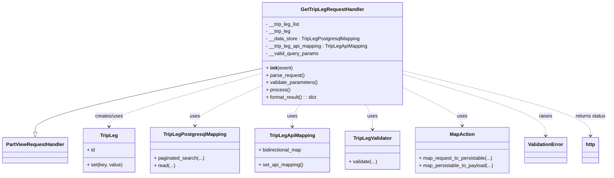

# Diagram: partview_core/partview_service/partview_service/api/trip_leg/handlers/get_trip_leg_handler.py


> Auto-generated by Obscura crawlers

## Diagram 1



### SVG

<svg id="container" width="1959.3046875" xmlns="http://www.w3.org/2000/svg" class="classDiagram" height="576" viewBox="0 0 1959.3046875 576" role="graphics-document document" aria-roledescription="class"><style>#container{font-family:"trebuchet ms",verdana,arial,sans-serif;font-size:16px;fill:#333;}@keyframes edge-animation-frame{from{stroke-dashoffset:0;}}@keyframes dash{to{stroke-dashoffset:0;}}#container .edge-animation-slow{stroke-dasharray:9,5!important;stroke-dashoffset:900;animation:dash 50s linear infinite;stroke-linecap:round;}#container .edge-animation-fast{stroke-dasharray:9,5!important;stroke-dashoffset:900;animation:dash 20s linear infinite;stroke-linecap:round;}#container .error-icon{fill:#552222;}#container .error-text{fill:#552222;stroke:#552222;}#container .edge-thickness-normal{stroke-width:1px;}#container .edge-thickness-thick{stroke-width:3.5px;}#container .edge-pattern-solid{stroke-dasharray:0;}#container .edge-thickness-invisible{stroke-width:0;fill:none;}#container .edge-pattern-dashed{stroke-dasharray:3;}#container .edge-pattern-dotted{stroke-dasharray:2;}#container .marker{fill:#333333;stroke:#333333;}#container .marker.cross{stroke:#333333;}#container svg{font-family:"trebuchet ms",verdana,arial,sans-serif;font-size:16px;}#container p{margin:0;}#container g.classGroup text{fill:#9370DB;stroke:none;font-family:"trebuchet ms",verdana,arial,sans-serif;font-size:10px;}#container g.classGroup text .title{font-weight:bolder;}#container .nodeLabel,#container .edgeLabel{color:#131300;}#container .edgeLabel .label rect{fill:#ECECFF;}#container .label text{fill:#131300;}#container .labelBkg{background:#ECECFF;}#container .edgeLabel .label span{background:#ECECFF;}#container .classTitle{font-weight:bolder;}#container .node rect,#container .node circle,#container .node ellipse,#container .node polygon,#container .node path{fill:#ECECFF;stroke:#9370DB;stroke-width:1px;}#container .divider{stroke:#9370DB;stroke-width:1;}#container g.clickable{cursor:pointer;}#container g.classGroup rect{fill:#ECECFF;stroke:#9370DB;}#container g.classGroup line{stroke:#9370DB;stroke-width:1;}#container .classLabel .box{stroke:none;stroke-width:0;fill:#ECECFF;opacity:0.5;}#container .classLabel .label{fill:#9370DB;font-size:10px;}#container .relation{stroke:#333333;stroke-width:1;fill:none;}#container .dashed-line{stroke-dasharray:3;}#container .dotted-line{stroke-dasharray:1 2;}#container #compositionStart,#container .composition{fill:#333333!important;stroke:#333333!important;stroke-width:1;}#container #compositionEnd,#container .composition{fill:#333333!important;stroke:#333333!important;stroke-width:1;}#container #dependencyStart,#container .dependency{fill:#333333!important;stroke:#333333!important;stroke-width:1;}#container #dependencyStart,#container .dependency{fill:#333333!important;stroke:#333333!important;stroke-width:1;}#container #extensionStart,#container .extension{fill:transparent!important;stroke:#333333!important;stroke-width:1;}#container #extensionEnd,#container .extension{fill:transparent!important;stroke:#333333!important;stroke-width:1;}#container #aggregationStart,#container .aggregation{fill:transparent!important;stroke:#333333!important;stroke-width:1;}#container #aggregationEnd,#container .aggregation{fill:transparent!important;stroke:#333333!important;stroke-width:1;}#container #lollipopStart,#container .lollipop{fill:#ECECFF!important;stroke:#333333!important;stroke-width:1;}#container #lollipopEnd,#container .lollipop{fill:#ECECFF!important;stroke:#333333!important;stroke-width:1;}#container .edgeTerminals{font-size:11px;line-height:initial;}#container .classTitleText{text-anchor:middle;font-size:18px;fill:#333;}#container .label-icon{display:inline-block;height:1em;overflow:visible;vertical-align:-0.125em;}#container .node .label-icon path{fill:currentColor;stroke:revert;stroke-width:revert;}#container :root{--mermaid-font-family:"trebuchet ms",verdana,arial,sans-serif;}</style><g><defs><marker id="container_class-aggregationStart" class="marker aggregation class" refX="18" refY="7" markerWidth="190" markerHeight="240" orient="auto"><path d="M 18,7 L9,13 L1,7 L9,1 Z"></path></marker></defs><defs><marker id="container_class-aggregationEnd" class="marker aggregation class" refX="1" refY="7" markerWidth="20" markerHeight="28" orient="auto"><path d="M 18,7 L9,13 L1,7 L9,1 Z"></path></marker></defs><defs><marker id="container_class-extensionStart" class="marker extension class" refX="18" refY="7" markerWidth="190" markerHeight="240" orient="auto"><path d="M 1,7 L18,13 V 1 Z"></path></marker></defs><defs><marker id="container_class-extensionEnd" class="marker extension class" refX="1" refY="7" markerWidth="20" markerHeight="28" orient="auto"><path d="M 1,1 V 13 L18,7 Z"></path></marker></defs><defs><marker id="container_class-compositionStart" class="marker composition class" refX="18" refY="7" markerWidth="190" markerHeight="240" orient="auto"><path d="M 18,7 L9,13 L1,7 L9,1 Z"></path></marker></defs><defs><marker id="container_class-compositionEnd" class="marker composition class" refX="1" refY="7" markerWidth="20" markerHeight="28" orient="auto"><path d="M 18,7 L9,13 L1,7 L9,1 Z"></path></marker></defs><defs><marker id="container_class-dependencyStart" class="marker dependency class" refX="6" refY="7" markerWidth="190" markerHeight="240" orient="auto"><path d="M 5,7 L9,13 L1,7 L9,1 Z"></path></marker></defs><defs><marker id="container_class-dependencyEnd" class="marker dependency class" refX="13" refY="7" markerWidth="20" markerHeight="28" orient="auto"><path d="M 18,7 L9,13 L14,7 L9,1 Z"></path></marker></defs><defs><marker id="container_class-lollipopStart" class="marker lollipop class" refX="13" refY="7" markerWidth="190" markerHeight="240" orient="auto"><circle stroke="black" fill="transparent" cx="7" cy="7" r="6"></circle></marker></defs><defs><marker id="container_class-lollipopEnd" class="marker lollipop class" refX="1" refY="7" markerWidth="190" markerHeight="240" orient="auto"><circle stroke="black" fill="transparent" cx="7" cy="7" r="6"></circle></marker></defs><g class="root"><g class="clusters"></g><g class="edgePaths"><path d="M836.279,225.237L715.459,251.197C594.639,277.158,352.999,329.079,232.179,363.831C111.359,398.583,111.359,416.167,111.359,424.958L111.359,433.75" id="id_GetTripLegRequestHandler_PartViewRequestHandler_1" class="edge-thickness-normal edge-pattern-solid relation" style=";;;" data-edge="true" data-et="edge" data-id="id_GetTripLegRequestHandler_PartViewRequestHandler_1" data-points="W3sieCI6ODM2LjI3OTI5Njg3NSwieSI6MjI1LjIzNjk2NDIzNDE2OTg3fSx7IngiOjExMS4zNTkzNzUsInkiOjM4MX0seyJ4IjoxMTEuMzU5Mzc1LCJ5Ijo0NTF9XQ==" marker-end="url(#container_class-extensionEnd)"></path><path d="M836.279,241.476L754.896,264.73C673.513,287.984,510.747,334.492,429.364,363.413C347.98,392.333,347.98,403.667,347.98,409.333L347.98,415" id="id_GetTripLegRequestHandler_TripLeg_2" class="edge-thickness-normal edge-pattern-dashed relation" style=";;;" data-edge="true" data-et="edge" data-id="id_GetTripLegRequestHandler_TripLeg_2" data-points="W3sieCI6ODM2LjI3OTI5Njg3NSwieSI6MjQxLjQ3NTc5NDQ0MjY0NDY4fSx7IngiOjM0Ny45ODA0Njg3NSwieSI6MzgxfSx7IngiOjM0Ny45ODA0Njg3NSwieSI6NDIxfV0=" marker-end="url(#container_class-dependencyEnd)"></path><path d="M836.279,282.231L800.771,298.692C765.262,315.154,694.244,348.077,658.735,369.705C623.227,391.333,623.227,401.667,623.227,406.833L623.227,412" id="id_GetTripLegRequestHandler_TripLegPostgresqlMapping_3" class="edge-thickness-normal edge-pattern-dashed relation" style=";;;" data-edge="true" data-et="edge" data-id="id_GetTripLegRequestHandler_TripLegPostgresqlMapping_3" data-points="W3sieCI6ODM2LjI3OTI5Njg3NSwieSI6MjgyLjIzMDkwMjc1NDc3MzQ3fSx7IngiOjYyMy4yMjY1NjI1LCJ5IjozODF9LHsieCI6NjIzLjIyNjU2MjUsInkiOjQxOH1d" marker-end="url(#container_class-dependencyEnd)"></path><path d="M959.344,344L955.45,350.167C951.556,356.333,943.768,368.667,939.874,380.5C935.98,392.333,935.98,403.667,935.98,409.333L935.98,415" id="id_GetTripLegRequestHandler_TripLegApiMapping_4" class="edge-thickness-normal edge-pattern-dashed relation" style=";;;" data-edge="true" data-et="edge" data-id="id_GetTripLegRequestHandler_TripLegApiMapping_4" data-points="W3sieCI6OTU5LjM0NDEyMTU3MDEyMiwieSI6MzQ0fSx7IngiOjkzNS45ODA0Njg3NSwieSI6MzgxfSx7IngiOjkzNS45ODA0Njg3NSwieSI6NDIxfV0=" marker-end="url(#container_class-dependencyEnd)"></path><path d="M1171.511,344L1175.405,350.167C1179.299,356.333,1187.087,368.667,1190.981,382C1194.875,395.333,1194.875,409.667,1194.875,416.833L1194.875,424" id="id_GetTripLegRequestHandler_TripLegValidator_5" class="edge-thickness-normal edge-pattern-dashed relation" style=";;;" data-edge="true" data-et="edge" data-id="id_GetTripLegRequestHandler_TripLegValidator_5" data-points="W3sieCI6MTE3MS41MTEzNDcxNzk4NzgyLCJ5IjozNDR9LHsieCI6MTE5NC44NzUsInkiOjM4MX0seyJ4IjoxMTk0Ljg3NSwieSI6NDMwfV0=" marker-end="url(#container_class-dependencyEnd)"></path><path d="M1294.576,287.722L1326.463,303.268C1358.349,318.815,1422.122,349.907,1454.008,370.62C1485.895,391.333,1485.895,401.667,1485.895,406.833L1485.895,412" id="id_GetTripLegRequestHandler_MapAction_6" class="edge-thickness-normal edge-pattern-dashed relation" style=";;;" data-edge="true" data-et="edge" data-id="id_GetTripLegRequestHandler_MapAction_6" data-points="W3sieCI6MTI5NC41NzYxNzE4NzUsInkiOjI4Ny43MjIwOTA4NjgxMjkyN30seyJ4IjoxNDg1Ljg5NDUzMTI1LCJ5IjozODF9LHsieCI6MTQ4NS44OTQ1MzEyNSwieSI6NDE4fV0=" marker-end="url(#container_class-dependencyEnd)"></path><path d="M1294.576,244.027L1371.475,266.856C1448.374,289.685,1602.171,335.342,1679.07,368.838C1755.969,402.333,1755.969,423.667,1755.969,434.333L1755.969,445" id="id_GetTripLegRequestHandler_ValidationError_7" class="edge-thickness-normal edge-pattern-dashed relation" style=";;;" data-edge="true" data-et="edge" data-id="id_GetTripLegRequestHandler_ValidationError_7" data-points="W3sieCI6MTI5NC41NzYxNzE4NzUsInkiOjI0NC4wMjY5OTQyMzI4OTU5Nn0seyJ4IjoxNzU1Ljk2ODc1LCJ5IjozODF9LHsieCI6MTc1NS45Njg3NSwieSI6NDUxfV0=" marker-end="url(#container_class-dependencyEnd)"></path><path d="M1294.576,232.238L1395.6,257.032C1496.624,281.826,1698.671,331.413,1799.695,366.873C1900.719,402.333,1900.719,423.667,1900.719,434.333L1900.719,445" id="id_GetTripLegRequestHandler_http_8" class="edge-thickness-normal edge-pattern-dashed relation" style=";;;" data-edge="true" data-et="edge" data-id="id_GetTripLegRequestHandler_http_8" data-points="W3sieCI6MTI5NC41NzYxNzE4NzUsInkiOjIzMi4yMzgzOTkzMjI4NDA4fSx7IngiOjE5MDAuNzE4NzUsInkiOjM4MX0seyJ4IjoxOTAwLjcxODc1LCJ5Ijo0NTF9XQ==" marker-end="url(#container_class-dependencyEnd)"></path></g><g class="edgeLabels"><g class="edgeLabel"><g class="label" data-id="id_GetTripLegRequestHandler_PartViewRequestHandler_1" transform="translate(0, 0)"><foreignObject width="0" height="0"><div xmlns="http://www.w3.org/1999/xhtml" class="labelBkg" style="display: table-cell; white-space: nowrap; line-height: 1.5; max-width: 200px; text-align: center;"><span class="edgeLabel"></span></div></foreignObject></g></g><g class="edgeLabel" transform="translate(347.98046875, 381)"><g class="label" data-id="id_GetTripLegRequestHandler_TripLeg_2" transform="translate(-46.578125, -12)"><foreignObject width="93.15625" height="24"><div xmlns="http://www.w3.org/1999/xhtml" class="labelBkg" style="display: table-cell; white-space: nowrap; line-height: 1.5; max-width: 200px; text-align: center;"><span class="edgeLabel"><p>creates/uses</p></span></div></foreignObject></g></g><g class="edgeLabel" transform="translate(623.2265625, 381)"><g class="label" data-id="id_GetTripLegRequestHandler_TripLegPostgresqlMapping_3" transform="translate(-16.4921875, -12)"><foreignObject width="32.984375" height="24"><div xmlns="http://www.w3.org/1999/xhtml" class="labelBkg" style="display: table-cell; white-space: nowrap; line-height: 1.5; max-width: 200px; text-align: center;"><span class="edgeLabel"><p>uses</p></span></div></foreignObject></g></g><g class="edgeLabel" transform="translate(935.98046875, 381)"><g class="label" data-id="id_GetTripLegRequestHandler_TripLegApiMapping_4" transform="translate(-16.4921875, -12)"><foreignObject width="32.984375" height="24"><div xmlns="http://www.w3.org/1999/xhtml" class="labelBkg" style="display: table-cell; white-space: nowrap; line-height: 1.5; max-width: 200px; text-align: center;"><span class="edgeLabel"><p>uses</p></span></div></foreignObject></g></g><g class="edgeLabel" transform="translate(1194.875, 381)"><g class="label" data-id="id_GetTripLegRequestHandler_TripLegValidator_5" transform="translate(-16.4921875, -12)"><foreignObject width="32.984375" height="24"><div xmlns="http://www.w3.org/1999/xhtml" class="labelBkg" style="display: table-cell; white-space: nowrap; line-height: 1.5; max-width: 200px; text-align: center;"><span class="edgeLabel"><p>uses</p></span></div></foreignObject></g></g><g class="edgeLabel" transform="translate(1485.89453125, 381)"><g class="label" data-id="id_GetTripLegRequestHandler_MapAction_6" transform="translate(-16.4921875, -12)"><foreignObject width="32.984375" height="24"><div xmlns="http://www.w3.org/1999/xhtml" class="labelBkg" style="display: table-cell; white-space: nowrap; line-height: 1.5; max-width: 200px; text-align: center;"><span class="edgeLabel"><p>uses</p></span></div></foreignObject></g></g><g class="edgeLabel" transform="translate(1755.96875, 381)"><g class="label" data-id="id_GetTripLegRequestHandler_ValidationError_7" transform="translate(-21.25, -12)"><foreignObject width="42.5" height="24"><div xmlns="http://www.w3.org/1999/xhtml" class="labelBkg" style="display: table-cell; white-space: nowrap; line-height: 1.5; max-width: 200px; text-align: center;"><span class="edgeLabel"><p>raises</p></span></div></foreignObject></g></g><g class="edgeLabel" transform="translate(1900.71875, 381)"><g class="label" data-id="id_GetTripLegRequestHandler_http_8" transform="translate(-50.5859375, -12)"><foreignObject width="101.171875" height="24"><div xmlns="http://www.w3.org/1999/xhtml" class="labelBkg" style="display: table-cell; white-space: nowrap; line-height: 1.5; max-width: 200px; text-align: center;"><span class="edgeLabel"><p>returns status</p></span></div></foreignObject></g></g></g><g class="nodes"><g class="node default" id="classId-GetTripLegRequestHandler-0" transform="translate(1065.427734375, 176)"><g class="basic label-container"><path d="M-229.1484375 -168 L229.1484375 -168 L229.1484375 168 L-229.1484375 168" stroke="none" stroke-width="0" fill="#ECECFF" style=""></path><path d="M-229.1484375 -168 C-48.67960682985478 -168, 131.78922384029045 -168, 229.1484375 -168 M-229.1484375 -168 C-71.33456854814321 -168, 86.47930040371358 -168, 229.1484375 -168 M229.1484375 -168 C229.1484375 -52.73331345960143, 229.1484375 62.53337308079713, 229.1484375 168 M229.1484375 -168 C229.1484375 -96.13735622664504, 229.1484375 -24.27471245329008, 229.1484375 168 M229.1484375 168 C65.9253894844619 168, -97.2976585310762 168, -229.1484375 168 M229.1484375 168 C64.03745479476908 168, -101.07352791046185 168, -229.1484375 168 M-229.1484375 168 C-229.1484375 94.09018158261857, -229.1484375 20.18036316523714, -229.1484375 -168 M-229.1484375 168 C-229.1484375 78.04460252206536, -229.1484375 -11.910794955869278, -229.1484375 -168" stroke="#9370DB" stroke-width="1.3" fill="none" stroke-dasharray="0 0" style=""></path></g><g class="annotation-group text" transform="translate(0, -144)"></g><g class="label-group text" transform="translate(-98.78125, -144)"><g class="label" style="font-weight: bolder" transform="translate(0,-12)"><foreignObject width="197.5625" height="24"><div xmlns="http://www.w3.org/1999/xhtml" style="display: table-cell; white-space: nowrap; line-height: 1.5; max-width: 245px; text-align: center;"><span class="nodeLabel markdown-node-label" style=""><p>GetTripLegRequestHandler</p></span></div></foreignObject></g></g><g class="members-group text" transform="translate(-217.1484375, -96)"><g class="label" style="" transform="translate(0,-12)"><foreignObject width="112.984375" height="24"><div xmlns="http://www.w3.org/1999/xhtml" style="display: table-cell; white-space: nowrap; line-height: 1.5; max-width: 171px; text-align: center;"><span class="nodeLabel markdown-node-label" style=""><p>- __trip_leg_list</p></span></div></foreignObject></g><g class="label" style="" transform="translate(0,12)"><foreignObject width="82.3125" height="24"><div xmlns="http://www.w3.org/1999/xhtml" style="display: table-cell; white-space: nowrap; line-height: 1.5; max-width: 140px; text-align: center;"><span class="nodeLabel markdown-node-label" style=""><p>- __trip_leg</p></span></div></foreignObject></g><g class="label" style="" transform="translate(0,36)"><foreignObject width="307.5" height="24"><div xmlns="http://www.w3.org/1999/xhtml" style="display: table-cell; white-space: nowrap; line-height: 1.5; max-width: 366px; text-align: center;"><span class="nodeLabel markdown-node-label" style=""><p>- __data_store : TripLegPostgresqlMapping</p></span></div></foreignObject></g><g class="label" style="" transform="translate(0,60)"><foreignObject width="335.515625" height="24"><div xmlns="http://www.w3.org/1999/xhtml" style="display: table-cell; white-space: nowrap; line-height: 1.5; max-width: 394px; text-align: center;"><span class="nodeLabel markdown-node-label" style=""><p>- __trip_leg_api_mapping : TripLegApiMapping</p></span></div></foreignObject></g><g class="label" style="" transform="translate(0,84)"><foreignObject width="172.671875" height="24"><div xmlns="http://www.w3.org/1999/xhtml" style="display: table-cell; white-space: nowrap; line-height: 1.5; max-width: 230px; text-align: center;"><span class="nodeLabel markdown-node-label" style=""><p>- __valid_query_params</p></span></div></foreignObject></g></g><g class="methods-group text" transform="translate(-217.1484375, 48)"><g class="label" style="" transform="translate(0,-12)"><foreignObject width="87.390625" height="24"><div xmlns="http://www.w3.org/1999/xhtml" style="display: table-cell; white-space: nowrap; line-height: 1.5; max-width: 177px; text-align: center;"><span class="nodeLabel markdown-node-label" style=""><p>+ <strong>init</strong>(event)</p></span></div></foreignObject></g><g class="label" style="" transform="translate(0,12)"><foreignObject width="126.046875" height="24"><div xmlns="http://www.w3.org/1999/xhtml" style="display: table-cell; white-space: nowrap; line-height: 1.5; max-width: 183px; text-align: center;"><span class="nodeLabel markdown-node-label" style=""><p>+ parse_request()</p></span></div></foreignObject></g><g class="label" style="" transform="translate(0,36)"><foreignObject width="170.953125" height="24"><div xmlns="http://www.w3.org/1999/xhtml" style="display: table-cell; white-space: nowrap; line-height: 1.5; max-width: 228px; text-align: center;"><span class="nodeLabel markdown-node-label" style=""><p>+ validate_parameters()</p></span></div></foreignObject></g><g class="label" style="" transform="translate(0,60)"><foreignObject width="77.96875" height="24"><div xmlns="http://www.w3.org/1999/xhtml" style="display: table-cell; white-space: nowrap; line-height: 1.5; max-width: 135px; text-align: center;"><span class="nodeLabel markdown-node-label" style=""><p>+ process()</p></span></div></foreignObject></g><g class="label" style="" transform="translate(0,84)"><foreignObject width="169.40625" height="24"><div xmlns="http://www.w3.org/1999/xhtml" style="display: table-cell; white-space: nowrap; line-height: 1.5; max-width: 227px; text-align: center;"><span class="nodeLabel markdown-node-label" style=""><p>+ format_result() : : dict</p></span></div></foreignObject></g></g><g class="divider" style=""><path d="M-229.1484375 -120 C-98.34717074422036 -120, 32.45409601155927 -120, 229.1484375 -120 M-229.1484375 -120 C-92.13092763782899 -120, 44.88658222434202 -120, 229.1484375 -120" stroke="#9370DB" stroke-width="1.3" fill="none" stroke-dasharray="0 0" style=""></path></g><g class="divider" style=""><path d="M-229.1484375 24 C-58.28798812759703 24, 112.57246124480594 24, 229.1484375 24 M-229.1484375 24 C-57.48530226380407 24, 114.17783297239185 24, 229.1484375 24" stroke="#9370DB" stroke-width="1.3" fill="none" stroke-dasharray="0 0" style=""></path></g></g><g class="node default" id="classId-PartViewRequestHandler-1" transform="translate(111.359375, 493)"><g class="basic label-container"><path d="M-103.359375 -42 L103.359375 -42 L103.359375 42 L-103.359375 42" stroke="none" stroke-width="0" fill="#ECECFF" style=""></path><path d="M-103.359375 -42 C-38.65180706363651 -42, 26.055760872726978 -42, 103.359375 -42 M-103.359375 -42 C-51.3468520533177 -42, 0.6656708933646058 -42, 103.359375 -42 M103.359375 -42 C103.359375 -19.702408079584487, 103.359375 2.5951838408310266, 103.359375 42 M103.359375 -42 C103.359375 -18.58167147042602, 103.359375 4.83665705914796, 103.359375 42 M103.359375 42 C28.445081934596686 42, -46.46921113080663 42, -103.359375 42 M103.359375 42 C25.129677807846946 42, -53.10001938430611 42, -103.359375 42 M-103.359375 42 C-103.359375 23.60271472279853, -103.359375 5.205429445597062, -103.359375 -42 M-103.359375 42 C-103.359375 17.82380739286803, -103.359375 -6.35238521426394, -103.359375 -42" stroke="#9370DB" stroke-width="1.3" fill="none" stroke-dasharray="0 0" style=""></path></g><g class="annotation-group text" transform="translate(0, -18)"></g><g class="label-group text" transform="translate(-91.359375, -18)"><g class="label" style="font-weight: bolder" transform="translate(0,-12)"><foreignObject width="182.71875" height="24"><div xmlns="http://www.w3.org/1999/xhtml" style="display: table-cell; white-space: nowrap; line-height: 1.5; max-width: 231px; text-align: center;"><span class="nodeLabel markdown-node-label" style=""><p>PartViewRequestHandler</p></span></div></foreignObject></g></g><g class="members-group text" transform="translate(-91.359375, 30)"></g><g class="methods-group text" transform="translate(-91.359375, 60)"></g><g class="divider" style=""><path d="M-103.359375 6 C-48.529952455378684 6, 6.299470089242632 6, 103.359375 6 M-103.359375 6 C-29.715850663956687 6, 43.92767367208663 6, 103.359375 6" stroke="#9370DB" stroke-width="1.3" fill="none" stroke-dasharray="0 0" style=""></path></g><g class="divider" style=""><path d="M-103.359375 24 C-46.61413655803681 24, 10.131101883926377 24, 103.359375 24 M-103.359375 24 C-38.54132951664597 24, 26.276715966708053 24, 103.359375 24" stroke="#9370DB" stroke-width="1.3" fill="none" stroke-dasharray="0 0" style=""></path></g></g><g class="node default" id="classId-TripLeg-2" transform="translate(347.98046875, 493)"><g class="basic label-container"><path d="M-83.26171875 -72 L83.26171875 -72 L83.26171875 72 L-83.26171875 72" stroke="none" stroke-width="0" fill="#ECECFF" style=""></path><path d="M-83.26171875 -72 C-30.791836106881362 -72, 21.678046536237275 -72, 83.26171875 -72 M-83.26171875 -72 C-25.277510749434967 -72, 32.706697251130066 -72, 83.26171875 -72 M83.26171875 -72 C83.26171875 -31.080263711813444, 83.26171875 9.839472576373112, 83.26171875 72 M83.26171875 -72 C83.26171875 -19.170401130306537, 83.26171875 33.659197739386926, 83.26171875 72 M83.26171875 72 C27.420339602019496 72, -28.42103954596101 72, -83.26171875 72 M83.26171875 72 C17.07006318145639 72, -49.12159238708722 72, -83.26171875 72 M-83.26171875 72 C-83.26171875 29.019221888671254, -83.26171875 -13.961556222657492, -83.26171875 -72 M-83.26171875 72 C-83.26171875 37.09133334327881, -83.26171875 2.1826666865576243, -83.26171875 -72" stroke="#9370DB" stroke-width="1.3" fill="none" stroke-dasharray="0 0" style=""></path></g><g class="annotation-group text" transform="translate(0, -48)"></g><g class="label-group text" transform="translate(-27.0546875, -48)"><g class="label" style="font-weight: bolder" transform="translate(0,-12)"><foreignObject width="54.109375" height="24"><div xmlns="http://www.w3.org/1999/xhtml" style="display: table-cell; white-space: nowrap; line-height: 1.5; max-width: 103px; text-align: center;"><span class="nodeLabel markdown-node-label" style=""><p>TripLeg</p></span></div></foreignObject></g></g><g class="members-group text" transform="translate(-71.26171875, 0)"><g class="label" style="" transform="translate(0,-12)"><foreignObject width="26.3125" height="24"><div xmlns="http://www.w3.org/1999/xhtml" style="display: table-cell; white-space: nowrap; line-height: 1.5; max-width: 84px; text-align: center;"><span class="nodeLabel markdown-node-label" style=""><p>+ id</p></span></div></foreignObject></g></g><g class="methods-group text" transform="translate(-71.26171875, 48)"><g class="label" style="" transform="translate(0,-12)"><foreignObject width="115.46875" height="24"><div xmlns="http://www.w3.org/1999/xhtml" style="display: table-cell; white-space: nowrap; line-height: 1.5; max-width: 173px; text-align: center;"><span class="nodeLabel markdown-node-label" style=""><p>+ set(key, value)</p></span></div></foreignObject></g></g><g class="divider" style=""><path d="M-83.26171875 -24 C-31.65122393152243 -24, 19.95927088695514 -24, 83.26171875 -24 M-83.26171875 -24 C-25.5612673562186 -24, 32.1391840375628 -24, 83.26171875 -24" stroke="#9370DB" stroke-width="1.3" fill="none" stroke-dasharray="0 0" style=""></path></g><g class="divider" style=""><path d="M-83.26171875 24 C-37.370444517606266 24, 8.520829714787467 24, 83.26171875 24 M-83.26171875 24 C-26.686598351809437 24, 29.888522046381127 24, 83.26171875 24" stroke="#9370DB" stroke-width="1.3" fill="none" stroke-dasharray="0 0" style=""></path></g></g><g class="node default" id="classId-TripLegPostgresqlMapping-3" transform="translate(623.2265625, 493)"><g class="basic label-container"><path d="M-141.984375 -75 L141.984375 -75 L141.984375 75 L-141.984375 75" stroke="none" stroke-width="0" fill="#ECECFF" style=""></path><path d="M-141.984375 -75 C-77.1194695982325 -75, -12.254564196464997 -75, 141.984375 -75 M-141.984375 -75 C-45.06840887405852 -75, 51.84755725188296 -75, 141.984375 -75 M141.984375 -75 C141.984375 -23.715288460395342, 141.984375 27.569423079209315, 141.984375 75 M141.984375 -75 C141.984375 -36.26102343819582, 141.984375 2.4779531236083585, 141.984375 75 M141.984375 75 C48.028374308591 75, -45.927626382818005 75, -141.984375 75 M141.984375 75 C38.37374908993846 75, -65.23687682012309 75, -141.984375 75 M-141.984375 75 C-141.984375 38.472383597629666, -141.984375 1.944767195259331, -141.984375 -75 M-141.984375 75 C-141.984375 22.38546683291804, -141.984375 -30.229066334163917, -141.984375 -75" stroke="#9370DB" stroke-width="1.3" fill="none" stroke-dasharray="0 0" style=""></path></g><g class="annotation-group text" transform="translate(0, -51)"></g><g class="label-group text" transform="translate(-97.453125, -51)"><g class="label" style="font-weight: bolder" transform="translate(0,-12)"><foreignObject width="194.90625" height="24"><div xmlns="http://www.w3.org/1999/xhtml" style="display: table-cell; white-space: nowrap; line-height: 1.5; max-width: 241px; text-align: center;"><span class="nodeLabel markdown-node-label" style=""><p>TripLegPostgresqlMapping</p></span></div></foreignObject></g></g><g class="members-group text" transform="translate(-129.984375, -3)"></g><g class="methods-group text" transform="translate(-129.984375, 27)"><g class="label" style="" transform="translate(0,-12)"><foreignObject width="162.515625" height="24"><div xmlns="http://www.w3.org/1999/xhtml" style="display: table-cell; white-space: nowrap; line-height: 1.5; max-width: 220px; text-align: center;"><span class="nodeLabel markdown-node-label" style=""><p>+ paginated_search(...)</p></span></div></foreignObject></g><g class="label" style="" transform="translate(0,12)"><foreignObject width="66.640625" height="24"><div xmlns="http://www.w3.org/1999/xhtml" style="display: table-cell; white-space: nowrap; line-height: 1.5; max-width: 124px; text-align: center;"><span class="nodeLabel markdown-node-label" style=""><p>+ read(...)</p></span></div></foreignObject></g></g><g class="divider" style=""><path d="M-141.984375 -27 C-54.33808233844165 -27, 33.3082103231167 -27, 141.984375 -27 M-141.984375 -27 C-72.49678562665659 -27, -3.0091962533131777 -27, 141.984375 -27" stroke="#9370DB" stroke-width="1.3" fill="none" stroke-dasharray="0 0" style=""></path></g><g class="divider" style=""><path d="M-141.984375 -3 C-46.99253892710311 -3, 47.999297145793776 -3, 141.984375 -3 M-141.984375 -3 C-44.332946418742836 -3, 53.31848216251433 -3, 141.984375 -3" stroke="#9370DB" stroke-width="1.3" fill="none" stroke-dasharray="0 0" style=""></path></g></g><g class="node default" id="classId-TripLegApiMapping-4" transform="translate(935.98046875, 493)"><g class="basic label-container"><path d="M-120.76953125 -72 L120.76953125 -72 L120.76953125 72 L-120.76953125 72" stroke="none" stroke-width="0" fill="#ECECFF" style=""></path><path d="M-120.76953125 -72 C-51.589220841195285 -72, 17.59108956760943 -72, 120.76953125 -72 M-120.76953125 -72 C-45.716237707563366 -72, 29.33705583487327 -72, 120.76953125 -72 M120.76953125 -72 C120.76953125 -32.80707325262041, 120.76953125 6.385853494759175, 120.76953125 72 M120.76953125 -72 C120.76953125 -38.24777517374612, 120.76953125 -4.495550347492241, 120.76953125 72 M120.76953125 72 C33.02018925690666 72, -54.72915273618668 72, -120.76953125 72 M120.76953125 72 C68.99736618817067 72, 17.225201126341332 72, -120.76953125 72 M-120.76953125 72 C-120.76953125 40.545988487334455, -120.76953125 9.09197697466891, -120.76953125 -72 M-120.76953125 72 C-120.76953125 30.594020419432184, -120.76953125 -10.811959161135633, -120.76953125 -72" stroke="#9370DB" stroke-width="1.3" fill="none" stroke-dasharray="0 0" style=""></path></g><g class="annotation-group text" transform="translate(0, -48)"></g><g class="label-group text" transform="translate(-70.3046875, -48)"><g class="label" style="font-weight: bolder" transform="translate(0,-12)"><foreignObject width="140.609375" height="24"><div xmlns="http://www.w3.org/1999/xhtml" style="display: table-cell; white-space: nowrap; line-height: 1.5; max-width: 189px; text-align: center;"><span class="nodeLabel markdown-node-label" style=""><p>TripLegApiMapping</p></span></div></foreignObject></g></g><g class="members-group text" transform="translate(-108.76953125, 0)"><g class="label" style="" transform="translate(0,-12)"><foreignObject width="144.875" height="24"><div xmlns="http://www.w3.org/1999/xhtml" style="display: table-cell; white-space: nowrap; line-height: 1.5; max-width: 202px; text-align: center;"><span class="nodeLabel markdown-node-label" style=""><p>+ bidirectional_map</p></span></div></foreignObject></g></g><g class="methods-group text" transform="translate(-108.76953125, 48)"><g class="label" style="" transform="translate(0,-12)"><foreignObject width="147.234375" height="24"><div xmlns="http://www.w3.org/1999/xhtml" style="display: table-cell; white-space: nowrap; line-height: 1.5; max-width: 205px; text-align: center;"><span class="nodeLabel markdown-node-label" style=""><p>+ set_api_mapping()</p></span></div></foreignObject></g></g><g class="divider" style=""><path d="M-120.76953125 -24 C-61.59997638235386 -24, -2.4304215147077173 -24, 120.76953125 -24 M-120.76953125 -24 C-71.318092116261 -24, -21.866652982522012 -24, 120.76953125 -24" stroke="#9370DB" stroke-width="1.3" fill="none" stroke-dasharray="0 0" style=""></path></g><g class="divider" style=""><path d="M-120.76953125 24 C-64.68134402481805 24, -8.593156799636091 24, 120.76953125 24 M-120.76953125 24 C-48.64099481229697 24, 23.487541625406067 24, 120.76953125 24" stroke="#9370DB" stroke-width="1.3" fill="none" stroke-dasharray="0 0" style=""></path></g></g><g class="node default" id="classId-TripLegValidator-5" transform="translate(1194.875, 493)"><g class="basic label-container"><path d="M-88.125 -63 L88.125 -63 L88.125 63 L-88.125 63" stroke="none" stroke-width="0" fill="#ECECFF" style=""></path><path d="M-88.125 -63 C-42.8465438440401 -63, 2.4319123119198025 -63, 88.125 -63 M-88.125 -63 C-32.394817308372836 -63, 23.335365383254327 -63, 88.125 -63 M88.125 -63 C88.125 -29.29995402246721, 88.125 4.400091955065577, 88.125 63 M88.125 -63 C88.125 -18.78221329013291, 88.125 25.435573419734183, 88.125 63 M88.125 63 C46.084704759842055 63, 4.044409519684109 63, -88.125 63 M88.125 63 C35.106935327134025 63, -17.91112934573195 63, -88.125 63 M-88.125 63 C-88.125 16.602808468715814, -88.125 -29.79438306256837, -88.125 -63 M-88.125 63 C-88.125 27.20178918534753, -88.125 -8.596421629304942, -88.125 -63" stroke="#9370DB" stroke-width="1.3" fill="none" stroke-dasharray="0 0" style=""></path></g><g class="annotation-group text" transform="translate(0, -39)"></g><g class="label-group text" transform="translate(-60.234375, -39)"><g class="label" style="font-weight: bolder" transform="translate(0,-12)"><foreignObject width="120.46875" height="24"><div xmlns="http://www.w3.org/1999/xhtml" style="display: table-cell; white-space: nowrap; line-height: 1.5; max-width: 169px; text-align: center;"><span class="nodeLabel markdown-node-label" style=""><p>TripLegValidator</p></span></div></foreignObject></g></g><g class="members-group text" transform="translate(-76.125, 9)"></g><g class="methods-group text" transform="translate(-76.125, 39)"><g class="label" style="" transform="translate(0,-12)"><foreignObject width="92.015625" height="24"><div xmlns="http://www.w3.org/1999/xhtml" style="display: table-cell; white-space: nowrap; line-height: 1.5; max-width: 149px; text-align: center;"><span class="nodeLabel markdown-node-label" style=""><p>+ validate(...)</p></span></div></foreignObject></g></g><g class="divider" style=""><path d="M-88.125 -15 C-52.74112648533867 -15, -17.357252970677337 -15, 88.125 -15 M-88.125 -15 C-48.3294793576299 -15, -8.5339587152598 -15, 88.125 -15" stroke="#9370DB" stroke-width="1.3" fill="none" stroke-dasharray="0 0" style=""></path></g><g class="divider" style=""><path d="M-88.125 9 C-30.87494011297653 9, 26.375119774046937 9, 88.125 9 M-88.125 9 C-38.66108502843308 9, 10.802829943133844 9, 88.125 9" stroke="#9370DB" stroke-width="1.3" fill="none" stroke-dasharray="0 0" style=""></path></g></g><g class="node default" id="classId-MapAction-6" transform="translate(1485.89453125, 493)"><g class="basic label-container"><path d="M-152.89453125 -75 L152.89453125 -75 L152.89453125 75 L-152.89453125 75" stroke="none" stroke-width="0" fill="#ECECFF" style=""></path><path d="M-152.89453125 -75 C-59.13049014668111 -75, 34.63355095663778 -75, 152.89453125 -75 M-152.89453125 -75 C-59.49144305045702 -75, 33.911645149085956 -75, 152.89453125 -75 M152.89453125 -75 C152.89453125 -42.58620924247774, 152.89453125 -10.172418484955486, 152.89453125 75 M152.89453125 -75 C152.89453125 -34.31680224219417, 152.89453125 6.366395515611657, 152.89453125 75 M152.89453125 75 C60.30874704518271 75, -32.277037159634574 75, -152.89453125 75 M152.89453125 75 C36.44500438981008 75, -80.00452247037984 75, -152.89453125 75 M-152.89453125 75 C-152.89453125 28.046749842599795, -152.89453125 -18.90650031480041, -152.89453125 -75 M-152.89453125 75 C-152.89453125 28.17315496168554, -152.89453125 -18.65369007662892, -152.89453125 -75" stroke="#9370DB" stroke-width="1.3" fill="none" stroke-dasharray="0 0" style=""></path></g><g class="annotation-group text" transform="translate(0, -51)"></g><g class="label-group text" transform="translate(-38.6328125, -51)"><g class="label" style="font-weight: bolder" transform="translate(0,-12)"><foreignObject width="77.265625" height="24"><div xmlns="http://www.w3.org/1999/xhtml" style="display: table-cell; white-space: nowrap; line-height: 1.5; max-width: 126px; text-align: center;"><span class="nodeLabel markdown-node-label" style=""><p>MapAction</p></span></div></foreignObject></g></g><g class="members-group text" transform="translate(-140.89453125, -3)"></g><g class="methods-group text" transform="translate(-140.89453125, 27)"><g class="label" style="" transform="translate(0,-12)"><foreignObject width="241" height="24"><div xmlns="http://www.w3.org/1999/xhtml" style="display: table-cell; white-space: nowrap; line-height: 1.5; max-width: 298px; text-align: center;"><span class="nodeLabel markdown-node-label" style=""><p>+ map_request_to_persistable(...)</p></span></div></foreignObject></g><g class="label" style="" transform="translate(0,12)"><foreignObject width="243.15625" height="24"><div xmlns="http://www.w3.org/1999/xhtml" style="display: table-cell; white-space: nowrap; line-height: 1.5; max-width: 301px; text-align: center;"><span class="nodeLabel markdown-node-label" style=""><p>+ map_persistable_to_payload(...)</p></span></div></foreignObject></g></g><g class="divider" style=""><path d="M-152.89453125 -27 C-33.00534781218434 -27, 86.88383562563132 -27, 152.89453125 -27 M-152.89453125 -27 C-54.6682031626829 -27, 43.5581249246342 -27, 152.89453125 -27" stroke="#9370DB" stroke-width="1.3" fill="none" stroke-dasharray="0 0" style=""></path></g><g class="divider" style=""><path d="M-152.89453125 -3 C-67.3702747043131 -3, 18.153981841373792 -3, 152.89453125 -3 M-152.89453125 -3 C-47.97952850490353 -3, 56.935474240192946 -3, 152.89453125 -3" stroke="#9370DB" stroke-width="1.3" fill="none" stroke-dasharray="0 0" style=""></path></g></g><g class="node default" id="classId-ValidationError-7" transform="translate(1755.96875, 493)"><g class="basic label-container"><path d="M-67.1796875 -42 L67.1796875 -42 L67.1796875 42 L-67.1796875 42" stroke="none" stroke-width="0" fill="#ECECFF" style=""></path><path d="M-67.1796875 -42 C-36.78497773234431 -42, -6.3902679646886185 -42, 67.1796875 -42 M-67.1796875 -42 C-31.36065875464884 -42, 4.458369990702323 -42, 67.1796875 -42 M67.1796875 -42 C67.1796875 -10.65041052605195, 67.1796875 20.6991789478961, 67.1796875 42 M67.1796875 -42 C67.1796875 -25.02222231213835, 67.1796875 -8.0444446242767, 67.1796875 42 M67.1796875 42 C16.353689008182883 42, -34.472309483634234 42, -67.1796875 42 M67.1796875 42 C16.025843735459077 42, -35.128000029081846 42, -67.1796875 42 M-67.1796875 42 C-67.1796875 14.915141512295012, -67.1796875 -12.169716975409976, -67.1796875 -42 M-67.1796875 42 C-67.1796875 19.654179102123422, -67.1796875 -2.6916417957531564, -67.1796875 -42" stroke="#9370DB" stroke-width="1.3" fill="none" stroke-dasharray="0 0" style=""></path></g><g class="annotation-group text" transform="translate(0, -18)"></g><g class="label-group text" transform="translate(-55.1796875, -18)"><g class="label" style="font-weight: bolder" transform="translate(0,-12)"><foreignObject width="110.359375" height="24"><div xmlns="http://www.w3.org/1999/xhtml" style="display: table-cell; white-space: nowrap; line-height: 1.5; max-width: 160px; text-align: center;"><span class="nodeLabel markdown-node-label" style=""><p>ValidationError</p></span></div></foreignObject></g></g><g class="members-group text" transform="translate(-55.1796875, 30)"></g><g class="methods-group text" transform="translate(-55.1796875, 60)"></g><g class="divider" style=""><path d="M-67.1796875 6 C-36.06755607539147 6, -4.955424650782945 6, 67.1796875 6 M-67.1796875 6 C-17.763315605738093 6, 31.653056288523814 6, 67.1796875 6" stroke="#9370DB" stroke-width="1.3" fill="none" stroke-dasharray="0 0" style=""></path></g><g class="divider" style=""><path d="M-67.1796875 24 C-18.900444199474578 24, 29.378799101050845 24, 67.1796875 24 M-67.1796875 24 C-22.988201167578396 24, 21.20328516484321 24, 67.1796875 24" stroke="#9370DB" stroke-width="1.3" fill="none" stroke-dasharray="0 0" style=""></path></g></g><g class="node default" id="classId-http-8" transform="translate(1900.71875, 493)"><g class="basic label-container"><path d="M-27.5703125 -42 L27.5703125 -42 L27.5703125 42 L-27.5703125 42" stroke="none" stroke-width="0" fill="#ECECFF" style=""></path><path d="M-27.5703125 -42 C-6.992986039818923 -42, 13.584340420362153 -42, 27.5703125 -42 M-27.5703125 -42 C-5.709219597239276 -42, 16.15187330552145 -42, 27.5703125 -42 M27.5703125 -42 C27.5703125 -15.962382122927615, 27.5703125 10.07523575414477, 27.5703125 42 M27.5703125 -42 C27.5703125 -13.253927851626639, 27.5703125 15.492144296746723, 27.5703125 42 M27.5703125 42 C15.04310265899968 42, 2.5158928179993616 42, -27.5703125 42 M27.5703125 42 C13.69264379837849 42, -0.18502490324301846 42, -27.5703125 42 M-27.5703125 42 C-27.5703125 15.36363308051438, -27.5703125 -11.272733838971241, -27.5703125 -42 M-27.5703125 42 C-27.5703125 12.84554251642254, -27.5703125 -16.30891496715492, -27.5703125 -42" stroke="#9370DB" stroke-width="1.3" fill="none" stroke-dasharray="0 0" style=""></path></g><g class="annotation-group text" transform="translate(0, -18)"></g><g class="label-group text" transform="translate(-15.5703125, -18)"><g class="label" style="font-weight: bolder" transform="translate(0,-12)"><foreignObject width="31.140625" height="24"><div xmlns="http://www.w3.org/1999/xhtml" style="display: table-cell; white-space: nowrap; line-height: 1.5; max-width: 80px; text-align: center;"><span class="nodeLabel markdown-node-label" style=""><p>http</p></span></div></foreignObject></g></g><g class="members-group text" transform="translate(-15.5703125, 30)"></g><g class="methods-group text" transform="translate(-15.5703125, 60)"></g><g class="divider" style=""><path d="M-27.5703125 6 C-13.740681185858929 6, 0.08895012828214277 6, 27.5703125 6 M-27.5703125 6 C-8.171194155434428 6, 11.227924189131144 6, 27.5703125 6" stroke="#9370DB" stroke-width="1.3" fill="none" stroke-dasharray="0 0" style=""></path></g><g class="divider" style=""><path d="M-27.5703125 24 C-11.016745867910732 24, 5.536820764178536 24, 27.5703125 24 M-27.5703125 24 C-15.63156901377183 24, -3.6928255275436612 24, 27.5703125 24" stroke="#9370DB" stroke-width="1.3" fill="none" stroke-dasharray="0 0" style=""></path></g></g></g></g></g></svg>

## Diagram 2

```mermaid
flowchart TD
    A[parse_request()] --> B[validate_parameters()]
    B --> C[process()]
    C --> D[format_result()]
    A -->|may raise| E[ValidationError]
    C --> F{has valid_query_params or trip_leg.id is None}
    F -->|true| G[paginated_search via TripLegPostgresqlMapping]
    F -->|false| H[read single TripLeg via TripLegPostgresqlMapping]
    D --> I[MapAction.map_persistable_to_payload -> payload]
    D --> J[return payload, http.HTTPStatus.OK]
```

> SVG rendering failed for this diagram.
