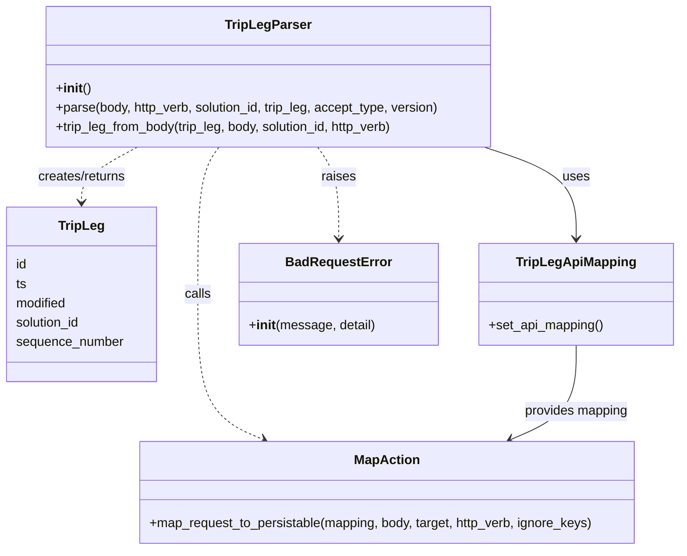

# Diagram: partview_core/partview_service/partview_service/api/trip_leg/handlers/parse/TripParser.py


> Auto-generated by Obscura crawlers

## Diagram 1



### SVG

<svg id="container" width="832.515625" xmlns="http://www.w3.org/2000/svg" class="classDiagram" height="680" viewBox="0 0 832.515625 680" role="graphics-document document" aria-roledescription="class"><style>#container{font-family:"trebuchet ms",verdana,arial,sans-serif;font-size:16px;fill:#333;}@keyframes edge-animation-frame{from{stroke-dashoffset:0;}}@keyframes dash{to{stroke-dashoffset:0;}}#container .edge-animation-slow{stroke-dasharray:9,5!important;stroke-dashoffset:900;animation:dash 50s linear infinite;stroke-linecap:round;}#container .edge-animation-fast{stroke-dasharray:9,5!important;stroke-dashoffset:900;animation:dash 20s linear infinite;stroke-linecap:round;}#container .error-icon{fill:#552222;}#container .error-text{fill:#552222;stroke:#552222;}#container .edge-thickness-normal{stroke-width:1px;}#container .edge-thickness-thick{stroke-width:3.5px;}#container .edge-pattern-solid{stroke-dasharray:0;}#container .edge-thickness-invisible{stroke-width:0;fill:none;}#container .edge-pattern-dashed{stroke-dasharray:3;}#container .edge-pattern-dotted{stroke-dasharray:2;}#container .marker{fill:#333333;stroke:#333333;}#container .marker.cross{stroke:#333333;}#container svg{font-family:"trebuchet ms",verdana,arial,sans-serif;font-size:16px;}#container p{margin:0;}#container g.classGroup text{fill:#9370DB;stroke:none;font-family:"trebuchet ms",verdana,arial,sans-serif;font-size:10px;}#container g.classGroup text .title{font-weight:bolder;}#container .nodeLabel,#container .edgeLabel{color:#131300;}#container .edgeLabel .label rect{fill:#ECECFF;}#container .label text{fill:#131300;}#container .labelBkg{background:#ECECFF;}#container .edgeLabel .label span{background:#ECECFF;}#container .classTitle{font-weight:bolder;}#container .node rect,#container .node circle,#container .node ellipse,#container .node polygon,#container .node path{fill:#ECECFF;stroke:#9370DB;stroke-width:1px;}#container .divider{stroke:#9370DB;stroke-width:1;}#container g.clickable{cursor:pointer;}#container g.classGroup rect{fill:#ECECFF;stroke:#9370DB;}#container g.classGroup line{stroke:#9370DB;stroke-width:1;}#container .classLabel .box{stroke:none;stroke-width:0;fill:#ECECFF;opacity:0.5;}#container .classLabel .label{fill:#9370DB;font-size:10px;}#container .relation{stroke:#333333;stroke-width:1;fill:none;}#container .dashed-line{stroke-dasharray:3;}#container .dotted-line{stroke-dasharray:1 2;}#container #compositionStart,#container .composition{fill:#333333!important;stroke:#333333!important;stroke-width:1;}#container #compositionEnd,#container .composition{fill:#333333!important;stroke:#333333!important;stroke-width:1;}#container #dependencyStart,#container .dependency{fill:#333333!important;stroke:#333333!important;stroke-width:1;}#container #dependencyStart,#container .dependency{fill:#333333!important;stroke:#333333!important;stroke-width:1;}#container #extensionStart,#container .extension{fill:transparent!important;stroke:#333333!important;stroke-width:1;}#container #extensionEnd,#container .extension{fill:transparent!important;stroke:#333333!important;stroke-width:1;}#container #aggregationStart,#container .aggregation{fill:transparent!important;stroke:#333333!important;stroke-width:1;}#container #aggregationEnd,#container .aggregation{fill:transparent!important;stroke:#333333!important;stroke-width:1;}#container #lollipopStart,#container .lollipop{fill:#ECECFF!important;stroke:#333333!important;stroke-width:1;}#container #lollipopEnd,#container .lollipop{fill:#ECECFF!important;stroke:#333333!important;stroke-width:1;}#container .edgeTerminals{font-size:11px;line-height:initial;}#container .classTitleText{text-anchor:middle;font-size:18px;fill:#333;}#container .label-icon{display:inline-block;height:1em;overflow:visible;vertical-align:-0.125em;}#container .node .label-icon path{fill:currentColor;stroke:revert;stroke-width:revert;}#container :root{--mermaid-font-family:"trebuchet ms",verdana,arial,sans-serif;}</style><g><defs><marker id="container_class-aggregationStart" class="marker aggregation class" refX="18" refY="7" markerWidth="190" markerHeight="240" orient="auto"><path d="M 18,7 L9,13 L1,7 L9,1 Z"></path></marker></defs><defs><marker id="container_class-aggregationEnd" class="marker aggregation class" refX="1" refY="7" markerWidth="20" markerHeight="28" orient="auto"><path d="M 18,7 L9,13 L1,7 L9,1 Z"></path></marker></defs><defs><marker id="container_class-extensionStart" class="marker extension class" refX="18" refY="7" markerWidth="190" markerHeight="240" orient="auto"><path d="M 1,7 L18,13 V 1 Z"></path></marker></defs><defs><marker id="container_class-extensionEnd" class="marker extension class" refX="1" refY="7" markerWidth="20" markerHeight="28" orient="auto"><path d="M 1,1 V 13 L18,7 Z"></path></marker></defs><defs><marker id="container_class-compositionStart" class="marker composition class" refX="18" refY="7" markerWidth="190" markerHeight="240" orient="auto"><path d="M 18,7 L9,13 L1,7 L9,1 Z"></path></marker></defs><defs><marker id="container_class-compositionEnd" class="marker composition class" refX="1" refY="7" markerWidth="20" markerHeight="28" orient="auto"><path d="M 18,7 L9,13 L1,7 L9,1 Z"></path></marker></defs><defs><marker id="container_class-dependencyStart" class="marker dependency class" refX="6" refY="7" markerWidth="190" markerHeight="240" orient="auto"><path d="M 5,7 L9,13 L1,7 L9,1 Z"></path></marker></defs><defs><marker id="container_class-dependencyEnd" class="marker dependency class" refX="13" refY="7" markerWidth="20" markerHeight="28" orient="auto"><path d="M 18,7 L9,13 L14,7 L9,1 Z"></path></marker></defs><defs><marker id="container_class-lollipopStart" class="marker lollipop class" refX="13" refY="7" markerWidth="190" markerHeight="240" orient="auto"><circle stroke="black" fill="transparent" cx="7" cy="7" r="6"></circle></marker></defs><defs><marker id="container_class-lollipopEnd" class="marker lollipop class" refX="1" refY="7" markerWidth="190" markerHeight="240" orient="auto"><circle stroke="black" fill="transparent" cx="7" cy="7" r="6"></circle></marker></defs><g class="root"><g class="clusters"></g><g class="edgePaths"><path d="M593.878,182L612.543,188.167C631.207,194.333,668.535,206.667,687.199,225.5C705.863,244.333,705.863,269.667,705.863,282.333L705.863,295" id="id_TripLegParser_TripLegApiMapping_1" class="edge-thickness-normal edge-pattern-solid relation" style=";;;" data-edge="true" data-et="edge" data-id="id_TripLegParser_TripLegApiMapping_1" data-points="W3sieCI6NTkzLjg3ODM3MDcxNTcyNTksInkiOjE4Mn0seyJ4Ijo3MDUuODYzMjgxMjUsInkiOjIxOX0seyJ4Ijo3MDUuODYzMjgxMjUsInkiOjMwMX1d" marker-end="url(#container_class-dependencyEnd)"></path><path d="M270.202,182L265.923,188.167C261.645,194.333,253.088,206.667,248.81,237C244.531,267.333,244.531,315.667,244.531,364C244.531,412.333,244.531,460.667,257.838,490.602C271.145,520.538,297.759,532.076,311.066,537.845L324.373,543.613" id="id_TripLegParser_MapAction_2" class="edge-thickness-normal edge-pattern-dashed relation" style=";;;" data-edge="true" data-et="edge" data-id="id_TripLegParser_MapAction_2" data-points="W3sieCI6MjcwLjIwMTg2NDkxOTM1NDgsInkiOjE4Mn0seyJ4IjoyNDQuNTMxMjUsInkiOjIxOX0seyJ4IjoyNDQuNTMxMjUsInkiOjM2NH0seyJ4IjoyNDQuNTMxMjUsInkiOjUwOX0seyJ4IjozMjkuODc3Njc1NzgxMjUsInkiOjU0Nn1d" marker-end="url(#container_class-dependencyEnd)"></path><path d="M169.178,182L157.739,188.167C146.3,194.333,123.421,206.667,111.982,218C100.543,229.333,100.543,239.667,100.543,244.833L100.543,250" id="id_TripLegParser_TripLeg_3" class="edge-thickness-normal edge-pattern-dashed relation" style=";;;" data-edge="true" data-et="edge" data-id="id_TripLegParser_TripLeg_3" data-points="W3sieCI6MTY5LjE3NzgyODg4MTA0ODM4LCJ5IjoxODJ9LHsieCI6MTAwLjU0Mjk2ODc1LCJ5IjoyMTl9LHsieCI6MTAwLjU0Mjk2ODc1LCJ5IjoyNTZ9XQ==" marker-end="url(#container_class-dependencyEnd)"></path><path d="M390.923,182L395.202,188.167C399.48,194.333,408.037,206.667,412.315,225.5C416.594,244.333,416.594,269.667,416.594,282.333L416.594,295" id="id_TripLegParser_BadRequestError_4" class="edge-thickness-normal edge-pattern-dashed relation" style=";;;" data-edge="true" data-et="edge" data-id="id_TripLegParser_BadRequestError_4" data-points="W3sieCI6MzkwLjkyMzEzNTA4MDY0NTIsInkiOjE4Mn0seyJ4Ijo0MTYuNTkzNzUsInkiOjIxOX0seyJ4Ijo0MTYuNTkzNzUsInkiOjMwMX1d" marker-end="url(#container_class-dependencyEnd)"></path><path d="M705.863,427L705.863,440.667C705.863,454.333,705.863,481.667,692.556,501.102C679.249,520.538,652.636,532.076,639.329,537.845L626.022,543.613" id="id_TripLegApiMapping_MapAction_5" class="edge-thickness-normal edge-pattern-solid relation" style=";;;" data-edge="true" data-et="edge" data-id="id_TripLegApiMapping_MapAction_5" data-points="W3sieCI6NzA1Ljg2MzI4MTI1LCJ5Ijo0Mjd9LHsieCI6NzA1Ljg2MzI4MTI1LCJ5Ijo1MDl9LHsieCI6NjIwLjUxNjg1NTQ2ODc1LCJ5Ijo1NDZ9XQ==" marker-end="url(#container_class-dependencyEnd)"></path></g><g class="edgeLabels"><g class="edgeLabel" transform="translate(705.86328125, 219)"><g class="label" data-id="id_TripLegParser_TripLegApiMapping_1" transform="translate(-16.4921875, -12)"><foreignObject width="32.984375" height="24"><div xmlns="http://www.w3.org/1999/xhtml" class="labelBkg" style="display: table-cell; white-space: nowrap; line-height: 1.5; max-width: 200px; text-align: center;"><span class="edgeLabel"><p>uses</p></span></div></foreignObject></g></g><g class="edgeLabel" transform="translate(244.53125, 364)"><g class="label" data-id="id_TripLegParser_MapAction_2" transform="translate(-16.4453125, -12)"><foreignObject width="32.890625" height="24"><div xmlns="http://www.w3.org/1999/xhtml" class="labelBkg" style="display: table-cell; white-space: nowrap; line-height: 1.5; max-width: 200px; text-align: center;"><span class="edgeLabel"><p>calls</p></span></div></foreignObject></g></g><g class="edgeLabel" transform="translate(100.54296875, 219)"><g class="label" data-id="id_TripLegParser_TripLeg_3" transform="translate(-56.359375, -12)"><foreignObject width="112.71875" height="24"><div xmlns="http://www.w3.org/1999/xhtml" class="labelBkg" style="display: table-cell; white-space: nowrap; line-height: 1.5; max-width: 200px; text-align: center;"><span class="edgeLabel"><p>creates/returns</p></span></div></foreignObject></g></g><g class="edgeLabel" transform="translate(416.59375, 219)"><g class="label" data-id="id_TripLegParser_BadRequestError_4" transform="translate(-21.25, -12)"><foreignObject width="42.5" height="24"><div xmlns="http://www.w3.org/1999/xhtml" class="labelBkg" style="display: table-cell; white-space: nowrap; line-height: 1.5; max-width: 200px; text-align: center;"><span class="edgeLabel"><p>raises</p></span></div></foreignObject></g></g><g class="edgeLabel" transform="translate(705.86328125, 509)"><g class="label" data-id="id_TripLegApiMapping_MapAction_5" transform="translate(-65.25, -12)"><foreignObject width="130.5" height="24"><div xmlns="http://www.w3.org/1999/xhtml" class="labelBkg" style="display: table-cell; white-space: nowrap; line-height: 1.5; max-width: 200px; text-align: center;"><span class="edgeLabel"><p>provides mapping</p></span></div></foreignObject></g></g></g><g class="nodes"><g class="node default" id="classId-TripLegParser-0" transform="translate(330.5625, 95)"><g class="basic label-container"><path d="M-278.421875 -87 L278.421875 -87 L278.421875 87 L-278.421875 87" stroke="none" stroke-width="0" fill="#ECECFF" style=""></path><path d="M-278.421875 -87 C-63.963316811109166 -87, 150.49524137778167 -87, 278.421875 -87 M-278.421875 -87 C-159.8644717249372 -87, -41.30706844987441 -87, 278.421875 -87 M278.421875 -87 C278.421875 -40.32688400461694, 278.421875 6.346231990766114, 278.421875 87 M278.421875 -87 C278.421875 -51.03219345995224, 278.421875 -15.064386919904479, 278.421875 87 M278.421875 87 C121.59994367602198 87, -35.22198764795604 87, -278.421875 87 M278.421875 87 C126.67722053964786 87, -25.067433920704275 87, -278.421875 87 M-278.421875 87 C-278.421875 41.62853320125541, -278.421875 -3.742933597489184, -278.421875 -87 M-278.421875 87 C-278.421875 31.937548467604167, -278.421875 -23.124903064791667, -278.421875 -87" stroke="#9370DB" stroke-width="1.3" fill="none" stroke-dasharray="0 0" style=""></path></g><g class="annotation-group text" transform="translate(0, -63)"></g><g class="label-group text" transform="translate(-50.421875, -63)"><g class="label" style="font-weight: bolder" transform="translate(0,-12)"><foreignObject width="100.84375" height="24"><div xmlns="http://www.w3.org/1999/xhtml" style="display: table-cell; white-space: nowrap; line-height: 1.5; max-width: 149px; text-align: center;"><span class="nodeLabel markdown-node-label" style=""><p>TripLegParser</p></span></div></foreignObject></g></g><g class="members-group text" transform="translate(-266.421875, -15)"></g><g class="methods-group text" transform="translate(-266.421875, 15)"><g class="label" style="" transform="translate(0,-12)"><foreignObject width="42.796875" height="24"><div xmlns="http://www.w3.org/1999/xhtml" style="display: table-cell; white-space: nowrap; line-height: 1.5; max-width: 132px; text-align: center;"><span class="nodeLabel markdown-node-label" style=""><p>+<strong>init</strong>()</p></span></div></foreignObject></g><g class="label" style="" transform="translate(0,12)"><foreignObject width="482.421875" height="24"><div xmlns="http://www.w3.org/1999/xhtml" style="display: table-cell; white-space: nowrap; line-height: 1.5; max-width: 540px; text-align: center;"><span class="nodeLabel markdown-node-label" style=""><p>+parse(body, http_verb, solution_id, trip_leg, accept_type, version)</p></span></div></foreignObject></g><g class="label" style="" transform="translate(0,36)"><foreignObject width="428.25" height="24"><div xmlns="http://www.w3.org/1999/xhtml" style="display: table-cell; white-space: nowrap; line-height: 1.5; max-width: 486px; text-align: center;"><span class="nodeLabel markdown-node-label" style=""><p>+trip_leg_from_body(trip_leg, body, solution_id, http_verb)</p></span></div></foreignObject></g></g><g class="divider" style=""><path d="M-278.421875 -39 C-72.52951679848255 -39, 133.3628414030349 -39, 278.421875 -39 M-278.421875 -39 C-84.62855124758207 -39, 109.16477250483587 -39, 278.421875 -39" stroke="#9370DB" stroke-width="1.3" fill="none" stroke-dasharray="0 0" style=""></path></g><g class="divider" style=""><path d="M-278.421875 -15 C-129.51831053754958 -15, 19.385253924900837 -15, 278.421875 -15 M-278.421875 -15 C-80.96235793011604 -15, 116.49715913976792 -15, 278.421875 -15" stroke="#9370DB" stroke-width="1.3" fill="none" stroke-dasharray="0 0" style=""></path></g></g><g class="node default" id="classId-TripLeg-1" transform="translate(100.54296875, 364)"><g class="basic label-container"><path d="M-92.54296875 -108 L92.54296875 -108 L92.54296875 108 L-92.54296875 108" stroke="none" stroke-width="0" fill="#ECECFF" style=""></path><path d="M-92.54296875 -108 C-38.949161322471234 -108, 14.644646105057532 -108, 92.54296875 -108 M-92.54296875 -108 C-39.53391136854175 -108, 13.475146012916497 -108, 92.54296875 -108 M92.54296875 -108 C92.54296875 -57.60344563517019, 92.54296875 -7.206891270340378, 92.54296875 108 M92.54296875 -108 C92.54296875 -39.00210573087374, 92.54296875 29.995788538252526, 92.54296875 108 M92.54296875 108 C34.06513430583302 108, -24.41270013833396 108, -92.54296875 108 M92.54296875 108 C46.3557622012354 108, 0.1685556524708005 108, -92.54296875 108 M-92.54296875 108 C-92.54296875 37.28725775702999, -92.54296875 -33.42548448594002, -92.54296875 -108 M-92.54296875 108 C-92.54296875 64.44104791673426, -92.54296875 20.882095833468526, -92.54296875 -108" stroke="#9370DB" stroke-width="1.3" fill="none" stroke-dasharray="0 0" style=""></path></g><g class="annotation-group text" transform="translate(0, -84)"></g><g class="label-group text" transform="translate(-27.0546875, -84)"><g class="label" style="font-weight: bolder" transform="translate(0,-12)"><foreignObject width="54.109375" height="24"><div xmlns="http://www.w3.org/1999/xhtml" style="display: table-cell; white-space: nowrap; line-height: 1.5; max-width: 103px; text-align: center;"><span class="nodeLabel markdown-node-label" style=""><p>TripLeg</p></span></div></foreignObject></g></g><g class="members-group text" transform="translate(-80.54296875, -36)"><g class="label" style="" transform="translate(0,-12)"><foreignObject width="14.09375" height="24"><div xmlns="http://www.w3.org/1999/xhtml" style="display: table-cell; white-space: nowrap; line-height: 1.5; max-width: 64px; text-align: center;"><span class="nodeLabel markdown-node-label" style=""><p>id</p></span></div></foreignObject></g><g class="label" style="" transform="translate(0,12)"><foreignObject width="13.25" height="24"><div xmlns="http://www.w3.org/1999/xhtml" style="display: table-cell; white-space: nowrap; line-height: 1.5; max-width: 63px; text-align: center;"><span class="nodeLabel markdown-node-label" style=""><p>ts</p></span></div></foreignObject></g><g class="label" style="" transform="translate(0,36)"><foreignObject width="64.625" height="24"><div xmlns="http://www.w3.org/1999/xhtml" style="display: table-cell; white-space: nowrap; line-height: 1.5; max-width: 115px; text-align: center;"><span class="nodeLabel markdown-node-label" style=""><p>modified</p></span></div></foreignObject></g><g class="label" style="" transform="translate(0,60)"><foreignObject width="82.234375" height="24"><div xmlns="http://www.w3.org/1999/xhtml" style="display: table-cell; white-space: nowrap; line-height: 1.5; max-width: 132px; text-align: center;"><span class="nodeLabel markdown-node-label" style=""><p>solution_id</p></span></div></foreignObject></g><g class="label" style="" transform="translate(0,84)"><foreignObject width="134.03125" height="24"><div xmlns="http://www.w3.org/1999/xhtml" style="display: table-cell; white-space: nowrap; line-height: 1.5; max-width: 185px; text-align: center;"><span class="nodeLabel markdown-node-label" style=""><p>sequence_number</p></span></div></foreignObject></g></g><g class="methods-group text" transform="translate(-80.54296875, 108)"></g><g class="divider" style=""><path d="M-92.54296875 -60 C-36.30588720091738 -60, 19.931194348165235 -60, 92.54296875 -60 M-92.54296875 -60 C-48.02728204068567 -60, -3.511595331371339 -60, 92.54296875 -60" stroke="#9370DB" stroke-width="1.3" fill="none" stroke-dasharray="0 0" style=""></path></g><g class="divider" style=""><path d="M-92.54296875 84 C-34.472140454456834 84, 23.59868784108633 84, 92.54296875 84 M-92.54296875 84 C-47.4258250340049 84, -2.3086813180098034 84, 92.54296875 84" stroke="#9370DB" stroke-width="1.3" fill="none" stroke-dasharray="0 0" style=""></path></g></g><g class="node default" id="classId-TripLegApiMapping-2" transform="translate(705.86328125, 364)"><g class="basic label-container"><path d="M-118.65234375 -63 L118.65234375 -63 L118.65234375 63 L-118.65234375 63" stroke="none" stroke-width="0" fill="#ECECFF" style=""></path><path d="M-118.65234375 -63 C-46.486724566818836 -63, 25.678894616362328 -63, 118.65234375 -63 M-118.65234375 -63 C-36.794953655267264 -63, 45.06243643946547 -63, 118.65234375 -63 M118.65234375 -63 C118.65234375 -34.59253330693349, 118.65234375 -6.185066613866972, 118.65234375 63 M118.65234375 -63 C118.65234375 -17.516008638958695, 118.65234375 27.96798272208261, 118.65234375 63 M118.65234375 63 C50.58003106653224 63, -17.492281616935514 63, -118.65234375 63 M118.65234375 63 C38.43575076453682 63, -41.78084222092636 63, -118.65234375 63 M-118.65234375 63 C-118.65234375 30.159462372115406, -118.65234375 -2.681075255769187, -118.65234375 -63 M-118.65234375 63 C-118.65234375 25.120947414622307, -118.65234375 -12.758105170755385, -118.65234375 -63" stroke="#9370DB" stroke-width="1.3" fill="none" stroke-dasharray="0 0" style=""></path></g><g class="annotation-group text" transform="translate(0, -39)"></g><g class="label-group text" transform="translate(-70.3046875, -39)"><g class="label" style="font-weight: bolder" transform="translate(0,-12)"><foreignObject width="140.609375" height="24"><div xmlns="http://www.w3.org/1999/xhtml" style="display: table-cell; white-space: nowrap; line-height: 1.5; max-width: 189px; text-align: center;"><span class="nodeLabel markdown-node-label" style=""><p>TripLegApiMapping</p></span></div></foreignObject></g></g><g class="members-group text" transform="translate(-106.65234375, 9)"></g><g class="methods-group text" transform="translate(-106.65234375, 39)"><g class="label" style="" transform="translate(0,-12)"><foreignObject width="143" height="24"><div xmlns="http://www.w3.org/1999/xhtml" style="display: table-cell; white-space: nowrap; line-height: 1.5; max-width: 200px; text-align: center;"><span class="nodeLabel markdown-node-label" style=""><p>+set_api_mapping()</p></span></div></foreignObject></g></g><g class="divider" style=""><path d="M-118.65234375 -15 C-29.47697741274095 -15, 59.6983889245181 -15, 118.65234375 -15 M-118.65234375 -15 C-49.44687094578951 -15, 19.758601858420974 -15, 118.65234375 -15" stroke="#9370DB" stroke-width="1.3" fill="none" stroke-dasharray="0 0" style=""></path></g><g class="divider" style=""><path d="M-118.65234375 9 C-62.08539883840884 9, -5.518453926817685 9, 118.65234375 9 M-118.65234375 9 C-42.951952814023244 9, 32.74843812195351 9, 118.65234375 9" stroke="#9370DB" stroke-width="1.3" fill="none" stroke-dasharray="0 0" style=""></path></g></g><g class="node default" id="classId-MapAction-3" transform="translate(475.197265625, 609)"><g class="basic label-container"><path d="M-309.15234375 -63 L309.15234375 -63 L309.15234375 63 L-309.15234375 63" stroke="none" stroke-width="0" fill="#ECECFF" style=""></path><path d="M-309.15234375 -63 C-82.64498736938256 -63, 143.86236901123488 -63, 309.15234375 -63 M-309.15234375 -63 C-128.4219131124178 -63, 52.308517525164405 -63, 309.15234375 -63 M309.15234375 -63 C309.15234375 -15.749929455489067, 309.15234375 31.500141089021866, 309.15234375 63 M309.15234375 -63 C309.15234375 -21.654200079455997, 309.15234375 19.691599841088006, 309.15234375 63 M309.15234375 63 C165.93368973091063 63, 22.71503571182126 63, -309.15234375 63 M309.15234375 63 C154.79063420784456 63, 0.4289246656891237 63, -309.15234375 63 M-309.15234375 63 C-309.15234375 30.613975235116598, -309.15234375 -1.7720495297668037, -309.15234375 -63 M-309.15234375 63 C-309.15234375 23.833928555815703, -309.15234375 -15.332142888368594, -309.15234375 -63" stroke="#9370DB" stroke-width="1.3" fill="none" stroke-dasharray="0 0" style=""></path></g><g class="annotation-group text" transform="translate(0, -39)"></g><g class="label-group text" transform="translate(-38.6328125, -39)"><g class="label" style="font-weight: bolder" transform="translate(0,-12)"><foreignObject width="77.265625" height="24"><div xmlns="http://www.w3.org/1999/xhtml" style="display: table-cell; white-space: nowrap; line-height: 1.5; max-width: 126px; text-align: center;"><span class="nodeLabel markdown-node-label" style=""><p>MapAction</p></span></div></foreignObject></g></g><g class="members-group text" transform="translate(-297.15234375, 9)"></g><g class="methods-group text" transform="translate(-297.15234375, 39)"><g class="label" style="" transform="translate(0,-12)"><foreignObject width="555.671875" height="24"><div xmlns="http://www.w3.org/1999/xhtml" style="display: table-cell; white-space: nowrap; line-height: 1.5; max-width: 613px; text-align: center;"><span class="nodeLabel markdown-node-label" style=""><p>+map_request_to_persistable(mapping, body, target, http_verb, ignore_keys)</p></span></div></foreignObject></g></g><g class="divider" style=""><path d="M-309.15234375 -15 C-87.28744796547113 -15, 134.57744781905774 -15, 309.15234375 -15 M-309.15234375 -15 C-143.20586261315106 -15, 22.74061852369789 -15, 309.15234375 -15" stroke="#9370DB" stroke-width="1.3" fill="none" stroke-dasharray="0 0" style=""></path></g><g class="divider" style=""><path d="M-309.15234375 9 C-105.14939256210832 9, 98.85355862578336 9, 309.15234375 9 M-309.15234375 9 C-179.7711707106139 9, -50.389997671227775 9, 309.15234375 9" stroke="#9370DB" stroke-width="1.3" fill="none" stroke-dasharray="0 0" style=""></path></g></g><g class="node default" id="classId-BadRequestError-4" transform="translate(416.59375, 364)"><g class="basic label-container"><path d="M-120.6171875 -63 L120.6171875 -63 L120.6171875 63 L-120.6171875 63" stroke="none" stroke-width="0" fill="#ECECFF" style=""></path><path d="M-120.6171875 -63 C-53.95815590260739 -63, 12.700875694785225 -63, 120.6171875 -63 M-120.6171875 -63 C-44.66275753351697 -63, 31.291672432966067 -63, 120.6171875 -63 M120.6171875 -63 C120.6171875 -33.08826694773657, 120.6171875 -3.176533895473149, 120.6171875 63 M120.6171875 -63 C120.6171875 -12.82247993449063, 120.6171875 37.35504013101874, 120.6171875 63 M120.6171875 63 C67.24088567311702 63, 13.864583846234027 63, -120.6171875 63 M120.6171875 63 C48.232330164861864 63, -24.152527170276272 63, -120.6171875 63 M-120.6171875 63 C-120.6171875 18.559316272189648, -120.6171875 -25.881367455620705, -120.6171875 -63 M-120.6171875 63 C-120.6171875 16.671725144534967, -120.6171875 -29.656549710930065, -120.6171875 -63" stroke="#9370DB" stroke-width="1.3" fill="none" stroke-dasharray="0 0" style=""></path></g><g class="annotation-group text" transform="translate(0, -39)"></g><g class="label-group text" transform="translate(-62.28125, -39)"><g class="label" style="font-weight: bolder" transform="translate(0,-12)"><foreignObject width="124.5625" height="24"><div xmlns="http://www.w3.org/1999/xhtml" style="display: table-cell; white-space: nowrap; line-height: 1.5; max-width: 174px; text-align: center;"><span class="nodeLabel markdown-node-label" style=""><p>BadRequestError</p></span></div></foreignObject></g></g><g class="members-group text" transform="translate(-108.6171875, 9)"></g><g class="methods-group text" transform="translate(-108.6171875, 39)"><g class="label" style="" transform="translate(0,-12)"><foreignObject width="154.953125" height="24"><div xmlns="http://www.w3.org/1999/xhtml" style="display: table-cell; white-space: nowrap; line-height: 1.5; max-width: 244px; text-align: center;"><span class="nodeLabel markdown-node-label" style=""><p>+<strong>init</strong>(message, detail)</p></span></div></foreignObject></g></g><g class="divider" style=""><path d="M-120.6171875 -15 C-33.702098874803795 -15, 53.21298975039241 -15, 120.6171875 -15 M-120.6171875 -15 C-48.72100853270891 -15, 23.175170434582185 -15, 120.6171875 -15" stroke="#9370DB" stroke-width="1.3" fill="none" stroke-dasharray="0 0" style=""></path></g><g class="divider" style=""><path d="M-120.6171875 9 C-66.77793717434798 9, -12.938686848695966 9, 120.6171875 9 M-120.6171875 9 C-65.83968517261604 9, -11.062182845232073 9, 120.6171875 9" stroke="#9370DB" stroke-width="1.3" fill="none" stroke-dasharray="0 0" style=""></path></g></g></g></g></g></svg>

## Diagram 2

```mermaid
flowchart LR
  Start([Start]) --> ParseRequest{Lookup\nhttp_verb in\nparse map}
  ParseRequest -- Found --> CallHandler[Call trip_leg_from_body]
  ParseRequest -- Not Found --> RaiseError[Raise BadRequestError\n"No validation implemented"]
  CallHandler --> CheckTripLeg{trip_leg\nprovided?}
  CheckTripLeg -- No --> CreateTripLeg[Create TripLeg(id from body,\nts=null, modified=null)]
  CheckTripLeg -- Yes --> UseExisting[Use existing TripLeg]
  CreateTripLeg --> SetSolution[Set trip_leg.solution_id=solution_id]
  UseExisting --> SetSolution
  SetSolution --> CheckType{body.type == "ACTUAL"\nand sequenceNumber is null?}
  CheckType -- True --> SetSequence[Set trip_leg.sequence_number = 1]
  CheckType -- False --> SkipSequence[No change]
  SetSequence --> BuildMapping
  SkipSequence --> BuildMapping
  BuildMapping[trip_leg_api_mapping = TripLegApiMapping().set_api_mapping()] --> MapRequest
  MapRequest[MapAction.map_request_to_persistable(...)] --> ReturnTripLeg[Return trip_leg]
  ReturnTripLeg --> End([End])
```

> SVG rendering failed for this diagram.
