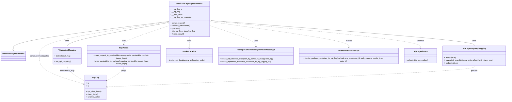
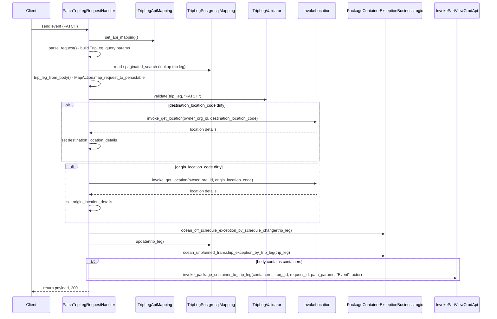

# Diagram: partview_core/partview_service/partview_service/api/trip_leg/handlers/patch_trip_leg_handler.py

> Auto-generated by Obscura crawlers

## Diagram 1

### SVG

<svg id="container" width="4397.0703125" xmlns="http://www.w3.org/2000/svg" class="classDiagram" height="866" viewBox="0 0 4397.0703125 866" role="graphics-document document" aria-roledescription="class"><g><defs><marker id="container_class-aggregationStart" class="marker aggregation class" refX="18" refY="7" markerWidth="190" markerHeight="240" orient="auto"><path d="M 18,7 L9,13 L1,7 L9,1 Z"></path></marker></defs><defs><marker id="container_class-aggregationEnd" class="marker aggregation class" refX="1" refY="7" markerWidth="20" markerHeight="28" orient="auto"><path d="M 18,7 L9,13 L1,7 L9,1 Z"></path></marker></defs><defs><marker id="container_class-extensionStart" class="marker extension class" refX="18" refY="7" markerWidth="190" markerHeight="240" orient="auto"><path d="M 1,7 L18,13 V 1 Z"></path></marker></defs><defs><marker id="container_class-extensionEnd" class="marker extension class" refX="1" refY="7" markerWidth="20" markerHeight="28" orient="auto"><path d="M 1,1 V 13 L18,7 Z"></path></marker></defs><defs><marker id="container_class-compositionStart" class="marker composition class" refX="18" refY="7" markerWidth="190" markerHeight="240" orient="auto"><path d="M 18,7 L9,13 L1,7 L9,1 Z"></path></marker></defs><defs><marker id="container_class-compositionEnd" class="marker composition class" refX="1" refY="7" markerWidth="20" markerHeight="28" orient="auto"><path d="M 18,7 L9,13 L1,7 L9,1 Z"></path></marker></defs><defs><marker id="container_class-dependencyStart" class="marker dependency class" refX="6" refY="7" markerWidth="190" markerHeight="240" orient="auto"><path d="M 5,7 L9,13 L1,7 L9,1 Z"></path></marker></defs><defs><marker id="container_class-dependencyEnd" class="marker dependency class" refX="13" refY="7" markerWidth="20" markerHeight="28" orient="auto"><path d="M 18,7 L9,13 L14,7 L9,1 Z"></path></marker></defs><defs><marker id="container_class-lollipopStart" class="marker lollipop class" refX="13" refY="7" markerWidth="190" markerHeight="240" orient="auto"><circle stroke="black" fill="transparent" cx="7" cy="7" r="6"></circle></marker></defs><defs><marker id="container_class-lollipopEnd" class="marker lollipop class" refX="1" refY="7" markerWidth="190" markerHeight="240" orient="auto"><circle stroke="black" fill="transparent" cx="7" cy="7" r="6"></circle></marker></defs><g class="root"><g class="clusters"></g><g class="edgePaths"><path d="M1470.551,186.047L1244.019,214.539C1017.487,243.031,564.423,300.016,337.891,339.299C111.359,378.583,111.359,400.167,111.359,410.958L111.359,421.75" id="id_PatchTripLegRequestHandler_PartViewRequestHandler_1" class="edge-thickness-normal edge-pattern-solid relation" style=";;;" data-edge="true" data-et="edge" data-id="id_PatchTripLegRequestHandler_PartViewRequestHandler_1" data-points="W3sieCI6MTQ3MC41NTA3ODEyNSwieSI6MTg2LjA0NjYyODc4NzMwMDIyfSx7IngiOjExMS4zNTkzNzUsInkiOjM1N30seyJ4IjoxMTEuMzU5Mzc1LCJ5Ijo0Mzl9XQ==" marker-end="url(#container_class-extensionEnd)"></path><path d="M1838.319,179.049L2217.665,208.707C2597.012,238.366,3355.705,297.683,3735.052,333.508C4114.398,369.333,4114.398,381.667,4114.398,387.833L4114.398,394" id="id_PatchTripLegRequestHandler_TripLegPostgresqlMapping_2" class="edge-thickness-normal edge-pattern-solid relation" style=";;;" data-edge="true" data-et="edge" data-id="id_PatchTripLegRequestHandler_TripLegPostgresqlMapping_2" data-points="W3sieCI6MTgyMS4xMjEwOTM3NSwieSI6MTc3LjcwNDM0NjIxNjE2ODMyfSx7IngiOjQxMTQuMzk4NDM3NSwieSI6MzU3fSx7IngiOjQxMTQuMzk4NDM3NSwieSI6Mzk0fV0=" marker-start="url(#container_class-aggregationStart)"></path><path d="M1453.576,198.787L1307.843,225.156C1162.11,251.525,870.643,304.262,724.909,339.298C579.176,374.333,579.176,391.667,579.176,400.333L579.176,409" id="id_PatchTripLegRequestHandler_TripLegApiMapping_3" class="edge-thickness-normal edge-pattern-solid relation" style=";;;" data-edge="true" data-et="edge" data-id="id_PatchTripLegRequestHandler_TripLegApiMapping_3" data-points="W3sieCI6MTQ3MC41NTA3ODEyNSwieSI6MTk1LjcxNTg1MTUzNzE3OTh9LHsieCI6NTc5LjE3NTc4MTI1LCJ5IjozNTd9LHsieCI6NTc5LjE3NTc4MTI1LCJ5Ijo0MDl9XQ==" marker-start="url(#container_class-aggregationStart)"></path><path d="M1470.551,189.839L1281.553,217.699C1092.555,245.559,714.559,301.28,525.561,349.806C336.563,398.333,336.563,439.667,336.563,481C336.563,522.333,336.563,563.667,401.666,603.64C466.769,643.614,596.975,682.228,662.078,701.535L727.181,720.842" id="id_PatchTripLegRequestHandler_TripLeg_4" class="edge-thickness-normal edge-pattern-dashed relation" style=";;;" data-edge="true" data-et="edge" data-id="id_PatchTripLegRequestHandler_TripLeg_4" data-points="W3sieCI6MTQ3MC41NTA3ODEyNSwieSI6MTg5LjgzODc4NTIyNzk3MTEzfSx7IngiOjMzNi41NjI1LCJ5IjozNTd9LHsieCI6MzM2LjU2MjUsInkiOjQ4MX0seyJ4IjozMzYuNTYyNSwieSI6NjA1fSx7IngiOjczMi45MzM1OTM3NSwieSI6NzIyLjU0ODM3NDk4NDAyMTV9XQ==" marker-end="url(#container_class-dependencyEnd)"></path><path d="M1470.551,222.936L1404.096,245.28C1337.642,267.624,1204.733,312.312,1138.279,341.823C1071.824,371.333,1071.824,385.667,1071.824,392.833L1071.824,400" id="id_PatchTripLegRequestHandler_MapAction_5" class="edge-thickness-normal edge-pattern-dashed relation" style=";;;" data-edge="true" data-et="edge" data-id="id_PatchTripLegRequestHandler_MapAction_5" data-points="W3sieCI6MTQ3MC41NTA3ODEyNSwieSI6MjIyLjkzNjE0MDI0MTAzOTI4fSx7IngiOjEwNzEuODI0MjE4NzUsInkiOjM1N30seyJ4IjoxMDcxLjgyNDIxODc1LCJ5Ijo0MDZ9XQ==" marker-end="url(#container_class-dependencyEnd)"></path><path d="M1645.836,320L1645.836,326.167C1645.836,332.333,1645.836,344.667,1645.836,360C1645.836,375.333,1645.836,393.667,1645.836,402.833L1645.836,412" id="id_PatchTripLegRequestHandler_InvokeLocation_6" class="edge-thickness-normal edge-pattern-dashed relation" style=";;;" data-edge="true" data-et="edge" data-id="id_PatchTripLegRequestHandler_InvokeLocation_6" data-points="W3sieCI6MTY0NS44MzU5Mzc1LCJ5IjozMjB9LHsieCI6MTY0NS44MzU5Mzc1LCJ5IjozNTd9LHsieCI6MTY0NS44MzU5Mzc1LCJ5Ijo0MTh9XQ==" marker-end="url(#container_class-dependencyEnd)"></path><path d="M1821.121,223.329L1886.941,245.608C1952.762,267.886,2084.402,312.443,2150.223,341.888C2216.043,371.333,2216.043,385.667,2216.043,392.833L2216.043,400" id="id_PatchTripLegRequestHandler_PackageContainerExceptionBusinessLogic_7" class="edge-thickness-normal edge-pattern-dashed relation" style=";;;" data-edge="true" data-et="edge" data-id="id_PatchTripLegRequestHandler_PackageContainerExceptionBusinessLogic_7" data-points="W3sieCI6MTgyMS4xMjEwOTM3NSwieSI6MjIzLjMyOTM4OTY4MTY1MzQ1fSx7IngiOjIyMTYuMDQyOTY4NzUsInkiOjM1N30seyJ4IjoyMjE2LjA0Mjk2ODc1LCJ5Ijo0MDZ9XQ==" marker-end="url(#container_class-dependencyEnd)"></path><path d="M1821.121,188.627L2020.859,216.689C2220.596,244.751,2620.072,300.876,2819.809,338.104C3019.547,375.333,3019.547,393.667,3019.547,402.833L3019.547,412" id="id_PatchTripLegRequestHandler_InvokePartViewCrudApi_8" class="edge-thickness-normal edge-pattern-dashed relation" style=";;;" data-edge="true" data-et="edge" data-id="id_PatchTripLegRequestHandler_InvokePartViewCrudApi_8" data-points="W3sieCI6MTgyMS4xMjEwOTM3NSwieSI6MTg4LjYyNjc0OTUwOTQ4MzMyfSx7IngiOjMwMTkuNTQ2ODc1LCJ5IjozNTd9LHsieCI6MzAxOS41NDY4NzUsInkiOjQxOH1d" marker-end="url(#container_class-dependencyEnd)"></path><path d="M1821.121,180.902L2125.493,210.252C2429.865,239.601,3038.608,298.301,3342.98,336.817C3647.352,375.333,3647.352,393.667,3647.352,402.833L3647.352,412" id="id_PatchTripLegRequestHandler_TripLegValidator_9" class="edge-thickness-normal edge-pattern-dashed relation" style=";;;" data-edge="true" data-et="edge" data-id="id_PatchTripLegRequestHandler_TripLegValidator_9" data-points="W3sieCI6MTgyMS4xMjEwOTM3NSwieSI6MTgwLjkwMjIwODg3Mjk2MzQ2fSx7IngiOjM2NDcuMzUxNTYyNSwieSI6MzU3fSx7IngiOjM2NDcuMzUxNTYyNSwieSI6NDE4fV0=" marker-end="url(#container_class-dependencyEnd)"></path><path d="M579.176,553L579.176,561.667C579.176,570.333,579.176,587.667,604.802,611.418C630.428,635.17,681.681,665.34,707.307,680.425L732.934,695.51" id="id_TripLegApiMapping_TripLeg_10" class="edge-thickness-normal edge-pattern-dashed relation" style=";;;" data-edge="true" data-et="edge" data-id="id_TripLegApiMapping_TripLeg_10" data-points="W3sieCI6NTc5LjE3NTc4MTI1LCJ5Ijo1NTN9LHsieCI6NTc5LjE3NTc4MTI1LCJ5Ijo2MDV9LHsieCI6NzMyLjkzMzU5Mzc1LCJ5Ijo2OTUuNTEwMzE1NzM2MDU2N31d"></path><path d="M1071.824,556L1071.824,564.167C1071.824,572.333,1071.824,588.667,1047.06,611.411C1022.295,634.156,972.766,663.311,948.002,677.889L923.237,692.467" id="id_MapAction_TripLeg_11" class="edge-thickness-normal edge-pattern-dashed relation" style=";;;" data-edge="true" data-et="edge" data-id="id_MapAction_TripLeg_11" data-points="W3sieCI6MTA3MS44MjQyMTg3NSwieSI6NTU2fSx7IngiOjEwNzEuODI0MjE4NzUsInkiOjYwNX0seyJ4Ijo5MTguMDY2NDA2MjUsInkiOjY5NS41MTAzMTU3MzYwNTY3fV0=" marker-end="url(#container_class-dependencyEnd)"></path><path d="M4114.398,568L4114.398,574.167C4114.398,580.333,4114.398,592.667,3582.675,622.276C3050.952,651.885,1987.507,698.77,1455.784,722.212L924.061,745.655" id="id_TripLegPostgresqlMapping_TripLeg_12" class="edge-thickness-normal edge-pattern-dashed relation" style=";;;" data-edge="true" data-et="edge" data-id="id_TripLegPostgresqlMapping_TripLeg_12" data-points="W3sieCI6NDExNC4zOTg0Mzc1LCJ5Ijo1Njh9LHsieCI6NDExNC4zOTg0Mzc1LCJ5Ijo2MDV9LHsieCI6OTE4LjA2NjQwNjI1LCJ5Ijo3NDUuOTE4OTU5MTQwNDc5N31d" marker-end="url(#container_class-dependencyEnd)"></path></g><g class="edgeLabels"><g class="edgeLabel"><g class="label" data-id="id_PatchTripLegRequestHandler_PartViewRequestHandler_1" transform="translate(0, 0)"><foreignObject width="0" height="0">

</foreignObject></g></g><g class="edgeLabel" transform="translate(4114.3984375, 357)"><g class="label" data-id="id_PatchTripLegRequestHandler_TripLegPostgresqlMapping_2" transform="translate(-16.4921875, -12)"><foreignObject width="32.984375" height="24">

uses

</foreignObject></g></g><g class="edgeLabel" transform="translate(579.17578125, 357)"><g class="label" data-id="id_PatchTripLegRequestHandler_TripLegApiMapping_3" transform="translate(-16.4921875, -12)"><foreignObject width="32.984375" height="24">

uses

</foreignObject></g></g><g class="edgeLabel" transform="translate(336.5625, 481)"><g class="label" data-id="id_PatchTripLegRequestHandler_TripLeg_4" transform="translate(-86.84375, -12)"><foreignObject width="173.6875" height="24">

constructs/manipulates

</foreignObject></g></g><g class="edgeLabel" transform="translate(1071.82421875, 357)"><g class="label" data-id="id_PatchTripLegRequestHandler_MapAction_5" transform="translate(-16.4921875, -12)"><foreignObject width="32.984375" height="24">

uses

</foreignObject></g></g><g class="edgeLabel" transform="translate(1645.8359375, 357)"><g class="label" data-id="id_PatchTripLegRequestHandler_InvokeLocation_6" transform="translate(-16.4921875, -12)"><foreignObject width="32.984375" height="24">

uses

</foreignObject></g></g><g class="edgeLabel" transform="translate(2216.04296875, 357)"><g class="label" data-id="id_PatchTripLegRequestHandler_PackageContainerExceptionBusinessLogic_7" transform="translate(-16.4921875, -12)"><foreignObject width="32.984375" height="24">

uses

</foreignObject></g></g><g class="edgeLabel" transform="translate(3019.546875, 357)"><g class="label" data-id="id_PatchTripLegRequestHandler_InvokePartViewCrudApi_8" transform="translate(-27.5859375, -12)"><foreignObject width="55.171875" height="24">

invokes

</foreignObject></g></g><g class="edgeLabel" transform="translate(3647.3515625, 357)"><g class="label" data-id="id_PatchTripLegRequestHandler_TripLegValidator_9" transform="translate(-32.6875, -12)"><foreignObject width="65.375" height="24">

validates

</foreignObject></g></g><g class="edgeLabel" transform="translate(579.17578125, 605)"><g class="label" data-id="id_TripLegApiMapping_TripLeg_10" transform="translate(-66.3203125, -12)"><foreignObject width="132.640625" height="24">

bidirectional_map

</foreignObject></g></g><g class="edgeLabel" transform="translate(1071.82421875, 605)"><g class="label" data-id="id_MapAction_TripLeg_11" transform="translate(-19.703125, -12)"><foreignObject width="39.40625" height="24">

maps

</foreignObject></g></g><g class="edgeLabel" transform="translate(4114.3984375, 605)"><g class="label" data-id="id_TripLegPostgresqlMapping_TripLeg_12" transform="translate(-28.4375, -12)"><foreignObject width="56.875" height="24">

persists

</foreignObject></g></g></g><g class="nodes"><g class="node default" id="classId-PatchTripLegRequestHandler-0" transform="translate(1645.8359375, 164)"><g class="basic label-container"><path d="M-175.28515625 -156 L175.28515625 -156 L175.28515625 156 L-175.28515625 156" stroke="none" stroke-width="0" fill="#ECECFF" style=""></path><path d="M-175.28515625 -156 C-55.96735261822232 -156, 63.35045101355536 -156, 175.28515625 -156 M-175.28515625 -156 C-91.14595725444461 -156, -7.006758258889221 -156, 175.28515625 -156 M175.28515625 -156 C175.28515625 -79.13382466649858, 175.28515625 -2.2676493329971663, 175.28515625 156 M175.28515625 -156 C175.28515625 -78.38482258328209, 175.28515625 -0.7696451665641746, 175.28515625 156 M175.28515625 156 C75.71968274520616 156, -23.845790759587686 156, -175.28515625 156 M175.28515625 156 C63.67425282994918 156, -47.936650590101635 156, -175.28515625 156 M-175.28515625 156 C-175.28515625 53.09281954517438, -175.28515625 -49.81436090965124, -175.28515625 -156 M-175.28515625 156 C-175.28515625 90.77542541769479, -175.28515625 25.550850835389582, -175.28515625 -156" stroke="#9370DB" stroke-width="1.3" fill="none" stroke-dasharray="0 0" style=""></path></g><g class="annotation-group text" transform="translate(0, -132)"></g><g class="label-group text" transform="translate(-106.2734375, -132)"><g class="label" style="font-weight: bolder" transform="translate(0,-12)"><foreignObject width="212.546875" height="24">

PatchTripLegRequestHandler

</foreignObject></g></g><g class="members-group text" transform="translate(-163.28515625, -84)"><g class="label" style="" transform="translate(0,-12)"><foreignObject width="104.78125" height="24">

- __trip_leg_id

</foreignObject></g><g class="label" style="" transform="translate(0,12)"><foreignObject width="82.3125" height="24">

- __trip_leg

</foreignObject></g><g class="label" style="" transform="translate(0,36)"><foreignObject width="104.578125" height="24">

- __data_store

</foreignObject></g><g class="label" style="" transform="translate(0,60)"><foreignObject width="185.046875" height="24">

- __trip_leg_api_mapping

</foreignObject></g></g><g class="methods-group text" transform="translate(-163.28515625, 36)"><g class="label" style="" transform="translate(0,-12)"><foreignObject width="126.046875" height="24">

+ parse_request()

</foreignObject></g><g class="label" style="" transform="translate(0,12)"><foreignObject width="170.953125" height="24">

+ validate_parameters()

</foreignObject></g><g class="label" style="" transform="translate(0,36)"><foreignObject width="77.96875" height="24">

+ process()

</foreignObject></g><g class="label" style="" transform="translate(0,60)"><foreignObject width="220.296875" height="24">

+ trip_leg_from_body(trip_leg)

</foreignObject></g><g class="label" style="" transform="translate(0,84)"><foreignObject width="121.5" height="24">

+ format_result()

</foreignObject></g></g><g class="divider" style=""><path d="M-175.28515625 -108 C-69.19331638731272 -108, 36.89852347537456 -108, 175.28515625 -108 M-175.28515625 -108 C-42.540975752837994 -108, 90.20320474432401 -108, 175.28515625 -108" stroke="#9370DB" stroke-width="1.3" fill="none" stroke-dasharray="0 0" style=""></path></g><g class="divider" style=""><path d="M-175.28515625 12 C-55.88500635266918 12, 63.51514354466164 12, 175.28515625 12 M-175.28515625 12 C-82.12346654999475 12, 11.03822315001051 12, 175.28515625 12" stroke="#9370DB" stroke-width="1.3" fill="none" stroke-dasharray="0 0" style=""></path></g></g><g class="node default" id="classId-PartViewRequestHandler-1" transform="translate(111.359375, 481)"><g class="basic label-container"><path d="M-103.359375 -42 L103.359375 -42 L103.359375 42 L-103.359375 42" stroke="none" stroke-width="0" fill="#ECECFF" style=""></path><path d="M-103.359375 -42 C-52.095854115718474 -42, -0.832333231436948 -42, 103.359375 -42 M-103.359375 -42 C-33.75206787088669 -42, 35.85523925822662 -42, 103.359375 -42 M103.359375 -42 C103.359375 -13.039482651458815, 103.359375 15.92103469708237, 103.359375 42 M103.359375 -42 C103.359375 -23.93687265948502, 103.359375 -5.8737453189700375, 103.359375 42 M103.359375 42 C21.706852468045852 42, -59.945670063908295 42, -103.359375 42 M103.359375 42 C53.6897513591693 42, 4.0201277183386 42, -103.359375 42 M-103.359375 42 C-103.359375 11.204606103675257, -103.359375 -19.590787792649486, -103.359375 -42 M-103.359375 42 C-103.359375 11.831714799530591, -103.359375 -18.336570400938818, -103.359375 -42" stroke="#9370DB" stroke-width="1.3" fill="none" stroke-dasharray="0 0" style=""></path></g><g class="annotation-group text" transform="translate(0, -18)"></g><g class="label-group text" transform="translate(-91.359375, -18)"><g class="label" style="font-weight: bolder" transform="translate(0,-12)"><foreignObject width="182.71875" height="24">

PartViewRequestHandler

</foreignObject></g></g><g class="members-group text" transform="translate(-91.359375, 30)"></g><g class="methods-group text" transform="translate(-91.359375, 60)"></g><g class="divider" style=""><path d="M-103.359375 6 C-49.256424465209015 6, 4.846526069581969 6, 103.359375 6 M-103.359375 6 C-36.9294508379196 6, 29.500473324160794 6, 103.359375 6" stroke="#9370DB" stroke-width="1.3" fill="none" stroke-dasharray="0 0" style=""></path></g><g class="divider" style=""><path d="M-103.359375 24 C-46.74246231056649 24, 9.874450378867024 24, 103.359375 24 M-103.359375 24 C-28.253949252585414 24, 46.85147649482917 24, 103.359375 24" stroke="#9370DB" stroke-width="1.3" fill="none" stroke-dasharray="0 0" style=""></path></g></g><g class="node default" id="classId-TripLeg-2" transform="translate(825.5, 750)"><g class="basic label-container"><path d="M-92.56640625 -108 L92.56640625 -108 L92.56640625 108 L-92.56640625 108" stroke="none" stroke-width="0" fill="#ECECFF" style=""></path><path d="M-92.56640625 -108 C-30.90582617186864 -108, 30.75475390626272 -108, 92.56640625 -108 M-92.56640625 -108 C-21.089645235569265 -108, 50.38711577886147 -108, 92.56640625 -108 M92.56640625 -108 C92.56640625 -60.180835051866765, 92.56640625 -12.36167010373353, 92.56640625 108 M92.56640625 -108 C92.56640625 -45.74857161253932, 92.56640625 16.502856774921355, 92.56640625 108 M92.56640625 108 C43.37666128714755 108, -5.8130836757049025 108, -92.56640625 108 M92.56640625 108 C49.55836070562463 108, 6.550315161249259 108, -92.56640625 108 M-92.56640625 108 C-92.56640625 35.91339677551818, -92.56640625 -36.17320644896364, -92.56640625 -108 M-92.56640625 108 C-92.56640625 29.893256893808925, -92.56640625 -48.21348621238215, -92.56640625 -108" stroke="#9370DB" stroke-width="1.3" fill="none" stroke-dasharray="0 0" style=""></path></g><g class="annotation-group text" transform="translate(0, -84)"></g><g class="label-group text" transform="translate(-27.0546875, -84)"><g class="label" style="font-weight: bolder" transform="translate(0,-12)"><foreignObject width="54.109375" height="24">

TripLeg

</foreignObject></g></g><g class="members-group text" transform="translate(-80.56640625, -36)"><g class="label" style="" transform="translate(0,-12)"><foreignObject width="26.3125" height="24">

+ id

</foreignObject></g><g class="label" style="" transform="translate(0,12)"><foreignObject width="25.484375" height="24">

+ ts

</foreignObject></g></g><g class="methods-group text" transform="translate(-80.56640625, 36)"><g class="label" style="" transform="translate(0,-12)"><foreignObject width="134.078125" height="24">

+ get_dirty_fields()

</foreignObject></g><g class="label" style="" transform="translate(0,12)"><foreignObject width="104.578125" height="24">

+ clear_fields()

</foreignObject></g><g class="label" style="" transform="translate(0,36)"><foreignObject width="123.625" height="24">

+ set(field, value)

</foreignObject></g></g><g class="divider" style=""><path d="M-92.56640625 -60 C-32.55465559765272 -60, 27.457095054694562 -60, 92.56640625 -60 M-92.56640625 -60 C-36.249751622794065 -60, 20.06690300441187 -60, 92.56640625 -60" stroke="#9370DB" stroke-width="1.3" fill="none" stroke-dasharray="0 0" style=""></path></g><g class="divider" style=""><path d="M-92.56640625 12 C-51.05186004942718 12, -9.537313848854353 12, 92.56640625 12 M-92.56640625 12 C-24.752763708556856 12, 43.06087883288629 12, 92.56640625 12" stroke="#9370DB" stroke-width="1.3" fill="none" stroke-dasharray="0 0" style=""></path></g></g><g class="node default" id="classId-TripLegPostgresqlMapping-3" transform="translate(4114.3984375, 481)"><g class="basic label-container"><path d="M-274.671875 -87 L274.671875 -87 L274.671875 87 L-274.671875 87" stroke="none" stroke-width="0" fill="#ECECFF" style=""></path><path d="M-274.671875 -87 C-112.2647733288378 -87, 50.14232834232439 -87, 274.671875 -87 M-274.671875 -87 C-65.8652909377249 -87, 142.9412931245502 -87, 274.671875 -87 M274.671875 -87 C274.671875 -18.993565832857584, 274.671875 49.01286833428483, 274.671875 87 M274.671875 -87 C274.671875 -31.9595209286798, 274.671875 23.080958142640398, 274.671875 87 M274.671875 87 C156.69876537687372 87, 38.725655753747475 87, -274.671875 87 M274.671875 87 C131.36271720259165 87, -11.946440594816693 87, -274.671875 87 M-274.671875 87 C-274.671875 48.93362452248897, -274.671875 10.867249044977939, -274.671875 -87 M-274.671875 87 C-274.671875 35.85360140972897, -274.671875 -15.292797180542067, -274.671875 -87" stroke="#9370DB" stroke-width="1.3" fill="none" stroke-dasharray="0 0" style=""></path></g><g class="annotation-group text" transform="translate(0, -63)"></g><g class="label-group text" transform="translate(-97.453125, -63)"><g class="label" style="font-weight: bolder" transform="translate(0,-12)"><foreignObject width="194.90625" height="24">

TripLegPostgresqlMapping

</foreignObject></g></g><g class="members-group text" transform="translate(-262.671875, -15)"></g><g class="methods-group text" transform="translate(-262.671875, 15)"><g class="label" style="" transform="translate(0,-12)"><foreignObject width="105.703125" height="24">

+ read(tripLeg)

</foreignObject></g><g class="label" style="" transform="translate(0,12)"><foreignObject width="427.890625" height="24">

+ paginated_search(tripLeg, order, offset, limit, return_one)

</foreignObject></g><g class="label" style="" transform="translate(0,36)"><foreignObject width="124.515625" height="24">

+ update(tripLeg)

</foreignObject></g></g><g class="divider" style=""><path d="M-274.671875 -39 C-127.88335709979651 -39, 18.905160800406975 -39, 274.671875 -39 M-274.671875 -39 C-164.38076610574245 -39, -54.08965721148493 -39, 274.671875 -39" stroke="#9370DB" stroke-width="1.3" fill="none" stroke-dasharray="0 0" style=""></path></g><g class="divider" style=""><path d="M-274.671875 -15 C-153.71420266634715 -15, -32.7565303326943 -15, 274.671875 -15 M-274.671875 -15 C-164.43770621940325 -15, -54.203537438806535 -15, 274.671875 -15" stroke="#9370DB" stroke-width="1.3" fill="none" stroke-dasharray="0 0" style=""></path></g></g><g class="node default" id="classId-TripLegApiMapping-4" transform="translate(579.17578125, 481)"><g class="basic label-container"><path d="M-120.76953125 -72 L120.76953125 -72 L120.76953125 72 L-120.76953125 72" stroke="none" stroke-width="0" fill="#ECECFF" style=""></path><path d="M-120.76953125 -72 C-69.732499238427 -72, -18.695467226853992 -72, 120.76953125 -72 M-120.76953125 -72 C-63.795368754944114 -72, -6.821206259888228 -72, 120.76953125 -72 M120.76953125 -72 C120.76953125 -21.646497193807548, 120.76953125 28.707005612384904, 120.76953125 72 M120.76953125 -72 C120.76953125 -19.345538978398935, 120.76953125 33.30892204320213, 120.76953125 72 M120.76953125 72 C45.152264175657166 72, -30.46500289868567 72, -120.76953125 72 M120.76953125 72 C54.04052840005339 72, -12.68847444989322 72, -120.76953125 72 M-120.76953125 72 C-120.76953125 31.16496036899366, -120.76953125 -9.670079262012678, -120.76953125 -72 M-120.76953125 72 C-120.76953125 18.046881158943535, -120.76953125 -35.90623768211293, -120.76953125 -72" stroke="#9370DB" stroke-width="1.3" fill="none" stroke-dasharray="0 0" style=""></path></g><g class="annotation-group text" transform="translate(0, -48)"></g><g class="label-group text" transform="translate(-70.3046875, -48)"><g class="label" style="font-weight: bolder" transform="translate(0,-12)"><foreignObject width="140.609375" height="24">

TripLegApiMapping

</foreignObject></g></g><g class="members-group text" transform="translate(-108.76953125, 0)"><g class="label" style="" transform="translate(0,-12)"><foreignObject width="144.875" height="24">

+ bidirectional_map

</foreignObject></g></g><g class="methods-group text" transform="translate(-108.76953125, 48)"><g class="label" style="" transform="translate(0,-12)"><foreignObject width="147.234375" height="24">

+ set_api_mapping()

</foreignObject></g></g><g class="divider" style=""><path d="M-120.76953125 -24 C-34.89162625650704 -24, 50.98627873698592 -24, 120.76953125 -24 M-120.76953125 -24 C-29.409270840854376 -24, 61.95098956829125 -24, 120.76953125 -24" stroke="#9370DB" stroke-width="1.3" fill="none" stroke-dasharray="0 0" style=""></path></g><g class="divider" style=""><path d="M-120.76953125 24 C-65.70801818118605 24, -10.646505112372111 24, 120.76953125 24 M-120.76953125 24 C-72.21193510505583 24, -23.65433896011166 24, 120.76953125 24" stroke="#9370DB" stroke-width="1.3" fill="none" stroke-dasharray="0 0" style=""></path></g></g><g class="node default" id="classId-MapAction-5" transform="translate(1071.82421875, 481)"><g class="basic label-container"><path d="M-321.87890625 -75 L321.87890625 -75 L321.87890625 75 L-321.87890625 75" stroke="none" stroke-width="0" fill="#ECECFF" style=""></path><path d="M-321.87890625 -75 C-64.77519098427302 -75, 192.32852428145395 -75, 321.87890625 -75 M-321.87890625 -75 C-92.1836752345767 -75, 137.5115557808466 -75, 321.87890625 -75 M321.87890625 -75 C321.87890625 -21.41121155074014, 321.87890625 32.17757689851972, 321.87890625 75 M321.87890625 -75 C321.87890625 -25.26086853263525, 321.87890625 24.4782629347295, 321.87890625 75 M321.87890625 75 C69.93808033805749 75, -182.00274557388502 75, -321.87890625 75 M321.87890625 75 C165.056378440367 75, 8.233850630734025 75, -321.87890625 75 M-321.87890625 75 C-321.87890625 22.470298638870766, -321.87890625 -30.05940272225847, -321.87890625 -75 M-321.87890625 75 C-321.87890625 39.42288049939921, -321.87890625 3.8457609987984256, -321.87890625 -75" stroke="#9370DB" stroke-width="1.3" fill="none" stroke-dasharray="0 0" style=""></path></g><g class="annotation-group text" transform="translate(0, -51)"></g><g class="label-group text" transform="translate(-38.6328125, -51)"><g class="label" style="font-weight: bolder" transform="translate(0,-12)"><foreignObject width="77.265625" height="24">

MapAction

</foreignObject></g></g><g class="members-group text" transform="translate(-309.87890625, -3)"></g><g class="methods-group text" transform="translate(-309.87890625, 27)"><g class="label" style="" transform="translate(0,-12)"><foreignObject width="581.125" height="24">

+ map_request_to_persistable(mapping, data, persistable, method, ignore_keys)

</foreignObject></g><g class="label" style="" transform="translate(0,12)"><foreignObject width="573.6875" height="24">

+ map_persistable_to_payload(mapping, persistable, ignore_keys, accept_keys)

</foreignObject></g></g><g class="divider" style=""><path d="M-321.87890625 -27 C-140.99247270594577 -27, 39.893960838108455 -27, 321.87890625 -27 M-321.87890625 -27 C-143.53500436115962 -27, 34.808897527680756 -27, 321.87890625 -27" stroke="#9370DB" stroke-width="1.3" fill="none" stroke-dasharray="0 0" style=""></path></g><g class="divider" style=""><path d="M-321.87890625 -3 C-149.9146755808637 -3, 22.049555088272598 -3, 321.87890625 -3 M-321.87890625 -3 C-111.30709128205143 -3, 99.26472368589714 -3, 321.87890625 -3" stroke="#9370DB" stroke-width="1.3" fill="none" stroke-dasharray="0 0" style=""></path></g></g><g class="node default" id="classId-InvokeLocation-6" transform="translate(1645.8359375, 481)"><g class="basic label-container"><path d="M-202.1328125 -63 L202.1328125 -63 L202.1328125 63 L-202.1328125 63" stroke="none" stroke-width="0" fill="#ECECFF" style=""></path><path d="M-202.1328125 -63 C-48.44702665704506 -63, 105.23875918590988 -63, 202.1328125 -63 M-202.1328125 -63 C-66.4468034482947 -63, 69.2392056034106 -63, 202.1328125 -63 M202.1328125 -63 C202.1328125 -24.044832896706332, 202.1328125 14.910334206587336, 202.1328125 63 M202.1328125 -63 C202.1328125 -20.228304499855916, 202.1328125 22.543391000288167, 202.1328125 63 M202.1328125 63 C79.12157318841456 63, -43.88966612317088 63, -202.1328125 63 M202.1328125 63 C117.31046624109236 63, 32.48811998218471 63, -202.1328125 63 M-202.1328125 63 C-202.1328125 27.054777234015823, -202.1328125 -8.890445531968354, -202.1328125 -63 M-202.1328125 63 C-202.1328125 26.276357951582142, -202.1328125 -10.447284096835716, -202.1328125 -63" stroke="#9370DB" stroke-width="1.3" fill="none" stroke-dasharray="0 0" style=""></path></g><g class="annotation-group text" transform="translate(0, -39)"></g><g class="label-group text" transform="translate(-55.703125, -39)"><g class="label" style="font-weight: bolder" transform="translate(0,-12)"><foreignObject width="111.40625" height="24">

InvokeLocation

</foreignObject></g></g><g class="members-group text" transform="translate(-190.1328125, 9)"></g><g class="methods-group text" transform="translate(-190.1328125, 39)"><g class="label" style="" transform="translate(0,-12)"><foreignObject width="324.5625" height="24">

+ invoke_get_location(org_id, location_code)

</foreignObject></g></g><g class="divider" style=""><path d="M-202.1328125 -15 C-70.65257087496923 -15, 60.82767075006154 -15, 202.1328125 -15 M-202.1328125 -15 C-92.21638398174818 -15, 17.70004453650364 -15, 202.1328125 -15" stroke="#9370DB" stroke-width="1.3" fill="none" stroke-dasharray="0 0" style=""></path></g><g class="divider" style=""><path d="M-202.1328125 9 C-45.707892649507215 9, 110.71702720098557 9, 202.1328125 9 M-202.1328125 9 C-114.99774208766458 9, -27.862671675329153 9, 202.1328125 9" stroke="#9370DB" stroke-width="1.3" fill="none" stroke-dasharray="0 0" style=""></path></g></g><g class="node default" id="classId-PackageContainerExceptionBusinessLogic-7" transform="translate(2216.04296875, 481)"><g class="basic label-container"><path d="M-318.07421875 -75 L318.07421875 -75 L318.07421875 75 L-318.07421875 75" stroke="none" stroke-width="0" fill="#ECECFF" style=""></path><path d="M-318.07421875 -75 C-181.50819241293888 -75, -44.942166075877765 -75, 318.07421875 -75 M-318.07421875 -75 C-171.45725069417787 -75, -24.840282638355745 -75, 318.07421875 -75 M318.07421875 -75 C318.07421875 -22.473870630806424, 318.07421875 30.052258738387152, 318.07421875 75 M318.07421875 -75 C318.07421875 -17.101338198074032, 318.07421875 40.797323603851936, 318.07421875 75 M318.07421875 75 C181.50933889606472 75, 44.94445904212944 75, -318.07421875 75 M318.07421875 75 C105.35061337567859 75, -107.37299199864282 75, -318.07421875 75 M-318.07421875 75 C-318.07421875 28.387029048043637, -318.07421875 -18.225941903912727, -318.07421875 -75 M-318.07421875 75 C-318.07421875 33.81330370737068, -318.07421875 -7.373392585258642, -318.07421875 -75" stroke="#9370DB" stroke-width="1.3" fill="none" stroke-dasharray="0 0" style=""></path></g><g class="annotation-group text" transform="translate(0, -51)"></g><g class="label-group text" transform="translate(-152.5546875, -51)"><g class="label" style="font-weight: bolder" transform="translate(0,-12)"><foreignObject width="305.109375" height="24">

PackageContainerExceptionBusinessLogic

</foreignObject></g></g><g class="members-group text" transform="translate(-306.07421875, -3)"></g><g class="methods-group text" transform="translate(-306.07421875, 27)"><g class="label" style="" transform="translate(0,-12)"><foreignObject width="459.59375" height="24">

+ ocean_off_schedule_exception_by_schedule_change(trip_leg)

</foreignObject></g><g class="label" style="" transform="translate(0,12)"><foreignObject width="450.59375" height="24">

+ ocean_unplanned_transship_exception_by_trip_leg(trip_leg)

</foreignObject></g></g><g class="divider" style=""><path d="M-318.07421875 -27 C-115.30961887748185 -27, 87.4549809950363 -27, 318.07421875 -27 M-318.07421875 -27 C-72.90007900822383 -27, 172.27406073355235 -27, 318.07421875 -27" stroke="#9370DB" stroke-width="1.3" fill="none" stroke-dasharray="0 0" style=""></path></g><g class="divider" style=""><path d="M-318.07421875 -3 C-118.6448505933705 -3, 80.78451756325899 -3, 318.07421875 -3 M-318.07421875 -3 C-175.20926442732468 -3, -32.34431010464937 -3, 318.07421875 -3" stroke="#9370DB" stroke-width="1.3" fill="none" stroke-dasharray="0 0" style=""></path></g></g><g class="node default" id="classId-InvokePartViewCrudApi-8" transform="translate(3019.546875, 481)"><g class="basic label-container"><path d="M-435.4296875 -63 L435.4296875 -63 L435.4296875 63 L-435.4296875 63" stroke="none" stroke-width="0" fill="#ECECFF" style=""></path><path d="M-435.4296875 -63 C-188.74180976355004 -63, 57.946067972899925 -63, 435.4296875 -63 M-435.4296875 -63 C-260.67587383804863 -63, -85.92206017609726 -63, 435.4296875 -63 M435.4296875 -63 C435.4296875 -27.49240312749542, 435.4296875 8.015193745009157, 435.4296875 63 M435.4296875 -63 C435.4296875 -23.94542514805039, 435.4296875 15.10914970389922, 435.4296875 63 M435.4296875 63 C210.66088857521154 63, -14.107910349576912 63, -435.4296875 63 M435.4296875 63 C155.5618376118622 63, -124.30601227627562 63, -435.4296875 63 M-435.4296875 63 C-435.4296875 22.619632608233765, -435.4296875 -17.76073478353247, -435.4296875 -63 M-435.4296875 63 C-435.4296875 18.617663345663452, -435.4296875 -25.764673308673096, -435.4296875 -63" stroke="#9370DB" stroke-width="1.3" fill="none" stroke-dasharray="0 0" style=""></path></g><g class="annotation-group text" transform="translate(0, -39)"></g><g class="label-group text" transform="translate(-85.484375, -39)"><g class="label" style="font-weight: bolder" transform="translate(0,-12)"><foreignObject width="170.96875" height="24">

InvokePartViewCrudApi

</foreignObject></g></g><g class="members-group text" transform="translate(-423.4296875, 9)"></g><g class="methods-group text" transform="translate(-423.4296875, 39)"><g class="label" style="" transform="translate(0,-12)"><foreignObject width="761.375" height="24">

+ invoke_package_container_to_trip_leg(payload, org_id, request_id, path_params, invoke_type, actor_id)

</foreignObject></g></g><g class="divider" style=""><path d="M-435.4296875 -15 C-173.787040257066 -15, 87.85560698586801 -15, 435.4296875 -15 M-435.4296875 -15 C-195.22275113121657 -15, 44.98418523756686 -15, 435.4296875 -15" stroke="#9370DB" stroke-width="1.3" fill="none" stroke-dasharray="0 0" style=""></path></g><g class="divider" style=""><path d="M-435.4296875 9 C-146.43644036263555 9, 142.5568067747289 9, 435.4296875 9 M-435.4296875 9 C-244.91470592726083 9, -54.39972435452165 9, 435.4296875 9" stroke="#9370DB" stroke-width="1.3" fill="none" stroke-dasharray="0 0" style=""></path></g></g><g class="node default" id="classId-TripLegValidator-9" transform="translate(3647.3515625, 481)"><g class="basic label-container"><path d="M-142.375 -63 L142.375 -63 L142.375 63 L-142.375 63" stroke="none" stroke-width="0" fill="#ECECFF" style=""></path><path d="M-142.375 -63 C-73.86242183677474 -63, -5.349843673549486 -63, 142.375 -63 M-142.375 -63 C-71.9151176780723 -63, -1.4552353561446125 -63, 142.375 -63 M142.375 -63 C142.375 -21.170926078195208, 142.375 20.658147843609584, 142.375 63 M142.375 -63 C142.375 -25.867660396011765, 142.375 11.26467920797647, 142.375 63 M142.375 63 C59.844477313843015 63, -22.68604537231397 63, -142.375 63 M142.375 63 C56.588475549703205 63, -29.19804890059359 63, -142.375 63 M-142.375 63 C-142.375 36.44535148159672, -142.375 9.890702963193434, -142.375 -63 M-142.375 63 C-142.375 32.96780956557251, -142.375 2.9356191311450246, -142.375 -63" stroke="#9370DB" stroke-width="1.3" fill="none" stroke-dasharray="0 0" style=""></path></g><g class="annotation-group text" transform="translate(0, -39)"></g><g class="label-group text" transform="translate(-60.234375, -39)"><g class="label" style="font-weight: bolder" transform="translate(0,-12)"><foreignObject width="120.46875" height="24">

TripLegValidator

</foreignObject></g></g><g class="members-group text" transform="translate(-130.375, 9)"></g><g class="methods-group text" transform="translate(-130.375, 39)"><g class="label" style="" transform="translate(0,-12)"><foreignObject width="200.515625" height="24">

+ validate(trip_leg, method)

</foreignObject></g></g><g class="divider" style=""><path d="M-142.375 -15 C-63.42029831938427 -15, 15.534403361231455 -15, 142.375 -15 M-142.375 -15 C-39.2527072463388 -15, 63.8695855073224 -15, 142.375 -15" stroke="#9370DB" stroke-width="1.3" fill="none" stroke-dasharray="0 0" style=""></path></g><g class="divider" style=""><path d="M-142.375 9 C-28.625183646212008 9, 85.12463270757598 9, 142.375 9 M-142.375 9 C-49.73306203872089 9, 42.908875922558224 9, 142.375 9" stroke="#9370DB" stroke-width="1.3" fill="none" stroke-dasharray="0 0" style=""></path></g></g></g></g></g></svg>

## Diagram 2

### SVG

<svg id="container" width="2052" xmlns="http://www.w3.org/2000/svg" height="1332" viewBox="-50 -10 2052 1332" role="graphics-document document" aria-roledescription="sequence"><g><rect x="1764" y="1246" fill="#eaeaea" stroke="#666" width="188" height="65" name="CRUD" rx="3" ry="3" class="actor actor-bottom"></rect><text x="1858" y="1278.5" dominant-baseline="central" alignment-baseline="central" class="actor actor-box" style="text-anchor: middle; font-size: 16px; font-weight: 400;"><tspan x="1858" dy="0">InvokePartViewCrudApi</tspan></text></g><g><rect x="1393" y="1246" fill="#eaeaea" stroke="#666" width="321" height="65" name="ExceptionBL" rx="3" ry="3" class="actor actor-bottom"></rect><text x="1553.5" y="1278.5" dominant-baseline="central" alignment-baseline="central" class="actor actor-box" style="text-anchor: middle; font-size: 16px; font-weight: 400;"><tspan x="1553.5" dy="0">PackageContainerExceptionBusinessLogic</tspan></text></g><g><rect x="1193" y="1246" fill="#eaeaea" stroke="#666" width="150" height="65" name="Location" rx="3" ry="3" class="actor actor-bottom"></rect><text x="1268" y="1278.5" dominant-baseline="central" alignment-baseline="central" class="actor actor-box" style="text-anchor: middle; font-size: 16px; font-weight: 400;"><tspan x="1268" dy="0">InvokeLocation</tspan></text></g><g><rect x="993" y="1246" fill="#eaeaea" stroke="#666" width="150" height="65" name="Validator" rx="3" ry="3" class="actor actor-bottom"></rect><text x="1068" y="1278.5" dominant-baseline="central" alignment-baseline="central" class="actor actor-box" style="text-anchor: middle; font-size: 16px; font-weight: 400;"><tspan x="1068" dy="0">TripLegValidator</tspan></text></g><g><rect x="732" y="1246" fill="#eaeaea" stroke="#666" width="211" height="65" name="DataStore" rx="3" ry="3" class="actor actor-bottom"></rect><text x="837.5" y="1278.5" dominant-baseline="central" alignment-baseline="central" class="actor actor-box" style="text-anchor: middle; font-size: 16px; font-weight: 400;"><tspan x="837.5" dy="0">TripLegPostgresqlMapping</tspan></text></g><g><rect x="523" y="1246" fill="#eaeaea" stroke="#666" width="159" height="65" name="Mapping" rx="3" ry="3" class="actor actor-bottom"></rect><text x="602.5" y="1278.5" dominant-baseline="central" alignment-baseline="central" class="actor actor-box" style="text-anchor: middle; font-size: 16px; font-weight: 400;"><tspan x="602.5" dy="0">TripLegApiMapping</tspan></text></g><g><rect x="200" y="1246" fill="#eaeaea" stroke="#666" width="230" height="65" name="Handler" rx="3" ry="3" class="actor actor-bottom"></rect><text x="315" y="1278.5" dominant-baseline="central" alignment-baseline="central" class="actor actor-box" style="text-anchor: middle; font-size: 16px; font-weight: 400;"><tspan x="315" dy="0">PatchTripLegRequestHandler</tspan></text></g><g><rect x="0" y="1246" fill="#eaeaea" stroke="#666" width="150" height="65" name="Client" rx="3" ry="3" class="actor actor-bottom"></rect><text x="75" y="1278.5" dominant-baseline="central" alignment-baseline="central" class="actor actor-box" style="text-anchor: middle; font-size: 16px; font-weight: 400;"><tspan x="75" dy="0">Client</tspan></text></g><g><line id="actor7" x1="1858" y1="65" x2="1858" y2="1246" class="actor-line 200" stroke-width="0.5px" stroke="#999" name="CRUD"></line><g id="root-7"><rect x="1764" y="0" fill="#eaeaea" stroke="#666" width="188" height="65" name="CRUD" rx="3" ry="3" class="actor actor-top"></rect><text x="1858" y="32.5" dominant-baseline="central" alignment-baseline="central" class="actor actor-box" style="text-anchor: middle; font-size: 16px; font-weight: 400;"><tspan x="1858" dy="0">InvokePartViewCrudApi</tspan></text></g></g><g><line id="actor6" x1="1553.5" y1="65" x2="1553.5" y2="1246" class="actor-line 200" stroke-width="0.5px" stroke="#999" name="ExceptionBL"></line><g id="root-6"><rect x="1393" y="0" fill="#eaeaea" stroke="#666" width="321" height="65" name="ExceptionBL" rx="3" ry="3" class="actor actor-top"></rect><text x="1553.5" y="32.5" dominant-baseline="central" alignment-baseline="central" class="actor actor-box" style="text-anchor: middle; font-size: 16px; font-weight: 400;"><tspan x="1553.5" dy="0">PackageContainerExceptionBusinessLogic</tspan></text></g></g><g><line id="actor5" x1="1268" y1="65" x2="1268" y2="1246" class="actor-line 200" stroke-width="0.5px" stroke="#999" name="Location"></line><g id="root-5"><rect x="1193" y="0" fill="#eaeaea" stroke="#666" width="150" height="65" name="Location" rx="3" ry="3" class="actor actor-top"></rect><text x="1268" y="32.5" dominant-baseline="central" alignment-baseline="central" class="actor actor-box" style="text-anchor: middle; font-size: 16px; font-weight: 400;"><tspan x="1268" dy="0">InvokeLocation</tspan></text></g></g><g><line id="actor4" x1="1068" y1="65" x2="1068" y2="1246" class="actor-line 200" stroke-width="0.5px" stroke="#999" name="Validator"></line><g id="root-4"><rect x="993" y="0" fill="#eaeaea" stroke="#666" width="150" height="65" name="Validator" rx="3" ry="3" class="actor actor-top"></rect><text x="1068" y="32.5" dominant-baseline="central" alignment-baseline="central" class="actor actor-box" style="text-anchor: middle; font-size: 16px; font-weight: 400;"><tspan x="1068" dy="0">TripLegValidator</tspan></text></g></g><g><line id="actor3" x1="837.5" y1="65" x2="837.5" y2="1246" class="actor-line 200" stroke-width="0.5px" stroke="#999" name="DataStore"></line><g id="root-3"><rect x="732" y="0" fill="#eaeaea" stroke="#666" width="211" height="65" name="DataStore" rx="3" ry="3" class="actor actor-top"></rect><text x="837.5" y="32.5" dominant-baseline="central" alignment-baseline="central" class="actor actor-box" style="text-anchor: middle; font-size: 16px; font-weight: 400;"><tspan x="837.5" dy="0">TripLegPostgresqlMapping</tspan></text></g></g><g><line id="actor2" x1="602.5" y1="65" x2="602.5" y2="1246" class="actor-line 200" stroke-width="0.5px" stroke="#999" name="Mapping"></line><g id="root-2"><rect x="523" y="0" fill="#eaeaea" stroke="#666" width="159" height="65" name="Mapping" rx="3" ry="3" class="actor actor-top"></rect><text x="602.5" y="32.5" dominant-baseline="central" alignment-baseline="central" class="actor actor-box" style="text-anchor: middle; font-size: 16px; font-weight: 400;"><tspan x="602.5" dy="0">TripLegApiMapping</tspan></text></g></g><g><line id="actor1" x1="315" y1="65" x2="315" y2="1246" class="actor-line 200" stroke-width="0.5px" stroke="#999" name="Handler"></line><g id="root-1"><rect x="200" y="0" fill="#eaeaea" stroke="#666" width="230" height="65" name="Handler" rx="3" ry="3" class="actor actor-top"></rect><text x="315" y="32.5" dominant-baseline="central" alignment-baseline="central" class="actor actor-box" style="text-anchor: middle; font-size: 16px; font-weight: 400;"><tspan x="315" dy="0">PatchTripLegRequestHandler</tspan></text></g></g><g><line id="actor0" x1="75" y1="65" x2="75" y2="1246" class="actor-line 200" stroke-width="0.5px" stroke="#999" name="Client"></line><g id="root-0"><rect x="0" y="0" fill="#eaeaea" stroke="#666" width="150" height="65" name="Client" rx="3" ry="3" class="actor actor-top"></rect><text x="75" y="32.5" dominant-baseline="central" alignment-baseline="central" class="actor actor-box" style="text-anchor: middle; font-size: 16px; font-weight: 400;"><tspan x="75" dy="0">Client</tspan></text></g></g><g></g><defs><symbol id="computer" width="24" height="24"><path transform="scale(.5)" d="M2 2v13h20v-13h-20zm18 11h-16v-9h16v9zm-10.228 6l.466-1h3.524l.467 1h-4.457zm14.228 3h-24l2-6h2.104l-1.33 4h18.45l-1.297-4h2.073l2 6zm-5-10h-14v-7h14v7z"></path></symbol></defs><defs><symbol id="database" fill-rule="evenodd" clip-rule="evenodd"><path transform="scale(.5)" d="M12.258.001l.256.004.255.005.253.008.251.01.249.012.247.015.246.016.242.019.241.02.239.023.236.024.233.027.231.028.229.031.225.032.223.034.22.036.217.038.214.04.211.041.208.043.205.045.201.046.198.048.194.05.191.051.187.053.183.054.18.056.175.057.172.059.168.06.163.061.16.063.155.064.15.066.074.033.073.033.071.034.07.034.069.035.068.035.067.035.066.035.064.036.064.036.062.036.06.036.06.037.058.037.058.037.055.038.055.038.053.038.052.038.051.039.05.039.048.039.047.039.045.04.044.04.043.04.041.04.04.041.039.041.037.041.036.041.034.041.033.042.032.042.03.042.029.042.027.042.026.043.024.043.023.043.021.043.02.043.018.044.017.043.015.044.013.044.012.044.011.045.009.044.007.045.006.045.004.045.002.045.001.045v17l-.001.045-.002.045-.004.045-.006.045-.007.045-.009.044-.011.045-.012.044-.013.044-.015.044-.017.043-.018.044-.02.043-.021.043-.023.043-.024.043-.026.043-.027.042-.029.042-.03.042-.032.042-.033.042-.034.041-.036.041-.037.041-.039.041-.04.041-.041.04-.043.04-.044.04-.045.04-.047.039-.048.039-.05.039-.051.039-.052.038-.053.038-.055.038-.055.038-.058.037-.058.037-.06.037-.06.036-.062.036-.064.036-.064.036-.066.035-.067.035-.068.035-.069.035-.07.034-.071.034-.073.033-.074.033-.15.066-.155.064-.16.063-.163.061-.168.06-.172.059-.175.057-.18.056-.183.054-.187.053-.191.051-.194.05-.198.048-.201.046-.205.045-.208.043-.211.041-.214.04-.217.038-.22.036-.223.034-.225.032-.229.031-.231.028-.233.027-.236.024-.239.023-.241.02-.242.019-.246.016-.247.015-.249.012-.251.01-.253.008-.255.005-.256.004-.258.001-.258-.001-.256-.004-.255-.005-.253-.008-.251-.01-.249-.012-.247-.015-.245-.016-.243-.019-.241-.02-.238-.023-.236-.024-.234-.027-.231-.028-.228-.031-.226-.032-.223-.034-.22-.036-.217-.038-.214-.04-.211-.041-.208-.043-.204-.045-.201-.046-.198-.048-.195-.05-.19-.051-.187-.053-.184-.054-.179-.056-.176-.057-.172-.059-.167-.06-.164-.061-.159-.063-.155-.064-.151-.066-.074-.033-.072-.033-.072-.034-.07-.034-.069-.035-.068-.035-.067-.035-.066-.035-.064-.036-.063-.036-.062-.036-.061-.036-.06-.037-.058-.037-.057-.037-.056-.038-.055-.038-.053-.038-.052-.038-.051-.039-.049-.039-.049-.039-.046-.039-.046-.04-.044-.04-.043-.04-.041-.04-.04-.041-.039-.041-.037-.041-.036-.041-.034-.041-.033-.042-.032-.042-.03-.042-.029-.042-.027-.042-.026-.043-.024-.043-.023-.043-.021-.043-.02-.043-.018-.044-.017-.043-.015-.044-.013-.044-.012-.044-.011-.045-.009-.044-.007-.045-.006-.045-.004-.045-.002-.045-.001-.045v-17l.001-.045.002-.045.004-.045.006-.045.007-.045.009-.044.011-.045.012-.044.013-.044.015-.044.017-.043.018-.044.02-.043.021-.043.023-.043.024-.043.026-.043.027-.042.029-.042.03-.042.032-.042.033-.042.034-.041.036-.041.037-.041.039-.041.04-.041.041-.04.043-.04.044-.04.046-.04.046-.039.049-.039.049-.039.051-.039.052-.038.053-.038.055-.038.056-.038.057-.037.058-.037.06-.037.061-.036.062-.036.063-.036.064-.036.066-.035.067-.035.068-.035.069-.035.07-.034.072-.034.072-.033.074-.033.151-.066.155-.064.159-.063.164-.061.167-.06.172-.059.176-.057.179-.056.184-.054.187-.053.19-.051.195-.05.198-.048.201-.046.204-.045.208-.043.211-.041.214-.04.217-.038.22-.036.223-.034.226-.032.228-.031.231-.028.234-.027.236-.024.238-.023.241-.02.243-.019.245-.016.247-.015.249-.012.251-.01.253-.008.255-.005.256-.004.258-.001.258.001zm-9.258 20.499v.01l.001.021.003.021.004.022.005.021.006.022.007.022.009.023.01.022.011.023.012.023.013.023.015.023.016.024.017.023.018.024.019.024.021.024.022.025.023.024.024.025.052.049.056.05.061.051.066.051.07.051.075.051.079.052.084.052.088.052.092.052.097.052.102.051.105.052.11.052.114.051.119.051.123.051.127.05.131.05.135.05.139.048.144.049.147.047.152.047.155.047.16.045.163.045.167.043.171.043.176.041.178.041.183.039.187.039.19.037.194.035.197.035.202.033.204.031.209.03.212.029.216.027.219.025.222.024.226.021.23.02.233.018.236.016.24.015.243.012.246.01.249.008.253.005.256.004.259.001.26-.001.257-.004.254-.005.25-.008.247-.011.244-.012.241-.014.237-.016.233-.018.231-.021.226-.021.224-.024.22-.026.216-.027.212-.028.21-.031.205-.031.202-.034.198-.034.194-.036.191-.037.187-.039.183-.04.179-.04.175-.042.172-.043.168-.044.163-.045.16-.046.155-.046.152-.047.148-.048.143-.049.139-.049.136-.05.131-.05.126-.05.123-.051.118-.052.114-.051.11-.052.106-.052.101-.052.096-.052.092-.052.088-.053.083-.051.079-.052.074-.052.07-.051.065-.051.06-.051.056-.05.051-.05.023-.024.023-.025.021-.024.02-.024.019-.024.018-.024.017-.024.015-.023.014-.024.013-.023.012-.023.01-.023.01-.022.008-.022.006-.022.006-.022.004-.022.004-.021.001-.021.001-.021v-4.127l-.077.055-.08.053-.083.054-.085.053-.087.052-.09.052-.093.051-.095.05-.097.05-.1.049-.102.049-.105.048-.106.047-.109.047-.111.046-.114.045-.115.045-.118.044-.12.043-.122.042-.124.042-.126.041-.128.04-.13.04-.132.038-.134.038-.135.037-.138.037-.139.035-.142.035-.143.034-.144.033-.147.032-.148.031-.15.03-.151.03-.153.029-.154.027-.156.027-.158.026-.159.025-.161.024-.162.023-.163.022-.165.021-.166.02-.167.019-.169.018-.169.017-.171.016-.173.015-.173.014-.175.013-.175.012-.177.011-.178.01-.179.008-.179.008-.181.006-.182.005-.182.004-.184.003-.184.002h-.37l-.184-.002-.184-.003-.182-.004-.182-.005-.181-.006-.179-.008-.179-.008-.178-.01-.176-.011-.176-.012-.175-.013-.173-.014-.172-.015-.171-.016-.17-.017-.169-.018-.167-.019-.166-.02-.165-.021-.163-.022-.162-.023-.161-.024-.159-.025-.157-.026-.156-.027-.155-.027-.153-.029-.151-.03-.15-.03-.148-.031-.146-.032-.145-.033-.143-.034-.141-.035-.14-.035-.137-.037-.136-.037-.134-.038-.132-.038-.13-.04-.128-.04-.126-.041-.124-.042-.122-.042-.12-.044-.117-.043-.116-.045-.113-.045-.112-.046-.109-.047-.106-.047-.105-.048-.102-.049-.1-.049-.097-.05-.095-.05-.093-.052-.09-.051-.087-.052-.085-.053-.083-.054-.08-.054-.077-.054v4.127zm0-5.654v.011l.001.021.003.021.004.021.005.022.006.022.007.022.009.022.01.022.011.023.012.023.013.023.015.024.016.023.017.024.018.024.019.024.021.024.022.024.023.025.024.024.052.05.056.05.061.05.066.051.07.051.075.052.079.051.084.052.088.052.092.052.097.052.102.052.105.052.11.051.114.051.119.052.123.05.127.051.131.05.135.049.139.049.144.048.147.048.152.047.155.046.16.045.163.045.167.044.171.042.176.042.178.04.183.04.187.038.19.037.194.036.197.034.202.033.204.032.209.03.212.028.216.027.219.025.222.024.226.022.23.02.233.018.236.016.24.014.243.012.246.01.249.008.253.006.256.003.259.001.26-.001.257-.003.254-.006.25-.008.247-.01.244-.012.241-.015.237-.016.233-.018.231-.02.226-.022.224-.024.22-.025.216-.027.212-.029.21-.03.205-.032.202-.033.198-.035.194-.036.191-.037.187-.039.183-.039.179-.041.175-.042.172-.043.168-.044.163-.045.16-.045.155-.047.152-.047.148-.048.143-.048.139-.05.136-.049.131-.05.126-.051.123-.051.118-.051.114-.052.11-.052.106-.052.101-.052.096-.052.092-.052.088-.052.083-.052.079-.052.074-.051.07-.052.065-.051.06-.05.056-.051.051-.049.023-.025.023-.024.021-.025.02-.024.019-.024.018-.024.017-.024.015-.023.014-.023.013-.024.012-.022.01-.023.01-.023.008-.022.006-.022.006-.022.004-.021.004-.022.001-.021.001-.021v-4.139l-.077.054-.08.054-.083.054-.085.052-.087.053-.09.051-.093.051-.095.051-.097.05-.1.049-.102.049-.105.048-.106.047-.109.047-.111.046-.114.045-.115.044-.118.044-.12.044-.122.042-.124.042-.126.041-.128.04-.13.039-.132.039-.134.038-.135.037-.138.036-.139.036-.142.035-.143.033-.144.033-.147.033-.148.031-.15.03-.151.03-.153.028-.154.028-.156.027-.158.026-.159.025-.161.024-.162.023-.163.022-.165.021-.166.02-.167.019-.169.018-.169.017-.171.016-.173.015-.173.014-.175.013-.175.012-.177.011-.178.009-.179.009-.179.007-.181.007-.182.005-.182.004-.184.003-.184.002h-.37l-.184-.002-.184-.003-.182-.004-.182-.005-.181-.007-.179-.007-.179-.009-.178-.009-.176-.011-.176-.012-.175-.013-.173-.014-.172-.015-.171-.016-.17-.017-.169-.018-.167-.019-.166-.02-.165-.021-.163-.022-.162-.023-.161-.024-.159-.025-.157-.026-.156-.027-.155-.028-.153-.028-.151-.03-.15-.03-.148-.031-.146-.033-.145-.033-.143-.033-.141-.035-.14-.036-.137-.036-.136-.037-.134-.038-.132-.039-.13-.039-.128-.04-.126-.041-.124-.042-.122-.043-.12-.043-.117-.044-.116-.044-.113-.046-.112-.046-.109-.046-.106-.047-.105-.048-.102-.049-.1-.049-.097-.05-.095-.051-.093-.051-.09-.051-.087-.053-.085-.052-.083-.054-.08-.054-.077-.054v4.139zm0-5.666v.011l.001.02.003.022.004.021.005.022.006.021.007.022.009.023.01.022.011.023.012.023.013.023.015.023.016.024.017.024.018.023.019.024.021.025.022.024.023.024.024.025.052.05.056.05.061.05.066.051.07.051.075.052.079.051.084.052.088.052.092.052.097.052.102.052.105.051.11.052.114.051.119.051.123.051.127.05.131.05.135.05.139.049.144.048.147.048.152.047.155.046.16.045.163.045.167.043.171.043.176.042.178.04.183.04.187.038.19.037.194.036.197.034.202.033.204.032.209.03.212.028.216.027.219.025.222.024.226.021.23.02.233.018.236.017.24.014.243.012.246.01.249.008.253.006.256.003.259.001.26-.001.257-.003.254-.006.25-.008.247-.01.244-.013.241-.014.237-.016.233-.018.231-.02.226-.022.224-.024.22-.025.216-.027.212-.029.21-.03.205-.032.202-.033.198-.035.194-.036.191-.037.187-.039.183-.039.179-.041.175-.042.172-.043.168-.044.163-.045.16-.045.155-.047.152-.047.148-.048.143-.049.139-.049.136-.049.131-.051.126-.05.123-.051.118-.052.114-.051.11-.052.106-.052.101-.052.096-.052.092-.052.088-.052.083-.052.079-.052.074-.052.07-.051.065-.051.06-.051.056-.05.051-.049.023-.025.023-.025.021-.024.02-.024.019-.024.018-.024.017-.024.015-.023.014-.024.013-.023.012-.023.01-.022.01-.023.008-.022.006-.022.006-.022.004-.022.004-.021.001-.021.001-.021v-4.153l-.077.054-.08.054-.083.053-.085.053-.087.053-.09.051-.093.051-.095.051-.097.05-.1.049-.102.048-.105.048-.106.048-.109.046-.111.046-.114.046-.115.044-.118.044-.12.043-.122.043-.124.042-.126.041-.128.04-.13.039-.132.039-.134.038-.135.037-.138.036-.139.036-.142.034-.143.034-.144.033-.147.032-.148.032-.15.03-.151.03-.153.028-.154.028-.156.027-.158.026-.159.024-.161.024-.162.023-.163.023-.165.021-.166.02-.167.019-.169.018-.169.017-.171.016-.173.015-.173.014-.175.013-.175.012-.177.01-.178.01-.179.009-.179.007-.181.006-.182.006-.182.004-.184.003-.184.001-.185.001-.185-.001-.184-.001-.184-.003-.182-.004-.182-.006-.181-.006-.179-.007-.179-.009-.178-.01-.176-.01-.176-.012-.175-.013-.173-.014-.172-.015-.171-.016-.17-.017-.169-.018-.167-.019-.166-.02-.165-.021-.163-.023-.162-.023-.161-.024-.159-.024-.157-.026-.156-.027-.155-.028-.153-.028-.151-.03-.15-.03-.148-.032-.146-.032-.145-.033-.143-.034-.141-.034-.14-.036-.137-.036-.136-.037-.134-.038-.132-.039-.13-.039-.128-.041-.126-.041-.124-.041-.122-.043-.12-.043-.117-.044-.116-.044-.113-.046-.112-.046-.109-.046-.106-.048-.105-.048-.102-.048-.1-.05-.097-.049-.095-.051-.093-.051-.09-.052-.087-.052-.085-.053-.083-.053-.08-.054-.077-.054v4.153zm8.74-8.179l-.257.004-.254.005-.25.008-.247.011-.244.012-.241.014-.237.016-.233.018-.231.021-.226.022-.224.023-.22.026-.216.027-.212.028-.21.031-.205.032-.202.033-.198.034-.194.036-.191.038-.187.038-.183.04-.179.041-.175.042-.172.043-.168.043-.163.045-.16.046-.155.046-.152.048-.148.048-.143.048-.139.049-.136.05-.131.05-.126.051-.123.051-.118.051-.114.052-.11.052-.106.052-.101.052-.096.052-.092.052-.088.052-.083.052-.079.052-.074.051-.07.052-.065.051-.06.05-.056.05-.051.05-.023.025-.023.024-.021.024-.02.025-.019.024-.018.024-.017.023-.015.024-.014.023-.013.023-.012.023-.01.023-.01.022-.008.022-.006.023-.006.021-.004.022-.004.021-.001.021-.001.021.001.021.001.021.004.021.004.022.006.021.006.023.008.022.01.022.01.023.012.023.013.023.014.023.015.024.017.023.018.024.019.024.02.025.021.024.023.024.023.025.051.05.056.05.06.05.065.051.07.052.074.051.079.052.083.052.088.052.092.052.096.052.101.052.106.052.11.052.114.052.118.051.123.051.126.051.131.05.136.05.139.049.143.048.148.048.152.048.155.046.16.046.163.045.168.043.172.043.175.042.179.041.183.04.187.038.191.038.194.036.198.034.202.033.205.032.21.031.212.028.216.027.22.026.224.023.226.022.231.021.233.018.237.016.241.014.244.012.247.011.25.008.254.005.257.004.26.001.26-.001.257-.004.254-.005.25-.008.247-.011.244-.012.241-.014.237-.016.233-.018.231-.021.226-.022.224-.023.22-.026.216-.027.212-.028.21-.031.205-.032.202-.033.198-.034.194-.036.191-.038.187-.038.183-.04.179-.041.175-.042.172-.043.168-.043.163-.045.16-.046.155-.046.152-.048.148-.048.143-.048.139-.049.136-.05.131-.05.126-.051.123-.051.118-.051.114-.052.11-.052.106-.052.101-.052.096-.052.092-.052.088-.052.083-.052.079-.052.074-.051.07-.052.065-.051.06-.05.056-.05.051-.05.023-.025.023-.024.021-.024.02-.025.019-.024.018-.024.017-.023.015-.024.014-.023.013-.023.012-.023.01-.023.01-.022.008-.022.006-.023.006-.021.004-.022.004-.021.001-.021.001-.021-.001-.021-.001-.021-.004-.021-.004-.022-.006-.021-.006-.023-.008-.022-.01-.022-.01-.023-.012-.023-.013-.023-.014-.023-.015-.024-.017-.023-.018-.024-.019-.024-.02-.025-.021-.024-.023-.024-.023-.025-.051-.05-.056-.05-.06-.05-.065-.051-.07-.052-.074-.051-.079-.052-.083-.052-.088-.052-.092-.052-.096-.052-.101-.052-.106-.052-.11-.052-.114-.052-.118-.051-.123-.051-.126-.051-.131-.05-.136-.05-.139-.049-.143-.048-.148-.048-.152-.048-.155-.046-.16-.046-.163-.045-.168-.043-.172-.043-.175-.042-.179-.041-.183-.04-.187-.038-.191-.038-.194-.036-.198-.034-.202-.033-.205-.032-.21-.031-.212-.028-.216-.027-.22-.026-.224-.023-.226-.022-.231-.021-.233-.018-.237-.016-.241-.014-.244-.012-.247-.011-.25-.008-.254-.005-.257-.004-.26-.001-.26.001z"></path></symbol></defs><defs><symbol id="clock" width="24" height="24"><path transform="scale(.5)" d="M12 2c5.514 0 10 4.486 10 10s-4.486 10-10 10-10-4.486-10-10 4.486-10 10-10zm0-2c-6.627 0-12 5.373-12 12s5.373 12 12 12 12-5.373 12-12-5.373-12-12-12zm5.848 12.459c.202.038.202.333.001.372-1.907.361-6.045 1.111-6.547 1.111-.719 0-1.301-.582-1.301-1.301 0-.512.77-5.447 1.125-7.445.034-.192.312-.181.343.014l.985 6.238 5.394 1.011z"></path></symbol></defs><defs><marker id="arrowhead" refX="7.9" refY="5" markerUnits="userSpaceOnUse" markerWidth="12" markerHeight="12" orient="auto-start-reverse"><path d="M -1 0 L 10 5 L 0 10 z"></path></marker></defs><defs><marker id="crosshead" markerWidth="15" markerHeight="8" orient="auto" refX="4" refY="4.5"><path fill="none" stroke="#000000" stroke-width="1pt" d="M 1,2 L 6,7 M 6,2 L 1,7" style="stroke-dasharray: 0, 0;"></path></marker></defs><defs><marker id="filled-head" refX="15.5" refY="7" markerWidth="20" markerHeight="28" orient="auto"><path d="M 18,7 L9,13 L14,7 L9,1 Z"></path></marker></defs><defs><marker id="sequencenumber" refX="15" refY="15" markerWidth="60" markerHeight="40" orient="auto"><circle cx="15" cy="15" r="6"></circle></marker></defs><g><line x1="189" y1="423" x2="1279" y2="423" class="loopLine"></line><line x1="1279" y1="423" x2="1279" y2="672" class="loopLine"></line><line x1="189" y1="672" x2="1279" y2="672" class="loopLine"></line><line x1="189" y1="423" x2="189" y2="672" class="loopLine"></line><polygon points="189,423 239,423 239,436 230.6,443 189,443" class="labelBox"></polygon><text x="214" y="436" text-anchor="middle" dominant-baseline="middle" alignment-baseline="middle" class="labelText" style="font-size: 16px; font-weight: 400;">alt</text><text x="759" y="441" text-anchor="middle" class="loopText" style="font-size: 16px; font-weight: 400;"><tspan x="759">[destination_location_code dirty]</tspan></text></g><g><line x1="209.5" y1="682" x2="1279" y2="682" class="loopLine"></line><line x1="1279" y1="682" x2="1279" y2="931" class="loopLine"></line><line x1="209.5" y1="931" x2="1279" y2="931" class="loopLine"></line><line x1="209.5" y1="682" x2="209.5" y2="931" class="loopLine"></line><polygon points="209.5,682 259.5,682 259.5,695 251.1,702 209.5,702" class="labelBox"></polygon><text x="235" y="695" text-anchor="middle" dominant-baseline="middle" alignment-baseline="middle" class="labelText" style="font-size: 16px; font-weight: 400;">alt</text><text x="769.25" y="700" text-anchor="middle" class="loopText" style="font-size: 16px; font-weight: 400;"><tspan x="769.25">[origin_location_code dirty]</tspan></text></g><g><line x1="304" y1="1085" x2="1869" y2="1085" class="loopLine"></line><line x1="1869" y1="1085" x2="1869" y2="1178" class="loopLine"></line><line x1="304" y1="1178" x2="1869" y2="1178" class="loopLine"></line><line x1="304" y1="1085" x2="304" y2="1178" class="loopLine"></line><polygon points="304,1085 354,1085 354,1098 345.6,1105 304,1105" class="labelBox"></polygon><text x="329" y="1098" text-anchor="middle" dominant-baseline="middle" alignment-baseline="middle" class="labelText" style="font-size: 16px; font-weight: 400;">alt</text><text x="1111.5" y="1103" text-anchor="middle" class="loopText" style="font-size: 16px; font-weight: 400;"><tspan x="1111.5">[body contains containers]</tspan></text></g><text x="194" y="80" text-anchor="middle" dominant-baseline="middle" alignment-baseline="middle" class="messageText" dy="1em" style="font-size: 16px; font-weight: 400;">send event (PATCH)</text><line x1="76" y1="113" x2="311" y2="113" class="messageLine0" stroke-width="2" stroke="none" marker-end="url(#arrowhead)" style="fill: none;"></line><text x="457" y="128" text-anchor="middle" dominant-baseline="middle" alignment-baseline="middle" class="messageText" dy="1em" style="font-size: 16px; font-weight: 400;">set_api_mapping()</text><line x1="316" y1="161" x2="598.5" y2="161" class="messageLine0" stroke-width="2" stroke="none" marker-end="url(#arrowhead)" style="fill: none;"></line><text x="316" y="176" text-anchor="middle" dominant-baseline="middle" alignment-baseline="middle" class="messageText" dy="1em" style="font-size: 16px; font-weight: 400;">parse_request() - build TripLeg, query params</text><path d="M 316,209 C 376,199 376,239 316,229" class="messageLine0" stroke-width="2" stroke="none" marker-end="url(#arrowhead)" style="fill: none;"></path><text x="575" y="254" text-anchor="middle" dominant-baseline="middle" alignment-baseline="middle" class="messageText" dy="1em" style="font-size: 16px; font-weight: 400;">read / paginated_search (lookup trip leg)</text><line x1="316" y1="287" x2="833.5" y2="287" class="messageLine0" stroke-width="2" stroke="none" marker-end="url(#arrowhead)" style="fill: none;"></line><text x="316" y="302" text-anchor="middle" dominant-baseline="middle" alignment-baseline="middle" class="messageText" dy="1em" style="font-size: 16px; font-weight: 400;">trip_leg_from_body() - MapAction.map_request_to_persistable</text><path d="M 316,335 C 376,325 376,365 316,355" class="messageLine0" stroke-width="2" stroke="none" marker-end="url(#arrowhead)" style="fill: none;"></path><text x="690" y="380" text-anchor="middle" dominant-baseline="middle" alignment-baseline="middle" class="messageText" dy="1em" style="font-size: 16px; font-weight: 400;">validate(trip_leg, "PATCH")</text><line x1="316" y1="413" x2="1064" y2="413" class="messageLine0" stroke-width="2" stroke="none" marker-end="url(#arrowhead)" style="fill: none;"></line><text x="790" y="473" text-anchor="middle" dominant-baseline="middle" alignment-baseline="middle" class="messageText" dy="1em" style="font-size: 16px; font-weight: 400;">invoke_get_location(owner_org_id, destination_location_code)</text><line x1="316" y1="506" x2="1264" y2="506" class="messageLine0" stroke-width="2" stroke="none" marker-end="url(#arrowhead)" style="fill: none;"></line><text x="793" y="521" text-anchor="middle" dominant-baseline="middle" alignment-baseline="middle" class="messageText" dy="1em" style="font-size: 16px; font-weight: 400;">location details</text><line x1="1267" y1="554" x2="319" y2="554" class="messageLine1" stroke-width="2" stroke="none" marker-end="url(#arrowhead)" style="stroke-dasharray: 3, 3; fill: none;"></line><text x="316" y="569" text-anchor="middle" dominant-baseline="middle" alignment-baseline="middle" class="messageText" dy="1em" style="font-size: 16px; font-weight: 400;">set destination_location_details</text><path d="M 316,602 C 376,592 376,632 316,622" class="messageLine0" stroke-width="2" stroke="none" marker-end="url(#arrowhead)" style="fill: none;"></path><text x="790" y="732" text-anchor="middle" dominant-baseline="middle" alignment-baseline="middle" class="messageText" dy="1em" style="font-size: 16px; font-weight: 400;">invoke_get_location(owner_org_id, origin_location_code)</text><line x1="316" y1="765" x2="1264" y2="765" class="messageLine0" stroke-width="2" stroke="none" marker-end="url(#arrowhead)" style="fill: none;"></line><text x="793" y="780" text-anchor="middle" dominant-baseline="middle" alignment-baseline="middle" class="messageText" dy="1em" style="font-size: 16px; font-weight: 400;">location details</text><line x1="1267" y1="813" x2="319" y2="813" class="messageLine1" stroke-width="2" stroke="none" marker-end="url(#arrowhead)" style="stroke-dasharray: 3, 3; fill: none;"></line><text x="316" y="828" text-anchor="middle" dominant-baseline="middle" alignment-baseline="middle" class="messageText" dy="1em" style="font-size: 16px; font-weight: 400;">set origin_location_details</text><path d="M 316,861 C 376,851 376,891 316,881" class="messageLine0" stroke-width="2" stroke="none" marker-end="url(#arrowhead)" style="fill: none;"></path><text x="933" y="946" text-anchor="middle" dominant-baseline="middle" alignment-baseline="middle" class="messageText" dy="1em" style="font-size: 16px; font-weight: 400;">ocean_off_schedule_exception_by_schedule_change(trip_leg)</text><line x1="316" y1="979" x2="1549.5" y2="979" class="messageLine0" stroke-width="2" stroke="none" marker-end="url(#arrowhead)" style="fill: none;"></line><text x="575" y="994" text-anchor="middle" dominant-baseline="middle" alignment-baseline="middle" class="messageText" dy="1em" style="font-size: 16px; font-weight: 400;">update(trip_leg)</text><line x1="316" y1="1027" x2="833.5" y2="1027" class="messageLine0" stroke-width="2" stroke="none" marker-end="url(#arrowhead)" style="fill: none;"></line><text x="933" y="1042" text-anchor="middle" dominant-baseline="middle" alignment-baseline="middle" class="messageText" dy="1em" style="font-size: 16px; font-weight: 400;">ocean_unplanned_transship_exception_by_trip_leg(trip_leg)</text><line x1="316" y1="1075" x2="1549.5" y2="1075" class="messageLine0" stroke-width="2" stroke="none" marker-end="url(#arrowhead)" style="fill: none;"></line><text x="1085" y="1135" text-anchor="middle" dominant-baseline="middle" alignment-baseline="middle" class="messageText" dy="1em" style="font-size: 16px; font-weight: 400;">invoke_package_container_to_trip_leg(containers..., org_id, request_id, path_params, "Event", actor)</text><line x1="316" y1="1168" x2="1854" y2="1168" class="messageLine0" stroke-width="2" stroke="none" marker-end="url(#arrowhead)" style="fill: none;"></line><text x="197" y="1193" text-anchor="middle" dominant-baseline="middle" alignment-baseline="middle" class="messageText" dy="1em" style="font-size: 16px; font-weight: 400;">return payload, 200</text><line x1="314" y1="1226" x2="79" y2="1226" class="messageLine1" stroke-width="2" stroke="none" marker-end="url(#arrowhead)" style="stroke-dasharray: 3, 3; fill: none;"></line></svg>
