# Diagram: partview_core/partview_service/partview_service/api/trip_leg/handlers/post_trip_leg_handler.py

> Auto-generated by Obscura crawlers

## Mermaid

```mermaid
classDiagram
    class PartViewRequestHandler
    class PostTripLegRequestHandler {
        - __trip_leg
        - __scac
        - __application_name
        - __partview_config
        - __data_store
        - __trip_leg_api_mapping
        - __filter_value_list
        + __init__(event)
        + parse_request()
        + validate_parameters()
        + get_carrier_label_and_scac(carrier_organization_fv_id)
        + process()
        + trip_leg_from_body()
        + format_result()
    }
    PartViewRequestHandler <|-- PostTripLegRequestHandler

    class TripLeg
    class TripLegPostgresqlMapping {
        + write(trip_leg)
    }
    class PartViewConfiguration {
        + set_solution_id(id)
        + set_organization_id_by_fv_id(fv_id)
    }
    class PackageContainerFilterValueList {
        + create_container_trip_leg_filters(list)
    }
    class TripLegApiMapping {
        + set_api_mapping()
    }
    class MapAction {
        + map_request_to_persistable(mapping, body, target, method, ignore_keys)
        + map_persistable_to_payload(mapping, persistable, ...)
    }
    class InvokeLocation {
        + invoke_get_location(owner_fv_id, location_code)
        + invoke_get_location_with_customer_fv_id(customer_fv_id, location_code, owner_fv_id)
        + invoke_post_location(owner_fv_id, location_code, carrier_fv_id)
    }
    class InvokePartViewCrudApi {
        + invoke_package_container_to_trip_leg(payload, org_id, request_id, path_params, invoke_type)
    }
    class PackageContainerExceptionBusinessLogic {
        + ocean_off_schedule_exception_by_schedule_change(trip_leg)
        + ocean_unplanned_transship_exception_by_trip_leg(trip_leg)
    }
    class TripLegValidator {
        + validate(trip_leg, method)
    }
    class InvokeLambda {
        + invoke_function()
    }
    class InvokeEventHelper {
        + get_full_payload()
    }
    class LocationDataHelper {
        + parse_location_details(location)
        + parse_unresolved_location(code)
    }
    class TripLegPayload

    PostTripLegRequestHandler --> TripLegPostgresqlMapping : uses
    PostTripLegRequestHandler --> PartViewConfiguration : uses
    PostTripLegRequestHandler --> PackageContainerFilterValueList : uses
    PostTripLegRequestHandler --> TripLegApiMapping : uses
    PostTripLegRequestHandler --> MapAction : uses
    PostTripLegRequestHandler --> InvokeLocation : uses
    PostTripLegRequestHandler --> InvokePartViewCrudApi : uses
    PostTripLegRequestHandler --> PackageContainerExceptionBusinessLogic : uses
    PostTripLegRequestHandler --> TripLegValidator : uses
    PostTripLegRequestHandler --> InvokeLambda : uses
    PostTripLegRequestHandler --> InvokeEventHelper : uses
    PostTripLegRequestHandler --> LocationDataHelper : uses
    PostTripLegRequestHandler --> TripLeg : creates/returns
    PostTripLegRequestHandler --> TripLegPayload : formats

    TripLegPostgresqlMapping ..> TripLeg : persists
    MapAction ..> TripLeg : maps to/from
    InvokeLambda ..> InvokeEventHelper : composes
    InvokeLocation ..> LocationDataHelper : obtains details
    PackageContainerFilterValueList ..> TripLeg : builds filters from
    PackageContainerExceptionBusinessLogic ..> TripLeg : analyzes
    TripLegValidator ..> TripLeg : validates
```

### SVG

<svg id="container" width="5447.609375" xmlns="http://www.w3.org/2000/svg" class="classDiagram" height="1054" viewBox="0 0 5447.609375 1054" role="graphics-document document" aria-roledescription="class"><g><defs><marker id="container_class-aggregationStart" class="marker aggregation class" refX="18" refY="7" markerWidth="190" markerHeight="240" orient="auto"><path d="M 18,7 L9,13 L1,7 L9,1 Z"></path></marker></defs><defs><marker id="container_class-aggregationEnd" class="marker aggregation class" refX="1" refY="7" markerWidth="20" markerHeight="28" orient="auto"><path d="M 18,7 L9,13 L1,7 L9,1 Z"></path></marker></defs><defs><marker id="container_class-extensionStart" class="marker extension class" refX="18" refY="7" markerWidth="190" markerHeight="240" orient="auto"><path d="M 1,7 L18,13 V 1 Z"></path></marker></defs><defs><marker id="container_class-extensionEnd" class="marker extension class" refX="1" refY="7" markerWidth="20" markerHeight="28" orient="auto"><path d="M 1,1 V 13 L18,7 Z"></path></marker></defs><defs><marker id="container_class-compositionStart" class="marker composition class" refX="18" refY="7" markerWidth="190" markerHeight="240" orient="auto"><path d="M 18,7 L9,13 L1,7 L9,1 Z"></path></marker></defs><defs><marker id="container_class-compositionEnd" class="marker composition class" refX="1" refY="7" markerWidth="20" markerHeight="28" orient="auto"><path d="M 18,7 L9,13 L1,7 L9,1 Z"></path></marker></defs><defs><marker id="container_class-dependencyStart" class="marker dependency class" refX="6" refY="7" markerWidth="190" markerHeight="240" orient="auto"><path d="M 5,7 L9,13 L1,7 L9,1 Z"></path></marker></defs><defs><marker id="container_class-dependencyEnd" class="marker dependency class" refX="13" refY="7" markerWidth="20" markerHeight="28" orient="auto"><path d="M 18,7 L9,13 L14,7 L9,1 Z"></path></marker></defs><defs><marker id="container_class-lollipopStart" class="marker lollipop class" refX="13" refY="7" markerWidth="190" markerHeight="240" orient="auto"><circle stroke="black" fill="transparent" cx="7" cy="7" r="6"></circle></marker></defs><defs><marker id="container_class-lollipopEnd" class="marker lollipop class" refX="1" refY="7" markerWidth="190" markerHeight="240" orient="auto"><circle stroke="black" fill="transparent" cx="7" cy="7" r="6"></circle></marker></defs><g class="root"><g class="clusters"></g><g class="edgePaths"><path d="M3074.115,109.25L3074.115,110.542C3074.115,111.833,3074.115,114.417,3074.115,119.875C3074.115,125.333,3074.115,133.667,3074.115,137.833L3074.115,142" id="id_PartViewRequestHandler_PostTripLegRequestHandler_1" class="edge-thickness-normal edge-pattern-solid relation" style=";;;" data-edge="true" data-et="edge" data-id="id_PartViewRequestHandler_PostTripLegRequestHandler_1" data-points="W3sieCI6MzA3NC4xMTUyMzQzNzUsInkiOjkyfSx7IngiOjMwNzQuMTE1MjM0Mzc1LCJ5IjoxMTd9LHsieCI6MzA3NC4xMTUyMzQzNzUsInkiOjE0Mn1d" marker-start="url(#container_class-extensionStart)"></path><path d="M2807.131,386.429L2455.629,423.857C2104.126,461.286,1401.122,536.143,1049.619,582.738C698.117,629.333,698.117,647.667,698.117,656.833L698.117,666" id="id_PostTripLegRequestHandler_TripLegPostgresqlMapping_2" class="edge-thickness-normal edge-pattern-solid relation" style=";;;" data-edge="true" data-et="edge" data-id="id_PostTripLegRequestHandler_TripLegPostgresqlMapping_2" data-points="W3sieCI6MjgwNy4xMzA4NTkzNzUsInkiOjM4Ni40Mjg5MTUxNTE2MDk4M30seyJ4Ijo2OTguMTE3MTg3NSwieSI6NjExfSx7IngiOjY5OC4xMTcxODc1LCJ5Ijo2NzJ9XQ==" marker-end="url(#container_class-dependencyEnd)"></path><path d="M2807.131,382.732L2396.432,420.777C1985.733,458.821,1164.335,534.911,753.636,580.122C342.938,625.333,342.938,639.667,342.938,646.833L342.938,654" id="id_PostTripLegRequestHandler_PartViewConfiguration_3" class="edge-thickness-normal edge-pattern-solid relation" style=";;;" data-edge="true" data-et="edge" data-id="id_PostTripLegRequestHandler_PartViewConfiguration_3" data-points="W3sieCI6MjgwNy4xMzA4NTkzNzUsInkiOjM4Mi43MzE4Mzg1ODU1NDYxfSx7IngiOjM0Mi45Mzc1LCJ5Ijo2MTF9LHsieCI6MzQyLjkzNzUsInkiOjY2MH1d" marker-end="url(#container_class-dependencyEnd)"></path><path d="M2807.131,422.49L2677.062,453.908C2546.992,485.327,2286.854,548.163,2156.784,588.748C2026.715,629.333,2026.715,647.667,2026.715,656.833L2026.715,666" id="id_PostTripLegRequestHandler_PackageContainerFilterValueList_4" class="edge-thickness-normal edge-pattern-solid relation" style=";;;" data-edge="true" data-et="edge" data-id="id_PostTripLegRequestHandler_PackageContainerFilterValueList_4" data-points="W3sieCI6MjgwNy4xMzA4NTkzNzUsInkiOjQyMi40OTAxODY4Mjc4NzkzfSx7IngiOjIwMjYuNzE0ODQzNzUsInkiOjYxMX0seyJ4IjoyMDI2LjcxNDg0Mzc1LCJ5Ijo2NzJ9XQ==" marker-end="url(#container_class-dependencyEnd)"></path><path d="M2807.131,390.361L2503.75,427.135C2200.37,463.908,1593.609,537.454,1290.228,583.394C986.848,629.333,986.848,647.667,986.848,656.833L986.848,666" id="id_PostTripLegRequestHandler_TripLegApiMapping_5" class="edge-thickness-normal edge-pattern-solid relation" style=";;;" data-edge="true" data-et="edge" data-id="id_PostTripLegRequestHandler_TripLegApiMapping_5" data-points="W3sieCI6MjgwNy4xMzA4NTkzNzUsInkiOjM5MC4zNjE0Njk4ODY3MTA4NH0seyJ4Ijo5ODYuODQ3NjU2MjUsInkiOjYxMX0seyJ4Ijo5ODYuODQ3NjU2MjUsInkiOjY3Mn1d" marker-end="url(#container_class-dependencyEnd)"></path><path d="M2807.131,399.903L2582.965,435.086C2358.799,470.269,1910.468,540.634,1686.302,582.984C1462.137,625.333,1462.137,639.667,1462.137,646.833L1462.137,654" id="id_PostTripLegRequestHandler_MapAction_6" class="edge-thickness-normal edge-pattern-solid relation" style=";;;" data-edge="true" data-et="edge" data-id="id_PostTripLegRequestHandler_MapAction_6" data-points="W3sieCI6MjgwNy4xMzA4NTkzNzUsInkiOjM5OS45MDMxOTMwMTQyMTM3fSx7IngiOjE0NjIuMTM2NzE4NzUsInkiOjYxMX0seyJ4IjoxNDYyLjEzNjcxODc1LCJ5Ijo2NjB9XQ==" marker-end="url(#container_class-dependencyEnd)"></path><path d="M3341.1,398.049L3577.701,433.541C3814.303,469.033,4287.507,540.016,4524.109,580.675C4760.711,621.333,4760.711,631.667,4760.711,636.833L4760.711,642" id="id_PostTripLegRequestHandler_InvokeLocation_7" class="edge-thickness-normal edge-pattern-solid relation" style=";;;" data-edge="true" data-et="edge" data-id="id_PostTripLegRequestHandler_InvokeLocation_7" data-points="W3sieCI6MzM0MS4wOTk2MDkzNzUsInkiOjM5OC4wNDkzNDEyNTU3ODg3fSx7IngiOjQ3NjAuNzEwOTM3NSwieSI6NjExfSx7IngiOjQ3NjAuNzEwOTM3NSwieSI6NjQ4fV0=" marker-end="url(#container_class-dependencyEnd)"></path><path d="M2807.131,533.384L2787.438,546.32C2767.746,559.256,2728.361,585.128,2708.669,607.231C2688.977,629.333,2688.977,647.667,2688.977,656.833L2688.977,666" id="id_PostTripLegRequestHandler_InvokePartViewCrudApi_8" class="edge-thickness-normal edge-pattern-solid relation" style=";;;" data-edge="true" data-et="edge" data-id="id_PostTripLegRequestHandler_InvokePartViewCrudApi_8" data-points="W3sieCI6MjgwNy4xMzA4NTkzNzUsInkiOjUzMy4zODM3MDQxMjQ0Mjc2fSx7IngiOjI2ODguOTc2NTYyNSwieSI6NjExfSx7IngiOjI2ODguOTc2NTYyNSwieSI6NjcyfV0=" marker-end="url(#container_class-dependencyEnd)"></path><path d="M3341.1,533.384L3360.792,546.32C3380.484,559.256,3419.869,585.128,3439.562,605.231C3459.254,625.333,3459.254,639.667,3459.254,646.833L3459.254,654" id="id_PostTripLegRequestHandler_PackageContainerExceptionBusinessLogic_9" class="edge-thickness-normal edge-pattern-solid relation" style=";;;" data-edge="true" data-et="edge" data-id="id_PostTripLegRequestHandler_PackageContainerExceptionBusinessLogic_9" data-points="W3sieCI6MzM0MS4wOTk2MDkzNzUsInkiOjUzMy4zODM3MDQxMjQ0Mjc2fSx7IngiOjM0NTkuMjUzOTA2MjUsInkiOjYxMX0seyJ4IjozNDU5LjI1MzkwNjI1LCJ5Ijo2NjB9XQ==" marker-end="url(#container_class-dependencyEnd)"></path><path d="M3341.1,433.422L3445.867,463.018C3550.634,492.615,3760.169,551.807,3864.936,590.57C3969.703,629.333,3969.703,647.667,3969.703,656.833L3969.703,666" id="id_PostTripLegRequestHandler_TripLegValidator_10" class="edge-thickness-normal edge-pattern-solid relation" style=";;;" data-edge="true" data-et="edge" data-id="id_PostTripLegRequestHandler_TripLegValidator_10" data-points="W3sieCI6MzM0MS4wOTk2MDkzNzUsInkiOjQzMy40MjIwMTg5Njg4NTk5fSx7IngiOjM5NjkuNzAzMTI1LCJ5Ijo2MTF9LHsieCI6Mzk2OS43MDMxMjUsInkiOjY3Mn1d" marker-end="url(#container_class-dependencyEnd)"></path><path d="M3341.1,387.922L3672.837,425.102C4004.574,462.282,4668.049,536.641,4999.786,582.987C5331.523,629.333,5331.523,647.667,5331.523,656.833L5331.523,666" id="id_PostTripLegRequestHandler_InvokeLambda_11" class="edge-thickness-normal edge-pattern-solid relation" style=";;;" data-edge="true" data-et="edge" data-id="id_PostTripLegRequestHandler_InvokeLambda_11" data-points="W3sieCI6MzM0MS4wOTk2MDkzNzUsInkiOjM4Ny45MjIzODkyMTY3NTQyfSx7IngiOjUzMzEuNTIzNDM3NSwieSI6NjExfSx7IngiOjUzMzEuNTIzNDM3NSwieSI6NjcyfV0=" marker-end="url(#container_class-dependencyEnd)"></path><path d="M3341.1,390.199L3646.241,426.999C3951.382,463.799,4561.663,537.4,4866.804,594.866C5171.945,652.333,5171.945,693.667,5171.945,735C5171.945,776.333,5171.945,817.667,5177.183,845.686C5182.421,873.704,5192.896,888.409,5198.134,895.761L5203.372,903.113" id="id_PostTripLegRequestHandler_InvokeEventHelper_12" class="edge-thickness-normal edge-pattern-solid relation" style=";;;" data-edge="true" data-et="edge" data-id="id_PostTripLegRequestHandler_InvokeEventHelper_12" data-points="W3sieCI6MzM0MS4wOTk2MDkzNzUsInkiOjM5MC4xOTg1MzEwMzQyMDY2N30seyJ4Ijo1MTcxLjk0NTMxMjUsInkiOjYxMX0seyJ4Ijo1MTcxLjk0NTMxMjUsInkiOjczNX0seyJ4Ijo1MTcxLjk0NTMxMjUsInkiOjg1OX0seyJ4Ijo1MjA2Ljg1MzAyNzM0Mzc1LCJ5Ijo5MDh9XQ==" marker-end="url(#container_class-dependencyEnd)"></path><path d="M3341.1,420.001L3478.178,451.834C3615.257,483.667,3889.413,547.334,4026.492,599.833C4163.57,652.333,4163.57,693.667,4163.57,735C4163.57,776.333,4163.57,817.667,4183.227,845.707C4202.884,873.747,4242.198,888.495,4261.854,895.868L4281.511,903.242" id="id_PostTripLegRequestHandler_LocationDataHelper_13" class="edge-thickness-normal edge-pattern-solid relation" style=";;;" data-edge="true" data-et="edge" data-id="id_PostTripLegRequestHandler_LocationDataHelper_13" data-points="W3sieCI6MzM0MS4wOTk2MDkzNzUsInkiOjQyMC4wMDA3NjM3MTMyMjM5fSx7IngiOjQxNjMuNTcwMzEyNSwieSI6NjExfSx7IngiOjQxNjMuNTcwMzEyNSwieSI6NzM1fSx7IngiOjQxNjMuNTcwMzEyNSwieSI6ODU5fSx7IngiOjQyODcuMTI4OTA2MjUsInkiOjkwNS4zNDk0MjU2NDgyNzE3fV0=" marker-end="url(#container_class-dependencyEnd)"></path><path d="M2807.131,380.443L2350.002,418.869C1892.874,457.295,978.617,534.148,521.488,593.24C64.359,652.333,64.359,693.667,64.359,735C64.359,776.333,64.359,817.667,336.864,856.5C609.368,895.332,1154.376,931.665,1426.88,949.831L1699.384,967.997" id="id_PostTripLegRequestHandler_TripLeg_14" class="edge-thickness-normal edge-pattern-solid relation" style=";;;" data-edge="true" data-et="edge" data-id="id_PostTripLegRequestHandler_TripLeg_14" data-points="W3sieCI6MjgwNy4xMzA4NTkzNzUsInkiOjM4MC40NDI2OTk2ODQyOTQ5fSx7IngiOjY0LjM1OTM3NSwieSI6NjExfSx7IngiOjY0LjM1OTM3NSwieSI6NzM1fSx7IngiOjY0LjM1OTM3NSwieSI6ODU5fSx7IngiOjE3MDUuMzcxMDkzNzUsInkiOjk2OC4zOTY0NTcwNzgyODd9XQ==" marker-end="url(#container_class-dependencyEnd)"></path><path d="M3341.1,413.875L3498.086,446.729C3655.072,479.583,3969.044,545.292,4126.03,590.812C4283.016,636.333,4283.016,661.667,4283.016,674.333L4283.016,687" id="id_PostTripLegRequestHandler_TripLegPayload_15" class="edge-thickness-normal edge-pattern-solid relation" style=";;;" data-edge="true" data-et="edge" data-id="id_PostTripLegRequestHandler_TripLegPayload_15" data-points="W3sieCI6MzM0MS4wOTk2MDkzNzUsInkiOjQxMy44NzQ3ODI5MDA5MTIzNX0seyJ4Ijo0MjgzLjAxNTYyNSwieSI6NjExfSx7IngiOjQyODMuMDE1NjI1LCJ5Ijo2OTN9XQ==" marker-end="url(#container_class-dependencyEnd)"></path><path d="M698.117,798L698.117,808.167C698.117,818.333,698.117,838.667,864.999,866.697C1031.88,894.727,1365.643,930.454,1532.524,948.317L1699.405,966.181" id="id_TripLegPostgresqlMapping_TripLeg_16" class="edge-thickness-normal edge-pattern-dashed relation" style=";;;" data-edge="true" data-et="edge" data-id="id_TripLegPostgresqlMapping_TripLeg_16" data-points="W3sieCI6Njk4LjExNzE4NzUsInkiOjc5OH0seyJ4Ijo2OTguMTE3MTg3NSwieSI6ODU5fSx7IngiOjE3MDUuMzcxMDkzNzUsInkiOjk2Ni44MTk0Njk0ODkwODkyfV0=" marker-end="url(#container_class-dependencyEnd)"></path><path d="M1462.137,810L1462.137,818.167C1462.137,826.333,1462.137,842.667,1501.746,866.549C1541.356,890.431,1620.575,921.861,1660.184,937.577L1699.794,953.292" id="id_MapAction_TripLeg_17" class="edge-thickness-normal edge-pattern-dashed relation" style=";;;" data-edge="true" data-et="edge" data-id="id_MapAction_TripLeg_17" data-points="W3sieCI6MTQ2Mi4xMzY3MTg3NSwieSI6ODEwfSx7IngiOjE0NjIuMTM2NzE4NzUsInkiOjg1OX0seyJ4IjoxNzA1LjM3MTA5Mzc1LCJ5Ijo5NTUuNTA0ODAxNzA0ODEyN31d" marker-end="url(#container_class-dependencyEnd)"></path><path d="M5331.523,798L5331.523,808.167C5331.523,818.333,5331.523,838.667,5326.286,856.186C5321.048,873.704,5310.573,888.409,5305.335,895.761L5300.097,903.113" id="id_InvokeLambda_InvokeEventHelper_18" class="edge-thickness-normal edge-pattern-dashed relation" style=";;;" data-edge="true" data-et="edge" data-id="id_InvokeLambda_InvokeEventHelper_18" data-points="W3sieCI6NTMzMS41MjM0Mzc1LCJ5Ijo3OTh9LHsieCI6NTMzMS41MjM0Mzc1LCJ5Ijo4NTl9LHsieCI6NTI5Ni42MTU3MjI2NTYyNSwieSI6OTA4fV0=" marker-end="url(#container_class-dependencyEnd)"></path><path d="M4760.711,822L4760.711,828.167C4760.711,834.333,4760.711,846.667,4741.054,860.207C4721.397,873.747,4682.084,888.495,4662.427,895.868L4642.77,903.242" id="id_InvokeLocation_LocationDataHelper_19" class="edge-thickness-normal edge-pattern-dashed relation" style=";;;" data-edge="true" data-et="edge" data-id="id_InvokeLocation_LocationDataHelper_19" data-points="W3sieCI6NDc2MC43MTA5Mzc1LCJ5Ijo4MjJ9LHsieCI6NDc2MC43MTA5Mzc1LCJ5Ijo4NTl9LHsieCI6NDYzNy4xNTIzNDM3NSwieSI6OTA1LjM0OTQyNTY0ODI3MTd9XQ==" marker-end="url(#container_class-dependencyEnd)"></path><path d="M2026.715,798L2026.715,808.167C2026.715,818.333,2026.715,838.667,1987.105,864.549C1947.496,890.431,1868.277,921.861,1828.667,937.577L1789.058,953.292" id="id_PackageContainerFilterValueList_TripLeg_20" class="edge-thickness-normal edge-pattern-dashed relation" style=";;;" data-edge="true" data-et="edge" data-id="id_PackageContainerFilterValueList_TripLeg_20" data-points="W3sieCI6MjAyNi43MTQ4NDM3NSwieSI6Nzk4fSx7IngiOjIwMjYuNzE0ODQzNzUsInkiOjg1OX0seyJ4IjoxNzgzLjQ4MDQ2ODc1LCJ5Ijo5NTUuNTA0ODAxNzA0ODEyN31d" marker-end="url(#container_class-dependencyEnd)"></path><path d="M3459.254,810L3459.254,818.167C3459.254,826.333,3459.254,842.667,3180.956,869.01C2902.659,895.353,2346.063,931.705,2067.765,949.882L1789.468,968.058" id="id_PackageContainerExceptionBusinessLogic_TripLeg_21" class="edge-thickness-normal edge-pattern-dashed relation" style=";;;" data-edge="true" data-et="edge" data-id="id_PackageContainerExceptionBusinessLogic_TripLeg_21" data-points="W3sieCI6MzQ1OS4yNTM5MDYyNSwieSI6ODEwfSx7IngiOjM0NTkuMjUzOTA2MjUsInkiOjg1OX0seyJ4IjoxNzgzLjQ4MDQ2ODc1LCJ5Ijo5NjguNDQ5MjM0MTYxNTg2OX1d" marker-end="url(#container_class-dependencyEnd)"></path><path d="M3969.703,798L3969.703,808.167C3969.703,818.333,3969.703,838.667,3606.331,867.122C3242.96,895.578,2516.216,932.155,2152.845,950.444L1789.473,968.733" id="id_TripLegValidator_TripLeg_22" class="edge-thickness-normal edge-pattern-dashed relation" style=";;;" data-edge="true" data-et="edge" data-id="id_TripLegValidator_TripLeg_22" data-points="W3sieCI6Mzk2OS43MDMxMjUsInkiOjc5OH0seyJ4IjozOTY5LjcwMzEyNSwieSI6ODU5fSx7IngiOjE3ODMuNDgwNDY4NzUsInkiOjk2OS4wMzQzNDYxNDAxNDA1fV0=" marker-end="url(#container_class-dependencyEnd)"></path></g><g class="edgeLabels"><g class="edgeLabel"><g class="label" data-id="id_PartViewRequestHandler_PostTripLegRequestHandler_1" transform="translate(0, 0)"><foreignObject width="0" height="0">

</foreignObject></g></g><g class="edgeLabel" transform="translate(698.1171875, 611)"><g class="label" data-id="id_PostTripLegRequestHandler_TripLegPostgresqlMapping_2" transform="translate(-16.4921875, -12)"><foreignObject width="32.984375" height="24">

uses

</foreignObject></g></g><g class="edgeLabel" transform="translate(342.9375, 611)"><g class="label" data-id="id_PostTripLegRequestHandler_PartViewConfiguration_3" transform="translate(-16.4921875, -12)"><foreignObject width="32.984375" height="24">

uses

</foreignObject></g></g><g class="edgeLabel" transform="translate(2026.71484375, 611)"><g class="label" data-id="id_PostTripLegRequestHandler_PackageContainerFilterValueList_4" transform="translate(-16.4921875, -12)"><foreignObject width="32.984375" height="24">

uses

</foreignObject></g></g><g class="edgeLabel" transform="translate(986.84765625, 611)"><g class="label" data-id="id_PostTripLegRequestHandler_TripLegApiMapping_5" transform="translate(-16.4921875, -12)"><foreignObject width="32.984375" height="24">

uses

</foreignObject></g></g><g class="edgeLabel" transform="translate(1462.13671875, 611)"><g class="label" data-id="id_PostTripLegRequestHandler_MapAction_6" transform="translate(-16.4921875, -12)"><foreignObject width="32.984375" height="24">

uses

</foreignObject></g></g><g class="edgeLabel" transform="translate(4760.7109375, 611)"><g class="label" data-id="id_PostTripLegRequestHandler_InvokeLocation_7" transform="translate(-16.4921875, -12)"><foreignObject width="32.984375" height="24">

uses

</foreignObject></g></g><g class="edgeLabel" transform="translate(2688.9765625, 611)"><g class="label" data-id="id_PostTripLegRequestHandler_InvokePartViewCrudApi_8" transform="translate(-16.4921875, -12)"><foreignObject width="32.984375" height="24">

uses

</foreignObject></g></g><g class="edgeLabel" transform="translate(3459.25390625, 611)"><g class="label" data-id="id_PostTripLegRequestHandler_PackageContainerExceptionBusinessLogic_9" transform="translate(-16.4921875, -12)"><foreignObject width="32.984375" height="24">

uses

</foreignObject></g></g><g class="edgeLabel" transform="translate(3969.703125, 611)"><g class="label" data-id="id_PostTripLegRequestHandler_TripLegValidator_10" transform="translate(-16.4921875, -12)"><foreignObject width="32.984375" height="24">

uses

</foreignObject></g></g><g class="edgeLabel" transform="translate(5331.5234375, 611)"><g class="label" data-id="id_PostTripLegRequestHandler_InvokeLambda_11" transform="translate(-16.4921875, -12)"><foreignObject width="32.984375" height="24">

uses

</foreignObject></g></g><g class="edgeLabel" transform="translate(5171.9453125, 735)"><g class="label" data-id="id_PostTripLegRequestHandler_InvokeEventHelper_12" transform="translate(-16.4921875, -12)"><foreignObject width="32.984375" height="24">

uses

</foreignObject></g></g><g class="edgeLabel" transform="translate(4163.5703125, 735)"><g class="label" data-id="id_PostTripLegRequestHandler_LocationDataHelper_13" transform="translate(-16.4921875, -12)"><foreignObject width="32.984375" height="24">

uses

</foreignObject></g></g><g class="edgeLabel" transform="translate(64.359375, 735)"><g class="label" data-id="id_PostTripLegRequestHandler_TripLeg_14" transform="translate(-56.359375, -12)"><foreignObject width="112.71875" height="24">

creates/returns

</foreignObject></g></g><g class="edgeLabel" transform="translate(4283.015625, 611)"><g class="label" data-id="id_PostTripLegRequestHandler_TripLegPayload_15" transform="translate(-28.1953125, -12)"><foreignObject width="56.390625" height="24">

formats

</foreignObject></g></g><g class="edgeLabel" transform="translate(698.1171875, 859)"><g class="label" data-id="id_TripLegPostgresqlMapping_TripLeg_16" transform="translate(-28.4375, -12)"><foreignObject width="56.875" height="24">

persists

</foreignObject></g></g><g class="edgeLabel" transform="translate(1462.13671875, 859)"><g class="label" data-id="id_MapAction_TripLeg_17" transform="translate(-50.234375, -12)"><foreignObject width="100.46875" height="24">

maps to/from

</foreignObject></g></g><g class="edgeLabel" transform="translate(5331.5234375, 859)"><g class="label" data-id="id_InvokeLambda_InvokeEventHelper_18" transform="translate(-36.453125, -12)"><foreignObject width="72.90625" height="24">

composes

</foreignObject></g></g><g class="edgeLabel" transform="translate(4760.7109375, 859)"><g class="label" data-id="id_InvokeLocation_LocationDataHelper_19" transform="translate(-54.078125, -12)"><foreignObject width="108.15625" height="24">

obtains details

</foreignObject></g></g><g class="edgeLabel" transform="translate(2026.71484375, 859)"><g class="label" data-id="id_PackageContainerFilterValueList_TripLeg_20" transform="translate(-64.5625, -12)"><foreignObject width="129.125" height="24">

builds filters from

</foreignObject></g></g><g class="edgeLabel" transform="translate(3459.25390625, 859)"><g class="label" data-id="id_PackageContainerExceptionBusinessLogic_TripLeg_21" transform="translate(-31.0546875, -12)"><foreignObject width="62.109375" height="24">

analyzes

</foreignObject></g></g><g class="edgeLabel" transform="translate(3969.703125, 859)"><g class="label" data-id="id_TripLegValidator_TripLeg_22" transform="translate(-32.6875, -12)"><foreignObject width="65.375" height="24">

validates

</foreignObject></g></g></g><g class="nodes"><g class="node default" id="classId-PartViewRequestHandler-0" transform="translate(3074.115234375, 50)"><g class="basic label-container"><path d="M-103.359375 -42 L103.359375 -42 L103.359375 42 L-103.359375 42" stroke="none" stroke-width="0" fill="#ECECFF" style=""></path><path d="M-103.359375 -42 C-54.90873889298041 -42, -6.458102785960818 -42, 103.359375 -42 M-103.359375 -42 C-40.62997224466437 -42, 22.099430510671255 -42, 103.359375 -42 M103.359375 -42 C103.359375 -16.995559604508276, 103.359375 8.008880790983447, 103.359375 42 M103.359375 -42 C103.359375 -18.341603192870622, 103.359375 5.316793614258756, 103.359375 42 M103.359375 42 C38.198622676956916 42, -26.96212964608617 42, -103.359375 42 M103.359375 42 C60.566582756804976 42, 17.773790513609953 42, -103.359375 42 M-103.359375 42 C-103.359375 15.470406835963015, -103.359375 -11.05918632807397, -103.359375 -42 M-103.359375 42 C-103.359375 17.723218315869232, -103.359375 -6.5535633682615355, -103.359375 -42" stroke="#9370DB" stroke-width="1.3" fill="none" stroke-dasharray="0 0" style=""></path></g><g class="annotation-group text" transform="translate(0, -18)"></g><g class="label-group text" transform="translate(-91.359375, -18)"><g class="label" style="font-weight: bolder" transform="translate(0,-12)"><foreignObject width="182.71875" height="24">

PartViewRequestHandler

</foreignObject></g></g><g class="members-group text" transform="translate(-91.359375, 30)"></g><g class="methods-group text" transform="translate(-91.359375, 60)"></g><g class="divider" style=""><path d="M-103.359375 6 C-53.13094619093616 6, -2.9025173818723147 6, 103.359375 6 M-103.359375 6 C-40.486070525587536 6, 22.387233948824928 6, 103.359375 6" stroke="#9370DB" stroke-width="1.3" fill="none" stroke-dasharray="0 0" style=""></path></g><g class="divider" style=""><path d="M-103.359375 24 C-36.17599979067674 24, 31.007375418646518 24, 103.359375 24 M-103.359375 24 C-46.13608779171127 24, 11.087199416577462 24, 103.359375 24" stroke="#9370DB" stroke-width="1.3" fill="none" stroke-dasharray="0 0" style=""></path></g></g><g class="node default" id="classId-PostTripLegRequestHandler-1" transform="translate(3074.115234375, 358)"><g class="basic label-container"><path d="M-266.984375 -216 L266.984375 -216 L266.984375 216 L-266.984375 216" stroke="none" stroke-width="0" fill="#ECECFF" style=""></path><path d="M-266.984375 -216 C-82.27949331923898 -216, 102.42538836152204 -216, 266.984375 -216 M-266.984375 -216 C-125.18330818949039 -216, 16.61775862101922 -216, 266.984375 -216 M266.984375 -216 C266.984375 -59.17717997280616, 266.984375 97.64564005438768, 266.984375 216 M266.984375 -216 C266.984375 -94.15694851843774, 266.984375 27.68610296312451, 266.984375 216 M266.984375 216 C104.81160438312281 216, -57.361166233754375 216, -266.984375 216 M266.984375 216 C116.53598594505678 216, -33.91240310988644 216, -266.984375 216 M-266.984375 216 C-266.984375 70.42191462932857, -266.984375 -75.15617074134286, -266.984375 -216 M-266.984375 216 C-266.984375 81.09482954638028, -266.984375 -53.810340907239436, -266.984375 -216" stroke="#9370DB" stroke-width="1.3" fill="none" stroke-dasharray="0 0" style=""></path></g><g class="annotation-group text" transform="translate(0, -192)"></g><g class="label-group text" transform="translate(-102.296875, -192)"><g class="label" style="font-weight: bolder" transform="translate(0,-12)"><foreignObject width="204.59375" height="24">

PostTripLegRequestHandler

</foreignObject></g></g><g class="members-group text" transform="translate(-254.984375, -144)"><g class="label" style="" transform="translate(0,-12)"><foreignObject width="82.3125" height="24">

- __trip_leg

</foreignObject></g><g class="label" style="" transform="translate(0,12)"><foreignObject width="58.484375" height="24">

- __scac

</foreignObject></g><g class="label" style="" transform="translate(0,36)"><foreignObject width="157.796875" height="24">

- __application_name

</foreignObject></g><g class="label" style="" transform="translate(0,60)"><foreignObject width="140.921875" height="24">

- __partview_config

</foreignObject></g><g class="label" style="" transform="translate(0,84)"><foreignObject width="104.578125" height="24">

- __data_store

</foreignObject></g><g class="label" style="" transform="translate(0,108)"><foreignObject width="185.046875" height="24">

- __trip_leg_api_mapping

</foreignObject></g><g class="label" style="" transform="translate(0,132)"><foreignObject width="136.90625" height="24">

- __filter_value_list

</foreignObject></g></g><g class="methods-group text" transform="translate(-254.984375, 48)"><g class="label" style="" transform="translate(0,-12)"><foreignObject width="87.390625" height="24">

+ <strong>init</strong>(event)

</foreignObject></g><g class="label" style="" transform="translate(0,12)"><foreignObject width="126.046875" height="24">

+ parse_request()

</foreignObject></g><g class="label" style="" transform="translate(0,36)"><foreignObject width="170.953125" height="24">

+ validate_parameters()

</foreignObject></g><g class="label" style="" transform="translate(0,60)"><foreignObject width="407.671875" height="24">

+ get_carrier_label_and_scac(carrier_organization_fv_id)

</foreignObject></g><g class="label" style="" transform="translate(0,84)"><foreignObject width="77.96875" height="24">

+ process()

</foreignObject></g><g class="label" style="" transform="translate(0,108)"><foreignObject width="164.84375" height="24">

+ trip_leg_from_body()

</foreignObject></g><g class="label" style="" transform="translate(0,132)"><foreignObject width="121.5" height="24">

+ format_result()

</foreignObject></g></g><g class="divider" style=""><path d="M-266.984375 -168 C-56.58099968087711 -168, 153.82237563824577 -168, 266.984375 -168 M-266.984375 -168 C-138.49149753734872 -168, -9.998620074697442 -168, 266.984375 -168" stroke="#9370DB" stroke-width="1.3" fill="none" stroke-dasharray="0 0" style=""></path></g><g class="divider" style=""><path d="M-266.984375 24 C-151.66770880257846 24, -36.35104260515692 24, 266.984375 24 M-266.984375 24 C-75.6071537137268 24, 115.7700675725464 24, 266.984375 24" stroke="#9370DB" stroke-width="1.3" fill="none" stroke-dasharray="0 0" style=""></path></g></g><g class="node default" id="classId-TripLeg-2" transform="translate(1744.42578125, 971)"><g class="basic label-container"><path d="M-39.0546875 -42 L39.0546875 -42 L39.0546875 42 L-39.0546875 42" stroke="none" stroke-width="0" fill="#ECECFF" style=""></path><path d="M-39.0546875 -42 C-21.668091594360096 -42, -4.281495688720192 -42, 39.0546875 -42 M-39.0546875 -42 C-21.697244751519605 -42, -4.33980200303921 -42, 39.0546875 -42 M39.0546875 -42 C39.0546875 -19.679114952486156, 39.0546875 2.641770095027688, 39.0546875 42 M39.0546875 -42 C39.0546875 -8.570557975753488, 39.0546875 24.858884048493024, 39.0546875 42 M39.0546875 42 C17.514317569406664 42, -4.026052361186672 42, -39.0546875 42 M39.0546875 42 C15.954303496393035 42, -7.146080507213931 42, -39.0546875 42 M-39.0546875 42 C-39.0546875 8.676852228969963, -39.0546875 -24.646295542060074, -39.0546875 -42 M-39.0546875 42 C-39.0546875 8.965490217043936, -39.0546875 -24.06901956591213, -39.0546875 -42" stroke="#9370DB" stroke-width="1.3" fill="none" stroke-dasharray="0 0" style=""></path></g><g class="annotation-group text" transform="translate(0, -18)"></g><g class="label-group text" transform="translate(-27.0546875, -18)"><g class="label" style="font-weight: bolder" transform="translate(0,-12)"><foreignObject width="54.109375" height="24">

TripLeg

</foreignObject></g></g><g class="members-group text" transform="translate(-27.0546875, 30)"></g><g class="methods-group text" transform="translate(-27.0546875, 60)"></g><g class="divider" style=""><path d="M-39.0546875 6 C-18.683593614943085 6, 1.68750027011383 6, 39.0546875 6 M-39.0546875 6 C-23.236237976436392 6, -7.417788452872781 6, 39.0546875 6" stroke="#9370DB" stroke-width="1.3" fill="none" stroke-dasharray="0 0" style=""></path></g><g class="divider" style=""><path d="M-39.0546875 24 C-16.216500499460476 24, 6.621686501079047 24, 39.0546875 24 M-39.0546875 24 C-17.56059955862684 24, 3.9334883827463187 24, 39.0546875 24" stroke="#9370DB" stroke-width="1.3" fill="none" stroke-dasharray="0 0" style=""></path></g></g><g class="node default" id="classId-TripLegPostgresqlMapping-3" transform="translate(698.1171875, 735)"><g class="basic label-container"><path d="M-117.9609375 -63 L117.9609375 -63 L117.9609375 63 L-117.9609375 63" stroke="none" stroke-width="0" fill="#ECECFF" style=""></path><path d="M-117.9609375 -63 C-39.152179160176075 -63, 39.65657917964785 -63, 117.9609375 -63 M-117.9609375 -63 C-34.94516556023122 -63, 48.070606379537566 -63, 117.9609375 -63 M117.9609375 -63 C117.9609375 -26.13452247101396, 117.9609375 10.730955057972082, 117.9609375 63 M117.9609375 -63 C117.9609375 -23.791445126495077, 117.9609375 15.417109747009846, 117.9609375 63 M117.9609375 63 C37.19183068906332 63, -43.57727612187335 63, -117.9609375 63 M117.9609375 63 C55.10424813560195 63, -7.752441228796101 63, -117.9609375 63 M-117.9609375 63 C-117.9609375 30.249803374220782, -117.9609375 -2.5003932515584353, -117.9609375 -63 M-117.9609375 63 C-117.9609375 31.878368964563833, -117.9609375 0.7567379291276666, -117.9609375 -63" stroke="#9370DB" stroke-width="1.3" fill="none" stroke-dasharray="0 0" style=""></path></g><g class="annotation-group text" transform="translate(0, -39)"></g><g class="label-group text" transform="translate(-97.453125, -39)"><g class="label" style="font-weight: bolder" transform="translate(0,-12)"><foreignObject width="194.90625" height="24">

TripLegPostgresqlMapping

</foreignObject></g></g><g class="members-group text" transform="translate(-105.9609375, 9)"></g><g class="methods-group text" transform="translate(-105.9609375, 39)"><g class="label" style="" transform="translate(0,-12)"><foreignObject width="114.46875" height="24">

+ write(trip_leg)

</foreignObject></g></g><g class="divider" style=""><path d="M-117.9609375 -15 C-47.12995988554624 -15, 23.701017728907516 -15, 117.9609375 -15 M-117.9609375 -15 C-24.783624353274377 -15, 68.39368879345125 -15, 117.9609375 -15" stroke="#9370DB" stroke-width="1.3" fill="none" stroke-dasharray="0 0" style=""></path></g><g class="divider" style=""><path d="M-117.9609375 9 C-61.0097515026362 9, -4.058565505272398 9, 117.9609375 9 M-117.9609375 9 C-55.1917785527978 9, 7.5773803944044005 9, 117.9609375 9" stroke="#9370DB" stroke-width="1.3" fill="none" stroke-dasharray="0 0" style=""></path></g></g><g class="node default" id="classId-PartViewConfiguration-4" transform="translate(342.9375, 735)"><g class="basic label-container"><path d="M-187.21875 -75 L187.21875 -75 L187.21875 75 L-187.21875 75" stroke="none" stroke-width="0" fill="#ECECFF" style=""></path><path d="M-187.21875 -75 C-73.52451242130275 -75, 40.16972515739451 -75, 187.21875 -75 M-187.21875 -75 C-91.75393741069078 -75, 3.710875178618437 -75, 187.21875 -75 M187.21875 -75 C187.21875 -21.330301035359533, 187.21875 32.339397929280935, 187.21875 75 M187.21875 -75 C187.21875 -37.18132165271569, 187.21875 0.6373566945686235, 187.21875 75 M187.21875 75 C91.82352683871783 75, -3.5716963225643497 75, -187.21875 75 M187.21875 75 C80.58311818219902 75, -26.05251363560197 75, -187.21875 75 M-187.21875 75 C-187.21875 15.927315315575441, -187.21875 -43.14536936884912, -187.21875 -75 M-187.21875 75 C-187.21875 39.00487078841021, -187.21875 3.009741576820417, -187.21875 -75" stroke="#9370DB" stroke-width="1.3" fill="none" stroke-dasharray="0 0" style=""></path></g><g class="annotation-group text" transform="translate(0, -51)"></g><g class="label-group text" transform="translate(-81.65625, -51)"><g class="label" style="font-weight: bolder" transform="translate(0,-12)"><foreignObject width="163.3125" height="24">

PartViewConfiguration

</foreignObject></g></g><g class="members-group text" transform="translate(-175.21875, -3)"></g><g class="methods-group text" transform="translate(-175.21875, 27)"><g class="label" style="" transform="translate(0,-12)"><foreignObject width="149.1875" height="24">

+ set_solution_id(id)

</foreignObject></g><g class="label" style="" transform="translate(0,12)"><foreignObject width="268.78125" height="24">

+ set_organization_id_by_fv_id(fv_id)

</foreignObject></g></g><g class="divider" style=""><path d="M-187.21875 -27 C-67.83505416359027 -27, 51.54864167281946 -27, 187.21875 -27 M-187.21875 -27 C-110.32114174128198 -27, -33.423533482563954 -27, 187.21875 -27" stroke="#9370DB" stroke-width="1.3" fill="none" stroke-dasharray="0 0" style=""></path></g><g class="divider" style=""><path d="M-187.21875 -3 C-77.96325192679215 -3, 31.292246146415692 -3, 187.21875 -3 M-187.21875 -3 C-85.45887464420788 -3, 16.301000711584237 -3, 187.21875 -3" stroke="#9370DB" stroke-width="1.3" fill="none" stroke-dasharray="0 0" style=""></path></g></g><g class="node default" id="classId-PackageContainerFilterValueList-5" transform="translate(2026.71484375, 735)"><g class="basic label-container"><path d="M-210.05859375 -63 L210.05859375 -63 L210.05859375 63 L-210.05859375 63" stroke="none" stroke-width="0" fill="#ECECFF" style=""></path><path d="M-210.05859375 -63 C-99.92843278358322 -63, 10.201728182833563 -63, 210.05859375 -63 M-210.05859375 -63 C-45.11768096285593 -63, 119.82323182428814 -63, 210.05859375 -63 M210.05859375 -63 C210.05859375 -30.989592919608043, 210.05859375 1.0208141607839138, 210.05859375 63 M210.05859375 -63 C210.05859375 -13.67780081017925, 210.05859375 35.6443983796415, 210.05859375 63 M210.05859375 63 C107.60079540090103 63, 5.14299705180207 63, -210.05859375 63 M210.05859375 63 C74.71539815379907 63, -60.62779744240186 63, -210.05859375 63 M-210.05859375 63 C-210.05859375 31.58280803189484, -210.05859375 0.16561606378967753, -210.05859375 -63 M-210.05859375 63 C-210.05859375 32.76854072790489, -210.05859375 2.5370814558097905, -210.05859375 -63" stroke="#9370DB" stroke-width="1.3" fill="none" stroke-dasharray="0 0" style=""></path></g><g class="annotation-group text" transform="translate(0, -39)"></g><g class="label-group text" transform="translate(-117.5390625, -39)"><g class="label" style="font-weight: bolder" transform="translate(0,-12)"><foreignObject width="235.078125" height="24">

PackageContainerFilterValueList

</foreignObject></g></g><g class="members-group text" transform="translate(-198.05859375, 9)"></g><g class="methods-group text" transform="translate(-198.05859375, 39)"><g class="label" style="" transform="translate(0,-12)"><foreignObject width="278.578125" height="24">

+ create_container_trip_leg_filters(list)

</foreignObject></g></g><g class="divider" style=""><path d="M-210.05859375 -15 C-62.783501955288955 -15, 84.49158983942209 -15, 210.05859375 -15 M-210.05859375 -15 C-77.4484433747752 -15, 55.16170700044961 -15, 210.05859375 -15" stroke="#9370DB" stroke-width="1.3" fill="none" stroke-dasharray="0 0" style=""></path></g><g class="divider" style=""><path d="M-210.05859375 9 C-48.49890490725846 9, 113.06078393548307 9, 210.05859375 9 M-210.05859375 9 C-55.04284249971619 9, 99.97290875056763 9, 210.05859375 9" stroke="#9370DB" stroke-width="1.3" fill="none" stroke-dasharray="0 0" style=""></path></g></g><g class="node default" id="classId-TripLegApiMapping-6" transform="translate(986.84765625, 735)"><g class="basic label-container"><path d="M-120.76953125 -63 L120.76953125 -63 L120.76953125 63 L-120.76953125 63" stroke="none" stroke-width="0" fill="#ECECFF" style=""></path><path d="M-120.76953125 -63 C-32.31661499014761 -63, 56.136301269704774 -63, 120.76953125 -63 M-120.76953125 -63 C-29.675442423356174 -63, 61.41864640328765 -63, 120.76953125 -63 M120.76953125 -63 C120.76953125 -19.029040716357642, 120.76953125 24.941918567284716, 120.76953125 63 M120.76953125 -63 C120.76953125 -18.385718208538627, 120.76953125 26.228563582922746, 120.76953125 63 M120.76953125 63 C33.88219951448825 63, -53.0051322210235 63, -120.76953125 63 M120.76953125 63 C39.719117183044474 63, -41.33129688391105 63, -120.76953125 63 M-120.76953125 63 C-120.76953125 24.397395106252837, -120.76953125 -14.205209787494326, -120.76953125 -63 M-120.76953125 63 C-120.76953125 28.791283356664223, -120.76953125 -5.417433286671553, -120.76953125 -63" stroke="#9370DB" stroke-width="1.3" fill="none" stroke-dasharray="0 0" style=""></path></g><g class="annotation-group text" transform="translate(0, -39)"></g><g class="label-group text" transform="translate(-70.3046875, -39)"><g class="label" style="font-weight: bolder" transform="translate(0,-12)"><foreignObject width="140.609375" height="24">

TripLegApiMapping

</foreignObject></g></g><g class="members-group text" transform="translate(-108.76953125, 9)"></g><g class="methods-group text" transform="translate(-108.76953125, 39)"><g class="label" style="" transform="translate(0,-12)"><foreignObject width="147.234375" height="24">

+ set_api_mapping()

</foreignObject></g></g><g class="divider" style=""><path d="M-120.76953125 -15 C-42.40693285118786 -15, 35.95566554762428 -15, 120.76953125 -15 M-120.76953125 -15 C-51.52374674114712 -15, 17.722037767705757 -15, 120.76953125 -15" stroke="#9370DB" stroke-width="1.3" fill="none" stroke-dasharray="0 0" style=""></path></g><g class="divider" style=""><path d="M-120.76953125 9 C-56.203204368787524 9, 8.363122512424951 9, 120.76953125 9 M-120.76953125 9 C-37.718709288539415 9, 45.33211267292117 9, 120.76953125 9" stroke="#9370DB" stroke-width="1.3" fill="none" stroke-dasharray="0 0" style=""></path></g></g><g class="node default" id="classId-MapAction-7" transform="translate(1462.13671875, 735)"><g class="basic label-container"><path d="M-304.51953125 -75 L304.51953125 -75 L304.51953125 75 L-304.51953125 75" stroke="none" stroke-width="0" fill="#ECECFF" style=""></path><path d="M-304.51953125 -75 C-134.4415756720158 -75, 35.6363799059684 -75, 304.51953125 -75 M-304.51953125 -75 C-172.354895711234 -75, -40.190260172468015 -75, 304.51953125 -75 M304.51953125 -75 C304.51953125 -16.80863814665993, 304.51953125 41.38272370668014, 304.51953125 75 M304.51953125 -75 C304.51953125 -17.458150057922886, 304.51953125 40.08369988415423, 304.51953125 75 M304.51953125 75 C154.63108344333992 75, 4.742635636679836 75, -304.51953125 75 M304.51953125 75 C170.35765049293505 75, 36.1957697358701 75, -304.51953125 75 M-304.51953125 75 C-304.51953125 39.89131999032505, -304.51953125 4.782639980650103, -304.51953125 -75 M-304.51953125 75 C-304.51953125 39.23483209783898, -304.51953125 3.4696641956779644, -304.51953125 -75" stroke="#9370DB" stroke-width="1.3" fill="none" stroke-dasharray="0 0" style=""></path></g><g class="annotation-group text" transform="translate(0, -51)"></g><g class="label-group text" transform="translate(-38.6328125, -51)"><g class="label" style="font-weight: bolder" transform="translate(0,-12)"><foreignObject width="77.265625" height="24">

MapAction

</foreignObject></g></g><g class="members-group text" transform="translate(-292.51953125, -3)"></g><g class="methods-group text" transform="translate(-292.51953125, 27)"><g class="label" style="" transform="translate(0,-12)"><foreignObject width="546.40625" height="24">

+ map_request_to_persistable(mapping, body, target, method, ignore_keys)

</foreignObject></g><g class="label" style="" transform="translate(0,12)"><foreignObject width="403.609375" height="24">

+ map_persistable_to_payload(mapping, persistable, ...)

</foreignObject></g></g><g class="divider" style=""><path d="M-304.51953125 -27 C-175.07446202536298 -27, -45.62939280072595 -27, 304.51953125 -27 M-304.51953125 -27 C-167.26080036285575 -27, -30.002069475711494 -27, 304.51953125 -27" stroke="#9370DB" stroke-width="1.3" fill="none" stroke-dasharray="0 0" style=""></path></g><g class="divider" style=""><path d="M-304.51953125 -3 C-81.3625571761861 -3, 141.7944168976278 -3, 304.51953125 -3 M-304.51953125 -3 C-166.69851259472216 -3, -28.87749393944432 -3, 304.51953125 -3" stroke="#9370DB" stroke-width="1.3" fill="none" stroke-dasharray="0 0" style=""></path></g></g><g class="node default" id="classId-InvokeLocation-8" transform="translate(4760.7109375, 735)"><g class="basic label-container"><path d="M-359.7421875 -87 L359.7421875 -87 L359.7421875 87 L-359.7421875 87" stroke="none" stroke-width="0" fill="#ECECFF" style=""></path><path d="M-359.7421875 -87 C-91.87698246278717 -87, 175.98822257442566 -87, 359.7421875 -87 M-359.7421875 -87 C-156.59634743617602 -87, 46.549492627647965 -87, 359.7421875 -87 M359.7421875 -87 C359.7421875 -51.140419599072025, 359.7421875 -15.28083919814405, 359.7421875 87 M359.7421875 -87 C359.7421875 -44.051776548794535, 359.7421875 -1.1035530975890708, 359.7421875 87 M359.7421875 87 C202.8884837689721 87, 46.03478003794419 87, -359.7421875 87 M359.7421875 87 C88.81336643193072 87, -182.11545463613857 87, -359.7421875 87 M-359.7421875 87 C-359.7421875 23.461161032809258, -359.7421875 -40.077677934381484, -359.7421875 -87 M-359.7421875 87 C-359.7421875 23.662549855486787, -359.7421875 -39.674900289026425, -359.7421875 -87" stroke="#9370DB" stroke-width="1.3" fill="none" stroke-dasharray="0 0" style=""></path></g><g class="annotation-group text" transform="translate(0, -63)"></g><g class="label-group text" transform="translate(-55.703125, -63)"><g class="label" style="font-weight: bolder" transform="translate(0,-12)"><foreignObject width="111.40625" height="24">

InvokeLocation

</foreignObject></g></g><g class="members-group text" transform="translate(-347.7421875, -15)"></g><g class="methods-group text" transform="translate(-347.7421875, 15)"><g class="label" style="" transform="translate(0,-12)"><foreignObject width="365.46875" height="24">

+ invoke_get_location(owner_fv_id, location_code)

</foreignObject></g><g class="label" style="" transform="translate(0,12)"><foreignObject width="639.78125" height="24">

+ invoke_get_location_with_customer_fv_id(customer_fv_id, location_code, owner_fv_id)

</foreignObject></g><g class="label" style="" transform="translate(0,36)"><foreignObject width="472.59375" height="24">

+ invoke_post_location(owner_fv_id, location_code, carrier_fv_id)

</foreignObject></g></g><g class="divider" style=""><path d="M-359.7421875 -39 C-125.29202272060593 -39, 109.15814205878814 -39, 359.7421875 -39 M-359.7421875 -39 C-133.3975797523482 -39, 92.94702799530359 -39, 359.7421875 -39" stroke="#9370DB" stroke-width="1.3" fill="none" stroke-dasharray="0 0" style=""></path></g><g class="divider" style=""><path d="M-359.7421875 -15 C-81.46150342250456 -15, 196.81918065499087 -15, 359.7421875 -15 M-359.7421875 -15 C-110.74394632769551 -15, 138.25429484460898 -15, 359.7421875 -15" stroke="#9370DB" stroke-width="1.3" fill="none" stroke-dasharray="0 0" style=""></path></g></g><g class="node default" id="classId-InvokePartViewCrudApi-9" transform="translate(2688.9765625, 735)"><g class="basic label-container"><path d="M-402.203125 -63 L402.203125 -63 L402.203125 63 L-402.203125 63" stroke="none" stroke-width="0" fill="#ECECFF" style=""></path><path d="M-402.203125 -63 C-212.26884087711377 -63, -22.33455675422755 -63, 402.203125 -63 M-402.203125 -63 C-210.15205032955527 -63, -18.10097565911053 -63, 402.203125 -63 M402.203125 -63 C402.203125 -13.683072529820151, 402.203125 35.6338549403597, 402.203125 63 M402.203125 -63 C402.203125 -30.364588151689425, 402.203125 2.27082369662115, 402.203125 63 M402.203125 63 C180.8017578587099 63, -40.59960928258022 63, -402.203125 63 M402.203125 63 C197.00949744216342 63, -8.184130115673156 63, -402.203125 63 M-402.203125 63 C-402.203125 20.458399346648072, -402.203125 -22.083201306703856, -402.203125 -63 M-402.203125 63 C-402.203125 28.106049799476786, -402.203125 -6.7879004010464286, -402.203125 -63" stroke="#9370DB" stroke-width="1.3" fill="none" stroke-dasharray="0 0" style=""></path></g><g class="annotation-group text" transform="translate(0, -39)"></g><g class="label-group text" transform="translate(-85.484375, -39)"><g class="label" style="font-weight: bolder" transform="translate(0,-12)"><foreignObject width="170.96875" height="24">

InvokePartViewCrudApi

</foreignObject></g></g><g class="members-group text" transform="translate(-390.203125, 9)"></g><g class="methods-group text" transform="translate(-390.203125, 39)"><g class="label" style="" transform="translate(0,-12)"><foreignObject width="694.921875" height="24">

+ invoke_package_container_to_trip_leg(payload, org_id, request_id, path_params, invoke_type)

</foreignObject></g></g><g class="divider" style=""><path d="M-402.203125 -15 C-87.56277994200082 -15, 227.07756511599837 -15, 402.203125 -15 M-402.203125 -15 C-194.52403848019748 -15, 13.155048039605049 -15, 402.203125 -15" stroke="#9370DB" stroke-width="1.3" fill="none" stroke-dasharray="0 0" style=""></path></g><g class="divider" style=""><path d="M-402.203125 9 C-175.13054841386656 9, 51.94202817226687 9, 402.203125 9 M-402.203125 9 C-196.99197794462333 9, 8.219169110753342 9, 402.203125 9" stroke="#9370DB" stroke-width="1.3" fill="none" stroke-dasharray="0 0" style=""></path></g></g><g class="node default" id="classId-PackageContainerExceptionBusinessLogic-10" transform="translate(3459.25390625, 735)"><g class="basic label-container"><path d="M-318.07421875 -75 L318.07421875 -75 L318.07421875 75 L-318.07421875 75" stroke="none" stroke-width="0" fill="#ECECFF" style=""></path><path d="M-318.07421875 -75 C-156.65518947610622 -75, 4.763839797787568 -75, 318.07421875 -75 M-318.07421875 -75 C-65.97640532693788 -75, 186.12140809612424 -75, 318.07421875 -75 M318.07421875 -75 C318.07421875 -40.51491494336124, 318.07421875 -6.0298298867224815, 318.07421875 75 M318.07421875 -75 C318.07421875 -32.68450821998182, 318.07421875 9.630983560036356, 318.07421875 75 M318.07421875 75 C187.10439458039733 75, 56.13457041079465 75, -318.07421875 75 M318.07421875 75 C68.2973377548036 75, -181.4795432403928 75, -318.07421875 75 M-318.07421875 75 C-318.07421875 43.38062847606832, -318.07421875 11.761256952136634, -318.07421875 -75 M-318.07421875 75 C-318.07421875 39.28589268897459, -318.07421875 3.5717853779491833, -318.07421875 -75" stroke="#9370DB" stroke-width="1.3" fill="none" stroke-dasharray="0 0" style=""></path></g><g class="annotation-group text" transform="translate(0, -51)"></g><g class="label-group text" transform="translate(-152.5546875, -51)"><g class="label" style="font-weight: bolder" transform="translate(0,-12)"><foreignObject width="305.109375" height="24">

PackageContainerExceptionBusinessLogic

</foreignObject></g></g><g class="members-group text" transform="translate(-306.07421875, -3)"></g><g class="methods-group text" transform="translate(-306.07421875, 27)"><g class="label" style="" transform="translate(0,-12)"><foreignObject width="459.59375" height="24">

+ ocean_off_schedule_exception_by_schedule_change(trip_leg)

</foreignObject></g><g class="label" style="" transform="translate(0,12)"><foreignObject width="450.59375" height="24">

+ ocean_unplanned_transship_exception_by_trip_leg(trip_leg)

</foreignObject></g></g><g class="divider" style=""><path d="M-318.07421875 -27 C-138.3100340110706 -27, 41.4541507278588 -27, 318.07421875 -27 M-318.07421875 -27 C-138.60552472912318 -27, 40.86316929175365 -27, 318.07421875 -27" stroke="#9370DB" stroke-width="1.3" fill="none" stroke-dasharray="0 0" style=""></path></g><g class="divider" style=""><path d="M-318.07421875 -3 C-160.08602599451424 -3, -2.097833239028489 -3, 318.07421875 -3 M-318.07421875 -3 C-140.20509429285414 -3, 37.66403016429172 -3, 318.07421875 -3" stroke="#9370DB" stroke-width="1.3" fill="none" stroke-dasharray="0 0" style=""></path></g></g><g class="node default" id="classId-TripLegValidator-11" transform="translate(3969.703125, 735)"><g class="basic label-container"><path d="M-142.375 -63 L142.375 -63 L142.375 63 L-142.375 63" stroke="none" stroke-width="0" fill="#ECECFF" style=""></path><path d="M-142.375 -63 C-55.30757924866353 -63, 31.75984150267294 -63, 142.375 -63 M-142.375 -63 C-54.5884679095622 -63, 33.198064180875605 -63, 142.375 -63 M142.375 -63 C142.375 -14.991098722526928, 142.375 33.017802554946144, 142.375 63 M142.375 -63 C142.375 -15.309949847487815, 142.375 32.38010030502437, 142.375 63 M142.375 63 C62.36030280119991 63, -17.654394397600186 63, -142.375 63 M142.375 63 C60.14017270340855 63, -22.094654593182895 63, -142.375 63 M-142.375 63 C-142.375 35.480616212268615, -142.375 7.961232424537229, -142.375 -63 M-142.375 63 C-142.375 29.619707471570024, -142.375 -3.760585056859952, -142.375 -63" stroke="#9370DB" stroke-width="1.3" fill="none" stroke-dasharray="0 0" style=""></path></g><g class="annotation-group text" transform="translate(0, -39)"></g><g class="label-group text" transform="translate(-60.234375, -39)"><g class="label" style="font-weight: bolder" transform="translate(0,-12)"><foreignObject width="120.46875" height="24">

TripLegValidator

</foreignObject></g></g><g class="members-group text" transform="translate(-130.375, 9)"></g><g class="methods-group text" transform="translate(-130.375, 39)"><g class="label" style="" transform="translate(0,-12)"><foreignObject width="200.515625" height="24">

+ validate(trip_leg, method)

</foreignObject></g></g><g class="divider" style=""><path d="M-142.375 -15 C-29.151566374160467 -15, 84.07186725167907 -15, 142.375 -15 M-142.375 -15 C-73.64289415211609 -15, -4.91078830423217 -15, 142.375 -15" stroke="#9370DB" stroke-width="1.3" fill="none" stroke-dasharray="0 0" style=""></path></g><g class="divider" style=""><path d="M-142.375 9 C-47.32162868459808 9, 47.731742630803836 9, 142.375 9 M-142.375 9 C-61.91982920863727 9, 18.535341582725465 9, 142.375 9" stroke="#9370DB" stroke-width="1.3" fill="none" stroke-dasharray="0 0" style=""></path></g></g><g class="node default" id="classId-InvokeLambda-12" transform="translate(5331.5234375, 735)"><g class="basic label-container"><path d="M-108.0859375 -63 L108.0859375 -63 L108.0859375 63 L-108.0859375 63" stroke="none" stroke-width="0" fill="#ECECFF" style=""></path><path d="M-108.0859375 -63 C-28.082988918440833 -63, 51.919959663118334 -63, 108.0859375 -63 M-108.0859375 -63 C-42.942389142175955 -63, 22.20115921564809 -63, 108.0859375 -63 M108.0859375 -63 C108.0859375 -29.14063783479768, 108.0859375 4.7187243304046405, 108.0859375 63 M108.0859375 -63 C108.0859375 -28.96801332106564, 108.0859375 5.0639733578687185, 108.0859375 63 M108.0859375 63 C54.287466360046125 63, 0.4889952200922494 63, -108.0859375 63 M108.0859375 63 C47.83993806056586 63, -12.406061378868273 63, -108.0859375 63 M-108.0859375 63 C-108.0859375 33.264534785784214, -108.0859375 3.529069571568428, -108.0859375 -63 M-108.0859375 63 C-108.0859375 36.360465324683375, -108.0859375 9.72093064936675, -108.0859375 -63" stroke="#9370DB" stroke-width="1.3" fill="none" stroke-dasharray="0 0" style=""></path></g><g class="annotation-group text" transform="translate(0, -39)"></g><g class="label-group text" transform="translate(-53.484375, -39)"><g class="label" style="font-weight: bolder" transform="translate(0,-12)"><foreignObject width="106.96875" height="24">

InvokeLambda

</foreignObject></g></g><g class="members-group text" transform="translate(-96.0859375, 9)"></g><g class="methods-group text" transform="translate(-96.0859375, 39)"><g class="label" style="" transform="translate(0,-12)"><foreignObject width="138.6875" height="24">

+ invoke_function()

</foreignObject></g></g><g class="divider" style=""><path d="M-108.0859375 -15 C-62.535272245339335 -15, -16.98460699067867 -15, 108.0859375 -15 M-108.0859375 -15 C-52.76292707504708 -15, 2.560083349905838 -15, 108.0859375 -15" stroke="#9370DB" stroke-width="1.3" fill="none" stroke-dasharray="0 0" style=""></path></g><g class="divider" style=""><path d="M-108.0859375 9 C-39.62494208813969 9, 28.83605332372062 9, 108.0859375 9 M-108.0859375 9 C-42.60261710083141 9, 22.88070329833718 9, 108.0859375 9" stroke="#9370DB" stroke-width="1.3" fill="none" stroke-dasharray="0 0" style=""></path></g></g><g class="node default" id="classId-InvokeEventHelper-13" transform="translate(5251.734375, 971)"><g class="basic label-container"><path d="M-118.17578125 -63 L118.17578125 -63 L118.17578125 63 L-118.17578125 63" stroke="none" stroke-width="0" fill="#ECECFF" style=""></path><path d="M-118.17578125 -63 C-56.83832677090833 -63, 4.499127708183337 -63, 118.17578125 -63 M-118.17578125 -63 C-51.3343261598033 -63, 15.507128930393407 -63, 118.17578125 -63 M118.17578125 -63 C118.17578125 -32.60181233791462, 118.17578125 -2.2036246758292464, 118.17578125 63 M118.17578125 -63 C118.17578125 -23.671940386475185, 118.17578125 15.65611922704963, 118.17578125 63 M118.17578125 63 C33.188407295107424 63, -51.79896665978515 63, -118.17578125 63 M118.17578125 63 C38.66175335490159 63, -40.85227454019682 63, -118.17578125 63 M-118.17578125 63 C-118.17578125 22.550469602870606, -118.17578125 -17.899060794258787, -118.17578125 -63 M-118.17578125 63 C-118.17578125 24.317876398671103, -118.17578125 -14.364247202657793, -118.17578125 -63" stroke="#9370DB" stroke-width="1.3" fill="none" stroke-dasharray="0 0" style=""></path></g><g class="annotation-group text" transform="translate(0, -39)"></g><g class="label-group text" transform="translate(-69.0859375, -39)"><g class="label" style="font-weight: bolder" transform="translate(0,-12)"><foreignObject width="138.171875" height="24">

InvokeEventHelper

</foreignObject></g></g><g class="members-group text" transform="translate(-106.17578125, 9)"></g><g class="methods-group text" transform="translate(-106.17578125, 39)"><g class="label" style="" transform="translate(0,-12)"><foreignObject width="143.265625" height="24">

+ get_full_payload()

</foreignObject></g></g><g class="divider" style=""><path d="M-118.17578125 -15 C-27.561638012115537 -15, 63.052505225768925 -15, 118.17578125 -15 M-118.17578125 -15 C-39.86806760535437 -15, 38.43964603929126 -15, 118.17578125 -15" stroke="#9370DB" stroke-width="1.3" fill="none" stroke-dasharray="0 0" style=""></path></g><g class="divider" style=""><path d="M-118.17578125 9 C-25.95508207661304 9, 66.26561709677392 9, 118.17578125 9 M-118.17578125 9 C-62.02467302382598 9, -5.873564797651966 9, 118.17578125 9" stroke="#9370DB" stroke-width="1.3" fill="none" stroke-dasharray="0 0" style=""></path></g></g><g class="node default" id="classId-LocationDataHelper-14" transform="translate(4462.140625, 971)"><g class="basic label-container"><path d="M-175.01171875 -75 L175.01171875 -75 L175.01171875 75 L-175.01171875 75" stroke="none" stroke-width="0" fill="#ECECFF" style=""></path><path d="M-175.01171875 -75 C-92.12591132427337 -75, -9.24010389854675 -75, 175.01171875 -75 M-175.01171875 -75 C-62.97454507005288 -75, 49.06262860989423 -75, 175.01171875 -75 M175.01171875 -75 C175.01171875 -36.5707338825473, 175.01171875 1.8585322349053968, 175.01171875 75 M175.01171875 -75 C175.01171875 -27.77539211585505, 175.01171875 19.449215768289903, 175.01171875 75 M175.01171875 75 C69.23984554647784 75, -36.532027657044324 75, -175.01171875 75 M175.01171875 75 C85.6307746636866 75, -3.7501694226268114 75, -175.01171875 75 M-175.01171875 75 C-175.01171875 29.115868889646684, -175.01171875 -16.76826222070663, -175.01171875 -75 M-175.01171875 75 C-175.01171875 24.975046824486718, -175.01171875 -25.049906351026564, -175.01171875 -75" stroke="#9370DB" stroke-width="1.3" fill="none" stroke-dasharray="0 0" style=""></path></g><g class="annotation-group text" transform="translate(0, -51)"></g><g class="label-group text" transform="translate(-72.7578125, -51)"><g class="label" style="font-weight: bolder" transform="translate(0,-12)"><foreignObject width="145.515625" height="24">

LocationDataHelper

</foreignObject></g></g><g class="members-group text" transform="translate(-163.01171875, -3)"></g><g class="methods-group text" transform="translate(-163.01171875, 27)"><g class="label" style="" transform="translate(0,-12)"><foreignObject width="246.25" height="24">

+ parse_location_details(location)

</foreignObject></g><g class="label" style="" transform="translate(0,12)"><foreignObject width="253.265625" height="24">

+ parse_unresolved_location(code)

</foreignObject></g></g><g class="divider" style=""><path d="M-175.01171875 -27 C-87.75185927744201 -27, -0.49199980488401707 -27, 175.01171875 -27 M-175.01171875 -27 C-67.84463918219808 -27, 39.32244038560384 -27, 175.01171875 -27" stroke="#9370DB" stroke-width="1.3" fill="none" stroke-dasharray="0 0" style=""></path></g><g class="divider" style=""><path d="M-175.01171875 -3 C-38.697696051725416 -3, 97.61632664654917 -3, 175.01171875 -3 M-175.01171875 -3 C-84.35329171225396 -3, 6.305135325492074 -3, 175.01171875 -3" stroke="#9370DB" stroke-width="1.3" fill="none" stroke-dasharray="0 0" style=""></path></g></g><g class="node default" id="classId-TripLegPayload-15" transform="translate(4283.015625, 735)"><g class="basic label-container"><path d="M-67.953125 -42 L67.953125 -42 L67.953125 42 L-67.953125 42" stroke="none" stroke-width="0" fill="#ECECFF" style=""></path><path d="M-67.953125 -42 C-15.539036176543284 -42, 36.87505264691343 -42, 67.953125 -42 M-67.953125 -42 C-22.454187362773993 -42, 23.044750274452014 -42, 67.953125 -42 M67.953125 -42 C67.953125 -19.442937147003768, 67.953125 3.114125705992464, 67.953125 42 M67.953125 -42 C67.953125 -9.625954745045632, 67.953125 22.748090509908735, 67.953125 42 M67.953125 42 C36.9654583945283 42, 5.977791789056603 42, -67.953125 42 M67.953125 42 C30.094763346236313 42, -7.763598307527374 42, -67.953125 42 M-67.953125 42 C-67.953125 24.214448630206732, -67.953125 6.428897260413464, -67.953125 -42 M-67.953125 42 C-67.953125 9.536342692055278, -67.953125 -22.927314615889443, -67.953125 -42" stroke="#9370DB" stroke-width="1.3" fill="none" stroke-dasharray="0 0" style=""></path></g><g class="annotation-group text" transform="translate(0, -18)"></g><g class="label-group text" transform="translate(-55.953125, -18)"><g class="label" style="font-weight: bolder" transform="translate(0,-12)"><foreignObject width="111.90625" height="24">

TripLegPayload

</foreignObject></g></g><g class="members-group text" transform="translate(-55.953125, 30)"></g><g class="methods-group text" transform="translate(-55.953125, 60)"></g><g class="divider" style=""><path d="M-67.953125 6 C-27.052031587575605 6, 13.84906182484879 6, 67.953125 6 M-67.953125 6 C-33.83611344959011 6, 0.2808981008197833 6, 67.953125 6" stroke="#9370DB" stroke-width="1.3" fill="none" stroke-dasharray="0 0" style=""></path></g><g class="divider" style=""><path d="M-67.953125 24 C-35.42468953417427 24, -2.89625406834854 24, 67.953125 24 M-67.953125 24 C-37.50103333880093 24, -7.04894167760186 24, 67.953125 24" stroke="#9370DB" stroke-width="1.3" fill="none" stroke-dasharray="0 0" style=""></path></g></g></g></g></g></svg>
