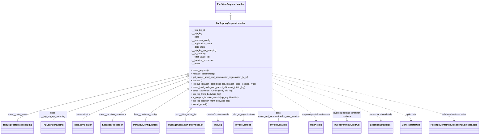

# Diagram: partview_core/partview_service/partview_service/api/trip_leg/handlers/put_trip_leg_handler.py

> Auto-generated by Obscura crawlers

## Mermaid

### SVG

<svg id="container" width="3319.9453125" xmlns="http://www.w3.org/2000/svg" class="classDiagram" height="956" viewBox="0 0 3319.9453125 956" role="graphics-document document" aria-roledescription="class"><g><defs><marker id="container_class-aggregationStart" class="marker aggregation class" refX="18" refY="7" markerWidth="190" markerHeight="240" orient="auto"><path d="M 18,7 L9,13 L1,7 L9,1 Z"></path></marker></defs><defs><marker id="container_class-aggregationEnd" class="marker aggregation class" refX="1" refY="7" markerWidth="20" markerHeight="28" orient="auto"><path d="M 18,7 L9,13 L1,7 L9,1 Z"></path></marker></defs><defs><marker id="container_class-extensionStart" class="marker extension class" refX="18" refY="7" markerWidth="190" markerHeight="240" orient="auto"><path d="M 1,7 L18,13 V 1 Z"></path></marker></defs><defs><marker id="container_class-extensionEnd" class="marker extension class" refX="1" refY="7" markerWidth="20" markerHeight="28" orient="auto"><path d="M 1,1 V 13 L18,7 Z"></path></marker></defs><defs><marker id="container_class-compositionStart" class="marker composition class" refX="18" refY="7" markerWidth="190" markerHeight="240" orient="auto"><path d="M 18,7 L9,13 L1,7 L9,1 Z"></path></marker></defs><defs><marker id="container_class-compositionEnd" class="marker composition class" refX="1" refY="7" markerWidth="20" markerHeight="28" orient="auto"><path d="M 18,7 L9,13 L1,7 L9,1 Z"></path></marker></defs><defs><marker id="container_class-dependencyStart" class="marker dependency class" refX="6" refY="7" markerWidth="190" markerHeight="240" orient="auto"><path d="M 5,7 L9,13 L1,7 L9,1 Z"></path></marker></defs><defs><marker id="container_class-dependencyEnd" class="marker dependency class" refX="13" refY="7" markerWidth="20" markerHeight="28" orient="auto"><path d="M 18,7 L9,13 L14,7 L9,1 Z"></path></marker></defs><defs><marker id="container_class-lollipopStart" class="marker lollipop class" refX="13" refY="7" markerWidth="190" markerHeight="240" orient="auto"><circle stroke="black" fill="transparent" cx="7" cy="7" r="6"></circle></marker></defs><defs><marker id="container_class-lollipopEnd" class="marker lollipop class" refX="1" refY="7" markerWidth="190" markerHeight="240" orient="auto"><circle stroke="black" fill="transparent" cx="7" cy="7" r="6"></circle></marker></defs><g class="root"><g class="clusters"></g><g class="edgePaths"><path d="M1573.051,109.25L1573.051,110.542C1573.051,111.833,1573.051,114.417,1573.051,119.875C1573.051,125.333,1573.051,133.667,1573.051,137.833L1573.051,142" id="id_PartViewRequestHandler_PutTripLegRequestHandler_1" class="edge-thickness-normal edge-pattern-solid relation" style=";;;" data-edge="true" data-et="edge" data-id="id_PartViewRequestHandler_PutTripLegRequestHandler_1" data-points="W3sieCI6MTU3My4wNTA3ODEyNSwieSI6OTJ9LHsieCI6MTU3My4wNTA3ODEyNSwieSI6MTE3fSx7IngiOjE1NzMuMDUwNzgxMjUsInkiOjE0Mn1d" marker-start="url(#container_class-extensionStart)"></path><path d="M1257.371,532.291L1067.384,579.409C877.398,626.528,497.426,720.764,307.439,776.049C117.453,831.333,117.453,847.667,117.453,855.833L117.453,864" id="id_PutTripLegRequestHandler_TripLegPostgresqlMapping_2" class="edge-thickness-normal edge-pattern-solid relation" style=";;;" data-edge="true" data-et="edge" data-id="id_PutTripLegRequestHandler_TripLegPostgresqlMapping_2" data-points="W3sieCI6MTI3NC4xMTMyODEyNSwieSI6NTI4LjEzODkxOTUyNjcxOTN9LHsieCI6MTE3LjQ1MzEyNSwieSI6ODE1fSx7IngiOjExNy40NTMxMjUsInkiOjg2NH1d" marker-start="url(#container_class-aggregationStart)"></path><path d="M1257.579,547.822L1107.851,592.352C958.123,636.882,658.667,725.941,508.939,778.637C359.211,831.333,359.211,847.667,359.211,855.833L359.211,864" id="id_PutTripLegRequestHandler_TripLegApiMapping_3" class="edge-thickness-normal edge-pattern-solid relation" style=";;;" data-edge="true" data-et="edge" data-id="id_PutTripLegRequestHandler_TripLegApiMapping_3" data-points="W3sieCI6MTI3NC4xMTMyODEyNSwieSI6NTQyLjkwNTAwNTEwMDY3ODF9LHsieCI6MzU5LjIxMDkzNzUsInkiOjgxNX0seyJ4IjozNTkuMjEwOTM3NSwieSI6ODY0fV0=" marker-start="url(#container_class-aggregationStart)"></path><path d="M1257.871,566.731L1142.184,608.11C1026.497,649.488,795.124,732.244,679.437,781.789C563.75,831.333,563.75,847.667,563.75,855.833L563.75,864" id="id_PutTripLegRequestHandler_TripLegValidator_4" class="edge-thickness-normal edge-pattern-solid relation" style=";;;" data-edge="true" data-et="edge" data-id="id_PutTripLegRequestHandler_TripLegValidator_4" data-points="W3sieCI6MTI3NC4xMTMyODEyNSwieSI6NTYwLjkyMTk3OTU1NzMyMDR9LHsieCI6NTYzLjc1LCJ5Ijo4MTV9LHsieCI6NTYzLjc1LCJ5Ijo4NjR9XQ==" marker-start="url(#container_class-aggregationStart)"></path><path d="M1258.364,594.631L1176.179,631.359C1093.993,668.087,929.621,741.544,847.436,786.438C765.25,831.333,765.25,847.667,765.25,855.833L765.25,864" id="id_PutTripLegRequestHandler_LocationProcessor_5" class="edge-thickness-normal edge-pattern-solid relation" style=";;;" data-edge="true" data-et="edge" data-id="id_PutTripLegRequestHandler_LocationProcessor_5" data-points="W3sieCI6MTI3NC4xMTMyODEyNSwieSI6NTg3LjU5Mjg4NTc3Njg3M30seyJ4Ijo3NjUuMjUsInkiOjgxNX0seyJ4Ijo3NjUuMjUsInkiOjg2NH1d" marker-start="url(#container_class-aggregationStart)"></path><path d="M1259.434,647.571L1214.224,675.476C1169.013,703.381,1078.593,759.19,1033.382,795.262C988.172,831.333,988.172,847.667,988.172,855.833L988.172,864" id="id_PutTripLegRequestHandler_PartViewConfiguration_6" class="edge-thickness-normal edge-pattern-solid relation" style=";;;" data-edge="true" data-et="edge" data-id="id_PutTripLegRequestHandler_PartViewConfiguration_6" data-points="W3sieCI6MTI3NC4xMTMyODEyNSwieSI6NjM4LjUxMDczNjA2MzE1NDF9LHsieCI6OTg4LjE3MTg3NSwieSI6ODE1fSx7IngiOjk4OC4xNzE4NzUsInkiOjg2NH1d" marker-start="url(#container_class-aggregationStart)"></path><path d="M1292.4,779.057L1287.228,785.047C1282.056,791.038,1271.712,803.019,1266.539,817.176C1261.367,831.333,1261.367,847.667,1261.367,855.833L1261.367,864" id="id_PutTripLegRequestHandler_PackageContainerFilterValueList_7" class="edge-thickness-normal edge-pattern-solid relation" style=";;;" data-edge="true" data-et="edge" data-id="id_PutTripLegRequestHandler_PackageContainerFilterValueList_7" data-points="W3sieCI6MTMwMy42NzMyNzA4NjIxODg1LCJ5Ijo3NjZ9LHsieCI6MTI2MS4zNjcxODc1LCJ5Ijo4MTV9LHsieCI6MTI2MS4zNjcxODc1LCJ5Ijo4NjR9XQ==" marker-start="url(#container_class-aggregationStart)"></path><path d="M1492.596,766L1490.49,774.167C1488.385,782.333,1484.173,798.667,1482.067,814C1479.961,829.333,1479.961,843.667,1479.961,850.833L1479.961,858" id="id_PutTripLegRequestHandler_TripLeg_8" class="edge-thickness-normal edge-pattern-dashed relation" style=";;;" data-edge="true" data-et="edge" data-id="id_PutTripLegRequestHandler_TripLeg_8" data-points="W3sieCI6MTQ5Mi41OTY0MDEwNTYwOTQyLCJ5Ijo3NjZ9LHsieCI6MTQ3OS45NjA5Mzc1LCJ5Ijo4MTV9LHsieCI6MTQ3OS45NjA5Mzc1LCJ5Ijo4NjR9XQ==" marker-end="url(#container_class-dependencyEnd)"></path><path d="M1653.505,766L1655.611,774.167C1657.717,782.333,1661.929,798.667,1664.035,814C1666.141,829.333,1666.141,843.667,1666.141,850.833L1666.141,858" id="id_PutTripLegRequestHandler_InvokeLambda_9" class="edge-thickness-normal edge-pattern-dashed relation" style=";;;" data-edge="true" data-et="edge" data-id="id_PutTripLegRequestHandler_InvokeLambda_9" data-points="W3sieCI6MTY1My41MDUxNjE0NDM5MDU4LCJ5Ijo3NjZ9LHsieCI6MTY2Ni4xNDA2MjUsInkiOjgxNX0seyJ4IjoxNjY2LjE0MDYyNSwieSI6ODY0fV0=" marker-end="url(#container_class-dependencyEnd)"></path><path d="M1871.988,761.965L1880.568,770.804C1889.148,779.643,1906.309,797.322,1914.889,813.327C1923.469,829.333,1923.469,843.667,1923.469,850.833L1923.469,858" id="id_PutTripLegRequestHandler_InvokeLocation_10" class="edge-thickness-normal edge-pattern-dashed relation" style=";;;" data-edge="true" data-et="edge" data-id="id_PutTripLegRequestHandler_InvokeLocation_10" data-points="W3sieCI6MTg3MS45ODgyODEyNSwieSI6NzYxLjk2NDkwNzk3ODE5NTd9LHsieCI6MTkyMy40Njg3NSwieSI6ODE1fSx7IngiOjE5MjMuNDY4NzUsInkiOjg2NH1d" marker-end="url(#container_class-dependencyEnd)"></path><path d="M1871.988,626.67L1926.33,658.058C1980.672,689.446,2089.355,752.223,2143.697,790.778C2198.039,829.333,2198.039,843.667,2198.039,850.833L2198.039,858" id="id_PutTripLegRequestHandler_MapAction_11" class="edge-thickness-normal edge-pattern-dashed relation" style=";;;" data-edge="true" data-et="edge" data-id="id_PutTripLegRequestHandler_MapAction_11" data-points="W3sieCI6MTg3MS45ODgyODEyNSwieSI6NjI2LjY2OTUzNzU1MzgyOTJ9LHsieCI6MjE5OC4wMzkwNjI1LCJ5Ijo4MTV9LHsieCI6MjE5OC4wMzkwNjI1LCJ5Ijo4NjR9XQ==" marker-end="url(#container_class-dependencyEnd)"></path><path d="M1871.988,581.714L1962.997,620.595C2054.005,659.476,2236.022,737.238,2327.031,783.286C2418.039,829.333,2418.039,843.667,2418.039,850.833L2418.039,858" id="id_PutTripLegRequestHandler_InvokePartViewCrudApi_12" class="edge-thickness-normal edge-pattern-dashed relation" style=";;;" data-edge="true" data-et="edge" data-id="id_PutTripLegRequestHandler_InvokePartViewCrudApi_12" data-points="W3sieCI6MTg3MS45ODgyODEyNSwieSI6NTgxLjcxMzUzMTUzMDExNTZ9LHsieCI6MjQxOC4wMzkwNjI1LCJ5Ijo4MTV9LHsieCI6MjQxOC4wMzkwNjI1LCJ5Ijo4NjR9XQ==" marker-end="url(#container_class-dependencyEnd)"></path><path d="M1871.988,554.18L2001.704,597.65C2131.419,641.12,2390.85,728.06,2520.566,778.697C2650.281,829.333,2650.281,843.667,2650.281,850.833L2650.281,858" id="id_PutTripLegRequestHandler_LocationDataHelper_13" class="edge-thickness-normal edge-pattern-dashed relation" style=";;;" data-edge="true" data-et="edge" data-id="id_PutTripLegRequestHandler_LocationDataHelper_13" data-points="W3sieCI6MTg3MS45ODgyODEyNSwieSI6NTU0LjE3OTUyNTc2NTk0MzV9LHsieCI6MjY1MC4yODEyNSwieSI6ODE1fSx7IngiOjI2NTAuMjgxMjUsInkiOjg2NH1d" marker-end="url(#container_class-dependencyEnd)"></path><path d="M1871.988,537.924L2036.48,584.103C2200.971,630.283,2529.954,722.641,2694.446,775.987C2858.938,829.333,2858.938,843.667,2858.938,850.833L2858.938,858" id="id_PutTripLegRequestHandler_GeneralDataUtils_14" class="edge-thickness-normal edge-pattern-dashed relation" style=";;;" data-edge="true" data-et="edge" data-id="id_PutTripLegRequestHandler_GeneralDataUtils_14" data-points="W3sieCI6MTg3MS45ODgyODEyNSwieSI6NTM3LjkyMzc1MTU0NTQ3NDF9LHsieCI6Mjg1OC45Mzc1LCJ5Ijo4MTV9LHsieCI6Mjg1OC45Mzc1LCJ5Ijo4NjR9XQ==" marker-end="url(#container_class-dependencyEnd)"></path><path d="M1871.988,522.547L2084.555,571.289C2297.122,620.031,2722.257,717.516,2934.824,773.425C3147.391,829.333,3147.391,843.667,3147.391,850.833L3147.391,858" id="id_PutTripLegRequestHandler_PackageContainerExceptionBusinessLogic_15" class="edge-thickness-normal edge-pattern-dashed relation" style=";;;" data-edge="true" data-et="edge" data-id="id_PutTripLegRequestHandler_PackageContainerExceptionBusinessLogic_15" data-points="W3sieCI6MTg3MS45ODgyODEyNSwieSI6NTIyLjU0NzEwNDMxNzAzNzd9LHsieCI6MzE0Ny4zOTA2MjUsInkiOjgxNX0seyJ4IjozMTQ3LjM5MDYyNSwieSI6ODY0fV0=" marker-end="url(#container_class-dependencyEnd)"></path></g><g class="edgeLabels"><g class="edgeLabel"><g class="label" data-id="id_PartViewRequestHandler_PutTripLegRequestHandler_1" transform="translate(0, 0)"><foreignObject width="0" height="0">

</foreignObject></g></g><g class="edgeLabel" transform="translate(117.453125, 815)"><g class="label" data-id="id_PutTripLegRequestHandler_TripLegPostgresqlMapping_2" transform="translate(-65.5546875, -12)"><foreignObject width="131.109375" height="24">

uses __data_store

</foreignObject></g></g><g class="edgeLabel" transform="translate(359.2109375, 815)"><g class="label" data-id="id_PutTripLegRequestHandler_TripLegApiMapping_3" transform="translate(-100, -24)"><foreignObject width="200" height="48">

uses __trip_leg_api_mapping

</foreignObject></g></g><g class="edgeLabel" transform="translate(563.75, 815)"><g class="label" data-id="id_PutTripLegRequestHandler_TripLegValidator_4" transform="translate(-50.953125, -12)"><foreignObject width="101.90625" height="24">

uses validator

</foreignObject></g></g><g class="edgeLabel" transform="translate(765.25, 815)"><g class="label" data-id="id_PutTripLegRequestHandler_LocationProcessor_5" transform="translate(-95.953125, -12)"><foreignObject width="191.90625" height="24">

uses __location_processor

</foreignObject></g></g><g class="edgeLabel" transform="translate(988.171875, 815)"><g class="label" data-id="id_PutTripLegRequestHandler_PartViewConfiguration_6" transform="translate(-79.9296875, -12)"><foreignObject width="159.859375" height="24">

has __partview_config

</foreignObject></g></g><g class="edgeLabel" transform="translate(1261.3671875, 815)"><g class="label" data-id="id_PutTripLegRequestHandler_PackageContainerFilterValueList_7" transform="translate(-77.921875, -12)"><foreignObject width="155.84375" height="24">

has __filter_value_list

</foreignObject></g></g><g class="edgeLabel" transform="translate(1479.9609375, 815)"><g class="label" data-id="id_PutTripLegRequestHandler_TripLeg_8" transform="translate(-83.421875, -12)"><foreignObject width="166.84375" height="24">

creates/updates/reads

</foreignObject></g></g><g class="edgeLabel" transform="translate(1666.140625, 815)"><g class="label" data-id="id_PutTripLegRequestHandler_InvokeLambda_9" transform="translate(-82.7578125, -12)"><foreignObject width="165.515625" height="24">

calls get_organizations

</foreignObject></g></g><g class="edgeLabel" transform="translate(1923.46875, 815)"><g class="label" data-id="id_PutTripLegRequestHandler_InvokeLocation_10" transform="translate(-154.5703125, -24)"><foreignObject width="309.140625" height="48">

calls invoke_get_location/invoke_post_location

</foreignObject></g></g><g class="edgeLabel" transform="translate(2198.0390625, 815)"><g class="label" data-id="id_PutTripLegRequestHandler_MapAction_11" transform="translate(-100, -24)"><foreignObject width="200" height="48">

maps requests/persistables

</foreignObject></g></g><g class="edgeLabel" transform="translate(2418.0390625, 815)"><g class="label" data-id="id_PutTripLegRequestHandler_InvokePartViewCrudApi_12" transform="translate(-100, -24)"><foreignObject width="200" height="48">

invokes package container updates

</foreignObject></g></g><g class="edgeLabel" transform="translate(2650.28125, 815)"><g class="label" data-id="id_PutTripLegRequestHandler_LocationDataHelper_13" transform="translate(-82.3046875, -12)"><foreignObject width="164.609375" height="24">

parses location details

</foreignObject></g></g><g class="edgeLabel" transform="translate(2858.9375, 815)"><g class="label" data-id="id_PutTripLegRequestHandler_GeneralDataUtils_14" transform="translate(-36.796875, -12)"><foreignObject width="73.59375" height="24">

splits lists

</foreignObject></g></g><g class="edgeLabel" transform="translate(3147.390625, 815)"><g class="label" data-id="id_PutTripLegRequestHandler_PackageContainerExceptionBusinessLogic_15" transform="translate(-86.90625, -12)"><foreignObject width="173.8125" height="24">

validates business rules

</foreignObject></g></g></g><g class="nodes"><g class="node default" id="classId-PartViewRequestHandler-0" transform="translate(1573.05078125, 50)"><g class="basic label-container"><path d="M-103.359375 -42 L103.359375 -42 L103.359375 42 L-103.359375 42" stroke="none" stroke-width="0" fill="#ECECFF" style=""></path><path d="M-103.359375 -42 C-40.66111439473492 -42, 22.037146210530153 -42, 103.359375 -42 M-103.359375 -42 C-40.530349375937135 -42, 22.29867624812573 -42, 103.359375 -42 M103.359375 -42 C103.359375 -14.147002552889724, 103.359375 13.705994894220552, 103.359375 42 M103.359375 -42 C103.359375 -16.247987058928086, 103.359375 9.504025882143829, 103.359375 42 M103.359375 42 C25.528804477527046 42, -52.30176604494591 42, -103.359375 42 M103.359375 42 C50.041352642376395 42, -3.276669715247209 42, -103.359375 42 M-103.359375 42 C-103.359375 13.850829460191989, -103.359375 -14.298341079616023, -103.359375 -42 M-103.359375 42 C-103.359375 20.836155343449914, -103.359375 -0.3276893131001728, -103.359375 -42" stroke="#9370DB" stroke-width="1.3" fill="none" stroke-dasharray="0 0" style=""></path></g><g class="annotation-group text" transform="translate(0, -18)"></g><g class="label-group text" transform="translate(-91.359375, -18)"><g class="label" style="font-weight: bolder" transform="translate(0,-12)"><foreignObject width="182.71875" height="24">

PartViewRequestHandler

</foreignObject></g></g><g class="members-group text" transform="translate(-91.359375, 30)"></g><g class="methods-group text" transform="translate(-91.359375, 60)"></g><g class="divider" style=""><path d="M-103.359375 6 C-28.493106735685032 6, 46.373161528629936 6, 103.359375 6 M-103.359375 6 C-20.811721736908524 6, 61.73593152618295 6, 103.359375 6" stroke="#9370DB" stroke-width="1.3" fill="none" stroke-dasharray="0 0" style=""></path></g><g class="divider" style=""><path d="M-103.359375 24 C-30.107601182244238 24, 43.144172635511524 24, 103.359375 24 M-103.359375 24 C-39.56822939524149 24, 24.222916209517024 24, 103.359375 24" stroke="#9370DB" stroke-width="1.3" fill="none" stroke-dasharray="0 0" style=""></path></g></g><g class="node default" id="classId-PutTripLegRequestHandler-1" transform="translate(1573.05078125, 454)"><g class="basic label-container"><path d="M-298.9375 -312 L298.9375 -312 L298.9375 312 L-298.9375 312" stroke="none" stroke-width="0" fill="#ECECFF" style=""></path><path d="M-298.9375 -312 C-66.06400340582766 -312, 166.80949318834467 -312, 298.9375 -312 M-298.9375 -312 C-143.7210112032792 -312, 11.495477593441592 -312, 298.9375 -312 M298.9375 -312 C298.9375 -159.18530935901836, 298.9375 -6.370618718036724, 298.9375 312 M298.9375 -312 C298.9375 -142.23289181132355, 298.9375 27.53421637735289, 298.9375 312 M298.9375 312 C103.51887426503296 312, -91.89975146993407 312, -298.9375 312 M298.9375 312 C165.49093664724654 312, 32.044373294493084 312, -298.9375 312 M-298.9375 312 C-298.9375 144.4240834000958, -298.9375 -23.15183319980838, -298.9375 -312 M-298.9375 312 C-298.9375 114.44645742574056, -298.9375 -83.10708514851888, -298.9375 -312" stroke="#9370DB" stroke-width="1.3" fill="none" stroke-dasharray="0 0" style=""></path></g><g class="annotation-group text" transform="translate(0, -288)"></g><g class="label-group text" transform="translate(-98.375, -288)"><g class="label" style="font-weight: bolder" transform="translate(0,-12)"><foreignObject width="196.75" height="24">

PutTripLegRequestHandler

</foreignObject></g></g><g class="members-group text" transform="translate(-286.9375, -240)"><g class="label" style="" transform="translate(0,-12)"><foreignObject width="104.78125" height="24">

- __trip_leg_id

</foreignObject></g><g class="label" style="" transform="translate(0,12)"><foreignObject width="82.3125" height="24">

- __trip_leg

</foreignObject></g><g class="label" style="" transform="translate(0,36)"><foreignObject width="58.484375" height="24">

- __scac

</foreignObject></g><g class="label" style="" transform="translate(0,60)"><foreignObject width="140.921875" height="24">

- __partview_config

</foreignObject></g><g class="label" style="" transform="translate(0,84)"><foreignObject width="157.796875" height="24">

- __application_name

</foreignObject></g><g class="label" style="" transform="translate(0,108)"><foreignObject width="104.578125" height="24">

- __data_store

</foreignObject></g><g class="label" style="" transform="translate(0,132)"><foreignObject width="185.046875" height="24">

- __trip_leg_api_mapping

</foreignObject></g><g class="label" style="" transform="translate(0,156)"><foreignObject width="105.4375" height="24">

- __is_creating

</foreignObject></g><g class="label" style="" transform="translate(0,180)"><foreignObject width="136.90625" height="24">

- __filter_value_list

</foreignObject></g><g class="label" style="" transform="translate(0,204)"><foreignObject width="165.390625" height="24">

- __location_processor

</foreignObject></g><g class="label" style="" transform="translate(0,228)"><foreignObject width="67.1875" height="24">

- __event

</foreignObject></g></g><g class="methods-group text" transform="translate(-286.9375, 48)"><g class="label" style="" transform="translate(0,-12)"><foreignObject width="126.046875" height="24">

+ parse_request()

</foreignObject></g><g class="label" style="" transform="translate(0,12)"><foreignObject width="170.953125" height="24">

+ validate_parameters()

</foreignObject></g><g class="label" style="" transform="translate(0,36)"><foreignObject width="407.671875" height="24">

+ get_carrier_label_and_scac(carrier_organization_fv_id)

</foreignObject></g><g class="label" style="" transform="translate(0,60)"><foreignObject width="77.96875" height="24">

+ process()

</foreignObject></g><g class="label" style="" transform="translate(0,84)"><foreignObject width="475.5" height="24">

+ retrieve_location_details(trip_leg, location_code, location_type)

</foreignObject></g><g class="label" style="" transform="translate(0,108)"><foreignObject width="391.53125" height="24">

+ parse_load_code_and_parent_shipment_id(trip_leg)

</foreignObject></g><g class="label" style="" transform="translate(0,132)"><foreignObject width="303.96875" height="24">

+ parse_sequence_number(body, trip_leg)

</foreignObject></g><g class="label" style="" transform="translate(0,156)"><foreignObject width="220.296875" height="24">

+ trip_leg_from_body(trip_leg)

</foreignObject></g><g class="label" style="" transform="translate(0,180)"><foreignObject width="347.59375" height="24">

+ aggregate_location_details(trip_leg, identifier)

</foreignObject></g><g class="label" style="" transform="translate(0,204)"><foreignObject width="287.609375" height="24">

+ trip_leg_location_from_body(trip_leg)

</foreignObject></g><g class="label" style="" transform="translate(0,228)"><foreignObject width="121.5" height="24">

+ format_result()

</foreignObject></g></g><g class="divider" style=""><path d="M-298.9375 -264 C-153.62807672689655 -264, -8.318653453793104 -264, 298.9375 -264 M-298.9375 -264 C-116.96749475041122 -264, 65.00251049917756 -264, 298.9375 -264" stroke="#9370DB" stroke-width="1.3" fill="none" stroke-dasharray="0 0" style=""></path></g><g class="divider" style=""><path d="M-298.9375 24 C-89.89917374205928 24, 119.13915251588145 24, 298.9375 24 M-298.9375 24 C-103.50634246450375 24, 91.92481507099251 24, 298.9375 24" stroke="#9370DB" stroke-width="1.3" fill="none" stroke-dasharray="0 0" style=""></path></g></g><g class="node default" id="classId-TripLeg-2" transform="translate(1479.9609375, 906)"><g class="basic label-container"><path d="M-39.0546875 -42 L39.0546875 -42 L39.0546875 42 L-39.0546875 42" stroke="none" stroke-width="0" fill="#ECECFF" style=""></path><path d="M-39.0546875 -42 C-22.749339836799145 -42, -6.443992173598289 -42, 39.0546875 -42 M-39.0546875 -42 C-21.411319513103557 -42, -3.7679515262071135 -42, 39.0546875 -42 M39.0546875 -42 C39.0546875 -23.22907894143903, 39.0546875 -4.458157882878062, 39.0546875 42 M39.0546875 -42 C39.0546875 -20.561478407085712, 39.0546875 0.8770431858285761, 39.0546875 42 M39.0546875 42 C21.17653999492248 42, 3.2983924898449573 42, -39.0546875 42 M39.0546875 42 C19.460299818565012 42, -0.13408786286997554 42, -39.0546875 42 M-39.0546875 42 C-39.0546875 14.179842735083124, -39.0546875 -13.640314529833752, -39.0546875 -42 M-39.0546875 42 C-39.0546875 17.467382675649244, -39.0546875 -7.065234648701512, -39.0546875 -42" stroke="#9370DB" stroke-width="1.3" fill="none" stroke-dasharray="0 0" style=""></path></g><g class="annotation-group text" transform="translate(0, -18)"></g><g class="label-group text" transform="translate(-27.0546875, -18)"><g class="label" style="font-weight: bolder" transform="translate(0,-12)"><foreignObject width="54.109375" height="24">

TripLeg

</foreignObject></g></g><g class="members-group text" transform="translate(-27.0546875, 30)"></g><g class="methods-group text" transform="translate(-27.0546875, 60)"></g><g class="divider" style=""><path d="M-39.0546875 6 C-12.901635965352153 6, 13.251415569295695 6, 39.0546875 6 M-39.0546875 6 C-20.10070941025977 6, -1.1467313205195424 6, 39.0546875 6" stroke="#9370DB" stroke-width="1.3" fill="none" stroke-dasharray="0 0" style=""></path></g><g class="divider" style=""><path d="M-39.0546875 24 C-17.424977256363487 24, 4.204732987273026 24, 39.0546875 24 M-39.0546875 24 C-21.967396997618582 24, -4.880106495237165 24, 39.0546875 24" stroke="#9370DB" stroke-width="1.3" fill="none" stroke-dasharray="0 0" style=""></path></g></g><g class="node default" id="classId-PartViewConfiguration-3" transform="translate(988.171875, 906)"><g class="basic label-container"><path d="M-93.65625 -42 L93.65625 -42 L93.65625 42 L-93.65625 42" stroke="none" stroke-width="0" fill="#ECECFF" style=""></path><path d="M-93.65625 -42 C-31.145682930133766 -42, 31.364884139732467 -42, 93.65625 -42 M-93.65625 -42 C-46.22453477792423 -42, 1.2071804441515468 -42, 93.65625 -42 M93.65625 -42 C93.65625 -15.484391704515673, 93.65625 11.031216590968654, 93.65625 42 M93.65625 -42 C93.65625 -11.976240765207272, 93.65625 18.047518469585455, 93.65625 42 M93.65625 42 C45.7881042789704 42, -2.0800414420591977 42, -93.65625 42 M93.65625 42 C46.77224732805422 42, -0.11175534389155928 42, -93.65625 42 M-93.65625 42 C-93.65625 9.740721427518409, -93.65625 -22.518557144963182, -93.65625 -42 M-93.65625 42 C-93.65625 17.817606901213484, -93.65625 -6.364786197573032, -93.65625 -42" stroke="#9370DB" stroke-width="1.3" fill="none" stroke-dasharray="0 0" style=""></path></g><g class="annotation-group text" transform="translate(0, -18)"></g><g class="label-group text" transform="translate(-81.65625, -18)"><g class="label" style="font-weight: bolder" transform="translate(0,-12)"><foreignObject width="163.3125" height="24">

PartViewConfiguration

</foreignObject></g></g><g class="members-group text" transform="translate(-81.65625, 30)"></g><g class="methods-group text" transform="translate(-81.65625, 60)"></g><g class="divider" style=""><path d="M-93.65625 6 C-34.10854777140892 6, 25.439154457182156 6, 93.65625 6 M-93.65625 6 C-27.039142410820475 6, 39.57796517835905 6, 93.65625 6" stroke="#9370DB" stroke-width="1.3" fill="none" stroke-dasharray="0 0" style=""></path></g><g class="divider" style=""><path d="M-93.65625 24 C-24.196524332581618 24, 45.263201334836765 24, 93.65625 24 M-93.65625 24 C-38.470156261923044 24, 16.71593747615391 24, 93.65625 24" stroke="#9370DB" stroke-width="1.3" fill="none" stroke-dasharray="0 0" style=""></path></g></g><g class="node default" id="classId-TripLegPostgresqlMapping-4" transform="translate(117.453125, 906)"><g class="basic label-container"><path d="M-109.453125 -42 L109.453125 -42 L109.453125 42 L-109.453125 42" stroke="none" stroke-width="0" fill="#ECECFF" style=""></path><path d="M-109.453125 -42 C-35.09046861543794 -42, 39.272187769124116 -42, 109.453125 -42 M-109.453125 -42 C-52.106764822934366 -42, 5.239595354131268 -42, 109.453125 -42 M109.453125 -42 C109.453125 -9.073204245101188, 109.453125 23.853591509797624, 109.453125 42 M109.453125 -42 C109.453125 -15.20730373047886, 109.453125 11.585392539042282, 109.453125 42 M109.453125 42 C52.00879199288491 42, -5.435541014230182 42, -109.453125 42 M109.453125 42 C49.58837906579738 42, -10.276366868405233 42, -109.453125 42 M-109.453125 42 C-109.453125 13.609138385248613, -109.453125 -14.781723229502774, -109.453125 -42 M-109.453125 42 C-109.453125 11.273124634737396, -109.453125 -19.453750730525208, -109.453125 -42" stroke="#9370DB" stroke-width="1.3" fill="none" stroke-dasharray="0 0" style=""></path></g><g class="annotation-group text" transform="translate(0, -18)"></g><g class="label-group text" transform="translate(-97.453125, -18)"><g class="label" style="font-weight: bolder" transform="translate(0,-12)"><foreignObject width="194.90625" height="24">

TripLegPostgresqlMapping

</foreignObject></g></g><g class="members-group text" transform="translate(-97.453125, 30)"></g><g class="methods-group text" transform="translate(-97.453125, 60)"></g><g class="divider" style=""><path d="M-109.453125 6 C-28.608874240393405 6, 52.23537651921319 6, 109.453125 6 M-109.453125 6 C-41.18057034028966 6, 27.091984319420675 6, 109.453125 6" stroke="#9370DB" stroke-width="1.3" fill="none" stroke-dasharray="0 0" style=""></path></g><g class="divider" style=""><path d="M-109.453125 24 C-50.33582367457101 24, 8.78147765085798 24, 109.453125 24 M-109.453125 24 C-42.35137470852857 24, 24.750375582942866 24, 109.453125 24" stroke="#9370DB" stroke-width="1.3" fill="none" stroke-dasharray="0 0" style=""></path></g></g><g class="node default" id="classId-TripLegApiMapping-5" transform="translate(359.2109375, 906)"><g class="basic label-container"><path d="M-82.3046875 -42 L82.3046875 -42 L82.3046875 42 L-82.3046875 42" stroke="none" stroke-width="0" fill="#ECECFF" style=""></path><path d="M-82.3046875 -42 C-45.96526770322298 -42, -9.625847906445955 -42, 82.3046875 -42 M-82.3046875 -42 C-19.73768178665175 -42, 42.8293239266965 -42, 82.3046875 -42 M82.3046875 -42 C82.3046875 -10.452155793870546, 82.3046875 21.09568841225891, 82.3046875 42 M82.3046875 -42 C82.3046875 -13.428999891682967, 82.3046875 15.142000216634067, 82.3046875 42 M82.3046875 42 C39.84214138584502 42, -2.620404728309964 42, -82.3046875 42 M82.3046875 42 C17.500886966749363 42, -47.302913566501275 42, -82.3046875 42 M-82.3046875 42 C-82.3046875 19.319859314735773, -82.3046875 -3.3602813705284547, -82.3046875 -42 M-82.3046875 42 C-82.3046875 10.19292710635293, -82.3046875 -21.61414578729414, -82.3046875 -42" stroke="#9370DB" stroke-width="1.3" fill="none" stroke-dasharray="0 0" style=""></path></g><g class="annotation-group text" transform="translate(0, -18)"></g><g class="label-group text" transform="translate(-70.3046875, -18)"><g class="label" style="font-weight: bolder" transform="translate(0,-12)"><foreignObject width="140.609375" height="24">

TripLegApiMapping

</foreignObject></g></g><g class="members-group text" transform="translate(-70.3046875, 30)"></g><g class="methods-group text" transform="translate(-70.3046875, 60)"></g><g class="divider" style=""><path d="M-82.3046875 6 C-38.8515645153294 6, 4.6015584693411995 6, 82.3046875 6 M-82.3046875 6 C-20.486601293730317 6, 41.331484912539366 6, 82.3046875 6" stroke="#9370DB" stroke-width="1.3" fill="none" stroke-dasharray="0 0" style=""></path></g><g class="divider" style=""><path d="M-82.3046875 24 C-40.59502052040667 24, 1.114646459186659 24, 82.3046875 24 M-82.3046875 24 C-20.564896858723223 24, 41.17489378255355 24, 82.3046875 24" stroke="#9370DB" stroke-width="1.3" fill="none" stroke-dasharray="0 0" style=""></path></g></g><g class="node default" id="classId-TripLegValidator-6" transform="translate(563.75, 906)"><g class="basic label-container"><path d="M-72.234375 -42 L72.234375 -42 L72.234375 42 L-72.234375 42" stroke="none" stroke-width="0" fill="#ECECFF" style=""></path><path d="M-72.234375 -42 C-28.11931219857933 -42, 15.99575060284134 -42, 72.234375 -42 M-72.234375 -42 C-28.783362330461046 -42, 14.667650339077909 -42, 72.234375 -42 M72.234375 -42 C72.234375 -24.285126577869118, 72.234375 -6.570253155738236, 72.234375 42 M72.234375 -42 C72.234375 -17.06777733017654, 72.234375 7.86444533964692, 72.234375 42 M72.234375 42 C22.761629436296523 42, -26.711116127406953 42, -72.234375 42 M72.234375 42 C33.34771027472967 42, -5.538954450540658 42, -72.234375 42 M-72.234375 42 C-72.234375 11.950972364452621, -72.234375 -18.098055271094758, -72.234375 -42 M-72.234375 42 C-72.234375 23.325171014268168, -72.234375 4.650342028536336, -72.234375 -42" stroke="#9370DB" stroke-width="1.3" fill="none" stroke-dasharray="0 0" style=""></path></g><g class="annotation-group text" transform="translate(0, -18)"></g><g class="label-group text" transform="translate(-60.234375, -18)"><g class="label" style="font-weight: bolder" transform="translate(0,-12)"><foreignObject width="120.46875" height="24">

TripLegValidator

</foreignObject></g></g><g class="members-group text" transform="translate(-60.234375, 30)"></g><g class="methods-group text" transform="translate(-60.234375, 60)"></g><g class="divider" style=""><path d="M-72.234375 6 C-32.06975647898744 6, 8.094862042025113 6, 72.234375 6 M-72.234375 6 C-38.63993849229544 6, -5.045501984590885 6, 72.234375 6" stroke="#9370DB" stroke-width="1.3" fill="none" stroke-dasharray="0 0" style=""></path></g><g class="divider" style=""><path d="M-72.234375 24 C-43.13564009126377 24, -14.036905182527526 24, 72.234375 24 M-72.234375 24 C-36.13747102965034 24, -0.040567059300684605 24, 72.234375 24" stroke="#9370DB" stroke-width="1.3" fill="none" stroke-dasharray="0 0" style=""></path></g></g><g class="node default" id="classId-LocationProcessor-7" transform="translate(765.25, 906)"><g class="basic label-container"><path d="M-79.265625 -42 L79.265625 -42 L79.265625 42 L-79.265625 42" stroke="none" stroke-width="0" fill="#ECECFF" style=""></path><path d="M-79.265625 -42 C-24.020776873871597 -42, 31.224071252256806 -42, 79.265625 -42 M-79.265625 -42 C-40.823438607335355 -42, -2.3812522146707096 -42, 79.265625 -42 M79.265625 -42 C79.265625 -16.72698971121228, 79.265625 8.54602057757544, 79.265625 42 M79.265625 -42 C79.265625 -13.767069539205046, 79.265625 14.465860921589908, 79.265625 42 M79.265625 42 C43.75094644205085 42, 8.236267884101693 42, -79.265625 42 M79.265625 42 C23.42426883638438 42, -32.41708732723124 42, -79.265625 42 M-79.265625 42 C-79.265625 13.551733101935149, -79.265625 -14.896533796129702, -79.265625 -42 M-79.265625 42 C-79.265625 12.8538194422311, -79.265625 -16.2923611155378, -79.265625 -42" stroke="#9370DB" stroke-width="1.3" fill="none" stroke-dasharray="0 0" style=""></path></g><g class="annotation-group text" transform="translate(0, -18)"></g><g class="label-group text" transform="translate(-67.265625, -18)"><g class="label" style="font-weight: bolder" transform="translate(0,-12)"><foreignObject width="134.53125" height="24">

LocationProcessor

</foreignObject></g></g><g class="members-group text" transform="translate(-67.265625, 30)"></g><g class="methods-group text" transform="translate(-67.265625, 60)"></g><g class="divider" style=""><path d="M-79.265625 6 C-26.512292446961148 6, 26.241040106077705 6, 79.265625 6 M-79.265625 6 C-30.228971685723472 6, 18.807681628553055 6, 79.265625 6" stroke="#9370DB" stroke-width="1.3" fill="none" stroke-dasharray="0 0" style=""></path></g><g class="divider" style=""><path d="M-79.265625 24 C-25.465111303017167 24, 28.335402393965666 24, 79.265625 24 M-79.265625 24 C-16.388205972000677 24, 46.48921305599865 24, 79.265625 24" stroke="#9370DB" stroke-width="1.3" fill="none" stroke-dasharray="0 0" style=""></path></g></g><g class="node default" id="classId-PackageContainerFilterValueList-8" transform="translate(1261.3671875, 906)"><g class="basic label-container"><path d="M-129.5390625 -42 L129.5390625 -42 L129.5390625 42 L-129.5390625 42" stroke="none" stroke-width="0" fill="#ECECFF" style=""></path><path d="M-129.5390625 -42 C-41.52327137178517 -42, 46.49251975642966 -42, 129.5390625 -42 M-129.5390625 -42 C-47.97051274115874 -42, 33.598037017682515 -42, 129.5390625 -42 M129.5390625 -42 C129.5390625 -18.157803988753432, 129.5390625 5.684392022493135, 129.5390625 42 M129.5390625 -42 C129.5390625 -13.092375741850201, 129.5390625 15.815248516299597, 129.5390625 42 M129.5390625 42 C64.9769060523348 42, 0.4147496046695949 42, -129.5390625 42 M129.5390625 42 C43.83745982271351 42, -41.864142854572975 42, -129.5390625 42 M-129.5390625 42 C-129.5390625 23.539158279725005, -129.5390625 5.078316559450009, -129.5390625 -42 M-129.5390625 42 C-129.5390625 21.06357042178995, -129.5390625 0.12714084357990174, -129.5390625 -42" stroke="#9370DB" stroke-width="1.3" fill="none" stroke-dasharray="0 0" style=""></path></g><g class="annotation-group text" transform="translate(0, -18)"></g><g class="label-group text" transform="translate(-117.5390625, -18)"><g class="label" style="font-weight: bolder" transform="translate(0,-12)"><foreignObject width="235.078125" height="24">

PackageContainerFilterValueList

</foreignObject></g></g><g class="members-group text" transform="translate(-117.5390625, 30)"></g><g class="methods-group text" transform="translate(-117.5390625, 60)"></g><g class="divider" style=""><path d="M-129.5390625 6 C-65.04158975353032 6, -0.5441170070606347 6, 129.5390625 6 M-129.5390625 6 C-57.512392083527075 6, 14.51427833294585 6, 129.5390625 6" stroke="#9370DB" stroke-width="1.3" fill="none" stroke-dasharray="0 0" style=""></path></g><g class="divider" style=""><path d="M-129.5390625 24 C-34.840292885630305 24, 59.85847672873939 24, 129.5390625 24 M-129.5390625 24 C-54.44870121968631 24, 20.641660060627373 24, 129.5390625 24" stroke="#9370DB" stroke-width="1.3" fill="none" stroke-dasharray="0 0" style=""></path></g></g><g class="node default" id="classId-InvokeLambda-9" transform="translate(1666.140625, 906)"><g class="basic label-container"><path d="M-65.484375 -42 L65.484375 -42 L65.484375 42 L-65.484375 42" stroke="none" stroke-width="0" fill="#ECECFF" style=""></path><path d="M-65.484375 -42 C-39.13771705475218 -42, -12.79105910950436 -42, 65.484375 -42 M-65.484375 -42 C-32.505909816689666 -42, 0.4725553666206679 -42, 65.484375 -42 M65.484375 -42 C65.484375 -20.451191764960562, 65.484375 1.0976164700788758, 65.484375 42 M65.484375 -42 C65.484375 -12.61666039456102, 65.484375 16.76667921087796, 65.484375 42 M65.484375 42 C36.49047218253276 42, 7.496569365065525 42, -65.484375 42 M65.484375 42 C14.4523577446287 42, -36.5796595107426 42, -65.484375 42 M-65.484375 42 C-65.484375 12.751889887604428, -65.484375 -16.496220224791145, -65.484375 -42 M-65.484375 42 C-65.484375 24.674416254323923, -65.484375 7.348832508647845, -65.484375 -42" stroke="#9370DB" stroke-width="1.3" fill="none" stroke-dasharray="0 0" style=""></path></g><g class="annotation-group text" transform="translate(0, -18)"></g><g class="label-group text" transform="translate(-53.484375, -18)"><g class="label" style="font-weight: bolder" transform="translate(0,-12)"><foreignObject width="106.96875" height="24">

InvokeLambda

</foreignObject></g></g><g class="members-group text" transform="translate(-53.484375, 30)"></g><g class="methods-group text" transform="translate(-53.484375, 60)"></g><g class="divider" style=""><path d="M-65.484375 6 C-36.369753141674465 6, -7.255131283348938 6, 65.484375 6 M-65.484375 6 C-27.13250805300401 6, 11.21935889399198 6, 65.484375 6" stroke="#9370DB" stroke-width="1.3" fill="none" stroke-dasharray="0 0" style=""></path></g><g class="divider" style=""><path d="M-65.484375 24 C-31.512643938421945 24, 2.4590871231561096 24, 65.484375 24 M-65.484375 24 C-25.077688870761683 24, 15.328997258476633 24, 65.484375 24" stroke="#9370DB" stroke-width="1.3" fill="none" stroke-dasharray="0 0" style=""></path></g></g><g class="node default" id="classId-InvokeLocation-10" transform="translate(1923.46875, 906)"><g class="basic label-container"><path d="M-67.703125 -42 L67.703125 -42 L67.703125 42 L-67.703125 42" stroke="none" stroke-width="0" fill="#ECECFF" style=""></path><path d="M-67.703125 -42 C-30.338010334482327 -42, 7.027104331035346 -42, 67.703125 -42 M-67.703125 -42 C-31.3129441182773 -42, 5.0772367634453985 -42, 67.703125 -42 M67.703125 -42 C67.703125 -17.169981439777985, 67.703125 7.660037120444031, 67.703125 42 M67.703125 -42 C67.703125 -23.749050037811543, 67.703125 -5.498100075623086, 67.703125 42 M67.703125 42 C38.052054796827605 42, 8.400984593655217 42, -67.703125 42 M67.703125 42 C32.747910295945196 42, -2.207304408109607 42, -67.703125 42 M-67.703125 42 C-67.703125 17.63535650941652, -67.703125 -6.729286981166958, -67.703125 -42 M-67.703125 42 C-67.703125 21.29380079660991, -67.703125 0.5876015932198229, -67.703125 -42" stroke="#9370DB" stroke-width="1.3" fill="none" stroke-dasharray="0 0" style=""></path></g><g class="annotation-group text" transform="translate(0, -18)"></g><g class="label-group text" transform="translate(-55.703125, -18)"><g class="label" style="font-weight: bolder" transform="translate(0,-12)"><foreignObject width="111.40625" height="24">

InvokeLocation

</foreignObject></g></g><g class="members-group text" transform="translate(-55.703125, 30)"></g><g class="methods-group text" transform="translate(-55.703125, 60)"></g><g class="divider" style=""><path d="M-67.703125 6 C-36.04093402478428 6, -4.378743049568563 6, 67.703125 6 M-67.703125 6 C-36.31703992336322 6, -4.930954846726436 6, 67.703125 6" stroke="#9370DB" stroke-width="1.3" fill="none" stroke-dasharray="0 0" style=""></path></g><g class="divider" style=""><path d="M-67.703125 24 C-29.66500265831769 24, 8.37311968336462 24, 67.703125 24 M-67.703125 24 C-21.336581076255307 24, 25.029962847489386 24, 67.703125 24" stroke="#9370DB" stroke-width="1.3" fill="none" stroke-dasharray="0 0" style=""></path></g></g><g class="node default" id="classId-MapAction-11" transform="translate(2198.0390625, 906)"><g class="basic label-container"><path d="M-50.6328125 -42 L50.6328125 -42 L50.6328125 42 L-50.6328125 42" stroke="none" stroke-width="0" fill="#ECECFF" style=""></path><path d="M-50.6328125 -42 C-18.78432884951919 -42, 13.064154800961617 -42, 50.6328125 -42 M-50.6328125 -42 C-17.018135163777075 -42, 16.59654217244585 -42, 50.6328125 -42 M50.6328125 -42 C50.6328125 -11.60005239412624, 50.6328125 18.79989521174752, 50.6328125 42 M50.6328125 -42 C50.6328125 -14.871049706895235, 50.6328125 12.25790058620953, 50.6328125 42 M50.6328125 42 C17.2684749299194 42, -16.0958626401612 42, -50.6328125 42 M50.6328125 42 C18.278351762233065 42, -14.07610897553387 42, -50.6328125 42 M-50.6328125 42 C-50.6328125 15.953830493780096, -50.6328125 -10.092339012439808, -50.6328125 -42 M-50.6328125 42 C-50.6328125 18.92549889583773, -50.6328125 -4.149002208324539, -50.6328125 -42" stroke="#9370DB" stroke-width="1.3" fill="none" stroke-dasharray="0 0" style=""></path></g><g class="annotation-group text" transform="translate(0, -18)"></g><g class="label-group text" transform="translate(-38.6328125, -18)"><g class="label" style="font-weight: bolder" transform="translate(0,-12)"><foreignObject width="77.265625" height="24">

MapAction

</foreignObject></g></g><g class="members-group text" transform="translate(-38.6328125, 30)"></g><g class="methods-group text" transform="translate(-38.6328125, 60)"></g><g class="divider" style=""><path d="M-50.6328125 6 C-15.933006184045311 6, 18.766800131909378 6, 50.6328125 6 M-50.6328125 6 C-24.06303296552158 6, 2.5067465689568422 6, 50.6328125 6" stroke="#9370DB" stroke-width="1.3" fill="none" stroke-dasharray="0 0" style=""></path></g><g class="divider" style=""><path d="M-50.6328125 24 C-15.679102606685547 24, 19.274607286628907 24, 50.6328125 24 M-50.6328125 24 C-20.45767832074078 24, 9.717455858518441 24, 50.6328125 24" stroke="#9370DB" stroke-width="1.3" fill="none" stroke-dasharray="0 0" style=""></path></g></g><g class="node default" id="classId-InvokePartViewCrudApi-12" transform="translate(2418.0390625, 906)"><g class="basic label-container"><path d="M-97.484375 -42 L97.484375 -42 L97.484375 42 L-97.484375 42" stroke="none" stroke-width="0" fill="#ECECFF" style=""></path><path d="M-97.484375 -42 C-39.46033439973521 -42, 18.56370620052958 -42, 97.484375 -42 M-97.484375 -42 C-20.811516758781792 -42, 55.861341482436416 -42, 97.484375 -42 M97.484375 -42 C97.484375 -9.700559391589941, 97.484375 22.598881216820118, 97.484375 42 M97.484375 -42 C97.484375 -10.492953636463312, 97.484375 21.014092727073375, 97.484375 42 M97.484375 42 C23.092328788604462 42, -51.299717422791076 42, -97.484375 42 M97.484375 42 C20.768987697370164 42, -55.94639960525967 42, -97.484375 42 M-97.484375 42 C-97.484375 22.11516509406548, -97.484375 2.2303301881309565, -97.484375 -42 M-97.484375 42 C-97.484375 19.815032179005254, -97.484375 -2.3699356419894926, -97.484375 -42" stroke="#9370DB" stroke-width="1.3" fill="none" stroke-dasharray="0 0" style=""></path></g><g class="annotation-group text" transform="translate(0, -18)"></g><g class="label-group text" transform="translate(-85.484375, -18)"><g class="label" style="font-weight: bolder" transform="translate(0,-12)"><foreignObject width="170.96875" height="24">

InvokePartViewCrudApi

</foreignObject></g></g><g class="members-group text" transform="translate(-85.484375, 30)"></g><g class="methods-group text" transform="translate(-85.484375, 60)"></g><g class="divider" style=""><path d="M-97.484375 6 C-47.95931914366755 6, 1.5657367126649007 6, 97.484375 6 M-97.484375 6 C-33.70415979698166 6, 30.076055406036673 6, 97.484375 6" stroke="#9370DB" stroke-width="1.3" fill="none" stroke-dasharray="0 0" style=""></path></g><g class="divider" style=""><path d="M-97.484375 24 C-31.77216513359791 24, 33.94004473280418 24, 97.484375 24 M-97.484375 24 C-45.721012301146835 24, 6.042350397706329 24, 97.484375 24" stroke="#9370DB" stroke-width="1.3" fill="none" stroke-dasharray="0 0" style=""></path></g></g><g class="node default" id="classId-LocationDataHelper-13" transform="translate(2650.28125, 906)"><g class="basic label-container"><path d="M-84.7578125 -42 L84.7578125 -42 L84.7578125 42 L-84.7578125 42" stroke="none" stroke-width="0" fill="#ECECFF" style=""></path><path d="M-84.7578125 -42 C-43.96181297630295 -42, -3.165813452605903 -42, 84.7578125 -42 M-84.7578125 -42 C-50.15160243166116 -42, -15.545392363322321 -42, 84.7578125 -42 M84.7578125 -42 C84.7578125 -22.647567155652258, 84.7578125 -3.2951343113045155, 84.7578125 42 M84.7578125 -42 C84.7578125 -11.349199317662482, 84.7578125 19.301601364675037, 84.7578125 42 M84.7578125 42 C26.28261433516122 42, -32.19258382967756 42, -84.7578125 42 M84.7578125 42 C25.055688988731106 42, -34.64643452253779 42, -84.7578125 42 M-84.7578125 42 C-84.7578125 23.21875431661543, -84.7578125 4.437508633230863, -84.7578125 -42 M-84.7578125 42 C-84.7578125 10.500288817901144, -84.7578125 -20.999422364197713, -84.7578125 -42" stroke="#9370DB" stroke-width="1.3" fill="none" stroke-dasharray="0 0" style=""></path></g><g class="annotation-group text" transform="translate(0, -18)"></g><g class="label-group text" transform="translate(-72.7578125, -18)"><g class="label" style="font-weight: bolder" transform="translate(0,-12)"><foreignObject width="145.515625" height="24">

LocationDataHelper

</foreignObject></g></g><g class="members-group text" transform="translate(-72.7578125, 30)"></g><g class="methods-group text" transform="translate(-72.7578125, 60)"></g><g class="divider" style=""><path d="M-84.7578125 6 C-32.28799493972912 6, 20.181822620541766 6, 84.7578125 6 M-84.7578125 6 C-32.957954473882225 6, 18.84190355223555 6, 84.7578125 6" stroke="#9370DB" stroke-width="1.3" fill="none" stroke-dasharray="0 0" style=""></path></g><g class="divider" style=""><path d="M-84.7578125 24 C-32.93899598221209 24, 18.879820535575817 24, 84.7578125 24 M-84.7578125 24 C-34.66385785351313 24, 15.430096792973742 24, 84.7578125 24" stroke="#9370DB" stroke-width="1.3" fill="none" stroke-dasharray="0 0" style=""></path></g></g><g class="node default" id="classId-GeneralDataUtils-14" transform="translate(2858.9375, 906)"><g class="basic label-container"><path d="M-73.8984375 -42 L73.8984375 -42 L73.8984375 42 L-73.8984375 42" stroke="none" stroke-width="0" fill="#ECECFF" style=""></path><path d="M-73.8984375 -42 C-35.095672631325925 -42, 3.7070922373481494 -42, 73.8984375 -42 M-73.8984375 -42 C-38.10430251129647 -42, -2.310167522592934 -42, 73.8984375 -42 M73.8984375 -42 C73.8984375 -20.11843116734946, 73.8984375 1.7631376653010804, 73.8984375 42 M73.8984375 -42 C73.8984375 -14.303073618509295, 73.8984375 13.39385276298141, 73.8984375 42 M73.8984375 42 C28.55010222580048 42, -16.79823304839904 42, -73.8984375 42 M73.8984375 42 C31.083604967207854 42, -11.731227565584291 42, -73.8984375 42 M-73.8984375 42 C-73.8984375 20.783763993231023, -73.8984375 -0.4324720135379536, -73.8984375 -42 M-73.8984375 42 C-73.8984375 9.693258402099808, -73.8984375 -22.613483195800384, -73.8984375 -42" stroke="#9370DB" stroke-width="1.3" fill="none" stroke-dasharray="0 0" style=""></path></g><g class="annotation-group text" transform="translate(0, -18)"></g><g class="label-group text" transform="translate(-61.8984375, -18)"><g class="label" style="font-weight: bolder" transform="translate(0,-12)"><foreignObject width="123.796875" height="24">

GeneralDataUtils

</foreignObject></g></g><g class="members-group text" transform="translate(-61.8984375, 30)"></g><g class="methods-group text" transform="translate(-61.8984375, 60)"></g><g class="divider" style=""><path d="M-73.8984375 6 C-30.0315506395118 6, 13.835336220976401 6, 73.8984375 6 M-73.8984375 6 C-23.906493054786324 6, 26.08545139042735 6, 73.8984375 6" stroke="#9370DB" stroke-width="1.3" fill="none" stroke-dasharray="0 0" style=""></path></g><g class="divider" style=""><path d="M-73.8984375 24 C-17.39555906451804 24, 39.10731937096392 24, 73.8984375 24 M-73.8984375 24 C-27.621589010973267 24, 18.655259478053466 24, 73.8984375 24" stroke="#9370DB" stroke-width="1.3" fill="none" stroke-dasharray="0 0" style=""></path></g></g><g class="node default" id="classId-PackageContainerExceptionBusinessLogic-15" transform="translate(3147.390625, 906)"><g class="basic label-container"><path d="M-164.5546875 -42 L164.5546875 -42 L164.5546875 42 L-164.5546875 42" stroke="none" stroke-width="0" fill="#ECECFF" style=""></path><path d="M-164.5546875 -42 C-45.51123239326054 -42, 73.53222271347892 -42, 164.5546875 -42 M-164.5546875 -42 C-57.91717685553911 -42, 48.72033378892178 -42, 164.5546875 -42 M164.5546875 -42 C164.5546875 -13.358233798402726, 164.5546875 15.283532403194549, 164.5546875 42 M164.5546875 -42 C164.5546875 -11.745471212903112, 164.5546875 18.509057574193776, 164.5546875 42 M164.5546875 42 C77.96959441700044 42, -8.615498665999127 42, -164.5546875 42 M164.5546875 42 C80.47183557680799 42, -3.6110163463840195 42, -164.5546875 42 M-164.5546875 42 C-164.5546875 10.086304448919904, -164.5546875 -21.827391102160192, -164.5546875 -42 M-164.5546875 42 C-164.5546875 20.99735134659846, -164.5546875 -0.005297306803079493, -164.5546875 -42" stroke="#9370DB" stroke-width="1.3" fill="none" stroke-dasharray="0 0" style=""></path></g><g class="annotation-group text" transform="translate(0, -18)"></g><g class="label-group text" transform="translate(-152.5546875, -18)"><g class="label" style="font-weight: bolder" transform="translate(0,-12)"><foreignObject width="305.109375" height="24">

PackageContainerExceptionBusinessLogic

</foreignObject></g></g><g class="members-group text" transform="translate(-152.5546875, 30)"></g><g class="methods-group text" transform="translate(-152.5546875, 60)"></g><g class="divider" style=""><path d="M-164.5546875 6 C-56.74029297650178 6, 51.074101546996445 6, 164.5546875 6 M-164.5546875 6 C-41.98835821086209 6, 80.57797107827582 6, 164.5546875 6" stroke="#9370DB" stroke-width="1.3" fill="none" stroke-dasharray="0 0" style=""></path></g><g class="divider" style=""><path d="M-164.5546875 24 C-48.93791342503329 24, 66.67886064993343 24, 164.5546875 24 M-164.5546875 24 C-92.28322898731216 24, -20.011770474624313 24, 164.5546875 24" stroke="#9370DB" stroke-width="1.3" fill="none" stroke-dasharray="0 0" style=""></path></g></g></g></g></g></svg>
