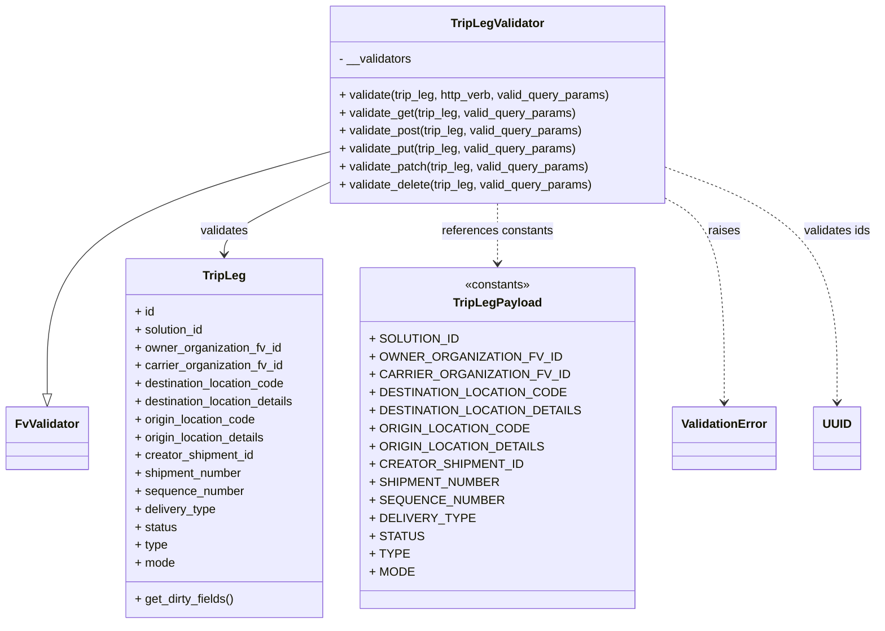

# Diagram: partview_core/partview_service/partview_service/api/trip_leg/handlers/validate/TripLegValidator.py

> Auto-generated by Obscura crawlers

## Mermaid

### SVG

<svg id="container" width="1133.2734375" xmlns="http://www.w3.org/2000/svg" class="classDiagram" height="834" viewBox="0 0 1133.2734375 834" role="graphics-document document" aria-roledescription="class"><g><defs><marker id="container_class-aggregationStart" class="marker aggregation class" refX="18" refY="7" markerWidth="190" markerHeight="240" orient="auto"><path d="M 18,7 L9,13 L1,7 L9,1 Z"></path></marker></defs><defs><marker id="container_class-aggregationEnd" class="marker aggregation class" refX="1" refY="7" markerWidth="20" markerHeight="28" orient="auto"><path d="M 18,7 L9,13 L1,7 L9,1 Z"></path></marker></defs><defs><marker id="container_class-extensionStart" class="marker extension class" refX="18" refY="7" markerWidth="190" markerHeight="240" orient="auto"><path d="M 1,7 L18,13 V 1 Z"></path></marker></defs><defs><marker id="container_class-extensionEnd" class="marker extension class" refX="1" refY="7" markerWidth="20" markerHeight="28" orient="auto"><path d="M 1,1 V 13 L18,7 Z"></path></marker></defs><defs><marker id="container_class-compositionStart" class="marker composition class" refX="18" refY="7" markerWidth="190" markerHeight="240" orient="auto"><path d="M 18,7 L9,13 L1,7 L9,1 Z"></path></marker></defs><defs><marker id="container_class-compositionEnd" class="marker composition class" refX="1" refY="7" markerWidth="20" markerHeight="28" orient="auto"><path d="M 18,7 L9,13 L1,7 L9,1 Z"></path></marker></defs><defs><marker id="container_class-dependencyStart" class="marker dependency class" refX="6" refY="7" markerWidth="190" markerHeight="240" orient="auto"><path d="M 5,7 L9,13 L1,7 L9,1 Z"></path></marker></defs><defs><marker id="container_class-dependencyEnd" class="marker dependency class" refX="13" refY="7" markerWidth="20" markerHeight="28" orient="auto"><path d="M 18,7 L9,13 L14,7 L9,1 Z"></path></marker></defs><defs><marker id="container_class-lollipopStart" class="marker lollipop class" refX="13" refY="7" markerWidth="190" markerHeight="240" orient="auto"><circle stroke="black" fill="transparent" cx="7" cy="7" r="6"></circle></marker></defs><defs><marker id="container_class-lollipopEnd" class="marker lollipop class" refX="1" refY="7" markerWidth="190" markerHeight="240" orient="auto"><circle stroke="black" fill="transparent" cx="7" cy="7" r="6"></circle></marker></defs><g class="root"><g class="clusters"></g><g class="edgePaths"><path d="M423.969,204.866L363.458,222.222C302.948,239.577,181.927,274.289,121.417,327.936C60.906,381.583,60.906,454.167,60.906,490.458L60.906,526.75" id="id_TripLegValidator_FvValidator_1" class="edge-thickness-normal edge-pattern-solid relation" style=";;;" data-edge="true" data-et="edge" data-id="id_TripLegValidator_FvValidator_1" data-points="W3sieCI6NDIzLjk2ODc1LCJ5IjoyMDQuODY2MjQyMzc2MDI3NTd9LHsieCI6NjAuOTA2MjUsInkiOjMwOX0seyJ4Ijo2MC45MDYyNSwieSI6NTQ0fV0=" marker-end="url(#container_class-extensionEnd)"></path><path d="M423.969,248.959L403.199,258.966C382.428,268.973,340.888,288.986,320.118,304.16C299.348,319.333,299.348,329.667,299.348,334.833L299.348,340" id="id_TripLegValidator_TripLeg_2" class="edge-thickness-normal edge-pattern-solid relation" style=";;;" data-edge="true" data-et="edge" data-id="id_TripLegValidator_TripLeg_2" data-points="W3sieCI6NDIzLjk2ODc1LCJ5IjoyNDguOTU5MTY0MzU1OTUwNTJ9LHsieCI6Mjk5LjM0NzY1NjI1LCJ5IjozMDl9LHsieCI6Mjk5LjM0NzY1NjI1LCJ5IjozNDZ9XQ==" marker-end="url(#container_class-dependencyEnd)"></path><path d="M650.125,272L650.125,278.167C650.125,284.333,650.125,296.667,650.125,310C650.125,323.333,650.125,337.667,650.125,344.833L650.125,352" id="id_TripLegValidator_TripLegPayload_3" class="edge-thickness-normal edge-pattern-dashed relation" style=";;;" data-edge="true" data-et="edge" data-id="id_TripLegValidator_TripLegPayload_3" data-points="W3sieCI6NjUwLjEyNSwieSI6MjcyfSx7IngiOjY1MC4xMjUsInkiOjMwOX0seyJ4Ijo2NTAuMTI1LCJ5IjozNTh9XQ==" marker-end="url(#container_class-dependencyEnd)"></path><path d="M870.715,272L881.02,278.167C891.326,284.333,911.936,296.667,922.242,341C932.547,385.333,932.547,461.667,932.547,499.833L932.547,538" id="id_TripLegValidator_ValidationError_4" class="edge-thickness-normal edge-pattern-dashed relation" style=";;;" data-edge="true" data-et="edge" data-id="id_TripLegValidator_ValidationError_4" data-points="W3sieCI6ODcwLjcxNDg2Njg2MzkwNTMsInkiOjI3Mn0seyJ4Ijo5MzIuNTQ2ODc1LCJ5IjozMDl9LHsieCI6OTMyLjU0Njg3NSwieSI6NTQ0fV0=" marker-end="url(#container_class-dependencyEnd)"></path><path d="M876.281,228.974L910.184,242.311C944.086,255.649,1011.891,282.325,1045.793,333.829C1079.695,385.333,1079.695,461.667,1079.695,499.833L1079.695,538" id="id_TripLegValidator_UUID_5" class="edge-thickness-normal edge-pattern-dashed relation" style=";;;" data-edge="true" data-et="edge" data-id="id_TripLegValidator_UUID_5" data-points="W3sieCI6ODc2LjI4MTI1LCJ5IjoyMjguOTczNTc0NjExMjU3NjJ9LHsieCI6MTA3OS42OTUzMTI1LCJ5IjozMDl9LHsieCI6MTA3OS42OTUzMTI1LCJ5Ijo1NDR9XQ==" marker-end="url(#container_class-dependencyEnd)"></path></g><g class="edgeLabels"><g class="edgeLabel"><g class="label" data-id="id_TripLegValidator_FvValidator_1" transform="translate(0, 0)"><foreignObject width="0" height="0">

</foreignObject></g></g><g class="edgeLabel" transform="translate(299.34765625, 309)"><g class="label" data-id="id_TripLegValidator_TripLeg_2" transform="translate(-32.6875, -12)"><foreignObject width="65.375" height="24">

validates

</foreignObject></g></g><g class="edgeLabel" transform="translate(650.125, 309)"><g class="label" data-id="id_TripLegValidator_TripLegPayload_3" transform="translate(-75.203125, -12)"><foreignObject width="150.40625" height="24">

references constants

</foreignObject></g></g><g class="edgeLabel" transform="translate(932.546875, 309)"><g class="label" data-id="id_TripLegValidator_ValidationError_4" transform="translate(-21.25, -12)"><foreignObject width="42.5" height="24">

raises

</foreignObject></g></g><g class="edgeLabel" transform="translate(1079.6953125, 309)"><g class="label" data-id="id_TripLegValidator_UUID_5" transform="translate(-45.578125, -12)"><foreignObject width="91.15625" height="24">

validates ids

</foreignObject></g></g></g><g class="nodes"><g class="node default" id="classId-TripLegValidator-0" transform="translate(650.125, 140)"><g class="basic label-container"><path d="M-226.15625 -132 L226.15625 -132 L226.15625 132 L-226.15625 132" stroke="none" stroke-width="0" fill="#ECECFF" style=""></path><path d="M-226.15625 -132 C-132.48660346036925 -132, -38.816956920738505 -132, 226.15625 -132 M-226.15625 -132 C-71.35965624565176 -132, 83.43693750869647 -132, 226.15625 -132 M226.15625 -132 C226.15625 -71.67983528246886, 226.15625 -11.359670564937716, 226.15625 132 M226.15625 -132 C226.15625 -29.29836948222885, 226.15625 73.4032610355423, 226.15625 132 M226.15625 132 C110.14826949648109 132, -5.859711007037816 132, -226.15625 132 M226.15625 132 C96.85662353839723 132, -32.44300292320554 132, -226.15625 132 M-226.15625 132 C-226.15625 39.78847489051333, -226.15625 -52.423050218973344, -226.15625 -132 M-226.15625 132 C-226.15625 36.44225350493922, -226.15625 -59.11549299012157, -226.15625 -132" stroke="#9370DB" stroke-width="1.3" fill="none" stroke-dasharray="0 0" style=""></path></g><g class="annotation-group text" transform="translate(0, -108)"></g><g class="label-group text" transform="translate(-60.234375, -108)"><g class="label" style="font-weight: bolder" transform="translate(0,-12)"><foreignObject width="120.46875" height="24">

TripLegValidator

</foreignObject></g></g><g class="members-group text" transform="translate(-214.15625, -60)"><g class="label" style="" transform="translate(0,-12)"><foreignObject width="98.609375" height="24">

- __validators

</foreignObject></g></g><g class="methods-group text" transform="translate(-214.15625, -12)"><g class="label" style="" transform="translate(0,-12)"><foreignObject width="368.078125" height="24">

+ validate(trip_leg, http_verb, valid_query_params)

</foreignObject></g><g class="label" style="" transform="translate(0,12)"><foreignObject width="320.703125" height="24">

+ validate_get(trip_leg, valid_query_params)

</foreignObject></g><g class="label" style="" transform="translate(0,36)"><foreignObject width="330.09375" height="24">

+ validate_post(trip_leg, valid_query_params)

</foreignObject></g><g class="label" style="" transform="translate(0,60)"><foreignObject width="322.578125" height="24">

+ validate_put(trip_leg, valid_query_params)

</foreignObject></g><g class="label" style="" transform="translate(0,84)"><foreignObject width="338.59375" height="24">

+ validate_patch(trip_leg, valid_query_params)

</foreignObject></g><g class="label" style="" transform="translate(0,108)"><foreignObject width="343.546875" height="24">

+ validate_delete(trip_leg, valid_query_params)

</foreignObject></g></g><g class="divider" style=""><path d="M-226.15625 -84 C-80.550542128291 -84, 65.055165743418 -84, 226.15625 -84 M-226.15625 -84 C-74.59137940784859 -84, 76.97349118430282 -84, 226.15625 -84" stroke="#9370DB" stroke-width="1.3" fill="none" stroke-dasharray="0 0" style=""></path></g><g class="divider" style=""><path d="M-226.15625 -36 C-121.90624791407299 -36, -17.656245828145984 -36, 226.15625 -36 M-226.15625 -36 C-63.60780612766774 -36, 98.94063774466451 -36, 226.15625 -36" stroke="#9370DB" stroke-width="1.3" fill="none" stroke-dasharray="0 0" style=""></path></g></g><g class="node default" id="classId-FvValidator-1" transform="translate(60.90625, 586)"><g class="basic label-container"><path d="M-52.90625 -42 L52.90625 -42 L52.90625 42 L-52.90625 42" stroke="none" stroke-width="0" fill="#ECECFF" style=""></path><path d="M-52.90625 -42 C-23.333811503601545 -42, 6.23862699279691 -42, 52.90625 -42 M-52.90625 -42 C-24.72000071253552 -42, 3.4662485749289615 -42, 52.90625 -42 M52.90625 -42 C52.90625 -22.583715700413606, 52.90625 -3.167431400827212, 52.90625 42 M52.90625 -42 C52.90625 -14.774977436041809, 52.90625 12.450045127916383, 52.90625 42 M52.90625 42 C22.52077866295727 42, -7.864692674085461 42, -52.90625 42 M52.90625 42 C22.61589662899105 42, -7.674456742017902 42, -52.90625 42 M-52.90625 42 C-52.90625 25.187092887329257, -52.90625 8.374185774658514, -52.90625 -42 M-52.90625 42 C-52.90625 20.57380036189147, -52.90625 -0.8523992762170565, -52.90625 -42" stroke="#9370DB" stroke-width="1.3" fill="none" stroke-dasharray="0 0" style=""></path></g><g class="annotation-group text" transform="translate(0, -18)"></g><g class="label-group text" transform="translate(-40.90625, -18)"><g class="label" style="font-weight: bolder" transform="translate(0,-12)"><foreignObject width="81.8125" height="24">

FvValidator

</foreignObject></g></g><g class="members-group text" transform="translate(-40.90625, 30)"></g><g class="methods-group text" transform="translate(-40.90625, 60)"></g><g class="divider" style=""><path d="M-52.90625 6 C-11.07909601320032 6, 30.74805797359936 6, 52.90625 6 M-52.90625 6 C-16.099098023281407 6, 20.708053953437187 6, 52.90625 6" stroke="#9370DB" stroke-width="1.3" fill="none" stroke-dasharray="0 0" style=""></path></g><g class="divider" style=""><path d="M-52.90625 24 C-23.66010637597688 24, 5.586037248046239 24, 52.90625 24 M-52.90625 24 C-16.990005021017076 24, 18.926239957965848 24, 52.90625 24" stroke="#9370DB" stroke-width="1.3" fill="none" stroke-dasharray="0 0" style=""></path></g></g><g class="node default" id="classId-TripLeg-2" transform="translate(299.34765625, 586)"><g class="basic label-container"><path d="M-135.53515625 -240 L135.53515625 -240 L135.53515625 240 L-135.53515625 240" stroke="none" stroke-width="0" fill="#ECECFF" style=""></path><path d="M-135.53515625 -240 C-46.48954165094193 -240, 42.55607294811614 -240, 135.53515625 -240 M-135.53515625 -240 C-75.94950226236996 -240, -16.363848274739922 -240, 135.53515625 -240 M135.53515625 -240 C135.53515625 -54.888503814676454, 135.53515625 130.2229923706471, 135.53515625 240 M135.53515625 -240 C135.53515625 -95.40748243611515, 135.53515625 49.18503512776971, 135.53515625 240 M135.53515625 240 C75.33653930591308 240, 15.13792236182617 240, -135.53515625 240 M135.53515625 240 C76.9288264082229 240, 18.32249656644582 240, -135.53515625 240 M-135.53515625 240 C-135.53515625 86.13325070965095, -135.53515625 -67.7334985806981, -135.53515625 -240 M-135.53515625 240 C-135.53515625 54.827588164808276, -135.53515625 -130.34482367038345, -135.53515625 -240" stroke="#9370DB" stroke-width="1.3" fill="none" stroke-dasharray="0 0" style=""></path></g><g class="annotation-group text" transform="translate(0, -216)"></g><g class="label-group text" transform="translate(-27.0546875, -216)"><g class="label" style="font-weight: bolder" transform="translate(0,-12)"><foreignObject width="54.109375" height="24">

TripLeg

</foreignObject></g></g><g class="members-group text" transform="translate(-123.53515625, -168)"><g class="label" style="" transform="translate(0,-12)"><foreignObject width="26.3125" height="24">

+ id

</foreignObject></g><g class="label" style="" transform="translate(0,12)"><foreignObject width="94.453125" height="24">

+ solution_id

</foreignObject></g><g class="label" style="" transform="translate(0,36)"><foreignObject width="197.546875" height="24">

+ owner_organization_fv_id

</foreignObject></g><g class="label" style="" transform="translate(0,60)"><foreignObject width="200.40625" height="24">

+ carrier_organization_fv_id

</foreignObject></g><g class="label" style="" transform="translate(0,84)"><foreignObject width="205.640625" height="24">

+ destination_location_code

</foreignObject></g><g class="label" style="" transform="translate(0,108)"><foreignObject width="220.015625" height="24">

+ destination_location_details

</foreignObject></g><g class="label" style="" transform="translate(0,132)"><foreignObject width="164.75" height="24">

+ origin_location_code

</foreignObject></g><g class="label" style="" transform="translate(0,156)"><foreignObject width="179.109375" height="24">

+ origin_location_details

</foreignObject></g><g class="label" style="" transform="translate(0,180)"><foreignObject width="161.78125" height="24">

+ creator_shipment_id

</foreignObject></g><g class="label" style="" transform="translate(0,204)"><foreignObject width="145.796875" height="24">

+ shipment_number

</foreignObject></g><g class="label" style="" transform="translate(0,228)"><foreignObject width="146.25" height="24">

+ sequence_number

</foreignObject></g><g class="label" style="" transform="translate(0,252)"><foreignObject width="109.609375" height="24">

+ delivery_type

</foreignObject></g><g class="label" style="" transform="translate(0,276)"><foreignObject width="56.625" height="24">

+ status

</foreignObject></g><g class="label" style="" transform="translate(0,300)"><foreignObject width="44.03125" height="24">

+ type

</foreignObject></g><g class="label" style="" transform="translate(0,324)"><foreignObject width="53.578125" height="24">

+ mode

</foreignObject></g></g><g class="methods-group text" transform="translate(-123.53515625, 216)"><g class="label" style="" transform="translate(0,-12)"><foreignObject width="134.078125" height="24">

+ get_dirty_fields()

</foreignObject></g></g><g class="divider" style=""><path d="M-135.53515625 -192 C-42.9600737694705 -192, 49.615008711059005 -192, 135.53515625 -192 M-135.53515625 -192 C-80.05393511009717 -192, -24.572713970194357 -192, 135.53515625 -192" stroke="#9370DB" stroke-width="1.3" fill="none" stroke-dasharray="0 0" style=""></path></g><g class="divider" style=""><path d="M-135.53515625 192 C-32.57000732799308 192, 70.39514159401384 192, 135.53515625 192 M-135.53515625 192 C-52.2249377441249 192, 31.085280761750198 192, 135.53515625 192" stroke="#9370DB" stroke-width="1.3" fill="none" stroke-dasharray="0 0" style=""></path></g></g><g class="node default" id="classId-TripLegPayload-3" transform="translate(650.125, 586)"><g class="basic label-container"><path d="M-165.2421875 -228 L165.2421875 -228 L165.2421875 228 L-165.2421875 228" stroke="none" stroke-width="0" fill="#ECECFF" style=""></path><path d="M-165.2421875 -228 C-49.68844037199696 -228, 65.86530675600608 -228, 165.2421875 -228 M-165.2421875 -228 C-62.42102111398982 -228, 40.40014527202035 -228, 165.2421875 -228 M165.2421875 -228 C165.2421875 -103.68843309527901, 165.2421875 20.62313380944198, 165.2421875 228 M165.2421875 -228 C165.2421875 -78.49495530798384, 165.2421875 71.01008938403231, 165.2421875 228 M165.2421875 228 C85.16233405312241 228, 5.082480606244815 228, -165.2421875 228 M165.2421875 228 C96.77307401135897 228, 28.303960522717944 228, -165.2421875 228 M-165.2421875 228 C-165.2421875 88.58206507660151, -165.2421875 -50.83586984679698, -165.2421875 -228 M-165.2421875 228 C-165.2421875 130.02834124080408, -165.2421875 32.05668248160816, -165.2421875 -228" stroke="#9370DB" stroke-width="1.3" fill="none" stroke-dasharray="0 0" style=""></path></g><g class="annotation-group text" transform="translate(-44.2265625, -204)"><g class="label" style="" transform="translate(0,-12)"><foreignObject width="88.453125" height="24">

«constants»

</foreignObject></g></g><g class="label-group text" transform="translate(-55.953125, -180)"><g class="label" style="font-weight: bolder" transform="translate(0,-12)"><foreignObject width="111.90625" height="24">

TripLegPayload

</foreignObject></g></g><g class="members-group text" transform="translate(-153.2421875, -132)"><g class="label" style="" transform="translate(0,-12)"><foreignObject width="108.515625" height="24">

+ SOLUTION_ID

</foreignObject></g><g class="label" style="" transform="translate(0,12)"><foreignObject width="228.21875" height="24">

+ OWNER_ORGANIZATION_FV_ID

</foreignObject></g><g class="label" style="" transform="translate(0,36)"><foreignObject width="235.203125" height="24">

+ CARRIER_ORGANIZATION_FV_ID

</foreignObject></g><g class="label" style="" transform="translate(0,60)"><foreignObject width="231.796875" height="24">

+ DESTINATION_LOCATION_CODE

</foreignObject></g><g class="label" style="" transform="translate(0,84)"><foreignObject width="250.53125" height="24">

+ DESTINATION_LOCATION_DETAILS

</foreignObject></g><g class="label" style="" transform="translate(0,108)"><foreignObject width="188.671875" height="24">

+ ORIGIN_LOCATION_CODE

</foreignObject></g><g class="label" style="" transform="translate(0,132)"><foreignObject width="207.40625" height="24">

+ ORIGIN_LOCATION_DETAILS

</foreignObject></g><g class="label" style="" transform="translate(0,156)"><foreignObject width="180.15625" height="24">

+ CREATOR_SHIPMENT_ID

</foreignObject></g><g class="label" style="" transform="translate(0,180)"><foreignObject width="155.03125" height="24">

+ SHIPMENT_NUMBER

</foreignObject></g><g class="label" style="" transform="translate(0,204)"><foreignObject width="158.234375" height="24">

+ SEQUENCE_NUMBER

</foreignObject></g><g class="label" style="" transform="translate(0,228)"><foreignObject width="120.46875" height="24">

+ DELIVERY_TYPE

</foreignObject></g><g class="label" style="" transform="translate(0,252)"><foreignObject width="63.90625" height="24">

+ STATUS

</foreignObject></g><g class="label" style="" transform="translate(0,276)"><foreignObject width="47.15625" height="24">

+ TYPE

</foreignObject></g><g class="label" style="" transform="translate(0,300)"><foreignObject width="54.453125" height="24">

+ MODE

</foreignObject></g></g><g class="methods-group text" transform="translate(-153.2421875, 228)"></g><g class="divider" style=""><path d="M-165.2421875 -156 C-85.90813774513013 -156, -6.574087990260267 -156, 165.2421875 -156 M-165.2421875 -156 C-56.43904164540979 -156, 52.364104209180425 -156, 165.2421875 -156" stroke="#9370DB" stroke-width="1.3" fill="none" stroke-dasharray="0 0" style=""></path></g><g class="divider" style=""><path d="M-165.2421875 204 C-45.88584427767826 204, 73.47049894464348 204, 165.2421875 204 M-165.2421875 204 C-91.58941408689552 204, -17.936640673791032 204, 165.2421875 204" stroke="#9370DB" stroke-width="1.3" fill="none" stroke-dasharray="0 0" style=""></path></g></g><g class="node default" id="classId-ValidationError-4" transform="translate(932.546875, 586)"><g class="basic label-container"><path d="M-67.1796875 -42 L67.1796875 -42 L67.1796875 42 L-67.1796875 42" stroke="none" stroke-width="0" fill="#ECECFF" style=""></path><path d="M-67.1796875 -42 C-35.48624114520996 -42, -3.7927947904199186 -42, 67.1796875 -42 M-67.1796875 -42 C-18.018070881003368 -42, 31.143545737993264 -42, 67.1796875 -42 M67.1796875 -42 C67.1796875 -12.600550938843362, 67.1796875 16.798898122313275, 67.1796875 42 M67.1796875 -42 C67.1796875 -12.516757374731199, 67.1796875 16.966485250537602, 67.1796875 42 M67.1796875 42 C28.582453724275688 42, -10.014780051448625 42, -67.1796875 42 M67.1796875 42 C26.425369027501304 42, -14.328949444997392 42, -67.1796875 42 M-67.1796875 42 C-67.1796875 22.072717770701313, -67.1796875 2.1454355414026267, -67.1796875 -42 M-67.1796875 42 C-67.1796875 14.350223651865285, -67.1796875 -13.29955269626943, -67.1796875 -42" stroke="#9370DB" stroke-width="1.3" fill="none" stroke-dasharray="0 0" style=""></path></g><g class="annotation-group text" transform="translate(0, -18)"></g><g class="label-group text" transform="translate(-55.1796875, -18)"><g class="label" style="font-weight: bolder" transform="translate(0,-12)"><foreignObject width="110.359375" height="24">

ValidationError

</foreignObject></g></g><g class="members-group text" transform="translate(-55.1796875, 30)"></g><g class="methods-group text" transform="translate(-55.1796875, 60)"></g><g class="divider" style=""><path d="M-67.1796875 6 C-23.026580241706753 6, 21.126527016586493 6, 67.1796875 6 M-67.1796875 6 C-22.807227979969888 6, 21.565231540060225 6, 67.1796875 6" stroke="#9370DB" stroke-width="1.3" fill="none" stroke-dasharray="0 0" style=""></path></g><g class="divider" style=""><path d="M-67.1796875 24 C-13.993315622205756 24, 39.19305625558849 24, 67.1796875 24 M-67.1796875 24 C-25.93586101374268 24, 15.307965472514638 24, 67.1796875 24" stroke="#9370DB" stroke-width="1.3" fill="none" stroke-dasharray="0 0" style=""></path></g></g><g class="node default" id="classId-UUID-5" transform="translate(1079.6953125, 586)"><g class="basic label-container"><path d="M-29.96875 -42 L29.96875 -42 L29.96875 42 L-29.96875 42" stroke="none" stroke-width="0" fill="#ECECFF" style=""></path><path d="M-29.96875 -42 C-15.690786679564619 -42, -1.4128233591292378 -42, 29.96875 -42 M-29.96875 -42 C-7.611204377109171 -42, 14.746341245781657 -42, 29.96875 -42 M29.96875 -42 C29.96875 -23.179383845417888, 29.96875 -4.358767690835776, 29.96875 42 M29.96875 -42 C29.96875 -24.611732830746263, 29.96875 -7.223465661492526, 29.96875 42 M29.96875 42 C13.371336719087928 42, -3.2260765618241436 42, -29.96875 42 M29.96875 42 C8.577168143347713 42, -12.814413713304575 42, -29.96875 42 M-29.96875 42 C-29.96875 22.865651660262422, -29.96875 3.7313033205248445, -29.96875 -42 M-29.96875 42 C-29.96875 20.843422832249257, -29.96875 -0.31315433550148697, -29.96875 -42" stroke="#9370DB" stroke-width="1.3" fill="none" stroke-dasharray="0 0" style=""></path></g><g class="annotation-group text" transform="translate(0, -18)"></g><g class="label-group text" transform="translate(-17.96875, -18)"><g class="label" style="font-weight: bolder" transform="translate(0,-12)"><foreignObject width="35.9375" height="24">

UUID

</foreignObject></g></g><g class="members-group text" transform="translate(-17.96875, 30)"></g><g class="methods-group text" transform="translate(-17.96875, 60)"></g><g class="divider" style=""><path d="M-29.96875 6 C-6.696905241566785 6, 16.57493951686643 6, 29.96875 6 M-29.96875 6 C-16.016715466967902 6, -2.0646809339358043 6, 29.96875 6" stroke="#9370DB" stroke-width="1.3" fill="none" stroke-dasharray="0 0" style=""></path></g><g class="divider" style=""><path d="M-29.96875 24 C-17.30499221571491 24, -4.641234431429826 24, 29.96875 24 M-29.96875 24 C-8.68590724394728 24, 12.59693551210544 24, 29.96875 24" stroke="#9370DB" stroke-width="1.3" fill="none" stroke-dasharray="0 0" style=""></path></g></g></g></g></g></svg>
