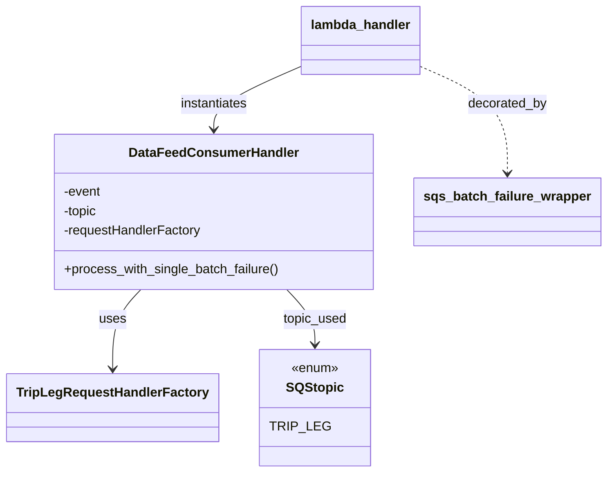

# Diagram: partview_core/partview_service/partview_service/api/trip_leg/trip_leg_consumer.py


> Auto-generated by Obscura crawlers

## Diagram 1

```mermaid
flowchart LR
    LambdaHandler[lambda_handler(event, context)] -->|decorated by| Wrapper[sqs_batch_failure_wrapper]
    LambdaHandler -->|creates| DFCH[DataFeedConsumerHandler(SQStopic.TRIP_LEG, event, TripLegRequestHandlerFactory)]
    DFCH -->|calls| Process[process_with_single_batch_failure()]
    DFCH -.->|uses topic| SQStopic[ SQStopic.TRIP_LEG ]
    DFCH -->|uses factory| Factory[TripLegRequestHandlerFactory]
```

> SVG rendering failed for this diagram.

## Diagram 2



### SVG

<svg id="container" width="726.0078125" xmlns="http://www.w3.org/2000/svg" class="classDiagram" height="584" viewBox="0 0 726.0078125 584" role="graphics-document document" aria-roledescription="class"><style>#container{font-family:"trebuchet ms",verdana,arial,sans-serif;font-size:16px;fill:#333;}@keyframes edge-animation-frame{from{stroke-dashoffset:0;}}@keyframes dash{to{stroke-dashoffset:0;}}#container .edge-animation-slow{stroke-dasharray:9,5!important;stroke-dashoffset:900;animation:dash 50s linear infinite;stroke-linecap:round;}#container .edge-animation-fast{stroke-dasharray:9,5!important;stroke-dashoffset:900;animation:dash 20s linear infinite;stroke-linecap:round;}#container .error-icon{fill:#552222;}#container .error-text{fill:#552222;stroke:#552222;}#container .edge-thickness-normal{stroke-width:1px;}#container .edge-thickness-thick{stroke-width:3.5px;}#container .edge-pattern-solid{stroke-dasharray:0;}#container .edge-thickness-invisible{stroke-width:0;fill:none;}#container .edge-pattern-dashed{stroke-dasharray:3;}#container .edge-pattern-dotted{stroke-dasharray:2;}#container .marker{fill:#333333;stroke:#333333;}#container .marker.cross{stroke:#333333;}#container svg{font-family:"trebuchet ms",verdana,arial,sans-serif;font-size:16px;}#container p{margin:0;}#container g.classGroup text{fill:#9370DB;stroke:none;font-family:"trebuchet ms",verdana,arial,sans-serif;font-size:10px;}#container g.classGroup text .title{font-weight:bolder;}#container .nodeLabel,#container .edgeLabel{color:#131300;}#container .edgeLabel .label rect{fill:#ECECFF;}#container .label text{fill:#131300;}#container .labelBkg{background:#ECECFF;}#container .edgeLabel .label span{background:#ECECFF;}#container .classTitle{font-weight:bolder;}#container .node rect,#container .node circle,#container .node ellipse,#container .node polygon,#container .node path{fill:#ECECFF;stroke:#9370DB;stroke-width:1px;}#container .divider{stroke:#9370DB;stroke-width:1;}#container g.clickable{cursor:pointer;}#container g.classGroup rect{fill:#ECECFF;stroke:#9370DB;}#container g.classGroup line{stroke:#9370DB;stroke-width:1;}#container .classLabel .box{stroke:none;stroke-width:0;fill:#ECECFF;opacity:0.5;}#container .classLabel .label{fill:#9370DB;font-size:10px;}#container .relation{stroke:#333333;stroke-width:1;fill:none;}#container .dashed-line{stroke-dasharray:3;}#container .dotted-line{stroke-dasharray:1 2;}#container #compositionStart,#container .composition{fill:#333333!important;stroke:#333333!important;stroke-width:1;}#container #compositionEnd,#container .composition{fill:#333333!important;stroke:#333333!important;stroke-width:1;}#container #dependencyStart,#container .dependency{fill:#333333!important;stroke:#333333!important;stroke-width:1;}#container #dependencyStart,#container .dependency{fill:#333333!important;stroke:#333333!important;stroke-width:1;}#container #extensionStart,#container .extension{fill:transparent!important;stroke:#333333!important;stroke-width:1;}#container #extensionEnd,#container .extension{fill:transparent!important;stroke:#333333!important;stroke-width:1;}#container #aggregationStart,#container .aggregation{fill:transparent!important;stroke:#333333!important;stroke-width:1;}#container #aggregationEnd,#container .aggregation{fill:transparent!important;stroke:#333333!important;stroke-width:1;}#container #lollipopStart,#container .lollipop{fill:#ECECFF!important;stroke:#333333!important;stroke-width:1;}#container #lollipopEnd,#container .lollipop{fill:#ECECFF!important;stroke:#333333!important;stroke-width:1;}#container .edgeTerminals{font-size:11px;line-height:initial;}#container .classTitleText{text-anchor:middle;font-size:18px;fill:#333;}#container .label-icon{display:inline-block;height:1em;overflow:visible;vertical-align:-0.125em;}#container .node .label-icon path{fill:currentColor;stroke:revert;stroke-width:revert;}#container :root{--mermaid-font-family:"trebuchet ms",verdana,arial,sans-serif;}</style><g><defs><marker id="container_class-aggregationStart" class="marker aggregation class" refX="18" refY="7" markerWidth="190" markerHeight="240" orient="auto"><path d="M 18,7 L9,13 L1,7 L9,1 Z"></path></marker></defs><defs><marker id="container_class-aggregationEnd" class="marker aggregation class" refX="1" refY="7" markerWidth="20" markerHeight="28" orient="auto"><path d="M 18,7 L9,13 L1,7 L9,1 Z"></path></marker></defs><defs><marker id="container_class-extensionStart" class="marker extension class" refX="18" refY="7" markerWidth="190" markerHeight="240" orient="auto"><path d="M 1,7 L18,13 V 1 Z"></path></marker></defs><defs><marker id="container_class-extensionEnd" class="marker extension class" refX="1" refY="7" markerWidth="20" markerHeight="28" orient="auto"><path d="M 1,1 V 13 L18,7 Z"></path></marker></defs><defs><marker id="container_class-compositionStart" class="marker composition class" refX="18" refY="7" markerWidth="190" markerHeight="240" orient="auto"><path d="M 18,7 L9,13 L1,7 L9,1 Z"></path></marker></defs><defs><marker id="container_class-compositionEnd" class="marker composition class" refX="1" refY="7" markerWidth="20" markerHeight="28" orient="auto"><path d="M 18,7 L9,13 L1,7 L9,1 Z"></path></marker></defs><defs><marker id="container_class-dependencyStart" class="marker dependency class" refX="6" refY="7" markerWidth="190" markerHeight="240" orient="auto"><path d="M 5,7 L9,13 L1,7 L9,1 Z"></path></marker></defs><defs><marker id="container_class-dependencyEnd" class="marker dependency class" refX="13" refY="7" markerWidth="20" markerHeight="28" orient="auto"><path d="M 18,7 L9,13 L14,7 L9,1 Z"></path></marker></defs><defs><marker id="container_class-lollipopStart" class="marker lollipop class" refX="13" refY="7" markerWidth="190" markerHeight="240" orient="auto"><circle stroke="black" fill="transparent" cx="7" cy="7" r="6"></circle></marker></defs><defs><marker id="container_class-lollipopEnd" class="marker lollipop class" refX="1" refY="7" markerWidth="190" markerHeight="240" orient="auto"><circle stroke="black" fill="transparent" cx="7" cy="7" r="6"></circle></marker></defs><g class="root"><g class="clusters"></g><g class="edgePaths"><path d="M500.828,81.908L518.533,89.757C536.237,97.605,571.646,113.303,589.35,135.318C607.055,157.333,607.055,185.667,607.055,199.833L607.055,214" id="id_lambda_handler_sqs_batch_failure_wrapper_1" class="edge-thickness-normal edge-pattern-dashed relation" style=";;;" data-edge="true" data-et="edge" data-id="id_lambda_handler_sqs_batch_failure_wrapper_1" data-points="W3sieCI6NTAwLjgyODEyNSwieSI6ODEuOTA4MjQxOTk5MTIzMTl9LHsieCI6NjA3LjA1NDY4NzUsInkiOjEyOX0seyJ4Ijo2MDcuMDU0Njg3NSwieSI6MjIwfV0=" marker-end="url(#container_class-dependencyEnd)"></path><path d="M356.875,81.908L339.171,89.757C321.466,97.605,286.057,113.303,268.353,126.318C250.648,139.333,250.648,149.667,250.648,154.833L250.648,160" id="id_lambda_handler_DataFeedConsumerHandler_2" class="edge-thickness-normal edge-pattern-solid relation" style=";;;" data-edge="true" data-et="edge" data-id="id_lambda_handler_DataFeedConsumerHandler_2" data-points="W3sieCI6MzU2Ljg3NSwieSI6ODEuOTA4MjQxOTk5MTIzMTl9LHsieCI6MjUwLjY0ODQzNzUsInkiOjEyOX0seyJ4IjoyNTAuNjQ4NDM3NSwieSI6MTY2fV0=" marker-end="url(#container_class-dependencyEnd)"></path><path d="M165.526,358L160.058,364.167C154.59,370.333,143.655,382.667,138.187,399C132.719,415.333,132.719,435.667,132.719,445.833L132.719,456" id="id_DataFeedConsumerHandler_TripLegRequestHandlerFactory_3" class="edge-thickness-normal edge-pattern-solid relation" style=";;;" data-edge="true" data-et="edge" data-id="id_DataFeedConsumerHandler_TripLegRequestHandlerFactory_3" data-points="W3sieCI6MTY1LjUyNjI1NzA0ODg3MjIsInkiOjM1OH0seyJ4IjoxMzIuNzE4NzUsInkiOjM5NX0seyJ4IjoxMzIuNzE4NzUsInkiOjQ2Mn1d" marker-end="url(#container_class-dependencyEnd)"></path><path d="M335.771,358L341.239,364.167C346.706,370.333,357.642,382.667,363.11,394C368.578,405.333,368.578,415.667,368.578,420.833L368.578,426" id="id_DataFeedConsumerHandler_SQStopic_4" class="edge-thickness-normal edge-pattern-solid relation" style=";;;" data-edge="true" data-et="edge" data-id="id_DataFeedConsumerHandler_SQStopic_4" data-points="W3sieCI6MzM1Ljc3MDYxNzk1MTEyNzgsInkiOjM1OH0seyJ4IjozNjguNTc4MTI1LCJ5IjozOTV9LHsieCI6MzY4LjU3ODEyNSwieSI6NDMyfV0=" marker-end="url(#container_class-dependencyEnd)"></path></g><g class="edgeLabels"><g class="edgeLabel" transform="translate(607.0546875, 129)"><g class="label" data-id="id_lambda_handler_sqs_batch_failure_wrapper_1" transform="translate(-49.375, -12)"><foreignObject width="98.75" height="24"><div xmlns="http://www.w3.org/1999/xhtml" class="labelBkg" style="display: table-cell; white-space: nowrap; line-height: 1.5; max-width: 200px; text-align: center;"><span class="edgeLabel"><p>decorated_by</p></span></div></foreignObject></g></g><g class="edgeLabel" transform="translate(250.6484375, 129)"><g class="label" data-id="id_lambda_handler_DataFeedConsumerHandler_2" transform="translate(-42.9140625, -12)"><foreignObject width="85.828125" height="24"><div xmlns="http://www.w3.org/1999/xhtml" class="labelBkg" style="display: table-cell; white-space: nowrap; line-height: 1.5; max-width: 200px; text-align: center;"><span class="edgeLabel"><p>instantiates</p></span></div></foreignObject></g></g><g class="edgeLabel" transform="translate(132.71875, 395)"><g class="label" data-id="id_DataFeedConsumerHandler_TripLegRequestHandlerFactory_3" transform="translate(-16.4921875, -12)"><foreignObject width="32.984375" height="24"><div xmlns="http://www.w3.org/1999/xhtml" class="labelBkg" style="display: table-cell; white-space: nowrap; line-height: 1.5; max-width: 200px; text-align: center;"><span class="edgeLabel"><p>uses</p></span></div></foreignObject></g></g><g class="edgeLabel" transform="translate(368.578125, 395)"><g class="label" data-id="id_DataFeedConsumerHandler_SQStopic_4" transform="translate(-39.8125, -12)"><foreignObject width="79.625" height="24"><div xmlns="http://www.w3.org/1999/xhtml" class="labelBkg" style="display: table-cell; white-space: nowrap; line-height: 1.5; max-width: 200px; text-align: center;"><span class="edgeLabel"><p>topic_used</p></span></div></foreignObject></g></g></g><g class="nodes"><g class="node default" id="classId-DataFeedConsumerHandler-0" transform="translate(250.6484375, 262)"><g class="basic label-container"><path d="M-195.453125 -96 L195.453125 -96 L195.453125 96 L-195.453125 96" stroke="none" stroke-width="0" fill="#ECECFF" style=""></path><path d="M-195.453125 -96 C-47.660133100776164 -96, 100.13285879844767 -96, 195.453125 -96 M-195.453125 -96 C-91.04526186757396 -96, 13.362601264852088 -96, 195.453125 -96 M195.453125 -96 C195.453125 -46.51393836536342, 195.453125 2.9721232692731547, 195.453125 96 M195.453125 -96 C195.453125 -50.80499167592355, 195.453125 -5.609983351847106, 195.453125 96 M195.453125 96 C112.81273245420213 96, 30.17233990840427 96, -195.453125 96 M195.453125 96 C114.01253675004486 96, 32.57194850008972 96, -195.453125 96 M-195.453125 96 C-195.453125 52.2832904159916, -195.453125 8.566580831983202, -195.453125 -96 M-195.453125 96 C-195.453125 28.352451336126435, -195.453125 -39.29509732774713, -195.453125 -96" stroke="#9370DB" stroke-width="1.3" fill="none" stroke-dasharray="0 0" style=""></path></g><g class="annotation-group text" transform="translate(0, -72)"></g><g class="label-group text" transform="translate(-99.78125, -72)"><g class="label" style="font-weight: bolder" transform="translate(0,-12)"><foreignObject width="199.5625" height="24"><div xmlns="http://www.w3.org/1999/xhtml" style="display: table-cell; white-space: nowrap; line-height: 1.5; max-width: 249px; text-align: center;"><span class="nodeLabel markdown-node-label" style=""><p>DataFeedConsumerHandler</p></span></div></foreignObject></g></g><g class="members-group text" transform="translate(-183.453125, -24)"><g class="label" style="" transform="translate(0,-12)"><foreignObject width="46.796875" height="24"><div xmlns="http://www.w3.org/1999/xhtml" style="display: table-cell; white-space: nowrap; line-height: 1.5; max-width: 104px; text-align: center;"><span class="nodeLabel markdown-node-label" style=""><p>-event</p></span></div></foreignObject></g><g class="label" style="" transform="translate(0,12)"><foreignObject width="42.921875" height="24"><div xmlns="http://www.w3.org/1999/xhtml" style="display: table-cell; white-space: nowrap; line-height: 1.5; max-width: 101px; text-align: center;"><span class="nodeLabel markdown-node-label" style=""><p>-topic</p></span></div></foreignObject></g><g class="label" style="" transform="translate(0,36)"><foreignObject width="171.921875" height="24"><div xmlns="http://www.w3.org/1999/xhtml" style="display: table-cell; white-space: nowrap; line-height: 1.5; max-width: 229px; text-align: center;"><span class="nodeLabel markdown-node-label" style=""><p>-requestHandlerFactory</p></span></div></foreignObject></g></g><g class="methods-group text" transform="translate(-183.453125, 72)"><g class="label" style="" transform="translate(0,-12)"><foreignObject width="267.125" height="24"><div xmlns="http://www.w3.org/1999/xhtml" style="display: table-cell; white-space: nowrap; line-height: 1.5; max-width: 324px; text-align: center;"><span class="nodeLabel markdown-node-label" style=""><p>+process_with_single_batch_failure()</p></span></div></foreignObject></g></g><g class="divider" style=""><path d="M-195.453125 -48 C-73.33887275022636 -48, 48.775379499547284 -48, 195.453125 -48 M-195.453125 -48 C-45.58640755332175 -48, 104.2803098933565 -48, 195.453125 -48" stroke="#9370DB" stroke-width="1.3" fill="none" stroke-dasharray="0 0" style=""></path></g><g class="divider" style=""><path d="M-195.453125 48 C-41.59473537269699 48, 112.26365425460602 48, 195.453125 48 M-195.453125 48 C-46.941647596007954 48, 101.56982980798409 48, 195.453125 48" stroke="#9370DB" stroke-width="1.3" fill="none" stroke-dasharray="0 0" style=""></path></g></g><g class="node default" id="classId-TripLegRequestHandlerFactory-1" transform="translate(132.71875, 504)"><g class="basic label-container"><path d="M-124.71875 -42 L124.71875 -42 L124.71875 42 L-124.71875 42" stroke="none" stroke-width="0" fill="#ECECFF" style=""></path><path d="M-124.71875 -42 C-72.60726485970017 -42, -20.495779719400332 -42, 124.71875 -42 M-124.71875 -42 C-36.011729850783695 -42, 52.69529029843261 -42, 124.71875 -42 M124.71875 -42 C124.71875 -8.549317838491987, 124.71875 24.901364323016026, 124.71875 42 M124.71875 -42 C124.71875 -13.242292303449261, 124.71875 15.515415393101478, 124.71875 42 M124.71875 42 C55.91905588041908 42, -12.88063823916184 42, -124.71875 42 M124.71875 42 C35.205145223015606 42, -54.30845955396879 42, -124.71875 42 M-124.71875 42 C-124.71875 23.70278356124283, -124.71875 5.405567122485657, -124.71875 -42 M-124.71875 42 C-124.71875 13.436885351200868, -124.71875 -15.126229297598265, -124.71875 -42" stroke="#9370DB" stroke-width="1.3" fill="none" stroke-dasharray="0 0" style=""></path></g><g class="annotation-group text" transform="translate(0, -18)"></g><g class="label-group text" transform="translate(-112.71875, -18)"><g class="label" style="font-weight: bolder" transform="translate(0,-12)"><foreignObject width="225.4375" height="24"><div xmlns="http://www.w3.org/1999/xhtml" style="display: table-cell; white-space: nowrap; line-height: 1.5; max-width: 272px; text-align: center;"><span class="nodeLabel markdown-node-label" style=""><p>TripLegRequestHandlerFactory</p></span></div></foreignObject></g></g><g class="members-group text" transform="translate(-112.71875, 30)"></g><g class="methods-group text" transform="translate(-112.71875, 60)"></g><g class="divider" style=""><path d="M-124.71875 6 C-39.36174883728292 6, 45.995252325434166 6, 124.71875 6 M-124.71875 6 C-60.631514646097614 6, 3.4557207078047725 6, 124.71875 6" stroke="#9370DB" stroke-width="1.3" fill="none" stroke-dasharray="0 0" style=""></path></g><g class="divider" style=""><path d="M-124.71875 24 C-68.76153439860788 24, -12.804318797215757 24, 124.71875 24 M-124.71875 24 C-31.941080822342386 24, 60.83658835531523 24, 124.71875 24" stroke="#9370DB" stroke-width="1.3" fill="none" stroke-dasharray="0 0" style=""></path></g></g><g class="node default" id="classId-SQStopic-2" transform="translate(368.578125, 504)"><g class="basic label-container"><path d="M-61.140625 -72 L61.140625 -72 L61.140625 72 L-61.140625 72" stroke="none" stroke-width="0" fill="#ECECFF" style=""></path><path d="M-61.140625 -72 C-13.258315656150621 -72, 34.62399368769876 -72, 61.140625 -72 M-61.140625 -72 C-12.782437859883487 -72, 35.575749280233026 -72, 61.140625 -72 M61.140625 -72 C61.140625 -37.472436514726034, 61.140625 -2.9448730294520686, 61.140625 72 M61.140625 -72 C61.140625 -36.72863041284396, 61.140625 -1.457260825687925, 61.140625 72 M61.140625 72 C27.75498660165824 72, -5.630651796683523 72, -61.140625 72 M61.140625 72 C24.304738777837066 72, -12.531147444325867 72, -61.140625 72 M-61.140625 72 C-61.140625 34.359590001927515, -61.140625 -3.28081999614497, -61.140625 -72 M-61.140625 72 C-61.140625 35.646905109481565, -61.140625 -0.7061897810368691, -61.140625 -72" stroke="#9370DB" stroke-width="1.3" fill="none" stroke-dasharray="0 0" style=""></path></g><g class="annotation-group text" transform="translate(-29.53125, -48)"><g class="label" style="" transform="translate(0,-12)"><foreignObject width="59.0625" height="24"><div xmlns="http://www.w3.org/1999/xhtml" style="display: table-cell; white-space: nowrap; line-height: 1.5; max-width: 109px; text-align: center;"><span class="nodeLabel markdown-node-label" style=""><p>«enum»</p></span></div></foreignObject></g></g><g class="label-group text" transform="translate(-33.15625, -24)"><g class="label" style="font-weight: bolder" transform="translate(0,-12)"><foreignObject width="66.3125" height="24"><div xmlns="http://www.w3.org/1999/xhtml" style="display: table-cell; white-space: nowrap; line-height: 1.5; max-width: 115px; text-align: center;"><span class="nodeLabel markdown-node-label" style=""><p>SQStopic</p></span></div></foreignObject></g></g><g class="members-group text" transform="translate(-49.140625, 24)"><g class="label" style="" transform="translate(0,-12)"><foreignObject width="65.125" height="24"><div xmlns="http://www.w3.org/1999/xhtml" style="display: table-cell; white-space: nowrap; line-height: 1.5; max-width: 115px; text-align: center;"><span class="nodeLabel markdown-node-label" style=""><p>TRIP_LEG</p></span></div></foreignObject></g></g><g class="methods-group text" transform="translate(-49.140625, 72)"></g><g class="divider" style=""><path d="M-61.140625 0 C-25.62773050527828 0, 9.885163989443441 0, 61.140625 0 M-61.140625 0 C-28.301297785098647 0, 4.538029429802705 0, 61.140625 0" stroke="#9370DB" stroke-width="1.3" fill="none" stroke-dasharray="0 0" style=""></path></g><g class="divider" style=""><path d="M-61.140625 48 C-34.02804660448579 48, -6.915468208971575 48, 61.140625 48 M-61.140625 48 C-24.28942884640741 48, 12.561767307185178 48, 61.140625 48" stroke="#9370DB" stroke-width="1.3" fill="none" stroke-dasharray="0 0" style=""></path></g></g><g class="node default" id="classId-lambda_handler-3" transform="translate(428.8515625, 50)"><g class="basic label-container"><path d="M-71.9765625 -42 L71.9765625 -42 L71.9765625 42 L-71.9765625 42" stroke="none" stroke-width="0" fill="#ECECFF" style=""></path><path d="M-71.9765625 -42 C-29.421147132914406 -42, 13.134268234171188 -42, 71.9765625 -42 M-71.9765625 -42 C-19.43918834865037 -42, 33.09818580269926 -42, 71.9765625 -42 M71.9765625 -42 C71.9765625 -20.125335698646644, 71.9765625 1.7493286027067114, 71.9765625 42 M71.9765625 -42 C71.9765625 -19.914887738467808, 71.9765625 2.170224523064384, 71.9765625 42 M71.9765625 42 C41.453913908296684 42, 10.931265316593375 42, -71.9765625 42 M71.9765625 42 C30.15837837111075 42, -11.6598057577785 42, -71.9765625 42 M-71.9765625 42 C-71.9765625 8.792624975337155, -71.9765625 -24.41475004932569, -71.9765625 -42 M-71.9765625 42 C-71.9765625 23.48601805958819, -71.9765625 4.97203611917638, -71.9765625 -42" stroke="#9370DB" stroke-width="1.3" fill="none" stroke-dasharray="0 0" style=""></path></g><g class="annotation-group text" transform="translate(0, -18)"></g><g class="label-group text" transform="translate(-59.9765625, -18)"><g class="label" style="font-weight: bolder" transform="translate(0,-12)"><foreignObject width="119.953125" height="24"><div xmlns="http://www.w3.org/1999/xhtml" style="display: table-cell; white-space: nowrap; line-height: 1.5; max-width: 170px; text-align: center;"><span class="nodeLabel markdown-node-label" style=""><p>lambda_handler</p></span></div></foreignObject></g></g><g class="members-group text" transform="translate(-59.9765625, 30)"></g><g class="methods-group text" transform="translate(-59.9765625, 60)"></g><g class="divider" style=""><path d="M-71.9765625 6 C-19.15713177578865 6, 33.6622989484227 6, 71.9765625 6 M-71.9765625 6 C-23.720217809763803 6, 24.536126880472395 6, 71.9765625 6" stroke="#9370DB" stroke-width="1.3" fill="none" stroke-dasharray="0 0" style=""></path></g><g class="divider" style=""><path d="M-71.9765625 24 C-34.00829529749808 24, 3.95997190500384 24, 71.9765625 24 M-71.9765625 24 C-32.84366689204597 24, 6.289228715908067 24, 71.9765625 24" stroke="#9370DB" stroke-width="1.3" fill="none" stroke-dasharray="0 0" style=""></path></g></g><g class="node default" id="classId-sqs_batch_failure_wrapper-4" transform="translate(607.0546875, 262)"><g class="basic label-container"><path d="M-110.953125 -42 L110.953125 -42 L110.953125 42 L-110.953125 42" stroke="none" stroke-width="0" fill="#ECECFF" style=""></path><path d="M-110.953125 -42 C-51.092479941276956 -42, 8.768165117446088 -42, 110.953125 -42 M-110.953125 -42 C-27.459467895508595 -42, 56.03418920898281 -42, 110.953125 -42 M110.953125 -42 C110.953125 -23.090174934136087, 110.953125 -4.180349868272174, 110.953125 42 M110.953125 -42 C110.953125 -20.408208325668088, 110.953125 1.1835833486638236, 110.953125 42 M110.953125 42 C26.97608179812812 42, -57.00096140374376 42, -110.953125 42 M110.953125 42 C25.69738984161296 42, -59.55834531677408 42, -110.953125 42 M-110.953125 42 C-110.953125 9.68932445351183, -110.953125 -22.62135109297634, -110.953125 -42 M-110.953125 42 C-110.953125 16.059023444452603, -110.953125 -9.881953111094795, -110.953125 -42" stroke="#9370DB" stroke-width="1.3" fill="none" stroke-dasharray="0 0" style=""></path></g><g class="annotation-group text" transform="translate(0, -18)"></g><g class="label-group text" transform="translate(-98.953125, -18)"><g class="label" style="font-weight: bolder" transform="translate(0,-12)"><foreignObject width="197.90625" height="24"><div xmlns="http://www.w3.org/1999/xhtml" style="display: table-cell; white-space: nowrap; line-height: 1.5; max-width: 246px; text-align: center;"><span class="nodeLabel markdown-node-label" style=""><p>sqs_batch_failure_wrapper</p></span></div></foreignObject></g></g><g class="members-group text" transform="translate(-98.953125, 30)"></g><g class="methods-group text" transform="translate(-98.953125, 60)"></g><g class="divider" style=""><path d="M-110.953125 6 C-22.91353725568871 6, 65.12605048862258 6, 110.953125 6 M-110.953125 6 C-47.55419816964756 6, 15.844728660704874 6, 110.953125 6" stroke="#9370DB" stroke-width="1.3" fill="none" stroke-dasharray="0 0" style=""></path></g><g class="divider" style=""><path d="M-110.953125 24 C-37.37618196958364 24, 36.20076106083272 24, 110.953125 24 M-110.953125 24 C-54.41697127872742 24, 2.119182442545167 24, 110.953125 24" stroke="#9370DB" stroke-width="1.3" fill="none" stroke-dasharray="0 0" style=""></path></g></g></g></g></g></svg>
