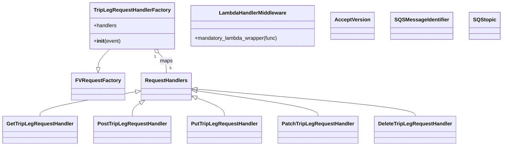
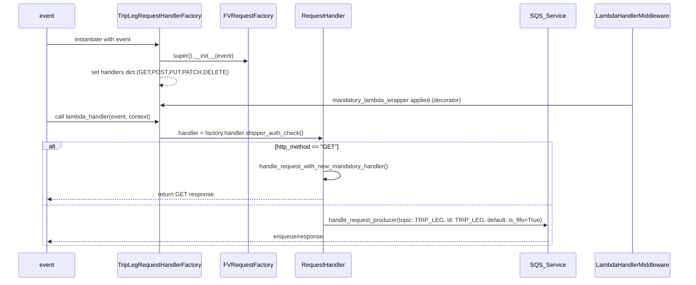

# Diagram: partview_core/partview_service/partview_service/api/trip_leg/trip_leg_handler.py

> Auto-generated by Obscura crawlers

## Diagram 1

### SVG

<svg id="container" width="1511.515625" xmlns="http://www.w3.org/2000/svg" class="classDiagram" height="452" viewBox="0 0 1511.515625 452" role="graphics-document document" aria-roledescription="class"><g><defs><marker id="container_class-aggregationStart" class="marker aggregation class" refX="18" refY="7" markerWidth="190" markerHeight="240" orient="auto"><path d="M 18,7 L9,13 L1,7 L9,1 Z"></path></marker></defs><defs><marker id="container_class-aggregationEnd" class="marker aggregation class" refX="1" refY="7" markerWidth="20" markerHeight="28" orient="auto"><path d="M 18,7 L9,13 L1,7 L9,1 Z"></path></marker></defs><defs><marker id="container_class-extensionStart" class="marker extension class" refX="18" refY="7" markerWidth="190" markerHeight="240" orient="auto"><path d="M 1,7 L18,13 V 1 Z"></path></marker></defs><defs><marker id="container_class-extensionEnd" class="marker extension class" refX="1" refY="7" markerWidth="20" markerHeight="28" orient="auto"><path d="M 1,1 V 13 L18,7 Z"></path></marker></defs><defs><marker id="container_class-compositionStart" class="marker composition class" refX="18" refY="7" markerWidth="190" markerHeight="240" orient="auto"><path d="M 18,7 L9,13 L1,7 L9,1 Z"></path></marker></defs><defs><marker id="container_class-compositionEnd" class="marker composition class" refX="1" refY="7" markerWidth="20" markerHeight="28" orient="auto"><path d="M 18,7 L9,13 L1,7 L9,1 Z"></path></marker></defs><defs><marker id="container_class-dependencyStart" class="marker dependency class" refX="6" refY="7" markerWidth="190" markerHeight="240" orient="auto"><path d="M 5,7 L9,13 L1,7 L9,1 Z"></path></marker></defs><defs><marker id="container_class-dependencyEnd" class="marker dependency class" refX="13" refY="7" markerWidth="20" markerHeight="28" orient="auto"><path d="M 18,7 L9,13 L14,7 L9,1 Z"></path></marker></defs><defs><marker id="container_class-lollipopStart" class="marker lollipop class" refX="13" refY="7" markerWidth="190" markerHeight="240" orient="auto"><circle stroke="black" fill="transparent" cx="7" cy="7" r="6"></circle></marker></defs><defs><marker id="container_class-lollipopEnd" class="marker lollipop class" refX="1" refY="7" markerWidth="190" markerHeight="240" orient="auto"><circle stroke="black" fill="transparent" cx="7" cy="7" r="6"></circle></marker></defs><g class="root"><g class="clusters"></g><g class="edgePaths"><path d="M326.982,152L321.271,158.167C315.561,164.333,304.14,176.667,298.429,186.125C292.719,195.583,292.719,202.167,292.719,205.458L292.719,208.75" id="id_TripLegRequestHandlerFactory_FVRequestFactory_1" class="edge-thickness-normal edge-pattern-solid relation" style=";;;" data-edge="true" data-et="edge" data-id="id_TripLegRequestHandlerFactory_FVRequestFactory_1" data-points="W3sieCI6MzI2Ljk4MTkzODA3MzM5NDUzLCJ5IjoxNTJ9LHsieCI6MjkyLjcxODc1LCJ5IjoxODl9LHsieCI6MjkyLjcxODc1LCJ5IjoyMjZ9XQ==" marker-end="url(#container_class-extensionEnd)"></path><path d="M472.051,164.657L475.808,168.714C479.565,172.771,487.08,180.886,490.837,191.109C494.594,201.333,494.594,213.667,494.594,219.833L494.594,226" id="id_TripLegRequestHandlerFactory_RequestHandlers_2" class="edge-thickness-normal edge-pattern-solid relation" style=";;;" data-edge="true" data-et="edge" data-id="id_TripLegRequestHandlerFactory_RequestHandlers_2" data-points="W3sieCI6NDYwLjMzMDU2MTkyNjYwNTQ3LCJ5IjoxNTJ9LHsieCI6NDk0LjU5Mzc1LCJ5IjoxODl9LHsieCI6NDk0LjU5Mzc1LCJ5IjoyMjZ9XQ==" marker-start="url(#container_class-aggregationStart)"></path><path d="M402.776,284.369L355.443,292.808C308.111,301.246,213.446,318.123,166.114,330.728C118.781,343.333,118.781,351.667,118.781,355.833L118.781,360" id="id_RequestHandlers_GetTripLegRequestHandler_3" class="edge-thickness-normal edge-pattern-solid relation" style=";;;" data-edge="true" data-et="edge" data-id="id_RequestHandlers_GetTripLegRequestHandler_3" data-points="W3sieCI6NDE5Ljc1NzgxMjUsInkiOjI4MS4zNDE3ODAzMDkzMjk4fSx7IngiOjExOC43ODEyNSwieSI6MzM1fSx7IngiOjExOC43ODEyNSwieSI6MzYwfV0=" marker-start="url(#container_class-extensionStart)"></path><path d="M417.084,319.553L413.213,322.128C409.342,324.702,401.601,329.851,397.73,336.592C393.859,343.333,393.859,351.667,393.859,355.833L393.859,360" id="id_RequestHandlers_PostTripLegRequestHandler_4" class="edge-thickness-normal edge-pattern-solid relation" style=";;;" data-edge="true" data-et="edge" data-id="id_RequestHandlers_PostTripLegRequestHandler_4" data-points="W3sieCI6NDMxLjQ0NjgyODM1ODIwODk2LCJ5IjozMTB9LHsieCI6MzkzLjg1OTM3NSwieSI6MzM1fSx7IngiOjM5My44NTkzNzUsInkiOjM2MH1d" marker-start="url(#container_class-extensionStart)"></path><path d="M585.527,303.027L599.361,308.356C613.195,313.685,640.863,324.342,654.697,333.838C668.531,343.333,668.531,351.667,668.531,355.833L668.531,360" id="id_RequestHandlers_PutTripLegRequestHandler_5" class="edge-thickness-normal edge-pattern-solid relation" style=";;;" data-edge="true" data-et="edge" data-id="id_RequestHandlers_PutTripLegRequestHandler_5" data-points="W3sieCI6NTY5LjQyOTY4NzUsInkiOjI5Ni44MjY0OTExOTY1NTA1fSx7IngiOjY2OC41MzEyNSwieSI6MzM1fSx7IngiOjY2OC41MzEyNSwieSI6MzYwfV0=" marker-start="url(#container_class-extensionStart)"></path><path d="M586.494,281.605L646.608,290.504C706.722,299.403,826.951,317.202,887.065,330.267C947.18,343.333,947.18,351.667,947.18,355.833L947.18,360" id="id_RequestHandlers_PatchTripLegRequestHandler_6" class="edge-thickness-normal edge-pattern-solid relation" style=";;;" data-edge="true" data-et="edge" data-id="id_RequestHandlers_PatchTripLegRequestHandler_6" data-points="W3sieCI6NTY5LjQyOTY4NzUsInkiOjI3OS4wNzg1NzYyMzcyNDc4fSx7IngiOjk0Ny4xNzk2ODc1LCJ5IjozMzV9LHsieCI6OTQ3LjE3OTY4NzUsInkiOjM2MH1d" marker-start="url(#container_class-extensionStart)"></path><path d="M586.61,276.301L695.059,286.084C803.508,295.867,1020.406,315.434,1128.856,329.383C1237.305,343.333,1237.305,351.667,1237.305,355.833L1237.305,360" id="id_RequestHandlers_DeleteTripLegRequestHandler_7" class="edge-thickness-normal edge-pattern-solid relation" style=";;;" data-edge="true" data-et="edge" data-id="id_RequestHandlers_DeleteTripLegRequestHandler_7" data-points="W3sieCI6NTY5LjQyOTY4NzUsInkiOjI3NC43NTA5NTQ1ODk5MjA4fSx7IngiOjEyMzcuMzA0Njg3NSwieSI6MzM1fSx7IngiOjEyMzcuMzA0Njg3NSwieSI6MzYwfV0=" marker-start="url(#container_class-extensionStart)"></path></g><g class="edgeLabels"><g class="edgeLabel"><g class="label" data-id="id_TripLegRequestHandlerFactory_FVRequestFactory_1" transform="translate(0, 0)"><foreignObject width="0" height="0">

</foreignObject></g></g><g class="edgeLabel" transform="translate(494.59375, 189)"><g class="label" data-id="id_TripLegRequestHandlerFactory_RequestHandlers_2" transform="translate(-19.703125, -12)"><foreignObject width="39.40625" height="24">

maps

</foreignObject></g></g><g class="edgeLabel"><g class="label" data-id="id_RequestHandlers_GetTripLegRequestHandler_3" transform="translate(0, 0)"><foreignObject width="0" height="0">

</foreignObject></g></g><g class="edgeLabel"><g class="label" data-id="id_RequestHandlers_PostTripLegRequestHandler_4" transform="translate(0, 0)"><foreignObject width="0" height="0">

</foreignObject></g></g><g class="edgeLabel"><g class="label" data-id="id_RequestHandlers_PutTripLegRequestHandler_5" transform="translate(0, 0)"><foreignObject width="0" height="0">

</foreignObject></g></g><g class="edgeLabel"><g class="label" data-id="id_RequestHandlers_PatchTripLegRequestHandler_6" transform="translate(0, 0)"><foreignObject width="0" height="0">

</foreignObject></g></g><g class="edgeLabel"><g class="label" data-id="id_RequestHandlers_DeleteTripLegRequestHandler_7" transform="translate(0, 0)"><foreignObject width="0" height="0">

</foreignObject></g></g><g class="edgeTerminals" transform="translate(461.21510904779996, 175.03188028667765)"><g class="inner" transform="translate(0, 0)"><foreignObject style="width: 9px; height: 12px;">
1
</foreignObject></g></g><g class="edgeTerminals" transform="translate(504.59375, 203.5)"><g class="inner" transform="translate(0, 0)"></g><foreignObject style="width: 9px; height: 12px;">
5
</foreignObject></g></g><g class="nodes"><g class="node default" id="classId-TripLegRequestHandlerFactory-0" transform="translate(393.65625, 80)"><g class="basic label-container"><path d="M-124.71875 -72 L124.71875 -72 L124.71875 72 L-124.71875 72" stroke="none" stroke-width="0" fill="#ECECFF" style=""></path><path d="M-124.71875 -72 C-34.42032528527666 -72, 55.87809942944668 -72, 124.71875 -72 M-124.71875 -72 C-56.209157522599554 -72, 12.300434954800892 -72, 124.71875 -72 M124.71875 -72 C124.71875 -29.115031276235975, 124.71875 13.76993744752805, 124.71875 72 M124.71875 -72 C124.71875 -18.442615278083792, 124.71875 35.114769443832415, 124.71875 72 M124.71875 72 C66.12134565954554 72, 7.523941319091094 72, -124.71875 72 M124.71875 72 C41.116767174551214 72, -42.48521565089757 72, -124.71875 72 M-124.71875 72 C-124.71875 33.85222689716111, -124.71875 -4.2955462056777804, -124.71875 -72 M-124.71875 72 C-124.71875 36.66791046199349, -124.71875 1.3358209239869865, -124.71875 -72" stroke="#9370DB" stroke-width="1.3" fill="none" stroke-dasharray="0 0" style=""></path></g><g class="annotation-group text" transform="translate(0, -48)"></g><g class="label-group text" transform="translate(-112.71875, -48)"><g class="label" style="font-weight: bolder" transform="translate(0,-12)"><foreignObject width="225.4375" height="24">

TripLegRequestHandlerFactory

</foreignObject></g></g><g class="members-group text" transform="translate(-112.71875, 0)"><g class="label" style="" transform="translate(0,-12)"><foreignObject width="71.75" height="24">

+handlers

</foreignObject></g></g><g class="methods-group text" transform="translate(-112.71875, 48)"><g class="label" style="" transform="translate(0,-12)"><foreignObject width="83.140625" height="24">

+<strong>init</strong>(event)

</foreignObject></g></g><g class="divider" style=""><path d="M-124.71875 -24 C-72.93866845464841 -24, -21.158586909296815 -24, 124.71875 -24 M-124.71875 -24 C-25.563784875014505 -24, 73.59118024997099 -24, 124.71875 -24" stroke="#9370DB" stroke-width="1.3" fill="none" stroke-dasharray="0 0" style=""></path></g><g class="divider" style=""><path d="M-124.71875 24 C-35.02634704896521 24, 54.66605590206959 24, 124.71875 24 M-124.71875 24 C-45.23026511747722 24, 34.25821976504557 24, 124.71875 24" stroke="#9370DB" stroke-width="1.3" fill="none" stroke-dasharray="0 0" style=""></path></g></g><g class="node default" id="classId-FVRequestFactory-1" transform="translate(292.71875, 268)"><g class="basic label-container"><path d="M-77.0390625 -42 L77.0390625 -42 L77.0390625 42 L-77.0390625 42" stroke="none" stroke-width="0" fill="#ECECFF" style=""></path><path d="M-77.0390625 -42 C-23.924753935912392 -42, 29.189554628175216 -42, 77.0390625 -42 M-77.0390625 -42 C-29.273872461445848 -42, 18.491317577108305 -42, 77.0390625 -42 M77.0390625 -42 C77.0390625 -19.366138382688895, 77.0390625 3.26772323462221, 77.0390625 42 M77.0390625 -42 C77.0390625 -13.85295877469499, 77.0390625 14.29408245061002, 77.0390625 42 M77.0390625 42 C16.27668512977231 42, -44.48569224045538 42, -77.0390625 42 M77.0390625 42 C18.173948232896166 42, -40.69116603420767 42, -77.0390625 42 M-77.0390625 42 C-77.0390625 23.66487706091302, -77.0390625 5.329754121826042, -77.0390625 -42 M-77.0390625 42 C-77.0390625 20.137736753051175, -77.0390625 -1.724526493897649, -77.0390625 -42" stroke="#9370DB" stroke-width="1.3" fill="none" stroke-dasharray="0 0" style=""></path></g><g class="annotation-group text" transform="translate(0, -18)"></g><g class="label-group text" transform="translate(-65.0390625, -18)"><g class="label" style="font-weight: bolder" transform="translate(0,-12)"><foreignObject width="130.078125" height="24">

FVRequestFactory

</foreignObject></g></g><g class="members-group text" transform="translate(-65.0390625, 30)"></g><g class="methods-group text" transform="translate(-65.0390625, 60)"></g><g class="divider" style=""><path d="M-77.0390625 6 C-16.02145785657048 6, 44.99614678685904 6, 77.0390625 6 M-77.0390625 6 C-18.61212749666882 6, 39.81480750666236 6, 77.0390625 6" stroke="#9370DB" stroke-width="1.3" fill="none" stroke-dasharray="0 0" style=""></path></g><g class="divider" style=""><path d="M-77.0390625 24 C-44.20157371780417 24, -11.364084935608346 24, 77.0390625 24 M-77.0390625 24 C-30.175908271495736 24, 16.68724595700853 24, 77.0390625 24" stroke="#9370DB" stroke-width="1.3" fill="none" stroke-dasharray="0 0" style=""></path></g></g><g class="node default" id="classId-GetTripLegRequestHandler-2" transform="translate(118.78125, 402)"><g class="basic label-container"><path d="M-110.78125 -42 L110.78125 -42 L110.78125 42 L-110.78125 42" stroke="none" stroke-width="0" fill="#ECECFF" style=""></path><path d="M-110.78125 -42 C-33.21742577163164 -42, 44.34639845673672 -42, 110.78125 -42 M-110.78125 -42 C-57.77015313156424 -42, -4.759056263128485 -42, 110.78125 -42 M110.78125 -42 C110.78125 -10.613988853758578, 110.78125 20.772022292482845, 110.78125 42 M110.78125 -42 C110.78125 -24.15177687174742, 110.78125 -6.303553743494838, 110.78125 42 M110.78125 42 C45.21244301717938 42, -20.356363965641236 42, -110.78125 42 M110.78125 42 C23.160633273696007 42, -64.45998345260799 42, -110.78125 42 M-110.78125 42 C-110.78125 12.921766518811456, -110.78125 -16.15646696237709, -110.78125 -42 M-110.78125 42 C-110.78125 9.11042117317924, -110.78125 -23.77915765364152, -110.78125 -42" stroke="#9370DB" stroke-width="1.3" fill="none" stroke-dasharray="0 0" style=""></path></g><g class="annotation-group text" transform="translate(0, -18)"></g><g class="label-group text" transform="translate(-98.78125, -18)"><g class="label" style="font-weight: bolder" transform="translate(0,-12)"><foreignObject width="197.5625" height="24">

GetTripLegRequestHandler

</foreignObject></g></g><g class="members-group text" transform="translate(-98.78125, 30)"></g><g class="methods-group text" transform="translate(-98.78125, 60)"></g><g class="divider" style=""><path d="M-110.78125 6 C-24.20545367839992 6, 62.37034264320016 6, 110.78125 6 M-110.78125 6 C-50.18636280041179 6, 10.408524399176414 6, 110.78125 6" stroke="#9370DB" stroke-width="1.3" fill="none" stroke-dasharray="0 0" style=""></path></g><g class="divider" style=""><path d="M-110.78125 24 C-39.44280236786929 24, 31.895645264261418 24, 110.78125 24 M-110.78125 24 C-41.956335902027874 24, 26.868578195944252 24, 110.78125 24" stroke="#9370DB" stroke-width="1.3" fill="none" stroke-dasharray="0 0" style=""></path></g></g><g class="node default" id="classId-PostTripLegRequestHandler-3" transform="translate(393.859375, 402)"><g class="basic label-container"><path d="M-114.296875 -42 L114.296875 -42 L114.296875 42 L-114.296875 42" stroke="none" stroke-width="0" fill="#ECECFF" style=""></path><path d="M-114.296875 -42 C-50.38501411121273 -42, 13.526846777574534 -42, 114.296875 -42 M-114.296875 -42 C-28.81641862646285 -42, 56.6640377470743 -42, 114.296875 -42 M114.296875 -42 C114.296875 -14.155139216318783, 114.296875 13.689721567362433, 114.296875 42 M114.296875 -42 C114.296875 -11.642560323623378, 114.296875 18.714879352753243, 114.296875 42 M114.296875 42 C48.557750899979055 42, -17.18137320004189 42, -114.296875 42 M114.296875 42 C34.42887809092167 42, -45.43911881815666 42, -114.296875 42 M-114.296875 42 C-114.296875 17.854389662730604, -114.296875 -6.291220674538792, -114.296875 -42 M-114.296875 42 C-114.296875 12.764391896733002, -114.296875 -16.471216206533995, -114.296875 -42" stroke="#9370DB" stroke-width="1.3" fill="none" stroke-dasharray="0 0" style=""></path></g><g class="annotation-group text" transform="translate(0, -18)"></g><g class="label-group text" transform="translate(-102.296875, -18)"><g class="label" style="font-weight: bolder" transform="translate(0,-12)"><foreignObject width="204.59375" height="24">

PostTripLegRequestHandler

</foreignObject></g></g><g class="members-group text" transform="translate(-102.296875, 30)"></g><g class="methods-group text" transform="translate(-102.296875, 60)"></g><g class="divider" style=""><path d="M-114.296875 6 C-32.09907063752429 6, 50.098733724951416 6, 114.296875 6 M-114.296875 6 C-25.772554995570275 6, 62.75176500885945 6, 114.296875 6" stroke="#9370DB" stroke-width="1.3" fill="none" stroke-dasharray="0 0" style=""></path></g><g class="divider" style=""><path d="M-114.296875 24 C-64.9922610811355 24, -15.687647162270991 24, 114.296875 24 M-114.296875 24 C-38.597696127604976 24, 37.10148274479005 24, 114.296875 24" stroke="#9370DB" stroke-width="1.3" fill="none" stroke-dasharray="0 0" style=""></path></g></g><g class="node default" id="classId-PutTripLegRequestHandler-4" transform="translate(668.53125, 402)"><g class="basic label-container"><path d="M-110.375 -42 L110.375 -42 L110.375 42 L-110.375 42" stroke="none" stroke-width="0" fill="#ECECFF" style=""></path><path d="M-110.375 -42 C-59.037634933638785 -42, -7.700269867277569 -42, 110.375 -42 M-110.375 -42 C-31.275300819096074 -42, 47.82439836180785 -42, 110.375 -42 M110.375 -42 C110.375 -14.653368644081496, 110.375 12.693262711837008, 110.375 42 M110.375 -42 C110.375 -25.11846569086612, 110.375 -8.23693138173224, 110.375 42 M110.375 42 C32.705912206958686 42, -44.96317558608263 42, -110.375 42 M110.375 42 C49.609738632527204 42, -11.155522734945592 42, -110.375 42 M-110.375 42 C-110.375 16.771141008416237, -110.375 -8.457717983167527, -110.375 -42 M-110.375 42 C-110.375 17.033859233091206, -110.375 -7.932281533817587, -110.375 -42" stroke="#9370DB" stroke-width="1.3" fill="none" stroke-dasharray="0 0" style=""></path></g><g class="annotation-group text" transform="translate(0, -18)"></g><g class="label-group text" transform="translate(-98.375, -18)"><g class="label" style="font-weight: bolder" transform="translate(0,-12)"><foreignObject width="196.75" height="24">

PutTripLegRequestHandler

</foreignObject></g></g><g class="members-group text" transform="translate(-98.375, 30)"></g><g class="methods-group text" transform="translate(-98.375, 60)"></g><g class="divider" style=""><path d="M-110.375 6 C-40.00420592307384 6, 30.36658815385232 6, 110.375 6 M-110.375 6 C-29.693185975097563 6, 50.98862804980487 6, 110.375 6" stroke="#9370DB" stroke-width="1.3" fill="none" stroke-dasharray="0 0" style=""></path></g><g class="divider" style=""><path d="M-110.375 24 C-38.17896834887922 24, 34.01706330224155 24, 110.375 24 M-110.375 24 C-28.853541445089462 24, 52.667917109821076 24, 110.375 24" stroke="#9370DB" stroke-width="1.3" fill="none" stroke-dasharray="0 0" style=""></path></g></g><g class="node default" id="classId-PatchTripLegRequestHandler-5" transform="translate(947.1796875, 402)"><g class="basic label-container"><path d="M-118.2734375 -42 L118.2734375 -42 L118.2734375 42 L-118.2734375 42" stroke="none" stroke-width="0" fill="#ECECFF" style=""></path><path d="M-118.2734375 -42 C-34.52344988722443 -42, 49.22653772555114 -42, 118.2734375 -42 M-118.2734375 -42 C-56.382793868095845 -42, 5.507849763808309 -42, 118.2734375 -42 M118.2734375 -42 C118.2734375 -21.367718948996558, 118.2734375 -0.7354378979931155, 118.2734375 42 M118.2734375 -42 C118.2734375 -23.592621403129986, 118.2734375 -5.185242806259971, 118.2734375 42 M118.2734375 42 C28.558719033102008 42, -61.155999433795984 42, -118.2734375 42 M118.2734375 42 C25.29993682961502 42, -67.67356384076996 42, -118.2734375 42 M-118.2734375 42 C-118.2734375 11.631454092982057, -118.2734375 -18.737091814035885, -118.2734375 -42 M-118.2734375 42 C-118.2734375 11.22959494187344, -118.2734375 -19.54081011625312, -118.2734375 -42" stroke="#9370DB" stroke-width="1.3" fill="none" stroke-dasharray="0 0" style=""></path></g><g class="annotation-group text" transform="translate(0, -18)"></g><g class="label-group text" transform="translate(-106.2734375, -18)"><g class="label" style="font-weight: bolder" transform="translate(0,-12)"><foreignObject width="212.546875" height="24">

PatchTripLegRequestHandler

</foreignObject></g></g><g class="members-group text" transform="translate(-106.2734375, 30)"></g><g class="methods-group text" transform="translate(-106.2734375, 60)"></g><g class="divider" style=""><path d="M-118.2734375 6 C-33.18954835132183 6, 51.894340797356335 6, 118.2734375 6 M-118.2734375 6 C-55.07842361565727 6, 8.116590268685457 6, 118.2734375 6" stroke="#9370DB" stroke-width="1.3" fill="none" stroke-dasharray="0 0" style=""></path></g><g class="divider" style=""><path d="M-118.2734375 24 C-39.55228904913477 24, 39.16885940173046 24, 118.2734375 24 M-118.2734375 24 C-43.04440643519935 24, 32.1846246296013 24, 118.2734375 24" stroke="#9370DB" stroke-width="1.3" fill="none" stroke-dasharray="0 0" style=""></path></g></g><g class="node default" id="classId-DeleteTripLegRequestHandler-6" transform="translate(1237.3046875, 402)"><g class="basic label-container"><path d="M-121.8515625 -42 L121.8515625 -42 L121.8515625 42 L-121.8515625 42" stroke="none" stroke-width="0" fill="#ECECFF" style=""></path><path d="M-121.8515625 -42 C-43.300071131773876 -42, 35.25142023645225 -42, 121.8515625 -42 M-121.8515625 -42 C-68.20067503562922 -42, -14.549787571258435 -42, 121.8515625 -42 M121.8515625 -42 C121.8515625 -24.37274080290132, 121.8515625 -6.745481605802638, 121.8515625 42 M121.8515625 -42 C121.8515625 -17.937107378830223, 121.8515625 6.125785242339553, 121.8515625 42 M121.8515625 42 C41.537038487657256 42, -38.77748552468549 42, -121.8515625 42 M121.8515625 42 C61.08711851131969 42, 0.3226745226393746 42, -121.8515625 42 M-121.8515625 42 C-121.8515625 12.104253504568682, -121.8515625 -17.791492990862636, -121.8515625 -42 M-121.8515625 42 C-121.8515625 12.067837279198201, -121.8515625 -17.864325441603597, -121.8515625 -42" stroke="#9370DB" stroke-width="1.3" fill="none" stroke-dasharray="0 0" style=""></path></g><g class="annotation-group text" transform="translate(0, -18)"></g><g class="label-group text" transform="translate(-109.8515625, -18)"><g class="label" style="font-weight: bolder" transform="translate(0,-12)"><foreignObject width="219.703125" height="24">

DeleteTripLegRequestHandler

</foreignObject></g></g><g class="members-group text" transform="translate(-109.8515625, 30)"></g><g class="methods-group text" transform="translate(-109.8515625, 60)"></g><g class="divider" style=""><path d="M-121.8515625 6 C-44.661530137667626 6, 32.52850222466475 6, 121.8515625 6 M-121.8515625 6 C-27.02276515234125 6, 67.8060321953175 6, 121.8515625 6" stroke="#9370DB" stroke-width="1.3" fill="none" stroke-dasharray="0 0" style=""></path></g><g class="divider" style=""><path d="M-121.8515625 24 C-72.49658803132647 24, -23.14161356265295 24, 121.8515625 24 M-121.8515625 24 C-55.93572905931305 24, 9.980104381373906 24, 121.8515625 24" stroke="#9370DB" stroke-width="1.3" fill="none" stroke-dasharray="0 0" style=""></path></g></g><g class="node default" id="classId-RequestHandlers-7" transform="translate(494.59375, 268)"><g class="basic label-container"><path d="M-74.8359375 -42 L74.8359375 -42 L74.8359375 42 L-74.8359375 42" stroke="none" stroke-width="0" fill="#ECECFF" style=""></path><path d="M-74.8359375 -42 C-29.15660724620257 -42, 16.522723007594863 -42, 74.8359375 -42 M-74.8359375 -42 C-29.96314545436239 -42, 14.90964659127522 -42, 74.8359375 -42 M74.8359375 -42 C74.8359375 -16.76337422439881, 74.8359375 8.473251551202381, 74.8359375 42 M74.8359375 -42 C74.8359375 -19.608763951188564, 74.8359375 2.782472097622872, 74.8359375 42 M74.8359375 42 C40.51961382258559 42, 6.203290145171181 42, -74.8359375 42 M74.8359375 42 C21.90790066192345 42, -31.020136176153102 42, -74.8359375 42 M-74.8359375 42 C-74.8359375 17.200103968709335, -74.8359375 -7.599792062581329, -74.8359375 -42 M-74.8359375 42 C-74.8359375 15.260303598516405, -74.8359375 -11.47939280296719, -74.8359375 -42" stroke="#9370DB" stroke-width="1.3" fill="none" stroke-dasharray="0 0" style=""></path></g><g class="annotation-group text" transform="translate(0, -18)"></g><g class="label-group text" transform="translate(-62.8359375, -18)"><g class="label" style="font-weight: bolder" transform="translate(0,-12)"><foreignObject width="125.671875" height="24">

RequestHandlers

</foreignObject></g></g><g class="members-group text" transform="translate(-62.8359375, 30)"></g><g class="methods-group text" transform="translate(-62.8359375, 60)"></g><g class="divider" style=""><path d="M-74.8359375 6 C-41.3851071571437 6, -7.934276814287401 6, 74.8359375 6 M-74.8359375 6 C-21.76377745077081 6, 31.30838259845838 6, 74.8359375 6" stroke="#9370DB" stroke-width="1.3" fill="none" stroke-dasharray="0 0" style=""></path></g><g class="divider" style=""><path d="M-74.8359375 24 C-21.786824728950577 24, 31.262288042098845 24, 74.8359375 24 M-74.8359375 24 C-36.53290803682287 24, 1.7701214263542653 24, 74.8359375 24" stroke="#9370DB" stroke-width="1.3" fill="none" stroke-dasharray="0 0" style=""></path></g></g><g class="node default" id="classId-LambdaHandlerMiddleware-8" transform="translate(760.3671875, 80)"><g class="basic label-container"><path d="M-191.9921875 -63 L191.9921875 -63 L191.9921875 63 L-191.9921875 63" stroke="none" stroke-width="0" fill="#ECECFF" style=""></path><path d="M-191.9921875 -63 C-80.62081407957692 -63, 30.750559340846166 -63, 191.9921875 -63 M-191.9921875 -63 C-51.97281619690469 -63, 88.04655510619062 -63, 191.9921875 -63 M191.9921875 -63 C191.9921875 -33.27891237226569, 191.9921875 -3.5578247445313735, 191.9921875 63 M191.9921875 -63 C191.9921875 -28.72270837477037, 191.9921875 5.55458325045926, 191.9921875 63 M191.9921875 63 C50.21193128227543 63, -91.56832493544914 63, -191.9921875 63 M191.9921875 63 C56.19168076954347 63, -79.60882596091307 63, -191.9921875 63 M-191.9921875 63 C-191.9921875 14.76569496480186, -191.9921875 -33.46861007039628, -191.9921875 -63 M-191.9921875 63 C-191.9921875 34.07082343103881, -191.9921875 5.1416468620776214, -191.9921875 -63" stroke="#9370DB" stroke-width="1.3" fill="none" stroke-dasharray="0 0" style=""></path></g><g class="annotation-group text" transform="translate(0, -39)"></g><g class="label-group text" transform="translate(-100.765625, -39)"><g class="label" style="font-weight: bolder" transform="translate(0,-12)"><foreignObject width="201.53125" height="24">

LambdaHandlerMiddleware

</foreignObject></g></g><g class="members-group text" transform="translate(-179.9921875, 9)"></g><g class="methods-group text" transform="translate(-179.9921875, 39)"><g class="label" style="" transform="translate(0,-12)"><foreignObject width="259.21875" height="24">

+mandatory_lambda_wrapper(func)

</foreignObject></g></g><g class="divider" style=""><path d="M-191.9921875 -15 C-40.95910067631743 -15, 110.07398614736513 -15, 191.9921875 -15 M-191.9921875 -15 C-39.49236634045866 -15, 113.00745481908268 -15, 191.9921875 -15" stroke="#9370DB" stroke-width="1.3" fill="none" stroke-dasharray="0 0" style=""></path></g><g class="divider" style=""><path d="M-191.9921875 9 C-85.92913754485842 9, 20.13391241028316 9, 191.9921875 9 M-191.9921875 9 C-67.10624476613025 9, 57.77969796773951 9, 191.9921875 9" stroke="#9370DB" stroke-width="1.3" fill="none" stroke-dasharray="0 0" style=""></path></g></g><g class="node default" id="classId-AcceptVersion-9" transform="translate(1066, 80)"><g class="basic label-container"><path d="M-63.640625 -42 L63.640625 -42 L63.640625 42 L-63.640625 42" stroke="none" stroke-width="0" fill="#ECECFF" style=""></path><path d="M-63.640625 -42 C-23.062868829285193 -42, 17.514887341429613 -42, 63.640625 -42 M-63.640625 -42 C-31.144575554905074 -42, 1.351473890189851 -42, 63.640625 -42 M63.640625 -42 C63.640625 -21.664562080029455, 63.640625 -1.3291241600589103, 63.640625 42 M63.640625 -42 C63.640625 -9.599765065383856, 63.640625 22.800469869232288, 63.640625 42 M63.640625 42 C21.067525117528426 42, -21.505574764943148 42, -63.640625 42 M63.640625 42 C18.700125516298726 42, -26.240373967402547 42, -63.640625 42 M-63.640625 42 C-63.640625 22.972965488984812, -63.640625 3.945930977969624, -63.640625 -42 M-63.640625 42 C-63.640625 15.567727324344826, -63.640625 -10.864545351310348, -63.640625 -42" stroke="#9370DB" stroke-width="1.3" fill="none" stroke-dasharray="0 0" style=""></path></g><g class="annotation-group text" transform="translate(0, -18)"></g><g class="label-group text" transform="translate(-51.640625, -18)"><g class="label" style="font-weight: bolder" transform="translate(0,-12)"><foreignObject width="103.28125" height="24">

AcceptVersion

</foreignObject></g></g><g class="members-group text" transform="translate(-51.640625, 30)"></g><g class="methods-group text" transform="translate(-51.640625, 60)"></g><g class="divider" style=""><path d="M-63.640625 6 C-17.864524537370094 6, 27.91157592525981 6, 63.640625 6 M-63.640625 6 C-19.436789683054258 6, 24.767045633891485 6, 63.640625 6" stroke="#9370DB" stroke-width="1.3" fill="none" stroke-dasharray="0 0" style=""></path></g><g class="divider" style=""><path d="M-63.640625 24 C-33.6756682978549 24, -3.710711595709796 24, 63.640625 24 M-63.640625 24 C-21.27241676523255 24, 21.095791469534902 24, 63.640625 24" stroke="#9370DB" stroke-width="1.3" fill="none" stroke-dasharray="0 0" style=""></path></g></g><g class="node default" id="classId-SQSMessageIdentifier-10" transform="translate(1271.421875, 80)"><g class="basic label-container"><path d="M-91.78125 -42 L91.78125 -42 L91.78125 42 L-91.78125 42" stroke="none" stroke-width="0" fill="#ECECFF" style=""></path><path d="M-91.78125 -42 C-49.35765253247924 -42, -6.934055064958486 -42, 91.78125 -42 M-91.78125 -42 C-49.36163280778661 -42, -6.942015615573226 -42, 91.78125 -42 M91.78125 -42 C91.78125 -13.438137759801457, 91.78125 15.123724480397087, 91.78125 42 M91.78125 -42 C91.78125 -16.888576746603544, 91.78125 8.222846506792912, 91.78125 42 M91.78125 42 C51.976714561469926 42, 12.172179122939852 42, -91.78125 42 M91.78125 42 C46.238252225033484 42, 0.6952544500669688 42, -91.78125 42 M-91.78125 42 C-91.78125 23.55058225254513, -91.78125 5.10116450509026, -91.78125 -42 M-91.78125 42 C-91.78125 16.206885951618514, -91.78125 -9.586228096762973, -91.78125 -42" stroke="#9370DB" stroke-width="1.3" fill="none" stroke-dasharray="0 0" style=""></path></g><g class="annotation-group text" transform="translate(0, -18)"></g><g class="label-group text" transform="translate(-79.78125, -18)"><g class="label" style="font-weight: bolder" transform="translate(0,-12)"><foreignObject width="159.5625" height="24">

SQSMessageIdentifier

</foreignObject></g></g><g class="members-group text" transform="translate(-79.78125, 30)"></g><g class="methods-group text" transform="translate(-79.78125, 60)"></g><g class="divider" style=""><path d="M-91.78125 6 C-30.34812779193515 6, 31.084994416129703 6, 91.78125 6 M-91.78125 6 C-45.940307530659084 6, -0.09936506131816714 6, 91.78125 6" stroke="#9370DB" stroke-width="1.3" fill="none" stroke-dasharray="0 0" style=""></path></g><g class="divider" style=""><path d="M-91.78125 24 C-42.894151278576516 24, 5.992947442846969 24, 91.78125 24 M-91.78125 24 C-48.703598744594274 24, -5.6259474891885475 24, 91.78125 24" stroke="#9370DB" stroke-width="1.3" fill="none" stroke-dasharray="0 0" style=""></path></g></g><g class="node default" id="classId-SQStopic-11" transform="translate(1458.359375, 80)"><g class="basic label-container"><path d="M-45.15625 -42 L45.15625 -42 L45.15625 42 L-45.15625 42" stroke="none" stroke-width="0" fill="#ECECFF" style=""></path><path d="M-45.15625 -42 C-9.579763169249446 -42, 25.996723661501107 -42, 45.15625 -42 M-45.15625 -42 C-25.095668435973213 -42, -5.035086871946426 -42, 45.15625 -42 M45.15625 -42 C45.15625 -10.284823180942855, 45.15625 21.43035363811429, 45.15625 42 M45.15625 -42 C45.15625 -12.682971938739776, 45.15625 16.634056122520448, 45.15625 42 M45.15625 42 C10.470428872988897 42, -24.215392254022206 42, -45.15625 42 M45.15625 42 C25.749654833717727 42, 6.343059667435455 42, -45.15625 42 M-45.15625 42 C-45.15625 17.252091045266567, -45.15625 -7.495817909466865, -45.15625 -42 M-45.15625 42 C-45.15625 13.290432899883914, -45.15625 -15.419134200232172, -45.15625 -42" stroke="#9370DB" stroke-width="1.3" fill="none" stroke-dasharray="0 0" style=""></path></g><g class="annotation-group text" transform="translate(0, -18)"></g><g class="label-group text" transform="translate(-33.15625, -18)"><g class="label" style="font-weight: bolder" transform="translate(0,-12)"><foreignObject width="66.3125" height="24">

SQStopic

</foreignObject></g></g><g class="members-group text" transform="translate(-33.15625, 30)"></g><g class="methods-group text" transform="translate(-33.15625, 60)"></g><g class="divider" style=""><path d="M-45.15625 6 C-25.003757832999028 6, -4.851265665998056 6, 45.15625 6 M-45.15625 6 C-16.53704298917249 6, 12.082164021655018 6, 45.15625 6" stroke="#9370DB" stroke-width="1.3" fill="none" stroke-dasharray="0 0" style=""></path></g><g class="divider" style=""><path d="M-45.15625 24 C-20.323695159754834 24, 4.508859680490332 24, 45.15625 24 M-45.15625 24 C-9.74940864795294 24, 25.65743270409412 24, 45.15625 24" stroke="#9370DB" stroke-width="1.3" fill="none" stroke-dasharray="0 0" style=""></path></g></g></g></g></g></svg>

## Diagram 2

### SVG

<svg id="container" width="1923" xmlns="http://www.w3.org/2000/svg" height="791" viewBox="-50 -10 1923 791" role="graphics-document document" aria-roledescription="sequence"><g><rect x="1603" y="705" fill="#eaeaea" stroke="#666" width="220" height="65" name="LambdaMiddleware" rx="3" ry="3" class="actor actor-bottom"></rect><text x="1713" y="737.5" dominant-baseline="central" alignment-baseline="central" class="actor actor-box" style="text-anchor: middle; font-size: 16px; font-weight: 400;"><tspan x="1713" dy="0">LambdaHandlerMiddleware</tspan></text></g><g><rect x="1403" y="705" fill="#eaeaea" stroke="#666" width="150" height="65" name="SQS" rx="3" ry="3" class="actor actor-bottom"></rect><text x="1478" y="737.5" dominant-baseline="central" alignment-baseline="central" class="actor actor-box" style="text-anchor: middle; font-size: 16px; font-weight: 400;"><tspan x="1478" dy="0">SQS_Service</tspan></text></g><g><rect x="778" y="705" fill="#eaeaea" stroke="#666" width="150" height="65" name="Handler" rx="3" ry="3" class="actor actor-bottom"></rect><text x="853" y="737.5" dominant-baseline="central" alignment-baseline="central" class="actor actor-box" style="text-anchor: middle; font-size: 16px; font-weight: 400;"><tspan x="853" dy="0">RequestHandler</tspan></text></g><g><rect x="578" y="705" fill="#eaeaea" stroke="#666" width="150" height="65" name="FactoryBase" rx="3" ry="3" class="actor actor-bottom"></rect><text x="653" y="737.5" dominant-baseline="central" alignment-baseline="central" class="actor actor-box" style="text-anchor: middle; font-size: 16px; font-weight: 400;"><tspan x="653" dy="0">FVRequestFactory</tspan></text></g><g><rect x="286" y="705" fill="#eaeaea" stroke="#666" width="242" height="65" name="Factory" rx="3" ry="3" class="actor actor-bottom"></rect><text x="407" y="737.5" dominant-baseline="central" alignment-baseline="central" class="actor actor-box" style="text-anchor: middle; font-size: 16px; font-weight: 400;"><tspan x="407" dy="0">TripLegRequestHandlerFactory</tspan></text></g><g><rect x="0" y="705" fill="#eaeaea" stroke="#666" width="150" height="65" name="AWS_Event" rx="3" ry="3" class="actor actor-bottom"></rect><text x="75" y="737.5" dominant-baseline="central" alignment-baseline="central" class="actor actor-box" style="text-anchor: middle; font-size: 16px; font-weight: 400;"><tspan x="75" dy="0">event</tspan></text></g><g><line id="actor5" x1="1713" y1="65" x2="1713" y2="705" class="actor-line 200" stroke-width="0.5px" stroke="#999" name="LambdaMiddleware"></line><g id="root-5"><rect x="1603" y="0" fill="#eaeaea" stroke="#666" width="220" height="65" name="LambdaMiddleware" rx="3" ry="3" class="actor actor-top"></rect><text x="1713" y="32.5" dominant-baseline="central" alignment-baseline="central" class="actor actor-box" style="text-anchor: middle; font-size: 16px; font-weight: 400;"><tspan x="1713" dy="0">LambdaHandlerMiddleware</tspan></text></g></g><g><line id="actor4" x1="1478" y1="65" x2="1478" y2="705" class="actor-line 200" stroke-width="0.5px" stroke="#999" name="SQS"></line><g id="root-4"><rect x="1403" y="0" fill="#eaeaea" stroke="#666" width="150" height="65" name="SQS" rx="3" ry="3" class="actor actor-top"></rect><text x="1478" y="32.5" dominant-baseline="central" alignment-baseline="central" class="actor actor-box" style="text-anchor: middle; font-size: 16px; font-weight: 400;"><tspan x="1478" dy="0">SQS_Service</tspan></text></g></g><g><line id="actor3" x1="853" y1="65" x2="853" y2="705" class="actor-line 200" stroke-width="0.5px" stroke="#999" name="Handler"></line><g id="root-3"><rect x="778" y="0" fill="#eaeaea" stroke="#666" width="150" height="65" name="Handler" rx="3" ry="3" class="actor actor-top"></rect><text x="853" y="32.5" dominant-baseline="central" alignment-baseline="central" class="actor actor-box" style="text-anchor: middle; font-size: 16px; font-weight: 400;"><tspan x="853" dy="0">RequestHandler</tspan></text></g></g><g><line id="actor2" x1="653" y1="65" x2="653" y2="705" class="actor-line 200" stroke-width="0.5px" stroke="#999" name="FactoryBase"></line><g id="root-2"><rect x="578" y="0" fill="#eaeaea" stroke="#666" width="150" height="65" name="FactoryBase" rx="3" ry="3" class="actor actor-top"></rect><text x="653" y="32.5" dominant-baseline="central" alignment-baseline="central" class="actor actor-box" style="text-anchor: middle; font-size: 16px; font-weight: 400;"><tspan x="653" dy="0">FVRequestFactory</tspan></text></g></g><g><line id="actor1" x1="407" y1="65" x2="407" y2="705" class="actor-line 200" stroke-width="0.5px" stroke="#999" name="Factory"></line><g id="root-1"><rect x="286" y="0" fill="#eaeaea" stroke="#666" width="242" height="65" name="Factory" rx="3" ry="3" class="actor actor-top"></rect><text x="407" y="32.5" dominant-baseline="central" alignment-baseline="central" class="actor actor-box" style="text-anchor: middle; font-size: 16px; font-weight: 400;"><tspan x="407" dy="0">TripLegRequestHandlerFactory</tspan></text></g></g><g><line id="actor0" x1="75" y1="65" x2="75" y2="705" class="actor-line 200" stroke-width="0.5px" stroke="#999" name="AWS_Event"></line><g id="root-0"><rect x="0" y="0" fill="#eaeaea" stroke="#666" width="150" height="65" name="AWS_Event" rx="3" ry="3" class="actor actor-top"></rect><text x="75" y="32.5" dominant-baseline="central" alignment-baseline="central" class="actor actor-box" style="text-anchor: middle; font-size: 16px; font-weight: 400;"><tspan x="75" dy="0">event</tspan></text></g></g><g></g><defs><symbol id="computer" width="24" height="24"><path transform="scale(.5)" d="M2 2v13h20v-13h-20zm18 11h-16v-9h16v9zm-10.228 6l.466-1h3.524l.467 1h-4.457zm14.228 3h-24l2-6h2.104l-1.33 4h18.45l-1.297-4h2.073l2 6zm-5-10h-14v-7h14v7z"></path></symbol></defs><defs><symbol id="database" fill-rule="evenodd" clip-rule="evenodd"><path transform="scale(.5)" d="M12.258.001l.256.004.255.005.253.008.251.01.249.012.247.015.246.016.242.019.241.02.239.023.236.024.233.027.231.028.229.031.225.032.223.034.22.036.217.038.214.04.211.041.208.043.205.045.201.046.198.048.194.05.191.051.187.053.183.054.18.056.175.057.172.059.168.06.163.061.16.063.155.064.15.066.074.033.073.033.071.034.07.034.069.035.068.035.067.035.066.035.064.036.064.036.062.036.06.036.06.037.058.037.058.037.055.038.055.038.053.038.052.038.051.039.05.039.048.039.047.039.045.04.044.04.043.04.041.04.04.041.039.041.037.041.036.041.034.041.033.042.032.042.03.042.029.042.027.042.026.043.024.043.023.043.021.043.02.043.018.044.017.043.015.044.013.044.012.044.011.045.009.044.007.045.006.045.004.045.002.045.001.045v17l-.001.045-.002.045-.004.045-.006.045-.007.045-.009.044-.011.045-.012.044-.013.044-.015.044-.017.043-.018.044-.02.043-.021.043-.023.043-.024.043-.026.043-.027.042-.029.042-.03.042-.032.042-.033.042-.034.041-.036.041-.037.041-.039.041-.04.041-.041.04-.043.04-.044.04-.045.04-.047.039-.048.039-.05.039-.051.039-.052.038-.053.038-.055.038-.055.038-.058.037-.058.037-.06.037-.06.036-.062.036-.064.036-.064.036-.066.035-.067.035-.068.035-.069.035-.07.034-.071.034-.073.033-.074.033-.15.066-.155.064-.16.063-.163.061-.168.06-.172.059-.175.057-.18.056-.183.054-.187.053-.191.051-.194.05-.198.048-.201.046-.205.045-.208.043-.211.041-.214.04-.217.038-.22.036-.223.034-.225.032-.229.031-.231.028-.233.027-.236.024-.239.023-.241.02-.242.019-.246.016-.247.015-.249.012-.251.01-.253.008-.255.005-.256.004-.258.001-.258-.001-.256-.004-.255-.005-.253-.008-.251-.01-.249-.012-.247-.015-.245-.016-.243-.019-.241-.02-.238-.023-.236-.024-.234-.027-.231-.028-.228-.031-.226-.032-.223-.034-.22-.036-.217-.038-.214-.04-.211-.041-.208-.043-.204-.045-.201-.046-.198-.048-.195-.05-.19-.051-.187-.053-.184-.054-.179-.056-.176-.057-.172-.059-.167-.06-.164-.061-.159-.063-.155-.064-.151-.066-.074-.033-.072-.033-.072-.034-.07-.034-.069-.035-.068-.035-.067-.035-.066-.035-.064-.036-.063-.036-.062-.036-.061-.036-.06-.037-.058-.037-.057-.037-.056-.038-.055-.038-.053-.038-.052-.038-.051-.039-.049-.039-.049-.039-.046-.039-.046-.04-.044-.04-.043-.04-.041-.04-.04-.041-.039-.041-.037-.041-.036-.041-.034-.041-.033-.042-.032-.042-.03-.042-.029-.042-.027-.042-.026-.043-.024-.043-.023-.043-.021-.043-.02-.043-.018-.044-.017-.043-.015-.044-.013-.044-.012-.044-.011-.045-.009-.044-.007-.045-.006-.045-.004-.045-.002-.045-.001-.045v-17l.001-.045.002-.045.004-.045.006-.045.007-.045.009-.044.011-.045.012-.044.013-.044.015-.044.017-.043.018-.044.02-.043.021-.043.023-.043.024-.043.026-.043.027-.042.029-.042.03-.042.032-.042.033-.042.034-.041.036-.041.037-.041.039-.041.04-.041.041-.04.043-.04.044-.04.046-.04.046-.039.049-.039.049-.039.051-.039.052-.038.053-.038.055-.038.056-.038.057-.037.058-.037.06-.037.061-.036.062-.036.063-.036.064-.036.066-.035.067-.035.068-.035.069-.035.07-.034.072-.034.072-.033.074-.033.151-.066.155-.064.159-.063.164-.061.167-.06.172-.059.176-.057.179-.056.184-.054.187-.053.19-.051.195-.05.198-.048.201-.046.204-.045.208-.043.211-.041.214-.04.217-.038.22-.036.223-.034.226-.032.228-.031.231-.028.234-.027.236-.024.238-.023.241-.02.243-.019.245-.016.247-.015.249-.012.251-.01.253-.008.255-.005.256-.004.258-.001.258.001zm-9.258 20.499v.01l.001.021.003.021.004.022.005.021.006.022.007.022.009.023.01.022.011.023.012.023.013.023.015.023.016.024.017.023.018.024.019.024.021.024.022.025.023.024.024.025.052.049.056.05.061.051.066.051.07.051.075.051.079.052.084.052.088.052.092.052.097.052.102.051.105.052.11.052.114.051.119.051.123.051.127.05.131.05.135.05.139.048.144.049.147.047.152.047.155.047.16.045.163.045.167.043.171.043.176.041.178.041.183.039.187.039.19.037.194.035.197.035.202.033.204.031.209.03.212.029.216.027.219.025.222.024.226.021.23.02.233.018.236.016.24.015.243.012.246.01.249.008.253.005.256.004.259.001.26-.001.257-.004.254-.005.25-.008.247-.011.244-.012.241-.014.237-.016.233-.018.231-.021.226-.021.224-.024.22-.026.216-.027.212-.028.21-.031.205-.031.202-.034.198-.034.194-.036.191-.037.187-.039.183-.04.179-.04.175-.042.172-.043.168-.044.163-.045.16-.046.155-.046.152-.047.148-.048.143-.049.139-.049.136-.05.131-.05.126-.05.123-.051.118-.052.114-.051.11-.052.106-.052.101-.052.096-.052.092-.052.088-.053.083-.051.079-.052.074-.052.07-.051.065-.051.06-.051.056-.05.051-.05.023-.024.023-.025.021-.024.02-.024.019-.024.018-.024.017-.024.015-.023.014-.024.013-.023.012-.023.01-.023.01-.022.008-.022.006-.022.006-.022.004-.022.004-.021.001-.021.001-.021v-4.127l-.077.055-.08.053-.083.054-.085.053-.087.052-.09.052-.093.051-.095.05-.097.05-.1.049-.102.049-.105.048-.106.047-.109.047-.111.046-.114.045-.115.045-.118.044-.12.043-.122.042-.124.042-.126.041-.128.04-.13.04-.132.038-.134.038-.135.037-.138.037-.139.035-.142.035-.143.034-.144.033-.147.032-.148.031-.15.03-.151.03-.153.029-.154.027-.156.027-.158.026-.159.025-.161.024-.162.023-.163.022-.165.021-.166.02-.167.019-.169.018-.169.017-.171.016-.173.015-.173.014-.175.013-.175.012-.177.011-.178.01-.179.008-.179.008-.181.006-.182.005-.182.004-.184.003-.184.002h-.37l-.184-.002-.184-.003-.182-.004-.182-.005-.181-.006-.179-.008-.179-.008-.178-.01-.176-.011-.176-.012-.175-.013-.173-.014-.172-.015-.171-.016-.17-.017-.169-.018-.167-.019-.166-.02-.165-.021-.163-.022-.162-.023-.161-.024-.159-.025-.157-.026-.156-.027-.155-.027-.153-.029-.151-.03-.15-.03-.148-.031-.146-.032-.145-.033-.143-.034-.141-.035-.14-.035-.137-.037-.136-.037-.134-.038-.132-.038-.13-.04-.128-.04-.126-.041-.124-.042-.122-.042-.12-.044-.117-.043-.116-.045-.113-.045-.112-.046-.109-.047-.106-.047-.105-.048-.102-.049-.1-.049-.097-.05-.095-.05-.093-.052-.09-.051-.087-.052-.085-.053-.083-.054-.08-.054-.077-.054v4.127zm0-5.654v.011l.001.021.003.021.004.021.005.022.006.022.007.022.009.022.01.022.011.023.012.023.013.023.015.024.016.023.017.024.018.024.019.024.021.024.022.024.023.025.024.024.052.05.056.05.061.05.066.051.07.051.075.052.079.051.084.052.088.052.092.052.097.052.102.052.105.052.11.051.114.051.119.052.123.05.127.051.131.05.135.049.139.049.144.048.147.048.152.047.155.046.16.045.163.045.167.044.171.042.176.042.178.04.183.04.187.038.19.037.194.036.197.034.202.033.204.032.209.03.212.028.216.027.219.025.222.024.226.022.23.02.233.018.236.016.24.014.243.012.246.01.249.008.253.006.256.003.259.001.26-.001.257-.003.254-.006.25-.008.247-.01.244-.012.241-.015.237-.016.233-.018.231-.02.226-.022.224-.024.22-.025.216-.027.212-.029.21-.03.205-.032.202-.033.198-.035.194-.036.191-.037.187-.039.183-.039.179-.041.175-.042.172-.043.168-.044.163-.045.16-.045.155-.047.152-.047.148-.048.143-.048.139-.05.136-.049.131-.05.126-.051.123-.051.118-.051.114-.052.11-.052.106-.052.101-.052.096-.052.092-.052.088-.052.083-.052.079-.052.074-.051.07-.052.065-.051.06-.05.056-.051.051-.049.023-.025.023-.024.021-.025.02-.024.019-.024.018-.024.017-.024.015-.023.014-.023.013-.024.012-.022.01-.023.01-.023.008-.022.006-.022.006-.022.004-.021.004-.022.001-.021.001-.021v-4.139l-.077.054-.08.054-.083.054-.085.052-.087.053-.09.051-.093.051-.095.051-.097.05-.1.049-.102.049-.105.048-.106.047-.109.047-.111.046-.114.045-.115.044-.118.044-.12.044-.122.042-.124.042-.126.041-.128.04-.13.039-.132.039-.134.038-.135.037-.138.036-.139.036-.142.035-.143.033-.144.033-.147.033-.148.031-.15.03-.151.03-.153.028-.154.028-.156.027-.158.026-.159.025-.161.024-.162.023-.163.022-.165.021-.166.02-.167.019-.169.018-.169.017-.171.016-.173.015-.173.014-.175.013-.175.012-.177.011-.178.009-.179.009-.179.007-.181.007-.182.005-.182.004-.184.003-.184.002h-.37l-.184-.002-.184-.003-.182-.004-.182-.005-.181-.007-.179-.007-.179-.009-.178-.009-.176-.011-.176-.012-.175-.013-.173-.014-.172-.015-.171-.016-.17-.017-.169-.018-.167-.019-.166-.02-.165-.021-.163-.022-.162-.023-.161-.024-.159-.025-.157-.026-.156-.027-.155-.028-.153-.028-.151-.03-.15-.03-.148-.031-.146-.033-.145-.033-.143-.033-.141-.035-.14-.036-.137-.036-.136-.037-.134-.038-.132-.039-.13-.039-.128-.04-.126-.041-.124-.042-.122-.043-.12-.043-.117-.044-.116-.044-.113-.046-.112-.046-.109-.046-.106-.047-.105-.048-.102-.049-.1-.049-.097-.05-.095-.051-.093-.051-.09-.051-.087-.053-.085-.052-.083-.054-.08-.054-.077-.054v4.139zm0-5.666v.011l.001.02.003.022.004.021.005.022.006.021.007.022.009.023.01.022.011.023.012.023.013.023.015.023.016.024.017.024.018.023.019.024.021.025.022.024.023.024.024.025.052.05.056.05.061.05.066.051.07.051.075.052.079.051.084.052.088.052.092.052.097.052.102.052.105.051.11.052.114.051.119.051.123.051.127.05.131.05.135.05.139.049.144.048.147.048.152.047.155.046.16.045.163.045.167.043.171.043.176.042.178.04.183.04.187.038.19.037.194.036.197.034.202.033.204.032.209.03.212.028.216.027.219.025.222.024.226.021.23.02.233.018.236.017.24.014.243.012.246.01.249.008.253.006.256.003.259.001.26-.001.257-.003.254-.006.25-.008.247-.01.244-.013.241-.014.237-.016.233-.018.231-.02.226-.022.224-.024.22-.025.216-.027.212-.029.21-.03.205-.032.202-.033.198-.035.194-.036.191-.037.187-.039.183-.039.179-.041.175-.042.172-.043.168-.044.163-.045.16-.045.155-.047.152-.047.148-.048.143-.049.139-.049.136-.049.131-.051.126-.05.123-.051.118-.052.114-.051.11-.052.106-.052.101-.052.096-.052.092-.052.088-.052.083-.052.079-.052.074-.052.07-.051.065-.051.06-.051.056-.05.051-.049.023-.025.023-.025.021-.024.02-.024.019-.024.018-.024.017-.024.015-.023.014-.024.013-.023.012-.023.01-.022.01-.023.008-.022.006-.022.006-.022.004-.022.004-.021.001-.021.001-.021v-4.153l-.077.054-.08.054-.083.053-.085.053-.087.053-.09.051-.093.051-.095.051-.097.05-.1.049-.102.048-.105.048-.106.048-.109.046-.111.046-.114.046-.115.044-.118.044-.12.043-.122.043-.124.042-.126.041-.128.04-.13.039-.132.039-.134.038-.135.037-.138.036-.139.036-.142.034-.143.034-.144.033-.147.032-.148.032-.15.03-.151.03-.153.028-.154.028-.156.027-.158.026-.159.024-.161.024-.162.023-.163.023-.165.021-.166.02-.167.019-.169.018-.169.017-.171.016-.173.015-.173.014-.175.013-.175.012-.177.01-.178.01-.179.009-.179.007-.181.006-.182.006-.182.004-.184.003-.184.001-.185.001-.185-.001-.184-.001-.184-.003-.182-.004-.182-.006-.181-.006-.179-.007-.179-.009-.178-.01-.176-.01-.176-.012-.175-.013-.173-.014-.172-.015-.171-.016-.17-.017-.169-.018-.167-.019-.166-.02-.165-.021-.163-.023-.162-.023-.161-.024-.159-.024-.157-.026-.156-.027-.155-.028-.153-.028-.151-.03-.15-.03-.148-.032-.146-.032-.145-.033-.143-.034-.141-.034-.14-.036-.137-.036-.136-.037-.134-.038-.132-.039-.13-.039-.128-.041-.126-.041-.124-.041-.122-.043-.12-.043-.117-.044-.116-.044-.113-.046-.112-.046-.109-.046-.106-.048-.105-.048-.102-.048-.1-.05-.097-.049-.095-.051-.093-.051-.09-.052-.087-.052-.085-.053-.083-.053-.08-.054-.077-.054v4.153zm8.74-8.179l-.257.004-.254.005-.25.008-.247.011-.244.012-.241.014-.237.016-.233.018-.231.021-.226.022-.224.023-.22.026-.216.027-.212.028-.21.031-.205.032-.202.033-.198.034-.194.036-.191.038-.187.038-.183.04-.179.041-.175.042-.172.043-.168.043-.163.045-.16.046-.155.046-.152.048-.148.048-.143.048-.139.049-.136.05-.131.05-.126.051-.123.051-.118.051-.114.052-.11.052-.106.052-.101.052-.096.052-.092.052-.088.052-.083.052-.079.052-.074.051-.07.052-.065.051-.06.05-.056.05-.051.05-.023.025-.023.024-.021.024-.02.025-.019.024-.018.024-.017.023-.015.024-.014.023-.013.023-.012.023-.01.023-.01.022-.008.022-.006.023-.006.021-.004.022-.004.021-.001.021-.001.021.001.021.001.021.004.021.004.022.006.021.006.023.008.022.01.022.01.023.012.023.013.023.014.023.015.024.017.023.018.024.019.024.02.025.021.024.023.024.023.025.051.05.056.05.06.05.065.051.07.052.074.051.079.052.083.052.088.052.092.052.096.052.101.052.106.052.11.052.114.052.118.051.123.051.126.051.131.05.136.05.139.049.143.048.148.048.152.048.155.046.16.046.163.045.168.043.172.043.175.042.179.041.183.04.187.038.191.038.194.036.198.034.202.033.205.032.21.031.212.028.216.027.22.026.224.023.226.022.231.021.233.018.237.016.241.014.244.012.247.011.25.008.254.005.257.004.26.001.26-.001.257-.004.254-.005.25-.008.247-.011.244-.012.241-.014.237-.016.233-.018.231-.021.226-.022.224-.023.22-.026.216-.027.212-.028.21-.031.205-.032.202-.033.198-.034.194-.036.191-.038.187-.038.183-.04.179-.041.175-.042.172-.043.168-.043.163-.045.16-.046.155-.046.152-.048.148-.048.143-.048.139-.049.136-.05.131-.05.126-.051.123-.051.118-.051.114-.052.11-.052.106-.052.101-.052.096-.052.092-.052.088-.052.083-.052.079-.052.074-.051.07-.052.065-.051.06-.05.056-.05.051-.05.023-.025.023-.024.021-.024.02-.025.019-.024.018-.024.017-.023.015-.024.014-.023.013-.023.012-.023.01-.023.01-.022.008-.022.006-.023.006-.021.004-.022.004-.021.001-.021.001-.021-.001-.021-.001-.021-.004-.021-.004-.022-.006-.021-.006-.023-.008-.022-.01-.022-.01-.023-.012-.023-.013-.023-.014-.023-.015-.024-.017-.023-.018-.024-.019-.024-.02-.025-.021-.024-.023-.024-.023-.025-.051-.05-.056-.05-.06-.05-.065-.051-.07-.052-.074-.051-.079-.052-.083-.052-.088-.052-.092-.052-.096-.052-.101-.052-.106-.052-.11-.052-.114-.052-.118-.051-.123-.051-.126-.051-.131-.05-.136-.05-.139-.049-.143-.048-.148-.048-.152-.048-.155-.046-.16-.046-.163-.045-.168-.043-.172-.043-.175-.042-.179-.041-.183-.04-.187-.038-.191-.038-.194-.036-.198-.034-.202-.033-.205-.032-.21-.031-.212-.028-.216-.027-.22-.026-.224-.023-.226-.022-.231-.021-.233-.018-.237-.016-.241-.014-.244-.012-.247-.011-.25-.008-.254-.005-.257-.004-.26-.001-.26.001z"></path></symbol></defs><defs><symbol id="clock" width="24" height="24"><path transform="scale(.5)" d="M12 2c5.514 0 10 4.486 10 10s-4.486 10-10 10-10-4.486-10-10 4.486-10 10-10zm0-2c-6.627 0-12 5.373-12 12s5.373 12 12 12 12-5.373 12-12-5.373-12-12-12zm5.848 12.459c.202.038.202.333.001.372-1.907.361-6.045 1.111-6.547 1.111-.719 0-1.301-.582-1.301-1.301 0-.512.77-5.447 1.125-7.445.034-.192.312-.181.343.014l.985 6.238 5.394 1.011z"></path></symbol></defs><defs><marker id="arrowhead" refX="7.9" refY="5" markerUnits="userSpaceOnUse" markerWidth="12" markerHeight="12" orient="auto-start-reverse"><path d="M -1 0 L 10 5 L 0 10 z"></path></marker></defs><defs><marker id="crosshead" markerWidth="15" markerHeight="8" orient="auto" refX="4" refY="4.5"><path fill="none" stroke="#000000" stroke-width="1pt" d="M 1,2 L 6,7 M 6,2 L 1,7" style="stroke-dasharray: 0, 0;"></path></marker></defs><defs><marker id="filled-head" refX="15.5" refY="7" markerWidth="20" markerHeight="28" orient="auto"><path d="M 18,7 L9,13 L14,7 L9,1 Z"></path></marker></defs><defs><marker id="sequencenumber" refX="15" refY="15" markerWidth="60" markerHeight="40" orient="auto"><circle cx="15" cy="15" r="6"></circle></marker></defs><g><line x1="64" y1="393" x2="1489" y2="393" class="loopLine"></line><line x1="1489" y1="393" x2="1489" y2="685" class="loopLine"></line><line x1="64" y1="685" x2="1489" y2="685" class="loopLine"></line><line x1="64" y1="393" x2="64" y2="685" class="loopLine"></line><line x1="64" y1="569" x2="1489" y2="569" class="loopLine" style="stroke-dasharray: 3, 3;"></line><polygon points="64,393 114,393 114,406 105.6,413 64,413" class="labelBox"></polygon><text x="89" y="406" text-anchor="middle" dominant-baseline="middle" alignment-baseline="middle" class="labelText" style="font-size: 16px; font-weight: 400;">alt</text><text x="801.5" y="411" text-anchor="middle" class="loopText" style="font-size: 16px; font-weight: 400;"><tspan x="801.5">[http_method == "GET"]</tspan></text></g><text x="240" y="80" text-anchor="middle" dominant-baseline="middle" alignment-baseline="middle" class="messageText" dy="1em" style="font-size: 16px; font-weight: 400;">instantiate with event</text><line x1="76" y1="113" x2="403" y2="113" class="messageLine0" stroke-width="2" stroke="none" marker-end="url(#arrowhead)" style="fill: none;"></line><text x="529" y="128" text-anchor="middle" dominant-baseline="middle" alignment-baseline="middle" class="messageText" dy="1em" style="font-size: 16px; font-weight: 400;">super().__init__(event)</text><line x1="408" y1="161" x2="649" y2="161" class="messageLine0" stroke-width="2" stroke="none" marker-end="url(#arrowhead)" style="fill: none;"></line><text x="408" y="176" text-anchor="middle" dominant-baseline="middle" alignment-baseline="middle" class="messageText" dy="1em" style="font-size: 16px; font-weight: 400;">set handlers dict (GET,POST,PUT,PATCH,DELETE)</text><path d="M 408,209 C 468,199 468,239 408,229" class="messageLine1" stroke-width="2" stroke="none" marker-end="url(#arrowhead)" style="stroke-dasharray: 3, 3; fill: none;"></path><text x="1062" y="254" text-anchor="middle" dominant-baseline="middle" alignment-baseline="middle" class="messageText" dy="1em" style="font-size: 16px; font-weight: 400;">mandatory_lambda_wrapper applied (decorator)</text><line x1="1712" y1="287" x2="411" y2="287" class="messageLine0" stroke-width="2" stroke="none" marker-end="url(#arrowhead)" style="fill: none;"></line><text x="240" y="302" text-anchor="middle" dominant-baseline="middle" alignment-baseline="middle" class="messageText" dy="1em" style="font-size: 16px; font-weight: 400;">call lambda_handler(event, context)</text><line x1="76" y1="335" x2="403" y2="335" class="messageLine0" stroke-width="2" stroke="none" marker-end="url(#arrowhead)" style="fill: none;"></line><text x="629" y="350" text-anchor="middle" dominant-baseline="middle" alignment-baseline="middle" class="messageText" dy="1em" style="font-size: 16px; font-weight: 400;">handler = factory.handler.shipper_auth_check()</text><line x1="408" y1="383" x2="849" y2="383" class="messageLine0" stroke-width="2" stroke="none" marker-end="url(#arrowhead)" style="fill: none;"></line><text x="854" y="443" text-anchor="middle" dominant-baseline="middle" alignment-baseline="middle" class="messageText" dy="1em" style="font-size: 16px; font-weight: 400;">handle_request_with_new_mandatory_handler()</text><path d="M 854,476 C 914,466 914,506 854,496" class="messageLine0" stroke-width="2" stroke="none" marker-end="url(#arrowhead)" style="fill: none;"></path><text x="466" y="521" text-anchor="middle" dominant-baseline="middle" alignment-baseline="middle" class="messageText" dy="1em" style="font-size: 16px; font-weight: 400;">return GET response</text><line x1="852" y1="554" x2="79" y2="554" class="messageLine1" stroke-width="2" stroke="none" marker-end="url(#arrowhead)" style="stroke-dasharray: 3, 3; fill: none;"></line><text x="1164" y="594" text-anchor="middle" dominant-baseline="middle" alignment-baseline="middle" class="messageText" dy="1em" style="font-size: 16px; font-weight: 400;">handle_request_producer(topic: TRIP_LEG, id: TRIP_LEG, default, is_fifo=True)</text><line x1="854" y1="627" x2="1474" y2="627" class="messageLine0" stroke-width="2" stroke="none" marker-end="url(#arrowhead)" style="fill: none;"></line><text x="778" y="642" text-anchor="middle" dominant-baseline="middle" alignment-baseline="middle" class="messageText" dy="1em" style="font-size: 16px; font-weight: 400;">enqueue/response</text><line x1="1477" y1="675" x2="79" y2="675" class="messageLine1" stroke-width="2" stroke="none" marker-end="url(#arrowhead)" style="stroke-dasharray: 3, 3; fill: none;"></line></svg>
