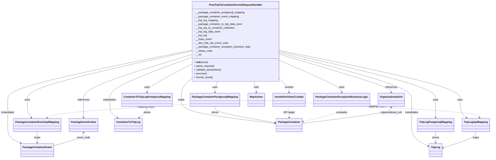

# Diagram: partview_core/partview_service/partview_service/api/trip_leg_to_container/event/handler/PostTripToContainerEvents.py

> Auto-generated by Obscura crawlers

## Mermaid

### SVG

<svg id="container" width="2960.78515625" xmlns="http://www.w3.org/2000/svg" class="classDiagram" height="994" viewBox="0 0 2960.78515625 994" role="graphics-document document" aria-roledescription="class"><g><defs><marker id="container_class-aggregationStart" class="marker aggregation class" refX="18" refY="7" markerWidth="190" markerHeight="240" orient="auto"><path d="M 18,7 L9,13 L1,7 L9,1 Z"></path></marker></defs><defs><marker id="container_class-aggregationEnd" class="marker aggregation class" refX="1" refY="7" markerWidth="20" markerHeight="28" orient="auto"><path d="M 18,7 L9,13 L1,7 L9,1 Z"></path></marker></defs><defs><marker id="container_class-extensionStart" class="marker extension class" refX="18" refY="7" markerWidth="190" markerHeight="240" orient="auto"><path d="M 1,7 L18,13 V 1 Z"></path></marker></defs><defs><marker id="container_class-extensionEnd" class="marker extension class" refX="1" refY="7" markerWidth="20" markerHeight="28" orient="auto"><path d="M 1,1 V 13 L18,7 Z"></path></marker></defs><defs><marker id="container_class-compositionStart" class="marker composition class" refX="18" refY="7" markerWidth="190" markerHeight="240" orient="auto"><path d="M 18,7 L9,13 L1,7 L9,1 Z"></path></marker></defs><defs><marker id="container_class-compositionEnd" class="marker composition class" refX="1" refY="7" markerWidth="20" markerHeight="28" orient="auto"><path d="M 18,7 L9,13 L1,7 L9,1 Z"></path></marker></defs><defs><marker id="container_class-dependencyStart" class="marker dependency class" refX="6" refY="7" markerWidth="190" markerHeight="240" orient="auto"><path d="M 5,7 L9,13 L1,7 L9,1 Z"></path></marker></defs><defs><marker id="container_class-dependencyEnd" class="marker dependency class" refX="13" refY="7" markerWidth="20" markerHeight="28" orient="auto"><path d="M 18,7 L9,13 L14,7 L9,1 Z"></path></marker></defs><defs><marker id="container_class-lollipopStart" class="marker lollipop class" refX="13" refY="7" markerWidth="190" markerHeight="240" orient="auto"><circle stroke="black" fill="transparent" cx="7" cy="7" r="6"></circle></marker></defs><defs><marker id="container_class-lollipopEnd" class="marker lollipop class" refX="1" refY="7" markerWidth="190" markerHeight="240" orient="auto"><circle stroke="black" fill="transparent" cx="7" cy="7" r="6"></circle></marker></defs><g class="root"><g class="clusters"></g><g class="edgePaths"><path d="M1313.246,512L1310.595,518.167C1307.944,524.333,1302.642,536.667,1299.991,548C1297.34,559.333,1297.34,569.667,1297.34,574.833L1297.34,580" id="id_PostTripToContainerEventsRequestHandler_PackageContainerPostgresqlMapping_1" class="edge-thickness-normal edge-pattern-solid relation" style=";;;" data-edge="true" data-et="edge" data-id="id_PostTripToContainerEventsRequestHandler_PackageContainerPostgresqlMapping_1" data-points="W3sieCI6MTMxMy4yNDYyODI5ODAxMDM4LCJ5Ijo1MTJ9LHsieCI6MTI5Ny4zMzk4NDM3NSwieSI6NTQ5fSx7IngiOjEyOTcuMzM5ODQzNzUsInkiOjU4Nn1d" marker-end="url(#container_class-dependencyEnd)"></path><path d="M1153.293,321.966L989.465,359.805C825.638,397.644,497.983,473.322,334.156,524.328C170.328,575.333,170.328,601.667,170.328,628C170.328,654.333,170.328,680.667,174.157,699.187C177.985,717.707,185.643,728.413,189.471,733.766L193.3,739.12" id="id_PostTripToContainerEventsRequestHandler_PackageContainerEventApiMapping_2" class="edge-thickness-normal edge-pattern-solid relation" style=";;;" data-edge="true" data-et="edge" data-id="id_PostTripToContainerEventsRequestHandler_PackageContainerEventApiMapping_2" data-points="W3sieCI6MTE1My4yOTI5Njg3NSwieSI6MzIxLjk2NjI3MTMzNDA2OH0seyJ4IjoxNzAuMzI4MTI1LCJ5Ijo1NDl9LHsieCI6MTcwLjMyODEyNSwieSI6NjI4fSx7IngiOjE3MC4zMjgxMjUsInkiOjcwN30seyJ4IjoxOTYuNzkwMTUwMzE2NDU1NywieSI6NzQ0fV0=" marker-end="url(#container_class-dependencyEnd)"></path><path d="M1689.871,317.242L1870.908,355.869C2051.945,394.495,2414.02,471.747,2595.057,523.54C2776.094,575.333,2776.094,601.667,2776.094,628C2776.094,654.333,2776.094,680.667,2782.695,699.358C2789.296,718.05,2802.497,729.099,2809.098,734.624L2815.699,740.149" id="id_PostTripToContainerEventsRequestHandler_TripLegApiMapping_3" class="edge-thickness-normal edge-pattern-solid relation" style=";;;" data-edge="true" data-et="edge" data-id="id_PostTripToContainerEventsRequestHandler_TripLegApiMapping_3" data-points="W3sieCI6MTY4OS44NzEwOTM3NSwieSI6MzE3LjI0MjQyNzY1MDY0NjczfSx7IngiOjI3NzYuMDkzNzUsInkiOjU0OX0seyJ4IjoyNzc2LjA5Mzc1LCJ5Ijo2Mjh9LHsieCI6Mjc3Ni4wOTM3NSwieSI6NzA3fSx7IngiOjI4MjAuMzAwMTg3ODk1NTY5NywieSI6NzQ0fV0=" marker-end="url(#container_class-dependencyEnd)"></path><path d="M1153.293,405.649L1109.284,429.541C1065.275,453.433,977.257,501.216,933.247,530.275C889.238,559.333,889.238,569.667,889.238,574.833L889.238,580" id="id_PostTripToContainerEventsRequestHandler_ContainerToTripLegPostgressMapping_4" class="edge-thickness-normal edge-pattern-solid relation" style=";;;" data-edge="true" data-et="edge" data-id="id_PostTripToContainerEventsRequestHandler_ContainerToTripLegPostgressMapping_4" data-points="W3sieCI6MTE1My4yOTI5Njg3NSwieSI6NDA1LjY0OTM4MzYyMTk1NDh9LHsieCI6ODg5LjIzODI4MTI1LCJ5Ijo1NDl9LHsieCI6ODg5LjIzODI4MTI1LCJ5Ijo1ODZ9XQ==" marker-end="url(#container_class-dependencyEnd)"></path><path d="M1689.871,324.231L1846.346,361.692C2002.822,399.154,2315.772,474.077,2472.247,524.705C2628.723,575.333,2628.723,601.667,2628.723,628C2628.723,654.333,2628.723,680.667,2628.723,699C2628.723,717.333,2628.723,727.667,2628.723,732.833L2628.723,738" id="id_PostTripToContainerEventsRequestHandler_TripLegPostgresqlMapping_5" class="edge-thickness-normal edge-pattern-solid relation" style=";;;" data-edge="true" data-et="edge" data-id="id_PostTripToContainerEventsRequestHandler_TripLegPostgresqlMapping_5" data-points="W3sieCI6MTY4OS44NzEwOTM3NSwieSI6MzI0LjIzMDc0Mjg0NTMwODV9LHsieCI6MjYyOC43MjI2NTYyNSwieSI6NTQ5fSx7IngiOjI2MjguNzIyNjU2MjUsInkiOjYyOH0seyJ4IjoyNjI4LjcyMjY1NjI1LCJ5Ijo3MDd9LHsieCI6MjYyOC43MjI2NTYyNSwieSI6NzQ0fV0=" marker-end="url(#container_class-dependencyEnd)"></path><path d="M1153.293,316.568L969.563,355.306C785.833,394.045,418.374,471.523,234.644,523.428C50.914,575.333,50.914,601.667,50.914,628C50.914,654.333,50.914,680.667,50.914,707C50.914,733.333,50.914,759.667,50.914,786C50.914,812.333,50.914,838.667,63.734,857.59C76.553,876.514,102.192,888.028,115.011,893.785L127.831,899.542" id="id_PostTripToContainerEventsRequestHandler_PackageContainerEvent_6" class="edge-thickness-normal edge-pattern-solid relation" style=";;;" data-edge="true" data-et="edge" data-id="id_PostTripToContainerEventsRequestHandler_PackageContainerEvent_6" data-points="W3sieCI6MTE1My4yOTI5Njg3NSwieSI6MzE2LjU2NzcwMzM2MDg3Mjc3fSx7IngiOjUwLjkxNDA2MjUsInkiOjU0OX0seyJ4Ijo1MC45MTQwNjI1LCJ5Ijo2Mjh9LHsieCI6NTAuOTE0MDYyNSwieSI6NzA3fSx7IngiOjUwLjkxNDA2MjUsInkiOjc4Nn0seyJ4Ijo1MC45MTQwNjI1LCJ5Ijo4NjV9LHsieCI6MTMzLjMwNDE5MzAzNzk3NDcsInkiOjkwMn1d" marker-end="url(#container_class-dependencyEnd)"></path><path d="M1153.293,361.954L1071.259,393.129C989.225,424.303,825.158,486.651,743.124,530.992C661.09,575.333,661.09,601.667,661.09,628C661.09,654.333,661.09,680.667,669.172,699.431C677.255,718.195,693.42,729.389,701.502,734.987L709.584,740.584" id="id_PostTripToContainerEventsRequestHandler_ContainerToTripLeg_7" class="edge-thickness-normal edge-pattern-solid relation" style=";;;" data-edge="true" data-et="edge" data-id="id_PostTripToContainerEventsRequestHandler_ContainerToTripLeg_7" data-points="W3sieCI6MTE1My4yOTI5Njg3NSwieSI6MzYxLjk1NDQxODkxMDQ1MDY3fSx7IngiOjY2MS4wODk4NDM3NSwieSI6NTQ5fSx7IngiOjY2MS4wODk4NDM3NSwieSI6NjI4fSx7IngiOjY2MS4wODk4NDM3NSwieSI6NzA3fSx7IngiOjcxNC41MTcwMDk0OTM2NzA5LCJ5Ijo3NDR9XQ==" marker-end="url(#container_class-dependencyEnd)"></path><path d="M1689.871,332.962L1822.271,368.968C1954.671,404.974,2219.47,476.987,2351.87,526.16C2484.27,575.333,2484.27,601.667,2484.27,628C2484.27,654.333,2484.27,680.667,2484.27,707C2484.27,733.333,2484.27,759.667,2484.27,786C2484.27,812.333,2484.27,838.667,2500.959,860.96C2517.648,883.254,2551.026,901.508,2567.715,910.635L2584.404,919.762" id="id_PostTripToContainerEventsRequestHandler_TripLeg_8" class="edge-thickness-normal edge-pattern-solid relation" style=";;;" data-edge="true" data-et="edge" data-id="id_PostTripToContainerEventsRequestHandler_TripLeg_8" data-points="W3sieCI6MTY4OS44NzEwOTM3NSwieSI6MzMyLjk2MTc0OTM5NzE2NTJ9LHsieCI6MjQ4NC4yNjk1MzEyNSwieSI6NTQ5fSx7IngiOjI0ODQuMjY5NTMxMjUsInkiOjYyOH0seyJ4IjoyNDg0LjI2OTUzMTI1LCJ5Ijo3MDd9LHsieCI6MjQ4NC4yNjk1MzEyNSwieSI6Nzg2fSx7IngiOjI0ODQuMjY5NTMxMjUsInkiOjg2NX0seyJ4IjoyNTg5LjY2Nzk2ODc1LCJ5Ijo5MjIuNjQxMzczNzE1NTIxOX1d" marker-end="url(#container_class-dependencyEnd)"></path><path d="M1153.293,497.038L1143.491,505.698C1133.689,514.359,1114.085,531.679,1104.283,553.506C1094.48,575.333,1094.48,601.667,1094.48,628C1094.48,654.333,1094.48,680.667,1188.822,705.309C1283.164,729.951,1471.848,752.903,1566.19,764.378L1660.532,775.854" id="id_PostTripToContainerEventsRequestHandler_PackageContainer_9" class="edge-thickness-normal edge-pattern-solid relation" style=";;;" data-edge="true" data-et="edge" data-id="id_PostTripToContainerEventsRequestHandler_PackageContainer_9" data-points="W3sieCI6MTE1My4yOTI5Njg3NSwieSI6NDk3LjAzODExODg5NDY0NzZ9LHsieCI6MTA5NC40ODA0Njg3NSwieSI6NTQ5fSx7IngiOjEwOTQuNDgwNDY4NzUsInkiOjYyOH0seyJ4IjoxMDk0LjQ4MDQ2ODc1LCJ5Ijo3MDd9LHsieCI6MTY2Ni40ODgyODEyNSwieSI6Nzc2LjU3ODY1Mjk2OTQwOTd9XQ==" marker-end="url(#container_class-dependencyEnd)"></path><path d="M1529.918,512L1532.569,518.167C1535.22,524.333,1540.522,536.667,1543.173,548C1545.824,559.333,1545.824,569.667,1545.824,574.833L1545.824,580" id="id_PostTripToContainerEventsRequestHandler_MapAction_10" class="edge-thickness-normal edge-pattern-solid relation" style=";;;" data-edge="true" data-et="edge" data-id="id_PostTripToContainerEventsRequestHandler_MapAction_10" data-points="W3sieCI6MTUyOS45MTc3Nzk1MTk4OTYyLCJ5Ijo1MTJ9LHsieCI6MTU0NS44MjQyMTg3NSwieSI6NTQ5fSx7IngiOjE1NDUuODI0MjE4NzUsInkiOjU4Nn1d" marker-end="url(#container_class-dependencyEnd)"></path><path d="M1689.871,500.525L1698.883,508.604C1707.895,516.683,1725.918,532.842,1734.93,546.088C1743.941,559.333,1743.941,569.667,1743.941,574.833L1743.941,580" id="id_PostTripToContainerEventsRequestHandler_InvokePartViewCrudApi_11" class="edge-thickness-normal edge-pattern-solid relation" style=";;;" data-edge="true" data-et="edge" data-id="id_PostTripToContainerEventsRequestHandler_InvokePartViewCrudApi_11" data-points="W3sieCI6MTY4OS44NzEwOTM3NSwieSI6NTAwLjUyNTE1NjMxODE2Mn0seyJ4IjoxNzQzLjk0MTQwNjI1LCJ5Ijo1NDl9LHsieCI6MTc0My45NDE0MDYyNSwieSI6NTg2fV0=" marker-end="url(#container_class-dependencyEnd)"></path><path d="M1689.871,382.219L1750.889,410.016C1811.908,437.813,1933.944,493.406,1994.962,526.37C2055.98,559.333,2055.98,569.667,2055.98,574.833L2055.98,580" id="id_PostTripToContainerEventsRequestHandler_PackageContainerExceptionBusinessLogic_12" class="edge-thickness-normal edge-pattern-solid relation" style=";;;" data-edge="true" data-et="edge" data-id="id_PostTripToContainerEventsRequestHandler_PackageContainerExceptionBusinessLogic_12" data-points="W3sieCI6MTY4OS44NzEwOTM3NSwieSI6MzgyLjIxODk5NDM3MjEyOTF9LHsieCI6MjA1NS45ODA0Njg3NSwieSI6NTQ5fSx7IngiOjIwNTUuOTgwNDY4NzUsInkiOjU4Nn1d" marker-end="url(#container_class-dependencyEnd)"></path><path d="M1689.871,343.417L1800.072,377.681C1910.272,411.945,2130.673,480.472,2240.874,519.903C2351.074,559.333,2351.074,569.667,2351.074,574.833L2351.074,580" id="id_PostTripToContainerEventsRequestHandler_OrganizationalUnit_13" class="edge-thickness-normal edge-pattern-solid relation" style=";;;" data-edge="true" data-et="edge" data-id="id_PostTripToContainerEventsRequestHandler_OrganizationalUnit_13" data-points="W3sieCI6MTY4OS44NzEwOTM3NSwieSI6MzQzLjQxNzA5NjAyODU3NzR9LHsieCI6MjM1MS4wNzQyMTg3NSwieSI6NTQ5fSx7IngiOjIzNTEuMDc0MjE4NzUsInkiOjU4Nn1d" marker-end="url(#container_class-dependencyEnd)"></path><path d="M1153.293,344.315L1044.743,378.429C936.193,412.544,719.092,480.772,610.542,528.053C501.992,575.333,501.992,601.667,501.992,628C501.992,654.333,501.992,680.667,501.992,699C501.992,717.333,501.992,727.667,501.992,732.833L501.992,738" id="id_PostTripToContainerEventsRequestHandler_PackageEventCodes_14" class="edge-thickness-normal edge-pattern-solid relation" style=";;;" data-edge="true" data-et="edge" data-id="id_PostTripToContainerEventsRequestHandler_PackageEventCodes_14" data-points="W3sieCI6MTE1My4yOTI5Njg3NSwieSI6MzQ0LjMxNTM0OTQ4OTE5OTl9LHsieCI6NTAxLjk5MjE4NzUsInkiOjU0OX0seyJ4Ijo1MDEuOTkyMTg3NSwieSI6NjI4fSx7IngiOjUwMS45OTIxODc1LCJ5Ijo3MDd9LHsieCI6NTAxLjk5MjE4NzUsInkiOjc0NH1d" marker-end="url(#container_class-dependencyEnd)"></path><path d="M889.238,670L889.238,676.167C889.238,682.333,889.238,694.667,881.156,706.431C873.073,718.195,856.909,729.389,848.826,734.987L840.744,740.584" id="id_ContainerToTripLegPostgressMapping_ContainerToTripLeg_15" class="edge-thickness-normal edge-pattern-solid relation" style=";;;" data-edge="true" data-et="edge" data-id="id_ContainerToTripLegPostgressMapping_ContainerToTripLeg_15" data-points="W3sieCI6ODg5LjIzODI4MTI1LCJ5Ijo2NzB9LHsieCI6ODg5LjIzODI4MTI1LCJ5Ijo3MDd9LHsieCI6ODM1LjgxMTExNTUwNjMyOTEsInkiOjc0NH1d" marker-end="url(#container_class-dependencyEnd)"></path><path d="M2628.723,828L2628.723,834.167C2628.723,840.333,2628.723,852.667,2628.723,864C2628.723,875.333,2628.723,885.667,2628.723,890.833L2628.723,896" id="id_TripLegPostgresqlMapping_TripLeg_16" class="edge-thickness-normal edge-pattern-solid relation" style=";;;" data-edge="true" data-et="edge" data-id="id_TripLegPostgresqlMapping_TripLeg_16" data-points="W3sieCI6MjYyOC43MjI2NTYyNSwieSI6ODI4fSx7IngiOjI2MjguNzIyNjU2MjUsInkiOjg2NX0seyJ4IjoyNjI4LjcyMjY1NjI1LCJ5Ijo5MDJ9XQ==" marker-end="url(#container_class-dependencyEnd)"></path><path d="M1297.34,670L1297.34,676.167C1297.34,682.333,1297.34,694.667,1357.88,711.542C1418.42,728.418,1539.5,749.836,1600.04,760.545L1660.58,771.254" id="id_PackageContainerPostgresqlMapping_PackageContainer_17" class="edge-thickness-normal edge-pattern-solid relation" style=";;;" data-edge="true" data-et="edge" data-id="id_PackageContainerPostgresqlMapping_PackageContainer_17" data-points="W3sieCI6MTI5Ny4zMzk4NDM3NSwieSI6NjcwfSx7IngiOjEyOTcuMzM5ODQzNzUsInkiOjcwN30seyJ4IjoxNjY2LjQ4ODI4MTI1LCJ5Ijo3NzIuMjk5MjA0MDU4NDI3M31d" marker-end="url(#container_class-dependencyEnd)"></path><path d="M226.828,828L226.828,834.167C226.828,840.333,226.828,852.667,226.828,864C226.828,875.333,226.828,885.667,226.828,890.833L226.828,896" id="id_PackageContainerEventApiMapping_PackageContainerEvent_18" class="edge-thickness-normal edge-pattern-solid relation" style=";;;" data-edge="true" data-et="edge" data-id="id_PackageContainerEventApiMapping_PackageContainerEvent_18" data-points="W3sieCI6MjI2LjgyODEyNSwieSI6ODI4fSx7IngiOjIyNi44MjgxMjUsInkiOjg2NX0seyJ4IjoyMjYuODI4MTI1LCJ5Ijo5MDJ9XQ==" marker-end="url(#container_class-dependencyEnd)"></path><path d="M2870.48,828L2870.48,834.167C2870.48,840.333,2870.48,852.667,2837.647,869.562C2804.814,886.458,2739.147,907.916,2706.314,918.645L2673.481,929.374" id="id_TripLegApiMapping_TripLeg_19" class="edge-thickness-normal edge-pattern-solid relation" style=";;;" data-edge="true" data-et="edge" data-id="id_TripLegApiMapping_TripLeg_19" data-points="W3sieCI6Mjg3MC40ODA0Njg3NSwieSI6ODI4fSx7IngiOjI4NzAuNDgwNDY4NzUsInkiOjg2NX0seyJ4IjoyNjY3Ljc3NzM0Mzc1LCJ5Ijo5MzEuMjM3OTcwNTkyOTg3Nn1d" marker-end="url(#container_class-dependencyEnd)"></path><path d="M1495.191,631.278L1300.267,643.898C1105.342,656.519,715.493,681.759,513.637,699.922C311.78,718.084,297.915,729.169,290.982,734.711L284.05,740.253" id="id_MapAction_PackageContainerEventApiMapping_20" class="edge-thickness-normal edge-pattern-dashed relation" style=";;;" data-edge="true" data-et="edge" data-id="id_MapAction_PackageContainerEventApiMapping_20" data-points="W3sieCI6MTQ5NS4xOTE0MDYyNSwieSI6NjMxLjI3ODE5OTI5MTg1NjR9LHsieCI6MzI1LjY0NDUzMTI1LCJ5Ijo3MDd9LHsieCI6Mjc5LjM2MzQyOTU4ODYwNzYsInkiOjc0NH1d" marker-end="url(#container_class-dependencyEnd)"></path><path d="M1596.457,630.934L1815.255,643.611C2034.053,656.289,2471.65,681.645,2687.862,699.591C2904.075,717.538,2898.904,728.076,2896.319,733.345L2893.733,738.614" id="id_MapAction_TripLegApiMapping_21" class="edge-thickness-normal edge-pattern-dashed relation" style=";;;" data-edge="true" data-et="edge" data-id="id_MapAction_TripLegApiMapping_21" data-points="W3sieCI6MTU5Ni40NTcwMzEyNSwieSI6NjMwLjkzMzc4OTA2NDczODN9LHsieCI6MjkwOS4yNDYwOTM3NSwieSI6NzA3fSx7IngiOjI4OTEuMDkwMDQxNTM0ODEsInkiOjc0NH1d" marker-end="url(#container_class-dependencyEnd)"></path><path d="M1743.941,670L1743.941,676.167C1743.941,682.333,1743.941,694.667,1743.941,706C1743.941,717.333,1743.941,727.667,1743.941,732.833L1743.941,738" id="id_InvokePartViewCrudApi_PackageContainer_22" class="edge-thickness-normal edge-pattern-dashed relation" style=";;;" data-edge="true" data-et="edge" data-id="id_InvokePartViewCrudApi_PackageContainer_22" data-points="W3sieCI6MTc0My45NDE0MDYyNSwieSI6NjcwfSx7IngiOjE3NDMuOTQxNDA2MjUsInkiOjcwN30seyJ4IjoxNzQzLjk0MTQwNjI1LCJ5Ijo3NDR9XQ==" marker-end="url(#container_class-dependencyEnd)"></path><path d="M2055.98,670L2055.98,676.167C2055.98,682.333,2055.98,694.667,2017.852,710.486C1979.724,726.306,1903.468,745.612,1865.339,755.265L1827.211,764.918" id="id_PackageContainerExceptionBusinessLogic_PackageContainer_23" class="edge-thickness-normal edge-pattern-dashed relation" style=";;;" data-edge="true" data-et="edge" data-id="id_PackageContainerExceptionBusinessLogic_PackageContainer_23" data-points="W3sieCI6MjA1NS45ODA0Njg3NSwieSI6NjcwfSx7IngiOjIwNTUuOTgwNDY4NzUsInkiOjcwN30seyJ4IjoxODIxLjM5NDUzMTI1LCJ5Ijo3NjYuMzkwOTI2NjE2NzU5OH1d" marker-end="url(#container_class-dependencyEnd)"></path><path d="M501.992,834L501.992,839.167C501.992,844.333,501.992,854.667,472.408,868.327C442.823,881.988,383.654,898.975,354.069,907.469L324.484,915.963" id="id_PackageEventCodes_PackageContainerEvent_24" class="edge-thickness-normal edge-pattern-solid relation" style=";;;" data-edge="true" data-et="edge" data-id="id_PackageEventCodes_PackageContainerEvent_24" data-points="W3sieCI6NTAxLjk5MjE4NzUsInkiOjgyOH0seyJ4Ijo1MDEuOTkyMTg3NSwieSI6ODY1fSx7IngiOjMyNC40ODQzNzUsInkiOjkxNS45NjI3NDk0OTYwMzk0fV0=" marker-start="url(#container_class-dependencyStart)"></path><path d="M2351.074,676L2351.074,681.167C2351.074,686.333,2351.074,696.667,2262.794,713.32C2174.514,729.974,1997.954,752.948,1909.674,764.435L1821.395,775.922" id="id_OrganizationalUnit_PackageContainer_25" class="edge-thickness-normal edge-pattern-solid relation" style=";;;" data-edge="true" data-et="edge" data-id="id_OrganizationalUnit_PackageContainer_25" data-points="W3sieCI6MjM1MS4wNzQyMTg3NSwieSI6NjcwfSx7IngiOjIzNTEuMDc0MjE4NzUsInkiOjcwN30seyJ4IjoxODIxLjM5NDUzMTI1LCJ5Ijo3NzUuOTIxODE0ODgyOTY2OH1d" marker-start="url(#container_class-dependencyStart)"></path></g><g class="edgeLabels"><g class="edgeLabel" transform="translate(1297.33984375, 549)"><g class="label" data-id="id_PostTripToContainerEventsRequestHandler_PackageContainerPostgresqlMapping_1" transform="translate(-16.4921875, -12)"><foreignObject width="32.984375" height="24">

uses

</foreignObject></g></g><g class="edgeLabel" transform="translate(170.328125, 628)"><g class="label" data-id="id_PostTripToContainerEventsRequestHandler_PackageContainerEventApiMapping_2" transform="translate(-16.4921875, -12)"><foreignObject width="32.984375" height="24">

uses

</foreignObject></g></g><g class="edgeLabel" transform="translate(2776.09375, 628)"><g class="label" data-id="id_PostTripToContainerEventsRequestHandler_TripLegApiMapping_3" transform="translate(-16.4921875, -12)"><foreignObject width="32.984375" height="24">

uses

</foreignObject></g></g><g class="edgeLabel" transform="translate(889.23828125, 549)"><g class="label" data-id="id_PostTripToContainerEventsRequestHandler_ContainerToTripLegPostgressMapping_4" transform="translate(-16.4921875, -12)"><foreignObject width="32.984375" height="24">

uses

</foreignObject></g></g><g class="edgeLabel" transform="translate(2628.72265625, 628)"><g class="label" data-id="id_PostTripToContainerEventsRequestHandler_TripLegPostgresqlMapping_5" transform="translate(-16.4921875, -12)"><foreignObject width="32.984375" height="24">

uses

</foreignObject></g></g><g class="edgeLabel" transform="translate(50.9140625, 707)"><g class="label" data-id="id_PostTripToContainerEventsRequestHandler_PackageContainerEvent_6" transform="translate(-42.9140625, -12)"><foreignObject width="85.828125" height="24">

instantiates

</foreignObject></g></g><g class="edgeLabel" transform="translate(661.08984375, 628)"><g class="label" data-id="id_PostTripToContainerEventsRequestHandler_ContainerToTripLeg_7" transform="translate(-42.9140625, -12)"><foreignObject width="85.828125" height="24">

instantiates

</foreignObject></g></g><g class="edgeLabel" transform="translate(2484.26953125, 707)"><g class="label" data-id="id_PostTripToContainerEventsRequestHandler_TripLeg_8" transform="translate(-42.9140625, -12)"><foreignObject width="85.828125" height="24">

instantiates

</foreignObject></g></g><g class="edgeLabel" transform="translate(1094.48046875, 628)"><g class="label" data-id="id_PostTripToContainerEventsRequestHandler_PackageContainer_9" transform="translate(-20.0078125, -12)"><foreignObject width="40.015625" height="24">

reads

</foreignObject></g></g><g class="edgeLabel" transform="translate(1545.82421875, 549)"><g class="label" data-id="id_PostTripToContainerEventsRequestHandler_MapAction_10" transform="translate(-16.4453125, -12)"><foreignObject width="32.890625" height="24">

calls

</foreignObject></g></g><g class="edgeLabel" transform="translate(1743.94140625, 549)"><g class="label" data-id="id_PostTripToContainerEventsRequestHandler_InvokePartViewCrudApi_11" transform="translate(-27.5859375, -12)"><foreignObject width="55.171875" height="24">

invokes

</foreignObject></g></g><g class="edgeLabel" transform="translate(2055.98046875, 549)"><g class="label" data-id="id_PostTripToContainerEventsRequestHandler_PackageContainerExceptionBusinessLogic_12" transform="translate(-16.4921875, -12)"><foreignObject width="32.984375" height="24">

uses

</foreignObject></g></g><g class="edgeLabel" transform="translate(2351.07421875, 549)"><g class="label" data-id="id_PostTripToContainerEventsRequestHandler_OrganizationalUnit_13" transform="translate(-37.828125, -12)"><foreignObject width="75.65625" height="24">

references

</foreignObject></g></g><g class="edgeLabel" transform="translate(501.9921875, 628)"><g class="label" data-id="id_PostTripToContainerEventsRequestHandler_PackageEventCodes_14" transform="translate(-37.828125, -12)"><foreignObject width="75.65625" height="24">

references

</foreignObject></g></g><g class="edgeLabel" transform="translate(889.23828125, 707)"><g class="label" data-id="id_ContainerToTripLegPostgressMapping_ContainerToTripLeg_15" transform="translate(-22.125, -12)"><foreignObject width="44.25" height="24">

stores

</foreignObject></g></g><g class="edgeLabel" transform="translate(2628.72265625, 865)"><g class="label" data-id="id_TripLegPostgresqlMapping_TripLeg_16" transform="translate(-22.125, -12)"><foreignObject width="44.25" height="24">

stores

</foreignObject></g></g><g class="edgeLabel" transform="translate(1297.33984375, 707)"><g class="label" data-id="id_PackageContainerPostgresqlMapping_PackageContainer_17" transform="translate(-22.125, -12)"><foreignObject width="44.25" height="24">

stores

</foreignObject></g></g><g class="edgeLabel" transform="translate(226.828125, 865)"><g class="label" data-id="id_PackageContainerEventApiMapping_PackageContainerEvent_18" transform="translate(-19.703125, -12)"><foreignObject width="39.40625" height="24">

maps

</foreignObject></g></g><g class="edgeLabel" transform="translate(2870.48046875, 865)"><g class="label" data-id="id_TripLegApiMapping_TripLeg_19" transform="translate(-19.703125, -12)"><foreignObject width="39.40625" height="24">

maps

</foreignObject></g></g><g class="edgeLabel" transform="translate(880.85328, 671.05325)"><g class="label" data-id="id_MapAction_PackageContainerEventApiMapping_20" transform="translate(-57.53125, -12)"><foreignObject width="115.0625" height="24">

mapping helper

</foreignObject></g></g><g class="edgeLabel" transform="translate(2273.42435, 670.15893)"><g class="label" data-id="id_MapAction_TripLegApiMapping_21" transform="translate(-57.53125, -12)"><foreignObject width="115.0625" height="24">

mapping helper

</foreignObject></g></g><g class="edgeLabel" transform="translate(1743.94140625, 707)"><g class="label" data-id="id_InvokePartViewCrudApi_PackageContainer_22" transform="translate(-35.1484375, -12)"><foreignObject width="70.296875" height="24">

API target

</foreignObject></g></g><g class="edgeLabel" transform="translate(2055.98046875, 707)"><g class="label" data-id="id_PackageContainerExceptionBusinessLogic_PackageContainer_23" transform="translate(-34.625, -12)"><foreignObject width="69.25" height="24">

evaluates

</foreignObject></g></g><g class="edgeLabel" transform="translate(501.9921875, 865)"><g class="label" data-id="id_PackageEventCodes_PackageContainerEvent_24" transform="translate(-41.6484375, -12)"><foreignObject width="83.296875" height="24">

event_code

</foreignObject></g></g><g class="edgeLabel" transform="translate(2351.07421875, 707)"><g class="label" data-id="id_OrganizationalUnit_PackageContainer_25" transform="translate(-70.28125, -12)"><foreignObject width="140.5625" height="24">

organizational_unit

</foreignObject></g></g></g><g class="nodes"><g class="node default" id="classId-PostTripToContainerEventsRequestHandler-0" transform="translate(1421.58203125, 260)"><g class="basic label-container"><path d="M-268.2890625 -252 L268.2890625 -252 L268.2890625 252 L-268.2890625 252" stroke="none" stroke-width="0" fill="#ECECFF" style=""></path><path d="M-268.2890625 -252 C-158.6999503824037 -252, -49.1108382648074 -252, 268.2890625 -252 M-268.2890625 -252 C-138.68895716561175 -252, -9.088851831223508 -252, 268.2890625 -252 M268.2890625 -252 C268.2890625 -115.22650749383052, 268.2890625 21.54698501233895, 268.2890625 252 M268.2890625 -252 C268.2890625 -136.6860034693232, 268.2890625 -21.372006938646393, 268.2890625 252 M268.2890625 252 C64.18357727791363 252, -139.92190794417274 252, -268.2890625 252 M268.2890625 252 C76.41231090149867 252, -115.46444069700266 252, -268.2890625 252 M-268.2890625 252 C-268.2890625 91.38918078106553, -268.2890625 -69.22163843786893, -268.2890625 -252 M-268.2890625 252 C-268.2890625 119.44187105428622, -268.2890625 -13.116257891427551, -268.2890625 -252" stroke="#9370DB" stroke-width="1.3" fill="none" stroke-dasharray="0 0" style=""></path></g><g class="annotation-group text" transform="translate(0, -228)"></g><g class="label-group text" transform="translate(-157.796875, -228)"><g class="label" style="font-weight: bolder" transform="translate(0,-12)"><foreignObject width="315.59375" height="24">

PostTripToContainerEventsRequestHandler

</foreignObject></g></g><g class="members-group text" transform="translate(-256.2890625, -180)"><g class="label" style="" transform="translate(0,-12)"><foreignObject width="318.453125" height="24">

- __package_conatiner_postgresql_mapping

</foreignObject></g><g class="label" style="" transform="translate(0,12)"><foreignObject width="282.046875" height="24">

- __package_container_event_mapping

</foreignObject></g><g class="label" style="" transform="translate(0,36)"><foreignObject width="154.328125" height="24">

- __trip_leg_mapping

</foreignObject></g><g class="label" style="" transform="translate(0,60)"><foreignObject width="303.6875" height="24">

- __package_container_to_trip_data_store

</foreignObject></g><g class="label" style="" transform="translate(0,84)"><foreignObject width="260.203125" height="24">

- __trip_leg_to_container_collection

</foreignObject></g><g class="label" style="" transform="translate(0,108)"><foreignObject width="168.109375" height="24">

- __trip_leg_data_store

</foreignObject></g><g class="label" style="" transform="translate(0,132)"><foreignObject width="82.3125" height="24">

- __trip_leg

</foreignObject></g><g class="label" style="" transform="translate(0,156)"><foreignObject width="109.265625" height="24">

- __base_event

</foreignObject></g><g class="label" style="" transform="translate(0,180)"><foreignObject width="215.359375" height="24">

- __last_mile_eta_event_code

</foreignObject></g><g class="label" style="" transform="translate(0,204)"><foreignObject width="354.78125" height="24">

- __package_container_exception_business_logic

</foreignObject></g><g class="label" style="" transform="translate(0,228)"><foreignObject width="114.21875" height="24">

- __status_code

</foreignObject></g><g class="label" style="" transform="translate(0,252)"><foreignObject width="47.375" height="24">

- __ret

</foreignObject></g></g><g class="methods-group text" transform="translate(-256.2890625, 132)"><g class="label" style="" transform="translate(0,-12)"><foreignObject width="87.390625" height="24">

+ <strong>init</strong>(event)

</foreignObject></g><g class="label" style="" transform="translate(0,12)"><foreignObject width="126.046875" height="24">

+ parse_request()

</foreignObject></g><g class="label" style="" transform="translate(0,36)"><foreignObject width="170.953125" height="24">

+ validate_parameters()

</foreignObject></g><g class="label" style="" transform="translate(0,60)"><foreignObject width="77.96875" height="24">

+ process()

</foreignObject></g><g class="label" style="" transform="translate(0,84)"><foreignObject width="121.5" height="24">

+ format_result()

</foreignObject></g></g><g class="divider" style=""><path d="M-268.2890625 -204 C-80.52493762090745 -204, 107.2391872581851 -204, 268.2890625 -204 M-268.2890625 -204 C-158.4544783554644 -204, -48.619894210928805 -204, 268.2890625 -204" stroke="#9370DB" stroke-width="1.3" fill="none" stroke-dasharray="0 0" style=""></path></g><g class="divider" style=""><path d="M-268.2890625 108 C-140.9584011048849 108, -13.62773970976977 108, 268.2890625 108 M-268.2890625 108 C-127.35979758062882 108, 13.569467338742356 108, 268.2890625 108" stroke="#9370DB" stroke-width="1.3" fill="none" stroke-dasharray="0 0" style=""></path></g></g><g class="node default" id="classId-PackageContainerPostgresqlMapping-1" transform="translate(1297.33984375, 628)"><g class="basic label-container"><path d="M-147.8515625 -42 L147.8515625 -42 L147.8515625 42 L-147.8515625 42" stroke="none" stroke-width="0" fill="#ECECFF" style=""></path><path d="M-147.8515625 -42 C-57.163767023685025 -42, 33.52402845262995 -42, 147.8515625 -42 M-147.8515625 -42 C-57.28742628769545 -42, 33.276709924609094 -42, 147.8515625 -42 M147.8515625 -42 C147.8515625 -23.634637490091002, 147.8515625 -5.269274980182004, 147.8515625 42 M147.8515625 -42 C147.8515625 -18.308433138814376, 147.8515625 5.383133722371248, 147.8515625 42 M147.8515625 42 C61.59795652272899 42, -24.655649454542015 42, -147.8515625 42 M147.8515625 42 C59.79281414455933 42, -28.26593421088134 42, -147.8515625 42 M-147.8515625 42 C-147.8515625 14.626103532105489, -147.8515625 -12.747792935789022, -147.8515625 -42 M-147.8515625 42 C-147.8515625 21.716969096699792, -147.8515625 1.4339381933995838, -147.8515625 -42" stroke="#9370DB" stroke-width="1.3" fill="none" stroke-dasharray="0 0" style=""></path></g><g class="annotation-group text" transform="translate(0, -18)"></g><g class="label-group text" transform="translate(-135.8515625, -18)"><g class="label" style="font-weight: bolder" transform="translate(0,-12)"><foreignObject width="271.703125" height="24">

PackageContainerPostgresqlMapping

</foreignObject></g></g><g class="members-group text" transform="translate(-135.8515625, 30)"></g><g class="methods-group text" transform="translate(-135.8515625, 60)"></g><g class="divider" style=""><path d="M-147.8515625 6 C-75.39373012028346 6, -2.9358977405669293 6, 147.8515625 6 M-147.8515625 6 C-88.23054166037537 6, -28.609520820750745 6, 147.8515625 6" stroke="#9370DB" stroke-width="1.3" fill="none" stroke-dasharray="0 0" style=""></path></g><g class="divider" style=""><path d="M-147.8515625 24 C-38.343733403745375 24, 71.16409569250925 24, 147.8515625 24 M-147.8515625 24 C-82.45984372841153 24, -17.068124956823056 24, 147.8515625 24" stroke="#9370DB" stroke-width="1.3" fill="none" stroke-dasharray="0 0" style=""></path></g></g><g class="node default" id="classId-PackageContainerEventApiMapping-2" transform="translate(226.828125, 786)"><g class="basic label-container"><path d="M-140.9140625 -42 L140.9140625 -42 L140.9140625 42 L-140.9140625 42" stroke="none" stroke-width="0" fill="#ECECFF" style=""></path><path d="M-140.9140625 -42 C-34.11563824866896 -42, 72.68278600266208 -42, 140.9140625 -42 M-140.9140625 -42 C-62.2367654641225 -42, 16.440531571755002 -42, 140.9140625 -42 M140.9140625 -42 C140.9140625 -22.95924006696399, 140.9140625 -3.9184801339279787, 140.9140625 42 M140.9140625 -42 C140.9140625 -16.057281864117332, 140.9140625 9.885436271765336, 140.9140625 42 M140.9140625 42 C53.01368842790751 42, -34.88668564418498 42, -140.9140625 42 M140.9140625 42 C56.00501977794066 42, -28.90402294411868 42, -140.9140625 42 M-140.9140625 42 C-140.9140625 14.916195241550426, -140.9140625 -12.167609516899148, -140.9140625 -42 M-140.9140625 42 C-140.9140625 14.119295035416368, -140.9140625 -13.761409929167264, -140.9140625 -42" stroke="#9370DB" stroke-width="1.3" fill="none" stroke-dasharray="0 0" style=""></path></g><g class="annotation-group text" transform="translate(0, -18)"></g><g class="label-group text" transform="translate(-128.9140625, -18)"><g class="label" style="font-weight: bolder" transform="translate(0,-12)"><foreignObject width="257.828125" height="24">

PackageContainerEventApiMapping

</foreignObject></g></g><g class="members-group text" transform="translate(-128.9140625, 30)"></g><g class="methods-group text" transform="translate(-128.9140625, 60)"></g><g class="divider" style=""><path d="M-140.9140625 6 C-75.77581806988276 6, -10.63757363976552 6, 140.9140625 6 M-140.9140625 6 C-59.98292470913863 6, 20.94821308172274 6, 140.9140625 6" stroke="#9370DB" stroke-width="1.3" fill="none" stroke-dasharray="0 0" style=""></path></g><g class="divider" style=""><path d="M-140.9140625 24 C-61.348702858740836 24, 18.216656782518328 24, 140.9140625 24 M-140.9140625 24 C-30.52993953144677 24, 79.85418343710646 24, 140.9140625 24" stroke="#9370DB" stroke-width="1.3" fill="none" stroke-dasharray="0 0" style=""></path></g></g><g class="node default" id="classId-TripLegApiMapping-3" transform="translate(2870.48046875, 786)"><g class="basic label-container"><path d="M-82.3046875 -42 L82.3046875 -42 L82.3046875 42 L-82.3046875 42" stroke="none" stroke-width="0" fill="#ECECFF" style=""></path><path d="M-82.3046875 -42 C-34.834298220079326 -42, 12.636091059841348 -42, 82.3046875 -42 M-82.3046875 -42 C-39.590510388404674 -42, 3.1236667231906523 -42, 82.3046875 -42 M82.3046875 -42 C82.3046875 -10.198837328030134, 82.3046875 21.602325343939732, 82.3046875 42 M82.3046875 -42 C82.3046875 -22.63813178648475, 82.3046875 -3.2762635729694978, 82.3046875 42 M82.3046875 42 C43.99031600952773 42, 5.675944519055463 42, -82.3046875 42 M82.3046875 42 C31.46935758852767 42, -19.365972322944657 42, -82.3046875 42 M-82.3046875 42 C-82.3046875 12.319942182573122, -82.3046875 -17.360115634853756, -82.3046875 -42 M-82.3046875 42 C-82.3046875 14.456118233452656, -82.3046875 -13.087763533094687, -82.3046875 -42" stroke="#9370DB" stroke-width="1.3" fill="none" stroke-dasharray="0 0" style=""></path></g><g class="annotation-group text" transform="translate(0, -18)"></g><g class="label-group text" transform="translate(-70.3046875, -18)"><g class="label" style="font-weight: bolder" transform="translate(0,-12)"><foreignObject width="140.609375" height="24">

TripLegApiMapping

</foreignObject></g></g><g class="members-group text" transform="translate(-70.3046875, 30)"></g><g class="methods-group text" transform="translate(-70.3046875, 60)"></g><g class="divider" style=""><path d="M-82.3046875 6 C-26.830505172284525 6, 28.64367715543095 6, 82.3046875 6 M-82.3046875 6 C-41.28951849297017 6, -0.27434948594033415 6, 82.3046875 6" stroke="#9370DB" stroke-width="1.3" fill="none" stroke-dasharray="0 0" style=""></path></g><g class="divider" style=""><path d="M-82.3046875 24 C-37.198462157774195 24, 7.9077631844516105 24, 82.3046875 24 M-82.3046875 24 C-41.8519738586392 24, -1.3992602172783961 24, 82.3046875 24" stroke="#9370DB" stroke-width="1.3" fill="none" stroke-dasharray="0 0" style=""></path></g></g><g class="node default" id="classId-ContainerToTripLegPostgressMapping-4" transform="translate(889.23828125, 628)"><g class="basic label-container"><path d="M-150.234375 -42 L150.234375 -42 L150.234375 42 L-150.234375 42" stroke="none" stroke-width="0" fill="#ECECFF" style=""></path><path d="M-150.234375 -42 C-65.58484916057348 -42, 19.064676678853033 -42, 150.234375 -42 M-150.234375 -42 C-50.16292908345618 -42, 49.908516833087646 -42, 150.234375 -42 M150.234375 -42 C150.234375 -13.641806452750043, 150.234375 14.716387094499915, 150.234375 42 M150.234375 -42 C150.234375 -22.971711330809235, 150.234375 -3.94342266161847, 150.234375 42 M150.234375 42 C30.48287901501702 42, -89.26861696996596 42, -150.234375 42 M150.234375 42 C57.82331810487895 42, -34.5877387902421 42, -150.234375 42 M-150.234375 42 C-150.234375 25.14714222597961, -150.234375 8.294284451959221, -150.234375 -42 M-150.234375 42 C-150.234375 22.49577010557592, -150.234375 2.991540211151843, -150.234375 -42" stroke="#9370DB" stroke-width="1.3" fill="none" stroke-dasharray="0 0" style=""></path></g><g class="annotation-group text" transform="translate(0, -18)"></g><g class="label-group text" transform="translate(-138.234375, -18)"><g class="label" style="font-weight: bolder" transform="translate(0,-12)"><foreignObject width="276.46875" height="24">

ContainerToTripLegPostgressMapping

</foreignObject></g></g><g class="members-group text" transform="translate(-138.234375, 30)"></g><g class="methods-group text" transform="translate(-138.234375, 60)"></g><g class="divider" style=""><path d="M-150.234375 6 C-61.25144903050686 6, 27.731476938986276 6, 150.234375 6 M-150.234375 6 C-42.657888449914225 6, 64.91859810017155 6, 150.234375 6" stroke="#9370DB" stroke-width="1.3" fill="none" stroke-dasharray="0 0" style=""></path></g><g class="divider" style=""><path d="M-150.234375 24 C-55.65974492605723 24, 38.91488514788554 24, 150.234375 24 M-150.234375 24 C-41.954104229693 24, 66.326166540614 24, 150.234375 24" stroke="#9370DB" stroke-width="1.3" fill="none" stroke-dasharray="0 0" style=""></path></g></g><g class="node default" id="classId-TripLegPostgresqlMapping-5" transform="translate(2628.72265625, 786)"><g class="basic label-container"><path d="M-109.453125 -42 L109.453125 -42 L109.453125 42 L-109.453125 42" stroke="none" stroke-width="0" fill="#ECECFF" style=""></path><path d="M-109.453125 -42 C-37.58798651558136 -42, 34.27715196883727 -42, 109.453125 -42 M-109.453125 -42 C-52.740781097451766 -42, 3.971562805096468 -42, 109.453125 -42 M109.453125 -42 C109.453125 -22.58638591070051, 109.453125 -3.172771821401021, 109.453125 42 M109.453125 -42 C109.453125 -13.601076950276507, 109.453125 14.797846099446986, 109.453125 42 M109.453125 42 C64.03638299607583 42, 18.61964099215166 42, -109.453125 42 M109.453125 42 C58.85850315287087 42, 8.263881305741734 42, -109.453125 42 M-109.453125 42 C-109.453125 12.70430211074087, -109.453125 -16.59139577851826, -109.453125 -42 M-109.453125 42 C-109.453125 11.418386801421473, -109.453125 -19.163226397157054, -109.453125 -42" stroke="#9370DB" stroke-width="1.3" fill="none" stroke-dasharray="0 0" style=""></path></g><g class="annotation-group text" transform="translate(0, -18)"></g><g class="label-group text" transform="translate(-97.453125, -18)"><g class="label" style="font-weight: bolder" transform="translate(0,-12)"><foreignObject width="194.90625" height="24">

TripLegPostgresqlMapping

</foreignObject></g></g><g class="members-group text" transform="translate(-97.453125, 30)"></g><g class="methods-group text" transform="translate(-97.453125, 60)"></g><g class="divider" style=""><path d="M-109.453125 6 C-56.355611606060975 6, -3.2580982121219506 6, 109.453125 6 M-109.453125 6 C-60.60331449567644 6, -11.753503991352886 6, 109.453125 6" stroke="#9370DB" stroke-width="1.3" fill="none" stroke-dasharray="0 0" style=""></path></g><g class="divider" style=""><path d="M-109.453125 24 C-42.86263074029068 24, 23.727863519418634 24, 109.453125 24 M-109.453125 24 C-43.316083083245644 24, 22.820958833508712 24, 109.453125 24" stroke="#9370DB" stroke-width="1.3" fill="none" stroke-dasharray="0 0" style=""></path></g></g><g class="node default" id="classId-PackageContainerEvent-6" transform="translate(226.828125, 944)"><g class="basic label-container"><path d="M-97.65625 -42 L97.65625 -42 L97.65625 42 L-97.65625 42" stroke="none" stroke-width="0" fill="#ECECFF" style=""></path><path d="M-97.65625 -42 C-47.04095328480975 -42, 3.5743434303804946 -42, 97.65625 -42 M-97.65625 -42 C-27.655337203556826 -42, 42.34557559288635 -42, 97.65625 -42 M97.65625 -42 C97.65625 -13.52490764913096, 97.65625 14.950184701738081, 97.65625 42 M97.65625 -42 C97.65625 -16.314120553679995, 97.65625 9.37175889264001, 97.65625 42 M97.65625 42 C44.21584021965775 42, -9.2245695606845 42, -97.65625 42 M97.65625 42 C32.6195281936661 42, -32.4171936126678 42, -97.65625 42 M-97.65625 42 C-97.65625 23.97000014648431, -97.65625 5.9400002929686195, -97.65625 -42 M-97.65625 42 C-97.65625 8.973741756289634, -97.65625 -24.052516487420732, -97.65625 -42" stroke="#9370DB" stroke-width="1.3" fill="none" stroke-dasharray="0 0" style=""></path></g><g class="annotation-group text" transform="translate(0, -18)"></g><g class="label-group text" transform="translate(-85.65625, -18)"><g class="label" style="font-weight: bolder" transform="translate(0,-12)"><foreignObject width="171.3125" height="24">

PackageContainerEvent

</foreignObject></g></g><g class="members-group text" transform="translate(-85.65625, 30)"></g><g class="methods-group text" transform="translate(-85.65625, 60)"></g><g class="divider" style=""><path d="M-97.65625 6 C-54.65123123746108 6, -11.646212474922166 6, 97.65625 6 M-97.65625 6 C-21.775605059892143 6, 54.10503988021571 6, 97.65625 6" stroke="#9370DB" stroke-width="1.3" fill="none" stroke-dasharray="0 0" style=""></path></g><g class="divider" style=""><path d="M-97.65625 24 C-34.630841430342876 24, 28.394567139314248 24, 97.65625 24 M-97.65625 24 C-45.77030268258229 24, 6.115644634835419 24, 97.65625 24" stroke="#9370DB" stroke-width="1.3" fill="none" stroke-dasharray="0 0" style=""></path></g></g><g class="node default" id="classId-ContainerToTripLeg-7" transform="translate(775.1640625, 786)"><g class="basic label-container"><path d="M-83.203125 -42 L83.203125 -42 L83.203125 42 L-83.203125 42" stroke="none" stroke-width="0" fill="#ECECFF" style=""></path><path d="M-83.203125 -42 C-33.54435216333481 -42, 16.114420673330386 -42, 83.203125 -42 M-83.203125 -42 C-47.41236031707602 -42, -11.621595634152044 -42, 83.203125 -42 M83.203125 -42 C83.203125 -13.47798181405469, 83.203125 15.04403637189062, 83.203125 42 M83.203125 -42 C83.203125 -19.507195309395147, 83.203125 2.9856093812097058, 83.203125 42 M83.203125 42 C18.571428719969006 42, -46.06026756006199 42, -83.203125 42 M83.203125 42 C31.112735772911655 42, -20.97765345417669 42, -83.203125 42 M-83.203125 42 C-83.203125 12.026178081625265, -83.203125 -17.94764383674947, -83.203125 -42 M-83.203125 42 C-83.203125 11.398167163336648, -83.203125 -19.203665673326704, -83.203125 -42" stroke="#9370DB" stroke-width="1.3" fill="none" stroke-dasharray="0 0" style=""></path></g><g class="annotation-group text" transform="translate(0, -18)"></g><g class="label-group text" transform="translate(-71.203125, -18)"><g class="label" style="font-weight: bolder" transform="translate(0,-12)"><foreignObject width="142.40625" height="24">

ContainerToTripLeg

</foreignObject></g></g><g class="members-group text" transform="translate(-71.203125, 30)"></g><g class="methods-group text" transform="translate(-71.203125, 60)"></g><g class="divider" style=""><path d="M-83.203125 6 C-45.71062717778476 6, -8.218129355569516 6, 83.203125 6 M-83.203125 6 C-19.19101054153363 6, 44.82110391693274 6, 83.203125 6" stroke="#9370DB" stroke-width="1.3" fill="none" stroke-dasharray="0 0" style=""></path></g><g class="divider" style=""><path d="M-83.203125 24 C-25.574453943168344 24, 32.05421711366331 24, 83.203125 24 M-83.203125 24 C-33.06574056417557 24, 17.07164387164886 24, 83.203125 24" stroke="#9370DB" stroke-width="1.3" fill="none" stroke-dasharray="0 0" style=""></path></g></g><g class="node default" id="classId-TripLeg-8" transform="translate(2628.72265625, 944)"><g class="basic label-container"><path d="M-39.0546875 -42 L39.0546875 -42 L39.0546875 42 L-39.0546875 42" stroke="none" stroke-width="0" fill="#ECECFF" style=""></path><path d="M-39.0546875 -42 C-12.886874641528856 -42, 13.280938216942289 -42, 39.0546875 -42 M-39.0546875 -42 C-17.13408338180861 -42, 4.7865207363827835 -42, 39.0546875 -42 M39.0546875 -42 C39.0546875 -13.339976780552192, 39.0546875 15.320046438895616, 39.0546875 42 M39.0546875 -42 C39.0546875 -23.56922018652217, 39.0546875 -5.1384403730443395, 39.0546875 42 M39.0546875 42 C11.330767471041387 42, -16.393152557917226 42, -39.0546875 42 M39.0546875 42 C14.545301211724702 42, -9.964085076550596 42, -39.0546875 42 M-39.0546875 42 C-39.0546875 12.85095065052316, -39.0546875 -16.29809869895368, -39.0546875 -42 M-39.0546875 42 C-39.0546875 24.180839177102904, -39.0546875 6.361678354205807, -39.0546875 -42" stroke="#9370DB" stroke-width="1.3" fill="none" stroke-dasharray="0 0" style=""></path></g><g class="annotation-group text" transform="translate(0, -18)"></g><g class="label-group text" transform="translate(-27.0546875, -18)"><g class="label" style="font-weight: bolder" transform="translate(0,-12)"><foreignObject width="54.109375" height="24">

TripLeg

</foreignObject></g></g><g class="members-group text" transform="translate(-27.0546875, 30)"></g><g class="methods-group text" transform="translate(-27.0546875, 60)"></g><g class="divider" style=""><path d="M-39.0546875 6 C-12.836534116277381 6, 13.381619267445238 6, 39.0546875 6 M-39.0546875 6 C-16.711059531013575 6, 5.63256843797285 6, 39.0546875 6" stroke="#9370DB" stroke-width="1.3" fill="none" stroke-dasharray="0 0" style=""></path></g><g class="divider" style=""><path d="M-39.0546875 24 C-15.57980147160228 24, 7.895084556795439 24, 39.0546875 24 M-39.0546875 24 C-8.661220442990668 24, 21.732246614018663 24, 39.0546875 24" stroke="#9370DB" stroke-width="1.3" fill="none" stroke-dasharray="0 0" style=""></path></g></g><g class="node default" id="classId-PackageContainer-9" transform="translate(1743.94140625, 786)"><g class="basic label-container"><path d="M-77.453125 -42 L77.453125 -42 L77.453125 42 L-77.453125 42" stroke="none" stroke-width="0" fill="#ECECFF" style=""></path><path d="M-77.453125 -42 C-33.241891967076896 -42, 10.969341065846208 -42, 77.453125 -42 M-77.453125 -42 C-44.35885582146854 -42, -11.264586642937076 -42, 77.453125 -42 M77.453125 -42 C77.453125 -15.893211629589626, 77.453125 10.213576740820749, 77.453125 42 M77.453125 -42 C77.453125 -20.764684054727557, 77.453125 0.47063189054488674, 77.453125 42 M77.453125 42 C36.46037247147007 42, -4.532380057059854 42, -77.453125 42 M77.453125 42 C35.886476694146076 42, -5.6801716117078485 42, -77.453125 42 M-77.453125 42 C-77.453125 14.217813536651736, -77.453125 -13.564372926696528, -77.453125 -42 M-77.453125 42 C-77.453125 18.047632393790245, -77.453125 -5.90473521241951, -77.453125 -42" stroke="#9370DB" stroke-width="1.3" fill="none" stroke-dasharray="0 0" style=""></path></g><g class="annotation-group text" transform="translate(0, -18)"></g><g class="label-group text" transform="translate(-65.453125, -18)"><g class="label" style="font-weight: bolder" transform="translate(0,-12)"><foreignObject width="130.90625" height="24">

PackageContainer

</foreignObject></g></g><g class="members-group text" transform="translate(-65.453125, 30)"></g><g class="methods-group text" transform="translate(-65.453125, 60)"></g><g class="divider" style=""><path d="M-77.453125 6 C-36.48400385854279 6, 4.485117282914416 6, 77.453125 6 M-77.453125 6 C-20.456632421438 6, 36.539860157124 6, 77.453125 6" stroke="#9370DB" stroke-width="1.3" fill="none" stroke-dasharray="0 0" style=""></path></g><g class="divider" style=""><path d="M-77.453125 24 C-25.994531507267972 24, 25.464061985464056 24, 77.453125 24 M-77.453125 24 C-42.86426117822522 24, -8.27539735645044 24, 77.453125 24" stroke="#9370DB" stroke-width="1.3" fill="none" stroke-dasharray="0 0" style=""></path></g></g><g class="node default" id="classId-MapAction-10" transform="translate(1545.82421875, 628)"><g class="basic label-container"><path d="M-50.6328125 -42 L50.6328125 -42 L50.6328125 42 L-50.6328125 42" stroke="none" stroke-width="0" fill="#ECECFF" style=""></path><path d="M-50.6328125 -42 C-13.370237618704792 -42, 23.892337262590416 -42, 50.6328125 -42 M-50.6328125 -42 C-28.255520873736394 -42, -5.878229247472788 -42, 50.6328125 -42 M50.6328125 -42 C50.6328125 -10.501559372196066, 50.6328125 20.996881255607867, 50.6328125 42 M50.6328125 -42 C50.6328125 -18.77724202385313, 50.6328125 4.445515952293739, 50.6328125 42 M50.6328125 42 C13.569326016771676 42, -23.49416046645665 42, -50.6328125 42 M50.6328125 42 C14.43288609169656 42, -21.76704031660688 42, -50.6328125 42 M-50.6328125 42 C-50.6328125 17.896282997101746, -50.6328125 -6.207434005796507, -50.6328125 -42 M-50.6328125 42 C-50.6328125 24.12858923512356, -50.6328125 6.257178470247119, -50.6328125 -42" stroke="#9370DB" stroke-width="1.3" fill="none" stroke-dasharray="0 0" style=""></path></g><g class="annotation-group text" transform="translate(0, -18)"></g><g class="label-group text" transform="translate(-38.6328125, -18)"><g class="label" style="font-weight: bolder" transform="translate(0,-12)"><foreignObject width="77.265625" height="24">

MapAction

</foreignObject></g></g><g class="members-group text" transform="translate(-38.6328125, 30)"></g><g class="methods-group text" transform="translate(-38.6328125, 60)"></g><g class="divider" style=""><path d="M-50.6328125 6 C-24.44365032160898 6, 1.7455118567820378 6, 50.6328125 6 M-50.6328125 6 C-24.513014323928566 6, 1.6067838521428683 6, 50.6328125 6" stroke="#9370DB" stroke-width="1.3" fill="none" stroke-dasharray="0 0" style=""></path></g><g class="divider" style=""><path d="M-50.6328125 24 C-22.7843756542893 24, 5.064061191421402 24, 50.6328125 24 M-50.6328125 24 C-16.548333759945038 24, 17.536144980109924 24, 50.6328125 24" stroke="#9370DB" stroke-width="1.3" fill="none" stroke-dasharray="0 0" style=""></path></g></g><g class="node default" id="classId-InvokePartViewCrudApi-11" transform="translate(1743.94140625, 628)"><g class="basic label-container"><path d="M-97.484375 -42 L97.484375 -42 L97.484375 42 L-97.484375 42" stroke="none" stroke-width="0" fill="#ECECFF" style=""></path><path d="M-97.484375 -42 C-50.75755217210321 -42, -4.030729344206421 -42, 97.484375 -42 M-97.484375 -42 C-34.9668338267066 -42, 27.550707346586805 -42, 97.484375 -42 M97.484375 -42 C97.484375 -17.881897823546073, 97.484375 6.236204352907855, 97.484375 42 M97.484375 -42 C97.484375 -11.470186721714601, 97.484375 19.059626556570798, 97.484375 42 M97.484375 42 C43.21980770660764 42, -11.044759586784721 42, -97.484375 42 M97.484375 42 C21.29321964053692 42, -54.89793571892616 42, -97.484375 42 M-97.484375 42 C-97.484375 18.477069730756572, -97.484375 -5.045860538486856, -97.484375 -42 M-97.484375 42 C-97.484375 21.40453605210506, -97.484375 0.8090721042101165, -97.484375 -42" stroke="#9370DB" stroke-width="1.3" fill="none" stroke-dasharray="0 0" style=""></path></g><g class="annotation-group text" transform="translate(0, -18)"></g><g class="label-group text" transform="translate(-85.484375, -18)"><g class="label" style="font-weight: bolder" transform="translate(0,-12)"><foreignObject width="170.96875" height="24">

InvokePartViewCrudApi

</foreignObject></g></g><g class="members-group text" transform="translate(-85.484375, 30)"></g><g class="methods-group text" transform="translate(-85.484375, 60)"></g><g class="divider" style=""><path d="M-97.484375 6 C-48.17343326391606 6, 1.1375084721678803 6, 97.484375 6 M-97.484375 6 C-42.029932534025434 6, 13.424509931949132 6, 97.484375 6" stroke="#9370DB" stroke-width="1.3" fill="none" stroke-dasharray="0 0" style=""></path></g><g class="divider" style=""><path d="M-97.484375 24 C-49.09862274391659 24, -0.712870487833186 24, 97.484375 24 M-97.484375 24 C-51.76014422645884 24, -6.035913452917683 24, 97.484375 24" stroke="#9370DB" stroke-width="1.3" fill="none" stroke-dasharray="0 0" style=""></path></g></g><g class="node default" id="classId-PackageContainerExceptionBusinessLogic-12" transform="translate(2055.98046875, 628)"><g class="basic label-container"><path d="M-164.5546875 -42 L164.5546875 -42 L164.5546875 42 L-164.5546875 42" stroke="none" stroke-width="0" fill="#ECECFF" style=""></path><path d="M-164.5546875 -42 C-90.3767963815583 -42, -16.198905263116586 -42, 164.5546875 -42 M-164.5546875 -42 C-98.30527421724965 -42, -32.05586093449929 -42, 164.5546875 -42 M164.5546875 -42 C164.5546875 -24.03152519189225, 164.5546875 -6.0630503837845, 164.5546875 42 M164.5546875 -42 C164.5546875 -14.967710512864635, 164.5546875 12.06457897427073, 164.5546875 42 M164.5546875 42 C79.91568258223319 42, -4.723322335533624 42, -164.5546875 42 M164.5546875 42 C37.56746456493447 42, -89.41975837013106 42, -164.5546875 42 M-164.5546875 42 C-164.5546875 13.161186944356363, -164.5546875 -15.677626111287275, -164.5546875 -42 M-164.5546875 42 C-164.5546875 22.280298028921095, -164.5546875 2.56059605784219, -164.5546875 -42" stroke="#9370DB" stroke-width="1.3" fill="none" stroke-dasharray="0 0" style=""></path></g><g class="annotation-group text" transform="translate(0, -18)"></g><g class="label-group text" transform="translate(-152.5546875, -18)"><g class="label" style="font-weight: bolder" transform="translate(0,-12)"><foreignObject width="305.109375" height="24">

PackageContainerExceptionBusinessLogic

</foreignObject></g></g><g class="members-group text" transform="translate(-152.5546875, 30)"></g><g class="methods-group text" transform="translate(-152.5546875, 60)"></g><g class="divider" style=""><path d="M-164.5546875 6 C-79.05448587264321 6, 6.445715754713575 6, 164.5546875 6 M-164.5546875 6 C-41.508445193050704 6, 81.53779711389859 6, 164.5546875 6" stroke="#9370DB" stroke-width="1.3" fill="none" stroke-dasharray="0 0" style=""></path></g><g class="divider" style=""><path d="M-164.5546875 24 C-34.7900069330681 24, 94.9746736338638 24, 164.5546875 24 M-164.5546875 24 C-38.89666122377757 24, 86.76136505244486 24, 164.5546875 24" stroke="#9370DB" stroke-width="1.3" fill="none" stroke-dasharray="0 0" style=""></path></g></g><g class="node default" id="classId-OrganizationalUnit-13" transform="translate(2351.07421875, 628)"><g class="basic label-container"><path d="M-80.5390625 -42 L80.5390625 -42 L80.5390625 42 L-80.5390625 42" stroke="none" stroke-width="0" fill="#ECECFF" style=""></path><path d="M-80.5390625 -42 C-22.36126155193358 -42, 35.81653939613284 -42, 80.5390625 -42 M-80.5390625 -42 C-21.347380419503253 -42, 37.844301660993494 -42, 80.5390625 -42 M80.5390625 -42 C80.5390625 -23.082866174986904, 80.5390625 -4.165732349973808, 80.5390625 42 M80.5390625 -42 C80.5390625 -23.299033584575184, 80.5390625 -4.598067169150369, 80.5390625 42 M80.5390625 42 C27.696612879745032 42, -25.145836740509935 42, -80.5390625 42 M80.5390625 42 C24.88874315932201 42, -30.761576181355977 42, -80.5390625 42 M-80.5390625 42 C-80.5390625 9.41353072517147, -80.5390625 -23.17293854965706, -80.5390625 -42 M-80.5390625 42 C-80.5390625 13.525341323769378, -80.5390625 -14.949317352461243, -80.5390625 -42" stroke="#9370DB" stroke-width="1.3" fill="none" stroke-dasharray="0 0" style=""></path></g><g class="annotation-group text" transform="translate(0, -18)"></g><g class="label-group text" transform="translate(-68.5390625, -18)"><g class="label" style="font-weight: bolder" transform="translate(0,-12)"><foreignObject width="137.078125" height="24">

OrganizationalUnit

</foreignObject></g></g><g class="members-group text" transform="translate(-68.5390625, 30)"></g><g class="methods-group text" transform="translate(-68.5390625, 60)"></g><g class="divider" style=""><path d="M-80.5390625 6 C-46.30552170599225 6, -12.071980911984497 6, 80.5390625 6 M-80.5390625 6 C-19.125607239650208 6, 42.287848020699585 6, 80.5390625 6" stroke="#9370DB" stroke-width="1.3" fill="none" stroke-dasharray="0 0" style=""></path></g><g class="divider" style=""><path d="M-80.5390625 24 C-33.10472452222043 24, 14.32961345555914 24, 80.5390625 24 M-80.5390625 24 C-25.001792433565136 24, 30.53547763286973 24, 80.5390625 24" stroke="#9370DB" stroke-width="1.3" fill="none" stroke-dasharray="0 0" style=""></path></g></g><g class="node default" id="classId-PackageEventCodes-14" transform="translate(501.9921875, 786)"><g class="basic label-container"><path d="M-84.25 -42 L84.25 -42 L84.25 42 L-84.25 42" stroke="none" stroke-width="0" fill="#ECECFF" style=""></path><path d="M-84.25 -42 C-26.504162102619198 -42, 31.241675794761605 -42, 84.25 -42 M-84.25 -42 C-37.35106606444836 -42, 9.547867871103279 -42, 84.25 -42 M84.25 -42 C84.25 -9.818790859711747, 84.25 22.362418280576506, 84.25 42 M84.25 -42 C84.25 -20.32010798454263, 84.25 1.3597840309147387, 84.25 42 M84.25 42 C30.85116590738768 42, -22.547668185224637 42, -84.25 42 M84.25 42 C50.49892609939754 42, 16.747852198795087 42, -84.25 42 M-84.25 42 C-84.25 19.40211761545257, -84.25 -3.1957647690948576, -84.25 -42 M-84.25 42 C-84.25 10.564564002352434, -84.25 -20.870871995295133, -84.25 -42" stroke="#9370DB" stroke-width="1.3" fill="none" stroke-dasharray="0 0" style=""></path></g><g class="annotation-group text" transform="translate(0, -18)"></g><g class="label-group text" transform="translate(-72.25, -18)"><g class="label" style="font-weight: bolder" transform="translate(0,-12)"><foreignObject width="144.5" height="24">

PackageEventCodes

</foreignObject></g></g><g class="members-group text" transform="translate(-72.25, 30)"></g><g class="methods-group text" transform="translate(-72.25, 60)"></g><g class="divider" style=""><path d="M-84.25 6 C-46.02317469671788 6, -7.7963493934357615 6, 84.25 6 M-84.25 6 C-48.62713823696797 6, -13.004276473935946 6, 84.25 6" stroke="#9370DB" stroke-width="1.3" fill="none" stroke-dasharray="0 0" style=""></path></g><g class="divider" style=""><path d="M-84.25 24 C-44.61446990301853 24, -4.9789398060370615 24, 84.25 24 M-84.25 24 C-34.547173455687336 24, 15.155653088625328 24, 84.25 24" stroke="#9370DB" stroke-width="1.3" fill="none" stroke-dasharray="0 0" style=""></path></g></g></g></g></g></svg>
