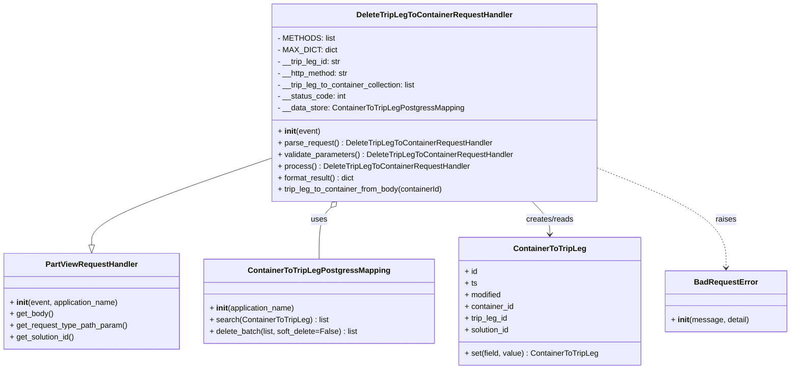

# Diagram: partview_core/partview_service/partview_service/api/trip_leg_to_container/handlers/delete_trip_leg_to_container_handler.py


> Auto-generated by Obscura crawlers

## Diagram 1



### SVG

<svg id="container" width="1612.78125" xmlns="http://www.w3.org/2000/svg" class="classDiagram" height="762" viewBox="0 0 1612.78125 762" role="graphics-document document" aria-roledescription="class"><style>#container{font-family:"trebuchet ms",verdana,arial,sans-serif;font-size:16px;fill:#333;}@keyframes edge-animation-frame{from{stroke-dashoffset:0;}}@keyframes dash{to{stroke-dashoffset:0;}}#container .edge-animation-slow{stroke-dasharray:9,5!important;stroke-dashoffset:900;animation:dash 50s linear infinite;stroke-linecap:round;}#container .edge-animation-fast{stroke-dasharray:9,5!important;stroke-dashoffset:900;animation:dash 20s linear infinite;stroke-linecap:round;}#container .error-icon{fill:#552222;}#container .error-text{fill:#552222;stroke:#552222;}#container .edge-thickness-normal{stroke-width:1px;}#container .edge-thickness-thick{stroke-width:3.5px;}#container .edge-pattern-solid{stroke-dasharray:0;}#container .edge-thickness-invisible{stroke-width:0;fill:none;}#container .edge-pattern-dashed{stroke-dasharray:3;}#container .edge-pattern-dotted{stroke-dasharray:2;}#container .marker{fill:#333333;stroke:#333333;}#container .marker.cross{stroke:#333333;}#container svg{font-family:"trebuchet ms",verdana,arial,sans-serif;font-size:16px;}#container p{margin:0;}#container g.classGroup text{fill:#9370DB;stroke:none;font-family:"trebuchet ms",verdana,arial,sans-serif;font-size:10px;}#container g.classGroup text .title{font-weight:bolder;}#container .nodeLabel,#container .edgeLabel{color:#131300;}#container .edgeLabel .label rect{fill:#ECECFF;}#container .label text{fill:#131300;}#container .labelBkg{background:#ECECFF;}#container .edgeLabel .label span{background:#ECECFF;}#container .classTitle{font-weight:bolder;}#container .node rect,#container .node circle,#container .node ellipse,#container .node polygon,#container .node path{fill:#ECECFF;stroke:#9370DB;stroke-width:1px;}#container .divider{stroke:#9370DB;stroke-width:1;}#container g.clickable{cursor:pointer;}#container g.classGroup rect{fill:#ECECFF;stroke:#9370DB;}#container g.classGroup line{stroke:#9370DB;stroke-width:1;}#container .classLabel .box{stroke:none;stroke-width:0;fill:#ECECFF;opacity:0.5;}#container .classLabel .label{fill:#9370DB;font-size:10px;}#container .relation{stroke:#333333;stroke-width:1;fill:none;}#container .dashed-line{stroke-dasharray:3;}#container .dotted-line{stroke-dasharray:1 2;}#container #compositionStart,#container .composition{fill:#333333!important;stroke:#333333!important;stroke-width:1;}#container #compositionEnd,#container .composition{fill:#333333!important;stroke:#333333!important;stroke-width:1;}#container #dependencyStart,#container .dependency{fill:#333333!important;stroke:#333333!important;stroke-width:1;}#container #dependencyStart,#container .dependency{fill:#333333!important;stroke:#333333!important;stroke-width:1;}#container #extensionStart,#container .extension{fill:transparent!important;stroke:#333333!important;stroke-width:1;}#container #extensionEnd,#container .extension{fill:transparent!important;stroke:#333333!important;stroke-width:1;}#container #aggregationStart,#container .aggregation{fill:transparent!important;stroke:#333333!important;stroke-width:1;}#container #aggregationEnd,#container .aggregation{fill:transparent!important;stroke:#333333!important;stroke-width:1;}#container #lollipopStart,#container .lollipop{fill:#ECECFF!important;stroke:#333333!important;stroke-width:1;}#container #lollipopEnd,#container .lollipop{fill:#ECECFF!important;stroke:#333333!important;stroke-width:1;}#container .edgeTerminals{font-size:11px;line-height:initial;}#container .classTitleText{text-anchor:middle;font-size:18px;fill:#333;}#container .label-icon{display:inline-block;height:1em;overflow:visible;vertical-align:-0.125em;}#container .node .label-icon path{fill:currentColor;stroke:revert;stroke-width:revert;}#container :root{--mermaid-font-family:"trebuchet ms",verdana,arial,sans-serif;}</style><g><defs><marker id="container_class-aggregationStart" class="marker aggregation class" refX="18" refY="7" markerWidth="190" markerHeight="240" orient="auto"><path d="M 18,7 L9,13 L1,7 L9,1 Z"></path></marker></defs><defs><marker id="container_class-aggregationEnd" class="marker aggregation class" refX="1" refY="7" markerWidth="20" markerHeight="28" orient="auto"><path d="M 18,7 L9,13 L1,7 L9,1 Z"></path></marker></defs><defs><marker id="container_class-extensionStart" class="marker extension class" refX="18" refY="7" markerWidth="190" markerHeight="240" orient="auto"><path d="M 1,7 L18,13 V 1 Z"></path></marker></defs><defs><marker id="container_class-extensionEnd" class="marker extension class" refX="1" refY="7" markerWidth="20" markerHeight="28" orient="auto"><path d="M 1,1 V 13 L18,7 Z"></path></marker></defs><defs><marker id="container_class-compositionStart" class="marker composition class" refX="18" refY="7" markerWidth="190" markerHeight="240" orient="auto"><path d="M 18,7 L9,13 L1,7 L9,1 Z"></path></marker></defs><defs><marker id="container_class-compositionEnd" class="marker composition class" refX="1" refY="7" markerWidth="20" markerHeight="28" orient="auto"><path d="M 18,7 L9,13 L1,7 L9,1 Z"></path></marker></defs><defs><marker id="container_class-dependencyStart" class="marker dependency class" refX="6" refY="7" markerWidth="190" markerHeight="240" orient="auto"><path d="M 5,7 L9,13 L1,7 L9,1 Z"></path></marker></defs><defs><marker id="container_class-dependencyEnd" class="marker dependency class" refX="13" refY="7" markerWidth="20" markerHeight="28" orient="auto"><path d="M 18,7 L9,13 L14,7 L9,1 Z"></path></marker></defs><defs><marker id="container_class-lollipopStart" class="marker lollipop class" refX="13" refY="7" markerWidth="190" markerHeight="240" orient="auto"><circle stroke="black" fill="transparent" cx="7" cy="7" r="6"></circle></marker></defs><defs><marker id="container_class-lollipopEnd" class="marker lollipop class" refX="1" refY="7" markerWidth="190" markerHeight="240" orient="auto"><circle stroke="black" fill="transparent" cx="7" cy="7" r="6"></circle></marker></defs><g class="root"><g class="clusters"></g><g class="edgePaths"><path d="M555.969,326.337L494.599,347.448C433.229,368.558,310.49,410.779,249.12,440.681C187.75,470.583,187.75,488.167,187.75,496.958L187.75,505.75" id="id_DeleteTripLegToContainerRequestHandler_PartViewRequestHandler_1" class="edge-thickness-normal edge-pattern-solid relation" style=";;;" data-edge="true" data-et="edge" data-id="id_DeleteTripLegToContainerRequestHandler_PartViewRequestHandler_1" data-points="W3sieCI6NTU1Ljk2ODc1LCJ5IjozMjYuMzM3MTAyMzk0NjkyMX0seyJ4IjoxODcuNzUsInkiOjQ1M30seyJ4IjoxODcuNzUsInkiOjUyM31d" marker-end="url(#container_class-extensionEnd)"></path><path d="M676.999,428.339L672.984,432.449C668.968,436.559,660.937,444.78,656.922,462.556C652.906,480.333,652.906,507.667,652.906,521.333L652.906,535" id="id_DeleteTripLegToContainerRequestHandler_ContainerToTripLegPostgressMapping_2" class="edge-thickness-normal edge-pattern-solid relation" style=";;;" data-edge="true" data-et="edge" data-id="id_DeleteTripLegToContainerRequestHandler_ContainerToTripLegPostgressMapping_2" data-points="W3sieCI6Njg5LjA1NDA1NTM2ODI1NzIsInkiOjQxNn0seyJ4Ijo2NTIuOTA2MjUsInkiOjQ1M30seyJ4Ijo2NTIuOTA2MjUsInkiOjUzNX1d" marker-start="url(#container_class-aggregationStart)"></path><path d="M1087.657,416L1093.682,422.167C1099.706,428.333,1111.755,440.667,1117.78,452C1123.805,463.333,1123.805,473.667,1123.805,478.833L1123.805,484" id="id_DeleteTripLegToContainerRequestHandler_ContainerToTripLeg_3" class="edge-thickness-normal edge-pattern-solid relation" style=";;;" data-edge="true" data-et="edge" data-id="id_DeleteTripLegToContainerRequestHandler_ContainerToTripLeg_3" data-points="W3sieCI6MTA4Ny42NTY4ODIxMzE3NDI4LCJ5Ijo0MTZ9LHsieCI6MTEyMy44MDQ2ODc1LCJ5Ijo0NTN9LHsieCI6MTEyMy44MDQ2ODc1LCJ5Ijo0OTB9XQ==" marker-end="url(#container_class-dependencyEnd)"></path><path d="M1220.742,346.929L1264.292,364.608C1307.841,382.286,1394.94,417.643,1438.49,451.988C1482.039,486.333,1482.039,519.667,1482.039,536.333L1482.039,553" id="id_DeleteTripLegToContainerRequestHandler_BadRequestError_4" class="edge-thickness-normal edge-pattern-dashed relation" style=";;;" data-edge="true" data-et="edge" data-id="id_DeleteTripLegToContainerRequestHandler_BadRequestError_4" data-points="W3sieCI6MTIyMC43NDIxODc1LCJ5IjozNDYuOTI5MTEwNDkyNjIwOX0seyJ4IjoxNDgyLjAzOTA2MjUsInkiOjQ1M30seyJ4IjoxNDgyLjAzOTA2MjUsInkiOjU1OX1d" marker-end="url(#container_class-dependencyEnd)"></path></g><g class="edgeLabels"><g class="edgeLabel"><g class="label" data-id="id_DeleteTripLegToContainerRequestHandler_PartViewRequestHandler_1" transform="translate(0, 0)"><foreignObject width="0" height="0"><div xmlns="http://www.w3.org/1999/xhtml" class="labelBkg" style="display: table-cell; white-space: nowrap; line-height: 1.5; max-width: 200px; text-align: center;"><span class="edgeLabel"></span></div></foreignObject></g></g><g class="edgeLabel" transform="translate(652.90625, 453)"><g class="label" data-id="id_DeleteTripLegToContainerRequestHandler_ContainerToTripLegPostgressMapping_2" transform="translate(-16.4921875, -12)"><foreignObject width="32.984375" height="24"><div xmlns="http://www.w3.org/1999/xhtml" class="labelBkg" style="display: table-cell; white-space: nowrap; line-height: 1.5; max-width: 200px; text-align: center;"><span class="edgeLabel"><p>uses</p></span></div></foreignObject></g></g><g class="edgeLabel" transform="translate(1123.8046875, 453)"><g class="label" data-id="id_DeleteTripLegToContainerRequestHandler_ContainerToTripLeg_3" transform="translate(-50.09375, -12)"><foreignObject width="100.1875" height="24"><div xmlns="http://www.w3.org/1999/xhtml" class="labelBkg" style="display: table-cell; white-space: nowrap; line-height: 1.5; max-width: 200px; text-align: center;"><span class="edgeLabel"><p>creates/reads</p></span></div></foreignObject></g></g><g class="edgeLabel" transform="translate(1482.0390625, 453)"><g class="label" data-id="id_DeleteTripLegToContainerRequestHandler_BadRequestError_4" transform="translate(-21.25, -12)"><foreignObject width="42.5" height="24"><div xmlns="http://www.w3.org/1999/xhtml" class="labelBkg" style="display: table-cell; white-space: nowrap; line-height: 1.5; max-width: 200px; text-align: center;"><span class="edgeLabel"><p>raises</p></span></div></foreignObject></g></g></g><g class="nodes"><g class="node default" id="classId-DeleteTripLegToContainerRequestHandler-0" transform="translate(888.35546875, 212)"><g class="basic label-container"><path d="M-332.38671875 -204 L332.38671875 -204 L332.38671875 204 L-332.38671875 204" stroke="none" stroke-width="0" fill="#ECECFF" style=""></path><path d="M-332.38671875 -204 C-99.50512209776733 -204, 133.37647455446535 -204, 332.38671875 -204 M-332.38671875 -204 C-117.02195431956432 -204, 98.34281011087137 -204, 332.38671875 -204 M332.38671875 -204 C332.38671875 -83.40634960920907, 332.38671875 37.187300781581854, 332.38671875 204 M332.38671875 -204 C332.38671875 -68.05019540121242, 332.38671875 67.89960919757516, 332.38671875 204 M332.38671875 204 C175.80706828078516 204, 19.22741781157032 204, -332.38671875 204 M332.38671875 204 C132.0640424269893 204, -68.25863389602142 204, -332.38671875 204 M-332.38671875 204 C-332.38671875 70.69093875746455, -332.38671875 -62.6181224850709, -332.38671875 -204 M-332.38671875 204 C-332.38671875 107.20935264660442, -332.38671875 10.41870529320883, -332.38671875 -204" stroke="#9370DB" stroke-width="1.3" fill="none" stroke-dasharray="0 0" style=""></path></g><g class="annotation-group text" transform="translate(0, -180)"></g><g class="label-group text" transform="translate(-154.0078125, -180)"><g class="label" style="font-weight: bolder" transform="translate(0,-12)"><foreignObject width="308.015625" height="24"><div xmlns="http://www.w3.org/1999/xhtml" style="display: table-cell; white-space: nowrap; line-height: 1.5; max-width: 354px; text-align: center;"><span class="nodeLabel markdown-node-label" style=""><p>DeleteTripLegToContainerRequestHandler</p></span></div></foreignObject></g></g><g class="members-group text" transform="translate(-320.38671875, -132)"><g class="label" style="" transform="translate(0,-12)"><foreignObject width="111.484375" height="24"><div xmlns="http://www.w3.org/1999/xhtml" style="display: table-cell; white-space: nowrap; line-height: 1.5; max-width: 169px; text-align: center;"><span class="nodeLabel markdown-node-label" style=""><p>- METHODS: list</p></span></div></foreignObject></g><g class="label" style="" transform="translate(0,12)"><foreignObject width="116.3125" height="24"><div xmlns="http://www.w3.org/1999/xhtml" style="display: table-cell; white-space: nowrap; line-height: 1.5; max-width: 174px; text-align: center;"><span class="nodeLabel markdown-node-label" style=""><p>- MAX_DICT: dict</p></span></div></foreignObject></g><g class="label" style="" transform="translate(0,36)"><foreignObject width="132.28125" height="24"><div xmlns="http://www.w3.org/1999/xhtml" style="display: table-cell; white-space: nowrap; line-height: 1.5; max-width: 190px; text-align: center;"><span class="nodeLabel markdown-node-label" style=""><p>- __trip_leg_id: str</p></span></div></foreignObject></g><g class="label" style="" transform="translate(0,60)"><foreignObject width="149.609375" height="24"><div xmlns="http://www.w3.org/1999/xhtml" style="display: table-cell; white-space: nowrap; line-height: 1.5; max-width: 208px; text-align: center;"><span class="nodeLabel markdown-node-label" style=""><p>- __http_method: str</p></span></div></foreignObject></g><g class="label" style="" transform="translate(0,84)"><foreignObject width="290.734375" height="24"><div xmlns="http://www.w3.org/1999/xhtml" style="display: table-cell; white-space: nowrap; line-height: 1.5; max-width: 348px; text-align: center;"><span class="nodeLabel markdown-node-label" style=""><p>- __trip_leg_to_container_collection: list</p></span></div></foreignObject></g><g class="label" style="" transform="translate(0,108)"><foreignObject width="141.953125" height="24"><div xmlns="http://www.w3.org/1999/xhtml" style="display: table-cell; white-space: nowrap; line-height: 1.5; max-width: 200px; text-align: center;"><span class="nodeLabel markdown-node-label" style=""><p>- __status_code: int</p></span></div></foreignObject></g><g class="label" style="" transform="translate(0,132)"><foreignObject width="383.5625" height="24"><div xmlns="http://www.w3.org/1999/xhtml" style="display: table-cell; white-space: nowrap; line-height: 1.5; max-width: 442px; text-align: center;"><span class="nodeLabel markdown-node-label" style=""><p>- __data_store: ContainerToTripLegPostgressMapping</p></span></div></foreignObject></g></g><g class="methods-group text" transform="translate(-320.38671875, 60)"><g class="label" style="" transform="translate(0,-12)"><foreignObject width="87.390625" height="24"><div xmlns="http://www.w3.org/1999/xhtml" style="display: table-cell; white-space: nowrap; line-height: 1.5; max-width: 177px; text-align: center;"><span class="nodeLabel markdown-node-label" style=""><p>+ <strong>init</strong>(event)</p></span></div></foreignObject></g><g class="label" style="" transform="translate(0,12)"><foreignObject width="441.84375" height="24"><div xmlns="http://www.w3.org/1999/xhtml" style="display: table-cell; white-space: nowrap; line-height: 1.5; max-width: 500px; text-align: center;"><span class="nodeLabel markdown-node-label" style=""><p>+ parse_request() : DeleteTripLegToContainerRequestHandler</p></span></div></foreignObject></g><g class="label" style="" transform="translate(0,36)"><foreignObject width="486.765625" height="24"><div xmlns="http://www.w3.org/1999/xhtml" style="display: table-cell; white-space: nowrap; line-height: 1.5; max-width: 545px; text-align: center;"><span class="nodeLabel markdown-node-label" style=""><p>+ validate_parameters() : DeleteTripLegToContainerRequestHandler</p></span></div></foreignObject></g><g class="label" style="" transform="translate(0,60)"><foreignObject width="393.78125" height="24"><div xmlns="http://www.w3.org/1999/xhtml" style="display: table-cell; white-space: nowrap; line-height: 1.5; max-width: 452px; text-align: center;"><span class="nodeLabel markdown-node-label" style=""><p>+ process() : DeleteTripLegToContainerRequestHandler</p></span></div></foreignObject></g><g class="label" style="" transform="translate(0,84)"><foreignObject width="161.3125" height="24"><div xmlns="http://www.w3.org/1999/xhtml" style="display: table-cell; white-space: nowrap; line-height: 1.5; max-width: 219px; text-align: center;"><span class="nodeLabel markdown-node-label" style=""><p>+ format_result() : dict</p></span></div></foreignObject></g><g class="label" style="" transform="translate(0,108)"><foreignObject width="346.8125" height="24"><div xmlns="http://www.w3.org/1999/xhtml" style="display: table-cell; white-space: nowrap; line-height: 1.5; max-width: 404px; text-align: center;"><span class="nodeLabel markdown-node-label" style=""><p>+ trip_leg_to_container_from_body(containerId)</p></span></div></foreignObject></g></g><g class="divider" style=""><path d="M-332.38671875 -156 C-144.95529227109498 -156, 42.47613420781005 -156, 332.38671875 -156 M-332.38671875 -156 C-93.67077851494517 -156, 145.04516172010966 -156, 332.38671875 -156" stroke="#9370DB" stroke-width="1.3" fill="none" stroke-dasharray="0 0" style=""></path></g><g class="divider" style=""><path d="M-332.38671875 36 C-102.50093214499168 36, 127.38485446001664 36, 332.38671875 36 M-332.38671875 36 C-115.69611860368335 36, 100.99448154263331 36, 332.38671875 36" stroke="#9370DB" stroke-width="1.3" fill="none" stroke-dasharray="0 0" style=""></path></g></g><g class="node default" id="classId-PartViewRequestHandler-1" transform="translate(187.75, 622)"><g class="basic label-container"><path d="M-179.75 -99 L179.75 -99 L179.75 99 L-179.75 99" stroke="none" stroke-width="0" fill="#ECECFF" style=""></path><path d="M-179.75 -99 C-94.62701296116214 -99, -9.504025922324274 -99, 179.75 -99 M-179.75 -99 C-95.57739967239264 -99, -11.404799344785289 -99, 179.75 -99 M179.75 -99 C179.75 -34.914268071285605, 179.75 29.17146385742879, 179.75 99 M179.75 -99 C179.75 -55.614159657392705, 179.75 -12.22831931478541, 179.75 99 M179.75 99 C54.9254992634726 99, -69.8990014730548 99, -179.75 99 M179.75 99 C107.4773062101008 99, 35.20461242020161 99, -179.75 99 M-179.75 99 C-179.75 43.97016355858942, -179.75 -11.059672882821161, -179.75 -99 M-179.75 99 C-179.75 24.567781455023336, -179.75 -49.86443708995333, -179.75 -99" stroke="#9370DB" stroke-width="1.3" fill="none" stroke-dasharray="0 0" style=""></path></g><g class="annotation-group text" transform="translate(0, -75)"></g><g class="label-group text" transform="translate(-91.359375, -75)"><g class="label" style="font-weight: bolder" transform="translate(0,-12)"><foreignObject width="182.71875" height="24"><div xmlns="http://www.w3.org/1999/xhtml" style="display: table-cell; white-space: nowrap; line-height: 1.5; max-width: 231px; text-align: center;"><span class="nodeLabel markdown-node-label" style=""><p>PartViewRequestHandler</p></span></div></foreignObject></g></g><g class="members-group text" transform="translate(-167.75, -27)"></g><g class="methods-group text" transform="translate(-167.75, 3)"><g class="label" style="" transform="translate(0,-12)"><foreignObject width="226.46875" height="24"><div xmlns="http://www.w3.org/1999/xhtml" style="display: table-cell; white-space: nowrap; line-height: 1.5; max-width: 317px; text-align: center;"><span class="nodeLabel markdown-node-label" style=""><p>+ <strong>init</strong>(event, application_name)</p></span></div></foreignObject></g><g class="label" style="" transform="translate(0,12)"><foreignObject width="89.765625" height="24"><div xmlns="http://www.w3.org/1999/xhtml" style="display: table-cell; white-space: nowrap; line-height: 1.5; max-width: 147px; text-align: center;"><span class="nodeLabel markdown-node-label" style=""><p>+ get_body()</p></span></div></foreignObject></g><g class="label" style="" transform="translate(0,36)"><foreignObject width="244.140625" height="24"><div xmlns="http://www.w3.org/1999/xhtml" style="display: table-cell; white-space: nowrap; line-height: 1.5; max-width: 302px; text-align: center;"><span class="nodeLabel markdown-node-label" style=""><p>+ get_request_type_path_param()</p></span></div></foreignObject></g><g class="label" style="" transform="translate(0,60)"><foreignObject width="135.703125" height="24"><div xmlns="http://www.w3.org/1999/xhtml" style="display: table-cell; white-space: nowrap; line-height: 1.5; max-width: 193px; text-align: center;"><span class="nodeLabel markdown-node-label" style=""><p>+ get_solution_id()</p></span></div></foreignObject></g></g><g class="divider" style=""><path d="M-179.75 -51 C-98.39325664309945 -51, -17.036513286198897 -51, 179.75 -51 M-179.75 -51 C-47.0059339314258 -51, 85.7381321371484 -51, 179.75 -51" stroke="#9370DB" stroke-width="1.3" fill="none" stroke-dasharray="0 0" style=""></path></g><g class="divider" style=""><path d="M-179.75 -27 C-92.80219173595988 -27, -5.8543834719197605 -27, 179.75 -27 M-179.75 -27 C-75.1828235933224 -27, 29.384352813355207 -27, 179.75 -27" stroke="#9370DB" stroke-width="1.3" fill="none" stroke-dasharray="0 0" style=""></path></g></g><g class="node default" id="classId-ContainerToTripLeg-2" transform="translate(1123.8046875, 622)"><g class="basic label-container"><path d="M-185.4921875 -132 L185.4921875 -132 L185.4921875 132 L-185.4921875 132" stroke="none" stroke-width="0" fill="#ECECFF" style=""></path><path d="M-185.4921875 -132 C-94.32008218029394 -132, -3.1479768605878746 -132, 185.4921875 -132 M-185.4921875 -132 C-71.8850348316235 -132, 41.722117836753 -132, 185.4921875 -132 M185.4921875 -132 C185.4921875 -74.60851102813282, 185.4921875 -17.217022056265662, 185.4921875 132 M185.4921875 -132 C185.4921875 -62.902862158846716, 185.4921875 6.194275682306568, 185.4921875 132 M185.4921875 132 C86.9558505879207 132, -11.580486324158613 132, -185.4921875 132 M185.4921875 132 C84.56972673082542 132, -16.352734038349155 132, -185.4921875 132 M-185.4921875 132 C-185.4921875 51.365409817789356, -185.4921875 -29.26918036442129, -185.4921875 -132 M-185.4921875 132 C-185.4921875 56.12543396300552, -185.4921875 -19.74913207398896, -185.4921875 -132" stroke="#9370DB" stroke-width="1.3" fill="none" stroke-dasharray="0 0" style=""></path></g><g class="annotation-group text" transform="translate(0, -108)"></g><g class="label-group text" transform="translate(-71.203125, -108)"><g class="label" style="font-weight: bolder" transform="translate(0,-12)"><foreignObject width="142.40625" height="24"><div xmlns="http://www.w3.org/1999/xhtml" style="display: table-cell; white-space: nowrap; line-height: 1.5; max-width: 191px; text-align: center;"><span class="nodeLabel markdown-node-label" style=""><p>ContainerToTripLeg</p></span></div></foreignObject></g></g><g class="members-group text" transform="translate(-173.4921875, -60)"><g class="label" style="" transform="translate(0,-12)"><foreignObject width="26.3125" height="24"><div xmlns="http://www.w3.org/1999/xhtml" style="display: table-cell; white-space: nowrap; line-height: 1.5; max-width: 84px; text-align: center;"><span class="nodeLabel markdown-node-label" style=""><p>+ id</p></span></div></foreignObject></g><g class="label" style="" transform="translate(0,12)"><foreignObject width="25.484375" height="24"><div xmlns="http://www.w3.org/1999/xhtml" style="display: table-cell; white-space: nowrap; line-height: 1.5; max-width: 83px; text-align: center;"><span class="nodeLabel markdown-node-label" style=""><p>+ ts</p></span></div></foreignObject></g><g class="label" style="" transform="translate(0,36)"><foreignObject width="76.859375" height="24"><div xmlns="http://www.w3.org/1999/xhtml" style="display: table-cell; white-space: nowrap; line-height: 1.5; max-width: 134px; text-align: center;"><span class="nodeLabel markdown-node-label" style=""><p>+ modified</p></span></div></foreignObject></g><g class="label" style="" transform="translate(0,60)"><foreignObject width="102.546875" height="24"><div xmlns="http://www.w3.org/1999/xhtml" style="display: table-cell; white-space: nowrap; line-height: 1.5; max-width: 160px; text-align: center;"><span class="nodeLabel markdown-node-label" style=""><p>+ container_id</p></span></div></foreignObject></g><g class="label" style="" transform="translate(0,84)"><foreignObject width="90.15625" height="24"><div xmlns="http://www.w3.org/1999/xhtml" style="display: table-cell; white-space: nowrap; line-height: 1.5; max-width: 148px; text-align: center;"><span class="nodeLabel markdown-node-label" style=""><p>+ trip_leg_id</p></span></div></foreignObject></g><g class="label" style="" transform="translate(0,108)"><foreignObject width="94.453125" height="24"><div xmlns="http://www.w3.org/1999/xhtml" style="display: table-cell; white-space: nowrap; line-height: 1.5; max-width: 152px; text-align: center;"><span class="nodeLabel markdown-node-label" style=""><p>+ solution_id</p></span></div></foreignObject></g></g><g class="methods-group text" transform="translate(-173.4921875, 108)"><g class="label" style="" transform="translate(0,-12)"><foreignObject width="275.78125" height="24"><div xmlns="http://www.w3.org/1999/xhtml" style="display: table-cell; white-space: nowrap; line-height: 1.5; max-width: 334px; text-align: center;"><span class="nodeLabel markdown-node-label" style=""><p>+ set(field, value) : ContainerToTripLeg</p></span></div></foreignObject></g></g><g class="divider" style=""><path d="M-185.4921875 -84 C-70.96224682309511 -84, 43.56769385380977 -84, 185.4921875 -84 M-185.4921875 -84 C-39.70627423712688 -84, 106.07963902574625 -84, 185.4921875 -84" stroke="#9370DB" stroke-width="1.3" fill="none" stroke-dasharray="0 0" style=""></path></g><g class="divider" style=""><path d="M-185.4921875 84 C-102.94451765719502 84, -20.396847814390043 84, 185.4921875 84 M-185.4921875 84 C-108.77403178244434 84, -32.05587606488868 84, 185.4921875 84" stroke="#9370DB" stroke-width="1.3" fill="none" stroke-dasharray="0 0" style=""></path></g></g><g class="node default" id="classId-ContainerToTripLegPostgressMapping-3" transform="translate(652.90625, 622)"><g class="basic label-container"><path d="M-235.40625 -87 L235.40625 -87 L235.40625 87 L-235.40625 87" stroke="none" stroke-width="0" fill="#ECECFF" style=""></path><path d="M-235.40625 -87 C-91.58018466686406 -87, 52.24588066627189 -87, 235.40625 -87 M-235.40625 -87 C-73.49822795784914 -87, 88.40979408430172 -87, 235.40625 -87 M235.40625 -87 C235.40625 -26.780003606636406, 235.40625 33.43999278672719, 235.40625 87 M235.40625 -87 C235.40625 -36.32740505930176, 235.40625 14.345189881396479, 235.40625 87 M235.40625 87 C126.32468952926705 87, 17.243129058534095 87, -235.40625 87 M235.40625 87 C103.1767823271042 87, -29.052685345791588 87, -235.40625 87 M-235.40625 87 C-235.40625 27.727711335828758, -235.40625 -31.544577328342484, -235.40625 -87 M-235.40625 87 C-235.40625 42.55567109972467, -235.40625 -1.8886578005506607, -235.40625 -87" stroke="#9370DB" stroke-width="1.3" fill="none" stroke-dasharray="0 0" style=""></path></g><g class="annotation-group text" transform="translate(0, -63)"></g><g class="label-group text" transform="translate(-138.234375, -63)"><g class="label" style="font-weight: bolder" transform="translate(0,-12)"><foreignObject width="276.46875" height="24"><div xmlns="http://www.w3.org/1999/xhtml" style="display: table-cell; white-space: nowrap; line-height: 1.5; max-width: 322px; text-align: center;"><span class="nodeLabel markdown-node-label" style=""><p>ContainerToTripLegPostgressMapping</p></span></div></foreignObject></g></g><g class="members-group text" transform="translate(-223.40625, -15)"></g><g class="methods-group text" transform="translate(-223.40625, 15)"><g class="label" style="" transform="translate(0,-12)"><foreignObject width="177.984375" height="24"><div xmlns="http://www.w3.org/1999/xhtml" style="display: table-cell; white-space: nowrap; line-height: 1.5; max-width: 268px; text-align: center;"><span class="nodeLabel markdown-node-label" style=""><p>+ <strong>init</strong>(application_name)</p></span></div></foreignObject></g><g class="label" style="" transform="translate(0,12)"><foreignObject width="244.671875" height="24"><div xmlns="http://www.w3.org/1999/xhtml" style="display: table-cell; white-space: nowrap; line-height: 1.5; max-width: 302px; text-align: center;"><span class="nodeLabel markdown-node-label" style=""><p>+ search(ContainerToTripLeg) : list</p></span></div></foreignObject></g><g class="label" style="" transform="translate(0,36)"><foreignObject width="308.578125" height="24"><div xmlns="http://www.w3.org/1999/xhtml" style="display: table-cell; white-space: nowrap; line-height: 1.5; max-width: 366px; text-align: center;"><span class="nodeLabel markdown-node-label" style=""><p>+ delete_batch(list, soft_delete=False) : list</p></span></div></foreignObject></g></g><g class="divider" style=""><path d="M-235.40625 -39 C-106.77896815044625 -39, 21.848313699107507 -39, 235.40625 -39 M-235.40625 -39 C-102.72212394029253 -39, 29.962002119414933 -39, 235.40625 -39" stroke="#9370DB" stroke-width="1.3" fill="none" stroke-dasharray="0 0" style=""></path></g><g class="divider" style=""><path d="M-235.40625 -15 C-65.85116866300592 -15, 103.70391267398816 -15, 235.40625 -15 M-235.40625 -15 C-49.319502848083914 -15, 136.76724430383217 -15, 235.40625 -15" stroke="#9370DB" stroke-width="1.3" fill="none" stroke-dasharray="0 0" style=""></path></g></g><g class="node default" id="classId-BadRequestError-4" transform="translate(1482.0390625, 622)"><g class="basic label-container"><path d="M-122.7421875 -63 L122.7421875 -63 L122.7421875 63 L-122.7421875 63" stroke="none" stroke-width="0" fill="#ECECFF" style=""></path><path d="M-122.7421875 -63 C-43.78484872663674 -63, 35.17249004672652 -63, 122.7421875 -63 M-122.7421875 -63 C-46.226667117761636 -63, 30.288853264476728 -63, 122.7421875 -63 M122.7421875 -63 C122.7421875 -13.040749922292676, 122.7421875 36.91850015541465, 122.7421875 63 M122.7421875 -63 C122.7421875 -18.100550092459642, 122.7421875 26.798899815080716, 122.7421875 63 M122.7421875 63 C31.790126144802386 63, -59.16193521039523 63, -122.7421875 63 M122.7421875 63 C42.71495213452823 63, -37.312283230943535 63, -122.7421875 63 M-122.7421875 63 C-122.7421875 24.150944008123453, -122.7421875 -14.698111983753094, -122.7421875 -63 M-122.7421875 63 C-122.7421875 17.58406202536358, -122.7421875 -27.831875949272842, -122.7421875 -63" stroke="#9370DB" stroke-width="1.3" fill="none" stroke-dasharray="0 0" style=""></path></g><g class="annotation-group text" transform="translate(0, -39)"></g><g class="label-group text" transform="translate(-62.28125, -39)"><g class="label" style="font-weight: bolder" transform="translate(0,-12)"><foreignObject width="124.5625" height="24"><div xmlns="http://www.w3.org/1999/xhtml" style="display: table-cell; white-space: nowrap; line-height: 1.5; max-width: 174px; text-align: center;"><span class="nodeLabel markdown-node-label" style=""><p>BadRequestError</p></span></div></foreignObject></g></g><g class="members-group text" transform="translate(-110.7421875, 9)"></g><g class="methods-group text" transform="translate(-110.7421875, 39)"><g class="label" style="" transform="translate(0,-12)"><foreignObject width="159.203125" height="24"><div xmlns="http://www.w3.org/1999/xhtml" style="display: table-cell; white-space: nowrap; line-height: 1.5; max-width: 249px; text-align: center;"><span class="nodeLabel markdown-node-label" style=""><p>+ <strong>init</strong>(message, detail)</p></span></div></foreignObject></g></g><g class="divider" style=""><path d="M-122.7421875 -15 C-47.488192797311044 -15, 27.765801905377913 -15, 122.7421875 -15 M-122.7421875 -15 C-48.89150290992127 -15, 24.959181680157457 -15, 122.7421875 -15" stroke="#9370DB" stroke-width="1.3" fill="none" stroke-dasharray="0 0" style=""></path></g><g class="divider" style=""><path d="M-122.7421875 9 C-53.05103466950028 9, 16.640118160999435 9, 122.7421875 9 M-122.7421875 9 C-27.849052744390463 9, 67.04408201121907 9, 122.7421875 9" stroke="#9370DB" stroke-width="1.3" fill="none" stroke-dasharray="0 0" style=""></path></g></g></g></g></g></svg>

## Diagram 2

```mermaid
flowchart TD
    A[Incoming Lambda Event] --> B[DeleteTripLegToContainerRequestHandler.__init__]
    B --> C[parse_request()]
    C -->|extract tripLegId| D[get_path_parameter(event, "tripLegId")]
    C --> E{body containerId or containerIds}
    E -->|containerId (str)| F[trip_leg_to_container_from_body(containerId)]
    E -->|containerIds (list)| G[validate length & dedupe then trip_leg_to_container_from_body for each]
    E -->|none| H[raise BadRequestError]
    F --> I[__trip_leg_to_container_collection append]
    G --> I
    I --> J[validate_parameters()]
    J --> K{trip_leg_id is string?}
    K -->|no| H
    K -->|yes| L[process()]
    L --> M[for each container build ContainerToTripLeg prototype]
    M --> N[__data_store.search(trip_leg_to_container)]
    N -->|found| O[__data_store.delete_batch(..., soft_delete=False)]
    N -->|not found| P[skip]
    O --> Q[collect deletes]
    Q --> R{deletes found?}
    R -->|yes| S[set status_code 200 and return deleted items]
    R -->|no| T[set status_code 404]
    S --> U[format_result() -> snake_to_camel_recur(...) -> return payload, status_code]
    T --> U
```

> SVG rendering failed for this diagram.
