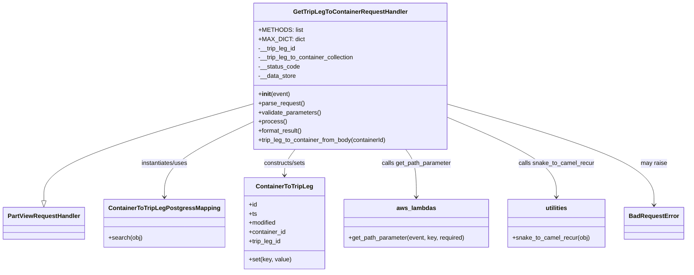

# Diagram: partview_core/partview_service/partview_service/api/trip_leg_to_container/handlers/get_trip_leg_to_container_handler.py


> Auto-generated by Obscura crawlers

## Diagram 1



### SVG

<svg id="container" width="1765.25" xmlns="http://www.w3.org/2000/svg" class="classDiagram" height="714" viewBox="0 0 1765.25 714" role="graphics-document document" aria-roledescription="class"><style>#container{font-family:"trebuchet ms",verdana,arial,sans-serif;font-size:16px;fill:#333;}@keyframes edge-animation-frame{from{stroke-dashoffset:0;}}@keyframes dash{to{stroke-dashoffset:0;}}#container .edge-animation-slow{stroke-dasharray:9,5!important;stroke-dashoffset:900;animation:dash 50s linear infinite;stroke-linecap:round;}#container .edge-animation-fast{stroke-dasharray:9,5!important;stroke-dashoffset:900;animation:dash 20s linear infinite;stroke-linecap:round;}#container .error-icon{fill:#552222;}#container .error-text{fill:#552222;stroke:#552222;}#container .edge-thickness-normal{stroke-width:1px;}#container .edge-thickness-thick{stroke-width:3.5px;}#container .edge-pattern-solid{stroke-dasharray:0;}#container .edge-thickness-invisible{stroke-width:0;fill:none;}#container .edge-pattern-dashed{stroke-dasharray:3;}#container .edge-pattern-dotted{stroke-dasharray:2;}#container .marker{fill:#333333;stroke:#333333;}#container .marker.cross{stroke:#333333;}#container svg{font-family:"trebuchet ms",verdana,arial,sans-serif;font-size:16px;}#container p{margin:0;}#container g.classGroup text{fill:#9370DB;stroke:none;font-family:"trebuchet ms",verdana,arial,sans-serif;font-size:10px;}#container g.classGroup text .title{font-weight:bolder;}#container .nodeLabel,#container .edgeLabel{color:#131300;}#container .edgeLabel .label rect{fill:#ECECFF;}#container .label text{fill:#131300;}#container .labelBkg{background:#ECECFF;}#container .edgeLabel .label span{background:#ECECFF;}#container .classTitle{font-weight:bolder;}#container .node rect,#container .node circle,#container .node ellipse,#container .node polygon,#container .node path{fill:#ECECFF;stroke:#9370DB;stroke-width:1px;}#container .divider{stroke:#9370DB;stroke-width:1;}#container g.clickable{cursor:pointer;}#container g.classGroup rect{fill:#ECECFF;stroke:#9370DB;}#container g.classGroup line{stroke:#9370DB;stroke-width:1;}#container .classLabel .box{stroke:none;stroke-width:0;fill:#ECECFF;opacity:0.5;}#container .classLabel .label{fill:#9370DB;font-size:10px;}#container .relation{stroke:#333333;stroke-width:1;fill:none;}#container .dashed-line{stroke-dasharray:3;}#container .dotted-line{stroke-dasharray:1 2;}#container #compositionStart,#container .composition{fill:#333333!important;stroke:#333333!important;stroke-width:1;}#container #compositionEnd,#container .composition{fill:#333333!important;stroke:#333333!important;stroke-width:1;}#container #dependencyStart,#container .dependency{fill:#333333!important;stroke:#333333!important;stroke-width:1;}#container #dependencyStart,#container .dependency{fill:#333333!important;stroke:#333333!important;stroke-width:1;}#container #extensionStart,#container .extension{fill:transparent!important;stroke:#333333!important;stroke-width:1;}#container #extensionEnd,#container .extension{fill:transparent!important;stroke:#333333!important;stroke-width:1;}#container #aggregationStart,#container .aggregation{fill:transparent!important;stroke:#333333!important;stroke-width:1;}#container #aggregationEnd,#container .aggregation{fill:transparent!important;stroke:#333333!important;stroke-width:1;}#container #lollipopStart,#container .lollipop{fill:#ECECFF!important;stroke:#333333!important;stroke-width:1;}#container #lollipopEnd,#container .lollipop{fill:#ECECFF!important;stroke:#333333!important;stroke-width:1;}#container .edgeTerminals{font-size:11px;line-height:initial;}#container .classTitleText{text-anchor:middle;font-size:18px;fill:#333;}#container .label-icon{display:inline-block;height:1em;overflow:visible;vertical-align:-0.125em;}#container .node .label-icon path{fill:currentColor;stroke:revert;stroke-width:revert;}#container :root{--mermaid-font-family:"trebuchet ms",verdana,arial,sans-serif;}</style><g><defs><marker id="container_class-aggregationStart" class="marker aggregation class" refX="18" refY="7" markerWidth="190" markerHeight="240" orient="auto"><path d="M 18,7 L9,13 L1,7 L9,1 Z"></path></marker></defs><defs><marker id="container_class-aggregationEnd" class="marker aggregation class" refX="1" refY="7" markerWidth="20" markerHeight="28" orient="auto"><path d="M 18,7 L9,13 L1,7 L9,1 Z"></path></marker></defs><defs><marker id="container_class-extensionStart" class="marker extension class" refX="18" refY="7" markerWidth="190" markerHeight="240" orient="auto"><path d="M 1,7 L18,13 V 1 Z"></path></marker></defs><defs><marker id="container_class-extensionEnd" class="marker extension class" refX="1" refY="7" markerWidth="20" markerHeight="28" orient="auto"><path d="M 1,1 V 13 L18,7 Z"></path></marker></defs><defs><marker id="container_class-compositionStart" class="marker composition class" refX="18" refY="7" markerWidth="190" markerHeight="240" orient="auto"><path d="M 18,7 L9,13 L1,7 L9,1 Z"></path></marker></defs><defs><marker id="container_class-compositionEnd" class="marker composition class" refX="1" refY="7" markerWidth="20" markerHeight="28" orient="auto"><path d="M 18,7 L9,13 L1,7 L9,1 Z"></path></marker></defs><defs><marker id="container_class-dependencyStart" class="marker dependency class" refX="6" refY="7" markerWidth="190" markerHeight="240" orient="auto"><path d="M 5,7 L9,13 L1,7 L9,1 Z"></path></marker></defs><defs><marker id="container_class-dependencyEnd" class="marker dependency class" refX="13" refY="7" markerWidth="20" markerHeight="28" orient="auto"><path d="M 18,7 L9,13 L14,7 L9,1 Z"></path></marker></defs><defs><marker id="container_class-lollipopStart" class="marker lollipop class" refX="13" refY="7" markerWidth="190" markerHeight="240" orient="auto"><circle stroke="black" fill="transparent" cx="7" cy="7" r="6"></circle></marker></defs><defs><marker id="container_class-lollipopEnd" class="marker lollipop class" refX="1" refY="7" markerWidth="190" markerHeight="240" orient="auto"><circle stroke="black" fill="transparent" cx="7" cy="7" r="6"></circle></marker></defs><g class="root"><g class="clusters"></g><g class="edgePaths"><path d="M635.705,274.87L548.314,300.559C460.923,326.247,286.141,377.623,198.75,419.603C111.359,461.583,111.359,494.167,111.359,510.458L111.359,526.75" id="id_GetTripLegToContainerRequestHandler_PartViewRequestHandler_1" class="edge-thickness-normal edge-pattern-solid relation" style=";;;" data-edge="true" data-et="edge" data-id="id_GetTripLegToContainerRequestHandler_PartViewRequestHandler_1" data-points="W3sieCI6NjM1LjcwNTA3ODEyNSwieSI6Mjc0Ljg3MDI5NzcxMjMxNTl9LHsieCI6MTExLjM1OTM3NSwieSI6NDI5fSx7IngiOjExMS4zNTkzNzUsInkiOjU0NH1d" marker-end="url(#container_class-extensionEnd)"></path><path d="M635.705,322.677L598.913,340.398C562.121,358.118,488.537,393.559,451.745,425.946C414.953,458.333,414.953,487.667,414.953,502.333L414.953,517" id="id_GetTripLegToContainerRequestHandler_ContainerToTripLegPostgressMapping_2" class="edge-thickness-normal edge-pattern-solid relation" style=";;;" data-edge="true" data-et="edge" data-id="id_GetTripLegToContainerRequestHandler_ContainerToTripLegPostgressMapping_2" data-points="W3sieCI6NjM1LjcwNTA3ODEyNSwieSI6MzIyLjY3NzA1OTU4NDY5NDA2fSx7IngiOjQxNC45NTMxMjUsInkiOjQyOX0seyJ4Ijo0MTQuOTUzMTI1LCJ5Ijo1MjN9XQ==" marker-end="url(#container_class-dependencyEnd)"></path><path d="M746.191,392L741.559,398.167C736.927,404.333,727.663,416.667,723.031,428C718.398,439.333,718.398,449.667,718.398,454.833L718.398,460" id="id_GetTripLegToContainerRequestHandler_ContainerToTripLeg_3" class="edge-thickness-normal edge-pattern-solid relation" style=";;;" data-edge="true" data-et="edge" data-id="id_GetTripLegToContainerRequestHandler_ContainerToTripLeg_3" data-points="W3sieCI6NzQ2LjE5MTAzOTUwNjAwNDQsInkiOjM5Mn0seyJ4Ijo3MTguMzk4NDM3NSwieSI6NDI5fSx7IngiOjcxOC4zOTg0Mzc1LCJ5Ijo0NjZ9XQ==" marker-end="url(#container_class-dependencyEnd)"></path><path d="M1034.633,392L1039.265,398.167C1043.897,404.333,1053.162,416.667,1057.794,437.5C1062.426,458.333,1062.426,487.667,1062.426,502.333L1062.426,517" id="id_GetTripLegToContainerRequestHandler_aws_lambdas_4" class="edge-thickness-normal edge-pattern-solid relation" style=";;;" data-edge="true" data-et="edge" data-id="id_GetTripLegToContainerRequestHandler_aws_lambdas_4" data-points="W3sieCI6MTAzNC42MzMxNzkyNDM5OTU1LCJ5IjozOTJ9LHsieCI6MTA2Mi40MjU3ODEyNSwieSI6NDI5fSx7IngiOjEwNjIuNDI1NzgxMjUsInkiOjUyM31d" marker-end="url(#container_class-dependencyEnd)"></path><path d="M1145.119,307.904L1192.76,328.087C1240.401,348.269,1335.683,388.635,1383.324,423.484C1430.965,458.333,1430.965,487.667,1430.965,502.333L1430.965,517" id="id_GetTripLegToContainerRequestHandler_utilities_5" class="edge-thickness-normal edge-pattern-solid relation" style=";;;" data-edge="true" data-et="edge" data-id="id_GetTripLegToContainerRequestHandler_utilities_5" data-points="W3sieCI6MTE0NS4xMTkxNDA2MjUsInkiOjMwNy45MDQxOTk2MjIwNTkzfSx7IngiOjE0MzAuOTY0ODQzNzUsInkiOjQyOX0seyJ4IjoxNDMwLjk2NDg0Mzc1LCJ5Ijo1MjN9XQ==" marker-end="url(#container_class-dependencyEnd)"></path><path d="M1145.119,273.595L1234.761,299.496C1324.402,325.396,1503.686,377.198,1593.327,421.266C1682.969,465.333,1682.969,501.667,1682.969,519.833L1682.969,538" id="id_GetTripLegToContainerRequestHandler_BadRequestError_6" class="edge-thickness-normal edge-pattern-solid relation" style=";;;" data-edge="true" data-et="edge" data-id="id_GetTripLegToContainerRequestHandler_BadRequestError_6" data-points="W3sieCI6MTE0NS4xMTkxNDA2MjUsInkiOjI3My41OTQ2MjY3NjQxNTU3NX0seyJ4IjoxNjgyLjk2ODc1LCJ5Ijo0Mjl9LHsieCI6MTY4Mi45Njg3NSwieSI6NTQ0fV0=" marker-end="url(#container_class-dependencyEnd)"></path></g><g class="edgeLabels"><g class="edgeLabel"><g class="label" data-id="id_GetTripLegToContainerRequestHandler_PartViewRequestHandler_1" transform="translate(0, 0)"><foreignObject width="0" height="0"><div xmlns="http://www.w3.org/1999/xhtml" class="labelBkg" style="display: table-cell; white-space: nowrap; line-height: 1.5; max-width: 200px; text-align: center;"><span class="edgeLabel"></span></div></foreignObject></g></g><g class="edgeLabel" transform="translate(414.953125, 429)"><g class="label" data-id="id_GetTripLegToContainerRequestHandler_ContainerToTripLegPostgressMapping_2" transform="translate(-63.3203125, -12)"><foreignObject width="126.640625" height="24"><div xmlns="http://www.w3.org/1999/xhtml" class="labelBkg" style="display: table-cell; white-space: nowrap; line-height: 1.5; max-width: 200px; text-align: center;"><span class="edgeLabel"><p>instantiates/uses</p></span></div></foreignObject></g></g><g class="edgeLabel" transform="translate(718.3984375, 429)"><g class="label" data-id="id_GetTripLegToContainerRequestHandler_ContainerToTripLeg_3" transform="translate(-56.484375, -12)"><foreignObject width="112.96875" height="24"><div xmlns="http://www.w3.org/1999/xhtml" class="labelBkg" style="display: table-cell; white-space: nowrap; line-height: 1.5; max-width: 200px; text-align: center;"><span class="edgeLabel"><p>constructs/sets</p></span></div></foreignObject></g></g><g class="edgeLabel" transform="translate(1062.42578125, 429)"><g class="label" data-id="id_GetTripLegToContainerRequestHandler_aws_lambdas_4" transform="translate(-92.3828125, -12)"><foreignObject width="184.765625" height="24"><div xmlns="http://www.w3.org/1999/xhtml" class="labelBkg" style="display: table-cell; white-space: nowrap; line-height: 1.5; max-width: 200px; text-align: center;"><span class="edgeLabel"><p>calls get_path_parameter</p></span></div></foreignObject></g></g><g class="edgeLabel" transform="translate(1430.96484375, 429)"><g class="label" data-id="id_GetTripLegToContainerRequestHandler_utilities_5" transform="translate(-99.359375, -12)"><foreignObject width="198.71875" height="24"><div xmlns="http://www.w3.org/1999/xhtml" class="labelBkg" style="display: table-cell; white-space: nowrap; line-height: 1.5; max-width: 200px; text-align: center;"><span class="edgeLabel"><p>calls snake_to_camel_recur</p></span></div></foreignObject></g></g><g class="edgeLabel" transform="translate(1682.96875, 429)"><g class="label" data-id="id_GetTripLegToContainerRequestHandler_BadRequestError_6" transform="translate(-34.65625, -12)"><foreignObject width="69.3125" height="24"><div xmlns="http://www.w3.org/1999/xhtml" class="labelBkg" style="display: table-cell; white-space: nowrap; line-height: 1.5; max-width: 200px; text-align: center;"><span class="edgeLabel"><p>may raise</p></span></div></foreignObject></g></g></g><g class="nodes"><g class="node default" id="classId-GetTripLegToContainerRequestHandler-0" transform="translate(890.412109375, 200)"><g class="basic label-container"><path d="M-254.70703125 -192 L254.70703125 -192 L254.70703125 192 L-254.70703125 192" stroke="none" stroke-width="0" fill="#ECECFF" style=""></path><path d="M-254.70703125 -192 C-144.77445989135907 -192, -34.841888532718144 -192, 254.70703125 -192 M-254.70703125 -192 C-130.00143470668613 -192, -5.295838163372252 -192, 254.70703125 -192 M254.70703125 -192 C254.70703125 -61.31650634935136, 254.70703125 69.36698730129729, 254.70703125 192 M254.70703125 -192 C254.70703125 -112.88301279582097, 254.70703125 -33.76602559164195, 254.70703125 192 M254.70703125 192 C65.6219051793918 192, -123.4632208912164 192, -254.70703125 192 M254.70703125 192 C142.5558034048032 192, 30.404575559606457 192, -254.70703125 192 M-254.70703125 192 C-254.70703125 62.84951014353578, -254.70703125 -66.30097971292844, -254.70703125 -192 M-254.70703125 192 C-254.70703125 45.932476623616026, -254.70703125 -100.13504675276795, -254.70703125 -192" stroke="#9370DB" stroke-width="1.3" fill="none" stroke-dasharray="0 0" style=""></path></g><g class="annotation-group text" transform="translate(0, -168)"></g><g class="label-group text" transform="translate(-142.9296875, -168)"><g class="label" style="font-weight: bolder" transform="translate(0,-12)"><foreignObject width="285.859375" height="24"><div xmlns="http://www.w3.org/1999/xhtml" style="display: table-cell; white-space: nowrap; line-height: 1.5; max-width: 332px; text-align: center;"><span class="nodeLabel markdown-node-label" style=""><p>GetTripLegToContainerRequestHandler</p></span></div></foreignObject></g></g><g class="members-group text" transform="translate(-242.70703125, -120)"><g class="label" style="" transform="translate(0,-12)"><foreignObject width="108.78125" height="24"><div xmlns="http://www.w3.org/1999/xhtml" style="display: table-cell; white-space: nowrap; line-height: 1.5; max-width: 166px; text-align: center;"><span class="nodeLabel markdown-node-label" style=""><p>+METHODS: list</p></span></div></foreignObject></g><g class="label" style="" transform="translate(0,12)"><foreignObject width="113.609375" height="24"><div xmlns="http://www.w3.org/1999/xhtml" style="display: table-cell; white-space: nowrap; line-height: 1.5; max-width: 171px; text-align: center;"><span class="nodeLabel markdown-node-label" style=""><p>+MAX_DICT: dict</p></span></div></foreignObject></g><g class="label" style="" transform="translate(0,36)"><foreignObject width="99.25" height="24"><div xmlns="http://www.w3.org/1999/xhtml" style="display: table-cell; white-space: nowrap; line-height: 1.5; max-width: 157px; text-align: center;"><span class="nodeLabel markdown-node-label" style=""><p>-__trip_leg_id</p></span></div></foreignObject></g><g class="label" style="" transform="translate(0,60)"><foreignObject width="254.6875" height="24"><div xmlns="http://www.w3.org/1999/xhtml" style="display: table-cell; white-space: nowrap; line-height: 1.5; max-width: 312px; text-align: center;"><span class="nodeLabel markdown-node-label" style=""><p>-__trip_leg_to_container_collection</p></span></div></foreignObject></g><g class="label" style="" transform="translate(0,84)"><foreignObject width="108.703125" height="24"><div xmlns="http://www.w3.org/1999/xhtml" style="display: table-cell; white-space: nowrap; line-height: 1.5; max-width: 166px; text-align: center;"><span class="nodeLabel markdown-node-label" style=""><p>-__status_code</p></span></div></foreignObject></g><g class="label" style="" transform="translate(0,108)"><foreignObject width="99.0625" height="24"><div xmlns="http://www.w3.org/1999/xhtml" style="display: table-cell; white-space: nowrap; line-height: 1.5; max-width: 156px; text-align: center;"><span class="nodeLabel markdown-node-label" style=""><p>-__data_store</p></span></div></foreignObject></g></g><g class="methods-group text" transform="translate(-242.70703125, 48)"><g class="label" style="" transform="translate(0,-12)"><foreignObject width="83.140625" height="24"><div xmlns="http://www.w3.org/1999/xhtml" style="display: table-cell; white-space: nowrap; line-height: 1.5; max-width: 172px; text-align: center;"><span class="nodeLabel markdown-node-label" style=""><p>+<strong>init</strong>(event)</p></span></div></foreignObject></g><g class="label" style="" transform="translate(0,12)"><foreignObject width="121.796875" height="24"><div xmlns="http://www.w3.org/1999/xhtml" style="display: table-cell; white-space: nowrap; line-height: 1.5; max-width: 179px; text-align: center;"><span class="nodeLabel markdown-node-label" style=""><p>+parse_request()</p></span></div></foreignObject></g><g class="label" style="" transform="translate(0,36)"><foreignObject width="166.546875" height="24"><div xmlns="http://www.w3.org/1999/xhtml" style="display: table-cell; white-space: nowrap; line-height: 1.5; max-width: 224px; text-align: center;"><span class="nodeLabel markdown-node-label" style=""><p>+validate_parameters()</p></span></div></foreignObject></g><g class="label" style="" transform="translate(0,60)"><foreignObject width="73.734375" height="24"><div xmlns="http://www.w3.org/1999/xhtml" style="display: table-cell; white-space: nowrap; line-height: 1.5; max-width: 131px; text-align: center;"><span class="nodeLabel markdown-node-label" style=""><p>+process()</p></span></div></foreignObject></g><g class="label" style="" transform="translate(0,84)"><foreignObject width="117.015625" height="24"><div xmlns="http://www.w3.org/1999/xhtml" style="display: table-cell; white-space: nowrap; line-height: 1.5; max-width: 174px; text-align: center;"><span class="nodeLabel markdown-node-label" style=""><p>+format_result()</p></span></div></foreignObject></g><g class="label" style="" transform="translate(0,108)"><foreignObject width="342.484375" height="24"><div xmlns="http://www.w3.org/1999/xhtml" style="display: table-cell; white-space: nowrap; line-height: 1.5; max-width: 400px; text-align: center;"><span class="nodeLabel markdown-node-label" style=""><p>+trip_leg_to_container_from_body(containerId)</p></span></div></foreignObject></g></g><g class="divider" style=""><path d="M-254.70703125 -144 C-107.80308564682693 -144, 39.10085995634614 -144, 254.70703125 -144 M-254.70703125 -144 C-51.56324050260298 -144, 151.58055024479404 -144, 254.70703125 -144" stroke="#9370DB" stroke-width="1.3" fill="none" stroke-dasharray="0 0" style=""></path></g><g class="divider" style=""><path d="M-254.70703125 24 C-116.90414770391945 24, 20.898735842161102 24, 254.70703125 24 M-254.70703125 24 C-74.92562566259235 24, 104.8557799248153 24, 254.70703125 24" stroke="#9370DB" stroke-width="1.3" fill="none" stroke-dasharray="0 0" style=""></path></g></g><g class="node default" id="classId-PartViewRequestHandler-1" transform="translate(111.359375, 586)"><g class="basic label-container"><path d="M-103.359375 -42 L103.359375 -42 L103.359375 42 L-103.359375 42" stroke="none" stroke-width="0" fill="#ECECFF" style=""></path><path d="M-103.359375 -42 C-22.846857534450663 -42, 57.66565993109867 -42, 103.359375 -42 M-103.359375 -42 C-32.46153772517074 -42, 38.436299549658514 -42, 103.359375 -42 M103.359375 -42 C103.359375 -14.966868264308602, 103.359375 12.066263471382797, 103.359375 42 M103.359375 -42 C103.359375 -13.06014325824485, 103.359375 15.8797134835103, 103.359375 42 M103.359375 42 C34.848702126095546 42, -33.66197074780891 42, -103.359375 42 M103.359375 42 C26.507474033498852 42, -50.344426933002296 42, -103.359375 42 M-103.359375 42 C-103.359375 9.41404728950421, -103.359375 -23.17190542099158, -103.359375 -42 M-103.359375 42 C-103.359375 23.00924481662368, -103.359375 4.018489633247363, -103.359375 -42" stroke="#9370DB" stroke-width="1.3" fill="none" stroke-dasharray="0 0" style=""></path></g><g class="annotation-group text" transform="translate(0, -18)"></g><g class="label-group text" transform="translate(-91.359375, -18)"><g class="label" style="font-weight: bolder" transform="translate(0,-12)"><foreignObject width="182.71875" height="24"><div xmlns="http://www.w3.org/1999/xhtml" style="display: table-cell; white-space: nowrap; line-height: 1.5; max-width: 231px; text-align: center;"><span class="nodeLabel markdown-node-label" style=""><p>PartViewRequestHandler</p></span></div></foreignObject></g></g><g class="members-group text" transform="translate(-91.359375, 30)"></g><g class="methods-group text" transform="translate(-91.359375, 60)"></g><g class="divider" style=""><path d="M-103.359375 6 C-51.139722561705184 6, 1.079929876589631 6, 103.359375 6 M-103.359375 6 C-53.49142339239481 6, -3.623471784789615 6, 103.359375 6" stroke="#9370DB" stroke-width="1.3" fill="none" stroke-dasharray="0 0" style=""></path></g><g class="divider" style=""><path d="M-103.359375 24 C-43.93701004364466 24, 15.485354912710676 24, 103.359375 24 M-103.359375 24 C-25.90998639727809 24, 51.53940220544382 24, 103.359375 24" stroke="#9370DB" stroke-width="1.3" fill="none" stroke-dasharray="0 0" style=""></path></g></g><g class="node default" id="classId-ContainerToTripLegPostgressMapping-2" transform="translate(414.953125, 586)"><g class="basic label-container"><path d="M-150.234375 -63 L150.234375 -63 L150.234375 63 L-150.234375 63" stroke="none" stroke-width="0" fill="#ECECFF" style=""></path><path d="M-150.234375 -63 C-54.003855663821255 -63, 42.22666367235749 -63, 150.234375 -63 M-150.234375 -63 C-48.58778835441507 -63, 53.058798291169865 -63, 150.234375 -63 M150.234375 -63 C150.234375 -14.648634457481137, 150.234375 33.702731085037726, 150.234375 63 M150.234375 -63 C150.234375 -22.19407470378991, 150.234375 18.611850592420183, 150.234375 63 M150.234375 63 C51.20750268986269 63, -47.819369620274614 63, -150.234375 63 M150.234375 63 C75.16088392821767 63, 0.08739285643534345 63, -150.234375 63 M-150.234375 63 C-150.234375 21.71854917680441, -150.234375 -19.562901646391182, -150.234375 -63 M-150.234375 63 C-150.234375 21.738506309395554, -150.234375 -19.522987381208893, -150.234375 -63" stroke="#9370DB" stroke-width="1.3" fill="none" stroke-dasharray="0 0" style=""></path></g><g class="annotation-group text" transform="translate(0, -39)"></g><g class="label-group text" transform="translate(-138.234375, -39)"><g class="label" style="font-weight: bolder" transform="translate(0,-12)"><foreignObject width="276.46875" height="24"><div xmlns="http://www.w3.org/1999/xhtml" style="display: table-cell; white-space: nowrap; line-height: 1.5; max-width: 322px; text-align: center;"><span class="nodeLabel markdown-node-label" style=""><p>ContainerToTripLegPostgressMapping</p></span></div></foreignObject></g></g><g class="members-group text" transform="translate(-138.234375, 9)"></g><g class="methods-group text" transform="translate(-138.234375, 39)"><g class="label" style="" transform="translate(0,-12)"><foreignObject width="89.140625" height="24"><div xmlns="http://www.w3.org/1999/xhtml" style="display: table-cell; white-space: nowrap; line-height: 1.5; max-width: 147px; text-align: center;"><span class="nodeLabel markdown-node-label" style=""><p>+search(obj)</p></span></div></foreignObject></g></g><g class="divider" style=""><path d="M-150.234375 -15 C-52.71928901273252 -15, 44.795796974534966 -15, 150.234375 -15 M-150.234375 -15 C-78.02162330372002 -15, -5.8088716074400395 -15, 150.234375 -15" stroke="#9370DB" stroke-width="1.3" fill="none" stroke-dasharray="0 0" style=""></path></g><g class="divider" style=""><path d="M-150.234375 9 C-36.81258709280341 9, 76.60920081439318 9, 150.234375 9 M-150.234375 9 C-62.9883312852067 9, 24.257712429586604 9, 150.234375 9" stroke="#9370DB" stroke-width="1.3" fill="none" stroke-dasharray="0 0" style=""></path></g></g><g class="node default" id="classId-ContainerToTripLeg-3" transform="translate(718.3984375, 586)"><g class="basic label-container"><path d="M-103.2109375 -120 L103.2109375 -120 L103.2109375 120 L-103.2109375 120" stroke="none" stroke-width="0" fill="#ECECFF" style=""></path><path d="M-103.2109375 -120 C-37.818910478732306 -120, 27.573116542535388 -120, 103.2109375 -120 M-103.2109375 -120 C-44.61325463269962 -120, 13.984428234600756 -120, 103.2109375 -120 M103.2109375 -120 C103.2109375 -34.99437139784722, 103.2109375 50.011257204305565, 103.2109375 120 M103.2109375 -120 C103.2109375 -56.82231860557775, 103.2109375 6.355362788844502, 103.2109375 120 M103.2109375 120 C26.31941381513812 120, -50.57210986972376 120, -103.2109375 120 M103.2109375 120 C52.20808922776363 120, 1.205240955527259 120, -103.2109375 120 M-103.2109375 120 C-103.2109375 70.62610526885726, -103.2109375 21.252210537714504, -103.2109375 -120 M-103.2109375 120 C-103.2109375 28.682270573143526, -103.2109375 -62.63545885371295, -103.2109375 -120" stroke="#9370DB" stroke-width="1.3" fill="none" stroke-dasharray="0 0" style=""></path></g><g class="annotation-group text" transform="translate(0, -96)"></g><g class="label-group text" transform="translate(-71.203125, -96)"><g class="label" style="font-weight: bolder" transform="translate(0,-12)"><foreignObject width="142.40625" height="24"><div xmlns="http://www.w3.org/1999/xhtml" style="display: table-cell; white-space: nowrap; line-height: 1.5; max-width: 191px; text-align: center;"><span class="nodeLabel markdown-node-label" style=""><p>ContainerToTripLeg</p></span></div></foreignObject></g></g><g class="members-group text" transform="translate(-91.2109375, -48)"><g class="label" style="" transform="translate(0,-12)"><foreignObject width="22.078125" height="24"><div xmlns="http://www.w3.org/1999/xhtml" style="display: table-cell; white-space: nowrap; line-height: 1.5; max-width: 79px; text-align: center;"><span class="nodeLabel markdown-node-label" style=""><p>+id</p></span></div></foreignObject></g><g class="label" style="" transform="translate(0,12)"><foreignObject width="21.15625" height="24"><div xmlns="http://www.w3.org/1999/xhtml" style="display: table-cell; white-space: nowrap; line-height: 1.5; max-width: 79px; text-align: center;"><span class="nodeLabel markdown-node-label" style=""><p>+ts</p></span></div></foreignObject></g><g class="label" style="" transform="translate(0,36)"><foreignObject width="72.609375" height="24"><div xmlns="http://www.w3.org/1999/xhtml" style="display: table-cell; white-space: nowrap; line-height: 1.5; max-width: 130px; text-align: center;"><span class="nodeLabel markdown-node-label" style=""><p>+modified</p></span></div></foreignObject></g><g class="label" style="" transform="translate(0,60)"><foreignObject width="98.3125" height="24"><div xmlns="http://www.w3.org/1999/xhtml" style="display: table-cell; white-space: nowrap; line-height: 1.5; max-width: 156px; text-align: center;"><span class="nodeLabel markdown-node-label" style=""><p>+container_id</p></span></div></foreignObject></g><g class="label" style="" transform="translate(0,84)"><foreignObject width="85.828125" height="24"><div xmlns="http://www.w3.org/1999/xhtml" style="display: table-cell; white-space: nowrap; line-height: 1.5; max-width: 143px; text-align: center;"><span class="nodeLabel markdown-node-label" style=""><p>+trip_leg_id</p></span></div></foreignObject></g></g><g class="methods-group text" transform="translate(-91.2109375, 96)"><g class="label" style="" transform="translate(0,-12)"><foreignObject width="111.21875" height="24"><div xmlns="http://www.w3.org/1999/xhtml" style="display: table-cell; white-space: nowrap; line-height: 1.5; max-width: 169px; text-align: center;"><span class="nodeLabel markdown-node-label" style=""><p>+set(key, value)</p></span></div></foreignObject></g></g><g class="divider" style=""><path d="M-103.2109375 -72 C-37.181293123005815 -72, 28.84835125398837 -72, 103.2109375 -72 M-103.2109375 -72 C-61.90204851542457 -72, -20.593159530849135 -72, 103.2109375 -72" stroke="#9370DB" stroke-width="1.3" fill="none" stroke-dasharray="0 0" style=""></path></g><g class="divider" style=""><path d="M-103.2109375 72 C-23.143881173805823 72, 56.92317515238835 72, 103.2109375 72 M-103.2109375 72 C-47.55082510358604 72, 8.109287292827915 72, 103.2109375 72" stroke="#9370DB" stroke-width="1.3" fill="none" stroke-dasharray="0 0" style=""></path></g></g><g class="node default" id="classId-BadRequestError-4" transform="translate(1682.96875, 586)"><g class="basic label-container"><path d="M-74.28125 -42 L74.28125 -42 L74.28125 42 L-74.28125 42" stroke="none" stroke-width="0" fill="#ECECFF" style=""></path><path d="M-74.28125 -42 C-36.29428754143848 -42, 1.6926749171230426 -42, 74.28125 -42 M-74.28125 -42 C-39.483834477014504 -42, -4.686418954029008 -42, 74.28125 -42 M74.28125 -42 C74.28125 -17.912171209319123, 74.28125 6.1756575813617545, 74.28125 42 M74.28125 -42 C74.28125 -21.596944891193253, 74.28125 -1.1938897823865062, 74.28125 42 M74.28125 42 C31.71454316221901 42, -10.852163675561982 42, -74.28125 42 M74.28125 42 C16.623013491347827 42, -41.03522301730435 42, -74.28125 42 M-74.28125 42 C-74.28125 16.554595847883046, -74.28125 -8.890808304233907, -74.28125 -42 M-74.28125 42 C-74.28125 13.258841073939632, -74.28125 -15.482317852120737, -74.28125 -42" stroke="#9370DB" stroke-width="1.3" fill="none" stroke-dasharray="0 0" style=""></path></g><g class="annotation-group text" transform="translate(0, -18)"></g><g class="label-group text" transform="translate(-62.28125, -18)"><g class="label" style="font-weight: bolder" transform="translate(0,-12)"><foreignObject width="124.5625" height="24"><div xmlns="http://www.w3.org/1999/xhtml" style="display: table-cell; white-space: nowrap; line-height: 1.5; max-width: 174px; text-align: center;"><span class="nodeLabel markdown-node-label" style=""><p>BadRequestError</p></span></div></foreignObject></g></g><g class="members-group text" transform="translate(-62.28125, 30)"></g><g class="methods-group text" transform="translate(-62.28125, 60)"></g><g class="divider" style=""><path d="M-74.28125 6 C-21.183249209888942 6, 31.914751580222116 6, 74.28125 6 M-74.28125 6 C-38.88572106801116 6, -3.4901921360223156 6, 74.28125 6" stroke="#9370DB" stroke-width="1.3" fill="none" stroke-dasharray="0 0" style=""></path></g><g class="divider" style=""><path d="M-74.28125 24 C-26.89893271934765 24, 20.483384561304703 24, 74.28125 24 M-74.28125 24 C-36.65388166750141 24, 0.9734866649971821 24, 74.28125 24" stroke="#9370DB" stroke-width="1.3" fill="none" stroke-dasharray="0 0" style=""></path></g></g><g class="node default" id="classId-aws_lambdas-5" transform="translate(1062.42578125, 586)"><g class="basic label-container"><path d="M-190.81640625 -63 L190.81640625 -63 L190.81640625 63 L-190.81640625 63" stroke="none" stroke-width="0" fill="#ECECFF" style=""></path><path d="M-190.81640625 -63 C-86.75074647793389 -63, 17.314913294132225 -63, 190.81640625 -63 M-190.81640625 -63 C-71.951188901453 -63, 46.91402844709401 -63, 190.81640625 -63 M190.81640625 -63 C190.81640625 -18.84043675726012, 190.81640625 25.319126485479757, 190.81640625 63 M190.81640625 -63 C190.81640625 -30.719677055846766, 190.81640625 1.5606458883064676, 190.81640625 63 M190.81640625 63 C56.925630581713165 63, -76.96514508657367 63, -190.81640625 63 M190.81640625 63 C112.77502487126517 63, 34.73364349253035 63, -190.81640625 63 M-190.81640625 63 C-190.81640625 31.636841570985165, -190.81640625 0.2736831419703307, -190.81640625 -63 M-190.81640625 63 C-190.81640625 31.643286471705917, -190.81640625 0.2865729434118336, -190.81640625 -63" stroke="#9370DB" stroke-width="1.3" fill="none" stroke-dasharray="0 0" style=""></path></g><g class="annotation-group text" transform="translate(0, -39)"></g><g class="label-group text" transform="translate(-49.3515625, -39)"><g class="label" style="font-weight: bolder" transform="translate(0,-12)"><foreignObject width="98.703125" height="24"><div xmlns="http://www.w3.org/1999/xhtml" style="display: table-cell; white-space: nowrap; line-height: 1.5; max-width: 148px; text-align: center;"><span class="nodeLabel markdown-node-label" style=""><p>aws_lambdas</p></span></div></foreignObject></g></g><g class="members-group text" transform="translate(-178.81640625, 9)"></g><g class="methods-group text" transform="translate(-178.81640625, 39)"><g class="label" style="" transform="translate(0,-12)"><foreignObject width="308.28125" height="24"><div xmlns="http://www.w3.org/1999/xhtml" style="display: table-cell; white-space: nowrap; line-height: 1.5; max-width: 366px; text-align: center;"><span class="nodeLabel markdown-node-label" style=""><p>+get_path_parameter(event, key, required)</p></span></div></foreignObject></g></g><g class="divider" style=""><path d="M-190.81640625 -15 C-86.63783823814573 -15, 17.540729773708534 -15, 190.81640625 -15 M-190.81640625 -15 C-56.077243677906864 -15, 78.66191889418627 -15, 190.81640625 -15" stroke="#9370DB" stroke-width="1.3" fill="none" stroke-dasharray="0 0" style=""></path></g><g class="divider" style=""><path d="M-190.81640625 9 C-39.51042987513253 9, 111.79554649973494 9, 190.81640625 9 M-190.81640625 9 C-56.02521959466202 9, 78.76596706067596 9, 190.81640625 9" stroke="#9370DB" stroke-width="1.3" fill="none" stroke-dasharray="0 0" style=""></path></g></g><g class="node default" id="classId-utilities-6" transform="translate(1430.96484375, 586)"><g class="basic label-container"><path d="M-127.72265625 -63 L127.72265625 -63 L127.72265625 63 L-127.72265625 63" stroke="none" stroke-width="0" fill="#ECECFF" style=""></path><path d="M-127.72265625 -63 C-31.401497251112232 -63, 64.91966174777554 -63, 127.72265625 -63 M-127.72265625 -63 C-56.95575562036093 -63, 13.811145009278135 -63, 127.72265625 -63 M127.72265625 -63 C127.72265625 -34.83311462676933, 127.72265625 -6.666229253538667, 127.72265625 63 M127.72265625 -63 C127.72265625 -37.11058657353853, 127.72265625 -11.221173147077053, 127.72265625 63 M127.72265625 63 C45.64523652382756 63, -36.43218320234487 63, -127.72265625 63 M127.72265625 63 C59.7291230429029 63, -8.264410164194203 63, -127.72265625 63 M-127.72265625 63 C-127.72265625 20.715112702543863, -127.72265625 -21.569774594912275, -127.72265625 -63 M-127.72265625 63 C-127.72265625 35.49691433950316, -127.72265625 7.993828679006313, -127.72265625 -63" stroke="#9370DB" stroke-width="1.3" fill="none" stroke-dasharray="0 0" style=""></path></g><g class="annotation-group text" transform="translate(0, -39)"></g><g class="label-group text" transform="translate(-28.1796875, -39)"><g class="label" style="font-weight: bolder" transform="translate(0,-12)"><foreignObject width="56.359375" height="24"><div xmlns="http://www.w3.org/1999/xhtml" style="display: table-cell; white-space: nowrap; line-height: 1.5; max-width: 105px; text-align: center;"><span class="nodeLabel markdown-node-label" style=""><p>utilities</p></span></div></foreignObject></g></g><g class="members-group text" transform="translate(-115.72265625, 9)"></g><g class="methods-group text" transform="translate(-115.72265625, 39)"><g class="label" style="" transform="translate(0,-12)"><foreignObject width="203.265625" height="24"><div xmlns="http://www.w3.org/1999/xhtml" style="display: table-cell; white-space: nowrap; line-height: 1.5; max-width: 261px; text-align: center;"><span class="nodeLabel markdown-node-label" style=""><p>+snake_to_camel_recur(obj)</p></span></div></foreignObject></g></g><g class="divider" style=""><path d="M-127.72265625 -15 C-55.000385058586915 -15, 17.72188613282617 -15, 127.72265625 -15 M-127.72265625 -15 C-42.53742837800068 -15, 42.64779949399863 -15, 127.72265625 -15" stroke="#9370DB" stroke-width="1.3" fill="none" stroke-dasharray="0 0" style=""></path></g><g class="divider" style=""><path d="M-127.72265625 9 C-51.03131187383015 9, 25.660032502339703 9, 127.72265625 9 M-127.72265625 9 C-67.33972612701903 9, -6.956796004038068 9, 127.72265625 9" stroke="#9370DB" stroke-width="1.3" fill="none" stroke-dasharray="0 0" style=""></path></g></g></g></g></g></svg>

## Diagram 2

```mermaid
sequenceDiagram
participant Client
participant Handler as GetTripLegToContainerRequestHandler
participant AWS as aws_lambdas
participant Model as ContainerToTripLeg
participant Store as ContainerToTripLegPostgressMapping
participant Util as utilities
participant Response

Client->>Handler: invoke with event
Handler->>AWS: get_path_parameter(event,"tripLegId",False)
AWS-->>Handler: tripLegId (or None)
Handler->>Handler: validate_parameters()
alt invalid tripLegId
    Handler-->>Client: raise BadRequestError
else valid
    Handler->>Model: ContainerToTripLeg().set("trip_leg_id", id)
    Handler->>Store: search(model)
    Store-->>Handler: collection
    Handler->>Util: snake_to_camel_recur(mapped dicts)
    Handler-->>Response: return formatted result, status code
    Response-->>Client: deliver result
```

> SVG rendering failed for this diagram.
