# Diagram: partview_core/partview_service/partview_service/api/trip_leg_to_container/handlers/post_trip_leg_to_container_handler.py

> Auto-generated by Obscura crawlers

## Mermaid

```mermaid
classDiagram
    class PostTripLegToContainerRequestHandler {
        +METHODS
        +MAX_DICT
        -__trip_leg_id
        -__trip_leg_id_list
        -__trip_leg_to_container_collection
        -__status_code
        -__trip_leg
        +parse_request()
        +validate_parameters()
        +process()
        +format_result()
        +trip_leg_to_container_from_body(trip_leg_id, container)
        +to_trip_to_container_object(container)
        +send_get_shipment_details_message(creator_shipment_id, container_id)
        +check_shipment_events_and_invoke(container)
        +process_trip_leg_exceptions(trip_leg_to_container)
    }
    class PartViewRequestHandler
    class TripLegPostgresqlMapping {
        +read(trip_leg)
    }
    class ContainerToTripLegPostgressMapping {
        +write_batch(set)
    }
    class UnprocessedShipmentEventPostgresqlMapping {
        +get_unprocessed_shipment_events(creator_shipment_id)
    }
    class PackageContainerPostgresqlMapping {
        +read(PackageContainer)
    }
    class PackageContainerHelper {
        +convert_container_external_id_list_to_uuid(solution_id, list)
    }
    class SqsMessageProducer {
        +send_fifo_message(message_body, message_attributes, message_group_id, deduplication_id)
    }
    class DataFeedProducer {
        +build_attributes()
    }
    class InvokePartViewCrudApi {
        +invoke_package_container(containers, org_id, event, request_id, actor_id)
        +invoke_package_container_event(event_body, org_id, request_id, path_params, invoke_type, actor_id)
    }
    class PackageContainer
    class TripLeg {
        +id
        +creator_shipment_id
        +type
        +set(field, value)
    }
    class ContainerToTripLeg {
        +id
        +container_id
        +trip_leg_id
        +is_valid
        +set(field, value)
    }
    class UnprocessedShipmentEvent
    class PackageContainerExceptionBusinessLogic {
        +ocean_unplanned_tranship_exception(package_container)
        +ocean_missed_pickup_exception_by_trip_leg(trip_leg)
    }
    class FvUuid {
        +is_valid_uuid(uuid)
    }
    class TripTypes
    class SQStopic

    PostTripLegToContainerRequestHandler --|> PartViewRequestHandler
    PostTripLegToContainerRequestHandler --> TripLegPostgresqlMapping : uses
    PostTripLegToContainerRequestHandler --> ContainerToTripLegPostgressMapping : uses
    PostTripLegToContainerRequestHandler --> UnprocessedShipmentEventPostgresqlMapping : uses
    PostTripLegToContainerRequestHandler --> PackageContainerPostgresqlMapping : uses
    PostTripLegToContainerRequestHandler --> PackageContainerHelper : uses
    PostTripLegToContainerRequestHandler --> SqsMessageProducer : uses
    PostTripLegToContainerRequestHandler --> DataFeedProducer : builds attributes
    PostTripLegToContainerRequestHandler --> InvokePartViewCrudApi : invokes
    PostTripLegToContainerRequestHandler --> PackageContainerExceptionBusinessLogic : checks exceptions
    PostTripLegToContainerRequestHandler --> FvUuid : validates uuids

    TripLegPostgresqlMapping --> TripLeg : reads/writes
    ContainerToTripLegPostgressMapping --> ContainerToTripLeg : persists
    UnprocessedShipmentEventPostgresqlMapping --> UnprocessedShipmentEvent : queries
    PackageContainerPostgresqlMapping --> PackageContainer : reads
    InvokePartViewCrudApi --> PackageContainer : creates/updates
    DataFeedProducer --> SQStopic : uses topic
    SqsMessageProducer --> SQStopic : constructed with topic

    PackageContainer "1" <-- "0..*" ContainerToTripLeg : maps
    TripLeg "1" <-- "0..*" ContainerToTripLeg : maps
    TripLeg "1" <-- "0..*" UnprocessedShipmentEvent : creator_shipment_id link
```

### SVG

<svg id="container" width="4853.466796875" xmlns="http://www.w3.org/2000/svg" class="classDiagram" height="1276" viewBox="0 0 4853.466796875 1276" role="graphics-document document" aria-roledescription="class"><g><defs><marker id="container_class-aggregationStart" class="marker aggregation class" refX="18" refY="7" markerWidth="190" markerHeight="240" orient="auto"><path d="M 18,7 L9,13 L1,7 L9,1 Z"></path></marker></defs><defs><marker id="container_class-aggregationEnd" class="marker aggregation class" refX="1" refY="7" markerWidth="20" markerHeight="28" orient="auto"><path d="M 18,7 L9,13 L1,7 L9,1 Z"></path></marker></defs><defs><marker id="container_class-extensionStart" class="marker extension class" refX="18" refY="7" markerWidth="190" markerHeight="240" orient="auto"><path d="M 1,7 L18,13 V 1 Z"></path></marker></defs><defs><marker id="container_class-extensionEnd" class="marker extension class" refX="1" refY="7" markerWidth="20" markerHeight="28" orient="auto"><path d="M 1,1 V 13 L18,7 Z"></path></marker></defs><defs><marker id="container_class-compositionStart" class="marker composition class" refX="18" refY="7" markerWidth="190" markerHeight="240" orient="auto"><path d="M 18,7 L9,13 L1,7 L9,1 Z"></path></marker></defs><defs><marker id="container_class-compositionEnd" class="marker composition class" refX="1" refY="7" markerWidth="20" markerHeight="28" orient="auto"><path d="M 18,7 L9,13 L1,7 L9,1 Z"></path></marker></defs><defs><marker id="container_class-dependencyStart" class="marker dependency class" refX="6" refY="7" markerWidth="190" markerHeight="240" orient="auto"><path d="M 5,7 L9,13 L1,7 L9,1 Z"></path></marker></defs><defs><marker id="container_class-dependencyEnd" class="marker dependency class" refX="13" refY="7" markerWidth="20" markerHeight="28" orient="auto"><path d="M 18,7 L9,13 L14,7 L9,1 Z"></path></marker></defs><defs><marker id="container_class-lollipopStart" class="marker lollipop class" refX="13" refY="7" markerWidth="190" markerHeight="240" orient="auto"><circle stroke="black" fill="transparent" cx="7" cy="7" r="6"></circle></marker></defs><defs><marker id="container_class-lollipopEnd" class="marker lollipop class" refX="1" refY="7" markerWidth="190" markerHeight="240" orient="auto"><circle stroke="black" fill="transparent" cx="7" cy="7" r="6"></circle></marker></defs><g class="root"><g class="clusters"></g><g class="edgePaths"><path d="M1897.631,293.784L1599.919,332.32C1302.207,370.856,706.783,447.928,409.071,495.256C111.359,542.583,111.359,560.167,111.359,568.958L111.359,577.75" id="id_PostTripLegToContainerRequestHandler_PartViewRequestHandler_1" class="edge-thickness-normal edge-pattern-solid relation" style=";;;" data-edge="true" data-et="edge" data-id="id_PostTripLegToContainerRequestHandler_PartViewRequestHandler_1" data-points="W3sieCI6MTg5Ny42MzA4NTkzNzUsInkiOjI5My43ODM2MTEyNjE0NTA4fSx7IngiOjExMS4zNTkzNzUsInkiOjUyNX0seyJ4IjoxMTEuMzU5Mzc1LCJ5Ijo1OTV9XQ==" marker-end="url(#container_class-extensionEnd)"></path><path d="M2605.037,458.942L2623.498,469.951C2641.959,480.961,2678.881,502.981,2697.342,521.157C2715.803,539.333,2715.803,553.667,2715.803,560.833L2715.803,568" id="id_PostTripLegToContainerRequestHandler_TripLegPostgresqlMapping_2" class="edge-thickness-normal edge-pattern-solid relation" style=";;;" data-edge="true" data-et="edge" data-id="id_PostTripLegToContainerRequestHandler_TripLegPostgresqlMapping_2" data-points="W3sieCI6MjYwNS4wMzcxMDkzNzUsInkiOjQ1OC45NDE1NjYzMDU1OTExfSx7IngiOjI3MTUuODAyNzM0Mzc1LCJ5Ijo1MjV9LHsieCI6MjcxNS44MDI3MzQzNzUsInkiOjU3NH1d" marker-end="url(#container_class-dependencyEnd)"></path><path d="M1897.631,297.355L1625.728,335.296C1353.824,373.237,810.018,449.118,538.114,505.726C266.211,562.333,266.211,599.667,266.211,637C266.211,674.333,266.211,711.667,266.211,741C266.211,770.333,266.211,791.667,266.211,802.333L266.211,813" id="id_PostTripLegToContainerRequestHandler_ContainerToTripLegPostgressMapping_3" class="edge-thickness-normal edge-pattern-solid relation" style=";;;" data-edge="true" data-et="edge" data-id="id_PostTripLegToContainerRequestHandler_ContainerToTripLegPostgressMapping_3" data-points="W3sieCI6MTg5Ny42MzA4NTkzNzUsInkiOjI5Ny4zNTUwMDg4ODkzNjU1NH0seyJ4IjoyNjYuMjEwOTM3NSwieSI6NTI1fSx7IngiOjI2Ni4yMTA5Mzc1LCJ5Ijo2Mzd9LHsieCI6MjY2LjIxMDkzNzUsInkiOjc0OX0seyJ4IjoyNjYuMjEwOTM3NSwieSI6ODE5fV0=" marker-end="url(#container_class-dependencyEnd)"></path><path d="M2251.334,488L2251.334,494.167C2251.334,500.333,2251.334,512.667,2251.334,537.5C2251.334,562.333,2251.334,599.667,2251.334,637C2251.334,674.333,2251.334,711.667,2251.334,741C2251.334,770.333,2251.334,791.667,2251.334,802.333L2251.334,813" id="id_PostTripLegToContainerRequestHandler_UnprocessedShipmentEventPostgresqlMapping_4" class="edge-thickness-normal edge-pattern-solid relation" style=";;;" data-edge="true" data-et="edge" data-id="id_PostTripLegToContainerRequestHandler_UnprocessedShipmentEventPostgresqlMapping_4" data-points="W3sieCI6MjI1MS4zMzM5ODQzNzUsInkiOjQ4OH0seyJ4IjoyMjUxLjMzMzk4NDM3NSwieSI6NTI1fSx7IngiOjIyNTEuMzMzOTg0Mzc1LCJ5Ijo2Mzd9LHsieCI6MjI1MS4zMzM5ODQzNzUsInkiOjc0OX0seyJ4IjoyMjUxLjMzMzk4NDM3NSwieSI6ODE5fV0=" marker-end="url(#container_class-dependencyEnd)"></path><path d="M1897.631,304.447L1667.297,341.206C1436.963,377.965,976.295,451.482,745.961,495.408C515.627,539.333,515.627,553.667,515.627,560.833L515.627,568" id="id_PostTripLegToContainerRequestHandler_PackageContainerPostgresqlMapping_5" class="edge-thickness-normal edge-pattern-solid relation" style=";;;" data-edge="true" data-et="edge" data-id="id_PostTripLegToContainerRequestHandler_PackageContainerPostgresqlMapping_5" data-points="W3sieCI6MTg5Ny42MzA4NTkzNzUsInkiOjMwNC40NDcxNzkwODA5MzExfSx7IngiOjUxNS42MjY5NTMxMjUsInkiOjUyNX0seyJ4Ijo1MTUuNjI2OTUzMTI1LCJ5Ijo1NzR9XQ==" marker-end="url(#container_class-dependencyEnd)"></path><path d="M1897.631,327.235L1750.494,360.196C1603.357,393.157,1309.084,459.078,1161.947,499.206C1014.811,539.333,1014.811,553.667,1014.811,560.833L1014.811,568" id="id_PostTripLegToContainerRequestHandler_PackageContainerHelper_6" class="edge-thickness-normal edge-pattern-solid relation" style=";;;" data-edge="true" data-et="edge" data-id="id_PostTripLegToContainerRequestHandler_PackageContainerHelper_6" data-points="W3sieCI6MTg5Ny42MzA4NTkzNzUsInkiOjMyNy4yMzQ4NjMzNzA3MTU1fSx7IngiOjEwMTQuODEwNTQ2ODc1LCJ5Ijo1MjV9LHsieCI6MTAxNC44MTA1NDY4NzUsInkiOjU3NH1d" marker-end="url(#container_class-dependencyEnd)"></path><path d="M2605.037,292.523L2912.846,331.269C3220.656,370.015,3836.274,447.508,4144.083,493.421C4451.893,539.333,4451.893,553.667,4451.893,560.833L4451.893,568" id="id_PostTripLegToContainerRequestHandler_SqsMessageProducer_7" class="edge-thickness-normal edge-pattern-solid relation" style=";;;" data-edge="true" data-et="edge" data-id="id_PostTripLegToContainerRequestHandler_SqsMessageProducer_7" data-points="W3sieCI6MjYwNS4wMzcxMDkzNzUsInkiOjI5Mi41MjMxMzQyMTg0MDY5fSx7IngiOjQ0NTEuODkyNTc4MTI1LCJ5Ijo1MjV9LHsieCI6NDQ1MS44OTI1NzgxMjUsInkiOjU3NH1d" marker-end="url(#container_class-dependencyEnd)"></path><path d="M2605.037,307.605L2820.046,343.837C3035.055,380.07,3465.074,452.535,3680.083,495.934C3895.092,539.333,3895.092,553.667,3895.092,560.833L3895.092,568" id="id_PostTripLegToContainerRequestHandler_DataFeedProducer_8" class="edge-thickness-normal edge-pattern-solid relation" style=";;;" data-edge="true" data-et="edge" data-id="id_PostTripLegToContainerRequestHandler_DataFeedProducer_8" data-points="W3sieCI6MjYwNS4wMzcxMDkzNzUsInkiOjMwNy42MDQ3NDUyMjQ1OTQ5fSx7IngiOjM4OTUuMDkxNzk2ODc1LCJ5Ijo1MjV9LHsieCI6Mzg5NS4wOTE3OTY4NzUsInkiOjU3NH1d" marker-end="url(#container_class-dependencyEnd)"></path><path d="M1897.631,452.439L1876.708,464.532C1855.785,476.626,1813.938,500.813,1793.015,518.073C1772.092,535.333,1772.092,545.667,1772.092,550.833L1772.092,556" id="id_PostTripLegToContainerRequestHandler_InvokePartViewCrudApi_9" class="edge-thickness-normal edge-pattern-solid relation" style=";;;" data-edge="true" data-et="edge" data-id="id_PostTripLegToContainerRequestHandler_InvokePartViewCrudApi_9" data-points="W3sieCI6MTg5Ny42MzA4NTkzNzUsInkiOjQ1Mi40Mzg5NDE2ODg1MzgyfSx7IngiOjE3NzIuMDkxNzk2ODc1LCJ5Ijo1MjV9LHsieCI6MTc3Mi4wOTE3OTY4NzUsInkiOjU2Mn1d" marker-end="url(#container_class-dependencyEnd)"></path><path d="M2605.037,353.117L2701.431,381.764C2797.825,410.411,2990.613,467.706,3087.007,501.519C3183.4,535.333,3183.4,545.667,3183.4,550.833L3183.4,556" id="id_PostTripLegToContainerRequestHandler_PackageContainerExceptionBusinessLogic_10" class="edge-thickness-normal edge-pattern-solid relation" style=";;;" data-edge="true" data-et="edge" data-id="id_PostTripLegToContainerRequestHandler_PackageContainerExceptionBusinessLogic_10" data-points="W3sieCI6MjYwNS4wMzcxMDkzNzUsInkiOjM1My4xMTY3MjIzMzY1NDIyNH0seyJ4IjozMTgzLjQwMDM5MDYyNSwieSI6NTI1fSx7IngiOjMxODMuNDAwMzkwNjI1LCJ5Ijo1NjJ9XQ==" marker-end="url(#container_class-dependencyEnd)"></path><path d="M2605.037,318.835L2776.611,353.196C2948.186,387.557,3291.334,456.278,3462.908,497.806C3634.482,539.333,3634.482,553.667,3634.482,560.833L3634.482,568" id="id_PostTripLegToContainerRequestHandler_FvUuid_11" class="edge-thickness-normal edge-pattern-solid relation" style=";;;" data-edge="true" data-et="edge" data-id="id_PostTripLegToContainerRequestHandler_FvUuid_11" data-points="W3sieCI6MjYwNS4wMzcxMDkzNzUsInkiOjMxOC44MzUzMjI0OTIyNzU5fSx7IngiOjM2MzQuNDgyNDIxODc1LCJ5Ijo1MjV9LHsieCI6MzYzNC40ODI0MjE4NzUsInkiOjU3NH1d" marker-end="url(#container_class-dependencyEnd)"></path><path d="M2715.803,700L2715.803,708.167C2715.803,716.333,2715.803,732.667,2715.803,746C2715.803,759.333,2715.803,769.667,2715.803,774.833L2715.803,780" id="id_TripLegPostgresqlMapping_TripLeg_12" class="edge-thickness-normal edge-pattern-solid relation" style=";;;" data-edge="true" data-et="edge" data-id="id_TripLegPostgresqlMapping_TripLeg_12" data-points="W3sieCI6MjcxNS44MDI3MzQzNzUsInkiOjcwMH0seyJ4IjoyNzE1LjgwMjczNDM3NSwieSI6NzQ5fSx7IngiOjI3MTUuODAyNzM0Mzc1LCJ5Ijo3ODZ9XQ==" marker-end="url(#container_class-dependencyEnd)"></path><path d="M266.211,945L266.211,956.667C266.211,968.333,266.211,991.667,356.024,1023.306C445.838,1054.946,625.465,1094.891,715.279,1114.864L805.092,1134.837" id="id_ContainerToTripLegPostgressMapping_ContainerToTripLeg_13" class="edge-thickness-normal edge-pattern-solid relation" style=";;;" data-edge="true" data-et="edge" data-id="id_ContainerToTripLegPostgressMapping_ContainerToTripLeg_13" data-points="W3sieCI6MjY2LjIxMDkzNzUsInkiOjk0NX0seyJ4IjoyNjYuMjEwOTM3NSwieSI6MTAxNX0seyJ4Ijo4MTAuOTQ5MjE4NzUsInkiOjExMzYuMTM5MjUxNTAyMjA3Nn1d" marker-end="url(#container_class-dependencyEnd)"></path><path d="M2251.334,945L2251.334,956.667C2251.334,968.333,2251.334,991.667,2277.98,1019.97C2304.626,1048.274,2357.919,1081.548,2384.565,1098.185L2411.211,1114.822" id="id_UnprocessedShipmentEventPostgresqlMapping_UnprocessedShipmentEvent_14" class="edge-thickness-normal edge-pattern-solid relation" style=";;;" data-edge="true" data-et="edge" data-id="id_UnprocessedShipmentEventPostgresqlMapping_UnprocessedShipmentEvent_14" data-points="W3sieCI6MjI1MS4zMzM5ODQzNzUsInkiOjk0NX0seyJ4IjoyMjUxLjMzMzk4NDM3NSwieSI6MTAxNX0seyJ4IjoyNDE2LjMwMDQ3MTQ0Mzk2NTMsInkiOjExMTh9XQ==" marker-end="url(#container_class-dependencyEnd)"></path><path d="M515.627,700L515.627,708.167C515.627,716.333,515.627,732.667,568.872,758.422C622.117,784.177,728.606,819.355,781.851,836.944L835.096,854.532" id="id_PackageContainerPostgresqlMapping_PackageContainer_15" class="edge-thickness-normal edge-pattern-solid relation" style=";;;" data-edge="true" data-et="edge" data-id="id_PackageContainerPostgresqlMapping_PackageContainer_15" data-points="W3sieCI6NTE1LjYyNjk1MzEyNSwieSI6NzAwfSx7IngiOjUxNS42MjY5NTMxMjUsInkiOjc0OX0seyJ4Ijo4NDAuNzkyOTY4NzUsInkiOjg1Ni40MTQzNjY4NjUzOTc5fV0=" marker-end="url(#container_class-dependencyEnd)"></path><path d="M1772.092,712L1772.092,718.167C1772.092,724.333,1772.092,736.667,1643.681,762.835C1515.27,789.004,1258.449,829.008,1130.038,849.01L1001.628,869.012" id="id_InvokePartViewCrudApi_PackageContainer_16" class="edge-thickness-normal edge-pattern-solid relation" style=";;;" data-edge="true" data-et="edge" data-id="id_InvokePartViewCrudApi_PackageContainer_16" data-points="W3sieCI6MTc3Mi4wOTE3OTY4NzUsInkiOjcxMn0seyJ4IjoxNzcyLjA5MTc5Njg3NSwieSI6NzQ5fSx7IngiOjk5NS42OTkyMTg3NSwieSI6ODY5LjkzNTQ0ODMwNDg4OX1d" marker-end="url(#container_class-dependencyEnd)"></path><path d="M3895.092,700L3895.092,708.167C3895.092,716.333,3895.092,732.667,3900.742,755.071C3906.393,777.474,3917.695,805.949,3923.345,820.186L3928.996,834.423" id="id_DataFeedProducer_SQStopic_17" class="edge-thickness-normal edge-pattern-solid relation" style=";;;" data-edge="true" data-et="edge" data-id="id_DataFeedProducer_SQStopic_17" data-points="W3sieCI6Mzg5NS4wOTE3OTY4NzUsInkiOjcwMH0seyJ4IjozODk1LjA5MTc5Njg3NSwieSI6NzQ5fSx7IngiOjM5MzEuMjA5MjkyNzYzMTU4LCJ5Ijo4NDB9XQ==" marker-end="url(#container_class-dependencyEnd)"></path><path d="M4451.893,700L4451.893,708.167C4451.893,716.333,4451.893,732.667,4376.383,760.759C4300.874,788.851,4149.855,828.702,4074.346,848.628L3998.837,868.553" id="id_SqsMessageProducer_SQStopic_18" class="edge-thickness-normal edge-pattern-solid relation" style=";;;" data-edge="true" data-et="edge" data-id="id_SqsMessageProducer_SQStopic_18" data-points="W3sieCI6NDQ1MS44OTI1NzgxMjUsInkiOjcwMH0seyJ4Ijo0NDUxLjg5MjU3ODEyNSwieSI6NzQ5fSx7IngiOjM5OTMuMDM1MTU2MjUsInkiOjg3MC4wODQwOTA2MDA4NDA5fV0=" marker-end="url(#container_class-dependencyEnd)"></path><path d="M918.246,930L918.246,944.167C918.246,958.333,918.246,986.667,918.246,1007C918.246,1027.333,918.246,1039.667,918.246,1045.833L918.246,1052" id="id_PackageContainer_ContainerToTripLeg_19" class="edge-thickness-normal edge-pattern-solid relation" style=";;;" data-edge="true" data-et="edge" data-id="id_PackageContainer_ContainerToTripLeg_19" data-points="W3sieCI6OTE4LjI0NjA5Mzc1LCJ5Ijo5MjR9LHsieCI6OTE4LjI0NjA5Mzc1LCJ5IjoxMDE1fSx7IngiOjkxOC4yNDYwOTM3NSwieSI6MTA1Mn1d" marker-start="url(#container_class-dependencyStart)"></path><path d="M2605.605,902.705L2505.995,921.421C2406.385,940.137,2207.164,977.568,1943.82,1018.071C1680.477,1058.574,1353.01,1102.148,1189.276,1123.935L1025.543,1145.723" id="id_TripLeg_ContainerToTripLeg_20" class="edge-thickness-normal edge-pattern-solid relation" style=";;;" data-edge="true" data-et="edge" data-id="id_TripLeg_ContainerToTripLeg_20" data-points="W3sieCI6MjYxMS41MDE5NTMxMjUsInkiOjkwMS41OTcxMTgyOTIzODY4fSx7IngiOjIwMDcuOTQzMzU5Mzc1LCJ5IjoxMDE1fSx7IngiOjEwMjUuNTQyOTY4NzUsInkiOjExNDUuNzIyNTk3MTIzMjY5Mn1d" marker-start="url(#container_class-dependencyStart)"></path><path d="M2715.803,984L2715.803,989.167C2715.803,994.333,2715.803,1004.667,2688.308,1027C2660.814,1049.333,2605.825,1083.667,2578.331,1100.833L2550.836,1118" id="id_TripLeg_UnprocessedShipmentEvent_21" class="edge-thickness-normal edge-pattern-solid relation" style=";;;" data-edge="true" data-et="edge" data-id="id_TripLeg_UnprocessedShipmentEvent_21" data-points="W3sieCI6MjcxNS44MDI3MzQzNzUsInkiOjk3OH0seyJ4IjoyNzE1LjgwMjczNDM3NSwieSI6MTAxNX0seyJ4IjoyNTUwLjgzNjI0NzMwNjAzNDcsInkiOjExMTh9XQ==" marker-start="url(#container_class-dependencyStart)"></path></g><g class="edgeLabels"><g class="edgeLabel"><g class="label" data-id="id_PostTripLegToContainerRequestHandler_PartViewRequestHandler_1" transform="translate(0, 0)"><foreignObject width="0" height="0">

</foreignObject></g></g><g class="edgeLabel" transform="translate(2715.802734375, 525)"><g class="label" data-id="id_PostTripLegToContainerRequestHandler_TripLegPostgresqlMapping_2" transform="translate(-16.4921875, -12)"><foreignObject width="32.984375" height="24">

uses

</foreignObject></g></g><g class="edgeLabel" transform="translate(266.2109375, 637)"><g class="label" data-id="id_PostTripLegToContainerRequestHandler_ContainerToTripLegPostgressMapping_3" transform="translate(-16.4921875, -12)"><foreignObject width="32.984375" height="24">

uses

</foreignObject></g></g><g class="edgeLabel" transform="translate(2251.333984375, 637)"><g class="label" data-id="id_PostTripLegToContainerRequestHandler_UnprocessedShipmentEventPostgresqlMapping_4" transform="translate(-16.4921875, -12)"><foreignObject width="32.984375" height="24">

uses

</foreignObject></g></g><g class="edgeLabel" transform="translate(515.626953125, 525)"><g class="label" data-id="id_PostTripLegToContainerRequestHandler_PackageContainerPostgresqlMapping_5" transform="translate(-16.4921875, -12)"><foreignObject width="32.984375" height="24">

uses

</foreignObject></g></g><g class="edgeLabel" transform="translate(1014.810546875, 525)"><g class="label" data-id="id_PostTripLegToContainerRequestHandler_PackageContainerHelper_6" transform="translate(-16.4921875, -12)"><foreignObject width="32.984375" height="24">

uses

</foreignObject></g></g><g class="edgeLabel" transform="translate(4451.892578125, 525)"><g class="label" data-id="id_PostTripLegToContainerRequestHandler_SqsMessageProducer_7" transform="translate(-16.4921875, -12)"><foreignObject width="32.984375" height="24">

uses

</foreignObject></g></g><g class="edgeLabel" transform="translate(3895.091796875, 525)"><g class="label" data-id="id_PostTripLegToContainerRequestHandler_DataFeedProducer_8" transform="translate(-60.359375, -12)"><foreignObject width="120.71875" height="24">

builds attributes

</foreignObject></g></g><g class="edgeLabel" transform="translate(1772.091796875, 525)"><g class="label" data-id="id_PostTripLegToContainerRequestHandler_InvokePartViewCrudApi_9" transform="translate(-27.5859375, -12)"><foreignObject width="55.171875" height="24">

invokes

</foreignObject></g></g><g class="edgeLabel" transform="translate(3183.400390625, 525)"><g class="label" data-id="id_PostTripLegToContainerRequestHandler_PackageContainerExceptionBusinessLogic_10" transform="translate(-65.7265625, -12)"><foreignObject width="131.453125" height="24">

checks exceptions

</foreignObject></g></g><g class="edgeLabel" transform="translate(3634.482421875, 525)"><g class="label" data-id="id_PostTripLegToContainerRequestHandler_FvUuid_11" transform="translate(-54.890625, -12)"><foreignObject width="109.78125" height="24">

validates uuids

</foreignObject></g></g><g class="edgeLabel" transform="translate(2715.802734375, 749)"><g class="label" data-id="id_TripLegPostgresqlMapping_TripLeg_12" transform="translate(-45.9453125, -12)"><foreignObject width="91.890625" height="24">

reads/writes

</foreignObject></g></g><g class="edgeLabel" transform="translate(266.2109375, 1015)"><g class="label" data-id="id_ContainerToTripLegPostgressMapping_ContainerToTripLeg_13" transform="translate(-28.4375, -12)"><foreignObject width="56.875" height="24">

persists

</foreignObject></g></g><g class="edgeLabel" transform="translate(2251.333984375, 1015)"><g class="label" data-id="id_UnprocessedShipmentEventPostgresqlMapping_UnprocessedShipmentEvent_14" transform="translate(-27.2421875, -12)"><foreignObject width="54.484375" height="24">

queries

</foreignObject></g></g><g class="edgeLabel" transform="translate(515.626953125, 749)"><g class="label" data-id="id_PackageContainerPostgresqlMapping_PackageContainer_15" transform="translate(-20.0078125, -12)"><foreignObject width="40.015625" height="24">

reads

</foreignObject></g></g><g class="edgeLabel" transform="translate(1772.091796875, 749)"><g class="label" data-id="id_InvokePartViewCrudApi_PackageContainer_16" transform="translate(-59.5, -12)"><foreignObject width="119" height="24">

creates/updates

</foreignObject></g></g><g class="edgeLabel" transform="translate(3895.091796875, 749)"><g class="label" data-id="id_DataFeedProducer_SQStopic_17" transform="translate(-36.8828125, -12)"><foreignObject width="73.765625" height="24">

uses topic

</foreignObject></g></g><g class="edgeLabel" transform="translate(4451.892578125, 749)"><g class="label" data-id="id_SqsMessageProducer_SQStopic_18" transform="translate(-81.2109375, -12)"><foreignObject width="162.421875" height="24">

constructed with topic

</foreignObject></g></g><g class="edgeLabel" transform="translate(918.24609375, 1015)"><g class="label" data-id="id_PackageContainer_ContainerToTripLeg_19" transform="translate(-19.703125, -12)"><foreignObject width="39.40625" height="24">

maps

</foreignObject></g></g><g class="edgeLabel" transform="translate(1821.12024, 1039.85952)"><g class="label" data-id="id_TripLeg_ContainerToTripLeg_20" transform="translate(-19.703125, -12)"><foreignObject width="39.40625" height="24">

maps

</foreignObject></g></g><g class="edgeLabel" transform="translate(2715.802734375, 1015)"><g class="label" data-id="id_TripLeg_UnprocessedShipmentEvent_21" transform="translate(-90.28125, -12)"><foreignObject width="180.5625" height="24">

creator_shipment_id link

</foreignObject></g></g><g class="edgeTerminals" transform="translate(903.2460918750002, 941.4999983928572)"><g class="inner" transform="translate(0, 0)"><foreignObject style="width: 9px; height: 12px;">
1
</foreignObject></g></g><g class="edgeTerminals" transform="translate(2591.5330188082526, 890.0866148765107)"><g class="inner" transform="translate(0, 0)"><foreignObject style="width: 9px; height: 12px;">
1
</foreignObject></g></g><g class="edgeTerminals" transform="translate(2700.8027321874997, 995.4999981249999)"><g class="inner" transform="translate(0, 0)"><foreignObject style="width: 9px; height: 12px;">
1
</foreignObject></g></g><g class="edgeTerminals" transform="translate(928.2460918749999, 1029.4999983928572)"><g class="inner" transform="translate(0, 0)"></g><foreignObject style="width: 36px; height: 12px;">
0..*
</foreignObject></g><g class="edgeTerminals" transform="translate(1039.868597906001, 1153.2832551800557)"><g class="inner" transform="translate(0, 0)"></g><foreignObject style="width: 36px; height: 12px;">
0..*
</foreignObject></g><g class="edgeTerminals" transform="translate(2568.624634472726, 1116.4553360388438)"><g class="inner" transform="translate(0, 0)"></g><foreignObject style="width: 36px; height: 12px;">
0..*
</foreignObject></g></g><g class="nodes"><g class="node default" id="classId-PostTripLegToContainerRequestHandler-0" transform="translate(2251.333984375, 248)"><g class="basic label-container"><path d="M-353.703125 -240 L353.703125 -240 L353.703125 240 L-353.703125 240" stroke="none" stroke-width="0" fill="#ECECFF" style=""></path><path d="M-353.703125 -240 C-129.60479881448717 -240, 94.49352737102566 -240, 353.703125 -240 M-353.703125 -240 C-191.07810436873845 -240, -28.453083737476902 -240, 353.703125 -240 M353.703125 -240 C353.703125 -71.35982501554662, 353.703125 97.28034996890676, 353.703125 240 M353.703125 -240 C353.703125 -123.90828854854736, 353.703125 -7.816577097094722, 353.703125 240 M353.703125 240 C81.01367877506385 240, -191.6757674498723 240, -353.703125 240 M353.703125 240 C158.50683525728013 240, -36.68945448543974 240, -353.703125 240 M-353.703125 240 C-353.703125 51.635345122108475, -353.703125 -136.72930975578305, -353.703125 -240 M-353.703125 240 C-353.703125 114.60250052351172, -353.703125 -10.794998952976556, -353.703125 -240" stroke="#9370DB" stroke-width="1.3" fill="none" stroke-dasharray="0 0" style=""></path></g><g class="annotation-group text" transform="translate(0, -216)"></g><g class="label-group text" transform="translate(-146.453125, -216)"><g class="label" style="font-weight: bolder" transform="translate(0,-12)"><foreignObject width="292.90625" height="24">

PostTripLegToContainerRequestHandler

</foreignObject></g></g><g class="members-group text" transform="translate(-341.703125, -168)"><g class="label" style="" transform="translate(0,-12)"><foreignObject width="78.25" height="24">

+METHODS

</foreignObject></g><g class="label" style="" transform="translate(0,12)"><foreignObject width="78.65625" height="24">

+MAX_DICT

</foreignObject></g><g class="label" style="" transform="translate(0,36)"><foreignObject width="99.25" height="24">

-__trip_leg_id

</foreignObject></g><g class="label" style="" transform="translate(0,60)"><foreignObject width="129.859375" height="24">

-__trip_leg_id_list

</foreignObject></g><g class="label" style="" transform="translate(0,84)"><foreignObject width="254.6875" height="24">

-__trip_leg_to_container_collection

</foreignObject></g><g class="label" style="" transform="translate(0,108)"><foreignObject width="108.703125" height="24">

-__status_code

</foreignObject></g><g class="label" style="" transform="translate(0,132)"><foreignObject width="76.796875" height="24">

-__trip_leg

</foreignObject></g></g><g class="methods-group text" transform="translate(-341.703125, 24)"><g class="label" style="" transform="translate(0,-12)"><foreignObject width="121.796875" height="24">

+parse_request()

</foreignObject></g><g class="label" style="" transform="translate(0,12)"><foreignObject width="166.546875" height="24">

+validate_parameters()

</foreignObject></g><g class="label" style="" transform="translate(0,36)"><foreignObject width="73.734375" height="24">

+process()

</foreignObject></g><g class="label" style="" transform="translate(0,60)"><foreignObject width="117.015625" height="24">

+format_result()

</foreignObject></g><g class="label" style="" transform="translate(0,84)"><foreignObject width="414.203125" height="24">

+trip_leg_to_container_from_body(trip_leg_id, container)

</foreignObject></g><g class="label" style="" transform="translate(0,108)"><foreignObject width="287.640625" height="24">

+to_trip_to_container_object(container)

</foreignObject></g><g class="label" style="" transform="translate(0,132)"><foreignObject width="536.953125" height="24">

+send_get_shipment_details_message(creator_shipment_id, container_id)

</foreignObject></g><g class="label" style="" transform="translate(0,156)"><foreignObject width="353.0625" height="24">

+check_shipment_events_and_invoke(container)

</foreignObject></g><g class="label" style="" transform="translate(0,180)"><foreignObject width="378.4375" height="24">

+process_trip_leg_exceptions(trip_leg_to_container)

</foreignObject></g></g><g class="divider" style=""><path d="M-353.703125 -192 C-86.56053535707969 -192, 180.58205428584063 -192, 353.703125 -192 M-353.703125 -192 C-184.53054464385667 -192, -15.357964287713344 -192, 353.703125 -192" stroke="#9370DB" stroke-width="1.3" fill="none" stroke-dasharray="0 0" style=""></path></g><g class="divider" style=""><path d="M-353.703125 0 C-160.90399874284958 0, 31.89512751430084 0, 353.703125 0 M-353.703125 0 C-202.86175131699915 0, -52.020377633998294 0, 353.703125 0" stroke="#9370DB" stroke-width="1.3" fill="none" stroke-dasharray="0 0" style=""></path></g></g><g class="node default" id="classId-PartViewRequestHandler-1" transform="translate(111.359375, 637)"><g class="basic label-container"><path d="M-103.359375 -42 L103.359375 -42 L103.359375 42 L-103.359375 42" stroke="none" stroke-width="0" fill="#ECECFF" style=""></path><path d="M-103.359375 -42 C-59.250404029397174 -42, -15.141433058794348 -42, 103.359375 -42 M-103.359375 -42 C-58.18900545926424 -42, -13.018635918528474 -42, 103.359375 -42 M103.359375 -42 C103.359375 -16.051329382753426, 103.359375 9.897341234493148, 103.359375 42 M103.359375 -42 C103.359375 -22.696828033495457, 103.359375 -3.393656066990914, 103.359375 42 M103.359375 42 C42.05759981758064 42, -19.244175364838725 42, -103.359375 42 M103.359375 42 C49.01561382424282 42, -5.32814735151436 42, -103.359375 42 M-103.359375 42 C-103.359375 8.526768247532239, -103.359375 -24.946463504935522, -103.359375 -42 M-103.359375 42 C-103.359375 15.647584331623712, -103.359375 -10.704831336752576, -103.359375 -42" stroke="#9370DB" stroke-width="1.3" fill="none" stroke-dasharray="0 0" style=""></path></g><g class="annotation-group text" transform="translate(0, -18)"></g><g class="label-group text" transform="translate(-91.359375, -18)"><g class="label" style="font-weight: bolder" transform="translate(0,-12)"><foreignObject width="182.71875" height="24">

PartViewRequestHandler

</foreignObject></g></g><g class="members-group text" transform="translate(-91.359375, 30)"></g><g class="methods-group text" transform="translate(-91.359375, 60)"></g><g class="divider" style=""><path d="M-103.359375 6 C-59.566016596300514 6, -15.772658192601028 6, 103.359375 6 M-103.359375 6 C-56.49480572911578 6, -9.630236458231565 6, 103.359375 6" stroke="#9370DB" stroke-width="1.3" fill="none" stroke-dasharray="0 0" style=""></path></g><g class="divider" style=""><path d="M-103.359375 24 C-37.3455663201735 24, 28.668242359652993 24, 103.359375 24 M-103.359375 24 C-26.516496602409603 24, 50.326381795180794 24, 103.359375 24" stroke="#9370DB" stroke-width="1.3" fill="none" stroke-dasharray="0 0" style=""></path></g></g><g class="node default" id="classId-TripLegPostgresqlMapping-2" transform="translate(2715.802734375, 637)"><g class="basic label-container"><path d="M-113.8984375 -63 L113.8984375 -63 L113.8984375 63 L-113.8984375 63" stroke="none" stroke-width="0" fill="#ECECFF" style=""></path><path d="M-113.8984375 -63 C-66.18271832803056 -63, -18.46699915606112 -63, 113.8984375 -63 M-113.8984375 -63 C-42.72474418009435 -63, 28.448949139811305 -63, 113.8984375 -63 M113.8984375 -63 C113.8984375 -16.599636328217713, 113.8984375 29.800727343564574, 113.8984375 63 M113.8984375 -63 C113.8984375 -15.478485504076701, 113.8984375 32.0430289918466, 113.8984375 63 M113.8984375 63 C39.62486650737766 63, -34.64870448524468 63, -113.8984375 63 M113.8984375 63 C32.79606695606749 63, -48.30630358786502 63, -113.8984375 63 M-113.8984375 63 C-113.8984375 37.63004556664973, -113.8984375 12.260091133299447, -113.8984375 -63 M-113.8984375 63 C-113.8984375 25.83260682843526, -113.8984375 -11.33478634312948, -113.8984375 -63" stroke="#9370DB" stroke-width="1.3" fill="none" stroke-dasharray="0 0" style=""></path></g><g class="annotation-group text" transform="translate(0, -39)"></g><g class="label-group text" transform="translate(-97.453125, -39)"><g class="label" style="font-weight: bolder" transform="translate(0,-12)"><foreignObject width="194.90625" height="24">

TripLegPostgresqlMapping

</foreignObject></g></g><g class="members-group text" transform="translate(-101.8984375, 9)"></g><g class="methods-group text" transform="translate(-101.8984375, 39)"><g class="label" style="" transform="translate(0,-12)"><foreignObject width="106.34375" height="24">

+read(trip_leg)

</foreignObject></g></g><g class="divider" style=""><path d="M-113.8984375 -15 C-66.59104361781834 -15, -19.283649735636672 -15, 113.8984375 -15 M-113.8984375 -15 C-62.458208099142254 -15, -11.017978698284509 -15, 113.8984375 -15" stroke="#9370DB" stroke-width="1.3" fill="none" stroke-dasharray="0 0" style=""></path></g><g class="divider" style=""><path d="M-113.8984375 9 C-62.954062048157475 9, -12.00968659631495 9, 113.8984375 9 M-113.8984375 9 C-62.599435800908644 9, -11.300434101817288 9, 113.8984375 9" stroke="#9370DB" stroke-width="1.3" fill="none" stroke-dasharray="0 0" style=""></path></g></g><g class="node default" id="classId-ContainerToTripLegPostgressMapping-3" transform="translate(266.2109375, 882)"><g class="basic label-container"><path d="M-150.234375 -63 L150.234375 -63 L150.234375 63 L-150.234375 63" stroke="none" stroke-width="0" fill="#ECECFF" style=""></path><path d="M-150.234375 -63 C-53.66946814683766 -63, 42.89543870632468 -63, 150.234375 -63 M-150.234375 -63 C-76.0995938838909 -63, -1.9648127677818081 -63, 150.234375 -63 M150.234375 -63 C150.234375 -26.231040565666582, 150.234375 10.537918868666836, 150.234375 63 M150.234375 -63 C150.234375 -18.139104533185318, 150.234375 26.721790933629364, 150.234375 63 M150.234375 63 C47.843144614365286 63, -54.54808577126943 63, -150.234375 63 M150.234375 63 C69.41802575831791 63, -11.39832348336418 63, -150.234375 63 M-150.234375 63 C-150.234375 22.021213586098312, -150.234375 -18.957572827803375, -150.234375 -63 M-150.234375 63 C-150.234375 34.90244156697478, -150.234375 6.804883133949559, -150.234375 -63" stroke="#9370DB" stroke-width="1.3" fill="none" stroke-dasharray="0 0" style=""></path></g><g class="annotation-group text" transform="translate(0, -39)"></g><g class="label-group text" transform="translate(-138.234375, -39)"><g class="label" style="font-weight: bolder" transform="translate(0,-12)"><foreignObject width="276.46875" height="24">

ContainerToTripLegPostgressMapping

</foreignObject></g></g><g class="members-group text" transform="translate(-138.234375, 9)"></g><g class="methods-group text" transform="translate(-138.234375, 39)"><g class="label" style="" transform="translate(0,-12)"><foreignObject width="125.359375" height="24">

+write_batch(set)

</foreignObject></g></g><g class="divider" style=""><path d="M-150.234375 -15 C-83.77195664509738 -15, -17.30953829019475 -15, 150.234375 -15 M-150.234375 -15 C-89.52951420473062 -15, -28.824653409461234 -15, 150.234375 -15" stroke="#9370DB" stroke-width="1.3" fill="none" stroke-dasharray="0 0" style=""></path></g><g class="divider" style=""><path d="M-150.234375 9 C-55.28825796677911 9, 39.65785906644177 9, 150.234375 9 M-150.234375 9 C-48.227204547838454 9, 53.77996590432309 9, 150.234375 9" stroke="#9370DB" stroke-width="1.3" fill="none" stroke-dasharray="0 0" style=""></path></g></g><g class="node default" id="classId-UnprocessedShipmentEventPostgresqlMapping-4" transform="translate(2251.333984375, 882)"><g class="basic label-container"><path d="M-310.16796875 -63 L310.16796875 -63 L310.16796875 63 L-310.16796875 63" stroke="none" stroke-width="0" fill="#ECECFF" style=""></path><path d="M-310.16796875 -63 C-176.27085133761582 -63, -42.37373392523165 -63, 310.16796875 -63 M-310.16796875 -63 C-126.50103459176032 -63, 57.16589956647937 -63, 310.16796875 -63 M310.16796875 -63 C310.16796875 -22.81261130630584, 310.16796875 17.37477738738832, 310.16796875 63 M310.16796875 -63 C310.16796875 -28.525277494400548, 310.16796875 5.949445011198904, 310.16796875 63 M310.16796875 63 C99.08791258208177 63, -111.99214358583646 63, -310.16796875 63 M310.16796875 63 C145.8079144879018 63, -18.552139774196405 63, -310.16796875 63 M-310.16796875 63 C-310.16796875 29.38666668039245, -310.16796875 -4.226666639215097, -310.16796875 -63 M-310.16796875 63 C-310.16796875 32.17798692486187, -310.16796875 1.3559738497237461, -310.16796875 -63" stroke="#9370DB" stroke-width="1.3" fill="none" stroke-dasharray="0 0" style=""></path></g><g class="annotation-group text" transform="translate(0, -39)"></g><g class="label-group text" transform="translate(-172.9296875, -39)"><g class="label" style="font-weight: bolder" transform="translate(0,-12)"><foreignObject width="345.859375" height="24">

UnprocessedShipmentEventPostgresqlMapping

</foreignObject></g></g><g class="members-group text" transform="translate(-298.16796875, 9)"></g><g class="methods-group text" transform="translate(-298.16796875, 39)"><g class="label" style="" transform="translate(0,-12)"><foreignObject width="423.40625" height="24">

+get_unprocessed_shipment_events(creator_shipment_id)

</foreignObject></g></g><g class="divider" style=""><path d="M-310.16796875 -15 C-145.80325273610586 -15, 18.561463277788278 -15, 310.16796875 -15 M-310.16796875 -15 C-105.38524291308747 -15, 99.39748292382507 -15, 310.16796875 -15" stroke="#9370DB" stroke-width="1.3" fill="none" stroke-dasharray="0 0" style=""></path></g><g class="divider" style=""><path d="M-310.16796875 9 C-67.31535887715398 9, 175.53725099569203 9, 310.16796875 9 M-310.16796875 9 C-79.17218832898155 9, 151.8235920920369 9, 310.16796875 9" stroke="#9370DB" stroke-width="1.3" fill="none" stroke-dasharray="0 0" style=""></path></g></g><g class="node default" id="classId-PackageContainerPostgresqlMapping-5" transform="translate(515.626953125, 637)"><g class="basic label-container"><path d="M-169.65234375 -63 L169.65234375 -63 L169.65234375 63 L-169.65234375 63" stroke="none" stroke-width="0" fill="#ECECFF" style=""></path><path d="M-169.65234375 -63 C-68.31024314809332 -63, 33.03185745381336 -63, 169.65234375 -63 M-169.65234375 -63 C-93.6653204770229 -63, -17.678297204045805 -63, 169.65234375 -63 M169.65234375 -63 C169.65234375 -31.863726211100786, 169.65234375 -0.7274524222015728, 169.65234375 63 M169.65234375 -63 C169.65234375 -30.405966693075477, 169.65234375 2.1880666138490454, 169.65234375 63 M169.65234375 63 C42.2877294139342 63, -85.0768849221316 63, -169.65234375 63 M169.65234375 63 C87.58104072753255 63, 5.509737705065106 63, -169.65234375 63 M-169.65234375 63 C-169.65234375 32.438796792525196, -169.65234375 1.8775935850503984, -169.65234375 -63 M-169.65234375 63 C-169.65234375 35.41463225449704, -169.65234375 7.829264508994086, -169.65234375 -63" stroke="#9370DB" stroke-width="1.3" fill="none" stroke-dasharray="0 0" style=""></path></g><g class="annotation-group text" transform="translate(0, -39)"></g><g class="label-group text" transform="translate(-135.8515625, -39)"><g class="label" style="font-weight: bolder" transform="translate(0,-12)"><foreignObject width="271.703125" height="24">

PackageContainerPostgresqlMapping

</foreignObject></g></g><g class="members-group text" transform="translate(-157.65234375, 9)"></g><g class="methods-group text" transform="translate(-157.65234375, 39)"><g class="label" style="" transform="translate(0,-12)"><foreignObject width="179.453125" height="24">

+read(PackageContainer)

</foreignObject></g></g><g class="divider" style=""><path d="M-169.65234375 -15 C-67.96638675933895 -15, 33.71957023132211 -15, 169.65234375 -15 M-169.65234375 -15 C-86.5683324271565 -15, -3.484321104313011 -15, 169.65234375 -15" stroke="#9370DB" stroke-width="1.3" fill="none" stroke-dasharray="0 0" style=""></path></g><g class="divider" style=""><path d="M-169.65234375 9 C-75.38572186370898 9, 18.88090002258204 9, 169.65234375 9 M-169.65234375 9 C-40.44492358388243 9, 88.76249658223514 9, 169.65234375 9" stroke="#9370DB" stroke-width="1.3" fill="none" stroke-dasharray="0 0" style=""></path></g></g><g class="node default" id="classId-PackageContainerHelper-6" transform="translate(1014.810546875, 637)"><g class="basic label-container"><path d="M-279.53125 -63 L279.53125 -63 L279.53125 63 L-279.53125 63" stroke="none" stroke-width="0" fill="#ECECFF" style=""></path><path d="M-279.53125 -63 C-71.28518335030407 -63, 136.96088329939187 -63, 279.53125 -63 M-279.53125 -63 C-109.30533896529568 -63, 60.92057206940865 -63, 279.53125 -63 M279.53125 -63 C279.53125 -12.739519183577542, 279.53125 37.520961632844916, 279.53125 63 M279.53125 -63 C279.53125 -29.667223807986765, 279.53125 3.665552384026469, 279.53125 63 M279.53125 63 C139.8177370100421 63, 0.10422402008418885 63, -279.53125 63 M279.53125 63 C68.15133712760098 63, -143.22857574479804 63, -279.53125 63 M-279.53125 63 C-279.53125 37.15594887997776, -279.53125 11.31189775995552, -279.53125 -63 M-279.53125 63 C-279.53125 27.004882549177402, -279.53125 -8.990234901645195, -279.53125 -63" stroke="#9370DB" stroke-width="1.3" fill="none" stroke-dasharray="0 0" style=""></path></g><g class="annotation-group text" transform="translate(0, -39)"></g><g class="label-group text" transform="translate(-89.96875, -39)"><g class="label" style="font-weight: bolder" transform="translate(0,-12)"><foreignObject width="179.9375" height="24">

PackageContainerHelper

</foreignObject></g></g><g class="members-group text" transform="translate(-267.53125, 9)"></g><g class="methods-group text" transform="translate(-267.53125, 39)"><g class="label" style="" transform="translate(0,-12)"><foreignObject width="445.09375" height="24">

+convert_container_external_id_list_to_uuid(solution_id, list)

</foreignObject></g></g><g class="divider" style=""><path d="M-279.53125 -15 C-138.03750321483122 -15, 3.4562435703375627 -15, 279.53125 -15 M-279.53125 -15 C-64.21921775748476 -15, 151.0928144850305 -15, 279.53125 -15" stroke="#9370DB" stroke-width="1.3" fill="none" stroke-dasharray="0 0" style=""></path></g><g class="divider" style=""><path d="M-279.53125 9 C-137.09943788126932 9, 5.332374237461352 9, 279.53125 9 M-279.53125 9 C-59.8106720506197 9, 159.9099058987606 9, 279.53125 9" stroke="#9370DB" stroke-width="1.3" fill="none" stroke-dasharray="0 0" style=""></path></g></g><g class="node default" id="classId-SqsMessageProducer-7" transform="translate(4451.892578125, 637)"><g class="basic label-container"><path d="M-393.57421875 -63 L393.57421875 -63 L393.57421875 63 L-393.57421875 63" stroke="none" stroke-width="0" fill="#ECECFF" style=""></path><path d="M-393.57421875 -63 C-206.3631395972171 -63, -19.1520604444342 -63, 393.57421875 -63 M-393.57421875 -63 C-206.33854222484788 -63, -19.10286569969577 -63, 393.57421875 -63 M393.57421875 -63 C393.57421875 -17.322544938035904, 393.57421875 28.354910123928192, 393.57421875 63 M393.57421875 -63 C393.57421875 -24.33094992086378, 393.57421875 14.33810015827244, 393.57421875 63 M393.57421875 63 C124.32425470256067 63, -144.92570934487867 63, -393.57421875 63 M393.57421875 63 C92.4330120392184 63, -208.7081946715632 63, -393.57421875 63 M-393.57421875 63 C-393.57421875 29.128879203132, -393.57421875 -4.742241593735997, -393.57421875 -63 M-393.57421875 63 C-393.57421875 25.05759566673494, -393.57421875 -12.88480866653012, -393.57421875 -63" stroke="#9370DB" stroke-width="1.3" fill="none" stroke-dasharray="0 0" style=""></path></g><g class="annotation-group text" transform="translate(0, -39)"></g><g class="label-group text" transform="translate(-77.4453125, -39)"><g class="label" style="font-weight: bolder" transform="translate(0,-12)"><foreignObject width="154.890625" height="24">

SqsMessageProducer

</foreignObject></g></g><g class="members-group text" transform="translate(-381.57421875, 9)"></g><g class="methods-group text" transform="translate(-381.57421875, 39)"><g class="label" style="" transform="translate(0,-12)"><foreignObject width="685.703125" height="24">

+send_fifo_message(message_body, message_attributes, message_group_id, deduplication_id)

</foreignObject></g></g><g class="divider" style=""><path d="M-393.57421875 -15 C-154.54936651917174 -15, 84.47548571165652 -15, 393.57421875 -15 M-393.57421875 -15 C-137.10227337787813 -15, 119.36967199424373 -15, 393.57421875 -15" stroke="#9370DB" stroke-width="1.3" fill="none" stroke-dasharray="0 0" style=""></path></g><g class="divider" style=""><path d="M-393.57421875 9 C-151.8337231480622 9, 89.90677245387559 9, 393.57421875 9 M-393.57421875 9 C-92.26556849803501 9, 209.04308175392998 9, 393.57421875 9" stroke="#9370DB" stroke-width="1.3" fill="none" stroke-dasharray="0 0" style=""></path></g></g><g class="node default" id="classId-DataFeedProducer-8" transform="translate(3895.091796875, 637)"><g class="basic label-container"><path d="M-113.2265625 -63 L113.2265625 -63 L113.2265625 63 L-113.2265625 63" stroke="none" stroke-width="0" fill="#ECECFF" style=""></path><path d="M-113.2265625 -63 C-35.93596308699216 -63, 41.35463632601568 -63, 113.2265625 -63 M-113.2265625 -63 C-29.178365960609966 -63, 54.86983057878007 -63, 113.2265625 -63 M113.2265625 -63 C113.2265625 -34.13803894554113, 113.2265625 -5.2760778910822665, 113.2265625 63 M113.2265625 -63 C113.2265625 -26.628995397770822, 113.2265625 9.742009204458355, 113.2265625 63 M113.2265625 63 C32.456805862514685 63, -48.31295077497063 63, -113.2265625 63 M113.2265625 63 C30.792831561279456 63, -51.64089937744109 63, -113.2265625 63 M-113.2265625 63 C-113.2265625 29.460581913043555, -113.2265625 -4.07883617391289, -113.2265625 -63 M-113.2265625 63 C-113.2265625 31.20287870478267, -113.2265625 -0.5942425904346607, -113.2265625 -63" stroke="#9370DB" stroke-width="1.3" fill="none" stroke-dasharray="0 0" style=""></path></g><g class="annotation-group text" transform="translate(0, -39)"></g><g class="label-group text" transform="translate(-67.09375, -39)"><g class="label" style="font-weight: bolder" transform="translate(0,-12)"><foreignObject width="134.1875" height="24">

DataFeedProducer

</foreignObject></g></g><g class="members-group text" transform="translate(-101.2265625, 9)"></g><g class="methods-group text" transform="translate(-101.2265625, 39)"><g class="label" style="" transform="translate(0,-12)"><foreignObject width="135.359375" height="24">

+build_attributes()

</foreignObject></g></g><g class="divider" style=""><path d="M-113.2265625 -15 C-67.61094612171703 -15, -21.995329743434084 -15, 113.2265625 -15 M-113.2265625 -15 C-56.773033870766646 -15, -0.3195052415332924 -15, 113.2265625 -15" stroke="#9370DB" stroke-width="1.3" fill="none" stroke-dasharray="0 0" style=""></path></g><g class="divider" style=""><path d="M-113.2265625 9 C-35.67175139820631 9, 41.88305970358738 9, 113.2265625 9 M-113.2265625 9 C-59.29191504494531 9, -5.3572675898906255 9, 113.2265625 9" stroke="#9370DB" stroke-width="1.3" fill="none" stroke-dasharray="0 0" style=""></path></g></g><g class="node default" id="classId-InvokePartViewCrudApi-9" transform="translate(1772.091796875, 637)"><g class="basic label-container"><path d="M-427.75 -75 L427.75 -75 L427.75 75 L-427.75 75" stroke="none" stroke-width="0" fill="#ECECFF" style=""></path><path d="M-427.75 -75 C-220.9390714826612 -75, -14.12814296532241 -75, 427.75 -75 M-427.75 -75 C-244.02501366063782 -75, -60.30002732127565 -75, 427.75 -75 M427.75 -75 C427.75 -30.589955543328344, 427.75 13.820088913343312, 427.75 75 M427.75 -75 C427.75 -42.802854707460156, 427.75 -10.605709414920312, 427.75 75 M427.75 75 C158.927882219582 75, -109.89423556083602 75, -427.75 75 M427.75 75 C208.66723221004818 75, -10.415535579903633 75, -427.75 75 M-427.75 75 C-427.75 29.362943729886467, -427.75 -16.274112540227065, -427.75 -75 M-427.75 75 C-427.75 17.279858915083977, -427.75 -40.440282169832045, -427.75 -75" stroke="#9370DB" stroke-width="1.3" fill="none" stroke-dasharray="0 0" style=""></path></g><g class="annotation-group text" transform="translate(0, -51)"></g><g class="label-group text" transform="translate(-85.484375, -51)"><g class="label" style="font-weight: bolder" transform="translate(0,-12)"><foreignObject width="170.96875" height="24">

InvokePartViewCrudApi

</foreignObject></g></g><g class="members-group text" transform="translate(-415.75, -3)"></g><g class="methods-group text" transform="translate(-415.75, 27)"><g class="label" style="" transform="translate(0,-12)"><foreignObject width="541.328125" height="24">

+invoke_package_container(containers, org_id, event, request_id, actor_id)

</foreignObject></g><g class="label" style="" transform="translate(0,12)"><foreignObject width="746.015625" height="24">

+invoke_package_container_event(event_body, org_id, request_id, path_params, invoke_type, actor_id)

</foreignObject></g></g><g class="divider" style=""><path d="M-427.75 -27 C-252.2244029125169 -27, -76.69880582503379 -27, 427.75 -27 M-427.75 -27 C-204.57589312540313 -27, 18.598213749193746 -27, 427.75 -27" stroke="#9370DB" stroke-width="1.3" fill="none" stroke-dasharray="0 0" style=""></path></g><g class="divider" style=""><path d="M-427.75 -3 C-172.26371892038267 -3, 83.22256215923466 -3, 427.75 -3 M-427.75 -3 C-188.386121235859 -3, 50.977757528281984 -3, 427.75 -3" stroke="#9370DB" stroke-width="1.3" fill="none" stroke-dasharray="0 0" style=""></path></g></g><g class="node default" id="classId-PackageContainer-10" transform="translate(918.24609375, 882)"><g class="basic label-container"><path d="M-77.453125 -42 L77.453125 -42 L77.453125 42 L-77.453125 42" stroke="none" stroke-width="0" fill="#ECECFF" style=""></path><path d="M-77.453125 -42 C-36.85321231340445 -42, 3.7467003731911035 -42, 77.453125 -42 M-77.453125 -42 C-17.732348015250892 -42, 41.988428969498216 -42, 77.453125 -42 M77.453125 -42 C77.453125 -16.1209758049967, 77.453125 9.7580483900066, 77.453125 42 M77.453125 -42 C77.453125 -19.155518856733387, 77.453125 3.6889622865332257, 77.453125 42 M77.453125 42 C36.34337750130263 42, -4.766369997394733 42, -77.453125 42 M77.453125 42 C35.50133222413078 42, -6.450460551738445 42, -77.453125 42 M-77.453125 42 C-77.453125 18.92499194080362, -77.453125 -4.150016118392763, -77.453125 -42 M-77.453125 42 C-77.453125 11.790528478849208, -77.453125 -18.418943042301585, -77.453125 -42" stroke="#9370DB" stroke-width="1.3" fill="none" stroke-dasharray="0 0" style=""></path></g><g class="annotation-group text" transform="translate(0, -18)"></g><g class="label-group text" transform="translate(-65.453125, -18)"><g class="label" style="font-weight: bolder" transform="translate(0,-12)"><foreignObject width="130.90625" height="24">

PackageContainer

</foreignObject></g></g><g class="members-group text" transform="translate(-65.453125, 30)"></g><g class="methods-group text" transform="translate(-65.453125, 60)"></g><g class="divider" style=""><path d="M-77.453125 6 C-27.31552204790765 6, 22.822080904184702 6, 77.453125 6 M-77.453125 6 C-26.927895839371146 6, 23.597333321257707 6, 77.453125 6" stroke="#9370DB" stroke-width="1.3" fill="none" stroke-dasharray="0 0" style=""></path></g><g class="divider" style=""><path d="M-77.453125 24 C-18.955132879664717 24, 39.542859240670566 24, 77.453125 24 M-77.453125 24 C-37.674856289130055 24, 2.1034124217398897 24, 77.453125 24" stroke="#9370DB" stroke-width="1.3" fill="none" stroke-dasharray="0 0" style=""></path></g></g><g class="node default" id="classId-TripLeg-11" transform="translate(2715.802734375, 882)"><g class="basic label-container"><path d="M-104.30078125 -96 L104.30078125 -96 L104.30078125 96 L-104.30078125 96" stroke="none" stroke-width="0" fill="#ECECFF" style=""></path><path d="M-104.30078125 -96 C-47.88698608743124 -96, 8.526809075137521 -96, 104.30078125 -96 M-104.30078125 -96 C-28.404206504579307 -96, 47.49236824084139 -96, 104.30078125 -96 M104.30078125 -96 C104.30078125 -37.51497276822273, 104.30078125 20.970054463554547, 104.30078125 96 M104.30078125 -96 C104.30078125 -27.600576954588604, 104.30078125 40.79884609082279, 104.30078125 96 M104.30078125 96 C28.108313060867644 96, -48.08415512826471 96, -104.30078125 96 M104.30078125 96 C60.515590893953096 96, 16.730400537906192 96, -104.30078125 96 M-104.30078125 96 C-104.30078125 21.382336441968647, -104.30078125 -53.235327116062706, -104.30078125 -96 M-104.30078125 96 C-104.30078125 27.255232484223228, -104.30078125 -41.489535031553544, -104.30078125 -96" stroke="#9370DB" stroke-width="1.3" fill="none" stroke-dasharray="0 0" style=""></path></g><g class="annotation-group text" transform="translate(0, -72)"></g><g class="label-group text" transform="translate(-27.0546875, -72)"><g class="label" style="font-weight: bolder" transform="translate(0,-12)"><foreignObject width="54.109375" height="24">

TripLeg

</foreignObject></g></g><g class="members-group text" transform="translate(-92.30078125, -24)"><g class="label" style="" transform="translate(0,-12)"><foreignObject width="22.078125" height="24">

+id

</foreignObject></g><g class="label" style="" transform="translate(0,12)"><foreignObject width="157.546875" height="24">

+creator_shipment_id

</foreignObject></g><g class="label" style="" transform="translate(0,36)"><foreignObject width="39.703125" height="24">

+type

</foreignObject></g></g><g class="methods-group text" transform="translate(-92.30078125, 72)"><g class="label" style="" transform="translate(0,-12)"><foreignObject width="119.390625" height="24">

+set(field, value)

</foreignObject></g></g><g class="divider" style=""><path d="M-104.30078125 -48 C-58.964417840743344 -48, -13.628054431486689 -48, 104.30078125 -48 M-104.30078125 -48 C-29.60780805674179 -48, 45.08516513651642 -48, 104.30078125 -48" stroke="#9370DB" stroke-width="1.3" fill="none" stroke-dasharray="0 0" style=""></path></g><g class="divider" style=""><path d="M-104.30078125 48 C-52.02031783540221 48, 0.26014557919558 48, 104.30078125 48 M-104.30078125 48 C-55.21959444597349 48, -6.1384076419469835 48, 104.30078125 48" stroke="#9370DB" stroke-width="1.3" fill="none" stroke-dasharray="0 0" style=""></path></g></g><g class="node default" id="classId-ContainerToTripLeg-12" transform="translate(918.24609375, 1160)"><g class="basic label-container"><path d="M-107.296875 -108 L107.296875 -108 L107.296875 108 L-107.296875 108" stroke="none" stroke-width="0" fill="#ECECFF" style=""></path><path d="M-107.296875 -108 C-53.73784748497394 -108, -0.17881996994788096 -108, 107.296875 -108 M-107.296875 -108 C-43.32113059848666 -108, 20.654613803026677 -108, 107.296875 -108 M107.296875 -108 C107.296875 -52.24793600096838, 107.296875 3.5041279980632396, 107.296875 108 M107.296875 -108 C107.296875 -42.11441244209327, 107.296875 23.771175115813463, 107.296875 108 M107.296875 108 C26.959406063340325 108, -53.37806287331935 108, -107.296875 108 M107.296875 108 C23.02152437551858 108, -61.25382624896284 108, -107.296875 108 M-107.296875 108 C-107.296875 32.933891624362644, -107.296875 -42.13221675127471, -107.296875 -108 M-107.296875 108 C-107.296875 42.128630264564606, -107.296875 -23.742739470870788, -107.296875 -108" stroke="#9370DB" stroke-width="1.3" fill="none" stroke-dasharray="0 0" style=""></path></g><g class="annotation-group text" transform="translate(0, -84)"></g><g class="label-group text" transform="translate(-71.203125, -84)"><g class="label" style="font-weight: bolder" transform="translate(0,-12)"><foreignObject width="142.40625" height="24">

ContainerToTripLeg

</foreignObject></g></g><g class="members-group text" transform="translate(-95.296875, -36)"><g class="label" style="" transform="translate(0,-12)"><foreignObject width="22.078125" height="24">

+id

</foreignObject></g><g class="label" style="" transform="translate(0,12)"><foreignObject width="98.3125" height="24">

+container_id

</foreignObject></g><g class="label" style="" transform="translate(0,36)"><foreignObject width="85.828125" height="24">

+trip_leg_id

</foreignObject></g><g class="label" style="" transform="translate(0,60)"><foreignObject width="62.421875" height="24">

+is_valid

</foreignObject></g></g><g class="methods-group text" transform="translate(-95.296875, 84)"><g class="label" style="" transform="translate(0,-12)"><foreignObject width="119.390625" height="24">

+set(field, value)

</foreignObject></g></g><g class="divider" style=""><path d="M-107.296875 -60 C-29.179362466994718 -60, 48.938150066010564 -60, 107.296875 -60 M-107.296875 -60 C-59.35118712930177 -60, -11.405499258603541 -60, 107.296875 -60" stroke="#9370DB" stroke-width="1.3" fill="none" stroke-dasharray="0 0" style=""></path></g><g class="divider" style=""><path d="M-107.296875 60 C-49.11309719560584 60, 9.070680608788322 60, 107.296875 60 M-107.296875 60 C-37.64624989344088 60, 32.00437521311824 60, 107.296875 60" stroke="#9370DB" stroke-width="1.3" fill="none" stroke-dasharray="0 0" style=""></path></g></g><g class="node default" id="classId-UnprocessedShipmentEvent-13" transform="translate(2483.568359375, 1160)"><g class="basic label-container"><path d="M-114.53125 -42 L114.53125 -42 L114.53125 42 L-114.53125 42" stroke="none" stroke-width="0" fill="#ECECFF" style=""></path><path d="M-114.53125 -42 C-31.79498680545059 -42, 50.94127638909882 -42, 114.53125 -42 M-114.53125 -42 C-36.244917707654764 -42, 42.04141458469047 -42, 114.53125 -42 M114.53125 -42 C114.53125 -11.832352908064237, 114.53125 18.335294183871525, 114.53125 42 M114.53125 -42 C114.53125 -15.624421390042045, 114.53125 10.75115721991591, 114.53125 42 M114.53125 42 C37.30067869500242 42, -39.929892609995164 42, -114.53125 42 M114.53125 42 C37.74859760939758 42, -39.034054781204844 42, -114.53125 42 M-114.53125 42 C-114.53125 12.107393742136953, -114.53125 -17.785212515726094, -114.53125 -42 M-114.53125 42 C-114.53125 17.360359440590717, -114.53125 -7.279281118818567, -114.53125 -42" stroke="#9370DB" stroke-width="1.3" fill="none" stroke-dasharray="0 0" style=""></path></g><g class="annotation-group text" transform="translate(0, -18)"></g><g class="label-group text" transform="translate(-102.53125, -18)"><g class="label" style="font-weight: bolder" transform="translate(0,-12)"><foreignObject width="205.0625" height="24">

UnprocessedShipmentEvent

</foreignObject></g></g><g class="members-group text" transform="translate(-102.53125, 30)"></g><g class="methods-group text" transform="translate(-102.53125, 60)"></g><g class="divider" style=""><path d="M-114.53125 6 C-33.15926659644602 6, 48.21271680710797 6, 114.53125 6 M-114.53125 6 C-64.79658246903173 6, -15.061914938063481 6, 114.53125 6" stroke="#9370DB" stroke-width="1.3" fill="none" stroke-dasharray="0 0" style=""></path></g><g class="divider" style=""><path d="M-114.53125 24 C-28.810273348645637 24, 56.910703302708725 24, 114.53125 24 M-114.53125 24 C-60.579950128134314 24, -6.628650256268628 24, 114.53125 24" stroke="#9370DB" stroke-width="1.3" fill="none" stroke-dasharray="0 0" style=""></path></g></g><g class="node default" id="classId-PackageContainerExceptionBusinessLogic-14" transform="translate(3183.400390625, 637)"><g class="basic label-container"><path d="M-303.69921875 -75 L303.69921875 -75 L303.69921875 75 L-303.69921875 75" stroke="none" stroke-width="0" fill="#ECECFF" style=""></path><path d="M-303.69921875 -75 C-92.43677713829061 -75, 118.82566447341878 -75, 303.69921875 -75 M-303.69921875 -75 C-68.41692296808475 -75, 166.8653728138305 -75, 303.69921875 -75 M303.69921875 -75 C303.69921875 -16.517779965128234, 303.69921875 41.96444006974353, 303.69921875 75 M303.69921875 -75 C303.69921875 -37.604784702005915, 303.69921875 -0.20956940401183033, 303.69921875 75 M303.69921875 75 C112.05327615221864 75, -79.59266644556271 75, -303.69921875 75 M303.69921875 75 C177.4085914217723 75, 51.11796409354457 75, -303.69921875 75 M-303.69921875 75 C-303.69921875 25.78264691016915, -303.69921875 -23.434706179661703, -303.69921875 -75 M-303.69921875 75 C-303.69921875 29.122560057204467, -303.69921875 -16.754879885591066, -303.69921875 -75" stroke="#9370DB" stroke-width="1.3" fill="none" stroke-dasharray="0 0" style=""></path></g><g class="annotation-group text" transform="translate(0, -51)"></g><g class="label-group text" transform="translate(-152.5546875, -51)"><g class="label" style="font-weight: bolder" transform="translate(0,-12)"><foreignObject width="305.109375" height="24">

PackageContainerExceptionBusinessLogic

</foreignObject></g></g><g class="members-group text" transform="translate(-291.69921875, -3)"></g><g class="methods-group text" transform="translate(-291.69921875, 27)"><g class="label" style="" transform="translate(0,-12)"><foreignObject width="430.84375" height="24">

+ocean_unplanned_tranship_exception(package_container)

</foreignObject></g><g class="label" style="" transform="translate(0,12)"><foreignObject width="400.671875" height="24">

+ocean_missed_pickup_exception_by_trip_leg(trip_leg)

</foreignObject></g></g><g class="divider" style=""><path d="M-303.69921875 -27 C-118.12702396023431 -27, 67.44517082953138 -27, 303.69921875 -27 M-303.69921875 -27 C-77.80789529425232 -27, 148.08342816149536 -27, 303.69921875 -27" stroke="#9370DB" stroke-width="1.3" fill="none" stroke-dasharray="0 0" style=""></path></g><g class="divider" style=""><path d="M-303.69921875 -3 C-174.03528661471412 -3, -44.37135447942825 -3, 303.69921875 -3 M-303.69921875 -3 C-168.1744428563659 -3, -32.64966696273183 -3, 303.69921875 -3" stroke="#9370DB" stroke-width="1.3" fill="none" stroke-dasharray="0 0" style=""></path></g></g><g class="node default" id="classId-FvUuid-15" transform="translate(3634.482421875, 637)"><g class="basic label-container"><path d="M-97.3828125 -63 L97.3828125 -63 L97.3828125 63 L-97.3828125 63" stroke="none" stroke-width="0" fill="#ECECFF" style=""></path><path d="M-97.3828125 -63 C-50.65357675095038 -63, -3.924341001900757 -63, 97.3828125 -63 M-97.3828125 -63 C-56.96267929025096 -63, -16.54254608050192 -63, 97.3828125 -63 M97.3828125 -63 C97.3828125 -19.917786962076903, 97.3828125 23.164426075846194, 97.3828125 63 M97.3828125 -63 C97.3828125 -14.456818837538549, 97.3828125 34.0863623249229, 97.3828125 63 M97.3828125 63 C22.614420107399184 63, -52.15397228520163 63, -97.3828125 63 M97.3828125 63 C53.21389912238614 63, 9.044985744772276 63, -97.3828125 63 M-97.3828125 63 C-97.3828125 20.240852760886305, -97.3828125 -22.51829447822739, -97.3828125 -63 M-97.3828125 63 C-97.3828125 33.960185051899245, -97.3828125 4.920370103798483, -97.3828125 -63" stroke="#9370DB" stroke-width="1.3" fill="none" stroke-dasharray="0 0" style=""></path></g><g class="annotation-group text" transform="translate(0, -39)"></g><g class="label-group text" transform="translate(-24.5625, -39)"><g class="label" style="font-weight: bolder" transform="translate(0,-12)"><foreignObject width="49.125" height="24">

FvUuid

</foreignObject></g></g><g class="members-group text" transform="translate(-85.3828125, 9)"></g><g class="methods-group text" transform="translate(-85.3828125, 39)"><g class="label" style="" transform="translate(0,-12)"><foreignObject width="146.203125" height="24">

+is_valid_uuid(uuid)

</foreignObject></g></g><g class="divider" style=""><path d="M-97.3828125 -15 C-37.2157294561775 -15, 22.951353587645002 -15, 97.3828125 -15 M-97.3828125 -15 C-31.544394555182805 -15, 34.29402338963439 -15, 97.3828125 -15" stroke="#9370DB" stroke-width="1.3" fill="none" stroke-dasharray="0 0" style=""></path></g><g class="divider" style=""><path d="M-97.3828125 9 C-24.26001253908464 9, 48.86278742183072 9, 97.3828125 9 M-97.3828125 9 C-26.991310752753947 9, 43.40019099449211 9, 97.3828125 9" stroke="#9370DB" stroke-width="1.3" fill="none" stroke-dasharray="0 0" style=""></path></g></g><g class="node default" id="classId-TripTypes-16" transform="translate(2702.560546875, 248)"><g class="basic label-container"><path d="M-47.5234375 -42 L47.5234375 -42 L47.5234375 42 L-47.5234375 42" stroke="none" stroke-width="0" fill="#ECECFF" style=""></path><path d="M-47.5234375 -42 C-10.752725204605674 -42, 26.01798709078865 -42, 47.5234375 -42 M-47.5234375 -42 C-17.81374841425167 -42, 11.89594067149666 -42, 47.5234375 -42 M47.5234375 -42 C47.5234375 -15.051832586188691, 47.5234375 11.896334827622617, 47.5234375 42 M47.5234375 -42 C47.5234375 -20.238713241115665, 47.5234375 1.5225735177686701, 47.5234375 42 M47.5234375 42 C22.017794539228923 42, -3.4878484215421537 42, -47.5234375 42 M47.5234375 42 C9.763352188570352 42, -27.996733122859297 42, -47.5234375 42 M-47.5234375 42 C-47.5234375 19.339428215925807, -47.5234375 -3.3211435681483863, -47.5234375 -42 M-47.5234375 42 C-47.5234375 23.658590675194702, -47.5234375 5.317181350389404, -47.5234375 -42" stroke="#9370DB" stroke-width="1.3" fill="none" stroke-dasharray="0 0" style=""></path></g><g class="annotation-group text" transform="translate(0, -18)"></g><g class="label-group text" transform="translate(-35.5234375, -18)"><g class="label" style="font-weight: bolder" transform="translate(0,-12)"><foreignObject width="71.046875" height="24">

TripTypes

</foreignObject></g></g><g class="members-group text" transform="translate(-35.5234375, 30)"></g><g class="methods-group text" transform="translate(-35.5234375, 60)"></g><g class="divider" style=""><path d="M-47.5234375 6 C-23.622193873839304 6, 0.2790497523213915 6, 47.5234375 6 M-47.5234375 6 C-10.294005401704162 6, 26.935426696591676 6, 47.5234375 6" stroke="#9370DB" stroke-width="1.3" fill="none" stroke-dasharray="0 0" style=""></path></g><g class="divider" style=""><path d="M-47.5234375 24 C-19.729140493254388 24, 8.065156513491225 24, 47.5234375 24 M-47.5234375 24 C-22.989876418648176 24, 1.5436846627036473 24, 47.5234375 24" stroke="#9370DB" stroke-width="1.3" fill="none" stroke-dasharray="0 0" style=""></path></g></g><g class="node default" id="classId-SQStopic-17" transform="translate(3947.87890625, 882)"><g class="basic label-container"><path d="M-45.15625 -42 L45.15625 -42 L45.15625 42 L-45.15625 42" stroke="none" stroke-width="0" fill="#ECECFF" style=""></path><path d="M-45.15625 -42 C-12.942095416723241 -42, 19.272059166553518 -42, 45.15625 -42 M-45.15625 -42 C-18.6411113847437 -42, 7.874027230512603 -42, 45.15625 -42 M45.15625 -42 C45.15625 -14.975599584198068, 45.15625 12.048800831603863, 45.15625 42 M45.15625 -42 C45.15625 -22.987560769517444, 45.15625 -3.9751215390348875, 45.15625 42 M45.15625 42 C11.536560677283447 42, -22.083128645433106 42, -45.15625 42 M45.15625 42 C14.89547555512889 42, -15.36529888974222 42, -45.15625 42 M-45.15625 42 C-45.15625 8.697103010932189, -45.15625 -24.605793978135623, -45.15625 -42 M-45.15625 42 C-45.15625 15.389191576450642, -45.15625 -11.221616847098716, -45.15625 -42" stroke="#9370DB" stroke-width="1.3" fill="none" stroke-dasharray="0 0" style=""></path></g><g class="annotation-group text" transform="translate(0, -18)"></g><g class="label-group text" transform="translate(-33.15625, -18)"><g class="label" style="font-weight: bolder" transform="translate(0,-12)"><foreignObject width="66.3125" height="24">

SQStopic

</foreignObject></g></g><g class="members-group text" transform="translate(-33.15625, 30)"></g><g class="methods-group text" transform="translate(-33.15625, 60)"></g><g class="divider" style=""><path d="M-45.15625 6 C-24.64028119006788 6, -4.124312380135763 6, 45.15625 6 M-45.15625 6 C-24.079559239907 6, -3.0028684798139977 6, 45.15625 6" stroke="#9370DB" stroke-width="1.3" fill="none" stroke-dasharray="0 0" style=""></path></g><g class="divider" style=""><path d="M-45.15625 24 C-22.027141154159683 24, 1.1019676916806347 24, 45.15625 24 M-45.15625 24 C-17.3794197095907 24, 10.397410580818601 24, 45.15625 24" stroke="#9370DB" stroke-width="1.3" fill="none" stroke-dasharray="0 0" style=""></path></g></g></g></g></g></svg>
