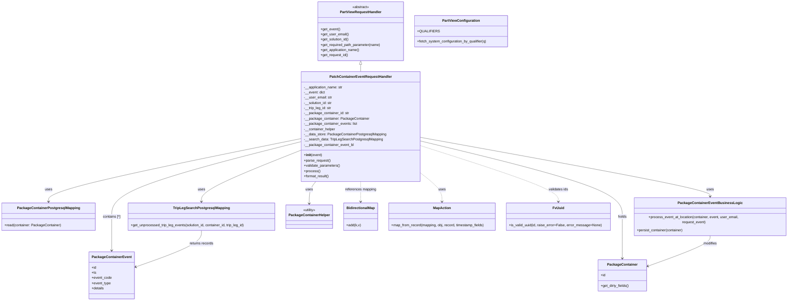

# Diagram: partview_core/partview_service/partview_service/api/trip_leg_to_events/handlers/patch_trip_leg_to_events.py


> Auto-generated by Obscura crawlers

## Diagram 1



### SVG

<svg id="container" width="3572.0078125" xmlns="http://www.w3.org/2000/svg" class="classDiagram" height="1354" viewBox="0 0 3572.0078125 1354" role="graphics-document document" aria-roledescription="class"><style>#container{font-family:"trebuchet ms",verdana,arial,sans-serif;font-size:16px;fill:#333;}@keyframes edge-animation-frame{from{stroke-dashoffset:0;}}@keyframes dash{to{stroke-dashoffset:0;}}#container .edge-animation-slow{stroke-dasharray:9,5!important;stroke-dashoffset:900;animation:dash 50s linear infinite;stroke-linecap:round;}#container .edge-animation-fast{stroke-dasharray:9,5!important;stroke-dashoffset:900;animation:dash 20s linear infinite;stroke-linecap:round;}#container .error-icon{fill:#552222;}#container .error-text{fill:#552222;stroke:#552222;}#container .edge-thickness-normal{stroke-width:1px;}#container .edge-thickness-thick{stroke-width:3.5px;}#container .edge-pattern-solid{stroke-dasharray:0;}#container .edge-thickness-invisible{stroke-width:0;fill:none;}#container .edge-pattern-dashed{stroke-dasharray:3;}#container .edge-pattern-dotted{stroke-dasharray:2;}#container .marker{fill:#333333;stroke:#333333;}#container .marker.cross{stroke:#333333;}#container svg{font-family:"trebuchet ms",verdana,arial,sans-serif;font-size:16px;}#container p{margin:0;}#container g.classGroup text{fill:#9370DB;stroke:none;font-family:"trebuchet ms",verdana,arial,sans-serif;font-size:10px;}#container g.classGroup text .title{font-weight:bolder;}#container .nodeLabel,#container .edgeLabel{color:#131300;}#container .edgeLabel .label rect{fill:#ECECFF;}#container .label text{fill:#131300;}#container .labelBkg{background:#ECECFF;}#container .edgeLabel .label span{background:#ECECFF;}#container .classTitle{font-weight:bolder;}#container .node rect,#container .node circle,#container .node ellipse,#container .node polygon,#container .node path{fill:#ECECFF;stroke:#9370DB;stroke-width:1px;}#container .divider{stroke:#9370DB;stroke-width:1;}#container g.clickable{cursor:pointer;}#container g.classGroup rect{fill:#ECECFF;stroke:#9370DB;}#container g.classGroup line{stroke:#9370DB;stroke-width:1;}#container .classLabel .box{stroke:none;stroke-width:0;fill:#ECECFF;opacity:0.5;}#container .classLabel .label{fill:#9370DB;font-size:10px;}#container .relation{stroke:#333333;stroke-width:1;fill:none;}#container .dashed-line{stroke-dasharray:3;}#container .dotted-line{stroke-dasharray:1 2;}#container #compositionStart,#container .composition{fill:#333333!important;stroke:#333333!important;stroke-width:1;}#container #compositionEnd,#container .composition{fill:#333333!important;stroke:#333333!important;stroke-width:1;}#container #dependencyStart,#container .dependency{fill:#333333!important;stroke:#333333!important;stroke-width:1;}#container #dependencyStart,#container .dependency{fill:#333333!important;stroke:#333333!important;stroke-width:1;}#container #extensionStart,#container .extension{fill:transparent!important;stroke:#333333!important;stroke-width:1;}#container #extensionEnd,#container .extension{fill:transparent!important;stroke:#333333!important;stroke-width:1;}#container #aggregationStart,#container .aggregation{fill:transparent!important;stroke:#333333!important;stroke-width:1;}#container #aggregationEnd,#container .aggregation{fill:transparent!important;stroke:#333333!important;stroke-width:1;}#container #lollipopStart,#container .lollipop{fill:#ECECFF!important;stroke:#333333!important;stroke-width:1;}#container #lollipopEnd,#container .lollipop{fill:#ECECFF!important;stroke:#333333!important;stroke-width:1;}#container .edgeTerminals{font-size:11px;line-height:initial;}#container .classTitleText{text-anchor:middle;font-size:18px;fill:#333;}#container .label-icon{display:inline-block;height:1em;overflow:visible;vertical-align:-0.125em;}#container .node .label-icon path{fill:currentColor;stroke:revert;stroke-width:revert;}#container :root{--mermaid-font-family:"trebuchet ms",verdana,arial,sans-serif;}</style><g><defs><marker id="container_class-aggregationStart" class="marker aggregation class" refX="18" refY="7" markerWidth="190" markerHeight="240" orient="auto"><path d="M 18,7 L9,13 L1,7 L9,1 Z"></path></marker></defs><defs><marker id="container_class-aggregationEnd" class="marker aggregation class" refX="1" refY="7" markerWidth="20" markerHeight="28" orient="auto"><path d="M 18,7 L9,13 L1,7 L9,1 Z"></path></marker></defs><defs><marker id="container_class-extensionStart" class="marker extension class" refX="18" refY="7" markerWidth="190" markerHeight="240" orient="auto"><path d="M 1,7 L18,13 V 1 Z"></path></marker></defs><defs><marker id="container_class-extensionEnd" class="marker extension class" refX="1" refY="7" markerWidth="20" markerHeight="28" orient="auto"><path d="M 1,1 V 13 L18,7 Z"></path></marker></defs><defs><marker id="container_class-compositionStart" class="marker composition class" refX="18" refY="7" markerWidth="190" markerHeight="240" orient="auto"><path d="M 18,7 L9,13 L1,7 L9,1 Z"></path></marker></defs><defs><marker id="container_class-compositionEnd" class="marker composition class" refX="1" refY="7" markerWidth="20" markerHeight="28" orient="auto"><path d="M 18,7 L9,13 L1,7 L9,1 Z"></path></marker></defs><defs><marker id="container_class-dependencyStart" class="marker dependency class" refX="6" refY="7" markerWidth="190" markerHeight="240" orient="auto"><path d="M 5,7 L9,13 L1,7 L9,1 Z"></path></marker></defs><defs><marker id="container_class-dependencyEnd" class="marker dependency class" refX="13" refY="7" markerWidth="20" markerHeight="28" orient="auto"><path d="M 18,7 L9,13 L14,7 L9,1 Z"></path></marker></defs><defs><marker id="container_class-lollipopStart" class="marker lollipop class" refX="13" refY="7" markerWidth="190" markerHeight="240" orient="auto"><circle stroke="black" fill="transparent" cx="7" cy="7" r="6"></circle></marker></defs><defs><marker id="container_class-lollipopEnd" class="marker lollipop class" refX="1" refY="7" markerWidth="190" markerHeight="240" orient="auto"><circle stroke="black" fill="transparent" cx="7" cy="7" r="6"></circle></marker></defs><g class="root"><g class="clusters"></g><g class="edgePaths"><path d="M1631.176,295.25L1631.176,296.542C1631.176,297.833,1631.176,300.417,1631.176,305.875C1631.176,311.333,1631.176,319.667,1631.176,323.833L1631.176,328" id="id_PartViewRequestHandler_PatchContainerEventRequestHandler_1" class="edge-thickness-normal edge-pattern-solid relation" style=";;;" data-edge="true" data-et="edge" data-id="id_PartViewRequestHandler_PatchContainerEventRequestHandler_1" data-points="W3sieCI6MTYzMS4xNzU3ODEyNSwieSI6Mjc4fSx7IngiOjE2MzEuMTc1NzgxMjUsInkiOjMwM30seyJ4IjoxNjMxLjE3NTc4MTI1LCJ5IjozMjh9XQ==" marker-start="url(#container_class-extensionStart)"></path><path d="M1364.805,634.411L1173.399,673.509C981.993,712.607,599.182,790.804,407.777,837.069C216.371,883.333,216.371,897.667,216.371,904.833L216.371,912" id="id_PatchContainerEventRequestHandler_PackageContainerPostgresqlMapping_2" class="edge-thickness-normal edge-pattern-solid relation" style=";;;" data-edge="true" data-et="edge" data-id="id_PatchContainerEventRequestHandler_PackageContainerPostgresqlMapping_2" data-points="W3sieCI6MTM2NC44MDQ2ODc1LCJ5Ijo2MzQuNDExMjE3ODY5MDc0Mn0seyJ4IjoyMTYuMzcxMDkzNzUsInkiOjg2OX0seyJ4IjoyMTYuMzcxMDkzNzUsInkiOjkxOH1d" marker-end="url(#container_class-dependencyEnd)"></path><path d="M1364.805,687.458L1289.803,717.715C1214.801,747.972,1064.797,808.486,989.795,845.91C914.793,883.333,914.793,897.667,914.793,904.833L914.793,912" id="id_PatchContainerEventRequestHandler_TripLegSearchPostgresqlMapping_3" class="edge-thickness-normal edge-pattern-solid relation" style=";;;" data-edge="true" data-et="edge" data-id="id_PatchContainerEventRequestHandler_TripLegSearchPostgresqlMapping_3" data-points="W3sieCI6MTM2NC44MDQ2ODc1LCJ5Ijo2ODcuNDU4MjUzODE0MTkyNH0seyJ4Ijo5MTQuNzkyOTY4NzUsInkiOjg2OX0seyJ4Ijo5MTQuNzkyOTY4NzUsInkiOjkxOH1d" marker-end="url(#container_class-dependencyEnd)"></path><path d="M1897.547,628.445L2117.993,668.537C2338.439,708.63,2779.331,788.815,2999.777,834.074C3220.223,879.333,3220.223,889.667,3220.223,894.833L3220.223,900" id="id_PatchContainerEventRequestHandler_PackageContainerEventBusinessLogic_4" class="edge-thickness-normal edge-pattern-solid relation" style=";;;" data-edge="true" data-et="edge" data-id="id_PatchContainerEventRequestHandler_PackageContainerEventBusinessLogic_4" data-points="W3sieCI6MTg5Ny41NDY4NzUsInkiOjYyOC40NDQ5MTgzMzc0NDY4fSx7IngiOjMyMjAuMjIyNjU2MjUsInkiOjg2OX0seyJ4IjozMjIwLjIyMjY1NjI1LCJ5Ijo5MDZ9XQ==" marker-end="url(#container_class-dependencyEnd)"></path><path d="M1432.608,832L1427.749,838.167C1422.89,844.333,1413.171,856.667,1408.312,871.5C1403.453,886.333,1403.453,903.667,1403.453,912.333L1403.453,921" id="id_PatchContainerEventRequestHandler_PackageContainerHelper_5" class="edge-thickness-normal edge-pattern-solid relation" style=";;;" data-edge="true" data-et="edge" data-id="id_PatchContainerEventRequestHandler_PackageContainerHelper_5" data-points="W3sieCI6MTQzMi42MDc5Mjg3NDEzNDk1LCJ5Ijo4MzJ9LHsieCI6MTQwMy40NTMxMjUsInkiOjg2OX0seyJ4IjoxNDAzLjQ1MzEyNSwieSI6OTI3fV0=" marker-end="url(#container_class-dependencyEnd)"></path><path d="M1897.547,644.686L2051.497,682.072C2205.448,719.457,2513.349,794.229,2667.299,850.281C2821.25,906.333,2821.25,943.667,2821.25,981C2821.25,1018.333,2821.25,1055.667,2821.25,1085.5C2821.25,1115.333,2821.25,1137.667,2821.25,1148.833L2821.25,1160" id="id_PatchContainerEventRequestHandler_PackageContainer_6" class="edge-thickness-normal edge-pattern-solid relation" style=";;;" data-edge="true" data-et="edge" data-id="id_PatchContainerEventRequestHandler_PackageContainer_6" data-points="W3sieCI6MTg5Ny41NDY4NzUsInkiOjY0NC42ODYwODgzODA3Nzk4fSx7IngiOjI4MjEuMjUsInkiOjg2OX0seyJ4IjoyODIxLjI1LCJ5Ijo5ODF9LHsieCI6MjgyMS4yNSwieSI6MTA5M30seyJ4IjoyODIxLjI1LCJ5IjoxMTY2fV0=" marker-end="url(#container_class-dependencyEnd)"></path><path d="M1364.805,648.14L1220.908,684.95C1077.01,721.76,789.216,795.38,645.319,850.857C501.422,906.333,501.422,943.667,501.422,981C501.422,1018.333,501.422,1055.667,501.422,1079.5C501.422,1103.333,501.422,1113.667,501.422,1118.833L501.422,1124" id="id_PatchContainerEventRequestHandler_PackageContainerEvent_7" class="edge-thickness-normal edge-pattern-solid relation" style=";;;" data-edge="true" data-et="edge" data-id="id_PatchContainerEventRequestHandler_PackageContainerEvent_7" data-points="W3sieCI6MTM2NC44MDQ2ODc1LCJ5Ijo2NDguMTM5ODM2MTc4MzcxM30seyJ4Ijo1MDEuNDIxODc1LCJ5Ijo4Njl9LHsieCI6NTAxLjQyMTg3NSwieSI6OTgxfSx7IngiOjUwMS40MjE4NzUsInkiOjEwOTN9LHsieCI6NTAxLjQyMTg3NSwieSI6MTEzMH1d" marker-end="url(#container_class-dependencyEnd)"></path><path d="M1897.547,787.087L1915.107,800.739C1932.668,814.391,1967.789,841.696,1985.35,862.514C2002.91,883.333,2002.91,897.667,2002.91,904.833L2002.91,912" id="id_PatchContainerEventRequestHandler_MapAction_8" class="edge-thickness-normal edge-pattern-dashed relation" style=";;;" data-edge="true" data-et="edge" data-id="id_PatchContainerEventRequestHandler_MapAction_8" data-points="W3sieCI6MTg5Ny41NDY4NzUsInkiOjc4Ny4wODY3MDI5NTQ4OTg5fSx7IngiOjIwMDIuOTEwMTU2MjUsInkiOjg2OX0seyJ4IjoyMDAyLjkxMDE1NjI1LCJ5Ijo5MTh9XQ==" marker-end="url(#container_class-dependencyEnd)"></path><path d="M1631.176,832L1631.176,838.167C1631.176,844.333,1631.176,856.667,1631.176,870C1631.176,883.333,1631.176,897.667,1631.176,904.833L1631.176,912" id="id_PatchContainerEventRequestHandler_BidirectionalMap_9" class="edge-thickness-normal edge-pattern-dashed relation" style=";;;" data-edge="true" data-et="edge" data-id="id_PatchContainerEventRequestHandler_BidirectionalMap_9" data-points="W3sieCI6MTYzMS4xNzU3ODEyNSwieSI6ODMyfSx7IngiOjE2MzEuMTc1NzgxMjUsInkiOjg2OX0seyJ4IjoxNjMxLjE3NTc4MTI1LCJ5Ijo5MTh9XQ==" marker-end="url(#container_class-dependencyEnd)"></path><path d="M1897.547,665.411L2003.368,699.343C2109.19,733.274,2320.833,801.137,2426.655,842.235C2532.477,883.333,2532.477,897.667,2532.477,904.833L2532.477,912" id="id_PatchContainerEventRequestHandler_FvUuid_10" class="edge-thickness-normal edge-pattern-dashed relation" style=";;;" data-edge="true" data-et="edge" data-id="id_PatchContainerEventRequestHandler_FvUuid_10" data-points="W3sieCI6MTg5Ny41NDY4NzUsInkiOjY2NS40MTEyNzE5MDMwMjIxfSx7IngiOjI1MzIuNDc2NTYyNSwieSI6ODY5fSx7IngiOjI1MzIuNDc2NTYyNSwieSI6OTE4fV0=" marker-end="url(#container_class-dependencyEnd)"></path><path d="M3220.223,1056L3220.223,1062.167C3220.223,1068.333,3220.223,1080.667,3172.941,1104.017C3125.658,1127.368,3031.094,1161.736,2983.812,1178.92L2936.53,1196.103" id="id_PackageContainerEventBusinessLogic_PackageContainer_11" class="edge-thickness-normal edge-pattern-solid relation" style=";;;" data-edge="true" data-et="edge" data-id="id_PackageContainerEventBusinessLogic_PackageContainer_11" data-points="W3sieCI6MzIyMC4yMjI2NTYyNSwieSI6MTA1Nn0seyJ4IjozMjIwLjIyMjY1NjI1LCJ5IjoxMDkzfSx7IngiOjI5MzAuODkwNjI1LCJ5IjoxMTk4LjE1MjkzMTg0NjQ0MTZ9XQ==" marker-end="url(#container_class-dependencyEnd)"></path><path d="M914.793,1044L914.793,1052.167C914.793,1060.333,914.793,1076.667,863.586,1102.795C812.379,1128.924,709.966,1164.848,658.759,1182.81L607.552,1200.772" id="id_TripLegSearchPostgresqlMapping_PackageContainerEvent_12" class="edge-thickness-normal edge-pattern-solid relation" style=";;;" data-edge="true" data-et="edge" data-id="id_TripLegSearchPostgresqlMapping_PackageContainerEvent_12" data-points="W3sieCI6OTE0Ljc5Mjk2ODc1LCJ5IjoxMDQ0fSx7IngiOjkxNC43OTI5Njg3NSwieSI6MTA5M30seyJ4Ijo2MDEuODkwNjI1LCJ5IjoxMjAyLjc1ODEzMzg2NTAzODl9XQ==" marker-end="url(#container_class-dependencyEnd)"></path></g><g class="edgeLabels"><g class="edgeLabel"><g class="label" data-id="id_PartViewRequestHandler_PatchContainerEventRequestHandler_1" transform="translate(0, 0)"><foreignObject width="0" height="0"><div xmlns="http://www.w3.org/1999/xhtml" class="labelBkg" style="display: table-cell; white-space: nowrap; line-height: 1.5; max-width: 200px; text-align: center;"><span class="edgeLabel"></span></div></foreignObject></g></g><g class="edgeLabel" transform="translate(216.37109375, 869)"><g class="label" data-id="id_PatchContainerEventRequestHandler_PackageContainerPostgresqlMapping_2" transform="translate(-16.4921875, -12)"><foreignObject width="32.984375" height="24"><div xmlns="http://www.w3.org/1999/xhtml" class="labelBkg" style="display: table-cell; white-space: nowrap; line-height: 1.5; max-width: 200px; text-align: center;"><span class="edgeLabel"><p>uses</p></span></div></foreignObject></g></g><g class="edgeLabel" transform="translate(914.79296875, 869)"><g class="label" data-id="id_PatchContainerEventRequestHandler_TripLegSearchPostgresqlMapping_3" transform="translate(-16.4921875, -12)"><foreignObject width="32.984375" height="24"><div xmlns="http://www.w3.org/1999/xhtml" class="labelBkg" style="display: table-cell; white-space: nowrap; line-height: 1.5; max-width: 200px; text-align: center;"><span class="edgeLabel"><p>uses</p></span></div></foreignObject></g></g><g class="edgeLabel" transform="translate(3220.22265625, 869)"><g class="label" data-id="id_PatchContainerEventRequestHandler_PackageContainerEventBusinessLogic_4" transform="translate(-16.4921875, -12)"><foreignObject width="32.984375" height="24"><div xmlns="http://www.w3.org/1999/xhtml" class="labelBkg" style="display: table-cell; white-space: nowrap; line-height: 1.5; max-width: 200px; text-align: center;"><span class="edgeLabel"><p>uses</p></span></div></foreignObject></g></g><g class="edgeLabel" transform="translate(1403.453125, 869)"><g class="label" data-id="id_PatchContainerEventRequestHandler_PackageContainerHelper_5" transform="translate(-16.4921875, -12)"><foreignObject width="32.984375" height="24"><div xmlns="http://www.w3.org/1999/xhtml" class="labelBkg" style="display: table-cell; white-space: nowrap; line-height: 1.5; max-width: 200px; text-align: center;"><span class="edgeLabel"><p>uses</p></span></div></foreignObject></g></g><g class="edgeLabel" transform="translate(2821.25, 981)"><g class="label" data-id="id_PatchContainerEventRequestHandler_PackageContainer_6" transform="translate(-20.1875, -12)"><foreignObject width="40.375" height="24"><div xmlns="http://www.w3.org/1999/xhtml" class="labelBkg" style="display: table-cell; white-space: nowrap; line-height: 1.5; max-width: 200px; text-align: center;"><span class="edgeLabel"><p>holds</p></span></div></foreignObject></g></g><g class="edgeLabel" transform="translate(501.421875, 981)"><g class="label" data-id="id_PatchContainerEventRequestHandler_PackageContainerEvent_7" transform="translate(-41.6796875, -12)"><foreignObject width="83.359375" height="24"><div xmlns="http://www.w3.org/1999/xhtml" class="labelBkg" style="display: table-cell; white-space: nowrap; line-height: 1.5; max-width: 200px; text-align: center;"><span class="edgeLabel"><p>contains [*]</p></span></div></foreignObject></g></g><g class="edgeLabel" transform="translate(2002.91015625, 869)"><g class="label" data-id="id_PatchContainerEventRequestHandler_MapAction_8" transform="translate(-16.4921875, -12)"><foreignObject width="32.984375" height="24"><div xmlns="http://www.w3.org/1999/xhtml" class="labelBkg" style="display: table-cell; white-space: nowrap; line-height: 1.5; max-width: 200px; text-align: center;"><span class="edgeLabel"><p>uses</p></span></div></foreignObject></g></g><g class="edgeLabel" transform="translate(1631.17578125, 869)"><g class="label" data-id="id_PatchContainerEventRequestHandler_BidirectionalMap_9" transform="translate(-71.765625, -12)"><foreignObject width="143.53125" height="24"><div xmlns="http://www.w3.org/1999/xhtml" class="labelBkg" style="display: table-cell; white-space: nowrap; line-height: 1.5; max-width: 200px; text-align: center;"><span class="edgeLabel"><p>references mapping</p></span></div></foreignObject></g></g><g class="edgeLabel" transform="translate(2532.4765625, 869)"><g class="label" data-id="id_PatchContainerEventRequestHandler_FvUuid_10" transform="translate(-45.578125, -12)"><foreignObject width="91.15625" height="24"><div xmlns="http://www.w3.org/1999/xhtml" class="labelBkg" style="display: table-cell; white-space: nowrap; line-height: 1.5; max-width: 200px; text-align: center;"><span class="edgeLabel"><p>validates ids</p></span></div></foreignObject></g></g><g class="edgeLabel" transform="translate(3220.22265625, 1093)"><g class="label" data-id="id_PackageContainerEventBusinessLogic_PackageContainer_11" transform="translate(-31.265625, -12)"><foreignObject width="62.53125" height="24"><div xmlns="http://www.w3.org/1999/xhtml" class="labelBkg" style="display: table-cell; white-space: nowrap; line-height: 1.5; max-width: 200px; text-align: center;"><span class="edgeLabel"><p>modifies</p></span></div></foreignObject></g></g><g class="edgeLabel" transform="translate(914.79296875, 1093)"><g class="label" data-id="id_TripLegSearchPostgresqlMapping_PackageContainerEvent_12" transform="translate(-55.296875, -12)"><foreignObject width="110.59375" height="24"><div xmlns="http://www.w3.org/1999/xhtml" class="labelBkg" style="display: table-cell; white-space: nowrap; line-height: 1.5; max-width: 200px; text-align: center;"><span class="edgeLabel"><p>returns records</p></span></div></foreignObject></g></g></g><g class="nodes"><g class="node default" id="classId-PartViewRequestHandler-0" transform="translate(1631.17578125, 143)"><g class="basic label-container"><path d="M-195.984375 -135 L195.984375 -135 L195.984375 135 L-195.984375 135" stroke="none" stroke-width="0" fill="#ECECFF" style=""></path><path d="M-195.984375 -135 C-40.97584636441806 -135, 114.03268227116388 -135, 195.984375 -135 M-195.984375 -135 C-70.77926045948642 -135, 54.425854081027154 -135, 195.984375 -135 M195.984375 -135 C195.984375 -36.95006234659783, 195.984375 61.099875306804336, 195.984375 135 M195.984375 -135 C195.984375 -73.55276422599792, 195.984375 -12.105528451995838, 195.984375 135 M195.984375 135 C113.89661269599256 135, 31.808850391985118 135, -195.984375 135 M195.984375 135 C95.35503377543894 135, -5.274307449122119 135, -195.984375 135 M-195.984375 135 C-195.984375 44.83216417106799, -195.984375 -45.335671657864026, -195.984375 -135 M-195.984375 135 C-195.984375 79.46140529829529, -195.984375 23.92281059659058, -195.984375 -135" stroke="#9370DB" stroke-width="1.3" fill="none" stroke-dasharray="0 0" style=""></path></g><g class="annotation-group text" transform="translate(-38.609375, -111)"><g class="label" style="" transform="translate(0,-12)"><foreignObject width="77.21875" height="24"><div xmlns="http://www.w3.org/1999/xhtml" style="display: table-cell; white-space: nowrap; line-height: 1.5; max-width: 127px; text-align: center;"><span class="nodeLabel markdown-node-label" style=""><p>«abstract»</p></span></div></foreignObject></g></g><g class="label-group text" transform="translate(-91.359375, -87)"><g class="label" style="font-weight: bolder" transform="translate(0,-12)"><foreignObject width="182.71875" height="24"><div xmlns="http://www.w3.org/1999/xhtml" style="display: table-cell; white-space: nowrap; line-height: 1.5; max-width: 231px; text-align: center;"><span class="nodeLabel markdown-node-label" style=""><p>PartViewRequestHandler</p></span></div></foreignObject></g></g><g class="members-group text" transform="translate(-183.984375, -39)"></g><g class="methods-group text" transform="translate(-183.984375, -9)"><g class="label" style="" transform="translate(0,-12)"><foreignObject width="89.25" height="24"><div xmlns="http://www.w3.org/1999/xhtml" style="display: table-cell; white-space: nowrap; line-height: 1.5; max-width: 147px; text-align: center;"><span class="nodeLabel markdown-node-label" style=""><p>+get_event()</p></span></div></foreignObject></g><g class="label" style="" transform="translate(0,12)"><foreignObject width="127.65625" height="24"><div xmlns="http://www.w3.org/1999/xhtml" style="display: table-cell; white-space: nowrap; line-height: 1.5; max-width: 185px; text-align: center;"><span class="nodeLabel markdown-node-label" style=""><p>+get_user_email()</p></span></div></foreignObject></g><g class="label" style="" transform="translate(0,36)"><foreignObject width="131.46875" height="24"><div xmlns="http://www.w3.org/1999/xhtml" style="display: table-cell; white-space: nowrap; line-height: 1.5; max-width: 189px; text-align: center;"><span class="nodeLabel markdown-node-label" style=""><p>+get_solution_id()</p></span></div></foreignObject></g><g class="label" style="" transform="translate(0,60)"><foreignObject width="276.609375" height="24"><div xmlns="http://www.w3.org/1999/xhtml" style="display: table-cell; white-space: nowrap; line-height: 1.5; max-width: 334px; text-align: center;"><span class="nodeLabel markdown-node-label" style=""><p>+get_required_path_parameter(name)</p></span></div></foreignObject></g><g class="label" style="" transform="translate(0,84)"><foreignObject width="179.859375" height="24"><div xmlns="http://www.w3.org/1999/xhtml" style="display: table-cell; white-space: nowrap; line-height: 1.5; max-width: 237px; text-align: center;"><span class="nodeLabel markdown-node-label" style=""><p>+get_application_name()</p></span></div></foreignObject></g><g class="label" style="" transform="translate(0,108)"><foreignObject width="126.90625" height="24"><div xmlns="http://www.w3.org/1999/xhtml" style="display: table-cell; white-space: nowrap; line-height: 1.5; max-width: 184px; text-align: center;"><span class="nodeLabel markdown-node-label" style=""><p>+get_request_id()</p></span></div></foreignObject></g></g><g class="divider" style=""><path d="M-195.984375 -63 C-43.52740852252495 -63, 108.9295579549501 -63, 195.984375 -63 M-195.984375 -63 C-72.49349937549658 -63, 50.997376249006834 -63, 195.984375 -63" stroke="#9370DB" stroke-width="1.3" fill="none" stroke-dasharray="0 0" style=""></path></g><g class="divider" style=""><path d="M-195.984375 -39 C-82.4829766029358 -39, 31.018421794128386 -39, 195.984375 -39 M-195.984375 -39 C-106.2454750131351 -39, -16.506575026270212 -39, 195.984375 -39" stroke="#9370DB" stroke-width="1.3" fill="none" stroke-dasharray="0 0" style=""></path></g></g><g class="node default" id="classId-PatchContainerEventRequestHandler-1" transform="translate(1631.17578125, 580)"><g class="basic label-container"><path d="M-266.37109375 -252 L266.37109375 -252 L266.37109375 252 L-266.37109375 252" stroke="none" stroke-width="0" fill="#ECECFF" style=""></path><path d="M-266.37109375 -252 C-69.25366853441471 -252, 127.86375668117057 -252, 266.37109375 -252 M-266.37109375 -252 C-104.95374425267332 -252, 56.463605244653365 -252, 266.37109375 -252 M266.37109375 -252 C266.37109375 -146.1536250515663, 266.37109375 -40.30725010313262, 266.37109375 252 M266.37109375 -252 C266.37109375 -146.76230161410203, 266.37109375 -41.52460322820406, 266.37109375 252 M266.37109375 252 C73.40103813581729 252, -119.56901747836542 252, -266.37109375 252 M266.37109375 252 C89.63884583204299 252, -87.09340208591402 252, -266.37109375 252 M-266.37109375 252 C-266.37109375 58.45049882005131, -266.37109375 -135.09900235989738, -266.37109375 -252 M-266.37109375 252 C-266.37109375 132.44784268352794, -266.37109375 12.895685367055876, -266.37109375 -252" stroke="#9370DB" stroke-width="1.3" fill="none" stroke-dasharray="0 0" style=""></path></g><g class="annotation-group text" transform="translate(0, -228)"></g><g class="label-group text" transform="translate(-135.0390625, -228)"><g class="label" style="font-weight: bolder" transform="translate(0,-12)"><foreignObject width="270.078125" height="24"><div xmlns="http://www.w3.org/1999/xhtml" style="display: table-cell; white-space: nowrap; line-height: 1.5; max-width: 318px; text-align: center;"><span class="nodeLabel markdown-node-label" style=""><p>PatchContainerEventRequestHandler</p></span></div></foreignObject></g></g><g class="members-group text" transform="translate(-254.37109375, -180)"><g class="label" style="" transform="translate(0,-12)"><foreignObject width="179.78125" height="24"><div xmlns="http://www.w3.org/1999/xhtml" style="display: table-cell; white-space: nowrap; line-height: 1.5; max-width: 238px; text-align: center;"><span class="nodeLabel markdown-node-label" style=""><p>-__application_name: str</p></span></div></foreignObject></g><g class="label" style="" transform="translate(0,12)"><foreignObject width="97.3125" height="24"><div xmlns="http://www.w3.org/1999/xhtml" style="display: table-cell; white-space: nowrap; line-height: 1.5; max-width: 155px; text-align: center;"><span class="nodeLabel markdown-node-label" style=""><p>-__event: dict</p></span></div></foreignObject></g><g class="label" style="" transform="translate(0,36)"><foreignObject width="127.734375" height="24"><div xmlns="http://www.w3.org/1999/xhtml" style="display: table-cell; white-space: nowrap; line-height: 1.5; max-width: 186px; text-align: center;"><span class="nodeLabel markdown-node-label" style=""><p>-__user_email: str</p></span></div></foreignObject></g><g class="label" style="" transform="translate(0,60)"><foreignObject width="131.390625" height="24"><div xmlns="http://www.w3.org/1999/xhtml" style="display: table-cell; white-space: nowrap; line-height: 1.5; max-width: 190px; text-align: center;"><span class="nodeLabel markdown-node-label" style=""><p>-__solution_id: str</p></span></div></foreignObject></g><g class="label" style="" transform="translate(0,84)"><foreignObject width="126.765625" height="24"><div xmlns="http://www.w3.org/1999/xhtml" style="display: table-cell; white-space: nowrap; line-height: 1.5; max-width: 185px; text-align: center;"><span class="nodeLabel markdown-node-label" style=""><p>-__trip_leg_id: str</p></span></div></foreignObject></g><g class="label" style="" transform="translate(0,108)"><foreignObject width="206.140625" height="24"><div xmlns="http://www.w3.org/1999/xhtml" style="display: table-cell; white-space: nowrap; line-height: 1.5; max-width: 264px; text-align: center;"><span class="nodeLabel markdown-node-label" style=""><p>-__package_container_id: str</p></span></div></foreignObject></g><g class="label" style="" transform="translate(0,132)"><foreignObject width="294.3125" height="24"><div xmlns="http://www.w3.org/1999/xhtml" style="display: table-cell; white-space: nowrap; line-height: 1.5; max-width: 352px; text-align: center;"><span class="nodeLabel markdown-node-label" style=""><p>-__package_container: PackageContainer</p></span></div></foreignObject></g><g class="label" style="" transform="translate(0,156)"><foreignObject width="242.5625" height="24"><div xmlns="http://www.w3.org/1999/xhtml" style="display: table-cell; white-space: nowrap; line-height: 1.5; max-width: 300px; text-align: center;"><span class="nodeLabel markdown-node-label" style=""><p>-__package_container_events: list</p></span></div></foreignObject></g><g class="label" style="" transform="translate(0,180)"><foreignObject width="144.765625" height="24"><div xmlns="http://www.w3.org/1999/xhtml" style="display: table-cell; white-space: nowrap; line-height: 1.5; max-width: 203px; text-align: center;"><span class="nodeLabel markdown-node-label" style=""><p>-__container_helper</p></span></div></foreignObject></g><g class="label" style="" transform="translate(0,204)"><foreignObject width="373.703125" height="24"><div xmlns="http://www.w3.org/1999/xhtml" style="display: table-cell; white-space: nowrap; line-height: 1.5; max-width: 432px; text-align: center;"><span class="nodeLabel markdown-node-label" style=""><p>-__data_store: PackageContainerPostgresqlMapping</p></span></div></foreignObject></g><g class="label" style="" transform="translate(0,228)"><foreignObject width="357.125" height="24"><div xmlns="http://www.w3.org/1999/xhtml" style="display: table-cell; white-space: nowrap; line-height: 1.5; max-width: 415px; text-align: center;"><span class="nodeLabel markdown-node-label" style=""><p>-__search_data: TripLegSearchPostgresqlMapping</p></span></div></foreignObject></g><g class="label" style="" transform="translate(0,252)"><foreignObject width="227.078125" height="24"><div xmlns="http://www.w3.org/1999/xhtml" style="display: table-cell; white-space: nowrap; line-height: 1.5; max-width: 285px; text-align: center;"><span class="nodeLabel markdown-node-label" style=""><p>-__package_container_event_bl</p></span></div></foreignObject></g></g><g class="methods-group text" transform="translate(-254.37109375, 132)"><g class="label" style="" transform="translate(0,-12)"><foreignObject width="83.140625" height="24"><div xmlns="http://www.w3.org/1999/xhtml" style="display: table-cell; white-space: nowrap; line-height: 1.5; max-width: 172px; text-align: center;"><span class="nodeLabel markdown-node-label" style=""><p>+<strong>init</strong>(event)</p></span></div></foreignObject></g><g class="label" style="" transform="translate(0,12)"><foreignObject width="121.796875" height="24"><div xmlns="http://www.w3.org/1999/xhtml" style="display: table-cell; white-space: nowrap; line-height: 1.5; max-width: 179px; text-align: center;"><span class="nodeLabel markdown-node-label" style=""><p>+parse_request()</p></span></div></foreignObject></g><g class="label" style="" transform="translate(0,36)"><foreignObject width="166.546875" height="24"><div xmlns="http://www.w3.org/1999/xhtml" style="display: table-cell; white-space: nowrap; line-height: 1.5; max-width: 224px; text-align: center;"><span class="nodeLabel markdown-node-label" style=""><p>+validate_parameters()</p></span></div></foreignObject></g><g class="label" style="" transform="translate(0,60)"><foreignObject width="73.734375" height="24"><div xmlns="http://www.w3.org/1999/xhtml" style="display: table-cell; white-space: nowrap; line-height: 1.5; max-width: 131px; text-align: center;"><span class="nodeLabel markdown-node-label" style=""><p>+process()</p></span></div></foreignObject></g><g class="label" style="" transform="translate(0,84)"><foreignObject width="117.015625" height="24"><div xmlns="http://www.w3.org/1999/xhtml" style="display: table-cell; white-space: nowrap; line-height: 1.5; max-width: 174px; text-align: center;"><span class="nodeLabel markdown-node-label" style=""><p>+format_result()</p></span></div></foreignObject></g></g><g class="divider" style=""><path d="M-266.37109375 -204 C-145.82674731897072 -204, -25.282400887941407 -204, 266.37109375 -204 M-266.37109375 -204 C-147.56572485816315 -204, -28.76035596632633 -204, 266.37109375 -204" stroke="#9370DB" stroke-width="1.3" fill="none" stroke-dasharray="0 0" style=""></path></g><g class="divider" style=""><path d="M-266.37109375 108 C-74.55074332921723 108, 117.26960709156555 108, 266.37109375 108 M-266.37109375 108 C-81.4409172983097 108, 103.4892591533806 108, 266.37109375 108" stroke="#9370DB" stroke-width="1.3" fill="none" stroke-dasharray="0 0" style=""></path></g></g><g class="node default" id="classId-PackageContainer-2" transform="translate(2821.25, 1238)"><g class="basic label-container"><path d="M-109.640625 -72 L109.640625 -72 L109.640625 72 L-109.640625 72" stroke="none" stroke-width="0" fill="#ECECFF" style=""></path><path d="M-109.640625 -72 C-64.13961015544152 -72, -18.638595310883034 -72, 109.640625 -72 M-109.640625 -72 C-44.04551848805801 -72, 21.549588023883985 -72, 109.640625 -72 M109.640625 -72 C109.640625 -17.258668511617692, 109.640625 37.482662976764615, 109.640625 72 M109.640625 -72 C109.640625 -32.4931039167532, 109.640625 7.013792166493602, 109.640625 72 M109.640625 72 C31.688684152657473 72, -46.263256694685055 72, -109.640625 72 M109.640625 72 C37.431465670119294 72, -34.77769365976141 72, -109.640625 72 M-109.640625 72 C-109.640625 24.865925931386656, -109.640625 -22.26814813722669, -109.640625 -72 M-109.640625 72 C-109.640625 24.493766424395346, -109.640625 -23.012467151209307, -109.640625 -72" stroke="#9370DB" stroke-width="1.3" fill="none" stroke-dasharray="0 0" style=""></path></g><g class="annotation-group text" transform="translate(0, -48)"></g><g class="label-group text" transform="translate(-65.453125, -48)"><g class="label" style="font-weight: bolder" transform="translate(0,-12)"><foreignObject width="130.90625" height="24"><div xmlns="http://www.w3.org/1999/xhtml" style="display: table-cell; white-space: nowrap; line-height: 1.5; max-width: 179px; text-align: center;"><span class="nodeLabel markdown-node-label" style=""><p>PackageContainer</p></span></div></foreignObject></g></g><g class="members-group text" transform="translate(-97.640625, 0)"><g class="label" style="" transform="translate(0,-12)"><foreignObject width="22.078125" height="24"><div xmlns="http://www.w3.org/1999/xhtml" style="display: table-cell; white-space: nowrap; line-height: 1.5; max-width: 79px; text-align: center;"><span class="nodeLabel markdown-node-label" style=""><p>+id</p></span></div></foreignObject></g></g><g class="methods-group text" transform="translate(-97.640625, 48)"><g class="label" style="" transform="translate(0,-12)"><foreignObject width="129.828125" height="24"><div xmlns="http://www.w3.org/1999/xhtml" style="display: table-cell; white-space: nowrap; line-height: 1.5; max-width: 187px; text-align: center;"><span class="nodeLabel markdown-node-label" style=""><p>+get_dirty_fields()</p></span></div></foreignObject></g></g><g class="divider" style=""><path d="M-109.640625 -24 C-29.816440805351604 -24, 50.00774338929679 -24, 109.640625 -24 M-109.640625 -24 C-41.4519131460149 -24, 26.736798707970195 -24, 109.640625 -24" stroke="#9370DB" stroke-width="1.3" fill="none" stroke-dasharray="0 0" style=""></path></g><g class="divider" style=""><path d="M-109.640625 24 C-54.47904524530484 24, 0.6825345093903223 24, 109.640625 24 M-109.640625 24 C-64.17229456779197 24, -18.703964135583917 24, 109.640625 24" stroke="#9370DB" stroke-width="1.3" fill="none" stroke-dasharray="0 0" style=""></path></g></g><g class="node default" id="classId-PackageContainerEvent-3" transform="translate(501.421875, 1238)"><g class="basic label-container"><path d="M-100.46875 -108 L100.46875 -108 L100.46875 108 L-100.46875 108" stroke="none" stroke-width="0" fill="#ECECFF" style=""></path><path d="M-100.46875 -108 C-55.72372931485494 -108, -10.978708629709885 -108, 100.46875 -108 M-100.46875 -108 C-24.550362313464987 -108, 51.368025373070026 -108, 100.46875 -108 M100.46875 -108 C100.46875 -52.898201851046245, 100.46875 2.2035962979075094, 100.46875 108 M100.46875 -108 C100.46875 -62.36863616399674, 100.46875 -16.73727232799348, 100.46875 108 M100.46875 108 C23.19826306165504 108, -54.07222387668992 108, -100.46875 108 M100.46875 108 C25.368827187990618 108, -49.731095624018764 108, -100.46875 108 M-100.46875 108 C-100.46875 52.209017175789235, -100.46875 -3.58196564842153, -100.46875 -108 M-100.46875 108 C-100.46875 55.44919303773134, -100.46875 2.898386075462682, -100.46875 -108" stroke="#9370DB" stroke-width="1.3" fill="none" stroke-dasharray="0 0" style=""></path></g><g class="annotation-group text" transform="translate(0, -84)"></g><g class="label-group text" transform="translate(-85.65625, -84)"><g class="label" style="font-weight: bolder" transform="translate(0,-12)"><foreignObject width="171.3125" height="24"><div xmlns="http://www.w3.org/1999/xhtml" style="display: table-cell; white-space: nowrap; line-height: 1.5; max-width: 219px; text-align: center;"><span class="nodeLabel markdown-node-label" style=""><p>PackageContainerEvent</p></span></div></foreignObject></g></g><g class="members-group text" transform="translate(-88.46875, -36)"><g class="label" style="" transform="translate(0,-12)"><foreignObject width="22.078125" height="24"><div xmlns="http://www.w3.org/1999/xhtml" style="display: table-cell; white-space: nowrap; line-height: 1.5; max-width: 79px; text-align: center;"><span class="nodeLabel markdown-node-label" style=""><p>+id</p></span></div></foreignObject></g><g class="label" style="" transform="translate(0,12)"><foreignObject width="21.15625" height="24"><div xmlns="http://www.w3.org/1999/xhtml" style="display: table-cell; white-space: nowrap; line-height: 1.5; max-width: 79px; text-align: center;"><span class="nodeLabel markdown-node-label" style=""><p>+ts</p></span></div></foreignObject></g><g class="label" style="" transform="translate(0,36)"><foreignObject width="91.28125" height="24"><div xmlns="http://www.w3.org/1999/xhtml" style="display: table-cell; white-space: nowrap; line-height: 1.5; max-width: 149px; text-align: center;"><span class="nodeLabel markdown-node-label" style=""><p>+event_code</p></span></div></foreignObject></g><g class="label" style="" transform="translate(0,60)"><foreignObject width="88.125" height="24"><div xmlns="http://www.w3.org/1999/xhtml" style="display: table-cell; white-space: nowrap; line-height: 1.5; max-width: 145px; text-align: center;"><span class="nodeLabel markdown-node-label" style=""><p>+event_type</p></span></div></foreignObject></g><g class="label" style="" transform="translate(0,84)"><foreignObject width="57.3125" height="24"><div xmlns="http://www.w3.org/1999/xhtml" style="display: table-cell; white-space: nowrap; line-height: 1.5; max-width: 115px; text-align: center;"><span class="nodeLabel markdown-node-label" style=""><p>+details</p></span></div></foreignObject></g></g><g class="methods-group text" transform="translate(-88.46875, 108)"></g><g class="divider" style=""><path d="M-100.46875 -60 C-28.67345698043829 -60, 43.12183603912342 -60, 100.46875 -60 M-100.46875 -60 C-56.23731958405275 -60, -12.005889168105497 -60, 100.46875 -60" stroke="#9370DB" stroke-width="1.3" fill="none" stroke-dasharray="0 0" style=""></path></g><g class="divider" style=""><path d="M-100.46875 84 C-34.40334637532507 84, 31.662057249349857 84, 100.46875 84 M-100.46875 84 C-20.89444656716273 84, 58.67985686567454 84, 100.46875 84" stroke="#9370DB" stroke-width="1.3" fill="none" stroke-dasharray="0 0" style=""></path></g></g><g class="node default" id="classId-PackageContainerPostgresqlMapping-4" transform="translate(216.37109375, 981)"><g class="basic label-container"><path d="M-208.37109375 -63 L208.37109375 -63 L208.37109375 63 L-208.37109375 63" stroke="none" stroke-width="0" fill="#ECECFF" style=""></path><path d="M-208.37109375 -63 C-81.63413440972217 -63, 45.10282493055567 -63, 208.37109375 -63 M-208.37109375 -63 C-109.70535491384511 -63, -11.039616077690226 -63, 208.37109375 -63 M208.37109375 -63 C208.37109375 -28.021400981977443, 208.37109375 6.9571980360451136, 208.37109375 63 M208.37109375 -63 C208.37109375 -14.852549893960322, 208.37109375 33.294900212079355, 208.37109375 63 M208.37109375 63 C58.07229309791663 63, -92.22650755416674 63, -208.37109375 63 M208.37109375 63 C110.25869731465649 63, 12.146300879312975 63, -208.37109375 63 M-208.37109375 63 C-208.37109375 24.929460604060075, -208.37109375 -13.141078791879849, -208.37109375 -63 M-208.37109375 63 C-208.37109375 36.9505059480813, -208.37109375 10.9010118961626, -208.37109375 -63" stroke="#9370DB" stroke-width="1.3" fill="none" stroke-dasharray="0 0" style=""></path></g><g class="annotation-group text" transform="translate(0, -39)"></g><g class="label-group text" transform="translate(-135.8515625, -39)"><g class="label" style="font-weight: bolder" transform="translate(0,-12)"><foreignObject width="271.703125" height="24"><div xmlns="http://www.w3.org/1999/xhtml" style="display: table-cell; white-space: nowrap; line-height: 1.5; max-width: 317px; text-align: center;"><span class="nodeLabel markdown-node-label" style=""><p>PackageContainerPostgresqlMapping</p></span></div></foreignObject></g></g><g class="members-group text" transform="translate(-196.37109375, 9)"></g><g class="methods-group text" transform="translate(-196.37109375, 39)"><g class="label" style="" transform="translate(0,-12)"><foreignObject width="256.890625" height="24"><div xmlns="http://www.w3.org/1999/xhtml" style="display: table-cell; white-space: nowrap; line-height: 1.5; max-width: 314px; text-align: center;"><span class="nodeLabel markdown-node-label" style=""><p>+read(container: PackageContainer)</p></span></div></foreignObject></g></g><g class="divider" style=""><path d="M-208.37109375 -15 C-108.28859063431132 -15, -8.206087518622638 -15, 208.37109375 -15 M-208.37109375 -15 C-59.14744178399809 -15, 90.07621018200382 -15, 208.37109375 -15" stroke="#9370DB" stroke-width="1.3" fill="none" stroke-dasharray="0 0" style=""></path></g><g class="divider" style=""><path d="M-208.37109375 9 C-121.13502663069372 9, -33.89895951138743 9, 208.37109375 9 M-208.37109375 9 C-98.78337101736024 9, 10.804351715279523 9, 208.37109375 9" stroke="#9370DB" stroke-width="1.3" fill="none" stroke-dasharray="0 0" style=""></path></g></g><g class="node default" id="classId-TripLegSearchPostgresqlMapping-5" transform="translate(914.79296875, 981)"><g class="basic label-container"><path d="M-336.69140625 -63 L336.69140625 -63 L336.69140625 63 L-336.69140625 63" stroke="none" stroke-width="0" fill="#ECECFF" style=""></path><path d="M-336.69140625 -63 C-133.43038060291818 -63, 69.83064504416365 -63, 336.69140625 -63 M-336.69140625 -63 C-131.4422841182848 -63, 73.80683801343042 -63, 336.69140625 -63 M336.69140625 -63 C336.69140625 -15.315769574742916, 336.69140625 32.36846085051417, 336.69140625 63 M336.69140625 -63 C336.69140625 -27.273108388404587, 336.69140625 8.453783223190825, 336.69140625 63 M336.69140625 63 C187.60173961540812 63, 38.51207298081624 63, -336.69140625 63 M336.69140625 63 C178.37286295998345 63, 20.0543196699669 63, -336.69140625 63 M-336.69140625 63 C-336.69140625 24.771453904216933, -336.69140625 -13.457092191566133, -336.69140625 -63 M-336.69140625 63 C-336.69140625 29.497461265531356, -336.69140625 -4.005077468937287, -336.69140625 -63" stroke="#9370DB" stroke-width="1.3" fill="none" stroke-dasharray="0 0" style=""></path></g><g class="annotation-group text" transform="translate(0, -39)"></g><g class="label-group text" transform="translate(-122.1640625, -39)"><g class="label" style="font-weight: bolder" transform="translate(0,-12)"><foreignObject width="244.328125" height="24"><div xmlns="http://www.w3.org/1999/xhtml" style="display: table-cell; white-space: nowrap; line-height: 1.5; max-width: 290px; text-align: center;"><span class="nodeLabel markdown-node-label" style=""><p>TripLegSearchPostgresqlMapping</p></span></div></foreignObject></g></g><g class="members-group text" transform="translate(-324.69140625, 9)"></g><g class="methods-group text" transform="translate(-324.69140625, 39)"><g class="label" style="" transform="translate(0,-12)"><foreignObject width="527.21875" height="24"><div xmlns="http://www.w3.org/1999/xhtml" style="display: table-cell; white-space: nowrap; line-height: 1.5; max-width: 585px; text-align: center;"><span class="nodeLabel markdown-node-label" style=""><p>+get_unprocessed_trip_leg_events(solution_id, container_id, trip_leg_id)</p></span></div></foreignObject></g></g><g class="divider" style=""><path d="M-336.69140625 -15 C-118.70726863968525 -15, 99.2768689706295 -15, 336.69140625 -15 M-336.69140625 -15 C-112.23176938888295 -15, 112.2278674722341 -15, 336.69140625 -15" stroke="#9370DB" stroke-width="1.3" fill="none" stroke-dasharray="0 0" style=""></path></g><g class="divider" style=""><path d="M-336.69140625 9 C-179.09175024569265 9, -21.492094241385303 9, 336.69140625 9 M-336.69140625 9 C-67.85030831779073 9, 200.99078961441853 9, 336.69140625 9" stroke="#9370DB" stroke-width="1.3" fill="none" stroke-dasharray="0 0" style=""></path></g></g><g class="node default" id="classId-PackageContainerEventBusinessLogic-6" transform="translate(3220.22265625, 981)"><g class="basic label-container"><path d="M-343.78515625 -75 L343.78515625 -75 L343.78515625 75 L-343.78515625 75" stroke="none" stroke-width="0" fill="#ECECFF" style=""></path><path d="M-343.78515625 -75 C-183.7039024991818 -75, -23.622648748363588 -75, 343.78515625 -75 M-343.78515625 -75 C-119.28552900456688 -75, 105.21409824086624 -75, 343.78515625 -75 M343.78515625 -75 C343.78515625 -26.650164620741194, 343.78515625 21.699670758517613, 343.78515625 75 M343.78515625 -75 C343.78515625 -36.17357411216714, 343.78515625 2.6528517756657237, 343.78515625 75 M343.78515625 75 C165.04149853961508 75, -13.702159170769846 75, -343.78515625 75 M343.78515625 75 C198.37905498320583 75, 52.972953716411666 75, -343.78515625 75 M-343.78515625 75 C-343.78515625 29.30419310961031, -343.78515625 -16.39161378077938, -343.78515625 -75 M-343.78515625 75 C-343.78515625 36.122653431099955, -343.78515625 -2.754693137800089, -343.78515625 -75" stroke="#9370DB" stroke-width="1.3" fill="none" stroke-dasharray="0 0" style=""></path></g><g class="annotation-group text" transform="translate(0, -51)"></g><g class="label-group text" transform="translate(-137.0703125, -51)"><g class="label" style="font-weight: bolder" transform="translate(0,-12)"><foreignObject width="274.140625" height="24"><div xmlns="http://www.w3.org/1999/xhtml" style="display: table-cell; white-space: nowrap; line-height: 1.5; max-width: 320px; text-align: center;"><span class="nodeLabel markdown-node-label" style=""><p>PackageContainerEventBusinessLogic</p></span></div></foreignObject></g></g><g class="members-group text" transform="translate(-331.78515625, -3)"></g><g class="methods-group text" transform="translate(-331.78515625, 27)"><g class="label" style="" transform="translate(0,-12)"><foreignObject width="526.5" height="24"><div xmlns="http://www.w3.org/1999/xhtml" style="display: table-cell; white-space: nowrap; line-height: 1.5; max-width: 584px; text-align: center;"><span class="nodeLabel markdown-node-label" style=""><p>+process_event_at_location(container, event, user_email, request_event)</p></span></div></foreignObject></g><g class="label" style="" transform="translate(0,12)"><foreignObject width="214.15625" height="24"><div xmlns="http://www.w3.org/1999/xhtml" style="display: table-cell; white-space: nowrap; line-height: 1.5; max-width: 272px; text-align: center;"><span class="nodeLabel markdown-node-label" style=""><p>+persist_container(container)</p></span></div></foreignObject></g></g><g class="divider" style=""><path d="M-343.78515625 -27 C-78.36107227790916 -27, 187.06301169418168 -27, 343.78515625 -27 M-343.78515625 -27 C-190.5471017547309 -27, -37.309047259461806 -27, 343.78515625 -27" stroke="#9370DB" stroke-width="1.3" fill="none" stroke-dasharray="0 0" style=""></path></g><g class="divider" style=""><path d="M-343.78515625 -3 C-165.69890781794393 -3, 12.387340614112134 -3, 343.78515625 -3 M-343.78515625 -3 C-151.37820608386437 -3, 41.02874408227126 -3, 343.78515625 -3" stroke="#9370DB" stroke-width="1.3" fill="none" stroke-dasharray="0 0" style=""></path></g></g><g class="node default" id="classId-PackageContainerHelper-7" transform="translate(1403.453125, 981)"><g class="basic label-container"><path d="M-101.96875 -54 L101.96875 -54 L101.96875 54 L-101.96875 54" stroke="none" stroke-width="0" fill="#ECECFF" style=""></path><path d="M-101.96875 -54 C-52.08580170408369 -54, -2.2028534081673854 -54, 101.96875 -54 M-101.96875 -54 C-47.0826783815114 -54, 7.8033932369772 -54, 101.96875 -54 M101.96875 -54 C101.96875 -18.90293244053838, 101.96875 16.194135118923242, 101.96875 54 M101.96875 -54 C101.96875 -14.52888414167495, 101.96875 24.9422317166501, 101.96875 54 M101.96875 54 C31.23204719538306 54, -39.50465560923388 54, -101.96875 54 M101.96875 54 C23.899905667334394 54, -54.16893866533121 54, -101.96875 54 M-101.96875 54 C-101.96875 31.167190711442316, -101.96875 8.334381422884633, -101.96875 -54 M-101.96875 54 C-101.96875 12.289322625187992, -101.96875 -29.421354749624015, -101.96875 -54" stroke="#9370DB" stroke-width="1.3" fill="none" stroke-dasharray="0 0" style=""></path></g><g class="annotation-group text" transform="translate(-30.3125, -30)"><g class="label" style="" transform="translate(0,-12)"><foreignObject width="60.625" height="24"><div xmlns="http://www.w3.org/1999/xhtml" style="display: table-cell; white-space: nowrap; line-height: 1.5; max-width: 111px; text-align: center;"><span class="nodeLabel markdown-node-label" style=""><p>«utility»</p></span></div></foreignObject></g></g><g class="label-group text" transform="translate(-89.96875, -6)"><g class="label" style="font-weight: bolder" transform="translate(0,-12)"><foreignObject width="179.9375" height="24"><div xmlns="http://www.w3.org/1999/xhtml" style="display: table-cell; white-space: nowrap; line-height: 1.5; max-width: 228px; text-align: center;"><span class="nodeLabel markdown-node-label" style=""><p>PackageContainerHelper</p></span></div></foreignObject></g></g><g class="members-group text" transform="translate(-89.96875, 42)"></g><g class="methods-group text" transform="translate(-89.96875, 72)"></g><g class="divider" style=""><path d="M-101.96875 18 C-54.976721781707255 18, -7.98469356341451 18, 101.96875 18 M-101.96875 18 C-21.438348342886755 18, 59.09205331422649 18, 101.96875 18" stroke="#9370DB" stroke-width="1.3" fill="none" stroke-dasharray="0 0" style=""></path></g><g class="divider" style=""><path d="M-101.96875 36 C-58.84186622440718 36, -15.714982448814354 36, 101.96875 36 M-101.96875 36 C-39.086586998610464 36, 23.79557600277907 36, 101.96875 36" stroke="#9370DB" stroke-width="1.3" fill="none" stroke-dasharray="0 0" style=""></path></g></g><g class="node default" id="classId-PartViewConfiguration-8" transform="translate(2090.39453125, 143)"><g class="basic label-container"><path d="M-213.234375 -72 L213.234375 -72 L213.234375 72 L-213.234375 72" stroke="none" stroke-width="0" fill="#ECECFF" style=""></path><path d="M-213.234375 -72 C-110.3744348344174 -72, -7.5144946688348 -72, 213.234375 -72 M-213.234375 -72 C-45.18059033046123 -72, 122.87319433907754 -72, 213.234375 -72 M213.234375 -72 C213.234375 -27.942495380951627, 213.234375 16.115009238096746, 213.234375 72 M213.234375 -72 C213.234375 -41.31470453296912, 213.234375 -10.629409065938233, 213.234375 72 M213.234375 72 C75.36773178055307 72, -62.498911438893856 72, -213.234375 72 M213.234375 72 C91.33082539657902 72, -30.57272420684197 72, -213.234375 72 M-213.234375 72 C-213.234375 35.79589677707205, -213.234375 -0.40820644585589605, -213.234375 -72 M-213.234375 72 C-213.234375 34.85766484640507, -213.234375 -2.284670307189856, -213.234375 -72" stroke="#9370DB" stroke-width="1.3" fill="none" stroke-dasharray="0 0" style=""></path></g><g class="annotation-group text" transform="translate(0, -48)"></g><g class="label-group text" transform="translate(-81.65625, -48)"><g class="label" style="font-weight: bolder" transform="translate(0,-12)"><foreignObject width="163.3125" height="24"><div xmlns="http://www.w3.org/1999/xhtml" style="display: table-cell; white-space: nowrap; line-height: 1.5; max-width: 210px; text-align: center;"><span class="nodeLabel markdown-node-label" style=""><p>PartViewConfiguration</p></span></div></foreignObject></g></g><g class="members-group text" transform="translate(-201.234375, 0)"><g class="label" style="" transform="translate(0,-12)"><foreignObject width="90.765625" height="24"><div xmlns="http://www.w3.org/1999/xhtml" style="display: table-cell; white-space: nowrap; line-height: 1.5; max-width: 148px; text-align: center;"><span class="nodeLabel markdown-node-label" style=""><p>+QUALIFIERS</p></span></div></foreignObject></g></g><g class="methods-group text" transform="translate(-201.234375, 48)"><g class="label" style="" transform="translate(0,-12)"><foreignObject width="320.8125" height="24"><div xmlns="http://www.w3.org/1999/xhtml" style="display: table-cell; white-space: nowrap; line-height: 1.5; max-width: 378px; text-align: center;"><span class="nodeLabel markdown-node-label" style=""><p>+fetch_system_configuration_by_qualifier(q)</p></span></div></foreignObject></g></g><g class="divider" style=""><path d="M-213.234375 -24 C-47.75188933935573 -24, 117.73059632128854 -24, 213.234375 -24 M-213.234375 -24 C-108.0893760240854 -24, -2.944377048170793 -24, 213.234375 -24" stroke="#9370DB" stroke-width="1.3" fill="none" stroke-dasharray="0 0" style=""></path></g><g class="divider" style=""><path d="M-213.234375 24 C-87.2414733622914 24, 38.7514282754172 24, 213.234375 24 M-213.234375 24 C-111.56981403060786 24, -9.905253061215717 24, 213.234375 24" stroke="#9370DB" stroke-width="1.3" fill="none" stroke-dasharray="0 0" style=""></path></g></g><g class="node default" id="classId-BidirectionalMap-9" transform="translate(1631.17578125, 981)"><g class="basic label-container"><path d="M-75.75390625 -63 L75.75390625 -63 L75.75390625 63 L-75.75390625 63" stroke="none" stroke-width="0" fill="#ECECFF" style=""></path><path d="M-75.75390625 -63 C-38.902081178373976 -63, -2.050256106747952 -63, 75.75390625 -63 M-75.75390625 -63 C-16.583409996182276 -63, 42.58708625763545 -63, 75.75390625 -63 M75.75390625 -63 C75.75390625 -18.320588218335033, 75.75390625 26.358823563329935, 75.75390625 63 M75.75390625 -63 C75.75390625 -14.844765812049992, 75.75390625 33.310468375900015, 75.75390625 63 M75.75390625 63 C16.850318176111337 63, -42.05326989777733 63, -75.75390625 63 M75.75390625 63 C27.42297891511037 63, -20.90794841977926 63, -75.75390625 63 M-75.75390625 63 C-75.75390625 28.906788989436073, -75.75390625 -5.1864220211278536, -75.75390625 -63 M-75.75390625 63 C-75.75390625 33.38527948577412, -75.75390625 3.7705589715482475, -75.75390625 -63" stroke="#9370DB" stroke-width="1.3" fill="none" stroke-dasharray="0 0" style=""></path></g><g class="annotation-group text" transform="translate(0, -39)"></g><g class="label-group text" transform="translate(-62.2265625, -39)"><g class="label" style="font-weight: bolder" transform="translate(0,-12)"><foreignObject width="124.453125" height="24"><div xmlns="http://www.w3.org/1999/xhtml" style="display: table-cell; white-space: nowrap; line-height: 1.5; max-width: 173px; text-align: center;"><span class="nodeLabel markdown-node-label" style=""><p>BidirectionalMap</p></span></div></foreignObject></g></g><g class="members-group text" transform="translate(-63.75390625, 9)"></g><g class="methods-group text" transform="translate(-63.75390625, 39)"><g class="label" style="" transform="translate(0,-12)"><foreignObject width="65.28125" height="24"><div xmlns="http://www.w3.org/1999/xhtml" style="display: table-cell; white-space: nowrap; line-height: 1.5; max-width: 123px; text-align: center;"><span class="nodeLabel markdown-node-label" style=""><p>+add(k,v)</p></span></div></foreignObject></g></g><g class="divider" style=""><path d="M-75.75390625 -15 C-41.95004241681664 -15, -8.146178583633287 -15, 75.75390625 -15 M-75.75390625 -15 C-34.628326052522816 -15, 6.497254144954368 -15, 75.75390625 -15" stroke="#9370DB" stroke-width="1.3" fill="none" stroke-dasharray="0 0" style=""></path></g><g class="divider" style=""><path d="M-75.75390625 9 C-30.41647337214406 9, 14.920959505711878 9, 75.75390625 9 M-75.75390625 9 C-24.6868680302478 9, 26.380170189504398 9, 75.75390625 9" stroke="#9370DB" stroke-width="1.3" fill="none" stroke-dasharray="0 0" style=""></path></g></g><g class="node default" id="classId-MapAction-10" transform="translate(2002.91015625, 981)"><g class="basic label-container"><path d="M-245.98046875 -63 L245.98046875 -63 L245.98046875 63 L-245.98046875 63" stroke="none" stroke-width="0" fill="#ECECFF" style=""></path><path d="M-245.98046875 -63 C-121.58462999430122 -63, 2.811208761397552 -63, 245.98046875 -63 M-245.98046875 -63 C-66.37281131186643 -63, 113.23484612626714 -63, 245.98046875 -63 M245.98046875 -63 C245.98046875 -14.647605441136967, 245.98046875 33.704789117726065, 245.98046875 63 M245.98046875 -63 C245.98046875 -22.20592106390214, 245.98046875 18.588157872195723, 245.98046875 63 M245.98046875 63 C67.56412793485205 63, -110.8522128802959 63, -245.98046875 63 M245.98046875 63 C61.0674348722369 63, -123.8455990055262 63, -245.98046875 63 M-245.98046875 63 C-245.98046875 21.675745202679984, -245.98046875 -19.648509594640032, -245.98046875 -63 M-245.98046875 63 C-245.98046875 25.4487872507734, -245.98046875 -12.1024254984532, -245.98046875 -63" stroke="#9370DB" stroke-width="1.3" fill="none" stroke-dasharray="0 0" style=""></path></g><g class="annotation-group text" transform="translate(0, -39)"></g><g class="label-group text" transform="translate(-38.6328125, -39)"><g class="label" style="font-weight: bolder" transform="translate(0,-12)"><foreignObject width="77.265625" height="24"><div xmlns="http://www.w3.org/1999/xhtml" style="display: table-cell; white-space: nowrap; line-height: 1.5; max-width: 126px; text-align: center;"><span class="nodeLabel markdown-node-label" style=""><p>MapAction</p></span></div></foreignObject></g></g><g class="members-group text" transform="translate(-233.98046875, 9)"></g><g class="methods-group text" transform="translate(-233.98046875, 39)"><g class="label" style="" transform="translate(0,-12)"><foreignObject width="429.328125" height="24"><div xmlns="http://www.w3.org/1999/xhtml" style="display: table-cell; white-space: nowrap; line-height: 1.5; max-width: 487px; text-align: center;"><span class="nodeLabel markdown-node-label" style=""><p>+map_from_record(mapping, obj, record, timestamp_fields)</p></span></div></foreignObject></g></g><g class="divider" style=""><path d="M-245.98046875 -15 C-126.95406282546648 -15, -7.927656900932959 -15, 245.98046875 -15 M-245.98046875 -15 C-49.41593456357532 -15, 147.14859962284936 -15, 245.98046875 -15" stroke="#9370DB" stroke-width="1.3" fill="none" stroke-dasharray="0 0" style=""></path></g><g class="divider" style=""><path d="M-245.98046875 9 C-83.85770175788889 9, 78.26506523422222 9, 245.98046875 9 M-245.98046875 9 C-58.920458867642566 9, 128.13955101471487 9, 245.98046875 9" stroke="#9370DB" stroke-width="1.3" fill="none" stroke-dasharray="0 0" style=""></path></g></g><g class="node default" id="classId-FvUuid-11" transform="translate(2532.4765625, 981)"><g class="basic label-container"><path d="M-233.5859375 -63 L233.5859375 -63 L233.5859375 63 L-233.5859375 63" stroke="none" stroke-width="0" fill="#ECECFF" style=""></path><path d="M-233.5859375 -63 C-62.04880953122253 -63, 109.48831843755494 -63, 233.5859375 -63 M-233.5859375 -63 C-123.86484440669312 -63, -14.143751313386247 -63, 233.5859375 -63 M233.5859375 -63 C233.5859375 -23.988839721648226, 233.5859375 15.022320556703548, 233.5859375 63 M233.5859375 -63 C233.5859375 -21.672998872032785, 233.5859375 19.65400225593443, 233.5859375 63 M233.5859375 63 C75.8169799269869 63, -81.9519776460262 63, -233.5859375 63 M233.5859375 63 C58.015594145600716 63, -117.55474920879857 63, -233.5859375 63 M-233.5859375 63 C-233.5859375 28.056642312048574, -233.5859375 -6.8867153759028525, -233.5859375 -63 M-233.5859375 63 C-233.5859375 27.19662536221545, -233.5859375 -8.6067492755691, -233.5859375 -63" stroke="#9370DB" stroke-width="1.3" fill="none" stroke-dasharray="0 0" style=""></path></g><g class="annotation-group text" transform="translate(0, -39)"></g><g class="label-group text" transform="translate(-24.5625, -39)"><g class="label" style="font-weight: bolder" transform="translate(0,-12)"><foreignObject width="49.125" height="24"><div xmlns="http://www.w3.org/1999/xhtml" style="display: table-cell; white-space: nowrap; line-height: 1.5; max-width: 99px; text-align: center;"><span class="nodeLabel markdown-node-label" style=""><p>FvUuid</p></span></div></foreignObject></g></g><g class="members-group text" transform="translate(-221.5859375, 9)"></g><g class="methods-group text" transform="translate(-221.5859375, 39)"><g class="label" style="" transform="translate(0,-12)"><foreignObject width="418.609375" height="24"><div xmlns="http://www.w3.org/1999/xhtml" style="display: table-cell; white-space: nowrap; line-height: 1.5; max-width: 476px; text-align: center;"><span class="nodeLabel markdown-node-label" style=""><p>+is_valid_uuid(id, raise_error=False, error_message=None)</p></span></div></foreignObject></g></g><g class="divider" style=""><path d="M-233.5859375 -15 C-84.40107448806859 -15, 64.78378852386282 -15, 233.5859375 -15 M-233.5859375 -15 C-54.67543026036853 -15, 124.23507697926294 -15, 233.5859375 -15" stroke="#9370DB" stroke-width="1.3" fill="none" stroke-dasharray="0 0" style=""></path></g><g class="divider" style=""><path d="M-233.5859375 9 C-125.77480658245011 9, -17.963675664900222 9, 233.5859375 9 M-233.5859375 9 C-86.57698643464082 9, 60.43196463071837 9, 233.5859375 9" stroke="#9370DB" stroke-width="1.3" fill="none" stroke-dasharray="0 0" style=""></path></g></g></g></g></g></svg>

## Diagram 2

```mermaid
flowchart LR
    A[parse_request] --> B[validate_parameters]
    B --> C[process]
    subgraph search_and_map
        C1[get_unprocessed_trip_leg_events] --> C2[for each result]
        C2 --> C3[create PackageContainerEvent object]
        C3 --> C4[MapAction.map_from_record(mapping, obj, record, timestamp_fields)]
        C4 --> C5[append to __package_container_events]
    end
    C --> search_and_map
    search_and_map --> D[for each package_container_event]
    D --> E[package_container_event_bl.process_event_at_location(container, event, user_email, event_payload)]
    E --> F{container.get_dirty_fields()?}
    F -- yes --> G[package_container_event_bl.persist_container(container)]
    F -- no --> H[continue]
    G --> H
    H --> I[format_result]
    I --> J[return payload, HTTPStatus.OK]
```

> SVG rendering failed for this diagram.
