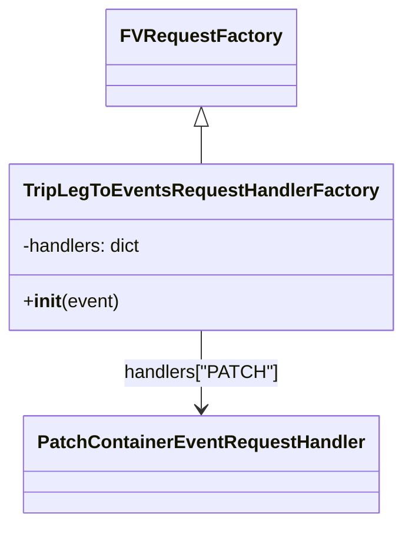

# Diagram: partview_core/partview_service/partview_service/api/trip_leg_to_events/trip_leg_to_events_handler.py


> Auto-generated by Obscura crawlers

## Diagram 1



### SVG

<svg id="container" width="330.6875" xmlns="http://www.w3.org/2000/svg" class="classDiagram" height="452" viewBox="0 0 330.6875 452" role="graphics-document document" aria-roledescription="class"><style>#container{font-family:"trebuchet ms",verdana,arial,sans-serif;font-size:16px;fill:#333;}@keyframes edge-animation-frame{from{stroke-dashoffset:0;}}@keyframes dash{to{stroke-dashoffset:0;}}#container .edge-animation-slow{stroke-dasharray:9,5!important;stroke-dashoffset:900;animation:dash 50s linear infinite;stroke-linecap:round;}#container .edge-animation-fast{stroke-dasharray:9,5!important;stroke-dashoffset:900;animation:dash 20s linear infinite;stroke-linecap:round;}#container .error-icon{fill:#552222;}#container .error-text{fill:#552222;stroke:#552222;}#container .edge-thickness-normal{stroke-width:1px;}#container .edge-thickness-thick{stroke-width:3.5px;}#container .edge-pattern-solid{stroke-dasharray:0;}#container .edge-thickness-invisible{stroke-width:0;fill:none;}#container .edge-pattern-dashed{stroke-dasharray:3;}#container .edge-pattern-dotted{stroke-dasharray:2;}#container .marker{fill:#333333;stroke:#333333;}#container .marker.cross{stroke:#333333;}#container svg{font-family:"trebuchet ms",verdana,arial,sans-serif;font-size:16px;}#container p{margin:0;}#container g.classGroup text{fill:#9370DB;stroke:none;font-family:"trebuchet ms",verdana,arial,sans-serif;font-size:10px;}#container g.classGroup text .title{font-weight:bolder;}#container .nodeLabel,#container .edgeLabel{color:#131300;}#container .edgeLabel .label rect{fill:#ECECFF;}#container .label text{fill:#131300;}#container .labelBkg{background:#ECECFF;}#container .edgeLabel .label span{background:#ECECFF;}#container .classTitle{font-weight:bolder;}#container .node rect,#container .node circle,#container .node ellipse,#container .node polygon,#container .node path{fill:#ECECFF;stroke:#9370DB;stroke-width:1px;}#container .divider{stroke:#9370DB;stroke-width:1;}#container g.clickable{cursor:pointer;}#container g.classGroup rect{fill:#ECECFF;stroke:#9370DB;}#container g.classGroup line{stroke:#9370DB;stroke-width:1;}#container .classLabel .box{stroke:none;stroke-width:0;fill:#ECECFF;opacity:0.5;}#container .classLabel .label{fill:#9370DB;font-size:10px;}#container .relation{stroke:#333333;stroke-width:1;fill:none;}#container .dashed-line{stroke-dasharray:3;}#container .dotted-line{stroke-dasharray:1 2;}#container #compositionStart,#container .composition{fill:#333333!important;stroke:#333333!important;stroke-width:1;}#container #compositionEnd,#container .composition{fill:#333333!important;stroke:#333333!important;stroke-width:1;}#container #dependencyStart,#container .dependency{fill:#333333!important;stroke:#333333!important;stroke-width:1;}#container #dependencyStart,#container .dependency{fill:#333333!important;stroke:#333333!important;stroke-width:1;}#container #extensionStart,#container .extension{fill:transparent!important;stroke:#333333!important;stroke-width:1;}#container #extensionEnd,#container .extension{fill:transparent!important;stroke:#333333!important;stroke-width:1;}#container #aggregationStart,#container .aggregation{fill:transparent!important;stroke:#333333!important;stroke-width:1;}#container #aggregationEnd,#container .aggregation{fill:transparent!important;stroke:#333333!important;stroke-width:1;}#container #lollipopStart,#container .lollipop{fill:#ECECFF!important;stroke:#333333!important;stroke-width:1;}#container #lollipopEnd,#container .lollipop{fill:#ECECFF!important;stroke:#333333!important;stroke-width:1;}#container .edgeTerminals{font-size:11px;line-height:initial;}#container .classTitleText{text-anchor:middle;font-size:18px;fill:#333;}#container .label-icon{display:inline-block;height:1em;overflow:visible;vertical-align:-0.125em;}#container .node .label-icon path{fill:currentColor;stroke:revert;stroke-width:revert;}#container :root{--mermaid-font-family:"trebuchet ms",verdana,arial,sans-serif;}</style><g><defs><marker id="container_class-aggregationStart" class="marker aggregation class" refX="18" refY="7" markerWidth="190" markerHeight="240" orient="auto"><path d="M 18,7 L9,13 L1,7 L9,1 Z"></path></marker></defs><defs><marker id="container_class-aggregationEnd" class="marker aggregation class" refX="1" refY="7" markerWidth="20" markerHeight="28" orient="auto"><path d="M 18,7 L9,13 L1,7 L9,1 Z"></path></marker></defs><defs><marker id="container_class-extensionStart" class="marker extension class" refX="18" refY="7" markerWidth="190" markerHeight="240" orient="auto"><path d="M 1,7 L18,13 V 1 Z"></path></marker></defs><defs><marker id="container_class-extensionEnd" class="marker extension class" refX="1" refY="7" markerWidth="20" markerHeight="28" orient="auto"><path d="M 1,1 V 13 L18,7 Z"></path></marker></defs><defs><marker id="container_class-compositionStart" class="marker composition class" refX="18" refY="7" markerWidth="190" markerHeight="240" orient="auto"><path d="M 18,7 L9,13 L1,7 L9,1 Z"></path></marker></defs><defs><marker id="container_class-compositionEnd" class="marker composition class" refX="1" refY="7" markerWidth="20" markerHeight="28" orient="auto"><path d="M 18,7 L9,13 L1,7 L9,1 Z"></path></marker></defs><defs><marker id="container_class-dependencyStart" class="marker dependency class" refX="6" refY="7" markerWidth="190" markerHeight="240" orient="auto"><path d="M 5,7 L9,13 L1,7 L9,1 Z"></path></marker></defs><defs><marker id="container_class-dependencyEnd" class="marker dependency class" refX="13" refY="7" markerWidth="20" markerHeight="28" orient="auto"><path d="M 18,7 L9,13 L14,7 L9,1 Z"></path></marker></defs><defs><marker id="container_class-lollipopStart" class="marker lollipop class" refX="13" refY="7" markerWidth="190" markerHeight="240" orient="auto"><circle stroke="black" fill="transparent" cx="7" cy="7" r="6"></circle></marker></defs><defs><marker id="container_class-lollipopEnd" class="marker lollipop class" refX="1" refY="7" markerWidth="190" markerHeight="240" orient="auto"><circle stroke="black" fill="transparent" cx="7" cy="7" r="6"></circle></marker></defs><g class="root"><g class="clusters"></g><g class="edgePaths"><path d="M165.344,109.25L165.344,110.542C165.344,111.833,165.344,114.417,165.344,119.875C165.344,125.333,165.344,133.667,165.344,137.833L165.344,142" id="id_FVRequestFactory_TripLegToEventsRequestHandlerFactory_1" class="edge-thickness-normal edge-pattern-solid relation" style=";;;" data-edge="true" data-et="edge" data-id="id_FVRequestFactory_TripLegToEventsRequestHandlerFactory_1" data-points="W3sieCI6MTY1LjM0Mzc1LCJ5Ijo5Mn0seyJ4IjoxNjUuMzQzNzUsInkiOjExN30seyJ4IjoxNjUuMzQzNzUsInkiOjE0Mn1d" marker-start="url(#container_class-extensionStart)"></path><path d="M165.344,286L165.344,292.167C165.344,298.333,165.344,310.667,165.344,322C165.344,333.333,165.344,343.667,165.344,348.833L165.344,354" id="id_TripLegToEventsRequestHandlerFactory_PatchContainerEventRequestHandler_2" class="edge-thickness-normal edge-pattern-solid relation" style=";;;" data-edge="true" data-et="edge" data-id="id_TripLegToEventsRequestHandlerFactory_PatchContainerEventRequestHandler_2" data-points="W3sieCI6MTY1LjM0Mzc1LCJ5IjoyODZ9LHsieCI6MTY1LjM0Mzc1LCJ5IjozMjN9LHsieCI6MTY1LjM0Mzc1LCJ5IjozNjB9XQ==" marker-end="url(#container_class-dependencyEnd)"></path></g><g class="edgeLabels"><g class="edgeLabel"><g class="label" data-id="id_FVRequestFactory_TripLegToEventsRequestHandlerFactory_1" transform="translate(0, 0)"><foreignObject width="0" height="0"><div xmlns="http://www.w3.org/1999/xhtml" class="labelBkg" style="display: table-cell; white-space: nowrap; line-height: 1.5; max-width: 200px; text-align: center;"><span class="edgeLabel"></span></div></foreignObject></g></g><g class="edgeLabel" transform="translate(165.34375, 323)"><g class="label" data-id="id_TripLegToEventsRequestHandlerFactory_PatchContainerEventRequestHandler_2" transform="translate(-65.7109375, -12)"><foreignObject width="131.421875" height="24"><div xmlns="http://www.w3.org/1999/xhtml" class="labelBkg" style="display: table-cell; white-space: nowrap; line-height: 1.5; max-width: 200px; text-align: center;"><span class="edgeLabel"><p>handlers["PATCH"]</p></span></div></foreignObject></g></g></g><g class="nodes"><g class="node default" id="classId-FVRequestFactory-0" transform="translate(165.34375, 50)"><g class="basic label-container"><path d="M-77.0390625 -42 L77.0390625 -42 L77.0390625 42 L-77.0390625 42" stroke="none" stroke-width="0" fill="#ECECFF" style=""></path><path d="M-77.0390625 -42 C-27.193797747479415 -42, 22.65146700504117 -42, 77.0390625 -42 M-77.0390625 -42 C-15.83266396358875 -42, 45.3737345728225 -42, 77.0390625 -42 M77.0390625 -42 C77.0390625 -17.830393000644477, 77.0390625 6.339213998711045, 77.0390625 42 M77.0390625 -42 C77.0390625 -24.590788828276345, 77.0390625 -7.18157765655269, 77.0390625 42 M77.0390625 42 C24.25106644402554 42, -28.53692961194892 42, -77.0390625 42 M77.0390625 42 C45.289792185567705 42, 13.540521871135418 42, -77.0390625 42 M-77.0390625 42 C-77.0390625 17.654851490620914, -77.0390625 -6.690297018758173, -77.0390625 -42 M-77.0390625 42 C-77.0390625 14.840090587537109, -77.0390625 -12.319818824925783, -77.0390625 -42" stroke="#9370DB" stroke-width="1.3" fill="none" stroke-dasharray="0 0" style=""></path></g><g class="annotation-group text" transform="translate(0, -18)"></g><g class="label-group text" transform="translate(-65.0390625, -18)"><g class="label" style="font-weight: bolder" transform="translate(0,-12)"><foreignObject width="130.078125" height="24"><div xmlns="http://www.w3.org/1999/xhtml" style="display: table-cell; white-space: nowrap; line-height: 1.5; max-width: 178px; text-align: center;"><span class="nodeLabel markdown-node-label" style=""><p>FVRequestFactory</p></span></div></foreignObject></g></g><g class="members-group text" transform="translate(-65.0390625, 30)"></g><g class="methods-group text" transform="translate(-65.0390625, 60)"></g><g class="divider" style=""><path d="M-77.0390625 6 C-24.30978472568301 6, 28.41949304863398 6, 77.0390625 6 M-77.0390625 6 C-16.792976319475436 6, 43.45310986104913 6, 77.0390625 6" stroke="#9370DB" stroke-width="1.3" fill="none" stroke-dasharray="0 0" style=""></path></g><g class="divider" style=""><path d="M-77.0390625 24 C-22.69011133361232 24, 31.658839832775357 24, 77.0390625 24 M-77.0390625 24 C-38.777961530493954 24, -0.516860560987908 24, 77.0390625 24" stroke="#9370DB" stroke-width="1.3" fill="none" stroke-dasharray="0 0" style=""></path></g></g><g class="node default" id="classId-TripLegToEventsRequestHandlerFactory-1" transform="translate(165.34375, 214)"><g class="basic label-container"><path d="M-157.34375 -72 L157.34375 -72 L157.34375 72 L-157.34375 72" stroke="none" stroke-width="0" fill="#ECECFF" style=""></path><path d="M-157.34375 -72 C-62.93191883454794 -72, 31.479912330904114 -72, 157.34375 -72 M-157.34375 -72 C-62.043992582202534 -72, 33.25576483559493 -72, 157.34375 -72 M157.34375 -72 C157.34375 -26.679999585230824, 157.34375 18.64000082953835, 157.34375 72 M157.34375 -72 C157.34375 -39.475675490100535, 157.34375 -6.95135098020107, 157.34375 72 M157.34375 72 C81.91908616389523 72, 6.49442232779046 72, -157.34375 72 M157.34375 72 C74.99675709791684 72, -7.350235804166317 72, -157.34375 72 M-157.34375 72 C-157.34375 37.41832948001444, -157.34375 2.8366589600288847, -157.34375 -72 M-157.34375 72 C-157.34375 42.51980972041009, -157.34375 13.039619440820175, -157.34375 -72" stroke="#9370DB" stroke-width="1.3" fill="none" stroke-dasharray="0 0" style=""></path></g><g class="annotation-group text" transform="translate(0, -48)"></g><g class="label-group text" transform="translate(-145.34375, -48)"><g class="label" style="font-weight: bolder" transform="translate(0,-12)"><foreignObject width="290.6875" height="24"><div xmlns="http://www.w3.org/1999/xhtml" style="display: table-cell; white-space: nowrap; line-height: 1.5; max-width: 336px; text-align: center;"><span class="nodeLabel markdown-node-label" style=""><p>TripLegToEventsRequestHandlerFactory</p></span></div></foreignObject></g></g><g class="members-group text" transform="translate(-145.34375, 0)"><g class="label" style="" transform="translate(0,-12)"><foreignObject width="105.796875" height="24"><div xmlns="http://www.w3.org/1999/xhtml" style="display: table-cell; white-space: nowrap; line-height: 1.5; max-width: 163px; text-align: center;"><span class="nodeLabel markdown-node-label" style=""><p>-handlers: dict</p></span></div></foreignObject></g></g><g class="methods-group text" transform="translate(-145.34375, 48)"><g class="label" style="" transform="translate(0,-12)"><foreignObject width="83.140625" height="24"><div xmlns="http://www.w3.org/1999/xhtml" style="display: table-cell; white-space: nowrap; line-height: 1.5; max-width: 172px; text-align: center;"><span class="nodeLabel markdown-node-label" style=""><p>+<strong>init</strong>(event)</p></span></div></foreignObject></g></g><g class="divider" style=""><path d="M-157.34375 -24 C-53.56848669077591 -24, 50.206776618448174 -24, 157.34375 -24 M-157.34375 -24 C-77.1336731158124 -24, 3.076403768375201 -24, 157.34375 -24" stroke="#9370DB" stroke-width="1.3" fill="none" stroke-dasharray="0 0" style=""></path></g><g class="divider" style=""><path d="M-157.34375 24 C-78.30338245173192 24, 0.7369850965361593 24, 157.34375 24 M-157.34375 24 C-69.17666562419174 24, 18.990418751616517 24, 157.34375 24" stroke="#9370DB" stroke-width="1.3" fill="none" stroke-dasharray="0 0" style=""></path></g></g><g class="node default" id="classId-PatchContainerEventRequestHandler-2" transform="translate(165.34375, 402)"><g class="basic label-container"><path d="M-147.0390625 -42 L147.0390625 -42 L147.0390625 42 L-147.0390625 42" stroke="none" stroke-width="0" fill="#ECECFF" style=""></path><path d="M-147.0390625 -42 C-54.683977575338815 -42, 37.67110734932237 -42, 147.0390625 -42 M-147.0390625 -42 C-60.24471516836911 -42, 26.549632163261776 -42, 147.0390625 -42 M147.0390625 -42 C147.0390625 -15.410883827899696, 147.0390625 11.178232344200609, 147.0390625 42 M147.0390625 -42 C147.0390625 -15.10126962787636, 147.0390625 11.797460744247282, 147.0390625 42 M147.0390625 42 C52.57269621949847 42, -41.893670061003064 42, -147.0390625 42 M147.0390625 42 C51.27982289986184 42, -44.47941670027632 42, -147.0390625 42 M-147.0390625 42 C-147.0390625 20.0684032509987, -147.0390625 -1.8631934980026017, -147.0390625 -42 M-147.0390625 42 C-147.0390625 21.478250561214256, -147.0390625 0.9565011224285129, -147.0390625 -42" stroke="#9370DB" stroke-width="1.3" fill="none" stroke-dasharray="0 0" style=""></path></g><g class="annotation-group text" transform="translate(0, -18)"></g><g class="label-group text" transform="translate(-135.0390625, -18)"><g class="label" style="font-weight: bolder" transform="translate(0,-12)"><foreignObject width="270.078125" height="24"><div xmlns="http://www.w3.org/1999/xhtml" style="display: table-cell; white-space: nowrap; line-height: 1.5; max-width: 318px; text-align: center;"><span class="nodeLabel markdown-node-label" style=""><p>PatchContainerEventRequestHandler</p></span></div></foreignObject></g></g><g class="members-group text" transform="translate(-135.0390625, 30)"></g><g class="methods-group text" transform="translate(-135.0390625, 60)"></g><g class="divider" style=""><path d="M-147.0390625 6 C-38.91834879272443 6, 69.20236491455114 6, 147.0390625 6 M-147.0390625 6 C-50.84103028061607 6, 45.357001938767866 6, 147.0390625 6" stroke="#9370DB" stroke-width="1.3" fill="none" stroke-dasharray="0 0" style=""></path></g><g class="divider" style=""><path d="M-147.0390625 24 C-70.18561754687126 24, 6.667827406257487 24, 147.0390625 24 M-147.0390625 24 C-79.93836292096852 24, -12.83766334193703 24, 147.0390625 24" stroke="#9370DB" stroke-width="1.3" fill="none" stroke-dasharray="0 0" style=""></path></g></g></g></g></g></svg>

## Diagram 2

```mermaid
flowchart TD
    A[lambda_handler(event, context, audit_refs)] --> B{decorator: mandatory_lambda_handling}
    B --> C[logging.info("Received trip_leg_to_events request")]
    C --> D[factory = TripLegToEventsRequestHandlerFactory(event)]
    D --> E[request_handler = factory.handler]
    E --> F[trip_leg_to_evetns_data, http_code = request_handler.handle_request()]
    F --> G[return make_response(trip_leg_to_evetns_data, http_code)]
```

> SVG rendering failed for this diagram.
