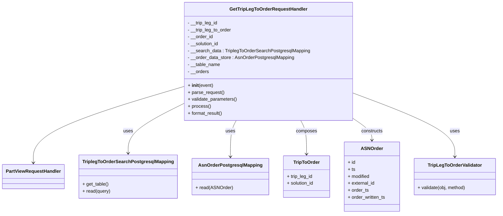
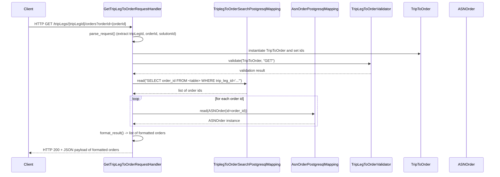

# Diagram: partview_core/partview_service/partview_service/api/trip_leg_to_order/handlers/get_trip_leg_to_order_handler.py

> Auto-generated by Obscura crawlers

## Diagram 1

### SVG

<svg id="container" width="1685.6953125" xmlns="http://www.w3.org/2000/svg" class="classDiagram" height="738" viewBox="0 0 1685.6953125 738" role="graphics-document document" aria-roledescription="class"><g><defs><marker id="container_class-aggregationStart" class="marker aggregation class" refX="18" refY="7" markerWidth="190" markerHeight="240" orient="auto"><path d="M 18,7 L9,13 L1,7 L9,1 Z"></path></marker></defs><defs><marker id="container_class-aggregationEnd" class="marker aggregation class" refX="1" refY="7" markerWidth="20" markerHeight="28" orient="auto"><path d="M 18,7 L9,13 L1,7 L9,1 Z"></path></marker></defs><defs><marker id="container_class-extensionStart" class="marker extension class" refX="18" refY="7" markerWidth="190" markerHeight="240" orient="auto"><path d="M 1,7 L18,13 V 1 Z"></path></marker></defs><defs><marker id="container_class-extensionEnd" class="marker extension class" refX="1" refY="7" markerWidth="20" markerHeight="28" orient="auto"><path d="M 1,1 V 13 L18,7 Z"></path></marker></defs><defs><marker id="container_class-compositionStart" class="marker composition class" refX="18" refY="7" markerWidth="190" markerHeight="240" orient="auto"><path d="M 18,7 L9,13 L1,7 L9,1 Z"></path></marker></defs><defs><marker id="container_class-compositionEnd" class="marker composition class" refX="1" refY="7" markerWidth="20" markerHeight="28" orient="auto"><path d="M 18,7 L9,13 L1,7 L9,1 Z"></path></marker></defs><defs><marker id="container_class-dependencyStart" class="marker dependency class" refX="6" refY="7" markerWidth="190" markerHeight="240" orient="auto"><path d="M 5,7 L9,13 L1,7 L9,1 Z"></path></marker></defs><defs><marker id="container_class-dependencyEnd" class="marker dependency class" refX="13" refY="7" markerWidth="20" markerHeight="28" orient="auto"><path d="M 18,7 L9,13 L14,7 L9,1 Z"></path></marker></defs><defs><marker id="container_class-lollipopStart" class="marker lollipop class" refX="13" refY="7" markerWidth="190" markerHeight="240" orient="auto"><circle stroke="black" fill="transparent" cx="7" cy="7" r="6"></circle></marker></defs><defs><marker id="container_class-lollipopEnd" class="marker lollipop class" refX="1" refY="7" markerWidth="190" markerHeight="240" orient="auto"><circle stroke="black" fill="transparent" cx="7" cy="7" r="6"></circle></marker></defs><g class="root"><g class="clusters"></g><g class="edgePaths"><path d="M607.623,300.32L524.912,325.767C442.202,351.213,276.781,402.107,194.07,445.72C111.359,489.333,111.359,525.667,111.359,543.833L111.359,562" id="id_GetTripLegToOrderRequestHandler_PartViewRequestHandler_1" class="edge-thickness-normal edge-pattern-solid relation" style=";;;" data-edge="true" data-et="edge" data-id="id_GetTripLegToOrderRequestHandler_PartViewRequestHandler_1" data-points="W3sieCI6NjA3LjYyMzA0Njg3NSwieSI6MzAwLjMxOTg1Njc4MjAzMzl9LHsieCI6MTExLjM1OTM3NSwieSI6NDUzfSx7IngiOjExMS4zNTkzNzUsInkiOjU2OH1d" marker-end="url(#container_class-dependencyEnd)"></path><path d="M607.623,359.859L577.484,375.383C547.345,390.906,487.067,421.953,456.928,450.143C426.789,478.333,426.789,503.667,426.789,516.333L426.789,529" id="id_GetTripLegToOrderRequestHandler_TriplegToOrderSearchPostgresqlMapping_2" class="edge-thickness-normal edge-pattern-solid relation" style=";;;" data-edge="true" data-et="edge" data-id="id_GetTripLegToOrderRequestHandler_TriplegToOrderSearchPostgresqlMapping_2" data-points="W3sieCI6NjA3LjYyMzA0Njg3NSwieSI6MzU5Ljg1OTE3OTI2OTI2NDl9LHsieCI6NDI2Ljc4OTA2MjUsInkiOjQ1M30seyJ4Ijo0MjYuNzg5MDYyNSwieSI6NTM1fV0=" marker-end="url(#container_class-dependencyEnd)"></path><path d="M785.51,416L782.209,422.167C778.909,428.333,772.308,440.667,769.008,461.5C765.707,482.333,765.707,511.667,765.707,526.333L765.707,541" id="id_GetTripLegToOrderRequestHandler_AsnOrderPostgresqlMapping_3" class="edge-thickness-normal edge-pattern-solid relation" style=";;;" data-edge="true" data-et="edge" data-id="id_GetTripLegToOrderRequestHandler_AsnOrderPostgresqlMapping_3" data-points="W3sieCI6Nzg1LjUwOTkxMTUwMTU1NiwieSI6NDE2fSx7IngiOjc2NS43MDcwMzEyNSwieSI6NDUzfSx7IngiOjc2NS43MDcwMzEyNSwieSI6NTQ3fV0=" marker-end="url(#container_class-dependencyEnd)"></path><path d="M1003.877,416L1007.177,422.167C1010.478,428.333,1017.079,440.667,1020.379,460C1023.68,479.333,1023.68,505.667,1023.68,518.833L1023.68,532" id="id_GetTripLegToOrderRequestHandler_TripToOrder_4" class="edge-thickness-normal edge-pattern-solid relation" style=";;;" data-edge="true" data-et="edge" data-id="id_GetTripLegToOrderRequestHandler_TripToOrder_4" data-points="W3sieCI6MTAwMy44NzY4MDcyNDg0NDQsInkiOjQxNn0seyJ4IjoxMDIzLjY3OTY4NzUsInkiOjQ1M30seyJ4IjoxMDIzLjY3OTY4NzUsInkiOjUzOH1d" marker-end="url(#container_class-dependencyEnd)"></path><path d="M1181.764,406.607L1193.17,414.339C1204.576,422.071,1227.387,437.536,1238.793,450.435C1250.199,463.333,1250.199,473.667,1250.199,478.833L1250.199,484" id="id_GetTripLegToOrderRequestHandler_ASNOrder_5" class="edge-thickness-normal edge-pattern-solid relation" style=";;;" data-edge="true" data-et="edge" data-id="id_GetTripLegToOrderRequestHandler_ASNOrder_5" data-points="W3sieCI6MTE4MS43NjM2NzE4NzUsInkiOjQwNi42MDcwNDY1MTcxMjE4M30seyJ4IjoxMjUwLjE5OTIxODc1LCJ5Ijo0NTN9LHsieCI6MTI1MC4xOTkyMTg3NSwieSI6NDkwfV0=" marker-end="url(#container_class-dependencyEnd)"></path><path d="M1181.764,319.771L1240.91,341.976C1300.057,364.181,1418.351,408.59,1477.498,445.462C1536.645,482.333,1536.645,511.667,1536.645,526.333L1536.645,541" id="id_GetTripLegToOrderRequestHandler_TripLegToOrderValidator_6" class="edge-thickness-normal edge-pattern-solid relation" style=";;;" data-edge="true" data-et="edge" data-id="id_GetTripLegToOrderRequestHandler_TripLegToOrderValidator_6" data-points="W3sieCI6MTE4MS43NjM2NzE4NzUsInkiOjMxOS43NzEzNTEzNzkzMDkzfSx7IngiOjE1MzYuNjQ0NTMxMjUsInkiOjQ1M30seyJ4IjoxNTM2LjY0NDUzMTI1LCJ5Ijo1NDd9XQ==" marker-end="url(#container_class-dependencyEnd)"></path></g><g class="edgeLabels"><g class="edgeLabel"><g class="label" data-id="id_GetTripLegToOrderRequestHandler_PartViewRequestHandler_1" transform="translate(0, 0)"><foreignObject width="0" height="0">

</foreignObject></g></g><g class="edgeLabel" transform="translate(426.7890625, 453)"><g class="label" data-id="id_GetTripLegToOrderRequestHandler_TriplegToOrderSearchPostgresqlMapping_2" transform="translate(-16.4921875, -12)"><foreignObject width="32.984375" height="24">

uses

</foreignObject></g></g><g class="edgeLabel" transform="translate(765.70703125, 453)"><g class="label" data-id="id_GetTripLegToOrderRequestHandler_AsnOrderPostgresqlMapping_3" transform="translate(-16.4921875, -12)"><foreignObject width="32.984375" height="24">

uses

</foreignObject></g></g><g class="edgeLabel" transform="translate(1023.6796875, 453)"><g class="label" data-id="id_GetTripLegToOrderRequestHandler_TripToOrder_4" transform="translate(-36.453125, -12)"><foreignObject width="72.90625" height="24">

composes

</foreignObject></g></g><g class="edgeLabel" transform="translate(1250.19921875, 453)"><g class="label" data-id="id_GetTripLegToOrderRequestHandler_ASNOrder_5" transform="translate(-37.84375, -12)"><foreignObject width="75.6875" height="24">

constructs

</foreignObject></g></g><g class="edgeLabel" transform="translate(1536.64453125, 453)"><g class="label" data-id="id_GetTripLegToOrderRequestHandler_TripLegToOrderValidator_6" transform="translate(-16.4921875, -12)"><foreignObject width="32.984375" height="24">

uses

</foreignObject></g></g></g><g class="nodes"><g class="node default" id="classId-GetTripLegToOrderRequestHandler-0" transform="translate(894.693359375, 212)"><g class="basic label-container"><path d="M-287.0703125 -204 L287.0703125 -204 L287.0703125 204 L-287.0703125 204" stroke="none" stroke-width="0" fill="#ECECFF" style=""></path><path d="M-287.0703125 -204 C-95.38450055946407 -204, 96.30131138107186 -204, 287.0703125 -204 M-287.0703125 -204 C-119.79703671752506 -204, 47.47623906494988 -204, 287.0703125 -204 M287.0703125 -204 C287.0703125 -51.25392198581241, 287.0703125 101.49215602837518, 287.0703125 204 M287.0703125 -204 C287.0703125 -86.89921634793146, 287.0703125 30.201567304137086, 287.0703125 204 M287.0703125 204 C125.51215319604987 204, -36.04600610790027 204, -287.0703125 204 M287.0703125 204 C155.91143958024006 204, 24.752566660480113 204, -287.0703125 204 M-287.0703125 204 C-287.0703125 110.92367248426758, -287.0703125 17.847344968535168, -287.0703125 -204 M-287.0703125 204 C-287.0703125 60.2188259311867, -287.0703125 -83.5623481376266, -287.0703125 -204" stroke="#9370DB" stroke-width="1.3" fill="none" stroke-dasharray="0 0" style=""></path></g><g class="annotation-group text" transform="translate(0, -180)"></g><g class="label-group text" transform="translate(-128.25, -180)"><g class="label" style="font-weight: bolder" transform="translate(0,-12)"><foreignObject width="256.5" height="24">

GetTripLegToOrderRequestHandler

</foreignObject></g></g><g class="members-group text" transform="translate(-275.0703125, -132)"><g class="label" style="" transform="translate(0,-12)"><foreignObject width="104.78125" height="24">

- __trip_leg_id

</foreignObject></g><g class="label" style="" transform="translate(0,12)"><foreignObject width="152.4375" height="24">

- __trip_leg_to_order

</foreignObject></g><g class="label" style="" transform="translate(0,36)"><foreignObject width="87.484375" height="24">

- __order_id

</foreignObject></g><g class="label" style="" transform="translate(0,60)"><foreignObject width="109.40625" height="24">

- __solution_id

</foreignObject></g><g class="label" style="" transform="translate(0,84)"><foreignObject width="421.890625" height="24">

- __search_data : TriplegToOrderSearchPostgresqlMapping

</foreignObject></g><g class="label" style="" transform="translate(0,108)"><foreignObject width="368.375" height="24">

- __order_data_store : AsnOrderPostgresqlMapping

</foreignObject></g><g class="label" style="" transform="translate(0,132)"><foreignObject width="112.5625" height="24">

- __table_name

</foreignObject></g><g class="label" style="" transform="translate(0,156)"><foreignObject width="73.59375" height="24">

- __orders

</foreignObject></g></g><g class="methods-group text" transform="translate(-275.0703125, 84)"><g class="label" style="" transform="translate(0,-12)"><foreignObject width="87.390625" height="24">

+ <strong>init</strong>(event)

</foreignObject></g><g class="label" style="" transform="translate(0,12)"><foreignObject width="126.046875" height="24">

+ parse_request()

</foreignObject></g><g class="label" style="" transform="translate(0,36)"><foreignObject width="170.953125" height="24">

+ validate_parameters()

</foreignObject></g><g class="label" style="" transform="translate(0,60)"><foreignObject width="77.96875" height="24">

+ process()

</foreignObject></g><g class="label" style="" transform="translate(0,84)"><foreignObject width="121.5" height="24">

+ format_result()

</foreignObject></g></g><g class="divider" style=""><path d="M-287.0703125 -156 C-97.94253427735214 -156, 91.18524394529572 -156, 287.0703125 -156 M-287.0703125 -156 C-78.78582373182508 -156, 129.49866503634985 -156, 287.0703125 -156" stroke="#9370DB" stroke-width="1.3" fill="none" stroke-dasharray="0 0" style=""></path></g><g class="divider" style=""><path d="M-287.0703125 60 C-105.76903704743594 60, 75.53223840512811 60, 287.0703125 60 M-287.0703125 60 C-168.44217361463086 60, -49.81403472926172 60, 287.0703125 60" stroke="#9370DB" stroke-width="1.3" fill="none" stroke-dasharray="0 0" style=""></path></g></g><g class="node default" id="classId-PartViewRequestHandler-1" transform="translate(111.359375, 610)"><g class="basic label-container"><path d="M-103.359375 -42 L103.359375 -42 L103.359375 42 L-103.359375 42" stroke="none" stroke-width="0" fill="#ECECFF" style=""></path><path d="M-103.359375 -42 C-49.85908784246661 -42, 3.6411993150667854 -42, 103.359375 -42 M-103.359375 -42 C-48.17511429343019 -42, 7.009146413139618 -42, 103.359375 -42 M103.359375 -42 C103.359375 -13.00918245325509, 103.359375 15.981635093489821, 103.359375 42 M103.359375 -42 C103.359375 -24.561071172557963, 103.359375 -7.122142345115925, 103.359375 42 M103.359375 42 C25.392218987746105 42, -52.57493702450779 42, -103.359375 42 M103.359375 42 C42.47991093256478 42, -18.399553134870445 42, -103.359375 42 M-103.359375 42 C-103.359375 18.574179416553825, -103.359375 -4.85164116689235, -103.359375 -42 M-103.359375 42 C-103.359375 15.294158774899401, -103.359375 -11.411682450201198, -103.359375 -42" stroke="#9370DB" stroke-width="1.3" fill="none" stroke-dasharray="0 0" style=""></path></g><g class="annotation-group text" transform="translate(0, -18)"></g><g class="label-group text" transform="translate(-91.359375, -18)"><g class="label" style="font-weight: bolder" transform="translate(0,-12)"><foreignObject width="182.71875" height="24">

PartViewRequestHandler

</foreignObject></g></g><g class="members-group text" transform="translate(-91.359375, 30)"></g><g class="methods-group text" transform="translate(-91.359375, 60)"></g><g class="divider" style=""><path d="M-103.359375 6 C-58.58479585887599 6, -13.810216717751985 6, 103.359375 6 M-103.359375 6 C-42.91019310512652 6, 17.538988789746966 6, 103.359375 6" stroke="#9370DB" stroke-width="1.3" fill="none" stroke-dasharray="0 0" style=""></path></g><g class="divider" style=""><path d="M-103.359375 24 C-44.566943383664274 24, 14.225488232671452 24, 103.359375 24 M-103.359375 24 C-39.020976096188335 24, 25.31742280762333 24, 103.359375 24" stroke="#9370DB" stroke-width="1.3" fill="none" stroke-dasharray="0 0" style=""></path></g></g><g class="node default" id="classId-TripToOrder-2" transform="translate(1023.6796875, 610)"><g class="basic label-container"><path d="M-81.125 -72 L81.125 -72 L81.125 72 L-81.125 72" stroke="none" stroke-width="0" fill="#ECECFF" style=""></path><path d="M-81.125 -72 C-29.70938887668558 -72, 21.70622224662884 -72, 81.125 -72 M-81.125 -72 C-27.68799164015632 -72, 25.74901671968736 -72, 81.125 -72 M81.125 -72 C81.125 -20.942032955717295, 81.125 30.11593408856541, 81.125 72 M81.125 -72 C81.125 -21.002923810286745, 81.125 29.99415237942651, 81.125 72 M81.125 72 C43.104575981513804 72, 5.084151963027608 72, -81.125 72 M81.125 72 C34.97842010178775 72, -11.168159796424504 72, -81.125 72 M-81.125 72 C-81.125 39.28584590203156, -81.125 6.571691804063121, -81.125 -72 M-81.125 72 C-81.125 30.643349544587565, -81.125 -10.71330091082487, -81.125 -72" stroke="#9370DB" stroke-width="1.3" fill="none" stroke-dasharray="0 0" style=""></path></g><g class="annotation-group text" transform="translate(0, -48)"></g><g class="label-group text" transform="translate(-43.796875, -48)"><g class="label" style="font-weight: bolder" transform="translate(0,-12)"><foreignObject width="87.59375" height="24">

TripToOrder

</foreignObject></g></g><g class="members-group text" transform="translate(-69.125, 0)"><g class="label" style="" transform="translate(0,-12)"><foreignObject width="90.15625" height="24">

+ trip_leg_id

</foreignObject></g><g class="label" style="" transform="translate(0,12)"><foreignObject width="94.453125" height="24">

+ solution_id

</foreignObject></g></g><g class="methods-group text" transform="translate(-69.125, 72)"></g><g class="divider" style=""><path d="M-81.125 -24 C-35.20108853379602 -24, 10.722822932407965 -24, 81.125 -24 M-81.125 -24 C-28.64852354073411 -24, 23.82795291853178 -24, 81.125 -24" stroke="#9370DB" stroke-width="1.3" fill="none" stroke-dasharray="0 0" style=""></path></g><g class="divider" style=""><path d="M-81.125 48 C-23.869133185324607 48, 33.386733629350786 48, 81.125 48 M-81.125 48 C-42.44059158970936 48, -3.756183179418727 48, 81.125 48" stroke="#9370DB" stroke-width="1.3" fill="none" stroke-dasharray="0 0" style=""></path></g></g><g class="node default" id="classId-ASNOrder-3" transform="translate(1250.19921875, 610)"><g class="basic label-container"><path d="M-95.39453125 -120 L95.39453125 -120 L95.39453125 120 L-95.39453125 120" stroke="none" stroke-width="0" fill="#ECECFF" style=""></path><path d="M-95.39453125 -120 C-43.600067673696806 -120, 8.194395902606388 -120, 95.39453125 -120 M-95.39453125 -120 C-29.393262936256477 -120, 36.608005377487046 -120, 95.39453125 -120 M95.39453125 -120 C95.39453125 -29.850510827287906, 95.39453125 60.29897834542419, 95.39453125 120 M95.39453125 -120 C95.39453125 -70.03720476591188, 95.39453125 -20.07440953182376, 95.39453125 120 M95.39453125 120 C56.95198079306843 120, 18.50943033613686 120, -95.39453125 120 M95.39453125 120 C34.32418186195047 120, -26.746167526099057 120, -95.39453125 120 M-95.39453125 120 C-95.39453125 59.749736524209844, -95.39453125 -0.5005269515803121, -95.39453125 -120 M-95.39453125 120 C-95.39453125 66.90147280786964, -95.39453125 13.802945615739276, -95.39453125 -120" stroke="#9370DB" stroke-width="1.3" fill="none" stroke-dasharray="0 0" style=""></path></g><g class="annotation-group text" transform="translate(0, -96)"></g><g class="label-group text" transform="translate(-35.5234375, -96)"><g class="label" style="font-weight: bolder" transform="translate(0,-12)"><foreignObject width="71.046875" height="24">

ASNOrder

</foreignObject></g></g><g class="members-group text" transform="translate(-83.39453125, -48)"><g class="label" style="" transform="translate(0,-12)"><foreignObject width="26.3125" height="24">

+ id

</foreignObject></g><g class="label" style="" transform="translate(0,12)"><foreignObject width="25.484375" height="24">

+ ts

</foreignObject></g><g class="label" style="" transform="translate(0,36)"><foreignObject width="76.859375" height="24">

+ modified

</foreignObject></g><g class="label" style="" transform="translate(0,60)"><foreignObject width="94.015625" height="24">

+ external_id

</foreignObject></g><g class="label" style="" transform="translate(0,84)"><foreignObject width="71.703125" height="24">

+ order_ts

</foreignObject></g><g class="label" style="" transform="translate(0,108)"><foreignObject width="131.265625" height="24">

+ order_written_ts

</foreignObject></g></g><g class="methods-group text" transform="translate(-83.39453125, 120)"></g><g class="divider" style=""><path d="M-95.39453125 -72 C-20.964488844594726 -72, 53.46555356081055 -72, 95.39453125 -72 M-95.39453125 -72 C-56.0379470582384 -72, -16.681362866476803 -72, 95.39453125 -72" stroke="#9370DB" stroke-width="1.3" fill="none" stroke-dasharray="0 0" style=""></path></g><g class="divider" style=""><path d="M-95.39453125 96 C-25.81378192730321 96, 43.76696739539358 96, 95.39453125 96 M-95.39453125 96 C-34.87571537889009 96, 25.643100492219816 96, 95.39453125 96" stroke="#9370DB" stroke-width="1.3" fill="none" stroke-dasharray="0 0" style=""></path></g></g><g class="node default" id="classId-TriplegToOrderSearchPostgresqlMapping-4" transform="translate(426.7890625, 610)"><g class="basic label-container"><path d="M-162.0703125 -75 L162.0703125 -75 L162.0703125 75 L-162.0703125 75" stroke="none" stroke-width="0" fill="#ECECFF" style=""></path><path d="M-162.0703125 -75 C-42.166253112145895 -75, 77.73780627570821 -75, 162.0703125 -75 M-162.0703125 -75 C-78.95306886383473 -75, 4.16417477233054 -75, 162.0703125 -75 M162.0703125 -75 C162.0703125 -31.943273873349185, 162.0703125 11.113452253301631, 162.0703125 75 M162.0703125 -75 C162.0703125 -40.979453992269804, 162.0703125 -6.958907984539607, 162.0703125 75 M162.0703125 75 C36.69805869726079 75, -88.67419510547842 75, -162.0703125 75 M162.0703125 75 C40.64224306655508 75, -80.78582636688984 75, -162.0703125 75 M-162.0703125 75 C-162.0703125 38.13976789134551, -162.0703125 1.2795357826910134, -162.0703125 -75 M-162.0703125 75 C-162.0703125 37.15656718650629, -162.0703125 -0.6868656269874265, -162.0703125 -75" stroke="#9370DB" stroke-width="1.3" fill="none" stroke-dasharray="0 0" style=""></path></g><g class="annotation-group text" transform="translate(0, -51)"></g><g class="label-group text" transform="translate(-150.0703125, -51)"><g class="label" style="font-weight: bolder" transform="translate(0,-12)"><foreignObject width="300.140625" height="24">

TriplegToOrderSearchPostgresqlMapping

</foreignObject></g></g><g class="members-group text" transform="translate(-150.0703125, -3)"></g><g class="methods-group text" transform="translate(-150.0703125, 27)"><g class="label" style="" transform="translate(0,-12)"><foreignObject width="90.359375" height="24">

+ get_table()

</foreignObject></g><g class="label" style="" transform="translate(0,12)"><foreignObject width="96.78125" height="24">

+ read(query)

</foreignObject></g></g><g class="divider" style=""><path d="M-162.0703125 -27 C-47.721952984039106 -27, 66.62640653192179 -27, 162.0703125 -27 M-162.0703125 -27 C-41.027367587690264 -27, 80.01557732461947 -27, 162.0703125 -27" stroke="#9370DB" stroke-width="1.3" fill="none" stroke-dasharray="0 0" style=""></path></g><g class="divider" style=""><path d="M-162.0703125 -3 C-47.309145942321166 -3, 67.45202061535767 -3, 162.0703125 -3 M-162.0703125 -3 C-37.09760664391892 -3, 87.87509921216216 -3, 162.0703125 -3" stroke="#9370DB" stroke-width="1.3" fill="none" stroke-dasharray="0 0" style=""></path></g></g><g class="node default" id="classId-AsnOrderPostgresqlMapping-5" transform="translate(765.70703125, 610)"><g class="basic label-container"><path d="M-126.84765625 -63 L126.84765625 -63 L126.84765625 63 L-126.84765625 63" stroke="none" stroke-width="0" fill="#ECECFF" style=""></path><path d="M-126.84765625 -63 C-55.805144077895505 -63, 15.237368094208989 -63, 126.84765625 -63 M-126.84765625 -63 C-29.401510066881826 -63, 68.04463611623635 -63, 126.84765625 -63 M126.84765625 -63 C126.84765625 -28.69852852860931, 126.84765625 5.602942942781382, 126.84765625 63 M126.84765625 -63 C126.84765625 -35.02594293081523, 126.84765625 -7.05188586163046, 126.84765625 63 M126.84765625 63 C36.69024839454964 63, -53.46715946090072 63, -126.84765625 63 M126.84765625 63 C36.08435206050619 63, -54.67895212898762 63, -126.84765625 63 M-126.84765625 63 C-126.84765625 35.393436408609354, -126.84765625 7.786872817218708, -126.84765625 -63 M-126.84765625 63 C-126.84765625 32.06721414206025, -126.84765625 1.13442828412051, -126.84765625 -63" stroke="#9370DB" stroke-width="1.3" fill="none" stroke-dasharray="0 0" style=""></path></g><g class="annotation-group text" transform="translate(0, -39)"></g><g class="label-group text" transform="translate(-104.5234375, -39)"><g class="label" style="font-weight: bolder" transform="translate(0,-12)"><foreignObject width="209.046875" height="24">

AsnOrderPostgresqlMapping

</foreignObject></g></g><g class="members-group text" transform="translate(-114.84765625, 9)"></g><g class="methods-group text" transform="translate(-114.84765625, 39)"><g class="label" style="" transform="translate(0,-12)"><foreignObject width="125.171875" height="24">

+ read(ASNOrder)

</foreignObject></g></g><g class="divider" style=""><path d="M-126.84765625 -15 C-55.74789048292911 -15, 15.351875284141784 -15, 126.84765625 -15 M-126.84765625 -15 C-57.47785046053501 -15, 11.891955328929981 -15, 126.84765625 -15" stroke="#9370DB" stroke-width="1.3" fill="none" stroke-dasharray="0 0" style=""></path></g><g class="divider" style=""><path d="M-126.84765625 9 C-68.69798383541712 9, -10.548311420834224 9, 126.84765625 9 M-126.84765625 9 C-43.760409991302964 9, 39.32683626739407 9, 126.84765625 9" stroke="#9370DB" stroke-width="1.3" fill="none" stroke-dasharray="0 0" style=""></path></g></g><g class="node default" id="classId-TripLegToOrderValidator-6" transform="translate(1536.64453125, 610)"><g class="basic label-container"><path d="M-141.05078125 -63 L141.05078125 -63 L141.05078125 63 L-141.05078125 63" stroke="none" stroke-width="0" fill="#ECECFF" style=""></path><path d="M-141.05078125 -63 C-53.47068896230793 -63, 34.109403325384136 -63, 141.05078125 -63 M-141.05078125 -63 C-56.147377070690766 -63, 28.75602710861847 -63, 141.05078125 -63 M141.05078125 -63 C141.05078125 -28.047434811088777, 141.05078125 6.905130377822445, 141.05078125 63 M141.05078125 -63 C141.05078125 -32.29289086857632, 141.05078125 -1.5857817371526508, 141.05078125 63 M141.05078125 63 C67.68132818707424 63, -5.688124875851514 63, -141.05078125 63 M141.05078125 63 C35.79224355008803 63, -69.46629414982394 63, -141.05078125 63 M-141.05078125 63 C-141.05078125 28.904817523757984, -141.05078125 -5.190364952484032, -141.05078125 -63 M-141.05078125 63 C-141.05078125 16.315824436655724, -141.05078125 -30.36835112668855, -141.05078125 -63" stroke="#9370DB" stroke-width="1.3" fill="none" stroke-dasharray="0 0" style=""></path></g><g class="annotation-group text" transform="translate(0, -39)"></g><g class="label-group text" transform="translate(-89.7109375, -39)"><g class="label" style="font-weight: bolder" transform="translate(0,-12)"><foreignObject width="179.421875" height="24">

TripLegToOrderValidator

</foreignObject></g></g><g class="members-group text" transform="translate(-129.05078125, 9)"></g><g class="methods-group text" transform="translate(-129.05078125, 39)"><g class="label" style="" transform="translate(0,-12)"><foreignObject width="168.390625" height="24">

+ validate(obj, method)

</foreignObject></g></g><g class="divider" style=""><path d="M-141.05078125 -15 C-77.7280362666619 -15, -14.405291283323805 -15, 141.05078125 -15 M-141.05078125 -15 C-29.129722982427623 -15, 82.79133528514475 -15, 141.05078125 -15" stroke="#9370DB" stroke-width="1.3" fill="none" stroke-dasharray="0 0" style=""></path></g><g class="divider" style=""><path d="M-141.05078125 9 C-80.82887112423992 9, -20.606960998479835 9, 141.05078125 9 M-141.05078125 9 C-64.22728599689364 9, 12.596209256212717 9, 141.05078125 9" stroke="#9370DB" stroke-width="1.3" fill="none" stroke-dasharray="0 0" style=""></path></g></g></g></g></g></svg>

## Diagram 2

### SVG

<svg id="container" width="2237.5" xmlns="http://www.w3.org/2000/svg" height="814" viewBox="-50 -10 2237.5 814" role="graphics-document document" aria-roledescription="sequence"><g><rect x="1987.5" y="728" fill="#eaeaea" stroke="#666" width="150" height="65" name="ASN" rx="3" ry="3" class="actor actor-bottom"></rect><text x="2062.5" y="760.5" dominant-baseline="central" alignment-baseline="central" class="actor actor-box" style="text-anchor: middle; font-size: 16px; font-weight: 400;"><tspan x="2062.5" dy="0">ASNOrder</tspan></text></g><g><rect x="1787.5" y="728" fill="#eaeaea" stroke="#666" width="150" height="65" name="Model" rx="3" ry="3" class="actor actor-bottom"></rect><text x="1862.5" y="760.5" dominant-baseline="central" alignment-baseline="central" class="actor actor-box" style="text-anchor: middle; font-size: 16px; font-weight: 400;"><tspan x="1862.5" dy="0">TripToOrder</tspan></text></g><g><rect x="1540.5" y="728" fill="#eaeaea" stroke="#666" width="197" height="65" name="Validator" rx="3" ry="3" class="actor actor-bottom"></rect><text x="1639" y="760.5" dominant-baseline="central" alignment-baseline="central" class="actor actor-box" style="text-anchor: middle; font-size: 16px; font-weight: 400;"><tspan x="1639" dy="0">TripLegToOrderValidator</tspan></text></g><g><rect x="1264.5" y="728" fill="#eaeaea" stroke="#666" width="226" height="65" name="OrderStore" rx="3" ry="3" class="actor actor-bottom"></rect><text x="1377.5" y="760.5" dominant-baseline="central" alignment-baseline="central" class="actor actor-box" style="text-anchor: middle; font-size: 16px; font-weight: 400;"><tspan x="1377.5" dy="0">AsnOrderPostgresqlMapping</tspan></text></g><g><rect x="899.5" y="728" fill="#eaeaea" stroke="#666" width="315" height="65" name="Search" rx="3" ry="3" class="actor actor-bottom"></rect><text x="1057" y="760.5" dominant-baseline="central" alignment-baseline="central" class="actor actor-box" style="text-anchor: middle; font-size: 16px; font-weight: 400;"><tspan x="1057" dy="0">TriplegToOrderSearchPostgresqlMapping</tspan></text></g><g><rect x="416.5" y="728" fill="#eaeaea" stroke="#666" width="273" height="65" name="Handler" rx="3" ry="3" class="actor actor-bottom"></rect><text x="553" y="760.5" dominant-baseline="central" alignment-baseline="central" class="actor actor-box" style="text-anchor: middle; font-size: 16px; font-weight: 400;"><tspan x="553" dy="0">GetTripLegToOrderRequestHandler</tspan></text></g><g><rect x="0" y="728" fill="#eaeaea" stroke="#666" width="150" height="65" name="Client" rx="3" ry="3" class="actor actor-bottom"></rect><text x="75" y="760.5" dominant-baseline="central" alignment-baseline="central" class="actor actor-box" style="text-anchor: middle; font-size: 16px; font-weight: 400;"><tspan x="75" dy="0">Client</tspan></text></g><g><line id="actor6" x1="2062.5" y1="65" x2="2062.5" y2="728" class="actor-line 200" stroke-width="0.5px" stroke="#999" name="ASN"></line><g id="root-6"><rect x="1987.5" y="0" fill="#eaeaea" stroke="#666" width="150" height="65" name="ASN" rx="3" ry="3" class="actor actor-top"></rect><text x="2062.5" y="32.5" dominant-baseline="central" alignment-baseline="central" class="actor actor-box" style="text-anchor: middle; font-size: 16px; font-weight: 400;"><tspan x="2062.5" dy="0">ASNOrder</tspan></text></g></g><g><line id="actor5" x1="1862.5" y1="65" x2="1862.5" y2="728" class="actor-line 200" stroke-width="0.5px" stroke="#999" name="Model"></line><g id="root-5"><rect x="1787.5" y="0" fill="#eaeaea" stroke="#666" width="150" height="65" name="Model" rx="3" ry="3" class="actor actor-top"></rect><text x="1862.5" y="32.5" dominant-baseline="central" alignment-baseline="central" class="actor actor-box" style="text-anchor: middle; font-size: 16px; font-weight: 400;"><tspan x="1862.5" dy="0">TripToOrder</tspan></text></g></g><g><line id="actor4" x1="1639" y1="65" x2="1639" y2="728" class="actor-line 200" stroke-width="0.5px" stroke="#999" name="Validator"></line><g id="root-4"><rect x="1540.5" y="0" fill="#eaeaea" stroke="#666" width="197" height="65" name="Validator" rx="3" ry="3" class="actor actor-top"></rect><text x="1639" y="32.5" dominant-baseline="central" alignment-baseline="central" class="actor actor-box" style="text-anchor: middle; font-size: 16px; font-weight: 400;"><tspan x="1639" dy="0">TripLegToOrderValidator</tspan></text></g></g><g><line id="actor3" x1="1377.5" y1="65" x2="1377.5" y2="728" class="actor-line 200" stroke-width="0.5px" stroke="#999" name="OrderStore"></line><g id="root-3"><rect x="1264.5" y="0" fill="#eaeaea" stroke="#666" width="226" height="65" name="OrderStore" rx="3" ry="3" class="actor actor-top"></rect><text x="1377.5" y="32.5" dominant-baseline="central" alignment-baseline="central" class="actor actor-box" style="text-anchor: middle; font-size: 16px; font-weight: 400;"><tspan x="1377.5" dy="0">AsnOrderPostgresqlMapping</tspan></text></g></g><g><line id="actor2" x1="1057" y1="65" x2="1057" y2="728" class="actor-line 200" stroke-width="0.5px" stroke="#999" name="Search"></line><g id="root-2"><rect x="899.5" y="0" fill="#eaeaea" stroke="#666" width="315" height="65" name="Search" rx="3" ry="3" class="actor actor-top"></rect><text x="1057" y="32.5" dominant-baseline="central" alignment-baseline="central" class="actor actor-box" style="text-anchor: middle; font-size: 16px; font-weight: 400;"><tspan x="1057" dy="0">TriplegToOrderSearchPostgresqlMapping</tspan></text></g></g><g><line id="actor1" x1="553" y1="65" x2="553" y2="728" class="actor-line 200" stroke-width="0.5px" stroke="#999" name="Handler"></line><g id="root-1"><rect x="416.5" y="0" fill="#eaeaea" stroke="#666" width="273" height="65" name="Handler" rx="3" ry="3" class="actor actor-top"></rect><text x="553" y="32.5" dominant-baseline="central" alignment-baseline="central" class="actor actor-box" style="text-anchor: middle; font-size: 16px; font-weight: 400;"><tspan x="553" dy="0">GetTripLegToOrderRequestHandler</tspan></text></g></g><g><line id="actor0" x1="75" y1="65" x2="75" y2="728" class="actor-line 200" stroke-width="0.5px" stroke="#999" name="Client"></line><g id="root-0"><rect x="0" y="0" fill="#eaeaea" stroke="#666" width="150" height="65" name="Client" rx="3" ry="3" class="actor actor-top"></rect><text x="75" y="32.5" dominant-baseline="central" alignment-baseline="central" class="actor actor-box" style="text-anchor: middle; font-size: 16px; font-weight: 400;"><tspan x="75" dy="0">Client</tspan></text></g></g><g></g><defs><symbol id="computer" width="24" height="24"><path transform="scale(.5)" d="M2 2v13h20v-13h-20zm18 11h-16v-9h16v9zm-10.228 6l.466-1h3.524l.467 1h-4.457zm14.228 3h-24l2-6h2.104l-1.33 4h18.45l-1.297-4h2.073l2 6zm-5-10h-14v-7h14v7z"></path></symbol></defs><defs><symbol id="database" fill-rule="evenodd" clip-rule="evenodd"><path transform="scale(.5)" d="M12.258.001l.256.004.255.005.253.008.251.01.249.012.247.015.246.016.242.019.241.02.239.023.236.024.233.027.231.028.229.031.225.032.223.034.22.036.217.038.214.04.211.041.208.043.205.045.201.046.198.048.194.05.191.051.187.053.183.054.18.056.175.057.172.059.168.06.163.061.16.063.155.064.15.066.074.033.073.033.071.034.07.034.069.035.068.035.067.035.066.035.064.036.064.036.062.036.06.036.06.037.058.037.058.037.055.038.055.038.053.038.052.038.051.039.05.039.048.039.047.039.045.04.044.04.043.04.041.04.04.041.039.041.037.041.036.041.034.041.033.042.032.042.03.042.029.042.027.042.026.043.024.043.023.043.021.043.02.043.018.044.017.043.015.044.013.044.012.044.011.045.009.044.007.045.006.045.004.045.002.045.001.045v17l-.001.045-.002.045-.004.045-.006.045-.007.045-.009.044-.011.045-.012.044-.013.044-.015.044-.017.043-.018.044-.02.043-.021.043-.023.043-.024.043-.026.043-.027.042-.029.042-.03.042-.032.042-.033.042-.034.041-.036.041-.037.041-.039.041-.04.041-.041.04-.043.04-.044.04-.045.04-.047.039-.048.039-.05.039-.051.039-.052.038-.053.038-.055.038-.055.038-.058.037-.058.037-.06.037-.06.036-.062.036-.064.036-.064.036-.066.035-.067.035-.068.035-.069.035-.07.034-.071.034-.073.033-.074.033-.15.066-.155.064-.16.063-.163.061-.168.06-.172.059-.175.057-.18.056-.183.054-.187.053-.191.051-.194.05-.198.048-.201.046-.205.045-.208.043-.211.041-.214.04-.217.038-.22.036-.223.034-.225.032-.229.031-.231.028-.233.027-.236.024-.239.023-.241.02-.242.019-.246.016-.247.015-.249.012-.251.01-.253.008-.255.005-.256.004-.258.001-.258-.001-.256-.004-.255-.005-.253-.008-.251-.01-.249-.012-.247-.015-.245-.016-.243-.019-.241-.02-.238-.023-.236-.024-.234-.027-.231-.028-.228-.031-.226-.032-.223-.034-.22-.036-.217-.038-.214-.04-.211-.041-.208-.043-.204-.045-.201-.046-.198-.048-.195-.05-.19-.051-.187-.053-.184-.054-.179-.056-.176-.057-.172-.059-.167-.06-.164-.061-.159-.063-.155-.064-.151-.066-.074-.033-.072-.033-.072-.034-.07-.034-.069-.035-.068-.035-.067-.035-.066-.035-.064-.036-.063-.036-.062-.036-.061-.036-.06-.037-.058-.037-.057-.037-.056-.038-.055-.038-.053-.038-.052-.038-.051-.039-.049-.039-.049-.039-.046-.039-.046-.04-.044-.04-.043-.04-.041-.04-.04-.041-.039-.041-.037-.041-.036-.041-.034-.041-.033-.042-.032-.042-.03-.042-.029-.042-.027-.042-.026-.043-.024-.043-.023-.043-.021-.043-.02-.043-.018-.044-.017-.043-.015-.044-.013-.044-.012-.044-.011-.045-.009-.044-.007-.045-.006-.045-.004-.045-.002-.045-.001-.045v-17l.001-.045.002-.045.004-.045.006-.045.007-.045.009-.044.011-.045.012-.044.013-.044.015-.044.017-.043.018-.044.02-.043.021-.043.023-.043.024-.043.026-.043.027-.042.029-.042.03-.042.032-.042.033-.042.034-.041.036-.041.037-.041.039-.041.04-.041.041-.04.043-.04.044-.04.046-.04.046-.039.049-.039.049-.039.051-.039.052-.038.053-.038.055-.038.056-.038.057-.037.058-.037.06-.037.061-.036.062-.036.063-.036.064-.036.066-.035.067-.035.068-.035.069-.035.07-.034.072-.034.072-.033.074-.033.151-.066.155-.064.159-.063.164-.061.167-.06.172-.059.176-.057.179-.056.184-.054.187-.053.19-.051.195-.05.198-.048.201-.046.204-.045.208-.043.211-.041.214-.04.217-.038.22-.036.223-.034.226-.032.228-.031.231-.028.234-.027.236-.024.238-.023.241-.02.243-.019.245-.016.247-.015.249-.012.251-.01.253-.008.255-.005.256-.004.258-.001.258.001zm-9.258 20.499v.01l.001.021.003.021.004.022.005.021.006.022.007.022.009.023.01.022.011.023.012.023.013.023.015.023.016.024.017.023.018.024.019.024.021.024.022.025.023.024.024.025.052.049.056.05.061.051.066.051.07.051.075.051.079.052.084.052.088.052.092.052.097.052.102.051.105.052.11.052.114.051.119.051.123.051.127.05.131.05.135.05.139.048.144.049.147.047.152.047.155.047.16.045.163.045.167.043.171.043.176.041.178.041.183.039.187.039.19.037.194.035.197.035.202.033.204.031.209.03.212.029.216.027.219.025.222.024.226.021.23.02.233.018.236.016.24.015.243.012.246.01.249.008.253.005.256.004.259.001.26-.001.257-.004.254-.005.25-.008.247-.011.244-.012.241-.014.237-.016.233-.018.231-.021.226-.021.224-.024.22-.026.216-.027.212-.028.21-.031.205-.031.202-.034.198-.034.194-.036.191-.037.187-.039.183-.04.179-.04.175-.042.172-.043.168-.044.163-.045.16-.046.155-.046.152-.047.148-.048.143-.049.139-.049.136-.05.131-.05.126-.05.123-.051.118-.052.114-.051.11-.052.106-.052.101-.052.096-.052.092-.052.088-.053.083-.051.079-.052.074-.052.07-.051.065-.051.06-.051.056-.05.051-.05.023-.024.023-.025.021-.024.02-.024.019-.024.018-.024.017-.024.015-.023.014-.024.013-.023.012-.023.01-.023.01-.022.008-.022.006-.022.006-.022.004-.022.004-.021.001-.021.001-.021v-4.127l-.077.055-.08.053-.083.054-.085.053-.087.052-.09.052-.093.051-.095.05-.097.05-.1.049-.102.049-.105.048-.106.047-.109.047-.111.046-.114.045-.115.045-.118.044-.12.043-.122.042-.124.042-.126.041-.128.04-.13.04-.132.038-.134.038-.135.037-.138.037-.139.035-.142.035-.143.034-.144.033-.147.032-.148.031-.15.03-.151.03-.153.029-.154.027-.156.027-.158.026-.159.025-.161.024-.162.023-.163.022-.165.021-.166.02-.167.019-.169.018-.169.017-.171.016-.173.015-.173.014-.175.013-.175.012-.177.011-.178.01-.179.008-.179.008-.181.006-.182.005-.182.004-.184.003-.184.002h-.37l-.184-.002-.184-.003-.182-.004-.182-.005-.181-.006-.179-.008-.179-.008-.178-.01-.176-.011-.176-.012-.175-.013-.173-.014-.172-.015-.171-.016-.17-.017-.169-.018-.167-.019-.166-.02-.165-.021-.163-.022-.162-.023-.161-.024-.159-.025-.157-.026-.156-.027-.155-.027-.153-.029-.151-.03-.15-.03-.148-.031-.146-.032-.145-.033-.143-.034-.141-.035-.14-.035-.137-.037-.136-.037-.134-.038-.132-.038-.13-.04-.128-.04-.126-.041-.124-.042-.122-.042-.12-.044-.117-.043-.116-.045-.113-.045-.112-.046-.109-.047-.106-.047-.105-.048-.102-.049-.1-.049-.097-.05-.095-.05-.093-.052-.09-.051-.087-.052-.085-.053-.083-.054-.08-.054-.077-.054v4.127zm0-5.654v.011l.001.021.003.021.004.021.005.022.006.022.007.022.009.022.01.022.011.023.012.023.013.023.015.024.016.023.017.024.018.024.019.024.021.024.022.024.023.025.024.024.052.05.056.05.061.05.066.051.07.051.075.052.079.051.084.052.088.052.092.052.097.052.102.052.105.052.11.051.114.051.119.052.123.05.127.051.131.05.135.049.139.049.144.048.147.048.152.047.155.046.16.045.163.045.167.044.171.042.176.042.178.04.183.04.187.038.19.037.194.036.197.034.202.033.204.032.209.03.212.028.216.027.219.025.222.024.226.022.23.02.233.018.236.016.24.014.243.012.246.01.249.008.253.006.256.003.259.001.26-.001.257-.003.254-.006.25-.008.247-.01.244-.012.241-.015.237-.016.233-.018.231-.02.226-.022.224-.024.22-.025.216-.027.212-.029.21-.03.205-.032.202-.033.198-.035.194-.036.191-.037.187-.039.183-.039.179-.041.175-.042.172-.043.168-.044.163-.045.16-.045.155-.047.152-.047.148-.048.143-.048.139-.05.136-.049.131-.05.126-.051.123-.051.118-.051.114-.052.11-.052.106-.052.101-.052.096-.052.092-.052.088-.052.083-.052.079-.052.074-.051.07-.052.065-.051.06-.05.056-.051.051-.049.023-.025.023-.024.021-.025.02-.024.019-.024.018-.024.017-.024.015-.023.014-.023.013-.024.012-.022.01-.023.01-.023.008-.022.006-.022.006-.022.004-.021.004-.022.001-.021.001-.021v-4.139l-.077.054-.08.054-.083.054-.085.052-.087.053-.09.051-.093.051-.095.051-.097.05-.1.049-.102.049-.105.048-.106.047-.109.047-.111.046-.114.045-.115.044-.118.044-.12.044-.122.042-.124.042-.126.041-.128.04-.13.039-.132.039-.134.038-.135.037-.138.036-.139.036-.142.035-.143.033-.144.033-.147.033-.148.031-.15.03-.151.03-.153.028-.154.028-.156.027-.158.026-.159.025-.161.024-.162.023-.163.022-.165.021-.166.02-.167.019-.169.018-.169.017-.171.016-.173.015-.173.014-.175.013-.175.012-.177.011-.178.009-.179.009-.179.007-.181.007-.182.005-.182.004-.184.003-.184.002h-.37l-.184-.002-.184-.003-.182-.004-.182-.005-.181-.007-.179-.007-.179-.009-.178-.009-.176-.011-.176-.012-.175-.013-.173-.014-.172-.015-.171-.016-.17-.017-.169-.018-.167-.019-.166-.02-.165-.021-.163-.022-.162-.023-.161-.024-.159-.025-.157-.026-.156-.027-.155-.028-.153-.028-.151-.03-.15-.03-.148-.031-.146-.033-.145-.033-.143-.033-.141-.035-.14-.036-.137-.036-.136-.037-.134-.038-.132-.039-.13-.039-.128-.04-.126-.041-.124-.042-.122-.043-.12-.043-.117-.044-.116-.044-.113-.046-.112-.046-.109-.046-.106-.047-.105-.048-.102-.049-.1-.049-.097-.05-.095-.051-.093-.051-.09-.051-.087-.053-.085-.052-.083-.054-.08-.054-.077-.054v4.139zm0-5.666v.011l.001.02.003.022.004.021.005.022.006.021.007.022.009.023.01.022.011.023.012.023.013.023.015.023.016.024.017.024.018.023.019.024.021.025.022.024.023.024.024.025.052.05.056.05.061.05.066.051.07.051.075.052.079.051.084.052.088.052.092.052.097.052.102.052.105.051.11.052.114.051.119.051.123.051.127.05.131.05.135.05.139.049.144.048.147.048.152.047.155.046.16.045.163.045.167.043.171.043.176.042.178.04.183.04.187.038.19.037.194.036.197.034.202.033.204.032.209.03.212.028.216.027.219.025.222.024.226.021.23.02.233.018.236.017.24.014.243.012.246.01.249.008.253.006.256.003.259.001.26-.001.257-.003.254-.006.25-.008.247-.01.244-.013.241-.014.237-.016.233-.018.231-.02.226-.022.224-.024.22-.025.216-.027.212-.029.21-.03.205-.032.202-.033.198-.035.194-.036.191-.037.187-.039.183-.039.179-.041.175-.042.172-.043.168-.044.163-.045.16-.045.155-.047.152-.047.148-.048.143-.049.139-.049.136-.049.131-.051.126-.05.123-.051.118-.052.114-.051.11-.052.106-.052.101-.052.096-.052.092-.052.088-.052.083-.052.079-.052.074-.052.07-.051.065-.051.06-.051.056-.05.051-.049.023-.025.023-.025.021-.024.02-.024.019-.024.018-.024.017-.024.015-.023.014-.024.013-.023.012-.023.01-.022.01-.023.008-.022.006-.022.006-.022.004-.022.004-.021.001-.021.001-.021v-4.153l-.077.054-.08.054-.083.053-.085.053-.087.053-.09.051-.093.051-.095.051-.097.05-.1.049-.102.048-.105.048-.106.048-.109.046-.111.046-.114.046-.115.044-.118.044-.12.043-.122.043-.124.042-.126.041-.128.04-.13.039-.132.039-.134.038-.135.037-.138.036-.139.036-.142.034-.143.034-.144.033-.147.032-.148.032-.15.03-.151.03-.153.028-.154.028-.156.027-.158.026-.159.024-.161.024-.162.023-.163.023-.165.021-.166.02-.167.019-.169.018-.169.017-.171.016-.173.015-.173.014-.175.013-.175.012-.177.01-.178.01-.179.009-.179.007-.181.006-.182.006-.182.004-.184.003-.184.001-.185.001-.185-.001-.184-.001-.184-.003-.182-.004-.182-.006-.181-.006-.179-.007-.179-.009-.178-.01-.176-.01-.176-.012-.175-.013-.173-.014-.172-.015-.171-.016-.17-.017-.169-.018-.167-.019-.166-.02-.165-.021-.163-.023-.162-.023-.161-.024-.159-.024-.157-.026-.156-.027-.155-.028-.153-.028-.151-.03-.15-.03-.148-.032-.146-.032-.145-.033-.143-.034-.141-.034-.14-.036-.137-.036-.136-.037-.134-.038-.132-.039-.13-.039-.128-.041-.126-.041-.124-.041-.122-.043-.12-.043-.117-.044-.116-.044-.113-.046-.112-.046-.109-.046-.106-.048-.105-.048-.102-.048-.1-.05-.097-.049-.095-.051-.093-.051-.09-.052-.087-.052-.085-.053-.083-.053-.08-.054-.077-.054v4.153zm8.74-8.179l-.257.004-.254.005-.25.008-.247.011-.244.012-.241.014-.237.016-.233.018-.231.021-.226.022-.224.023-.22.026-.216.027-.212.028-.21.031-.205.032-.202.033-.198.034-.194.036-.191.038-.187.038-.183.04-.179.041-.175.042-.172.043-.168.043-.163.045-.16.046-.155.046-.152.048-.148.048-.143.048-.139.049-.136.05-.131.05-.126.051-.123.051-.118.051-.114.052-.11.052-.106.052-.101.052-.096.052-.092.052-.088.052-.083.052-.079.052-.074.051-.07.052-.065.051-.06.05-.056.05-.051.05-.023.025-.023.024-.021.024-.02.025-.019.024-.018.024-.017.023-.015.024-.014.023-.013.023-.012.023-.01.023-.01.022-.008.022-.006.023-.006.021-.004.022-.004.021-.001.021-.001.021.001.021.001.021.004.021.004.022.006.021.006.023.008.022.01.022.01.023.012.023.013.023.014.023.015.024.017.023.018.024.019.024.02.025.021.024.023.024.023.025.051.05.056.05.06.05.065.051.07.052.074.051.079.052.083.052.088.052.092.052.096.052.101.052.106.052.11.052.114.052.118.051.123.051.126.051.131.05.136.05.139.049.143.048.148.048.152.048.155.046.16.046.163.045.168.043.172.043.175.042.179.041.183.04.187.038.191.038.194.036.198.034.202.033.205.032.21.031.212.028.216.027.22.026.224.023.226.022.231.021.233.018.237.016.241.014.244.012.247.011.25.008.254.005.257.004.26.001.26-.001.257-.004.254-.005.25-.008.247-.011.244-.012.241-.014.237-.016.233-.018.231-.021.226-.022.224-.023.22-.026.216-.027.212-.028.21-.031.205-.032.202-.033.198-.034.194-.036.191-.038.187-.038.183-.04.179-.041.175-.042.172-.043.168-.043.163-.045.16-.046.155-.046.152-.048.148-.048.143-.048.139-.049.136-.05.131-.05.126-.051.123-.051.118-.051.114-.052.11-.052.106-.052.101-.052.096-.052.092-.052.088-.052.083-.052.079-.052.074-.051.07-.052.065-.051.06-.05.056-.05.051-.05.023-.025.023-.024.021-.024.02-.025.019-.024.018-.024.017-.023.015-.024.014-.023.013-.023.012-.023.01-.023.01-.022.008-.022.006-.023.006-.021.004-.022.004-.021.001-.021.001-.021-.001-.021-.001-.021-.004-.021-.004-.022-.006-.021-.006-.023-.008-.022-.01-.022-.01-.023-.012-.023-.013-.023-.014-.023-.015-.024-.017-.023-.018-.024-.019-.024-.02-.025-.021-.024-.023-.024-.023-.025-.051-.05-.056-.05-.06-.05-.065-.051-.07-.052-.074-.051-.079-.052-.083-.052-.088-.052-.092-.052-.096-.052-.101-.052-.106-.052-.11-.052-.114-.052-.118-.051-.123-.051-.126-.051-.131-.05-.136-.05-.139-.049-.143-.048-.148-.048-.152-.048-.155-.046-.16-.046-.163-.045-.168-.043-.172-.043-.175-.042-.179-.041-.183-.04-.187-.038-.191-.038-.194-.036-.198-.034-.202-.033-.205-.032-.21-.031-.212-.028-.216-.027-.22-.026-.224-.023-.226-.022-.231-.021-.233-.018-.237-.016-.241-.014-.244-.012-.247-.011-.25-.008-.254-.005-.257-.004-.26-.001-.26.001z"></path></symbol></defs><defs><symbol id="clock" width="24" height="24"><path transform="scale(.5)" d="M12 2c5.514 0 10 4.486 10 10s-4.486 10-10 10-10-4.486-10-10 4.486-10 10-10zm0-2c-6.627 0-12 5.373-12 12s5.373 12 12 12 12-5.373 12-12-5.373-12-12-12zm5.848 12.459c.202.038.202.333.001.372-1.907.361-6.045 1.111-6.547 1.111-.719 0-1.301-.582-1.301-1.301 0-.512.77-5.447 1.125-7.445.034-.192.312-.181.343.014l.985 6.238 5.394 1.011z"></path></symbol></defs><defs><marker id="arrowhead" refX="7.9" refY="5" markerUnits="userSpaceOnUse" markerWidth="12" markerHeight="12" orient="auto-start-reverse"><path d="M -1 0 L 10 5 L 0 10 z"></path></marker></defs><defs><marker id="crosshead" markerWidth="15" markerHeight="8" orient="auto" refX="4" refY="4.5"><path fill="none" stroke="#000000" stroke-width="1pt" d="M 1,2 L 6,7 M 6,2 L 1,7" style="stroke-dasharray: 0, 0;"></path></marker></defs><defs><marker id="filled-head" refX="15.5" refY="7" markerWidth="20" markerHeight="28" orient="auto"><path d="M 18,7 L9,13 L14,7 L9,1 Z"></path></marker></defs><defs><marker id="sequencenumber" refX="15" refY="15" markerWidth="60" markerHeight="40" orient="auto"><circle cx="15" cy="15" r="6"></circle></marker></defs><g><line x1="542" y1="441" x2="1388.5" y2="441" class="loopLine"></line><line x1="1388.5" y1="441" x2="1388.5" y2="582" class="loopLine"></line><line x1="542" y1="582" x2="1388.5" y2="582" class="loopLine"></line><line x1="542" y1="441" x2="542" y2="582" class="loopLine"></line><polygon points="542,441 592,441 592,454 583.6,461 542,461" class="labelBox"></polygon><text x="567" y="454" text-anchor="middle" dominant-baseline="middle" alignment-baseline="middle" class="labelText" style="font-size: 16px; font-weight: 400;">loop</text><text x="990.25" y="459" text-anchor="middle" class="loopText" style="font-size: 16px; font-weight: 400;"><tspan x="990.25">[for each order id]</tspan></text></g><text x="313" y="80" text-anchor="middle" dominant-baseline="middle" alignment-baseline="middle" class="messageText" dy="1em" style="font-size: 16px; font-weight: 400;">HTTP GET /tripLegs/{tripLegId}/orders?orderId={orderId}</text><line x1="76" y1="113" x2="549" y2="113" class="messageLine0" stroke-width="2" stroke="none" marker-end="url(#arrowhead)" style="fill: none;"></line><text x="554" y="128" text-anchor="middle" dominant-baseline="middle" alignment-baseline="middle" class="messageText" dy="1em" style="font-size: 16px; font-weight: 400;">parse_request() (extract tripLegId, orderId, solutionId)</text><path d="M 554,161 C 614,151 614,191 554,181" class="messageLine0" stroke-width="2" stroke="none" marker-end="url(#arrowhead)" style="fill: none;"></path><text x="1206" y="206" text-anchor="middle" dominant-baseline="middle" alignment-baseline="middle" class="messageText" dy="1em" style="font-size: 16px; font-weight: 400;">instantiate TripToOrder and set ids</text><line x1="554" y1="239" x2="1858.5" y2="239" class="messageLine0" stroke-width="2" stroke="none" marker-end="url(#arrowhead)" style="fill: none;"></line><text x="1095" y="254" text-anchor="middle" dominant-baseline="middle" alignment-baseline="middle" class="messageText" dy="1em" style="font-size: 16px; font-weight: 400;">validate(TripToOrder, "GET")</text><line x1="554" y1="287" x2="1635" y2="287" class="messageLine0" stroke-width="2" stroke="none" marker-end="url(#arrowhead)" style="fill: none;"></line><text x="1098" y="302" text-anchor="middle" dominant-baseline="middle" alignment-baseline="middle" class="messageText" dy="1em" style="font-size: 16px; font-weight: 400;">validation result</text><line x1="1638" y1="335" x2="557" y2="335" class="messageLine1" stroke-width="2" stroke="none" marker-end="url(#arrowhead)" style="stroke-dasharray: 3, 3; fill: none;"></line><text x="804" y="350" text-anchor="middle" dominant-baseline="middle" alignment-baseline="middle" class="messageText" dy="1em" style="font-size: 16px; font-weight: 400;">read("SELECT order_id FROM &lt;table&gt; WHERE trip_leg_id='...'")</text><line x1="554" y1="383" x2="1053" y2="383" class="messageLine0" stroke-width="2" stroke="none" marker-end="url(#arrowhead)" style="fill: none;"></line><text x="807" y="398" text-anchor="middle" dominant-baseline="middle" alignment-baseline="middle" class="messageText" dy="1em" style="font-size: 16px; font-weight: 400;">list of order ids</text><line x1="1056" y1="431" x2="557" y2="431" class="messageLine1" stroke-width="2" stroke="none" marker-end="url(#arrowhead)" style="stroke-dasharray: 3, 3; fill: none;"></line><text x="964" y="491" text-anchor="middle" dominant-baseline="middle" alignment-baseline="middle" class="messageText" dy="1em" style="font-size: 16px; font-weight: 400;">read(ASNOrder(id=order_id))</text><line x1="554" y1="524" x2="1373.5" y2="524" class="messageLine0" stroke-width="2" stroke="none" marker-end="url(#arrowhead)" style="fill: none;"></line><text x="967" y="539" text-anchor="middle" dominant-baseline="middle" alignment-baseline="middle" class="messageText" dy="1em" style="font-size: 16px; font-weight: 400;">ASNOrder instance</text><line x1="1376.5" y1="572" x2="557" y2="572" class="messageLine1" stroke-width="2" stroke="none" marker-end="url(#arrowhead)" style="stroke-dasharray: 3, 3; fill: none;"></line><text x="554" y="597" text-anchor="middle" dominant-baseline="middle" alignment-baseline="middle" class="messageText" dy="1em" style="font-size: 16px; font-weight: 400;">format_result() -&gt; list of formatted orders</text><path d="M 554,630 C 614,620 614,660 554,650" class="messageLine0" stroke-width="2" stroke="none" marker-end="url(#arrowhead)" style="fill: none;"></path><text x="316" y="675" text-anchor="middle" dominant-baseline="middle" alignment-baseline="middle" class="messageText" dy="1em" style="font-size: 16px; font-weight: 400;">HTTP 200 + JSON payload of formatted orders</text><line x1="552" y1="708" x2="79" y2="708" class="messageLine1" stroke-width="2" stroke="none" marker-end="url(#arrowhead)" style="stroke-dasharray: 3, 3; fill: none;"></line></svg>
