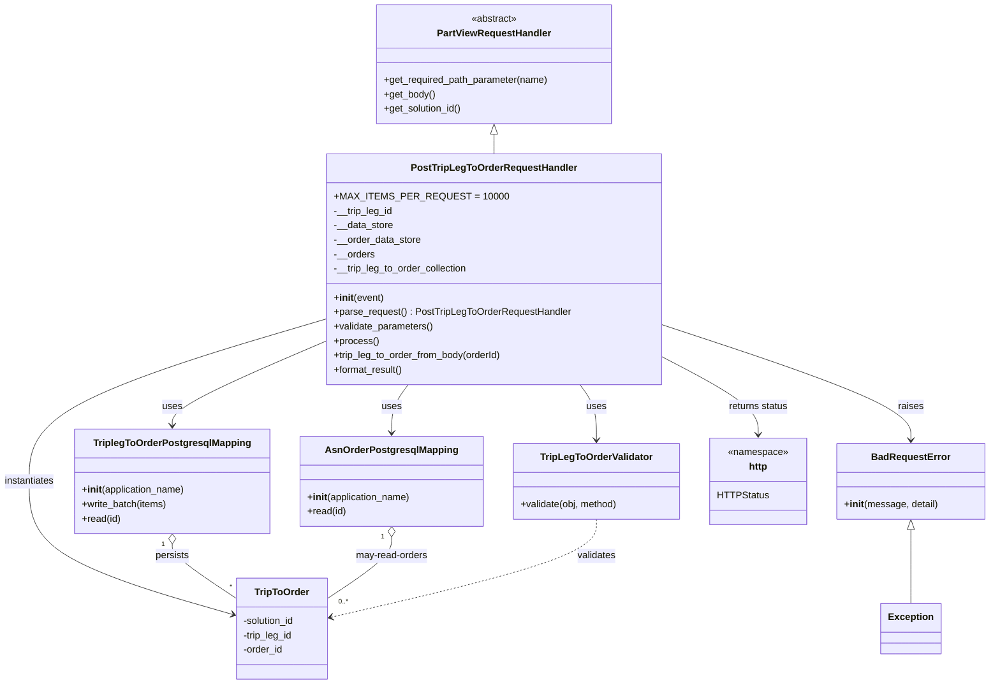

# Diagram: partview_core/partview_service/partview_service/api/trip_leg_to_order/handlers/post_trip_leg_to_order_handler.py

> Auto-generated by Obscura crawlers

## Mermaid

### SVG

<svg id="container" width="1637.1875" xmlns="http://www.w3.org/2000/svg" class="classDiagram" height="1138" viewBox="0 0 1637.1875 1138" role="graphics-document document" aria-roledescription="class"><g><defs><marker id="container_class-aggregationStart" class="marker aggregation class" refX="18" refY="7" markerWidth="190" markerHeight="240" orient="auto"><path d="M 18,7 L9,13 L1,7 L9,1 Z"></path></marker></defs><defs><marker id="container_class-aggregationEnd" class="marker aggregation class" refX="1" refY="7" markerWidth="20" markerHeight="28" orient="auto"><path d="M 18,7 L9,13 L1,7 L9,1 Z"></path></marker></defs><defs><marker id="container_class-extensionStart" class="marker extension class" refX="18" refY="7" markerWidth="190" markerHeight="240" orient="auto"><path d="M 1,7 L18,13 V 1 Z"></path></marker></defs><defs><marker id="container_class-extensionEnd" class="marker extension class" refX="1" refY="7" markerWidth="20" markerHeight="28" orient="auto"><path d="M 1,1 V 13 L18,7 Z"></path></marker></defs><defs><marker id="container_class-compositionStart" class="marker composition class" refX="18" refY="7" markerWidth="190" markerHeight="240" orient="auto"><path d="M 18,7 L9,13 L1,7 L9,1 Z"></path></marker></defs><defs><marker id="container_class-compositionEnd" class="marker composition class" refX="1" refY="7" markerWidth="20" markerHeight="28" orient="auto"><path d="M 18,7 L9,13 L1,7 L9,1 Z"></path></marker></defs><defs><marker id="container_class-dependencyStart" class="marker dependency class" refX="6" refY="7" markerWidth="190" markerHeight="240" orient="auto"><path d="M 5,7 L9,13 L1,7 L9,1 Z"></path></marker></defs><defs><marker id="container_class-dependencyEnd" class="marker dependency class" refX="13" refY="7" markerWidth="20" markerHeight="28" orient="auto"><path d="M 18,7 L9,13 L14,7 L9,1 Z"></path></marker></defs><defs><marker id="container_class-lollipopStart" class="marker lollipop class" refX="13" refY="7" markerWidth="190" markerHeight="240" orient="auto"><circle stroke="black" fill="transparent" cx="7" cy="7" r="6"></circle></marker></defs><defs><marker id="container_class-lollipopEnd" class="marker lollipop class" refX="1" refY="7" markerWidth="190" markerHeight="240" orient="auto"><circle stroke="black" fill="transparent" cx="7" cy="7" r="6"></circle></marker></defs><g class="root"><g class="clusters"></g><g class="edgePaths"><path d="M823.039,223.25L823.039,224.542C823.039,225.833,823.039,228.417,823.039,233.875C823.039,239.333,823.039,247.667,823.039,251.833L823.039,256" id="id_PartViewRequestHandler_PostTripLegToOrderRequestHandler_1" class="edge-thickness-normal edge-pattern-solid relation" style=";;;" data-edge="true" data-et="edge" data-id="id_PartViewRequestHandler_PostTripLegToOrderRequestHandler_1" data-points="W3sieCI6ODIzLjAzOTA2MjUsInkiOjIwNn0seyJ4Ijo4MjMuMDM5MDYyNSwieSI6MjMxfSx7IngiOjgyMy4wMzkwNjI1LCJ5IjoyNTZ9XQ==" marker-start="url(#container_class-extensionStart)"></path><path d="M548.59,565.99L505.554,584.491C462.518,602.993,376.447,639.997,333.411,663.665C290.375,687.333,290.375,697.667,290.375,702.833L290.375,708" id="id_PostTripLegToOrderRequestHandler_TriplegToOrderPostgresqlMapping_2" class="edge-thickness-normal edge-pattern-solid relation" style=";;;" data-edge="true" data-et="edge" data-id="id_PostTripLegToOrderRequestHandler_TriplegToOrderPostgresqlMapping_2" data-points="W3sieCI6NTQ4LjU4OTg0Mzc1LCJ5Ijo1NjUuOTg5Njk2NTQzMDI1Mn0seyJ4IjoyOTAuMzc1LCJ5Ijo2Nzd9LHsieCI6MjkwLjM3NSwieSI6NzE0fV0=" marker-end="url(#container_class-dependencyEnd)"></path><path d="M680.516,640L675.939,646.167C671.361,652.333,662.206,664.667,657.628,678C653.051,691.333,653.051,705.667,653.051,712.833L653.051,720" id="id_PostTripLegToOrderRequestHandler_AsnOrderPostgresqlMapping_3" class="edge-thickness-normal edge-pattern-solid relation" style=";;;" data-edge="true" data-et="edge" data-id="id_PostTripLegToOrderRequestHandler_AsnOrderPostgresqlMapping_3" data-points="W3sieCI6NjgwLjUxNjEzNjczNTgwNzksInkiOjY0MH0seyJ4Ijo2NTMuMDUwNzgxMjUsInkiOjY3N30seyJ4Ijo2NTMuMDUwNzgxMjUsInkiOjcyNn1d" marker-end="url(#container_class-dependencyEnd)"></path><path d="M548.59,529.397L465.644,553.998C382.698,578.598,216.806,627.799,133.86,673.066C50.914,718.333,50.914,759.667,50.914,801C50.914,842.333,50.914,883.667,107.046,920.474C163.177,957.281,275.441,989.562,331.573,1005.703L387.704,1021.843" id="id_PostTripLegToOrderRequestHandler_TripToOrder_4" class="edge-thickness-normal edge-pattern-solid relation" style=";;;" data-edge="true" data-et="edge" data-id="id_PostTripLegToOrderRequestHandler_TripToOrder_4" data-points="W3sieCI6NTQ4LjU4OTg0Mzc1LCJ5Ijo1MjkuMzk3Mjc1MTc0MDMyOH0seyJ4Ijo1MC45MTQwNjI1LCJ5Ijo2Nzd9LHsieCI6NTAuOTE0MDYyNSwieSI6ODAxfSx7IngiOjUwLjkxNDA2MjUsInkiOjkyNX0seyJ4IjozOTMuNDcwNzAzMTI1LCJ5IjoxMDIzLjUwMTU4OTcwMzM2Mzd9XQ==" marker-end="url(#container_class-dependencyEnd)"></path><path d="M965.562,640L970.14,646.167C974.717,652.333,983.872,664.667,988.45,680C993.027,695.333,993.027,713.667,993.027,722.833L993.027,732" id="id_PostTripLegToOrderRequestHandler_TripLegToOrderValidator_5" class="edge-thickness-normal edge-pattern-solid relation" style=";;;" data-edge="true" data-et="edge" data-id="id_PostTripLegToOrderRequestHandler_TripLegToOrderValidator_5" data-points="W3sieCI6OTY1LjU2MTk4ODI2NDE5MjEsInkiOjY0MH0seyJ4Ijo5OTMuMDI3MzQzNzUsInkiOjY3N30seyJ4Ijo5OTMuMDI3MzQzNzUsInkiOjczOH1d" marker-end="url(#container_class-dependencyEnd)"></path><path d="M1097.488,539.679L1166.002,562.566C1234.516,585.453,1371.543,631.226,1440.057,663.28C1508.57,695.333,1508.57,713.667,1508.57,722.833L1508.57,732" id="id_PostTripLegToOrderRequestHandler_BadRequestError_6" class="edge-thickness-normal edge-pattern-solid relation" style=";;;" data-edge="true" data-et="edge" data-id="id_PostTripLegToOrderRequestHandler_BadRequestError_6" data-points="W3sieCI6MTA5Ny40ODgyODEyNSwieSI6NTM5LjY3OTA3NTMwNjU1OTh9LHsieCI6MTUwOC41NzAzMTI1LCJ5Ijo2Nzd9LHsieCI6MTUwOC41NzAzMTI1LCJ5Ijo3Mzh9XQ==" marker-end="url(#container_class-dependencyEnd)"></path><path d="M1097.488,591.86L1124.559,606.05C1151.63,620.24,1205.772,648.62,1232.843,670.477C1259.914,692.333,1259.914,707.667,1259.914,715.333L1259.914,723" id="id_PostTripLegToOrderRequestHandler_http_7" class="edge-thickness-normal edge-pattern-solid relation" style=";;;" data-edge="true" data-et="edge" data-id="id_PostTripLegToOrderRequestHandler_http_7" data-points="W3sieCI6MTA5Ny40ODgyODEyNSwieSI6NTkxLjg2MDA3Njg5NTU2NX0seyJ4IjoxMjU5LjkxNDA2MjUsInkiOjY3N30seyJ4IjoxMjU5LjkxNDA2MjUsInkiOjcyOX1d" marker-end="url(#container_class-dependencyEnd)"></path><path d="M290.375,905.25L290.375,908.542C290.375,911.833,290.375,918.417,307.558,933.174C324.74,947.931,359.105,970.861,376.288,982.327L393.471,993.792" id="id_TriplegToOrderPostgresqlMapping_TripToOrder_8" class="edge-thickness-normal edge-pattern-solid relation" style=";;;" data-edge="true" data-et="edge" data-id="id_TriplegToOrderPostgresqlMapping_TripToOrder_8" data-points="W3sieCI6MjkwLjM3NSwieSI6ODg4fSx7IngiOjI5MC4zNzUsInkiOjkyNX0seyJ4IjozOTMuNDcwNzAzMTI1LCJ5Ijo5OTMuNzkxOTExMjQ5OTMyN31d" marker-start="url(#container_class-aggregationStart)"></path><path d="M653.051,893.25L653.051,898.542C653.051,903.833,653.051,914.417,635.868,931.174C618.686,947.931,584.32,970.861,567.138,982.327L549.955,993.792" id="id_AsnOrderPostgresqlMapping_TripToOrder_9" class="edge-thickness-normal edge-pattern-solid relation" style=";;;" data-edge="true" data-et="edge" data-id="id_AsnOrderPostgresqlMapping_TripToOrder_9" data-points="W3sieCI6NjUzLjA1MDc4MTI1LCJ5Ijo4NzZ9LHsieCI6NjUzLjA1MDc4MTI1LCJ5Ijo5MjV9LHsieCI6NTQ5Ljk1NTA3ODEyNSwieSI6OTkzLjc5MTkxMTI0OTkzMjd9XQ==" marker-start="url(#container_class-aggregationStart)"></path><path d="M993.027,864L993.027,874.167C993.027,884.333,993.027,904.667,920.156,931.747C847.285,958.828,701.542,992.655,628.671,1009.569L555.8,1026.483" id="id_TripLegToOrderValidator_TripToOrder_10" class="edge-thickness-normal edge-pattern-dashed relation" style=";;;" data-edge="true" data-et="edge" data-id="id_TripLegToOrderValidator_TripToOrder_10" data-points="W3sieCI6OTkzLjAyNzM0Mzc1LCJ5Ijo4NjR9LHsieCI6OTkzLjAyNzM0Mzc1LCJ5Ijo5MjV9LHsieCI6NTQ5Ljk1NTA3ODEyNSwieSI6MTAyNy44Mzk1NTA3MTUwMjd9XQ==" marker-end="url(#container_class-dependencyEnd)"></path><path d="M1508.57,881.25L1508.57,888.542C1508.57,895.833,1508.57,910.417,1508.57,930.875C1508.57,951.333,1508.57,977.667,1508.57,990.833L1508.57,1004" id="id_BadRequestError_Exception_11" class="edge-thickness-normal edge-pattern-solid relation" style=";;;" data-edge="true" data-et="edge" data-id="id_BadRequestError_Exception_11" data-points="W3sieCI6MTUwOC41NzAzMTI1LCJ5Ijo4NjR9LHsieCI6MTUwOC41NzAzMTI1LCJ5Ijo5MjV9LHsieCI6MTUwOC41NzAzMTI1LCJ5IjoxMDA0fV0=" marker-start="url(#container_class-extensionStart)"></path></g><g class="edgeLabels"><g class="edgeLabel"><g class="label" data-id="id_PartViewRequestHandler_PostTripLegToOrderRequestHandler_1" transform="translate(0, 0)"><foreignObject width="0" height="0">

</foreignObject></g></g><g class="edgeLabel" transform="translate(290.375, 677)"><g class="label" data-id="id_PostTripLegToOrderRequestHandler_TriplegToOrderPostgresqlMapping_2" transform="translate(-16.4921875, -12)"><foreignObject width="32.984375" height="24">

uses

</foreignObject></g></g><g class="edgeLabel" transform="translate(653.05078125, 677)"><g class="label" data-id="id_PostTripLegToOrderRequestHandler_AsnOrderPostgresqlMapping_3" transform="translate(-16.4921875, -12)"><foreignObject width="32.984375" height="24">

uses

</foreignObject></g></g><g class="edgeLabel" transform="translate(50.9140625, 801)"><g class="label" data-id="id_PostTripLegToOrderRequestHandler_TripToOrder_4" transform="translate(-42.9140625, -12)"><foreignObject width="85.828125" height="24">

instantiates

</foreignObject></g></g><g class="edgeLabel" transform="translate(993.02734375, 677)"><g class="label" data-id="id_PostTripLegToOrderRequestHandler_TripLegToOrderValidator_5" transform="translate(-16.4921875, -12)"><foreignObject width="32.984375" height="24">

uses

</foreignObject></g></g><g class="edgeLabel" transform="translate(1508.5703125, 677)"><g class="label" data-id="id_PostTripLegToOrderRequestHandler_BadRequestError_6" transform="translate(-21.25, -12)"><foreignObject width="42.5" height="24">

raises

</foreignObject></g></g><g class="edgeLabel" transform="translate(1259.9140625, 677)"><g class="label" data-id="id_PostTripLegToOrderRequestHandler_http_7" transform="translate(-50.5859375, -12)"><foreignObject width="101.171875" height="24">

returns status

</foreignObject></g></g><g class="edgeLabel" transform="translate(290.375, 925)"><g class="label" data-id="id_TriplegToOrderPostgresqlMapping_TripToOrder_8" transform="translate(-28.4375, -12)"><foreignObject width="56.875" height="24">

persists

</foreignObject></g></g><g class="edgeLabel" transform="translate(653.05078125, 925)"><g class="label" data-id="id_AsnOrderPostgresqlMapping_TripToOrder_9" transform="translate(-61.03125, -12)"><foreignObject width="122.0625" height="24">

may-read-orders

</foreignObject></g></g><g class="edgeLabel" transform="translate(993.02734375, 925)"><g class="label" data-id="id_TripLegToOrderValidator_TripToOrder_10" transform="translate(-32.6875, -12)"><foreignObject width="65.375" height="24">

validates

</foreignObject></g></g><g class="edgeLabel"><g class="label" data-id="id_BadRequestError_Exception_11" transform="translate(0, 0)"><foreignObject width="0" height="0">

</foreignObject></g></g><g class="edgeTerminals" transform="translate(275.375, 905.5)"><g class="inner" transform="translate(0, 0)"><foreignObject style="width: 9px; height: 12px;">
1
</foreignObject></g></g><g class="edgeTerminals" transform="translate(638.050780625, 893.4999994642857)"><g class="inner" transform="translate(0, 0)"><foreignObject style="width: 9px; height: 12px;">
1
</foreignObject></g></g><g class="edgeTerminals" transform="translate(382.23947734112465, 966.6013296339689)"><g class="inner" transform="translate(0, 0)"></g><foreignObject style="width: 9px; height: 12px;">
*
</foreignObject></g><g class="edgeTerminals" transform="translate(567.8376050884624, 991.5559714509246)"><g class="inner" transform="translate(0, 0)"></g><foreignObject style="width: 36px; height: 12px;">
0..*
</foreignObject></g></g><g class="nodes"><g class="node default" id="classId-PartViewRequestHandler-0" transform="translate(823.0390625, 107)"><g class="basic label-container"><path d="M-195.984375 -99 L195.984375 -99 L195.984375 99 L-195.984375 99" stroke="none" stroke-width="0" fill="#ECECFF" style=""></path><path d="M-195.984375 -99 C-74.14333341159588 -99, 47.69770817680825 -99, 195.984375 -99 M-195.984375 -99 C-46.23741532590586 -99, 103.50954434818829 -99, 195.984375 -99 M195.984375 -99 C195.984375 -28.348728755024936, 195.984375 42.30254248995013, 195.984375 99 M195.984375 -99 C195.984375 -38.76959968566648, 195.984375 21.460800628667045, 195.984375 99 M195.984375 99 C114.01564875671686 99, 32.046922513433714 99, -195.984375 99 M195.984375 99 C71.97404298772172 99, -52.03628902455657 99, -195.984375 99 M-195.984375 99 C-195.984375 26.79550519247765, -195.984375 -45.4089896150447, -195.984375 -99 M-195.984375 99 C-195.984375 23.810438244980304, -195.984375 -51.37912351003939, -195.984375 -99" stroke="#9370DB" stroke-width="1.3" fill="none" stroke-dasharray="0 0" style=""></path></g><g class="annotation-group text" transform="translate(-38.609375, -75)"><g class="label" style="" transform="translate(0,-12)"><foreignObject width="77.21875" height="24">

«abstract»

</foreignObject></g></g><g class="label-group text" transform="translate(-91.359375, -51)"><g class="label" style="font-weight: bolder" transform="translate(0,-12)"><foreignObject width="182.71875" height="24">

PartViewRequestHandler

</foreignObject></g></g><g class="members-group text" transform="translate(-183.984375, -3)"></g><g class="methods-group text" transform="translate(-183.984375, 27)"><g class="label" style="" transform="translate(0,-12)"><foreignObject width="276.609375" height="24">

+get_required_path_parameter(name)

</foreignObject></g><g class="label" style="" transform="translate(0,12)"><foreignObject width="85.53125" height="24">

+get_body()

</foreignObject></g><g class="label" style="" transform="translate(0,36)"><foreignObject width="131.46875" height="24">

+get_solution_id()

</foreignObject></g></g><g class="divider" style=""><path d="M-195.984375 -27 C-97.0104339978784 -27, 1.963507004243212 -27, 195.984375 -27 M-195.984375 -27 C-75.1221380180289 -27, 45.74009896394219 -27, 195.984375 -27" stroke="#9370DB" stroke-width="1.3" fill="none" stroke-dasharray="0 0" style=""></path></g><g class="divider" style=""><path d="M-195.984375 -3 C-80.4886424573674 -3, 35.00709008526519 -3, 195.984375 -3 M-195.984375 -3 C-113.55851193395743 -3, -31.132648867914867 -3, 195.984375 -3" stroke="#9370DB" stroke-width="1.3" fill="none" stroke-dasharray="0 0" style=""></path></g></g><g class="node default" id="classId-PostTripLegToOrderRequestHandler-1" transform="translate(823.0390625, 448)"><g class="basic label-container"><path d="M-274.44921875 -192 L274.44921875 -192 L274.44921875 192 L-274.44921875 192" stroke="none" stroke-width="0" fill="#ECECFF" style=""></path><path d="M-274.44921875 -192 C-160.45147826769718 -192, -46.45373778539437 -192, 274.44921875 -192 M-274.44921875 -192 C-72.62106991580097 -192, 129.20707891839805 -192, 274.44921875 -192 M274.44921875 -192 C274.44921875 -73.47456226380206, 274.44921875 45.05087547239589, 274.44921875 192 M274.44921875 -192 C274.44921875 -96.37676079624461, 274.44921875 -0.7535215924892213, 274.44921875 192 M274.44921875 192 C146.5540379244527 192, 18.658857098905372 192, -274.44921875 192 M274.44921875 192 C75.63166088574997 192, -123.18589697850007 192, -274.44921875 192 M-274.44921875 192 C-274.44921875 103.57904757914436, -274.44921875 15.158095158288717, -274.44921875 -192 M-274.44921875 192 C-274.44921875 89.65547524173252, -274.44921875 -12.689049516534965, -274.44921875 -192" stroke="#9370DB" stroke-width="1.3" fill="none" stroke-dasharray="0 0" style=""></path></g><g class="annotation-group text" transform="translate(0, -168)"></g><g class="label-group text" transform="translate(-131.7734375, -168)"><g class="label" style="font-weight: bolder" transform="translate(0,-12)"><foreignObject width="263.546875" height="24">

PostTripLegToOrderRequestHandler

</foreignObject></g></g><g class="members-group text" transform="translate(-262.44921875, -120)"><g class="label" style="" transform="translate(0,-12)"><foreignObject width="256.59375" height="24">

+MAX_ITEMS_PER_REQUEST = 10000

</foreignObject></g><g class="label" style="" transform="translate(0,12)"><foreignObject width="99.25" height="24">

-__trip_leg_id

</foreignObject></g><g class="label" style="" transform="translate(0,36)"><foreignObject width="99.0625" height="24">

-__data_store

</foreignObject></g><g class="label" style="" transform="translate(0,60)"><foreignObject width="145.28125" height="24">

-__order_data_store

</foreignObject></g><g class="label" style="" transform="translate(0,84)"><foreignObject width="68.078125" height="24">

-__orders

</foreignObject></g><g class="label" style="" transform="translate(0,108)"><foreignObject width="224.984375" height="24">

-__trip_leg_to_order_collection

</foreignObject></g></g><g class="methods-group text" transform="translate(-262.44921875, 48)"><g class="label" style="" transform="translate(0,-12)"><foreignObject width="83.140625" height="24">

+<strong>init</strong>(event)

</foreignObject></g><g class="label" style="" transform="translate(0,12)"><foreignObject width="393.125" height="24">

+parse_request() : PostTripLegToOrderRequestHandler

</foreignObject></g><g class="label" style="" transform="translate(0,36)"><foreignObject width="166.546875" height="24">

+validate_parameters()

</foreignObject></g><g class="label" style="" transform="translate(0,60)"><foreignObject width="73.734375" height="24">

+process()

</foreignObject></g><g class="label" style="" transform="translate(0,84)"><foreignObject width="283.09375" height="24">

+trip_leg_to_order_from_body(orderId)

</foreignObject></g><g class="label" style="" transform="translate(0,108)"><foreignObject width="117.015625" height="24">

+format_result()

</foreignObject></g></g><g class="divider" style=""><path d="M-274.44921875 -144 C-115.60903167541053 -144, 43.23115539917893 -144, 274.44921875 -144 M-274.44921875 -144 C-78.51290851153769 -144, 117.42340172692462 -144, 274.44921875 -144" stroke="#9370DB" stroke-width="1.3" fill="none" stroke-dasharray="0 0" style=""></path></g><g class="divider" style=""><path d="M-274.44921875 24 C-55.588525429061264 24, 163.27216789187747 24, 274.44921875 24 M-274.44921875 24 C-161.52586770076647 24, -48.602516651532966 24, 274.44921875 24" stroke="#9370DB" stroke-width="1.3" fill="none" stroke-dasharray="0 0" style=""></path></g></g><g class="node default" id="classId-TriplegToOrderPostgresqlMapping-2" transform="translate(290.375, 801)"><g class="basic label-container"><path d="M-161.546875 -87 L161.546875 -87 L161.546875 87 L-161.546875 87" stroke="none" stroke-width="0" fill="#ECECFF" style=""></path><path d="M-161.546875 -87 C-76.80508387905768 -87, 7.936707241884648 -87, 161.546875 -87 M-161.546875 -87 C-52.618986267686395 -87, 56.30890246462721 -87, 161.546875 -87 M161.546875 -87 C161.546875 -50.36052434724975, 161.546875 -13.721048694499501, 161.546875 87 M161.546875 -87 C161.546875 -23.873305249207924, 161.546875 39.25338950158415, 161.546875 87 M161.546875 87 C92.21163311435473 87, 22.87639122870945 87, -161.546875 87 M161.546875 87 C87.39509247348413 87, 13.243309946968253 87, -161.546875 87 M-161.546875 87 C-161.546875 34.62201873785442, -161.546875 -17.755962524291164, -161.546875 -87 M-161.546875 87 C-161.546875 50.06137889497153, -161.546875 13.122757789943066, -161.546875 -87" stroke="#9370DB" stroke-width="1.3" fill="none" stroke-dasharray="0 0" style=""></path></g><g class="annotation-group text" transform="translate(0, -63)"></g><g class="label-group text" transform="translate(-125.359375, -63)"><g class="label" style="font-weight: bolder" transform="translate(0,-12)"><foreignObject width="250.71875" height="24">

TriplegToOrderPostgresqlMapping

</foreignObject></g></g><g class="members-group text" transform="translate(-149.546875, -15)"></g><g class="methods-group text" transform="translate(-149.546875, 15)"><g class="label" style="" transform="translate(0,-12)"><foreignObject width="173.734375" height="24">

+<strong>init</strong>(application_name)

</foreignObject></g><g class="label" style="" transform="translate(0,12)"><foreignObject width="143.34375" height="24">

+write_batch(items)

</foreignObject></g><g class="label" style="" transform="translate(0,36)"><foreignObject width="64.96875" height="24">

+read(id)

</foreignObject></g></g><g class="divider" style=""><path d="M-161.546875 -39 C-36.77262675460483 -39, 88.00162149079034 -39, 161.546875 -39 M-161.546875 -39 C-61.092312051568214 -39, 39.36225089686357 -39, 161.546875 -39" stroke="#9370DB" stroke-width="1.3" fill="none" stroke-dasharray="0 0" style=""></path></g><g class="divider" style=""><path d="M-161.546875 -15 C-83.8898217006505 -15, -6.232768401301001 -15, 161.546875 -15 M-161.546875 -15 C-80.3181236977231 -15, 0.9106276045538095 -15, 161.546875 -15" stroke="#9370DB" stroke-width="1.3" fill="none" stroke-dasharray="0 0" style=""></path></g></g><g class="node default" id="classId-AsnOrderPostgresqlMapping-3" transform="translate(653.05078125, 801)"><g class="basic label-container"><path d="M-151.12890625 -75 L151.12890625 -75 L151.12890625 75 L-151.12890625 75" stroke="none" stroke-width="0" fill="#ECECFF" style=""></path><path d="M-151.12890625 -75 C-32.65974947160592 -75, 85.80940730678816 -75, 151.12890625 -75 M-151.12890625 -75 C-89.2803606451601 -75, -27.43181504032019 -75, 151.12890625 -75 M151.12890625 -75 C151.12890625 -28.891915892569408, 151.12890625 17.216168214861185, 151.12890625 75 M151.12890625 -75 C151.12890625 -20.79276089166649, 151.12890625 33.41447821666702, 151.12890625 75 M151.12890625 75 C48.9455034272612 75, -53.2378993954776 75, -151.12890625 75 M151.12890625 75 C87.56888484960672 75, 24.008863449213436 75, -151.12890625 75 M-151.12890625 75 C-151.12890625 32.25606149746543, -151.12890625 -10.487877005069137, -151.12890625 -75 M-151.12890625 75 C-151.12890625 41.60395394114333, -151.12890625 8.207907882286662, -151.12890625 -75" stroke="#9370DB" stroke-width="1.3" fill="none" stroke-dasharray="0 0" style=""></path></g><g class="annotation-group text" transform="translate(0, -51)"></g><g class="label-group text" transform="translate(-104.5234375, -51)"><g class="label" style="font-weight: bolder" transform="translate(0,-12)"><foreignObject width="209.046875" height="24">

AsnOrderPostgresqlMapping

</foreignObject></g></g><g class="members-group text" transform="translate(-139.12890625, -3)"></g><g class="methods-group text" transform="translate(-139.12890625, 27)"><g class="label" style="" transform="translate(0,-12)"><foreignObject width="173.734375" height="24">

+<strong>init</strong>(application_name)

</foreignObject></g><g class="label" style="" transform="translate(0,12)"><foreignObject width="64.96875" height="24">

+read(id)

</foreignObject></g></g><g class="divider" style=""><path d="M-151.12890625 -27 C-86.40668521789772 -27, -21.684464185795434 -27, 151.12890625 -27 M-151.12890625 -27 C-39.77545637464486 -27, 71.57799350071028 -27, 151.12890625 -27" stroke="#9370DB" stroke-width="1.3" fill="none" stroke-dasharray="0 0" style=""></path></g><g class="divider" style=""><path d="M-151.12890625 -3 C-62.97444324053261 -3, 25.180019768934784 -3, 151.12890625 -3 M-151.12890625 -3 C-72.98786952776393 -3, 5.1531671944721325 -3, 151.12890625 -3" stroke="#9370DB" stroke-width="1.3" fill="none" stroke-dasharray="0 0" style=""></path></g></g><g class="node default" id="classId-TripToOrder-4" transform="translate(471.712890625, 1046)"><g class="basic label-container"><path d="M-78.2421875 -84 L78.2421875 -84 L78.2421875 84 L-78.2421875 84" stroke="none" stroke-width="0" fill="#ECECFF" style=""></path><path d="M-78.2421875 -84 C-36.68826784212479 -84, 4.865651815750425 -84, 78.2421875 -84 M-78.2421875 -84 C-37.169276728690434 -84, 3.9036340426191316 -84, 78.2421875 -84 M78.2421875 -84 C78.2421875 -49.89405408656918, 78.2421875 -15.788108173138355, 78.2421875 84 M78.2421875 -84 C78.2421875 -36.199357860518596, 78.2421875 11.601284278962808, 78.2421875 84 M78.2421875 84 C31.48650495010323 84, -15.269177599793537 84, -78.2421875 84 M78.2421875 84 C35.45974578504969 84, -7.322695929900618 84, -78.2421875 84 M-78.2421875 84 C-78.2421875 29.544497533888205, -78.2421875 -24.91100493222359, -78.2421875 -84 M-78.2421875 84 C-78.2421875 23.94272205688928, -78.2421875 -36.11455588622144, -78.2421875 -84" stroke="#9370DB" stroke-width="1.3" fill="none" stroke-dasharray="0 0" style=""></path></g><g class="annotation-group text" transform="translate(0, -60)"></g><g class="label-group text" transform="translate(-43.796875, -60)"><g class="label" style="font-weight: bolder" transform="translate(0,-12)"><foreignObject width="87.59375" height="24">

TripToOrder

</foreignObject></g></g><g class="members-group text" transform="translate(-66.2421875, -12)"><g class="label" style="" transform="translate(0,-12)"><foreignObject width="88.6875" height="24">

-solution_id

</foreignObject></g><g class="label" style="" transform="translate(0,12)"><foreignObject width="84.296875" height="24">

-trip_leg_id

</foreignObject></g><g class="label" style="" transform="translate(0,36)"><foreignObject width="67.078125" height="24">

-order_id

</foreignObject></g></g><g class="methods-group text" transform="translate(-66.2421875, 84)"></g><g class="divider" style=""><path d="M-78.2421875 -36 C-46.2775717874542 -36, -14.3129560749084 -36, 78.2421875 -36 M-78.2421875 -36 C-31.253239176589474 -36, 15.735709146821051 -36, 78.2421875 -36" stroke="#9370DB" stroke-width="1.3" fill="none" stroke-dasharray="0 0" style=""></path></g><g class="divider" style=""><path d="M-78.2421875 60 C-35.9066110457017 60, 6.428965408596596 60, 78.2421875 60 M-78.2421875 60 C-38.133902914152074 60, 1.974381671695852 60, 78.2421875 60" stroke="#9370DB" stroke-width="1.3" fill="none" stroke-dasharray="0 0" style=""></path></g></g><g class="node default" id="classId-TripLegToOrderValidator-5" transform="translate(993.02734375, 801)"><g class="basic label-container"><path d="M-138.84765625 -63 L138.84765625 -63 L138.84765625 63 L-138.84765625 63" stroke="none" stroke-width="0" fill="#ECECFF" style=""></path><path d="M-138.84765625 -63 C-47.776600111873435 -63, 43.29445602625313 -63, 138.84765625 -63 M-138.84765625 -63 C-42.432036692772655 -63, 53.98358286445469 -63, 138.84765625 -63 M138.84765625 -63 C138.84765625 -29.158777539676578, 138.84765625 4.682444920646844, 138.84765625 63 M138.84765625 -63 C138.84765625 -19.762776102317872, 138.84765625 23.474447795364256, 138.84765625 63 M138.84765625 63 C81.53294642463007 63, 24.218236599260152 63, -138.84765625 63 M138.84765625 63 C48.82849907435475 63, -41.190658101290495 63, -138.84765625 63 M-138.84765625 63 C-138.84765625 33.756912439672874, -138.84765625 4.513824879345748, -138.84765625 -63 M-138.84765625 63 C-138.84765625 17.97131613558082, -138.84765625 -27.057367728838358, -138.84765625 -63" stroke="#9370DB" stroke-width="1.3" fill="none" stroke-dasharray="0 0" style=""></path></g><g class="annotation-group text" transform="translate(0, -39)"></g><g class="label-group text" transform="translate(-89.7109375, -39)"><g class="label" style="font-weight: bolder" transform="translate(0,-12)"><foreignObject width="179.421875" height="24">

TripLegToOrderValidator

</foreignObject></g></g><g class="members-group text" transform="translate(-126.84765625, 9)"></g><g class="methods-group text" transform="translate(-126.84765625, 39)"><g class="label" style="" transform="translate(0,-12)"><foreignObject width="163.984375" height="24">

+validate(obj, method)

</foreignObject></g></g><g class="divider" style=""><path d="M-138.84765625 -15 C-53.692594669760354 -15, 31.462466910479293 -15, 138.84765625 -15 M-138.84765625 -15 C-43.59650059326975 -15, 51.654655063460496 -15, 138.84765625 -15" stroke="#9370DB" stroke-width="1.3" fill="none" stroke-dasharray="0 0" style=""></path></g><g class="divider" style=""><path d="M-138.84765625 9 C-48.73058762393637 9, 41.386481002127255 9, 138.84765625 9 M-138.84765625 9 C-36.58568049160745 9, 65.6762952667851 9, 138.84765625 9" stroke="#9370DB" stroke-width="1.3" fill="none" stroke-dasharray="0 0" style=""></path></g></g><g class="node default" id="classId-BadRequestError-6" transform="translate(1508.5703125, 801)"><g class="basic label-container"><path d="M-120.6171875 -63 L120.6171875 -63 L120.6171875 63 L-120.6171875 63" stroke="none" stroke-width="0" fill="#ECECFF" style=""></path><path d="M-120.6171875 -63 C-44.022235885567284 -63, 32.57271572886543 -63, 120.6171875 -63 M-120.6171875 -63 C-44.82151188556479 -63, 30.974163728870423 -63, 120.6171875 -63 M120.6171875 -63 C120.6171875 -30.94152089992312, 120.6171875 1.1169582001537606, 120.6171875 63 M120.6171875 -63 C120.6171875 -27.81467942122893, 120.6171875 7.3706411575421384, 120.6171875 63 M120.6171875 63 C57.726516997846225 63, -5.164153504307549 63, -120.6171875 63 M120.6171875 63 C35.12615168124232 63, -50.36488413751536 63, -120.6171875 63 M-120.6171875 63 C-120.6171875 17.649648552884003, -120.6171875 -27.700702894231995, -120.6171875 -63 M-120.6171875 63 C-120.6171875 24.975068104497254, -120.6171875 -13.049863791005492, -120.6171875 -63" stroke="#9370DB" stroke-width="1.3" fill="none" stroke-dasharray="0 0" style=""></path></g><g class="annotation-group text" transform="translate(0, -39)"></g><g class="label-group text" transform="translate(-62.28125, -39)"><g class="label" style="font-weight: bolder" transform="translate(0,-12)"><foreignObject width="124.5625" height="24">

BadRequestError

</foreignObject></g></g><g class="members-group text" transform="translate(-108.6171875, 9)"></g><g class="methods-group text" transform="translate(-108.6171875, 39)"><g class="label" style="" transform="translate(0,-12)"><foreignObject width="154.953125" height="24">

+<strong>init</strong>(message, detail)

</foreignObject></g></g><g class="divider" style=""><path d="M-120.6171875 -15 C-54.562117047423385 -15, 11.49295340515323 -15, 120.6171875 -15 M-120.6171875 -15 C-30.091416513595746 -15, 60.43435447280851 -15, 120.6171875 -15" stroke="#9370DB" stroke-width="1.3" fill="none" stroke-dasharray="0 0" style=""></path></g><g class="divider" style=""><path d="M-120.6171875 9 C-26.963964291009447 9, 66.6892589179811 9, 120.6171875 9 M-120.6171875 9 C-69.19310858350346 9, -17.769029667006933 9, 120.6171875 9" stroke="#9370DB" stroke-width="1.3" fill="none" stroke-dasharray="0 0" style=""></path></g></g><g class="node default" id="classId-http-7" transform="translate(1259.9140625, 801)"><g class="basic label-container"><path d="M-78.0390625 -72 L78.0390625 -72 L78.0390625 72 L-78.0390625 72" stroke="none" stroke-width="0" fill="#ECECFF" style=""></path><path d="M-78.0390625 -72 C-33.25294979620399 -72, 11.533162907592015 -72, 78.0390625 -72 M-78.0390625 -72 C-33.49013167261545 -72, 11.058799154769105 -72, 78.0390625 -72 M78.0390625 -72 C78.0390625 -19.898857677665966, 78.0390625 32.20228464466807, 78.0390625 72 M78.0390625 -72 C78.0390625 -21.290319616329484, 78.0390625 29.419360767341033, 78.0390625 72 M78.0390625 72 C29.21432624199354 72, -19.61041001601292 72, -78.0390625 72 M78.0390625 72 C16.90772697683294 72, -44.22360854633412 72, -78.0390625 72 M-78.0390625 72 C-78.0390625 23.704434687044646, -78.0390625 -24.591130625910708, -78.0390625 -72 M-78.0390625 72 C-78.0390625 33.688645040894805, -78.0390625 -4.62270991821039, -78.0390625 -72" stroke="#9370DB" stroke-width="1.3" fill="none" stroke-dasharray="0 0" style=""></path></g><g class="annotation-group text" transform="translate(-50.015625, -48)"><g class="label" style="" transform="translate(0,-12)"><foreignObject width="100.03125" height="24">

«namespace»

</foreignObject></g></g><g class="label-group text" transform="translate(-15.5703125, -24)"><g class="label" style="font-weight: bolder" transform="translate(0,-12)"><foreignObject width="31.140625" height="24">

http

</foreignObject></g></g><g class="members-group text" transform="translate(-66.0390625, 24)"><g class="label" style="" transform="translate(0,-12)"><foreignObject width="82.0625" height="24">

HTTPStatus

</foreignObject></g></g><g class="methods-group text" transform="translate(-66.0390625, 72)"></g><g class="divider" style=""><path d="M-78.0390625 0 C-42.41838575870089 0, -6.797709017401786 0, 78.0390625 0 M-78.0390625 0 C-44.618856581934224 0, -11.198650663868449 0, 78.0390625 0" stroke="#9370DB" stroke-width="1.3" fill="none" stroke-dasharray="0 0" style=""></path></g><g class="divider" style=""><path d="M-78.0390625 48 C-33.61894452183763 48, 10.801173456324733 48, 78.0390625 48 M-78.0390625 48 C-27.15966799339744 48, 23.719726513205117 48, 78.0390625 48" stroke="#9370DB" stroke-width="1.3" fill="none" stroke-dasharray="0 0" style=""></path></g></g><g class="node default" id="classId-Exception-8" transform="translate(1508.5703125, 1046)"><g class="basic label-container"><path d="M-47.703125 -42 L47.703125 -42 L47.703125 42 L-47.703125 42" stroke="none" stroke-width="0" fill="#ECECFF" style=""></path><path d="M-47.703125 -42 C-11.18434434542285 -42, 25.3344363091543 -42, 47.703125 -42 M-47.703125 -42 C-25.061145340913395 -42, -2.41916568182679 -42, 47.703125 -42 M47.703125 -42 C47.703125 -9.039143388298058, 47.703125 23.921713223403884, 47.703125 42 M47.703125 -42 C47.703125 -19.381773894792204, 47.703125 3.2364522104155924, 47.703125 42 M47.703125 42 C27.392789023860544 42, 7.0824530477210885 42, -47.703125 42 M47.703125 42 C17.7077516925544 42, -12.2876216148912 42, -47.703125 42 M-47.703125 42 C-47.703125 10.192690986458079, -47.703125 -21.614618027083843, -47.703125 -42 M-47.703125 42 C-47.703125 21.302925759168012, -47.703125 0.6058515183360242, -47.703125 -42" stroke="#9370DB" stroke-width="1.3" fill="none" stroke-dasharray="0 0" style=""></path></g><g class="annotation-group text" transform="translate(0, -18)"></g><g class="label-group text" transform="translate(-35.703125, -18)"><g class="label" style="font-weight: bolder" transform="translate(0,-12)"><foreignObject width="71.40625" height="24">

Exception

</foreignObject></g></g><g class="members-group text" transform="translate(-35.703125, 30)"></g><g class="methods-group text" transform="translate(-35.703125, 60)"></g><g class="divider" style=""><path d="M-47.703125 6 C-28.368333407098497 6, -9.033541814196994 6, 47.703125 6 M-47.703125 6 C-12.980906545919815 6, 21.74131190816037 6, 47.703125 6" stroke="#9370DB" stroke-width="1.3" fill="none" stroke-dasharray="0 0" style=""></path></g><g class="divider" style=""><path d="M-47.703125 24 C-17.67911079221666 24, 12.344903415566677 24, 47.703125 24 M-47.703125 24 C-11.479172422180277 24, 24.744780155639447 24, 47.703125 24" stroke="#9370DB" stroke-width="1.3" fill="none" stroke-dasharray="0 0" style=""></path></g></g></g></g></g></svg>
