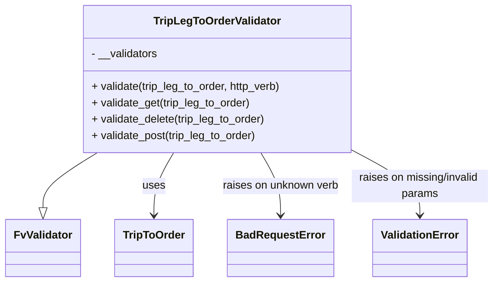

# Diagram: partview_core/partview_service/partview_service/api/trip_leg_to_order/handlers/validate/TripLegToOrderValidator.py


> Auto-generated by Obscura crawlers

## Diagram 1



### SVG

<svg id="container" width="713.984375" xmlns="http://www.w3.org/2000/svg" class="classDiagram" height="414" viewBox="0 0 713.984375 414" role="graphics-document document" aria-roledescription="class"><style>#container{font-family:"trebuchet ms",verdana,arial,sans-serif;font-size:16px;fill:#333;}@keyframes edge-animation-frame{from{stroke-dashoffset:0;}}@keyframes dash{to{stroke-dashoffset:0;}}#container .edge-animation-slow{stroke-dasharray:9,5!important;stroke-dashoffset:900;animation:dash 50s linear infinite;stroke-linecap:round;}#container .edge-animation-fast{stroke-dasharray:9,5!important;stroke-dashoffset:900;animation:dash 20s linear infinite;stroke-linecap:round;}#container .error-icon{fill:#552222;}#container .error-text{fill:#552222;stroke:#552222;}#container .edge-thickness-normal{stroke-width:1px;}#container .edge-thickness-thick{stroke-width:3.5px;}#container .edge-pattern-solid{stroke-dasharray:0;}#container .edge-thickness-invisible{stroke-width:0;fill:none;}#container .edge-pattern-dashed{stroke-dasharray:3;}#container .edge-pattern-dotted{stroke-dasharray:2;}#container .marker{fill:#333333;stroke:#333333;}#container .marker.cross{stroke:#333333;}#container svg{font-family:"trebuchet ms",verdana,arial,sans-serif;font-size:16px;}#container p{margin:0;}#container g.classGroup text{fill:#9370DB;stroke:none;font-family:"trebuchet ms",verdana,arial,sans-serif;font-size:10px;}#container g.classGroup text .title{font-weight:bolder;}#container .nodeLabel,#container .edgeLabel{color:#131300;}#container .edgeLabel .label rect{fill:#ECECFF;}#container .label text{fill:#131300;}#container .labelBkg{background:#ECECFF;}#container .edgeLabel .label span{background:#ECECFF;}#container .classTitle{font-weight:bolder;}#container .node rect,#container .node circle,#container .node ellipse,#container .node polygon,#container .node path{fill:#ECECFF;stroke:#9370DB;stroke-width:1px;}#container .divider{stroke:#9370DB;stroke-width:1;}#container g.clickable{cursor:pointer;}#container g.classGroup rect{fill:#ECECFF;stroke:#9370DB;}#container g.classGroup line{stroke:#9370DB;stroke-width:1;}#container .classLabel .box{stroke:none;stroke-width:0;fill:#ECECFF;opacity:0.5;}#container .classLabel .label{fill:#9370DB;font-size:10px;}#container .relation{stroke:#333333;stroke-width:1;fill:none;}#container .dashed-line{stroke-dasharray:3;}#container .dotted-line{stroke-dasharray:1 2;}#container #compositionStart,#container .composition{fill:#333333!important;stroke:#333333!important;stroke-width:1;}#container #compositionEnd,#container .composition{fill:#333333!important;stroke:#333333!important;stroke-width:1;}#container #dependencyStart,#container .dependency{fill:#333333!important;stroke:#333333!important;stroke-width:1;}#container #dependencyStart,#container .dependency{fill:#333333!important;stroke:#333333!important;stroke-width:1;}#container #extensionStart,#container .extension{fill:transparent!important;stroke:#333333!important;stroke-width:1;}#container #extensionEnd,#container .extension{fill:transparent!important;stroke:#333333!important;stroke-width:1;}#container #aggregationStart,#container .aggregation{fill:transparent!important;stroke:#333333!important;stroke-width:1;}#container #aggregationEnd,#container .aggregation{fill:transparent!important;stroke:#333333!important;stroke-width:1;}#container #lollipopStart,#container .lollipop{fill:#ECECFF!important;stroke:#333333!important;stroke-width:1;}#container #lollipopEnd,#container .lollipop{fill:#ECECFF!important;stroke:#333333!important;stroke-width:1;}#container .edgeTerminals{font-size:11px;line-height:initial;}#container .classTitleText{text-anchor:middle;font-size:18px;fill:#333;}#container .label-icon{display:inline-block;height:1em;overflow:visible;vertical-align:-0.125em;}#container .node .label-icon path{fill:currentColor;stroke:revert;stroke-width:revert;}#container :root{--mermaid-font-family:"trebuchet ms",verdana,arial,sans-serif;}</style><g><defs><marker id="container_class-aggregationStart" class="marker aggregation class" refX="18" refY="7" markerWidth="190" markerHeight="240" orient="auto"><path d="M 18,7 L9,13 L1,7 L9,1 Z"></path></marker></defs><defs><marker id="container_class-aggregationEnd" class="marker aggregation class" refX="1" refY="7" markerWidth="20" markerHeight="28" orient="auto"><path d="M 18,7 L9,13 L1,7 L9,1 Z"></path></marker></defs><defs><marker id="container_class-extensionStart" class="marker extension class" refX="18" refY="7" markerWidth="190" markerHeight="240" orient="auto"><path d="M 1,7 L18,13 V 1 Z"></path></marker></defs><defs><marker id="container_class-extensionEnd" class="marker extension class" refX="1" refY="7" markerWidth="20" markerHeight="28" orient="auto"><path d="M 1,1 V 13 L18,7 Z"></path></marker></defs><defs><marker id="container_class-compositionStart" class="marker composition class" refX="18" refY="7" markerWidth="190" markerHeight="240" orient="auto"><path d="M 18,7 L9,13 L1,7 L9,1 Z"></path></marker></defs><defs><marker id="container_class-compositionEnd" class="marker composition class" refX="1" refY="7" markerWidth="20" markerHeight="28" orient="auto"><path d="M 18,7 L9,13 L1,7 L9,1 Z"></path></marker></defs><defs><marker id="container_class-dependencyStart" class="marker dependency class" refX="6" refY="7" markerWidth="190" markerHeight="240" orient="auto"><path d="M 5,7 L9,13 L1,7 L9,1 Z"></path></marker></defs><defs><marker id="container_class-dependencyEnd" class="marker dependency class" refX="13" refY="7" markerWidth="20" markerHeight="28" orient="auto"><path d="M 18,7 L9,13 L14,7 L9,1 Z"></path></marker></defs><defs><marker id="container_class-lollipopStart" class="marker lollipop class" refX="13" refY="7" markerWidth="190" markerHeight="240" orient="auto"><circle stroke="black" fill="transparent" cx="7" cy="7" r="6"></circle></marker></defs><defs><marker id="container_class-lollipopEnd" class="marker lollipop class" refX="1" refY="7" markerWidth="190" markerHeight="240" orient="auto"><circle stroke="black" fill="transparent" cx="7" cy="7" r="6"></circle></marker></defs><g class="root"><g class="clusters"></g><g class="edgePaths"><path d="M138.539,224L125.6,232.167C112.662,240.333,86.784,256.667,73.845,270.125C60.906,283.583,60.906,294.167,60.906,299.458L60.906,304.75" id="id_TripLegToOrderValidator_FvValidator_1" class="edge-thickness-normal edge-pattern-solid relation" style=";;;" data-edge="true" data-et="edge" data-id="id_TripLegToOrderValidator_FvValidator_1" data-points="W3sieCI6MTM4LjUzOTE2MjAyMjI5MywieSI6MjI0fSx7IngiOjYwLjkwNjI1LCJ5IjoyNzN9LHsieCI6NjAuOTA2MjUsInkiOjMyMn1d" marker-end="url(#container_class-extensionEnd)"></path><path d="M247.711,224L243.027,232.167C238.344,240.333,228.976,256.667,224.293,272C219.609,287.333,219.609,301.667,219.609,308.833L219.609,316" id="id_TripLegToOrderValidator_TripToOrder_2" class="edge-thickness-normal edge-pattern-solid relation" style=";;;" data-edge="true" data-et="edge" data-id="id_TripLegToOrderValidator_TripToOrder_2" data-points="W3sieCI6MjQ3LjcxMDczODQ1NTQxNCwieSI6MjI0fSx7IngiOjIxOS42MDkzNzUsInkiOjI3M30seyJ4IjoyMTkuNjA5Mzc1LCJ5IjozMjJ9XQ==" marker-end="url(#container_class-dependencyEnd)"></path><path d="M371.586,224L376.27,232.167C380.953,240.333,390.32,256.667,395.004,272C399.688,287.333,399.688,301.667,399.688,308.833L399.688,316" id="id_TripLegToOrderValidator_BadRequestError_3" class="edge-thickness-normal edge-pattern-solid relation" style=";;;" data-edge="true" data-et="edge" data-id="id_TripLegToOrderValidator_BadRequestError_3" data-points="W3sieCI6MzcxLjU4NjEzNjU0NDU4NiwieSI6MjI0fSx7IngiOjM5OS42ODc1LCJ5IjoyNzN9LHsieCI6Mzk5LjY4NzUsInkiOjMyMn1d" marker-end="url(#container_class-dependencyEnd)"></path><path d="M508.02,221.098L524.347,229.748C540.674,238.399,573.329,255.699,589.657,271.516C605.984,287.333,605.984,301.667,605.984,308.833L605.984,316" id="id_TripLegToOrderValidator_ValidationError_4" class="edge-thickness-normal edge-pattern-solid relation" style=";;;" data-edge="true" data-et="edge" data-id="id_TripLegToOrderValidator_ValidationError_4" data-points="W3sieCI6NTA4LjAxOTUzMTI1LCJ5IjoyMjEuMDk3ODIyMzYxNjU2N30seyJ4Ijo2MDUuOTg0Mzc1LCJ5IjoyNzN9LHsieCI6NjA1Ljk4NDM3NSwieSI6MzIyfV0=" marker-end="url(#container_class-dependencyEnd)"></path></g><g class="edgeLabels"><g class="edgeLabel"><g class="label" data-id="id_TripLegToOrderValidator_FvValidator_1" transform="translate(0, 0)"><foreignObject width="0" height="0"><div xmlns="http://www.w3.org/1999/xhtml" class="labelBkg" style="display: table-cell; white-space: nowrap; line-height: 1.5; max-width: 200px; text-align: center;"><span class="edgeLabel"></span></div></foreignObject></g></g><g class="edgeLabel" transform="translate(219.609375, 273)"><g class="label" data-id="id_TripLegToOrderValidator_TripToOrder_2" transform="translate(-16.4921875, -12)"><foreignObject width="32.984375" height="24"><div xmlns="http://www.w3.org/1999/xhtml" class="labelBkg" style="display: table-cell; white-space: nowrap; line-height: 1.5; max-width: 200px; text-align: center;"><span class="edgeLabel"><p>uses</p></span></div></foreignObject></g></g><g class="edgeLabel" transform="translate(399.6875, 273)"><g class="label" data-id="id_TripLegToOrderValidator_BadRequestError_3" transform="translate(-86.296875, -12)"><foreignObject width="172.59375" height="24"><div xmlns="http://www.w3.org/1999/xhtml" class="labelBkg" style="display: table-cell; white-space: nowrap; line-height: 1.5; max-width: 200px; text-align: center;"><span class="edgeLabel"><p>raises on unknown verb</p></span></div></foreignObject></g></g><g class="edgeLabel" transform="translate(605.984375, 273)"><g class="label" data-id="id_TripLegToOrderValidator_ValidationError_4" transform="translate(-100, -24)"><foreignObject width="200" height="48"><div xmlns="http://www.w3.org/1999/xhtml" class="labelBkg" style="display: table; white-space: break-spaces; line-height: 1.5; max-width: 200px; text-align: center; width: 200px;"><span class="edgeLabel"><p>raises on missing/invalid params</p></span></div></foreignObject></g></g></g><g class="nodes"><g class="node default" id="classId-FvValidator-0" transform="translate(60.90625, 364)"><g class="basic label-container"><path d="M-52.90625 -42 L52.90625 -42 L52.90625 42 L-52.90625 42" stroke="none" stroke-width="0" fill="#ECECFF" style=""></path><path d="M-52.90625 -42 C-27.156069621855288 -42, -1.4058892437105754 -42, 52.90625 -42 M-52.90625 -42 C-27.938112709964543 -42, -2.969975419929085 -42, 52.90625 -42 M52.90625 -42 C52.90625 -18.04522110220284, 52.90625 5.909557795594317, 52.90625 42 M52.90625 -42 C52.90625 -22.745232754930306, 52.90625 -3.4904655098606128, 52.90625 42 M52.90625 42 C21.51977831534151 42, -9.866693369316977 42, -52.90625 42 M52.90625 42 C21.446323673968188 42, -10.013602652063625 42, -52.90625 42 M-52.90625 42 C-52.90625 9.482463372331885, -52.90625 -23.03507325533623, -52.90625 -42 M-52.90625 42 C-52.90625 14.823312416653415, -52.90625 -12.35337516669317, -52.90625 -42" stroke="#9370DB" stroke-width="1.3" fill="none" stroke-dasharray="0 0" style=""></path></g><g class="annotation-group text" transform="translate(0, -18)"></g><g class="label-group text" transform="translate(-40.90625, -18)"><g class="label" style="font-weight: bolder" transform="translate(0,-12)"><foreignObject width="81.8125" height="24"><div xmlns="http://www.w3.org/1999/xhtml" style="display: table-cell; white-space: nowrap; line-height: 1.5; max-width: 131px; text-align: center;"><span class="nodeLabel markdown-node-label" style=""><p>FvValidator</p></span></div></foreignObject></g></g><g class="members-group text" transform="translate(-40.90625, 30)"></g><g class="methods-group text" transform="translate(-40.90625, 60)"></g><g class="divider" style=""><path d="M-52.90625 6 C-27.74813395575384 6, -2.5900179115076796 6, 52.90625 6 M-52.90625 6 C-14.466745729963527 6, 23.972758540072945 6, 52.90625 6" stroke="#9370DB" stroke-width="1.3" fill="none" stroke-dasharray="0 0" style=""></path></g><g class="divider" style=""><path d="M-52.90625 24 C-28.580933579190464 24, -4.255617158380929 24, 52.90625 24 M-52.90625 24 C-19.80433466849727 24, 13.297580663005462 24, 52.90625 24" stroke="#9370DB" stroke-width="1.3" fill="none" stroke-dasharray="0 0" style=""></path></g></g><g class="node default" id="classId-TripLegToOrderValidator-1" transform="translate(309.6484375, 116)"><g class="basic label-container"><path d="M-198.37109375 -108 L198.37109375 -108 L198.37109375 108 L-198.37109375 108" stroke="none" stroke-width="0" fill="#ECECFF" style=""></path><path d="M-198.37109375 -108 C-65.56836869152681 -108, 67.23435636694637 -108, 198.37109375 -108 M-198.37109375 -108 C-59.78165210133349 -108, 78.80778954733302 -108, 198.37109375 -108 M198.37109375 -108 C198.37109375 -63.1678588236926, 198.37109375 -18.335717647385195, 198.37109375 108 M198.37109375 -108 C198.37109375 -32.55130496910182, 198.37109375 42.89739006179636, 198.37109375 108 M198.37109375 108 C104.11646969052512 108, 9.861845631050244 108, -198.37109375 108 M198.37109375 108 C107.06510454508863 108, 15.75911534017726 108, -198.37109375 108 M-198.37109375 108 C-198.37109375 40.600237872025204, -198.37109375 -26.799524255949592, -198.37109375 -108 M-198.37109375 108 C-198.37109375 56.16347582579132, -198.37109375 4.326951651582647, -198.37109375 -108" stroke="#9370DB" stroke-width="1.3" fill="none" stroke-dasharray="0 0" style=""></path></g><g class="annotation-group text" transform="translate(0, -84)"></g><g class="label-group text" transform="translate(-89.7109375, -84)"><g class="label" style="font-weight: bolder" transform="translate(0,-12)"><foreignObject width="179.421875" height="24"><div xmlns="http://www.w3.org/1999/xhtml" style="display: table-cell; white-space: nowrap; line-height: 1.5; max-width: 227px; text-align: center;"><span class="nodeLabel markdown-node-label" style=""><p>TripLegToOrderValidator</p></span></div></foreignObject></g></g><g class="members-group text" transform="translate(-186.37109375, -36)"><g class="label" style="" transform="translate(0,-12)"><foreignObject width="98.609375" height="24"><div xmlns="http://www.w3.org/1999/xhtml" style="display: table-cell; white-space: nowrap; line-height: 1.5; max-width: 156px; text-align: center;"><span class="nodeLabel markdown-node-label" style=""><p>- __validators</p></span></div></foreignObject></g></g><g class="methods-group text" transform="translate(-186.37109375, 12)"><g class="label" style="" transform="translate(0,-12)"><foreignObject width="283.03125" height="24"><div xmlns="http://www.w3.org/1999/xhtml" style="display: table-cell; white-space: nowrap; line-height: 1.5; max-width: 340px; text-align: center;"><span class="nodeLabel markdown-node-label" style=""><p>+ validate(trip_leg_to_order, http_verb)</p></span></div></foreignObject></g><g class="label" style="" transform="translate(0,12)"><foreignObject width="236.78125" height="24"><div xmlns="http://www.w3.org/1999/xhtml" style="display: table-cell; white-space: nowrap; line-height: 1.5; max-width: 294px; text-align: center;"><span class="nodeLabel markdown-node-label" style=""><p>+ validate_get(trip_leg_to_order)</p></span></div></foreignObject></g><g class="label" style="" transform="translate(0,36)"><foreignObject width="259.625" height="24"><div xmlns="http://www.w3.org/1999/xhtml" style="display: table-cell; white-space: nowrap; line-height: 1.5; max-width: 317px; text-align: center;"><span class="nodeLabel markdown-node-label" style=""><p>+ validate_delete(trip_leg_to_order)</p></span></div></foreignObject></g><g class="label" style="" transform="translate(0,60)"><foreignObject width="246.171875" height="24"><div xmlns="http://www.w3.org/1999/xhtml" style="display: table-cell; white-space: nowrap; line-height: 1.5; max-width: 304px; text-align: center;"><span class="nodeLabel markdown-node-label" style=""><p>+ validate_post(trip_leg_to_order)</p></span></div></foreignObject></g></g><g class="divider" style=""><path d="M-198.37109375 -60 C-55.00005665529292 -60, 88.37098043941415 -60, 198.37109375 -60 M-198.37109375 -60 C-45.34689915113256 -60, 107.67729544773488 -60, 198.37109375 -60" stroke="#9370DB" stroke-width="1.3" fill="none" stroke-dasharray="0 0" style=""></path></g><g class="divider" style=""><path d="M-198.37109375 -12 C-45.035173827017616 -12, 108.30074609596477 -12, 198.37109375 -12 M-198.37109375 -12 C-90.42710786757307 -12, 17.51687801485386 -12, 198.37109375 -12" stroke="#9370DB" stroke-width="1.3" fill="none" stroke-dasharray="0 0" style=""></path></g></g><g class="node default" id="classId-TripToOrder-2" transform="translate(219.609375, 364)"><g class="basic label-container"><path d="M-55.796875 -42 L55.796875 -42 L55.796875 42 L-55.796875 42" stroke="none" stroke-width="0" fill="#ECECFF" style=""></path><path d="M-55.796875 -42 C-23.090410634523913 -42, 9.616053730952174 -42, 55.796875 -42 M-55.796875 -42 C-19.714316159698313 -42, 16.368242680603373 -42, 55.796875 -42 M55.796875 -42 C55.796875 -25.17788688952714, 55.796875 -8.355773779054282, 55.796875 42 M55.796875 -42 C55.796875 -16.398845520735605, 55.796875 9.20230895852879, 55.796875 42 M55.796875 42 C29.64953250743152 42, 3.5021900148630394 42, -55.796875 42 M55.796875 42 C30.68725044025581 42, 5.577625880511619 42, -55.796875 42 M-55.796875 42 C-55.796875 10.52121340882935, -55.796875 -20.9575731823413, -55.796875 -42 M-55.796875 42 C-55.796875 9.015630095431547, -55.796875 -23.968739809136906, -55.796875 -42" stroke="#9370DB" stroke-width="1.3" fill="none" stroke-dasharray="0 0" style=""></path></g><g class="annotation-group text" transform="translate(0, -18)"></g><g class="label-group text" transform="translate(-43.796875, -18)"><g class="label" style="font-weight: bolder" transform="translate(0,-12)"><foreignObject width="87.59375" height="24"><div xmlns="http://www.w3.org/1999/xhtml" style="display: table-cell; white-space: nowrap; line-height: 1.5; max-width: 137px; text-align: center;"><span class="nodeLabel markdown-node-label" style=""><p>TripToOrder</p></span></div></foreignObject></g></g><g class="members-group text" transform="translate(-43.796875, 30)"></g><g class="methods-group text" transform="translate(-43.796875, 60)"></g><g class="divider" style=""><path d="M-55.796875 6 C-29.11403524009532 6, -2.431195480190638 6, 55.796875 6 M-55.796875 6 C-24.695002473527367 6, 6.406870052945266 6, 55.796875 6" stroke="#9370DB" stroke-width="1.3" fill="none" stroke-dasharray="0 0" style=""></path></g><g class="divider" style=""><path d="M-55.796875 24 C-18.911546616761875 24, 17.97378176647625 24, 55.796875 24 M-55.796875 24 C-13.409976283188207 24, 28.976922433623585 24, 55.796875 24" stroke="#9370DB" stroke-width="1.3" fill="none" stroke-dasharray="0 0" style=""></path></g></g><g class="node default" id="classId-BadRequestError-3" transform="translate(399.6875, 364)"><g class="basic label-container"><path d="M-74.28125 -42 L74.28125 -42 L74.28125 42 L-74.28125 42" stroke="none" stroke-width="0" fill="#ECECFF" style=""></path><path d="M-74.28125 -42 C-40.260868475132284 -42, -6.240486950264568 -42, 74.28125 -42 M-74.28125 -42 C-21.93920965632332 -42, 30.402830687353358 -42, 74.28125 -42 M74.28125 -42 C74.28125 -16.847836951456316, 74.28125 8.304326097087369, 74.28125 42 M74.28125 -42 C74.28125 -21.22567805070623, 74.28125 -0.45135610141245763, 74.28125 42 M74.28125 42 C25.994300800194807 42, -22.292648399610385 42, -74.28125 42 M74.28125 42 C24.17697659041842 42, -25.92729681916316 42, -74.28125 42 M-74.28125 42 C-74.28125 19.804472651649547, -74.28125 -2.3910546967009054, -74.28125 -42 M-74.28125 42 C-74.28125 11.49722959297047, -74.28125 -19.00554081405906, -74.28125 -42" stroke="#9370DB" stroke-width="1.3" fill="none" stroke-dasharray="0 0" style=""></path></g><g class="annotation-group text" transform="translate(0, -18)"></g><g class="label-group text" transform="translate(-62.28125, -18)"><g class="label" style="font-weight: bolder" transform="translate(0,-12)"><foreignObject width="124.5625" height="24"><div xmlns="http://www.w3.org/1999/xhtml" style="display: table-cell; white-space: nowrap; line-height: 1.5; max-width: 174px; text-align: center;"><span class="nodeLabel markdown-node-label" style=""><p>BadRequestError</p></span></div></foreignObject></g></g><g class="members-group text" transform="translate(-62.28125, 30)"></g><g class="methods-group text" transform="translate(-62.28125, 60)"></g><g class="divider" style=""><path d="M-74.28125 6 C-16.091255710504733 6, 42.098738578990535 6, 74.28125 6 M-74.28125 6 C-17.270497375574763 6, 39.740255248850474 6, 74.28125 6" stroke="#9370DB" stroke-width="1.3" fill="none" stroke-dasharray="0 0" style=""></path></g><g class="divider" style=""><path d="M-74.28125 24 C-24.6342705352682 24, 25.0127089294636 24, 74.28125 24 M-74.28125 24 C-32.573236272345206 24, 9.134777455309589 24, 74.28125 24" stroke="#9370DB" stroke-width="1.3" fill="none" stroke-dasharray="0 0" style=""></path></g></g><g class="node default" id="classId-ValidationError-4" transform="translate(605.984375, 364)"><g class="basic label-container"><path d="M-67.1796875 -42 L67.1796875 -42 L67.1796875 42 L-67.1796875 42" stroke="none" stroke-width="0" fill="#ECECFF" style=""></path><path d="M-67.1796875 -42 C-31.53734627772917 -42, 4.104994944541659 -42, 67.1796875 -42 M-67.1796875 -42 C-29.032252830272455 -42, 9.11518183945509 -42, 67.1796875 -42 M67.1796875 -42 C67.1796875 -15.866011307972116, 67.1796875 10.267977384055769, 67.1796875 42 M67.1796875 -42 C67.1796875 -11.586926704543291, 67.1796875 18.826146590913417, 67.1796875 42 M67.1796875 42 C18.270007829374528 42, -30.639671841250944 42, -67.1796875 42 M67.1796875 42 C22.733681944114423 42, -21.712323611771154 42, -67.1796875 42 M-67.1796875 42 C-67.1796875 17.114689231586198, -67.1796875 -7.770621536827605, -67.1796875 -42 M-67.1796875 42 C-67.1796875 18.684143130081367, -67.1796875 -4.6317137398372665, -67.1796875 -42" stroke="#9370DB" stroke-width="1.3" fill="none" stroke-dasharray="0 0" style=""></path></g><g class="annotation-group text" transform="translate(0, -18)"></g><g class="label-group text" transform="translate(-55.1796875, -18)"><g class="label" style="font-weight: bolder" transform="translate(0,-12)"><foreignObject width="110.359375" height="24"><div xmlns="http://www.w3.org/1999/xhtml" style="display: table-cell; white-space: nowrap; line-height: 1.5; max-width: 160px; text-align: center;"><span class="nodeLabel markdown-node-label" style=""><p>ValidationError</p></span></div></foreignObject></g></g><g class="members-group text" transform="translate(-55.1796875, 30)"></g><g class="methods-group text" transform="translate(-55.1796875, 60)"></g><g class="divider" style=""><path d="M-67.1796875 6 C-27.97230287232167 6, 11.23508175535666 6, 67.1796875 6 M-67.1796875 6 C-33.99797599958382 6, -0.8162644991676444 6, 67.1796875 6" stroke="#9370DB" stroke-width="1.3" fill="none" stroke-dasharray="0 0" style=""></path></g><g class="divider" style=""><path d="M-67.1796875 24 C-21.13362902787032 24, 24.91242944425936 24, 67.1796875 24 M-67.1796875 24 C-16.6887407543066 24, 33.8022059913868 24, 67.1796875 24" stroke="#9370DB" stroke-width="1.3" fill="none" stroke-dasharray="0 0" style=""></path></g></g></g></g></g></svg>

## Diagram 2

```mermaid
flowchart TD
    Start([Start]) --> ValidateCall[/validate(trip_leg_to_order, http_verb)/]
    ValidateCall --> Upper[/"http_verb.upper()"/]
    Upper --> Lookup{__validators[http_verb]}
    Lookup -->|Key exists| CallValidator[/"call validator(trip_leg_to_order)"/]
    Lookup -->|KeyError| RaiseBadReq[/"raise BadRequestError(\"No validation implemented for {http_verb}\")"/]
    CallValidator --> Choice{verb is GET/DELETE/POST}
    Choice --> GETCall[/"validate_get(trip_leg_to_order)"/]
    Choice --> DELETECall[/"validate_delete(trip_leg_to_order)"/]
    Choice --> POSTCall[/"validate_post(trip_leg_to_order)"/]

    GETCall --> CheckGet[/"check trip_leg_id, solution_id not None"/]
    DELETECall --> CheckDelete[/"check trip_leg_id, order_id, solution_id not None"/]
    POSTCall --> CheckPostPre[/"if id is not None -> raise ValidationError(\"Cannot set uuid when creating an object\")"/]
    CheckPostPre --> CheckPostReq[/"check trip_leg_id, order_id, solution_id not None"/]

    CheckGet -->|missing ->| RaiseVal1[/"raise ValidationError(\"Missing required parameters: ...\")"/]
    CheckDelete -->|missing ->| RaiseVal2[/"raise ValidationError(\"Missing required parameters: ...\")"/]
    CheckPostReq -->|missing ->| RaiseVal3[/"raise ValidationError(\"Missing required parameters: ...\")"/]

    CheckGet -->|all present| SuccessGet([Validation passed])
    CheckDelete -->|all present| SuccessDelete([Validation passed])
    CheckPostReq -->|all present| SuccessPost([Validation passed])

    RaiseBadReq --> EndError([Error thrown])
    RaiseVal1 --> EndError
    RaiseVal2 --> EndError
    RaiseVal3 --> EndError

    SuccessGet --> EndOk([OK])
    SuccessDelete --> EndOk
    SuccessPost --> EndOk
```

> SVG rendering failed for this diagram.
