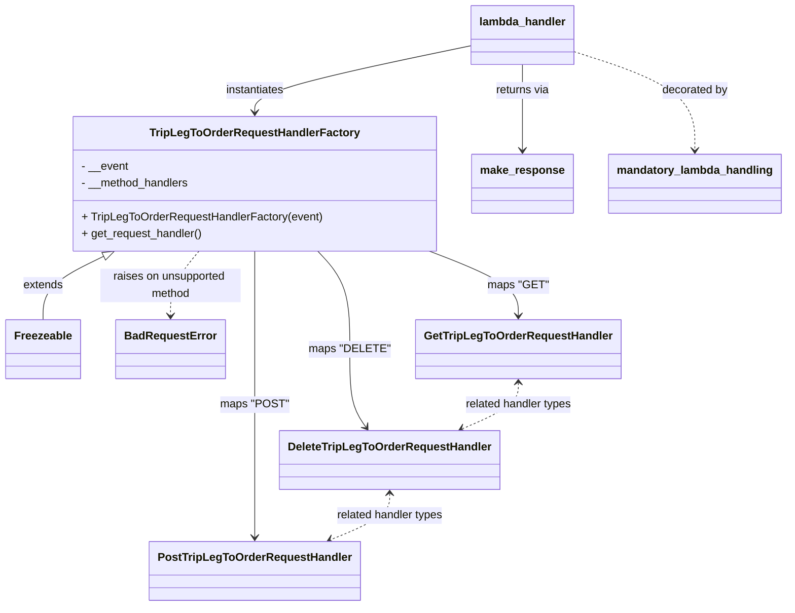

# Diagram: partview_core/partview_service/partview_service/api/trip_leg_to_order/trip_leg_to_order_handler.py


> Auto-generated by Obscura crawlers

## Diagram 1



### SVG

<svg id="container" width="1094.921875" xmlns="http://www.w3.org/2000/svg" class="classDiagram" height="864" viewBox="0 0 1094.921875 864" role="graphics-document document" aria-roledescription="class"><style>#container{font-family:"trebuchet ms",verdana,arial,sans-serif;font-size:16px;fill:#333;}@keyframes edge-animation-frame{from{stroke-dashoffset:0;}}@keyframes dash{to{stroke-dashoffset:0;}}#container .edge-animation-slow{stroke-dasharray:9,5!important;stroke-dashoffset:900;animation:dash 50s linear infinite;stroke-linecap:round;}#container .edge-animation-fast{stroke-dasharray:9,5!important;stroke-dashoffset:900;animation:dash 20s linear infinite;stroke-linecap:round;}#container .error-icon{fill:#552222;}#container .error-text{fill:#552222;stroke:#552222;}#container .edge-thickness-normal{stroke-width:1px;}#container .edge-thickness-thick{stroke-width:3.5px;}#container .edge-pattern-solid{stroke-dasharray:0;}#container .edge-thickness-invisible{stroke-width:0;fill:none;}#container .edge-pattern-dashed{stroke-dasharray:3;}#container .edge-pattern-dotted{stroke-dasharray:2;}#container .marker{fill:#333333;stroke:#333333;}#container .marker.cross{stroke:#333333;}#container svg{font-family:"trebuchet ms",verdana,arial,sans-serif;font-size:16px;}#container p{margin:0;}#container g.classGroup text{fill:#9370DB;stroke:none;font-family:"trebuchet ms",verdana,arial,sans-serif;font-size:10px;}#container g.classGroup text .title{font-weight:bolder;}#container .nodeLabel,#container .edgeLabel{color:#131300;}#container .edgeLabel .label rect{fill:#ECECFF;}#container .label text{fill:#131300;}#container .labelBkg{background:#ECECFF;}#container .edgeLabel .label span{background:#ECECFF;}#container .classTitle{font-weight:bolder;}#container .node rect,#container .node circle,#container .node ellipse,#container .node polygon,#container .node path{fill:#ECECFF;stroke:#9370DB;stroke-width:1px;}#container .divider{stroke:#9370DB;stroke-width:1;}#container g.clickable{cursor:pointer;}#container g.classGroup rect{fill:#ECECFF;stroke:#9370DB;}#container g.classGroup line{stroke:#9370DB;stroke-width:1;}#container .classLabel .box{stroke:none;stroke-width:0;fill:#ECECFF;opacity:0.5;}#container .classLabel .label{fill:#9370DB;font-size:10px;}#container .relation{stroke:#333333;stroke-width:1;fill:none;}#container .dashed-line{stroke-dasharray:3;}#container .dotted-line{stroke-dasharray:1 2;}#container #compositionStart,#container .composition{fill:#333333!important;stroke:#333333!important;stroke-width:1;}#container #compositionEnd,#container .composition{fill:#333333!important;stroke:#333333!important;stroke-width:1;}#container #dependencyStart,#container .dependency{fill:#333333!important;stroke:#333333!important;stroke-width:1;}#container #dependencyStart,#container .dependency{fill:#333333!important;stroke:#333333!important;stroke-width:1;}#container #extensionStart,#container .extension{fill:transparent!important;stroke:#333333!important;stroke-width:1;}#container #extensionEnd,#container .extension{fill:transparent!important;stroke:#333333!important;stroke-width:1;}#container #aggregationStart,#container .aggregation{fill:transparent!important;stroke:#333333!important;stroke-width:1;}#container #aggregationEnd,#container .aggregation{fill:transparent!important;stroke:#333333!important;stroke-width:1;}#container #lollipopStart,#container .lollipop{fill:#ECECFF!important;stroke:#333333!important;stroke-width:1;}#container #lollipopEnd,#container .lollipop{fill:#ECECFF!important;stroke:#333333!important;stroke-width:1;}#container .edgeTerminals{font-size:11px;line-height:initial;}#container .classTitleText{text-anchor:middle;font-size:18px;fill:#333;}#container .label-icon{display:inline-block;height:1em;overflow:visible;vertical-align:-0.125em;}#container .node .label-icon path{fill:currentColor;stroke:revert;stroke-width:revert;}#container :root{--mermaid-font-family:"trebuchet ms",verdana,arial,sans-serif;}</style><g><defs><marker id="container_class-aggregationStart" class="marker aggregation class" refX="18" refY="7" markerWidth="190" markerHeight="240" orient="auto"><path d="M 18,7 L9,13 L1,7 L9,1 Z"></path></marker></defs><defs><marker id="container_class-aggregationEnd" class="marker aggregation class" refX="1" refY="7" markerWidth="20" markerHeight="28" orient="auto"><path d="M 18,7 L9,13 L1,7 L9,1 Z"></path></marker></defs><defs><marker id="container_class-extensionStart" class="marker extension class" refX="18" refY="7" markerWidth="190" markerHeight="240" orient="auto"><path d="M 1,7 L18,13 V 1 Z"></path></marker></defs><defs><marker id="container_class-extensionEnd" class="marker extension class" refX="1" refY="7" markerWidth="20" markerHeight="28" orient="auto"><path d="M 1,1 V 13 L18,7 Z"></path></marker></defs><defs><marker id="container_class-compositionStart" class="marker composition class" refX="18" refY="7" markerWidth="190" markerHeight="240" orient="auto"><path d="M 18,7 L9,13 L1,7 L9,1 Z"></path></marker></defs><defs><marker id="container_class-compositionEnd" class="marker composition class" refX="1" refY="7" markerWidth="20" markerHeight="28" orient="auto"><path d="M 18,7 L9,13 L1,7 L9,1 Z"></path></marker></defs><defs><marker id="container_class-dependencyStart" class="marker dependency class" refX="6" refY="7" markerWidth="190" markerHeight="240" orient="auto"><path d="M 5,7 L9,13 L1,7 L9,1 Z"></path></marker></defs><defs><marker id="container_class-dependencyEnd" class="marker dependency class" refX="13" refY="7" markerWidth="20" markerHeight="28" orient="auto"><path d="M 18,7 L9,13 L14,7 L9,1 Z"></path></marker></defs><defs><marker id="container_class-lollipopStart" class="marker lollipop class" refX="13" refY="7" markerWidth="190" markerHeight="240" orient="auto"><circle stroke="black" fill="transparent" cx="7" cy="7" r="6"></circle></marker></defs><defs><marker id="container_class-lollipopEnd" class="marker lollipop class" refX="1" refY="7" markerWidth="190" markerHeight="240" orient="auto"><circle stroke="black" fill="transparent" cx="7" cy="7" r="6"></circle></marker></defs><g class="root"><g class="clusters"></g><g class="edgePaths"><path d="M143.56,365.599L129.499,372.5C115.439,379.4,87.317,393.2,73.256,408.267C59.195,423.333,59.195,439.667,59.195,447.833L59.195,456" id="id_TripLegToOrderRequestHandlerFactory_Freezeable_1" class="edge-thickness-normal edge-pattern-solid relation" style=";;;" data-edge="true" data-et="edge" data-id="id_TripLegToOrderRequestHandlerFactory_Freezeable_1" data-points="W3sieCI6MTU5LjA0NjAxMjkzMTAzNDQ4LCJ5IjozNTh9LHsieCI6NTkuMTk1MzEyNSwieSI6NDA3fSx7IngiOjU5LjE5NTMxMjUsInkiOjQ1Nn1d" marker-start="url(#container_class-extensionStart)"></path><path d="M592.937,358L613.206,366.167C633.475,374.333,674.013,390.667,694.282,406C714.551,421.333,714.551,435.667,714.551,442.833L714.551,450" id="id_TripLegToOrderRequestHandlerFactory_GetTripLegToOrderRequestHandler_2" class="edge-thickness-normal edge-pattern-solid relation" style=";;;" data-edge="true" data-et="edge" data-id="id_TripLegToOrderRequestHandlerFactory_GetTripLegToOrderRequestHandler_2" data-points="W3sieCI6NTkyLjkzNjUzMDE3MjQxMzgsInkiOjM1OH0seyJ4Ijo3MTQuNTUwNzgxMjUsInkiOjQwN30seyJ4Ijo3MTQuNTUwNzgxMjUsInkiOjQ1Nn1d" marker-end="url(#container_class-dependencyEnd)"></path><path d="M440.95,358L448.29,366.167C455.63,374.333,470.309,390.667,477.649,414C484.988,437.333,484.988,467.667,484.988,496C484.988,524.333,484.988,550.667,488.782,569.184C492.575,587.702,500.161,598.403,503.955,603.754L507.748,609.105" id="id_TripLegToOrderRequestHandlerFactory_DeleteTripLegToOrderRequestHandler_3" class="edge-thickness-normal edge-pattern-solid relation" style=";;;" data-edge="true" data-et="edge" data-id="id_TripLegToOrderRequestHandlerFactory_DeleteTripLegToOrderRequestHandler_3" data-points="W3sieCI6NDQwLjk1MDMyMzI3NTg2MjA1LCJ5IjozNTh9LHsieCI6NDg0Ljk4ODI4MTI1LCJ5Ijo0MDd9LHsieCI6NDg0Ljk4ODI4MTI1LCJ5Ijo0OTh9LHsieCI6NDg0Ljk4ODI4MTI1LCJ5Ijo1Nzd9LHsieCI6NTExLjIxNzk1ODg2MDc1OTUsInkiOjYxNH1d" marker-end="url(#container_class-dependencyEnd)"></path><path d="M354.672,358L354.672,366.167C354.672,374.333,354.672,390.667,354.672,414C354.672,437.333,354.672,467.667,354.672,496C354.672,524.333,354.672,550.667,354.672,577C354.672,603.333,354.672,629.667,354.672,656C354.672,682.333,354.672,708.667,354.672,727C354.672,745.333,354.672,755.667,354.672,760.833L354.672,766" id="id_TripLegToOrderRequestHandlerFactory_PostTripLegToOrderRequestHandler_4" class="edge-thickness-normal edge-pattern-solid relation" style=";;;" data-edge="true" data-et="edge" data-id="id_TripLegToOrderRequestHandlerFactory_PostTripLegToOrderRequestHandler_4" data-points="W3sieCI6MzU0LjY3MTg3NSwieSI6MzU4fSx7IngiOjM1NC42NzE4NzUsInkiOjQwN30seyJ4IjozNTQuNjcxODc1LCJ5Ijo0OTh9LHsieCI6MzU0LjY3MTg3NSwieSI6NTc3fSx7IngiOjM1NC42NzE4NzUsInkiOjY1Nn0seyJ4IjozNTQuNjcxODc1LCJ5Ijo3MzV9LHsieCI6MzU0LjY3MTg3NSwieSI6NzcyfV0=" marker-end="url(#container_class-dependencyEnd)"></path><path d="M275.224,358L268.465,366.167C261.706,374.333,248.189,390.667,241.43,406C234.672,421.333,234.672,435.667,234.672,442.833L234.672,450" id="id_TripLegToOrderRequestHandlerFactory_BadRequestError_5" class="edge-thickness-normal edge-pattern-dashed relation" style=";;;" data-edge="true" data-et="edge" data-id="id_TripLegToOrderRequestHandlerFactory_BadRequestError_5" data-points="W3sieCI6Mjc1LjIyMzU5OTEzNzkzMTA1LCJ5IjozNTh9LHsieCI6MjM0LjY3MTg3NSwieSI6NDA3fSx7IngiOjIzNC42NzE4NzUsInkiOjQ1Nn1d" marker-end="url(#container_class-dependencyEnd)"></path><path d="M800.57,73.802L828.391,83.001C856.211,92.201,911.852,110.601,939.672,133.967C967.492,157.333,967.492,185.667,967.492,199.833L967.492,214" id="id_lambda_handler_mandatory_lambda_handling_6" class="edge-thickness-normal edge-pattern-dashed relation" style=";;;" data-edge="true" data-et="edge" data-id="id_lambda_handler_mandatory_lambda_handling_6" data-points="W3sieCI6ODAwLjU3MDMxMjUsInkiOjczLjgwMTUzMDQ2MjA4MTgxfSx7IngiOjk2Ny40OTIxODc1LCJ5IjoxMjl9LHsieCI6OTY3LjQ5MjE4NzUsInkiOjIyMH1d" marker-end="url(#container_class-dependencyEnd)"></path><path d="M656.617,65.207L606.293,75.839C555.969,86.471,455.32,107.736,404.996,123.534C354.672,139.333,354.672,149.667,354.672,154.833L354.672,160" id="id_lambda_handler_TripLegToOrderRequestHandlerFactory_7" class="edge-thickness-normal edge-pattern-solid relation" style=";;;" data-edge="true" data-et="edge" data-id="id_lambda_handler_TripLegToOrderRequestHandlerFactory_7" data-points="W3sieCI6NjU2LjYxNzE4NzUsInkiOjY1LjIwNjc4MTk5ODI0NDk1fSx7IngiOjM1NC42NzE4NzUsInkiOjEyOX0seyJ4IjozNTQuNjcxODc1LCJ5IjoxNjZ9XQ==" marker-end="url(#container_class-dependencyEnd)"></path><path d="M728.594,92L728.594,98.167C728.594,104.333,728.594,116.667,728.594,137C728.594,157.333,728.594,185.667,728.594,199.833L728.594,214" id="id_lambda_handler_make_response_8" class="edge-thickness-normal edge-pattern-solid relation" style=";;;" data-edge="true" data-et="edge" data-id="id_lambda_handler_make_response_8" data-points="W3sieCI6NzI4LjU5Mzc1LCJ5Ijo5Mn0seyJ4Ijo3MjguNTkzNzUsInkiOjEyOX0seyJ4Ijo3MjguNTkzNzUsInkiOjIyMH1d" marker-end="url(#container_class-dependencyEnd)"></path><path d="M714.551,546L714.551,551.167C714.551,556.333,714.551,566.667,701.913,577.586C689.275,588.505,664,600.01,651.362,605.762L638.725,611.514" id="id_GetTripLegToOrderRequestHandler_DeleteTripLegToOrderRequestHandler_9" class="edge-thickness-normal edge-pattern-dashed relation" style=";;;" data-edge="true" data-et="edge" data-id="id_GetTripLegToOrderRequestHandler_DeleteTripLegToOrderRequestHandler_9" data-points="W3sieCI6NzE0LjU1MDc4MTI1LCJ5Ijo1NDB9LHsieCI6NzE0LjU1MDc4MTI1LCJ5Ijo1Nzd9LHsieCI6NjMzLjI2Mzg0NDkzNjcwODksInkiOjYxNH1d" marker-start="url(#container_class-dependencyStart)" marker-end="url(#container_class-dependencyEnd)"></path><path d="M540.992,704L540.992,709.167C540.992,714.333,540.992,724.667,527.369,735.61C513.746,746.553,486.499,758.105,472.876,763.882L459.252,769.658" id="id_DeleteTripLegToOrderRequestHandler_PostTripLegToOrderRequestHandler_10" class="edge-thickness-normal edge-pattern-dashed relation" style=";;;" data-edge="true" data-et="edge" data-id="id_DeleteTripLegToOrderRequestHandler_PostTripLegToOrderRequestHandler_10" data-points="W3sieCI6NTQwLjk5MjE4NzUsInkiOjY5OH0seyJ4Ijo1NDAuOTkyMTg3NSwieSI6NzM1fSx7IngiOjQ1My43MjgyNDM2NzA4ODYwNiwieSI6NzcyfV0=" marker-start="url(#container_class-dependencyStart)" marker-end="url(#container_class-dependencyEnd)"></path></g><g class="edgeLabels"><g class="edgeLabel" transform="translate(59.1953125, 407)"><g class="label" data-id="id_TripLegToOrderRequestHandlerFactory_Freezeable_1" transform="translate(-28.5078125, -12)"><foreignObject width="57.015625" height="24"><div xmlns="http://www.w3.org/1999/xhtml" class="labelBkg" style="display: table-cell; white-space: nowrap; line-height: 1.5; max-width: 200px; text-align: center;"><span class="edgeLabel"><p>extends</p></span></div></foreignObject></g></g><g class="edgeLabel" transform="translate(714.55078125, 407)"><g class="label" data-id="id_TripLegToOrderRequestHandlerFactory_GetTripLegToOrderRequestHandler_2" transform="translate(-41.75, -12)"><foreignObject width="83.5" height="24"><div xmlns="http://www.w3.org/1999/xhtml" class="labelBkg" style="display: table-cell; white-space: nowrap; line-height: 1.5; max-width: 200px; text-align: center;"><span class="edgeLabel"><p>maps "GET"</p></span></div></foreignObject></g></g><g class="edgeLabel" transform="translate(484.98828125, 498)"><g class="label" data-id="id_TripLegToOrderRequestHandlerFactory_DeleteTripLegToOrderRequestHandler_3" transform="translate(-54.3125, -12)"><foreignObject width="108.625" height="24"><div xmlns="http://www.w3.org/1999/xhtml" class="labelBkg" style="display: table-cell; white-space: nowrap; line-height: 1.5; max-width: 200px; text-align: center;"><span class="edgeLabel"><p>maps "DELETE"</p></span></div></foreignObject></g></g><g class="edgeLabel" transform="translate(354.671875, 577)"><g class="label" data-id="id_TripLegToOrderRequestHandlerFactory_PostTripLegToOrderRequestHandler_4" transform="translate(-46.7890625, -12)"><foreignObject width="93.578125" height="24"><div xmlns="http://www.w3.org/1999/xhtml" class="labelBkg" style="display: table-cell; white-space: nowrap; line-height: 1.5; max-width: 200px; text-align: center;"><span class="edgeLabel"><p>maps "POST"</p></span></div></foreignObject></g></g><g class="edgeLabel" transform="translate(234.671875, 407)"><g class="label" data-id="id_TripLegToOrderRequestHandlerFactory_BadRequestError_5" transform="translate(-100, -24)"><foreignObject width="200" height="48"><div xmlns="http://www.w3.org/1999/xhtml" class="labelBkg" style="display: table; white-space: break-spaces; line-height: 1.5; max-width: 200px; text-align: center; width: 200px;"><span class="edgeLabel"><p>raises on unsupported method</p></span></div></foreignObject></g></g><g class="edgeLabel" transform="translate(967.4921875, 129)"><g class="label" data-id="id_lambda_handler_mandatory_lambda_handling_6" transform="translate(-47.328125, -12)"><foreignObject width="94.65625" height="24"><div xmlns="http://www.w3.org/1999/xhtml" class="labelBkg" style="display: table-cell; white-space: nowrap; line-height: 1.5; max-width: 200px; text-align: center;"><span class="edgeLabel"><p>decorated by</p></span></div></foreignObject></g></g><g class="edgeLabel" transform="translate(354.671875, 129)"><g class="label" data-id="id_lambda_handler_TripLegToOrderRequestHandlerFactory_7" transform="translate(-42.9140625, -12)"><foreignObject width="85.828125" height="24"><div xmlns="http://www.w3.org/1999/xhtml" class="labelBkg" style="display: table-cell; white-space: nowrap; line-height: 1.5; max-width: 200px; text-align: center;"><span class="edgeLabel"><p>instantiates</p></span></div></foreignObject></g></g><g class="edgeLabel" transform="translate(728.59375, 129)"><g class="label" data-id="id_lambda_handler_make_response_8" transform="translate(-38.9296875, -12)"><foreignObject width="77.859375" height="24"><div xmlns="http://www.w3.org/1999/xhtml" class="labelBkg" style="display: table-cell; white-space: nowrap; line-height: 1.5; max-width: 200px; text-align: center;"><span class="edgeLabel"><p>returns via</p></span></div></foreignObject></g></g><g class="edgeLabel" transform="translate(714.55078125, 577)"><g class="label" data-id="id_GetTripLegToOrderRequestHandler_DeleteTripLegToOrderRequestHandler_9" transform="translate(-77.9140625, -12)"><foreignObject width="155.828125" height="24"><div xmlns="http://www.w3.org/1999/xhtml" class="labelBkg" style="display: table-cell; white-space: nowrap; line-height: 1.5; max-width: 200px; text-align: center;"><span class="edgeLabel"><p>related handler types</p></span></div></foreignObject></g></g><g class="edgeLabel" transform="translate(540.9921875, 735)"><g class="label" data-id="id_DeleteTripLegToOrderRequestHandler_PostTripLegToOrderRequestHandler_10" transform="translate(-77.9140625, -12)"><foreignObject width="155.828125" height="24"><div xmlns="http://www.w3.org/1999/xhtml" class="labelBkg" style="display: table-cell; white-space: nowrap; line-height: 1.5; max-width: 200px; text-align: center;"><span class="edgeLabel"><p>related handler types</p></span></div></foreignObject></g></g></g><g class="nodes"><g class="node default" id="classId-TripLegToOrderRequestHandlerFactory-0" transform="translate(354.671875, 262)"><g class="basic label-container"><path d="M-254.453125 -96 L254.453125 -96 L254.453125 96 L-254.453125 96" stroke="none" stroke-width="0" fill="#ECECFF" style=""></path><path d="M-254.453125 -96 C-78.12326389013631 -96, 98.20659721972737 -96, 254.453125 -96 M-254.453125 -96 C-76.29011556819549 -96, 101.87289386360902 -96, 254.453125 -96 M254.453125 -96 C254.453125 -51.166348332979084, 254.453125 -6.332696665958167, 254.453125 96 M254.453125 -96 C254.453125 -26.888172791893652, 254.453125 42.223654416212696, 254.453125 96 M254.453125 96 C120.3095728543793 96, -13.833979291241405 96, -254.453125 96 M254.453125 96 C85.62435492487978 96, -83.20441515024044 96, -254.453125 96 M-254.453125 96 C-254.453125 41.23471238644643, -254.453125 -13.530575227107136, -254.453125 -96 M-254.453125 96 C-254.453125 49.25586748907659, -254.453125 2.5117349781531857, -254.453125 -96" stroke="#9370DB" stroke-width="1.3" fill="none" stroke-dasharray="0 0" style=""></path></g><g class="annotation-group text" transform="translate(0, -72)"></g><g class="label-group text" transform="translate(-142.1875, -72)"><g class="label" style="font-weight: bolder" transform="translate(0,-12)"><foreignObject width="284.375" height="24"><div xmlns="http://www.w3.org/1999/xhtml" style="display: table-cell; white-space: nowrap; line-height: 1.5; max-width: 330px; text-align: center;"><span class="nodeLabel markdown-node-label" style=""><p>TripLegToOrderRequestHandlerFactory</p></span></div></foreignObject></g></g><g class="members-group text" transform="translate(-242.453125, -24)"><g class="label" style="" transform="translate(0,-12)"><foreignObject width="67.1875" height="24"><div xmlns="http://www.w3.org/1999/xhtml" style="display: table-cell; white-space: nowrap; line-height: 1.5; max-width: 125px; text-align: center;"><span class="nodeLabel markdown-node-label" style=""><p>- __event</p></span></div></foreignObject></g><g class="label" style="" transform="translate(0,12)"><foreignObject width="155.75" height="24"><div xmlns="http://www.w3.org/1999/xhtml" style="display: table-cell; white-space: nowrap; line-height: 1.5; max-width: 213px; text-align: center;"><span class="nodeLabel markdown-node-label" style=""><p>- __method_handlers</p></span></div></foreignObject></g></g><g class="methods-group text" transform="translate(-242.453125, 48)"><g class="label" style="" transform="translate(0,-12)"><foreignObject width="342.71875" height="24"><div xmlns="http://www.w3.org/1999/xhtml" style="display: table-cell; white-space: nowrap; line-height: 1.5; max-width: 400px; text-align: center;"><span class="nodeLabel markdown-node-label" style=""><p>+ TripLegToOrderRequestHandlerFactory(event)</p></span></div></foreignObject></g><g class="label" style="" transform="translate(0,12)"><foreignObject width="173.59375" height="24"><div xmlns="http://www.w3.org/1999/xhtml" style="display: table-cell; white-space: nowrap; line-height: 1.5; max-width: 231px; text-align: center;"><span class="nodeLabel markdown-node-label" style=""><p>+ get_request_handler()</p></span></div></foreignObject></g></g><g class="divider" style=""><path d="M-254.453125 -48 C-141.13318922016458 -48, -27.813253440329134 -48, 254.453125 -48 M-254.453125 -48 C-88.07556479419912 -48, 78.30199541160175 -48, 254.453125 -48" stroke="#9370DB" stroke-width="1.3" fill="none" stroke-dasharray="0 0" style=""></path></g><g class="divider" style=""><path d="M-254.453125 24 C-125.12256872784835 24, 4.2079875443033075 24, 254.453125 24 M-254.453125 24 C-84.22785304158711 24, 85.99741891682578 24, 254.453125 24" stroke="#9370DB" stroke-width="1.3" fill="none" stroke-dasharray="0 0" style=""></path></g></g><g class="node default" id="classId-Freezeable-1" transform="translate(59.1953125, 498)"><g class="basic label-container"><path d="M-51.1953125 -42 L51.1953125 -42 L51.1953125 42 L-51.1953125 42" stroke="none" stroke-width="0" fill="#ECECFF" style=""></path><path d="M-51.1953125 -42 C-15.255631586723297 -42, 20.684049326553406 -42, 51.1953125 -42 M-51.1953125 -42 C-17.3513361734812 -42, 16.4926401530376 -42, 51.1953125 -42 M51.1953125 -42 C51.1953125 -16.616909547272503, 51.1953125 8.766180905454995, 51.1953125 42 M51.1953125 -42 C51.1953125 -19.51632258155975, 51.1953125 2.967354836880503, 51.1953125 42 M51.1953125 42 C26.257240393808313 42, 1.3191682876166269 42, -51.1953125 42 M51.1953125 42 C29.801198660490687 42, 8.407084820981375 42, -51.1953125 42 M-51.1953125 42 C-51.1953125 8.673503192860366, -51.1953125 -24.652993614279268, -51.1953125 -42 M-51.1953125 42 C-51.1953125 11.295499726025657, -51.1953125 -19.409000547948686, -51.1953125 -42" stroke="#9370DB" stroke-width="1.3" fill="none" stroke-dasharray="0 0" style=""></path></g><g class="annotation-group text" transform="translate(0, -18)"></g><g class="label-group text" transform="translate(-39.1953125, -18)"><g class="label" style="font-weight: bolder" transform="translate(0,-12)"><foreignObject width="78.390625" height="24"><div xmlns="http://www.w3.org/1999/xhtml" style="display: table-cell; white-space: nowrap; line-height: 1.5; max-width: 127px; text-align: center;"><span class="nodeLabel markdown-node-label" style=""><p>Freezeable</p></span></div></foreignObject></g></g><g class="members-group text" transform="translate(-39.1953125, 30)"></g><g class="methods-group text" transform="translate(-39.1953125, 60)"></g><g class="divider" style=""><path d="M-51.1953125 6 C-13.04904641994176 6, 25.09721966011648 6, 51.1953125 6 M-51.1953125 6 C-19.66917471864607 6, 11.856963062707862 6, 51.1953125 6" stroke="#9370DB" stroke-width="1.3" fill="none" stroke-dasharray="0 0" style=""></path></g><g class="divider" style=""><path d="M-51.1953125 24 C-22.929832660619358 24, 5.335647178761285 24, 51.1953125 24 M-51.1953125 24 C-30.383249042468925 24, -9.57118558493785 24, 51.1953125 24" stroke="#9370DB" stroke-width="1.3" fill="none" stroke-dasharray="0 0" style=""></path></g></g><g class="node default" id="classId-BadRequestError-2" transform="translate(234.671875, 498)"><g class="basic label-container"><path d="M-74.28125 -42 L74.28125 -42 L74.28125 42 L-74.28125 42" stroke="none" stroke-width="0" fill="#ECECFF" style=""></path><path d="M-74.28125 -42 C-27.141105186404587 -42, 19.999039627190825 -42, 74.28125 -42 M-74.28125 -42 C-17.33672795106869 -42, 39.60779409786262 -42, 74.28125 -42 M74.28125 -42 C74.28125 -13.524207159453734, 74.28125 14.951585681092531, 74.28125 42 M74.28125 -42 C74.28125 -11.968860972372514, 74.28125 18.06227805525497, 74.28125 42 M74.28125 42 C18.426025677651822 42, -37.429198644696356 42, -74.28125 42 M74.28125 42 C32.20854496632357 42, -9.864160067352856 42, -74.28125 42 M-74.28125 42 C-74.28125 8.552977476284184, -74.28125 -24.894045047431632, -74.28125 -42 M-74.28125 42 C-74.28125 18.1211637125703, -74.28125 -5.757672574859399, -74.28125 -42" stroke="#9370DB" stroke-width="1.3" fill="none" stroke-dasharray="0 0" style=""></path></g><g class="annotation-group text" transform="translate(0, -18)"></g><g class="label-group text" transform="translate(-62.28125, -18)"><g class="label" style="font-weight: bolder" transform="translate(0,-12)"><foreignObject width="124.5625" height="24"><div xmlns="http://www.w3.org/1999/xhtml" style="display: table-cell; white-space: nowrap; line-height: 1.5; max-width: 174px; text-align: center;"><span class="nodeLabel markdown-node-label" style=""><p>BadRequestError</p></span></div></foreignObject></g></g><g class="members-group text" transform="translate(-62.28125, 30)"></g><g class="methods-group text" transform="translate(-62.28125, 60)"></g><g class="divider" style=""><path d="M-74.28125 6 C-15.808289109143878 6, 42.664671781712244 6, 74.28125 6 M-74.28125 6 C-24.321666480162634 6, 25.637917039674733 6, 74.28125 6" stroke="#9370DB" stroke-width="1.3" fill="none" stroke-dasharray="0 0" style=""></path></g><g class="divider" style=""><path d="M-74.28125 24 C-37.007451472970004 24, 0.2663470540599917 24, 74.28125 24 M-74.28125 24 C-31.266498380768972 24, 11.748253238462055 24, 74.28125 24" stroke="#9370DB" stroke-width="1.3" fill="none" stroke-dasharray="0 0" style=""></path></g></g><g class="node default" id="classId-GetTripLegToOrderRequestHandler-3" transform="translate(714.55078125, 498)"><g class="basic label-container"><path d="M-140.25 -42 L140.25 -42 L140.25 42 L-140.25 42" stroke="none" stroke-width="0" fill="#ECECFF" style=""></path><path d="M-140.25 -42 C-75.22851364109134 -42, -10.207027282182679 -42, 140.25 -42 M-140.25 -42 C-73.03783484249495 -42, -5.82566968498989 -42, 140.25 -42 M140.25 -42 C140.25 -15.969122113570222, 140.25 10.061755772859556, 140.25 42 M140.25 -42 C140.25 -21.358896512562346, 140.25 -0.717793025124692, 140.25 42 M140.25 42 C61.55105710095026 42, -17.14788579809948 42, -140.25 42 M140.25 42 C44.138414946667965 42, -51.97317010666407 42, -140.25 42 M-140.25 42 C-140.25 9.037886112014142, -140.25 -23.924227775971715, -140.25 -42 M-140.25 42 C-140.25 23.937559877788814, -140.25 5.875119755577629, -140.25 -42" stroke="#9370DB" stroke-width="1.3" fill="none" stroke-dasharray="0 0" style=""></path></g><g class="annotation-group text" transform="translate(0, -18)"></g><g class="label-group text" transform="translate(-128.25, -18)"><g class="label" style="font-weight: bolder" transform="translate(0,-12)"><foreignObject width="256.5" height="24"><div xmlns="http://www.w3.org/1999/xhtml" style="display: table-cell; white-space: nowrap; line-height: 1.5; max-width: 303px; text-align: center;"><span class="nodeLabel markdown-node-label" style=""><p>GetTripLegToOrderRequestHandler</p></span></div></foreignObject></g></g><g class="members-group text" transform="translate(-128.25, 30)"></g><g class="methods-group text" transform="translate(-128.25, 60)"></g><g class="divider" style=""><path d="M-140.25 6 C-36.32986739193403 6, 67.59026521613194 6, 140.25 6 M-140.25 6 C-67.67269829236376 6, 4.904603415272476 6, 140.25 6" stroke="#9370DB" stroke-width="1.3" fill="none" stroke-dasharray="0 0" style=""></path></g><g class="divider" style=""><path d="M-140.25 24 C-82.74453733588717 24, -25.239074671774333 24, 140.25 24 M-140.25 24 C-58.14818442548591 24, 23.953631149028183 24, 140.25 24" stroke="#9370DB" stroke-width="1.3" fill="none" stroke-dasharray="0 0" style=""></path></g></g><g class="node default" id="classId-DeleteTripLegToOrderRequestHandler-4" transform="translate(540.9921875, 656)"><g class="basic label-container"><path d="M-151.3203125 -42 L151.3203125 -42 L151.3203125 42 L-151.3203125 42" stroke="none" stroke-width="0" fill="#ECECFF" style=""></path><path d="M-151.3203125 -42 C-76.03349903904474 -42, -0.7466855780894832 -42, 151.3203125 -42 M-151.3203125 -42 C-81.21559830075809 -42, -11.110884101516177 -42, 151.3203125 -42 M151.3203125 -42 C151.3203125 -17.34472521995339, 151.3203125 7.3105495600932215, 151.3203125 42 M151.3203125 -42 C151.3203125 -18.252777392364564, 151.3203125 5.494445215270872, 151.3203125 42 M151.3203125 42 C54.327472480640324 42, -42.66536753871935 42, -151.3203125 42 M151.3203125 42 C54.75885554131564 42, -41.80260141736872 42, -151.3203125 42 M-151.3203125 42 C-151.3203125 14.458513204346087, -151.3203125 -13.082973591307827, -151.3203125 -42 M-151.3203125 42 C-151.3203125 15.470196570086866, -151.3203125 -11.059606859826268, -151.3203125 -42" stroke="#9370DB" stroke-width="1.3" fill="none" stroke-dasharray="0 0" style=""></path></g><g class="annotation-group text" transform="translate(0, -18)"></g><g class="label-group text" transform="translate(-139.3203125, -18)"><g class="label" style="font-weight: bolder" transform="translate(0,-12)"><foreignObject width="278.640625" height="24"><div xmlns="http://www.w3.org/1999/xhtml" style="display: table-cell; white-space: nowrap; line-height: 1.5; max-width: 325px; text-align: center;"><span class="nodeLabel markdown-node-label" style=""><p>DeleteTripLegToOrderRequestHandler</p></span></div></foreignObject></g></g><g class="members-group text" transform="translate(-139.3203125, 30)"></g><g class="methods-group text" transform="translate(-139.3203125, 60)"></g><g class="divider" style=""><path d="M-151.3203125 6 C-59.17332855713947 6, 32.97365538572106 6, 151.3203125 6 M-151.3203125 6 C-66.46390530468312 6, 18.392501890633753 6, 151.3203125 6" stroke="#9370DB" stroke-width="1.3" fill="none" stroke-dasharray="0 0" style=""></path></g><g class="divider" style=""><path d="M-151.3203125 24 C-76.99257066227554 24, -2.66482882455108 24, 151.3203125 24 M-151.3203125 24 C-41.38746238997459 24, 68.54538772005083 24, 151.3203125 24" stroke="#9370DB" stroke-width="1.3" fill="none" stroke-dasharray="0 0" style=""></path></g></g><g class="node default" id="classId-PostTripLegToOrderRequestHandler-5" transform="translate(354.671875, 814)"><g class="basic label-container"><path d="M-143.7734375 -42 L143.7734375 -42 L143.7734375 42 L-143.7734375 42" stroke="none" stroke-width="0" fill="#ECECFF" style=""></path><path d="M-143.7734375 -42 C-35.8812941200316 -42, 72.0108492599368 -42, 143.7734375 -42 M-143.7734375 -42 C-53.06620124881536 -42, 37.64103500236928 -42, 143.7734375 -42 M143.7734375 -42 C143.7734375 -24.729599781644637, 143.7734375 -7.459199563289275, 143.7734375 42 M143.7734375 -42 C143.7734375 -15.471884542385993, 143.7734375 11.056230915228014, 143.7734375 42 M143.7734375 42 C33.46389415737764 42, -76.84564918524472 42, -143.7734375 42 M143.7734375 42 C73.12435369554751 42, 2.4752698910950244 42, -143.7734375 42 M-143.7734375 42 C-143.7734375 13.176398824691201, -143.7734375 -15.647202350617597, -143.7734375 -42 M-143.7734375 42 C-143.7734375 12.339664745346067, -143.7734375 -17.320670509307867, -143.7734375 -42" stroke="#9370DB" stroke-width="1.3" fill="none" stroke-dasharray="0 0" style=""></path></g><g class="annotation-group text" transform="translate(0, -18)"></g><g class="label-group text" transform="translate(-131.7734375, -18)"><g class="label" style="font-weight: bolder" transform="translate(0,-12)"><foreignObject width="263.546875" height="24"><div xmlns="http://www.w3.org/1999/xhtml" style="display: table-cell; white-space: nowrap; line-height: 1.5; max-width: 310px; text-align: center;"><span class="nodeLabel markdown-node-label" style=""><p>PostTripLegToOrderRequestHandler</p></span></div></foreignObject></g></g><g class="members-group text" transform="translate(-131.7734375, 30)"></g><g class="methods-group text" transform="translate(-131.7734375, 60)"></g><g class="divider" style=""><path d="M-143.7734375 6 C-76.43986800323408 6, -9.106298506468164 6, 143.7734375 6 M-143.7734375 6 C-64.02795480516522 6, 15.717527889669554 6, 143.7734375 6" stroke="#9370DB" stroke-width="1.3" fill="none" stroke-dasharray="0 0" style=""></path></g><g class="divider" style=""><path d="M-143.7734375 24 C-32.41938107423043 24, 78.93467535153914 24, 143.7734375 24 M-143.7734375 24 C-68.28616468352324 24, 7.201108132953522 24, 143.7734375 24" stroke="#9370DB" stroke-width="1.3" fill="none" stroke-dasharray="0 0" style=""></path></g></g><g class="node default" id="classId-make_response-6" transform="translate(728.59375, 262)"><g class="basic label-container"><path d="M-69.46875 -42 L69.46875 -42 L69.46875 42 L-69.46875 42" stroke="none" stroke-width="0" fill="#ECECFF" style=""></path><path d="M-69.46875 -42 C-21.834409381958565 -42, 25.79993123608287 -42, 69.46875 -42 M-69.46875 -42 C-20.137871754526834 -42, 29.19300649094633 -42, 69.46875 -42 M69.46875 -42 C69.46875 -20.758872539925775, 69.46875 0.4822549201484492, 69.46875 42 M69.46875 -42 C69.46875 -9.515778589814445, 69.46875 22.96844282037111, 69.46875 42 M69.46875 42 C24.469986899436684 42, -20.528776201126632 42, -69.46875 42 M69.46875 42 C35.714958236967085 42, 1.9611664739341705 42, -69.46875 42 M-69.46875 42 C-69.46875 15.554649349483736, -69.46875 -10.890701301032529, -69.46875 -42 M-69.46875 42 C-69.46875 8.759925065912995, -69.46875 -24.48014986817401, -69.46875 -42" stroke="#9370DB" stroke-width="1.3" fill="none" stroke-dasharray="0 0" style=""></path></g><g class="annotation-group text" transform="translate(0, -18)"></g><g class="label-group text" transform="translate(-57.46875, -18)"><g class="label" style="font-weight: bolder" transform="translate(0,-12)"><foreignObject width="114.9375" height="24"><div xmlns="http://www.w3.org/1999/xhtml" style="display: table-cell; white-space: nowrap; line-height: 1.5; max-width: 164px; text-align: center;"><span class="nodeLabel markdown-node-label" style=""><p>make_response</p></span></div></foreignObject></g></g><g class="members-group text" transform="translate(-57.46875, 30)"></g><g class="methods-group text" transform="translate(-57.46875, 60)"></g><g class="divider" style=""><path d="M-69.46875 6 C-36.114264405763656 6, -2.759778811527312 6, 69.46875 6 M-69.46875 6 C-22.220300894410784 6, 25.028148211178433 6, 69.46875 6" stroke="#9370DB" stroke-width="1.3" fill="none" stroke-dasharray="0 0" style=""></path></g><g class="divider" style=""><path d="M-69.46875 24 C-16.4669331000203 24, 36.5348837999594 24, 69.46875 24 M-69.46875 24 C-19.65700652192399 24, 30.15473695615202 24, 69.46875 24" stroke="#9370DB" stroke-width="1.3" fill="none" stroke-dasharray="0 0" style=""></path></g></g><g class="node default" id="classId-mandatory_lambda_handling-7" transform="translate(967.4921875, 262)"><g class="basic label-container"><path d="M-119.4296875 -42 L119.4296875 -42 L119.4296875 42 L-119.4296875 42" stroke="none" stroke-width="0" fill="#ECECFF" style=""></path><path d="M-119.4296875 -42 C-30.953323438037955 -42, 57.52304062392409 -42, 119.4296875 -42 M-119.4296875 -42 C-56.111790059394295 -42, 7.20610738121141 -42, 119.4296875 -42 M119.4296875 -42 C119.4296875 -20.729126139705745, 119.4296875 0.5417477205885106, 119.4296875 42 M119.4296875 -42 C119.4296875 -17.44599375615531, 119.4296875 7.108012487689379, 119.4296875 42 M119.4296875 42 C60.98542222442117 42, 2.5411569488423424 42, -119.4296875 42 M119.4296875 42 C60.27120158038799 42, 1.1127156607759758 42, -119.4296875 42 M-119.4296875 42 C-119.4296875 14.160084734412376, -119.4296875 -13.679830531175249, -119.4296875 -42 M-119.4296875 42 C-119.4296875 15.1562167556976, -119.4296875 -11.687566488604801, -119.4296875 -42" stroke="#9370DB" stroke-width="1.3" fill="none" stroke-dasharray="0 0" style=""></path></g><g class="annotation-group text" transform="translate(0, -18)"></g><g class="label-group text" transform="translate(-107.4296875, -18)"><g class="label" style="font-weight: bolder" transform="translate(0,-12)"><foreignObject width="214.859375" height="24"><div xmlns="http://www.w3.org/1999/xhtml" style="display: table-cell; white-space: nowrap; line-height: 1.5; max-width: 264px; text-align: center;"><span class="nodeLabel markdown-node-label" style=""><p>mandatory_lambda_handling</p></span></div></foreignObject></g></g><g class="members-group text" transform="translate(-107.4296875, 30)"></g><g class="methods-group text" transform="translate(-107.4296875, 60)"></g><g class="divider" style=""><path d="M-119.4296875 6 C-37.12590870321088 6, 45.177870093578235 6, 119.4296875 6 M-119.4296875 6 C-29.160316483358287 6, 61.10905453328343 6, 119.4296875 6" stroke="#9370DB" stroke-width="1.3" fill="none" stroke-dasharray="0 0" style=""></path></g><g class="divider" style=""><path d="M-119.4296875 24 C-49.44744191219412 24, 20.534803675611755 24, 119.4296875 24 M-119.4296875 24 C-50.349650117112375 24, 18.73038726577525 24, 119.4296875 24" stroke="#9370DB" stroke-width="1.3" fill="none" stroke-dasharray="0 0" style=""></path></g></g><g class="node default" id="classId-lambda_handler-8" transform="translate(728.59375, 50)"><g class="basic label-container"><path d="M-71.9765625 -42 L71.9765625 -42 L71.9765625 42 L-71.9765625 42" stroke="none" stroke-width="0" fill="#ECECFF" style=""></path><path d="M-71.9765625 -42 C-21.134872658423163 -42, 29.706817183153674 -42, 71.9765625 -42 M-71.9765625 -42 C-24.762441838877088 -42, 22.451678822245825 -42, 71.9765625 -42 M71.9765625 -42 C71.9765625 -18.588191574955864, 71.9765625 4.823616850088271, 71.9765625 42 M71.9765625 -42 C71.9765625 -23.335255157017905, 71.9765625 -4.670510314035809, 71.9765625 42 M71.9765625 42 C19.91522654252632 42, -32.14610941494736 42, -71.9765625 42 M71.9765625 42 C24.041728832511247 42, -23.893104834977507 42, -71.9765625 42 M-71.9765625 42 C-71.9765625 19.193148538753942, -71.9765625 -3.6137029224921164, -71.9765625 -42 M-71.9765625 42 C-71.9765625 21.318488437173304, -71.9765625 0.6369768743466082, -71.9765625 -42" stroke="#9370DB" stroke-width="1.3" fill="none" stroke-dasharray="0 0" style=""></path></g><g class="annotation-group text" transform="translate(0, -18)"></g><g class="label-group text" transform="translate(-59.9765625, -18)"><g class="label" style="font-weight: bolder" transform="translate(0,-12)"><foreignObject width="119.953125" height="24"><div xmlns="http://www.w3.org/1999/xhtml" style="display: table-cell; white-space: nowrap; line-height: 1.5; max-width: 170px; text-align: center;"><span class="nodeLabel markdown-node-label" style=""><p>lambda_handler</p></span></div></foreignObject></g></g><g class="members-group text" transform="translate(-59.9765625, 30)"></g><g class="methods-group text" transform="translate(-59.9765625, 60)"></g><g class="divider" style=""><path d="M-71.9765625 6 C-18.93205218505986 6, 34.11245812988028 6, 71.9765625 6 M-71.9765625 6 C-31.50625758801025 6, 8.9640473239795 6, 71.9765625 6" stroke="#9370DB" stroke-width="1.3" fill="none" stroke-dasharray="0 0" style=""></path></g><g class="divider" style=""><path d="M-71.9765625 24 C-38.722865139959794 24, -5.469167779919587 24, 71.9765625 24 M-71.9765625 24 C-37.72256508261125 24, -3.468567665222494 24, 71.9765625 24" stroke="#9370DB" stroke-width="1.3" fill="none" stroke-dasharray="0 0" style=""></path></g></g></g></g></g></svg>

## Diagram 2

```mermaid
flowchart LR
    Start([Start])
    Start --> Log[/"logging.info(\"Received parts_to_container request\")"/]
    Log --> Factory[/"TripLegToOrderRequestHandlerFactory(event)"/]
    Factory --> GetHandler{"httpMethod -> handler"}
    GetHandler --> Parse[/"request_handler.parse_request()"/]
    Parse --> Validate[/"... .validate_parameters()"/]
    Validate --> Process[/"... .process()"/]
    Process --> Format[/"... .format_result() -> (data, http_code)"/]
    Format --> MakeResponse[/"make_response(data, http_code)"/]
    MakeResponse --> End([End])
```

> SVG rendering failed for this diagram.
