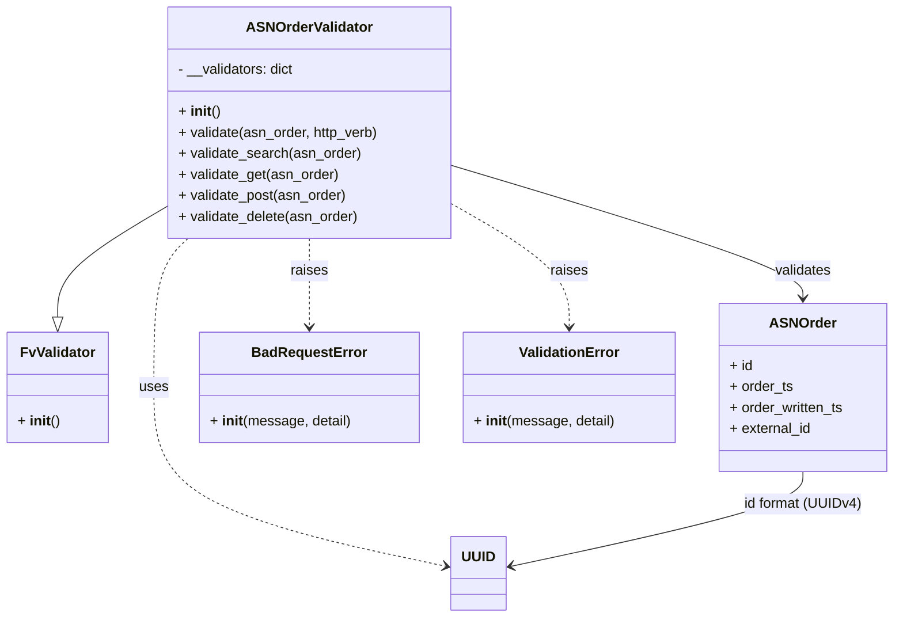

# Diagram: partview_core/partview_service/partview_service/api/validation/ASNOrderValidator.py

> Auto-generated by Obscura crawlers

## Mermaid

### SVG

<svg id="container" width="1005.59375" xmlns="http://www.w3.org/2000/svg" class="classDiagram" height="704" viewBox="0 0 1005.59375 704" role="graphics-document document" aria-roledescription="class"><g><defs><marker id="container_class-aggregationStart" class="marker aggregation class" refX="18" refY="7" markerWidth="190" markerHeight="240" orient="auto"><path d="M 18,7 L9,13 L1,7 L9,1 Z"></path></marker></defs><defs><marker id="container_class-aggregationEnd" class="marker aggregation class" refX="1" refY="7" markerWidth="20" markerHeight="28" orient="auto"><path d="M 18,7 L9,13 L1,7 L9,1 Z"></path></marker></defs><defs><marker id="container_class-extensionStart" class="marker extension class" refX="18" refY="7" markerWidth="190" markerHeight="240" orient="auto"><path d="M 1,7 L18,13 V 1 Z"></path></marker></defs><defs><marker id="container_class-extensionEnd" class="marker extension class" refX="1" refY="7" markerWidth="20" markerHeight="28" orient="auto"><path d="M 1,1 V 13 L18,7 Z"></path></marker></defs><defs><marker id="container_class-compositionStart" class="marker composition class" refX="18" refY="7" markerWidth="190" markerHeight="240" orient="auto"><path d="M 18,7 L9,13 L1,7 L9,1 Z"></path></marker></defs><defs><marker id="container_class-compositionEnd" class="marker composition class" refX="1" refY="7" markerWidth="20" markerHeight="28" orient="auto"><path d="M 18,7 L9,13 L1,7 L9,1 Z"></path></marker></defs><defs><marker id="container_class-dependencyStart" class="marker dependency class" refX="6" refY="7" markerWidth="190" markerHeight="240" orient="auto"><path d="M 5,7 L9,13 L1,7 L9,1 Z"></path></marker></defs><defs><marker id="container_class-dependencyEnd" class="marker dependency class" refX="13" refY="7" markerWidth="20" markerHeight="28" orient="auto"><path d="M 18,7 L9,13 L14,7 L9,1 Z"></path></marker></defs><defs><marker id="container_class-lollipopStart" class="marker lollipop class" refX="13" refY="7" markerWidth="190" markerHeight="240" orient="auto"><circle stroke="black" fill="transparent" cx="7" cy="7" r="6"></circle></marker></defs><defs><marker id="container_class-lollipopEnd" class="marker lollipop class" refX="1" refY="7" markerWidth="190" markerHeight="240" orient="auto"><circle stroke="black" fill="transparent" cx="7" cy="7" r="6"></circle></marker></defs><g class="root"><g class="clusters"></g><g class="edgePaths"><path d="M184.152,236.904L164.123,248.92C144.094,260.936,104.035,284.968,84.006,305.776C63.977,326.583,63.977,344.167,63.977,352.958L63.977,361.75" id="id_ASNOrderValidator_FvValidator_1" class="edge-thickness-normal edge-pattern-solid relation" style=";;;" data-edge="true" data-et="edge" data-id="id_ASNOrderValidator_FvValidator_1" data-points="W3sieCI6MTg0LjE1MjM0Mzc1LCJ5IjoyMzYuOTAzODYzMjIwMzY3MTl9LHsieCI6NjMuOTc2NTYyNSwieSI6MzA5fSx7IngiOjYzLjk3NjU2MjUsInkiOjM3OX1d" marker-end="url(#container_class-extensionEnd)"></path><path d="M507.207,189.052L573.039,209.043C638.871,229.034,770.535,269.017,836.367,294.175C902.199,319.333,902.199,329.667,902.199,334.833L902.199,340" id="id_ASNOrderValidator_ASNOrder_2" class="edge-thickness-normal edge-pattern-solid relation" style=";;;" data-edge="true" data-et="edge" data-id="id_ASNOrderValidator_ASNOrder_2" data-points="W3sieCI6NTA3LjIwNzAzMTI1LCJ5IjoxODkuMDUxNTA1OTQxNjQzNDZ9LHsieCI6OTAyLjE5OTIxODc1LCJ5IjozMDl9LHsieCI6OTAyLjE5OTIxODc1LCJ5IjozNDZ9XQ==" marker-end="url(#container_class-dependencyEnd)"></path><path d="M345.68,272L345.68,278.167C345.68,284.333,345.68,296.667,345.68,313.5C345.68,330.333,345.68,351.667,345.68,362.333L345.68,373" id="id_ASNOrderValidator_BadRequestError_3" class="edge-thickness-normal edge-pattern-dashed relation" style=";;;" data-edge="true" data-et="edge" data-id="id_ASNOrderValidator_BadRequestError_3" data-points="W3sieCI6MzQ1LjY3OTY4NzUsInkiOjI3Mn0seyJ4IjozNDUuNjc5Njg3NSwieSI6MzA5fSx7IngiOjM0NS42Nzk2ODc1LCJ5IjozNzl9XQ==" marker-end="url(#container_class-dependencyEnd)"></path><path d="M507.207,233.508L528.941,246.09C550.676,258.672,594.145,283.836,615.879,307.085C637.613,330.333,637.613,351.667,637.613,362.333L637.613,373" id="id_ASNOrderValidator_ValidationError_4" class="edge-thickness-normal edge-pattern-dashed relation" style=";;;" data-edge="true" data-et="edge" data-id="id_ASNOrderValidator_ValidationError_4" data-points="W3sieCI6NTA3LjIwNzAzMTI1LCJ5IjoyMzMuNTA3OTgxNTM0NzU2MTR9LHsieCI6NjM3LjYxMzI4MTI1LCJ5IjozMDl9LHsieCI6NjM3LjYxMzI4MTI1LCJ5IjozNzl9XQ==" marker-end="url(#container_class-dependencyEnd)"></path><path d="M209.591,272L203.234,278.167C196.876,284.333,184.161,296.667,177.803,325C171.445,353.333,171.445,397.667,171.445,442C171.445,486.333,171.445,530.667,226.369,564.709C281.293,598.751,391.141,622.502,446.065,634.377L500.989,646.252" id="id_ASNOrderValidator_UUID_5" class="edge-thickness-normal edge-pattern-dashed relation" style=";;;" data-edge="true" data-et="edge" data-id="id_ASNOrderValidator_UUID_5" data-points="W3sieCI6MjA5LjU5MTI5OTkyNjAzNTUsInkiOjI3Mn0seyJ4IjoxNzEuNDQ1MzEyNSwieSI6MzA5fSx7IngiOjE3MS40NDUzMTI1LCJ5Ijo0NDJ9LHsieCI6MTcxLjQ0NTMxMjUsInkiOjU3NX0seyJ4Ijo1MDYuODUzNTE1NjI1LCJ5Ijo2NDcuNTIwMzA0OTA3NzA5OH1d" marker-end="url(#container_class-dependencyEnd)"></path><path d="M902.199,538L902.199,544.167C902.199,550.333,902.199,562.667,847.275,580.709C792.351,598.751,682.503,622.502,627.579,634.377L572.656,646.252" id="id_ASNOrder_UUID_6" class="edge-thickness-normal edge-pattern-solid relation" style=";;;" data-edge="true" data-et="edge" data-id="id_ASNOrder_UUID_6" data-points="W3sieCI6OTAyLjE5OTIxODc1LCJ5Ijo1Mzh9LHsieCI6OTAyLjE5OTIxODc1LCJ5Ijo1NzV9LHsieCI6NTY2Ljc5MTAxNTYyNSwieSI6NjQ3LjUyMDMwNDkwNzcwOTh9XQ==" marker-end="url(#container_class-dependencyEnd)"></path></g><g class="edgeLabels"><g class="edgeLabel"><g class="label" data-id="id_ASNOrderValidator_FvValidator_1" transform="translate(0, 0)"><foreignObject width="0" height="0">

</foreignObject></g></g><g class="edgeLabel" transform="translate(902.19921875, 309)"><g class="label" data-id="id_ASNOrderValidator_ASNOrder_2" transform="translate(-32.6875, -12)"><foreignObject width="65.375" height="24">

validates

</foreignObject></g></g><g class="edgeLabel" transform="translate(345.6796875, 309)"><g class="label" data-id="id_ASNOrderValidator_BadRequestError_3" transform="translate(-21.25, -12)"><foreignObject width="42.5" height="24">

raises

</foreignObject></g></g><g class="edgeLabel" transform="translate(637.61328125, 309)"><g class="label" data-id="id_ASNOrderValidator_ValidationError_4" transform="translate(-21.25, -12)"><foreignObject width="42.5" height="24">

raises

</foreignObject></g></g><g class="edgeLabel" transform="translate(171.4453125, 442)"><g class="label" data-id="id_ASNOrderValidator_UUID_5" transform="translate(-16.4921875, -12)"><foreignObject width="32.984375" height="24">

uses

</foreignObject></g></g><g class="edgeLabel" transform="translate(902.19921875, 575)"><g class="label" data-id="id_ASNOrder_UUID_6" transform="translate(-67.140625, -12)"><foreignObject width="134.28125" height="24">

id format (UUIDv4)

</foreignObject></g></g></g><g class="nodes"><g class="node default" id="classId-ASNOrderValidator-0" transform="translate(345.6796875, 140)"><g class="basic label-container"><path d="M-161.52734375 -132 L161.52734375 -132 L161.52734375 132 L-161.52734375 132" stroke="none" stroke-width="0" fill="#ECECFF" style=""></path><path d="M-161.52734375 -132 C-42.80427335675192 -132, 75.91879703649616 -132, 161.52734375 -132 M-161.52734375 -132 C-41.60274035361715 -132, 78.3218630427657 -132, 161.52734375 -132 M161.52734375 -132 C161.52734375 -39.671662568745944, 161.52734375 52.65667486250811, 161.52734375 132 M161.52734375 -132 C161.52734375 -63.49423045981915, 161.52734375 5.0115390803617, 161.52734375 132 M161.52734375 132 C91.22581317656487 132, 20.92428260312974 132, -161.52734375 132 M161.52734375 132 C40.590227106747605 132, -80.34688953650479 132, -161.52734375 132 M-161.52734375 132 C-161.52734375 39.12031073523366, -161.52734375 -53.75937852953268, -161.52734375 -132 M-161.52734375 132 C-161.52734375 51.58527707870883, -161.52734375 -28.829445842582345, -161.52734375 -132" stroke="#9370DB" stroke-width="1.3" fill="none" stroke-dasharray="0 0" style=""></path></g><g class="annotation-group text" transform="translate(0, -108)"></g><g class="label-group text" transform="translate(-68.7109375, -108)"><g class="label" style="font-weight: bolder" transform="translate(0,-12)"><foreignObject width="137.421875" height="24">

ASNOrderValidator

</foreignObject></g></g><g class="members-group text" transform="translate(-149.52734375, -60)"><g class="label" style="" transform="translate(0,-12)"><foreignObject width="134.203125" height="24">

- __validators: dict

</foreignObject></g></g><g class="methods-group text" transform="translate(-149.52734375, -12)"><g class="label" style="" transform="translate(0,-12)"><foreignObject width="47.046875" height="24">

+ <strong>init</strong>()

</foreignObject></g><g class="label" style="" transform="translate(0,12)"><foreignObject width="230.34375" height="24">

+ validate(asn_order, http_verb)

</foreignObject></g><g class="label" style="" transform="translate(0,36)"><foreignObject width="208.84375" height="24">

+ validate_search(asn_order)

</foreignObject></g><g class="label" style="" transform="translate(0,60)"><foreignObject width="184.09375" height="24">

+ validate_get(asn_order)

</foreignObject></g><g class="label" style="" transform="translate(0,84)"><foreignObject width="193.484375" height="24">

+ validate_post(asn_order)

</foreignObject></g><g class="label" style="" transform="translate(0,108)"><foreignObject width="206.9375" height="24">

+ validate_delete(asn_order)

</foreignObject></g></g><g class="divider" style=""><path d="M-161.52734375 -84 C-80.79201787607205 -84, -0.056692002144103526 -84, 161.52734375 -84 M-161.52734375 -84 C-76.35047501260699 -84, 8.826393724786016 -84, 161.52734375 -84" stroke="#9370DB" stroke-width="1.3" fill="none" stroke-dasharray="0 0" style=""></path></g><g class="divider" style=""><path d="M-161.52734375 -36 C-59.32658351467991 -36, 42.87417672064018 -36, 161.52734375 -36 M-161.52734375 -36 C-86.34131520636011 -36, -11.155286662720215 -36, 161.52734375 -36" stroke="#9370DB" stroke-width="1.3" fill="none" stroke-dasharray="0 0" style=""></path></g></g><g class="node default" id="classId-FvValidator-1" transform="translate(63.9765625, 442)"><g class="basic label-container"><path d="M-55.9765625 -63 L55.9765625 -63 L55.9765625 63 L-55.9765625 63" stroke="none" stroke-width="0" fill="#ECECFF" style=""></path><path d="M-55.9765625 -63 C-15.563204662893625 -63, 24.85015317421275 -63, 55.9765625 -63 M-55.9765625 -63 C-25.93430692293945 -63, 4.1079486541211025 -63, 55.9765625 -63 M55.9765625 -63 C55.9765625 -14.530636302963053, 55.9765625 33.938727394073894, 55.9765625 63 M55.9765625 -63 C55.9765625 -34.456415952379814, 55.9765625 -5.912831904759628, 55.9765625 63 M55.9765625 63 C29.637630527855155 63, 3.2986985557103097 63, -55.9765625 63 M55.9765625 63 C18.3437327313246 63, -19.2890970373508 63, -55.9765625 63 M-55.9765625 63 C-55.9765625 30.94151971210985, -55.9765625 -1.116960575780297, -55.9765625 -63 M-55.9765625 63 C-55.9765625 20.021777607422024, -55.9765625 -22.956444785155952, -55.9765625 -63" stroke="#9370DB" stroke-width="1.3" fill="none" stroke-dasharray="0 0" style=""></path></g><g class="annotation-group text" transform="translate(0, -39)"></g><g class="label-group text" transform="translate(-40.90625, -39)"><g class="label" style="font-weight: bolder" transform="translate(0,-12)"><foreignObject width="81.8125" height="24">

FvValidator

</foreignObject></g></g><g class="members-group text" transform="translate(-43.9765625, 9)"></g><g class="methods-group text" transform="translate(-43.9765625, 39)"><g class="label" style="" transform="translate(0,-12)"><foreignObject width="47.046875" height="24">

+ <strong>init</strong>()

</foreignObject></g></g><g class="divider" style=""><path d="M-55.9765625 -15 C-29.681500824631772 -15, -3.386439149263545 -15, 55.9765625 -15 M-55.9765625 -15 C-26.90399930992776 -15, 2.1685638801444824 -15, 55.9765625 -15" stroke="#9370DB" stroke-width="1.3" fill="none" stroke-dasharray="0 0" style=""></path></g><g class="divider" style=""><path d="M-55.9765625 9 C-11.399858030036988 9, 33.176846439926024 9, 55.9765625 9 M-55.9765625 9 C-30.646417716208376 9, -5.3162729324167515 9, 55.9765625 9" stroke="#9370DB" stroke-width="1.3" fill="none" stroke-dasharray="0 0" style=""></path></g></g><g class="node default" id="classId-ASNOrder-2" transform="translate(902.19921875, 442)"><g class="basic label-container"><path d="M-95.39453125 -96 L95.39453125 -96 L95.39453125 96 L-95.39453125 96" stroke="none" stroke-width="0" fill="#ECECFF" style=""></path><path d="M-95.39453125 -96 C-50.69647901806011 -96, -5.99842678612022 -96, 95.39453125 -96 M-95.39453125 -96 C-50.17838722691022 -96, -4.962243203820435 -96, 95.39453125 -96 M95.39453125 -96 C95.39453125 -46.632698098646486, 95.39453125 2.734603802707028, 95.39453125 96 M95.39453125 -96 C95.39453125 -53.299811596466085, 95.39453125 -10.599623192932171, 95.39453125 96 M95.39453125 96 C52.91517392923521 96, 10.435816608470418 96, -95.39453125 96 M95.39453125 96 C55.51596923658909 96, 15.637407223178187 96, -95.39453125 96 M-95.39453125 96 C-95.39453125 24.816873858222607, -95.39453125 -46.366252283554786, -95.39453125 -96 M-95.39453125 96 C-95.39453125 22.643592332030124, -95.39453125 -50.71281533593975, -95.39453125 -96" stroke="#9370DB" stroke-width="1.3" fill="none" stroke-dasharray="0 0" style=""></path></g><g class="annotation-group text" transform="translate(0, -72)"></g><g class="label-group text" transform="translate(-35.5234375, -72)"><g class="label" style="font-weight: bolder" transform="translate(0,-12)"><foreignObject width="71.046875" height="24">

ASNOrder

</foreignObject></g></g><g class="members-group text" transform="translate(-83.39453125, -24)"><g class="label" style="" transform="translate(0,-12)"><foreignObject width="26.3125" height="24">

+ id

</foreignObject></g><g class="label" style="" transform="translate(0,12)"><foreignObject width="71.703125" height="24">

+ order_ts

</foreignObject></g><g class="label" style="" transform="translate(0,36)"><foreignObject width="131.265625" height="24">

+ order_written_ts

</foreignObject></g><g class="label" style="" transform="translate(0,60)"><foreignObject width="94.015625" height="24">

+ external_id

</foreignObject></g></g><g class="methods-group text" transform="translate(-83.39453125, 96)"></g><g class="divider" style=""><path d="M-95.39453125 -48 C-55.01973079244162 -48, -14.644930334883242 -48, 95.39453125 -48 M-95.39453125 -48 C-26.624037579313935 -48, 42.14645609137213 -48, 95.39453125 -48" stroke="#9370DB" stroke-width="1.3" fill="none" stroke-dasharray="0 0" style=""></path></g><g class="divider" style=""><path d="M-95.39453125 72 C-55.89679635946654 72, -16.399061468933084 72, 95.39453125 72 M-95.39453125 72 C-49.682539822409915 72, -3.9705483948198292 72, 95.39453125 72" stroke="#9370DB" stroke-width="1.3" fill="none" stroke-dasharray="0 0" style=""></path></g></g><g class="node default" id="classId-BadRequestError-3" transform="translate(345.6796875, 442)"><g class="basic label-container"><path d="M-122.7421875 -63 L122.7421875 -63 L122.7421875 63 L-122.7421875 63" stroke="none" stroke-width="0" fill="#ECECFF" style=""></path><path d="M-122.7421875 -63 C-67.27149116136368 -63, -11.800794822727383 -63, 122.7421875 -63 M-122.7421875 -63 C-51.79550948119706 -63, 19.151168537605884 -63, 122.7421875 -63 M122.7421875 -63 C122.7421875 -36.29432780856947, 122.7421875 -9.58865561713894, 122.7421875 63 M122.7421875 -63 C122.7421875 -30.094610979754883, 122.7421875 2.8107780404902343, 122.7421875 63 M122.7421875 63 C57.86046095087657 63, -7.021265598246856 63, -122.7421875 63 M122.7421875 63 C66.98675928422409 63, 11.231331068448185 63, -122.7421875 63 M-122.7421875 63 C-122.7421875 24.528190200265634, -122.7421875 -13.943619599468732, -122.7421875 -63 M-122.7421875 63 C-122.7421875 24.54457963473584, -122.7421875 -13.91084073052832, -122.7421875 -63" stroke="#9370DB" stroke-width="1.3" fill="none" stroke-dasharray="0 0" style=""></path></g><g class="annotation-group text" transform="translate(0, -39)"></g><g class="label-group text" transform="translate(-62.28125, -39)"><g class="label" style="font-weight: bolder" transform="translate(0,-12)"><foreignObject width="124.5625" height="24">

BadRequestError

</foreignObject></g></g><g class="members-group text" transform="translate(-110.7421875, 9)"></g><g class="methods-group text" transform="translate(-110.7421875, 39)"><g class="label" style="" transform="translate(0,-12)"><foreignObject width="159.203125" height="24">

+ <strong>init</strong>(message, detail)

</foreignObject></g></g><g class="divider" style=""><path d="M-122.7421875 -15 C-60.11101975649644 -15, 2.520147987007121 -15, 122.7421875 -15 M-122.7421875 -15 C-34.12670661805268 -15, 54.48877426389464 -15, 122.7421875 -15" stroke="#9370DB" stroke-width="1.3" fill="none" stroke-dasharray="0 0" style=""></path></g><g class="divider" style=""><path d="M-122.7421875 9 C-54.785499564546214 9, 13.171188370907572 9, 122.7421875 9 M-122.7421875 9 C-71.29951897104338 9, -19.856850442086767 9, 122.7421875 9" stroke="#9370DB" stroke-width="1.3" fill="none" stroke-dasharray="0 0" style=""></path></g></g><g class="node default" id="classId-ValidationError-4" transform="translate(637.61328125, 442)"><g class="basic label-container"><path d="M-119.19140625 -63 L119.19140625 -63 L119.19140625 63 L-119.19140625 63" stroke="none" stroke-width="0" fill="#ECECFF" style=""></path><path d="M-119.19140625 -63 C-25.982736758647178 -63, 67.22593273270564 -63, 119.19140625 -63 M-119.19140625 -63 C-63.58499462297558 -63, -7.978582995951157 -63, 119.19140625 -63 M119.19140625 -63 C119.19140625 -26.710755351052114, 119.19140625 9.578489297895771, 119.19140625 63 M119.19140625 -63 C119.19140625 -19.500773989499685, 119.19140625 23.99845202100063, 119.19140625 63 M119.19140625 63 C31.791376696431442 63, -55.608652857137116 63, -119.19140625 63 M119.19140625 63 C27.40929781431406 63, -64.37281062137188 63, -119.19140625 63 M-119.19140625 63 C-119.19140625 29.15987341476354, -119.19140625 -4.680253170472923, -119.19140625 -63 M-119.19140625 63 C-119.19140625 27.254067348977536, -119.19140625 -8.491865302044928, -119.19140625 -63" stroke="#9370DB" stroke-width="1.3" fill="none" stroke-dasharray="0 0" style=""></path></g><g class="annotation-group text" transform="translate(0, -39)"></g><g class="label-group text" transform="translate(-55.1796875, -39)"><g class="label" style="font-weight: bolder" transform="translate(0,-12)"><foreignObject width="110.359375" height="24">

ValidationError

</foreignObject></g></g><g class="members-group text" transform="translate(-107.19140625, 9)"></g><g class="methods-group text" transform="translate(-107.19140625, 39)"><g class="label" style="" transform="translate(0,-12)"><foreignObject width="159.203125" height="24">

+ <strong>init</strong>(message, detail)

</foreignObject></g></g><g class="divider" style=""><path d="M-119.19140625 -15 C-51.44734177832407 -15, 16.296722693351853 -15, 119.19140625 -15 M-119.19140625 -15 C-62.082345871551155 -15, -4.97328549310231 -15, 119.19140625 -15" stroke="#9370DB" stroke-width="1.3" fill="none" stroke-dasharray="0 0" style=""></path></g><g class="divider" style=""><path d="M-119.19140625 9 C-57.708133627486966 9, 3.7751389950260688 9, 119.19140625 9 M-119.19140625 9 C-42.229026009135836 9, 34.73335423172833 9, 119.19140625 9" stroke="#9370DB" stroke-width="1.3" fill="none" stroke-dasharray="0 0" style=""></path></g></g><g class="node default" id="classId-UUID-5" transform="translate(536.822265625, 654)"><g class="basic label-container"><path d="M-29.96875 -42 L29.96875 -42 L29.96875 42 L-29.96875 42" stroke="none" stroke-width="0" fill="#ECECFF" style=""></path><path d="M-29.96875 -42 C-9.915930683207698 -42, 10.136888633584604 -42, 29.96875 -42 M-29.96875 -42 C-13.319911105158774 -42, 3.328927789682453 -42, 29.96875 -42 M29.96875 -42 C29.96875 -12.806691966345717, 29.96875 16.386616067308566, 29.96875 42 M29.96875 -42 C29.96875 -22.51201585717095, 29.96875 -3.024031714341902, 29.96875 42 M29.96875 42 C12.722349594359098 42, -4.524050811281803 42, -29.96875 42 M29.96875 42 C16.113676220618757 42, 2.2586024412375103 42, -29.96875 42 M-29.96875 42 C-29.96875 16.562690826488712, -29.96875 -8.874618347022576, -29.96875 -42 M-29.96875 42 C-29.96875 23.854013147096218, -29.96875 5.708026294192436, -29.96875 -42" stroke="#9370DB" stroke-width="1.3" fill="none" stroke-dasharray="0 0" style=""></path></g><g class="annotation-group text" transform="translate(0, -18)"></g><g class="label-group text" transform="translate(-17.96875, -18)"><g class="label" style="font-weight: bolder" transform="translate(0,-12)"><foreignObject width="35.9375" height="24">

UUID

</foreignObject></g></g><g class="members-group text" transform="translate(-17.96875, 30)"></g><g class="methods-group text" transform="translate(-17.96875, 60)"></g><g class="divider" style=""><path d="M-29.96875 6 C-13.426155016479306 6, 3.116439967041387 6, 29.96875 6 M-29.96875 6 C-14.657287541490065 6, 0.6541749170198692 6, 29.96875 6" stroke="#9370DB" stroke-width="1.3" fill="none" stroke-dasharray="0 0" style=""></path></g><g class="divider" style=""><path d="M-29.96875 24 C-11.930264559448489 24, 6.108220881103023 24, 29.96875 24 M-29.96875 24 C-16.77603827527831 24, -3.583326550556624 24, 29.96875 24" stroke="#9370DB" stroke-width="1.3" fill="none" stroke-dasharray="0 0" style=""></path></g></g></g></g></g></svg>
