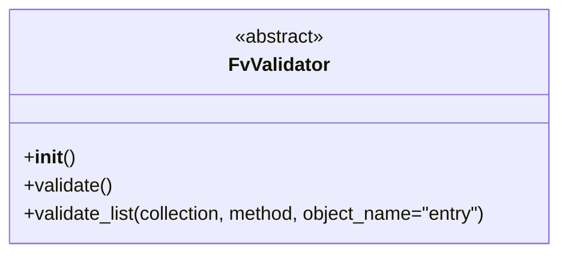

# Diagram: partview_core/partview_service/partview_service/api/validation/FvValidator.py

> Auto-generated by Obscura crawlers

## Mermaid

### SVG

<svg id="container" width="484.109375" xmlns="http://www.w3.org/2000/svg" class="classDiagram" height="214" viewBox="0 0 484.109375 214" role="graphics-document document" aria-roledescription="class"><g><defs><marker id="container_class-aggregationStart" class="marker aggregation class" refX="18" refY="7" markerWidth="190" markerHeight="240" orient="auto"><path d="M 18,7 L9,13 L1,7 L9,1 Z"></path></marker></defs><defs><marker id="container_class-aggregationEnd" class="marker aggregation class" refX="1" refY="7" markerWidth="20" markerHeight="28" orient="auto"><path d="M 18,7 L9,13 L1,7 L9,1 Z"></path></marker></defs><defs><marker id="container_class-extensionStart" class="marker extension class" refX="18" refY="7" markerWidth="190" markerHeight="240" orient="auto"><path d="M 1,7 L18,13 V 1 Z"></path></marker></defs><defs><marker id="container_class-extensionEnd" class="marker extension class" refX="1" refY="7" markerWidth="20" markerHeight="28" orient="auto"><path d="M 1,1 V 13 L18,7 Z"></path></marker></defs><defs><marker id="container_class-compositionStart" class="marker composition class" refX="18" refY="7" markerWidth="190" markerHeight="240" orient="auto"><path d="M 18,7 L9,13 L1,7 L9,1 Z"></path></marker></defs><defs><marker id="container_class-compositionEnd" class="marker composition class" refX="1" refY="7" markerWidth="20" markerHeight="28" orient="auto"><path d="M 18,7 L9,13 L1,7 L9,1 Z"></path></marker></defs><defs><marker id="container_class-dependencyStart" class="marker dependency class" refX="6" refY="7" markerWidth="190" markerHeight="240" orient="auto"><path d="M 5,7 L9,13 L1,7 L9,1 Z"></path></marker></defs><defs><marker id="container_class-dependencyEnd" class="marker dependency class" refX="13" refY="7" markerWidth="20" markerHeight="28" orient="auto"><path d="M 18,7 L9,13 L14,7 L9,1 Z"></path></marker></defs><defs><marker id="container_class-lollipopStart" class="marker lollipop class" refX="13" refY="7" markerWidth="190" markerHeight="240" orient="auto"><circle stroke="black" fill="transparent" cx="7" cy="7" r="6"></circle></marker></defs><defs><marker id="container_class-lollipopEnd" class="marker lollipop class" refX="1" refY="7" markerWidth="190" markerHeight="240" orient="auto"><circle stroke="black" fill="transparent" cx="7" cy="7" r="6"></circle></marker></defs><g class="root"><g class="clusters"></g><g class="edgePaths"></g><g class="edgeLabels"></g><g class="nodes"><g class="node default" id="classId-FvValidator-0" transform="translate(242.0546875, 107)"><g class="basic label-container"><path d="M-234.0546875 -99 L234.0546875 -99 L234.0546875 99 L-234.0546875 99" stroke="none" stroke-width="0" fill="#ECECFF" style=""></path><path d="M-234.0546875 -99 C-128.0157326436921 -99, -21.976777787384236 -99, 234.0546875 -99 M-234.0546875 -99 C-132.35742969488803 -99, -30.660171889776024 -99, 234.0546875 -99 M234.0546875 -99 C234.0546875 -49.72434075069761, 234.0546875 -0.4486815013952139, 234.0546875 99 M234.0546875 -99 C234.0546875 -58.46944187707859, 234.0546875 -17.938883754157175, 234.0546875 99 M234.0546875 99 C57.47170509697335 99, -119.1112773060533 99, -234.0546875 99 M234.0546875 99 C84.90203023435708 99, -64.25062703128583 99, -234.0546875 99 M-234.0546875 99 C-234.0546875 21.840551021472038, -234.0546875 -55.318897957055924, -234.0546875 -99 M-234.0546875 99 C-234.0546875 31.14237456038343, -234.0546875 -36.71525087923314, -234.0546875 -99" stroke="#9370DB" stroke-width="1.3" fill="none" stroke-dasharray="0 0" style=""></path></g><g class="annotation-group text" transform="translate(-38.609375, -75)"><g class="label" style="" transform="translate(0,-12)"><foreignObject width="77.21875" height="24">

«abstract»

</foreignObject></g></g><g class="label-group text" transform="translate(-40.90625, -51)"><g class="label" style="font-weight: bolder" transform="translate(0,-12)"><foreignObject width="81.8125" height="24">

FvValidator

</foreignObject></g></g><g class="members-group text" transform="translate(-222.0546875, -3)"></g><g class="methods-group text" transform="translate(-222.0546875, 27)"><g class="label" style="" transform="translate(0,-12)"><foreignObject width="42.796875" height="24">

+<strong>init</strong>()

</foreignObject></g><g class="label" style="" transform="translate(0,12)"><foreignObject width="76.09375" height="24">

+validate()

</foreignObject></g><g class="label" style="" transform="translate(0,36)"><foreignObject width="403.203125" height="24">

+validate_list(collection, method, object_name="entry")

</foreignObject></g></g><g class="divider" style=""><path d="M-234.0546875 -27 C-88.88736273910476 -27, 56.27996202179048 -27, 234.0546875 -27 M-234.0546875 -27 C-83.84776581371003 -27, 66.35915587257995 -27, 234.0546875 -27" stroke="#9370DB" stroke-width="1.3" fill="none" stroke-dasharray="0 0" style=""></path></g><g class="divider" style=""><path d="M-234.0546875 -3 C-125.75537679516027 -3, -17.456066090320547 -3, 234.0546875 -3 M-234.0546875 -3 C-59.92547012099459 -3, 114.20374725801082 -3, 234.0546875 -3" stroke="#9370DB" stroke-width="1.3" fill="none" stroke-dasharray="0 0" style=""></path></g></g></g></g></g></svg>
