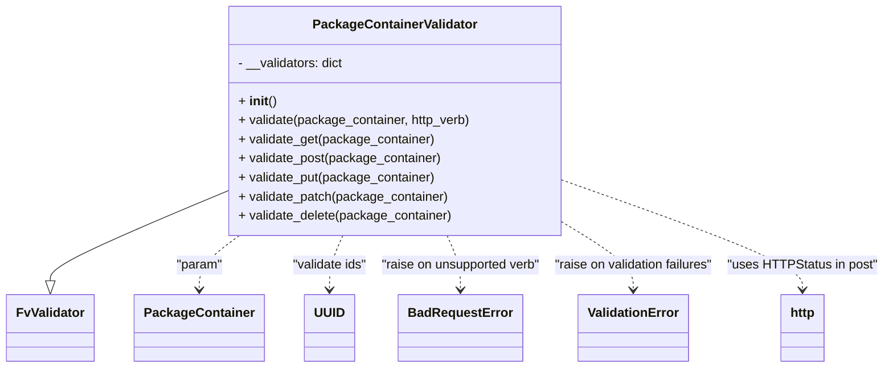

# Diagram: partview_core/partview_service/partview_service/api/validation/PackageContainerValidator.py

> Auto-generated by Obscura crawlers

## Mermaid

### SVG

<svg id="container" width="1101.0625" xmlns="http://www.w3.org/2000/svg" class="classDiagram" height="486" viewBox="0 0 1101.0625 486" role="graphics-document document" aria-roledescription="class"><g><defs><marker id="container_class-aggregationStart" class="marker aggregation class" refX="18" refY="7" markerWidth="190" markerHeight="240" orient="auto"><path d="M 18,7 L9,13 L1,7 L9,1 Z"></path></marker></defs><defs><marker id="container_class-aggregationEnd" class="marker aggregation class" refX="1" refY="7" markerWidth="20" markerHeight="28" orient="auto"><path d="M 18,7 L9,13 L1,7 L9,1 Z"></path></marker></defs><defs><marker id="container_class-extensionStart" class="marker extension class" refX="18" refY="7" markerWidth="190" markerHeight="240" orient="auto"><path d="M 1,7 L18,13 V 1 Z"></path></marker></defs><defs><marker id="container_class-extensionEnd" class="marker extension class" refX="1" refY="7" markerWidth="20" markerHeight="28" orient="auto"><path d="M 1,1 V 13 L18,7 Z"></path></marker></defs><defs><marker id="container_class-compositionStart" class="marker composition class" refX="18" refY="7" markerWidth="190" markerHeight="240" orient="auto"><path d="M 18,7 L9,13 L1,7 L9,1 Z"></path></marker></defs><defs><marker id="container_class-compositionEnd" class="marker composition class" refX="1" refY="7" markerWidth="20" markerHeight="28" orient="auto"><path d="M 18,7 L9,13 L1,7 L9,1 Z"></path></marker></defs><defs><marker id="container_class-dependencyStart" class="marker dependency class" refX="6" refY="7" markerWidth="190" markerHeight="240" orient="auto"><path d="M 5,7 L9,13 L1,7 L9,1 Z"></path></marker></defs><defs><marker id="container_class-dependencyEnd" class="marker dependency class" refX="13" refY="7" markerWidth="20" markerHeight="28" orient="auto"><path d="M 18,7 L9,13 L14,7 L9,1 Z"></path></marker></defs><defs><marker id="container_class-lollipopStart" class="marker lollipop class" refX="13" refY="7" markerWidth="190" markerHeight="240" orient="auto"><circle stroke="black" fill="transparent" cx="7" cy="7" r="6"></circle></marker></defs><defs><marker id="container_class-lollipopEnd" class="marker lollipop class" refX="1" refY="7" markerWidth="190" markerHeight="240" orient="auto"><circle stroke="black" fill="transparent" cx="7" cy="7" r="6"></circle></marker></defs><g class="root"><g class="clusters"></g><g class="edgePaths"><path d="M274.777,247.149L239.132,263.457C203.487,279.766,132.197,312.383,96.551,333.983C60.906,355.583,60.906,366.167,60.906,371.458L60.906,376.75" id="id_PackageContainerValidator_FvValidator_1" class="edge-thickness-normal edge-pattern-solid relation" style=";;;" data-edge="true" data-et="edge" data-id="id_PackageContainerValidator_FvValidator_1" data-points="W3sieCI6Mjc0Ljc3NzM0Mzc1LCJ5IjoyNDcuMTQ4ODc0ODk1ODIzNjd9LHsieCI6NjAuOTA2MjUsInkiOjM0NX0seyJ4Ijo2MC45MDYyNSwieSI6Mzk0fV0=" marker-end="url(#container_class-extensionEnd)"></path><path d="M302.573,296L292.355,304.167C282.137,312.333,261.701,328.667,251.484,344C241.266,359.333,241.266,373.667,241.266,380.833L241.266,388" id="id_PackageContainerValidator_PackageContainer_2" class="edge-thickness-normal edge-pattern-dashed relation" style=";;;" data-edge="true" data-et="edge" data-id="id_PackageContainerValidator_PackageContainer_2" data-points="W3sieCI6MzAyLjU3MzE0NjA0OTIyMjgsInkiOjI5Nn0seyJ4IjoyNDEuMjY1NjI1LCJ5IjozNDV9LHsieCI6MjQxLjI2NTYyNSwieSI6Mzk0fV0=" marker-end="url(#container_class-dependencyEnd)"></path><path d="M420.028,296L416.471,304.167C412.914,312.333,405.801,328.667,402.244,344C398.688,359.333,398.688,373.667,398.688,380.833L398.688,388" id="id_PackageContainerValidator_UUID_3" class="edge-thickness-normal edge-pattern-dashed relation" style=";;;" data-edge="true" data-et="edge" data-id="id_PackageContainerValidator_UUID_3" data-points="W3sieCI6NDIwLjAyNzgwOTI2MTY1ODA0LCJ5IjoyOTZ9LHsieCI6Mzk4LjY4NzUsInkiOjM0NX0seyJ4IjozOTguNjg3NSwieSI6Mzk0fV0=" marker-end="url(#container_class-dependencyEnd)"></path><path d="M545.457,296L549.013,304.167C552.57,312.333,559.683,328.667,563.24,344C566.797,359.333,566.797,373.667,566.797,380.833L566.797,388" id="id_PackageContainerValidator_BadRequestError_4" class="edge-thickness-normal edge-pattern-dashed relation" style=";;;" data-edge="true" data-et="edge" data-id="id_PackageContainerValidator_BadRequestError_4" data-points="W3sieCI6NTQ1LjQ1NjU2NTczODM0MiwieSI6Mjk2fSx7IngiOjU2Ni43OTY4NzUsInkiOjM0NX0seyJ4Ijo1NjYuNzk2ODc1LCJ5IjozOTR9XQ==" marker-end="url(#container_class-dependencyEnd)"></path><path d="M690.707,284.007L706.722,294.172C722.737,304.338,754.767,324.669,770.782,342.001C786.797,359.333,786.797,373.667,786.797,380.833L786.797,388" id="id_PackageContainerValidator_ValidationError_5" class="edge-thickness-normal edge-pattern-dashed relation" style=";;;" data-edge="true" data-et="edge" data-id="id_PackageContainerValidator_ValidationError_5" data-points="W3sieCI6NjkwLjcwNzAzMTI1LCJ5IjoyODQuMDA2NTY0OTE2ODc4N30seyJ4Ijo3ODYuNzk2ODc1LCJ5IjozNDV9LHsieCI6Nzg2Ljc5Njg3NSwieSI6Mzk0fV0=" marker-end="url(#container_class-dependencyEnd)"></path><path d="M690.707,229.607L742.244,248.839C793.781,268.071,896.855,306.536,948.393,332.934C999.93,359.333,999.93,373.667,999.93,380.833L999.93,388" id="id_PackageContainerValidator_http_6" class="edge-thickness-normal edge-pattern-dashed relation" style=";;;" data-edge="true" data-et="edge" data-id="id_PackageContainerValidator_http_6" data-points="W3sieCI6NjkwLjcwNzAzMTI1LCJ5IjoyMjkuNjA2Njk5Mzk1NzcwNH0seyJ4Ijo5OTkuOTI5Njg3NSwieSI6MzQ1fSx7IngiOjk5OS45Mjk2ODc1LCJ5IjozOTR9XQ==" marker-end="url(#container_class-dependencyEnd)"></path></g><g class="edgeLabels"><g class="edgeLabel"><g class="label" data-id="id_PackageContainerValidator_FvValidator_1" transform="translate(0, 0)"><foreignObject width="0" height="0">

</foreignObject></g></g><g class="edgeLabel" transform="translate(241.265625, 345)"><g class="label" data-id="id_PackageContainerValidator_PackageContainer_2" transform="translate(-29.3515625, -12)"><foreignObject width="58.703125" height="24">

"param"

</foreignObject></g></g><g class="edgeLabel" transform="translate(398.6875, 345)"><g class="label" data-id="id_PackageContainerValidator_UUID_3" transform="translate(-48.109375, -12)"><foreignObject width="96.21875" height="24">

"validate ids"

</foreignObject></g></g><g class="edgeLabel" transform="translate(566.796875, 345)"><g class="label" data-id="id_PackageContainerValidator_BadRequestError_4" transform="translate(-100, -24)"><foreignObject width="200" height="48">

"raise on unsupported verb"

</foreignObject></g></g><g class="edgeLabel" transform="translate(786.796875, 345)"><g class="label" data-id="id_PackageContainerValidator_ValidationError_5" transform="translate(-100, -24)"><foreignObject width="200" height="48">

"raise on validation failures"

</foreignObject></g></g><g class="edgeLabel" transform="translate(999.9296875, 345)"><g class="label" data-id="id_PackageContainerValidator_http_6" transform="translate(-93.1328125, -12)"><foreignObject width="186.265625" height="24">

"uses HTTPStatus in post"

</foreignObject></g></g></g><g class="nodes"><g class="node default" id="classId-FvValidator-0" transform="translate(60.90625, 436)"><g class="basic label-container"><path d="M-52.90625 -42 L52.90625 -42 L52.90625 42 L-52.90625 42" stroke="none" stroke-width="0" fill="#ECECFF" style=""></path><path d="M-52.90625 -42 C-24.658365219156806 -42, 3.5895195616863873 -42, 52.90625 -42 M-52.90625 -42 C-19.103502272201723 -42, 14.699245455596554 -42, 52.90625 -42 M52.90625 -42 C52.90625 -14.524837550732236, 52.90625 12.950324898535527, 52.90625 42 M52.90625 -42 C52.90625 -10.02840886359337, 52.90625 21.94318227281326, 52.90625 42 M52.90625 42 C25.64367173901236 42, -1.6189065219752834 42, -52.90625 42 M52.90625 42 C19.916009841534198 42, -13.074230316931605 42, -52.90625 42 M-52.90625 42 C-52.90625 16.474804973627737, -52.90625 -9.050390052744525, -52.90625 -42 M-52.90625 42 C-52.90625 24.132127337413454, -52.90625 6.264254674826908, -52.90625 -42" stroke="#9370DB" stroke-width="1.3" fill="none" stroke-dasharray="0 0" style=""></path></g><g class="annotation-group text" transform="translate(0, -18)"></g><g class="label-group text" transform="translate(-40.90625, -18)"><g class="label" style="font-weight: bolder" transform="translate(0,-12)"><foreignObject width="81.8125" height="24">

FvValidator

</foreignObject></g></g><g class="members-group text" transform="translate(-40.90625, 30)"></g><g class="methods-group text" transform="translate(-40.90625, 60)"></g><g class="divider" style=""><path d="M-52.90625 6 C-15.229947155275894 6, 22.44635568944821 6, 52.90625 6 M-52.90625 6 C-27.645798519483748 6, -2.3853470389674953 6, 52.90625 6" stroke="#9370DB" stroke-width="1.3" fill="none" stroke-dasharray="0 0" style=""></path></g><g class="divider" style=""><path d="M-52.90625 24 C-29.68006786966297 24, -6.453885739325941 24, 52.90625 24 M-52.90625 24 C-26.033072476317884 24, 0.8401050473642329 24, 52.90625 24" stroke="#9370DB" stroke-width="1.3" fill="none" stroke-dasharray="0 0" style=""></path></g></g><g class="node default" id="classId-PackageContainer-1" transform="translate(241.265625, 436)"><g class="basic label-container"><path d="M-77.453125 -42 L77.453125 -42 L77.453125 42 L-77.453125 42" stroke="none" stroke-width="0" fill="#ECECFF" style=""></path><path d="M-77.453125 -42 C-18.41514693506516 -42, 40.62283112986968 -42, 77.453125 -42 M-77.453125 -42 C-25.484769881457908 -42, 26.483585237084185 -42, 77.453125 -42 M77.453125 -42 C77.453125 -23.32472950585814, 77.453125 -4.6494590117162815, 77.453125 42 M77.453125 -42 C77.453125 -21.66490922451755, 77.453125 -1.329818449035102, 77.453125 42 M77.453125 42 C17.734540124093904 42, -41.98404475181219 42, -77.453125 42 M77.453125 42 C23.58052771911479 42, -30.29206956177042 42, -77.453125 42 M-77.453125 42 C-77.453125 18.391134544218076, -77.453125 -5.217730911563848, -77.453125 -42 M-77.453125 42 C-77.453125 10.516244330768451, -77.453125 -20.967511338463098, -77.453125 -42" stroke="#9370DB" stroke-width="1.3" fill="none" stroke-dasharray="0 0" style=""></path></g><g class="annotation-group text" transform="translate(0, -18)"></g><g class="label-group text" transform="translate(-65.453125, -18)"><g class="label" style="font-weight: bolder" transform="translate(0,-12)"><foreignObject width="130.90625" height="24">

PackageContainer

</foreignObject></g></g><g class="members-group text" transform="translate(-65.453125, 30)"></g><g class="methods-group text" transform="translate(-65.453125, 60)"></g><g class="divider" style=""><path d="M-77.453125 6 C-20.338941294826085 6, 36.77524241034783 6, 77.453125 6 M-77.453125 6 C-20.363761168147363 6, 36.725602663705274 6, 77.453125 6" stroke="#9370DB" stroke-width="1.3" fill="none" stroke-dasharray="0 0" style=""></path></g><g class="divider" style=""><path d="M-77.453125 24 C-26.2792398902193 24, 24.894645219561397 24, 77.453125 24 M-77.453125 24 C-43.04173751850242 24, -8.630350037004845 24, 77.453125 24" stroke="#9370DB" stroke-width="1.3" fill="none" stroke-dasharray="0 0" style=""></path></g></g><g class="node default" id="classId-UUID-2" transform="translate(398.6875, 436)"><g class="basic label-container"><path d="M-29.96875 -42 L29.96875 -42 L29.96875 42 L-29.96875 42" stroke="none" stroke-width="0" fill="#ECECFF" style=""></path><path d="M-29.96875 -42 C-6.2374509611110796 -42, 17.49384807777784 -42, 29.96875 -42 M-29.96875 -42 C-16.50061063704956 -42, -3.032471274099123 -42, 29.96875 -42 M29.96875 -42 C29.96875 -12.724808312210616, 29.96875 16.550383375578768, 29.96875 42 M29.96875 -42 C29.96875 -8.960001187577198, 29.96875 24.079997624845603, 29.96875 42 M29.96875 42 C16.700635456281802 42, 3.4325209125636 42, -29.96875 42 M29.96875 42 C6.70633936544661 42, -16.55607126910678 42, -29.96875 42 M-29.96875 42 C-29.96875 10.452531033195239, -29.96875 -21.094937933609522, -29.96875 -42 M-29.96875 42 C-29.96875 8.556991568654581, -29.96875 -24.886016862690838, -29.96875 -42" stroke="#9370DB" stroke-width="1.3" fill="none" stroke-dasharray="0 0" style=""></path></g><g class="annotation-group text" transform="translate(0, -18)"></g><g class="label-group text" transform="translate(-17.96875, -18)"><g class="label" style="font-weight: bolder" transform="translate(0,-12)"><foreignObject width="35.9375" height="24">

UUID

</foreignObject></g></g><g class="members-group text" transform="translate(-17.96875, 30)"></g><g class="methods-group text" transform="translate(-17.96875, 60)"></g><g class="divider" style=""><path d="M-29.96875 6 C-14.022864002807037 6, 1.9230219943859268 6, 29.96875 6 M-29.96875 6 C-12.188830795044808 6, 5.591088409910384 6, 29.96875 6" stroke="#9370DB" stroke-width="1.3" fill="none" stroke-dasharray="0 0" style=""></path></g><g class="divider" style=""><path d="M-29.96875 24 C-7.708479957153923 24, 14.551790085692154 24, 29.96875 24 M-29.96875 24 C-8.827328232723346 24, 12.314093534553308 24, 29.96875 24" stroke="#9370DB" stroke-width="1.3" fill="none" stroke-dasharray="0 0" style=""></path></g></g><g class="node default" id="classId-BadRequestError-3" transform="translate(566.796875, 436)"><g class="basic label-container"><path d="M-74.28125 -42 L74.28125 -42 L74.28125 42 L-74.28125 42" stroke="none" stroke-width="0" fill="#ECECFF" style=""></path><path d="M-74.28125 -42 C-31.412537439665627 -42, 11.456175120668746 -42, 74.28125 -42 M-74.28125 -42 C-28.541519265503638 -42, 17.198211468992724 -42, 74.28125 -42 M74.28125 -42 C74.28125 -14.49287465873294, 74.28125 13.014250682534119, 74.28125 42 M74.28125 -42 C74.28125 -11.899785309589355, 74.28125 18.20042938082129, 74.28125 42 M74.28125 42 C34.15285775128683 42, -5.975534497426338 42, -74.28125 42 M74.28125 42 C37.964080712197166 42, 1.6469114243943324 42, -74.28125 42 M-74.28125 42 C-74.28125 17.41521447631274, -74.28125 -7.169571047374518, -74.28125 -42 M-74.28125 42 C-74.28125 19.590090890708694, -74.28125 -2.8198182185826113, -74.28125 -42" stroke="#9370DB" stroke-width="1.3" fill="none" stroke-dasharray="0 0" style=""></path></g><g class="annotation-group text" transform="translate(0, -18)"></g><g class="label-group text" transform="translate(-62.28125, -18)"><g class="label" style="font-weight: bolder" transform="translate(0,-12)"><foreignObject width="124.5625" height="24">

BadRequestError

</foreignObject></g></g><g class="members-group text" transform="translate(-62.28125, 30)"></g><g class="methods-group text" transform="translate(-62.28125, 60)"></g><g class="divider" style=""><path d="M-74.28125 6 C-19.715059034801136 6, 34.85113193039773 6, 74.28125 6 M-74.28125 6 C-21.477427804118705 6, 31.32639439176259 6, 74.28125 6" stroke="#9370DB" stroke-width="1.3" fill="none" stroke-dasharray="0 0" style=""></path></g><g class="divider" style=""><path d="M-74.28125 24 C-17.13216823003591 24, 40.01691353992818 24, 74.28125 24 M-74.28125 24 C-38.82471031054274 24, -3.3681706210854827 24, 74.28125 24" stroke="#9370DB" stroke-width="1.3" fill="none" stroke-dasharray="0 0" style=""></path></g></g><g class="node default" id="classId-ValidationError-4" transform="translate(786.796875, 436)"><g class="basic label-container"><path d="M-67.1796875 -42 L67.1796875 -42 L67.1796875 42 L-67.1796875 42" stroke="none" stroke-width="0" fill="#ECECFF" style=""></path><path d="M-67.1796875 -42 C-19.0578052450784 -42, 29.064077009843203 -42, 67.1796875 -42 M-67.1796875 -42 C-18.190394085486126 -42, 30.798899329027748 -42, 67.1796875 -42 M67.1796875 -42 C67.1796875 -19.559032261730792, 67.1796875 2.881935476538416, 67.1796875 42 M67.1796875 -42 C67.1796875 -15.460155261490662, 67.1796875 11.079689477018675, 67.1796875 42 M67.1796875 42 C17.809645121124724 42, -31.56039725775055 42, -67.1796875 42 M67.1796875 42 C35.23472127115812 42, 3.2897550423162443 42, -67.1796875 42 M-67.1796875 42 C-67.1796875 21.441302812885098, -67.1796875 0.8826056257701964, -67.1796875 -42 M-67.1796875 42 C-67.1796875 24.92985369379476, -67.1796875 7.859707387589523, -67.1796875 -42" stroke="#9370DB" stroke-width="1.3" fill="none" stroke-dasharray="0 0" style=""></path></g><g class="annotation-group text" transform="translate(0, -18)"></g><g class="label-group text" transform="translate(-55.1796875, -18)"><g class="label" style="font-weight: bolder" transform="translate(0,-12)"><foreignObject width="110.359375" height="24">

ValidationError

</foreignObject></g></g><g class="members-group text" transform="translate(-55.1796875, 30)"></g><g class="methods-group text" transform="translate(-55.1796875, 60)"></g><g class="divider" style=""><path d="M-67.1796875 6 C-19.418153299342485 6, 28.34338090131503 6, 67.1796875 6 M-67.1796875 6 C-22.975499179786276 6, 21.22868914042745 6, 67.1796875 6" stroke="#9370DB" stroke-width="1.3" fill="none" stroke-dasharray="0 0" style=""></path></g><g class="divider" style=""><path d="M-67.1796875 24 C-28.289144218453515 24, 10.60139906309297 24, 67.1796875 24 M-67.1796875 24 C-37.13308884448676 24, -7.086490188973514 24, 67.1796875 24" stroke="#9370DB" stroke-width="1.3" fill="none" stroke-dasharray="0 0" style=""></path></g></g><g class="node default" id="classId-http-5" transform="translate(999.9296875, 436)"><g class="basic label-container"><path d="M-27.5703125 -42 L27.5703125 -42 L27.5703125 42 L-27.5703125 42" stroke="none" stroke-width="0" fill="#ECECFF" style=""></path><path d="M-27.5703125 -42 C-9.664710896804149 -42, 8.240890706391703 -42, 27.5703125 -42 M-27.5703125 -42 C-14.27239037193072 -42, -0.9744682438614412 -42, 27.5703125 -42 M27.5703125 -42 C27.5703125 -23.709978391409713, 27.5703125 -5.419956782819426, 27.5703125 42 M27.5703125 -42 C27.5703125 -12.741088259726283, 27.5703125 16.517823480547435, 27.5703125 42 M27.5703125 42 C9.26528643140643 42, -9.03973963718714 42, -27.5703125 42 M27.5703125 42 C9.752902319131163 42, -8.064507861737674 42, -27.5703125 42 M-27.5703125 42 C-27.5703125 20.802462707207326, -27.5703125 -0.39507458558534836, -27.5703125 -42 M-27.5703125 42 C-27.5703125 13.743640586133324, -27.5703125 -14.512718827733352, -27.5703125 -42" stroke="#9370DB" stroke-width="1.3" fill="none" stroke-dasharray="0 0" style=""></path></g><g class="annotation-group text" transform="translate(0, -18)"></g><g class="label-group text" transform="translate(-15.5703125, -18)"><g class="label" style="font-weight: bolder" transform="translate(0,-12)"><foreignObject width="31.140625" height="24">

http

</foreignObject></g></g><g class="members-group text" transform="translate(-15.5703125, 30)"></g><g class="methods-group text" transform="translate(-15.5703125, 60)"></g><g class="divider" style=""><path d="M-27.5703125 6 C-13.970098407209573 6, -0.3698843144191457 6, 27.5703125 6 M-27.5703125 6 C-12.186369038948271 6, 3.1975744221034574 6, 27.5703125 6" stroke="#9370DB" stroke-width="1.3" fill="none" stroke-dasharray="0 0" style=""></path></g><g class="divider" style=""><path d="M-27.5703125 24 C-11.51432752524326 24, 4.54165744951348 24, 27.5703125 24 M-27.5703125 24 C-14.673143905447452 24, -1.7759753108949035 24, 27.5703125 24" stroke="#9370DB" stroke-width="1.3" fill="none" stroke-dasharray="0 0" style=""></path></g></g><g class="node default" id="classId-PackageContainerValidator-6" transform="translate(482.7421875, 152)"><g class="basic label-container"><path d="M-207.96484375 -144 L207.96484375 -144 L207.96484375 144 L-207.96484375 144" stroke="none" stroke-width="0" fill="#ECECFF" style=""></path><path d="M-207.96484375 -144 C-84.6394563555434 -144, 38.685931038913196 -144, 207.96484375 -144 M-207.96484375 -144 C-98.21910896165441 -144, 11.526625826691173 -144, 207.96484375 -144 M207.96484375 -144 C207.96484375 -46.368342267882525, 207.96484375 51.26331546423495, 207.96484375 144 M207.96484375 -144 C207.96484375 -85.80301375553586, 207.96484375 -27.606027511071716, 207.96484375 144 M207.96484375 144 C62.2483636484628 144, -83.4681164530744 144, -207.96484375 144 M207.96484375 144 C54.768464932302294 144, -98.42791388539541 144, -207.96484375 144 M-207.96484375 144 C-207.96484375 73.87255261344755, -207.96484375 3.745105226895106, -207.96484375 -144 M-207.96484375 144 C-207.96484375 58.91388568007055, -207.96484375 -26.1722286398589, -207.96484375 -144" stroke="#9370DB" stroke-width="1.3" fill="none" stroke-dasharray="0 0" style=""></path></g><g class="annotation-group text" transform="translate(0, -120)"></g><g class="label-group text" transform="translate(-98.6328125, -120)"><g class="label" style="font-weight: bolder" transform="translate(0,-12)"><foreignObject width="197.265625" height="24">

PackageContainerValidator

</foreignObject></g></g><g class="members-group text" transform="translate(-195.96484375, -72)"><g class="label" style="" transform="translate(0,-12)"><foreignObject width="134.203125" height="24">

- __validators: dict

</foreignObject></g></g><g class="methods-group text" transform="translate(-195.96484375, -24)"><g class="label" style="" transform="translate(0,-12)"><foreignObject width="47.046875" height="24">

+ <strong>init</strong>()

</foreignObject></g><g class="label" style="" transform="translate(0,12)"><foreignObject width="293.296875" height="24">

+ validate(package_container, http_verb)

</foreignObject></g><g class="label" style="" transform="translate(0,36)"><foreignObject width="247.046875" height="24">

+ validate_get(package_container)

</foreignObject></g><g class="label" style="" transform="translate(0,60)"><foreignObject width="256.4375" height="24">

+ validate_post(package_container)

</foreignObject></g><g class="label" style="" transform="translate(0,84)"><foreignObject width="248.9375" height="24">

+ validate_put(package_container)

</foreignObject></g><g class="label" style="" transform="translate(0,108)"><foreignObject width="264.953125" height="24">

+ validate_patch(package_container)

</foreignObject></g><g class="label" style="" transform="translate(0,132)"><foreignObject width="269.890625" height="24">

+ validate_delete(package_container)

</foreignObject></g></g><g class="divider" style=""><path d="M-207.96484375 -96 C-63.86696708852199 -96, 80.23090957295602 -96, 207.96484375 -96 M-207.96484375 -96 C-74.63286404743573 -96, 58.69911565512854 -96, 207.96484375 -96" stroke="#9370DB" stroke-width="1.3" fill="none" stroke-dasharray="0 0" style=""></path></g><g class="divider" style=""><path d="M-207.96484375 -48 C-87.81060976921717 -48, 32.34362421156567 -48, 207.96484375 -48 M-207.96484375 -48 C-47.70288836421068 -48, 112.55906702157864 -48, 207.96484375 -48" stroke="#9370DB" stroke-width="1.3" fill="none" stroke-dasharray="0 0" style=""></path></g></g></g></g></g></svg>
