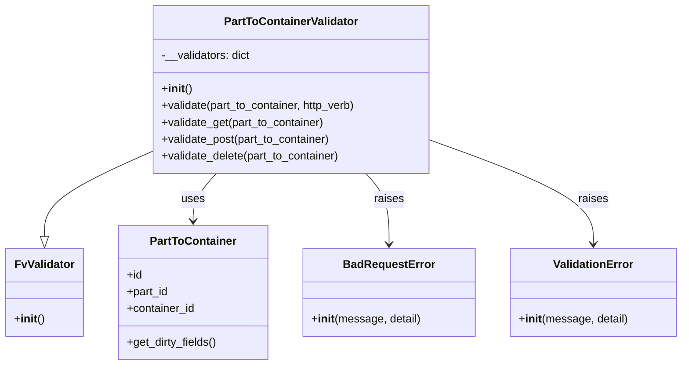

# Diagram: partview_core/partview_service/partview_service/api/validation/PartToContainerValidator.py


> Auto-generated by Obscura crawlers

## Diagram 1



### SVG

<svg id="container" width="962.1171875" xmlns="http://www.w3.org/2000/svg" class="classDiagram" height="522" viewBox="0 0 962.1171875 522" role="graphics-document document" aria-roledescription="class"><style>#container{font-family:"trebuchet ms",verdana,arial,sans-serif;font-size:16px;fill:#333;}@keyframes edge-animation-frame{from{stroke-dashoffset:0;}}@keyframes dash{to{stroke-dashoffset:0;}}#container .edge-animation-slow{stroke-dasharray:9,5!important;stroke-dashoffset:900;animation:dash 50s linear infinite;stroke-linecap:round;}#container .edge-animation-fast{stroke-dasharray:9,5!important;stroke-dashoffset:900;animation:dash 20s linear infinite;stroke-linecap:round;}#container .error-icon{fill:#552222;}#container .error-text{fill:#552222;stroke:#552222;}#container .edge-thickness-normal{stroke-width:1px;}#container .edge-thickness-thick{stroke-width:3.5px;}#container .edge-pattern-solid{stroke-dasharray:0;}#container .edge-thickness-invisible{stroke-width:0;fill:none;}#container .edge-pattern-dashed{stroke-dasharray:3;}#container .edge-pattern-dotted{stroke-dasharray:2;}#container .marker{fill:#333333;stroke:#333333;}#container .marker.cross{stroke:#333333;}#container svg{font-family:"trebuchet ms",verdana,arial,sans-serif;font-size:16px;}#container p{margin:0;}#container g.classGroup text{fill:#9370DB;stroke:none;font-family:"trebuchet ms",verdana,arial,sans-serif;font-size:10px;}#container g.classGroup text .title{font-weight:bolder;}#container .nodeLabel,#container .edgeLabel{color:#131300;}#container .edgeLabel .label rect{fill:#ECECFF;}#container .label text{fill:#131300;}#container .labelBkg{background:#ECECFF;}#container .edgeLabel .label span{background:#ECECFF;}#container .classTitle{font-weight:bolder;}#container .node rect,#container .node circle,#container .node ellipse,#container .node polygon,#container .node path{fill:#ECECFF;stroke:#9370DB;stroke-width:1px;}#container .divider{stroke:#9370DB;stroke-width:1;}#container g.clickable{cursor:pointer;}#container g.classGroup rect{fill:#ECECFF;stroke:#9370DB;}#container g.classGroup line{stroke:#9370DB;stroke-width:1;}#container .classLabel .box{stroke:none;stroke-width:0;fill:#ECECFF;opacity:0.5;}#container .classLabel .label{fill:#9370DB;font-size:10px;}#container .relation{stroke:#333333;stroke-width:1;fill:none;}#container .dashed-line{stroke-dasharray:3;}#container .dotted-line{stroke-dasharray:1 2;}#container #compositionStart,#container .composition{fill:#333333!important;stroke:#333333!important;stroke-width:1;}#container #compositionEnd,#container .composition{fill:#333333!important;stroke:#333333!important;stroke-width:1;}#container #dependencyStart,#container .dependency{fill:#333333!important;stroke:#333333!important;stroke-width:1;}#container #dependencyStart,#container .dependency{fill:#333333!important;stroke:#333333!important;stroke-width:1;}#container #extensionStart,#container .extension{fill:transparent!important;stroke:#333333!important;stroke-width:1;}#container #extensionEnd,#container .extension{fill:transparent!important;stroke:#333333!important;stroke-width:1;}#container #aggregationStart,#container .aggregation{fill:transparent!important;stroke:#333333!important;stroke-width:1;}#container #aggregationEnd,#container .aggregation{fill:transparent!important;stroke:#333333!important;stroke-width:1;}#container #lollipopStart,#container .lollipop{fill:#ECECFF!important;stroke:#333333!important;stroke-width:1;}#container #lollipopEnd,#container .lollipop{fill:#ECECFF!important;stroke:#333333!important;stroke-width:1;}#container .edgeTerminals{font-size:11px;line-height:initial;}#container .classTitleText{text-anchor:middle;font-size:18px;fill:#333;}#container .label-icon{display:inline-block;height:1em;overflow:visible;vertical-align:-0.125em;}#container .node .label-icon path{fill:currentColor;stroke:revert;stroke-width:revert;}#container :root{--mermaid-font-family:"trebuchet ms",verdana,arial,sans-serif;}</style><g><defs><marker id="container_class-aggregationStart" class="marker aggregation class" refX="18" refY="7" markerWidth="190" markerHeight="240" orient="auto"><path d="M 18,7 L9,13 L1,7 L9,1 Z"></path></marker></defs><defs><marker id="container_class-aggregationEnd" class="marker aggregation class" refX="1" refY="7" markerWidth="20" markerHeight="28" orient="auto"><path d="M 18,7 L9,13 L1,7 L9,1 Z"></path></marker></defs><defs><marker id="container_class-extensionStart" class="marker extension class" refX="18" refY="7" markerWidth="190" markerHeight="240" orient="auto"><path d="M 1,7 L18,13 V 1 Z"></path></marker></defs><defs><marker id="container_class-extensionEnd" class="marker extension class" refX="1" refY="7" markerWidth="20" markerHeight="28" orient="auto"><path d="M 1,1 V 13 L18,7 Z"></path></marker></defs><defs><marker id="container_class-compositionStart" class="marker composition class" refX="18" refY="7" markerWidth="190" markerHeight="240" orient="auto"><path d="M 18,7 L9,13 L1,7 L9,1 Z"></path></marker></defs><defs><marker id="container_class-compositionEnd" class="marker composition class" refX="1" refY="7" markerWidth="20" markerHeight="28" orient="auto"><path d="M 18,7 L9,13 L1,7 L9,1 Z"></path></marker></defs><defs><marker id="container_class-dependencyStart" class="marker dependency class" refX="6" refY="7" markerWidth="190" markerHeight="240" orient="auto"><path d="M 5,7 L9,13 L1,7 L9,1 Z"></path></marker></defs><defs><marker id="container_class-dependencyEnd" class="marker dependency class" refX="13" refY="7" markerWidth="20" markerHeight="28" orient="auto"><path d="M 18,7 L9,13 L14,7 L9,1 Z"></path></marker></defs><defs><marker id="container_class-lollipopStart" class="marker lollipop class" refX="13" refY="7" markerWidth="190" markerHeight="240" orient="auto"><circle stroke="black" fill="transparent" cx="7" cy="7" r="6"></circle></marker></defs><defs><marker id="container_class-lollipopEnd" class="marker lollipop class" refX="1" refY="7" markerWidth="190" markerHeight="240" orient="auto"><circle stroke="black" fill="transparent" cx="7" cy="7" r="6"></circle></marker></defs><g class="root"><g class="clusters"></g><g class="edgePaths"><path d="M211.188,217.81L186.298,229.008C161.409,240.206,111.63,262.603,86.741,282.593C61.852,302.583,61.852,320.167,61.852,328.958L61.852,337.75" id="id_PartToContainerValidator_FvValidator_1" class="edge-thickness-normal edge-pattern-solid relation" style=";;;" data-edge="true" data-et="edge" data-id="id_PartToContainerValidator_FvValidator_1" data-points="W3sieCI6MjExLjE4NzUsInkiOjIxNy44MDk2OTQzOTE1ODE4fSx7IngiOjYxLjg1MTU2MjUsInkiOjI4NX0seyJ4Ijo2MS44NTE1NjI1LCJ5IjozNTV9XQ==" marker-end="url(#container_class-extensionEnd)"></path><path d="M304.883,248L299.44,254.167C293.998,260.333,283.112,272.667,277.669,284C272.227,295.333,272.227,305.667,272.227,310.833L272.227,316" id="id_PartToContainerValidator_PartToContainer_2" class="edge-thickness-normal edge-pattern-solid relation" style=";;;" data-edge="true" data-et="edge" data-id="id_PartToContainerValidator_PartToContainer_2" data-points="W3sieCI6MzA0Ljg4MzI2MDM1MDMxODQ0LCJ5IjoyNDh9LHsieCI6MjcyLjIyNjU2MjUsInkiOjI4NX0seyJ4IjoyNzIuMjI2NTYyNSwieSI6MzIyfV0=" marker-end="url(#container_class-dependencyEnd)"></path><path d="M516.71,248L522.153,254.167C527.596,260.333,538.482,272.667,543.924,289.5C549.367,306.333,549.367,327.667,549.367,338.333L549.367,349" id="id_PartToContainerValidator_BadRequestError_3" class="edge-thickness-normal edge-pattern-solid relation" style=";;;" data-edge="true" data-et="edge" data-id="id_PartToContainerValidator_BadRequestError_3" data-points="W3sieCI6NTE2LjcxMDQ4OTY0OTY4MTYsInkiOjI0OH0seyJ4Ijo1NDkuMzY3MTg3NSwieSI6Mjg1fSx7IngiOjU0OS4zNjcxODc1LCJ5IjozNTV9XQ==" marker-end="url(#container_class-dependencyEnd)"></path><path d="M610.406,201.521L648.18,215.434C685.954,229.347,761.503,257.174,799.277,281.754C837.051,306.333,837.051,327.667,837.051,338.333L837.051,349" id="id_PartToContainerValidator_ValidationError_4" class="edge-thickness-normal edge-pattern-solid relation" style=";;;" data-edge="true" data-et="edge" data-id="id_PartToContainerValidator_ValidationError_4" data-points="W3sieCI6NjEwLjQwNjI1LCJ5IjoyMDEuNTIxMTM3MDg2MzUzN30seyJ4Ijo4MzcuMDUwNzgxMjUsInkiOjI4NX0seyJ4Ijo4MzcuMDUwNzgxMjUsInkiOjM1NX1d" marker-end="url(#container_class-dependencyEnd)"></path></g><g class="edgeLabels"><g class="edgeLabel"><g class="label" data-id="id_PartToContainerValidator_FvValidator_1" transform="translate(0, 0)"><foreignObject width="0" height="0"><div xmlns="http://www.w3.org/1999/xhtml" class="labelBkg" style="display: table-cell; white-space: nowrap; line-height: 1.5; max-width: 200px; text-align: center;"><span class="edgeLabel"></span></div></foreignObject></g></g><g class="edgeLabel" transform="translate(272.2265625, 285)"><g class="label" data-id="id_PartToContainerValidator_PartToContainer_2" transform="translate(-16.4921875, -12)"><foreignObject width="32.984375" height="24"><div xmlns="http://www.w3.org/1999/xhtml" class="labelBkg" style="display: table-cell; white-space: nowrap; line-height: 1.5; max-width: 200px; text-align: center;"><span class="edgeLabel"><p>uses</p></span></div></foreignObject></g></g><g class="edgeLabel" transform="translate(549.3671875, 285)"><g class="label" data-id="id_PartToContainerValidator_BadRequestError_3" transform="translate(-21.25, -12)"><foreignObject width="42.5" height="24"><div xmlns="http://www.w3.org/1999/xhtml" class="labelBkg" style="display: table-cell; white-space: nowrap; line-height: 1.5; max-width: 200px; text-align: center;"><span class="edgeLabel"><p>raises</p></span></div></foreignObject></g></g><g class="edgeLabel" transform="translate(837.05078125, 285)"><g class="label" data-id="id_PartToContainerValidator_ValidationError_4" transform="translate(-21.25, -12)"><foreignObject width="42.5" height="24"><div xmlns="http://www.w3.org/1999/xhtml" class="labelBkg" style="display: table-cell; white-space: nowrap; line-height: 1.5; max-width: 200px; text-align: center;"><span class="edgeLabel"><p>raises</p></span></div></foreignObject></g></g></g><g class="nodes"><g class="node default" id="classId-PartToContainerValidator-0" transform="translate(410.796875, 128)"><g class="basic label-container"><path d="M-199.609375 -120 L199.609375 -120 L199.609375 120 L-199.609375 120" stroke="none" stroke-width="0" fill="#ECECFF" style=""></path><path d="M-199.609375 -120 C-60.03664420607757 -120, 79.53608658784486 -120, 199.609375 -120 M-199.609375 -120 C-112.45079967253072 -120, -25.29222434506144 -120, 199.609375 -120 M199.609375 -120 C199.609375 -63.968013508599135, 199.609375 -7.9360270171982705, 199.609375 120 M199.609375 -120 C199.609375 -38.9104329808666, 199.609375 42.179134038266795, 199.609375 120 M199.609375 120 C73.2514262240956 120, -53.10652255180881 120, -199.609375 120 M199.609375 120 C54.32151191831613 120, -90.96635116336773 120, -199.609375 120 M-199.609375 120 C-199.609375 50.92533677353076, -199.609375 -18.14932645293848, -199.609375 -120 M-199.609375 120 C-199.609375 28.707572420312815, -199.609375 -62.58485515937437, -199.609375 -120" stroke="#9370DB" stroke-width="1.3" fill="none" stroke-dasharray="0 0" style=""></path></g><g class="annotation-group text" transform="translate(0, -96)"></g><g class="label-group text" transform="translate(-92.40625, -96)"><g class="label" style="font-weight: bolder" transform="translate(0,-12)"><foreignObject width="184.8125" height="24"><div xmlns="http://www.w3.org/1999/xhtml" style="display: table-cell; white-space: nowrap; line-height: 1.5; max-width: 232px; text-align: center;"><span class="nodeLabel markdown-node-label" style=""><p>PartToContainerValidator</p></span></div></foreignObject></g></g><g class="members-group text" transform="translate(-187.609375, -48)"><g class="label" style="" transform="translate(0,-12)"><foreignObject width="128.6875" height="24"><div xmlns="http://www.w3.org/1999/xhtml" style="display: table-cell; white-space: nowrap; line-height: 1.5; max-width: 186px; text-align: center;"><span class="nodeLabel markdown-node-label" style=""><p>-__validators: dict</p></span></div></foreignObject></g></g><g class="methods-group text" transform="translate(-187.609375, 0)"><g class="label" style="" transform="translate(0,-12)"><foreignObject width="42.796875" height="24"><div xmlns="http://www.w3.org/1999/xhtml" style="display: table-cell; white-space: nowrap; line-height: 1.5; max-width: 132px; text-align: center;"><span class="nodeLabel markdown-node-label" style=""><p>+<strong>init</strong>()</p></span></div></foreignObject></g><g class="label" style="" transform="translate(0,12)"><foreignObject width="282.8125" height="24"><div xmlns="http://www.w3.org/1999/xhtml" style="display: table-cell; white-space: nowrap; line-height: 1.5; max-width: 340px; text-align: center;"><span class="nodeLabel markdown-node-label" style=""><p>+validate(part_to_container, http_verb)</p></span></div></foreignObject></g><g class="label" style="" transform="translate(0,36)"><foreignObject width="236.546875" height="24"><div xmlns="http://www.w3.org/1999/xhtml" style="display: table-cell; white-space: nowrap; line-height: 1.5; max-width: 294px; text-align: center;"><span class="nodeLabel markdown-node-label" style=""><p>+validate_get(part_to_container)</p></span></div></foreignObject></g><g class="label" style="" transform="translate(0,60)"><foreignObject width="245.9375" height="24"><div xmlns="http://www.w3.org/1999/xhtml" style="display: table-cell; white-space: nowrap; line-height: 1.5; max-width: 303px; text-align: center;"><span class="nodeLabel markdown-node-label" style=""><p>+validate_post(part_to_container)</p></span></div></foreignObject></g><g class="label" style="" transform="translate(0,84)"><foreignObject width="259.40625" height="24"><div xmlns="http://www.w3.org/1999/xhtml" style="display: table-cell; white-space: nowrap; line-height: 1.5; max-width: 317px; text-align: center;"><span class="nodeLabel markdown-node-label" style=""><p>+validate_delete(part_to_container)</p></span></div></foreignObject></g></g><g class="divider" style=""><path d="M-199.609375 -72 C-53.06889897326923 -72, 93.47157705346154 -72, 199.609375 -72 M-199.609375 -72 C-110.4558064910604 -72, -21.3022379821208 -72, 199.609375 -72" stroke="#9370DB" stroke-width="1.3" fill="none" stroke-dasharray="0 0" style=""></path></g><g class="divider" style=""><path d="M-199.609375 -24 C-88.41281686408918 -24, 22.78374127182164 -24, 199.609375 -24 M-199.609375 -24 C-65.86821747658604 -24, 67.87294004682792 -24, 199.609375 -24" stroke="#9370DB" stroke-width="1.3" fill="none" stroke-dasharray="0 0" style=""></path></g></g><g class="node default" id="classId-FvValidator-1" transform="translate(61.8515625, 418)"><g class="basic label-container"><path d="M-53.8515625 -63 L53.8515625 -63 L53.8515625 63 L-53.8515625 63" stroke="none" stroke-width="0" fill="#ECECFF" style=""></path><path d="M-53.8515625 -63 C-17.549822124237295 -63, 18.75191825152541 -63, 53.8515625 -63 M-53.8515625 -63 C-19.1068491662964 -63, 15.637864167407201 -63, 53.8515625 -63 M53.8515625 -63 C53.8515625 -24.950688933139446, 53.8515625 13.098622133721108, 53.8515625 63 M53.8515625 -63 C53.8515625 -36.64606524295192, 53.8515625 -10.292130485903847, 53.8515625 63 M53.8515625 63 C14.31176747911853 63, -25.22802754176294 63, -53.8515625 63 M53.8515625 63 C17.26550812787122 63, -19.320546244257557 63, -53.8515625 63 M-53.8515625 63 C-53.8515625 37.74241535163269, -53.8515625 12.484830703265366, -53.8515625 -63 M-53.8515625 63 C-53.8515625 30.01779779983388, -53.8515625 -2.964404400332242, -53.8515625 -63" stroke="#9370DB" stroke-width="1.3" fill="none" stroke-dasharray="0 0" style=""></path></g><g class="annotation-group text" transform="translate(0, -39)"></g><g class="label-group text" transform="translate(-40.90625, -39)"><g class="label" style="font-weight: bolder" transform="translate(0,-12)"><foreignObject width="81.8125" height="24"><div xmlns="http://www.w3.org/1999/xhtml" style="display: table-cell; white-space: nowrap; line-height: 1.5; max-width: 131px; text-align: center;"><span class="nodeLabel markdown-node-label" style=""><p>FvValidator</p></span></div></foreignObject></g></g><g class="members-group text" transform="translate(-41.8515625, 9)"></g><g class="methods-group text" transform="translate(-41.8515625, 39)"><g class="label" style="" transform="translate(0,-12)"><foreignObject width="42.796875" height="24"><div xmlns="http://www.w3.org/1999/xhtml" style="display: table-cell; white-space: nowrap; line-height: 1.5; max-width: 132px; text-align: center;"><span class="nodeLabel markdown-node-label" style=""><p>+<strong>init</strong>()</p></span></div></foreignObject></g></g><g class="divider" style=""><path d="M-53.8515625 -15 C-32.26609228291922 -15, -10.680622065838442 -15, 53.8515625 -15 M-53.8515625 -15 C-11.063884022187516 -15, 31.72379445562497 -15, 53.8515625 -15" stroke="#9370DB" stroke-width="1.3" fill="none" stroke-dasharray="0 0" style=""></path></g><g class="divider" style=""><path d="M-53.8515625 9 C-23.477957395407845 9, 6.89564770918431 9, 53.8515625 9 M-53.8515625 9 C-20.794603767139044 9, 12.262354965721912 9, 53.8515625 9" stroke="#9370DB" stroke-width="1.3" fill="none" stroke-dasharray="0 0" style=""></path></g></g><g class="node default" id="classId-PartToContainer-2" transform="translate(272.2265625, 418)"><g class="basic label-container"><path d="M-106.5234375 -96 L106.5234375 -96 L106.5234375 96 L-106.5234375 96" stroke="none" stroke-width="0" fill="#ECECFF" style=""></path><path d="M-106.5234375 -96 C-37.67646311527882 -96, 31.170511269442358 -96, 106.5234375 -96 M-106.5234375 -96 C-54.20809817536921 -96, -1.8927588507384172 -96, 106.5234375 -96 M106.5234375 -96 C106.5234375 -48.95255884716567, 106.5234375 -1.905117694331338, 106.5234375 96 M106.5234375 -96 C106.5234375 -43.84530694034246, 106.5234375 8.309386119315079, 106.5234375 96 M106.5234375 96 C57.4913747095245 96, 8.459311919049 96, -106.5234375 96 M106.5234375 96 C59.03118236723196 96, 11.538927234463927 96, -106.5234375 96 M-106.5234375 96 C-106.5234375 29.633678936296093, -106.5234375 -36.732642127407814, -106.5234375 -96 M-106.5234375 96 C-106.5234375 45.205490882076916, -106.5234375 -5.589018235846169, -106.5234375 -96" stroke="#9370DB" stroke-width="1.3" fill="none" stroke-dasharray="0 0" style=""></path></g><g class="annotation-group text" transform="translate(0, -72)"></g><g class="label-group text" transform="translate(-59.21875, -72)"><g class="label" style="font-weight: bolder" transform="translate(0,-12)"><foreignObject width="118.4375" height="24"><div xmlns="http://www.w3.org/1999/xhtml" style="display: table-cell; white-space: nowrap; line-height: 1.5; max-width: 167px; text-align: center;"><span class="nodeLabel markdown-node-label" style=""><p>PartToContainer</p></span></div></foreignObject></g></g><g class="members-group text" transform="translate(-94.5234375, -24)"><g class="label" style="" transform="translate(0,-12)"><foreignObject width="22.078125" height="24"><div xmlns="http://www.w3.org/1999/xhtml" style="display: table-cell; white-space: nowrap; line-height: 1.5; max-width: 79px; text-align: center;"><span class="nodeLabel markdown-node-label" style=""><p>+id</p></span></div></foreignObject></g><g class="label" style="" transform="translate(0,12)"><foreignObject width="60.390625" height="24"><div xmlns="http://www.w3.org/1999/xhtml" style="display: table-cell; white-space: nowrap; line-height: 1.5; max-width: 118px; text-align: center;"><span class="nodeLabel markdown-node-label" style=""><p>+part_id</p></span></div></foreignObject></g><g class="label" style="" transform="translate(0,36)"><foreignObject width="98.3125" height="24"><div xmlns="http://www.w3.org/1999/xhtml" style="display: table-cell; white-space: nowrap; line-height: 1.5; max-width: 156px; text-align: center;"><span class="nodeLabel markdown-node-label" style=""><p>+container_id</p></span></div></foreignObject></g></g><g class="methods-group text" transform="translate(-94.5234375, 72)"><g class="label" style="" transform="translate(0,-12)"><foreignObject width="129.828125" height="24"><div xmlns="http://www.w3.org/1999/xhtml" style="display: table-cell; white-space: nowrap; line-height: 1.5; max-width: 187px; text-align: center;"><span class="nodeLabel markdown-node-label" style=""><p>+get_dirty_fields()</p></span></div></foreignObject></g></g><g class="divider" style=""><path d="M-106.5234375 -48 C-56.81365909384653 -48, -7.103880687693064 -48, 106.5234375 -48 M-106.5234375 -48 C-63.13669214752695 -48, -19.7499467950539 -48, 106.5234375 -48" stroke="#9370DB" stroke-width="1.3" fill="none" stroke-dasharray="0 0" style=""></path></g><g class="divider" style=""><path d="M-106.5234375 48 C-46.33655638708844 48, 13.850324725823114 48, 106.5234375 48 M-106.5234375 48 C-28.70760909889492 48, 49.10821930221016 48, 106.5234375 48" stroke="#9370DB" stroke-width="1.3" fill="none" stroke-dasharray="0 0" style=""></path></g></g><g class="node default" id="classId-BadRequestError-3" transform="translate(549.3671875, 418)"><g class="basic label-container"><path d="M-120.6171875 -63 L120.6171875 -63 L120.6171875 63 L-120.6171875 63" stroke="none" stroke-width="0" fill="#ECECFF" style=""></path><path d="M-120.6171875 -63 C-49.107347775620795 -63, 22.40249194875841 -63, 120.6171875 -63 M-120.6171875 -63 C-66.83416906347927 -63, -13.051150626958531 -63, 120.6171875 -63 M120.6171875 -63 C120.6171875 -14.498661565817471, 120.6171875 34.00267686836506, 120.6171875 63 M120.6171875 -63 C120.6171875 -24.63032398066313, 120.6171875 13.739352038673744, 120.6171875 63 M120.6171875 63 C69.23219657846528 63, 17.84720565693054 63, -120.6171875 63 M120.6171875 63 C25.289724854309995 63, -70.03773779138001 63, -120.6171875 63 M-120.6171875 63 C-120.6171875 18.93038391158658, -120.6171875 -25.139232176826837, -120.6171875 -63 M-120.6171875 63 C-120.6171875 28.675483382375774, -120.6171875 -5.649033235248453, -120.6171875 -63" stroke="#9370DB" stroke-width="1.3" fill="none" stroke-dasharray="0 0" style=""></path></g><g class="annotation-group text" transform="translate(0, -39)"></g><g class="label-group text" transform="translate(-62.28125, -39)"><g class="label" style="font-weight: bolder" transform="translate(0,-12)"><foreignObject width="124.5625" height="24"><div xmlns="http://www.w3.org/1999/xhtml" style="display: table-cell; white-space: nowrap; line-height: 1.5; max-width: 174px; text-align: center;"><span class="nodeLabel markdown-node-label" style=""><p>BadRequestError</p></span></div></foreignObject></g></g><g class="members-group text" transform="translate(-108.6171875, 9)"></g><g class="methods-group text" transform="translate(-108.6171875, 39)"><g class="label" style="" transform="translate(0,-12)"><foreignObject width="154.953125" height="24"><div xmlns="http://www.w3.org/1999/xhtml" style="display: table-cell; white-space: nowrap; line-height: 1.5; max-width: 244px; text-align: center;"><span class="nodeLabel markdown-node-label" style=""><p>+<strong>init</strong>(message, detail)</p></span></div></foreignObject></g></g><g class="divider" style=""><path d="M-120.6171875 -15 C-46.955790639054044 -15, 26.705606221891912 -15, 120.6171875 -15 M-120.6171875 -15 C-45.015453060430886 -15, 30.586281379138228 -15, 120.6171875 -15" stroke="#9370DB" stroke-width="1.3" fill="none" stroke-dasharray="0 0" style=""></path></g><g class="divider" style=""><path d="M-120.6171875 9 C-26.74615301866173 9, 67.12488146267654 9, 120.6171875 9 M-120.6171875 9 C-40.019441436803945 9, 40.57830462639211 9, 120.6171875 9" stroke="#9370DB" stroke-width="1.3" fill="none" stroke-dasharray="0 0" style=""></path></g></g><g class="node default" id="classId-ValidationError-4" transform="translate(837.05078125, 418)"><g class="basic label-container"><path d="M-117.06640625 -63 L117.06640625 -63 L117.06640625 63 L-117.06640625 63" stroke="none" stroke-width="0" fill="#ECECFF" style=""></path><path d="M-117.06640625 -63 C-61.09946525789171 -63, -5.132524265783417 -63, 117.06640625 -63 M-117.06640625 -63 C-38.8470726709412 -63, 39.372260908117596 -63, 117.06640625 -63 M117.06640625 -63 C117.06640625 -34.57705503438331, 117.06640625 -6.154110068766613, 117.06640625 63 M117.06640625 -63 C117.06640625 -26.568083213833475, 117.06640625 9.86383357233305, 117.06640625 63 M117.06640625 63 C36.242312615009624 63, -44.58178101998075 63, -117.06640625 63 M117.06640625 63 C63.144393048235514 63, 9.222379846471028 63, -117.06640625 63 M-117.06640625 63 C-117.06640625 30.978772903805762, -117.06640625 -1.042454192388476, -117.06640625 -63 M-117.06640625 63 C-117.06640625 28.225273557994356, -117.06640625 -6.549452884011288, -117.06640625 -63" stroke="#9370DB" stroke-width="1.3" fill="none" stroke-dasharray="0 0" style=""></path></g><g class="annotation-group text" transform="translate(0, -39)"></g><g class="label-group text" transform="translate(-55.1796875, -39)"><g class="label" style="font-weight: bolder" transform="translate(0,-12)"><foreignObject width="110.359375" height="24"><div xmlns="http://www.w3.org/1999/xhtml" style="display: table-cell; white-space: nowrap; line-height: 1.5; max-width: 160px; text-align: center;"><span class="nodeLabel markdown-node-label" style=""><p>ValidationError</p></span></div></foreignObject></g></g><g class="members-group text" transform="translate(-105.06640625, 9)"></g><g class="methods-group text" transform="translate(-105.06640625, 39)"><g class="label" style="" transform="translate(0,-12)"><foreignObject width="154.953125" height="24"><div xmlns="http://www.w3.org/1999/xhtml" style="display: table-cell; white-space: nowrap; line-height: 1.5; max-width: 244px; text-align: center;"><span class="nodeLabel markdown-node-label" style=""><p>+<strong>init</strong>(message, detail)</p></span></div></foreignObject></g></g><g class="divider" style=""><path d="M-117.06640625 -15 C-27.042952412165548 -15, 62.980501425668905 -15, 117.06640625 -15 M-117.06640625 -15 C-62.66198301436998 -15, -8.25755977873996 -15, 117.06640625 -15" stroke="#9370DB" stroke-width="1.3" fill="none" stroke-dasharray="0 0" style=""></path></g><g class="divider" style=""><path d="M-117.06640625 9 C-48.437854025823086 9, 20.19069819835383 9, 117.06640625 9 M-117.06640625 9 C-55.92159074402247 9, 5.223224761955066 9, 117.06640625 9" stroke="#9370DB" stroke-width="1.3" fill="none" stroke-dasharray="0 0" style=""></path></g></g></g></g></g></svg>

## Diagram 2

```mermaid
flowchart TD
    A[Start: validate(part_to_container, http_verb)] --> B{http_verb.upper() in validators}
    B -->|Yes| C[Lookup validator from __validators]
    C --> D[Call validator(part_to_container)]
    D --> E{validator execution outcome}
    E -->|Success| F[Return / complete]
    E -->|ValidationError raised| G[Raise ValidationError]
    E -->|BadRequestError raised| H[Raise BadRequestError]
    B -->|No| I[message = "No validation implemented for {http_verb}"]
    I --> J[Raise BadRequestError(message, message)]
    style A fill:#eef,stroke:#333,stroke-width:1px
    style F fill:#dfd,stroke:#333,stroke-width:1px
    style G fill:#fdd,stroke:#333,stroke-width:1px
    style H fill:#fdd,stroke:#333,stroke-width:1px
    style J fill:#fdd,stroke:#333,stroke-width:1px
```

> SVG rendering failed for this diagram.
