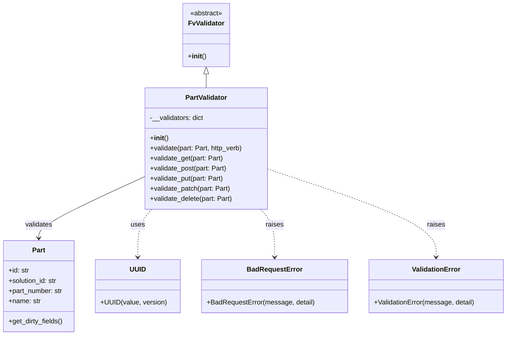

# Diagram: partview_core/partview_service/partview_service/api/validation/PartValidator.py

> Auto-generated by Obscura crawlers

## Mermaid

### SVG

<svg id="container" width="1190.328125" xmlns="http://www.w3.org/2000/svg" class="classDiagram" height="794" viewBox="0 0 1190.328125 794" role="graphics-document document" aria-roledescription="class"><g><defs><marker id="container_class-aggregationStart" class="marker aggregation class" refX="18" refY="7" markerWidth="190" markerHeight="240" orient="auto"><path d="M 18,7 L9,13 L1,7 L9,1 Z"></path></marker></defs><defs><marker id="container_class-aggregationEnd" class="marker aggregation class" refX="1" refY="7" markerWidth="20" markerHeight="28" orient="auto"><path d="M 18,7 L9,13 L1,7 L9,1 Z"></path></marker></defs><defs><marker id="container_class-extensionStart" class="marker extension class" refX="18" refY="7" markerWidth="190" markerHeight="240" orient="auto"><path d="M 1,7 L18,13 V 1 Z"></path></marker></defs><defs><marker id="container_class-extensionEnd" class="marker extension class" refX="1" refY="7" markerWidth="20" markerHeight="28" orient="auto"><path d="M 1,1 V 13 L18,7 Z"></path></marker></defs><defs><marker id="container_class-compositionStart" class="marker composition class" refX="18" refY="7" markerWidth="190" markerHeight="240" orient="auto"><path d="M 18,7 L9,13 L1,7 L9,1 Z"></path></marker></defs><defs><marker id="container_class-compositionEnd" class="marker composition class" refX="1" refY="7" markerWidth="20" markerHeight="28" orient="auto"><path d="M 18,7 L9,13 L1,7 L9,1 Z"></path></marker></defs><defs><marker id="container_class-dependencyStart" class="marker dependency class" refX="6" refY="7" markerWidth="190" markerHeight="240" orient="auto"><path d="M 5,7 L9,13 L1,7 L9,1 Z"></path></marker></defs><defs><marker id="container_class-dependencyEnd" class="marker dependency class" refX="13" refY="7" markerWidth="20" markerHeight="28" orient="auto"><path d="M 18,7 L9,13 L14,7 L9,1 Z"></path></marker></defs><defs><marker id="container_class-lollipopStart" class="marker lollipop class" refX="13" refY="7" markerWidth="190" markerHeight="240" orient="auto"><circle stroke="black" fill="transparent" cx="7" cy="7" r="6"></circle></marker></defs><defs><marker id="container_class-lollipopEnd" class="marker lollipop class" refX="1" refY="7" markerWidth="190" markerHeight="240" orient="auto"><circle stroke="black" fill="transparent" cx="7" cy="7" r="6"></circle></marker></defs><g class="root"><g class="clusters"></g><g class="edgePaths"><path d="M485.129,175.25L485.129,176.542C485.129,177.833,485.129,180.417,485.129,185.875C485.129,191.333,485.129,199.667,485.129,203.833L485.129,208" id="id_FvValidator_PartValidator_1" class="edge-thickness-normal edge-pattern-solid relation" style=";;;" data-edge="true" data-et="edge" data-id="id_FvValidator_PartValidator_1" data-points="W3sieCI6NDg1LjEyODkwNjI1LCJ5IjoxNTh9LHsieCI6NDg1LjEyODkwNjI1LCJ5IjoxODN9LHsieCI6NDg1LjEyODkwNjI1LCJ5IjoyMDh9XQ==" marker-start="url(#container_class-extensionStart)"></path><path d="M338.199,419.807L297.32,438.673C256.441,457.538,174.684,495.269,133.805,519.301C92.926,543.333,92.926,553.667,92.926,558.833L92.926,564" id="id_PartValidator_Part_2" class="edge-thickness-normal edge-pattern-solid relation" style=";;;" data-edge="true" data-et="edge" data-id="id_PartValidator_Part_2" data-points="W3sieCI6MzM4LjE5OTIxODc1LCJ5Ijo0MTkuODA3Mzk4MTExNjI5fSx7IngiOjkyLjkyNTc4MTI1LCJ5Ijo1MzN9LHsieCI6OTIuOTI1NzgxMjUsInkiOjU3MH1d" marker-end="url(#container_class-dependencyEnd)"></path><path d="M358.61,496L353.192,502.167C347.774,508.333,336.938,520.667,331.52,539.5C326.102,558.333,326.102,583.667,326.102,596.333L326.102,609" id="id_PartValidator_UUID_3" class="edge-thickness-normal edge-pattern-dashed relation" style=";;;" data-edge="true" data-et="edge" data-id="id_PartValidator_UUID_3" data-points="W3sieCI6MzU4LjYwOTkxNDUzNzI5MjgsInkiOjQ5Nn0seyJ4IjozMjYuMTAxNTYyNSwieSI6NTMzfSx7IngiOjMyNi4xMDE1NjI1LCJ5Ijo2MTV9XQ==" marker-end="url(#container_class-dependencyEnd)"></path><path d="M611.648,496L617.066,502.167C622.484,508.333,633.32,520.667,638.738,539.5C644.156,558.333,644.156,583.667,644.156,596.333L644.156,609" id="id_PartValidator_BadRequestError_4" class="edge-thickness-normal edge-pattern-dashed relation" style=";;;" data-edge="true" data-et="edge" data-id="id_PartValidator_BadRequestError_4" data-points="W3sieCI6NjExLjY0Nzg5Nzk2MjcwNzEsInkiOjQ5Nn0seyJ4Ijo2NDQuMTU2MjUsInkiOjUzM30seyJ4Ijo2NDQuMTU2MjUsInkiOjYxNX1d" marker-end="url(#container_class-dependencyEnd)"></path><path d="M632.059,401.43L697.24,423.359C762.421,445.287,892.783,489.143,957.964,523.738C1023.145,558.333,1023.145,583.667,1023.145,596.333L1023.145,609" id="id_PartValidator_ValidationError_5" class="edge-thickness-normal edge-pattern-dashed relation" style=";;;" data-edge="true" data-et="edge" data-id="id_PartValidator_ValidationError_5" data-points="W3sieCI6NjMyLjA1ODU5Mzc1LCJ5Ijo0MDEuNDMwMjk5NDIyMDY2fSx7IngiOjEwMjMuMTQ0NTMxMjUsInkiOjUzM30seyJ4IjoxMDIzLjE0NDUzMTI1LCJ5Ijo2MTV9XQ==" marker-end="url(#container_class-dependencyEnd)"></path></g><g class="edgeLabels"><g class="edgeLabel"><g class="label" data-id="id_FvValidator_PartValidator_1" transform="translate(0, 0)"><foreignObject width="0" height="0">

</foreignObject></g></g><g class="edgeLabel" transform="translate(92.92578125, 533)"><g class="label" data-id="id_PartValidator_Part_2" transform="translate(-32.6875, -12)"><foreignObject width="65.375" height="24">

validates

</foreignObject></g></g><g class="edgeLabel" transform="translate(326.1015625, 533)"><g class="label" data-id="id_PartValidator_UUID_3" transform="translate(-16.4921875, -12)"><foreignObject width="32.984375" height="24">

uses

</foreignObject></g></g><g class="edgeLabel" transform="translate(644.15625, 533)"><g class="label" data-id="id_PartValidator_BadRequestError_4" transform="translate(-21.25, -12)"><foreignObject width="42.5" height="24">

raises

</foreignObject></g></g><g class="edgeLabel" transform="translate(1023.14453125, 533)"><g class="label" data-id="id_PartValidator_ValidationError_5" transform="translate(-21.25, -12)"><foreignObject width="42.5" height="24">

raises

</foreignObject></g></g></g><g class="nodes"><g class="node default" id="classId-FvValidator-0" transform="translate(485.12890625, 83)"><g class="basic label-container"><path d="M-53.8515625 -75 L53.8515625 -75 L53.8515625 75 L-53.8515625 75" stroke="none" stroke-width="0" fill="#ECECFF" style=""></path><path d="M-53.8515625 -75 C-29.349893930543274 -75, -4.8482253610865484 -75, 53.8515625 -75 M-53.8515625 -75 C-17.43907367304839 -75, 18.97341515390322 -75, 53.8515625 -75 M53.8515625 -75 C53.8515625 -36.43967755626101, 53.8515625 2.1206448874779795, 53.8515625 75 M53.8515625 -75 C53.8515625 -18.220331545502916, 53.8515625 38.55933690899417, 53.8515625 75 M53.8515625 75 C28.683914120398644 75, 3.5162657407972873 75, -53.8515625 75 M53.8515625 75 C13.110731902163884 75, -27.63009869567223 75, -53.8515625 75 M-53.8515625 75 C-53.8515625 26.328985626315962, -53.8515625 -22.342028747368076, -53.8515625 -75 M-53.8515625 75 C-53.8515625 21.27350045789821, -53.8515625 -32.45299908420358, -53.8515625 -75" stroke="#9370DB" stroke-width="1.3" fill="none" stroke-dasharray="0 0" style=""></path></g><g class="annotation-group text" transform="translate(-38.609375, -51)"><g class="label" style="" transform="translate(0,-12)"><foreignObject width="77.21875" height="24">

«abstract»

</foreignObject></g></g><g class="label-group text" transform="translate(-40.90625, -27)"><g class="label" style="font-weight: bolder" transform="translate(0,-12)"><foreignObject width="81.8125" height="24">

FvValidator

</foreignObject></g></g><g class="members-group text" transform="translate(-41.8515625, 21)"></g><g class="methods-group text" transform="translate(-41.8515625, 51)"><g class="label" style="" transform="translate(0,-12)"><foreignObject width="42.796875" height="24">

+<strong>init</strong>()

</foreignObject></g></g><g class="divider" style=""><path d="M-53.8515625 -3 C-12.80889813219909 -3, 28.23376623560182 -3, 53.8515625 -3 M-53.8515625 -3 C-22.6808868902856 -3, 8.489788719428802 -3, 53.8515625 -3" stroke="#9370DB" stroke-width="1.3" fill="none" stroke-dasharray="0 0" style=""></path></g><g class="divider" style=""><path d="M-53.8515625 21 C-28.31185210635273 21, -2.772141712705462 21, 53.8515625 21 M-53.8515625 21 C-28.412653751234373 21, -2.973745002468746 21, 53.8515625 21" stroke="#9370DB" stroke-width="1.3" fill="none" stroke-dasharray="0 0" style=""></path></g></g><g class="node default" id="classId-PartValidator-1" transform="translate(485.12890625, 352)"><g class="basic label-container"><path d="M-146.9296875 -144 L146.9296875 -144 L146.9296875 144 L-146.9296875 144" stroke="none" stroke-width="0" fill="#ECECFF" style=""></path><path d="M-146.9296875 -144 C-73.7424441127996 -144, -0.5552007255992066 -144, 146.9296875 -144 M-146.9296875 -144 C-53.1630013090184 -144, 40.603684881963204 -144, 146.9296875 -144 M146.9296875 -144 C146.9296875 -85.97868980678217, 146.9296875 -27.957379613564328, 146.9296875 144 M146.9296875 -144 C146.9296875 -45.38490016775917, 146.9296875 53.23019966448166, 146.9296875 144 M146.9296875 144 C59.80832079249012 144, -27.313045915019757 144, -146.9296875 144 M146.9296875 144 C72.24779959245696 144, -2.434088315086086 144, -146.9296875 144 M-146.9296875 144 C-146.9296875 85.0843235413039, -146.9296875 26.168647082607805, -146.9296875 -144 M-146.9296875 144 C-146.9296875 84.24432791755672, -146.9296875 24.488655835113434, -146.9296875 -144" stroke="#9370DB" stroke-width="1.3" fill="none" stroke-dasharray="0 0" style=""></path></g><g class="annotation-group text" transform="translate(0, -120)"></g><g class="label-group text" transform="translate(-48.25, -120)"><g class="label" style="font-weight: bolder" transform="translate(0,-12)"><foreignObject width="96.5" height="24">

PartValidator

</foreignObject></g></g><g class="members-group text" transform="translate(-134.9296875, -72)"><g class="label" style="" transform="translate(0,-12)"><foreignObject width="128.6875" height="24">

-__validators: dict

</foreignObject></g></g><g class="methods-group text" transform="translate(-134.9296875, -24)"><g class="label" style="" transform="translate(0,-12)"><foreignObject width="42.796875" height="24">

+<strong>init</strong>()

</foreignObject></g><g class="label" style="" transform="translate(0,12)"><foreignObject width="221.609375" height="24">

+validate(part: Part, http_verb)

</foreignObject></g><g class="label" style="" transform="translate(0,36)"><foreignObject width="174.015625" height="24">

+validate_get(part: Part)

</foreignObject></g><g class="label" style="" transform="translate(0,60)"><foreignObject width="183.40625" height="24">

+validate_post(part: Part)

</foreignObject></g><g class="label" style="" transform="translate(0,84)"><foreignObject width="175.890625" height="24">

+validate_put(part: Part)

</foreignObject></g><g class="label" style="" transform="translate(0,108)"><foreignObject width="191.90625" height="24">

+validate_patch(part: Part)

</foreignObject></g><g class="label" style="" transform="translate(0,132)"><foreignObject width="196.859375" height="24">

+validate_delete(part: Part)

</foreignObject></g></g><g class="divider" style=""><path d="M-146.9296875 -96 C-75.65811023717245 -96, -4.386532974344902 -96, 146.9296875 -96 M-146.9296875 -96 C-44.09946883521603 -96, 58.73074982956794 -96, 146.9296875 -96" stroke="#9370DB" stroke-width="1.3" fill="none" stroke-dasharray="0 0" style=""></path></g><g class="divider" style=""><path d="M-146.9296875 -48 C-47.722328223311465 -48, 51.48503105337707 -48, 146.9296875 -48 M-146.9296875 -48 C-40.90582420464041 -48, 65.11803909071918 -48, 146.9296875 -48" stroke="#9370DB" stroke-width="1.3" fill="none" stroke-dasharray="0 0" style=""></path></g></g><g class="node default" id="classId-Part-2" transform="translate(92.92578125, 678)"><g class="basic label-container"><path d="M-84.92578125 -108 L84.92578125 -108 L84.92578125 108 L-84.92578125 108" stroke="none" stroke-width="0" fill="#ECECFF" style=""></path><path d="M-84.92578125 -108 C-45.04257413944377 -108, -5.159367028887544 -108, 84.92578125 -108 M-84.92578125 -108 C-43.41449677465639 -108, -1.9032122993127842 -108, 84.92578125 -108 M84.92578125 -108 C84.92578125 -63.0381367999695, 84.92578125 -18.076273599939, 84.92578125 108 M84.92578125 -108 C84.92578125 -52.569869937815376, 84.92578125 2.8602601243692476, 84.92578125 108 M84.92578125 108 C38.71530685214994 108, -7.495167545700113 108, -84.92578125 108 M84.92578125 108 C35.306010984992426 108, -14.313759280015148 108, -84.92578125 108 M-84.92578125 108 C-84.92578125 59.05814409811787, -84.92578125 10.116288196235743, -84.92578125 -108 M-84.92578125 108 C-84.92578125 43.06886325378632, -84.92578125 -21.862273492427363, -84.92578125 -108" stroke="#9370DB" stroke-width="1.3" fill="none" stroke-dasharray="0 0" style=""></path></g><g class="annotation-group text" transform="translate(0, -84)"></g><g class="label-group text" transform="translate(-15.0703125, -84)"><g class="label" style="font-weight: bolder" transform="translate(0,-12)"><foreignObject width="30.140625" height="24">

Part

</foreignObject></g></g><g class="members-group text" transform="translate(-72.92578125, -36)"><g class="label" style="" transform="translate(0,-12)"><foreignObject width="49.578125" height="24">

+id: str

</foreignObject></g><g class="label" style="" transform="translate(0,12)"><foreignObject width="117.71875" height="24">

+solution_id: str

</foreignObject></g><g class="label" style="" transform="translate(0,36)"><foreignObject width="130.78125" height="24">

+part_number: str

</foreignObject></g><g class="label" style="" transform="translate(0,60)"><foreignObject width="76.015625" height="24">

+name: str

</foreignObject></g></g><g class="methods-group text" transform="translate(-72.92578125, 84)"><g class="label" style="" transform="translate(0,-12)"><foreignObject width="129.828125" height="24">

+get_dirty_fields()

</foreignObject></g></g><g class="divider" style=""><path d="M-84.92578125 -60 C-33.32197247871381 -60, 18.28183629257238 -60, 84.92578125 -60 M-84.92578125 -60 C-34.21282020592912 -60, 16.50014083814176 -60, 84.92578125 -60" stroke="#9370DB" stroke-width="1.3" fill="none" stroke-dasharray="0 0" style=""></path></g><g class="divider" style=""><path d="M-84.92578125 60 C-45.77978625240745 60, -6.633791254814895 60, 84.92578125 60 M-84.92578125 60 C-17.066995618320576 60, 50.79179001335885 60, 84.92578125 60" stroke="#9370DB" stroke-width="1.3" fill="none" stroke-dasharray="0 0" style=""></path></g></g><g class="node default" id="classId-UUID-3" transform="translate(326.1015625, 678)"><g class="basic label-container"><path d="M-98.25 -63 L98.25 -63 L98.25 63 L-98.25 63" stroke="none" stroke-width="0" fill="#ECECFF" style=""></path><path d="M-98.25 -63 C-35.18813979186698 -63, 27.87372041626604 -63, 98.25 -63 M-98.25 -63 C-21.48498335707164 -63, 55.28003328585672 -63, 98.25 -63 M98.25 -63 C98.25 -25.561241968024106, 98.25 11.877516063951788, 98.25 63 M98.25 -63 C98.25 -30.18221379517278, 98.25 2.6355724096544435, 98.25 63 M98.25 63 C21.706687422354136 63, -54.83662515529173 63, -98.25 63 M98.25 63 C32.29181345398119 63, -33.66637309203762 63, -98.25 63 M-98.25 63 C-98.25 18.840218905873357, -98.25 -25.319562188253286, -98.25 -63 M-98.25 63 C-98.25 14.176815330331138, -98.25 -34.646369339337724, -98.25 -63" stroke="#9370DB" stroke-width="1.3" fill="none" stroke-dasharray="0 0" style=""></path></g><g class="annotation-group text" transform="translate(0, -39)"></g><g class="label-group text" transform="translate(-17.96875, -39)"><g class="label" style="font-weight: bolder" transform="translate(0,-12)"><foreignObject width="35.9375" height="24">

UUID

</foreignObject></g></g><g class="members-group text" transform="translate(-86.25, 9)"></g><g class="methods-group text" transform="translate(-86.25, 39)"><g class="label" style="" transform="translate(0,-12)"><foreignObject width="154.53125" height="24">

+UUID(value, version)

</foreignObject></g></g><g class="divider" style=""><path d="M-98.25 -15 C-54.52603959358653 -15, -10.802079187173064 -15, 98.25 -15 M-98.25 -15 C-28.793178595245948 -15, 40.663642809508104 -15, 98.25 -15" stroke="#9370DB" stroke-width="1.3" fill="none" stroke-dasharray="0 0" style=""></path></g><g class="divider" style=""><path d="M-98.25 9 C-52.92205363235578 9, -7.594107264711553 9, 98.25 9 M-98.25 9 C-19.96829325214553 9, 58.31341349570894 9, 98.25 9" stroke="#9370DB" stroke-width="1.3" fill="none" stroke-dasharray="0 0" style=""></path></g></g><g class="node default" id="classId-BadRequestError-4" transform="translate(644.15625, 678)"><g class="basic label-container"><path d="M-169.8046875 -63 L169.8046875 -63 L169.8046875 63 L-169.8046875 63" stroke="none" stroke-width="0" fill="#ECECFF" style=""></path><path d="M-169.8046875 -63 C-58.649227263536545 -63, 52.50623297292691 -63, 169.8046875 -63 M-169.8046875 -63 C-94.3970915243229 -63, -18.989495548645806 -63, 169.8046875 -63 M169.8046875 -63 C169.8046875 -17.984821136036004, 169.8046875 27.030357727927992, 169.8046875 63 M169.8046875 -63 C169.8046875 -14.682935853166391, 169.8046875 33.63412829366722, 169.8046875 63 M169.8046875 63 C55.207948454199155 63, -59.38879059160169 63, -169.8046875 63 M169.8046875 63 C88.96417902185321 63, 8.123670543706424 63, -169.8046875 63 M-169.8046875 63 C-169.8046875 31.133868252703483, -169.8046875 -0.7322634945930346, -169.8046875 -63 M-169.8046875 63 C-169.8046875 27.78135285708727, -169.8046875 -7.437294285825459, -169.8046875 -63" stroke="#9370DB" stroke-width="1.3" fill="none" stroke-dasharray="0 0" style=""></path></g><g class="annotation-group text" transform="translate(0, -39)"></g><g class="label-group text" transform="translate(-62.28125, -39)"><g class="label" style="font-weight: bolder" transform="translate(0,-12)"><foreignObject width="124.5625" height="24">

BadRequestError

</foreignObject></g></g><g class="members-group text" transform="translate(-157.8046875, 9)"></g><g class="methods-group text" transform="translate(-157.8046875, 39)"><g class="label" style="" transform="translate(0,-12)"><foreignObject width="253.328125" height="24">

+BadRequestError(message, detail)

</foreignObject></g></g><g class="divider" style=""><path d="M-169.8046875 -15 C-81.71948669528626 -15, 6.365714109427472 -15, 169.8046875 -15 M-169.8046875 -15 C-60.037624762099824 -15, 49.72943797580035 -15, 169.8046875 -15" stroke="#9370DB" stroke-width="1.3" fill="none" stroke-dasharray="0 0" style=""></path></g><g class="divider" style=""><path d="M-169.8046875 9 C-46.93021210457377 9, 75.94426329085246 9, 169.8046875 9 M-169.8046875 9 C-56.354615779647446 9, 57.09545594070511 9, 169.8046875 9" stroke="#9370DB" stroke-width="1.3" fill="none" stroke-dasharray="0 0" style=""></path></g></g><g class="node default" id="classId-ValidationError-5" transform="translate(1023.14453125, 678)"><g class="basic label-container"><path d="M-159.18359375 -63 L159.18359375 -63 L159.18359375 63 L-159.18359375 63" stroke="none" stroke-width="0" fill="#ECECFF" style=""></path><path d="M-159.18359375 -63 C-90.06458326724821 -63, -20.94557278449642 -63, 159.18359375 -63 M-159.18359375 -63 C-87.31532733283562 -63, -15.447060915671244 -63, 159.18359375 -63 M159.18359375 -63 C159.18359375 -27.766739254437077, 159.18359375 7.466521491125846, 159.18359375 63 M159.18359375 -63 C159.18359375 -33.13950356306672, 159.18359375 -3.279007126133436, 159.18359375 63 M159.18359375 63 C68.37774304953267 63, -22.428107650934663 63, -159.18359375 63 M159.18359375 63 C50.8167148251072 63, -57.550164099785604 63, -159.18359375 63 M-159.18359375 63 C-159.18359375 34.809798212521635, -159.18359375 6.6195964250432695, -159.18359375 -63 M-159.18359375 63 C-159.18359375 13.220765937599353, -159.18359375 -36.558468124801294, -159.18359375 -63" stroke="#9370DB" stroke-width="1.3" fill="none" stroke-dasharray="0 0" style=""></path></g><g class="annotation-group text" transform="translate(0, -39)"></g><g class="label-group text" transform="translate(-55.1796875, -39)"><g class="label" style="font-weight: bolder" transform="translate(0,-12)"><foreignObject width="110.359375" height="24">

ValidationError

</foreignObject></g></g><g class="members-group text" transform="translate(-147.18359375, 9)"></g><g class="methods-group text" transform="translate(-147.18359375, 39)"><g class="label" style="" transform="translate(0,-12)"><foreignObject width="239.1875" height="24">

+ValidationError(message, detail)

</foreignObject></g></g><g class="divider" style=""><path d="M-159.18359375 -15 C-45.79706291245806 -15, 67.58946792508388 -15, 159.18359375 -15 M-159.18359375 -15 C-78.68820741008018 -15, 1.8071789298396368 -15, 159.18359375 -15" stroke="#9370DB" stroke-width="1.3" fill="none" stroke-dasharray="0 0" style=""></path></g><g class="divider" style=""><path d="M-159.18359375 9 C-94.09136140356696 9, -28.999129057133928 9, 159.18359375 9 M-159.18359375 9 C-91.68479779870414 9, -24.186001847408278 9, 159.18359375 9" stroke="#9370DB" stroke-width="1.3" fill="none" stroke-dasharray="0 0" style=""></path></g></g></g></g></g></svg>
