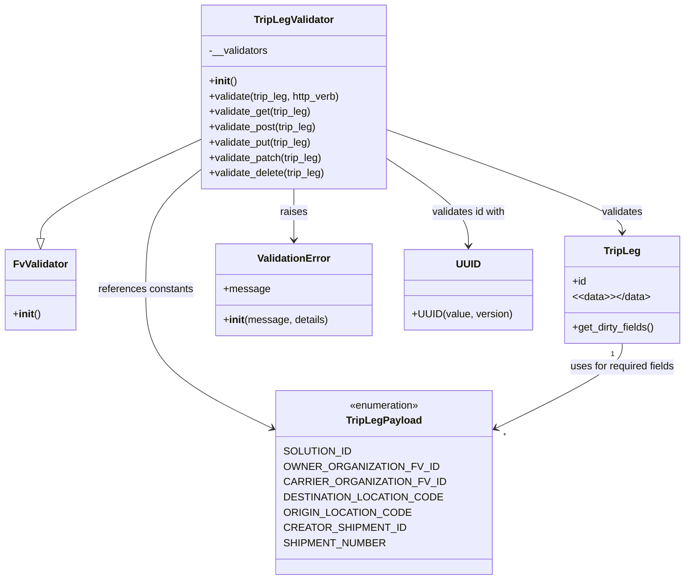

# Diagram: partview_core/partview_service/partview_service/api/validation/TripLegValidator.py

> Auto-generated by Obscura crawlers

## Mermaid

### SVG

<svg id="container" width="1063.109375" xmlns="http://www.w3.org/2000/svg" class="classDiagram" height="908" viewBox="0 0 1063.109375 908" role="graphics-document document" aria-roledescription="class"><g><defs><marker id="container_class-aggregationStart" class="marker aggregation class" refX="18" refY="7" markerWidth="190" markerHeight="240" orient="auto"><path d="M 18,7 L9,13 L1,7 L9,1 Z"></path></marker></defs><defs><marker id="container_class-aggregationEnd" class="marker aggregation class" refX="1" refY="7" markerWidth="20" markerHeight="28" orient="auto"><path d="M 18,7 L9,13 L1,7 L9,1 Z"></path></marker></defs><defs><marker id="container_class-extensionStart" class="marker extension class" refX="18" refY="7" markerWidth="190" markerHeight="240" orient="auto"><path d="M 1,7 L18,13 V 1 Z"></path></marker></defs><defs><marker id="container_class-extensionEnd" class="marker extension class" refX="1" refY="7" markerWidth="20" markerHeight="28" orient="auto"><path d="M 1,1 V 13 L18,7 Z"></path></marker></defs><defs><marker id="container_class-compositionStart" class="marker composition class" refX="18" refY="7" markerWidth="190" markerHeight="240" orient="auto"><path d="M 18,7 L9,13 L1,7 L9,1 Z"></path></marker></defs><defs><marker id="container_class-compositionEnd" class="marker composition class" refX="1" refY="7" markerWidth="20" markerHeight="28" orient="auto"><path d="M 18,7 L9,13 L1,7 L9,1 Z"></path></marker></defs><defs><marker id="container_class-dependencyStart" class="marker dependency class" refX="6" refY="7" markerWidth="190" markerHeight="240" orient="auto"><path d="M 5,7 L9,13 L1,7 L9,1 Z"></path></marker></defs><defs><marker id="container_class-dependencyEnd" class="marker dependency class" refX="13" refY="7" markerWidth="20" markerHeight="28" orient="auto"><path d="M 18,7 L9,13 L14,7 L9,1 Z"></path></marker></defs><defs><marker id="container_class-lollipopStart" class="marker lollipop class" refX="13" refY="7" markerWidth="190" markerHeight="240" orient="auto"><circle stroke="black" fill="transparent" cx="7" cy="7" r="6"></circle></marker></defs><defs><marker id="container_class-lollipopEnd" class="marker lollipop class" refX="1" refY="7" markerWidth="190" markerHeight="240" orient="auto"><circle stroke="black" fill="transparent" cx="7" cy="7" r="6"></circle></marker></defs><g class="root"><g class="clusters"></g><g class="edgePaths"><path d="M309.91,219.352L268.567,238.293C227.224,257.235,144.538,295.117,103.195,320.85C61.852,346.583,61.852,360.167,61.852,366.958L61.852,373.75" id="id_TripLegValidator_FvValidator_1" class="edge-thickness-normal edge-pattern-solid relation" style=";;;" data-edge="true" data-et="edge" data-id="id_TripLegValidator_FvValidator_1" data-points="W3sieCI6MzA5LjkxMDE1NjI1LCJ5IjoyMTkuMzUxNzUwNTk1NzI2NTd9LHsieCI6NjEuODUxNTYyNSwieSI6MzMzfSx7IngiOjYxLjg1MTU2MjUsInkiOjM5MX1d" marker-end="url(#container_class-extensionEnd)"></path><path d="M603.926,204.405L664.049,225.837C724.173,247.27,844.421,290.135,904.544,316.734C964.668,343.333,964.668,353.667,964.668,358.833L964.668,364" id="id_TripLegValidator_TripLeg_2" class="edge-thickness-normal edge-pattern-solid relation" style=";;;" data-edge="true" data-et="edge" data-id="id_TripLegValidator_TripLeg_2" data-points="W3sieCI6NjAzLjkyNTc4MTI1LCJ5IjoyMDQuNDA0NTU3NDgzOTk4MDJ9LHsieCI6OTY0LjY2Nzk2ODc1LCJ5IjozMzN9LHsieCI6OTY0LjY2Nzk2ODc1LCJ5IjozNzB9XQ==" marker-end="url(#container_class-dependencyEnd)"></path><path d="M309.91,267.182L295.91,278.152C281.909,289.121,253.908,311.061,239.907,342.197C225.906,373.333,225.906,413.667,225.906,454C225.906,494.333,225.906,534.667,261.327,572.19C296.748,609.713,367.589,644.426,403.01,661.782L438.43,679.139" id="id_TripLegValidator_TripLegPayload_3" class="edge-thickness-normal edge-pattern-solid relation" style=";;;" data-edge="true" data-et="edge" data-id="id_TripLegValidator_TripLegPayload_3" data-points="W3sieCI6MzA5LjkxMDE1NjI1LCJ5IjoyNjcuMTgyMDk2NDE2OTE2MDd9LHsieCI6MjI1LjkwNjI1LCJ5IjozMzN9LHsieCI6MjI1LjkwNjI1LCJ5Ijo0NTR9LHsieCI6MjI1LjkwNjI1LCJ5Ijo1NzV9LHsieCI6NDQzLjgxODM1OTM3NSwieSI6NjgxLjc3ODkyNjk0MTcyNTh9XQ==" marker-end="url(#container_class-dependencyEnd)"></path><path d="M456.918,296L456.918,302.167C456.918,308.333,456.918,320.667,456.918,334C456.918,347.333,456.918,361.667,456.918,368.833L456.918,376" id="id_TripLegValidator_ValidationError_4" class="edge-thickness-normal edge-pattern-solid relation" style=";;;" data-edge="true" data-et="edge" data-id="id_TripLegValidator_ValidationError_4" data-points="W3sieCI6NDU2LjkxNzk2ODc1LCJ5IjoyOTZ9LHsieCI6NDU2LjkxNzk2ODc1LCJ5IjozMzN9LHsieCI6NDU2LjkxNzk2ODc1LCJ5IjozODJ9XQ==" marker-end="url(#container_class-dependencyEnd)"></path><path d="M603.926,250.894L624.268,264.579C644.609,278.263,685.293,305.631,705.635,327.982C725.977,350.333,725.977,367.667,725.977,376.333L725.977,385" id="id_TripLegValidator_UUID_5" class="edge-thickness-normal edge-pattern-solid relation" style=";;;" data-edge="true" data-et="edge" data-id="id_TripLegValidator_UUID_5" data-points="W3sieCI6NjAzLjkyNTc4MTI1LCJ5IjoyNTAuODk0NDk2MTQ1NDE0NDJ9LHsieCI6NzI1Ljk3NjU2MjUsInkiOjMzM30seyJ4Ijo3MjUuOTc2NTYyNSwieSI6MzkxfV0=" marker-end="url(#container_class-dependencyEnd)"></path><path d="M964.668,538L964.668,544.167C964.668,550.333,964.668,562.667,929.247,586.19C893.827,609.713,822.985,644.426,787.564,661.782L752.144,679.139" id="id_TripLeg_TripLegPayload_6" class="edge-thickness-normal edge-pattern-solid relation" style=";;;" data-edge="true" data-et="edge" data-id="id_TripLeg_TripLegPayload_6" data-points="W3sieCI6OTY0LjY2Nzk2ODc1LCJ5Ijo1Mzh9LHsieCI6OTY0LjY2Nzk2ODc1LCJ5Ijo1NzV9LHsieCI6NzQ2Ljc1NTg1OTM3NSwieSI6NjgxLjc3ODkyNjk0MTcyNTh9XQ==" marker-end="url(#container_class-dependencyEnd)"></path></g><g class="edgeLabels"><g class="edgeLabel"><g class="label" data-id="id_TripLegValidator_FvValidator_1" transform="translate(0, 0)"><foreignObject width="0" height="0">

</foreignObject></g></g><g class="edgeLabel" transform="translate(964.66796875, 333)"><g class="label" data-id="id_TripLegValidator_TripLeg_2" transform="translate(-32.6875, -12)"><foreignObject width="65.375" height="24">

validates

</foreignObject></g></g><g class="edgeLabel" transform="translate(225.90625, 454)"><g class="label" data-id="id_TripLegValidator_TripLegPayload_3" transform="translate(-75.203125, -12)"><foreignObject width="150.40625" height="24">

references constants

</foreignObject></g></g><g class="edgeLabel" transform="translate(456.91796875, 333)"><g class="label" data-id="id_TripLegValidator_ValidationError_4" transform="translate(-21.25, -12)"><foreignObject width="42.5" height="24">

raises

</foreignObject></g></g><g class="edgeLabel" transform="translate(725.9765625, 333)"><g class="label" data-id="id_TripLegValidator_UUID_5" transform="translate(-59.53125, -12)"><foreignObject width="119.0625" height="24">

validates id with

</foreignObject></g></g><g class="edgeLabel" transform="translate(964.66796875, 575)"><g class="label" data-id="id_TripLeg_TripLegPayload_6" transform="translate(-83.890625, -12)"><foreignObject width="167.78125" height="24">

uses for required fields

</foreignObject></g></g><g class="edgeTerminals" transform="translate(949.667969375, 555.5000005357143)"><g class="inner" transform="translate(0, 0)"><foreignObject style="width: 9px; height: 12px;">
1
</foreignObject></g></g><g class="edgeTerminals" transform="translate(764.0709626362737, 682.5483493703047)"><g class="inner" transform="translate(0, 0)"></g><foreignObject style="width: 9px; height: 12px;">
*
</foreignObject></g></g><g class="nodes"><g class="node default" id="classId-FvValidator-0" transform="translate(61.8515625, 454)"><g class="basic label-container"><path d="M-53.8515625 -63 L53.8515625 -63 L53.8515625 63 L-53.8515625 63" stroke="none" stroke-width="0" fill="#ECECFF" style=""></path><path d="M-53.8515625 -63 C-23.002835515429414 -63, 7.845891469141172 -63, 53.8515625 -63 M-53.8515625 -63 C-28.473652578819074 -63, -3.095742657638148 -63, 53.8515625 -63 M53.8515625 -63 C53.8515625 -16.850253261312318, 53.8515625 29.299493477375364, 53.8515625 63 M53.8515625 -63 C53.8515625 -28.128230998844444, 53.8515625 6.743538002311112, 53.8515625 63 M53.8515625 63 C13.013609094613535 63, -27.82434431077293 63, -53.8515625 63 M53.8515625 63 C20.621085502254672 63, -12.609391495490655 63, -53.8515625 63 M-53.8515625 63 C-53.8515625 18.204685060901816, -53.8515625 -26.590629878196367, -53.8515625 -63 M-53.8515625 63 C-53.8515625 16.3362989695975, -53.8515625 -30.327402060805, -53.8515625 -63" stroke="#9370DB" stroke-width="1.3" fill="none" stroke-dasharray="0 0" style=""></path></g><g class="annotation-group text" transform="translate(0, -39)"></g><g class="label-group text" transform="translate(-40.90625, -39)"><g class="label" style="font-weight: bolder" transform="translate(0,-12)"><foreignObject width="81.8125" height="24">

FvValidator

</foreignObject></g></g><g class="members-group text" transform="translate(-41.8515625, 9)"></g><g class="methods-group text" transform="translate(-41.8515625, 39)"><g class="label" style="" transform="translate(0,-12)"><foreignObject width="42.796875" height="24">

+<strong>init</strong>()

</foreignObject></g></g><g class="divider" style=""><path d="M-53.8515625 -15 C-32.23775026128361 -15, -10.623938022567224 -15, 53.8515625 -15 M-53.8515625 -15 C-23.40488331489426 -15, 7.04179587021148 -15, 53.8515625 -15" stroke="#9370DB" stroke-width="1.3" fill="none" stroke-dasharray="0 0" style=""></path></g><g class="divider" style=""><path d="M-53.8515625 9 C-30.69907395978525 9, -7.546585419570498 9, 53.8515625 9 M-53.8515625 9 C-29.442147315140115 9, -5.03273213028023 9, 53.8515625 9" stroke="#9370DB" stroke-width="1.3" fill="none" stroke-dasharray="0 0" style=""></path></g></g><g class="node default" id="classId-TripLegValidator-1" transform="translate(456.91796875, 152)"><g class="basic label-container"><path d="M-147.0078125 -144 L147.0078125 -144 L147.0078125 144 L-147.0078125 144" stroke="none" stroke-width="0" fill="#ECECFF" style=""></path><path d="M-147.0078125 -144 C-45.49272544149619 -144, 56.02236161700762 -144, 147.0078125 -144 M-147.0078125 -144 C-83.4384157865438 -144, -19.8690190730876 -144, 147.0078125 -144 M147.0078125 -144 C147.0078125 -58.22091444027717, 147.0078125 27.55817111944566, 147.0078125 144 M147.0078125 -144 C147.0078125 -71.52911522426687, 147.0078125 0.9417695514662512, 147.0078125 144 M147.0078125 144 C78.36399346819894 144, 9.720174436397883 144, -147.0078125 144 M147.0078125 144 C68.94678142963122 144, -9.114249640737569 144, -147.0078125 144 M-147.0078125 144 C-147.0078125 40.62071936424579, -147.0078125 -62.75856127150843, -147.0078125 -144 M-147.0078125 144 C-147.0078125 84.6817392611912, -147.0078125 25.363478522382394, -147.0078125 -144" stroke="#9370DB" stroke-width="1.3" fill="none" stroke-dasharray="0 0" style=""></path></g><g class="annotation-group text" transform="translate(0, -120)"></g><g class="label-group text" transform="translate(-60.234375, -120)"><g class="label" style="font-weight: bolder" transform="translate(0,-12)"><foreignObject width="120.46875" height="24">

TripLegValidator

</foreignObject></g></g><g class="members-group text" transform="translate(-135.0078125, -72)"><g class="label" style="" transform="translate(0,-12)"><foreignObject width="93.09375" height="24">

-__validators

</foreignObject></g></g><g class="methods-group text" transform="translate(-135.0078125, -24)"><g class="label" style="" transform="translate(0,-12)"><foreignObject width="42.796875" height="24">

+<strong>init</strong>()

</foreignObject></g><g class="label" style="" transform="translate(0,12)"><foreignObject width="209.78125" height="24">

+validate(trip_leg, http_verb)

</foreignObject></g><g class="label" style="" transform="translate(0,36)"><foreignObject width="162.25" height="24">

+validate_get(trip_leg)

</foreignObject></g><g class="label" style="" transform="translate(0,60)"><foreignObject width="171.640625" height="24">

+validate_post(trip_leg)

</foreignObject></g><g class="label" style="" transform="translate(0,84)"><foreignObject width="164.140625" height="24">

+validate_put(trip_leg)

</foreignObject></g><g class="label" style="" transform="translate(0,108)"><foreignObject width="180.15625" height="24">

+validate_patch(trip_leg)

</foreignObject></g><g class="label" style="" transform="translate(0,132)"><foreignObject width="185.09375" height="24">

+validate_delete(trip_leg)

</foreignObject></g></g><g class="divider" style=""><path d="M-147.0078125 -96 C-81.52949503326538 -96, -16.051177566530754 -96, 147.0078125 -96 M-147.0078125 -96 C-43.2558023524892 -96, 60.496207795021604 -96, 147.0078125 -96" stroke="#9370DB" stroke-width="1.3" fill="none" stroke-dasharray="0 0" style=""></path></g><g class="divider" style=""><path d="M-147.0078125 -48 C-64.24916582000513 -48, 18.509480859989736 -48, 147.0078125 -48 M-147.0078125 -48 C-30.109279530135453 -48, 86.7892534397291 -48, 147.0078125 -48" stroke="#9370DB" stroke-width="1.3" fill="none" stroke-dasharray="0 0" style=""></path></g></g><g class="node default" id="classId-TripLeg-2" transform="translate(964.66796875, 454)"><g class="basic label-container"><path d="M-90.44140625 -84 L90.44140625 -84 L90.44140625 84 L-90.44140625 84" stroke="none" stroke-width="0" fill="#ECECFF" style=""></path><path d="M-90.44140625 -84 C-27.04032236407884 -84, 36.36076152184232 -84, 90.44140625 -84 M-90.44140625 -84 C-41.77926775033987 -84, 6.882870749320261 -84, 90.44140625 -84 M90.44140625 -84 C90.44140625 -39.13881175098745, 90.44140625 5.722376498025099, 90.44140625 84 M90.44140625 -84 C90.44140625 -21.847875488638827, 90.44140625 40.304249022722345, 90.44140625 84 M90.44140625 84 C31.360912154168183 84, -27.719581941663634 84, -90.44140625 84 M90.44140625 84 C24.67828020067391 84, -41.08484584865218 84, -90.44140625 84 M-90.44140625 84 C-90.44140625 20.53641402343439, -90.44140625 -42.92717195313122, -90.44140625 -84 M-90.44140625 84 C-90.44140625 29.372498288911586, -90.44140625 -25.255003422176827, -90.44140625 -84" stroke="#9370DB" stroke-width="1.3" fill="none" stroke-dasharray="0 0" style=""></path></g><g class="annotation-group text" transform="translate(0, -60)"></g><g class="label-group text" transform="translate(-27.0546875, -60)"><g class="label" style="font-weight: bolder" transform="translate(0,-12)"><foreignObject width="54.109375" height="24">

TripLeg

</foreignObject></g></g><g class="members-group text" transform="translate(-78.44140625, -12)"><g class="label" style="" transform="translate(0,-12)"><foreignObject width="22.078125" height="24">

+id

</foreignObject></g><g class="label" style="" transform="translate(0,12)"><foreignObject width="120.8125" height="24">

&lt;&lt;data&gt;&gt;&lt;/data&gt;

</foreignObject></g></g><g class="methods-group text" transform="translate(-78.44140625, 60)"><g class="label" style="" transform="translate(0,-12)"><foreignObject width="129.828125" height="24">

+get_dirty_fields()

</foreignObject></g></g><g class="divider" style=""><path d="M-90.44140625 -36 C-36.83975146157605 -36, 16.7619033268479 -36, 90.44140625 -36 M-90.44140625 -36 C-45.92950422617139 -36, -1.4176022023427777 -36, 90.44140625 -36" stroke="#9370DB" stroke-width="1.3" fill="none" stroke-dasharray="0 0" style=""></path></g><g class="divider" style=""><path d="M-90.44140625 36 C-43.803448237296365 36, 2.8345097754072697 36, 90.44140625 36 M-90.44140625 36 C-42.34717117839612 36, 5.747063893207766 36, 90.44140625 36" stroke="#9370DB" stroke-width="1.3" fill="none" stroke-dasharray="0 0" style=""></path></g></g><g class="node default" id="classId-TripLegPayload-3" transform="translate(595.287109375, 756)"><g class="basic label-container"><path d="M-151.46875 -144 L151.46875 -144 L151.46875 144 L-151.46875 144" stroke="none" stroke-width="0" fill="#ECECFF" style=""></path><path d="M-151.46875 -144 C-31.13624755943701 -144, 89.19625488112598 -144, 151.46875 -144 M-151.46875 -144 C-68.46190708528546 -144, 14.544935829429079 -144, 151.46875 -144 M151.46875 -144 C151.46875 -79.75510214350098, 151.46875 -15.510204287001955, 151.46875 144 M151.46875 -144 C151.46875 -86.33395462858482, 151.46875 -28.667909257169654, 151.46875 144 M151.46875 144 C64.3831925424249 144, -22.702364915150213 144, -151.46875 144 M151.46875 144 C65.329277808509 144, -20.81019438298199 144, -151.46875 144 M-151.46875 144 C-151.46875 81.48804518703751, -151.46875 18.976090374075028, -151.46875 -144 M-151.46875 144 C-151.46875 77.78411737308414, -151.46875 11.568234746168287, -151.46875 -144" stroke="#9370DB" stroke-width="1.3" fill="none" stroke-dasharray="0 0" style=""></path></g><g class="annotation-group text" transform="translate(-55.5546875, -120)"><g class="label" style="" transform="translate(0,-12)"><foreignObject width="111.109375" height="24">

«enumeration»

</foreignObject></g></g><g class="label-group text" transform="translate(-55.953125, -96)"><g class="label" style="font-weight: bolder" transform="translate(0,-12)"><foreignObject width="111.90625" height="24">

TripLegPayload

</foreignObject></g></g><g class="members-group text" transform="translate(-139.46875, -48)"><g class="label" style="" transform="translate(0,-12)"><foreignObject width="96.296875" height="24">

SOLUTION_ID

</foreignObject></g><g class="label" style="" transform="translate(0,12)"><foreignObject width="216" height="24">

OWNER_ORGANIZATION_FV_ID

</foreignObject></g><g class="label" style="" transform="translate(0,36)"><foreignObject width="222.984375" height="24">

CARRIER_ORGANIZATION_FV_ID

</foreignObject></g><g class="label" style="" transform="translate(0,60)"><foreignObject width="219.578125" height="24">

DESTINATION_LOCATION_CODE

</foreignObject></g><g class="label" style="" transform="translate(0,84)"><foreignObject width="176.4375" height="24">

ORIGIN_LOCATION_CODE

</foreignObject></g><g class="label" style="" transform="translate(0,108)"><foreignObject width="167.921875" height="24">

CREATOR_SHIPMENT_ID

</foreignObject></g><g class="label" style="" transform="translate(0,132)"><foreignObject width="142.8125" height="24">

SHIPMENT_NUMBER

</foreignObject></g></g><g class="methods-group text" transform="translate(-139.46875, 144)"></g><g class="divider" style=""><path d="M-151.46875 -72 C-76.69954562794894 -72, -1.930341255897872 -72, 151.46875 -72 M-151.46875 -72 C-33.21661793996222 -72, 85.03551412007556 -72, 151.46875 -72" stroke="#9370DB" stroke-width="1.3" fill="none" stroke-dasharray="0 0" style=""></path></g><g class="divider" style=""><path d="M-151.46875 120 C-73.05308573052989 120, 5.362578538940227 120, 151.46875 120 M-151.46875 120 C-77.75025837876429 120, -4.0317667575285725 120, 151.46875 120" stroke="#9370DB" stroke-width="1.3" fill="none" stroke-dasharray="0 0" style=""></path></g></g><g class="node default" id="classId-ValidationError-4" transform="translate(456.91796875, 454)"><g class="basic label-container"><path d="M-120.80859375 -72 L120.80859375 -72 L120.80859375 72 L-120.80859375 72" stroke="none" stroke-width="0" fill="#ECECFF" style=""></path><path d="M-120.80859375 -72 C-66.88194077000978 -72, -12.95528779001954 -72, 120.80859375 -72 M-120.80859375 -72 C-38.39682985793955 -72, 44.0149340341209 -72, 120.80859375 -72 M120.80859375 -72 C120.80859375 -20.96779653651673, 120.80859375 30.06440692696654, 120.80859375 72 M120.80859375 -72 C120.80859375 -34.758264666529094, 120.80859375 2.4834706669418125, 120.80859375 72 M120.80859375 72 C71.98976563103602 72, 23.17093751207203 72, -120.80859375 72 M120.80859375 72 C52.74961236420313 72, -15.309369021593739 72, -120.80859375 72 M-120.80859375 72 C-120.80859375 42.60758881804557, -120.80859375 13.215177636091141, -120.80859375 -72 M-120.80859375 72 C-120.80859375 34.205356064219984, -120.80859375 -3.589287871560032, -120.80859375 -72" stroke="#9370DB" stroke-width="1.3" fill="none" stroke-dasharray="0 0" style=""></path></g><g class="annotation-group text" transform="translate(0, -48)"></g><g class="label-group text" transform="translate(-55.1796875, -48)"><g class="label" style="font-weight: bolder" transform="translate(0,-12)"><foreignObject width="110.359375" height="24">

ValidationError

</foreignObject></g></g><g class="members-group text" transform="translate(-108.80859375, 0)"><g class="label" style="" transform="translate(0,-12)"><foreignObject width="70.375" height="24">

+message

</foreignObject></g></g><g class="methods-group text" transform="translate(-108.80859375, 48)"><g class="label" style="" transform="translate(0,-12)"><foreignObject width="162.4375" height="24">

+<strong>init</strong>(message, details)

</foreignObject></g></g><g class="divider" style=""><path d="M-120.80859375 -24 C-59.95361114320283 -24, 0.9013714635943444 -24, 120.80859375 -24 M-120.80859375 -24 C-68.55429045193668 -24, -16.299987153873346 -24, 120.80859375 -24" stroke="#9370DB" stroke-width="1.3" fill="none" stroke-dasharray="0 0" style=""></path></g><g class="divider" style=""><path d="M-120.80859375 24 C-40.319515730931684 24, 40.16956228813663 24, 120.80859375 24 M-120.80859375 24 C-41.919168568144755 24, 36.97025661371049 24, 120.80859375 24" stroke="#9370DB" stroke-width="1.3" fill="none" stroke-dasharray="0 0" style=""></path></g></g><g class="node default" id="classId-UUID-5" transform="translate(725.9765625, 454)"><g class="basic label-container"><path d="M-98.25 -63 L98.25 -63 L98.25 63 L-98.25 63" stroke="none" stroke-width="0" fill="#ECECFF" style=""></path><path d="M-98.25 -63 C-39.674799232660874 -63, 18.900401534678252 -63, 98.25 -63 M-98.25 -63 C-22.497223907276577 -63, 53.255552185446845 -63, 98.25 -63 M98.25 -63 C98.25 -25.594586278525924, 98.25 11.810827442948153, 98.25 63 M98.25 -63 C98.25 -13.487238762220926, 98.25 36.02552247555815, 98.25 63 M98.25 63 C39.065734618307744 63, -20.118530763384513 63, -98.25 63 M98.25 63 C54.356847687368194 63, 10.463695374736389 63, -98.25 63 M-98.25 63 C-98.25 23.460079937497333, -98.25 -16.079840125005333, -98.25 -63 M-98.25 63 C-98.25 33.63294650234206, -98.25 4.265893004684116, -98.25 -63" stroke="#9370DB" stroke-width="1.3" fill="none" stroke-dasharray="0 0" style=""></path></g><g class="annotation-group text" transform="translate(0, -39)"></g><g class="label-group text" transform="translate(-17.96875, -39)"><g class="label" style="font-weight: bolder" transform="translate(0,-12)"><foreignObject width="35.9375" height="24">

UUID

</foreignObject></g></g><g class="members-group text" transform="translate(-86.25, 9)"></g><g class="methods-group text" transform="translate(-86.25, 39)"><g class="label" style="" transform="translate(0,-12)"><foreignObject width="154.53125" height="24">

+UUID(value, version)

</foreignObject></g></g><g class="divider" style=""><path d="M-98.25 -15 C-49.55716872689159 -15, -0.8643374537831789 -15, 98.25 -15 M-98.25 -15 C-54.227917184402955 -15, -10.20583436880591 -15, 98.25 -15" stroke="#9370DB" stroke-width="1.3" fill="none" stroke-dasharray="0 0" style=""></path></g><g class="divider" style=""><path d="M-98.25 9 C-32.66992731494854 9, 32.910145370102924 9, 98.25 9 M-98.25 9 C-29.214101409333196 9, 39.82179718133361 9, 98.25 9" stroke="#9370DB" stroke-width="1.3" fill="none" stroke-dasharray="0 0" style=""></path></g></g></g></g></g></svg>
