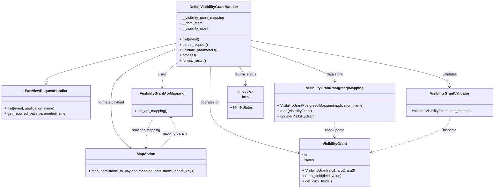

# Diagram: partview_core/partview_service/partview_service/api/visibility_grant/handler/DeleteVisibilityGrantHandler.py

> Auto-generated by Obscura crawlers

## Mermaid

### SVG

<svg id="container" width="2216.49609375" xmlns="http://www.w3.org/2000/svg" class="classDiagram" height="842" viewBox="0 0 2216.49609375 842" role="graphics-document document" aria-roledescription="class"><g><defs><marker id="container_class-aggregationStart" class="marker aggregation class" refX="18" refY="7" markerWidth="190" markerHeight="240" orient="auto"><path d="M 18,7 L9,13 L1,7 L9,1 Z"></path></marker></defs><defs><marker id="container_class-aggregationEnd" class="marker aggregation class" refX="1" refY="7" markerWidth="20" markerHeight="28" orient="auto"><path d="M 18,7 L9,13 L1,7 L9,1 Z"></path></marker></defs><defs><marker id="container_class-extensionStart" class="marker extension class" refX="18" refY="7" markerWidth="190" markerHeight="240" orient="auto"><path d="M 1,7 L18,13 V 1 Z"></path></marker></defs><defs><marker id="container_class-extensionEnd" class="marker extension class" refX="1" refY="7" markerWidth="20" markerHeight="28" orient="auto"><path d="M 1,1 V 13 L18,7 Z"></path></marker></defs><defs><marker id="container_class-compositionStart" class="marker composition class" refX="18" refY="7" markerWidth="190" markerHeight="240" orient="auto"><path d="M 18,7 L9,13 L1,7 L9,1 Z"></path></marker></defs><defs><marker id="container_class-compositionEnd" class="marker composition class" refX="1" refY="7" markerWidth="20" markerHeight="28" orient="auto"><path d="M 18,7 L9,13 L1,7 L9,1 Z"></path></marker></defs><defs><marker id="container_class-dependencyStart" class="marker dependency class" refX="6" refY="7" markerWidth="190" markerHeight="240" orient="auto"><path d="M 5,7 L9,13 L1,7 L9,1 Z"></path></marker></defs><defs><marker id="container_class-dependencyEnd" class="marker dependency class" refX="13" refY="7" markerWidth="20" markerHeight="28" orient="auto"><path d="M 18,7 L9,13 L14,7 L9,1 Z"></path></marker></defs><defs><marker id="container_class-lollipopStart" class="marker lollipop class" refX="13" refY="7" markerWidth="190" markerHeight="240" orient="auto"><circle stroke="black" fill="transparent" cx="7" cy="7" r="6"></circle></marker></defs><defs><marker id="container_class-lollipopEnd" class="marker lollipop class" refX="1" refY="7" markerWidth="190" markerHeight="240" orient="auto"><circle stroke="black" fill="transparent" cx="7" cy="7" r="6"></circle></marker></defs><g class="root"><g class="clusters"></g><g class="edgePaths"><path d="M787.922,192.402L690.953,215.835C593.984,239.268,400.047,286.134,303.078,314.859C206.109,343.583,206.109,354.167,206.109,359.458L206.109,364.75" id="id_DeleteVisibilityGrantHandler_PartViewRequestHandler_1" class="edge-thickness-normal edge-pattern-solid relation" style=";;;" data-edge="true" data-et="edge" data-id="id_DeleteVisibilityGrantHandler_PartViewRequestHandler_1" data-points="W3sieCI6Nzg3LjkyMTg3NSwieSI6MTkyLjQwMTc4NTcxNDI4NTcyfSx7IngiOjIwNi4xMDkzNzUsInkiOjMzM30seyJ4IjoyMDYuMTA5Mzc1LCJ5IjozODJ9XQ==" marker-end="url(#container_class-extensionEnd)"></path><path d="M787.922,284.013L777.582,292.178C767.242,300.342,746.563,316.671,736.223,334.002C725.883,351.333,725.883,369.667,725.883,378.833L725.883,388" id="id_DeleteVisibilityGrantHandler_VisibilityGrantApiMapping_2" class="edge-thickness-normal edge-pattern-solid relation" style=";;;" data-edge="true" data-et="edge" data-id="id_DeleteVisibilityGrantHandler_VisibilityGrantApiMapping_2" data-points="W3sieCI6Nzg3LjkyMTg3NSwieSI6Mjg0LjAxMzIyMzgxNjUwMjU1fSx7IngiOjcyNS44ODI4MTI1LCJ5IjozMzN9LHsieCI6NzI1Ljg4MjgxMjUsInkiOjM5NH1d" marker-end="url(#container_class-dependencyEnd)"></path><path d="M1122.297,208.132L1184.283,228.943C1246.27,249.755,1370.242,291.377,1432.229,317.355C1494.215,343.333,1494.215,353.667,1494.215,358.833L1494.215,364" id="id_DeleteVisibilityGrantHandler_VisibilityGrantPostgresqlMapping_3" class="edge-thickness-normal edge-pattern-solid relation" style=";;;" data-edge="true" data-et="edge" data-id="id_DeleteVisibilityGrantHandler_VisibilityGrantPostgresqlMapping_3" data-points="W3sieCI6MTEyMi4yOTY4NzUsInkiOjIwOC4xMzE3NTc2MTM1MjM1OH0seyJ4IjoxNDk0LjIxNDg0Mzc1LCJ5IjozMzN9LHsieCI6MTQ5NC4yMTQ4NDM3NSwieSI6MzcwfV0=" marker-end="url(#container_class-dependencyEnd)"></path><path d="M944.055,296L943.582,302.167C943.108,308.333,942.162,320.667,941.688,347.5C941.215,374.333,941.215,415.667,941.215,457C941.215,498.333,941.215,539.667,1006.732,577.512C1072.249,615.358,1203.283,649.716,1268.8,666.895L1334.317,684.074" id="id_DeleteVisibilityGrantHandler_VisibilityGrant_4" class="edge-thickness-normal edge-pattern-solid relation" style=";;;" data-edge="true" data-et="edge" data-id="id_DeleteVisibilityGrantHandler_VisibilityGrant_4" data-points="W3sieCI6OTQ0LjA1NTE2MjI5MjgxNzcsInkiOjI5Nn0seyJ4Ijo5NDEuMjE0ODQzNzUsInkiOjMzM30seyJ4Ijo5NDEuMjE0ODQzNzUsInkiOjQ1N30seyJ4Ijo5NDEuMjE0ODQzNzUsInkiOjU4MX0seyJ4IjoxMzQwLjEyMTA5Mzc1LCJ5Ijo2ODUuNTk1NjcxMzM4MTU1NX1d" marker-end="url(#container_class-dependencyEnd)"></path><path d="M1122.297,180.652L1270.459,206.043C1418.621,231.435,1714.945,282.217,1863.107,316.775C2011.27,351.333,2011.27,369.667,2011.27,378.833L2011.27,388" id="id_DeleteVisibilityGrantHandler_VisibilityGrantValidator_5" class="edge-thickness-normal edge-pattern-solid relation" style=";;;" data-edge="true" data-et="edge" data-id="id_DeleteVisibilityGrantHandler_VisibilityGrantValidator_5" data-points="W3sieCI6MTEyMi4yOTY4NzUsInkiOjE4MC42NTE4NDUzODYyNTY5OH0seyJ4IjoyMDExLjI2OTUzMTI1LCJ5IjozMzN9LHsieCI6MjAxMS4yNjk1MzEyNSwieSI6Mzk0fV0=" marker-end="url(#container_class-dependencyEnd)"></path><path d="M787.922,218.26L739.669,237.383C691.417,256.506,594.911,294.753,546.659,334.543C498.406,374.333,498.406,415.667,498.406,457C498.406,498.333,498.406,539.667,512.408,573.32C526.41,606.973,554.413,632.947,568.415,645.933L582.417,658.92" id="id_DeleteVisibilityGrantHandler_MapAction_6" class="edge-thickness-normal edge-pattern-solid relation" style=";;;" data-edge="true" data-et="edge" data-id="id_DeleteVisibilityGrantHandler_MapAction_6" data-points="W3sieCI6Nzg3LjkyMTg3NSwieSI6MjE4LjI1OTUzNjc2MTQzNTU2fSx7IngiOjQ5OC40MDYyNSwieSI6MzMzfSx7IngiOjQ5OC40MDYyNSwieSI6NDU3fSx7IngiOjQ5OC40MDYyNSwieSI6NTgxfSx7IngiOjU4Ni44MTU4MTM1Nzc1ODYzLCJ5Ijo2NjN9XQ==" marker-end="url(#container_class-dependencyEnd)"></path><path d="M1067.951,296L1072.784,302.167C1077.616,308.333,1087.281,320.667,1092.113,334.5C1096.945,348.333,1096.945,363.667,1096.945,371.333L1096.945,379" id="id_DeleteVisibilityGrantHandler_http_7" class="edge-thickness-normal edge-pattern-solid relation" style=";;;" data-edge="true" data-et="edge" data-id="id_DeleteVisibilityGrantHandler_http_7" data-points="W3sieCI6MTA2Ny45NTEyMjU4Mjg3MjkzLCJ5IjoyOTZ9LHsieCI6MTA5Ni45NDUzMTI1LCJ5IjozMzN9LHsieCI6MTA5Ni45NDUzMTI1LCJ5IjozODV9XQ==" marker-end="url(#container_class-dependencyEnd)"></path><path d="M1494.215,544L1494.215,550.167C1494.215,556.333,1494.215,568.667,1494.215,580C1494.215,591.333,1494.215,601.667,1494.215,606.833L1494.215,612" id="id_VisibilityGrantPostgresqlMapping_VisibilityGrant_8" class="edge-thickness-normal edge-pattern-dashed relation" style=";;;" data-edge="true" data-et="edge" data-id="id_VisibilityGrantPostgresqlMapping_VisibilityGrant_8" data-points="W3sieCI6MTQ5NC4yMTQ4NDM3NSwieSI6NTQ0fSx7IngiOjE0OTQuMjE0ODQzNzUsInkiOjU4MX0seyJ4IjoxNDk0LjIxNDg0Mzc1LCJ5Ijo2MTh9XQ==" marker-end="url(#container_class-dependencyEnd)"></path><path d="M689.738,520L683.905,530.167C678.072,540.333,666.406,560.667,660.573,583.5C654.74,606.333,654.74,631.667,654.74,644.333L654.74,657" id="id_VisibilityGrantApiMapping_MapAction_9" class="edge-thickness-normal edge-pattern-dashed relation" style=";;;" data-edge="true" data-et="edge" data-id="id_VisibilityGrantApiMapping_MapAction_9" data-points="W3sieCI6Njg5LjczNzc5Mjk2ODc1LCJ5Ijo1MjB9LHsieCI6NjU0Ljc0MDIzNDM3NSwieSI6NTgxfSx7IngiOjY1NC43NDAyMzQzNzUsInkiOjY2M31d" marker-end="url(#container_class-dependencyEnd)"></path><path d="M2011.27,520L2011.27,530.167C2011.27,540.333,2011.27,560.667,1951.739,587.528C1892.208,614.389,1773.147,647.778,1713.616,664.472L1654.086,681.167" id="id_VisibilityGrantValidator_VisibilityGrant_10" class="edge-thickness-normal edge-pattern-dashed relation" style=";;;" data-edge="true" data-et="edge" data-id="id_VisibilityGrantValidator_VisibilityGrant_10" data-points="W3sieCI6MjAxMS4yNjk1MzEyNSwieSI6NTIwfSx7IngiOjIwMTEuMjY5NTMxMjUsInkiOjU4MX0seyJ4IjoxNjQ4LjMwODU5Mzc1LCJ5Ijo2ODIuNzg2Nzg4MTQ4MDEzOH1d" marker-end="url(#container_class-dependencyEnd)"></path><path d="M716.535,663L729.94,649.333C743.346,635.667,770.156,608.333,778.231,585.368C786.305,562.402,775.644,543.804,770.313,534.504L764.982,525.205" id="id_MapAction_VisibilityGrantApiMapping_11" class="edge-thickness-normal edge-pattern-dashed relation" style=";;;" data-edge="true" data-et="edge" data-id="id_MapAction_VisibilityGrantApiMapping_11" data-points="W3sieCI6NzE2LjUzNTIyMzU5OTEzNzksInkiOjY2M30seyJ4Ijo3OTYuOTY2Nzk2ODc1LCJ5Ijo1ODF9LHsieCI6NzYxLjk5ODA2MjYyNjAwOCwieSI6NTIwfV0=" marker-end="url(#container_class-dependencyEnd)"></path></g><g class="edgeLabels"><g class="edgeLabel"><g class="label" data-id="id_DeleteVisibilityGrantHandler_PartViewRequestHandler_1" transform="translate(0, 0)"><foreignObject width="0" height="0">

</foreignObject></g></g><g class="edgeLabel" transform="translate(725.8828125, 333)"><g class="label" data-id="id_DeleteVisibilityGrantHandler_VisibilityGrantApiMapping_2" transform="translate(-16.4921875, -12)"><foreignObject width="32.984375" height="24">

uses

</foreignObject></g></g><g class="edgeLabel" transform="translate(1494.21484375, 333)"><g class="label" data-id="id_DeleteVisibilityGrantHandler_VisibilityGrantPostgresqlMapping_3" transform="translate(-36.828125, -12)"><foreignObject width="73.65625" height="24">

data store

</foreignObject></g></g><g class="edgeLabel" transform="translate(941.21484375, 457)"><g class="label" data-id="id_DeleteVisibilityGrantHandler_VisibilityGrant_4" transform="translate(-43.2890625, -12)"><foreignObject width="86.578125" height="24">

operates on

</foreignObject></g></g><g class="edgeLabel" transform="translate(2011.26953125, 333)"><g class="label" data-id="id_DeleteVisibilityGrantHandler_VisibilityGrantValidator_5" transform="translate(-32.6875, -12)"><foreignObject width="65.375" height="24">

validates

</foreignObject></g></g><g class="edgeLabel" transform="translate(498.40625, 457)"><g class="label" data-id="id_DeleteVisibilityGrantHandler_MapAction_6" transform="translate(-59.1875, -12)"><foreignObject width="118.375" height="24">

formats payload

</foreignObject></g></g><g class="edgeLabel" transform="translate(1096.9453125, 333)"><g class="label" data-id="id_DeleteVisibilityGrantHandler_http_7" transform="translate(-50.5859375, -12)"><foreignObject width="101.171875" height="24">

returns status

</foreignObject></g></g><g class="edgeLabel" transform="translate(1494.21484375, 581)"><g class="label" data-id="id_VisibilityGrantPostgresqlMapping_VisibilityGrant_8" transform="translate(-45.859375, -12)"><foreignObject width="91.71875" height="24">

read/update

</foreignObject></g></g><g class="edgeLabel" transform="translate(654.740234375, 581)"><g class="label" data-id="id_VisibilityGrantApiMapping_MapAction_9" transform="translate(-65.25, -12)"><foreignObject width="130.5" height="24">

provides mapping

</foreignObject></g></g><g class="edgeLabel" transform="translate(2011.26953125, 581)"><g class="label" data-id="id_VisibilityGrantValidator_VisibilityGrant_10" transform="translate(-30.2421875, -12)"><foreignObject width="60.484375" height="24">

inspects

</foreignObject></g></g><g class="edgeLabel" transform="translate(781.36896, 596.902)"><g class="label" data-id="id_MapAction_VisibilityGrantApiMapping_11" transform="translate(-56.9765625, -12)"><foreignObject width="113.953125" height="24">

mapping param

</foreignObject></g></g></g><g class="nodes"><g class="node default" id="classId-DeleteVisibilityGrantHandler-0" transform="translate(955.109375, 152)"><g class="basic label-container"><path d="M-167.1875 -144 L167.1875 -144 L167.1875 144 L-167.1875 144" stroke="none" stroke-width="0" fill="#ECECFF" style=""></path><path d="M-167.1875 -144 C-38.36351715878263 -144, 90.46046568243474 -144, 167.1875 -144 M-167.1875 -144 C-90.40036323770673 -144, -13.613226475413455 -144, 167.1875 -144 M167.1875 -144 C167.1875 -51.45871129868864, 167.1875 41.08257740262272, 167.1875 144 M167.1875 -144 C167.1875 -84.23413417709982, 167.1875 -24.468268354199637, 167.1875 144 M167.1875 144 C63.91615710841576 144, -39.35518578316848 144, -167.1875 144 M167.1875 144 C80.09792129376113 144, -6.9916574124777355 144, -167.1875 144 M-167.1875 144 C-167.1875 62.10657386819874, -167.1875 -19.786852263602526, -167.1875 -144 M-167.1875 144 C-167.1875 72.7327181339115, -167.1875 1.4654362678230086, -167.1875 -144" stroke="#9370DB" stroke-width="1.3" fill="none" stroke-dasharray="0 0" style=""></path></g><g class="annotation-group text" transform="translate(0, -120)"></g><g class="label-group text" transform="translate(-104.796875, -120)"><g class="label" style="font-weight: bolder" transform="translate(0,-12)"><foreignObject width="209.59375" height="24">

DeleteVisibilityGrantHandler

</foreignObject></g></g><g class="members-group text" transform="translate(-155.1875, -72)"><g class="label" style="" transform="translate(0,-12)"><foreignObject width="205.578125" height="24">

- __visibility_grant_mapping

</foreignObject></g><g class="label" style="" transform="translate(0,12)"><foreignObject width="104.578125" height="24">

- __data_store

</foreignObject></g><g class="label" style="" transform="translate(0,36)"><foreignObject width="133.625" height="24">

- __visibility_grant

</foreignObject></g></g><g class="methods-group text" transform="translate(-155.1875, 24)"><g class="label" style="" transform="translate(0,-12)"><foreignObject width="87.390625" height="24">

+ <strong>init</strong>(event)

</foreignObject></g><g class="label" style="" transform="translate(0,12)"><foreignObject width="126.046875" height="24">

+ parse_request()

</foreignObject></g><g class="label" style="" transform="translate(0,36)"><foreignObject width="170.953125" height="24">

+ validate_parameters()

</foreignObject></g><g class="label" style="" transform="translate(0,60)"><foreignObject width="77.96875" height="24">

+ process()

</foreignObject></g><g class="label" style="" transform="translate(0,84)"><foreignObject width="121.5" height="24">

+ format_result()

</foreignObject></g></g><g class="divider" style=""><path d="M-167.1875 -96 C-97.58322334559976 -96, -27.978946691199525 -96, 167.1875 -96 M-167.1875 -96 C-49.56473811367029 -96, 68.05802377265942 -96, 167.1875 -96" stroke="#9370DB" stroke-width="1.3" fill="none" stroke-dasharray="0 0" style=""></path></g><g class="divider" style=""><path d="M-167.1875 0 C-55.847208473021354 0, 55.49308305395729 0, 167.1875 0 M-167.1875 0 C-58.26219418039402 0, 50.66311163921196 0, 167.1875 0" stroke="#9370DB" stroke-width="1.3" fill="none" stroke-dasharray="0 0" style=""></path></g></g><g class="node default" id="classId-PartViewRequestHandler-1" transform="translate(206.109375, 457)"><g class="basic label-container"><path d="M-198.109375 -75 L198.109375 -75 L198.109375 75 L-198.109375 75" stroke="none" stroke-width="0" fill="#ECECFF" style=""></path><path d="M-198.109375 -75 C-80.58894615786699 -75, 36.93148268426603 -75, 198.109375 -75 M-198.109375 -75 C-94.66003152072251 -75, 8.789311958554975 -75, 198.109375 -75 M198.109375 -75 C198.109375 -29.915880390734152, 198.109375 15.168239218531696, 198.109375 75 M198.109375 -75 C198.109375 -20.21134310115395, 198.109375 34.5773137976921, 198.109375 75 M198.109375 75 C47.74095525253 75, -102.62746449494 75, -198.109375 75 M198.109375 75 C80.99149997015226 75, -36.12637505969548 75, -198.109375 75 M-198.109375 75 C-198.109375 33.94318310590099, -198.109375 -7.113633788198015, -198.109375 -75 M-198.109375 75 C-198.109375 40.98985434922572, -198.109375 6.9797086984514465, -198.109375 -75" stroke="#9370DB" stroke-width="1.3" fill="none" stroke-dasharray="0 0" style=""></path></g><g class="annotation-group text" transform="translate(0, -51)"></g><g class="label-group text" transform="translate(-91.359375, -51)"><g class="label" style="font-weight: bolder" transform="translate(0,-12)"><foreignObject width="182.71875" height="24">

PartViewRequestHandler

</foreignObject></g></g><g class="members-group text" transform="translate(-186.109375, -3)"></g><g class="methods-group text" transform="translate(-186.109375, 27)"><g class="label" style="" transform="translate(0,-12)"><foreignObject width="226.46875" height="24">

+ <strong>init</strong>(event, application_name)

</foreignObject></g><g class="label" style="" transform="translate(0,12)"><foreignObject width="280.859375" height="24">

+ get_required_path_parameter(name)

</foreignObject></g></g><g class="divider" style=""><path d="M-198.109375 -27 C-47.60069219662046 -27, 102.90799060675909 -27, 198.109375 -27 M-198.109375 -27 C-102.5673470599776 -27, -7.025319119955213 -27, 198.109375 -27" stroke="#9370DB" stroke-width="1.3" fill="none" stroke-dasharray="0 0" style=""></path></g><g class="divider" style=""><path d="M-198.109375 -3 C-115.06430101815789 -3, -32.01922703631578 -3, 198.109375 -3 M-198.109375 -3 C-112.1553098499919 -3, -26.20124469998379 -3, 198.109375 -3" stroke="#9370DB" stroke-width="1.3" fill="none" stroke-dasharray="0 0" style=""></path></g></g><g class="node default" id="classId-VisibilityGrant-2" transform="translate(1494.21484375, 726)"><g class="basic label-container"><path d="M-154.09375 -108 L154.09375 -108 L154.09375 108 L-154.09375 108" stroke="none" stroke-width="0" fill="#ECECFF" style=""></path><path d="M-154.09375 -108 C-91.50190579412961 -108, -28.910061588259225 -108, 154.09375 -108 M-154.09375 -108 C-38.557646651255894 -108, 76.97845669748821 -108, 154.09375 -108 M154.09375 -108 C154.09375 -63.41873274376289, 154.09375 -18.837465487525776, 154.09375 108 M154.09375 -108 C154.09375 -43.25087474005991, 154.09375 21.498250519880173, 154.09375 108 M154.09375 108 C37.97642560209354 108, -78.14089879581292 108, -154.09375 108 M154.09375 108 C69.05492612744804 108, -15.983897745103917 108, -154.09375 108 M-154.09375 108 C-154.09375 63.00371677830874, -154.09375 18.007433556617485, -154.09375 -108 M-154.09375 108 C-154.09375 32.897960770350664, -154.09375 -42.20407845929867, -154.09375 -108" stroke="#9370DB" stroke-width="1.3" fill="none" stroke-dasharray="0 0" style=""></path></g><g class="annotation-group text" transform="translate(0, -84)"></g><g class="label-group text" transform="translate(-51.96875, -84)"><g class="label" style="font-weight: bolder" transform="translate(0,-12)"><foreignObject width="103.9375" height="24">

VisibilityGrant

</foreignObject></g></g><g class="members-group text" transform="translate(-142.09375, -36)"><g class="label" style="" transform="translate(0,-12)"><foreignObject width="24.78125" height="24">

- id

</foreignObject></g><g class="label" style="" transform="translate(0,12)"><foreignObject width="55.09375" height="24">

- status

</foreignObject></g></g><g class="methods-group text" transform="translate(-142.09375, 36)"><g class="label" style="" transform="translate(0,-12)"><foreignObject width="232.21875" height="24">

+ VisibilityGrant(arg1, arg2, arg3)

</foreignObject></g><g class="label" style="" transform="translate(0,12)"><foreignObject width="178.140625" height="24">

+ reset_field(field, value)

</foreignObject></g><g class="label" style="" transform="translate(0,36)"><foreignObject width="134.078125" height="24">

+ get_dirty_fields()

</foreignObject></g></g><g class="divider" style=""><path d="M-154.09375 -60 C-36.26453489400345 -60, 81.5646802119931 -60, 154.09375 -60 M-154.09375 -60 C-35.44521121931929 -60, 83.20332756136142 -60, 154.09375 -60" stroke="#9370DB" stroke-width="1.3" fill="none" stroke-dasharray="0 0" style=""></path></g><g class="divider" style=""><path d="M-154.09375 12 C-58.6284384084132 12, 36.836873183173594 12, 154.09375 12 M-154.09375 12 C-61.34130534706112 12, 31.411139305877754 12, 154.09375 12" stroke="#9370DB" stroke-width="1.3" fill="none" stroke-dasharray="0 0" style=""></path></g></g><g class="node default" id="classId-VisibilityGrantApiMapping-3" transform="translate(725.8828125, 457)"><g class="basic label-container"><path d="M-133.23046875 -63 L133.23046875 -63 L133.23046875 63 L-133.23046875 63" stroke="none" stroke-width="0" fill="#ECECFF" style=""></path><path d="M-133.23046875 -63 C-59.474528276483014 -63, 14.281412197033973 -63, 133.23046875 -63 M-133.23046875 -63 C-71.02562904979436 -63, -8.820789349588722 -63, 133.23046875 -63 M133.23046875 -63 C133.23046875 -32.26934390168609, 133.23046875 -1.5386878033721842, 133.23046875 63 M133.23046875 -63 C133.23046875 -14.948551988687107, 133.23046875 33.102896022625785, 133.23046875 63 M133.23046875 63 C56.07611393958746 63, -21.078240870825084 63, -133.23046875 63 M133.23046875 63 C53.6647096053843 63, -25.901049539231394 63, -133.23046875 63 M-133.23046875 63 C-133.23046875 36.76316341755863, -133.23046875 10.526326835117253, -133.23046875 -63 M-133.23046875 63 C-133.23046875 15.126808174472664, -133.23046875 -32.74638365105467, -133.23046875 -63" stroke="#9370DB" stroke-width="1.3" fill="none" stroke-dasharray="0 0" style=""></path></g><g class="annotation-group text" transform="translate(0, -39)"></g><g class="label-group text" transform="translate(-95.2265625, -39)"><g class="label" style="font-weight: bolder" transform="translate(0,-12)"><foreignObject width="190.453125" height="24">

VisibilityGrantApiMapping

</foreignObject></g></g><g class="members-group text" transform="translate(-121.23046875, 9)"></g><g class="methods-group text" transform="translate(-121.23046875, 39)"><g class="label" style="" transform="translate(0,-12)"><foreignObject width="147.234375" height="24">

+ set_api_mapping()

</foreignObject></g></g><g class="divider" style=""><path d="M-133.23046875 -15 C-62.96155004953397 -15, 7.307368650932062 -15, 133.23046875 -15 M-133.23046875 -15 C-58.8579073367069 -15, 15.514654076586197 -15, 133.23046875 -15" stroke="#9370DB" stroke-width="1.3" fill="none" stroke-dasharray="0 0" style=""></path></g><g class="divider" style=""><path d="M-133.23046875 9 C-77.93678632117408 9, -22.64310389234818 9, 133.23046875 9 M-133.23046875 9 C-54.75343077092374 9, 23.723607208152515 9, 133.23046875 9" stroke="#9370DB" stroke-width="1.3" fill="none" stroke-dasharray="0 0" style=""></path></g></g><g class="node default" id="classId-VisibilityGrantPostgresqlMapping-4" transform="translate(1494.21484375, 457)"><g class="basic label-container"><path d="M-269.828125 -87 L269.828125 -87 L269.828125 87 L-269.828125 87" stroke="none" stroke-width="0" fill="#ECECFF" style=""></path><path d="M-269.828125 -87 C-102.11401018114796 -87, 65.60010463770408 -87, 269.828125 -87 M-269.828125 -87 C-75.30993573278727 -87, 119.20825353442547 -87, 269.828125 -87 M269.828125 -87 C269.828125 -49.951867394911396, 269.828125 -12.903734789822792, 269.828125 87 M269.828125 -87 C269.828125 -31.30796034588066, 269.828125 24.384079308238682, 269.828125 87 M269.828125 87 C157.51068519730168 87, 45.193245394603366 87, -269.828125 87 M269.828125 87 C98.12844918594553 87, -73.57122662810895 87, -269.828125 87 M-269.828125 87 C-269.828125 50.343662055619966, -269.828125 13.687324111239931, -269.828125 -87 M-269.828125 87 C-269.828125 47.12726005371473, -269.828125 7.254520107429457, -269.828125 -87" stroke="#9370DB" stroke-width="1.3" fill="none" stroke-dasharray="0 0" style=""></path></g><g class="annotation-group text" transform="translate(0, -63)"></g><g class="label-group text" transform="translate(-122.375, -63)"><g class="label" style="font-weight: bolder" transform="translate(0,-12)"><foreignObject width="244.75" height="24">

VisibilityGrantPostgresqlMapping

</foreignObject></g></g><g class="members-group text" transform="translate(-257.828125, -15)"></g><g class="methods-group text" transform="translate(-257.828125, 15)"><g class="label" style="" transform="translate(0,-12)"><foreignObject width="393.28125" height="24">

+ VisibilityGrantPostgresqlMapping(application_name)

</foreignObject></g><g class="label" style="" transform="translate(0,12)"><foreignObject width="156.875" height="24">

+ read(VisibilityGrant)

</foreignObject></g><g class="label" style="" transform="translate(0,36)"><foreignObject width="175.6875" height="24">

+ update(VisibilityGrant)

</foreignObject></g></g><g class="divider" style=""><path d="M-269.828125 -39 C-147.17447039917465 -39, -24.520815798349275 -39, 269.828125 -39 M-269.828125 -39 C-141.25654721121597 -39, -12.684969422431948 -39, 269.828125 -39" stroke="#9370DB" stroke-width="1.3" fill="none" stroke-dasharray="0 0" style=""></path></g><g class="divider" style=""><path d="M-269.828125 -15 C-156.91192552247293 -15, -43.995726044945854 -15, 269.828125 -15 M-269.828125 -15 C-64.72987026075077 -15, 140.36838447849846 -15, 269.828125 -15" stroke="#9370DB" stroke-width="1.3" fill="none" stroke-dasharray="0 0" style=""></path></g></g><g class="node default" id="classId-VisibilityGrantValidator-5" transform="translate(2011.26953125, 457)"><g class="basic label-container"><path d="M-197.2265625 -63 L197.2265625 -63 L197.2265625 63 L-197.2265625 63" stroke="none" stroke-width="0" fill="#ECECFF" style=""></path><path d="M-197.2265625 -63 C-44.38157956497943 -63, 108.46340337004114 -63, 197.2265625 -63 M-197.2265625 -63 C-57.28484118377227 -63, 82.65688013245546 -63, 197.2265625 -63 M197.2265625 -63 C197.2265625 -14.498124654557316, 197.2265625 34.00375069088537, 197.2265625 63 M197.2265625 -63 C197.2265625 -20.61299842645846, 197.2265625 21.77400314708308, 197.2265625 63 M197.2265625 63 C50.836596417584104 63, -95.55336966483179 63, -197.2265625 63 M197.2265625 63 C64.93553013953863 63, -67.35550222092274 63, -197.2265625 63 M-197.2265625 63 C-197.2265625 34.77628164592785, -197.2265625 6.552563291855712, -197.2265625 -63 M-197.2265625 63 C-197.2265625 34.12809685161541, -197.2265625 5.256193703230828, -197.2265625 -63" stroke="#9370DB" stroke-width="1.3" fill="none" stroke-dasharray="0 0" style=""></path></g><g class="annotation-group text" transform="translate(0, -39)"></g><g class="label-group text" transform="translate(-85.15625, -39)"><g class="label" style="font-weight: bolder" transform="translate(0,-12)"><foreignObject width="170.3125" height="24">

VisibilityGrantValidator

</foreignObject></g></g><g class="members-group text" transform="translate(-185.2265625, 9)"></g><g class="methods-group text" transform="translate(-185.2265625, 39)"><g class="label" style="" transform="translate(0,-12)"><foreignObject width="285.296875" height="24">

+ validate(VisibilityGrant, http_method)

</foreignObject></g></g><g class="divider" style=""><path d="M-197.2265625 -15 C-86.83113283643782 -15, 23.564296827124366 -15, 197.2265625 -15 M-197.2265625 -15 C-92.38538257055939 -15, 12.455797358881227 -15, 197.2265625 -15" stroke="#9370DB" stroke-width="1.3" fill="none" stroke-dasharray="0 0" style=""></path></g><g class="divider" style=""><path d="M-197.2265625 9 C-40.530181085595416 9, 116.16620032880917 9, 197.2265625 9 M-197.2265625 9 C-98.9971722677703 9, -0.7677820355405913 9, 197.2265625 9" stroke="#9370DB" stroke-width="1.3" fill="none" stroke-dasharray="0 0" style=""></path></g></g><g class="node default" id="classId-MapAction-6" transform="translate(654.740234375, 726)"><g class="basic label-container"><path d="M-270.31640625 -63 L270.31640625 -63 L270.31640625 63 L-270.31640625 63" stroke="none" stroke-width="0" fill="#ECECFF" style=""></path><path d="M-270.31640625 -63 C-74.5740849854867 -63, 121.16823627902659 -63, 270.31640625 -63 M-270.31640625 -63 C-113.32338624643899 -63, 43.66963375712203 -63, 270.31640625 -63 M270.31640625 -63 C270.31640625 -14.483818254184158, 270.31640625 34.032363491631685, 270.31640625 63 M270.31640625 -63 C270.31640625 -37.2500468137401, 270.31640625 -11.500093627480204, 270.31640625 63 M270.31640625 63 C90.84088772749632 63, -88.63463079500735 63, -270.31640625 63 M270.31640625 63 C63.61017420585242 63, -143.09605783829517 63, -270.31640625 63 M-270.31640625 63 C-270.31640625 35.61565311701612, -270.31640625 8.231306234032246, -270.31640625 -63 M-270.31640625 63 C-270.31640625 35.286725253963674, -270.31640625 7.5734505079273475, -270.31640625 -63" stroke="#9370DB" stroke-width="1.3" fill="none" stroke-dasharray="0 0" style=""></path></g><g class="annotation-group text" transform="translate(0, -39)"></g><g class="label-group text" transform="translate(-38.6328125, -39)"><g class="label" style="font-weight: bolder" transform="translate(0,-12)"><foreignObject width="77.265625" height="24">

MapAction

</foreignObject></g></g><g class="members-group text" transform="translate(-258.31640625, 9)"></g><g class="methods-group text" transform="translate(-258.31640625, 39)"><g class="label" style="" transform="translate(0,-12)"><foreignObject width="478" height="24">

+ map_persistable_to_payload(mapping, persistable, ignore_keys)

</foreignObject></g></g><g class="divider" style=""><path d="M-270.31640625 -15 C-109.11975981732448 -15, 52.07688661535104 -15, 270.31640625 -15 M-270.31640625 -15 C-113.15721274497798 -15, 44.001980760044034 -15, 270.31640625 -15" stroke="#9370DB" stroke-width="1.3" fill="none" stroke-dasharray="0 0" style=""></path></g><g class="divider" style=""><path d="M-270.31640625 9 C-146.03563325701077 9, -21.754860264021545 9, 270.31640625 9 M-270.31640625 9 C-156.14355616497375 9, -41.97070607994746 9, 270.31640625 9" stroke="#9370DB" stroke-width="1.3" fill="none" stroke-dasharray="0 0" style=""></path></g></g><g class="node default" id="classId-http-7" transform="translate(1096.9453125, 457)"><g class="basic label-container"><path d="M-77.44140625 -72 L77.44140625 -72 L77.44140625 72 L-77.44140625 72" stroke="none" stroke-width="0" fill="#ECECFF" style=""></path><path d="M-77.44140625 -72 C-25.209378191385646 -72, 27.022649867228708 -72, 77.44140625 -72 M-77.44140625 -72 C-19.130457072392034 -72, 39.18049210521593 -72, 77.44140625 -72 M77.44140625 -72 C77.44140625 -35.975367690200414, 77.44140625 0.049264619599171056, 77.44140625 72 M77.44140625 -72 C77.44140625 -31.04022651322586, 77.44140625 9.919546973548279, 77.44140625 72 M77.44140625 72 C45.687585467567544 72, 13.933764685135088 72, -77.44140625 72 M77.44140625 72 C35.363111712045466 72, -6.715182825909068 72, -77.44140625 72 M-77.44140625 72 C-77.44140625 26.418898461833265, -77.44140625 -19.16220307633347, -77.44140625 -72 M-77.44140625 72 C-77.44140625 21.620664398578995, -77.44140625 -28.75867120284201, -77.44140625 -72" stroke="#9370DB" stroke-width="1.3" fill="none" stroke-dasharray="0 0" style=""></path></g><g class="annotation-group text" transform="translate(-36.6015625, -48)"><g class="label" style="" transform="translate(0,-12)"><foreignObject width="73.203125" height="24">

«module»

</foreignObject></g></g><g class="label-group text" transform="translate(-15.5703125, -24)"><g class="label" style="font-weight: bolder" transform="translate(0,-12)"><foreignObject width="31.140625" height="24">

http

</foreignObject></g></g><g class="members-group text" transform="translate(-65.44140625, 24)"><g class="label" style="" transform="translate(0,-12)"><foreignObject width="94.28125" height="24">

+ HTTPStatus

</foreignObject></g></g><g class="methods-group text" transform="translate(-65.44140625, 72)"></g><g class="divider" style=""><path d="M-77.44140625 0 C-28.152336188768736 0, 21.13673387246253 0, 77.44140625 0 M-77.44140625 0 C-28.45367841695286 0, 20.534049416094277 0, 77.44140625 0" stroke="#9370DB" stroke-width="1.3" fill="none" stroke-dasharray="0 0" style=""></path></g><g class="divider" style=""><path d="M-77.44140625 48 C-37.80772068441257 48, 1.8259648811748548 48, 77.44140625 48 M-77.44140625 48 C-32.953463647100214 48, 11.534478955799571 48, 77.44140625 48" stroke="#9370DB" stroke-width="1.3" fill="none" stroke-dasharray="0 0" style=""></path></g></g></g></g></g></svg>
