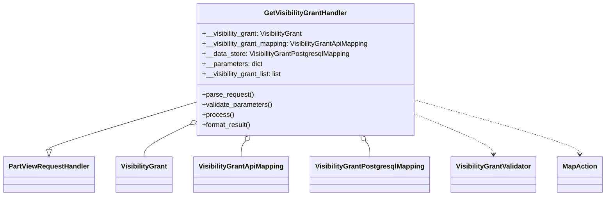
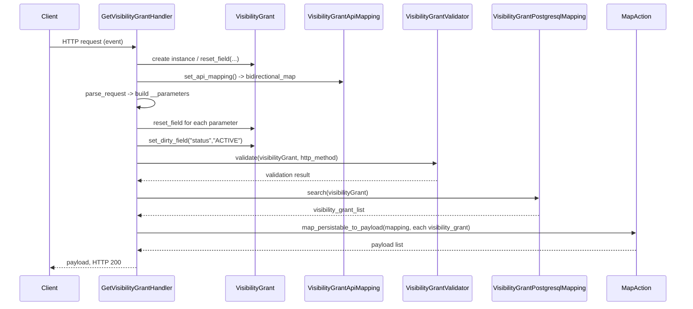

# Diagram: partview_core/partview_service/partview_service/api/visibility_grant/handler/GetVisibilityGrantHandler.py

> Auto-generated by Obscura crawlers

## Diagram 1

### SVG

<svg id="container" width="1379.4375" xmlns="http://www.w3.org/2000/svg" class="classDiagram" height="462" viewBox="0 0 1379.4375 462" role="graphics-document document" aria-roledescription="class"><g><defs><marker id="container_class-aggregationStart" class="marker aggregation class" refX="18" refY="7" markerWidth="190" markerHeight="240" orient="auto"><path d="M 18,7 L9,13 L1,7 L9,1 Z"></path></marker></defs><defs><marker id="container_class-aggregationEnd" class="marker aggregation class" refX="1" refY="7" markerWidth="20" markerHeight="28" orient="auto"><path d="M 18,7 L9,13 L1,7 L9,1 Z"></path></marker></defs><defs><marker id="container_class-extensionStart" class="marker extension class" refX="18" refY="7" markerWidth="190" markerHeight="240" orient="auto"><path d="M 1,7 L18,13 V 1 Z"></path></marker></defs><defs><marker id="container_class-extensionEnd" class="marker extension class" refX="1" refY="7" markerWidth="20" markerHeight="28" orient="auto"><path d="M 1,1 V 13 L18,7 Z"></path></marker></defs><defs><marker id="container_class-compositionStart" class="marker composition class" refX="18" refY="7" markerWidth="190" markerHeight="240" orient="auto"><path d="M 18,7 L9,13 L1,7 L9,1 Z"></path></marker></defs><defs><marker id="container_class-compositionEnd" class="marker composition class" refX="1" refY="7" markerWidth="20" markerHeight="28" orient="auto"><path d="M 18,7 L9,13 L1,7 L9,1 Z"></path></marker></defs><defs><marker id="container_class-dependencyStart" class="marker dependency class" refX="6" refY="7" markerWidth="190" markerHeight="240" orient="auto"><path d="M 5,7 L9,13 L1,7 L9,1 Z"></path></marker></defs><defs><marker id="container_class-dependencyEnd" class="marker dependency class" refX="13" refY="7" markerWidth="20" markerHeight="28" orient="auto"><path d="M 18,7 L9,13 L14,7 L9,1 Z"></path></marker></defs><defs><marker id="container_class-lollipopStart" class="marker lollipop class" refX="13" refY="7" markerWidth="190" markerHeight="240" orient="auto"><circle stroke="black" fill="transparent" cx="7" cy="7" r="6"></circle></marker></defs><defs><marker id="container_class-lollipopEnd" class="marker lollipop class" refX="1" refY="7" markerWidth="190" markerHeight="240" orient="auto"><circle stroke="black" fill="transparent" cx="7" cy="7" r="6"></circle></marker></defs><g class="root"><g class="clusters"></g><g class="edgePaths"><path d="M438.336,243.716L383.84,260.597C329.344,277.477,220.352,311.239,165.855,329.411C111.359,347.583,111.359,350.167,111.359,351.458L111.359,352.75" id="id_GetVisibilityGrantHandler_PartViewRequestHandler_1" class="edge-thickness-normal edge-pattern-solid relation" style=";;;" data-edge="true" data-et="edge" data-id="id_GetVisibilityGrantHandler_PartViewRequestHandler_1" data-points="W3sieCI6NDM4LjMzNTkzNzUsInkiOjI0My43MTU4OTEwODY3OTIyOH0seyJ4IjoxMTEuMzU5Mzc1LCJ5IjozNDV9LHsieCI6MTExLjM1OTM3NSwieSI6MzcwfV0=" marker-end="url(#container_class-extensionEnd)"></path><path d="M422.865,298.552L407.169,306.294C391.473,314.035,360.08,329.517,344.384,341.425C328.688,353.333,328.688,361.667,328.688,365.833L328.688,370" id="id_GetVisibilityGrantHandler_VisibilityGrant_2" class="edge-thickness-normal edge-pattern-solid relation" style=";;;" data-edge="true" data-et="edge" data-id="id_GetVisibilityGrantHandler_VisibilityGrant_2" data-points="W3sieCI6NDM4LjMzNTkzNzUsInkiOjI5MC45MjIxMjk2MjA3NTk3M30seyJ4IjozMjguNjg3NSwieSI6MzQ1fSx7IngiOjMyOC42ODc1LCJ5IjozNzB9XQ==" marker-start="url(#container_class-aggregationStart)"></path><path d="M559.2,333.434L557.647,335.361C556.094,337.289,552.988,341.145,551.436,347.239C549.883,353.333,549.883,361.667,549.883,365.833L549.883,370" id="id_GetVisibilityGrantHandler_VisibilityGrantApiMapping_3" class="edge-thickness-normal edge-pattern-solid relation" style=";;;" data-edge="true" data-et="edge" data-id="id_GetVisibilityGrantHandler_VisibilityGrantApiMapping_3" data-points="W3sieCI6NTcwLjAyMTA0MTk1NDQxOTgsInkiOjMyMH0seyJ4Ijo1NDkuODgyODEyNSwieSI6MzQ1fSx7IngiOjU0OS44ODI4MTI1LCJ5IjozNzB9XQ==" marker-start="url(#container_class-aggregationStart)"></path><path d="M832.167,333.434L833.72,335.361C835.273,337.289,838.379,341.145,839.932,347.239C841.484,353.333,841.484,361.667,841.484,365.833L841.484,370" id="id_GetVisibilityGrantHandler_VisibilityGrantPostgresqlMapping_4" class="edge-thickness-normal edge-pattern-solid relation" style=";;;" data-edge="true" data-et="edge" data-id="id_GetVisibilityGrantHandler_VisibilityGrantPostgresqlMapping_4" data-points="W3sieCI6ODIxLjM0NjE0NTU0NTU4MDIsInkiOjMyMH0seyJ4Ijo4NDEuNDg0Mzc1LCJ5IjozNDV9LHsieCI6ODQxLjQ4NDM3NSwieSI6MzcwfV0=" marker-start="url(#container_class-aggregationStart)"></path><path d="M953.031,273.002L981.362,285.001C1009.693,297.001,1066.354,321.001,1094.685,336.167C1123.016,351.333,1123.016,357.667,1123.016,360.833L1123.016,364" id="id_GetVisibilityGrantHandler_VisibilityGrantValidator_5" class="edge-thickness-normal edge-pattern-dashed relation" style=";;;" data-edge="true" data-et="edge" data-id="id_GetVisibilityGrantHandler_VisibilityGrantValidator_5" data-points="W3sieCI6OTUzLjAzMTI1LCJ5IjoyNzMuMDAxNzE4NTExNDc2NTV9LHsieCI6MTEyMy4wMTU2MjUsInkiOjM0NX0seyJ4IjoxMTIzLjAxNTYyNSwieSI6MzcwfV0=" marker-end="url(#container_class-dependencyEnd)"></path><path d="M953.031,238.513L1014.327,256.261C1075.622,274.009,1198.214,309.504,1259.509,330.419C1320.805,351.333,1320.805,357.667,1320.805,360.833L1320.805,364" id="id_GetVisibilityGrantHandler_MapAction_6" class="edge-thickness-normal edge-pattern-dashed relation" style=";;;" data-edge="true" data-et="edge" data-id="id_GetVisibilityGrantHandler_MapAction_6" data-points="W3sieCI6OTUzLjAzMTI1LCJ5IjoyMzguNTEzNDQ0MjcwMTcyNjd9LHsieCI6MTMyMC44MDQ2ODc1LCJ5IjozNDV9LHsieCI6MTMyMC44MDQ2ODc1LCJ5IjozNzB9XQ==" marker-end="url(#container_class-dependencyEnd)"></path></g><g class="edgeLabels"><g class="edgeLabel"><g class="label" data-id="id_GetVisibilityGrantHandler_PartViewRequestHandler_1" transform="translate(0, 0)"><foreignObject width="0" height="0">

</foreignObject></g></g><g class="edgeLabel"><g class="label" data-id="id_GetVisibilityGrantHandler_VisibilityGrant_2" transform="translate(0, 0)"><foreignObject width="0" height="0">

</foreignObject></g></g><g class="edgeLabel"><g class="label" data-id="id_GetVisibilityGrantHandler_VisibilityGrantApiMapping_3" transform="translate(0, 0)"><foreignObject width="0" height="0">

</foreignObject></g></g><g class="edgeLabel"><g class="label" data-id="id_GetVisibilityGrantHandler_VisibilityGrantPostgresqlMapping_4" transform="translate(0, 0)"><foreignObject width="0" height="0">

</foreignObject></g></g><g class="edgeLabel"><g class="label" data-id="id_GetVisibilityGrantHandler_VisibilityGrantValidator_5" transform="translate(0, 0)"><foreignObject width="0" height="0">

</foreignObject></g></g><g class="edgeLabel"><g class="label" data-id="id_GetVisibilityGrantHandler_MapAction_6" transform="translate(0, 0)"><foreignObject width="0" height="0">

</foreignObject></g></g></g><g class="nodes"><g class="node default" id="classId-GetVisibilityGrantHandler-0" transform="translate(695.68359375, 164)"><g class="basic label-container"><path d="M-257.34765625 -156 L257.34765625 -156 L257.34765625 156 L-257.34765625 156" stroke="none" stroke-width="0" fill="#ECECFF" style=""></path><path d="M-257.34765625 -156 C-110.22133243334548 -156, 36.90499138330904 -156, 257.34765625 -156 M-257.34765625 -156 C-140.42036193965322 -156, -23.493067629306438 -156, 257.34765625 -156 M257.34765625 -156 C257.34765625 -88.86576560700982, 257.34765625 -21.73153121401964, 257.34765625 156 M257.34765625 -156 C257.34765625 -50.29457868757294, 257.34765625 55.410842624854126, 257.34765625 156 M257.34765625 156 C148.97087771498178 156, 40.594099179963536 156, -257.34765625 156 M257.34765625 156 C120.07894260122296 156, -17.189771047554075 156, -257.34765625 156 M-257.34765625 156 C-257.34765625 34.820666620946014, -257.34765625 -86.35866675810797, -257.34765625 -156 M-257.34765625 156 C-257.34765625 52.772876969519345, -257.34765625 -50.45424606096131, -257.34765625 -156" stroke="#9370DB" stroke-width="1.3" fill="none" stroke-dasharray="0 0" style=""></path></g><g class="annotation-group text" transform="translate(0, -132)"></g><g class="label-group text" transform="translate(-93.7265625, -132)"><g class="label" style="font-weight: bolder" transform="translate(0,-12)"><foreignObject width="187.453125" height="24">

GetVisibilityGrantHandler

</foreignObject></g></g><g class="members-group text" transform="translate(-245.34765625, -84)"><g class="label" style="" transform="translate(0,-12)"><foreignObject width="239.53125" height="24">

+__visibility_grant: VisibilityGrant

</foreignObject></g><g class="label" style="" transform="translate(0,12)"><foreignObject width="396.96875" height="24">

+__visibility_grant_mapping: VisibilityGrantApiMapping

</foreignObject></g><g class="label" style="" transform="translate(0,36)"><foreignObject width="348.421875" height="24">

+__data_store: VisibilityGrantPostgresqlMapping

</foreignObject></g><g class="label" style="" transform="translate(0,60)"><foreignObject width="141.234375" height="24">

+__parameters: dict

</foreignObject></g><g class="label" style="" transform="translate(0,84)"><foreignObject width="190.84375" height="24">

+__visibility_grant_list: list

</foreignObject></g></g><g class="methods-group text" transform="translate(-245.34765625, 60)"><g class="label" style="" transform="translate(0,-12)"><foreignObject width="121.796875" height="24">

+parse_request()

</foreignObject></g><g class="label" style="" transform="translate(0,12)"><foreignObject width="166.546875" height="24">

+validate_parameters()

</foreignObject></g><g class="label" style="" transform="translate(0,36)"><foreignObject width="73.734375" height="24">

+process()

</foreignObject></g><g class="label" style="" transform="translate(0,60)"><foreignObject width="117.015625" height="24">

+format_result()

</foreignObject></g></g><g class="divider" style=""><path d="M-257.34765625 -108 C-82.06859115126463 -108, 93.21047394747075 -108, 257.34765625 -108 M-257.34765625 -108 C-74.81999229479467 -108, 107.70767166041065 -108, 257.34765625 -108" stroke="#9370DB" stroke-width="1.3" fill="none" stroke-dasharray="0 0" style=""></path></g><g class="divider" style=""><path d="M-257.34765625 36 C-87.36434599604854 36, 82.61896425790292 36, 257.34765625 36 M-257.34765625 36 C-123.42466320603887 36, 10.498329837922256 36, 257.34765625 36" stroke="#9370DB" stroke-width="1.3" fill="none" stroke-dasharray="0 0" style=""></path></g></g><g class="node default" id="classId-PartViewRequestHandler-1" transform="translate(111.359375, 412)"><g class="basic label-container"><path d="M-103.359375 -42 L103.359375 -42 L103.359375 42 L-103.359375 42" stroke="none" stroke-width="0" fill="#ECECFF" style=""></path><path d="M-103.359375 -42 C-36.088662666627656 -42, 31.18204966674469 -42, 103.359375 -42 M-103.359375 -42 C-52.043099318949906 -42, -0.7268236378998125 -42, 103.359375 -42 M103.359375 -42 C103.359375 -21.42644542981482, 103.359375 -0.852890859629639, 103.359375 42 M103.359375 -42 C103.359375 -24.08368625115409, 103.359375 -6.167372502308183, 103.359375 42 M103.359375 42 C58.179243424873256 42, 12.999111849746512 42, -103.359375 42 M103.359375 42 C24.04740945396692 42, -55.26455609206616 42, -103.359375 42 M-103.359375 42 C-103.359375 19.83401228317865, -103.359375 -2.3319754336426968, -103.359375 -42 M-103.359375 42 C-103.359375 23.24411598409895, -103.359375 4.488231968197901, -103.359375 -42" stroke="#9370DB" stroke-width="1.3" fill="none" stroke-dasharray="0 0" style=""></path></g><g class="annotation-group text" transform="translate(0, -18)"></g><g class="label-group text" transform="translate(-91.359375, -18)"><g class="label" style="font-weight: bolder" transform="translate(0,-12)"><foreignObject width="182.71875" height="24">

PartViewRequestHandler

</foreignObject></g></g><g class="members-group text" transform="translate(-91.359375, 30)"></g><g class="methods-group text" transform="translate(-91.359375, 60)"></g><g class="divider" style=""><path d="M-103.359375 6 C-38.981003463117304 6, 25.397368073765392 6, 103.359375 6 M-103.359375 6 C-36.17059202275421 6, 31.018190954491587 6, 103.359375 6" stroke="#9370DB" stroke-width="1.3" fill="none" stroke-dasharray="0 0" style=""></path></g><g class="divider" style=""><path d="M-103.359375 24 C-22.682750934044762 24, 57.993873131910476 24, 103.359375 24 M-103.359375 24 C-56.66883810531869 24, -9.978301210637383 24, 103.359375 24" stroke="#9370DB" stroke-width="1.3" fill="none" stroke-dasharray="0 0" style=""></path></g></g><g class="node default" id="classId-VisibilityGrant-2" transform="translate(328.6875, 412)"><g class="basic label-container"><path d="M-63.96875 -42 L63.96875 -42 L63.96875 42 L-63.96875 42" stroke="none" stroke-width="0" fill="#ECECFF" style=""></path><path d="M-63.96875 -42 C-26.638009321256817 -42, 10.692731357486366 -42, 63.96875 -42 M-63.96875 -42 C-32.2087537590389 -42, -0.44875751807779096 -42, 63.96875 -42 M63.96875 -42 C63.96875 -20.48914816198966, 63.96875 1.0217036760206781, 63.96875 42 M63.96875 -42 C63.96875 -18.48684161071183, 63.96875 5.026316778576337, 63.96875 42 M63.96875 42 C37.67155541947445 42, 11.374360838948903 42, -63.96875 42 M63.96875 42 C33.506646145941275 42, 3.04454229188255 42, -63.96875 42 M-63.96875 42 C-63.96875 19.958419192001106, -63.96875 -2.0831616159977884, -63.96875 -42 M-63.96875 42 C-63.96875 19.49351844366283, -63.96875 -3.012963112674342, -63.96875 -42" stroke="#9370DB" stroke-width="1.3" fill="none" stroke-dasharray="0 0" style=""></path></g><g class="annotation-group text" transform="translate(0, -18)"></g><g class="label-group text" transform="translate(-51.96875, -18)"><g class="label" style="font-weight: bolder" transform="translate(0,-12)"><foreignObject width="103.9375" height="24">

VisibilityGrant

</foreignObject></g></g><g class="members-group text" transform="translate(-51.96875, 30)"></g><g class="methods-group text" transform="translate(-51.96875, 60)"></g><g class="divider" style=""><path d="M-63.96875 6 C-33.41340080473998 6, -2.858051609479965 6, 63.96875 6 M-63.96875 6 C-27.387046406880685 6, 9.19465718623863 6, 63.96875 6" stroke="#9370DB" stroke-width="1.3" fill="none" stroke-dasharray="0 0" style=""></path></g><g class="divider" style=""><path d="M-63.96875 24 C-30.046103439363968 24, 3.8765431212720642 24, 63.96875 24 M-63.96875 24 C-30.692646502614096 24, 2.583456994771808 24, 63.96875 24" stroke="#9370DB" stroke-width="1.3" fill="none" stroke-dasharray="0 0" style=""></path></g></g><g class="node default" id="classId-VisibilityGrantApiMapping-3" transform="translate(549.8828125, 412)"><g class="basic label-container"><path d="M-107.2265625 -42 L107.2265625 -42 L107.2265625 42 L-107.2265625 42" stroke="none" stroke-width="0" fill="#ECECFF" style=""></path><path d="M-107.2265625 -42 C-22.061204056145073 -42, 63.104154387709855 -42, 107.2265625 -42 M-107.2265625 -42 C-53.961769992366115 -42, -0.6969774847322299 -42, 107.2265625 -42 M107.2265625 -42 C107.2265625 -16.74159434389319, 107.2265625 8.516811312213619, 107.2265625 42 M107.2265625 -42 C107.2265625 -16.46841920117147, 107.2265625 9.063161597657057, 107.2265625 42 M107.2265625 42 C33.95917364879749 42, -39.30821520240502 42, -107.2265625 42 M107.2265625 42 C48.0314915037867 42, -11.163579492426607 42, -107.2265625 42 M-107.2265625 42 C-107.2265625 8.690852745446286, -107.2265625 -24.61829450910743, -107.2265625 -42 M-107.2265625 42 C-107.2265625 24.550104131599497, -107.2265625 7.100208263198994, -107.2265625 -42" stroke="#9370DB" stroke-width="1.3" fill="none" stroke-dasharray="0 0" style=""></path></g><g class="annotation-group text" transform="translate(0, -18)"></g><g class="label-group text" transform="translate(-95.2265625, -18)"><g class="label" style="font-weight: bolder" transform="translate(0,-12)"><foreignObject width="190.453125" height="24">

VisibilityGrantApiMapping

</foreignObject></g></g><g class="members-group text" transform="translate(-95.2265625, 30)"></g><g class="methods-group text" transform="translate(-95.2265625, 60)"></g><g class="divider" style=""><path d="M-107.2265625 6 C-50.1649454909197 6, 6.896671518160602 6, 107.2265625 6 M-107.2265625 6 C-32.58848549958657 6, 42.049591500826864 6, 107.2265625 6" stroke="#9370DB" stroke-width="1.3" fill="none" stroke-dasharray="0 0" style=""></path></g><g class="divider" style=""><path d="M-107.2265625 24 C-39.154352181229726 24, 28.91785813754055 24, 107.2265625 24 M-107.2265625 24 C-25.778367589725477 24, 55.66982732054905 24, 107.2265625 24" stroke="#9370DB" stroke-width="1.3" fill="none" stroke-dasharray="0 0" style=""></path></g></g><g class="node default" id="classId-VisibilityGrantPostgresqlMapping-4" transform="translate(841.484375, 412)"><g class="basic label-container"><path d="M-134.375 -42 L134.375 -42 L134.375 42 L-134.375 42" stroke="none" stroke-width="0" fill="#ECECFF" style=""></path><path d="M-134.375 -42 C-33.01378704415286 -42, 68.34742591169427 -42, 134.375 -42 M-134.375 -42 C-65.32236402999426 -42, 3.7302719400114768 -42, 134.375 -42 M134.375 -42 C134.375 -9.005417553961642, 134.375 23.989164892076715, 134.375 42 M134.375 -42 C134.375 -10.24099139144078, 134.375 21.51801721711844, 134.375 42 M134.375 42 C73.5460409103558 42, 12.717081820711613 42, -134.375 42 M134.375 42 C71.52986603569934 42, 8.684732071398685 42, -134.375 42 M-134.375 42 C-134.375 17.09935063579217, -134.375 -7.801298728415659, -134.375 -42 M-134.375 42 C-134.375 22.493152075377253, -134.375 2.9863041507545063, -134.375 -42" stroke="#9370DB" stroke-width="1.3" fill="none" stroke-dasharray="0 0" style=""></path></g><g class="annotation-group text" transform="translate(0, -18)"></g><g class="label-group text" transform="translate(-122.375, -18)"><g class="label" style="font-weight: bolder" transform="translate(0,-12)"><foreignObject width="244.75" height="24">

VisibilityGrantPostgresqlMapping

</foreignObject></g></g><g class="members-group text" transform="translate(-122.375, 30)"></g><g class="methods-group text" transform="translate(-122.375, 60)"></g><g class="divider" style=""><path d="M-134.375 6 C-75.45617169657703 6, -16.53734339315406 6, 134.375 6 M-134.375 6 C-75.98740914005575 6, -17.599818280111478 6, 134.375 6" stroke="#9370DB" stroke-width="1.3" fill="none" stroke-dasharray="0 0" style=""></path></g><g class="divider" style=""><path d="M-134.375 24 C-41.78523631472403 24, 50.80452737055194 24, 134.375 24 M-134.375 24 C-32.228810789069925 24, 69.91737842186015 24, 134.375 24" stroke="#9370DB" stroke-width="1.3" fill="none" stroke-dasharray="0 0" style=""></path></g></g><g class="node default" id="classId-VisibilityGrantValidator-5" transform="translate(1123.015625, 412)"><g class="basic label-container"><path d="M-97.15625 -42 L97.15625 -42 L97.15625 42 L-97.15625 42" stroke="none" stroke-width="0" fill="#ECECFF" style=""></path><path d="M-97.15625 -42 C-33.21165752503952 -42, 30.73293494992096 -42, 97.15625 -42 M-97.15625 -42 C-44.54348057535694 -42, 8.069288849286124 -42, 97.15625 -42 M97.15625 -42 C97.15625 -22.229457783147357, 97.15625 -2.4589155662947135, 97.15625 42 M97.15625 -42 C97.15625 -8.420370130405644, 97.15625 25.159259739188713, 97.15625 42 M97.15625 42 C30.069858984621604 42, -37.01653203075679 42, -97.15625 42 M97.15625 42 C37.10192718343932 42, -22.952395633121355 42, -97.15625 42 M-97.15625 42 C-97.15625 16.549371010069045, -97.15625 -8.90125797986191, -97.15625 -42 M-97.15625 42 C-97.15625 22.986172378654693, -97.15625 3.9723447573093864, -97.15625 -42" stroke="#9370DB" stroke-width="1.3" fill="none" stroke-dasharray="0 0" style=""></path></g><g class="annotation-group text" transform="translate(0, -18)"></g><g class="label-group text" transform="translate(-85.15625, -18)"><g class="label" style="font-weight: bolder" transform="translate(0,-12)"><foreignObject width="170.3125" height="24">

VisibilityGrantValidator

</foreignObject></g></g><g class="members-group text" transform="translate(-85.15625, 30)"></g><g class="methods-group text" transform="translate(-85.15625, 60)"></g><g class="divider" style=""><path d="M-97.15625 6 C-24.209608652189587 6, 48.737032695620826 6, 97.15625 6 M-97.15625 6 C-57.9190740997571 6, -18.681898199514194 6, 97.15625 6" stroke="#9370DB" stroke-width="1.3" fill="none" stroke-dasharray="0 0" style=""></path></g><g class="divider" style=""><path d="M-97.15625 24 C-43.69100934293627 24, 9.774231314127462 24, 97.15625 24 M-97.15625 24 C-30.166866190756807 24, 36.82251761848639 24, 97.15625 24" stroke="#9370DB" stroke-width="1.3" fill="none" stroke-dasharray="0 0" style=""></path></g></g><g class="node default" id="classId-MapAction-6" transform="translate(1320.8046875, 412)"><g class="basic label-container"><path d="M-50.6328125 -42 L50.6328125 -42 L50.6328125 42 L-50.6328125 42" stroke="none" stroke-width="0" fill="#ECECFF" style=""></path><path d="M-50.6328125 -42 C-22.780622278207492 -42, 5.071567943585016 -42, 50.6328125 -42 M-50.6328125 -42 C-21.13612894729063 -42, 8.360554605418741 -42, 50.6328125 -42 M50.6328125 -42 C50.6328125 -11.136158928149484, 50.6328125 19.72768214370103, 50.6328125 42 M50.6328125 -42 C50.6328125 -12.398244348557398, 50.6328125 17.203511302885204, 50.6328125 42 M50.6328125 42 C16.5256316484324 42, -17.581549203135197 42, -50.6328125 42 M50.6328125 42 C17.766198357721947 42, -15.100415784556105 42, -50.6328125 42 M-50.6328125 42 C-50.6328125 9.285033474007683, -50.6328125 -23.429933051984634, -50.6328125 -42 M-50.6328125 42 C-50.6328125 21.586446840361628, -50.6328125 1.1728936807232557, -50.6328125 -42" stroke="#9370DB" stroke-width="1.3" fill="none" stroke-dasharray="0 0" style=""></path></g><g class="annotation-group text" transform="translate(0, -18)"></g><g class="label-group text" transform="translate(-38.6328125, -18)"><g class="label" style="font-weight: bolder" transform="translate(0,-12)"><foreignObject width="77.265625" height="24">

MapAction

</foreignObject></g></g><g class="members-group text" transform="translate(-38.6328125, 30)"></g><g class="methods-group text" transform="translate(-38.6328125, 60)"></g><g class="divider" style=""><path d="M-50.6328125 6 C-28.528056608102375 6, -6.42330071620475 6, 50.6328125 6 M-50.6328125 6 C-29.500732627323345 6, -8.36865275464669 6, 50.6328125 6" stroke="#9370DB" stroke-width="1.3" fill="none" stroke-dasharray="0 0" style=""></path></g><g class="divider" style=""><path d="M-50.6328125 24 C-27.232133907529377 24, -3.8314553150587543 24, 50.6328125 24 M-50.6328125 24 C-10.296185858743819 24, 30.040440782512363 24, 50.6328125 24" stroke="#9370DB" stroke-width="1.3" fill="none" stroke-dasharray="0 0" style=""></path></g></g></g></g></g></svg>

## Diagram 2

### SVG

<svg id="container" width="1785.5" xmlns="http://www.w3.org/2000/svg" height="825" viewBox="-50 -10 1785.5 825" role="graphics-document document" aria-roledescription="sequence"><g><rect x="1535.5" y="739" fill="#eaeaea" stroke="#666" width="150" height="65" name="MapAction" rx="3" ry="3" class="actor actor-bottom"></rect><text x="1610.5" y="771.5" dominant-baseline="central" alignment-baseline="central" class="actor actor-box" style="text-anchor: middle; font-size: 16px; font-weight: 400;"><tspan x="1610.5" dy="0">MapAction</tspan></text></g><g><rect x="1225.5" y="739" fill="#eaeaea" stroke="#666" width="260" height="65" name="DataStore" rx="3" ry="3" class="actor actor-bottom"></rect><text x="1355.5" y="771.5" dominant-baseline="central" alignment-baseline="central" class="actor actor-box" style="text-anchor: middle; font-size: 16px; font-weight: 400;"><tspan x="1355.5" dy="0">VisibilityGrantPostgresqlMapping</tspan></text></g><g><rect x="987.5" y="739" fill="#eaeaea" stroke="#666" width="188" height="65" name="Validator" rx="3" ry="3" class="actor actor-bottom"></rect><text x="1081.5" y="771.5" dominant-baseline="central" alignment-baseline="central" class="actor actor-box" style="text-anchor: middle; font-size: 16px; font-weight: 400;"><tspan x="1081.5" dy="0">VisibilityGrantValidator</tspan></text></g><g><rect x="729.5" y="739" fill="#eaeaea" stroke="#666" width="208" height="65" name="Mapping" rx="3" ry="3" class="actor actor-bottom"></rect><text x="833.5" y="771.5" dominant-baseline="central" alignment-baseline="central" class="actor actor-box" style="text-anchor: middle; font-size: 16px; font-weight: 400;"><tspan x="833.5" dy="0">VisibilityGrantApiMapping</tspan></text></g><g><rect x="529.5" y="739" fill="#eaeaea" stroke="#666" width="150" height="65" name="VisibilityGrant" rx="3" ry="3" class="actor actor-bottom"></rect><text x="604.5" y="771.5" dominant-baseline="central" alignment-baseline="central" class="actor actor-box" style="text-anchor: middle; font-size: 16px; font-weight: 400;"><tspan x="604.5" dy="0">VisibilityGrant</tspan></text></g><g><rect x="200" y="739" fill="#eaeaea" stroke="#666" width="205" height="65" name="Handler" rx="3" ry="3" class="actor actor-bottom"></rect><text x="302.5" y="771.5" dominant-baseline="central" alignment-baseline="central" class="actor actor-box" style="text-anchor: middle; font-size: 16px; font-weight: 400;"><tspan x="302.5" dy="0">GetVisibilityGrantHandler</tspan></text></g><g><rect x="0" y="739" fill="#eaeaea" stroke="#666" width="150" height="65" name="Client" rx="3" ry="3" class="actor actor-bottom"></rect><text x="75" y="771.5" dominant-baseline="central" alignment-baseline="central" class="actor actor-box" style="text-anchor: middle; font-size: 16px; font-weight: 400;"><tspan x="75" dy="0">Client</tspan></text></g><g><line id="actor6" x1="1610.5" y1="65" x2="1610.5" y2="739" class="actor-line 200" stroke-width="0.5px" stroke="#999" name="MapAction"></line><g id="root-6"><rect x="1535.5" y="0" fill="#eaeaea" stroke="#666" width="150" height="65" name="MapAction" rx="3" ry="3" class="actor actor-top"></rect><text x="1610.5" y="32.5" dominant-baseline="central" alignment-baseline="central" class="actor actor-box" style="text-anchor: middle; font-size: 16px; font-weight: 400;"><tspan x="1610.5" dy="0">MapAction</tspan></text></g></g><g><line id="actor5" x1="1355.5" y1="65" x2="1355.5" y2="739" class="actor-line 200" stroke-width="0.5px" stroke="#999" name="DataStore"></line><g id="root-5"><rect x="1225.5" y="0" fill="#eaeaea" stroke="#666" width="260" height="65" name="DataStore" rx="3" ry="3" class="actor actor-top"></rect><text x="1355.5" y="32.5" dominant-baseline="central" alignment-baseline="central" class="actor actor-box" style="text-anchor: middle; font-size: 16px; font-weight: 400;"><tspan x="1355.5" dy="0">VisibilityGrantPostgresqlMapping</tspan></text></g></g><g><line id="actor4" x1="1081.5" y1="65" x2="1081.5" y2="739" class="actor-line 200" stroke-width="0.5px" stroke="#999" name="Validator"></line><g id="root-4"><rect x="987.5" y="0" fill="#eaeaea" stroke="#666" width="188" height="65" name="Validator" rx="3" ry="3" class="actor actor-top"></rect><text x="1081.5" y="32.5" dominant-baseline="central" alignment-baseline="central" class="actor actor-box" style="text-anchor: middle; font-size: 16px; font-weight: 400;"><tspan x="1081.5" dy="0">VisibilityGrantValidator</tspan></text></g></g><g><line id="actor3" x1="833.5" y1="65" x2="833.5" y2="739" class="actor-line 200" stroke-width="0.5px" stroke="#999" name="Mapping"></line><g id="root-3"><rect x="729.5" y="0" fill="#eaeaea" stroke="#666" width="208" height="65" name="Mapping" rx="3" ry="3" class="actor actor-top"></rect><text x="833.5" y="32.5" dominant-baseline="central" alignment-baseline="central" class="actor actor-box" style="text-anchor: middle; font-size: 16px; font-weight: 400;"><tspan x="833.5" dy="0">VisibilityGrantApiMapping</tspan></text></g></g><g><line id="actor2" x1="604.5" y1="65" x2="604.5" y2="739" class="actor-line 200" stroke-width="0.5px" stroke="#999" name="VisibilityGrant"></line><g id="root-2"><rect x="529.5" y="0" fill="#eaeaea" stroke="#666" width="150" height="65" name="VisibilityGrant" rx="3" ry="3" class="actor actor-top"></rect><text x="604.5" y="32.5" dominant-baseline="central" alignment-baseline="central" class="actor actor-box" style="text-anchor: middle; font-size: 16px; font-weight: 400;"><tspan x="604.5" dy="0">VisibilityGrant</tspan></text></g></g><g><line id="actor1" x1="302.5" y1="65" x2="302.5" y2="739" class="actor-line 200" stroke-width="0.5px" stroke="#999" name="Handler"></line><g id="root-1"><rect x="200" y="0" fill="#eaeaea" stroke="#666" width="205" height="65" name="Handler" rx="3" ry="3" class="actor actor-top"></rect><text x="302.5" y="32.5" dominant-baseline="central" alignment-baseline="central" class="actor actor-box" style="text-anchor: middle; font-size: 16px; font-weight: 400;"><tspan x="302.5" dy="0">GetVisibilityGrantHandler</tspan></text></g></g><g><line id="actor0" x1="75" y1="65" x2="75" y2="739" class="actor-line 200" stroke-width="0.5px" stroke="#999" name="Client"></line><g id="root-0"><rect x="0" y="0" fill="#eaeaea" stroke="#666" width="150" height="65" name="Client" rx="3" ry="3" class="actor actor-top"></rect><text x="75" y="32.5" dominant-baseline="central" alignment-baseline="central" class="actor actor-box" style="text-anchor: middle; font-size: 16px; font-weight: 400;"><tspan x="75" dy="0">Client</tspan></text></g></g><g></g><defs><symbol id="computer" width="24" height="24"><path transform="scale(.5)" d="M2 2v13h20v-13h-20zm18 11h-16v-9h16v9zm-10.228 6l.466-1h3.524l.467 1h-4.457zm14.228 3h-24l2-6h2.104l-1.33 4h18.45l-1.297-4h2.073l2 6zm-5-10h-14v-7h14v7z"></path></symbol></defs><defs><symbol id="database" fill-rule="evenodd" clip-rule="evenodd"><path transform="scale(.5)" d="M12.258.001l.256.004.255.005.253.008.251.01.249.012.247.015.246.016.242.019.241.02.239.023.236.024.233.027.231.028.229.031.225.032.223.034.22.036.217.038.214.04.211.041.208.043.205.045.201.046.198.048.194.05.191.051.187.053.183.054.18.056.175.057.172.059.168.06.163.061.16.063.155.064.15.066.074.033.073.033.071.034.07.034.069.035.068.035.067.035.066.035.064.036.064.036.062.036.06.036.06.037.058.037.058.037.055.038.055.038.053.038.052.038.051.039.05.039.048.039.047.039.045.04.044.04.043.04.041.04.04.041.039.041.037.041.036.041.034.041.033.042.032.042.03.042.029.042.027.042.026.043.024.043.023.043.021.043.02.043.018.044.017.043.015.044.013.044.012.044.011.045.009.044.007.045.006.045.004.045.002.045.001.045v17l-.001.045-.002.045-.004.045-.006.045-.007.045-.009.044-.011.045-.012.044-.013.044-.015.044-.017.043-.018.044-.02.043-.021.043-.023.043-.024.043-.026.043-.027.042-.029.042-.03.042-.032.042-.033.042-.034.041-.036.041-.037.041-.039.041-.04.041-.041.04-.043.04-.044.04-.045.04-.047.039-.048.039-.05.039-.051.039-.052.038-.053.038-.055.038-.055.038-.058.037-.058.037-.06.037-.06.036-.062.036-.064.036-.064.036-.066.035-.067.035-.068.035-.069.035-.07.034-.071.034-.073.033-.074.033-.15.066-.155.064-.16.063-.163.061-.168.06-.172.059-.175.057-.18.056-.183.054-.187.053-.191.051-.194.05-.198.048-.201.046-.205.045-.208.043-.211.041-.214.04-.217.038-.22.036-.223.034-.225.032-.229.031-.231.028-.233.027-.236.024-.239.023-.241.02-.242.019-.246.016-.247.015-.249.012-.251.01-.253.008-.255.005-.256.004-.258.001-.258-.001-.256-.004-.255-.005-.253-.008-.251-.01-.249-.012-.247-.015-.245-.016-.243-.019-.241-.02-.238-.023-.236-.024-.234-.027-.231-.028-.228-.031-.226-.032-.223-.034-.22-.036-.217-.038-.214-.04-.211-.041-.208-.043-.204-.045-.201-.046-.198-.048-.195-.05-.19-.051-.187-.053-.184-.054-.179-.056-.176-.057-.172-.059-.167-.06-.164-.061-.159-.063-.155-.064-.151-.066-.074-.033-.072-.033-.072-.034-.07-.034-.069-.035-.068-.035-.067-.035-.066-.035-.064-.036-.063-.036-.062-.036-.061-.036-.06-.037-.058-.037-.057-.037-.056-.038-.055-.038-.053-.038-.052-.038-.051-.039-.049-.039-.049-.039-.046-.039-.046-.04-.044-.04-.043-.04-.041-.04-.04-.041-.039-.041-.037-.041-.036-.041-.034-.041-.033-.042-.032-.042-.03-.042-.029-.042-.027-.042-.026-.043-.024-.043-.023-.043-.021-.043-.02-.043-.018-.044-.017-.043-.015-.044-.013-.044-.012-.044-.011-.045-.009-.044-.007-.045-.006-.045-.004-.045-.002-.045-.001-.045v-17l.001-.045.002-.045.004-.045.006-.045.007-.045.009-.044.011-.045.012-.044.013-.044.015-.044.017-.043.018-.044.02-.043.021-.043.023-.043.024-.043.026-.043.027-.042.029-.042.03-.042.032-.042.033-.042.034-.041.036-.041.037-.041.039-.041.04-.041.041-.04.043-.04.044-.04.046-.04.046-.039.049-.039.049-.039.051-.039.052-.038.053-.038.055-.038.056-.038.057-.037.058-.037.06-.037.061-.036.062-.036.063-.036.064-.036.066-.035.067-.035.068-.035.069-.035.07-.034.072-.034.072-.033.074-.033.151-.066.155-.064.159-.063.164-.061.167-.06.172-.059.176-.057.179-.056.184-.054.187-.053.19-.051.195-.05.198-.048.201-.046.204-.045.208-.043.211-.041.214-.04.217-.038.22-.036.223-.034.226-.032.228-.031.231-.028.234-.027.236-.024.238-.023.241-.02.243-.019.245-.016.247-.015.249-.012.251-.01.253-.008.255-.005.256-.004.258-.001.258.001zm-9.258 20.499v.01l.001.021.003.021.004.022.005.021.006.022.007.022.009.023.01.022.011.023.012.023.013.023.015.023.016.024.017.023.018.024.019.024.021.024.022.025.023.024.024.025.052.049.056.05.061.051.066.051.07.051.075.051.079.052.084.052.088.052.092.052.097.052.102.051.105.052.11.052.114.051.119.051.123.051.127.05.131.05.135.05.139.048.144.049.147.047.152.047.155.047.16.045.163.045.167.043.171.043.176.041.178.041.183.039.187.039.19.037.194.035.197.035.202.033.204.031.209.03.212.029.216.027.219.025.222.024.226.021.23.02.233.018.236.016.24.015.243.012.246.01.249.008.253.005.256.004.259.001.26-.001.257-.004.254-.005.25-.008.247-.011.244-.012.241-.014.237-.016.233-.018.231-.021.226-.021.224-.024.22-.026.216-.027.212-.028.21-.031.205-.031.202-.034.198-.034.194-.036.191-.037.187-.039.183-.04.179-.04.175-.042.172-.043.168-.044.163-.045.16-.046.155-.046.152-.047.148-.048.143-.049.139-.049.136-.05.131-.05.126-.05.123-.051.118-.052.114-.051.11-.052.106-.052.101-.052.096-.052.092-.052.088-.053.083-.051.079-.052.074-.052.07-.051.065-.051.06-.051.056-.05.051-.05.023-.024.023-.025.021-.024.02-.024.019-.024.018-.024.017-.024.015-.023.014-.024.013-.023.012-.023.01-.023.01-.022.008-.022.006-.022.006-.022.004-.022.004-.021.001-.021.001-.021v-4.127l-.077.055-.08.053-.083.054-.085.053-.087.052-.09.052-.093.051-.095.05-.097.05-.1.049-.102.049-.105.048-.106.047-.109.047-.111.046-.114.045-.115.045-.118.044-.12.043-.122.042-.124.042-.126.041-.128.04-.13.04-.132.038-.134.038-.135.037-.138.037-.139.035-.142.035-.143.034-.144.033-.147.032-.148.031-.15.03-.151.03-.153.029-.154.027-.156.027-.158.026-.159.025-.161.024-.162.023-.163.022-.165.021-.166.02-.167.019-.169.018-.169.017-.171.016-.173.015-.173.014-.175.013-.175.012-.177.011-.178.01-.179.008-.179.008-.181.006-.182.005-.182.004-.184.003-.184.002h-.37l-.184-.002-.184-.003-.182-.004-.182-.005-.181-.006-.179-.008-.179-.008-.178-.01-.176-.011-.176-.012-.175-.013-.173-.014-.172-.015-.171-.016-.17-.017-.169-.018-.167-.019-.166-.02-.165-.021-.163-.022-.162-.023-.161-.024-.159-.025-.157-.026-.156-.027-.155-.027-.153-.029-.151-.03-.15-.03-.148-.031-.146-.032-.145-.033-.143-.034-.141-.035-.14-.035-.137-.037-.136-.037-.134-.038-.132-.038-.13-.04-.128-.04-.126-.041-.124-.042-.122-.042-.12-.044-.117-.043-.116-.045-.113-.045-.112-.046-.109-.047-.106-.047-.105-.048-.102-.049-.1-.049-.097-.05-.095-.05-.093-.052-.09-.051-.087-.052-.085-.053-.083-.054-.08-.054-.077-.054v4.127zm0-5.654v.011l.001.021.003.021.004.021.005.022.006.022.007.022.009.022.01.022.011.023.012.023.013.023.015.024.016.023.017.024.018.024.019.024.021.024.022.024.023.025.024.024.052.05.056.05.061.05.066.051.07.051.075.052.079.051.084.052.088.052.092.052.097.052.102.052.105.052.11.051.114.051.119.052.123.05.127.051.131.05.135.049.139.049.144.048.147.048.152.047.155.046.16.045.163.045.167.044.171.042.176.042.178.04.183.04.187.038.19.037.194.036.197.034.202.033.204.032.209.03.212.028.216.027.219.025.222.024.226.022.23.02.233.018.236.016.24.014.243.012.246.01.249.008.253.006.256.003.259.001.26-.001.257-.003.254-.006.25-.008.247-.01.244-.012.241-.015.237-.016.233-.018.231-.02.226-.022.224-.024.22-.025.216-.027.212-.029.21-.03.205-.032.202-.033.198-.035.194-.036.191-.037.187-.039.183-.039.179-.041.175-.042.172-.043.168-.044.163-.045.16-.045.155-.047.152-.047.148-.048.143-.048.139-.05.136-.049.131-.05.126-.051.123-.051.118-.051.114-.052.11-.052.106-.052.101-.052.096-.052.092-.052.088-.052.083-.052.079-.052.074-.051.07-.052.065-.051.06-.05.056-.051.051-.049.023-.025.023-.024.021-.025.02-.024.019-.024.018-.024.017-.024.015-.023.014-.023.013-.024.012-.022.01-.023.01-.023.008-.022.006-.022.006-.022.004-.021.004-.022.001-.021.001-.021v-4.139l-.077.054-.08.054-.083.054-.085.052-.087.053-.09.051-.093.051-.095.051-.097.05-.1.049-.102.049-.105.048-.106.047-.109.047-.111.046-.114.045-.115.044-.118.044-.12.044-.122.042-.124.042-.126.041-.128.04-.13.039-.132.039-.134.038-.135.037-.138.036-.139.036-.142.035-.143.033-.144.033-.147.033-.148.031-.15.03-.151.03-.153.028-.154.028-.156.027-.158.026-.159.025-.161.024-.162.023-.163.022-.165.021-.166.02-.167.019-.169.018-.169.017-.171.016-.173.015-.173.014-.175.013-.175.012-.177.011-.178.009-.179.009-.179.007-.181.007-.182.005-.182.004-.184.003-.184.002h-.37l-.184-.002-.184-.003-.182-.004-.182-.005-.181-.007-.179-.007-.179-.009-.178-.009-.176-.011-.176-.012-.175-.013-.173-.014-.172-.015-.171-.016-.17-.017-.169-.018-.167-.019-.166-.02-.165-.021-.163-.022-.162-.023-.161-.024-.159-.025-.157-.026-.156-.027-.155-.028-.153-.028-.151-.03-.15-.03-.148-.031-.146-.033-.145-.033-.143-.033-.141-.035-.14-.036-.137-.036-.136-.037-.134-.038-.132-.039-.13-.039-.128-.04-.126-.041-.124-.042-.122-.043-.12-.043-.117-.044-.116-.044-.113-.046-.112-.046-.109-.046-.106-.047-.105-.048-.102-.049-.1-.049-.097-.05-.095-.051-.093-.051-.09-.051-.087-.053-.085-.052-.083-.054-.08-.054-.077-.054v4.139zm0-5.666v.011l.001.02.003.022.004.021.005.022.006.021.007.022.009.023.01.022.011.023.012.023.013.023.015.023.016.024.017.024.018.023.019.024.021.025.022.024.023.024.024.025.052.05.056.05.061.05.066.051.07.051.075.052.079.051.084.052.088.052.092.052.097.052.102.052.105.051.11.052.114.051.119.051.123.051.127.05.131.05.135.05.139.049.144.048.147.048.152.047.155.046.16.045.163.045.167.043.171.043.176.042.178.04.183.04.187.038.19.037.194.036.197.034.202.033.204.032.209.03.212.028.216.027.219.025.222.024.226.021.23.02.233.018.236.017.24.014.243.012.246.01.249.008.253.006.256.003.259.001.26-.001.257-.003.254-.006.25-.008.247-.01.244-.013.241-.014.237-.016.233-.018.231-.02.226-.022.224-.024.22-.025.216-.027.212-.029.21-.03.205-.032.202-.033.198-.035.194-.036.191-.037.187-.039.183-.039.179-.041.175-.042.172-.043.168-.044.163-.045.16-.045.155-.047.152-.047.148-.048.143-.049.139-.049.136-.049.131-.051.126-.05.123-.051.118-.052.114-.051.11-.052.106-.052.101-.052.096-.052.092-.052.088-.052.083-.052.079-.052.074-.052.07-.051.065-.051.06-.051.056-.05.051-.049.023-.025.023-.025.021-.024.02-.024.019-.024.018-.024.017-.024.015-.023.014-.024.013-.023.012-.023.01-.022.01-.023.008-.022.006-.022.006-.022.004-.022.004-.021.001-.021.001-.021v-4.153l-.077.054-.08.054-.083.053-.085.053-.087.053-.09.051-.093.051-.095.051-.097.05-.1.049-.102.048-.105.048-.106.048-.109.046-.111.046-.114.046-.115.044-.118.044-.12.043-.122.043-.124.042-.126.041-.128.04-.13.039-.132.039-.134.038-.135.037-.138.036-.139.036-.142.034-.143.034-.144.033-.147.032-.148.032-.15.03-.151.03-.153.028-.154.028-.156.027-.158.026-.159.024-.161.024-.162.023-.163.023-.165.021-.166.02-.167.019-.169.018-.169.017-.171.016-.173.015-.173.014-.175.013-.175.012-.177.01-.178.01-.179.009-.179.007-.181.006-.182.006-.182.004-.184.003-.184.001-.185.001-.185-.001-.184-.001-.184-.003-.182-.004-.182-.006-.181-.006-.179-.007-.179-.009-.178-.01-.176-.01-.176-.012-.175-.013-.173-.014-.172-.015-.171-.016-.17-.017-.169-.018-.167-.019-.166-.02-.165-.021-.163-.023-.162-.023-.161-.024-.159-.024-.157-.026-.156-.027-.155-.028-.153-.028-.151-.03-.15-.03-.148-.032-.146-.032-.145-.033-.143-.034-.141-.034-.14-.036-.137-.036-.136-.037-.134-.038-.132-.039-.13-.039-.128-.041-.126-.041-.124-.041-.122-.043-.12-.043-.117-.044-.116-.044-.113-.046-.112-.046-.109-.046-.106-.048-.105-.048-.102-.048-.1-.05-.097-.049-.095-.051-.093-.051-.09-.052-.087-.052-.085-.053-.083-.053-.08-.054-.077-.054v4.153zm8.74-8.179l-.257.004-.254.005-.25.008-.247.011-.244.012-.241.014-.237.016-.233.018-.231.021-.226.022-.224.023-.22.026-.216.027-.212.028-.21.031-.205.032-.202.033-.198.034-.194.036-.191.038-.187.038-.183.04-.179.041-.175.042-.172.043-.168.043-.163.045-.16.046-.155.046-.152.048-.148.048-.143.048-.139.049-.136.05-.131.05-.126.051-.123.051-.118.051-.114.052-.11.052-.106.052-.101.052-.096.052-.092.052-.088.052-.083.052-.079.052-.074.051-.07.052-.065.051-.06.05-.056.05-.051.05-.023.025-.023.024-.021.024-.02.025-.019.024-.018.024-.017.023-.015.024-.014.023-.013.023-.012.023-.01.023-.01.022-.008.022-.006.023-.006.021-.004.022-.004.021-.001.021-.001.021.001.021.001.021.004.021.004.022.006.021.006.023.008.022.01.022.01.023.012.023.013.023.014.023.015.024.017.023.018.024.019.024.02.025.021.024.023.024.023.025.051.05.056.05.06.05.065.051.07.052.074.051.079.052.083.052.088.052.092.052.096.052.101.052.106.052.11.052.114.052.118.051.123.051.126.051.131.05.136.05.139.049.143.048.148.048.152.048.155.046.16.046.163.045.168.043.172.043.175.042.179.041.183.04.187.038.191.038.194.036.198.034.202.033.205.032.21.031.212.028.216.027.22.026.224.023.226.022.231.021.233.018.237.016.241.014.244.012.247.011.25.008.254.005.257.004.26.001.26-.001.257-.004.254-.005.25-.008.247-.011.244-.012.241-.014.237-.016.233-.018.231-.021.226-.022.224-.023.22-.026.216-.027.212-.028.21-.031.205-.032.202-.033.198-.034.194-.036.191-.038.187-.038.183-.04.179-.041.175-.042.172-.043.168-.043.163-.045.16-.046.155-.046.152-.048.148-.048.143-.048.139-.049.136-.05.131-.05.126-.051.123-.051.118-.051.114-.052.11-.052.106-.052.101-.052.096-.052.092-.052.088-.052.083-.052.079-.052.074-.051.07-.052.065-.051.06-.05.056-.05.051-.05.023-.025.023-.024.021-.024.02-.025.019-.024.018-.024.017-.023.015-.024.014-.023.013-.023.012-.023.01-.023.01-.022.008-.022.006-.023.006-.021.004-.022.004-.021.001-.021.001-.021-.001-.021-.001-.021-.004-.021-.004-.022-.006-.021-.006-.023-.008-.022-.01-.022-.01-.023-.012-.023-.013-.023-.014-.023-.015-.024-.017-.023-.018-.024-.019-.024-.02-.025-.021-.024-.023-.024-.023-.025-.051-.05-.056-.05-.06-.05-.065-.051-.07-.052-.074-.051-.079-.052-.083-.052-.088-.052-.092-.052-.096-.052-.101-.052-.106-.052-.11-.052-.114-.052-.118-.051-.123-.051-.126-.051-.131-.05-.136-.05-.139-.049-.143-.048-.148-.048-.152-.048-.155-.046-.16-.046-.163-.045-.168-.043-.172-.043-.175-.042-.179-.041-.183-.04-.187-.038-.191-.038-.194-.036-.198-.034-.202-.033-.205-.032-.21-.031-.212-.028-.216-.027-.22-.026-.224-.023-.226-.022-.231-.021-.233-.018-.237-.016-.241-.014-.244-.012-.247-.011-.25-.008-.254-.005-.257-.004-.26-.001-.26.001z"></path></symbol></defs><defs><symbol id="clock" width="24" height="24"><path transform="scale(.5)" d="M12 2c5.514 0 10 4.486 10 10s-4.486 10-10 10-10-4.486-10-10 4.486-10 10-10zm0-2c-6.627 0-12 5.373-12 12s5.373 12 12 12 12-5.373 12-12-5.373-12-12-12zm5.848 12.459c.202.038.202.333.001.372-1.907.361-6.045 1.111-6.547 1.111-.719 0-1.301-.582-1.301-1.301 0-.512.77-5.447 1.125-7.445.034-.192.312-.181.343.014l.985 6.238 5.394 1.011z"></path></symbol></defs><defs><marker id="arrowhead" refX="7.9" refY="5" markerUnits="userSpaceOnUse" markerWidth="12" markerHeight="12" orient="auto-start-reverse"><path d="M -1 0 L 10 5 L 0 10 z"></path></marker></defs><defs><marker id="crosshead" markerWidth="15" markerHeight="8" orient="auto" refX="4" refY="4.5"><path fill="none" stroke="#000000" stroke-width="1pt" d="M 1,2 L 6,7 M 6,2 L 1,7" style="stroke-dasharray: 0, 0;"></path></marker></defs><defs><marker id="filled-head" refX="15.5" refY="7" markerWidth="20" markerHeight="28" orient="auto"><path d="M 18,7 L9,13 L14,7 L9,1 Z"></path></marker></defs><defs><marker id="sequencenumber" refX="15" refY="15" markerWidth="60" markerHeight="40" orient="auto"><circle cx="15" cy="15" r="6"></circle></marker></defs><text x="187" y="80" text-anchor="middle" dominant-baseline="middle" alignment-baseline="middle" class="messageText" dy="1em" style="font-size: 16px; font-weight: 400;">HTTP request (event)</text><line x1="76" y1="113" x2="298.5" y2="113" class="messageLine0" stroke-width="2" stroke="none" marker-end="url(#arrowhead)" style="fill: none;"></line><text x="452" y="128" text-anchor="middle" dominant-baseline="middle" alignment-baseline="middle" class="messageText" dy="1em" style="font-size: 16px; font-weight: 400;">create instance / reset_field(...)</text><line x1="303.5" y1="161" x2="600.5" y2="161" class="messageLine0" stroke-width="2" stroke="none" marker-end="url(#arrowhead)" style="fill: none;"></line><text x="567" y="176" text-anchor="middle" dominant-baseline="middle" alignment-baseline="middle" class="messageText" dy="1em" style="font-size: 16px; font-weight: 400;">set_api_mapping() -&gt; bidirectional_map</text><line x1="303.5" y1="209" x2="829.5" y2="209" class="messageLine0" stroke-width="2" stroke="none" marker-end="url(#arrowhead)" style="fill: none;"></line><text x="304" y="224" text-anchor="middle" dominant-baseline="middle" alignment-baseline="middle" class="messageText" dy="1em" style="font-size: 16px; font-weight: 400;">parse_request -&gt; build __parameters</text><path d="M 303.5,257 C 363.5,247 363.5,287 303.5,277" class="messageLine0" stroke-width="2" stroke="none" marker-end="url(#arrowhead)" style="fill: none;"></path><text x="452" y="302" text-anchor="middle" dominant-baseline="middle" alignment-baseline="middle" class="messageText" dy="1em" style="font-size: 16px; font-weight: 400;">reset_field for each parameter</text><line x1="303.5" y1="335" x2="600.5" y2="335" class="messageLine0" stroke-width="2" stroke="none" marker-end="url(#arrowhead)" style="fill: none;"></line><text x="452" y="350" text-anchor="middle" dominant-baseline="middle" alignment-baseline="middle" class="messageText" dy="1em" style="font-size: 16px; font-weight: 400;">set_dirty_field("status","ACTIVE")</text><line x1="303.5" y1="383" x2="600.5" y2="383" class="messageLine0" stroke-width="2" stroke="none" marker-end="url(#arrowhead)" style="fill: none;"></line><text x="691" y="398" text-anchor="middle" dominant-baseline="middle" alignment-baseline="middle" class="messageText" dy="1em" style="font-size: 16px; font-weight: 400;">validate(visibilityGrant, http_method)</text><line x1="303.5" y1="431" x2="1077.5" y2="431" class="messageLine0" stroke-width="2" stroke="none" marker-end="url(#arrowhead)" style="fill: none;"></line><text x="694" y="446" text-anchor="middle" dominant-baseline="middle" alignment-baseline="middle" class="messageText" dy="1em" style="font-size: 16px; font-weight: 400;">validation result</text><line x1="1080.5" y1="479" x2="306.5" y2="479" class="messageLine1" stroke-width="2" stroke="none" marker-end="url(#arrowhead)" style="stroke-dasharray: 3, 3; fill: none;"></line><text x="828" y="494" text-anchor="middle" dominant-baseline="middle" alignment-baseline="middle" class="messageText" dy="1em" style="font-size: 16px; font-weight: 400;">search(visibilityGrant)</text><line x1="303.5" y1="527" x2="1351.5" y2="527" class="messageLine0" stroke-width="2" stroke="none" marker-end="url(#arrowhead)" style="fill: none;"></line><text x="831" y="542" text-anchor="middle" dominant-baseline="middle" alignment-baseline="middle" class="messageText" dy="1em" style="font-size: 16px; font-weight: 400;">visibility_grant_list</text><line x1="1354.5" y1="575" x2="306.5" y2="575" class="messageLine1" stroke-width="2" stroke="none" marker-end="url(#arrowhead)" style="stroke-dasharray: 3, 3; fill: none;"></line><text x="955" y="590" text-anchor="middle" dominant-baseline="middle" alignment-baseline="middle" class="messageText" dy="1em" style="font-size: 16px; font-weight: 400;">map_persistable_to_payload(mapping, each visibility_grant)</text><line x1="303.5" y1="623" x2="1606.5" y2="623" class="messageLine0" stroke-width="2" stroke="none" marker-end="url(#arrowhead)" style="fill: none;"></line><text x="958" y="638" text-anchor="middle" dominant-baseline="middle" alignment-baseline="middle" class="messageText" dy="1em" style="font-size: 16px; font-weight: 400;">payload list</text><line x1="1609.5" y1="671" x2="306.5" y2="671" class="messageLine1" stroke-width="2" stroke="none" marker-end="url(#arrowhead)" style="stroke-dasharray: 3, 3; fill: none;"></line><text x="190" y="686" text-anchor="middle" dominant-baseline="middle" alignment-baseline="middle" class="messageText" dy="1em" style="font-size: 16px; font-weight: 400;">payload, HTTP 200</text><line x1="301.5" y1="719" x2="79" y2="719" class="messageLine1" stroke-width="2" stroke="none" marker-end="url(#arrowhead)" style="stroke-dasharray: 3, 3; fill: none;"></line></svg>
