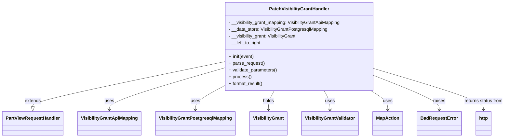

# Diagram: partview_core/partview_service/partview_service/api/visibility_grant/handler/PatchVisibilityGrantHandler.py


> Auto-generated by Obscura crawlers

## Diagram 1



### SVG

<svg id="container" width="1725.3359375" xmlns="http://www.w3.org/2000/svg" class="classDiagram" height="486" viewBox="0 0 1725.3359375 486" role="graphics-document document" aria-roledescription="class"><style>#container{font-family:"trebuchet ms",verdana,arial,sans-serif;font-size:16px;fill:#333;}@keyframes edge-animation-frame{from{stroke-dashoffset:0;}}@keyframes dash{to{stroke-dashoffset:0;}}#container .edge-animation-slow{stroke-dasharray:9,5!important;stroke-dashoffset:900;animation:dash 50s linear infinite;stroke-linecap:round;}#container .edge-animation-fast{stroke-dasharray:9,5!important;stroke-dashoffset:900;animation:dash 20s linear infinite;stroke-linecap:round;}#container .error-icon{fill:#552222;}#container .error-text{fill:#552222;stroke:#552222;}#container .edge-thickness-normal{stroke-width:1px;}#container .edge-thickness-thick{stroke-width:3.5px;}#container .edge-pattern-solid{stroke-dasharray:0;}#container .edge-thickness-invisible{stroke-width:0;fill:none;}#container .edge-pattern-dashed{stroke-dasharray:3;}#container .edge-pattern-dotted{stroke-dasharray:2;}#container .marker{fill:#333333;stroke:#333333;}#container .marker.cross{stroke:#333333;}#container svg{font-family:"trebuchet ms",verdana,arial,sans-serif;font-size:16px;}#container p{margin:0;}#container g.classGroup text{fill:#9370DB;stroke:none;font-family:"trebuchet ms",verdana,arial,sans-serif;font-size:10px;}#container g.classGroup text .title{font-weight:bolder;}#container .nodeLabel,#container .edgeLabel{color:#131300;}#container .edgeLabel .label rect{fill:#ECECFF;}#container .label text{fill:#131300;}#container .labelBkg{background:#ECECFF;}#container .edgeLabel .label span{background:#ECECFF;}#container .classTitle{font-weight:bolder;}#container .node rect,#container .node circle,#container .node ellipse,#container .node polygon,#container .node path{fill:#ECECFF;stroke:#9370DB;stroke-width:1px;}#container .divider{stroke:#9370DB;stroke-width:1;}#container g.clickable{cursor:pointer;}#container g.classGroup rect{fill:#ECECFF;stroke:#9370DB;}#container g.classGroup line{stroke:#9370DB;stroke-width:1;}#container .classLabel .box{stroke:none;stroke-width:0;fill:#ECECFF;opacity:0.5;}#container .classLabel .label{fill:#9370DB;font-size:10px;}#container .relation{stroke:#333333;stroke-width:1;fill:none;}#container .dashed-line{stroke-dasharray:3;}#container .dotted-line{stroke-dasharray:1 2;}#container #compositionStart,#container .composition{fill:#333333!important;stroke:#333333!important;stroke-width:1;}#container #compositionEnd,#container .composition{fill:#333333!important;stroke:#333333!important;stroke-width:1;}#container #dependencyStart,#container .dependency{fill:#333333!important;stroke:#333333!important;stroke-width:1;}#container #dependencyStart,#container .dependency{fill:#333333!important;stroke:#333333!important;stroke-width:1;}#container #extensionStart,#container .extension{fill:transparent!important;stroke:#333333!important;stroke-width:1;}#container #extensionEnd,#container .extension{fill:transparent!important;stroke:#333333!important;stroke-width:1;}#container #aggregationStart,#container .aggregation{fill:transparent!important;stroke:#333333!important;stroke-width:1;}#container #aggregationEnd,#container .aggregation{fill:transparent!important;stroke:#333333!important;stroke-width:1;}#container #lollipopStart,#container .lollipop{fill:#ECECFF!important;stroke:#333333!important;stroke-width:1;}#container #lollipopEnd,#container .lollipop{fill:#ECECFF!important;stroke:#333333!important;stroke-width:1;}#container .edgeTerminals{font-size:11px;line-height:initial;}#container .classTitleText{text-anchor:middle;font-size:18px;fill:#333;}#container .label-icon{display:inline-block;height:1em;overflow:visible;vertical-align:-0.125em;}#container .node .label-icon path{fill:currentColor;stroke:revert;stroke-width:revert;}#container :root{--mermaid-font-family:"trebuchet ms",verdana,arial,sans-serif;}</style><g><defs><marker id="container_class-aggregationStart" class="marker aggregation class" refX="18" refY="7" markerWidth="190" markerHeight="240" orient="auto"><path d="M 18,7 L9,13 L1,7 L9,1 Z"></path></marker></defs><defs><marker id="container_class-aggregationEnd" class="marker aggregation class" refX="1" refY="7" markerWidth="20" markerHeight="28" orient="auto"><path d="M 18,7 L9,13 L1,7 L9,1 Z"></path></marker></defs><defs><marker id="container_class-extensionStart" class="marker extension class" refX="18" refY="7" markerWidth="190" markerHeight="240" orient="auto"><path d="M 1,7 L18,13 V 1 Z"></path></marker></defs><defs><marker id="container_class-extensionEnd" class="marker extension class" refX="1" refY="7" markerWidth="20" markerHeight="28" orient="auto"><path d="M 1,1 V 13 L18,7 Z"></path></marker></defs><defs><marker id="container_class-compositionStart" class="marker composition class" refX="18" refY="7" markerWidth="190" markerHeight="240" orient="auto"><path d="M 18,7 L9,13 L1,7 L9,1 Z"></path></marker></defs><defs><marker id="container_class-compositionEnd" class="marker composition class" refX="1" refY="7" markerWidth="20" markerHeight="28" orient="auto"><path d="M 18,7 L9,13 L1,7 L9,1 Z"></path></marker></defs><defs><marker id="container_class-dependencyStart" class="marker dependency class" refX="6" refY="7" markerWidth="190" markerHeight="240" orient="auto"><path d="M 5,7 L9,13 L1,7 L9,1 Z"></path></marker></defs><defs><marker id="container_class-dependencyEnd" class="marker dependency class" refX="13" refY="7" markerWidth="20" markerHeight="28" orient="auto"><path d="M 18,7 L9,13 L14,7 L9,1 Z"></path></marker></defs><defs><marker id="container_class-lollipopStart" class="marker lollipop class" refX="13" refY="7" markerWidth="190" markerHeight="240" orient="auto"><circle stroke="black" fill="transparent" cx="7" cy="7" r="6"></circle></marker></defs><defs><marker id="container_class-lollipopEnd" class="marker lollipop class" refX="1" refY="7" markerWidth="190" markerHeight="240" orient="auto"><circle stroke="black" fill="transparent" cx="7" cy="7" r="6"></circle></marker></defs><g class="root"><g class="clusters"></g><g class="edgePaths"><path d="M754.367,220.038L647.199,242.865C540.031,265.692,325.695,311.346,218.527,337.465C111.359,363.583,111.359,370.167,111.359,373.458L111.359,376.75" id="id_PatchVisibilityGrantHandler_PartViewRequestHandler_1" class="edge-thickness-normal edge-pattern-solid relation" style=";;;" data-edge="true" data-et="edge" data-id="id_PatchVisibilityGrantHandler_PartViewRequestHandler_1" data-points="W3sieCI6NzU0LjM2NzE4NzUsInkiOjIyMC4wMzc4OTQ0NjQ1NjI4NH0seyJ4IjoxMTEuMzU5Mzc1LCJ5IjozNTd9LHsieCI6MTExLjM1OTM3NSwieSI6Mzk0fV0=" marker-end="url(#container_class-extensionEnd)"></path><path d="M754.367,242.66L690.63,261.717C626.893,280.773,499.419,318.887,435.682,343.11C371.945,367.333,371.945,377.667,371.945,382.833L371.945,388" id="id_PatchVisibilityGrantHandler_VisibilityGrantApiMapping_2" class="edge-thickness-normal edge-pattern-solid relation" style=";;;" data-edge="true" data-et="edge" data-id="id_PatchVisibilityGrantHandler_VisibilityGrantApiMapping_2" data-points="W3sieCI6NzU0LjM2NzE4NzUsInkiOjI0Mi42NTk5MDkyMjg0NDE3M30seyJ4IjozNzEuOTQ1MzEyNSwieSI6MzU3fSx7IngiOjM3MS45NDUzMTI1LCJ5IjozOTR9XQ==" marker-end="url(#container_class-dependencyEnd)"></path><path d="M754.367,307.472L739.23,315.727C724.094,323.981,693.82,340.491,678.684,353.912C663.547,367.333,663.547,377.667,663.547,382.833L663.547,388" id="id_PatchVisibilityGrantHandler_VisibilityGrantPostgresqlMapping_3" class="edge-thickness-normal edge-pattern-solid relation" style=";;;" data-edge="true" data-et="edge" data-id="id_PatchVisibilityGrantHandler_VisibilityGrantPostgresqlMapping_3" data-points="W3sieCI6NzU0LjM2NzE4NzUsInkiOjMwNy40NzE4NTQzMDQ2MzU3N30seyJ4Ijo2NjMuNTQ2ODc1LCJ5IjozNTd9LHsieCI6NjYzLjU0Njg3NSwieSI6Mzk0fV0=" marker-end="url(#container_class-dependencyEnd)"></path><path d="M932.128,320L928.755,326.167C925.382,332.333,918.636,344.667,915.264,356C911.891,367.333,911.891,377.667,911.891,382.833L911.891,388" id="id_PatchVisibilityGrantHandler_VisibilityGrant_4" class="edge-thickness-normal edge-pattern-solid relation" style=";;;" data-edge="true" data-et="edge" data-id="id_PatchVisibilityGrantHandler_VisibilityGrant_4" data-points="W3sieCI6OTMyLjEyNzk5NTQ2NjMyMTIsInkiOjMyMH0seyJ4Ijo5MTEuODkwNjI1LCJ5IjozNTd9LHsieCI6OTExLjg5MDYyNSwieSI6Mzk0fV0=" marker-end="url(#container_class-dependencyEnd)"></path><path d="M1102.778,320L1106.151,326.167C1109.524,332.333,1116.27,344.667,1119.643,356C1123.016,367.333,1123.016,377.667,1123.016,382.833L1123.016,388" id="id_PatchVisibilityGrantHandler_VisibilityGrantValidator_5" class="edge-thickness-normal edge-pattern-solid relation" style=";;;" data-edge="true" data-et="edge" data-id="id_PatchVisibilityGrantHandler_VisibilityGrantValidator_5" data-points="W3sieCI6MTEwMi43NzgyNTQ1MzM2Nzg4LCJ5IjozMjB9LHsieCI6MTEyMy4wMTU2MjUsInkiOjM1N30seyJ4IjoxMTIzLjAxNTYyNSwieSI6Mzk0fV0=" marker-end="url(#container_class-dependencyEnd)"></path><path d="M1262.649,320L1272.342,326.167C1282.034,332.333,1301.42,344.667,1311.112,356C1320.805,367.333,1320.805,377.667,1320.805,382.833L1320.805,388" id="id_PatchVisibilityGrantHandler_MapAction_6" class="edge-thickness-normal edge-pattern-solid relation" style=";;;" data-edge="true" data-et="edge" data-id="id_PatchVisibilityGrantHandler_MapAction_6" data-points="W3sieCI6MTI2Mi42NDkyMDY2MDYyMTc2LCJ5IjozMjB9LHsieCI6MTMyMC44MDQ2ODc1LCJ5IjozNTd9LHsieCI6MTMyMC44MDQ2ODc1LCJ5IjozOTR9XQ==" marker-end="url(#container_class-dependencyEnd)"></path><path d="M1280.539,270.166L1316.402,284.638C1352.266,299.111,1423.992,328.055,1459.855,347.694C1495.719,367.333,1495.719,377.667,1495.719,382.833L1495.719,388" id="id_PatchVisibilityGrantHandler_BadRequestError_7" class="edge-thickness-normal edge-pattern-solid relation" style=";;;" data-edge="true" data-et="edge" data-id="id_PatchVisibilityGrantHandler_BadRequestError_7" data-points="W3sieCI6MTI4MC41MzkwNjI1LCJ5IjoyNzAuMTY2MDc4NjA0MzMyMDN9LHsieCI6MTQ5NS43MTg3NSwieSI6MzU3fSx7IngiOjE0OTUuNzE4NzUsInkiOjM5NH1d" marker-end="url(#container_class-dependencyEnd)"></path><path d="M1280.539,244.581L1341.711,263.318C1402.883,282.054,1525.227,319.527,1586.398,343.43C1647.57,367.333,1647.57,377.667,1647.57,382.833L1647.57,388" id="id_PatchVisibilityGrantHandler_http_8" class="edge-thickness-normal edge-pattern-solid relation" style=";;;" data-edge="true" data-et="edge" data-id="id_PatchVisibilityGrantHandler_http_8" data-points="W3sieCI6MTI4MC41MzkwNjI1LCJ5IjoyNDQuNTgxMTc5MDk2MTUwMjd9LHsieCI6MTY0Ny41NzAzMTI1LCJ5IjozNTd9LHsieCI6MTY0Ny41NzAzMTI1LCJ5IjozOTR9XQ==" marker-end="url(#container_class-dependencyEnd)"></path></g><g class="edgeLabels"><g class="edgeLabel" transform="translate(111.359375, 357)"><g class="label" data-id="id_PatchVisibilityGrantHandler_PartViewRequestHandler_1" transform="translate(-28.5078125, -12)"><foreignObject width="57.015625" height="24"><div xmlns="http://www.w3.org/1999/xhtml" class="labelBkg" style="display: table-cell; white-space: nowrap; line-height: 1.5; max-width: 200px; text-align: center;"><span class="edgeLabel"><p>extends</p></span></div></foreignObject></g></g><g class="edgeLabel" transform="translate(371.9453125, 357)"><g class="label" data-id="id_PatchVisibilityGrantHandler_VisibilityGrantApiMapping_2" transform="translate(-16.4921875, -12)"><foreignObject width="32.984375" height="24"><div xmlns="http://www.w3.org/1999/xhtml" class="labelBkg" style="display: table-cell; white-space: nowrap; line-height: 1.5; max-width: 200px; text-align: center;"><span class="edgeLabel"><p>uses</p></span></div></foreignObject></g></g><g class="edgeLabel" transform="translate(663.546875, 357)"><g class="label" data-id="id_PatchVisibilityGrantHandler_VisibilityGrantPostgresqlMapping_3" transform="translate(-16.4921875, -12)"><foreignObject width="32.984375" height="24"><div xmlns="http://www.w3.org/1999/xhtml" class="labelBkg" style="display: table-cell; white-space: nowrap; line-height: 1.5; max-width: 200px; text-align: center;"><span class="edgeLabel"><p>uses</p></span></div></foreignObject></g></g><g class="edgeLabel" transform="translate(911.890625, 357)"><g class="label" data-id="id_PatchVisibilityGrantHandler_VisibilityGrant_4" transform="translate(-20.1875, -12)"><foreignObject width="40.375" height="24"><div xmlns="http://www.w3.org/1999/xhtml" class="labelBkg" style="display: table-cell; white-space: nowrap; line-height: 1.5; max-width: 200px; text-align: center;"><span class="edgeLabel"><p>holds</p></span></div></foreignObject></g></g><g class="edgeLabel" transform="translate(1123.015625, 357)"><g class="label" data-id="id_PatchVisibilityGrantHandler_VisibilityGrantValidator_5" transform="translate(-16.4921875, -12)"><foreignObject width="32.984375" height="24"><div xmlns="http://www.w3.org/1999/xhtml" class="labelBkg" style="display: table-cell; white-space: nowrap; line-height: 1.5; max-width: 200px; text-align: center;"><span class="edgeLabel"><p>uses</p></span></div></foreignObject></g></g><g class="edgeLabel" transform="translate(1320.8046875, 357)"><g class="label" data-id="id_PatchVisibilityGrantHandler_MapAction_6" transform="translate(-16.4921875, -12)"><foreignObject width="32.984375" height="24"><div xmlns="http://www.w3.org/1999/xhtml" class="labelBkg" style="display: table-cell; white-space: nowrap; line-height: 1.5; max-width: 200px; text-align: center;"><span class="edgeLabel"><p>uses</p></span></div></foreignObject></g></g><g class="edgeLabel" transform="translate(1495.71875, 357)"><g class="label" data-id="id_PatchVisibilityGrantHandler_BadRequestError_7" transform="translate(-21.25, -12)"><foreignObject width="42.5" height="24"><div xmlns="http://www.w3.org/1999/xhtml" class="labelBkg" style="display: table-cell; white-space: nowrap; line-height: 1.5; max-width: 200px; text-align: center;"><span class="edgeLabel"><p>raises</p></span></div></foreignObject></g></g><g class="edgeLabel" transform="translate(1647.5703125, 357)"><g class="label" data-id="id_PatchVisibilityGrantHandler_http_8" transform="translate(-69.765625, -12)"><foreignObject width="139.53125" height="24"><div xmlns="http://www.w3.org/1999/xhtml" class="labelBkg" style="display: table-cell; white-space: nowrap; line-height: 1.5; max-width: 200px; text-align: center;"><span class="edgeLabel"><p>returns status from</p></span></div></foreignObject></g></g></g><g class="nodes"><g class="node default" id="classId-PatchVisibilityGrantHandler-0" transform="translate(1017.453125, 164)"><g class="basic label-container"><path d="M-263.0859375 -156 L263.0859375 -156 L263.0859375 156 L-263.0859375 156" stroke="none" stroke-width="0" fill="#ECECFF" style=""></path><path d="M-263.0859375 -156 C-101.48413388417052 -156, 60.117669731658964 -156, 263.0859375 -156 M-263.0859375 -156 C-155.14838893217376 -156, -47.21084036434755 -156, 263.0859375 -156 M263.0859375 -156 C263.0859375 -51.61360150682967, 263.0859375 52.772796986340666, 263.0859375 156 M263.0859375 -156 C263.0859375 -65.56941737387724, 263.0859375 24.861165252245513, 263.0859375 156 M263.0859375 156 C135.12859039523045 156, 7.171243290460893 156, -263.0859375 156 M263.0859375 156 C143.43046762051333 156, 23.774997741026652 156, -263.0859375 156 M-263.0859375 156 C-263.0859375 82.32679512248063, -263.0859375 8.653590244961265, -263.0859375 -156 M-263.0859375 156 C-263.0859375 62.33270932701119, -263.0859375 -31.334581345977625, -263.0859375 -156" stroke="#9370DB" stroke-width="1.3" fill="none" stroke-dasharray="0 0" style=""></path></g><g class="annotation-group text" transform="translate(0, -132)"></g><g class="label-group text" transform="translate(-101.21875, -132)"><g class="label" style="font-weight: bolder" transform="translate(0,-12)"><foreignObject width="202.4375" height="24"><div xmlns="http://www.w3.org/1999/xhtml" style="display: table-cell; white-space: nowrap; line-height: 1.5; max-width: 250px; text-align: center;"><span class="nodeLabel markdown-node-label" style=""><p>PatchVisibilityGrantHandler</p></span></div></foreignObject></g></g><g class="members-group text" transform="translate(-251.0859375, -84)"><g class="label" style="" transform="translate(0,-12)"><foreignObject width="400.953125" height="24"><div xmlns="http://www.w3.org/1999/xhtml" style="display: table-cell; white-space: nowrap; line-height: 1.5; max-width: 459px; text-align: center;"><span class="nodeLabel markdown-node-label" style=""><p>- __visibility_grant_mapping: VisibilityGrantApiMapping</p></span></div></foreignObject></g><g class="label" style="" transform="translate(0,12)"><foreignObject width="352.40625" height="24"><div xmlns="http://www.w3.org/1999/xhtml" style="display: table-cell; white-space: nowrap; line-height: 1.5; max-width: 410px; text-align: center;"><span class="nodeLabel markdown-node-label" style=""><p>- __data_store: VisibilityGrantPostgresqlMapping</p></span></div></foreignObject></g><g class="label" style="" transform="translate(0,36)"><foreignObject width="243.515625" height="24"><div xmlns="http://www.w3.org/1999/xhtml" style="display: table-cell; white-space: nowrap; line-height: 1.5; max-width: 301px; text-align: center;"><span class="nodeLabel markdown-node-label" style=""><p>- __visibility_grant: VisibilityGrant</p></span></div></foreignObject></g><g class="label" style="" transform="translate(0,60)"><foreignObject width="116.515625" height="24"><div xmlns="http://www.w3.org/1999/xhtml" style="display: table-cell; white-space: nowrap; line-height: 1.5; max-width: 174px; text-align: center;"><span class="nodeLabel markdown-node-label" style=""><p>- __left_to_right</p></span></div></foreignObject></g></g><g class="methods-group text" transform="translate(-251.0859375, 36)"><g class="label" style="" transform="translate(0,-12)"><foreignObject width="87.390625" height="24"><div xmlns="http://www.w3.org/1999/xhtml" style="display: table-cell; white-space: nowrap; line-height: 1.5; max-width: 177px; text-align: center;"><span class="nodeLabel markdown-node-label" style=""><p>+ <strong>init</strong>(event)</p></span></div></foreignObject></g><g class="label" style="" transform="translate(0,12)"><foreignObject width="126.046875" height="24"><div xmlns="http://www.w3.org/1999/xhtml" style="display: table-cell; white-space: nowrap; line-height: 1.5; max-width: 183px; text-align: center;"><span class="nodeLabel markdown-node-label" style=""><p>+ parse_request()</p></span></div></foreignObject></g><g class="label" style="" transform="translate(0,36)"><foreignObject width="170.953125" height="24"><div xmlns="http://www.w3.org/1999/xhtml" style="display: table-cell; white-space: nowrap; line-height: 1.5; max-width: 228px; text-align: center;"><span class="nodeLabel markdown-node-label" style=""><p>+ validate_parameters()</p></span></div></foreignObject></g><g class="label" style="" transform="translate(0,60)"><foreignObject width="77.96875" height="24"><div xmlns="http://www.w3.org/1999/xhtml" style="display: table-cell; white-space: nowrap; line-height: 1.5; max-width: 135px; text-align: center;"><span class="nodeLabel markdown-node-label" style=""><p>+ process()</p></span></div></foreignObject></g><g class="label" style="" transform="translate(0,84)"><foreignObject width="121.5" height="24"><div xmlns="http://www.w3.org/1999/xhtml" style="display: table-cell; white-space: nowrap; line-height: 1.5; max-width: 179px; text-align: center;"><span class="nodeLabel markdown-node-label" style=""><p>+ format_result()</p></span></div></foreignObject></g></g><g class="divider" style=""><path d="M-263.0859375 -108 C-60.05090507710048 -108, 142.98412734579904 -108, 263.0859375 -108 M-263.0859375 -108 C-58.23345628854142 -108, 146.61902492291716 -108, 263.0859375 -108" stroke="#9370DB" stroke-width="1.3" fill="none" stroke-dasharray="0 0" style=""></path></g><g class="divider" style=""><path d="M-263.0859375 12 C-101.22047367427587 12, 60.64499015144827 12, 263.0859375 12 M-263.0859375 12 C-88.9430219951171 12, 85.19989350976579 12, 263.0859375 12" stroke="#9370DB" stroke-width="1.3" fill="none" stroke-dasharray="0 0" style=""></path></g></g><g class="node default" id="classId-PartViewRequestHandler-1" transform="translate(111.359375, 436)"><g class="basic label-container"><path d="M-103.359375 -42 L103.359375 -42 L103.359375 42 L-103.359375 42" stroke="none" stroke-width="0" fill="#ECECFF" style=""></path><path d="M-103.359375 -42 C-54.664490552150305 -42, -5.96960610430061 -42, 103.359375 -42 M-103.359375 -42 C-34.35030744300853 -42, 34.658760113982936 -42, 103.359375 -42 M103.359375 -42 C103.359375 -21.253459847779542, 103.359375 -0.506919695559084, 103.359375 42 M103.359375 -42 C103.359375 -24.40544642748166, 103.359375 -6.8108928549633205, 103.359375 42 M103.359375 42 C27.9661763738294 42, -47.4270222523412 42, -103.359375 42 M103.359375 42 C34.38998211483316 42, -34.57941077033368 42, -103.359375 42 M-103.359375 42 C-103.359375 24.209226649491743, -103.359375 6.418453298983486, -103.359375 -42 M-103.359375 42 C-103.359375 13.949910142503846, -103.359375 -14.100179714992308, -103.359375 -42" stroke="#9370DB" stroke-width="1.3" fill="none" stroke-dasharray="0 0" style=""></path></g><g class="annotation-group text" transform="translate(0, -18)"></g><g class="label-group text" transform="translate(-91.359375, -18)"><g class="label" style="font-weight: bolder" transform="translate(0,-12)"><foreignObject width="182.71875" height="24"><div xmlns="http://www.w3.org/1999/xhtml" style="display: table-cell; white-space: nowrap; line-height: 1.5; max-width: 231px; text-align: center;"><span class="nodeLabel markdown-node-label" style=""><p>PartViewRequestHandler</p></span></div></foreignObject></g></g><g class="members-group text" transform="translate(-91.359375, 30)"></g><g class="methods-group text" transform="translate(-91.359375, 60)"></g><g class="divider" style=""><path d="M-103.359375 6 C-35.538464050738284 6, 32.28244689852343 6, 103.359375 6 M-103.359375 6 C-57.42491627947892 6, -11.490457558957843 6, 103.359375 6" stroke="#9370DB" stroke-width="1.3" fill="none" stroke-dasharray="0 0" style=""></path></g><g class="divider" style=""><path d="M-103.359375 24 C-57.99466771487748 24, -12.62996042975496 24, 103.359375 24 M-103.359375 24 C-29.541847252885617 24, 44.275680494228766 24, 103.359375 24" stroke="#9370DB" stroke-width="1.3" fill="none" stroke-dasharray="0 0" style=""></path></g></g><g class="node default" id="classId-VisibilityGrantApiMapping-2" transform="translate(371.9453125, 436)"><g class="basic label-container"><path d="M-107.2265625 -42 L107.2265625 -42 L107.2265625 42 L-107.2265625 42" stroke="none" stroke-width="0" fill="#ECECFF" style=""></path><path d="M-107.2265625 -42 C-54.90536249977449 -42, -2.584162499548981 -42, 107.2265625 -42 M-107.2265625 -42 C-21.83727760366891 -42, 63.55200729266218 -42, 107.2265625 -42 M107.2265625 -42 C107.2265625 -18.333141754172477, 107.2265625 5.333716491655046, 107.2265625 42 M107.2265625 -42 C107.2265625 -8.921979988420368, 107.2265625 24.156040023159264, 107.2265625 42 M107.2265625 42 C32.41511252322327 42, -42.39633745355346 42, -107.2265625 42 M107.2265625 42 C42.85354637735065 42, -21.519469745298693 42, -107.2265625 42 M-107.2265625 42 C-107.2265625 13.066947190972204, -107.2265625 -15.866105618055592, -107.2265625 -42 M-107.2265625 42 C-107.2265625 9.013975778844696, -107.2265625 -23.97204844231061, -107.2265625 -42" stroke="#9370DB" stroke-width="1.3" fill="none" stroke-dasharray="0 0" style=""></path></g><g class="annotation-group text" transform="translate(0, -18)"></g><g class="label-group text" transform="translate(-95.2265625, -18)"><g class="label" style="font-weight: bolder" transform="translate(0,-12)"><foreignObject width="190.453125" height="24"><div xmlns="http://www.w3.org/1999/xhtml" style="display: table-cell; white-space: nowrap; line-height: 1.5; max-width: 238px; text-align: center;"><span class="nodeLabel markdown-node-label" style=""><p>VisibilityGrantApiMapping</p></span></div></foreignObject></g></g><g class="members-group text" transform="translate(-95.2265625, 30)"></g><g class="methods-group text" transform="translate(-95.2265625, 60)"></g><g class="divider" style=""><path d="M-107.2265625 6 C-55.50968702985647 6, -3.792811559712945 6, 107.2265625 6 M-107.2265625 6 C-37.2214436410688 6, 32.783675217862395 6, 107.2265625 6" stroke="#9370DB" stroke-width="1.3" fill="none" stroke-dasharray="0 0" style=""></path></g><g class="divider" style=""><path d="M-107.2265625 24 C-58.69553230692975 24, -10.164502113859498 24, 107.2265625 24 M-107.2265625 24 C-41.81954762446588 24, 23.587467251068233 24, 107.2265625 24" stroke="#9370DB" stroke-width="1.3" fill="none" stroke-dasharray="0 0" style=""></path></g></g><g class="node default" id="classId-VisibilityGrantPostgresqlMapping-3" transform="translate(663.546875, 436)"><g class="basic label-container"><path d="M-134.375 -42 L134.375 -42 L134.375 42 L-134.375 42" stroke="none" stroke-width="0" fill="#ECECFF" style=""></path><path d="M-134.375 -42 C-42.6764405837223 -42, 49.02211883255541 -42, 134.375 -42 M-134.375 -42 C-41.46020566737529 -42, 51.45458866524942 -42, 134.375 -42 M134.375 -42 C134.375 -10.712815752774745, 134.375 20.57436849445051, 134.375 42 M134.375 -42 C134.375 -14.225849392418933, 134.375 13.548301215162134, 134.375 42 M134.375 42 C74.83305770669239 42, 15.291115413384759 42, -134.375 42 M134.375 42 C26.98877367945194 42, -80.39745264109612 42, -134.375 42 M-134.375 42 C-134.375 14.90630385722896, -134.375 -12.187392285542082, -134.375 -42 M-134.375 42 C-134.375 20.9132159263155, -134.375 -0.1735681473689965, -134.375 -42" stroke="#9370DB" stroke-width="1.3" fill="none" stroke-dasharray="0 0" style=""></path></g><g class="annotation-group text" transform="translate(0, -18)"></g><g class="label-group text" transform="translate(-122.375, -18)"><g class="label" style="font-weight: bolder" transform="translate(0,-12)"><foreignObject width="244.75" height="24"><div xmlns="http://www.w3.org/1999/xhtml" style="display: table-cell; white-space: nowrap; line-height: 1.5; max-width: 290px; text-align: center;"><span class="nodeLabel markdown-node-label" style=""><p>VisibilityGrantPostgresqlMapping</p></span></div></foreignObject></g></g><g class="members-group text" transform="translate(-122.375, 30)"></g><g class="methods-group text" transform="translate(-122.375, 60)"></g><g class="divider" style=""><path d="M-134.375 6 C-53.976683695631735 6, 26.42163260873653 6, 134.375 6 M-134.375 6 C-76.58267268846708 6, -18.790345376934184 6, 134.375 6" stroke="#9370DB" stroke-width="1.3" fill="none" stroke-dasharray="0 0" style=""></path></g><g class="divider" style=""><path d="M-134.375 24 C-69.48186109377582 24, -4.588722187551639 24, 134.375 24 M-134.375 24 C-31.377532603192734 24, 71.61993479361453 24, 134.375 24" stroke="#9370DB" stroke-width="1.3" fill="none" stroke-dasharray="0 0" style=""></path></g></g><g class="node default" id="classId-VisibilityGrant-4" transform="translate(911.890625, 436)"><g class="basic label-container"><path d="M-63.96875 -42 L63.96875 -42 L63.96875 42 L-63.96875 42" stroke="none" stroke-width="0" fill="#ECECFF" style=""></path><path d="M-63.96875 -42 C-14.289598264359803 -42, 35.389553471280394 -42, 63.96875 -42 M-63.96875 -42 C-34.28238621233095 -42, -4.596022424661896 -42, 63.96875 -42 M63.96875 -42 C63.96875 -19.771313681446625, 63.96875 2.457372637106751, 63.96875 42 M63.96875 -42 C63.96875 -18.090485094771083, 63.96875 5.819029810457835, 63.96875 42 M63.96875 42 C32.46472574880757 42, 0.9607014976151333 42, -63.96875 42 M63.96875 42 C23.31075014927268 42, -17.347249701454643 42, -63.96875 42 M-63.96875 42 C-63.96875 12.846141063627751, -63.96875 -16.307717872744497, -63.96875 -42 M-63.96875 42 C-63.96875 21.121081160716333, -63.96875 0.2421623214326658, -63.96875 -42" stroke="#9370DB" stroke-width="1.3" fill="none" stroke-dasharray="0 0" style=""></path></g><g class="annotation-group text" transform="translate(0, -18)"></g><g class="label-group text" transform="translate(-51.96875, -18)"><g class="label" style="font-weight: bolder" transform="translate(0,-12)"><foreignObject width="103.9375" height="24"><div xmlns="http://www.w3.org/1999/xhtml" style="display: table-cell; white-space: nowrap; line-height: 1.5; max-width: 152px; text-align: center;"><span class="nodeLabel markdown-node-label" style=""><p>VisibilityGrant</p></span></div></foreignObject></g></g><g class="members-group text" transform="translate(-51.96875, 30)"></g><g class="methods-group text" transform="translate(-51.96875, 60)"></g><g class="divider" style=""><path d="M-63.96875 6 C-17.318075416908265 6, 29.33259916618347 6, 63.96875 6 M-63.96875 6 C-23.128552660305473 6, 17.711644679389053 6, 63.96875 6" stroke="#9370DB" stroke-width="1.3" fill="none" stroke-dasharray="0 0" style=""></path></g><g class="divider" style=""><path d="M-63.96875 24 C-18.77561731789021 24, 26.417515364219582 24, 63.96875 24 M-63.96875 24 C-29.338968508643283 24, 5.290812982713433 24, 63.96875 24" stroke="#9370DB" stroke-width="1.3" fill="none" stroke-dasharray="0 0" style=""></path></g></g><g class="node default" id="classId-VisibilityGrantValidator-5" transform="translate(1123.015625, 436)"><g class="basic label-container"><path d="M-97.15625 -42 L97.15625 -42 L97.15625 42 L-97.15625 42" stroke="none" stroke-width="0" fill="#ECECFF" style=""></path><path d="M-97.15625 -42 C-31.195519290069527 -42, 34.76521141986095 -42, 97.15625 -42 M-97.15625 -42 C-30.94404093146329 -42, 35.26816813707342 -42, 97.15625 -42 M97.15625 -42 C97.15625 -15.155647670074497, 97.15625 11.688704659851005, 97.15625 42 M97.15625 -42 C97.15625 -21.431209441964693, 97.15625 -0.8624188839293865, 97.15625 42 M97.15625 42 C45.377969213617774 42, -6.400311572764451 42, -97.15625 42 M97.15625 42 C57.32332282103727 42, 17.490395642074546 42, -97.15625 42 M-97.15625 42 C-97.15625 20.36650883941195, -97.15625 -1.2669823211761013, -97.15625 -42 M-97.15625 42 C-97.15625 13.089648995068348, -97.15625 -15.820702009863304, -97.15625 -42" stroke="#9370DB" stroke-width="1.3" fill="none" stroke-dasharray="0 0" style=""></path></g><g class="annotation-group text" transform="translate(0, -18)"></g><g class="label-group text" transform="translate(-85.15625, -18)"><g class="label" style="font-weight: bolder" transform="translate(0,-12)"><foreignObject width="170.3125" height="24"><div xmlns="http://www.w3.org/1999/xhtml" style="display: table-cell; white-space: nowrap; line-height: 1.5; max-width: 218px; text-align: center;"><span class="nodeLabel markdown-node-label" style=""><p>VisibilityGrantValidator</p></span></div></foreignObject></g></g><g class="members-group text" transform="translate(-85.15625, 30)"></g><g class="methods-group text" transform="translate(-85.15625, 60)"></g><g class="divider" style=""><path d="M-97.15625 6 C-23.45175010322737 6, 50.25274979354526 6, 97.15625 6 M-97.15625 6 C-46.00797650981136 6, 5.140296980377286 6, 97.15625 6" stroke="#9370DB" stroke-width="1.3" fill="none" stroke-dasharray="0 0" style=""></path></g><g class="divider" style=""><path d="M-97.15625 24 C-41.26955186869504 24, 14.617146262609921 24, 97.15625 24 M-97.15625 24 C-48.87911121257778 24, -0.6019724251555658 24, 97.15625 24" stroke="#9370DB" stroke-width="1.3" fill="none" stroke-dasharray="0 0" style=""></path></g></g><g class="node default" id="classId-MapAction-6" transform="translate(1320.8046875, 436)"><g class="basic label-container"><path d="M-50.6328125 -42 L50.6328125 -42 L50.6328125 42 L-50.6328125 42" stroke="none" stroke-width="0" fill="#ECECFF" style=""></path><path d="M-50.6328125 -42 C-19.686352710793255 -42, 11.26010707841349 -42, 50.6328125 -42 M-50.6328125 -42 C-18.581297706239575 -42, 13.470217087520851 -42, 50.6328125 -42 M50.6328125 -42 C50.6328125 -12.616820741840726, 50.6328125 16.766358516318547, 50.6328125 42 M50.6328125 -42 C50.6328125 -8.962956557232985, 50.6328125 24.07408688553403, 50.6328125 42 M50.6328125 42 C21.17387713869714 42, -8.28505822260572 42, -50.6328125 42 M50.6328125 42 C10.145241793399528 42, -30.342328913200944 42, -50.6328125 42 M-50.6328125 42 C-50.6328125 13.019168489034282, -50.6328125 -15.961663021931436, -50.6328125 -42 M-50.6328125 42 C-50.6328125 12.399584851055167, -50.6328125 -17.200830297889667, -50.6328125 -42" stroke="#9370DB" stroke-width="1.3" fill="none" stroke-dasharray="0 0" style=""></path></g><g class="annotation-group text" transform="translate(0, -18)"></g><g class="label-group text" transform="translate(-38.6328125, -18)"><g class="label" style="font-weight: bolder" transform="translate(0,-12)"><foreignObject width="77.265625" height="24"><div xmlns="http://www.w3.org/1999/xhtml" style="display: table-cell; white-space: nowrap; line-height: 1.5; max-width: 126px; text-align: center;"><span class="nodeLabel markdown-node-label" style=""><p>MapAction</p></span></div></foreignObject></g></g><g class="members-group text" transform="translate(-38.6328125, 30)"></g><g class="methods-group text" transform="translate(-38.6328125, 60)"></g><g class="divider" style=""><path d="M-50.6328125 6 C-11.921035806729506 6, 26.790740886540988 6, 50.6328125 6 M-50.6328125 6 C-28.859316165929148 6, -7.085819831858295 6, 50.6328125 6" stroke="#9370DB" stroke-width="1.3" fill="none" stroke-dasharray="0 0" style=""></path></g><g class="divider" style=""><path d="M-50.6328125 24 C-25.917880815211692 24, -1.2029491304233844 24, 50.6328125 24 M-50.6328125 24 C-10.38812870520156 24, 29.85655508959688 24, 50.6328125 24" stroke="#9370DB" stroke-width="1.3" fill="none" stroke-dasharray="0 0" style=""></path></g></g><g class="node default" id="classId-BadRequestError-7" transform="translate(1495.71875, 436)"><g class="basic label-container"><path d="M-74.28125 -42 L74.28125 -42 L74.28125 42 L-74.28125 42" stroke="none" stroke-width="0" fill="#ECECFF" style=""></path><path d="M-74.28125 -42 C-22.831654489036247 -42, 28.617941021927507 -42, 74.28125 -42 M-74.28125 -42 C-23.677566678711237 -42, 26.926116642577526 -42, 74.28125 -42 M74.28125 -42 C74.28125 -14.863232141303598, 74.28125 12.273535717392804, 74.28125 42 M74.28125 -42 C74.28125 -14.730188154873026, 74.28125 12.539623690253947, 74.28125 42 M74.28125 42 C15.940578620334186 42, -42.40009275933163 42, -74.28125 42 M74.28125 42 C30.287155426307898 42, -13.706939147384205 42, -74.28125 42 M-74.28125 42 C-74.28125 14.346694726388066, -74.28125 -13.306610547223869, -74.28125 -42 M-74.28125 42 C-74.28125 16.292566653321174, -74.28125 -9.414866693357652, -74.28125 -42" stroke="#9370DB" stroke-width="1.3" fill="none" stroke-dasharray="0 0" style=""></path></g><g class="annotation-group text" transform="translate(0, -18)"></g><g class="label-group text" transform="translate(-62.28125, -18)"><g class="label" style="font-weight: bolder" transform="translate(0,-12)"><foreignObject width="124.5625" height="24"><div xmlns="http://www.w3.org/1999/xhtml" style="display: table-cell; white-space: nowrap; line-height: 1.5; max-width: 174px; text-align: center;"><span class="nodeLabel markdown-node-label" style=""><p>BadRequestError</p></span></div></foreignObject></g></g><g class="members-group text" transform="translate(-62.28125, 30)"></g><g class="methods-group text" transform="translate(-62.28125, 60)"></g><g class="divider" style=""><path d="M-74.28125 6 C-38.35584497722225 6, -2.430439954444495 6, 74.28125 6 M-74.28125 6 C-42.496240418104506 6, -10.711230836209005 6, 74.28125 6" stroke="#9370DB" stroke-width="1.3" fill="none" stroke-dasharray="0 0" style=""></path></g><g class="divider" style=""><path d="M-74.28125 24 C-30.47865193768395 24, 13.323946124632101 24, 74.28125 24 M-74.28125 24 C-18.093348002391124 24, 38.09455399521775 24, 74.28125 24" stroke="#9370DB" stroke-width="1.3" fill="none" stroke-dasharray="0 0" style=""></path></g></g><g class="node default" id="classId-http-8" transform="translate(1647.5703125, 436)"><g class="basic label-container"><path d="M-27.5703125 -42 L27.5703125 -42 L27.5703125 42 L-27.5703125 42" stroke="none" stroke-width="0" fill="#ECECFF" style=""></path><path d="M-27.5703125 -42 C-10.4607997990646 -42, 6.648712901870802 -42, 27.5703125 -42 M-27.5703125 -42 C-13.198117625939103 -42, 1.1740772481217938 -42, 27.5703125 -42 M27.5703125 -42 C27.5703125 -21.656460292544534, 27.5703125 -1.312920585089067, 27.5703125 42 M27.5703125 -42 C27.5703125 -17.126002408700035, 27.5703125 7.747995182599929, 27.5703125 42 M27.5703125 42 C12.258658565010371 42, -3.052995369979257 42, -27.5703125 42 M27.5703125 42 C10.98839882111482 42, -5.593514857770359 42, -27.5703125 42 M-27.5703125 42 C-27.5703125 15.922091507381776, -27.5703125 -10.155816985236449, -27.5703125 -42 M-27.5703125 42 C-27.5703125 8.436158533006676, -27.5703125 -25.127682933986648, -27.5703125 -42" stroke="#9370DB" stroke-width="1.3" fill="none" stroke-dasharray="0 0" style=""></path></g><g class="annotation-group text" transform="translate(0, -18)"></g><g class="label-group text" transform="translate(-15.5703125, -18)"><g class="label" style="font-weight: bolder" transform="translate(0,-12)"><foreignObject width="31.140625" height="24"><div xmlns="http://www.w3.org/1999/xhtml" style="display: table-cell; white-space: nowrap; line-height: 1.5; max-width: 80px; text-align: center;"><span class="nodeLabel markdown-node-label" style=""><p>http</p></span></div></foreignObject></g></g><g class="members-group text" transform="translate(-15.5703125, 30)"></g><g class="methods-group text" transform="translate(-15.5703125, 60)"></g><g class="divider" style=""><path d="M-27.5703125 6 C-14.54501991504296 6, -1.5197273300859209 6, 27.5703125 6 M-27.5703125 6 C-7.755081273763182 6, 12.060149952473637 6, 27.5703125 6" stroke="#9370DB" stroke-width="1.3" fill="none" stroke-dasharray="0 0" style=""></path></g><g class="divider" style=""><path d="M-27.5703125 24 C-11.766344846633457 24, 4.037622806733086 24, 27.5703125 24 M-27.5703125 24 C-9.519693797721768 24, 8.530924904556464 24, 27.5703125 24" stroke="#9370DB" stroke-width="1.3" fill="none" stroke-dasharray="0 0" style=""></path></g></g></g></g></g></svg>

## Diagram 2

```mermaid
flowchart TD
    PRS[parse_request()] --> VLD[validate_parameters()]
    VLD --> PRC[process()]
    PRC --> FMT[format_result()]
    parse_request_sub1[set __left_to_right mapping] --> parse_request_sub2[set dirty id,status]
    parse_request_sub2 --> parse_request_sub3[search datastore]
    parse_request_sub3 -->|not found| ERR[BadRequestError: "Record not found"]
    parse_request_sub3 -->|found| BODY[get_body() -> build entry dict]
    BODY --> APPLY[reset_field for each entry item]
    APPLY --> PRS
    PRS --> VLD
    PRC -->|if dirty fields| UPDATE[update datastore]
    UPDATE --> PRC
    FMT -->|MapAction.map_persistable_to_payload| PAYLOAD[return payload, http.HTTPStatus.OK.value]
```

> SVG rendering failed for this diagram.
