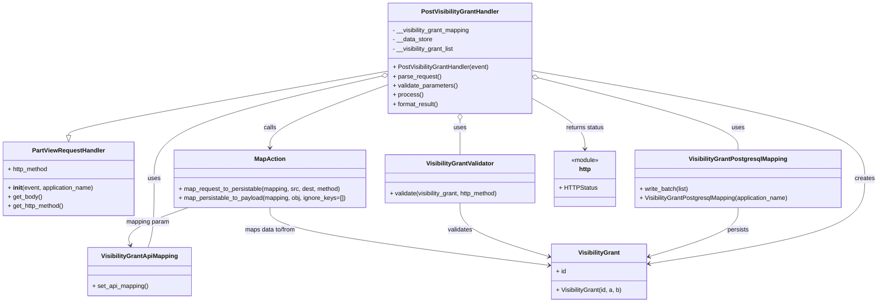

# Diagram: partview_core/partview_service/partview_service/api/visibility_grant/handler/PostVisibilityGrantHandler.py

> Auto-generated by Obscura crawlers

## Mermaid

### SVG

<svg id="container" width="2293.9375" xmlns="http://www.w3.org/2000/svg" class="classDiagram" height="788" viewBox="0 0 2293.9375 788" role="graphics-document document" aria-roledescription="class"><g><defs><marker id="container_class-aggregationStart" class="marker aggregation class" refX="18" refY="7" markerWidth="190" markerHeight="240" orient="auto"><path d="M 18,7 L9,13 L1,7 L9,1 Z"></path></marker></defs><defs><marker id="container_class-aggregationEnd" class="marker aggregation class" refX="1" refY="7" markerWidth="20" markerHeight="28" orient="auto"><path d="M 18,7 L9,13 L1,7 L9,1 Z"></path></marker></defs><defs><marker id="container_class-extensionStart" class="marker extension class" refX="18" refY="7" markerWidth="190" markerHeight="240" orient="auto"><path d="M 1,7 L18,13 V 1 Z"></path></marker></defs><defs><marker id="container_class-extensionEnd" class="marker extension class" refX="1" refY="7" markerWidth="20" markerHeight="28" orient="auto"><path d="M 1,1 V 13 L18,7 Z"></path></marker></defs><defs><marker id="container_class-compositionStart" class="marker composition class" refX="18" refY="7" markerWidth="190" markerHeight="240" orient="auto"><path d="M 18,7 L9,13 L1,7 L9,1 Z"></path></marker></defs><defs><marker id="container_class-compositionEnd" class="marker composition class" refX="1" refY="7" markerWidth="20" markerHeight="28" orient="auto"><path d="M 18,7 L9,13 L1,7 L9,1 Z"></path></marker></defs><defs><marker id="container_class-dependencyStart" class="marker dependency class" refX="6" refY="7" markerWidth="190" markerHeight="240" orient="auto"><path d="M 5,7 L9,13 L1,7 L9,1 Z"></path></marker></defs><defs><marker id="container_class-dependencyEnd" class="marker dependency class" refX="13" refY="7" markerWidth="20" markerHeight="28" orient="auto"><path d="M 18,7 L9,13 L14,7 L9,1 Z"></path></marker></defs><defs><marker id="container_class-lollipopStart" class="marker lollipop class" refX="13" refY="7" markerWidth="190" markerHeight="240" orient="auto"><circle stroke="black" fill="transparent" cx="7" cy="7" r="6"></circle></marker></defs><defs><marker id="container_class-lollipopEnd" class="marker lollipop class" refX="1" refY="7" markerWidth="190" markerHeight="240" orient="auto"><circle stroke="black" fill="transparent" cx="7" cy="7" r="6"></circle></marker></defs><g class="root"><g class="clusters"></g><g class="edgePaths"><path d="M1016.551,185.132L876.945,209.777C737.339,234.421,458.126,283.711,318.52,311.647C178.914,339.583,178.914,346.167,178.914,349.458L178.914,352.75" id="id_PostVisibilityGrantHandler_PartViewRequestHandler_1" class="edge-thickness-normal edge-pattern-solid relation" style=";;;" data-edge="true" data-et="edge" data-id="id_PostVisibilityGrantHandler_PartViewRequestHandler_1" data-points="W3sieCI6MTAxNi41NTA3ODEyNSwieSI6MTg1LjEzMTgyMjM3MjU4MTcyfSx7IngiOjE3OC45MTQwNjI1LCJ5IjozMzN9LHsieCI6MTc4LjkxNDA2MjUsInkiOjM3MH1d" marker-end="url(#container_class-extensionEnd)"></path><path d="M999.723,198.103L899.989,220.586C800.255,243.069,600.788,288.034,501.054,332.684C401.32,377.333,401.32,421.667,401.32,466C401.32,510.333,401.32,554.667,398.613,584.5C395.906,614.333,390.492,629.667,387.785,637.333L385.078,645" id="id_PostVisibilityGrantHandler_VisibilityGrantApiMapping_2" class="edge-thickness-normal edge-pattern-solid relation" style=";;;" data-edge="true" data-et="edge" data-id="id_PostVisibilityGrantHandler_VisibilityGrantApiMapping_2" data-points="W3sieCI6MTAxNi41NTA3ODEyNSwieSI6MTk0LjMwOTI5ODE2MTk2ODYzfSx7IngiOjQwMS4zMjAzMTI1LCJ5IjozMzN9LHsieCI6NDAxLjMyMDMxMjUsInkiOjQ2Nn0seyJ4Ijo0MDEuMzIwMzEyNSwieSI6NTk5fSx7IngiOjM4NS4wNzc1NTE2MDU1MDQ2LCJ5Ijo2NDV9XQ==" marker-start="url(#container_class-aggregationStart)"></path><path d="M1408.654,203.067L1495.339,224.723C1582.024,246.378,1755.395,289.689,1842.08,321.011C1928.766,352.333,1928.766,371.667,1928.766,381.333L1928.766,391" id="id_PostVisibilityGrantHandler_VisibilityGrantPostgresqlMapping_3" class="edge-thickness-normal edge-pattern-solid relation" style=";;;" data-edge="true" data-et="edge" data-id="id_PostVisibilityGrantHandler_VisibilityGrantPostgresqlMapping_3" data-points="W3sieCI6MTM5MS45MTc5Njg3NSwieSI6MTk4Ljg4NjQ5NDUwMDc1NDh9LHsieCI6MTkyOC43NjU2MjUsInkiOjMzM30seyJ4IjoxOTI4Ljc2NTYyNSwieSI6MzkxfV0=" marker-start="url(#container_class-aggregationStart)"></path><path d="M1204.234,313.25L1204.234,316.542C1204.234,319.833,1204.234,326.417,1204.234,341.375C1204.234,356.333,1204.234,379.667,1204.234,391.333L1204.234,403" id="id_PostVisibilityGrantHandler_VisibilityGrantValidator_4" class="edge-thickness-normal edge-pattern-solid relation" style=";;;" data-edge="true" data-et="edge" data-id="id_PostVisibilityGrantHandler_VisibilityGrantValidator_4" data-points="W3sieCI6MTIwNC4yMzQzNzUsInkiOjI5Nn0seyJ4IjoxMjA0LjIzNDM3NSwieSI6MzMzfSx7IngiOjEyMDQuMjM0Mzc1LCJ5Ijo0MDN9XQ==" marker-start="url(#container_class-aggregationStart)"></path><path d="M1016.551,219.857L964.395,238.714C912.238,257.571,807.926,295.286,755.77,322.81C703.613,350.333,703.613,367.667,703.613,376.333L703.613,385" id="id_PostVisibilityGrantHandler_MapAction_5" class="edge-thickness-normal edge-pattern-solid relation" style=";;;" data-edge="true" data-et="edge" data-id="id_PostVisibilityGrantHandler_MapAction_5" data-points="W3sieCI6MTAxNi41NTA3ODEyNSwieSI6MjE5Ljg1NzE2OTYwOTYyNTU0fSx7IngiOjcwMy42MTMyODEyNSwieSI6MzMzfSx7IngiOjcwMy42MTMyODEyNSwieSI6MzkxfV0=" marker-end="url(#container_class-dependencyEnd)"></path><path d="M1391.918,184.184L1536.559,208.986C1681.201,233.789,1970.483,283.395,2115.124,330.364C2259.766,377.333,2259.766,421.667,2259.766,466C2259.766,510.333,2259.766,554.667,2165.94,591.585C2072.114,628.504,1884.462,658.008,1790.636,672.76L1696.81,687.512" id="id_PostVisibilityGrantHandler_VisibilityGrant_6" class="edge-thickness-normal edge-pattern-solid relation" style=";;;" data-edge="true" data-et="edge" data-id="id_PostVisibilityGrantHandler_VisibilityGrant_6" data-points="W3sieCI6MTM5MS45MTc5Njg3NSwieSI6MTg0LjE4MzUzODM1NDUwMTZ9LHsieCI6MjI1OS43NjU2MjUsInkiOjMzM30seyJ4IjoyMjU5Ljc2NTYyNSwieSI6NDY2fSx7IngiOjIyNTkuNzY1NjI1LCJ5Ijo1OTl9LHsieCI6MTY5MC44ODI4MTI1LCJ5Ijo2ODguNDQzNjc2ODkxNTIzNH1d" marker-end="url(#container_class-dependencyEnd)"></path><path d="M1391.918,255.803L1415.181,268.669C1438.444,281.535,1484.97,307.268,1508.233,329.3C1531.496,351.333,1531.496,369.667,1531.496,378.833L1531.496,388" id="id_PostVisibilityGrantHandler_http_7" class="edge-thickness-normal edge-pattern-solid relation" style=";;;" data-edge="true" data-et="edge" data-id="id_PostVisibilityGrantHandler_http_7" data-points="W3sieCI6MTM5MS45MTc5Njg3NSwieSI6MjU1LjgwMjk0NTg0NTYxNzY0fSx7IngiOjE1MzEuNDk2MDkzNzUsInkiOjMzM30seyJ4IjoxNTMxLjQ5NjA5Mzc1LCJ5IjozOTR9XQ==" marker-end="url(#container_class-dependencyEnd)"></path><path d="M1928.766,541L1928.766,550.667C1928.766,560.333,1928.766,579.667,1890.076,600.974C1851.387,622.282,1774.007,645.564,1735.318,657.205L1696.628,668.846" id="id_VisibilityGrantPostgresqlMapping_VisibilityGrant_8" class="edge-thickness-normal edge-pattern-solid relation" style=";;;" data-edge="true" data-et="edge" data-id="id_VisibilityGrantPostgresqlMapping_VisibilityGrant_8" data-points="W3sieCI6MTkyOC43NjU2MjUsInkiOjU0MX0seyJ4IjoxOTI4Ljc2NTYyNSwieSI6NTk5fSx7IngiOjE2OTAuODgyODEyNSwieSI6NjcwLjU3NTE3NzkxNjc1NjV9XQ==" marker-end="url(#container_class-dependencyEnd)"></path><path d="M1204.234,529L1204.234,540.667C1204.234,552.333,1204.234,575.667,1242.924,598.974C1281.613,622.282,1358.993,645.564,1397.682,657.205L1436.372,668.846" id="id_VisibilityGrantValidator_VisibilityGrant_9" class="edge-thickness-normal edge-pattern-solid relation" style=";;;" data-edge="true" data-et="edge" data-id="id_VisibilityGrantValidator_VisibilityGrant_9" data-points="W3sieCI6MTIwNC4yMzQzNzUsInkiOjUyOX0seyJ4IjoxMjA0LjIzNDM3NSwieSI6NTk5fSx7IngiOjE0NDIuMTE3MTg3NSwieSI6NjcwLjU3NTE3NzkxNjc1NjV9XQ==" marker-end="url(#container_class-dependencyEnd)"></path><path d="M489.739,541L462.174,550.667C434.608,560.333,379.476,579.667,354.284,596.057C329.092,612.447,333.84,625.895,336.215,632.619L338.589,639.342" id="id_MapAction_VisibilityGrantApiMapping_10" class="edge-thickness-normal edge-pattern-solid relation" style=";;;" data-edge="true" data-et="edge" data-id="id_MapAction_VisibilityGrantApiMapping_10" data-points="W3sieCI6NDg5LjczOTQ4NTQzMjMzMDg3LCJ5Ijo1NDF9LHsieCI6MzI0LjM0Mzc1LCJ5Ijo1OTl9LHsieCI6MzQwLjU4NjUxMDg5NDQ5NTQsInkiOjY0NX1d" marker-end="url(#container_class-dependencyEnd)"></path><path d="M703.613,541L703.613,550.667C703.613,560.333,703.613,579.667,825.705,604.756C947.797,629.845,1191.981,660.691,1314.073,676.113L1436.164,691.536" id="id_MapAction_VisibilityGrant_11" class="edge-thickness-normal edge-pattern-solid relation" style=";;;" data-edge="true" data-et="edge" data-id="id_MapAction_VisibilityGrant_11" data-points="W3sieCI6NzAzLjYxMzI4MTI1LCJ5Ijo1NDF9LHsieCI6NzAzLjYxMzI4MTI1LCJ5Ijo1OTl9LHsieCI6MTQ0Mi4xMTcxODc1LCJ5Ijo2OTIuMjg3OTQxNTQ3OTQ3M31d" marker-end="url(#container_class-dependencyEnd)"></path></g><g class="edgeLabels"><g class="edgeLabel"><g class="label" data-id="id_PostVisibilityGrantHandler_PartViewRequestHandler_1" transform="translate(0, 0)"><foreignObject width="0" height="0">

</foreignObject></g></g><g class="edgeLabel" transform="translate(401.3203125, 466)"><g class="label" data-id="id_PostVisibilityGrantHandler_VisibilityGrantApiMapping_2" transform="translate(-16.4921875, -12)"><foreignObject width="32.984375" height="24">

uses

</foreignObject></g></g><g class="edgeLabel" transform="translate(1928.765625, 333)"><g class="label" data-id="id_PostVisibilityGrantHandler_VisibilityGrantPostgresqlMapping_3" transform="translate(-16.4921875, -12)"><foreignObject width="32.984375" height="24">

uses

</foreignObject></g></g><g class="edgeLabel" transform="translate(1204.234375, 333)"><g class="label" data-id="id_PostVisibilityGrantHandler_VisibilityGrantValidator_4" transform="translate(-16.4921875, -12)"><foreignObject width="32.984375" height="24">

uses

</foreignObject></g></g><g class="edgeLabel" transform="translate(703.61328125, 333)"><g class="label" data-id="id_PostVisibilityGrantHandler_MapAction_5" transform="translate(-16.4453125, -12)"><foreignObject width="32.890625" height="24">

calls

</foreignObject></g></g><g class="edgeLabel" transform="translate(2259.765625, 466)"><g class="label" data-id="id_PostVisibilityGrantHandler_VisibilityGrant_6" transform="translate(-26.171875, -12)"><foreignObject width="52.34375" height="24">

creates

</foreignObject></g></g><g class="edgeLabel" transform="translate(1531.49609375, 333)"><g class="label" data-id="id_PostVisibilityGrantHandler_http_7" transform="translate(-50.5859375, -12)"><foreignObject width="101.171875" height="24">

returns status

</foreignObject></g></g><g class="edgeLabel" transform="translate(1928.765625, 599)"><g class="label" data-id="id_VisibilityGrantPostgresqlMapping_VisibilityGrant_8" transform="translate(-28.4375, -12)"><foreignObject width="56.875" height="24">

persists

</foreignObject></g></g><g class="edgeLabel" transform="translate(1204.234375, 599)"><g class="label" data-id="id_VisibilityGrantValidator_VisibilityGrant_9" transform="translate(-32.6875, -12)"><foreignObject width="65.375" height="24">

validates

</foreignObject></g></g><g class="edgeLabel" transform="translate(384.02412, 578.07164)"><g class="label" data-id="id_MapAction_VisibilityGrantApiMapping_10" transform="translate(-56.9765625, -12)"><foreignObject width="113.953125" height="24">

mapping param

</foreignObject></g></g><g class="edgeLabel" transform="translate(703.61328125, 599)"><g class="label" data-id="id_MapAction_VisibilityGrant_11" transform="translate(-68.6796875, -12)"><foreignObject width="137.359375" height="24">

maps data to/from

</foreignObject></g></g></g><g class="nodes"><g class="node default" id="classId-PostVisibilityGrantHandler-0" transform="translate(1204.234375, 152)"><g class="basic label-container"><path d="M-187.68359375 -144 L187.68359375 -144 L187.68359375 144 L-187.68359375 144" stroke="none" stroke-width="0" fill="#ECECFF" style=""></path><path d="M-187.68359375 -144 C-63.18630675741359 -144, 61.31098023517282 -144, 187.68359375 -144 M-187.68359375 -144 C-47.279546709706864 -144, 93.12450033058627 -144, 187.68359375 -144 M187.68359375 -144 C187.68359375 -76.21902555322141, 187.68359375 -8.438051106442828, 187.68359375 144 M187.68359375 -144 C187.68359375 -37.20325701080938, 187.68359375 69.59348597838124, 187.68359375 144 M187.68359375 144 C89.05701989740972 144, -9.569553955180567 144, -187.68359375 144 M187.68359375 144 C84.312139789616 144, -19.059314170768005 144, -187.68359375 144 M-187.68359375 144 C-187.68359375 56.17401156254631, -187.68359375 -31.651976874907376, -187.68359375 -144 M-187.68359375 144 C-187.68359375 62.117744762759045, -187.68359375 -19.76451047448191, -187.68359375 -144" stroke="#9370DB" stroke-width="1.3" fill="none" stroke-dasharray="0 0" style=""></path></g><g class="annotation-group text" transform="translate(0, -120)"></g><g class="label-group text" transform="translate(-97.2421875, -120)"><g class="label" style="font-weight: bolder" transform="translate(0,-12)"><foreignObject width="194.484375" height="24">

PostVisibilityGrantHandler

</foreignObject></g></g><g class="members-group text" transform="translate(-175.68359375, -72)"><g class="label" style="" transform="translate(0,-12)"><foreignObject width="205.578125" height="24">

- __visibility_grant_mapping

</foreignObject></g><g class="label" style="" transform="translate(0,12)"><foreignObject width="104.578125" height="24">

- __data_store

</foreignObject></g><g class="label" style="" transform="translate(0,36)"><foreignObject width="164.234375" height="24">

- __visibility_grant_list

</foreignObject></g></g><g class="methods-group text" transform="translate(-175.68359375, 24)"><g class="label" style="" transform="translate(0,-12)"><foreignObject width="254.125" height="24">

+ PostVisibilityGrantHandler(event)

</foreignObject></g><g class="label" style="" transform="translate(0,12)"><foreignObject width="126.046875" height="24">

+ parse_request()

</foreignObject></g><g class="label" style="" transform="translate(0,36)"><foreignObject width="170.953125" height="24">

+ validate_parameters()

</foreignObject></g><g class="label" style="" transform="translate(0,60)"><foreignObject width="77.96875" height="24">

+ process()

</foreignObject></g><g class="label" style="" transform="translate(0,84)"><foreignObject width="121.5" height="24">

+ format_result()

</foreignObject></g></g><g class="divider" style=""><path d="M-187.68359375 -96 C-94.2841253483898 -96, -0.884656946779586 -96, 187.68359375 -96 M-187.68359375 -96 C-97.96882455943228 -96, -8.254055368864556 -96, 187.68359375 -96" stroke="#9370DB" stroke-width="1.3" fill="none" stroke-dasharray="0 0" style=""></path></g><g class="divider" style=""><path d="M-187.68359375 0 C-45.60646043798951 0, 96.47067287402098 0, 187.68359375 0 M-187.68359375 0 C-79.38161351830192 0, 28.920366713396163 0, 187.68359375 0" stroke="#9370DB" stroke-width="1.3" fill="none" stroke-dasharray="0 0" style=""></path></g></g><g class="node default" id="classId-PartViewRequestHandler-1" transform="translate(178.9140625, 466)"><g class="basic label-container"><path d="M-170.9140625 -96 L170.9140625 -96 L170.9140625 96 L-170.9140625 96" stroke="none" stroke-width="0" fill="#ECECFF" style=""></path><path d="M-170.9140625 -96 C-75.22846500357277 -96, 20.45713249285447 -96, 170.9140625 -96 M-170.9140625 -96 C-49.3938363289183 -96, 72.1263898421634 -96, 170.9140625 -96 M170.9140625 -96 C170.9140625 -33.306623278137934, 170.9140625 29.386753443724132, 170.9140625 96 M170.9140625 -96 C170.9140625 -38.66358136351154, 170.9140625 18.67283727297692, 170.9140625 96 M170.9140625 96 C40.93276832966211 96, -89.04852584067578 96, -170.9140625 96 M170.9140625 96 C44.53289745226756 96, -81.84826759546488 96, -170.9140625 96 M-170.9140625 96 C-170.9140625 33.86026059248967, -170.9140625 -28.279478815020667, -170.9140625 -96 M-170.9140625 96 C-170.9140625 57.002405034810565, -170.9140625 18.00481006962113, -170.9140625 -96" stroke="#9370DB" stroke-width="1.3" fill="none" stroke-dasharray="0 0" style=""></path></g><g class="annotation-group text" transform="translate(0, -72)"></g><g class="label-group text" transform="translate(-91.359375, -72)"><g class="label" style="font-weight: bolder" transform="translate(0,-12)"><foreignObject width="182.71875" height="24">

PartViewRequestHandler

</foreignObject></g></g><g class="members-group text" transform="translate(-158.9140625, -24)"><g class="label" style="" transform="translate(0,-12)"><foreignObject width="107.15625" height="24">

+ http_method

</foreignObject></g></g><g class="methods-group text" transform="translate(-158.9140625, 24)"><g class="label" style="" transform="translate(0,-12)"><foreignObject width="226.46875" height="24">

+ <strong>init</strong>(event, application_name)

</foreignObject></g><g class="label" style="" transform="translate(0,12)"><foreignObject width="89.765625" height="24">

+ get_body()

</foreignObject></g><g class="label" style="" transform="translate(0,36)"><foreignObject width="148.40625" height="24">

+ get_http_method()

</foreignObject></g></g><g class="divider" style=""><path d="M-170.9140625 -48 C-47.29001660047781 -48, 76.33402929904437 -48, 170.9140625 -48 M-170.9140625 -48 C-62.74616157236861 -48, 45.42173935526279 -48, 170.9140625 -48" stroke="#9370DB" stroke-width="1.3" fill="none" stroke-dasharray="0 0" style=""></path></g><g class="divider" style=""><path d="M-170.9140625 0 C-94.7680054468096 0, -18.621948393619192 0, 170.9140625 0 M-170.9140625 0 C-95.72456406349988 0, -20.535065626999767 0, 170.9140625 0" stroke="#9370DB" stroke-width="1.3" fill="none" stroke-dasharray="0 0" style=""></path></g></g><g class="node default" id="classId-VisibilityGrant-2" transform="translate(1566.5, 708)"><g class="basic label-container"><path d="M-124.3828125 -72 L124.3828125 -72 L124.3828125 72 L-124.3828125 72" stroke="none" stroke-width="0" fill="#ECECFF" style=""></path><path d="M-124.3828125 -72 C-45.686628800875084 -72, 33.00955489824983 -72, 124.3828125 -72 M-124.3828125 -72 C-72.12196110523388 -72, -19.861109710467773 -72, 124.3828125 -72 M124.3828125 -72 C124.3828125 -29.4187246532544, 124.3828125 13.162550693491198, 124.3828125 72 M124.3828125 -72 C124.3828125 -32.79955316667088, 124.3828125 6.400893666658234, 124.3828125 72 M124.3828125 72 C62.009228550763886 72, -0.3643553984722274 72, -124.3828125 72 M124.3828125 72 C48.54415623864779 72, -27.294500022704426 72, -124.3828125 72 M-124.3828125 72 C-124.3828125 14.544008143925957, -124.3828125 -42.911983712148086, -124.3828125 -72 M-124.3828125 72 C-124.3828125 25.422406992079452, -124.3828125 -21.155186015841096, -124.3828125 -72" stroke="#9370DB" stroke-width="1.3" fill="none" stroke-dasharray="0 0" style=""></path></g><g class="annotation-group text" transform="translate(0, -48)"></g><g class="label-group text" transform="translate(-51.96875, -48)"><g class="label" style="font-weight: bolder" transform="translate(0,-12)"><foreignObject width="103.9375" height="24">

VisibilityGrant

</foreignObject></g></g><g class="members-group text" transform="translate(-112.3828125, 0)"><g class="label" style="" transform="translate(0,-12)"><foreignObject width="26.3125" height="24">

+ id

</foreignObject></g></g><g class="methods-group text" transform="translate(-112.3828125, 48)"><g class="label" style="" transform="translate(0,-12)"><foreignObject width="172.796875" height="24">

+ VisibilityGrant(id, a, b)

</foreignObject></g></g><g class="divider" style=""><path d="M-124.3828125 -24 C-37.685741279007004 -24, 49.01132994198599 -24, 124.3828125 -24 M-124.3828125 -24 C-27.12366264733305 -24, 70.1354872053339 -24, 124.3828125 -24" stroke="#9370DB" stroke-width="1.3" fill="none" stroke-dasharray="0 0" style=""></path></g><g class="divider" style=""><path d="M-124.3828125 24 C-51.95082858090893 24, 20.481155338182134 24, 124.3828125 24 M-124.3828125 24 C-46.420161991709975 24, 31.54248851658005 24, 124.3828125 24" stroke="#9370DB" stroke-width="1.3" fill="none" stroke-dasharray="0 0" style=""></path></g></g><g class="node default" id="classId-VisibilityGrantApiMapping-3" transform="translate(362.83203125, 708)"><g class="basic label-container"><path d="M-133.23046875 -63 L133.23046875 -63 L133.23046875 63 L-133.23046875 63" stroke="none" stroke-width="0" fill="#ECECFF" style=""></path><path d="M-133.23046875 -63 C-72.87833824624661 -63, -12.526207742493213 -63, 133.23046875 -63 M-133.23046875 -63 C-44.503638396345835 -63, 44.22319195730833 -63, 133.23046875 -63 M133.23046875 -63 C133.23046875 -16.587245456342885, 133.23046875 29.82550908731423, 133.23046875 63 M133.23046875 -63 C133.23046875 -33.76811893194903, 133.23046875 -4.536237863898066, 133.23046875 63 M133.23046875 63 C38.234627491705695 63, -56.76121376658861 63, -133.23046875 63 M133.23046875 63 C46.99833972078159 63, -39.233789308436826 63, -133.23046875 63 M-133.23046875 63 C-133.23046875 26.98383757805493, -133.23046875 -9.032324843890137, -133.23046875 -63 M-133.23046875 63 C-133.23046875 16.22337819447729, -133.23046875 -30.553243611045417, -133.23046875 -63" stroke="#9370DB" stroke-width="1.3" fill="none" stroke-dasharray="0 0" style=""></path></g><g class="annotation-group text" transform="translate(0, -39)"></g><g class="label-group text" transform="translate(-95.2265625, -39)"><g class="label" style="font-weight: bolder" transform="translate(0,-12)"><foreignObject width="190.453125" height="24">

VisibilityGrantApiMapping

</foreignObject></g></g><g class="members-group text" transform="translate(-121.23046875, 9)"></g><g class="methods-group text" transform="translate(-121.23046875, 39)"><g class="label" style="" transform="translate(0,-12)"><foreignObject width="147.234375" height="24">

+ set_api_mapping()

</foreignObject></g></g><g class="divider" style=""><path d="M-133.23046875 -15 C-61.04249720596064 -15, 11.145474338078714 -15, 133.23046875 -15 M-133.23046875 -15 C-57.073758419047806 -15, 19.082951911904388 -15, 133.23046875 -15" stroke="#9370DB" stroke-width="1.3" fill="none" stroke-dasharray="0 0" style=""></path></g><g class="divider" style=""><path d="M-133.23046875 9 C-77.14704467791887 9, -21.063620605837727 9, 133.23046875 9 M-133.23046875 9 C-49.02342132842489 9, 35.183626093150224 9, 133.23046875 9" stroke="#9370DB" stroke-width="1.3" fill="none" stroke-dasharray="0 0" style=""></path></g></g><g class="node default" id="classId-VisibilityGrantPostgresqlMapping-4" transform="translate(1928.765625, 466)"><g class="basic label-container"><path d="M-269.828125 -75 L269.828125 -75 L269.828125 75 L-269.828125 75" stroke="none" stroke-width="0" fill="#ECECFF" style=""></path><path d="M-269.828125 -75 C-103.60001256926276 -75, 62.62809986147448 -75, 269.828125 -75 M-269.828125 -75 C-105.09246971263528 -75, 59.64318557472944 -75, 269.828125 -75 M269.828125 -75 C269.828125 -36.58010419894336, 269.828125 1.83979160211328, 269.828125 75 M269.828125 -75 C269.828125 -43.49512658101591, 269.828125 -11.99025316203182, 269.828125 75 M269.828125 75 C95.19372481131867 75, -79.44067537736265 75, -269.828125 75 M269.828125 75 C71.36960217285022 75, -127.08892065429956 75, -269.828125 75 M-269.828125 75 C-269.828125 28.193520523383924, -269.828125 -18.61295895323215, -269.828125 -75 M-269.828125 75 C-269.828125 32.087175811759025, -269.828125 -10.82564837648195, -269.828125 -75" stroke="#9370DB" stroke-width="1.3" fill="none" stroke-dasharray="0 0" style=""></path></g><g class="annotation-group text" transform="translate(0, -51)"></g><g class="label-group text" transform="translate(-122.375, -51)"><g class="label" style="font-weight: bolder" transform="translate(0,-12)"><foreignObject width="244.75" height="24">

VisibilityGrantPostgresqlMapping

</foreignObject></g></g><g class="members-group text" transform="translate(-257.828125, -3)"></g><g class="methods-group text" transform="translate(-257.828125, 27)"><g class="label" style="" transform="translate(0,-12)"><foreignObject width="130.078125" height="24">

+ write_batch(list)

</foreignObject></g><g class="label" style="" transform="translate(0,12)"><foreignObject width="393.28125" height="24">

+ VisibilityGrantPostgresqlMapping(application_name)

</foreignObject></g></g><g class="divider" style=""><path d="M-269.828125 -27 C-89.90606336543573 -27, 90.01599826912854 -27, 269.828125 -27 M-269.828125 -27 C-57.396025790523055 -27, 155.0360734189539 -27, 269.828125 -27" stroke="#9370DB" stroke-width="1.3" fill="none" stroke-dasharray="0 0" style=""></path></g><g class="divider" style=""><path d="M-269.828125 -3 C-116.6707608540766 -3, 36.48660329184679 -3, 269.828125 -3 M-269.828125 -3 C-94.78656578268956 -3, 80.25499343462087 -3, 269.828125 -3" stroke="#9370DB" stroke-width="1.3" fill="none" stroke-dasharray="0 0" style=""></path></g></g><g class="node default" id="classId-VisibilityGrantValidator-5" transform="translate(1204.234375, 466)"><g class="basic label-container"><path d="M-199.8203125 -63 L199.8203125 -63 L199.8203125 63 L-199.8203125 63" stroke="none" stroke-width="0" fill="#ECECFF" style=""></path><path d="M-199.8203125 -63 C-105.61853235885191 -63, -11.416752217703817 -63, 199.8203125 -63 M-199.8203125 -63 C-92.34151441135086 -63, 15.137283677298285 -63, 199.8203125 -63 M199.8203125 -63 C199.8203125 -18.019841967956722, 199.8203125 26.960316064086555, 199.8203125 63 M199.8203125 -63 C199.8203125 -28.744868164118124, 199.8203125 5.510263671763752, 199.8203125 63 M199.8203125 63 C76.61217265880744 63, -46.595967182385124 63, -199.8203125 63 M199.8203125 63 C51.2783087094889 63, -97.2636950810222 63, -199.8203125 63 M-199.8203125 63 C-199.8203125 32.13127101033305, -199.8203125 1.2625420206661033, -199.8203125 -63 M-199.8203125 63 C-199.8203125 20.76048905876405, -199.8203125 -21.479021882471898, -199.8203125 -63" stroke="#9370DB" stroke-width="1.3" fill="none" stroke-dasharray="0 0" style=""></path></g><g class="annotation-group text" transform="translate(0, -39)"></g><g class="label-group text" transform="translate(-85.15625, -39)"><g class="label" style="font-weight: bolder" transform="translate(0,-12)"><foreignObject width="170.3125" height="24">

VisibilityGrantValidator

</foreignObject></g></g><g class="members-group text" transform="translate(-187.8203125, 9)"></g><g class="methods-group text" transform="translate(-187.8203125, 39)"><g class="label" style="" transform="translate(0,-12)"><foreignObject width="290.484375" height="24">

+ validate(visibility_grant, http_method)

</foreignObject></g></g><g class="divider" style=""><path d="M-199.8203125 -15 C-86.00200152072007 -15, 27.816309458559857 -15, 199.8203125 -15 M-199.8203125 -15 C-112.52037016999947 -15, -25.220427839998933 -15, 199.8203125 -15" stroke="#9370DB" stroke-width="1.3" fill="none" stroke-dasharray="0 0" style=""></path></g><g class="divider" style=""><path d="M-199.8203125 9 C-71.89925627639805 9, 56.0217999472039 9, 199.8203125 9 M-199.8203125 9 C-42.799232173284025 9, 114.22184815343195 9, 199.8203125 9" stroke="#9370DB" stroke-width="1.3" fill="none" stroke-dasharray="0 0" style=""></path></g></g><g class="node default" id="classId-MapAction-6" transform="translate(703.61328125, 466)"><g class="basic label-container"><path d="M-250.80078125 -75 L250.80078125 -75 L250.80078125 75 L-250.80078125 75" stroke="none" stroke-width="0" fill="#ECECFF" style=""></path><path d="M-250.80078125 -75 C-140.32185595664257 -75, -29.84293066328513 -75, 250.80078125 -75 M-250.80078125 -75 C-50.866314663642356 -75, 149.0681519227153 -75, 250.80078125 -75 M250.80078125 -75 C250.80078125 -33.194937107836815, 250.80078125 8.610125784326371, 250.80078125 75 M250.80078125 -75 C250.80078125 -38.426087640737315, 250.80078125 -1.8521752814746293, 250.80078125 75 M250.80078125 75 C109.67662682188882 75, -31.447527606222366 75, -250.80078125 75 M250.80078125 75 C57.364243576492925 75, -136.07229409701415 75, -250.80078125 75 M-250.80078125 75 C-250.80078125 36.534938321830104, -250.80078125 -1.9301233563397915, -250.80078125 -75 M-250.80078125 75 C-250.80078125 15.907064609734448, -250.80078125 -43.185870780531104, -250.80078125 -75" stroke="#9370DB" stroke-width="1.3" fill="none" stroke-dasharray="0 0" style=""></path></g><g class="annotation-group text" transform="translate(0, -51)"></g><g class="label-group text" transform="translate(-38.6328125, -51)"><g class="label" style="font-weight: bolder" transform="translate(0,-12)"><foreignObject width="77.265625" height="24">

MapAction

</foreignObject></g></g><g class="members-group text" transform="translate(-238.80078125, -3)"></g><g class="methods-group text" transform="translate(-238.80078125, 27)"><g class="label" style="" transform="translate(0,-12)"><foreignObject width="426.421875" height="24">

+ map_request_to_persistable(mapping, src, dest, method)

</foreignObject></g><g class="label" style="" transform="translate(0,12)"><foreignObject width="438.96875" height="24">

+ map_persistable_to_payload(mapping, obj, ignore_keys=[])

</foreignObject></g></g><g class="divider" style=""><path d="M-250.80078125 -27 C-74.94755882404948 -27, 100.90566360190104 -27, 250.80078125 -27 M-250.80078125 -27 C-132.24212650390788 -27, -13.683471757815767 -27, 250.80078125 -27" stroke="#9370DB" stroke-width="1.3" fill="none" stroke-dasharray="0 0" style=""></path></g><g class="divider" style=""><path d="M-250.80078125 -3 C-132.64206318976005 -3, -14.483345129520103 -3, 250.80078125 -3 M-250.80078125 -3 C-113.7546712691584 -3, 23.291438711683213 -3, 250.80078125 -3" stroke="#9370DB" stroke-width="1.3" fill="none" stroke-dasharray="0 0" style=""></path></g></g><g class="node default" id="classId-http-7" transform="translate(1531.49609375, 466)"><g class="basic label-container"><path d="M-77.44140625 -72 L77.44140625 -72 L77.44140625 72 L-77.44140625 72" stroke="none" stroke-width="0" fill="#ECECFF" style=""></path><path d="M-77.44140625 -72 C-33.977057607361175 -72, 9.48729103527765 -72, 77.44140625 -72 M-77.44140625 -72 C-28.899498697694412 -72, 19.642408854611176 -72, 77.44140625 -72 M77.44140625 -72 C77.44140625 -39.625330188982325, 77.44140625 -7.25066037796465, 77.44140625 72 M77.44140625 -72 C77.44140625 -38.81896816950494, 77.44140625 -5.637936339009883, 77.44140625 72 M77.44140625 72 C39.91865336412197 72, 2.395900478243945 72, -77.44140625 72 M77.44140625 72 C35.80961158616969 72, -5.822183077660625 72, -77.44140625 72 M-77.44140625 72 C-77.44140625 23.445583406451902, -77.44140625 -25.108833187096195, -77.44140625 -72 M-77.44140625 72 C-77.44140625 27.88593507367478, -77.44140625 -16.22812985265044, -77.44140625 -72" stroke="#9370DB" stroke-width="1.3" fill="none" stroke-dasharray="0 0" style=""></path></g><g class="annotation-group text" transform="translate(-36.6015625, -48)"><g class="label" style="" transform="translate(0,-12)"><foreignObject width="73.203125" height="24">

«module»

</foreignObject></g></g><g class="label-group text" transform="translate(-15.5703125, -24)"><g class="label" style="font-weight: bolder" transform="translate(0,-12)"><foreignObject width="31.140625" height="24">

http

</foreignObject></g></g><g class="members-group text" transform="translate(-65.44140625, 24)"><g class="label" style="" transform="translate(0,-12)"><foreignObject width="94.28125" height="24">

+ HTTPStatus

</foreignObject></g></g><g class="methods-group text" transform="translate(-65.44140625, 72)"></g><g class="divider" style=""><path d="M-77.44140625 0 C-37.37105479563873 0, 2.6992966587225453 0, 77.44140625 0 M-77.44140625 0 C-32.22222709812902 0, 12.996952053741964 0, 77.44140625 0" stroke="#9370DB" stroke-width="1.3" fill="none" stroke-dasharray="0 0" style=""></path></g><g class="divider" style=""><path d="M-77.44140625 48 C-36.24503980312584 48, 4.951326643748317 48, 77.44140625 48 M-77.44140625 48 C-21.597226839341154 48, 34.24695257131769 48, 77.44140625 48" stroke="#9370DB" stroke-width="1.3" fill="none" stroke-dasharray="0 0" style=""></path></g></g></g></g></g></svg>
