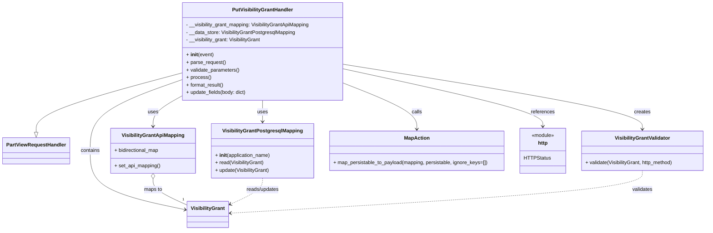

# Diagram: partview_core/partview_service/partview_service/api/visibility_grant/handler/PutVisibilityGrantHandler.py

> Auto-generated by Obscura crawlers

## Mermaid

### SVG

<svg id="container" width="2241.3671875" xmlns="http://www.w3.org/2000/svg" class="classDiagram" height="734" viewBox="0 0 2241.3671875 734" role="graphics-document document" aria-roledescription="class"><g><defs><marker id="container_class-aggregationStart" class="marker aggregation class" refX="18" refY="7" markerWidth="190" markerHeight="240" orient="auto"><path d="M 18,7 L9,13 L1,7 L9,1 Z"></path></marker></defs><defs><marker id="container_class-aggregationEnd" class="marker aggregation class" refX="1" refY="7" markerWidth="20" markerHeight="28" orient="auto"><path d="M 18,7 L9,13 L1,7 L9,1 Z"></path></marker></defs><defs><marker id="container_class-extensionStart" class="marker extension class" refX="18" refY="7" markerWidth="190" markerHeight="240" orient="auto"><path d="M 1,7 L18,13 V 1 Z"></path></marker></defs><defs><marker id="container_class-extensionEnd" class="marker extension class" refX="1" refY="7" markerWidth="20" markerHeight="28" orient="auto"><path d="M 1,1 V 13 L18,7 Z"></path></marker></defs><defs><marker id="container_class-compositionStart" class="marker composition class" refX="18" refY="7" markerWidth="190" markerHeight="240" orient="auto"><path d="M 18,7 L9,13 L1,7 L9,1 Z"></path></marker></defs><defs><marker id="container_class-compositionEnd" class="marker composition class" refX="1" refY="7" markerWidth="20" markerHeight="28" orient="auto"><path d="M 18,7 L9,13 L1,7 L9,1 Z"></path></marker></defs><defs><marker id="container_class-dependencyStart" class="marker dependency class" refX="6" refY="7" markerWidth="190" markerHeight="240" orient="auto"><path d="M 5,7 L9,13 L1,7 L9,1 Z"></path></marker></defs><defs><marker id="container_class-dependencyEnd" class="marker dependency class" refX="13" refY="7" markerWidth="20" markerHeight="28" orient="auto"><path d="M 18,7 L9,13 L14,7 L9,1 Z"></path></marker></defs><defs><marker id="container_class-lollipopStart" class="marker lollipop class" refX="13" refY="7" markerWidth="190" markerHeight="240" orient="auto"><circle stroke="black" fill="transparent" cx="7" cy="7" r="6"></circle></marker></defs><defs><marker id="container_class-lollipopEnd" class="marker lollipop class" refX="1" refY="7" markerWidth="190" markerHeight="240" orient="auto"><circle stroke="black" fill="transparent" cx="7" cy="7" r="6"></circle></marker></defs><g class="root"><g class="clusters"></g><g class="edgePaths"><path d="M566.008,234.067L490.233,254.556C414.458,275.045,262.909,316.022,187.134,347.303C111.359,378.583,111.359,400.167,111.359,410.958L111.359,421.75" id="id_PutVisibilityGrantHandler_PartViewRequestHandler_1" class="edge-thickness-normal edge-pattern-solid relation" style=";;;" data-edge="true" data-et="edge" data-id="id_PutVisibilityGrantHandler_PartViewRequestHandler_1" data-points="W3sieCI6NTY2LjAwNzgxMjUsInkiOjIzNC4wNjcxNzA4NzY5MzE4NH0seyJ4IjoxMTEuMzU5Mzc1LCJ5IjozNTd9LHsieCI6MTExLjM1OTM3NSwieSI6NDM5fV0=" marker-end="url(#container_class-extensionEnd)"></path><path d="M566.008,308.792L551.628,316.827C537.249,324.861,508.49,340.931,494.11,356.632C479.73,372.333,479.73,387.667,479.73,395.333L479.73,403" id="id_PutVisibilityGrantHandler_VisibilityGrantApiMapping_2" class="edge-thickness-normal edge-pattern-solid relation" style=";;;" data-edge="true" data-et="edge" data-id="id_PutVisibilityGrantHandler_VisibilityGrantApiMapping_2" data-points="W3sieCI6NTY2LjAwNzgxMjUsInkiOjMwOC43OTIwMTU4MzI2MjY1M30seyJ4Ijo0NzkuNzMwNDY4NzUsInkiOjM1N30seyJ4Ijo0NzkuNzMwNDY4NzUsInkiOjQwOX1d" marker-end="url(#container_class-dependencyEnd)"></path><path d="M825.141,320L825.141,326.167C825.141,332.333,825.141,344.667,825.141,356C825.141,367.333,825.141,377.667,825.141,382.833L825.141,388" id="id_PutVisibilityGrantHandler_VisibilityGrantPostgresqlMapping_3" class="edge-thickness-normal edge-pattern-solid relation" style=";;;" data-edge="true" data-et="edge" data-id="id_PutVisibilityGrantHandler_VisibilityGrantPostgresqlMapping_3" data-points="W3sieCI6ODI1LjE0MDYyNSwieSI6MzIwfSx7IngiOjgyNS4xNDA2MjUsInkiOjM1N30seyJ4Ijo4MjUuMTQwNjI1LCJ5IjozOTR9XQ==" marker-end="url(#container_class-dependencyEnd)"></path><path d="M566.008,255.845L518.441,272.704C470.875,289.564,375.742,323.282,328.176,360.808C280.609,398.333,280.609,439.667,280.609,481C280.609,522.333,280.609,563.667,330.941,595.027C381.272,626.387,481.935,647.775,532.266,658.468L582.598,669.162" id="id_PutVisibilityGrantHandler_VisibilityGrant_4" class="edge-thickness-normal edge-pattern-solid relation" style=";;;" data-edge="true" data-et="edge" data-id="id_PutVisibilityGrantHandler_VisibilityGrant_4" data-points="W3sieCI6NTY2LjAwNzgxMjUsInkiOjI1NS44NDUyOTQxMTc2NDcwNn0seyJ4IjoyODAuNjA5Mzc1LCJ5IjozNTd9LHsieCI6MjgwLjYwOTM3NSwieSI6NDgxfSx7IngiOjI4MC42MDkzNzUsInkiOjYwNX0seyJ4Ijo1ODguNDY2Nzk2ODc1LCJ5Ijo2NzAuNDA4ODg3NzIxNjAyMX1d" marker-end="url(#container_class-dependencyEnd)"></path><path d="M1084.273,205.299L1242.918,230.582C1401.563,255.866,1718.852,306.433,1877.496,340.883C2036.141,375.333,2036.141,393.667,2036.141,402.833L2036.141,412" id="id_PutVisibilityGrantHandler_VisibilityGrantValidator_5" class="edge-thickness-normal edge-pattern-solid relation" style=";;;" data-edge="true" data-et="edge" data-id="id_PutVisibilityGrantHandler_VisibilityGrantValidator_5" data-points="W3sieCI6MTA4NC4yNzM0Mzc1LCJ5IjoyMDUuMjk4NjIzMjk2ODYyMX0seyJ4IjoyMDM2LjE0MDYyNSwieSI6MzU3fSx7IngiOjIwMzYuMTQwNjI1LCJ5Ijo0MTh9XQ==" marker-end="url(#container_class-dependencyEnd)"></path><path d="M1084.273,265.725L1123.025,280.938C1161.777,296.15,1239.281,326.575,1278.033,350.954C1316.785,375.333,1316.785,393.667,1316.785,402.833L1316.785,412" id="id_PutVisibilityGrantHandler_MapAction_6" class="edge-thickness-normal edge-pattern-solid relation" style=";;;" data-edge="true" data-et="edge" data-id="id_PutVisibilityGrantHandler_MapAction_6" data-points="W3sieCI6MTA4NC4yNzM0Mzc1LCJ5IjoyNjUuNzI1MTg4ODk4ODY0NjR9LHsieCI6MTMxNi43ODUxNTYyNSwieSI6MzU3fSx7IngiOjEzMTYuNzg1MTU2MjUsInkiOjQxOH1d" marker-end="url(#container_class-dependencyEnd)"></path><path d="M1084.273,220.04L1189.825,242.867C1295.376,265.693,1506.479,311.347,1612.031,341.84C1717.582,372.333,1717.582,387.667,1717.582,395.333L1717.582,403" id="id_PutVisibilityGrantHandler_http_7" class="edge-thickness-normal edge-pattern-solid relation" style=";;;" data-edge="true" data-et="edge" data-id="id_PutVisibilityGrantHandler_http_7" data-points="W3sieCI6MTA4NC4yNzM0Mzc1LCJ5IjoyMjAuMDQwMjQyNDg3OTA4NDJ9LHsieCI6MTcxNy41ODIwMzEyNSwieSI6MzU3fSx7IngiOjE3MTcuNTgyMDMxMjUsInkiOjQwOX1d" marker-end="url(#container_class-dependencyEnd)"></path><path d="M479.73,570.25L479.73,576.042C479.73,581.833,479.73,593.417,497.853,607.498C515.976,621.58,552.221,638.159,570.344,646.449L588.467,654.739" id="id_VisibilityGrantApiMapping_VisibilityGrant_8" class="edge-thickness-normal edge-pattern-solid relation" style=";;;" data-edge="true" data-et="edge" data-id="id_VisibilityGrantApiMapping_VisibilityGrant_8" data-points="W3sieCI6NDc5LjczMDQ2ODc1LCJ5Ijo1NTN9LHsieCI6NDc5LjczMDQ2ODc1LCJ5Ijo2MDV9LHsieCI6NTg4LjQ2Njc5Njg3NSwieSI6NjU0LjczODk1MzkxNTc0Nzl9XQ==" marker-start="url(#container_class-aggregationStart)"></path><path d="M825.141,568L825.141,574.167C825.141,580.333,825.141,592.667,807.927,606.707C790.714,620.748,756.287,636.495,739.074,644.369L721.861,652.243" id="id_VisibilityGrantPostgresqlMapping_VisibilityGrant_9" class="edge-thickness-normal edge-pattern-dashed relation" style=";;;" data-edge="true" data-et="edge" data-id="id_VisibilityGrantPostgresqlMapping_VisibilityGrant_9" data-points="W3sieCI6ODI1LjE0MDYyNSwieSI6NTY4fSx7IngiOjgyNS4xNDA2MjUsInkiOjYwNX0seyJ4Ijo3MTYuNDA0Mjk2ODc1LCJ5Ijo2NTQuNzM4OTUzOTE1NzQ3OX1d" marker-end="url(#container_class-dependencyEnd)"></path><path d="M2036.141,544L2036.141,554.167C2036.141,564.333,2036.141,584.667,1817.183,607.334C1598.225,630.002,1160.31,655.004,941.352,667.505L722.395,680.006" id="id_VisibilityGrantValidator_VisibilityGrant_10" class="edge-thickness-normal edge-pattern-dashed relation" style=";;;" data-edge="true" data-et="edge" data-id="id_VisibilityGrantValidator_VisibilityGrant_10" data-points="W3sieCI6MjAzNi4xNDA2MjUsInkiOjU0NH0seyJ4IjoyMDM2LjE0MDYyNSwieSI6NjA1fSx7IngiOjcxNi40MDQyOTY4NzUsInkiOjY4MC4zNDc4MjYzMzI0Mzh9XQ==" marker-end="url(#container_class-dependencyEnd)"></path></g><g class="edgeLabels"><g class="edgeLabel"><g class="label" data-id="id_PutVisibilityGrantHandler_PartViewRequestHandler_1" transform="translate(0, 0)"><foreignObject width="0" height="0">

</foreignObject></g></g><g class="edgeLabel" transform="translate(479.73046875, 357)"><g class="label" data-id="id_PutVisibilityGrantHandler_VisibilityGrantApiMapping_2" transform="translate(-16.4921875, -12)"><foreignObject width="32.984375" height="24">

uses

</foreignObject></g></g><g class="edgeLabel" transform="translate(825.140625, 357)"><g class="label" data-id="id_PutVisibilityGrantHandler_VisibilityGrantPostgresqlMapping_3" transform="translate(-16.4921875, -12)"><foreignObject width="32.984375" height="24">

uses

</foreignObject></g></g><g class="edgeLabel" transform="translate(280.609375, 481)"><g class="label" data-id="id_PutVisibilityGrantHandler_VisibilityGrant_4" transform="translate(-30.890625, -12)"><foreignObject width="61.78125" height="24">

contains

</foreignObject></g></g><g class="edgeLabel" transform="translate(2036.140625, 357)"><g class="label" data-id="id_PutVisibilityGrantHandler_VisibilityGrantValidator_5" transform="translate(-26.171875, -12)"><foreignObject width="52.34375" height="24">

creates

</foreignObject></g></g><g class="edgeLabel" transform="translate(1316.78515625, 357)"><g class="label" data-id="id_PutVisibilityGrantHandler_MapAction_6" transform="translate(-16.4453125, -12)"><foreignObject width="32.890625" height="24">

calls

</foreignObject></g></g><g class="edgeLabel" transform="translate(1717.58203125, 357)"><g class="label" data-id="id_PutVisibilityGrantHandler_http_7" transform="translate(-37.828125, -12)"><foreignObject width="75.65625" height="24">

references

</foreignObject></g></g><g class="edgeLabel" transform="translate(479.73046875, 605)"><g class="label" data-id="id_VisibilityGrantApiMapping_VisibilityGrant_8" transform="translate(-29.2578125, -12)"><foreignObject width="58.515625" height="24">

maps to

</foreignObject></g></g><g class="edgeLabel" transform="translate(825.140625, 605)"><g class="label" data-id="id_VisibilityGrantPostgresqlMapping_VisibilityGrant_9" transform="translate(-53.328125, -12)"><foreignObject width="106.65625" height="24">

reads/updates

</foreignObject></g></g><g class="edgeLabel" transform="translate(2036.140625, 605)"><g class="label" data-id="id_VisibilityGrantValidator_VisibilityGrant_10" transform="translate(-32.6875, -12)"><foreignObject width="65.375" height="24">

validates

</foreignObject></g></g><g class="edgeTerminals" transform="translate(573.7923062563764, 628.818766069347)"><g class="inner" transform="translate(0, 0)"></g><foreignObject style="width: 9px; height: 12px;">
1
</foreignObject></g></g><g class="nodes"><g class="node default" id="classId-PartViewRequestHandler-0" transform="translate(111.359375, 481)"><g class="basic label-container"><path d="M-103.359375 -42 L103.359375 -42 L103.359375 42 L-103.359375 42" stroke="none" stroke-width="0" fill="#ECECFF" style=""></path><path d="M-103.359375 -42 C-57.99922065821056 -42, -12.639066316421122 -42, 103.359375 -42 M-103.359375 -42 C-60.975395440119954 -42, -18.591415880239907 -42, 103.359375 -42 M103.359375 -42 C103.359375 -24.500573696058584, 103.359375 -7.0011473921171685, 103.359375 42 M103.359375 -42 C103.359375 -23.161679113857282, 103.359375 -4.323358227714564, 103.359375 42 M103.359375 42 C49.34424142348109 42, -4.670892153037826 42, -103.359375 42 M103.359375 42 C34.0230803921357 42, -35.31321421572861 42, -103.359375 42 M-103.359375 42 C-103.359375 9.061713166072188, -103.359375 -23.876573667855624, -103.359375 -42 M-103.359375 42 C-103.359375 17.653918713370015, -103.359375 -6.692162573259971, -103.359375 -42" stroke="#9370DB" stroke-width="1.3" fill="none" stroke-dasharray="0 0" style=""></path></g><g class="annotation-group text" transform="translate(0, -18)"></g><g class="label-group text" transform="translate(-91.359375, -18)"><g class="label" style="font-weight: bolder" transform="translate(0,-12)"><foreignObject width="182.71875" height="24">

PartViewRequestHandler

</foreignObject></g></g><g class="members-group text" transform="translate(-91.359375, 30)"></g><g class="methods-group text" transform="translate(-91.359375, 60)"></g><g class="divider" style=""><path d="M-103.359375 6 C-53.38622227065859 6, -3.413069541317185 6, 103.359375 6 M-103.359375 6 C-51.364146303444386 6, 0.6310823931112282 6, 103.359375 6" stroke="#9370DB" stroke-width="1.3" fill="none" stroke-dasharray="0 0" style=""></path></g><g class="divider" style=""><path d="M-103.359375 24 C-52.49144179177326 24, -1.6235085835465242 24, 103.359375 24 M-103.359375 24 C-46.62099263686397 24, 10.117389726272066 24, 103.359375 24" stroke="#9370DB" stroke-width="1.3" fill="none" stroke-dasharray="0 0" style=""></path></g></g><g class="node default" id="classId-PutVisibilityGrantHandler-1" transform="translate(825.140625, 164)"><g class="basic label-container"><path d="M-259.1328125 -156 L259.1328125 -156 L259.1328125 156 L-259.1328125 156" stroke="none" stroke-width="0" fill="#ECECFF" style=""></path><path d="M-259.1328125 -156 C-52.51225158211838 -156, 154.10830933576324 -156, 259.1328125 -156 M-259.1328125 -156 C-139.4925532628982 -156, -19.852294025796425 -156, 259.1328125 -156 M259.1328125 -156 C259.1328125 -76.1131428633823, 259.1328125 3.773714273235413, 259.1328125 156 M259.1328125 -156 C259.1328125 -52.32767439300383, 259.1328125 51.344651213992336, 259.1328125 156 M259.1328125 156 C116.61638550523162 156, -25.90004148953676 156, -259.1328125 156 M259.1328125 156 C118.0288944258458 156, -23.075023648308388 156, -259.1328125 156 M-259.1328125 156 C-259.1328125 66.18927759503077, -259.1328125 -23.621444809938453, -259.1328125 -156 M-259.1328125 156 C-259.1328125 66.61964382046175, -259.1328125 -22.760712359076507, -259.1328125 -156" stroke="#9370DB" stroke-width="1.3" fill="none" stroke-dasharray="0 0" style=""></path></g><g class="annotation-group text" transform="translate(0, -132)"></g><g class="label-group text" transform="translate(-93.3125, -132)"><g class="label" style="font-weight: bolder" transform="translate(0,-12)"><foreignObject width="186.625" height="24">

PutVisibilityGrantHandler

</foreignObject></g></g><g class="members-group text" transform="translate(-247.1328125, -84)"><g class="label" style="" transform="translate(0,-12)"><foreignObject width="400.953125" height="24">

- __visibility_grant_mapping: VisibilityGrantApiMapping

</foreignObject></g><g class="label" style="" transform="translate(0,12)"><foreignObject width="352.40625" height="24">

- __data_store: VisibilityGrantPostgresqlMapping

</foreignObject></g><g class="label" style="" transform="translate(0,36)"><foreignObject width="243.515625" height="24">

- __visibility_grant: VisibilityGrant

</foreignObject></g></g><g class="methods-group text" transform="translate(-247.1328125, 12)"><g class="label" style="" transform="translate(0,-12)"><foreignObject width="87.390625" height="24">

+ <strong>init</strong>(event)

</foreignObject></g><g class="label" style="" transform="translate(0,12)"><foreignObject width="126.046875" height="24">

+ parse_request()

</foreignObject></g><g class="label" style="" transform="translate(0,36)"><foreignObject width="170.953125" height="24">

+ validate_parameters()

</foreignObject></g><g class="label" style="" transform="translate(0,60)"><foreignObject width="77.96875" height="24">

+ process()

</foreignObject></g><g class="label" style="" transform="translate(0,84)"><foreignObject width="121.5" height="24">

+ format_result()

</foreignObject></g><g class="label" style="" transform="translate(0,108)"><foreignObject width="193.125" height="24">

+ update_fields(body: dict)

</foreignObject></g></g><g class="divider" style=""><path d="M-259.1328125 -108 C-130.6108412308729 -108, -2.088869961745786 -108, 259.1328125 -108 M-259.1328125 -108 C-129.26494461841207 -108, 0.6029232631758532 -108, 259.1328125 -108" stroke="#9370DB" stroke-width="1.3" fill="none" stroke-dasharray="0 0" style=""></path></g><g class="divider" style=""><path d="M-259.1328125 -12 C-54.086919317969034 -12, 150.95897386406193 -12, 259.1328125 -12 M-259.1328125 -12 C-136.4101047249298 -12, -13.687396949859618 -12, 259.1328125 -12" stroke="#9370DB" stroke-width="1.3" fill="none" stroke-dasharray="0 0" style=""></path></g></g><g class="node default" id="classId-VisibilityGrant-2" transform="translate(652.435546875, 684)"><g class="basic label-container"><path d="M-63.96875 -42 L63.96875 -42 L63.96875 42 L-63.96875 42" stroke="none" stroke-width="0" fill="#ECECFF" style=""></path><path d="M-63.96875 -42 C-34.47009337274146 -42, -4.971436745482919 -42, 63.96875 -42 M-63.96875 -42 C-17.89058383873391 -42, 28.18758232253218 -42, 63.96875 -42 M63.96875 -42 C63.96875 -11.726986443202751, 63.96875 18.546027113594498, 63.96875 42 M63.96875 -42 C63.96875 -17.17425923063276, 63.96875 7.65148153873448, 63.96875 42 M63.96875 42 C19.251548739943026 42, -25.46565252011395 42, -63.96875 42 M63.96875 42 C28.214887908455644 42, -7.538974183088712 42, -63.96875 42 M-63.96875 42 C-63.96875 17.22524738074128, -63.96875 -7.54950523851744, -63.96875 -42 M-63.96875 42 C-63.96875 14.867175843298039, -63.96875 -12.265648313403922, -63.96875 -42" stroke="#9370DB" stroke-width="1.3" fill="none" stroke-dasharray="0 0" style=""></path></g><g class="annotation-group text" transform="translate(0, -18)"></g><g class="label-group text" transform="translate(-51.96875, -18)"><g class="label" style="font-weight: bolder" transform="translate(0,-12)"><foreignObject width="103.9375" height="24">

VisibilityGrant

</foreignObject></g></g><g class="members-group text" transform="translate(-51.96875, 30)"></g><g class="methods-group text" transform="translate(-51.96875, 60)"></g><g class="divider" style=""><path d="M-63.96875 6 C-31.62550583494521 6, 0.717738330109583 6, 63.96875 6 M-63.96875 6 C-16.337659033324172 6, 31.293431933351656 6, 63.96875 6" stroke="#9370DB" stroke-width="1.3" fill="none" stroke-dasharray="0 0" style=""></path></g><g class="divider" style=""><path d="M-63.96875 24 C-36.017632205500405 24, -8.066514411000803 24, 63.96875 24 M-63.96875 24 C-37.81248050726276 24, -11.656211014525532 24, 63.96875 24" stroke="#9370DB" stroke-width="1.3" fill="none" stroke-dasharray="0 0" style=""></path></g></g><g class="node default" id="classId-VisibilityGrantApiMapping-3" transform="translate(479.73046875, 481)"><g class="basic label-container"><path d="M-133.23046875 -72 L133.23046875 -72 L133.23046875 72 L-133.23046875 72" stroke="none" stroke-width="0" fill="#ECECFF" style=""></path><path d="M-133.23046875 -72 C-72.09244563883031 -72, -10.954422527660626 -72, 133.23046875 -72 M-133.23046875 -72 C-46.80598502556164 -72, 39.61849869887672 -72, 133.23046875 -72 M133.23046875 -72 C133.23046875 -42.077654416375694, 133.23046875 -12.155308832751388, 133.23046875 72 M133.23046875 -72 C133.23046875 -38.12682445786105, 133.23046875 -4.253648915722096, 133.23046875 72 M133.23046875 72 C27.34357327496791 72, -78.54332220006418 72, -133.23046875 72 M133.23046875 72 C45.44830239920135 72, -42.333863951597294 72, -133.23046875 72 M-133.23046875 72 C-133.23046875 19.529921038888368, -133.23046875 -32.940157922223264, -133.23046875 -72 M-133.23046875 72 C-133.23046875 16.600892425507723, -133.23046875 -38.79821514898455, -133.23046875 -72" stroke="#9370DB" stroke-width="1.3" fill="none" stroke-dasharray="0 0" style=""></path></g><g class="annotation-group text" transform="translate(0, -48)"></g><g class="label-group text" transform="translate(-95.2265625, -48)"><g class="label" style="font-weight: bolder" transform="translate(0,-12)"><foreignObject width="190.453125" height="24">

VisibilityGrantApiMapping

</foreignObject></g></g><g class="members-group text" transform="translate(-121.23046875, 0)"><g class="label" style="" transform="translate(0,-12)"><foreignObject width="144.875" height="24">

+ bidirectional_map

</foreignObject></g></g><g class="methods-group text" transform="translate(-121.23046875, 48)"><g class="label" style="" transform="translate(0,-12)"><foreignObject width="147.234375" height="24">

+ set_api_mapping()

</foreignObject></g></g><g class="divider" style=""><path d="M-133.23046875 -24 C-74.2697509271651 -24, -15.309033104330211 -24, 133.23046875 -24 M-133.23046875 -24 C-72.8703540951465 -24, -12.510239440292978 -24, 133.23046875 -24" stroke="#9370DB" stroke-width="1.3" fill="none" stroke-dasharray="0 0" style=""></path></g><g class="divider" style=""><path d="M-133.23046875 24 C-60.510626782950766 24, 12.209215184098468 24, 133.23046875 24 M-133.23046875 24 C-43.37273671375479 24, 46.48499532249042 24, 133.23046875 24" stroke="#9370DB" stroke-width="1.3" fill="none" stroke-dasharray="0 0" style=""></path></g></g><g class="node default" id="classId-VisibilityGrantPostgresqlMapping-4" transform="translate(825.140625, 481)"><g class="basic label-container"><path d="M-162.1796875 -87 L162.1796875 -87 L162.1796875 87 L-162.1796875 87" stroke="none" stroke-width="0" fill="#ECECFF" style=""></path><path d="M-162.1796875 -87 C-90.76295941429352 -87, -19.346231328587038 -87, 162.1796875 -87 M-162.1796875 -87 C-75.2711435471271 -87, 11.637400405745808 -87, 162.1796875 -87 M162.1796875 -87 C162.1796875 -46.95512466142657, 162.1796875 -6.910249322853133, 162.1796875 87 M162.1796875 -87 C162.1796875 -45.734055957034506, 162.1796875 -4.468111914069013, 162.1796875 87 M162.1796875 87 C59.4915868818847 87, -43.1965137362306 87, -162.1796875 87 M162.1796875 87 C40.97833687163033 87, -80.22301375673933 87, -162.1796875 87 M-162.1796875 87 C-162.1796875 45.232381322735435, -162.1796875 3.46476264547087, -162.1796875 -87 M-162.1796875 87 C-162.1796875 49.05816923537017, -162.1796875 11.116338470740345, -162.1796875 -87" stroke="#9370DB" stroke-width="1.3" fill="none" stroke-dasharray="0 0" style=""></path></g><g class="annotation-group text" transform="translate(0, -63)"></g><g class="label-group text" transform="translate(-122.375, -63)"><g class="label" style="font-weight: bolder" transform="translate(0,-12)"><foreignObject width="244.75" height="24">

VisibilityGrantPostgresqlMapping

</foreignObject></g></g><g class="members-group text" transform="translate(-150.1796875, -15)"></g><g class="methods-group text" transform="translate(-150.1796875, 15)"><g class="label" style="" transform="translate(0,-12)"><foreignObject width="177.984375" height="24">

+ <strong>init</strong>(application_name)

</foreignObject></g><g class="label" style="" transform="translate(0,12)"><foreignObject width="156.875" height="24">

+ read(VisibilityGrant)

</foreignObject></g><g class="label" style="" transform="translate(0,36)"><foreignObject width="175.6875" height="24">

+ update(VisibilityGrant)

</foreignObject></g></g><g class="divider" style=""><path d="M-162.1796875 -39 C-59.22302648314755 -39, 43.7336345337049 -39, 162.1796875 -39 M-162.1796875 -39 C-34.30814415646431 -39, 93.56339918707138 -39, 162.1796875 -39" stroke="#9370DB" stroke-width="1.3" fill="none" stroke-dasharray="0 0" style=""></path></g><g class="divider" style=""><path d="M-162.1796875 -15 C-59.599207326331225 -15, 42.98127284733755 -15, 162.1796875 -15 M-162.1796875 -15 C-48.395604701294644 -15, 65.38847809741071 -15, 162.1796875 -15" stroke="#9370DB" stroke-width="1.3" fill="none" stroke-dasharray="0 0" style=""></path></g></g><g class="node default" id="classId-VisibilityGrantValidator-5" transform="translate(2036.140625, 481)"><g class="basic label-container"><path d="M-197.2265625 -63 L197.2265625 -63 L197.2265625 63 L-197.2265625 63" stroke="none" stroke-width="0" fill="#ECECFF" style=""></path><path d="M-197.2265625 -63 C-64.08343445467688 -63, 69.05969359064625 -63, 197.2265625 -63 M-197.2265625 -63 C-67.09218914208665 -63, 63.042184215826694 -63, 197.2265625 -63 M197.2265625 -63 C197.2265625 -26.793265975104973, 197.2265625 9.413468049790055, 197.2265625 63 M197.2265625 -63 C197.2265625 -28.426857535170527, 197.2265625 6.146284929658947, 197.2265625 63 M197.2265625 63 C70.97986490527337 63, -55.26683268945325 63, -197.2265625 63 M197.2265625 63 C112.46890286941083 63, 27.711243238821652 63, -197.2265625 63 M-197.2265625 63 C-197.2265625 13.753376747173732, -197.2265625 -35.493246505652536, -197.2265625 -63 M-197.2265625 63 C-197.2265625 28.014769825022263, -197.2265625 -6.970460349955474, -197.2265625 -63" stroke="#9370DB" stroke-width="1.3" fill="none" stroke-dasharray="0 0" style=""></path></g><g class="annotation-group text" transform="translate(0, -39)"></g><g class="label-group text" transform="translate(-85.15625, -39)"><g class="label" style="font-weight: bolder" transform="translate(0,-12)"><foreignObject width="170.3125" height="24">

VisibilityGrantValidator

</foreignObject></g></g><g class="members-group text" transform="translate(-185.2265625, 9)"></g><g class="methods-group text" transform="translate(-185.2265625, 39)"><g class="label" style="" transform="translate(0,-12)"><foreignObject width="285.296875" height="24">

+ validate(VisibilityGrant, http_method)

</foreignObject></g></g><g class="divider" style=""><path d="M-197.2265625 -15 C-63.86582404346214 -15, 69.49491441307572 -15, 197.2265625 -15 M-197.2265625 -15 C-108.89844184503565 -15, -20.570321190071297 -15, 197.2265625 -15" stroke="#9370DB" stroke-width="1.3" fill="none" stroke-dasharray="0 0" style=""></path></g><g class="divider" style=""><path d="M-197.2265625 9 C-56.208773432495946 9, 84.80901563500811 9, 197.2265625 9 M-197.2265625 9 C-99.34185019893249 9, -1.4571378978649818 9, 197.2265625 9" stroke="#9370DB" stroke-width="1.3" fill="none" stroke-dasharray="0 0" style=""></path></g></g><g class="node default" id="classId-MapAction-6" transform="translate(1316.78515625, 481)"><g class="basic label-container"><path d="M-279.46484375 -63 L279.46484375 -63 L279.46484375 63 L-279.46484375 63" stroke="none" stroke-width="0" fill="#ECECFF" style=""></path><path d="M-279.46484375 -63 C-154.93947655282923 -63, -30.414109355658468 -63, 279.46484375 -63 M-279.46484375 -63 C-108.65395294321058 -63, 62.15693786357883 -63, 279.46484375 -63 M279.46484375 -63 C279.46484375 -14.90314505767072, 279.46484375 33.19370988465856, 279.46484375 63 M279.46484375 -63 C279.46484375 -24.600202817063533, 279.46484375 13.799594365872935, 279.46484375 63 M279.46484375 63 C158.21898436572548 63, 36.97312498145092 63, -279.46484375 63 M279.46484375 63 C149.9796249006863 63, 20.494406051372607 63, -279.46484375 63 M-279.46484375 63 C-279.46484375 30.524259467785548, -279.46484375 -1.9514810644289042, -279.46484375 -63 M-279.46484375 63 C-279.46484375 24.062862708013796, -279.46484375 -14.874274583972408, -279.46484375 -63" stroke="#9370DB" stroke-width="1.3" fill="none" stroke-dasharray="0 0" style=""></path></g><g class="annotation-group text" transform="translate(0, -39)"></g><g class="label-group text" transform="translate(-38.6328125, -39)"><g class="label" style="font-weight: bolder" transform="translate(0,-12)"><foreignObject width="77.265625" height="24">

MapAction

</foreignObject></g></g><g class="members-group text" transform="translate(-267.46484375, 9)"></g><g class="methods-group text" transform="translate(-267.46484375, 39)"><g class="label" style="" transform="translate(0,-12)"><foreignObject width="496.296875" height="24">

+ map_persistable_to_payload(mapping, persistable, ignore_keys=[])

</foreignObject></g></g><g class="divider" style=""><path d="M-279.46484375 -15 C-129.86642223483406 -15, 19.731999280331877 -15, 279.46484375 -15 M-279.46484375 -15 C-58.12894224780334 -15, 163.20695925439333 -15, 279.46484375 -15" stroke="#9370DB" stroke-width="1.3" fill="none" stroke-dasharray="0 0" style=""></path></g><g class="divider" style=""><path d="M-279.46484375 9 C-95.2741442545522 9, 88.9165552408956 9, 279.46484375 9 M-279.46484375 9 C-103.10703508739988 9, 73.25077357520024 9, 279.46484375 9" stroke="#9370DB" stroke-width="1.3" fill="none" stroke-dasharray="0 0" style=""></path></g></g><g class="node default" id="classId-http-7" transform="translate(1717.58203125, 481)"><g class="basic label-container"><path d="M-71.33203125 -72 L71.33203125 -72 L71.33203125 72 L-71.33203125 72" stroke="none" stroke-width="0" fill="#ECECFF" style=""></path><path d="M-71.33203125 -72 C-21.43969531142389 -72, 28.45264062715222 -72, 71.33203125 -72 M-71.33203125 -72 C-28.751338584287907 -72, 13.829354081424185 -72, 71.33203125 -72 M71.33203125 -72 C71.33203125 -20.431232844064446, 71.33203125 31.137534311871107, 71.33203125 72 M71.33203125 -72 C71.33203125 -15.179197666575682, 71.33203125 41.641604666848636, 71.33203125 72 M71.33203125 72 C19.412818534474134 72, -32.50639418105173 72, -71.33203125 72 M71.33203125 72 C39.623533256584686 72, 7.915035263169372 72, -71.33203125 72 M-71.33203125 72 C-71.33203125 40.36412324594886, -71.33203125 8.728246491897721, -71.33203125 -72 M-71.33203125 72 C-71.33203125 22.21551470309433, -71.33203125 -27.568970593811343, -71.33203125 -72" stroke="#9370DB" stroke-width="1.3" fill="none" stroke-dasharray="0 0" style=""></path></g><g class="annotation-group text" transform="translate(-36.6015625, -48)"><g class="label" style="" transform="translate(0,-12)"><foreignObject width="73.203125" height="24">

«module»

</foreignObject></g></g><g class="label-group text" transform="translate(-15.5703125, -24)"><g class="label" style="font-weight: bolder" transform="translate(0,-12)"><foreignObject width="31.140625" height="24">

http

</foreignObject></g></g><g class="members-group text" transform="translate(-59.33203125, 24)"><g class="label" style="" transform="translate(0,-12)"><foreignObject width="82.0625" height="24">

HTTPStatus

</foreignObject></g></g><g class="methods-group text" transform="translate(-59.33203125, 72)"></g><g class="divider" style=""><path d="M-71.33203125 0 C-16.62294369149368 0, 38.08614386701264 0, 71.33203125 0 M-71.33203125 0 C-23.58013398194975 0, 24.1717632861005 0, 71.33203125 0" stroke="#9370DB" stroke-width="1.3" fill="none" stroke-dasharray="0 0" style=""></path></g><g class="divider" style=""><path d="M-71.33203125 48 C-40.80013085374399 48, -10.268230457487974 48, 71.33203125 48 M-71.33203125 48 C-29.574707809208995 48, 12.18261563158201 48, 71.33203125 48" stroke="#9370DB" stroke-width="1.3" fill="none" stroke-dasharray="0 0" style=""></path></g></g></g></g></g></svg>
