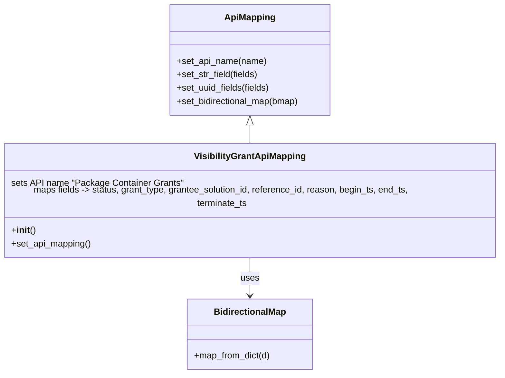

# Diagram: partview_core/partview_service/partview_service/api/visibility_grant/mapping/VisibilityGrantApiMapping.py

> Auto-generated by Obscura crawlers

## Mermaid

### SVG

<svg id="container" width="906.7265625" xmlns="http://www.w3.org/2000/svg" class="classDiagram" height="656" viewBox="0 0 906.7265625 656" role="graphics-document document" aria-roledescription="class"><g><defs><marker id="container_class-aggregationStart" class="marker aggregation class" refX="18" refY="7" markerWidth="190" markerHeight="240" orient="auto"><path d="M 18,7 L9,13 L1,7 L9,1 Z"></path></marker></defs><defs><marker id="container_class-aggregationEnd" class="marker aggregation class" refX="1" refY="7" markerWidth="20" markerHeight="28" orient="auto"><path d="M 18,7 L9,13 L1,7 L9,1 Z"></path></marker></defs><defs><marker id="container_class-extensionStart" class="marker extension class" refX="18" refY="7" markerWidth="190" markerHeight="240" orient="auto"><path d="M 1,7 L18,13 V 1 Z"></path></marker></defs><defs><marker id="container_class-extensionEnd" class="marker extension class" refX="1" refY="7" markerWidth="20" markerHeight="28" orient="auto"><path d="M 1,1 V 13 L18,7 Z"></path></marker></defs><defs><marker id="container_class-compositionStart" class="marker composition class" refX="18" refY="7" markerWidth="190" markerHeight="240" orient="auto"><path d="M 18,7 L9,13 L1,7 L9,1 Z"></path></marker></defs><defs><marker id="container_class-compositionEnd" class="marker composition class" refX="1" refY="7" markerWidth="20" markerHeight="28" orient="auto"><path d="M 18,7 L9,13 L1,7 L9,1 Z"></path></marker></defs><defs><marker id="container_class-dependencyStart" class="marker dependency class" refX="6" refY="7" markerWidth="190" markerHeight="240" orient="auto"><path d="M 5,7 L9,13 L1,7 L9,1 Z"></path></marker></defs><defs><marker id="container_class-dependencyEnd" class="marker dependency class" refX="13" refY="7" markerWidth="20" markerHeight="28" orient="auto"><path d="M 18,7 L9,13 L14,7 L9,1 Z"></path></marker></defs><defs><marker id="container_class-lollipopStart" class="marker lollipop class" refX="13" refY="7" markerWidth="190" markerHeight="240" orient="auto"><circle stroke="black" fill="transparent" cx="7" cy="7" r="6"></circle></marker></defs><defs><marker id="container_class-lollipopEnd" class="marker lollipop class" refX="1" refY="7" markerWidth="190" markerHeight="240" orient="auto"><circle stroke="black" fill="transparent" cx="7" cy="7" r="6"></circle></marker></defs><g class="root"><g class="clusters"></g><g class="edgePaths"><path d="M453.363,223.25L453.363,224.542C453.363,225.833,453.363,228.417,453.363,233.875C453.363,239.333,453.363,247.667,453.363,251.833L453.363,256" id="id_ApiMapping_VisibilityGrantApiMapping_1" class="edge-thickness-normal edge-pattern-solid relation" style=";;;" data-edge="true" data-et="edge" data-id="id_ApiMapping_VisibilityGrantApiMapping_1" data-points="W3sieCI6NDUzLjM2MzI4MTI1LCJ5IjoyMDZ9LHsieCI6NDUzLjM2MzI4MTI1LCJ5IjoyMzF9LHsieCI6NDUzLjM2MzI4MTI1LCJ5IjoyNTZ9XQ==" marker-start="url(#container_class-extensionStart)"></path><path d="M453.363,448L453.363,454.167C453.363,460.333,453.363,472.667,453.363,484C453.363,495.333,453.363,505.667,453.363,510.833L453.363,516" id="id_VisibilityGrantApiMapping_BidirectionalMap_2" class="edge-thickness-normal edge-pattern-solid relation" style=";;;" data-edge="true" data-et="edge" data-id="id_VisibilityGrantApiMapping_BidirectionalMap_2" data-points="W3sieCI6NDUzLjM2MzI4MTI1LCJ5Ijo0NDh9LHsieCI6NDUzLjM2MzI4MTI1LCJ5Ijo0ODV9LHsieCI6NDUzLjM2MzI4MTI1LCJ5Ijo1MjJ9XQ==" marker-end="url(#container_class-dependencyEnd)"></path></g><g class="edgeLabels"><g class="edgeLabel"><g class="label" data-id="id_ApiMapping_VisibilityGrantApiMapping_1" transform="translate(0, 0)"><foreignObject width="0" height="0">

</foreignObject></g></g><g class="edgeLabel" transform="translate(453.36328125, 485)"><g class="label" data-id="id_VisibilityGrantApiMapping_BidirectionalMap_2" transform="translate(-16.4921875, -12)"><foreignObject width="32.984375" height="24">

uses

</foreignObject></g></g></g><g class="nodes"><g class="node default" id="classId-ApiMapping-0" transform="translate(453.36328125, 107)"><g class="basic label-container"><path d="M-144.98828125 -99 L144.98828125 -99 L144.98828125 99 L-144.98828125 99" stroke="none" stroke-width="0" fill="#ECECFF" style=""></path><path d="M-144.98828125 -99 C-71.2484380953829 -99, 2.4914050592342107 -99, 144.98828125 -99 M-144.98828125 -99 C-67.17453105241329 -99, 10.639219145173428 -99, 144.98828125 -99 M144.98828125 -99 C144.98828125 -44.295964355978604, 144.98828125 10.408071288042791, 144.98828125 99 M144.98828125 -99 C144.98828125 -41.0177069688043, 144.98828125 16.964586062391405, 144.98828125 99 M144.98828125 99 C81.46005214596846 99, 17.931823041936937 99, -144.98828125 99 M144.98828125 99 C37.202321765210044 99, -70.58363771957991 99, -144.98828125 99 M-144.98828125 99 C-144.98828125 21.571202545960986, -144.98828125 -55.85759490807803, -144.98828125 -99 M-144.98828125 99 C-144.98828125 34.48732066059995, -144.98828125 -30.025358678800103, -144.98828125 -99" stroke="#9370DB" stroke-width="1.3" fill="none" stroke-dasharray="0 0" style=""></path></g><g class="annotation-group text" transform="translate(0, -75)"></g><g class="label-group text" transform="translate(-43.2578125, -75)"><g class="label" style="font-weight: bolder" transform="translate(0,-12)"><foreignObject width="86.515625" height="24">

ApiMapping

</foreignObject></g></g><g class="members-group text" transform="translate(-132.98828125, -27)"></g><g class="methods-group text" transform="translate(-132.98828125, 3)"><g class="label" style="" transform="translate(0,-12)"><foreignObject width="160.390625" height="24">

+set_api_name(name)

</foreignObject></g><g class="label" style="" transform="translate(0,12)"><foreignObject width="146.453125" height="24">

+set_str_field(fields)

</foreignObject></g><g class="label" style="" transform="translate(0,36)"><foreignObject width="168.171875" height="24">

+set_uuid_fields(fields)

</foreignObject></g><g class="label" style="" transform="translate(0,60)"><foreignObject width="222.71875" height="24">

+set_bidirectional_map(bmap)

</foreignObject></g></g><g class="divider" style=""><path d="M-144.98828125 -51 C-44.19798312495112 -51, 56.592315000097756 -51, 144.98828125 -51 M-144.98828125 -51 C-76.51016025797114 -51, -8.032039265942274 -51, 144.98828125 -51" stroke="#9370DB" stroke-width="1.3" fill="none" stroke-dasharray="0 0" style=""></path></g><g class="divider" style=""><path d="M-144.98828125 -27 C-32.28928756668286 -27, 80.40970611663428 -27, 144.98828125 -27 M-144.98828125 -27 C-33.7194014121486 -27, 77.5494784257028 -27, 144.98828125 -27" stroke="#9370DB" stroke-width="1.3" fill="none" stroke-dasharray="0 0" style=""></path></g></g><g class="node default" id="classId-BidirectionalMap-1" transform="translate(453.36328125, 585)"><g class="basic label-container"><path d="M-111.68359375 -63 L111.68359375 -63 L111.68359375 63 L-111.68359375 63" stroke="none" stroke-width="0" fill="#ECECFF" style=""></path><path d="M-111.68359375 -63 C-27.949631861433758 -63, 55.784330027132484 -63, 111.68359375 -63 M-111.68359375 -63 C-48.137760148624366 -63, 15.408073452751267 -63, 111.68359375 -63 M111.68359375 -63 C111.68359375 -20.156485815992767, 111.68359375 22.687028368014467, 111.68359375 63 M111.68359375 -63 C111.68359375 -31.56538131370097, 111.68359375 -0.13076262740194267, 111.68359375 63 M111.68359375 63 C32.851775778655465 63, -45.98004219268907 63, -111.68359375 63 M111.68359375 63 C38.37959394659525 63, -34.9244058568095 63, -111.68359375 63 M-111.68359375 63 C-111.68359375 18.768603800201298, -111.68359375 -25.462792399597404, -111.68359375 -63 M-111.68359375 63 C-111.68359375 22.203103494456585, -111.68359375 -18.59379301108683, -111.68359375 -63" stroke="#9370DB" stroke-width="1.3" fill="none" stroke-dasharray="0 0" style=""></path></g><g class="annotation-group text" transform="translate(0, -39)"></g><g class="label-group text" transform="translate(-62.2265625, -39)"><g class="label" style="font-weight: bolder" transform="translate(0,-12)"><foreignObject width="124.453125" height="24">

BidirectionalMap

</foreignObject></g></g><g class="members-group text" transform="translate(-99.68359375, 9)"></g><g class="methods-group text" transform="translate(-99.68359375, 39)"><g class="label" style="" transform="translate(0,-12)"><foreignObject width="137.140625" height="24">

+map_from_dict(d)

</foreignObject></g></g><g class="divider" style=""><path d="M-111.68359375 -15 C-29.746271912562207 -15, 52.191049924875585 -15, 111.68359375 -15 M-111.68359375 -15 C-29.376764482590687 -15, 52.930064784818626 -15, 111.68359375 -15" stroke="#9370DB" stroke-width="1.3" fill="none" stroke-dasharray="0 0" style=""></path></g><g class="divider" style=""><path d="M-111.68359375 9 C-59.840788735795364 9, -7.997983721590728 9, 111.68359375 9 M-111.68359375 9 C-38.98877568628589 9, 33.70604237742822 9, 111.68359375 9" stroke="#9370DB" stroke-width="1.3" fill="none" stroke-dasharray="0 0" style=""></path></g></g><g class="node default" id="classId-VisibilityGrantApiMapping-2" transform="translate(453.36328125, 352)"><g class="basic label-container"><path d="M-445.36328125 -96 L445.36328125 -96 L445.36328125 96 L-445.36328125 96" stroke="none" stroke-width="0" fill="#ECECFF" style=""></path><path d="M-445.36328125 -96 C-187.72976563563446 -96, 69.90374997873107 -96, 445.36328125 -96 M-445.36328125 -96 C-103.84003338657493 -96, 237.68321447685014 -96, 445.36328125 -96 M445.36328125 -96 C445.36328125 -53.70925072235137, 445.36328125 -11.418501444702741, 445.36328125 96 M445.36328125 -96 C445.36328125 -45.341547059097365, 445.36328125 5.316905881805269, 445.36328125 96 M445.36328125 96 C196.3044303366414 96, -52.75442057671722 96, -445.36328125 96 M445.36328125 96 C218.81452154165888 96, -7.734238166682246 96, -445.36328125 96 M-445.36328125 96 C-445.36328125 27.47213297081825, -445.36328125 -41.0557340583635, -445.36328125 -96 M-445.36328125 96 C-445.36328125 34.930064995680226, -445.36328125 -26.139870008639548, -445.36328125 -96" stroke="#9370DB" stroke-width="1.3" fill="none" stroke-dasharray="0 0" style=""></path></g><g class="annotation-group text" transform="translate(0, -72)"></g><g class="label-group text" transform="translate(-95.2265625, -72)"><g class="label" style="font-weight: bolder" transform="translate(0,-12)"><foreignObject width="190.453125" height="24">

VisibilityGrantApiMapping

</foreignObject></g></g><g class="members-group text" transform="translate(-433.36328125, -24)"><g class="label" style="" transform="translate(0,-12)"><foreignObject width="302.46875" height="24">

sets API name "Package Container Grants"

</foreignObject></g><g class="label" style="" transform="translate(0,12)"><foreignObject width="771.5" height="24">

maps fields -&gt; status, grant_type, grantee_solution_id, reference_id, reason, begin_ts, end_ts, terminate_ts

</foreignObject></g></g><g class="methods-group text" transform="translate(-433.36328125, 48)"><g class="label" style="" transform="translate(0,-12)"><foreignObject width="42.796875" height="24">

+<strong>init</strong>()

</foreignObject></g><g class="label" style="" transform="translate(0,12)"><foreignObject width="143" height="24">

+set_api_mapping()

</foreignObject></g></g><g class="divider" style=""><path d="M-445.36328125 -48 C-122.62872212219855 -48, 200.1058370056029 -48, 445.36328125 -48 M-445.36328125 -48 C-223.3734587931151 -48, -1.3836363362302109 -48, 445.36328125 -48" stroke="#9370DB" stroke-width="1.3" fill="none" stroke-dasharray="0 0" style=""></path></g><g class="divider" style=""><path d="M-445.36328125 24 C-134.21167110245352 24, 176.93993904509296 24, 445.36328125 24 M-445.36328125 24 C-251.8065765372015 24, -58.24987182440299 24, 445.36328125 24" stroke="#9370DB" stroke-width="1.3" fill="none" stroke-dasharray="0 0" style=""></path></g></g></g></g></g></svg>
