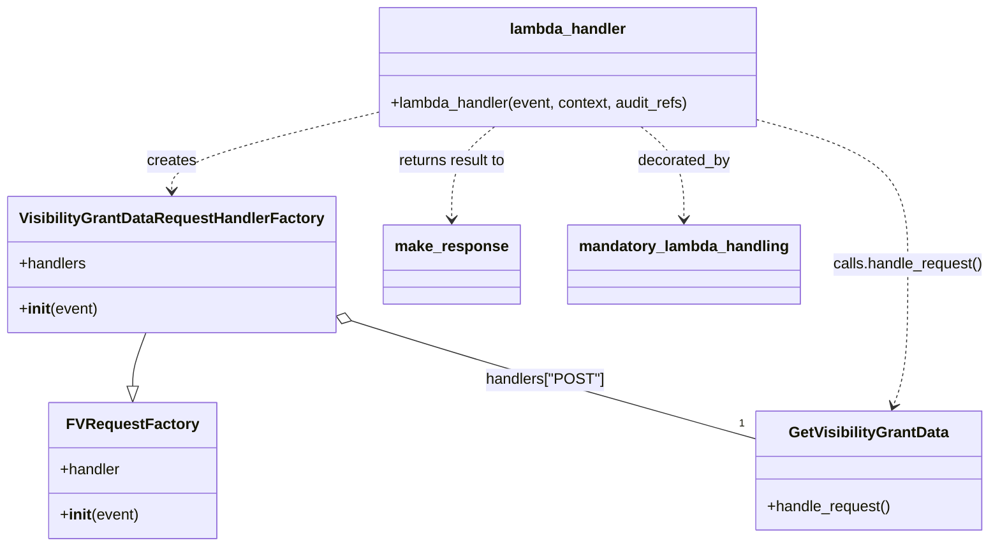

# Diagram: partview_core/partview_service/partview_service/api/visibility_grant/trigger_post_visibility_grant_handler.py

> Auto-generated by Obscura crawlers

## Mermaid

### SVG

<svg id="container" width="1022.5625" xmlns="http://www.w3.org/2000/svg" class="classDiagram" height="578" viewBox="0 0 1022.5625 578" role="graphics-document document" aria-roledescription="class"><g><defs><marker id="container_class-aggregationStart" class="marker aggregation class" refX="18" refY="7" markerWidth="190" markerHeight="240" orient="auto"><path d="M 18,7 L9,13 L1,7 L9,1 Z"></path></marker></defs><defs><marker id="container_class-aggregationEnd" class="marker aggregation class" refX="1" refY="7" markerWidth="20" markerHeight="28" orient="auto"><path d="M 18,7 L9,13 L1,7 L9,1 Z"></path></marker></defs><defs><marker id="container_class-extensionStart" class="marker extension class" refX="18" refY="7" markerWidth="190" markerHeight="240" orient="auto"><path d="M 1,7 L18,13 V 1 Z"></path></marker></defs><defs><marker id="container_class-extensionEnd" class="marker extension class" refX="1" refY="7" markerWidth="20" markerHeight="28" orient="auto"><path d="M 1,1 V 13 L18,7 Z"></path></marker></defs><defs><marker id="container_class-compositionStart" class="marker composition class" refX="18" refY="7" markerWidth="190" markerHeight="240" orient="auto"><path d="M 18,7 L9,13 L1,7 L9,1 Z"></path></marker></defs><defs><marker id="container_class-compositionEnd" class="marker composition class" refX="1" refY="7" markerWidth="20" markerHeight="28" orient="auto"><path d="M 18,7 L9,13 L1,7 L9,1 Z"></path></marker></defs><defs><marker id="container_class-dependencyStart" class="marker dependency class" refX="6" refY="7" markerWidth="190" markerHeight="240" orient="auto"><path d="M 5,7 L9,13 L1,7 L9,1 Z"></path></marker></defs><defs><marker id="container_class-dependencyEnd" class="marker dependency class" refX="13" refY="7" markerWidth="20" markerHeight="28" orient="auto"><path d="M 18,7 L9,13 L14,7 L9,1 Z"></path></marker></defs><defs><marker id="container_class-lollipopStart" class="marker lollipop class" refX="13" refY="7" markerWidth="190" markerHeight="240" orient="auto"><circle stroke="black" fill="transparent" cx="7" cy="7" r="6"></circle></marker></defs><defs><marker id="container_class-lollipopEnd" class="marker lollipop class" refX="1" refY="7" markerWidth="190" markerHeight="240" orient="auto"><circle stroke="black" fill="transparent" cx="7" cy="7" r="6"></circle></marker></defs><g class="root"><g class="clusters"></g><g class="edgePaths"><path d="M147.387,352L145.062,358.167C142.738,364.333,138.09,376.667,135.766,386.125C133.441,395.583,133.441,402.167,133.441,405.458L133.441,408.75" id="id_VisibilityGrantDataRequestHandlerFactory_FVRequestFactory_1" class="edge-thickness-normal edge-pattern-solid relation" style=";;;" data-edge="true" data-et="edge" data-id="id_VisibilityGrantDataRequestHandlerFactory_FVRequestFactory_1" data-points="W3sieCI6MTQ3LjM4NjY4MjkxMjg0NDA0LCJ5IjozNTJ9LHsieCI6MTMzLjQ0MTQwNjI1LCJ5IjozODl9LHsieCI6MTMzLjQ0MTQwNjI1LCJ5Ijo0MjZ9XQ==" marker-end="url(#container_class-extensionEnd)"></path><path d="M357.468,338.865L383.437,347.221C409.406,355.577,461.343,372.288,530.828,393.132C600.313,413.975,687.344,438.95,730.859,451.437L774.375,463.924" id="id_VisibilityGrantDataRequestHandlerFactory_GetVisibilityGrantData_2" class="edge-thickness-normal edge-pattern-solid relation" style=";;;" data-edge="true" data-et="edge" data-id="id_VisibilityGrantDataRequestHandlerFactory_GetVisibilityGrantData_2" data-points="W3sieCI6MzQxLjA0Njg3NSwieSI6MzMzLjU4MTIxMzUzMjg5ODIzfSx7IngiOjUxMy4yODEyNSwieSI6Mzg5fSx7IngiOjc3NC4zNzUsInkiOjQ2My45MjQyNTg3ODUwNTU0fV0=" marker-start="url(#container_class-aggregationStart)"></path><path d="M377.133,121.027L343.365,129.356C309.596,137.685,242.06,154.342,208.292,167.838C174.523,181.333,174.523,191.667,174.523,196.833L174.523,202" id="id_lambda_handler_VisibilityGrantDataRequestHandlerFactory_3" class="edge-thickness-normal edge-pattern-dashed relation" style=";;;" data-edge="true" data-et="edge" data-id="id_lambda_handler_VisibilityGrantDataRequestHandlerFactory_3" data-points="W3sieCI6Mzc3LjEzMjgxMjUsInkiOjEyMS4wMjc0NTg0OTkxMjgwN30seyJ4IjoxNzQuNTIzNDM3NSwieSI6MTcxfSx7IngiOjE3NC41MjM0Mzc1LCJ5IjoyMDh9XQ==" marker-end="url(#container_class-dependencyEnd)"></path><path d="M782.797,128.259L808.031,135.382C833.266,142.506,883.734,156.753,908.969,182.043C934.203,207.333,934.203,243.667,934.203,280C934.203,316.333,934.203,352.667,931.666,377.564C929.129,402.462,924.056,415.924,921.519,422.655L918.982,429.386" id="id_lambda_handler_GetVisibilityGrantData_4" class="edge-thickness-normal edge-pattern-dashed relation" style=";;;" data-edge="true" data-et="edge" data-id="id_lambda_handler_GetVisibilityGrantData_4" data-points="W3sieCI6NzgyLjc5Njg3NSwieSI6MTI4LjI1ODY0MjU1Mzg5NTM2fSx7IngiOjkzNC4yMDMxMjUsInkiOjE3MX0seyJ4Ijo5MzQuMjAzMTI1LCJ5IjoyODB9LHsieCI6OTM0LjIwMzEyNSwieSI6Mzg5fSx7IngiOjkxNi44NjU3NTQwMTM3NjE1LCJ5Ijo0MzV9XQ==" marker-end="url(#container_class-dependencyEnd)"></path><path d="M504.712,134L497.346,140.167C489.98,146.333,475.248,158.667,467.882,175C460.516,191.333,460.516,211.667,460.516,221.833L460.516,232" id="id_lambda_handler_make_response_5" class="edge-thickness-normal edge-pattern-dashed relation" style=";;;" data-edge="true" data-et="edge" data-id="id_lambda_handler_make_response_5" data-points="W3sieCI6NTA0LjcxMTgzNTkzNzUsInkiOjEzNH0seyJ4Ijo0NjAuNTE1NjI1LCJ5IjoxNzF9LHsieCI6NDYwLjUxNTYyNSwieSI6MjM4fV0=" marker-end="url(#container_class-dependencyEnd)"></path><path d="M655.218,134L662.584,140.167C669.95,146.333,684.682,158.667,692.048,175C699.414,191.333,699.414,211.667,699.414,221.833L699.414,232" id="id_lambda_handler_mandatory_lambda_handling_6" class="edge-thickness-normal edge-pattern-dashed relation" style=";;;" data-edge="true" data-et="edge" data-id="id_lambda_handler_mandatory_lambda_handling_6" data-points="W3sieCI6NjU1LjIxNzg1MTU2MjUsInkiOjEzNH0seyJ4Ijo2OTkuNDE0MDYyNSwieSI6MTcxfSx7IngiOjY5OS40MTQwNjI1LCJ5IjoyMzh9XQ==" marker-end="url(#container_class-dependencyEnd)"></path></g><g class="edgeLabels"><g class="edgeLabel"><g class="label" data-id="id_VisibilityGrantDataRequestHandlerFactory_FVRequestFactory_1" transform="translate(0, 0)"><foreignObject width="0" height="0">

</foreignObject></g></g><g class="edgeLabel" transform="translate(556.87226, 401.50901)"><g class="label" data-id="id_VisibilityGrantDataRequestHandlerFactory_GetVisibilityGrantData_2" transform="translate(-62.1640625, -12)"><foreignObject width="124.328125" height="24">

handlers["POST"]

</foreignObject></g></g><g class="edgeLabel" transform="translate(174.5234375, 171)"><g class="label" data-id="id_lambda_handler_VisibilityGrantDataRequestHandlerFactory_3" transform="translate(-26.171875, -12)"><foreignObject width="52.34375" height="24">

creates

</foreignObject></g></g><g class="edgeLabel" transform="translate(934.203125, 280)"><g class="label" data-id="id_lambda_handler_GetVisibilityGrantData_4" transform="translate(-80.359375, -12)"><foreignObject width="160.71875" height="24">

calls.handle_request()

</foreignObject></g></g><g class="edgeLabel" transform="translate(460.515625, 171)"><g class="label" data-id="id_lambda_handler_make_response_5" transform="translate(-58.78125, -12)"><foreignObject width="117.5625" height="24">

returns result to

</foreignObject></g></g><g class="edgeLabel" transform="translate(699.4140625, 171)"><g class="label" data-id="id_lambda_handler_mandatory_lambda_handling_6" transform="translate(-49.375, -12)"><foreignObject width="98.75" height="24">

decorated_by

</foreignObject></g></g><g class="edgeTerminals" transform="translate(756.6913480327781, 439.67913016939957)"><g class="inner" transform="translate(0, 0)"></g><foreignObject style="width: 9px; height: 12px;">
1
</foreignObject></g></g><g class="nodes"><g class="node default" id="classId-FVRequestFactory-0" transform="translate(133.44140625, 498)"><g class="basic label-container"><path d="M-86.08984375 -72 L86.08984375 -72 L86.08984375 72 L-86.08984375 72" stroke="none" stroke-width="0" fill="#ECECFF" style=""></path><path d="M-86.08984375 -72 C-28.792285609831033 -72, 28.505272530337933 -72, 86.08984375 -72 M-86.08984375 -72 C-29.568519719327703 -72, 26.952804311344593 -72, 86.08984375 -72 M86.08984375 -72 C86.08984375 -27.929483895911552, 86.08984375 16.141032208176895, 86.08984375 72 M86.08984375 -72 C86.08984375 -24.01301627795153, 86.08984375 23.973967444096942, 86.08984375 72 M86.08984375 72 C30.90539435477062 72, -24.279055040458758 72, -86.08984375 72 M86.08984375 72 C41.073782534048945 72, -3.94227868190211 72, -86.08984375 72 M-86.08984375 72 C-86.08984375 34.94999451363183, -86.08984375 -2.1000109727363423, -86.08984375 -72 M-86.08984375 72 C-86.08984375 43.15184532606875, -86.08984375 14.303690652137497, -86.08984375 -72" stroke="#9370DB" stroke-width="1.3" fill="none" stroke-dasharray="0 0" style=""></path></g><g class="annotation-group text" transform="translate(0, -48)"></g><g class="label-group text" transform="translate(-65.0390625, -48)"><g class="label" style="font-weight: bolder" transform="translate(0,-12)"><foreignObject width="130.078125" height="24">

FVRequestFactory

</foreignObject></g></g><g class="members-group text" transform="translate(-74.08984375, 0)"><g class="label" style="" transform="translate(0,-12)"><foreignObject width="64.515625" height="24">

+handler

</foreignObject></g></g><g class="methods-group text" transform="translate(-74.08984375, 48)"><g class="label" style="" transform="translate(0,-12)"><foreignObject width="83.140625" height="24">

+<strong>init</strong>(event)

</foreignObject></g></g><g class="divider" style=""><path d="M-86.08984375 -24 C-43.88200179558367 -24, -1.674159841167338 -24, 86.08984375 -24 M-86.08984375 -24 C-33.47807431811482 -24, 19.133695113770358 -24, 86.08984375 -24" stroke="#9370DB" stroke-width="1.3" fill="none" stroke-dasharray="0 0" style=""></path></g><g class="divider" style=""><path d="M-86.08984375 24 C-30.540746852528436 24, 25.00835004494313 24, 86.08984375 24 M-86.08984375 24 C-44.55707256565304 24, -3.024301381306074 24, 86.08984375 24" stroke="#9370DB" stroke-width="1.3" fill="none" stroke-dasharray="0 0" style=""></path></g></g><g class="node default" id="classId-GetVisibilityGrantData-1" transform="translate(893.12109375, 498)"><g class="basic label-container"><path d="M-118.74609375 -63 L118.74609375 -63 L118.74609375 63 L-118.74609375 63" stroke="none" stroke-width="0" fill="#ECECFF" style=""></path><path d="M-118.74609375 -63 C-25.434945176500307 -63, 67.87620339699939 -63, 118.74609375 -63 M-118.74609375 -63 C-71.21680082830134 -63, -23.68750790660269 -63, 118.74609375 -63 M118.74609375 -63 C118.74609375 -24.446774767113624, 118.74609375 14.106450465772753, 118.74609375 63 M118.74609375 -63 C118.74609375 -23.204462904845464, 118.74609375 16.591074190309072, 118.74609375 63 M118.74609375 63 C45.13244151031165 63, -28.4812107293767 63, -118.74609375 63 M118.74609375 63 C37.330996177248 63, -44.08410139550401 63, -118.74609375 63 M-118.74609375 63 C-118.74609375 28.4734383358034, -118.74609375 -6.053123328393198, -118.74609375 -63 M-118.74609375 63 C-118.74609375 31.199823458170723, -118.74609375 -0.600353083658554, -118.74609375 -63" stroke="#9370DB" stroke-width="1.3" fill="none" stroke-dasharray="0 0" style=""></path></g><g class="annotation-group text" transform="translate(0, -39)"></g><g class="label-group text" transform="translate(-81.5234375, -39)"><g class="label" style="font-weight: bolder" transform="translate(0,-12)"><foreignObject width="163.046875" height="24">

GetVisibilityGrantData

</foreignObject></g></g><g class="members-group text" transform="translate(-106.74609375, 9)"></g><g class="methods-group text" transform="translate(-106.74609375, 39)"><g class="label" style="" transform="translate(0,-12)"><foreignObject width="131.96875" height="24">

+handle_request()

</foreignObject></g></g><g class="divider" style=""><path d="M-118.74609375 -15 C-56.85646766717832 -15, 5.033158415643356 -15, 118.74609375 -15 M-118.74609375 -15 C-49.49393517233412 -15, 19.758223405331762 -15, 118.74609375 -15" stroke="#9370DB" stroke-width="1.3" fill="none" stroke-dasharray="0 0" style=""></path></g><g class="divider" style=""><path d="M-118.74609375 9 C-44.433863873829196 9, 29.878366002341608 9, 118.74609375 9 M-118.74609375 9 C-52.036094271626155 9, 14.67390520674769 9, 118.74609375 9" stroke="#9370DB" stroke-width="1.3" fill="none" stroke-dasharray="0 0" style=""></path></g></g><g class="node default" id="classId-VisibilityGrantDataRequestHandlerFactory-2" transform="translate(174.5234375, 280)"><g class="basic label-container"><path d="M-166.5234375 -72 L166.5234375 -72 L166.5234375 72 L-166.5234375 72" stroke="none" stroke-width="0" fill="#ECECFF" style=""></path><path d="M-166.5234375 -72 C-84.46333226989864 -72, -2.4032270397972866 -72, 166.5234375 -72 M-166.5234375 -72 C-33.47175254152975 -72, 99.5799324169405 -72, 166.5234375 -72 M166.5234375 -72 C166.5234375 -41.196700894966696, 166.5234375 -10.3934017899334, 166.5234375 72 M166.5234375 -72 C166.5234375 -37.20469616235988, 166.5234375 -2.409392324719761, 166.5234375 72 M166.5234375 72 C86.08399916703513 72, 5.644560834070262 72, -166.5234375 72 M166.5234375 72 C52.97829282810412 72, -60.56685184379177 72, -166.5234375 72 M-166.5234375 72 C-166.5234375 31.896088596196485, -166.5234375 -8.20782280760703, -166.5234375 -72 M-166.5234375 72 C-166.5234375 20.810840097363183, -166.5234375 -30.378319805273634, -166.5234375 -72" stroke="#9370DB" stroke-width="1.3" fill="none" stroke-dasharray="0 0" style=""></path></g><g class="annotation-group text" transform="translate(0, -48)"></g><g class="label-group text" transform="translate(-154.5234375, -48)"><g class="label" style="font-weight: bolder" transform="translate(0,-12)"><foreignObject width="309.046875" height="24">

VisibilityGrantDataRequestHandlerFactory

</foreignObject></g></g><g class="members-group text" transform="translate(-154.5234375, 0)"><g class="label" style="" transform="translate(0,-12)"><foreignObject width="71.75" height="24">

+handlers

</foreignObject></g></g><g class="methods-group text" transform="translate(-154.5234375, 48)"><g class="label" style="" transform="translate(0,-12)"><foreignObject width="83.140625" height="24">

+<strong>init</strong>(event)

</foreignObject></g></g><g class="divider" style=""><path d="M-166.5234375 -24 C-77.7831387234258 -24, 10.957160053148414 -24, 166.5234375 -24 M-166.5234375 -24 C-69.99907629000847 -24, 26.52528491998305 -24, 166.5234375 -24" stroke="#9370DB" stroke-width="1.3" fill="none" stroke-dasharray="0 0" style=""></path></g><g class="divider" style=""><path d="M-166.5234375 24 C-99.80610707444708 24, -33.08877664889417 24, 166.5234375 24 M-166.5234375 24 C-82.56941134749763 24, 1.3846148050047304 24, 166.5234375 24" stroke="#9370DB" stroke-width="1.3" fill="none" stroke-dasharray="0 0" style=""></path></g></g><g class="node default" id="classId-lambda_handler-3" transform="translate(579.96484375, 71)"><g class="basic label-container"><path d="M-202.83203125 -63 L202.83203125 -63 L202.83203125 63 L-202.83203125 63" stroke="none" stroke-width="0" fill="#ECECFF" style=""></path><path d="M-202.83203125 -63 C-41.306304847707366 -63, 120.21942155458527 -63, 202.83203125 -63 M-202.83203125 -63 C-45.563819230670816 -63, 111.70439278865837 -63, 202.83203125 -63 M202.83203125 -63 C202.83203125 -19.533290211986497, 202.83203125 23.933419576027006, 202.83203125 63 M202.83203125 -63 C202.83203125 -12.65882444032217, 202.83203125 37.68235111935566, 202.83203125 63 M202.83203125 63 C101.72163402999492 63, 0.6112368099898333 63, -202.83203125 63 M202.83203125 63 C77.26306804989055 63, -48.3058951502189 63, -202.83203125 63 M-202.83203125 63 C-202.83203125 33.40569098360449, -202.83203125 3.8113819672089733, -202.83203125 -63 M-202.83203125 63 C-202.83203125 17.4888813960316, -202.83203125 -28.022237207936797, -202.83203125 -63" stroke="#9370DB" stroke-width="1.3" fill="none" stroke-dasharray="0 0" style=""></path></g><g class="annotation-group text" transform="translate(0, -39)"></g><g class="label-group text" transform="translate(-59.9765625, -39)"><g class="label" style="font-weight: bolder" transform="translate(0,-12)"><foreignObject width="119.953125" height="24">

lambda_handler

</foreignObject></g></g><g class="members-group text" transform="translate(-190.83203125, 9)"></g><g class="methods-group text" transform="translate(-190.83203125, 39)"><g class="label" style="" transform="translate(0,-12)"><foreignObject width="321.6875" height="24">

+lambda_handler(event, context, audit_refs)

</foreignObject></g></g><g class="divider" style=""><path d="M-202.83203125 -15 C-67.49717231830724 -15, 67.83768661338553 -15, 202.83203125 -15 M-202.83203125 -15 C-74.99300600249843 -15, 52.846019245003134 -15, 202.83203125 -15" stroke="#9370DB" stroke-width="1.3" fill="none" stroke-dasharray="0 0" style=""></path></g><g class="divider" style=""><path d="M-202.83203125 9 C-72.66469235550596 9, 57.502646538988074 9, 202.83203125 9 M-202.83203125 9 C-84.29537970560989 9, 34.24127183878022 9, 202.83203125 9" stroke="#9370DB" stroke-width="1.3" fill="none" stroke-dasharray="0 0" style=""></path></g></g><g class="node default" id="classId-make_response-4" transform="translate(460.515625, 280)"><g class="basic label-container"><path d="M-69.46875 -42 L69.46875 -42 L69.46875 42 L-69.46875 42" stroke="none" stroke-width="0" fill="#ECECFF" style=""></path><path d="M-69.46875 -42 C-27.92857495708423 -42, 13.61160008583154 -42, 69.46875 -42 M-69.46875 -42 C-34.54235911441707 -42, 0.3840317711658656 -42, 69.46875 -42 M69.46875 -42 C69.46875 -22.600869730918948, 69.46875 -3.201739461837896, 69.46875 42 M69.46875 -42 C69.46875 -9.672281012179077, 69.46875 22.655437975641846, 69.46875 42 M69.46875 42 C29.23182502014958 42, -11.005099959700843 42, -69.46875 42 M69.46875 42 C17.034292370659557 42, -35.400165258680886 42, -69.46875 42 M-69.46875 42 C-69.46875 9.767917552295323, -69.46875 -22.464164895409354, -69.46875 -42 M-69.46875 42 C-69.46875 24.22165703993675, -69.46875 6.4433140798735025, -69.46875 -42" stroke="#9370DB" stroke-width="1.3" fill="none" stroke-dasharray="0 0" style=""></path></g><g class="annotation-group text" transform="translate(0, -18)"></g><g class="label-group text" transform="translate(-57.46875, -18)"><g class="label" style="font-weight: bolder" transform="translate(0,-12)"><foreignObject width="114.9375" height="24">

make_response

</foreignObject></g></g><g class="members-group text" transform="translate(-57.46875, 30)"></g><g class="methods-group text" transform="translate(-57.46875, 60)"></g><g class="divider" style=""><path d="M-69.46875 6 C-37.60801386666324 6, -5.747277733326477 6, 69.46875 6 M-69.46875 6 C-41.275229474666986 6, -13.081708949333965 6, 69.46875 6" stroke="#9370DB" stroke-width="1.3" fill="none" stroke-dasharray="0 0" style=""></path></g><g class="divider" style=""><path d="M-69.46875 24 C-38.73613162535971 24, -8.003513250719422 24, 69.46875 24 M-69.46875 24 C-35.18710196954644 24, -0.9054539390928795 24, 69.46875 24" stroke="#9370DB" stroke-width="1.3" fill="none" stroke-dasharray="0 0" style=""></path></g></g><g class="node default" id="classId-mandatory_lambda_handling-5" transform="translate(699.4140625, 280)"><g class="basic label-container"><path d="M-119.4296875 -42 L119.4296875 -42 L119.4296875 42 L-119.4296875 42" stroke="none" stroke-width="0" fill="#ECECFF" style=""></path><path d="M-119.4296875 -42 C-60.50416778962596 -42, -1.57864807925192 -42, 119.4296875 -42 M-119.4296875 -42 C-50.97264652350502 -42, 17.48439445298996 -42, 119.4296875 -42 M119.4296875 -42 C119.4296875 -24.300813311002383, 119.4296875 -6.6016266220047655, 119.4296875 42 M119.4296875 -42 C119.4296875 -10.809125755168171, 119.4296875 20.381748489663657, 119.4296875 42 M119.4296875 42 C51.604335683290756 42, -16.221016133418487 42, -119.4296875 42 M119.4296875 42 C61.18356187818757 42, 2.937436256375136 42, -119.4296875 42 M-119.4296875 42 C-119.4296875 21.024998265961813, -119.4296875 0.0499965319236253, -119.4296875 -42 M-119.4296875 42 C-119.4296875 24.161526324687596, -119.4296875 6.323052649375192, -119.4296875 -42" stroke="#9370DB" stroke-width="1.3" fill="none" stroke-dasharray="0 0" style=""></path></g><g class="annotation-group text" transform="translate(0, -18)"></g><g class="label-group text" transform="translate(-107.4296875, -18)"><g class="label" style="font-weight: bolder" transform="translate(0,-12)"><foreignObject width="214.859375" height="24">

mandatory_lambda_handling

</foreignObject></g></g><g class="members-group text" transform="translate(-107.4296875, 30)"></g><g class="methods-group text" transform="translate(-107.4296875, 60)"></g><g class="divider" style=""><path d="M-119.4296875 6 C-56.90769971721126 6, 5.614288065577483 6, 119.4296875 6 M-119.4296875 6 C-25.72249186855383 6, 67.98470376289234 6, 119.4296875 6" stroke="#9370DB" stroke-width="1.3" fill="none" stroke-dasharray="0 0" style=""></path></g><g class="divider" style=""><path d="M-119.4296875 24 C-34.82597899928169 24, 49.777729501436625 24, 119.4296875 24 M-119.4296875 24 C-68.38964150011856 24, -17.34959550023713 24, 119.4296875 24" stroke="#9370DB" stroke-width="1.3" fill="none" stroke-dasharray="0 0" style=""></path></g></g></g></g></g></svg>
