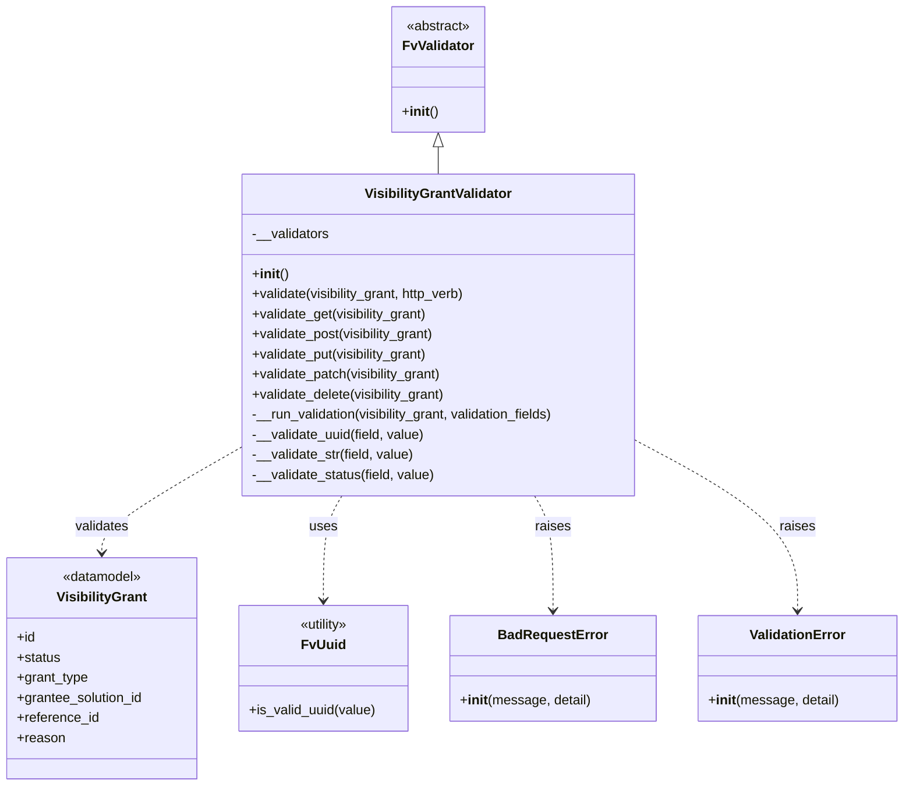

# Diagram: partview_core/partview_service/partview_service/api/visibility_grant/validate/VisibilityGrantValidator.py

> Auto-generated by Obscura crawlers

## Mermaid

### SVG

<svg id="container" width="1077.2265625" xmlns="http://www.w3.org/2000/svg" class="classDiagram" height="938" viewBox="0 0 1077.2265625 938" role="graphics-document document" aria-roledescription="class"><g><defs><marker id="container_class-aggregationStart" class="marker aggregation class" refX="18" refY="7" markerWidth="190" markerHeight="240" orient="auto"><path d="M 18,7 L9,13 L1,7 L9,1 Z"></path></marker></defs><defs><marker id="container_class-aggregationEnd" class="marker aggregation class" refX="1" refY="7" markerWidth="20" markerHeight="28" orient="auto"><path d="M 18,7 L9,13 L1,7 L9,1 Z"></path></marker></defs><defs><marker id="container_class-extensionStart" class="marker extension class" refX="18" refY="7" markerWidth="190" markerHeight="240" orient="auto"><path d="M 1,7 L18,13 V 1 Z"></path></marker></defs><defs><marker id="container_class-extensionEnd" class="marker extension class" refX="1" refY="7" markerWidth="20" markerHeight="28" orient="auto"><path d="M 1,1 V 13 L18,7 Z"></path></marker></defs><defs><marker id="container_class-compositionStart" class="marker composition class" refX="18" refY="7" markerWidth="190" markerHeight="240" orient="auto"><path d="M 18,7 L9,13 L1,7 L9,1 Z"></path></marker></defs><defs><marker id="container_class-compositionEnd" class="marker composition class" refX="1" refY="7" markerWidth="20" markerHeight="28" orient="auto"><path d="M 18,7 L9,13 L1,7 L9,1 Z"></path></marker></defs><defs><marker id="container_class-dependencyStart" class="marker dependency class" refX="6" refY="7" markerWidth="190" markerHeight="240" orient="auto"><path d="M 5,7 L9,13 L1,7 L9,1 Z"></path></marker></defs><defs><marker id="container_class-dependencyEnd" class="marker dependency class" refX="13" refY="7" markerWidth="20" markerHeight="28" orient="auto"><path d="M 18,7 L9,13 L14,7 L9,1 Z"></path></marker></defs><defs><marker id="container_class-lollipopStart" class="marker lollipop class" refX="13" refY="7" markerWidth="190" markerHeight="240" orient="auto"><circle stroke="black" fill="transparent" cx="7" cy="7" r="6"></circle></marker></defs><defs><marker id="container_class-lollipopEnd" class="marker lollipop class" refX="1" refY="7" markerWidth="190" markerHeight="240" orient="auto"><circle stroke="black" fill="transparent" cx="7" cy="7" r="6"></circle></marker></defs><g class="root"><g class="clusters"></g><g class="edgePaths"><path d="M527.496,175.25L527.496,176.542C527.496,177.833,527.496,180.417,527.496,185.875C527.496,191.333,527.496,199.667,527.496,203.833L527.496,208" id="id_FvValidator_VisibilityGrantValidator_1" class="edge-thickness-normal edge-pattern-solid relation" style=";;;" data-edge="true" data-et="edge" data-id="id_FvValidator_VisibilityGrantValidator_1" data-points="W3sieCI6NTI3LjQ5NjA5Mzc1LCJ5IjoxNTh9LHsieCI6NTI3LjQ5NjA5Mzc1LCJ5IjoxODN9LHsieCI6NTI3LjQ5NjA5Mzc1LCJ5IjoyMDh9XQ==" marker-start="url(#container_class-extensionStart)"></path><path d="M286.59,536.246L259.256,551.705C231.922,567.164,177.254,598.082,149.92,618.708C122.586,639.333,122.586,649.667,122.586,654.833L122.586,660" id="id_VisibilityGrantValidator_VisibilityGrant_2" class="edge-thickness-normal edge-pattern-dashed relation" style=";;;" data-edge="true" data-et="edge" data-id="id_VisibilityGrantValidator_VisibilityGrant_2" data-points="W3sieCI6Mjg2LjU4OTg0Mzc1LCJ5Ijo1MzYuMjQ2MzUwOTQ1OTA4MX0seyJ4IjoxMjIuNTg1OTM3NSwieSI6NjI5fSx7IngiOjEyMi41ODU5Mzc1LCJ5Ijo2NjZ9XQ==" marker-end="url(#container_class-dependencyEnd)"></path><path d="M412.648,592L408.959,598.167C405.27,604.333,397.893,616.667,394.204,637.5C390.516,658.333,390.516,687.667,390.516,702.333L390.516,717" id="id_VisibilityGrantValidator_FvUuid_3" class="edge-thickness-normal edge-pattern-dashed relation" style=";;;" data-edge="true" data-et="edge" data-id="id_VisibilityGrantValidator_FvUuid_3" data-points="W3sieCI6NDEyLjY0Nzg0MDQ3NDg5MDgsInkiOjU5Mn0seyJ4IjozOTAuNTE1NjI1LCJ5Ijo2Mjl9LHsieCI6MzkwLjUxNTYyNSwieSI6NzIzfV0=" marker-end="url(#container_class-dependencyEnd)"></path><path d="M642.344,592L646.033,598.167C649.722,604.333,657.099,616.667,660.788,639.5C664.477,662.333,664.477,695.667,664.477,712.333L664.477,729" id="id_VisibilityGrantValidator_BadRequestError_4" class="edge-thickness-normal edge-pattern-dashed relation" style=";;;" data-edge="true" data-et="edge" data-id="id_VisibilityGrantValidator_BadRequestError_4" data-points="W3sieCI6NjQyLjM0NDM0NzAyNTEwOTIsInkiOjU5Mn0seyJ4Ijo2NjQuNDc2NTYyNSwieSI6NjI5fSx7IngiOjY2NC40NzY1NjI1LCJ5Ijo3MzV9XQ==" marker-end="url(#container_class-dependencyEnd)"></path><path d="M768.402,529.909L799.029,546.424C829.655,562.939,890.908,595.97,921.534,629.151C952.16,662.333,952.16,695.667,952.16,712.333L952.16,729" id="id_VisibilityGrantValidator_ValidationError_5" class="edge-thickness-normal edge-pattern-dashed relation" style=";;;" data-edge="true" data-et="edge" data-id="id_VisibilityGrantValidator_ValidationError_5" data-points="W3sieCI6NzY4LjQwMjM0Mzc1LCJ5Ijo1MjkuOTA4NjQxMDIxMzk1Nn0seyJ4Ijo5NTIuMTYwMTU2MjUsInkiOjYyOX0seyJ4Ijo5NTIuMTYwMTU2MjUsInkiOjczNX1d" marker-end="url(#container_class-dependencyEnd)"></path></g><g class="edgeLabels"><g class="edgeLabel"><g class="label" data-id="id_FvValidator_VisibilityGrantValidator_1" transform="translate(0, 0)"><foreignObject width="0" height="0">

</foreignObject></g></g><g class="edgeLabel" transform="translate(122.5859375, 629)"><g class="label" data-id="id_VisibilityGrantValidator_VisibilityGrant_2" transform="translate(-32.6875, -12)"><foreignObject width="65.375" height="24">

validates

</foreignObject></g></g><g class="edgeLabel" transform="translate(390.515625, 629)"><g class="label" data-id="id_VisibilityGrantValidator_FvUuid_3" transform="translate(-16.4921875, -12)"><foreignObject width="32.984375" height="24">

uses

</foreignObject></g></g><g class="edgeLabel" transform="translate(664.4765625, 629)"><g class="label" data-id="id_VisibilityGrantValidator_BadRequestError_4" transform="translate(-21.25, -12)"><foreignObject width="42.5" height="24">

raises

</foreignObject></g></g><g class="edgeLabel" transform="translate(952.16015625, 629)"><g class="label" data-id="id_VisibilityGrantValidator_ValidationError_5" transform="translate(-21.25, -12)"><foreignObject width="42.5" height="24">

raises

</foreignObject></g></g></g><g class="nodes"><g class="node default" id="classId-FvValidator-0" transform="translate(527.49609375, 83)"><g class="basic label-container"><path d="M-53.8515625 -75 L53.8515625 -75 L53.8515625 75 L-53.8515625 75" stroke="none" stroke-width="0" fill="#ECECFF" style=""></path><path d="M-53.8515625 -75 C-25.17363880548909 -75, 3.504284889021818 -75, 53.8515625 -75 M-53.8515625 -75 C-28.152285748191776 -75, -2.453008996383552 -75, 53.8515625 -75 M53.8515625 -75 C53.8515625 -15.42563749792511, 53.8515625 44.14872500414978, 53.8515625 75 M53.8515625 -75 C53.8515625 -20.971965559288833, 53.8515625 33.056068881422334, 53.8515625 75 M53.8515625 75 C14.122068603394894 75, -25.607425293210213 75, -53.8515625 75 M53.8515625 75 C24.779969572722297 75, -4.291623354555405 75, -53.8515625 75 M-53.8515625 75 C-53.8515625 29.73512013660261, -53.8515625 -15.52975972679478, -53.8515625 -75 M-53.8515625 75 C-53.8515625 31.61666074267128, -53.8515625 -11.766678514657443, -53.8515625 -75" stroke="#9370DB" stroke-width="1.3" fill="none" stroke-dasharray="0 0" style=""></path></g><g class="annotation-group text" transform="translate(-38.609375, -51)"><g class="label" style="" transform="translate(0,-12)"><foreignObject width="77.21875" height="24">

«abstract»

</foreignObject></g></g><g class="label-group text" transform="translate(-40.90625, -27)"><g class="label" style="font-weight: bolder" transform="translate(0,-12)"><foreignObject width="81.8125" height="24">

FvValidator

</foreignObject></g></g><g class="members-group text" transform="translate(-41.8515625, 21)"></g><g class="methods-group text" transform="translate(-41.8515625, 51)"><g class="label" style="" transform="translate(0,-12)"><foreignObject width="42.796875" height="24">

+<strong>init</strong>()

</foreignObject></g></g><g class="divider" style=""><path d="M-53.8515625 -3 C-27.939288980299683 -3, -2.0270154605993653 -3, 53.8515625 -3 M-53.8515625 -3 C-29.35066743224648 -3, -4.8497723644929565 -3, 53.8515625 -3" stroke="#9370DB" stroke-width="1.3" fill="none" stroke-dasharray="0 0" style=""></path></g><g class="divider" style=""><path d="M-53.8515625 21 C-13.41956037350392 21, 27.01244175299216 21, 53.8515625 21 M-53.8515625 21 C-19.41283987326159 21, 15.025882753476822 21, 53.8515625 21" stroke="#9370DB" stroke-width="1.3" fill="none" stroke-dasharray="0 0" style=""></path></g></g><g class="node default" id="classId-VisibilityGrantValidator-1" transform="translate(527.49609375, 400)"><g class="basic label-container"><path d="M-240.90625 -192 L240.90625 -192 L240.90625 192 L-240.90625 192" stroke="none" stroke-width="0" fill="#ECECFF" style=""></path><path d="M-240.90625 -192 C-65.3230893159508 -192, 110.26007136809841 -192, 240.90625 -192 M-240.90625 -192 C-137.97085165561253 -192, -35.03545331122507 -192, 240.90625 -192 M240.90625 -192 C240.90625 -84.23013656416806, 240.90625 23.539726871663873, 240.90625 192 M240.90625 -192 C240.90625 -96.72343737156449, 240.90625 -1.4468747431289728, 240.90625 192 M240.90625 192 C144.46587104054453 192, 48.02549208108903 192, -240.90625 192 M240.90625 192 C102.7438989860986 192, -35.4184520278028 192, -240.90625 192 M-240.90625 192 C-240.90625 91.01337124475907, -240.90625 -9.973257510481858, -240.90625 -192 M-240.90625 192 C-240.90625 50.68051878228036, -240.90625 -90.63896243543928, -240.90625 -192" stroke="#9370DB" stroke-width="1.3" fill="none" stroke-dasharray="0 0" style=""></path></g><g class="annotation-group text" transform="translate(0, -168)"></g><g class="label-group text" transform="translate(-85.15625, -168)"><g class="label" style="font-weight: bolder" transform="translate(0,-12)"><foreignObject width="170.3125" height="24">

VisibilityGrantValidator

</foreignObject></g></g><g class="members-group text" transform="translate(-228.90625, -120)"><g class="label" style="" transform="translate(0,-12)"><foreignObject width="93.09375" height="24">

-__validators

</foreignObject></g></g><g class="methods-group text" transform="translate(-228.90625, -72)"><g class="label" style="" transform="translate(0,-12)"><foreignObject width="42.796875" height="24">

+<strong>init</strong>()

</foreignObject></g><g class="label" style="" transform="translate(0,12)"><foreignObject width="261.3125" height="24">

+validate(visibility_grant, http_verb)

</foreignObject></g><g class="label" style="" transform="translate(0,36)"><foreignObject width="213.71875" height="24">

+validate_get(visibility_grant)

</foreignObject></g><g class="label" style="" transform="translate(0,60)"><foreignObject width="223.109375" height="24">

+validate_post(visibility_grant)

</foreignObject></g><g class="label" style="" transform="translate(0,84)"><foreignObject width="215.609375" height="24">

+validate_put(visibility_grant)

</foreignObject></g><g class="label" style="" transform="translate(0,108)"><foreignObject width="231.625" height="24">

+validate_patch(visibility_grant)

</foreignObject></g><g class="label" style="" transform="translate(0,132)"><foreignObject width="236.5625" height="24">

+validate_delete(visibility_grant)

</foreignObject></g><g class="label" style="" transform="translate(0,156)"><foreignObject width="372.65625" height="24">

-__run_validation(visibility_grant, validation_fields)

</foreignObject></g><g class="label" style="" transform="translate(0,180)"><foreignObject width="208.875" height="24">

-__validate_uuid(field, value)

</foreignObject></g><g class="label" style="" transform="translate(0,204)"><foreignObject width="195.90625" height="24">

-__validate_str(field, value)

</foreignObject></g><g class="label" style="" transform="translate(0,228)"><foreignObject width="220.890625" height="24">

-__validate_status(field, value)

</foreignObject></g></g><g class="divider" style=""><path d="M-240.90625 -144 C-111.92097748164133 -144, 17.06429503671734 -144, 240.90625 -144 M-240.90625 -144 C-137.88605461721073 -144, -34.865859234421464 -144, 240.90625 -144" stroke="#9370DB" stroke-width="1.3" fill="none" stroke-dasharray="0 0" style=""></path></g><g class="divider" style=""><path d="M-240.90625 -96 C-58.357842768783144 -96, 124.19056446243371 -96, 240.90625 -96 M-240.90625 -96 C-126.83079119001643 -96, -12.755332380032854 -96, 240.90625 -96" stroke="#9370DB" stroke-width="1.3" fill="none" stroke-dasharray="0 0" style=""></path></g></g><g class="node default" id="classId-VisibilityGrant-2" transform="translate(122.5859375, 798)"><g class="basic label-container"><path d="M-114.5859375 -132 L114.5859375 -132 L114.5859375 132 L-114.5859375 132" stroke="none" stroke-width="0" fill="#ECECFF" style=""></path><path d="M-114.5859375 -132 C-41.65576547359731 -132, 31.274406552805374 -132, 114.5859375 -132 M-114.5859375 -132 C-35.267672690162044 -132, 44.05059211967591 -132, 114.5859375 -132 M114.5859375 -132 C114.5859375 -47.4284237003326, 114.5859375 37.1431525993348, 114.5859375 132 M114.5859375 -132 C114.5859375 -47.83655615141086, 114.5859375 36.32688769717828, 114.5859375 132 M114.5859375 132 C41.97252323556391 132, -30.640891028872176 132, -114.5859375 132 M114.5859375 132 C25.633396873156983 132, -63.319143753686035 132, -114.5859375 132 M-114.5859375 132 C-114.5859375 45.7537940797402, -114.5859375 -40.492411840519594, -114.5859375 -132 M-114.5859375 132 C-114.5859375 37.18112262128531, -114.5859375 -57.63775475742938, -114.5859375 -132" stroke="#9370DB" stroke-width="1.3" fill="none" stroke-dasharray="0 0" style=""></path></g><g class="annotation-group text" transform="translate(-48.3046875, -108)"><g class="label" style="" transform="translate(0,-12)"><foreignObject width="96.609375" height="24">

«datamodel»

</foreignObject></g></g><g class="label-group text" transform="translate(-51.96875, -84)"><g class="label" style="font-weight: bolder" transform="translate(0,-12)"><foreignObject width="103.9375" height="24">

VisibilityGrant

</foreignObject></g></g><g class="members-group text" transform="translate(-102.5859375, -36)"><g class="label" style="" transform="translate(0,-12)"><foreignObject width="22.078125" height="24">

+id

</foreignObject></g><g class="label" style="" transform="translate(0,12)"><foreignObject width="52.390625" height="24">

+status

</foreignObject></g><g class="label" style="" transform="translate(0,36)"><foreignObject width="85.578125" height="24">

+grant_type

</foreignObject></g><g class="label" style="" transform="translate(0,60)"><foreignObject width="153.203125" height="24">

+grantee_solution_id

</foreignObject></g><g class="label" style="" transform="translate(0,84)"><foreignObject width="98.25" height="24">

+reference_id

</foreignObject></g><g class="label" style="" transform="translate(0,108)"><foreignObject width="56.984375" height="24">

+reason

</foreignObject></g></g><g class="methods-group text" transform="translate(-102.5859375, 132)"></g><g class="divider" style=""><path d="M-114.5859375 -60 C-23.491089682170553 -60, 67.6037581356589 -60, 114.5859375 -60 M-114.5859375 -60 C-40.50965159598165 -60, 33.5666343080367 -60, 114.5859375 -60" stroke="#9370DB" stroke-width="1.3" fill="none" stroke-dasharray="0 0" style=""></path></g><g class="divider" style=""><path d="M-114.5859375 108 C-52.79488595274999 108, 8.996165594500013 108, 114.5859375 108 M-114.5859375 108 C-31.18620785498382 108, 52.21352179003236 108, 114.5859375 108" stroke="#9370DB" stroke-width="1.3" fill="none" stroke-dasharray="0 0" style=""></path></g></g><g class="node default" id="classId-FvUuid-3" transform="translate(390.515625, 798)"><g class="basic label-container"><path d="M-103.34375 -75 L103.34375 -75 L103.34375 75 L-103.34375 75" stroke="none" stroke-width="0" fill="#ECECFF" style=""></path><path d="M-103.34375 -75 C-22.81774897117144 -75, 57.70825205765712 -75, 103.34375 -75 M-103.34375 -75 C-58.17246266834969 -75, -13.001175336699376 -75, 103.34375 -75 M103.34375 -75 C103.34375 -26.902459091701438, 103.34375 21.195081816597124, 103.34375 75 M103.34375 -75 C103.34375 -31.344598852817292, 103.34375 12.310802294365416, 103.34375 75 M103.34375 75 C34.57962583306431 75, -34.184498333871375 75, -103.34375 75 M103.34375 75 C45.56170482255069 75, -12.220340354898624 75, -103.34375 75 M-103.34375 75 C-103.34375 20.65837607941627, -103.34375 -33.68324784116746, -103.34375 -75 M-103.34375 75 C-103.34375 24.936251891372322, -103.34375 -25.127496217255356, -103.34375 -75" stroke="#9370DB" stroke-width="1.3" fill="none" stroke-dasharray="0 0" style=""></path></g><g class="annotation-group text" transform="translate(-30.3125, -51)"><g class="label" style="" transform="translate(0,-12)"><foreignObject width="60.625" height="24">

«utility»

</foreignObject></g></g><g class="label-group text" transform="translate(-24.5625, -27)"><g class="label" style="font-weight: bolder" transform="translate(0,-12)"><foreignObject width="49.125" height="24">

FvUuid

</foreignObject></g></g><g class="members-group text" transform="translate(-91.34375, 21)"></g><g class="methods-group text" transform="translate(-91.34375, 51)"><g class="label" style="" transform="translate(0,-12)"><foreignObject width="152.375" height="24">

+is_valid_uuid(value)

</foreignObject></g></g><g class="divider" style=""><path d="M-103.34375 -3 C-53.100236240591926 -3, -2.8567224811838514 -3, 103.34375 -3 M-103.34375 -3 C-43.99155649909477 -3, 15.36063700181046 -3, 103.34375 -3" stroke="#9370DB" stroke-width="1.3" fill="none" stroke-dasharray="0 0" style=""></path></g><g class="divider" style=""><path d="M-103.34375 21 C-33.637379054081734 21, 36.06899189183653 21, 103.34375 21 M-103.34375 21 C-22.072199790053006 21, 59.19935041989399 21, 103.34375 21" stroke="#9370DB" stroke-width="1.3" fill="none" stroke-dasharray="0 0" style=""></path></g></g><g class="node default" id="classId-BadRequestError-4" transform="translate(664.4765625, 798)"><g class="basic label-container"><path d="M-120.6171875 -63 L120.6171875 -63 L120.6171875 63 L-120.6171875 63" stroke="none" stroke-width="0" fill="#ECECFF" style=""></path><path d="M-120.6171875 -63 C-62.89857984004561 -63, -5.179972180091227 -63, 120.6171875 -63 M-120.6171875 -63 C-42.88462814245277 -63, 34.84793121509446 -63, 120.6171875 -63 M120.6171875 -63 C120.6171875 -36.199074579142085, 120.6171875 -9.39814915828417, 120.6171875 63 M120.6171875 -63 C120.6171875 -30.845691851625254, 120.6171875 1.3086162967494914, 120.6171875 63 M120.6171875 63 C44.05481789272761 63, -32.507551714544775 63, -120.6171875 63 M120.6171875 63 C69.33553245999336 63, 18.05387741998672 63, -120.6171875 63 M-120.6171875 63 C-120.6171875 35.42208592426118, -120.6171875 7.844171848522372, -120.6171875 -63 M-120.6171875 63 C-120.6171875 35.47920166768387, -120.6171875 7.958403335367741, -120.6171875 -63" stroke="#9370DB" stroke-width="1.3" fill="none" stroke-dasharray="0 0" style=""></path></g><g class="annotation-group text" transform="translate(0, -39)"></g><g class="label-group text" transform="translate(-62.28125, -39)"><g class="label" style="font-weight: bolder" transform="translate(0,-12)"><foreignObject width="124.5625" height="24">

BadRequestError

</foreignObject></g></g><g class="members-group text" transform="translate(-108.6171875, 9)"></g><g class="methods-group text" transform="translate(-108.6171875, 39)"><g class="label" style="" transform="translate(0,-12)"><foreignObject width="154.953125" height="24">

+<strong>init</strong>(message, detail)

</foreignObject></g></g><g class="divider" style=""><path d="M-120.6171875 -15 C-26.07021102145589 -15, 68.47676545708822 -15, 120.6171875 -15 M-120.6171875 -15 C-33.16533170962556 -15, 54.286524080748876 -15, 120.6171875 -15" stroke="#9370DB" stroke-width="1.3" fill="none" stroke-dasharray="0 0" style=""></path></g><g class="divider" style=""><path d="M-120.6171875 9 C-33.743563937824305 9, 53.13005962435139 9, 120.6171875 9 M-120.6171875 9 C-56.64838640601705 9, 7.320414687965894 9, 120.6171875 9" stroke="#9370DB" stroke-width="1.3" fill="none" stroke-dasharray="0 0" style=""></path></g></g><g class="node default" id="classId-ValidationError-5" transform="translate(952.16015625, 798)"><g class="basic label-container"><path d="M-117.06640625 -63 L117.06640625 -63 L117.06640625 63 L-117.06640625 63" stroke="none" stroke-width="0" fill="#ECECFF" style=""></path><path d="M-117.06640625 -63 C-39.52280955297904 -63, 38.02078714404192 -63, 117.06640625 -63 M-117.06640625 -63 C-31.96272510475778 -63, 53.14095604048444 -63, 117.06640625 -63 M117.06640625 -63 C117.06640625 -12.999219371016281, 117.06640625 37.00156125796744, 117.06640625 63 M117.06640625 -63 C117.06640625 -20.980648012896616, 117.06640625 21.03870397420677, 117.06640625 63 M117.06640625 63 C42.11611694514562 63, -32.83417235970876 63, -117.06640625 63 M117.06640625 63 C66.7120901310397 63, 16.35777401207939 63, -117.06640625 63 M-117.06640625 63 C-117.06640625 25.96053683327117, -117.06640625 -11.078926333457659, -117.06640625 -63 M-117.06640625 63 C-117.06640625 32.15855401545073, -117.06640625 1.3171080309014656, -117.06640625 -63" stroke="#9370DB" stroke-width="1.3" fill="none" stroke-dasharray="0 0" style=""></path></g><g class="annotation-group text" transform="translate(0, -39)"></g><g class="label-group text" transform="translate(-55.1796875, -39)"><g class="label" style="font-weight: bolder" transform="translate(0,-12)"><foreignObject width="110.359375" height="24">

ValidationError

</foreignObject></g></g><g class="members-group text" transform="translate(-105.06640625, 9)"></g><g class="methods-group text" transform="translate(-105.06640625, 39)"><g class="label" style="" transform="translate(0,-12)"><foreignObject width="154.953125" height="24">

+<strong>init</strong>(message, detail)

</foreignObject></g></g><g class="divider" style=""><path d="M-117.06640625 -15 C-39.2039062960835 -15, 38.658593657832995 -15, 117.06640625 -15 M-117.06640625 -15 C-49.20256436034322 -15, 18.661277529313566 -15, 117.06640625 -15" stroke="#9370DB" stroke-width="1.3" fill="none" stroke-dasharray="0 0" style=""></path></g><g class="divider" style=""><path d="M-117.06640625 9 C-66.60414255715396 9, -16.141878864307927 9, 117.06640625 9 M-117.06640625 9 C-56.938499025059365 9, 3.189408199881271 9, 117.06640625 9" stroke="#9370DB" stroke-width="1.3" fill="none" stroke-dasharray="0 0" style=""></path></g></g></g></g></g></svg>
