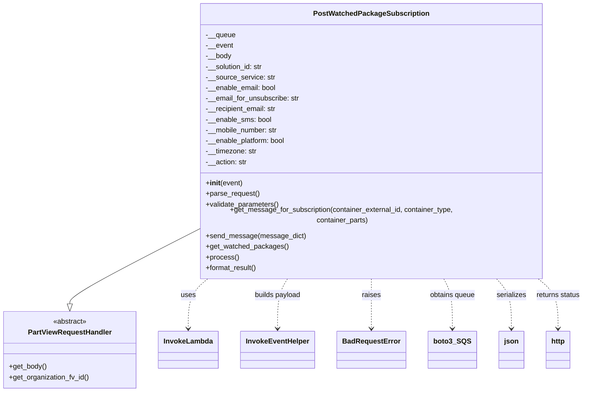

# Diagram: partview_core/partview_service/partview_service/api/watched_package_subscription/handler/post_watched_package_subscription.py


> Auto-generated by Obscura crawlers

## Diagram 1



### SVG

<svg id="container" width="1291.609375" xmlns="http://www.w3.org/2000/svg" class="classDiagram" height="864" viewBox="0 0 1291.609375 864" role="graphics-document document" aria-roledescription="class"><style>#container{font-family:"trebuchet ms",verdana,arial,sans-serif;font-size:16px;fill:#333;}@keyframes edge-animation-frame{from{stroke-dashoffset:0;}}@keyframes dash{to{stroke-dashoffset:0;}}#container .edge-animation-slow{stroke-dasharray:9,5!important;stroke-dashoffset:900;animation:dash 50s linear infinite;stroke-linecap:round;}#container .edge-animation-fast{stroke-dasharray:9,5!important;stroke-dashoffset:900;animation:dash 20s linear infinite;stroke-linecap:round;}#container .error-icon{fill:#552222;}#container .error-text{fill:#552222;stroke:#552222;}#container .edge-thickness-normal{stroke-width:1px;}#container .edge-thickness-thick{stroke-width:3.5px;}#container .edge-pattern-solid{stroke-dasharray:0;}#container .edge-thickness-invisible{stroke-width:0;fill:none;}#container .edge-pattern-dashed{stroke-dasharray:3;}#container .edge-pattern-dotted{stroke-dasharray:2;}#container .marker{fill:#333333;stroke:#333333;}#container .marker.cross{stroke:#333333;}#container svg{font-family:"trebuchet ms",verdana,arial,sans-serif;font-size:16px;}#container p{margin:0;}#container g.classGroup text{fill:#9370DB;stroke:none;font-family:"trebuchet ms",verdana,arial,sans-serif;font-size:10px;}#container g.classGroup text .title{font-weight:bolder;}#container .nodeLabel,#container .edgeLabel{color:#131300;}#container .edgeLabel .label rect{fill:#ECECFF;}#container .label text{fill:#131300;}#container .labelBkg{background:#ECECFF;}#container .edgeLabel .label span{background:#ECECFF;}#container .classTitle{font-weight:bolder;}#container .node rect,#container .node circle,#container .node ellipse,#container .node polygon,#container .node path{fill:#ECECFF;stroke:#9370DB;stroke-width:1px;}#container .divider{stroke:#9370DB;stroke-width:1;}#container g.clickable{cursor:pointer;}#container g.classGroup rect{fill:#ECECFF;stroke:#9370DB;}#container g.classGroup line{stroke:#9370DB;stroke-width:1;}#container .classLabel .box{stroke:none;stroke-width:0;fill:#ECECFF;opacity:0.5;}#container .classLabel .label{fill:#9370DB;font-size:10px;}#container .relation{stroke:#333333;stroke-width:1;fill:none;}#container .dashed-line{stroke-dasharray:3;}#container .dotted-line{stroke-dasharray:1 2;}#container #compositionStart,#container .composition{fill:#333333!important;stroke:#333333!important;stroke-width:1;}#container #compositionEnd,#container .composition{fill:#333333!important;stroke:#333333!important;stroke-width:1;}#container #dependencyStart,#container .dependency{fill:#333333!important;stroke:#333333!important;stroke-width:1;}#container #dependencyStart,#container .dependency{fill:#333333!important;stroke:#333333!important;stroke-width:1;}#container #extensionStart,#container .extension{fill:transparent!important;stroke:#333333!important;stroke-width:1;}#container #extensionEnd,#container .extension{fill:transparent!important;stroke:#333333!important;stroke-width:1;}#container #aggregationStart,#container .aggregation{fill:transparent!important;stroke:#333333!important;stroke-width:1;}#container #aggregationEnd,#container .aggregation{fill:transparent!important;stroke:#333333!important;stroke-width:1;}#container #lollipopStart,#container .lollipop{fill:#ECECFF!important;stroke:#333333!important;stroke-width:1;}#container #lollipopEnd,#container .lollipop{fill:#ECECFF!important;stroke:#333333!important;stroke-width:1;}#container .edgeTerminals{font-size:11px;line-height:initial;}#container .classTitleText{text-anchor:middle;font-size:18px;fill:#333;}#container .label-icon{display:inline-block;height:1em;overflow:visible;vertical-align:-0.125em;}#container .node .label-icon path{fill:currentColor;stroke:revert;stroke-width:revert;}#container :root{--mermaid-font-family:"trebuchet ms",verdana,arial,sans-serif;}</style><g><defs><marker id="container_class-aggregationStart" class="marker aggregation class" refX="18" refY="7" markerWidth="190" markerHeight="240" orient="auto"><path d="M 18,7 L9,13 L1,7 L9,1 Z"></path></marker></defs><defs><marker id="container_class-aggregationEnd" class="marker aggregation class" refX="1" refY="7" markerWidth="20" markerHeight="28" orient="auto"><path d="M 18,7 L9,13 L1,7 L9,1 Z"></path></marker></defs><defs><marker id="container_class-extensionStart" class="marker extension class" refX="18" refY="7" markerWidth="190" markerHeight="240" orient="auto"><path d="M 1,7 L18,13 V 1 Z"></path></marker></defs><defs><marker id="container_class-extensionEnd" class="marker extension class" refX="1" refY="7" markerWidth="20" markerHeight="28" orient="auto"><path d="M 1,1 V 13 L18,7 Z"></path></marker></defs><defs><marker id="container_class-compositionStart" class="marker composition class" refX="18" refY="7" markerWidth="190" markerHeight="240" orient="auto"><path d="M 18,7 L9,13 L1,7 L9,1 Z"></path></marker></defs><defs><marker id="container_class-compositionEnd" class="marker composition class" refX="1" refY="7" markerWidth="20" markerHeight="28" orient="auto"><path d="M 18,7 L9,13 L1,7 L9,1 Z"></path></marker></defs><defs><marker id="container_class-dependencyStart" class="marker dependency class" refX="6" refY="7" markerWidth="190" markerHeight="240" orient="auto"><path d="M 5,7 L9,13 L1,7 L9,1 Z"></path></marker></defs><defs><marker id="container_class-dependencyEnd" class="marker dependency class" refX="13" refY="7" markerWidth="20" markerHeight="28" orient="auto"><path d="M 18,7 L9,13 L14,7 L9,1 Z"></path></marker></defs><defs><marker id="container_class-lollipopStart" class="marker lollipop class" refX="13" refY="7" markerWidth="190" markerHeight="240" orient="auto"><circle stroke="black" fill="transparent" cx="7" cy="7" r="6"></circle></marker></defs><defs><marker id="container_class-lollipopEnd" class="marker lollipop class" refX="1" refY="7" markerWidth="190" markerHeight="240" orient="auto"><circle stroke="black" fill="transparent" cx="7" cy="7" r="6"></circle></marker></defs><g class="root"><g class="clusters"></g><g class="edgePaths"><path d="M432.773,505.467L386.793,528.723C340.813,551.978,248.852,598.489,202.871,625.036C156.891,651.583,156.891,658.167,156.891,661.458L156.891,664.75" id="id_PostWatchedPackageSubscription_PartViewRequestHandler_1" class="edge-thickness-normal edge-pattern-solid relation" style=";;;" data-edge="true" data-et="edge" data-id="id_PostWatchedPackageSubscription_PartViewRequestHandler_1" data-points="W3sieCI6NDMyLjc3MzQzNzUsInkiOjUwNS40NjcxMTE0MzQxOTk0fSx7IngiOjE1Ni44OTA2MjUsInkiOjY0NX0seyJ4IjoxNTYuODkwNjI1LCJ5Ijo2ODJ9XQ==" marker-end="url(#container_class-extensionEnd)"></path><path d="M465.395,608L458.04,614.167C450.685,620.333,435.976,632.667,428.621,651.5C421.266,670.333,421.266,695.667,421.266,708.333L421.266,721" id="id_PostWatchedPackageSubscription_InvokeLambda_2" class="edge-thickness-normal edge-pattern-dashed relation" style=";;;" data-edge="true" data-et="edge" data-id="id_PostWatchedPackageSubscription_InvokeLambda_2" data-points="W3sieCI6NDY1LjM5NTI2MTQ5ODUxNjMzLCJ5Ijo2MDh9LHsieCI6NDIxLjI2NTYyNSwieSI6NjQ1fSx7IngiOjQyMS4yNjU2MjUsInkiOjcyN31d" marker-end="url(#container_class-dependencyEnd)"></path><path d="M640.384,608L636.626,614.167C632.868,620.333,625.352,632.667,621.594,651.5C617.836,670.333,617.836,695.667,617.836,708.333L617.836,721" id="id_PostWatchedPackageSubscription_InvokeEventHelper_3" class="edge-thickness-normal edge-pattern-dashed relation" style=";;;" data-edge="true" data-et="edge" data-id="id_PostWatchedPackageSubscription_InvokeEventHelper_3" data-points="W3sieCI6NjQwLjM4MzY3MDI1MjIyNTYsInkiOjYwOH0seyJ4Ijo2MTcuODM1OTM3NSwieSI6NjQ1fSx7IngiOjYxNy44MzU5Mzc1LCJ5Ijo3Mjd9XQ==" marker-end="url(#container_class-dependencyEnd)"></path><path d="M823.203,608L823.203,614.167C823.203,620.333,823.203,632.667,823.203,651.5C823.203,670.333,823.203,695.667,823.203,708.333L823.203,721" id="id_PostWatchedPackageSubscription_BadRequestError_4" class="edge-thickness-normal edge-pattern-dashed relation" style=";;;" data-edge="true" data-et="edge" data-id="id_PostWatchedPackageSubscription_BadRequestError_4" data-points="W3sieCI6ODIzLjIwMzEyNSwieSI6NjA4fSx7IngiOjgyMy4yMDMxMjUsInkiOjY0NX0seyJ4Ijo4MjMuMjAzMTI1LCJ5Ijo3Mjd9XQ==" marker-end="url(#container_class-dependencyEnd)"></path><path d="M979.754,608L982.972,614.167C986.19,620.333,992.626,632.667,995.844,651.5C999.063,670.333,999.063,695.667,999.063,708.333L999.063,721" id="id_PostWatchedPackageSubscription_boto3_SQS_5" class="edge-thickness-normal edge-pattern-dashed relation" style=";;;" data-edge="true" data-et="edge" data-id="id_PostWatchedPackageSubscription_boto3_SQS_5" data-points="W3sieCI6OTc5Ljc1NDQ5NzQwMzU2MDksInkiOjYwOH0seyJ4Ijo5OTkuMDYyNSwieSI6NjQ1fSx7IngiOjk5OS4wNjI1LCJ5Ijo3Mjd9XQ==" marker-end="url(#container_class-dependencyEnd)"></path><path d="M1094.577,608L1100.156,614.167C1105.734,620.333,1116.89,632.667,1122.469,651.5C1128.047,670.333,1128.047,695.667,1128.047,708.333L1128.047,721" id="id_PostWatchedPackageSubscription_json_6" class="edge-thickness-normal edge-pattern-dashed relation" style=";;;" data-edge="true" data-et="edge" data-id="id_PostWatchedPackageSubscription_json_6" data-points="W3sieCI6MTA5NC41NzczODMxNjAyMzczLCJ5Ijo2MDh9LHsieCI6MTEyOC4wNDY4NzUsInkiOjY0NX0seyJ4IjoxMTI4LjA0Njg3NSwieSI6NzI3fV0=" marker-end="url(#container_class-dependencyEnd)"></path><path d="M1188.028,608L1195.528,614.167C1203.027,620.333,1218.025,632.667,1225.524,651.5C1233.023,670.333,1233.023,695.667,1233.023,708.333L1233.023,721" id="id_PostWatchedPackageSubscription_http_7" class="edge-thickness-normal edge-pattern-dashed relation" style=";;;" data-edge="true" data-et="edge" data-id="id_PostWatchedPackageSubscription_http_7" data-points="W3sieCI6MTE4OC4wMjgzMjkwMDU5MzQ3LCJ5Ijo2MDh9LHsieCI6MTIzMy4wMjM0Mzc1LCJ5Ijo2NDV9LHsieCI6MTIzMy4wMjM0Mzc1LCJ5Ijo3Mjd9XQ==" marker-end="url(#container_class-dependencyEnd)"></path></g><g class="edgeLabels"><g class="edgeLabel"><g class="label" data-id="id_PostWatchedPackageSubscription_PartViewRequestHandler_1" transform="translate(0, 0)"><foreignObject width="0" height="0"><div xmlns="http://www.w3.org/1999/xhtml" class="labelBkg" style="display: table-cell; white-space: nowrap; line-height: 1.5; max-width: 200px; text-align: center;"><span class="edgeLabel"></span></div></foreignObject></g></g><g class="edgeLabel" transform="translate(421.265625, 645)"><g class="label" data-id="id_PostWatchedPackageSubscription_InvokeLambda_2" transform="translate(-16.4921875, -12)"><foreignObject width="32.984375" height="24"><div xmlns="http://www.w3.org/1999/xhtml" class="labelBkg" style="display: table-cell; white-space: nowrap; line-height: 1.5; max-width: 200px; text-align: center;"><span class="edgeLabel"><p>uses</p></span></div></foreignObject></g></g><g class="edgeLabel" transform="translate(617.8359375, 645)"><g class="label" data-id="id_PostWatchedPackageSubscription_InvokeEventHelper_3" transform="translate(-53.484375, -12)"><foreignObject width="106.96875" height="24"><div xmlns="http://www.w3.org/1999/xhtml" class="labelBkg" style="display: table-cell; white-space: nowrap; line-height: 1.5; max-width: 200px; text-align: center;"><span class="edgeLabel"><p>builds payload</p></span></div></foreignObject></g></g><g class="edgeLabel" transform="translate(823.203125, 645)"><g class="label" data-id="id_PostWatchedPackageSubscription_BadRequestError_4" transform="translate(-21.25, -12)"><foreignObject width="42.5" height="24"><div xmlns="http://www.w3.org/1999/xhtml" class="labelBkg" style="display: table-cell; white-space: nowrap; line-height: 1.5; max-width: 200px; text-align: center;"><span class="edgeLabel"><p>raises</p></span></div></foreignObject></g></g><g class="edgeLabel" transform="translate(999.0625, 645)"><g class="label" data-id="id_PostWatchedPackageSubscription_boto3_SQS_5" transform="translate(-52.2265625, -12)"><foreignObject width="104.453125" height="24"><div xmlns="http://www.w3.org/1999/xhtml" class="labelBkg" style="display: table-cell; white-space: nowrap; line-height: 1.5; max-width: 200px; text-align: center;"><span class="edgeLabel"><p>obtains queue</p></span></div></foreignObject></g></g><g class="edgeLabel" transform="translate(1128.046875, 645)"><g class="label" data-id="id_PostWatchedPackageSubscription_json_6" transform="translate(-33.8515625, -12)"><foreignObject width="67.703125" height="24"><div xmlns="http://www.w3.org/1999/xhtml" class="labelBkg" style="display: table-cell; white-space: nowrap; line-height: 1.5; max-width: 200px; text-align: center;"><span class="edgeLabel"><p>serializes</p></span></div></foreignObject></g></g><g class="edgeLabel" transform="translate(1233.0234375, 645)"><g class="label" data-id="id_PostWatchedPackageSubscription_http_7" transform="translate(-50.5859375, -12)"><foreignObject width="101.171875" height="24"><div xmlns="http://www.w3.org/1999/xhtml" class="labelBkg" style="display: table-cell; white-space: nowrap; line-height: 1.5; max-width: 200px; text-align: center;"><span class="edgeLabel"><p>returns status</p></span></div></foreignObject></g></g></g><g class="nodes"><g class="node default" id="classId-PartViewRequestHandler-0" transform="translate(156.890625, 769)"><g class="basic label-container"><path d="M-148.890625 -87 L148.890625 -87 L148.890625 87 L-148.890625 87" stroke="none" stroke-width="0" fill="#ECECFF" style=""></path><path d="M-148.890625 -87 C-69.80898158910537 -87, 9.272661821789256 -87, 148.890625 -87 M-148.890625 -87 C-41.22617357682712 -87, 66.43827784634576 -87, 148.890625 -87 M148.890625 -87 C148.890625 -46.92901796821956, 148.890625 -6.858035936439123, 148.890625 87 M148.890625 -87 C148.890625 -37.454636629903625, 148.890625 12.09072674019275, 148.890625 87 M148.890625 87 C35.74275990105524 87, -77.40510519788953 87, -148.890625 87 M148.890625 87 C40.751076070847006 87, -67.38847285830599 87, -148.890625 87 M-148.890625 87 C-148.890625 29.634273378810562, -148.890625 -27.731453242378876, -148.890625 -87 M-148.890625 87 C-148.890625 40.208689212858005, -148.890625 -6.582621574283991, -148.890625 -87" stroke="#9370DB" stroke-width="1.3" fill="none" stroke-dasharray="0 0" style=""></path></g><g class="annotation-group text" transform="translate(-38.609375, -63)"><g class="label" style="" transform="translate(0,-12)"><foreignObject width="77.21875" height="24"><div xmlns="http://www.w3.org/1999/xhtml" style="display: table-cell; white-space: nowrap; line-height: 1.5; max-width: 127px; text-align: center;"><span class="nodeLabel markdown-node-label" style=""><p>«abstract»</p></span></div></foreignObject></g></g><g class="label-group text" transform="translate(-91.359375, -39)"><g class="label" style="font-weight: bolder" transform="translate(0,-12)"><foreignObject width="182.71875" height="24"><div xmlns="http://www.w3.org/1999/xhtml" style="display: table-cell; white-space: nowrap; line-height: 1.5; max-width: 231px; text-align: center;"><span class="nodeLabel markdown-node-label" style=""><p>PartViewRequestHandler</p></span></div></foreignObject></g></g><g class="members-group text" transform="translate(-136.890625, 9)"></g><g class="methods-group text" transform="translate(-136.890625, 39)"><g class="label" style="" transform="translate(0,-12)"><foreignObject width="85.53125" height="24"><div xmlns="http://www.w3.org/1999/xhtml" style="display: table-cell; white-space: nowrap; line-height: 1.5; max-width: 143px; text-align: center;"><span class="nodeLabel markdown-node-label" style=""><p>+get_body()</p></span></div></foreignObject></g><g class="label" style="" transform="translate(0,12)"><foreignObject width="182.421875" height="24"><div xmlns="http://www.w3.org/1999/xhtml" style="display: table-cell; white-space: nowrap; line-height: 1.5; max-width: 240px; text-align: center;"><span class="nodeLabel markdown-node-label" style=""><p>+get_organization_fv_id()</p></span></div></foreignObject></g></g><g class="divider" style=""><path d="M-148.890625 -15 C-74.64708429848565 -15, -0.4035435969713035 -15, 148.890625 -15 M-148.890625 -15 C-63.73220089534905 -15, 21.426223209301895 -15, 148.890625 -15" stroke="#9370DB" stroke-width="1.3" fill="none" stroke-dasharray="0 0" style=""></path></g><g class="divider" style=""><path d="M-148.890625 9 C-61.212588324529136 9, 26.465448350941728 9, 148.890625 9 M-148.890625 9 C-54.82048087320051 9, 39.24966325359898 9, 148.890625 9" stroke="#9370DB" stroke-width="1.3" fill="none" stroke-dasharray="0 0" style=""></path></g></g><g class="node default" id="classId-PostWatchedPackageSubscription-1" transform="translate(823.203125, 308)"><g class="basic label-container"><path d="M-390.4296875 -300 L390.4296875 -300 L390.4296875 300 L-390.4296875 300" stroke="none" stroke-width="0" fill="#ECECFF" style=""></path><path d="M-390.4296875 -300 C-191.7886380851871 -300, 6.852411329625795 -300, 390.4296875 -300 M-390.4296875 -300 C-125.83970011730139 -300, 138.75028726539722 -300, 390.4296875 -300 M390.4296875 -300 C390.4296875 -93.0863125903671, 390.4296875 113.8273748192658, 390.4296875 300 M390.4296875 -300 C390.4296875 -93.73855603906071, 390.4296875 112.52288792187858, 390.4296875 300 M390.4296875 300 C113.25225686191965 300, -163.9251737761607 300, -390.4296875 300 M390.4296875 300 C182.43350522608904 300, -25.56267704782192 300, -390.4296875 300 M-390.4296875 300 C-390.4296875 173.41232564538603, -390.4296875 46.82465129077204, -390.4296875 -300 M-390.4296875 300 C-390.4296875 174.97588524704756, -390.4296875 49.951770494095115, -390.4296875 -300" stroke="#9370DB" stroke-width="1.3" fill="none" stroke-dasharray="0 0" style=""></path></g><g class="annotation-group text" transform="translate(0, -276)"></g><g class="label-group text" transform="translate(-124.0625, -276)"><g class="label" style="font-weight: bolder" transform="translate(0,-12)"><foreignObject width="248.125" height="24"><div xmlns="http://www.w3.org/1999/xhtml" style="display: table-cell; white-space: nowrap; line-height: 1.5; max-width: 294px; text-align: center;"><span class="nodeLabel markdown-node-label" style=""><p>PostWatchedPackageSubscription</p></span></div></foreignObject></g></g><g class="members-group text" transform="translate(-378.4296875, -228)"><g class="label" style="" transform="translate(0,-12)"><foreignObject width="66.96875" height="24"><div xmlns="http://www.w3.org/1999/xhtml" style="display: table-cell; white-space: nowrap; line-height: 1.5; max-width: 124px; text-align: center;"><span class="nodeLabel markdown-node-label" style=""><p>-__queue</p></span></div></foreignObject></g><g class="label" style="" transform="translate(0,12)"><foreignObject width="61.671875" height="24"><div xmlns="http://www.w3.org/1999/xhtml" style="display: table-cell; white-space: nowrap; line-height: 1.5; max-width: 119px; text-align: center;"><span class="nodeLabel markdown-node-label" style=""><p>-__event</p></span></div></foreignObject></g><g class="label" style="" transform="translate(0,36)"><foreignObject width="57.9375" height="24"><div xmlns="http://www.w3.org/1999/xhtml" style="display: table-cell; white-space: nowrap; line-height: 1.5; max-width: 115px; text-align: center;"><span class="nodeLabel markdown-node-label" style=""><p>-__body</p></span></div></foreignObject></g><g class="label" style="" transform="translate(0,60)"><foreignObject width="131.390625" height="24"><div xmlns="http://www.w3.org/1999/xhtml" style="display: table-cell; white-space: nowrap; line-height: 1.5; max-width: 190px; text-align: center;"><span class="nodeLabel markdown-node-label" style=""><p>-__solution_id: str</p></span></div></foreignObject></g><g class="label" style="" transform="translate(0,84)"><foreignObject width="155.828125" height="24"><div xmlns="http://www.w3.org/1999/xhtml" style="display: table-cell; white-space: nowrap; line-height: 1.5; max-width: 214px; text-align: center;"><span class="nodeLabel markdown-node-label" style=""><p>-__source_service: str</p></span></div></foreignObject></g><g class="label" style="" transform="translate(0,108)"><foreignObject width="160.109375" height="24"><div xmlns="http://www.w3.org/1999/xhtml" style="display: table-cell; white-space: nowrap; line-height: 1.5; max-width: 218px; text-align: center;"><span class="nodeLabel markdown-node-label" style=""><p>-__enable_email: bool</p></span></div></foreignObject></g><g class="label" style="" transform="translate(0,132)"><foreignObject width="213.625" height="24"><div xmlns="http://www.w3.org/1999/xhtml" style="display: table-cell; white-space: nowrap; line-height: 1.5; max-width: 272px; text-align: center;"><span class="nodeLabel markdown-node-label" style=""><p>-__email_for_unsubscribe: str</p></span></div></foreignObject></g><g class="label" style="" transform="translate(0,156)"><foreignObject width="162.125" height="24"><div xmlns="http://www.w3.org/1999/xhtml" style="display: table-cell; white-space: nowrap; line-height: 1.5; max-width: 220px; text-align: center;"><span class="nodeLabel markdown-node-label" style=""><p>-__recipient_email: str</p></span></div></foreignObject></g><g class="label" style="" transform="translate(0,180)"><foreignObject width="148.578125" height="24"><div xmlns="http://www.w3.org/1999/xhtml" style="display: table-cell; white-space: nowrap; line-height: 1.5; max-width: 206px; text-align: center;"><span class="nodeLabel markdown-node-label" style=""><p>-__enable_sms: bool</p></span></div></foreignObject></g><g class="label" style="" transform="translate(0,204)"><foreignObject width="164.515625" height="24"><div xmlns="http://www.w3.org/1999/xhtml" style="display: table-cell; white-space: nowrap; line-height: 1.5; max-width: 223px; text-align: center;"><span class="nodeLabel markdown-node-label" style=""><p>-__mobile_number: str</p></span></div></foreignObject></g><g class="label" style="" transform="translate(0,228)"><foreignObject width="182.953125" height="24"><div xmlns="http://www.w3.org/1999/xhtml" style="display: table-cell; white-space: nowrap; line-height: 1.5; max-width: 241px; text-align: center;"><span class="nodeLabel markdown-node-label" style=""><p>-__enable_platform: bool</p></span></div></foreignObject></g><g class="label" style="" transform="translate(0,252)"><foreignObject width="115.765625" height="24"><div xmlns="http://www.w3.org/1999/xhtml" style="display: table-cell; white-space: nowrap; line-height: 1.5; max-width: 174px; text-align: center;"><span class="nodeLabel markdown-node-label" style=""><p>-__timezone: str</p></span></div></foreignObject></g><g class="label" style="" transform="translate(0,276)"><foreignObject width="94.203125" height="24"><div xmlns="http://www.w3.org/1999/xhtml" style="display: table-cell; white-space: nowrap; line-height: 1.5; max-width: 152px; text-align: center;"><span class="nodeLabel markdown-node-label" style=""><p>-__action: str</p></span></div></foreignObject></g></g><g class="methods-group text" transform="translate(-378.4296875, 108)"><g class="label" style="" transform="translate(0,-12)"><foreignObject width="83.140625" height="24"><div xmlns="http://www.w3.org/1999/xhtml" style="display: table-cell; white-space: nowrap; line-height: 1.5; max-width: 172px; text-align: center;"><span class="nodeLabel markdown-node-label" style=""><p>+<strong>init</strong>(event)</p></span></div></foreignObject></g><g class="label" style="" transform="translate(0,12)"><foreignObject width="121.796875" height="24"><div xmlns="http://www.w3.org/1999/xhtml" style="display: table-cell; white-space: nowrap; line-height: 1.5; max-width: 179px; text-align: center;"><span class="nodeLabel markdown-node-label" style=""><p>+parse_request()</p></span></div></foreignObject></g><g class="label" style="" transform="translate(0,36)"><foreignObject width="166.546875" height="24"><div xmlns="http://www.w3.org/1999/xhtml" style="display: table-cell; white-space: nowrap; line-height: 1.5; max-width: 224px; text-align: center;"><span class="nodeLabel markdown-node-label" style=""><p>+validate_parameters()</p></span></div></foreignObject></g><g class="label" style="" transform="translate(0,60)"><foreignObject width="632.796875" height="24"><div xmlns="http://www.w3.org/1999/xhtml" style="display: table-cell; white-space: nowrap; line-height: 1.5; max-width: 690px; text-align: center;"><span class="nodeLabel markdown-node-label" style=""><p>+get_message_for_subscription(container_external_id, container_type, container_parts)</p></span></div></foreignObject></g><g class="label" style="" transform="translate(0,84)"><foreignObject width="221.765625" height="24"><div xmlns="http://www.w3.org/1999/xhtml" style="display: table-cell; white-space: nowrap; line-height: 1.5; max-width: 279px; text-align: center;"><span class="nodeLabel markdown-node-label" style=""><p>+send_message(message_dict)</p></span></div></foreignObject></g><g class="label" style="" transform="translate(0,108)"><foreignObject width="184.515625" height="24"><div xmlns="http://www.w3.org/1999/xhtml" style="display: table-cell; white-space: nowrap; line-height: 1.5; max-width: 242px; text-align: center;"><span class="nodeLabel markdown-node-label" style=""><p>+get_watched_packages()</p></span></div></foreignObject></g><g class="label" style="" transform="translate(0,132)"><foreignObject width="73.734375" height="24"><div xmlns="http://www.w3.org/1999/xhtml" style="display: table-cell; white-space: nowrap; line-height: 1.5; max-width: 131px; text-align: center;"><span class="nodeLabel markdown-node-label" style=""><p>+process()</p></span></div></foreignObject></g><g class="label" style="" transform="translate(0,156)"><foreignObject width="117.015625" height="24"><div xmlns="http://www.w3.org/1999/xhtml" style="display: table-cell; white-space: nowrap; line-height: 1.5; max-width: 174px; text-align: center;"><span class="nodeLabel markdown-node-label" style=""><p>+format_result()</p></span></div></foreignObject></g></g><g class="divider" style=""><path d="M-390.4296875 -252 C-161.75380545606106 -252, 66.92207658787788 -252, 390.4296875 -252 M-390.4296875 -252 C-126.6518564169254 -252, 137.1259746661492 -252, 390.4296875 -252" stroke="#9370DB" stroke-width="1.3" fill="none" stroke-dasharray="0 0" style=""></path></g><g class="divider" style=""><path d="M-390.4296875 84 C-227.07734021126623 84, -63.724992922532465 84, 390.4296875 84 M-390.4296875 84 C-214.41078746636893 84, -38.39188743273786 84, 390.4296875 84" stroke="#9370DB" stroke-width="1.3" fill="none" stroke-dasharray="0 0" style=""></path></g></g><g class="node default" id="classId-InvokeLambda-2" transform="translate(421.265625, 769)"><g class="basic label-container"><path d="M-65.484375 -42 L65.484375 -42 L65.484375 42 L-65.484375 42" stroke="none" stroke-width="0" fill="#ECECFF" style=""></path><path d="M-65.484375 -42 C-35.448490249919956 -42, -5.412605499839913 -42, 65.484375 -42 M-65.484375 -42 C-25.718459507515185 -42, 14.04745598496963 -42, 65.484375 -42 M65.484375 -42 C65.484375 -24.891719827707053, 65.484375 -7.7834396554141065, 65.484375 42 M65.484375 -42 C65.484375 -19.82833939506244, 65.484375 2.3433212098751213, 65.484375 42 M65.484375 42 C30.289694401499183 42, -4.904986197001634 42, -65.484375 42 M65.484375 42 C39.18765779215971 42, 12.890940584319424 42, -65.484375 42 M-65.484375 42 C-65.484375 16.39146384263603, -65.484375 -9.217072314727943, -65.484375 -42 M-65.484375 42 C-65.484375 24.86839823693089, -65.484375 7.73679647386178, -65.484375 -42" stroke="#9370DB" stroke-width="1.3" fill="none" stroke-dasharray="0 0" style=""></path></g><g class="annotation-group text" transform="translate(0, -18)"></g><g class="label-group text" transform="translate(-53.484375, -18)"><g class="label" style="font-weight: bolder" transform="translate(0,-12)"><foreignObject width="106.96875" height="24"><div xmlns="http://www.w3.org/1999/xhtml" style="display: table-cell; white-space: nowrap; line-height: 1.5; max-width: 156px; text-align: center;"><span class="nodeLabel markdown-node-label" style=""><p>InvokeLambda</p></span></div></foreignObject></g></g><g class="members-group text" transform="translate(-53.484375, 30)"></g><g class="methods-group text" transform="translate(-53.484375, 60)"></g><g class="divider" style=""><path d="M-65.484375 6 C-28.533262170382145 6, 8.417850659235711 6, 65.484375 6 M-65.484375 6 C-20.418610760636312 6, 24.647153478727375 6, 65.484375 6" stroke="#9370DB" stroke-width="1.3" fill="none" stroke-dasharray="0 0" style=""></path></g><g class="divider" style=""><path d="M-65.484375 24 C-38.643928141246874 24, -11.803481282493756 24, 65.484375 24 M-65.484375 24 C-34.45524555944571 24, -3.4261161188914144 24, 65.484375 24" stroke="#9370DB" stroke-width="1.3" fill="none" stroke-dasharray="0 0" style=""></path></g></g><g class="node default" id="classId-InvokeEventHelper-3" transform="translate(617.8359375, 769)"><g class="basic label-container"><path d="M-81.0859375 -42 L81.0859375 -42 L81.0859375 42 L-81.0859375 42" stroke="none" stroke-width="0" fill="#ECECFF" style=""></path><path d="M-81.0859375 -42 C-32.208022254583334 -42, 16.669892990833333 -42, 81.0859375 -42 M-81.0859375 -42 C-25.50985597210233 -42, 30.06622555579534 -42, 81.0859375 -42 M81.0859375 -42 C81.0859375 -11.9391436123693, 81.0859375 18.1217127752614, 81.0859375 42 M81.0859375 -42 C81.0859375 -16.550019064089618, 81.0859375 8.899961871820764, 81.0859375 42 M81.0859375 42 C37.5369524479547 42, -6.0120326040906065 42, -81.0859375 42 M81.0859375 42 C42.380220318523904 42, 3.6745031370478074 42, -81.0859375 42 M-81.0859375 42 C-81.0859375 12.066072560470232, -81.0859375 -17.867854879059536, -81.0859375 -42 M-81.0859375 42 C-81.0859375 18.197860488234507, -81.0859375 -5.604279023530985, -81.0859375 -42" stroke="#9370DB" stroke-width="1.3" fill="none" stroke-dasharray="0 0" style=""></path></g><g class="annotation-group text" transform="translate(0, -18)"></g><g class="label-group text" transform="translate(-69.0859375, -18)"><g class="label" style="font-weight: bolder" transform="translate(0,-12)"><foreignObject width="138.171875" height="24"><div xmlns="http://www.w3.org/1999/xhtml" style="display: table-cell; white-space: nowrap; line-height: 1.5; max-width: 187px; text-align: center;"><span class="nodeLabel markdown-node-label" style=""><p>InvokeEventHelper</p></span></div></foreignObject></g></g><g class="members-group text" transform="translate(-69.0859375, 30)"></g><g class="methods-group text" transform="translate(-69.0859375, 60)"></g><g class="divider" style=""><path d="M-81.0859375 6 C-29.025029086766352 6, 23.035879326467295 6, 81.0859375 6 M-81.0859375 6 C-22.869556633357078 6, 35.346824233285844 6, 81.0859375 6" stroke="#9370DB" stroke-width="1.3" fill="none" stroke-dasharray="0 0" style=""></path></g><g class="divider" style=""><path d="M-81.0859375 24 C-41.53335753048569 24, -1.9807775609713758 24, 81.0859375 24 M-81.0859375 24 C-26.31982483018836 24, 28.44628783962328 24, 81.0859375 24" stroke="#9370DB" stroke-width="1.3" fill="none" stroke-dasharray="0 0" style=""></path></g></g><g class="node default" id="classId-BadRequestError-4" transform="translate(823.203125, 769)"><g class="basic label-container"><path d="M-74.28125 -42 L74.28125 -42 L74.28125 42 L-74.28125 42" stroke="none" stroke-width="0" fill="#ECECFF" style=""></path><path d="M-74.28125 -42 C-35.11657812072576 -42, 4.048093758548475 -42, 74.28125 -42 M-74.28125 -42 C-31.26713696543598 -42, 11.746976069128038 -42, 74.28125 -42 M74.28125 -42 C74.28125 -12.450418705800264, 74.28125 17.099162588399473, 74.28125 42 M74.28125 -42 C74.28125 -16.789018572024805, 74.28125 8.42196285595039, 74.28125 42 M74.28125 42 C18.1049687308792 42, -38.0713125382416 42, -74.28125 42 M74.28125 42 C23.160372719757042 42, -27.960504560485916 42, -74.28125 42 M-74.28125 42 C-74.28125 14.020814409039083, -74.28125 -13.958371181921834, -74.28125 -42 M-74.28125 42 C-74.28125 17.06948817913682, -74.28125 -7.861023641726362, -74.28125 -42" stroke="#9370DB" stroke-width="1.3" fill="none" stroke-dasharray="0 0" style=""></path></g><g class="annotation-group text" transform="translate(0, -18)"></g><g class="label-group text" transform="translate(-62.28125, -18)"><g class="label" style="font-weight: bolder" transform="translate(0,-12)"><foreignObject width="124.5625" height="24"><div xmlns="http://www.w3.org/1999/xhtml" style="display: table-cell; white-space: nowrap; line-height: 1.5; max-width: 174px; text-align: center;"><span class="nodeLabel markdown-node-label" style=""><p>BadRequestError</p></span></div></foreignObject></g></g><g class="members-group text" transform="translate(-62.28125, 30)"></g><g class="methods-group text" transform="translate(-62.28125, 60)"></g><g class="divider" style=""><path d="M-74.28125 6 C-15.038588203703128 6, 44.204073592593744 6, 74.28125 6 M-74.28125 6 C-43.25907484773656 6, -12.236899695473113 6, 74.28125 6" stroke="#9370DB" stroke-width="1.3" fill="none" stroke-dasharray="0 0" style=""></path></g><g class="divider" style=""><path d="M-74.28125 24 C-32.65733359264591 24, 8.966582814708175 24, 74.28125 24 M-74.28125 24 C-20.892079243263787 24, 32.49709151347243 24, 74.28125 24" stroke="#9370DB" stroke-width="1.3" fill="none" stroke-dasharray="0 0" style=""></path></g></g><g class="node default" id="classId-boto3_SQS-5" transform="translate(999.0625, 769)"><g class="basic label-container"><path d="M-51.578125 -42 L51.578125 -42 L51.578125 42 L-51.578125 42" stroke="none" stroke-width="0" fill="#ECECFF" style=""></path><path d="M-51.578125 -42 C-23.81842841529037 -42, 3.94126816941926 -42, 51.578125 -42 M-51.578125 -42 C-25.937226808781332 -42, -0.29632861756266493 -42, 51.578125 -42 M51.578125 -42 C51.578125 -24.767104011083244, 51.578125 -7.534208022166489, 51.578125 42 M51.578125 -42 C51.578125 -21.008433955210464, 51.578125 -0.0168679104209275, 51.578125 42 M51.578125 42 C26.94472964289605 42, 2.3113342857920998 42, -51.578125 42 M51.578125 42 C22.911645000734723 42, -5.754834998530555 42, -51.578125 42 M-51.578125 42 C-51.578125 16.68821645581145, -51.578125 -8.6235670883771, -51.578125 -42 M-51.578125 42 C-51.578125 18.637487772337558, -51.578125 -4.725024455324885, -51.578125 -42" stroke="#9370DB" stroke-width="1.3" fill="none" stroke-dasharray="0 0" style=""></path></g><g class="annotation-group text" transform="translate(0, -18)"></g><g class="label-group text" transform="translate(-39.578125, -18)"><g class="label" style="font-weight: bolder" transform="translate(0,-12)"><foreignObject width="79.15625" height="24"><div xmlns="http://www.w3.org/1999/xhtml" style="display: table-cell; white-space: nowrap; line-height: 1.5; max-width: 128px; text-align: center;"><span class="nodeLabel markdown-node-label" style=""><p>boto3_SQS</p></span></div></foreignObject></g></g><g class="members-group text" transform="translate(-39.578125, 30)"></g><g class="methods-group text" transform="translate(-39.578125, 60)"></g><g class="divider" style=""><path d="M-51.578125 6 C-19.53728861486207 6, 12.503547770275858 6, 51.578125 6 M-51.578125 6 C-29.449380144272794 6, -7.3206352885455885 6, 51.578125 6" stroke="#9370DB" stroke-width="1.3" fill="none" stroke-dasharray="0 0" style=""></path></g><g class="divider" style=""><path d="M-51.578125 24 C-24.076655966895544 24, 3.4248130662089125 24, 51.578125 24 M-51.578125 24 C-26.856420601746493 24, -2.134716203492985 24, 51.578125 24" stroke="#9370DB" stroke-width="1.3" fill="none" stroke-dasharray="0 0" style=""></path></g></g><g class="node default" id="classId-json-6" transform="translate(1128.046875, 769)"><g class="basic label-container"><path d="M-27.40625 -42 L27.40625 -42 L27.40625 42 L-27.40625 42" stroke="none" stroke-width="0" fill="#ECECFF" style=""></path><path d="M-27.40625 -42 C-16.320431660248147 -42, -5.234613320496294 -42, 27.40625 -42 M-27.40625 -42 C-10.037262785132391 -42, 7.3317244297352175 -42, 27.40625 -42 M27.40625 -42 C27.40625 -12.099258062305257, 27.40625 17.801483875389486, 27.40625 42 M27.40625 -42 C27.40625 -17.06250587986303, 27.40625 7.874988240273943, 27.40625 42 M27.40625 42 C15.290282480575543 42, 3.1743149611510866 42, -27.40625 42 M27.40625 42 C10.456352098223373 42, -6.493545803553253 42, -27.40625 42 M-27.40625 42 C-27.40625 20.895059951708877, -27.40625 -0.20988009658224627, -27.40625 -42 M-27.40625 42 C-27.40625 17.06164576980107, -27.40625 -7.876708460397857, -27.40625 -42" stroke="#9370DB" stroke-width="1.3" fill="none" stroke-dasharray="0 0" style=""></path></g><g class="annotation-group text" transform="translate(0, -18)"></g><g class="label-group text" transform="translate(-15.40625, -18)"><g class="label" style="font-weight: bolder" transform="translate(0,-12)"><foreignObject width="30.8125" height="24"><div xmlns="http://www.w3.org/1999/xhtml" style="display: table-cell; white-space: nowrap; line-height: 1.5; max-width: 82px; text-align: center;"><span class="nodeLabel markdown-node-label" style=""><p>json</p></span></div></foreignObject></g></g><g class="members-group text" transform="translate(-15.40625, 30)"></g><g class="methods-group text" transform="translate(-15.40625, 60)"></g><g class="divider" style=""><path d="M-27.40625 6 C-15.100522459368511 6, -2.794794918737022 6, 27.40625 6 M-27.40625 6 C-6.514967012679566 6, 14.376315974640868 6, 27.40625 6" stroke="#9370DB" stroke-width="1.3" fill="none" stroke-dasharray="0 0" style=""></path></g><g class="divider" style=""><path d="M-27.40625 24 C-13.075095489038723 24, 1.2560590219225531 24, 27.40625 24 M-27.40625 24 C-11.310036421082703 24, 4.786177157834594 24, 27.40625 24" stroke="#9370DB" stroke-width="1.3" fill="none" stroke-dasharray="0 0" style=""></path></g></g><g class="node default" id="classId-http-7" transform="translate(1233.0234375, 769)"><g class="basic label-container"><path d="M-27.5703125 -42 L27.5703125 -42 L27.5703125 42 L-27.5703125 42" stroke="none" stroke-width="0" fill="#ECECFF" style=""></path><path d="M-27.5703125 -42 C-13.788712428658078 -42, -0.007112357316156448 -42, 27.5703125 -42 M-27.5703125 -42 C-12.904093505398706 -42, 1.7621254892025888 -42, 27.5703125 -42 M27.5703125 -42 C27.5703125 -10.171045390843638, 27.5703125 21.657909218312724, 27.5703125 42 M27.5703125 -42 C27.5703125 -13.334284029790428, 27.5703125 15.331431940419144, 27.5703125 42 M27.5703125 42 C9.903109046955656 42, -7.764094406088688 42, -27.5703125 42 M27.5703125 42 C9.001096339719158 42, -9.568119820561684 42, -27.5703125 42 M-27.5703125 42 C-27.5703125 24.424062500417712, -27.5703125 6.848125000835424, -27.5703125 -42 M-27.5703125 42 C-27.5703125 17.35387502390149, -27.5703125 -7.292249952197018, -27.5703125 -42" stroke="#9370DB" stroke-width="1.3" fill="none" stroke-dasharray="0 0" style=""></path></g><g class="annotation-group text" transform="translate(0, -18)"></g><g class="label-group text" transform="translate(-15.5703125, -18)"><g class="label" style="font-weight: bolder" transform="translate(0,-12)"><foreignObject width="31.140625" height="24"><div xmlns="http://www.w3.org/1999/xhtml" style="display: table-cell; white-space: nowrap; line-height: 1.5; max-width: 80px; text-align: center;"><span class="nodeLabel markdown-node-label" style=""><p>http</p></span></div></foreignObject></g></g><g class="members-group text" transform="translate(-15.5703125, 30)"></g><g class="methods-group text" transform="translate(-15.5703125, 60)"></g><g class="divider" style=""><path d="M-27.5703125 6 C-8.914697524495573 6, 9.740917451008855 6, 27.5703125 6 M-27.5703125 6 C-16.144114335855658 6, -4.717916171711316 6, 27.5703125 6" stroke="#9370DB" stroke-width="1.3" fill="none" stroke-dasharray="0 0" style=""></path></g><g class="divider" style=""><path d="M-27.5703125 24 C-7.496506294412569 24, 12.577299911174862 24, 27.5703125 24 M-27.5703125 24 C-14.608342780340845 24, -1.6463730606816895 24, 27.5703125 24" stroke="#9370DB" stroke-width="1.3" fill="none" stroke-dasharray="0 0" style=""></path></g></g></g></g></g></svg>

## Diagram 2

```mermaid
flowchart LR
    A[Start: __init__(event)] --> B[parse_request()]
    B --> C{validate_parameters()}
    C -- valid --> D[get_watched_packages()]
    C -- invalid --> E[raise BadRequestError]
    D --> F[for each package in watched_packages]
    F --> G[extract container_external_id, container_type, container_parts]
    G --> H[filter out lifecycleState from parts]
    H --> I[get_message_for_subscription(...)]
    I --> J[send_message(message_dict) -> SQS]
    J --> K[loop next package]
    K --> L[after loop -> format_result()]
    L --> M[Return HTTPStatus.OK]
    E --> N[Stop]
```

> SVG rendering failed for this diagram.
