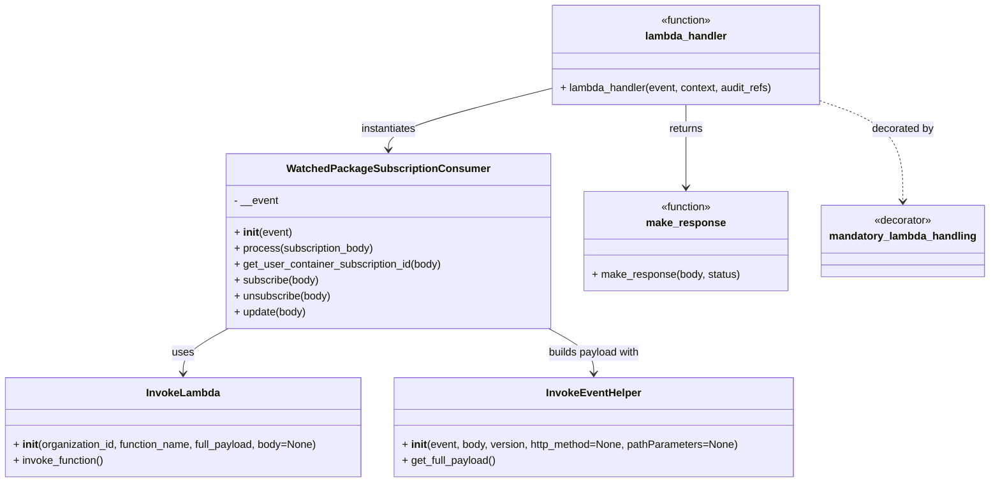

# Diagram: partview_core/partview_service/partview_service/api/watched_package_subscription/watched_package_subscription_consumer.py


> Auto-generated by Obscura crawlers

## Diagram 1



### SVG

<svg id="container" width="1487.041015625" xmlns="http://www.w3.org/2000/svg" class="classDiagram" height="728" viewBox="0 0 1487.041015625 728" role="graphics-document document" aria-roledescription="class"><style>#container{font-family:"trebuchet ms",verdana,arial,sans-serif;font-size:16px;fill:#333;}@keyframes edge-animation-frame{from{stroke-dashoffset:0;}}@keyframes dash{to{stroke-dashoffset:0;}}#container .edge-animation-slow{stroke-dasharray:9,5!important;stroke-dashoffset:900;animation:dash 50s linear infinite;stroke-linecap:round;}#container .edge-animation-fast{stroke-dasharray:9,5!important;stroke-dashoffset:900;animation:dash 20s linear infinite;stroke-linecap:round;}#container .error-icon{fill:#552222;}#container .error-text{fill:#552222;stroke:#552222;}#container .edge-thickness-normal{stroke-width:1px;}#container .edge-thickness-thick{stroke-width:3.5px;}#container .edge-pattern-solid{stroke-dasharray:0;}#container .edge-thickness-invisible{stroke-width:0;fill:none;}#container .edge-pattern-dashed{stroke-dasharray:3;}#container .edge-pattern-dotted{stroke-dasharray:2;}#container .marker{fill:#333333;stroke:#333333;}#container .marker.cross{stroke:#333333;}#container svg{font-family:"trebuchet ms",verdana,arial,sans-serif;font-size:16px;}#container p{margin:0;}#container g.classGroup text{fill:#9370DB;stroke:none;font-family:"trebuchet ms",verdana,arial,sans-serif;font-size:10px;}#container g.classGroup text .title{font-weight:bolder;}#container .nodeLabel,#container .edgeLabel{color:#131300;}#container .edgeLabel .label rect{fill:#ECECFF;}#container .label text{fill:#131300;}#container .labelBkg{background:#ECECFF;}#container .edgeLabel .label span{background:#ECECFF;}#container .classTitle{font-weight:bolder;}#container .node rect,#container .node circle,#container .node ellipse,#container .node polygon,#container .node path{fill:#ECECFF;stroke:#9370DB;stroke-width:1px;}#container .divider{stroke:#9370DB;stroke-width:1;}#container g.clickable{cursor:pointer;}#container g.classGroup rect{fill:#ECECFF;stroke:#9370DB;}#container g.classGroup line{stroke:#9370DB;stroke-width:1;}#container .classLabel .box{stroke:none;stroke-width:0;fill:#ECECFF;opacity:0.5;}#container .classLabel .label{fill:#9370DB;font-size:10px;}#container .relation{stroke:#333333;stroke-width:1;fill:none;}#container .dashed-line{stroke-dasharray:3;}#container .dotted-line{stroke-dasharray:1 2;}#container #compositionStart,#container .composition{fill:#333333!important;stroke:#333333!important;stroke-width:1;}#container #compositionEnd,#container .composition{fill:#333333!important;stroke:#333333!important;stroke-width:1;}#container #dependencyStart,#container .dependency{fill:#333333!important;stroke:#333333!important;stroke-width:1;}#container #dependencyStart,#container .dependency{fill:#333333!important;stroke:#333333!important;stroke-width:1;}#container #extensionStart,#container .extension{fill:transparent!important;stroke:#333333!important;stroke-width:1;}#container #extensionEnd,#container .extension{fill:transparent!important;stroke:#333333!important;stroke-width:1;}#container #aggregationStart,#container .aggregation{fill:transparent!important;stroke:#333333!important;stroke-width:1;}#container #aggregationEnd,#container .aggregation{fill:transparent!important;stroke:#333333!important;stroke-width:1;}#container #lollipopStart,#container .lollipop{fill:#ECECFF!important;stroke:#333333!important;stroke-width:1;}#container #lollipopEnd,#container .lollipop{fill:#ECECFF!important;stroke:#333333!important;stroke-width:1;}#container .edgeTerminals{font-size:11px;line-height:initial;}#container .classTitleText{text-anchor:middle;font-size:18px;fill:#333;}#container .label-icon{display:inline-block;height:1em;overflow:visible;vertical-align:-0.125em;}#container .node .label-icon path{fill:currentColor;stroke:revert;stroke-width:revert;}#container :root{--mermaid-font-family:"trebuchet ms",verdana,arial,sans-serif;}</style><g><defs><marker id="container_class-aggregationStart" class="marker aggregation class" refX="18" refY="7" markerWidth="190" markerHeight="240" orient="auto"><path d="M 18,7 L9,13 L1,7 L9,1 Z"></path></marker></defs><defs><marker id="container_class-aggregationEnd" class="marker aggregation class" refX="1" refY="7" markerWidth="20" markerHeight="28" orient="auto"><path d="M 18,7 L9,13 L1,7 L9,1 Z"></path></marker></defs><defs><marker id="container_class-extensionStart" class="marker extension class" refX="18" refY="7" markerWidth="190" markerHeight="240" orient="auto"><path d="M 1,7 L18,13 V 1 Z"></path></marker></defs><defs><marker id="container_class-extensionEnd" class="marker extension class" refX="1" refY="7" markerWidth="20" markerHeight="28" orient="auto"><path d="M 1,1 V 13 L18,7 Z"></path></marker></defs><defs><marker id="container_class-compositionStart" class="marker composition class" refX="18" refY="7" markerWidth="190" markerHeight="240" orient="auto"><path d="M 18,7 L9,13 L1,7 L9,1 Z"></path></marker></defs><defs><marker id="container_class-compositionEnd" class="marker composition class" refX="1" refY="7" markerWidth="20" markerHeight="28" orient="auto"><path d="M 18,7 L9,13 L1,7 L9,1 Z"></path></marker></defs><defs><marker id="container_class-dependencyStart" class="marker dependency class" refX="6" refY="7" markerWidth="190" markerHeight="240" orient="auto"><path d="M 5,7 L9,13 L1,7 L9,1 Z"></path></marker></defs><defs><marker id="container_class-dependencyEnd" class="marker dependency class" refX="13" refY="7" markerWidth="20" markerHeight="28" orient="auto"><path d="M 18,7 L9,13 L14,7 L9,1 Z"></path></marker></defs><defs><marker id="container_class-lollipopStart" class="marker lollipop class" refX="13" refY="7" markerWidth="190" markerHeight="240" orient="auto"><circle stroke="black" fill="transparent" cx="7" cy="7" r="6"></circle></marker></defs><defs><marker id="container_class-lollipopEnd" class="marker lollipop class" refX="1" refY="7" markerWidth="190" markerHeight="240" orient="auto"><circle stroke="black" fill="transparent" cx="7" cy="7" r="6"></circle></marker></defs><g class="root"><g class="clusters"></g><g class="edgePaths"><path d="M348.971,495.54L337.448,501.783C325.926,508.026,302.881,520.513,291.358,531.923C279.836,543.333,279.836,553.667,279.836,558.833L279.836,564" id="id_WatchedPackageSubscriptionConsumer_InvokeLambda_1" class="edge-thickness-normal edge-pattern-solid relation" style=";;;" data-edge="true" data-et="edge" data-id="id_WatchedPackageSubscriptionConsumer_InvokeLambda_1" data-points="W3sieCI6MzQ4Ljk3MDcwMzEyNSwieSI6NDk1LjUzOTU3MzMwMDkzNzQzfSx7IngiOjI3OS44MzU5Mzc1LCJ5Ijo1MzN9LHsieCI6Mjc5LjgzNTkzNzUsInkiOjU3MH1d" marker-end="url(#container_class-dependencyEnd)"></path><path d="M834.494,495.54L846.017,501.783C857.539,508.026,880.584,520.513,892.106,531.923C903.629,543.333,903.629,553.667,903.629,558.833L903.629,564" id="id_WatchedPackageSubscriptionConsumer_InvokeEventHelper_2" class="edge-thickness-normal edge-pattern-solid relation" style=";;;" data-edge="true" data-et="edge" data-id="id_WatchedPackageSubscriptionConsumer_InvokeEventHelper_2" data-points="W3sieCI6ODM0LjQ5NDE0MDYyNSwieSI6NDk1LjUzOTU3MzMwMDkzNzQzfSx7IngiOjkwMy42Mjg5MDYyNSwieSI6NTMzfSx7IngiOjkwMy42Mjg5MDYyNSwieSI6NTcwfV0=" marker-end="url(#container_class-dependencyEnd)"></path><path d="M832.389,134.513L792.279,144.594C752.17,154.675,671.951,174.838,631.842,190.085C591.732,205.333,591.732,215.667,591.732,220.833L591.732,226" id="id_lambda_handler_WatchedPackageSubscriptionConsumer_3" class="edge-thickness-normal edge-pattern-solid relation" style=";;;" data-edge="true" data-et="edge" data-id="id_lambda_handler_WatchedPackageSubscriptionConsumer_3" data-points="W3sieCI6ODMyLjM4ODY3MTg3NSwieSI6MTM0LjUxMjYzNjQyMzQwNTY0fSx7IngiOjU5MS43MzI0MjE4NzUsInkiOjE5NX0seyJ4Ijo1OTEuNzMyNDIxODc1LCJ5IjoyMzJ9XQ==" marker-end="url(#container_class-dependencyEnd)"></path><path d="M1037.338,158L1037.338,164.167C1037.338,170.333,1037.338,182.667,1037.338,203.5C1037.338,224.333,1037.338,253.667,1037.338,268.333L1037.338,283" id="id_lambda_handler_make_response_4" class="edge-thickness-normal edge-pattern-solid relation" style=";;;" data-edge="true" data-et="edge" data-id="id_lambda_handler_make_response_4" data-points="W3sieCI6MTAzNy4zMzc4OTA2MjUsInkiOjE1OH0seyJ4IjoxMDM3LjMzNzg5MDYyNSwieSI6MTk1fSx7IngiOjEwMzcuMzM3ODkwNjI1LCJ5IjoyODl9XQ==" marker-end="url(#container_class-dependencyEnd)"></path><path d="M1242.287,154.226L1261.841,161.022C1281.395,167.817,1320.503,181.409,1340.057,206.371C1359.611,231.333,1359.611,267.667,1359.611,285.833L1359.611,304" id="id_lambda_handler_mandatory_lambda_handling_5" class="edge-thickness-normal edge-pattern-dashed relation" style=";;;" data-edge="true" data-et="edge" data-id="id_lambda_handler_mandatory_lambda_handling_5" data-points="W3sieCI6MTI0Mi4yODcxMDkzNzUsInkiOjE1NC4yMjYyMDA1NzY5NTU3fSx7IngiOjEzNTkuNjExMzI4MTI1LCJ5IjoxOTV9LHsieCI6MTM1OS42MTEzMjgxMjUsInkiOjMxMH1d" marker-end="url(#container_class-dependencyEnd)"></path></g><g class="edgeLabels"><g class="edgeLabel" transform="translate(279.8359375, 533)"><g class="label" data-id="id_WatchedPackageSubscriptionConsumer_InvokeLambda_1" transform="translate(-16.4921875, -12)"><foreignObject width="32.984375" height="24"><div xmlns="http://www.w3.org/1999/xhtml" class="labelBkg" style="display: table-cell; white-space: nowrap; line-height: 1.5; max-width: 200px; text-align: center;"><span class="edgeLabel"><p>uses</p></span></div></foreignObject></g></g><g class="edgeLabel" transform="translate(903.62890625, 533)"><g class="label" data-id="id_WatchedPackageSubscriptionConsumer_InvokeEventHelper_2" transform="translate(-71.171875, -12)"><foreignObject width="142.34375" height="24"><div xmlns="http://www.w3.org/1999/xhtml" class="labelBkg" style="display: table-cell; white-space: nowrap; line-height: 1.5; max-width: 200px; text-align: center;"><span class="edgeLabel"><p>builds payload with</p></span></div></foreignObject></g></g><g class="edgeLabel" transform="translate(591.732421875, 195)"><g class="label" data-id="id_lambda_handler_WatchedPackageSubscriptionConsumer_3" transform="translate(-42.9140625, -12)"><foreignObject width="85.828125" height="24"><div xmlns="http://www.w3.org/1999/xhtml" class="labelBkg" style="display: table-cell; white-space: nowrap; line-height: 1.5; max-width: 200px; text-align: center;"><span class="edgeLabel"><p>instantiates</p></span></div></foreignObject></g></g><g class="edgeLabel" transform="translate(1037.337890625, 195)"><g class="label" data-id="id_lambda_handler_make_response_4" transform="translate(-26.265625, -12)"><foreignObject width="52.53125" height="24"><div xmlns="http://www.w3.org/1999/xhtml" class="labelBkg" style="display: table-cell; white-space: nowrap; line-height: 1.5; max-width: 200px; text-align: center;"><span class="edgeLabel"><p>returns</p></span></div></foreignObject></g></g><g class="edgeLabel" transform="translate(1359.611328125, 195)"><g class="label" data-id="id_lambda_handler_mandatory_lambda_handling_5" transform="translate(-47.328125, -12)"><foreignObject width="94.65625" height="24"><div xmlns="http://www.w3.org/1999/xhtml" class="labelBkg" style="display: table-cell; white-space: nowrap; line-height: 1.5; max-width: 200px; text-align: center;"><span class="edgeLabel"><p>decorated by</p></span></div></foreignObject></g></g></g><g class="nodes"><g class="node default" id="classId-WatchedPackageSubscriptionConsumer-0" transform="translate(591.732421875, 364)"><g class="basic label-container"><path d="M-242.76171875 -132 L242.76171875 -132 L242.76171875 132 L-242.76171875 132" stroke="none" stroke-width="0" fill="#ECECFF" style=""></path><path d="M-242.76171875 -132 C-74.39373673376616 -132, 93.97424528246768 -132, 242.76171875 -132 M-242.76171875 -132 C-96.62126036024628 -132, 49.519198029507436 -132, 242.76171875 -132 M242.76171875 -132 C242.76171875 -33.147557250955856, 242.76171875 65.70488549808829, 242.76171875 132 M242.76171875 -132 C242.76171875 -57.1393256815157, 242.76171875 17.7213486369686, 242.76171875 132 M242.76171875 132 C129.72630294656994 132, 16.690887143139918 132, -242.76171875 132 M242.76171875 132 C134.89343009169482 132, 27.025141433389678 132, -242.76171875 132 M-242.76171875 132 C-242.76171875 38.24674904897567, -242.76171875 -55.506501902048655, -242.76171875 -132 M-242.76171875 132 C-242.76171875 79.11175363180931, -242.76171875 26.22350726361863, -242.76171875 -132" stroke="#9370DB" stroke-width="1.3" fill="none" stroke-dasharray="0 0" style=""></path></g><g class="annotation-group text" transform="translate(0, -108)"></g><g class="label-group text" transform="translate(-144.4296875, -108)"><g class="label" style="font-weight: bolder" transform="translate(0,-12)"><foreignObject width="288.859375" height="24"><div xmlns="http://www.w3.org/1999/xhtml" style="display: table-cell; white-space: nowrap; line-height: 1.5; max-width: 336px; text-align: center;"><span class="nodeLabel markdown-node-label" style=""><p>WatchedPackageSubscriptionConsumer</p></span></div></foreignObject></g></g><g class="members-group text" transform="translate(-230.76171875, -60)"><g class="label" style="" transform="translate(0,-12)"><foreignObject width="67.1875" height="24"><div xmlns="http://www.w3.org/1999/xhtml" style="display: table-cell; white-space: nowrap; line-height: 1.5; max-width: 125px; text-align: center;"><span class="nodeLabel markdown-node-label" style=""><p>- __event</p></span></div></foreignObject></g></g><g class="methods-group text" transform="translate(-230.76171875, -12)"><g class="label" style="" transform="translate(0,-12)"><foreignObject width="87.390625" height="24"><div xmlns="http://www.w3.org/1999/xhtml" style="display: table-cell; white-space: nowrap; line-height: 1.5; max-width: 177px; text-align: center;"><span class="nodeLabel markdown-node-label" style=""><p>+ <strong>init</strong>(event)</p></span></div></foreignObject></g><g class="label" style="" transform="translate(0,12)"><foreignObject width="213.1875" height="24"><div xmlns="http://www.w3.org/1999/xhtml" style="display: table-cell; white-space: nowrap; line-height: 1.5; max-width: 271px; text-align: center;"><span class="nodeLabel markdown-node-label" style=""><p>+ process(subscription_body)</p></span></div></foreignObject></g><g class="label" style="" transform="translate(0,36)"><foreignObject width="317.09375" height="24"><div xmlns="http://www.w3.org/1999/xhtml" style="display: table-cell; white-space: nowrap; line-height: 1.5; max-width: 374px; text-align: center;"><span class="nodeLabel markdown-node-label" style=""><p>+ get_user_container_subscription_id(body)</p></span></div></foreignObject></g><g class="label" style="" transform="translate(0,60)"><foreignObject width="129.203125" height="24"><div xmlns="http://www.w3.org/1999/xhtml" style="display: table-cell; white-space: nowrap; line-height: 1.5; max-width: 187px; text-align: center;"><span class="nodeLabel markdown-node-label" style=""><p>+ subscribe(body)</p></span></div></foreignObject></g><g class="label" style="" transform="translate(0,84)"><foreignObject width="147.890625" height="24"><div xmlns="http://www.w3.org/1999/xhtml" style="display: table-cell; white-space: nowrap; line-height: 1.5; max-width: 205px; text-align: center;"><span class="nodeLabel markdown-node-label" style=""><p>+ unsubscribe(body)</p></span></div></foreignObject></g><g class="label" style="" transform="translate(0,108)"><foreignObject width="110.234375" height="24"><div xmlns="http://www.w3.org/1999/xhtml" style="display: table-cell; white-space: nowrap; line-height: 1.5; max-width: 168px; text-align: center;"><span class="nodeLabel markdown-node-label" style=""><p>+ update(body)</p></span></div></foreignObject></g></g><g class="divider" style=""><path d="M-242.76171875 -84 C-118.1042150451685 -84, 6.5532886596629965 -84, 242.76171875 -84 M-242.76171875 -84 C-52.86008920638841 -84, 137.04154033722318 -84, 242.76171875 -84" stroke="#9370DB" stroke-width="1.3" fill="none" stroke-dasharray="0 0" style=""></path></g><g class="divider" style=""><path d="M-242.76171875 -36 C-130.22746147687548 -36, -17.69320420375098 -36, 242.76171875 -36 M-242.76171875 -36 C-94.5339387221972 -36, 53.69384130560559 -36, 242.76171875 -36" stroke="#9370DB" stroke-width="1.3" fill="none" stroke-dasharray="0 0" style=""></path></g></g><g class="node default" id="classId-InvokeLambda-1" transform="translate(279.8359375, 645)"><g class="basic label-container"><path d="M-271.8359375 -75 L271.8359375 -75 L271.8359375 75 L-271.8359375 75" stroke="none" stroke-width="0" fill="#ECECFF" style=""></path><path d="M-271.8359375 -75 C-154.18150817182172 -75, -36.52707884364344 -75, 271.8359375 -75 M-271.8359375 -75 C-153.29829615238216 -75, -34.76065480476433 -75, 271.8359375 -75 M271.8359375 -75 C271.8359375 -31.432891129705467, 271.8359375 12.134217740589065, 271.8359375 75 M271.8359375 -75 C271.8359375 -38.2523589826087, 271.8359375 -1.5047179652173952, 271.8359375 75 M271.8359375 75 C147.76899745791823 75, 23.702057415836464 75, -271.8359375 75 M271.8359375 75 C145.68183166773974 75, 19.527725835479515 75, -271.8359375 75 M-271.8359375 75 C-271.8359375 29.530061923968205, -271.8359375 -15.93987615206359, -271.8359375 -75 M-271.8359375 75 C-271.8359375 43.34491367955519, -271.8359375 11.689827359110375, -271.8359375 -75" stroke="#9370DB" stroke-width="1.3" fill="none" stroke-dasharray="0 0" style=""></path></g><g class="annotation-group text" transform="translate(0, -51)"></g><g class="label-group text" transform="translate(-53.484375, -51)"><g class="label" style="font-weight: bolder" transform="translate(0,-12)"><foreignObject width="106.96875" height="24"><div xmlns="http://www.w3.org/1999/xhtml" style="display: table-cell; white-space: nowrap; line-height: 1.5; max-width: 156px; text-align: center;"><span class="nodeLabel markdown-node-label" style=""><p>InvokeLambda</p></span></div></foreignObject></g></g><g class="members-group text" transform="translate(-259.8359375, -3)"></g><g class="methods-group text" transform="translate(-259.8359375, 27)"><g class="label" style="" transform="translate(0,-12)"><foreignObject width="466.1875" height="24"><div xmlns="http://www.w3.org/1999/xhtml" style="display: table-cell; white-space: nowrap; line-height: 1.5; max-width: 556px; text-align: center;"><span class="nodeLabel markdown-node-label" style=""><p>+ <strong>init</strong>(organization_id, function_name, full_payload, body=None)</p></span></div></foreignObject></g><g class="label" style="" transform="translate(0,12)"><foreignObject width="138.6875" height="24"><div xmlns="http://www.w3.org/1999/xhtml" style="display: table-cell; white-space: nowrap; line-height: 1.5; max-width: 196px; text-align: center;"><span class="nodeLabel markdown-node-label" style=""><p>+ invoke_function()</p></span></div></foreignObject></g></g><g class="divider" style=""><path d="M-271.8359375 -27 C-68.75573230131107 -27, 134.32447289737786 -27, 271.8359375 -27 M-271.8359375 -27 C-151.11904042807586 -27, -30.402143356151726 -27, 271.8359375 -27" stroke="#9370DB" stroke-width="1.3" fill="none" stroke-dasharray="0 0" style=""></path></g><g class="divider" style=""><path d="M-271.8359375 -3 C-58.350442851619135 -3, 155.13505179676173 -3, 271.8359375 -3 M-271.8359375 -3 C-157.10035575785494 -3, -42.364774015709884 -3, 271.8359375 -3" stroke="#9370DB" stroke-width="1.3" fill="none" stroke-dasharray="0 0" style=""></path></g></g><g class="node default" id="classId-InvokeEventHelper-2" transform="translate(903.62890625, 645)"><g class="basic label-container"><path d="M-301.95703125 -75 L301.95703125 -75 L301.95703125 75 L-301.95703125 75" stroke="none" stroke-width="0" fill="#ECECFF" style=""></path><path d="M-301.95703125 -75 C-136.93392698837573 -75, 28.089177273248538 -75, 301.95703125 -75 M-301.95703125 -75 C-101.67411196610095 -75, 98.6088073177981 -75, 301.95703125 -75 M301.95703125 -75 C301.95703125 -20.641433949868528, 301.95703125 33.717132100262944, 301.95703125 75 M301.95703125 -75 C301.95703125 -40.153521715598934, 301.95703125 -5.307043431197869, 301.95703125 75 M301.95703125 75 C165.4858017744971 75, 29.01457229899421 75, -301.95703125 75 M301.95703125 75 C106.10687778385469 75, -89.74327568229063 75, -301.95703125 75 M-301.95703125 75 C-301.95703125 21.774045109411766, -301.95703125 -31.451909781176468, -301.95703125 -75 M-301.95703125 75 C-301.95703125 16.12462472172009, -301.95703125 -42.75075055655982, -301.95703125 -75" stroke="#9370DB" stroke-width="1.3" fill="none" stroke-dasharray="0 0" style=""></path></g><g class="annotation-group text" transform="translate(0, -51)"></g><g class="label-group text" transform="translate(-69.0859375, -51)"><g class="label" style="font-weight: bolder" transform="translate(0,-12)"><foreignObject width="138.171875" height="24"><div xmlns="http://www.w3.org/1999/xhtml" style="display: table-cell; white-space: nowrap; line-height: 1.5; max-width: 187px; text-align: center;"><span class="nodeLabel markdown-node-label" style=""><p>InvokeEventHelper</p></span></div></foreignObject></g></g><g class="members-group text" transform="translate(-289.95703125, -3)"></g><g class="methods-group text" transform="translate(-289.95703125, 27)"><g class="label" style="" transform="translate(0,-12)"><foreignObject width="510.828125" height="24"><div xmlns="http://www.w3.org/1999/xhtml" style="display: table-cell; white-space: nowrap; line-height: 1.5; max-width: 601px; text-align: center;"><span class="nodeLabel markdown-node-label" style=""><p>+ <strong>init</strong>(event, body, version, http_method=None, pathParameters=None)</p></span></div></foreignObject></g><g class="label" style="" transform="translate(0,12)"><foreignObject width="143.265625" height="24"><div xmlns="http://www.w3.org/1999/xhtml" style="display: table-cell; white-space: nowrap; line-height: 1.5; max-width: 201px; text-align: center;"><span class="nodeLabel markdown-node-label" style=""><p>+ get_full_payload()</p></span></div></foreignObject></g></g><g class="divider" style=""><path d="M-301.95703125 -27 C-61.65737451718209 -27, 178.64228221563582 -27, 301.95703125 -27 M-301.95703125 -27 C-76.44974182343242 -27, 149.05754760313516 -27, 301.95703125 -27" stroke="#9370DB" stroke-width="1.3" fill="none" stroke-dasharray="0 0" style=""></path></g><g class="divider" style=""><path d="M-301.95703125 -3 C-76.11003503049776 -3, 149.7369611890045 -3, 301.95703125 -3 M-301.95703125 -3 C-81.93806349594527 -3, 138.08090425810946 -3, 301.95703125 -3" stroke="#9370DB" stroke-width="1.3" fill="none" stroke-dasharray="0 0" style=""></path></g></g><g class="node default" id="classId-lambda_handler-3" transform="translate(1037.337890625, 83)"><g class="basic label-container"><path d="M-204.94921875 -75 L204.94921875 -75 L204.94921875 75 L-204.94921875 75" stroke="none" stroke-width="0" fill="#ECECFF" style=""></path><path d="M-204.94921875 -75 C-85.28621854670536 -75, 34.37678165658929 -75, 204.94921875 -75 M-204.94921875 -75 C-95.6182041979128 -75, 13.712810354174394 -75, 204.94921875 -75 M204.94921875 -75 C204.94921875 -21.912854076798496, 204.94921875 31.17429184640301, 204.94921875 75 M204.94921875 -75 C204.94921875 -26.494031630122713, 204.94921875 22.011936739754574, 204.94921875 75 M204.94921875 75 C96.13200283298254 75, -12.685213084034928 75, -204.94921875 75 M204.94921875 75 C79.097823493606 75, -46.753571762788 75, -204.94921875 75 M-204.94921875 75 C-204.94921875 29.427343549476312, -204.94921875 -16.145312901047376, -204.94921875 -75 M-204.94921875 75 C-204.94921875 42.6425969041338, -204.94921875 10.285193808267607, -204.94921875 -75" stroke="#9370DB" stroke-width="1.3" fill="none" stroke-dasharray="0 0" style=""></path></g><g class="annotation-group text" transform="translate(-39.484375, -51)"><g class="label" style="" transform="translate(0,-12)"><foreignObject width="78.96875" height="24"><div xmlns="http://www.w3.org/1999/xhtml" style="display: table-cell; white-space: nowrap; line-height: 1.5; max-width: 129px; text-align: center;"><span class="nodeLabel markdown-node-label" style=""><p>«function»</p></span></div></foreignObject></g></g><g class="label-group text" transform="translate(-59.9765625, -27)"><g class="label" style="font-weight: bolder" transform="translate(0,-12)"><foreignObject width="119.953125" height="24"><div xmlns="http://www.w3.org/1999/xhtml" style="display: table-cell; white-space: nowrap; line-height: 1.5; max-width: 170px; text-align: center;"><span class="nodeLabel markdown-node-label" style=""><p>lambda_handler</p></span></div></foreignObject></g></g><g class="members-group text" transform="translate(-192.94921875, 21)"></g><g class="methods-group text" transform="translate(-192.94921875, 51)"><g class="label" style="" transform="translate(0,-12)"><foreignObject width="325.921875" height="24"><div xmlns="http://www.w3.org/1999/xhtml" style="display: table-cell; white-space: nowrap; line-height: 1.5; max-width: 383px; text-align: center;"><span class="nodeLabel markdown-node-label" style=""><p>+ lambda_handler(event, context, audit_refs)</p></span></div></foreignObject></g></g><g class="divider" style=""><path d="M-204.94921875 -3 C-106.22877981342694 -3, -7.508340876853879 -3, 204.94921875 -3 M-204.94921875 -3 C-74.20263460136294 -3, 56.54394954727411 -3, 204.94921875 -3" stroke="#9370DB" stroke-width="1.3" fill="none" stroke-dasharray="0 0" style=""></path></g><g class="divider" style=""><path d="M-204.94921875 21 C-90.39395188535318 21, 24.16131497929365 21, 204.94921875 21 M-204.94921875 21 C-96.6856879299109 21, 11.577842890178204 21, 204.94921875 21" stroke="#9370DB" stroke-width="1.3" fill="none" stroke-dasharray="0 0" style=""></path></g></g><g class="node default" id="classId-make_response-4" transform="translate(1037.337890625, 364)"><g class="basic label-container"><path d="M-152.84375 -75 L152.84375 -75 L152.84375 75 L-152.84375 75" stroke="none" stroke-width="0" fill="#ECECFF" style=""></path><path d="M-152.84375 -75 C-64.6148696274165 -75, 23.614010745167008 -75, 152.84375 -75 M-152.84375 -75 C-75.37257376612509 -75, 2.098602467749828 -75, 152.84375 -75 M152.84375 -75 C152.84375 -27.196204737491286, 152.84375 20.60759052501743, 152.84375 75 M152.84375 -75 C152.84375 -43.674599423295035, 152.84375 -12.349198846590077, 152.84375 75 M152.84375 75 C56.06734345548141 75, -40.70906308903719 75, -152.84375 75 M152.84375 75 C84.30900182455264 75, 15.774253649105276 75, -152.84375 75 M-152.84375 75 C-152.84375 36.79427372933168, -152.84375 -1.4114525413366437, -152.84375 -75 M-152.84375 75 C-152.84375 43.8886888164866, -152.84375 12.777377632973199, -152.84375 -75" stroke="#9370DB" stroke-width="1.3" fill="none" stroke-dasharray="0 0" style=""></path></g><g class="annotation-group text" transform="translate(-39.484375, -51)"><g class="label" style="" transform="translate(0,-12)"><foreignObject width="78.96875" height="24"><div xmlns="http://www.w3.org/1999/xhtml" style="display: table-cell; white-space: nowrap; line-height: 1.5; max-width: 129px; text-align: center;"><span class="nodeLabel markdown-node-label" style=""><p>«function»</p></span></div></foreignObject></g></g><g class="label-group text" transform="translate(-57.46875, -27)"><g class="label" style="font-weight: bolder" transform="translate(0,-12)"><foreignObject width="114.9375" height="24"><div xmlns="http://www.w3.org/1999/xhtml" style="display: table-cell; white-space: nowrap; line-height: 1.5; max-width: 164px; text-align: center;"><span class="nodeLabel markdown-node-label" style=""><p>make_response</p></span></div></foreignObject></g></g><g class="members-group text" transform="translate(-140.84375, 21)"></g><g class="methods-group text" transform="translate(-140.84375, 51)"><g class="label" style="" transform="translate(0,-12)"><foreignObject width="224.21875" height="24"><div xmlns="http://www.w3.org/1999/xhtml" style="display: table-cell; white-space: nowrap; line-height: 1.5; max-width: 282px; text-align: center;"><span class="nodeLabel markdown-node-label" style=""><p>+ make_response(body, status)</p></span></div></foreignObject></g></g><g class="divider" style=""><path d="M-152.84375 -3 C-43.70986052477002 -3, 65.42402895045996 -3, 152.84375 -3 M-152.84375 -3 C-72.62543492033058 -3, 7.592880159338847 -3, 152.84375 -3" stroke="#9370DB" stroke-width="1.3" fill="none" stroke-dasharray="0 0" style=""></path></g><g class="divider" style=""><path d="M-152.84375 21 C-51.55132741475556 21, 49.741095170488876 21, 152.84375 21 M-152.84375 21 C-78.41809280827023 21, -3.9924356165404618 21, 152.84375 21" stroke="#9370DB" stroke-width="1.3" fill="none" stroke-dasharray="0 0" style=""></path></g></g><g class="node default" id="classId-mandatory_lambda_handling-5" transform="translate(1359.611328125, 364)"><g class="basic label-container"><path d="M-119.4296875 -54 L119.4296875 -54 L119.4296875 54 L-119.4296875 54" stroke="none" stroke-width="0" fill="#ECECFF" style=""></path><path d="M-119.4296875 -54 C-61.288555213917 -54, -3.1474229278340005 -54, 119.4296875 -54 M-119.4296875 -54 C-45.30247725743848 -54, 28.824732985123035 -54, 119.4296875 -54 M119.4296875 -54 C119.4296875 -16.69867017802138, 119.4296875 20.60265964395724, 119.4296875 54 M119.4296875 -54 C119.4296875 -12.24245903977721, 119.4296875 29.51508192044558, 119.4296875 54 M119.4296875 54 C70.4966671750671 54, 21.563646850134205 54, -119.4296875 54 M119.4296875 54 C64.53262114808419 54, 9.635554796168378 54, -119.4296875 54 M-119.4296875 54 C-119.4296875 29.369633008541737, -119.4296875 4.739266017083473, -119.4296875 -54 M-119.4296875 54 C-119.4296875 17.227411602336737, -119.4296875 -19.545176795326526, -119.4296875 -54" stroke="#9370DB" stroke-width="1.3" fill="none" stroke-dasharray="0 0" style=""></path></g><g class="annotation-group text" transform="translate(-44.0625, -30)"><g class="label" style="" transform="translate(0,-12)"><foreignObject width="88.125" height="24"><div xmlns="http://www.w3.org/1999/xhtml" style="display: table-cell; white-space: nowrap; line-height: 1.5; max-width: 138px; text-align: center;"><span class="nodeLabel markdown-node-label" style=""><p>«decorator»</p></span></div></foreignObject></g></g><g class="label-group text" transform="translate(-107.4296875, -6)"><g class="label" style="font-weight: bolder" transform="translate(0,-12)"><foreignObject width="214.859375" height="24"><div xmlns="http://www.w3.org/1999/xhtml" style="display: table-cell; white-space: nowrap; line-height: 1.5; max-width: 264px; text-align: center;"><span class="nodeLabel markdown-node-label" style=""><p>mandatory_lambda_handling</p></span></div></foreignObject></g></g><g class="members-group text" transform="translate(-107.4296875, 42)"></g><g class="methods-group text" transform="translate(-107.4296875, 72)"></g><g class="divider" style=""><path d="M-119.4296875 18 C-57.03471569537486 18, 5.360256109250287 18, 119.4296875 18 M-119.4296875 18 C-66.73515854301958 18, -14.04062958603916 18, 119.4296875 18" stroke="#9370DB" stroke-width="1.3" fill="none" stroke-dasharray="0 0" style=""></path></g><g class="divider" style=""><path d="M-119.4296875 36 C-66.08348720778439 36, -12.737286915568774 36, 119.4296875 36 M-119.4296875 36 C-39.1734280470595 36, 41.082831405880995 36, 119.4296875 36" stroke="#9370DB" stroke-width="1.3" fill="none" stroke-dasharray="0 0" style=""></path></g></g></g></g></g></svg>

## Diagram 2

```mermaid
flowchart TD
    A[Lambda event received] --> B{Records in event?}
    B -- Yes --> C[For each Record]
    C --> D[Parse message body (json.loads)]
    D --> E[Extract 'event' and record payload]
    E --> F[Instantiate WatchedPackageSubscriptionConsumer(event)]
    F --> G[handler.process(record)]
    G --> H{action = subscription_body.pop("action")}
    H --> |subscribe| I[subscribe(body) -> InvokeLambda(function: subscribe-to-container-event)]
    H --> |unsubscribe| J[unsubscribe(body) -> InvokeLambda(function: unsubscribe-from-container-event)]
    H --> |update| K[get_user_container_subscription_id(body)]
    K --> L{subscription_id found?}
    L -- Yes --> M[update(body) -> InvokeLambda(function: update-container-event-subscription)]
    L -- No --> N[Do nothing]
    B -- No --> O[No records]
    O --> P[Return make_response({}, 200)]
    N --> P
    I --> P
    J --> P
    M --> P
```

> SVG rendering failed for this diagram.
