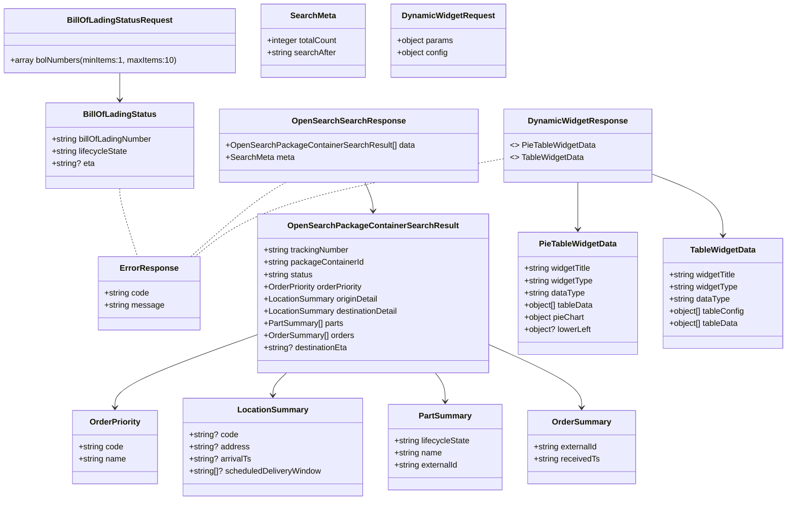

# Diagram: partview_core/partview_service/partview_service/api_definition/bundled_definition.yaml


> Auto-generated by Obscura crawlers

## Diagram 1

```mermaid
flowchart TD
  API["PartView API"] --> BOL["POST /partview/app/bill-of-ladings/search"]
  API --> OS["GET /partview/app/opensearch/search"]
  API --> DW["POST /partview/app/dynamic-widget"]
  BOL -->|request body| BOLReq[BillOfLadingStatusRequest]
  BOL -->|200 response| BOLResp["BillOfLadingStatus[]"]
  BOL -->|400 errors| Error[ErrorResponse]
  OS -->|query params| OSSearchParams["Search Query Params (size, sort, filters...)"]
  OS -->|200 response| OSResp[OpenSearchSearchResponse]
  OS -->|errors| Error
  DW -->|request body| DWReq[DynamicWidgetRequest]
  DW -->|200 response| DWResp[DynamicWidgetResponse (PieTable | Table)]
  DW -->|errors| Error
  subgraph Examples
    BOLEx["example bolNumbers: [BOL321654, BOLDELIVERED, BOLDELAYED]"]
    OSEx["example result: trackingNumber, packageContainerId, parts, orders, meta"]
    DWEx["example widgets: Package Status, Exceptions PieTable, Tracking History Table"]
  end
  BOL --> BOLEx
  OS --> OSEx
  DW --> DWEx
```

> SVG rendering failed for this diagram.

## Diagram 2



### SVG

<svg id="container" width="1523.7109375" xmlns="http://www.w3.org/2000/svg" class="classDiagram" height="982" viewBox="0 0 1523.7109375 982" role="graphics-document document" aria-roledescription="class"><style>#container{font-family:"trebuchet ms",verdana,arial,sans-serif;font-size:16px;fill:#333;}@keyframes edge-animation-frame{from{stroke-dashoffset:0;}}@keyframes dash{to{stroke-dashoffset:0;}}#container .edge-animation-slow{stroke-dasharray:9,5!important;stroke-dashoffset:900;animation:dash 50s linear infinite;stroke-linecap:round;}#container .edge-animation-fast{stroke-dasharray:9,5!important;stroke-dashoffset:900;animation:dash 20s linear infinite;stroke-linecap:round;}#container .error-icon{fill:#552222;}#container .error-text{fill:#552222;stroke:#552222;}#container .edge-thickness-normal{stroke-width:1px;}#container .edge-thickness-thick{stroke-width:3.5px;}#container .edge-pattern-solid{stroke-dasharray:0;}#container .edge-thickness-invisible{stroke-width:0;fill:none;}#container .edge-pattern-dashed{stroke-dasharray:3;}#container .edge-pattern-dotted{stroke-dasharray:2;}#container .marker{fill:#333333;stroke:#333333;}#container .marker.cross{stroke:#333333;}#container svg{font-family:"trebuchet ms",verdana,arial,sans-serif;font-size:16px;}#container p{margin:0;}#container g.classGroup text{fill:#9370DB;stroke:none;font-family:"trebuchet ms",verdana,arial,sans-serif;font-size:10px;}#container g.classGroup text .title{font-weight:bolder;}#container .nodeLabel,#container .edgeLabel{color:#131300;}#container .edgeLabel .label rect{fill:#ECECFF;}#container .label text{fill:#131300;}#container .labelBkg{background:#ECECFF;}#container .edgeLabel .label span{background:#ECECFF;}#container .classTitle{font-weight:bolder;}#container .node rect,#container .node circle,#container .node ellipse,#container .node polygon,#container .node path{fill:#ECECFF;stroke:#9370DB;stroke-width:1px;}#container .divider{stroke:#9370DB;stroke-width:1;}#container g.clickable{cursor:pointer;}#container g.classGroup rect{fill:#ECECFF;stroke:#9370DB;}#container g.classGroup line{stroke:#9370DB;stroke-width:1;}#container .classLabel .box{stroke:none;stroke-width:0;fill:#ECECFF;opacity:0.5;}#container .classLabel .label{fill:#9370DB;font-size:10px;}#container .relation{stroke:#333333;stroke-width:1;fill:none;}#container .dashed-line{stroke-dasharray:3;}#container .dotted-line{stroke-dasharray:1 2;}#container #compositionStart,#container .composition{fill:#333333!important;stroke:#333333!important;stroke-width:1;}#container #compositionEnd,#container .composition{fill:#333333!important;stroke:#333333!important;stroke-width:1;}#container #dependencyStart,#container .dependency{fill:#333333!important;stroke:#333333!important;stroke-width:1;}#container #dependencyStart,#container .dependency{fill:#333333!important;stroke:#333333!important;stroke-width:1;}#container #extensionStart,#container .extension{fill:transparent!important;stroke:#333333!important;stroke-width:1;}#container #extensionEnd,#container .extension{fill:transparent!important;stroke:#333333!important;stroke-width:1;}#container #aggregationStart,#container .aggregation{fill:transparent!important;stroke:#333333!important;stroke-width:1;}#container #aggregationEnd,#container .aggregation{fill:transparent!important;stroke:#333333!important;stroke-width:1;}#container #lollipopStart,#container .lollipop{fill:#ECECFF!important;stroke:#333333!important;stroke-width:1;}#container #lollipopEnd,#container .lollipop{fill:#ECECFF!important;stroke:#333333!important;stroke-width:1;}#container .edgeTerminals{font-size:11px;line-height:initial;}#container .classTitleText{text-anchor:middle;font-size:18px;fill:#333;}#container .label-icon{display:inline-block;height:1em;overflow:visible;vertical-align:-0.125em;}#container .node .label-icon path{fill:currentColor;stroke:revert;stroke-width:revert;}#container :root{--mermaid-font-family:"trebuchet ms",verdana,arial,sans-serif;}</style><g><defs><marker id="container_class-aggregationStart" class="marker aggregation class" refX="18" refY="7" markerWidth="190" markerHeight="240" orient="auto"><path d="M 18,7 L9,13 L1,7 L9,1 Z"></path></marker></defs><defs><marker id="container_class-aggregationEnd" class="marker aggregation class" refX="1" refY="7" markerWidth="20" markerHeight="28" orient="auto"><path d="M 18,7 L9,13 L1,7 L9,1 Z"></path></marker></defs><defs><marker id="container_class-extensionStart" class="marker extension class" refX="18" refY="7" markerWidth="190" markerHeight="240" orient="auto"><path d="M 1,7 L18,13 V 1 Z"></path></marker></defs><defs><marker id="container_class-extensionEnd" class="marker extension class" refX="1" refY="7" markerWidth="20" markerHeight="28" orient="auto"><path d="M 1,1 V 13 L18,7 Z"></path></marker></defs><defs><marker id="container_class-compositionStart" class="marker composition class" refX="18" refY="7" markerWidth="190" markerHeight="240" orient="auto"><path d="M 18,7 L9,13 L1,7 L9,1 Z"></path></marker></defs><defs><marker id="container_class-compositionEnd" class="marker composition class" refX="1" refY="7" markerWidth="20" markerHeight="28" orient="auto"><path d="M 18,7 L9,13 L1,7 L9,1 Z"></path></marker></defs><defs><marker id="container_class-dependencyStart" class="marker dependency class" refX="6" refY="7" markerWidth="190" markerHeight="240" orient="auto"><path d="M 5,7 L9,13 L1,7 L9,1 Z"></path></marker></defs><defs><marker id="container_class-dependencyEnd" class="marker dependency class" refX="13" refY="7" markerWidth="20" markerHeight="28" orient="auto"><path d="M 18,7 L9,13 L14,7 L9,1 Z"></path></marker></defs><defs><marker id="container_class-lollipopStart" class="marker lollipop class" refX="13" refY="7" markerWidth="190" markerHeight="240" orient="auto"><circle stroke="black" fill="transparent" cx="7" cy="7" r="6"></circle></marker></defs><defs><marker id="container_class-lollipopEnd" class="marker lollipop class" refX="1" refY="7" markerWidth="190" markerHeight="240" orient="auto"><circle stroke="black" fill="transparent" cx="7" cy="7" r="6"></circle></marker></defs><g class="root"><g class="clusters"></g><g class="edgePaths"><path d="M230.969,143L230.969,148.667C230.969,154.333,230.969,165.667,230.969,174.5C230.969,183.333,230.969,189.667,230.969,192.833L230.969,196" id="id_BillOfLadingStatusRequest_BillOfLadingStatus_1" class="edge-thickness-normal edge-pattern-solid relation" style=";;;" data-edge="true" data-et="edge" data-id="id_BillOfLadingStatusRequest_BillOfLadingStatus_1" data-points="W3sieCI6MjMwLjk2ODc1LCJ5IjoxNDN9LHsieCI6MjMwLjk2ODc1LCJ5IjoxNzd9LHsieCI6MjMwLjk2ODc1LCJ5IjoyMDJ9XQ==" marker-end="url(#container_class-dependencyEnd)"></path><path d="M701.842,358L704.228,364.167C706.614,370.333,711.385,382.667,713.771,392C716.156,401.333,716.156,407.667,716.156,410.833L716.156,414" id="id_OpenSearchSearchResponse_OpenSearchPackageContainerSearchResult_2" class="edge-thickness-normal edge-pattern-solid relation" style=";;;" data-edge="true" data-et="edge" data-id="id_OpenSearchSearchResponse_OpenSearchPackageContainerSearchResult_2" data-points="W3sieCI6NzAxLjg0MjM1MjM1MDkxNzQsInkiOjM1OH0seyJ4Ijo3MTYuMTU2MjUsInkiOjM5NX0seyJ4Ijo3MTYuMTU2MjUsInkiOjQyMH1d" marker-end="url(#container_class-dependencyEnd)"></path><path d="M491.34,657.219L445.307,673.849C399.275,690.479,307.21,723.74,261.177,747.537C215.145,771.333,215.145,785.667,215.145,792.833L215.145,800" id="id_OpenSearchPackageContainerSearchResult_OrderPriority_3" class="edge-thickness-normal edge-pattern-solid relation" style=";;;" data-edge="true" data-et="edge" data-id="id_OpenSearchPackageContainerSearchResult_OrderPriority_3" data-points="W3sieCI6NDkxLjMzOTg0Mzc1LCJ5Ijo2NTcuMjE5MTk3MDkzMzgxNH0seyJ4IjoyMTUuMTQ0NTMxMjUsInkiOjc1N30seyJ4IjoyMTUuMTQ0NTMxMjUsInkiOjgwNn1d" marker-end="url(#container_class-dependencyEnd)"></path><path d="M551.221,732L546.816,736.167C542.41,740.333,533.6,748.667,529.194,756C524.789,763.333,524.789,769.667,524.789,772.833L524.789,776" id="id_OpenSearchPackageContainerSearchResult_LocationSummary_4" class="edge-thickness-normal edge-pattern-solid relation" style=";;;" data-edge="true" data-et="edge" data-id="id_OpenSearchPackageContainerSearchResult_LocationSummary_4" data-points="W3sieCI6NTUxLjIyMDk5NDQ3NTEzODEsInkiOjczMn0seyJ4Ijo1MjQuNzg5MDYyNSwieSI6NzU3fSx7IngiOjUyNC43ODkwNjI1LCJ5Ijo3ODJ9XQ==" marker-end="url(#container_class-dependencyEnd)"></path><path d="M842.879,732L846.264,736.167C849.649,740.333,856.418,748.667,859.803,758C863.188,767.333,863.188,777.667,863.188,782.833L863.188,788" id="id_OpenSearchPackageContainerSearchResult_PartSummary_5" class="edge-thickness-normal edge-pattern-solid relation" style=";;;" data-edge="true" data-et="edge" data-id="id_OpenSearchPackageContainerSearchResult_PartSummary_5" data-points="W3sieCI6ODQyLjg3OTMxNjI5ODM0MjYsInkiOjczMn0seyJ4Ijo4NjMuMTg3NSwieSI6NzU3fSx7IngiOjg2My4xODc1LCJ5Ijo3OTR9XQ==" marker-end="url(#container_class-dependencyEnd)"></path><path d="M940.973,674.348L972.462,688.123C1003.952,701.899,1066.931,729.449,1098.421,750.391C1129.91,771.333,1129.91,785.667,1129.91,792.833L1129.91,800" id="id_OpenSearchPackageContainerSearchResult_OrderSummary_6" class="edge-thickness-normal edge-pattern-solid relation" style=";;;" data-edge="true" data-et="edge" data-id="id_OpenSearchPackageContainerSearchResult_OrderSummary_6" data-points="W3sieCI6OTQwLjk3MjY1NjI1LCJ5Ijo2NzQuMzQ3NzU5MTc5MDEwN30seyJ4IjoxMTI5LjkxMDE1NjI1LCJ5Ijo3NTd9LHsieCI6MTEyOS45MTAxNTYyNSwieSI6ODA2fV0=" marker-end="url(#container_class-dependencyEnd)"></path><path d="M1111.234,358L1111.234,364.167C1111.234,370.333,1111.234,382.667,1111.234,398C1111.234,413.333,1111.234,431.667,1111.234,440.833L1111.234,450" id="id_DynamicWidgetResponse_PieTableWidgetData_7" class="edge-thickness-normal edge-pattern-solid relation" style=";;;" data-edge="true" data-et="edge" data-id="id_DynamicWidgetResponse_PieTableWidgetData_7" data-points="W3sieCI6MTExMS4yMzQzNzUsInkiOjM1OH0seyJ4IjoxMTExLjIzNDM3NSwieSI6Mzk1fSx7IngiOjExMTEuMjM0Mzc1LCJ5Ijo0NTZ9XQ==" marker-end="url(#container_class-dependencyEnd)"></path><path d="M1251.77,339.507L1276.061,348.756C1300.353,358.005,1348.936,376.502,1373.228,396.918C1397.52,417.333,1397.52,439.667,1397.52,450.833L1397.52,462" id="id_DynamicWidgetResponse_TableWidgetData_8" class="edge-thickness-normal edge-pattern-solid relation" style=";;;" data-edge="true" data-et="edge" data-id="id_DynamicWidgetResponse_TableWidgetData_8" data-points="W3sieCI6MTI1MS43Njk1MzEyNSwieSI6MzM5LjUwNzI1MjExMTUwMzc2fSx7IngiOjEzOTcuNTE5NTMxMjUsInkiOjM5NX0seyJ4IjoxMzk3LjUxOTUzMTI1LCJ5Ijo0Njh9XQ==" marker-end="url(#container_class-dependencyEnd)"></path><path d="M230.969,370L230.969,374.167C230.969,378.333,230.969,386.667,236.205,409C241.441,431.333,251.913,467.667,257.149,485.833L262.385,504" id="id_BillOfLadingStatus_ErrorResponse_9" class="edge-thickness-normal edge-pattern-dashed relation" style=";;;" data-edge="true" data-et="edge" data-id="id_BillOfLadingStatus_ErrorResponse_9" data-points="W3sieCI6MjMwLjk2ODc1LCJ5IjozNzB9LHsieCI6MjMwLjk2ODc1LCJ5IjozOTV9LHsieCI6MjYyLjM4NDgxOTU3ODcyOTI2LCJ5Ijo1MDR9XQ=="></path><path d="M548.918,358L538.206,364.167C527.494,370.333,506.07,382.667,475.133,407C444.196,431.333,403.746,467.667,383.52,485.833L363.295,504" id="id_OpenSearchSearchResponse_ErrorResponse_10" class="edge-thickness-normal edge-pattern-dashed relation" style=";;;" data-edge="true" data-et="edge" data-id="id_OpenSearchSearchResponse_ErrorResponse_10" data-points="W3sieCI6NTQ4LjkxODQ3MDQ3MDE4MzUsInkiOjM1OH0seyJ4Ijo0ODQuNjQ2NDg0Mzc1LCJ5IjozOTV9LHsieCI6MzYzLjI5NTI5OTU1MTEwNDk2LCJ5Ijo1MDR9XQ=="></path><path d="M970.699,311.253L893.024,325.211C815.348,339.169,659.997,367.084,560.089,399.209C460.181,431.333,415.716,467.667,393.484,485.833L371.251,504" id="id_DynamicWidgetResponse_ErrorResponse_11" class="edge-thickness-normal edge-pattern-dashed relation" style=";;;" data-edge="true" data-et="edge" data-id="id_DynamicWidgetResponse_ErrorResponse_11" data-points="W3sieCI6OTcwLjY5OTIxODc1LCJ5IjozMTEuMjUzMjc3MDA3MzM4MDZ9LHsieCI6NTA0LjY0NjQ4NDM3NSwieSI6Mzk1fSx7IngiOjM3MS4yNTExMDA2NTYwNzczNywieSI6NTA0fV0="></path></g><g class="edgeLabels"><g class="edgeLabel"><g class="label" data-id="id_BillOfLadingStatusRequest_BillOfLadingStatus_1" transform="translate(0, 0)"><foreignObject width="0" height="0"><div xmlns="http://www.w3.org/1999/xhtml" class="labelBkg" style="display: table-cell; white-space: nowrap; line-height: 1.5; max-width: 200px; text-align: center;"><span class="edgeLabel"></span></div></foreignObject></g></g><g class="edgeLabel"><g class="label" data-id="id_OpenSearchSearchResponse_OpenSearchPackageContainerSearchResult_2" transform="translate(0, 0)"><foreignObject width="0" height="0"><div xmlns="http://www.w3.org/1999/xhtml" class="labelBkg" style="display: table-cell; white-space: nowrap; line-height: 1.5; max-width: 200px; text-align: center;"><span class="edgeLabel"></span></div></foreignObject></g></g><g class="edgeLabel"><g class="label" data-id="id_OpenSearchPackageContainerSearchResult_OrderPriority_3" transform="translate(0, 0)"><foreignObject width="0" height="0"><div xmlns="http://www.w3.org/1999/xhtml" class="labelBkg" style="display: table-cell; white-space: nowrap; line-height: 1.5; max-width: 200px; text-align: center;"><span class="edgeLabel"></span></div></foreignObject></g></g><g class="edgeLabel"><g class="label" data-id="id_OpenSearchPackageContainerSearchResult_LocationSummary_4" transform="translate(0, 0)"><foreignObject width="0" height="0"><div xmlns="http://www.w3.org/1999/xhtml" class="labelBkg" style="display: table-cell; white-space: nowrap; line-height: 1.5; max-width: 200px; text-align: center;"><span class="edgeLabel"></span></div></foreignObject></g></g><g class="edgeLabel"><g class="label" data-id="id_OpenSearchPackageContainerSearchResult_PartSummary_5" transform="translate(0, 0)"><foreignObject width="0" height="0"><div xmlns="http://www.w3.org/1999/xhtml" class="labelBkg" style="display: table-cell; white-space: nowrap; line-height: 1.5; max-width: 200px; text-align: center;"><span class="edgeLabel"></span></div></foreignObject></g></g><g class="edgeLabel"><g class="label" data-id="id_OpenSearchPackageContainerSearchResult_OrderSummary_6" transform="translate(0, 0)"><foreignObject width="0" height="0"><div xmlns="http://www.w3.org/1999/xhtml" class="labelBkg" style="display: table-cell; white-space: nowrap; line-height: 1.5; max-width: 200px; text-align: center;"><span class="edgeLabel"></span></div></foreignObject></g></g><g class="edgeLabel"><g class="label" data-id="id_DynamicWidgetResponse_PieTableWidgetData_7" transform="translate(0, 0)"><foreignObject width="0" height="0"><div xmlns="http://www.w3.org/1999/xhtml" class="labelBkg" style="display: table-cell; white-space: nowrap; line-height: 1.5; max-width: 200px; text-align: center;"><span class="edgeLabel"></span></div></foreignObject></g></g><g class="edgeLabel"><g class="label" data-id="id_DynamicWidgetResponse_TableWidgetData_8" transform="translate(0, 0)"><foreignObject width="0" height="0"><div xmlns="http://www.w3.org/1999/xhtml" class="labelBkg" style="display: table-cell; white-space: nowrap; line-height: 1.5; max-width: 200px; text-align: center;"><span class="edgeLabel"></span></div></foreignObject></g></g><g class="edgeLabel"><g class="label" data-id="id_BillOfLadingStatus_ErrorResponse_9" transform="translate(0, 0)"><foreignObject width="0" height="0"><div xmlns="http://www.w3.org/1999/xhtml" class="labelBkg" style="display: table-cell; white-space: nowrap; line-height: 1.5; max-width: 200px; text-align: center;"><span class="edgeLabel"></span></div></foreignObject></g></g><g class="edgeLabel"><g class="label" data-id="id_OpenSearchSearchResponse_ErrorResponse_10" transform="translate(0, 0)"><foreignObject width="0" height="0"><div xmlns="http://www.w3.org/1999/xhtml" class="labelBkg" style="display: table-cell; white-space: nowrap; line-height: 1.5; max-width: 200px; text-align: center;"><span class="edgeLabel"></span></div></foreignObject></g></g><g class="edgeLabel"><g class="label" data-id="id_DynamicWidgetResponse_ErrorResponse_11" transform="translate(0, 0)"><foreignObject width="0" height="0"><div xmlns="http://www.w3.org/1999/xhtml" class="labelBkg" style="display: table-cell; white-space: nowrap; line-height: 1.5; max-width: 200px; text-align: center;"><span class="edgeLabel"></span></div></foreignObject></g></g></g><g class="nodes"><g class="node default" id="classId-BillOfLadingStatusRequest-0" transform="translate(230.96875, 80)"><g class="basic label-container"><path d="M-222.96875 -63 L222.96875 -63 L222.96875 63 L-222.96875 63" stroke="none" stroke-width="0" fill="#ECECFF" style=""></path><path d="M-222.96875 -63 C-64.51663399985301 -63, 93.93548200029397 -63, 222.96875 -63 M-222.96875 -63 C-120.19752342341167 -63, -17.426296846823334 -63, 222.96875 -63 M222.96875 -63 C222.96875 -19.181455418451243, 222.96875 24.637089163097514, 222.96875 63 M222.96875 -63 C222.96875 -30.335654420297516, 222.96875 2.3286911594049684, 222.96875 63 M222.96875 63 C111.06484709061215 63, -0.8390558187757051 63, -222.96875 63 M222.96875 63 C112.19890798818463 63, 1.4290659763692588 63, -222.96875 63 M-222.96875 63 C-222.96875 15.770996649051753, -222.96875 -31.458006701896494, -222.96875 -63 M-222.96875 63 C-222.96875 22.502846256761686, -222.96875 -17.99430748647663, -222.96875 -63" stroke="#9370DB" stroke-width="1.3" fill="none" stroke-dasharray="0 0" style=""></path></g><g class="annotation-group text" transform="translate(0, -39)"></g><g class="label-group text" transform="translate(-98.265625, -39)"><g class="label" style="font-weight: bolder" transform="translate(0,-12)"><foreignObject width="196.53125" height="24"><div xmlns="http://www.w3.org/1999/xhtml" style="display: table-cell; white-space: nowrap; line-height: 1.5; max-width: 243px; text-align: center;"><span class="nodeLabel markdown-node-label" style=""><p>BillOfLadingStatusRequest</p></span></div></foreignObject></g></g><g class="members-group text" transform="translate(-210.96875, 9)"></g><g class="methods-group text" transform="translate(-210.96875, 39)"><g class="label" style="" transform="translate(0,-12)"><foreignObject width="323.671875" height="24"><div xmlns="http://www.w3.org/1999/xhtml" style="display: table-cell; white-space: nowrap; line-height: 1.5; max-width: 381px; text-align: center;"><span class="nodeLabel markdown-node-label" style=""><p>+array bolNumbers(minItems:1, maxItems:10)</p></span></div></foreignObject></g></g><g class="divider" style=""><path d="M-222.96875 -15 C-83.89754825516243 -15, 55.17365348967513 -15, 222.96875 -15 M-222.96875 -15 C-76.46623724838292 -15, 70.03627550323415 -15, 222.96875 -15" stroke="#9370DB" stroke-width="1.3" fill="none" stroke-dasharray="0 0" style=""></path></g><g class="divider" style=""><path d="M-222.96875 9 C-113.93104799007986 9, -4.893345980159722 9, 222.96875 9 M-222.96875 9 C-119.86186549078226 9, -16.75498098156453 9, 222.96875 9" stroke="#9370DB" stroke-width="1.3" fill="none" stroke-dasharray="0 0" style=""></path></g></g><g class="node default" id="classId-BillOfLadingStatus-1" transform="translate(230.96875, 286)"><g class="basic label-container"><path d="M-146.30859375 -84 L146.30859375 -84 L146.30859375 84 L-146.30859375 84" stroke="none" stroke-width="0" fill="#ECECFF" style=""></path><path d="M-146.30859375 -84 C-71.99921007914101 -84, 2.3101735917179838 -84, 146.30859375 -84 M-146.30859375 -84 C-50.20906499423451 -84, 45.89046376153098 -84, 146.30859375 -84 M146.30859375 -84 C146.30859375 -18.90459787817798, 146.30859375 46.19080424364404, 146.30859375 84 M146.30859375 -84 C146.30859375 -46.54648967156599, 146.30859375 -9.092979343131987, 146.30859375 84 M146.30859375 84 C42.758553128051375 84, -60.79148749389725 84, -146.30859375 84 M146.30859375 84 C38.67351382886835 84, -68.9615660922633 84, -146.30859375 84 M-146.30859375 84 C-146.30859375 24.348103623777924, -146.30859375 -35.30379275244415, -146.30859375 -84 M-146.30859375 84 C-146.30859375 23.34770526787532, -146.30859375 -37.30458946424936, -146.30859375 -84" stroke="#9370DB" stroke-width="1.3" fill="none" stroke-dasharray="0 0" style=""></path></g><g class="annotation-group text" transform="translate(0, -60)"></g><g class="label-group text" transform="translate(-68.2890625, -60)"><g class="label" style="font-weight: bolder" transform="translate(0,-12)"><foreignObject width="136.578125" height="24"><div xmlns="http://www.w3.org/1999/xhtml" style="display: table-cell; white-space: nowrap; line-height: 1.5; max-width: 184px; text-align: center;"><span class="nodeLabel markdown-node-label" style=""><p>BillOfLadingStatus</p></span></div></foreignObject></g></g><g class="members-group text" transform="translate(-134.30859375, -12)"><g class="label" style="" transform="translate(0,-12)"><foreignObject width="200.328125" height="24"><div xmlns="http://www.w3.org/1999/xhtml" style="display: table-cell; white-space: nowrap; line-height: 1.5; max-width: 259px; text-align: center;"><span class="nodeLabel markdown-node-label" style=""><p>+string billOfLadingNumber</p></span></div></foreignObject></g><g class="label" style="" transform="translate(0,12)"><foreignObject width="150.765625" height="24"><div xmlns="http://www.w3.org/1999/xhtml" style="display: table-cell; white-space: nowrap; line-height: 1.5; max-width: 208px; text-align: center;"><span class="nodeLabel markdown-node-label" style=""><p>+string lifecycleState</p></span></div></foreignObject></g><g class="label" style="" transform="translate(0,36)"><foreignObject width="83.96875" height="24"><div xmlns="http://www.w3.org/1999/xhtml" style="display: table-cell; white-space: nowrap; line-height: 1.5; max-width: 141px; text-align: center;"><span class="nodeLabel markdown-node-label" style=""><p>+string? eta</p></span></div></foreignObject></g></g><g class="methods-group text" transform="translate(-134.30859375, 84)"></g><g class="divider" style=""><path d="M-146.30859375 -36 C-35.128810008864065 -36, 76.05097373227187 -36, 146.30859375 -36 M-146.30859375 -36 C-34.62171203750782 -36, 77.06516967498436 -36, 146.30859375 -36" stroke="#9370DB" stroke-width="1.3" fill="none" stroke-dasharray="0 0" style=""></path></g><g class="divider" style=""><path d="M-146.30859375 60 C-31.034174928705013 60, 84.24024389258997 60, 146.30859375 60 M-146.30859375 60 C-53.99366091988921 60, 38.32127191022158 60, 146.30859375 60" stroke="#9370DB" stroke-width="1.3" fill="none" stroke-dasharray="0 0" style=""></path></g></g><g class="node default" id="classId-ErrorResponse-2" transform="translate(283.13671875, 576)"><g class="basic label-container"><path d="M-96.9375 -72 L96.9375 -72 L96.9375 72 L-96.9375 72" stroke="none" stroke-width="0" fill="#ECECFF" style=""></path><path d="M-96.9375 -72 C-52.46107243179876 -72, -7.984644863597524 -72, 96.9375 -72 M-96.9375 -72 C-33.06723539779761 -72, 30.80302920440478 -72, 96.9375 -72 M96.9375 -72 C96.9375 -39.90562991847482, 96.9375 -7.811259836949645, 96.9375 72 M96.9375 -72 C96.9375 -34.526977767153745, 96.9375 2.946044465692509, 96.9375 72 M96.9375 72 C39.26307474334472 72, -18.411350513310566 72, -96.9375 72 M96.9375 72 C32.32304423523668 72, -32.29141152952664 72, -96.9375 72 M-96.9375 72 C-96.9375 32.100114058635825, -96.9375 -7.799771882728351, -96.9375 -72 M-96.9375 72 C-96.9375 16.33584581922665, -96.9375 -39.3283083615467, -96.9375 -72" stroke="#9370DB" stroke-width="1.3" fill="none" stroke-dasharray="0 0" style=""></path></g><g class="annotation-group text" transform="translate(0, -48)"></g><g class="label-group text" transform="translate(-53.625, -48)"><g class="label" style="font-weight: bolder" transform="translate(0,-12)"><foreignObject width="107.25" height="24"><div xmlns="http://www.w3.org/1999/xhtml" style="display: table-cell; white-space: nowrap; line-height: 1.5; max-width: 156px; text-align: center;"><span class="nodeLabel markdown-node-label" style=""><p>ErrorResponse</p></span></div></foreignObject></g></g><g class="members-group text" transform="translate(-84.9375, 0)"><g class="label" style="" transform="translate(0,-12)"><foreignObject width="88.828125" height="24"><div xmlns="http://www.w3.org/1999/xhtml" style="display: table-cell; white-space: nowrap; line-height: 1.5; max-width: 146px; text-align: center;"><span class="nodeLabel markdown-node-label" style=""><p>+string code</p></span></div></foreignObject></g><g class="label" style="" transform="translate(0,12)"><foreignObject width="116.25" height="24"><div xmlns="http://www.w3.org/1999/xhtml" style="display: table-cell; white-space: nowrap; line-height: 1.5; max-width: 174px; text-align: center;"><span class="nodeLabel markdown-node-label" style=""><p>+string message</p></span></div></foreignObject></g></g><g class="methods-group text" transform="translate(-84.9375, 72)"></g><g class="divider" style=""><path d="M-96.9375 -24 C-26.539848416804887 -24, 43.85780316639023 -24, 96.9375 -24 M-96.9375 -24 C-32.89251623409214 -24, 31.152467531815716 -24, 96.9375 -24" stroke="#9370DB" stroke-width="1.3" fill="none" stroke-dasharray="0 0" style=""></path></g><g class="divider" style=""><path d="M-96.9375 48 C-47.195650726189186 48, 2.5461985476216284 48, 96.9375 48 M-96.9375 48 C-47.738063412089005 48, 1.46137317582199 48, 96.9375 48" stroke="#9370DB" stroke-width="1.3" fill="none" stroke-dasharray="0 0" style=""></path></g></g><g class="node default" id="classId-OpenSearchSearchResponse-3" transform="translate(673.98828125, 286)"><g class="basic label-container"><path d="M-246.7109375 -72 L246.7109375 -72 L246.7109375 72 L-246.7109375 72" stroke="none" stroke-width="0" fill="#ECECFF" style=""></path><path d="M-246.7109375 -72 C-74.27105830381942 -72, 98.16882089236117 -72, 246.7109375 -72 M-246.7109375 -72 C-141.3274453751497 -72, -35.94395325029936 -72, 246.7109375 -72 M246.7109375 -72 C246.7109375 -18.706865610299218, 246.7109375 34.586268779401564, 246.7109375 72 M246.7109375 -72 C246.7109375 -39.62542218787583, 246.7109375 -7.2508443757516545, 246.7109375 72 M246.7109375 72 C146.86948325985196 72, 47.02802901970395 72, -246.7109375 72 M246.7109375 72 C125.20710089961662 72, 3.70326429923324 72, -246.7109375 72 M-246.7109375 72 C-246.7109375 35.806917332058774, -246.7109375 -0.3861653358824526, -246.7109375 -72 M-246.7109375 72 C-246.7109375 24.374870111141874, -246.7109375 -23.250259777716252, -246.7109375 -72" stroke="#9370DB" stroke-width="1.3" fill="none" stroke-dasharray="0 0" style=""></path></g><g class="annotation-group text" transform="translate(0, -48)"></g><g class="label-group text" transform="translate(-104.203125, -48)"><g class="label" style="font-weight: bolder" transform="translate(0,-12)"><foreignObject width="208.40625" height="24"><div xmlns="http://www.w3.org/1999/xhtml" style="display: table-cell; white-space: nowrap; line-height: 1.5; max-width: 256px; text-align: center;"><span class="nodeLabel markdown-node-label" style=""><p>OpenSearchSearchResponse</p></span></div></foreignObject></g></g><g class="members-group text" transform="translate(-234.7109375, 0)"><g class="label" style="" transform="translate(0,-12)"><foreignObject width="365.21875" height="24"><div xmlns="http://www.w3.org/1999/xhtml" style="display: table-cell; white-space: nowrap; line-height: 1.5; max-width: 423px; text-align: center;"><span class="nodeLabel markdown-node-label" style=""><p>+OpenSearchPackageContainerSearchResult[] data</p></span></div></foreignObject></g><g class="label" style="" transform="translate(0,12)"><foreignObject width="132.625" height="24"><div xmlns="http://www.w3.org/1999/xhtml" style="display: table-cell; white-space: nowrap; line-height: 1.5; max-width: 190px; text-align: center;"><span class="nodeLabel markdown-node-label" style=""><p>+SearchMeta meta</p></span></div></foreignObject></g></g><g class="methods-group text" transform="translate(-234.7109375, 72)"></g><g class="divider" style=""><path d="M-246.7109375 -24 C-76.43429114895036 -24, 93.84235520209927 -24, 246.7109375 -24 M-246.7109375 -24 C-109.94507303787526 -24, 26.820791424249478 -24, 246.7109375 -24" stroke="#9370DB" stroke-width="1.3" fill="none" stroke-dasharray="0 0" style=""></path></g><g class="divider" style=""><path d="M-246.7109375 48 C-58.30219811040925 48, 130.1065412791815 48, 246.7109375 48 M-246.7109375 48 C-81.14656869296152 48, 84.41780011407695 48, 246.7109375 48" stroke="#9370DB" stroke-width="1.3" fill="none" stroke-dasharray="0 0" style=""></path></g></g><g class="node default" id="classId-OpenSearchPackageContainerSearchResult-4" transform="translate(716.15625, 576)"><g class="basic label-container"><path d="M-224.81640625 -156 L224.81640625 -156 L224.81640625 156 L-224.81640625 156" stroke="none" stroke-width="0" fill="#ECECFF" style=""></path><path d="M-224.81640625 -156 C-73.4605586848503 -156, 77.8952888802994 -156, 224.81640625 -156 M-224.81640625 -156 C-133.65068267415 -156, -42.48495909830001 -156, 224.81640625 -156 M224.81640625 -156 C224.81640625 -67.02583880070776, 224.81640625 21.94832239858448, 224.81640625 156 M224.81640625 -156 C224.81640625 -88.08033407960961, 224.81640625 -20.160668159219227, 224.81640625 156 M224.81640625 156 C80.09932338270556 156, -64.61775948458887 156, -224.81640625 156 M224.81640625 156 C111.99784553041391 156, -0.8207151891721765 156, -224.81640625 156 M-224.81640625 156 C-224.81640625 50.641529200725586, -224.81640625 -54.71694159854883, -224.81640625 -156 M-224.81640625 156 C-224.81640625 69.07187206228674, -224.81640625 -17.856255875426513, -224.81640625 -156" stroke="#9370DB" stroke-width="1.3" fill="none" stroke-dasharray="0 0" style=""></path></g><g class="annotation-group text" transform="translate(0, -132)"></g><g class="label-group text" transform="translate(-157.3515625, -132)"><g class="label" style="font-weight: bolder" transform="translate(0,-12)"><foreignObject width="314.703125" height="24"><div xmlns="http://www.w3.org/1999/xhtml" style="display: table-cell; white-space: nowrap; line-height: 1.5; max-width: 360px; text-align: center;"><span class="nodeLabel markdown-node-label" style=""><p>OpenSearchPackageContainerSearchResult</p></span></div></foreignObject></g></g><g class="members-group text" transform="translate(-212.81640625, -84)"><g class="label" style="" transform="translate(0,-12)"><foreignObject width="170.359375" height="24"><div xmlns="http://www.w3.org/1999/xhtml" style="display: table-cell; white-space: nowrap; line-height: 1.5; max-width: 229px; text-align: center;"><span class="nodeLabel markdown-node-label" style=""><p>+string trackingNumber</p></span></div></foreignObject></g><g class="label" style="" transform="translate(0,12)"><foreignObject width="197.640625" height="24"><div xmlns="http://www.w3.org/1999/xhtml" style="display: table-cell; white-space: nowrap; line-height: 1.5; max-width: 255px; text-align: center;"><span class="nodeLabel markdown-node-label" style=""><p>+string packageContainerId</p></span></div></foreignObject></g><g class="label" style="" transform="translate(0,36)"><foreignObject width="98.265625" height="24"><div xmlns="http://www.w3.org/1999/xhtml" style="display: table-cell; white-space: nowrap; line-height: 1.5; max-width: 156px; text-align: center;"><span class="nodeLabel markdown-node-label" style=""><p>+string status</p></span></div></foreignObject></g><g class="label" style="" transform="translate(0,60)"><foreignObject width="199.5" height="24"><div xmlns="http://www.w3.org/1999/xhtml" style="display: table-cell; white-space: nowrap; line-height: 1.5; max-width: 257px; text-align: center;"><span class="nodeLabel markdown-node-label" style=""><p>+OrderPriority orderPriority</p></span></div></foreignObject></g><g class="label" style="" transform="translate(0,84)"><foreignObject width="227.390625" height="24"><div xmlns="http://www.w3.org/1999/xhtml" style="display: table-cell; white-space: nowrap; line-height: 1.5; max-width: 285px; text-align: center;"><span class="nodeLabel markdown-node-label" style=""><p>+LocationSummary originDetail</p></span></div></foreignObject></g><g class="label" style="" transform="translate(0,108)"><foreignObject width="268.28125" height="24"><div xmlns="http://www.w3.org/1999/xhtml" style="display: table-cell; white-space: nowrap; line-height: 1.5; max-width: 326px; text-align: center;"><span class="nodeLabel markdown-node-label" style=""><p>+LocationSummary destinationDetail</p></span></div></foreignObject></g><g class="label" style="" transform="translate(0,132)"><foreignObject width="157.28125" height="24"><div xmlns="http://www.w3.org/1999/xhtml" style="display: table-cell; white-space: nowrap; line-height: 1.5; max-width: 215px; text-align: center;"><span class="nodeLabel markdown-node-label" style=""><p>+PartSummary[] parts</p></span></div></foreignObject></g><g class="label" style="" transform="translate(0,156)"><foreignObject width="178.71875" height="24"><div xmlns="http://www.w3.org/1999/xhtml" style="display: table-cell; white-space: nowrap; line-height: 1.5; max-width: 236px; text-align: center;"><span class="nodeLabel markdown-node-label" style=""><p>+OrderSummary[] orders</p></span></div></foreignObject></g><g class="label" style="" transform="translate(0,180)"><foreignObject width="166.734375" height="24"><div xmlns="http://www.w3.org/1999/xhtml" style="display: table-cell; white-space: nowrap; line-height: 1.5; max-width: 224px; text-align: center;"><span class="nodeLabel markdown-node-label" style=""><p>+string? destinationEta</p></span></div></foreignObject></g></g><g class="methods-group text" transform="translate(-212.81640625, 156)"></g><g class="divider" style=""><path d="M-224.81640625 -108 C-132.6379260967341 -108, -40.45944594346821 -108, 224.81640625 -108 M-224.81640625 -108 C-104.39098385049304 -108, 16.034438549013913 -108, 224.81640625 -108" stroke="#9370DB" stroke-width="1.3" fill="none" stroke-dasharray="0 0" style=""></path></g><g class="divider" style=""><path d="M-224.81640625 132 C-107.71151777179176 132, 9.393370706416476 132, 224.81640625 132 M-224.81640625 132 C-72.64019512593171 132, 79.53601599813658 132, 224.81640625 132" stroke="#9370DB" stroke-width="1.3" fill="none" stroke-dasharray="0 0" style=""></path></g></g><g class="node default" id="classId-SearchMeta-5" transform="translate(607.1171875, 80)"><g class="basic label-container"><path d="M-103.1796875 -72 L103.1796875 -72 L103.1796875 72 L-103.1796875 72" stroke="none" stroke-width="0" fill="#ECECFF" style=""></path><path d="M-103.1796875 -72 C-30.111792964866908 -72, 42.956101570266185 -72, 103.1796875 -72 M-103.1796875 -72 C-39.83365872197532 -72, 23.512370056049363 -72, 103.1796875 -72 M103.1796875 -72 C103.1796875 -34.126328698139325, 103.1796875 3.74734260372135, 103.1796875 72 M103.1796875 -72 C103.1796875 -35.913826735675734, 103.1796875 0.17234652864853217, 103.1796875 72 M103.1796875 72 C43.01926887645048 72, -17.141149747099035 72, -103.1796875 72 M103.1796875 72 C56.52494896080182 72, 9.870210421603645 72, -103.1796875 72 M-103.1796875 72 C-103.1796875 34.62995909713819, -103.1796875 -2.7400818057236194, -103.1796875 -72 M-103.1796875 72 C-103.1796875 21.580411970870657, -103.1796875 -28.839176058258687, -103.1796875 -72" stroke="#9370DB" stroke-width="1.3" fill="none" stroke-dasharray="0 0" style=""></path></g><g class="annotation-group text" transform="translate(0, -48)"></g><g class="label-group text" transform="translate(-42.796875, -48)"><g class="label" style="font-weight: bolder" transform="translate(0,-12)"><foreignObject width="85.59375" height="24"><div xmlns="http://www.w3.org/1999/xhtml" style="display: table-cell; white-space: nowrap; line-height: 1.5; max-width: 134px; text-align: center;"><span class="nodeLabel markdown-node-label" style=""><p>SearchMeta</p></span></div></foreignObject></g></g><g class="members-group text" transform="translate(-91.1796875, 0)"><g class="label" style="" transform="translate(0,-12)"><foreignObject width="139.5625" height="24"><div xmlns="http://www.w3.org/1999/xhtml" style="display: table-cell; white-space: nowrap; line-height: 1.5; max-width: 197px; text-align: center;"><span class="nodeLabel markdown-node-label" style=""><p>+integer totalCount</p></span></div></foreignObject></g><g class="label" style="" transform="translate(0,12)"><foreignObject width="136.28125" height="24"><div xmlns="http://www.w3.org/1999/xhtml" style="display: table-cell; white-space: nowrap; line-height: 1.5; max-width: 194px; text-align: center;"><span class="nodeLabel markdown-node-label" style=""><p>+string searchAfter</p></span></div></foreignObject></g></g><g class="methods-group text" transform="translate(-91.1796875, 72)"></g><g class="divider" style=""><path d="M-103.1796875 -24 C-27.536176743857254 -24, 48.10733401228549 -24, 103.1796875 -24 M-103.1796875 -24 C-50.56103968214761 -24, 2.0576081357047826 -24, 103.1796875 -24" stroke="#9370DB" stroke-width="1.3" fill="none" stroke-dasharray="0 0" style=""></path></g><g class="divider" style=""><path d="M-103.1796875 48 C-46.559044912063904 48, 10.061597675872193 48, 103.1796875 48 M-103.1796875 48 C-51.22825694269752 48, 0.7231736146049599 48, 103.1796875 48" stroke="#9370DB" stroke-width="1.3" fill="none" stroke-dasharray="0 0" style=""></path></g></g><g class="node default" id="classId-OrderPriority-6" transform="translate(215.14453125, 878)"><g class="basic label-container"><path d="M-83.3671875 -72 L83.3671875 -72 L83.3671875 72 L-83.3671875 72" stroke="none" stroke-width="0" fill="#ECECFF" style=""></path><path d="M-83.3671875 -72 C-39.5749100434188 -72, 4.217367413162407 -72, 83.3671875 -72 M-83.3671875 -72 C-20.92461488986097 -72, 41.51795772027806 -72, 83.3671875 -72 M83.3671875 -72 C83.3671875 -40.68020232100852, 83.3671875 -9.360404642017045, 83.3671875 72 M83.3671875 -72 C83.3671875 -35.05591779922065, 83.3671875 1.8881644015586971, 83.3671875 72 M83.3671875 72 C45.410670057599106 72, 7.454152615198211 72, -83.3671875 72 M83.3671875 72 C21.337589958450245 72, -40.69200758309951 72, -83.3671875 72 M-83.3671875 72 C-83.3671875 35.85531690692652, -83.3671875 -0.28936618614696386, -83.3671875 -72 M-83.3671875 72 C-83.3671875 40.48336399430473, -83.3671875 8.966727988609463, -83.3671875 -72" stroke="#9370DB" stroke-width="1.3" fill="none" stroke-dasharray="0 0" style=""></path></g><g class="annotation-group text" transform="translate(0, -48)"></g><g class="label-group text" transform="translate(-48.359375, -48)"><g class="label" style="font-weight: bolder" transform="translate(0,-12)"><foreignObject width="96.71875" height="24"><div xmlns="http://www.w3.org/1999/xhtml" style="display: table-cell; white-space: nowrap; line-height: 1.5; max-width: 145px; text-align: center;"><span class="nodeLabel markdown-node-label" style=""><p>OrderPriority</p></span></div></foreignObject></g></g><g class="members-group text" transform="translate(-71.3671875, 0)"><g class="label" style="" transform="translate(0,-12)"><foreignObject width="88.828125" height="24"><div xmlns="http://www.w3.org/1999/xhtml" style="display: table-cell; white-space: nowrap; line-height: 1.5; max-width: 146px; text-align: center;"><span class="nodeLabel markdown-node-label" style=""><p>+string code</p></span></div></foreignObject></g><g class="label" style="" transform="translate(0,12)"><foreignObject width="94.375" height="24"><div xmlns="http://www.w3.org/1999/xhtml" style="display: table-cell; white-space: nowrap; line-height: 1.5; max-width: 152px; text-align: center;"><span class="nodeLabel markdown-node-label" style=""><p>+string name</p></span></div></foreignObject></g></g><g class="methods-group text" transform="translate(-71.3671875, 72)"></g><g class="divider" style=""><path d="M-83.3671875 -24 C-44.084172149088694 -24, -4.801156798177388 -24, 83.3671875 -24 M-83.3671875 -24 C-34.794327015818226 -24, 13.778533468363548 -24, 83.3671875 -24" stroke="#9370DB" stroke-width="1.3" fill="none" stroke-dasharray="0 0" style=""></path></g><g class="divider" style=""><path d="M-83.3671875 48 C-44.6918674243428 48, -6.016547348685606 48, 83.3671875 48 M-83.3671875 48 C-48.60457980305666 48, -13.841972106113317 48, 83.3671875 48" stroke="#9370DB" stroke-width="1.3" fill="none" stroke-dasharray="0 0" style=""></path></g></g><g class="node default" id="classId-LocationSummary-7" transform="translate(524.7890625, 878)"><g class="basic label-container"><path d="M-176.27734375 -96 L176.27734375 -96 L176.27734375 96 L-176.27734375 96" stroke="none" stroke-width="0" fill="#ECECFF" style=""></path><path d="M-176.27734375 -96 C-90.77477716349217 -96, -5.2722105769843495 -96, 176.27734375 -96 M-176.27734375 -96 C-96.38969967878013 -96, -16.502055607560266 -96, 176.27734375 -96 M176.27734375 -96 C176.27734375 -38.167079270598954, 176.27734375 19.665841458802092, 176.27734375 96 M176.27734375 -96 C176.27734375 -48.51023238683099, 176.27734375 -1.0204647736619847, 176.27734375 96 M176.27734375 96 C43.51744098139028 96, -89.24246178721944 96, -176.27734375 96 M176.27734375 96 C38.00979527303235 96, -100.2577532039353 96, -176.27734375 96 M-176.27734375 96 C-176.27734375 32.51030727842736, -176.27734375 -30.979385443145276, -176.27734375 -96 M-176.27734375 96 C-176.27734375 55.0118908870068, -176.27734375 14.0237817740136, -176.27734375 -96" stroke="#9370DB" stroke-width="1.3" fill="none" stroke-dasharray="0 0" style=""></path></g><g class="annotation-group text" transform="translate(0, -72)"></g><g class="label-group text" transform="translate(-65.7578125, -72)"><g class="label" style="font-weight: bolder" transform="translate(0,-12)"><foreignObject width="131.515625" height="24"><div xmlns="http://www.w3.org/1999/xhtml" style="display: table-cell; white-space: nowrap; line-height: 1.5; max-width: 180px; text-align: center;"><span class="nodeLabel markdown-node-label" style=""><p>LocationSummary</p></span></div></foreignObject></g></g><g class="members-group text" transform="translate(-164.27734375, -24)"><g class="label" style="" transform="translate(0,-12)"><foreignObject width="95.84375" height="24"><div xmlns="http://www.w3.org/1999/xhtml" style="display: table-cell; white-space: nowrap; line-height: 1.5; max-width: 153px; text-align: center;"><span class="nodeLabel markdown-node-label" style=""><p>+string? code</p></span></div></foreignObject></g><g class="label" style="" transform="translate(0,12)"><foreignObject width="117.921875" height="24"><div xmlns="http://www.w3.org/1999/xhtml" style="display: table-cell; white-space: nowrap; line-height: 1.5; max-width: 175px; text-align: center;"><span class="nodeLabel markdown-node-label" style=""><p>+string? address</p></span></div></foreignObject></g><g class="label" style="" transform="translate(0,36)"><foreignObject width="122.25" height="24"><div xmlns="http://www.w3.org/1999/xhtml" style="display: table-cell; white-space: nowrap; line-height: 1.5; max-width: 180px; text-align: center;"><span class="nodeLabel markdown-node-label" style=""><p>+string? arrivalTs</p></span></div></foreignObject></g><g class="label" style="" transform="translate(0,60)"><foreignObject width="262.796875" height="24"><div xmlns="http://www.w3.org/1999/xhtml" style="display: table-cell; white-space: nowrap; line-height: 1.5; max-width: 321px; text-align: center;"><span class="nodeLabel markdown-node-label" style=""><p>+string[]? scheduledDeliveryWindow</p></span></div></foreignObject></g></g><g class="methods-group text" transform="translate(-164.27734375, 96)"></g><g class="divider" style=""><path d="M-176.27734375 -48 C-87.28075555284788 -48, 1.7158326443042426 -48, 176.27734375 -48 M-176.27734375 -48 C-91.65899546683649 -48, -7.040647183672974 -48, 176.27734375 -48" stroke="#9370DB" stroke-width="1.3" fill="none" stroke-dasharray="0 0" style=""></path></g><g class="divider" style=""><path d="M-176.27734375 72 C-105.72285298449124 72, -35.16836221898248 72, 176.27734375 72 M-176.27734375 72 C-89.80711944897791 72, -3.336895147955829 72, 176.27734375 72" stroke="#9370DB" stroke-width="1.3" fill="none" stroke-dasharray="0 0" style=""></path></g></g><g class="node default" id="classId-PartSummary-8" transform="translate(863.1875, 878)"><g class="basic label-container"><path d="M-112.12109375 -84 L112.12109375 -84 L112.12109375 84 L-112.12109375 84" stroke="none" stroke-width="0" fill="#ECECFF" style=""></path><path d="M-112.12109375 -84 C-31.421861652108262 -84, 49.277370445783475 -84, 112.12109375 -84 M-112.12109375 -84 C-41.67743734010811 -84, 28.766219069783773 -84, 112.12109375 -84 M112.12109375 -84 C112.12109375 -37.36306783083429, 112.12109375 9.273864338331421, 112.12109375 84 M112.12109375 -84 C112.12109375 -24.588905354971935, 112.12109375 34.82218929005613, 112.12109375 84 M112.12109375 84 C29.024517142615764 84, -54.07205946476847 84, -112.12109375 84 M112.12109375 84 C54.75500636624468 84, -2.6110810175106423 84, -112.12109375 84 M-112.12109375 84 C-112.12109375 47.47560441930478, -112.12109375 10.95120883860956, -112.12109375 -84 M-112.12109375 84 C-112.12109375 37.304697062836496, -112.12109375 -9.390605874327008, -112.12109375 -84" stroke="#9370DB" stroke-width="1.3" fill="none" stroke-dasharray="0 0" style=""></path></g><g class="annotation-group text" transform="translate(0, -60)"></g><g class="label-group text" transform="translate(-49.4765625, -60)"><g class="label" style="font-weight: bolder" transform="translate(0,-12)"><foreignObject width="98.953125" height="24"><div xmlns="http://www.w3.org/1999/xhtml" style="display: table-cell; white-space: nowrap; line-height: 1.5; max-width: 147px; text-align: center;"><span class="nodeLabel markdown-node-label" style=""><p>PartSummary</p></span></div></foreignObject></g></g><g class="members-group text" transform="translate(-100.12109375, -12)"><g class="label" style="" transform="translate(0,-12)"><foreignObject width="150.765625" height="24"><div xmlns="http://www.w3.org/1999/xhtml" style="display: table-cell; white-space: nowrap; line-height: 1.5; max-width: 208px; text-align: center;"><span class="nodeLabel markdown-node-label" style=""><p>+string lifecycleState</p></span></div></foreignObject></g><g class="label" style="" transform="translate(0,12)"><foreignObject width="94.375" height="24"><div xmlns="http://www.w3.org/1999/xhtml" style="display: table-cell; white-space: nowrap; line-height: 1.5; max-width: 152px; text-align: center;"><span class="nodeLabel markdown-node-label" style=""><p>+string name</p></span></div></foreignObject></g><g class="label" style="" transform="translate(0,36)"><foreignObject width="127.53125" height="24"><div xmlns="http://www.w3.org/1999/xhtml" style="display: table-cell; white-space: nowrap; line-height: 1.5; max-width: 185px; text-align: center;"><span class="nodeLabel markdown-node-label" style=""><p>+string externalId</p></span></div></foreignObject></g></g><g class="methods-group text" transform="translate(-100.12109375, 84)"></g><g class="divider" style=""><path d="M-112.12109375 -36 C-30.873715755634336 -36, 50.37366223873133 -36, 112.12109375 -36 M-112.12109375 -36 C-52.41897066607849 -36, 7.283152417843013 -36, 112.12109375 -36" stroke="#9370DB" stroke-width="1.3" fill="none" stroke-dasharray="0 0" style=""></path></g><g class="divider" style=""><path d="M-112.12109375 60 C-59.6697122310838 60, -7.2183307121675995 60, 112.12109375 60 M-112.12109375 60 C-64.6400494842583 60, -17.159005218516583 60, 112.12109375 60" stroke="#9370DB" stroke-width="1.3" fill="none" stroke-dasharray="0 0" style=""></path></g></g><g class="node default" id="classId-OrderSummary-9" transform="translate(1129.91015625, 878)"><g class="basic label-container"><path d="M-104.6015625 -72 L104.6015625 -72 L104.6015625 72 L-104.6015625 72" stroke="none" stroke-width="0" fill="#ECECFF" style=""></path><path d="M-104.6015625 -72 C-37.61445821447924 -72, 29.372646071041515 -72, 104.6015625 -72 M-104.6015625 -72 C-62.62508881218726 -72, -20.648615124374516 -72, 104.6015625 -72 M104.6015625 -72 C104.6015625 -38.643437380011385, 104.6015625 -5.286874760022769, 104.6015625 72 M104.6015625 -72 C104.6015625 -26.402901353518068, 104.6015625 19.194197292963864, 104.6015625 72 M104.6015625 72 C25.628542213618715 72, -53.34447807276257 72, -104.6015625 72 M104.6015625 72 C47.48677110271027 72, -9.628020294579457 72, -104.6015625 72 M-104.6015625 72 C-104.6015625 34.03506652610979, -104.6015625 -3.9298669477804253, -104.6015625 -72 M-104.6015625 72 C-104.6015625 35.229462012915235, -104.6015625 -1.5410759741695301, -104.6015625 -72" stroke="#9370DB" stroke-width="1.3" fill="none" stroke-dasharray="0 0" style=""></path></g><g class="annotation-group text" transform="translate(0, -48)"></g><g class="label-group text" transform="translate(-55.328125, -48)"><g class="label" style="font-weight: bolder" transform="translate(0,-12)"><foreignObject width="110.65625" height="24"><div xmlns="http://www.w3.org/1999/xhtml" style="display: table-cell; white-space: nowrap; line-height: 1.5; max-width: 160px; text-align: center;"><span class="nodeLabel markdown-node-label" style=""><p>OrderSummary</p></span></div></foreignObject></g></g><g class="members-group text" transform="translate(-92.6015625, 0)"><g class="label" style="" transform="translate(0,-12)"><foreignObject width="127.53125" height="24"><div xmlns="http://www.w3.org/1999/xhtml" style="display: table-cell; white-space: nowrap; line-height: 1.5; max-width: 185px; text-align: center;"><span class="nodeLabel markdown-node-label" style=""><p>+string externalId</p></span></div></foreignObject></g><g class="label" style="" transform="translate(0,12)"><foreignObject width="129.875" height="24"><div xmlns="http://www.w3.org/1999/xhtml" style="display: table-cell; white-space: nowrap; line-height: 1.5; max-width: 187px; text-align: center;"><span class="nodeLabel markdown-node-label" style=""><p>+string receivedTs</p></span></div></foreignObject></g></g><g class="methods-group text" transform="translate(-92.6015625, 72)"></g><g class="divider" style=""><path d="M-104.6015625 -24 C-26.50999762463529 -24, 51.58156725072942 -24, 104.6015625 -24 M-104.6015625 -24 C-51.886505717107596 -24, 0.8285510657848079 -24, 104.6015625 -24" stroke="#9370DB" stroke-width="1.3" fill="none" stroke-dasharray="0 0" style=""></path></g><g class="divider" style=""><path d="M-104.6015625 48 C-22.16729234776747 48, 60.26697780446506 48, 104.6015625 48 M-104.6015625 48 C-31.852910732071038 48, 40.895741035857924 48, 104.6015625 48" stroke="#9370DB" stroke-width="1.3" fill="none" stroke-dasharray="0 0" style=""></path></g></g><g class="node default" id="classId-DynamicWidgetRequest-10" transform="translate(871.296875, 80)"><g class="basic label-container"><path d="M-111 -72 L111 -72 L111 72 L-111 72" stroke="none" stroke-width="0" fill="#ECECFF" style=""></path><path d="M-111 -72 C-32.755107862623774 -72, 45.48978427475245 -72, 111 -72 M-111 -72 C-57.31843448181671 -72, -3.636868963633418 -72, 111 -72 M111 -72 C111 -38.61513796920933, 111 -5.230275938418657, 111 72 M111 -72 C111 -23.52148856050721, 111 24.957022878985583, 111 72 M111 72 C47.617880383984726 72, -15.764239232030548 72, -111 72 M111 72 C34.98900608731195 72, -41.0219878253761 72, -111 72 M-111 72 C-111 18.868778701906166, -111 -34.26244259618767, -111 -72 M-111 72 C-111 30.322154071736847, -111 -11.355691856526306, -111 -72" stroke="#9370DB" stroke-width="1.3" fill="none" stroke-dasharray="0 0" style=""></path></g><g class="annotation-group text" transform="translate(0, -48)"></g><g class="label-group text" transform="translate(-86.75, -48)"><g class="label" style="font-weight: bolder" transform="translate(0,-12)"><foreignObject width="173.5" height="24"><div xmlns="http://www.w3.org/1999/xhtml" style="display: table-cell; white-space: nowrap; line-height: 1.5; max-width: 221px; text-align: center;"><span class="nodeLabel markdown-node-label" style=""><p>DynamicWidgetRequest</p></span></div></foreignObject></g></g><g class="members-group text" transform="translate(-99, 0)"><g class="label" style="" transform="translate(0,-12)"><foreignObject width="111.25" height="24"><div xmlns="http://www.w3.org/1999/xhtml" style="display: table-cell; white-space: nowrap; line-height: 1.5; max-width: 169px; text-align: center;"><span class="nodeLabel markdown-node-label" style=""><p>+object params</p></span></div></foreignObject></g><g class="label" style="" transform="translate(0,12)"><foreignObject width="101.265625" height="24"><div xmlns="http://www.w3.org/1999/xhtml" style="display: table-cell; white-space: nowrap; line-height: 1.5; max-width: 159px; text-align: center;"><span class="nodeLabel markdown-node-label" style=""><p>+object config</p></span></div></foreignObject></g></g><g class="methods-group text" transform="translate(-99, 72)"></g><g class="divider" style=""><path d="M-111 -24 C-64.15189728499192 -24, -17.30379456998385 -24, 111 -24 M-111 -24 C-63.499336762938185 -24, -15.99867352587637 -24, 111 -24" stroke="#9370DB" stroke-width="1.3" fill="none" stroke-dasharray="0 0" style=""></path></g><g class="divider" style=""><path d="M-111 48 C-51.037947683399025 48, 8.92410463320195 48, 111 48 M-111 48 C-43.02327198517506 48, 24.953456029649885 48, 111 48" stroke="#9370DB" stroke-width="1.3" fill="none" stroke-dasharray="0 0" style=""></path></g></g><g class="node default" id="classId-DynamicWidgetResponse-11" transform="translate(1111.234375, 286)"><g class="basic label-container"><path d="M-140.53515625 -72 L140.53515625 -72 L140.53515625 72 L-140.53515625 72" stroke="none" stroke-width="0" fill="#ECECFF" style=""></path><path d="M-140.53515625 -72 C-66.67042396037529 -72, 7.194308329249424 -72, 140.53515625 -72 M-140.53515625 -72 C-55.807726161299016 -72, 28.91970392740197 -72, 140.53515625 -72 M140.53515625 -72 C140.53515625 -29.952839318205356, 140.53515625 12.094321363589287, 140.53515625 72 M140.53515625 -72 C140.53515625 -32.72825423781742, 140.53515625 6.543491524365166, 140.53515625 72 M140.53515625 72 C60.38847438069614 72, -19.758207488607724 72, -140.53515625 72 M140.53515625 72 C44.95660544247603 72, -50.621945365047935 72, -140.53515625 72 M-140.53515625 72 C-140.53515625 36.993517838626175, -140.53515625 1.9870356772523508, -140.53515625 -72 M-140.53515625 72 C-140.53515625 29.51258458819028, -140.53515625 -12.974830823619442, -140.53515625 -72" stroke="#9370DB" stroke-width="1.3" fill="none" stroke-dasharray="0 0" style=""></path></g><g class="annotation-group text" transform="translate(0, -48)"></g><g class="label-group text" transform="translate(-92.2109375, -48)"><g class="label" style="font-weight: bolder" transform="translate(0,-12)"><foreignObject width="184.421875" height="24"><div xmlns="http://www.w3.org/1999/xhtml" style="display: table-cell; white-space: nowrap; line-height: 1.5; max-width: 232px; text-align: center;"><span class="nodeLabel markdown-node-label" style=""><p>DynamicWidgetResponse</p></span></div></foreignObject></g></g><g class="members-group text" transform="translate(-128.53515625, 0)"><g class="label" style="" transform="translate(0,-12)"><foreignObject width="164.859375" height="24"><div xmlns="http://www.w3.org/1999/xhtml" style="display: table-cell; white-space: nowrap; line-height: 1.5; max-width: 255px; text-align: center;"><span class="nodeLabel markdown-node-label" style=""><p>&lt;&gt; PieTableWidgetData</p></span></div></foreignObject></g><g class="label" style="" transform="translate(0,12)"><foreignObject width="142.328125" height="24"><div xmlns="http://www.w3.org/1999/xhtml" style="display: table-cell; white-space: nowrap; line-height: 1.5; max-width: 232px; text-align: center;"><span class="nodeLabel markdown-node-label" style=""><p>&lt;&gt; TableWidgetData</p></span></div></foreignObject></g></g><g class="methods-group text" transform="translate(-128.53515625, 72)"></g><g class="divider" style=""><path d="M-140.53515625 -24 C-30.977894007426798 -24, 78.5793682351464 -24, 140.53515625 -24 M-140.53515625 -24 C-39.857510438644724 -24, 60.82013537271055 -24, 140.53515625 -24" stroke="#9370DB" stroke-width="1.3" fill="none" stroke-dasharray="0 0" style=""></path></g><g class="divider" style=""><path d="M-140.53515625 48 C-36.77391576624834 48, 66.98732471750333 48, 140.53515625 48 M-140.53515625 48 C-35.78691111392112 48, 68.96133402215776 48, 140.53515625 48" stroke="#9370DB" stroke-width="1.3" fill="none" stroke-dasharray="0 0" style=""></path></g></g><g class="node default" id="classId-PieTableWidgetData-12" transform="translate(1111.234375, 576)"><g class="basic label-container"><path d="M-118.09375 -120 L118.09375 -120 L118.09375 120 L-118.09375 120" stroke="none" stroke-width="0" fill="#ECECFF" style=""></path><path d="M-118.09375 -120 C-29.638794592104475 -120, 58.81616081579105 -120, 118.09375 -120 M-118.09375 -120 C-69.15351677841673 -120, -20.213283556833474 -120, 118.09375 -120 M118.09375 -120 C118.09375 -34.317601027888486, 118.09375 51.36479794422303, 118.09375 120 M118.09375 -120 C118.09375 -24.639565601579832, 118.09375 70.72086879684034, 118.09375 120 M118.09375 120 C27.93040105212215 120, -62.2329478957557 120, -118.09375 120 M118.09375 120 C24.423658989257547 120, -69.2464320214849 120, -118.09375 120 M-118.09375 120 C-118.09375 53.34267483718685, -118.09375 -13.314650325626303, -118.09375 -120 M-118.09375 120 C-118.09375 41.917521257261626, -118.09375 -36.16495748547675, -118.09375 -120" stroke="#9370DB" stroke-width="1.3" fill="none" stroke-dasharray="0 0" style=""></path></g><g class="annotation-group text" transform="translate(0, -96)"></g><g class="label-group text" transform="translate(-73.765625, -96)"><g class="label" style="font-weight: bolder" transform="translate(0,-12)"><foreignObject width="147.53125" height="24"><div xmlns="http://www.w3.org/1999/xhtml" style="display: table-cell; white-space: nowrap; line-height: 1.5; max-width: 195px; text-align: center;"><span class="nodeLabel markdown-node-label" style=""><p>PieTableWidgetData</p></span></div></foreignObject></g></g><g class="members-group text" transform="translate(-106.09375, -48)"><g class="label" style="" transform="translate(0,-12)"><foreignObject width="133.703125" height="24"><div xmlns="http://www.w3.org/1999/xhtml" style="display: table-cell; white-space: nowrap; line-height: 1.5; max-width: 191px; text-align: center;"><span class="nodeLabel markdown-node-label" style=""><p>+string widgetTitle</p></span></div></foreignObject></g><g class="label" style="" transform="translate(0,12)"><foreignObject width="135.703125" height="24"><div xmlns="http://www.w3.org/1999/xhtml" style="display: table-cell; white-space: nowrap; line-height: 1.5; max-width: 193px; text-align: center;"><span class="nodeLabel markdown-node-label" style=""><p>+string widgetType</p></span></div></foreignObject></g><g class="label" style="" transform="translate(0,36)"><foreignObject width="120.234375" height="24"><div xmlns="http://www.w3.org/1999/xhtml" style="display: table-cell; white-space: nowrap; line-height: 1.5; max-width: 178px; text-align: center;"><span class="nodeLabel markdown-node-label" style=""><p>+string dataType</p></span></div></foreignObject></g><g class="label" style="" transform="translate(0,60)"><foreignObject width="138.421875" height="24"><div xmlns="http://www.w3.org/1999/xhtml" style="display: table-cell; white-space: nowrap; line-height: 1.5; max-width: 196px; text-align: center;"><span class="nodeLabel markdown-node-label" style=""><p>+object[] tableData</p></span></div></foreignObject></g><g class="label" style="" transform="translate(0,84)"><foreignObject width="119.265625" height="24"><div xmlns="http://www.w3.org/1999/xhtml" style="display: table-cell; white-space: nowrap; line-height: 1.5; max-width: 177px; text-align: center;"><span class="nodeLabel markdown-node-label" style=""><p>+object pieChart</p></span></div></foreignObject></g><g class="label" style="" transform="translate(0,108)"><foreignObject width="132.3125" height="24"><div xmlns="http://www.w3.org/1999/xhtml" style="display: table-cell; white-space: nowrap; line-height: 1.5; max-width: 190px; text-align: center;"><span class="nodeLabel markdown-node-label" style=""><p>+object? lowerLeft</p></span></div></foreignObject></g></g><g class="methods-group text" transform="translate(-106.09375, 120)"></g><g class="divider" style=""><path d="M-118.09375 -72 C-70.04826036866339 -72, -22.002770737326784 -72, 118.09375 -72 M-118.09375 -72 C-60.66411308246957 -72, -3.2344761649391387 -72, 118.09375 -72" stroke="#9370DB" stroke-width="1.3" fill="none" stroke-dasharray="0 0" style=""></path></g><g class="divider" style=""><path d="M-118.09375 96 C-61.39128684459554 96, -4.688823689191082 96, 118.09375 96 M-118.09375 96 C-46.96371260353014 96, 24.16632479293972 96, 118.09375 96" stroke="#9370DB" stroke-width="1.3" fill="none" stroke-dasharray="0 0" style=""></path></g></g><g class="node default" id="classId-TableWidgetData-13" transform="translate(1397.51953125, 576)"><g class="basic label-container"><path d="M-118.19140625 -108 L118.19140625 -108 L118.19140625 108 L-118.19140625 108" stroke="none" stroke-width="0" fill="#ECECFF" style=""></path><path d="M-118.19140625 -108 C-58.228385239909315 -108, 1.7346357701813702 -108, 118.19140625 -108 M-118.19140625 -108 C-51.772745993021275 -108, 14.64591426395745 -108, 118.19140625 -108 M118.19140625 -108 C118.19140625 -26.20645463610201, 118.19140625 55.58709072779598, 118.19140625 108 M118.19140625 -108 C118.19140625 -49.473520978694985, 118.19140625 9.05295804261003, 118.19140625 108 M118.19140625 108 C50.97448379750023 108, -16.242438654999546 108, -118.19140625 108 M118.19140625 108 C40.99742498235398 108, -36.19655628529205 108, -118.19140625 108 M-118.19140625 108 C-118.19140625 61.85334790303838, -118.19140625 15.706695806076766, -118.19140625 -108 M-118.19140625 108 C-118.19140625 26.852031854717808, -118.19140625 -54.295936290564384, -118.19140625 -108" stroke="#9370DB" stroke-width="1.3" fill="none" stroke-dasharray="0 0" style=""></path></g><g class="annotation-group text" transform="translate(0, -84)"></g><g class="label-group text" transform="translate(-62.2890625, -84)"><g class="label" style="font-weight: bolder" transform="translate(0,-12)"><foreignObject width="124.578125" height="24"><div xmlns="http://www.w3.org/1999/xhtml" style="display: table-cell; white-space: nowrap; line-height: 1.5; max-width: 172px; text-align: center;"><span class="nodeLabel markdown-node-label" style=""><p>TableWidgetData</p></span></div></foreignObject></g></g><g class="members-group text" transform="translate(-106.19140625, -36)"><g class="label" style="" transform="translate(0,-12)"><foreignObject width="133.703125" height="24"><div xmlns="http://www.w3.org/1999/xhtml" style="display: table-cell; white-space: nowrap; line-height: 1.5; max-width: 191px; text-align: center;"><span class="nodeLabel markdown-node-label" style=""><p>+string widgetTitle</p></span></div></foreignObject></g><g class="label" style="" transform="translate(0,12)"><foreignObject width="135.703125" height="24"><div xmlns="http://www.w3.org/1999/xhtml" style="display: table-cell; white-space: nowrap; line-height: 1.5; max-width: 193px; text-align: center;"><span class="nodeLabel markdown-node-label" style=""><p>+string widgetType</p></span></div></foreignObject></g><g class="label" style="" transform="translate(0,36)"><foreignObject width="120.234375" height="24"><div xmlns="http://www.w3.org/1999/xhtml" style="display: table-cell; white-space: nowrap; line-height: 1.5; max-width: 178px; text-align: center;"><span class="nodeLabel markdown-node-label" style=""><p>+string dataType</p></span></div></foreignObject></g><g class="label" style="" transform="translate(0,60)"><foreignObject width="150.09375" height="24"><div xmlns="http://www.w3.org/1999/xhtml" style="display: table-cell; white-space: nowrap; line-height: 1.5; max-width: 208px; text-align: center;"><span class="nodeLabel markdown-node-label" style=""><p>+object[] tableConfig</p></span></div></foreignObject></g><g class="label" style="" transform="translate(0,84)"><foreignObject width="138.421875" height="24"><div xmlns="http://www.w3.org/1999/xhtml" style="display: table-cell; white-space: nowrap; line-height: 1.5; max-width: 196px; text-align: center;"><span class="nodeLabel markdown-node-label" style=""><p>+object[] tableData</p></span></div></foreignObject></g></g><g class="methods-group text" transform="translate(-106.19140625, 108)"></g><g class="divider" style=""><path d="M-118.19140625 -60 C-40.3577135383463 -60, 37.475979173307394 -60, 118.19140625 -60 M-118.19140625 -60 C-39.84622856816249 -60, 38.498949113675025 -60, 118.19140625 -60" stroke="#9370DB" stroke-width="1.3" fill="none" stroke-dasharray="0 0" style=""></path></g><g class="divider" style=""><path d="M-118.19140625 84 C-24.284391563890182 84, 69.62262312221964 84, 118.19140625 84 M-118.19140625 84 C-69.48236542441691 84, -20.773324598833824 84, 118.19140625 84" stroke="#9370DB" stroke-width="1.3" fill="none" stroke-dasharray="0 0" style=""></path></g></g></g></g></g></svg>
