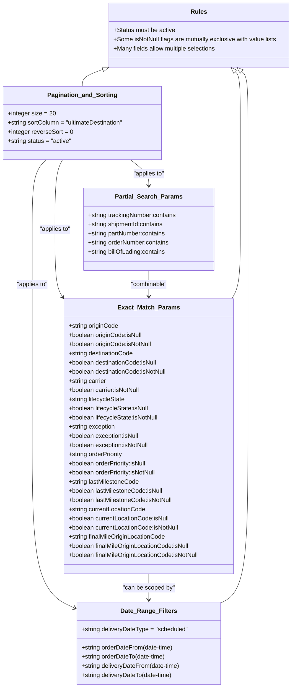

# Diagram: partview_core/partview_service/partview_service/api_definition/components/parameters/search.yaml

> Auto-generated by Obscura crawlers

## Mermaid

### SVG

<svg id="container" width="779.23046875" xmlns="http://www.w3.org/2000/svg" class="classDiagram" height="1800" viewBox="0 0 779.23046875 1800" role="graphics-document document" aria-roledescription="class"><g><defs><marker id="container_class-aggregationStart" class="marker aggregation class" refX="18" refY="7" markerWidth="190" markerHeight="240" orient="auto"><path d="M 18,7 L9,13 L1,7 L9,1 Z"></path></marker></defs><defs><marker id="container_class-aggregationEnd" class="marker aggregation class" refX="1" refY="7" markerWidth="20" markerHeight="28" orient="auto"><path d="M 18,7 L9,13 L1,7 L9,1 Z"></path></marker></defs><defs><marker id="container_class-extensionStart" class="marker extension class" refX="18" refY="7" markerWidth="190" markerHeight="240" orient="auto"><path d="M 1,7 L18,13 V 1 Z"></path></marker></defs><defs><marker id="container_class-extensionEnd" class="marker extension class" refX="1" refY="7" markerWidth="20" markerHeight="28" orient="auto"><path d="M 1,1 V 13 L18,7 Z"></path></marker></defs><defs><marker id="container_class-compositionStart" class="marker composition class" refX="18" refY="7" markerWidth="190" markerHeight="240" orient="auto"><path d="M 18,7 L9,13 L1,7 L9,1 Z"></path></marker></defs><defs><marker id="container_class-compositionEnd" class="marker composition class" refX="1" refY="7" markerWidth="20" markerHeight="28" orient="auto"><path d="M 18,7 L9,13 L1,7 L9,1 Z"></path></marker></defs><defs><marker id="container_class-dependencyStart" class="marker dependency class" refX="6" refY="7" markerWidth="190" markerHeight="240" orient="auto"><path d="M 5,7 L9,13 L1,7 L9,1 Z"></path></marker></defs><defs><marker id="container_class-dependencyEnd" class="marker dependency class" refX="13" refY="7" markerWidth="20" markerHeight="28" orient="auto"><path d="M 18,7 L9,13 L14,7 L9,1 Z"></path></marker></defs><defs><marker id="container_class-lollipopStart" class="marker lollipop class" refX="13" refY="7" markerWidth="190" markerHeight="240" orient="auto"><circle stroke="black" fill="transparent" cx="7" cy="7" r="6"></circle></marker></defs><defs><marker id="container_class-lollipopEnd" class="marker lollipop class" refX="1" refY="7" markerWidth="190" markerHeight="240" orient="auto"><circle stroke="black" fill="transparent" cx="7" cy="7" r="6"></circle></marker></defs><g class="root"><g class="clusters"></g><g class="edgePaths"><path d="M348.203,418L356.463,424.167C364.722,430.333,381.242,442.667,389.502,454C397.762,465.333,397.762,475.667,397.762,480.833L397.762,486" id="id_Pagination_and_Sorting_Partial_Search_Params_1" class="edge-thickness-normal edge-pattern-solid relation" style=";;;" data-edge="true" data-et="edge" data-id="id_Pagination_and_Sorting_Partial_Search_Params_1" data-points="W3sieCI6MzQ4LjIwMjcxMzgxNTc4OTUsInkiOjQxOH0seyJ4IjozOTcuNzYxNzE4NzUsInkiOjQ1NX0seyJ4IjozOTcuNzYxNzE4NzUsInkiOjQ5Mn1d" marker-end="url(#container_class-dependencyEnd)"></path><path d="M168.361,418L165.068,424.167C161.776,430.333,155.191,442.667,151.898,473C148.605,503.333,148.605,551.667,148.605,600C148.605,648.333,148.605,696.667,152.251,726.642C155.896,756.617,163.187,768.235,166.833,774.043L170.478,779.852" id="id_Pagination_and_Sorting_Exact_Match_Params_2" class="edge-thickness-normal edge-pattern-solid relation" style=";;;" data-edge="true" data-et="edge" data-id="id_Pagination_and_Sorting_Exact_Match_Params_2" data-points="W3sieCI6MTY4LjM2MDYwODU1MjYzMTYsInkiOjQxOH0seyJ4IjoxNDguNjA1NDY4NzUsInkiOjQ1NX0seyJ4IjoxNDguNjA1NDY4NzUsInkiOjYwMH0seyJ4IjoxNDguNjA1NDY4NzUsInkiOjc0NX0seyJ4IjoxNzMuNjY3OTY4NzUsInkiOjc4NC45MzQwMjczNDIyODAyfV0=" marker-end="url(#container_class-dependencyEnd)"></path><path d="M123.394,418L117.213,424.167C111.032,430.333,98.671,442.667,92.49,473C86.309,503.333,86.309,551.667,86.309,600C86.309,648.333,86.309,696.667,86.309,787C86.309,877.333,86.309,1009.667,86.309,1142C86.309,1274.333,86.309,1406.667,105.906,1481.957C125.503,1557.247,164.698,1575.495,184.295,1584.619L203.893,1593.742" id="id_Pagination_and_Sorting_Date_Range_Filters_3" class="edge-thickness-normal edge-pattern-solid relation" style=";;;" data-edge="true" data-et="edge" data-id="id_Pagination_and_Sorting_Date_Range_Filters_3" data-points="W3sieCI6MTIzLjM5NDQ0MzEzOTA5Nzc1LCJ5Ijo0MTh9LHsieCI6ODYuMzA4NTkzNzUsInkiOjQ1NX0seyJ4Ijo4Ni4zMDg1OTM3NSwieSI6NjAwfSx7IngiOjg2LjMwODU5Mzc1LCJ5Ijo3NDV9LHsieCI6ODYuMzA4NTkzNzUsInkiOjExNDJ9LHsieCI6ODYuMzA4NTkzNzUsInkiOjE1Mzl9LHsieCI6MjA5LjMzMjAzMTI1LCJ5IjoxNTk2LjI3NDc0NTM5NzA4MDN9XQ==" marker-end="url(#container_class-dependencyEnd)"></path><path d="M397.762,708L397.762,714.167C397.762,720.333,397.762,732.667,397.762,744C397.762,755.333,397.762,765.667,397.762,770.833L397.762,776" id="id_Partial_Search_Params_Exact_Match_Params_4" class="edge-thickness-normal edge-pattern-solid relation" style=";;;" data-edge="true" data-et="edge" data-id="id_Partial_Search_Params_Exact_Match_Params_4" data-points="W3sieCI6Mzk3Ljc2MTcxODc1LCJ5Ijo3MDh9LHsieCI6Mzk3Ljc2MTcxODc1LCJ5Ijo3NDV9LHsieCI6Mzk3Ljc2MTcxODc1LCJ5Ijo3ODJ9XQ==" marker-end="url(#container_class-dependencyEnd)"></path><path d="M397.762,1502L397.762,1508.167C397.762,1514.333,397.762,1526.667,397.762,1538C397.762,1549.333,397.762,1559.667,397.762,1564.833L397.762,1570" id="id_Exact_Match_Params_Date_Range_Filters_5" class="edge-thickness-normal edge-pattern-solid relation" style=";;;" data-edge="true" data-et="edge" data-id="id_Exact_Match_Params_Date_Range_Filters_5" data-points="W3sieCI6Mzk3Ljc2MTcxODc1LCJ5IjoxNTAyfSx7IngiOjM5Ny43NjE3MTg3NSwieSI6MTUzOX0seyJ4IjozOTcuNzYxNzE4NzUsInkiOjE1NzZ9XQ==" marker-end="url(#container_class-dependencyEnd)"></path><path d="M274.77,181.698L265.578,184.915C256.386,188.132,238.001,194.566,228.809,201.95C219.617,209.333,219.617,217.667,219.617,221.833L219.617,226" id="id_Rules_Pagination_and_Sorting_6" class="edge-thickness-normal edge-pattern-solid relation" style=";;;" data-edge="true" data-et="edge" data-id="id_Rules_Pagination_and_Sorting_6" data-points="W3sieCI6MjkxLjA1MTM5MDQ4MTY1MTM3LCJ5IjoxNzZ9LHsieCI6MjE5LjYxNzE4NzUsInkiOjIwMX0seyJ4IjoyMTkuNjE3MTg3NSwieSI6MjI2fV0=" marker-start="url(#container_class-extensionStart)"></path><path d="M627.72,188.167L629.869,190.306C632.019,192.445,636.318,196.722,638.468,219.028C640.617,241.333,640.617,281.667,640.617,324C640.617,366.333,640.617,410.667,640.617,457C640.617,503.333,640.617,551.667,640.617,600C640.617,648.333,640.617,696.667,636.845,727C633.073,757.333,625.528,769.667,621.756,775.833L617.983,782" id="id_Rules_Exact_Match_Params_7" class="edge-thickness-normal edge-pattern-solid relation" style=";;;" data-edge="true" data-et="edge" data-id="id_Rules_Exact_Match_Params_7" data-points="W3sieCI6NjE1LjQ5MTc1NzQ1NDEyODQsInkiOjE3Nn0seyJ4Ijo2NDAuNjE3MTg3NSwieSI6MjAxfSx7IngiOjY0MC42MTcxODc1LCJ5IjozMjJ9LHsieCI6NjQwLjYxNzE4NzUsInkiOjQ1NX0seyJ4Ijo2NDAuNjE3MTg3NSwieSI6NjAwfSx7IngiOjY0MC42MTcxODc1LCJ5Ijo3NDV9LHsieCI6NjE3Ljk4MzMwMjUwMzE0ODYsInkiOjc4Mn1d" marker-start="url(#container_class-extensionStart)"></path><path d="M644.104,187.106L646.856,189.422C649.608,191.737,655.113,196.369,657.865,218.851C660.617,241.333,660.617,281.667,660.617,324C660.617,366.333,660.617,410.667,660.617,457C660.617,503.333,660.617,551.667,660.617,600C660.617,648.333,660.617,696.667,660.617,787C660.617,877.333,660.617,1009.667,660.617,1142C660.617,1274.333,660.617,1406.667,648.213,1479.676C635.809,1552.685,611,1566.371,598.596,1573.213L586.191,1580.056" id="id_Rules_Date_Range_Filters_8" class="edge-thickness-normal edge-pattern-solid relation" style=";;;" data-edge="true" data-et="edge" data-id="id_Rules_Date_Range_Filters_8" data-points="W3sieCI6NjMwLjkwNDYwMTQ5MDgyNTcsInkiOjE3Nn0seyJ4Ijo2NjAuNjE3MTg3NSwieSI6MjAxfSx7IngiOjY2MC42MTcxODc1LCJ5IjozMjJ9LHsieCI6NjYwLjYxNzE4NzUsInkiOjQ1NX0seyJ4Ijo2NjAuNjE3MTg3NSwieSI6NjAwfSx7IngiOjY2MC42MTcxODc1LCJ5Ijo3NDV9LHsieCI6NjYwLjYxNzE4NzUsInkiOjExNDJ9LHsieCI6NjYwLjYxNzE4NzUsInkiOjE1Mzl9LHsieCI6NTg2LjE5MTQwNjI1LCJ5IjoxNTgwLjA1NTc4NzU0OTU5OH1d" marker-start="url(#container_class-extensionStart)"></path></g><g class="edgeLabels"><g class="edgeLabel" transform="translate(397.76171875, 455)"><g class="label" data-id="id_Pagination_and_Sorting_Partial_Search_Params_1" transform="translate(-42.296875, -12)"><foreignObject width="84.59375" height="24">

"applies to"

</foreignObject></g></g><g class="edgeLabel" transform="translate(148.60546875, 600)"><g class="label" data-id="id_Pagination_and_Sorting_Exact_Match_Params_2" transform="translate(-42.296875, -12)"><foreignObject width="84.59375" height="24">

"applies to"

</foreignObject></g></g><g class="edgeLabel" transform="translate(86.30859375, 745)"><g class="label" data-id="id_Pagination_and_Sorting_Date_Range_Filters_3" transform="translate(-42.296875, -12)"><foreignObject width="84.59375" height="24">

"applies to"

</foreignObject></g></g><g class="edgeLabel" transform="translate(397.76171875, 745)"><g class="label" data-id="id_Partial_Search_Params_Exact_Match_Params_4" transform="translate(-48.8828125, -12)"><foreignObject width="97.765625" height="24">

"combinable"

</foreignObject></g></g><g class="edgeLabel" transform="translate(397.76171875, 1539)"><g class="label" data-id="id_Exact_Match_Params_Date_Range_Filters_5" transform="translate(-69.1875, -12)"><foreignObject width="138.375" height="24">

"can be scoped by"

</foreignObject></g></g><g class="edgeLabel"><g class="label" data-id="id_Rules_Pagination_and_Sorting_6" transform="translate(0, 0)"><foreignObject width="0" height="0">

</foreignObject></g></g><g class="edgeLabel"><g class="label" data-id="id_Rules_Exact_Match_Params_7" transform="translate(0, 0)"><foreignObject width="0" height="0">

</foreignObject></g></g><g class="edgeLabel"><g class="label" data-id="id_Rules_Date_Range_Filters_8" transform="translate(0, 0)"><foreignObject width="0" height="0">

</foreignObject></g></g></g><g class="nodes"><g class="node default" id="classId-Pagination_and_Sorting-0" transform="translate(219.6171875, 322)"><g class="basic label-container"><path d="M-211.6171875 -96 L211.6171875 -96 L211.6171875 96 L-211.6171875 96" stroke="none" stroke-width="0" fill="#ECECFF" style=""></path><path d="M-211.6171875 -96 C-87.49990844632163 -96, 36.61737060735675 -96, 211.6171875 -96 M-211.6171875 -96 C-51.17682911626832 -96, 109.26352926746335 -96, 211.6171875 -96 M211.6171875 -96 C211.6171875 -48.37156520987496, 211.6171875 -0.7431304197499173, 211.6171875 96 M211.6171875 -96 C211.6171875 -56.439558573308865, 211.6171875 -16.87911714661773, 211.6171875 96 M211.6171875 96 C91.67178125702236 96, -28.27362498595528 96, -211.6171875 96 M211.6171875 96 C73.17001813337214 96, -65.27715123325572 96, -211.6171875 96 M-211.6171875 96 C-211.6171875 44.43374258869787, -211.6171875 -7.132514822604264, -211.6171875 -96 M-211.6171875 96 C-211.6171875 39.93607771757511, -211.6171875 -16.12784456484978, -211.6171875 -96" stroke="#9370DB" stroke-width="1.3" fill="none" stroke-dasharray="0 0" style=""></path></g><g class="annotation-group text" transform="translate(0, -72)"></g><g class="label-group text" transform="translate(-87.609375, -72)"><g class="label" style="font-weight: bolder" transform="translate(0,-12)"><foreignObject width="175.21875" height="24">

Pagination_and_Sorting

</foreignObject></g></g><g class="members-group text" transform="translate(-199.6171875, -24)"><g class="label" style="" transform="translate(0,-12)"><foreignObject width="124.25" height="24">

+integer size = 20

</foreignObject></g><g class="label" style="" transform="translate(0,12)"><foreignObject width="311.625" height="24">

+string sortColumn = "ultimateDestination"

</foreignObject></g><g class="label" style="" transform="translate(0,36)"><foreignObject width="171.765625" height="24">

+integer reverseSort = 0

</foreignObject></g><g class="label" style="" transform="translate(0,60)"><foreignObject width="170.28125" height="24">

+string status = "active"

</foreignObject></g></g><g class="methods-group text" transform="translate(-199.6171875, 96)"></g><g class="divider" style=""><path d="M-211.6171875 -48 C-101.31971860179648 -48, 8.977750296407038 -48, 211.6171875 -48 M-211.6171875 -48 C-60.11983522497505 -48, 91.3775170500499 -48, 211.6171875 -48" stroke="#9370DB" stroke-width="1.3" fill="none" stroke-dasharray="0 0" style=""></path></g><g class="divider" style=""><path d="M-211.6171875 72 C-81.94154617944386 72, 47.73409514111228 72, 211.6171875 72 M-211.6171875 72 C-51.098019956052696 72, 109.42114758789461 72, 211.6171875 72" stroke="#9370DB" stroke-width="1.3" fill="none" stroke-dasharray="0 0" style=""></path></g></g><g class="node default" id="classId-Partial_Search_Params-1" transform="translate(397.76171875, 600)"><g class="basic label-container"><path d="M-171.859375 -108 L171.859375 -108 L171.859375 108 L-171.859375 108" stroke="none" stroke-width="0" fill="#ECECFF" style=""></path><path d="M-171.859375 -108 C-69.89937408440264 -108, 32.060626831194725 -108, 171.859375 -108 M-171.859375 -108 C-60.42125004357186 -108, 51.01687491285628 -108, 171.859375 -108 M171.859375 -108 C171.859375 -40.067329547334836, 171.859375 27.865340905330328, 171.859375 108 M171.859375 -108 C171.859375 -45.19069847513529, 171.859375 17.618603049729415, 171.859375 108 M171.859375 108 C67.07046128093926 108, -37.71845243812149 108, -171.859375 108 M171.859375 108 C67.18563994203394 108, -37.48809511593211 108, -171.859375 108 M-171.859375 108 C-171.859375 25.535655652266968, -171.859375 -56.928688695466064, -171.859375 -108 M-171.859375 108 C-171.859375 50.517321469562724, -171.859375 -6.9653570608745525, -171.859375 -108" stroke="#9370DB" stroke-width="1.3" fill="none" stroke-dasharray="0 0" style=""></path></g><g class="annotation-group text" transform="translate(0, -84)"></g><g class="label-group text" transform="translate(-83.578125, -84)"><g class="label" style="font-weight: bolder" transform="translate(0,-12)"><foreignObject width="167.15625" height="24">

Partial_Search_Params

</foreignObject></g></g><g class="members-group text" transform="translate(-159.859375, -36)"><g class="label" style="" transform="translate(0,-12)"><foreignObject width="236.140625" height="24">

+string trackingNumber:contains

</foreignObject></g><g class="label" style="" transform="translate(0,12)"><foreignObject width="202.21875" height="24">

+string shipmentId:contains

</foreignObject></g><g class="label" style="" transform="translate(0,36)"><foreignObject width="208" height="24">

+string partNumber:contains

</foreignObject></g><g class="label" style="" transform="translate(0,60)"><foreignObject width="217.5" height="24">

+string orderNumber:contains

</foreignObject></g><g class="label" style="" transform="translate(0,84)"><foreignObject width="207.59375" height="24">

+string billOfLading:contains

</foreignObject></g></g><g class="methods-group text" transform="translate(-159.859375, 108)"></g><g class="divider" style=""><path d="M-171.859375 -60 C-59.33569884322449 -60, 53.187977313551016 -60, 171.859375 -60 M-171.859375 -60 C-51.67299761818414 -60, 68.51337976363172 -60, 171.859375 -60" stroke="#9370DB" stroke-width="1.3" fill="none" stroke-dasharray="0 0" style=""></path></g><g class="divider" style=""><path d="M-171.859375 84 C-94.86731007038995 84, -17.875245140779896 84, 171.859375 84 M-171.859375 84 C-97.33747590386841 84, -22.815576807736818 84, 171.859375 84" stroke="#9370DB" stroke-width="1.3" fill="none" stroke-dasharray="0 0" style=""></path></g></g><g class="node default" id="classId-Exact_Match_Params-2" transform="translate(397.76171875, 1142)"><g class="basic label-container"><path d="M-224.09375 -360 L224.09375 -360 L224.09375 360 L-224.09375 360" stroke="none" stroke-width="0" fill="#ECECFF" style=""></path><path d="M-224.09375 -360 C-83.80339425503044 -360, 56.48696148993912 -360, 224.09375 -360 M-224.09375 -360 C-63.62429738987424 -360, 96.84515522025151 -360, 224.09375 -360 M224.09375 -360 C224.09375 -203.1698431479395, 224.09375 -46.339686295879005, 224.09375 360 M224.09375 -360 C224.09375 -209.7886472384659, 224.09375 -59.5772944769318, 224.09375 360 M224.09375 360 C104.83743570208674 360, -14.418878595826527 360, -224.09375 360 M224.09375 360 C77.3967401187584 360, -69.3002697624832 360, -224.09375 360 M-224.09375 360 C-224.09375 150.7272417607272, -224.09375 -58.54551647854561, -224.09375 -360 M-224.09375 360 C-224.09375 77.3593272911636, -224.09375 -205.2813454176728, -224.09375 -360" stroke="#9370DB" stroke-width="1.3" fill="none" stroke-dasharray="0 0" style=""></path></g><g class="annotation-group text" transform="translate(0, -336)"></g><g class="label-group text" transform="translate(-76.578125, -336)"><g class="label" style="font-weight: bolder" transform="translate(0,-12)"><foreignObject width="153.15625" height="24">

Exact_Match_Params

</foreignObject></g></g><g class="members-group text" transform="translate(-212.09375, -288)"><g class="label" style="" transform="translate(0,-12)"><foreignObject width="132.375" height="24">

+string originCode

</foreignObject></g><g class="label" style="" transform="translate(0,12)"><foreignObject width="195.625" height="24">

+boolean originCode:isNull

</foreignObject></g><g class="label" style="" transform="translate(0,36)"><foreignObject width="221.671875" height="24">

+boolean originCode:isNotNull

</foreignObject></g><g class="label" style="" transform="translate(0,60)"><foreignObject width="173.265625" height="24">

+string destinationCode

</foreignObject></g><g class="label" style="" transform="translate(0,84)"><foreignObject width="236.515625" height="24">

+boolean destinationCode:isNull

</foreignObject></g><g class="label" style="" transform="translate(0,108)"><foreignObject width="262.5625" height="24">

+boolean destinationCode:isNotNull

</foreignObject></g><g class="label" style="" transform="translate(0,132)"><foreignObject width="101.8125" height="24">

+string carrier

</foreignObject></g><g class="label" style="" transform="translate(0,156)"><foreignObject width="191.265625" height="24">

+boolean carrier:isNotNull

</foreignObject></g><g class="label" style="" transform="translate(0,180)"><foreignObject width="150.765625" height="24">

+string lifecycleState

</foreignObject></g><g class="label" style="" transform="translate(0,204)"><foreignObject width="214.015625" height="24">

+boolean lifecycleState:isNull

</foreignObject></g><g class="label" style="" transform="translate(0,228)"><foreignObject width="240.0625" height="24">

+boolean lifecycleState:isNotNull

</foreignObject></g><g class="label" style="" transform="translate(0,252)"><foreignObject width="124.609375" height="24">

+string exception

</foreignObject></g><g class="label" style="" transform="translate(0,276)"><foreignObject width="187.859375" height="24">

+boolean exception:isNull

</foreignObject></g><g class="label" style="" transform="translate(0,300)"><foreignObject width="213.90625" height="24">

+boolean exception:isNotNull

</foreignObject></g><g class="label" style="" transform="translate(0,324)"><foreignObject width="146.625" height="24">

+string orderPriority

</foreignObject></g><g class="label" style="" transform="translate(0,348)"><foreignObject width="209.9375" height="24">

+boolean orderPriority:isNull

</foreignObject></g><g class="label" style="" transform="translate(0,372)"><foreignObject width="236" height="24">

+boolean orderPriority:isNotNull

</foreignObject></g><g class="label" style="" transform="translate(0,396)"><foreignObject width="187.265625" height="24">

+string lastMilestoneCode

</foreignObject></g><g class="label" style="" transform="translate(0,420)"><foreignObject width="250.515625" height="24">

+boolean lastMilestoneCode:isNull

</foreignObject></g><g class="label" style="" transform="translate(0,444)"><foreignObject width="276.5625" height="24">

+boolean lastMilestoneCode:isNotNull

</foreignObject></g><g class="label" style="" transform="translate(0,468)"><foreignObject width="204.796875" height="24">

+string currentLocationCode

</foreignObject></g><g class="label" style="" transform="translate(0,492)"><foreignObject width="268.046875" height="24">

+boolean currentLocationCode:isNull

</foreignObject></g><g class="label" style="" transform="translate(0,516)"><foreignObject width="294.09375" height="24">

+boolean currentLocationCode:isNotNull

</foreignObject></g><g class="label" style="" transform="translate(0,540)"><foreignObject width="258.3125" height="24">

+string finalMileOriginLocationCode

</foreignObject></g><g class="label" style="" transform="translate(0,564)"><foreignObject width="321.5625" height="24">

+boolean finalMileOriginLocationCode:isNull

</foreignObject></g><g class="label" style="" transform="translate(0,588)"><foreignObject width="347.609375" height="24">

+boolean finalMileOriginLocationCode:isNotNull

</foreignObject></g></g><g class="methods-group text" transform="translate(-212.09375, 360)"></g><g class="divider" style=""><path d="M-224.09375 -312 C-80.66456003796114 -312, 62.764629924077724 -312, 224.09375 -312 M-224.09375 -312 C-61.93798466612773 -312, 100.21778066774453 -312, 224.09375 -312" stroke="#9370DB" stroke-width="1.3" fill="none" stroke-dasharray="0 0" style=""></path></g><g class="divider" style=""><path d="M-224.09375 336 C-67.03812459495387 336, 90.01750081009226 336, 224.09375 336 M-224.09375 336 C-62.89459068705224 336, 98.30456862589551 336, 224.09375 336" stroke="#9370DB" stroke-width="1.3" fill="none" stroke-dasharray="0 0" style=""></path></g></g><g class="node default" id="classId-Date_Range_Filters-3" transform="translate(397.76171875, 1684)"><g class="basic label-container"><path d="M-188.4296875 -108 L188.4296875 -108 L188.4296875 108 L-188.4296875 108" stroke="none" stroke-width="0" fill="#ECECFF" style=""></path><path d="M-188.4296875 -108 C-60.889790580255934 -108, 66.65010633948813 -108, 188.4296875 -108 M-188.4296875 -108 C-110.93276935388687 -108, -33.43585120777374 -108, 188.4296875 -108 M188.4296875 -108 C188.4296875 -31.255713849622836, 188.4296875 45.48857230075433, 188.4296875 108 M188.4296875 -108 C188.4296875 -63.257661529025064, 188.4296875 -18.51532305805013, 188.4296875 108 M188.4296875 108 C72.90453578293184 108, -42.62061593413631 108, -188.4296875 108 M188.4296875 108 C94.95137296240058 108, 1.4730584248011667 108, -188.4296875 108 M-188.4296875 108 C-188.4296875 22.72816509868423, -188.4296875 -62.54366980263154, -188.4296875 -108 M-188.4296875 108 C-188.4296875 59.76760465280864, -188.4296875 11.535209305617286, -188.4296875 -108" stroke="#9370DB" stroke-width="1.3" fill="none" stroke-dasharray="0 0" style=""></path></g><g class="annotation-group text" transform="translate(0, -84)"></g><g class="label-group text" transform="translate(-70.015625, -84)"><g class="label" style="font-weight: bolder" transform="translate(0,-12)"><foreignObject width="140.03125" height="24">

Date_Range_Filters

</foreignObject></g></g><g class="members-group text" transform="translate(-176.4296875, -36)"><g class="label" style="" transform="translate(0,-12)"><foreignObject width="282.84375" height="24">

+string deliveryDateType = "scheduled"

</foreignObject></g></g><g class="methods-group text" transform="translate(-176.4296875, 12)"><g class="label" style="" transform="translate(0,-12)"><foreignObject width="244.5" height="24">

+string orderDateFrom(date-time)

</foreignObject></g><g class="label" style="" transform="translate(0,12)"><foreignObject width="225.1875" height="24">

+string orderDateTo(date-time)

</foreignObject></g><g class="label" style="" transform="translate(0,36)"><foreignObject width="263.0625" height="24">

+string deliveryDateFrom(date-time)

</foreignObject></g><g class="label" style="" transform="translate(0,60)"><foreignObject width="243.75" height="24">

+string deliveryDateTo(date-time)

</foreignObject></g></g><g class="divider" style=""><path d="M-188.4296875 -60 C-108.54271959423347 -60, -28.65575168846695 -60, 188.4296875 -60 M-188.4296875 -60 C-105.82108619311414 -60, -23.21248488622828 -60, 188.4296875 -60" stroke="#9370DB" stroke-width="1.3" fill="none" stroke-dasharray="0 0" style=""></path></g><g class="divider" style=""><path d="M-188.4296875 -12 C-57.03950144895626 -12, 74.35068460208748 -12, 188.4296875 -12 M-188.4296875 -12 C-55.38553082475278 -12, 77.65862585049445 -12, 188.4296875 -12" stroke="#9370DB" stroke-width="1.3" fill="none" stroke-dasharray="0 0" style=""></path></g></g><g class="node default" id="classId-Rules-4" transform="translate(531.0703125, 92)"><g class="basic label-container"><path d="M-240.16015625 -84 L240.16015625 -84 L240.16015625 84 L-240.16015625 84" stroke="none" stroke-width="0" fill="#ECECFF" style=""></path><path d="M-240.16015625 -84 C-96.80279182081165 -84, 46.5545726083767 -84, 240.16015625 -84 M-240.16015625 -84 C-124.90997457395353 -84, -9.659792897907067 -84, 240.16015625 -84 M240.16015625 -84 C240.16015625 -27.050686852962137, 240.16015625 29.898626294075726, 240.16015625 84 M240.16015625 -84 C240.16015625 -27.560472568702707, 240.16015625 28.879054862594586, 240.16015625 84 M240.16015625 84 C53.05341304581654 84, -134.05333015836692 84, -240.16015625 84 M240.16015625 84 C53.43972664942649 84, -133.28070295114702 84, -240.16015625 84 M-240.16015625 84 C-240.16015625 37.28515599826518, -240.16015625 -9.429688003469636, -240.16015625 -84 M-240.16015625 84 C-240.16015625 28.701985847188105, -240.16015625 -26.59602830562379, -240.16015625 -84" stroke="#9370DB" stroke-width="1.3" fill="none" stroke-dasharray="0 0" style=""></path></g><g class="annotation-group text" transform="translate(0, -60)"></g><g class="label-group text" transform="translate(-20.1328125, -60)"><g class="label" style="font-weight: bolder" transform="translate(0,-12)"><foreignObject width="40.265625" height="24">

Rules

</foreignObject></g></g><g class="members-group text" transform="translate(-228.16015625, -12)"><g class="label" style="" transform="translate(0,-12)"><foreignObject width="163.390625" height="24">

+Status must be active

</foreignObject></g><g class="label" style="" transform="translate(0,12)"><foreignObject width="436.1875" height="24">

+Some isNotNull flags are mutually exclusive with value lists

</foreignObject></g><g class="label" style="" transform="translate(0,36)"><foreignObject width="275.9375" height="24">

+Many fields allow multiple selections

</foreignObject></g></g><g class="methods-group text" transform="translate(-228.16015625, 84)"></g><g class="divider" style=""><path d="M-240.16015625 -36 C-71.97809760014161 -36, 96.20396104971678 -36, 240.16015625 -36 M-240.16015625 -36 C-63.700707826267376 -36, 112.75874059746525 -36, 240.16015625 -36" stroke="#9370DB" stroke-width="1.3" fill="none" stroke-dasharray="0 0" style=""></path></g><g class="divider" style=""><path d="M-240.16015625 60 C-118.26220015680497 60, 3.635755936390069 60, 240.16015625 60 M-240.16015625 60 C-132.63351938321352 60, -25.10688251642702 60, 240.16015625 60" stroke="#9370DB" stroke-width="1.3" fill="none" stroke-dasharray="0 0" style=""></path></g></g></g></g></g></svg>
