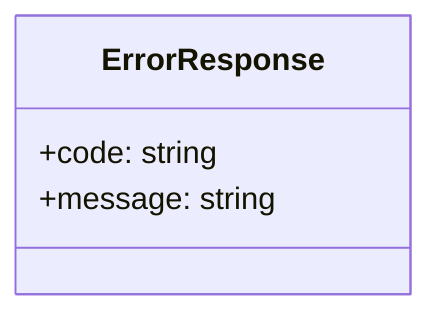
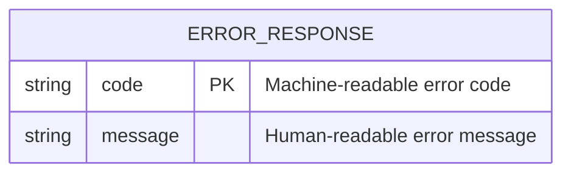

# Diagram: partview_core/partview_service/partview_service/api_definition/components/schemas/common.yaml

> Auto-generated by Obscura crawlers

## Diagram 1

### SVG

<svg id="container" width="213.71875" xmlns="http://www.w3.org/2000/svg" class="classDiagram" height="160" viewBox="0 0 213.71875 160" role="graphics-document document" aria-roledescription="class"><g><defs><marker id="container_class-aggregationStart" class="marker aggregation class" refX="18" refY="7" markerWidth="190" markerHeight="240" orient="auto"><path d="M 18,7 L9,13 L1,7 L9,1 Z"></path></marker></defs><defs><marker id="container_class-aggregationEnd" class="marker aggregation class" refX="1" refY="7" markerWidth="20" markerHeight="28" orient="auto"><path d="M 18,7 L9,13 L1,7 L9,1 Z"></path></marker></defs><defs><marker id="container_class-extensionStart" class="marker extension class" refX="18" refY="7" markerWidth="190" markerHeight="240" orient="auto"><path d="M 1,7 L18,13 V 1 Z"></path></marker></defs><defs><marker id="container_class-extensionEnd" class="marker extension class" refX="1" refY="7" markerWidth="20" markerHeight="28" orient="auto"><path d="M 1,1 V 13 L18,7 Z"></path></marker></defs><defs><marker id="container_class-compositionStart" class="marker composition class" refX="18" refY="7" markerWidth="190" markerHeight="240" orient="auto"><path d="M 18,7 L9,13 L1,7 L9,1 Z"></path></marker></defs><defs><marker id="container_class-compositionEnd" class="marker composition class" refX="1" refY="7" markerWidth="20" markerHeight="28" orient="auto"><path d="M 18,7 L9,13 L1,7 L9,1 Z"></path></marker></defs><defs><marker id="container_class-dependencyStart" class="marker dependency class" refX="6" refY="7" markerWidth="190" markerHeight="240" orient="auto"><path d="M 5,7 L9,13 L1,7 L9,1 Z"></path></marker></defs><defs><marker id="container_class-dependencyEnd" class="marker dependency class" refX="13" refY="7" markerWidth="20" markerHeight="28" orient="auto"><path d="M 18,7 L9,13 L14,7 L9,1 Z"></path></marker></defs><defs><marker id="container_class-lollipopStart" class="marker lollipop class" refX="13" refY="7" markerWidth="190" markerHeight="240" orient="auto"><circle stroke="black" fill="transparent" cx="7" cy="7" r="6"></circle></marker></defs><defs><marker id="container_class-lollipopEnd" class="marker lollipop class" refX="1" refY="7" markerWidth="190" markerHeight="240" orient="auto"><circle stroke="black" fill="transparent" cx="7" cy="7" r="6"></circle></marker></defs><g class="root"><g class="clusters"></g><g class="edgePaths"></g><g class="edgeLabels"></g><g class="nodes"><g class="node default" id="classId-ErrorResponse-0" transform="translate(106.859375, 80)"><g class="basic label-container"><path d="M-98.859375 -72 L98.859375 -72 L98.859375 72 L-98.859375 72" stroke="none" stroke-width="0" fill="#ECECFF" style=""></path><path d="M-98.859375 -72 C-56.60000246664365 -72, -14.340629933287303 -72, 98.859375 -72 M-98.859375 -72 C-48.98315011476998 -72, 0.8930747704600464 -72, 98.859375 -72 M98.859375 -72 C98.859375 -15.79154932302663, 98.859375 40.41690135394674, 98.859375 72 M98.859375 -72 C98.859375 -32.85778636209704, 98.859375 6.284427275805925, 98.859375 72 M98.859375 72 C51.66039604910473 72, 4.461417098209466 72, -98.859375 72 M98.859375 72 C23.50931632236275 72, -51.8407423552745 72, -98.859375 72 M-98.859375 72 C-98.859375 40.293465474426625, -98.859375 8.58693094885325, -98.859375 -72 M-98.859375 72 C-98.859375 29.64148005057517, -98.859375 -12.717039898849663, -98.859375 -72" stroke="#9370DB" stroke-width="1.3" fill="none" stroke-dasharray="0 0" style=""></path></g><g class="annotation-group text" transform="translate(0, -48)"></g><g class="label-group text" transform="translate(-53.625, -48)"><g class="label" style="font-weight: bolder" transform="translate(0,-12)"><foreignObject width="107.25" height="24">

ErrorResponse

</foreignObject></g></g><g class="members-group text" transform="translate(-86.859375, 0)"><g class="label" style="" transform="translate(0,-12)"><foreignObject width="92.65625" height="24">

+code: string

</foreignObject></g><g class="label" style="" transform="translate(0,12)"><foreignObject width="120.09375" height="24">

+message: string

</foreignObject></g></g><g class="methods-group text" transform="translate(-86.859375, 72)"></g><g class="divider" style=""><path d="M-98.859375 -24 C-46.34945301671037 -24, 6.160468966579259 -24, 98.859375 -24 M-98.859375 -24 C-58.37168700927428 -24, -17.883999018548565 -24, 98.859375 -24" stroke="#9370DB" stroke-width="1.3" fill="none" stroke-dasharray="0 0" style=""></path></g><g class="divider" style=""><path d="M-98.859375 48 C-21.665212443614408 48, 55.528950112771184 48, 98.859375 48 M-98.859375 48 C-43.30140969183135 48, 12.256555616337295 48, 98.859375 48" stroke="#9370DB" stroke-width="1.3" fill="none" stroke-dasharray="0 0" style=""></path></g></g></g></g></g></svg>

## Diagram 2

### SVG

<svg id="container" width="468.25" xmlns="http://www.w3.org/2000/svg" class="erDiagram" height="144.25" viewBox="0 0 468.25 144.25" role="graphics-document document" aria-roledescription="er"><g><defs><marker id="container_er-onlyOneStart" class="marker onlyOne er" refX="0" refY="9" markerWidth="18" markerHeight="18" orient="auto"><path d="M9,0 L9,18 M15,0 L15,18"></path></marker></defs><defs><marker id="container_er-onlyOneEnd" class="marker onlyOne er" refX="18" refY="9" markerWidth="18" markerHeight="18" orient="auto"><path d="M3,0 L3,18 M9,0 L9,18"></path></marker></defs><defs><marker id="container_er-zeroOrOneStart" class="marker zeroOrOne er" refX="0" refY="9" markerWidth="30" markerHeight="18" orient="auto"><circle fill="white" cx="21" cy="9" r="6"></circle><path d="M9,0 L9,18"></path></marker></defs><defs><marker id="container_er-zeroOrOneEnd" class="marker zeroOrOne er" refX="30" refY="9" markerWidth="30" markerHeight="18" orient="auto"><circle fill="white" cx="9" cy="9" r="6"></circle><path d="M21,0 L21,18"></path></marker></defs><defs><marker id="container_er-oneOrMoreStart" class="marker oneOrMore er" refX="18" refY="18" markerWidth="45" markerHeight="36" orient="auto"><path d="M0,18 Q 18,0 36,18 Q 18,36 0,18 M42,9 L42,27"></path></marker></defs><defs><marker id="container_er-oneOrMoreEnd" class="marker oneOrMore er" refX="27" refY="18" markerWidth="45" markerHeight="36" orient="auto"><path d="M3,9 L3,27 M9,18 Q27,0 45,18 Q27,36 9,18"></path></marker></defs><defs><marker id="container_er-zeroOrMoreStart" class="marker zeroOrMore er" refX="18" refY="18" markerWidth="57" markerHeight="36" orient="auto"><circle fill="white" cx="48" cy="18" r="6"></circle><path d="M0,18 Q18,0 36,18 Q18,36 0,18"></path></marker></defs><defs><marker id="container_er-zeroOrMoreEnd" class="marker zeroOrMore er" refX="39" refY="18" markerWidth="57" markerHeight="36" orient="auto"><circle fill="white" cx="9" cy="18" r="6"></circle><path d="M21,18 Q39,0 57,18 Q39,36 21,18"></path></marker></defs><g class="root"><g class="clusters"></g><g class="edgePaths"></g><g class="edgeLabels"></g><g class="nodes"><g class="node default" id="entity-ERROR_RESPONSE-0" transform="translate(234.125, 72.125)"><g style=""><path d="M-226.125 -64.125 L226.125 -64.125 L226.125 64.125 L-226.125 64.125" stroke="none" stroke-width="0" fill="#ECECFF"></path><path d="M-226.125 -64.125 C-95.21476748851694 -64.125, 35.69546502296612 -64.125, 226.125 -64.125 M-226.125 -64.125 C-64.3245358668322 -64.125, 97.47592826633559 -64.125, 226.125 -64.125 M226.125 -64.125 C226.125 -20.092536023425083, 226.125 23.939927953149834, 226.125 64.125 M226.125 -64.125 C226.125 -28.235605623202375, 226.125 7.653788753595251, 226.125 64.125 M226.125 64.125 C134.51620521725187 64.125, 42.90741043450376 64.125, -226.125 64.125 M226.125 64.125 C86.87952325834004 64.125, -52.36595348331991 64.125, -226.125 64.125 M-226.125 64.125 C-226.125 17.747684128553807, -226.125 -28.629631742892386, -226.125 -64.125 M-226.125 64.125 C-226.125 28.985867419996055, -226.125 -6.153265160007891, -226.125 -64.125" stroke="#9370DB" stroke-width="1.3" fill="none" stroke-dasharray="0 0"></path></g><g style="" class="row-rect-odd"><path d="M-226.125 -21.375 L226.125 -21.375 L226.125 21.375 L-226.125 21.375" stroke="none" stroke-width="0" fill="hsl(240, 100%, 100%)"></path><path d="M-226.125 -21.375 C-105.08062352000607 -21.375, 15.963752959987858 -21.375, 226.125 -21.375 M-226.125 -21.375 C-58.62882071978052 -21.375, 108.86735856043896 -21.375, 226.125 -21.375 M226.125 -21.375 C226.125 -7.651609808015895, 226.125 6.0717803839682105, 226.125 21.375 M226.125 -21.375 C226.125 -5.984621766024485, 226.125 9.40575646795103, 226.125 21.375 M226.125 21.375 C109.55906405921475 21.375, -7.006871881570504 21.375, -226.125 21.375 M226.125 21.375 C122.10619707428192 21.375, 18.087394148563845 21.375, -226.125 21.375 M-226.125 21.375 C-226.125 4.926368303895611, -226.125 -11.522263392208778, -226.125 -21.375 M-226.125 21.375 C-226.125 7.537460986946421, -226.125 -6.300078026107158, -226.125 -21.375" stroke="#9370DB" stroke-width="1.3" fill="none" stroke-dasharray="0 0"></path></g><g style="" class="row-rect-even"><path d="M-226.125 21.375 L226.125 21.375 L226.125 64.125 L-226.125 64.125" stroke="none" stroke-width="0" fill="hsl(240, 100%, 97.2745098039%)"></path><path d="M-226.125 21.375 C-105.16349223923068 21.375, 15.798015521538645 21.375, 226.125 21.375 M-226.125 21.375 C-83.62728741151741 21.375, 58.87042517696517 21.375, 226.125 21.375 M226.125 21.375 C226.125 37.433579651687396, 226.125 53.4921593033748, 226.125 64.125 M226.125 21.375 C226.125 37.01767743358744, 226.125 52.66035486717488, 226.125 64.125 M226.125 64.125 C123.35279166061103 64.125, 20.580583321222065 64.125, -226.125 64.125 M226.125 64.125 C53.24019153061448 64.125, -119.64461693877104 64.125, -226.125 64.125 M-226.125 64.125 C-226.125 54.57849322622913, -226.125 45.03198645245826, -226.125 21.375 M-226.125 64.125 C-226.125 55.31169355571322, -226.125 46.498387111426446, -226.125 21.375" stroke="#9370DB" stroke-width="1.3" fill="none" stroke-dasharray="0 0"></path></g><g class="label name" transform="translate(-66.1171875, -54.75)" style=""><foreignObject width="132.234375" height="24">

ERROR_RESPONSE

</foreignObject></g><g class="label attribute-type" transform="translate(-213.625, -12)" style=""><foreignObject width="41.640625" height="24">

string

</foreignObject></g><g class="label attribute-name" transform="translate(-146.984375, -12)" style=""><foreignObject width="34.96875" height="24">

code

</foreignObject></g><g class="label attribute-keys" transform="translate(-59.59375, -12)" style=""><foreignObject width="18.734375" height="24">

PK

</foreignObject></g><g class="label attribute-comment" transform="translate(-15.859375, -12)" style=""><foreignObject width="210.859375" height="24">

Machine-readable error code

</foreignObject></g><g class="label attribute-type" transform="translate(-213.625, 30.75)" style=""><foreignObject width="41.640625" height="24">

string

</foreignObject></g><g class="label attribute-name" transform="translate(-146.984375, 30.75)" style=""><foreignObject width="62.390625" height="24">

message

</foreignObject></g><g class="label attribute-keys" transform="translate(-59.59375, 30.75)" style=""><foreignObject width="0" height="0">

</foreignObject></g><g class="label attribute-comment" transform="translate(-15.859375, 30.75)" style=""><foreignObject width="229.484375" height="24">

Human-readable error message

</foreignObject></g><g class="divider"><path d="M-226.125 -21.375 C-108.03186726605958 -21.375, 10.061265467880844 -21.375, 226.125 -21.375 M-226.125 -21.375 C-134.7069937682433 -21.375, -43.28898753648659 -21.375, 226.125 -21.375" stroke="#9370DB" stroke-width="1.3" fill="none" stroke-dasharray="0 0"></path></g><g class="divider"><path d="M-159.484375 -21.375 C-159.484375 12.261031409912981, -159.484375 45.89706281982596, -159.484375 64.125 M-159.484375 -21.375 C-159.484375 -2.5531295375467735, -159.484375 16.268740924906453, -159.484375 64.125" stroke="#9370DB" stroke-width="1.3" fill="none" stroke-dasharray="0 0"></path></g><g class="divider"><path d="M-72.09375 -21.375 C-72.09375 2.2892670431089748, -72.09375 25.95353408621795, -72.09375 64.125 M-72.09375 -21.375 C-72.09375 6.060296013133069, -72.09375 33.49559202626614, -72.09375 64.125" stroke="#9370DB" stroke-width="1.3" fill="none" stroke-dasharray="0 0"></path></g><g class="divider"><path d="M-28.359375 -21.375 C-28.359375 10.215999417398475, -28.359375 41.80699883479695, -28.359375 64.125 M-28.359375 -21.375 C-28.359375 -0.023673099601015934, -28.359375 21.327653800797968, -28.359375 64.125" stroke="#9370DB" stroke-width="1.3" fill="none" stroke-dasharray="0 0"></path></g><g class="divider"><path d="M-226.125 -21.375 C-113.94811209021096 -21.375, -1.7712241804219104 -21.375, 226.125 -21.375 M-226.125 -21.375 C-58.97494049687742 -21.375, 108.17511900624515 -21.375, 226.125 -21.375" stroke="#9370DB" stroke-width="1.3" fill="none" stroke-dasharray="0 0"></path></g></g></g></g></g></svg>
