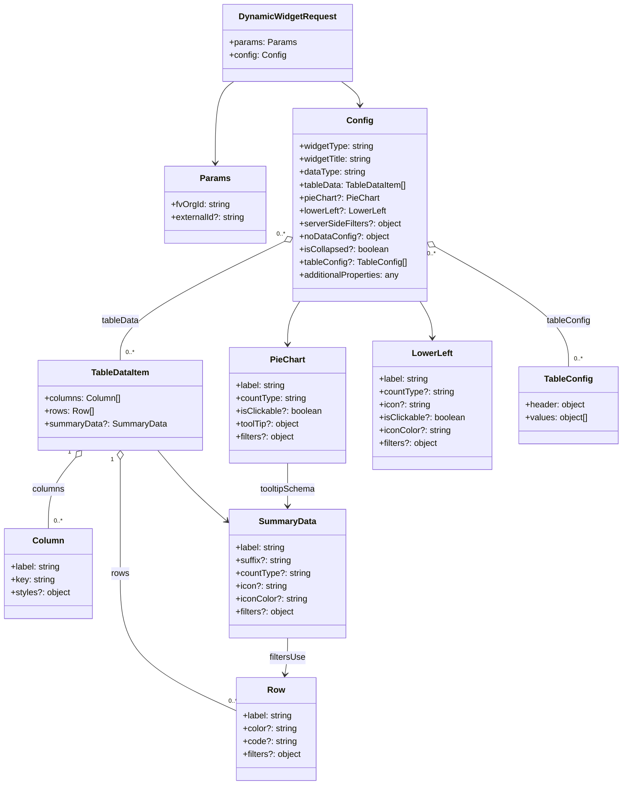

# Diagram: partview_core/partview_service/partview_service/api_definition/components/schemas/dynamic_widget_request.yaml

> Auto-generated by Obscura crawlers

## Mermaid

### SVG

<svg id="container" width="1149.7890625" xmlns="http://www.w3.org/2000/svg" class="classDiagram" height="1464" viewBox="0 0 1149.7890625 1464" role="graphics-document document" aria-roledescription="class"><g><defs><marker id="container_class-aggregationStart" class="marker aggregation class" refX="18" refY="7" markerWidth="190" markerHeight="240" orient="auto"><path d="M 18,7 L9,13 L1,7 L9,1 Z"></path></marker></defs><defs><marker id="container_class-aggregationEnd" class="marker aggregation class" refX="1" refY="7" markerWidth="20" markerHeight="28" orient="auto"><path d="M 18,7 L9,13 L1,7 L9,1 Z"></path></marker></defs><defs><marker id="container_class-extensionStart" class="marker extension class" refX="18" refY="7" markerWidth="190" markerHeight="240" orient="auto"><path d="M 1,7 L18,13 V 1 Z"></path></marker></defs><defs><marker id="container_class-extensionEnd" class="marker extension class" refX="1" refY="7" markerWidth="20" markerHeight="28" orient="auto"><path d="M 1,1 V 13 L18,7 Z"></path></marker></defs><defs><marker id="container_class-compositionStart" class="marker composition class" refX="18" refY="7" markerWidth="190" markerHeight="240" orient="auto"><path d="M 18,7 L9,13 L1,7 L9,1 Z"></path></marker></defs><defs><marker id="container_class-compositionEnd" class="marker composition class" refX="1" refY="7" markerWidth="20" markerHeight="28" orient="auto"><path d="M 18,7 L9,13 L1,7 L9,1 Z"></path></marker></defs><defs><marker id="container_class-dependencyStart" class="marker dependency class" refX="6" refY="7" markerWidth="190" markerHeight="240" orient="auto"><path d="M 5,7 L9,13 L1,7 L9,1 Z"></path></marker></defs><defs><marker id="container_class-dependencyEnd" class="marker dependency class" refX="13" refY="7" markerWidth="20" markerHeight="28" orient="auto"><path d="M 18,7 L9,13 L14,7 L9,1 Z"></path></marker></defs><defs><marker id="container_class-lollipopStart" class="marker lollipop class" refX="13" refY="7" markerWidth="190" markerHeight="240" orient="auto"><circle stroke="black" fill="transparent" cx="7" cy="7" r="6"></circle></marker></defs><defs><marker id="container_class-lollipopEnd" class="marker lollipop class" refX="1" refY="7" markerWidth="190" markerHeight="240" orient="auto"><circle stroke="black" fill="transparent" cx="7" cy="7" r="6"></circle></marker></defs><g class="root"><g class="clusters"></g><g class="edgePaths"><path d="M429.142,152L423.365,156.167C417.588,160.333,406.033,168.667,400.256,194C394.479,219.333,394.479,261.667,394.479,282.833L394.479,304" id="id_DynamicWidgetRequest_Params_1" class="edge-thickness-normal edge-pattern-solid relation" style=";;;" data-edge="true" data-et="edge" data-id="id_DynamicWidgetRequest_Params_1" data-points="W3sieCI6NDI5LjE0MjQ1NzMxMzE0NDM1LCJ5IjoxNTJ9LHsieCI6Mzk0LjQ3ODUxNTYyNSwieSI6MTc3fSx7IngiOjM5NC40Nzg1MTU2MjUsInkiOjMxMH1d" marker-end="url(#container_class-dependencyEnd)"></path><path d="M628.807,152L634.584,156.167C640.361,160.333,651.916,168.667,657.693,176C663.471,183.333,663.471,189.667,663.471,192.833L663.471,196" id="id_DynamicWidgetRequest_Config_2" class="edge-thickness-normal edge-pattern-solid relation" style=";;;" data-edge="true" data-et="edge" data-id="id_DynamicWidgetRequest_Config_2" data-points="W3sieCI6NjI4LjgwNjc2MTQzNjg1NTcsInkiOjE1Mn0seyJ4Ijo2NjMuNDcwNzAzMTI1LCJ5IjoxNzd9LHsieCI6NjYzLjQ3MDcwMzEyNSwieSI6MjAyfV0=" marker-end="url(#container_class-dependencyEnd)"></path><path d="M523.71,450.649L473.373,475.374C423.036,500.099,322.362,549.55,272.025,586.442C221.688,623.333,221.688,647.667,221.688,659.833L221.688,672" id="id_Config_TableDataItem_3" class="edge-thickness-normal edge-pattern-solid relation" style=";;;" data-edge="true" data-et="edge" data-id="id_Config_TableDataItem_3" data-points="W3sieCI6NTM5LjE5MzM1OTM3NSwieSI6NDQzLjA0MzkzMTUwOTgxNjg0fSx7IngiOjIyMS42ODc1LCJ5Ijo1OTl9LHsieCI6MjIxLjY4NzUsInkiOjY3Mn1d" marker-start="url(#container_class-aggregationStart)"></path><path d="M552.644,562L548.847,568.167C545.051,574.333,537.457,586.667,533.66,600C529.863,613.333,529.863,627.667,529.863,634.833L529.863,642" id="id_Config_PieChart_4" class="edge-thickness-normal edge-pattern-solid relation" style=";;;" data-edge="true" data-et="edge" data-id="id_Config_PieChart_4" data-points="W3sieCI6NTUyLjY0NDI3MDIzMzI5NSwieSI6NTYyfSx7IngiOjUyOS44NjMyODEyNSwieSI6NTk5fSx7IngiOjUyOS44NjMyODEyNSwieSI6NjQ4fV0=" marker-end="url(#container_class-dependencyEnd)"></path><path d="M774.297,562L778.094,568.167C781.891,574.333,789.484,586.667,793.281,598C797.078,609.333,797.078,619.667,797.078,624.833L797.078,630" id="id_Config_LowerLeft_5" class="edge-thickness-normal edge-pattern-solid relation" style=";;;" data-edge="true" data-et="edge" data-id="id_Config_LowerLeft_5" data-points="W3sieCI6Nzc0LjI5NzEzNjAxNjcwNSwieSI6NTYyfSx7IngiOjc5Ny4wNzgxMjUsInkiOjU5OX0seyJ4Ijo3OTcuMDc4MTI1LCJ5Ijo2MzZ9XQ==" marker-end="url(#container_class-dependencyEnd)"></path><path d="M802.784,460.336L843.884,483.447C884.984,506.558,967.183,552.779,1008.283,590.056C1049.383,627.333,1049.383,655.667,1049.383,669.833L1049.383,684" id="id_Config_TableConfig_6" class="edge-thickness-normal edge-pattern-solid relation" style=";;;" data-edge="true" data-et="edge" data-id="id_Config_TableConfig_6" data-points="W3sieCI6Nzg3Ljc0ODA0Njg3NSwieSI6NDUxLjg4MTY3MjM3NzIzMTN9LHsieCI6MTA0OS4zODI4MTI1LCJ5Ijo1OTl9LHsieCI6MTA0OS4zODI4MTI1LCJ5Ijo2ODR9XQ==" marker-start="url(#container_class-aggregationStart)"></path><path d="M139.472,853.169L131.034,863.141C122.597,873.112,105.722,893.056,97.285,915.195C88.848,937.333,88.848,961.667,88.848,973.833L88.848,986" id="id_TableDataItem_Column_7" class="edge-thickness-normal edge-pattern-solid relation" style=";;;" data-edge="true" data-et="edge" data-id="id_TableDataItem_Column_7" data-points="W3sieCI6MTUwLjYxMzk1MzAyNTQ3NzcsInkiOjg0MH0seyJ4Ijo4OC44NDc2NTYyNSwieSI6OTEzfSx7IngiOjg4Ljg0NzY1NjI1LCJ5Ijo5ODZ9XQ==" marker-start="url(#container_class-aggregationStart)"></path><path d="M221.688,857.25L221.688,866.542C221.688,875.833,221.688,894.417,221.688,929.875C221.688,965.333,221.688,1017.667,221.688,1070C221.688,1122.333,221.688,1174.667,257.351,1217.27C293.015,1259.873,364.342,1292.746,400.006,1309.182L435.67,1325.618" id="id_TableDataItem_Row_8" class="edge-thickness-normal edge-pattern-solid relation" style=";;;" data-edge="true" data-et="edge" data-id="id_TableDataItem_Row_8" data-points="W3sieCI6MjIxLjY4NzUsInkiOjg0MH0seyJ4IjoyMjEuNjg3NSwieSI6OTEzfSx7IngiOjIyMS42ODc1LCJ5IjoxMDcwfSx7IngiOjIyMS42ODc1LCJ5IjoxMjI3fSx7IngiOjQzNS42Njk5MjE4NzUsInkiOjEzMjUuNjE4MzAwNTY1MTI0Nn1d" marker-start="url(#container_class-aggregationStart)"></path><path d="M290.005,840L299.901,852.167C309.796,864.333,329.586,888.667,350.928,910.79C372.27,932.914,395.162,952.827,406.609,962.784L418.055,972.741" id="id_TableDataItem_SummaryData_9" class="edge-thickness-normal edge-pattern-solid relation" style=";;;" data-edge="true" data-et="edge" data-id="id_TableDataItem_SummaryData_9" data-points="W3sieCI6MjkwLjAwNTQyMzk2NDk2ODE0LCJ5Ijo4NDB9LHsieCI6MzQ5LjM3Njk1MzEyNSwieSI6OTEzfSx7IngiOjQyMi41ODIwMzEyNSwieSI6OTc2LjY3OTA0NjQxMzIyODJ9XQ==" marker-end="url(#container_class-dependencyEnd)"></path><path d="M529.863,1190L529.863,1196.167C529.863,1202.333,529.863,1214.667,529.101,1226.011C528.338,1237.355,526.813,1247.709,526.05,1252.887L525.287,1258.064" id="id_SummaryData_Row_10" class="edge-thickness-normal edge-pattern-solid relation" style=";;;" data-edge="true" data-et="edge" data-id="id_SummaryData_Row_10" data-points="W3sieCI6NTI5Ljg2MzI4MTI1LCJ5IjoxMTkwfSx7IngiOjUyOS44NjMyODEyNSwieSI6MTIyN30seyJ4Ijo1MjQuNDEyOTMxNzQzNDIxLCJ5IjoxMjY0fV0=" marker-end="url(#container_class-dependencyEnd)"></path><path d="M529.863,864L529.863,872.167C529.863,880.333,529.863,896.667,529.863,910C529.863,923.333,529.863,933.667,529.863,938.833L529.863,944" id="id_PieChart_SummaryData_11" class="edge-thickness-normal edge-pattern-solid relation" style=";;;" data-edge="true" data-et="edge" data-id="id_PieChart_SummaryData_11" data-points="W3sieCI6NTI5Ljg2MzI4MTI1LCJ5Ijo4NjR9LHsieCI6NTI5Ljg2MzI4MTI1LCJ5Ijo5MTN9LHsieCI6NTI5Ljg2MzI4MTI1LCJ5Ijo5NTB9XQ==" marker-end="url(#container_class-dependencyEnd)"></path></g><g class="edgeLabels"><g class="edgeLabel"><g class="label" data-id="id_DynamicWidgetRequest_Params_1" transform="translate(0, 0)"><foreignObject width="0" height="0">

</foreignObject></g></g><g class="edgeLabel"><g class="label" data-id="id_DynamicWidgetRequest_Config_2" transform="translate(0, 0)"><foreignObject width="0" height="0">

</foreignObject></g></g><g class="edgeLabel" transform="translate(221.6875, 599)"><g class="label" data-id="id_Config_TableDataItem_3" transform="translate(-35.2109375, -12)"><foreignObject width="70.421875" height="24">

tableData

</foreignObject></g></g><g class="edgeLabel"><g class="label" data-id="id_Config_PieChart_4" transform="translate(0, 0)"><foreignObject width="0" height="0">

</foreignObject></g></g><g class="edgeLabel"><g class="label" data-id="id_Config_LowerLeft_5" transform="translate(0, 0)"><foreignObject width="0" height="0">

</foreignObject></g></g><g class="edgeLabel" transform="translate(1049.3828125, 599)"><g class="label" data-id="id_Config_TableConfig_6" transform="translate(-41.046875, -12)"><foreignObject width="82.09375" height="24">

tableConfig

</foreignObject></g></g><g class="edgeLabel" transform="translate(88.84765625, 913)"><g class="label" data-id="id_TableDataItem_Column_7" transform="translate(-30.6171875, -12)"><foreignObject width="61.234375" height="24">

columns

</foreignObject></g></g><g class="edgeLabel" transform="translate(221.6875, 1070)"><g class="label" data-id="id_TableDataItem_Row_8" transform="translate(-16.9921875, -12)"><foreignObject width="33.984375" height="24">

rows

</foreignObject></g></g><g class="edgeLabel"><g class="label" data-id="id_TableDataItem_SummaryData_9" transform="translate(0, 0)"><foreignObject width="0" height="0">

</foreignObject></g></g><g class="edgeLabel" transform="translate(529.86328125, 1227)"><g class="label" data-id="id_SummaryData_Row_10" transform="translate(-34.1328125, -12)"><foreignObject width="68.265625" height="24">

filtersUse

</foreignObject></g></g><g class="edgeLabel" transform="translate(529.86328125, 913)"><g class="label" data-id="id_PieChart_SummaryData_11" transform="translate(-52.796875, -12)"><foreignObject width="105.59375" height="24">

tooltipSchema

</foreignObject></g></g><g class="edgeTerminals" transform="translate(516.8727727745276, 437.2957687448716)"><g class="inner" transform="translate(0, 0)"><foreignObject style="width: 36px; height: 12px;">
0..*
</foreignObject></g></g><g class="edgeTerminals" transform="translate(795.6499184494501, 473.5337023339347)"><g class="inner" transform="translate(0, 0)"><foreignObject style="width: 36px; height: 12px;">
0..*
</foreignObject></g></g><g class="edgeTerminals" transform="translate(127.85925528851476, 843.6706595905536)"><g class="inner" transform="translate(0, 0)"><foreignObject style="width: 9px; height: 12px;">
1
</foreignObject></g></g><g class="edgeTerminals" transform="translate(206.6875, 857.5)"><g class="inner" transform="translate(0, 0)"><foreignObject style="width: 9px; height: 12px;">
1
</foreignObject></g></g><g class="edgeTerminals" transform="translate(231.6875, 649.5)"><g class="inner" transform="translate(0, 0)"></g><foreignObject style="width: 36px; height: 12px;">
0..*
</foreignObject></g><g class="edgeTerminals" transform="translate(1059.38281125, 661.4999989285715)"><g class="inner" transform="translate(0, 0)"></g><foreignObject style="width: 36px; height: 12px;">
0..*
</foreignObject></g><g class="edgeTerminals" transform="translate(98.84765812499992, 963.5000016071428)"><g class="inner" transform="translate(0, 0)"></g><foreignObject style="width: 36px; height: 12px;">
0..*
</foreignObject></g><g class="edgeTerminals" transform="translate(421.0549763867719, 1299.6706817655308)"><g class="inner" transform="translate(0, 0)"></g><foreignObject style="width: 36px; height: 12px;">
0..*
</foreignObject></g></g><g class="nodes"><g class="node default" id="classId-DynamicWidgetRequest-0" transform="translate(528.974609375, 80)"><g class="basic label-container"><path d="M-116.5 -72 L116.5 -72 L116.5 72 L-116.5 72" stroke="none" stroke-width="0" fill="#ECECFF" style=""></path><path d="M-116.5 -72 C-50.651983230486394 -72, 15.196033539027212 -72, 116.5 -72 M-116.5 -72 C-26.931080177526837 -72, 62.637839644946325 -72, 116.5 -72 M116.5 -72 C116.5 -41.83813948716105, 116.5 -11.676278974322102, 116.5 72 M116.5 -72 C116.5 -17.390131799629614, 116.5 37.21973640074077, 116.5 72 M116.5 72 C35.89178195171637 72, -44.716436096567264 72, -116.5 72 M116.5 72 C38.950267434135455 72, -38.59946513172909 72, -116.5 72 M-116.5 72 C-116.5 15.25654490081265, -116.5 -41.4869101983747, -116.5 -72 M-116.5 72 C-116.5 25.636514251362996, -116.5 -20.726971497274008, -116.5 -72" stroke="#9370DB" stroke-width="1.3" fill="none" stroke-dasharray="0 0" style=""></path></g><g class="annotation-group text" transform="translate(0, -48)"></g><g class="label-group text" transform="translate(-86.75, -48)"><g class="label" style="font-weight: bolder" transform="translate(0,-12)"><foreignObject width="173.5" height="24">

DynamicWidgetRequest

</foreignObject></g></g><g class="members-group text" transform="translate(-104.5, 0)"><g class="label" style="" transform="translate(0,-12)"><foreignObject width="122.25" height="24">

+params: Params

</foreignObject></g><g class="label" style="" transform="translate(0,12)"><foreignObject width="104.515625" height="24">

+config: Config

</foreignObject></g></g><g class="methods-group text" transform="translate(-104.5, 72)"></g><g class="divider" style=""><path d="M-116.5 -24 C-27.162328151437492 -24, 62.175343697125015 -24, 116.5 -24 M-116.5 -24 C-32.53050476591059 -24, 51.438990468178815 -24, 116.5 -24" stroke="#9370DB" stroke-width="1.3" fill="none" stroke-dasharray="0 0" style=""></path></g><g class="divider" style=""><path d="M-116.5 48 C-51.346063653980224 48, 13.807872692039552 48, 116.5 48 M-116.5 48 C-65.65063491158537 48, -14.801269823170742 48, 116.5 48" stroke="#9370DB" stroke-width="1.3" fill="none" stroke-dasharray="0 0" style=""></path></g></g><g class="node default" id="classId-Params-1" transform="translate(394.478515625, 382)"><g class="basic label-container"><path d="M-94.71484375 -72 L94.71484375 -72 L94.71484375 72 L-94.71484375 72" stroke="none" stroke-width="0" fill="#ECECFF" style=""></path><path d="M-94.71484375 -72 C-31.8402550487841 -72, 31.034333652431798 -72, 94.71484375 -72 M-94.71484375 -72 C-41.464344577642485 -72, 11.786154594715029 -72, 94.71484375 -72 M94.71484375 -72 C94.71484375 -29.087482401003655, 94.71484375 13.82503519799269, 94.71484375 72 M94.71484375 -72 C94.71484375 -39.42960022983373, 94.71484375 -6.859200459667463, 94.71484375 72 M94.71484375 72 C44.80309537037639 72, -5.10865300924722 72, -94.71484375 72 M94.71484375 72 C31.392367868420543 72, -31.930108013158915 72, -94.71484375 72 M-94.71484375 72 C-94.71484375 26.984330204710588, -94.71484375 -18.031339590578824, -94.71484375 -72 M-94.71484375 72 C-94.71484375 36.69416679819747, -94.71484375 1.3883335963949435, -94.71484375 -72" stroke="#9370DB" stroke-width="1.3" fill="none" stroke-dasharray="0 0" style=""></path></g><g class="annotation-group text" transform="translate(0, -48)"></g><g class="label-group text" transform="translate(-26.7109375, -48)"><g class="label" style="font-weight: bolder" transform="translate(0,-12)"><foreignObject width="53.421875" height="24">

Params

</foreignObject></g></g><g class="members-group text" transform="translate(-82.71484375, 0)"><g class="label" style="" transform="translate(0,-12)"><foreignObject width="110.3125" height="24">

+fvOrgId: string

</foreignObject></g><g class="label" style="" transform="translate(0,12)"><foreignObject width="138.71875" height="24">

+externalId?: string

</foreignObject></g></g><g class="methods-group text" transform="translate(-82.71484375, 72)"></g><g class="divider" style=""><path d="M-94.71484375 -24 C-20.188929420531252 -24, 54.336984908937495 -24, 94.71484375 -24 M-94.71484375 -24 C-37.16261957387579 -24, 20.389604602248426 -24, 94.71484375 -24" stroke="#9370DB" stroke-width="1.3" fill="none" stroke-dasharray="0 0" style=""></path></g><g class="divider" style=""><path d="M-94.71484375 48 C-27.667277408582237 48, 39.380288932835526 48, 94.71484375 48 M-94.71484375 48 C-46.59774825131109 48, 1.519347247377823 48, 94.71484375 48" stroke="#9370DB" stroke-width="1.3" fill="none" stroke-dasharray="0 0" style=""></path></g></g><g class="node default" id="classId-Config-2" transform="translate(663.470703125, 382)"><g class="basic label-container"><path d="M-124.27734375 -180 L124.27734375 -180 L124.27734375 180 L-124.27734375 180" stroke="none" stroke-width="0" fill="#ECECFF" style=""></path><path d="M-124.27734375 -180 C-43.06346347083016 -180, 38.150416808339685 -180, 124.27734375 -180 M-124.27734375 -180 C-35.87480914046063 -180, 52.527725469078746 -180, 124.27734375 -180 M124.27734375 -180 C124.27734375 -79.76698149415493, 124.27734375 20.466037011690133, 124.27734375 180 M124.27734375 -180 C124.27734375 -87.46742036808752, 124.27734375 5.065159263824967, 124.27734375 180 M124.27734375 180 C70.65973973395322 180, 17.04213571790642 180, -124.27734375 180 M124.27734375 180 C59.73975378398944 180, -4.797836182021115 180, -124.27734375 180 M-124.27734375 180 C-124.27734375 65.33667980365603, -124.27734375 -49.32664039268795, -124.27734375 -180 M-124.27734375 180 C-124.27734375 63.77511355404225, -124.27734375 -52.4497728919155, -124.27734375 -180" stroke="#9370DB" stroke-width="1.3" fill="none" stroke-dasharray="0 0" style=""></path></g><g class="annotation-group text" transform="translate(0, -156)"></g><g class="label-group text" transform="translate(-22.9296875, -156)"><g class="label" style="font-weight: bolder" transform="translate(0,-12)"><foreignObject width="45.859375" height="24">

Config

</foreignObject></g></g><g class="members-group text" transform="translate(-112.27734375, -108)"><g class="label" style="" transform="translate(0,-12)"><foreignObject width="139.546875" height="24">

+widgetType: string

</foreignObject></g><g class="label" style="" transform="translate(0,12)"><foreignObject width="137.546875" height="24">

+widgetTitle: string

</foreignObject></g><g class="label" style="" transform="translate(0,36)"><foreignObject width="124.078125" height="24">

+dataType: string

</foreignObject></g><g class="label" style="" transform="translate(0,60)"><foreignObject width="201.625" height="24">

+tableData: TableDataItem[]

</foreignObject></g><g class="label" style="" transform="translate(0,84)"><foreignObject width="145.859375" height="24">

+pieChart?: PieChart

</foreignObject></g><g class="label" style="" transform="translate(0,108)"><foreignObject width="161.390625" height="24">

+lowerLeft?: LowerLeft

</foreignObject></g><g class="label" style="" transform="translate(0,132)"><foreignObject width="189.15625" height="24">

+serverSideFilters?: object

</foreignObject></g><g class="label" style="" transform="translate(0,156)"><foreignObject width="165.390625" height="24">

+noDataConfig?: object

</foreignObject></g><g class="label" style="" transform="translate(0,180)"><foreignObject width="166.09375" height="24">

+isCollapsed?: boolean

</foreignObject></g><g class="label" style="" transform="translate(0,204)"><foreignObject width="199.28125" height="24">

+tableConfig?: TableConfig[]

</foreignObject></g><g class="label" style="" transform="translate(0,228)"><foreignObject width="191.15625" height="24">

+additionalProperties: any

</foreignObject></g></g><g class="methods-group text" transform="translate(-112.27734375, 180)"></g><g class="divider" style=""><path d="M-124.27734375 -132 C-52.82981594488655 -132, 18.617711860226905 -132, 124.27734375 -132 M-124.27734375 -132 C-34.362364435750024 -132, 55.55261487849995 -132, 124.27734375 -132" stroke="#9370DB" stroke-width="1.3" fill="none" stroke-dasharray="0 0" style=""></path></g><g class="divider" style=""><path d="M-124.27734375 156 C-42.45341307573257 156, 39.37051759853486 156, 124.27734375 156 M-124.27734375 156 C-50.806428932166455 156, 22.66448588566709 156, 124.27734375 156" stroke="#9370DB" stroke-width="1.3" fill="none" stroke-dasharray="0 0" style=""></path></g></g><g class="node default" id="classId-TableDataItem-3" transform="translate(221.6875, 756)"><g class="basic label-container"><path d="M-150.859375 -84 L150.859375 -84 L150.859375 84 L-150.859375 84" stroke="none" stroke-width="0" fill="#ECECFF" style=""></path><path d="M-150.859375 -84 C-52.29435524882099 -84, 46.27066450235802 -84, 150.859375 -84 M-150.859375 -84 C-56.90995611600839 -84, 37.039462767983224 -84, 150.859375 -84 M150.859375 -84 C150.859375 -19.407964966711617, 150.859375 45.184070066576766, 150.859375 84 M150.859375 -84 C150.859375 -17.325639696557047, 150.859375 49.348720606885905, 150.859375 84 M150.859375 84 C39.77259800843525 84, -71.3141789831295 84, -150.859375 84 M150.859375 84 C76.74951244342508 84, 2.639649886850151 84, -150.859375 84 M-150.859375 84 C-150.859375 38.501470700830005, -150.859375 -6.99705859833999, -150.859375 -84 M-150.859375 84 C-150.859375 28.114690235189492, -150.859375 -27.770619529621015, -150.859375 -84" stroke="#9370DB" stroke-width="1.3" fill="none" stroke-dasharray="0 0" style=""></path></g><g class="annotation-group text" transform="translate(0, -60)"></g><g class="label-group text" transform="translate(-53.1875, -60)"><g class="label" style="font-weight: bolder" transform="translate(0,-12)"><foreignObject width="106.375" height="24">

TableDataItem

</foreignObject></g></g><g class="members-group text" transform="translate(-138.859375, -12)"><g class="label" style="" transform="translate(0,-12)"><foreignObject width="142.6875" height="24">

+columns: Column[]

</foreignObject></g><g class="label" style="" transform="translate(0,12)"><foreignObject width="90.609375" height="24">

+rows: Row[]

</foreignObject></g><g class="label" style="" transform="translate(0,36)"><foreignObject width="224.53125" height="24">

+summaryData?: SummaryData

</foreignObject></g></g><g class="methods-group text" transform="translate(-138.859375, 84)"></g><g class="divider" style=""><path d="M-150.859375 -36 C-83.43745509269452 -36, -16.01553518538904 -36, 150.859375 -36 M-150.859375 -36 C-65.26043291598218 -36, 20.338509168035642 -36, 150.859375 -36" stroke="#9370DB" stroke-width="1.3" fill="none" stroke-dasharray="0 0" style=""></path></g><g class="divider" style=""><path d="M-150.859375 60 C-58.37904746526017 60, 34.10128006947966 60, 150.859375 60 M-150.859375 60 C-80.39237723383873 60, -9.925379467677459 60, 150.859375 60" stroke="#9370DB" stroke-width="1.3" fill="none" stroke-dasharray="0 0" style=""></path></g></g><g class="node default" id="classId-Column-4" transform="translate(88.84765625, 1070)"><g class="basic label-container"><path d="M-80.84765625 -84 L80.84765625 -84 L80.84765625 84 L-80.84765625 84" stroke="none" stroke-width="0" fill="#ECECFF" style=""></path><path d="M-80.84765625 -84 C-36.49083997015228 -84, 7.865976309695441 -84, 80.84765625 -84 M-80.84765625 -84 C-35.90214694156477 -84, 9.043362366870454 -84, 80.84765625 -84 M80.84765625 -84 C80.84765625 -37.502548468016826, 80.84765625 8.994903063966348, 80.84765625 84 M80.84765625 -84 C80.84765625 -21.412169796297704, 80.84765625 41.17566040740459, 80.84765625 84 M80.84765625 84 C41.79920896896628 84, 2.7507616879325667 84, -80.84765625 84 M80.84765625 84 C26.32867836885486 84, -28.19029951229028 84, -80.84765625 84 M-80.84765625 84 C-80.84765625 44.64477781320992, -80.84765625 5.2895556264198405, -80.84765625 -84 M-80.84765625 84 C-80.84765625 17.060053260521954, -80.84765625 -49.87989347895609, -80.84765625 -84" stroke="#9370DB" stroke-width="1.3" fill="none" stroke-dasharray="0 0" style=""></path></g><g class="annotation-group text" transform="translate(0, -60)"></g><g class="label-group text" transform="translate(-27.4453125, -60)"><g class="label" style="font-weight: bolder" transform="translate(0,-12)"><foreignObject width="54.890625" height="24">

Column

</foreignObject></g></g><g class="members-group text" transform="translate(-68.84765625, -12)"><g class="label" style="" transform="translate(0,-12)"><foreignObject width="94.09375" height="24">

+label: string

</foreignObject></g><g class="label" style="" transform="translate(0,12)"><foreignObject width="82.34375" height="24">

+key: string

</foreignObject></g><g class="label" style="" transform="translate(0,36)"><foreignObject width="110.25" height="24">

+styles?: object

</foreignObject></g></g><g class="methods-group text" transform="translate(-68.84765625, 84)"></g><g class="divider" style=""><path d="M-80.84765625 -36 C-29.87333545477871 -36, 21.100985340442577 -36, 80.84765625 -36 M-80.84765625 -36 C-40.232157064619805 -36, 0.3833421207603891 -36, 80.84765625 -36" stroke="#9370DB" stroke-width="1.3" fill="none" stroke-dasharray="0 0" style=""></path></g><g class="divider" style=""><path d="M-80.84765625 60 C-34.042887032075974 60, 12.761882185848052 60, 80.84765625 60 M-80.84765625 60 C-36.27846663935087 60, 8.290722971298266 60, 80.84765625 60" stroke="#9370DB" stroke-width="1.3" fill="none" stroke-dasharray="0 0" style=""></path></g></g><g class="node default" id="classId-Row-5" transform="translate(510.271484375, 1360)"><g class="basic label-container"><path d="M-74.6015625 -96 L74.6015625 -96 L74.6015625 96 L-74.6015625 96" stroke="none" stroke-width="0" fill="#ECECFF" style=""></path><path d="M-74.6015625 -96 C-25.25742137170525 -96, 24.086719756589503 -96, 74.6015625 -96 M-74.6015625 -96 C-39.63971722023551 -96, -4.677871940471022 -96, 74.6015625 -96 M74.6015625 -96 C74.6015625 -26.363402271264803, 74.6015625 43.27319545747039, 74.6015625 96 M74.6015625 -96 C74.6015625 -37.11090779588679, 74.6015625 21.778184408226423, 74.6015625 96 M74.6015625 96 C33.69849084952443 96, -7.204580800951135 96, -74.6015625 96 M74.6015625 96 C16.33025946078849 96, -41.94104357842302 96, -74.6015625 96 M-74.6015625 96 C-74.6015625 19.949487592744163, -74.6015625 -56.101024814511675, -74.6015625 -96 M-74.6015625 96 C-74.6015625 32.83950303317028, -74.6015625 -30.320993933659437, -74.6015625 -96" stroke="#9370DB" stroke-width="1.3" fill="none" stroke-dasharray="0 0" style=""></path></g><g class="annotation-group text" transform="translate(0, -72)"></g><g class="label-group text" transform="translate(-15.484375, -72)"><g class="label" style="font-weight: bolder" transform="translate(0,-12)"><foreignObject width="30.96875" height="24">

Row

</foreignObject></g></g><g class="members-group text" transform="translate(-62.6015625, -24)"><g class="label" style="" transform="translate(0,-12)"><foreignObject width="94.09375" height="24">

+label: string

</foreignObject></g><g class="label" style="" transform="translate(0,12)"><foreignObject width="101.375" height="24">

+color?: string

</foreignObject></g><g class="label" style="" transform="translate(0,36)"><foreignObject width="99.375" height="24">

+code?: string

</foreignObject></g><g class="label" style="" transform="translate(0,60)"><foreignObject width="109.71875" height="24">

+filters?: object

</foreignObject></g></g><g class="methods-group text" transform="translate(-62.6015625, 96)"></g><g class="divider" style=""><path d="M-74.6015625 -48 C-43.711194813091936 -48, -12.820827126183879 -48, 74.6015625 -48 M-74.6015625 -48 C-17.179037821157124 -48, 40.24348685768575 -48, 74.6015625 -48" stroke="#9370DB" stroke-width="1.3" fill="none" stroke-dasharray="0 0" style=""></path></g><g class="divider" style=""><path d="M-74.6015625 72 C-37.3450101609124 72, -0.08845782182480377 72, 74.6015625 72 M-74.6015625 72 C-20.679827365911557 72, 33.24190776817689 72, 74.6015625 72" stroke="#9370DB" stroke-width="1.3" fill="none" stroke-dasharray="0 0" style=""></path></g></g><g class="node default" id="classId-SummaryData-6" transform="translate(529.86328125, 1070)"><g class="basic label-container"><path d="M-107.28125 -120 L107.28125 -120 L107.28125 120 L-107.28125 120" stroke="none" stroke-width="0" fill="#ECECFF" style=""></path><path d="M-107.28125 -120 C-63.13003357182595 -120, -18.978817143651895 -120, 107.28125 -120 M-107.28125 -120 C-48.048872453736976 -120, 11.183505092526048 -120, 107.28125 -120 M107.28125 -120 C107.28125 -28.346575564053325, 107.28125 63.30684887189335, 107.28125 120 M107.28125 -120 C107.28125 -65.131171787683, 107.28125 -10.262343575366003, 107.28125 120 M107.28125 120 C37.02051893579328 120, -33.24021212841345 120, -107.28125 120 M107.28125 120 C31.341034781941943 120, -44.599180436116114 120, -107.28125 120 M-107.28125 120 C-107.28125 46.96106530790584, -107.28125 -26.07786938418832, -107.28125 -120 M-107.28125 120 C-107.28125 67.5666590932163, -107.28125 15.133318186432604, -107.28125 -120" stroke="#9370DB" stroke-width="1.3" fill="none" stroke-dasharray="0 0" style=""></path></g><g class="annotation-group text" transform="translate(0, -96)"></g><g class="label-group text" transform="translate(-51.296875, -96)"><g class="label" style="font-weight: bolder" transform="translate(0,-12)"><foreignObject width="102.59375" height="24">

SummaryData

</foreignObject></g></g><g class="members-group text" transform="translate(-95.28125, -48)"><g class="label" style="" transform="translate(0,-12)"><foreignObject width="94.09375" height="24">

+label: string

</foreignObject></g><g class="label" style="" transform="translate(0,12)"><foreignObject width="103.75" height="24">

+suffix?: string

</foreignObject></g><g class="label" style="" transform="translate(0,36)"><foreignObject width="139.265625" height="24">

+countType?: string

</foreignObject></g><g class="label" style="" transform="translate(0,60)"><foreignObject width="95.125" height="24">

+icon?: string

</foreignObject></g><g class="label" style="" transform="translate(0,84)"><foreignObject width="133.234375" height="24">

+iconColor?: string

</foreignObject></g><g class="label" style="" transform="translate(0,108)"><foreignObject width="109.71875" height="24">

+filters?: object

</foreignObject></g></g><g class="methods-group text" transform="translate(-95.28125, 120)"></g><g class="divider" style=""><path d="M-107.28125 -72 C-63.18819256313777 -72, -19.095135126275537 -72, 107.28125 -72 M-107.28125 -72 C-29.660266378057855 -72, 47.96071724388429 -72, 107.28125 -72" stroke="#9370DB" stroke-width="1.3" fill="none" stroke-dasharray="0 0" style=""></path></g><g class="divider" style=""><path d="M-107.28125 96 C-54.07581333961306 96, -0.8703766792261263 96, 107.28125 96 M-107.28125 96 C-25.36407574381016 96, 56.55309851237968 96, 107.28125 96" stroke="#9370DB" stroke-width="1.3" fill="none" stroke-dasharray="0 0" style=""></path></g></g><g class="node default" id="classId-PieChart-7" transform="translate(529.86328125, 756)"><g class="basic label-container"><path d="M-107.31640625 -108 L107.31640625 -108 L107.31640625 108 L-107.31640625 108" stroke="none" stroke-width="0" fill="#ECECFF" style=""></path><path d="M-107.31640625 -108 C-52.49392974276355 -108, 2.328546764472904 -108, 107.31640625 -108 M-107.31640625 -108 C-58.0122178934179 -108, -8.708029536835795 -108, 107.31640625 -108 M107.31640625 -108 C107.31640625 -55.43470716273467, 107.31640625 -2.869414325469336, 107.31640625 108 M107.31640625 -108 C107.31640625 -52.0785833409262, 107.31640625 3.8428333181475978, 107.31640625 108 M107.31640625 108 C46.366314021810766 108, -14.583778206378469 108, -107.31640625 108 M107.31640625 108 C27.778980891506222 108, -51.758444466987555 108, -107.31640625 108 M-107.31640625 108 C-107.31640625 50.70432758942647, -107.31640625 -6.591344821147061, -107.31640625 -108 M-107.31640625 108 C-107.31640625 41.39975037950339, -107.31640625 -25.200499240993224, -107.31640625 -108" stroke="#9370DB" stroke-width="1.3" fill="none" stroke-dasharray="0 0" style=""></path></g><g class="annotation-group text" transform="translate(0, -84)"></g><g class="label-group text" transform="translate(-31.2890625, -84)"><g class="label" style="font-weight: bolder" transform="translate(0,-12)"><foreignObject width="62.578125" height="24">

PieChart

</foreignObject></g></g><g class="members-group text" transform="translate(-95.31640625, -36)"><g class="label" style="" transform="translate(0,-12)"><foreignObject width="94.09375" height="24">

+label: string

</foreignObject></g><g class="label" style="" transform="translate(0,12)"><foreignObject width="132.5625" height="24">

+countType: string

</foreignObject></g><g class="label" style="" transform="translate(0,36)"><foreignObject width="159.34375" height="24">

+isClickable?: boolean

</foreignObject></g><g class="label" style="" transform="translate(0,60)"><foreignObject width="119.375" height="24">

+toolTip?: object

</foreignObject></g><g class="label" style="" transform="translate(0,84)"><foreignObject width="109.71875" height="24">

+filters?: object

</foreignObject></g></g><g class="methods-group text" transform="translate(-95.31640625, 108)"></g><g class="divider" style=""><path d="M-107.31640625 -60 C-36.19022244032499 -60, 34.935961369350025 -60, 107.31640625 -60 M-107.31640625 -60 C-50.555966343594 -60, 6.204473562811998 -60, 107.31640625 -60" stroke="#9370DB" stroke-width="1.3" fill="none" stroke-dasharray="0 0" style=""></path></g><g class="divider" style=""><path d="M-107.31640625 84 C-61.26282488054344 84, -15.209243511086882 84, 107.31640625 84 M-107.31640625 84 C-57.444094402318264 84, -7.571782554636528 84, 107.31640625 84" stroke="#9370DB" stroke-width="1.3" fill="none" stroke-dasharray="0 0" style=""></path></g></g><g class="node default" id="classId-LowerLeft-8" transform="translate(797.078125, 756)"><g class="basic label-container"><path d="M-109.8984375 -120 L109.8984375 -120 L109.8984375 120 L-109.8984375 120" stroke="none" stroke-width="0" fill="#ECECFF" style=""></path><path d="M-109.8984375 -120 C-33.2494756934006 -120, 43.399486113198805 -120, 109.8984375 -120 M-109.8984375 -120 C-33.33695971579789 -120, 43.22451806840422 -120, 109.8984375 -120 M109.8984375 -120 C109.8984375 -28.726266914164242, 109.8984375 62.547466171671516, 109.8984375 120 M109.8984375 -120 C109.8984375 -55.329935125461404, 109.8984375 9.340129749077192, 109.8984375 120 M109.8984375 120 C64.33576946810504 120, 18.77310143621007 120, -109.8984375 120 M109.8984375 120 C24.433859557323956 120, -61.03071838535209 120, -109.8984375 120 M-109.8984375 120 C-109.8984375 51.38593626834664, -109.8984375 -17.22812746330672, -109.8984375 -120 M-109.8984375 120 C-109.8984375 44.08636681008109, -109.8984375 -31.827266379837823, -109.8984375 -120" stroke="#9370DB" stroke-width="1.3" fill="none" stroke-dasharray="0 0" style=""></path></g><g class="annotation-group text" transform="translate(0, -96)"></g><g class="label-group text" transform="translate(-36.453125, -96)"><g class="label" style="font-weight: bolder" transform="translate(0,-12)"><foreignObject width="72.90625" height="24">

LowerLeft

</foreignObject></g></g><g class="members-group text" transform="translate(-97.8984375, -48)"><g class="label" style="" transform="translate(0,-12)"><foreignObject width="94.09375" height="24">

+label: string

</foreignObject></g><g class="label" style="" transform="translate(0,12)"><foreignObject width="139.265625" height="24">

+countType?: string

</foreignObject></g><g class="label" style="" transform="translate(0,36)"><foreignObject width="95.125" height="24">

+icon?: string

</foreignObject></g><g class="label" style="" transform="translate(0,60)"><foreignObject width="159.34375" height="24">

+isClickable?: boolean

</foreignObject></g><g class="label" style="" transform="translate(0,84)"><foreignObject width="133.234375" height="24">

+iconColor?: string

</foreignObject></g><g class="label" style="" transform="translate(0,108)"><foreignObject width="109.71875" height="24">

+filters?: object

</foreignObject></g></g><g class="methods-group text" transform="translate(-97.8984375, 120)"></g><g class="divider" style=""><path d="M-109.8984375 -72 C-55.08358641109533 -72, -0.26873532219066476 -72, 109.8984375 -72 M-109.8984375 -72 C-42.107224973352885 -72, 25.68398755329423 -72, 109.8984375 -72" stroke="#9370DB" stroke-width="1.3" fill="none" stroke-dasharray="0 0" style=""></path></g><g class="divider" style=""><path d="M-109.8984375 96 C-27.71875874385225 96, 54.4609200122955 96, 109.8984375 96 M-109.8984375 96 C-44.537249248556904 96, 20.823939002886192 96, 109.8984375 96" stroke="#9370DB" stroke-width="1.3" fill="none" stroke-dasharray="0 0" style=""></path></g></g><g class="node default" id="classId-TableConfig-9" transform="translate(1049.3828125, 756)"><g class="basic label-container"><path d="M-92.40625 -72 L92.40625 -72 L92.40625 72 L-92.40625 72" stroke="none" stroke-width="0" fill="#ECECFF" style=""></path><path d="M-92.40625 -72 C-24.529718807330298 -72, 43.346812385339405 -72, 92.40625 -72 M-92.40625 -72 C-33.54879361496706 -72, 25.30866277006588 -72, 92.40625 -72 M92.40625 -72 C92.40625 -29.473644027027795, 92.40625 13.05271194594441, 92.40625 72 M92.40625 -72 C92.40625 -26.89280749016406, 92.40625 18.21438501967188, 92.40625 72 M92.40625 72 C51.968665394414835 72, 11.53108078882967 72, -92.40625 72 M92.40625 72 C42.386443590449964 72, -7.633362819100071 72, -92.40625 72 M-92.40625 72 C-92.40625 42.28191266299172, -92.40625 12.563825325983444, -92.40625 -72 M-92.40625 72 C-92.40625 15.665756960931027, -92.40625 -40.668486078137946, -92.40625 -72" stroke="#9370DB" stroke-width="1.3" fill="none" stroke-dasharray="0 0" style=""></path></g><g class="annotation-group text" transform="translate(0, -48)"></g><g class="label-group text" transform="translate(-42.765625, -48)"><g class="label" style="font-weight: bolder" transform="translate(0,-12)"><foreignObject width="85.53125" height="24">

TableConfig

</foreignObject></g></g><g class="members-group text" transform="translate(-80.40625, 0)"><g class="label" style="" transform="translate(0,-12)"><foreignObject width="112.8125" height="24">

+header: object

</foreignObject></g><g class="label" style="" transform="translate(0,12)"><foreignObject width="118.046875" height="24">

+values: object[]

</foreignObject></g></g><g class="methods-group text" transform="translate(-80.40625, 72)"></g><g class="divider" style=""><path d="M-92.40625 -24 C-42.55087559851449 -24, 7.304498802971025 -24, 92.40625 -24 M-92.40625 -24 C-19.787074176160473 -24, 52.83210164767905 -24, 92.40625 -24" stroke="#9370DB" stroke-width="1.3" fill="none" stroke-dasharray="0 0" style=""></path></g><g class="divider" style=""><path d="M-92.40625 48 C-42.75811712252798 48, 6.890015754944045 48, 92.40625 48 M-92.40625 48 C-36.37444833827148 48, 19.657353323457045 48, 92.40625 48" stroke="#9370DB" stroke-width="1.3" fill="none" stroke-dasharray="0 0" style=""></path></g></g></g></g></g></svg>
