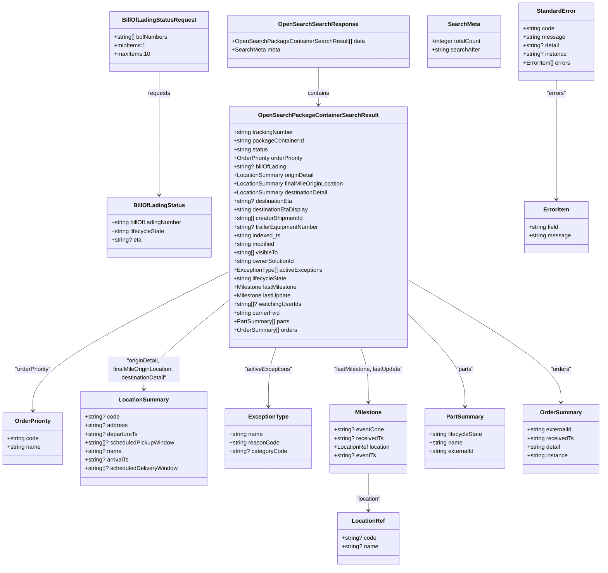

# Diagram: partview_core/partview_service/partview_service/api_definition/components/schemas/search.yaml

> Auto-generated by Obscura crawlers

## Mermaid

### SVG

<svg id="container" width="1671.6640625" xmlns="http://www.w3.org/2000/svg" class="classDiagram" height="1582" viewBox="0 0 1671.6640625 1582" role="graphics-document document" aria-roledescription="class"><g><defs><marker id="container_class-aggregationStart" class="marker aggregation class" refX="18" refY="7" markerWidth="190" markerHeight="240" orient="auto"><path d="M 18,7 L9,13 L1,7 L9,1 Z"></path></marker></defs><defs><marker id="container_class-aggregationEnd" class="marker aggregation class" refX="1" refY="7" markerWidth="20" markerHeight="28" orient="auto"><path d="M 18,7 L9,13 L1,7 L9,1 Z"></path></marker></defs><defs><marker id="container_class-extensionStart" class="marker extension class" refX="18" refY="7" markerWidth="190" markerHeight="240" orient="auto"><path d="M 1,7 L18,13 V 1 Z"></path></marker></defs><defs><marker id="container_class-extensionEnd" class="marker extension class" refX="1" refY="7" markerWidth="20" markerHeight="28" orient="auto"><path d="M 1,1 V 13 L18,7 Z"></path></marker></defs><defs><marker id="container_class-compositionStart" class="marker composition class" refX="18" refY="7" markerWidth="190" markerHeight="240" orient="auto"><path d="M 18,7 L9,13 L1,7 L9,1 Z"></path></marker></defs><defs><marker id="container_class-compositionEnd" class="marker composition class" refX="1" refY="7" markerWidth="20" markerHeight="28" orient="auto"><path d="M 18,7 L9,13 L1,7 L9,1 Z"></path></marker></defs><defs><marker id="container_class-dependencyStart" class="marker dependency class" refX="6" refY="7" markerWidth="190" markerHeight="240" orient="auto"><path d="M 5,7 L9,13 L1,7 L9,1 Z"></path></marker></defs><defs><marker id="container_class-dependencyEnd" class="marker dependency class" refX="13" refY="7" markerWidth="20" markerHeight="28" orient="auto"><path d="M 18,7 L9,13 L14,7 L9,1 Z"></path></marker></defs><defs><marker id="container_class-lollipopStart" class="marker lollipop class" refX="13" refY="7" markerWidth="190" markerHeight="240" orient="auto"><circle stroke="black" fill="transparent" cx="7" cy="7" r="6"></circle></marker></defs><defs><marker id="container_class-lollipopEnd" class="marker lollipop class" refX="1" refY="7" markerWidth="190" markerHeight="240" orient="auto"><circle stroke="black" fill="transparent" cx="7" cy="7" r="6"></circle></marker></defs><g class="root"><g class="clusters"></g><g class="edgePaths"><path d="M441.221,200L441.221,210.167C441.221,220.333,441.221,240.667,441.221,298C441.221,355.333,441.221,449.667,441.221,496.833L441.221,544" id="id_BillOfLadingStatusRequest_BillOfLadingStatus_1" class="edge-thickness-normal edge-pattern-solid relation" style=";;;" data-edge="true" data-et="edge" data-id="id_BillOfLadingStatusRequest_BillOfLadingStatus_1" data-points="W3sieCI6NDQxLjIyMDcwMzEyNSwieSI6MjAwfSx7IngiOjQ0MS4yMjA3MDMxMjUsInkiOjI2MX0seyJ4Ijo0NDEuMjIwNzAzMTI1LCJ5Ijo1NTB9XQ==" marker-end="url(#container_class-dependencyEnd)"></path><path d="M883.572,188L883.572,200.167C883.572,212.333,883.572,236.667,883.572,254C883.572,271.333,883.572,281.667,883.572,286.833L883.572,292" id="id_OpenSearchSearchResponse_OpenSearchPackageContainerSearchResult_2" class="edge-thickness-normal edge-pattern-solid relation" style=";;;" data-edge="true" data-et="edge" data-id="id_OpenSearchSearchResponse_OpenSearchPackageContainerSearchResult_2" data-points="W3sieCI6ODgzLjU3MjI2NTYyNSwieSI6MTg4fSx7IngiOjg4My41NzIyNjU2MjUsInkiOjI2MX0seyJ4Ijo4ODMuNTcyMjY1NjI1LCJ5IjoyOTh9XQ==" marker-end="url(#container_class-dependencyEnd)"></path><path d="M637.529,757.3L546.502,802.917C455.475,848.533,273.421,939.767,182.394,1004.55C91.367,1069.333,91.367,1107.667,91.367,1126.833L91.367,1146" id="id_OpenSearchPackageContainerSearchResult_OrderPriority_3" class="edge-thickness-normal edge-pattern-solid relation" style=";;;" data-edge="true" data-et="edge" data-id="id_OpenSearchPackageContainerSearchResult_OrderPriority_3" data-points="W3sieCI6NjM3LjUyOTI5Njg3NSwieSI6NzU3LjMwMDIxNzY5NzMzOTF9LHsieCI6OTEuMzY3MTg3NSwieSI6MTAzMX0seyJ4Ijo5MS4zNjcxODc1LCJ5IjoxMTUyfV0=" marker-end="url(#container_class-dependencyEnd)"></path><path d="M637.529,836.418L598.11,868.849C558.69,901.279,479.851,966.139,440.431,1007.736C401.012,1049.333,401.012,1067.667,401.012,1076.833L401.012,1086" id="id_OpenSearchPackageContainerSearchResult_LocationSummary_4" class="edge-thickness-normal edge-pattern-solid relation" style=";;;" data-edge="true" data-et="edge" data-id="id_OpenSearchPackageContainerSearchResult_LocationSummary_4" data-points="W3sieCI6NjM3LjUyOTI5Njg3NSwieSI6ODM2LjQxODI0NDE0ODQ0MzF9LHsieCI6NDAxLjAxMTcxODc1LCJ5IjoxMDMxfSx7IngiOjQwMS4wMTE3MTg3NSwieSI6MTA5Mn1d" marker-end="url(#container_class-dependencyEnd)"></path><path d="M766.58,970L763.04,980.167C759.5,990.333,752.42,1010.667,748.88,1038C745.34,1065.333,745.34,1099.667,745.34,1116.833L745.34,1134" id="id_OpenSearchPackageContainerSearchResult_ExceptionType_5" class="edge-thickness-normal edge-pattern-solid relation" style=";;;" data-edge="true" data-et="edge" data-id="id_OpenSearchPackageContainerSearchResult_ExceptionType_5" data-points="W3sieCI6NzY2LjU3OTU4NjE1Mzk2NzMsInkiOjk3MH0seyJ4Ijo3NDUuMzM5ODQzNzUsInkiOjEwMzF9LHsieCI6NzQ1LjMzOTg0Mzc1LCJ5IjoxMTQwfV0=" marker-end="url(#container_class-dependencyEnd)"></path><path d="M1000.565,970L1004.105,980.167C1007.645,990.333,1014.725,1010.667,1018.265,1036C1021.805,1061.333,1021.805,1091.667,1021.805,1106.833L1021.805,1122" id="id_OpenSearchPackageContainerSearchResult_Milestone_6" class="edge-thickness-normal edge-pattern-solid relation" style=";;;" data-edge="true" data-et="edge" data-id="id_OpenSearchPackageContainerSearchResult_Milestone_6" data-points="W3sieCI6MTAwMC41NjQ5NDUwOTYwMzI3LCJ5Ijo5NzB9LHsieCI6MTAyMS44MDQ2ODc1LCJ5IjoxMDMxfSx7IngiOjEwMjEuODA0Njg3NSwieSI6MTEyOH1d" marker-end="url(#container_class-dependencyEnd)"></path><path d="M1129.615,872.96L1156.736,899.3C1183.857,925.64,1238.098,978.32,1265.219,1021.827C1292.34,1065.333,1292.34,1099.667,1292.34,1116.833L1292.34,1134" id="id_OpenSearchPackageContainerSearchResult_PartSummary_7" class="edge-thickness-normal edge-pattern-solid relation" style=";;;" data-edge="true" data-et="edge" data-id="id_OpenSearchPackageContainerSearchResult_PartSummary_7" data-points="W3sieCI6MTEyOS42MTUyMzQzNzUsInkiOjg3Mi45NTk4OTc1NTc5MjIzfSx7IngiOjEyOTIuMzM5ODQzNzUsInkiOjEwMzF9LHsieCI6MTI5Mi4zMzk4NDM3NSwieSI6MTE0MH1d" marker-end="url(#container_class-dependencyEnd)"></path><path d="M1129.615,778.605L1201.19,820.671C1272.764,862.736,1415.913,946.868,1487.488,1004.101C1559.063,1061.333,1559.063,1091.667,1559.063,1106.833L1559.063,1122" id="id_OpenSearchPackageContainerSearchResult_OrderSummary_8" class="edge-thickness-normal edge-pattern-solid relation" style=";;;" data-edge="true" data-et="edge" data-id="id_OpenSearchPackageContainerSearchResult_OrderSummary_8" data-points="W3sieCI6MTEyOS42MTUyMzQzNzUsInkiOjc3OC42MDQ2OTM5Mjg4ODg0fSx7IngiOjE1NTkuMDYyNSwieSI6MTAzMX0seyJ4IjoxNTU5LjA2MjUsInkiOjExMjh9XQ==" marker-end="url(#container_class-dependencyEnd)"></path><path d="M1021.805,1320L1021.805,1332.167C1021.805,1344.333,1021.805,1368.667,1021.805,1386C1021.805,1403.333,1021.805,1413.667,1021.805,1418.833L1021.805,1424" id="id_Milestone_LocationRef_9" class="edge-thickness-normal edge-pattern-solid relation" style=";;;" data-edge="true" data-et="edge" data-id="id_Milestone_LocationRef_9" data-points="W3sieCI6MTAyMS44MDQ2ODc1LCJ5IjoxMzIwfSx7IngiOjEwMjEuODA0Njg3NSwieSI6MTM5M30seyJ4IjoxMDIxLjgwNDY4NzUsInkiOjE0MzB9XQ==" marker-end="url(#container_class-dependencyEnd)"></path><path d="M1541.678,224L1541.678,230.167C1541.678,236.333,1541.678,248.667,1541.678,304C1541.678,359.333,1541.678,457.667,1541.678,506.833L1541.678,556" id="id_StandardError_ErrorItem_10" class="edge-thickness-normal edge-pattern-solid relation" style=";;;" data-edge="true" data-et="edge" data-id="id_StandardError_ErrorItem_10" data-points="W3sieCI6MTU0MS42Nzc3MzQzNzUsInkiOjIyNH0seyJ4IjoxNTQxLjY3NzczNDM3NSwieSI6MjYxfSx7IngiOjE1NDEuNjc3NzM0Mzc1LCJ5Ijo1NjJ9XQ==" marker-end="url(#container_class-dependencyEnd)"></path></g><g class="edgeLabels"><g class="edgeLabel" transform="translate(441.220703125, 261)"><g class="label" data-id="id_BillOfLadingStatusRequest_BillOfLadingStatus_1" transform="translate(-31.375, -12)"><foreignObject width="62.75" height="24">

requests

</foreignObject></g></g><g class="edgeLabel" transform="translate(883.572265625, 261)"><g class="label" data-id="id_OpenSearchSearchResponse_OpenSearchPackageContainerSearchResult_2" transform="translate(-30.890625, -12)"><foreignObject width="61.78125" height="24">

contains

</foreignObject></g></g><g class="edgeLabel" transform="translate(91.3671875, 1031)"><g class="label" data-id="id_OpenSearchPackageContainerSearchResult_OrderPriority_3" transform="translate(-52.6953125, -12)"><foreignObject width="105.390625" height="24">

"orderPriority"

</foreignObject></g></g><g class="edgeLabel" transform="translate(401.01171875, 1031)"><g class="label" data-id="id_OpenSearchPackageContainerSearchResult_LocationSummary_4" transform="translate(-100, -36)"><foreignObject width="200" height="72">

"originDetail, finalMileOriginLocation, destinationDetail"

</foreignObject></g></g><g class="edgeLabel" transform="translate(745.33984375, 1031)"><g class="label" data-id="id_OpenSearchPackageContainerSearchResult_ExceptionType_5" transform="translate(-66.8359375, -12)"><foreignObject width="133.671875" height="24">

"activeExceptions"

</foreignObject></g></g><g class="edgeLabel" transform="translate(1021.8046875, 1031)"><g class="label" data-id="id_OpenSearchPackageContainerSearchResult_Milestone_6" transform="translate(-98.3515625, -12)"><foreignObject width="196.703125" height="24">

"lastMilestone, lastUpdate"

</foreignObject></g></g><g class="edgeLabel" transform="translate(1292.33984375, 1031)"><g class="label" data-id="id_OpenSearchPackageContainerSearchResult_PartSummary_7" transform="translate(-25.0078125, -12)"><foreignObject width="50.015625" height="24">

"parts"

</foreignObject></g></g><g class="edgeLabel" transform="translate(1559.0625, 1031)"><g class="label" data-id="id_OpenSearchPackageContainerSearchResult_OrderSummary_8" transform="translate(-29.5546875, -12)"><foreignObject width="59.109375" height="24">

"orders"

</foreignObject></g></g><g class="edgeLabel" transform="translate(1021.8046875, 1393)"><g class="label" data-id="id_Milestone_LocationRef_9" transform="translate(-35.8828125, -12)"><foreignObject width="71.765625" height="24">

"location"

</foreignObject></g></g><g class="edgeLabel" transform="translate(1541.677734375, 261)"><g class="label" data-id="id_StandardError_ErrorItem_10" transform="translate(-27.859375, -12)"><foreignObject width="55.71875" height="24">

"errors"

</foreignObject></g></g></g><g class="nodes"><g class="node default" id="classId-BillOfLadingStatusRequest-0" transform="translate(441.220703125, 116)"><g class="basic label-container"><path d="M-137.7734375 -84 L137.7734375 -84 L137.7734375 84 L-137.7734375 84" stroke="none" stroke-width="0" fill="#ECECFF" style=""></path><path d="M-137.7734375 -84 C-41.421479992162034 -84, 54.93047751567593 -84, 137.7734375 -84 M-137.7734375 -84 C-78.66928007785555 -84, -19.565122655711093 -84, 137.7734375 -84 M137.7734375 -84 C137.7734375 -18.908781733265386, 137.7734375 46.18243653346923, 137.7734375 84 M137.7734375 -84 C137.7734375 -19.484971220057787, 137.7734375 45.030057559884426, 137.7734375 84 M137.7734375 84 C33.73500553036895 84, -70.3034264392621 84, -137.7734375 84 M137.7734375 84 C52.81411806671454 84, -32.145201366570916 84, -137.7734375 84 M-137.7734375 84 C-137.7734375 45.80901508351743, -137.7734375 7.61803016703486, -137.7734375 -84 M-137.7734375 84 C-137.7734375 25.577250056622646, -137.7734375 -32.84549988675471, -137.7734375 -84" stroke="#9370DB" stroke-width="1.3" fill="none" stroke-dasharray="0 0" style=""></path></g><g class="annotation-group text" transform="translate(0, -60)"></g><g class="label-group text" transform="translate(-98.265625, -60)"><g class="label" style="font-weight: bolder" transform="translate(0,-12)"><foreignObject width="196.53125" height="24">

BillOfLadingStatusRequest

</foreignObject></g></g><g class="members-group text" transform="translate(-125.7734375, -12)"><g class="label" style="" transform="translate(0,-12)"><foreignObject width="153.28125" height="24">

+string[] bolNumbers

</foreignObject></g><g class="label" style="" transform="translate(0,12)"><foreignObject width="85.875" height="24">

+minItems:1

</foreignObject></g><g class="label" style="" transform="translate(0,36)"><foreignObject width="97.390625" height="24">

+maxItems:10

</foreignObject></g></g><g class="methods-group text" transform="translate(-125.7734375, 84)"></g><g class="divider" style=""><path d="M-137.7734375 -36 C-59.49895915027814 -36, 18.77551919944372 -36, 137.7734375 -36 M-137.7734375 -36 C-33.00160365043372 -36, 71.77023019913256 -36, 137.7734375 -36" stroke="#9370DB" stroke-width="1.3" fill="none" stroke-dasharray="0 0" style=""></path></g><g class="divider" style=""><path d="M-137.7734375 60 C-57.515368513998766 60, 22.74270047200247 60, 137.7734375 60 M-137.7734375 60 C-64.82389382917037 60, 8.125649841659254 60, 137.7734375 60" stroke="#9370DB" stroke-width="1.3" fill="none" stroke-dasharray="0 0" style=""></path></g></g><g class="node default" id="classId-BillOfLadingStatus-1" transform="translate(441.220703125, 634)"><g class="basic label-container"><path d="M-146.30859375 -84 L146.30859375 -84 L146.30859375 84 L-146.30859375 84" stroke="none" stroke-width="0" fill="#ECECFF" style=""></path><path d="M-146.30859375 -84 C-59.635284881190955 -84, 27.03802398761809 -84, 146.30859375 -84 M-146.30859375 -84 C-29.297188529623284 -84, 87.71421669075343 -84, 146.30859375 -84 M146.30859375 -84 C146.30859375 -28.49663610314689, 146.30859375 27.00672779370622, 146.30859375 84 M146.30859375 -84 C146.30859375 -24.325094015179218, 146.30859375 35.349811969641564, 146.30859375 84 M146.30859375 84 C57.993583556075336 84, -30.321426637849328 84, -146.30859375 84 M146.30859375 84 C81.69987295042249 84, 17.091152150844977 84, -146.30859375 84 M-146.30859375 84 C-146.30859375 38.033532807800746, -146.30859375 -7.932934384398507, -146.30859375 -84 M-146.30859375 84 C-146.30859375 44.696872652908965, -146.30859375 5.39374530581793, -146.30859375 -84" stroke="#9370DB" stroke-width="1.3" fill="none" stroke-dasharray="0 0" style=""></path></g><g class="annotation-group text" transform="translate(0, -60)"></g><g class="label-group text" transform="translate(-68.2890625, -60)"><g class="label" style="font-weight: bolder" transform="translate(0,-12)"><foreignObject width="136.578125" height="24">

BillOfLadingStatus

</foreignObject></g></g><g class="members-group text" transform="translate(-134.30859375, -12)"><g class="label" style="" transform="translate(0,-12)"><foreignObject width="200.328125" height="24">

+string billOfLadingNumber

</foreignObject></g><g class="label" style="" transform="translate(0,12)"><foreignObject width="150.765625" height="24">

+string lifecycleState

</foreignObject></g><g class="label" style="" transform="translate(0,36)"><foreignObject width="83.96875" height="24">

+string? eta

</foreignObject></g></g><g class="methods-group text" transform="translate(-134.30859375, 84)"></g><g class="divider" style=""><path d="M-146.30859375 -36 C-68.35965010214272 -36, 9.589293545714554 -36, 146.30859375 -36 M-146.30859375 -36 C-65.37343109864571 -36, 15.56173155270858 -36, 146.30859375 -36" stroke="#9370DB" stroke-width="1.3" fill="none" stroke-dasharray="0 0" style=""></path></g><g class="divider" style=""><path d="M-146.30859375 60 C-84.57441853665927 60, -22.840243323318518 60, 146.30859375 60 M-146.30859375 60 C-67.5565648274643 60, 11.1954640950714 60, 146.30859375 60" stroke="#9370DB" stroke-width="1.3" fill="none" stroke-dasharray="0 0" style=""></path></g></g><g class="node default" id="classId-OpenSearchSearchResponse-2" transform="translate(883.572265625, 116)"><g class="basic label-container"><path d="M-246.7109375 -72 L246.7109375 -72 L246.7109375 72 L-246.7109375 72" stroke="none" stroke-width="0" fill="#ECECFF" style=""></path><path d="M-246.7109375 -72 C-141.02832335092404 -72, -35.34570920184808 -72, 246.7109375 -72 M-246.7109375 -72 C-96.35967453211813 -72, 53.99158843576373 -72, 246.7109375 -72 M246.7109375 -72 C246.7109375 -42.52570330542525, 246.7109375 -13.051406610850506, 246.7109375 72 M246.7109375 -72 C246.7109375 -24.895077889623416, 246.7109375 22.20984422075317, 246.7109375 72 M246.7109375 72 C105.20140802421335 72, -36.3081214515733 72, -246.7109375 72 M246.7109375 72 C118.43594761164752 72, -9.839042276704959 72, -246.7109375 72 M-246.7109375 72 C-246.7109375 20.560375945052044, -246.7109375 -30.87924810989591, -246.7109375 -72 M-246.7109375 72 C-246.7109375 22.626791141126475, -246.7109375 -26.74641771774705, -246.7109375 -72" stroke="#9370DB" stroke-width="1.3" fill="none" stroke-dasharray="0 0" style=""></path></g><g class="annotation-group text" transform="translate(0, -48)"></g><g class="label-group text" transform="translate(-104.203125, -48)"><g class="label" style="font-weight: bolder" transform="translate(0,-12)"><foreignObject width="208.40625" height="24">

OpenSearchSearchResponse

</foreignObject></g></g><g class="members-group text" transform="translate(-234.7109375, 0)"><g class="label" style="" transform="translate(0,-12)"><foreignObject width="365.21875" height="24">

+OpenSearchPackageContainerSearchResult[] data

</foreignObject></g><g class="label" style="" transform="translate(0,12)"><foreignObject width="132.625" height="24">

+SearchMeta meta

</foreignObject></g></g><g class="methods-group text" transform="translate(-234.7109375, 72)"></g><g class="divider" style=""><path d="M-246.7109375 -24 C-139.95985937261253 -24, -33.208781245225026 -24, 246.7109375 -24 M-246.7109375 -24 C-113.35646937741058 -24, 19.997998745178847 -24, 246.7109375 -24" stroke="#9370DB" stroke-width="1.3" fill="none" stroke-dasharray="0 0" style=""></path></g><g class="divider" style=""><path d="M-246.7109375 48 C-58.42538237103696 48, 129.86017275792608 48, 246.7109375 48 M-246.7109375 48 C-144.39227727228052 48, -42.073617044561075 48, 246.7109375 48" stroke="#9370DB" stroke-width="1.3" fill="none" stroke-dasharray="0 0" style=""></path></g></g><g class="node default" id="classId-OpenSearchPackageContainerSearchResult-3" transform="translate(883.572265625, 634)"><g class="basic label-container"><path d="M-246.04296875 -336 L246.04296875 -336 L246.04296875 336 L-246.04296875 336" stroke="none" stroke-width="0" fill="#ECECFF" style=""></path><path d="M-246.04296875 -336 C-72.04869031322727 -336, 101.94558812354546 -336, 246.04296875 -336 M-246.04296875 -336 C-97.30257267597446 -336, 51.43782339805108 -336, 246.04296875 -336 M246.04296875 -336 C246.04296875 -153.19807050246288, 246.04296875 29.603858995074233, 246.04296875 336 M246.04296875 -336 C246.04296875 -143.7523887686903, 246.04296875 48.49522246261938, 246.04296875 336 M246.04296875 336 C68.98024583302018 336, -108.08247708395965 336, -246.04296875 336 M246.04296875 336 C93.8225634099094 336, -58.39784193018119 336, -246.04296875 336 M-246.04296875 336 C-246.04296875 135.1773992695721, -246.04296875 -65.64520146085579, -246.04296875 -336 M-246.04296875 336 C-246.04296875 118.94581968344534, -246.04296875 -98.10836063310933, -246.04296875 -336" stroke="#9370DB" stroke-width="1.3" fill="none" stroke-dasharray="0 0" style=""></path></g><g class="annotation-group text" transform="translate(0, -312)"></g><g class="label-group text" transform="translate(-157.3515625, -312)"><g class="label" style="font-weight: bolder" transform="translate(0,-12)"><foreignObject width="314.703125" height="24">

OpenSearchPackageContainerSearchResult

</foreignObject></g></g><g class="members-group text" transform="translate(-234.04296875, -264)"><g class="label" style="" transform="translate(0,-12)"><foreignObject width="170.359375" height="24">

+string trackingNumber

</foreignObject></g><g class="label" style="" transform="translate(0,12)"><foreignObject width="197.640625" height="24">

+string packageContainerId

</foreignObject></g><g class="label" style="" transform="translate(0,36)"><foreignObject width="98.265625" height="24">

+string status

</foreignObject></g><g class="label" style="" transform="translate(0,60)"><foreignObject width="199.5" height="24">

+OrderPriority orderPriority

</foreignObject></g><g class="label" style="" transform="translate(0,84)"><foreignObject width="149" height="24">

+string? billOfLading

</foreignObject></g><g class="label" style="" transform="translate(0,108)"><foreignObject width="227.390625" height="24">

+LocationSummary originDetail

</foreignObject></g><g class="label" style="" transform="translate(0,132)"><foreignObject width="310.734375" height="24">

+LocationSummary finalMileOriginLocation

</foreignObject></g><g class="label" style="" transform="translate(0,156)"><foreignObject width="268.28125" height="24">

+LocationSummary destinationDetail

</foreignObject></g><g class="label" style="" transform="translate(0,180)"><foreignObject width="166.734375" height="24">

+string? destinationEta

</foreignObject></g><g class="label" style="" transform="translate(0,204)"><foreignObject width="212.4375" height="24">

+string destinationEtaDisplay

</foreignObject></g><g class="label" style="" transform="translate(0,228)"><foreignObject width="199.8125" height="24">

+string[] creatorShipmentId

</foreignObject></g><g class="label" style="" transform="translate(0,252)"><foreignObject width="242.078125" height="24">

+string? trailerEquipmentNumber

</foreignObject></g><g class="label" style="" transform="translate(0,276)"><foreignObject width="133.046875" height="24">

+string indexed_ts

</foreignObject></g><g class="label" style="" transform="translate(0,300)"><foreignObject width="118.484375" height="24">

+string modified

</foreignObject></g><g class="label" style="" transform="translate(0,324)"><foreignObject width="128.109375" height="24">

+string[] visibleTo

</foreignObject></g><g class="label" style="" transform="translate(0,348)"><foreignObject width="174.3125" height="24">

+string ownerSolutionId

</foreignObject></g><g class="label" style="" transform="translate(0,372)"><foreignObject width="248.375" height="24">

+ExceptionType[] activeExceptions

</foreignObject></g><g class="label" style="" transform="translate(0,396)"><foreignObject width="150.765625" height="24">

+string lifecycleState

</foreignObject></g><g class="label" style="" transform="translate(0,420)"><foreignObject width="180.109375" height="24">

+Milestone lastMilestone

</foreignObject></g><g class="label" style="" transform="translate(0,444)"><foreignObject width="161.984375" height="24">

+Milestone lastUpdate

</foreignObject></g><g class="label" style="" transform="translate(0,468)"><foreignObject width="190.90625" height="24">

+string[]? watchingUserIds

</foreignObject></g><g class="label" style="" transform="translate(0,492)"><foreignObject width="131.0625" height="24">

+string carrierFvid

</foreignObject></g><g class="label" style="" transform="translate(0,516)"><foreignObject width="157.28125" height="24">

+PartSummary[] parts

</foreignObject></g><g class="label" style="" transform="translate(0,540)"><foreignObject width="178.71875" height="24">

+OrderSummary[] orders

</foreignObject></g></g><g class="methods-group text" transform="translate(-234.04296875, 336)"></g><g class="divider" style=""><path d="M-246.04296875 -288 C-104.81186996761826 -288, 36.41922881476347 -288, 246.04296875 -288 M-246.04296875 -288 C-123.99368834960451 -288, -1.9444079492090225 -288, 246.04296875 -288" stroke="#9370DB" stroke-width="1.3" fill="none" stroke-dasharray="0 0" style=""></path></g><g class="divider" style=""><path d="M-246.04296875 312 C-137.23753821553714 312, -28.432107681074285 312, 246.04296875 312 M-246.04296875 312 C-121.40630894763328 312, 3.2303508547334445 312, 246.04296875 312" stroke="#9370DB" stroke-width="1.3" fill="none" stroke-dasharray="0 0" style=""></path></g></g><g class="node default" id="classId-SearchMeta-4" transform="translate(1283.462890625, 116)"><g class="basic label-container"><path d="M-103.1796875 -72 L103.1796875 -72 L103.1796875 72 L-103.1796875 72" stroke="none" stroke-width="0" fill="#ECECFF" style=""></path><path d="M-103.1796875 -72 C-60.30573161694259 -72, -17.431775733885175 -72, 103.1796875 -72 M-103.1796875 -72 C-54.751637830897096 -72, -6.323588161794191 -72, 103.1796875 -72 M103.1796875 -72 C103.1796875 -42.56138861918998, 103.1796875 -13.122777238379953, 103.1796875 72 M103.1796875 -72 C103.1796875 -33.81409715185879, 103.1796875 4.371805696282422, 103.1796875 72 M103.1796875 72 C48.28011140663539 72, -6.619464686729216 72, -103.1796875 72 M103.1796875 72 C50.87885700508585 72, -1.4219734898283036 72, -103.1796875 72 M-103.1796875 72 C-103.1796875 31.1379869328903, -103.1796875 -9.7240261342194, -103.1796875 -72 M-103.1796875 72 C-103.1796875 24.49363356043905, -103.1796875 -23.0127328791219, -103.1796875 -72" stroke="#9370DB" stroke-width="1.3" fill="none" stroke-dasharray="0 0" style=""></path></g><g class="annotation-group text" transform="translate(0, -48)"></g><g class="label-group text" transform="translate(-42.796875, -48)"><g class="label" style="font-weight: bolder" transform="translate(0,-12)"><foreignObject width="85.59375" height="24">

SearchMeta

</foreignObject></g></g><g class="members-group text" transform="translate(-91.1796875, 0)"><g class="label" style="" transform="translate(0,-12)"><foreignObject width="139.5625" height="24">

+integer totalCount

</foreignObject></g><g class="label" style="" transform="translate(0,12)"><foreignObject width="136.28125" height="24">

+string searchAfter

</foreignObject></g></g><g class="methods-group text" transform="translate(-91.1796875, 72)"></g><g class="divider" style=""><path d="M-103.1796875 -24 C-47.152002060361696 -24, 8.875683379276609 -24, 103.1796875 -24 M-103.1796875 -24 C-53.784708942218316 -24, -4.389730384436632 -24, 103.1796875 -24" stroke="#9370DB" stroke-width="1.3" fill="none" stroke-dasharray="0 0" style=""></path></g><g class="divider" style=""><path d="M-103.1796875 48 C-43.531063747796374 48, 16.117560004407252 48, 103.1796875 48 M-103.1796875 48 C-54.30144073176071 48, -5.423193963521413 48, 103.1796875 48" stroke="#9370DB" stroke-width="1.3" fill="none" stroke-dasharray="0 0" style=""></path></g></g><g class="node default" id="classId-OrderPriority-5" transform="translate(91.3671875, 1224)"><g class="basic label-container"><path d="M-83.3671875 -72 L83.3671875 -72 L83.3671875 72 L-83.3671875 72" stroke="none" stroke-width="0" fill="#ECECFF" style=""></path><path d="M-83.3671875 -72 C-27.23982322581901 -72, 28.88754104836198 -72, 83.3671875 -72 M-83.3671875 -72 C-20.538764061846493 -72, 42.289659376307014 -72, 83.3671875 -72 M83.3671875 -72 C83.3671875 -35.812308842810815, 83.3671875 0.37538231437837055, 83.3671875 72 M83.3671875 -72 C83.3671875 -17.875678530271756, 83.3671875 36.24864293945649, 83.3671875 72 M83.3671875 72 C45.16517175274135 72, 6.963156005482702 72, -83.3671875 72 M83.3671875 72 C41.815224523053054 72, 0.26326154610610786 72, -83.3671875 72 M-83.3671875 72 C-83.3671875 26.759327122772866, -83.3671875 -18.481345754454267, -83.3671875 -72 M-83.3671875 72 C-83.3671875 31.171436944411745, -83.3671875 -9.65712611117651, -83.3671875 -72" stroke="#9370DB" stroke-width="1.3" fill="none" stroke-dasharray="0 0" style=""></path></g><g class="annotation-group text" transform="translate(0, -48)"></g><g class="label-group text" transform="translate(-48.359375, -48)"><g class="label" style="font-weight: bolder" transform="translate(0,-12)"><foreignObject width="96.71875" height="24">

OrderPriority

</foreignObject></g></g><g class="members-group text" transform="translate(-71.3671875, 0)"><g class="label" style="" transform="translate(0,-12)"><foreignObject width="88.828125" height="24">

+string code

</foreignObject></g><g class="label" style="" transform="translate(0,12)"><foreignObject width="94.375" height="24">

+string name

</foreignObject></g></g><g class="methods-group text" transform="translate(-71.3671875, 72)"></g><g class="divider" style=""><path d="M-83.3671875 -24 C-44.63626833780813 -24, -5.905349175616266 -24, 83.3671875 -24 M-83.3671875 -24 C-36.43712499613201 -24, 10.492937507735974 -24, 83.3671875 -24" stroke="#9370DB" stroke-width="1.3" fill="none" stroke-dasharray="0 0" style=""></path></g><g class="divider" style=""><path d="M-83.3671875 48 C-19.397885347622008 48, 44.571416804755984 48, 83.3671875 48 M-83.3671875 48 C-18.11596730447991 48, 47.13525289104018 48, 83.3671875 48" stroke="#9370DB" stroke-width="1.3" fill="none" stroke-dasharray="0 0" style=""></path></g></g><g class="node default" id="classId-LocationSummary-6" transform="translate(401.01171875, 1224)"><g class="basic label-container"><path d="M-176.27734375 -132 L176.27734375 -132 L176.27734375 132 L-176.27734375 132" stroke="none" stroke-width="0" fill="#ECECFF" style=""></path><path d="M-176.27734375 -132 C-101.24659414370024 -132, -26.21584453740047 -132, 176.27734375 -132 M-176.27734375 -132 C-41.22099485630582 -132, 93.83535403738836 -132, 176.27734375 -132 M176.27734375 -132 C176.27734375 -52.17549874416778, 176.27734375 27.649002511664435, 176.27734375 132 M176.27734375 -132 C176.27734375 -67.08158826243981, 176.27734375 -2.163176524879617, 176.27734375 132 M176.27734375 132 C68.17305786649312 132, -39.93122801701375 132, -176.27734375 132 M176.27734375 132 C41.61441323663303 132, -93.04851727673395 132, -176.27734375 132 M-176.27734375 132 C-176.27734375 48.251141979433214, -176.27734375 -35.49771604113357, -176.27734375 -132 M-176.27734375 132 C-176.27734375 78.18384059107008, -176.27734375 24.36768118214016, -176.27734375 -132" stroke="#9370DB" stroke-width="1.3" fill="none" stroke-dasharray="0 0" style=""></path></g><g class="annotation-group text" transform="translate(0, -108)"></g><g class="label-group text" transform="translate(-65.7578125, -108)"><g class="label" style="font-weight: bolder" transform="translate(0,-12)"><foreignObject width="131.515625" height="24">

LocationSummary

</foreignObject></g></g><g class="members-group text" transform="translate(-164.27734375, -60)"><g class="label" style="" transform="translate(0,-12)"><foreignObject width="95.84375" height="24">

+string? code

</foreignObject></g><g class="label" style="" transform="translate(0,12)"><foreignObject width="117.921875" height="24">

+string? address

</foreignObject></g><g class="label" style="" transform="translate(0,36)"><foreignObject width="147.84375" height="24">

+string? departureTs

</foreignObject></g><g class="label" style="" transform="translate(0,60)"><foreignObject width="252.34375" height="24">

+string[]? scheduledPickupWindow

</foreignObject></g><g class="label" style="" transform="translate(0,84)"><foreignObject width="101.40625" height="24">

+string? name

</foreignObject></g><g class="label" style="" transform="translate(0,108)"><foreignObject width="122.25" height="24">

+string? arrivalTs

</foreignObject></g><g class="label" style="" transform="translate(0,132)"><foreignObject width="262.796875" height="24">

+string[]? scheduledDeliveryWindow

</foreignObject></g></g><g class="methods-group text" transform="translate(-164.27734375, 132)"></g><g class="divider" style=""><path d="M-176.27734375 -84 C-58.0300439851801 -84, 60.2172557796398 -84, 176.27734375 -84 M-176.27734375 -84 C-72.60823352509789 -84, 31.060876699804226 -84, 176.27734375 -84" stroke="#9370DB" stroke-width="1.3" fill="none" stroke-dasharray="0 0" style=""></path></g><g class="divider" style=""><path d="M-176.27734375 108 C-63.46716000087001 108, 49.34302374825998 108, 176.27734375 108 M-176.27734375 108 C-105.39484296973126 108, -34.512342189462515 108, 176.27734375 108" stroke="#9370DB" stroke-width="1.3" fill="none" stroke-dasharray="0 0" style=""></path></g></g><g class="node default" id="classId-ExceptionType-7" transform="translate(745.33984375, 1224)"><g class="basic label-container"><path d="M-118.05078125 -84 L118.05078125 -84 L118.05078125 84 L-118.05078125 84" stroke="none" stroke-width="0" fill="#ECECFF" style=""></path><path d="M-118.05078125 -84 C-36.055843724369936 -84, 45.93909380126013 -84, 118.05078125 -84 M-118.05078125 -84 C-26.275012316465777 -84, 65.50075661706845 -84, 118.05078125 -84 M118.05078125 -84 C118.05078125 -29.48912617027463, 118.05078125 25.02174765945074, 118.05078125 84 M118.05078125 -84 C118.05078125 -45.9593490937632, 118.05078125 -7.918698187526402, 118.05078125 84 M118.05078125 84 C63.42654894434676 84, 8.802316638693526 84, -118.05078125 84 M118.05078125 84 C46.79739380929047 84, -24.455993631419062 84, -118.05078125 84 M-118.05078125 84 C-118.05078125 33.68237169173503, -118.05078125 -16.635256616529944, -118.05078125 -84 M-118.05078125 84 C-118.05078125 36.59906399100586, -118.05078125 -10.801872017988273, -118.05078125 -84" stroke="#9370DB" stroke-width="1.3" fill="none" stroke-dasharray="0 0" style=""></path></g><g class="annotation-group text" transform="translate(0, -60)"></g><g class="label-group text" transform="translate(-53.0390625, -60)"><g class="label" style="font-weight: bolder" transform="translate(0,-12)"><foreignObject width="106.078125" height="24">

ExceptionType

</foreignObject></g></g><g class="members-group text" transform="translate(-106.05078125, -12)"><g class="label" style="" transform="translate(0,-12)"><foreignObject width="94.375" height="24">

+string name

</foreignObject></g><g class="label" style="" transform="translate(0,12)"><foreignObject width="139.125" height="24">

+string reasonCode

</foreignObject></g><g class="label" style="" transform="translate(0,36)"><foreignObject width="159.0625" height="24">

+string? categoryCode

</foreignObject></g></g><g class="methods-group text" transform="translate(-106.05078125, 84)"></g><g class="divider" style=""><path d="M-118.05078125 -36 C-62.21249517304546 -36, -6.374209096090922 -36, 118.05078125 -36 M-118.05078125 -36 C-28.722172862065634 -36, 60.60643552586873 -36, 118.05078125 -36" stroke="#9370DB" stroke-width="1.3" fill="none" stroke-dasharray="0 0" style=""></path></g><g class="divider" style=""><path d="M-118.05078125 60 C-58.77563161834149 60, 0.4995180133170152 60, 118.05078125 60 M-118.05078125 60 C-30.7324458596253 60, 56.5858895307494 60, 118.05078125 60" stroke="#9370DB" stroke-width="1.3" fill="none" stroke-dasharray="0 0" style=""></path></g></g><g class="node default" id="classId-Milestone-8" transform="translate(1021.8046875, 1224)"><g class="basic label-container"><path d="M-108.4140625 -96 L108.4140625 -96 L108.4140625 96 L-108.4140625 96" stroke="none" stroke-width="0" fill="#ECECFF" style=""></path><path d="M-108.4140625 -96 C-35.236196314662465 -96, 37.94166987067507 -96, 108.4140625 -96 M-108.4140625 -96 C-61.85253807209604 -96, -15.291013644192077 -96, 108.4140625 -96 M108.4140625 -96 C108.4140625 -39.07326216379762, 108.4140625 17.853475672404755, 108.4140625 96 M108.4140625 -96 C108.4140625 -31.986746232858906, 108.4140625 32.02650753428219, 108.4140625 96 M108.4140625 96 C48.86087147006761 96, -10.692319559864785 96, -108.4140625 96 M108.4140625 96 C28.12357453612516 96, -52.16691342774968 96, -108.4140625 96 M-108.4140625 96 C-108.4140625 30.570719703351628, -108.4140625 -34.858560593296744, -108.4140625 -96 M-108.4140625 96 C-108.4140625 22.07726485187365, -108.4140625 -51.8454702962527, -108.4140625 -96" stroke="#9370DB" stroke-width="1.3" fill="none" stroke-dasharray="0 0" style=""></path></g><g class="annotation-group text" transform="translate(0, -72)"></g><g class="label-group text" transform="translate(-35.8125, -72)"><g class="label" style="font-weight: bolder" transform="translate(0,-12)"><foreignObject width="71.625" height="24">

Milestone

</foreignObject></g></g><g class="members-group text" transform="translate(-96.4140625, -24)"><g class="label" style="" transform="translate(0,-12)"><foreignObject width="137.5" height="24">

+string? eventCode

</foreignObject></g><g class="label" style="" transform="translate(0,12)"><foreignObject width="136.90625" height="24">

+string? receivedTs

</foreignObject></g><g class="label" style="" transform="translate(0,36)"><foreignObject width="157.015625" height="24">

+LocationRef location

</foreignObject></g><g class="label" style="" transform="translate(0,60)"><foreignObject width="116.171875" height="24">

+string? eventTs

</foreignObject></g></g><g class="methods-group text" transform="translate(-96.4140625, 96)"></g><g class="divider" style=""><path d="M-108.4140625 -48 C-31.510556081539406 -48, 45.39295033692119 -48, 108.4140625 -48 M-108.4140625 -48 C-60.53404545186023 -48, -12.65402840372046 -48, 108.4140625 -48" stroke="#9370DB" stroke-width="1.3" fill="none" stroke-dasharray="0 0" style=""></path></g><g class="divider" style=""><path d="M-108.4140625 72 C-50.51386255004396 72, 7.38633739991208 72, 108.4140625 72 M-108.4140625 72 C-45.75410098078312 72, 16.905860538433757 72, 108.4140625 72" stroke="#9370DB" stroke-width="1.3" fill="none" stroke-dasharray="0 0" style=""></path></g></g><g class="node default" id="classId-LocationRef-9" transform="translate(1021.8046875, 1502)"><g class="basic label-container"><path d="M-84.41796875 -72 L84.41796875 -72 L84.41796875 72 L-84.41796875 72" stroke="none" stroke-width="0" fill="#ECECFF" style=""></path><path d="M-84.41796875 -72 C-40.707506599635316 -72, 3.002955550729368 -72, 84.41796875 -72 M-84.41796875 -72 C-18.52915333503671 -72, 47.35966207992658 -72, 84.41796875 -72 M84.41796875 -72 C84.41796875 -25.096095203301672, 84.41796875 21.807809593396655, 84.41796875 72 M84.41796875 -72 C84.41796875 -14.926614766030234, 84.41796875 42.14677046793953, 84.41796875 72 M84.41796875 72 C46.925286127579554 72, 9.432603505159108 72, -84.41796875 72 M84.41796875 72 C21.07634666659513 72, -42.26527541680974 72, -84.41796875 72 M-84.41796875 72 C-84.41796875 38.44358409467236, -84.41796875 4.88716818934472, -84.41796875 -72 M-84.41796875 72 C-84.41796875 32.22221923499216, -84.41796875 -7.55556153001568, -84.41796875 -72" stroke="#9370DB" stroke-width="1.3" fill="none" stroke-dasharray="0 0" style=""></path></g><g class="annotation-group text" transform="translate(0, -48)"></g><g class="label-group text" transform="translate(-43.4296875, -48)"><g class="label" style="font-weight: bolder" transform="translate(0,-12)"><foreignObject width="86.859375" height="24">

LocationRef

</foreignObject></g></g><g class="members-group text" transform="translate(-72.41796875, 0)"><g class="label" style="" transform="translate(0,-12)"><foreignObject width="95.84375" height="24">

+string? code

</foreignObject></g><g class="label" style="" transform="translate(0,12)"><foreignObject width="101.40625" height="24">

+string? name

</foreignObject></g></g><g class="methods-group text" transform="translate(-72.41796875, 72)"></g><g class="divider" style=""><path d="M-84.41796875 -24 C-29.54119926485334 -24, 25.33557022029332 -24, 84.41796875 -24 M-84.41796875 -24 C-41.91279783446818 -24, 0.5923730810636414 -24, 84.41796875 -24" stroke="#9370DB" stroke-width="1.3" fill="none" stroke-dasharray="0 0" style=""></path></g><g class="divider" style=""><path d="M-84.41796875 48 C-37.70390116875165 48, 9.010166412496702 48, 84.41796875 48 M-84.41796875 48 C-33.86541732358046 48, 16.68713410283908 48, 84.41796875 48" stroke="#9370DB" stroke-width="1.3" fill="none" stroke-dasharray="0 0" style=""></path></g></g><g class="node default" id="classId-PartSummary-10" transform="translate(1292.33984375, 1224)"><g class="basic label-container"><path d="M-112.12109375 -84 L112.12109375 -84 L112.12109375 84 L-112.12109375 84" stroke="none" stroke-width="0" fill="#ECECFF" style=""></path><path d="M-112.12109375 -84 C-43.20290492229803 -84, 25.715283905403936 -84, 112.12109375 -84 M-112.12109375 -84 C-27.51286012503266 -84, 57.09537349993468 -84, 112.12109375 -84 M112.12109375 -84 C112.12109375 -21.223387280674793, 112.12109375 41.553225438650415, 112.12109375 84 M112.12109375 -84 C112.12109375 -37.806891207584975, 112.12109375 8.38621758483005, 112.12109375 84 M112.12109375 84 C59.785125988804936 84, 7.449158227609871 84, -112.12109375 84 M112.12109375 84 C33.433454304995294 84, -45.25418514000941 84, -112.12109375 84 M-112.12109375 84 C-112.12109375 32.26223570002025, -112.12109375 -19.475528599959503, -112.12109375 -84 M-112.12109375 84 C-112.12109375 43.707900230136474, -112.12109375 3.4158004602729477, -112.12109375 -84" stroke="#9370DB" stroke-width="1.3" fill="none" stroke-dasharray="0 0" style=""></path></g><g class="annotation-group text" transform="translate(0, -60)"></g><g class="label-group text" transform="translate(-49.4765625, -60)"><g class="label" style="font-weight: bolder" transform="translate(0,-12)"><foreignObject width="98.953125" height="24">

PartSummary

</foreignObject></g></g><g class="members-group text" transform="translate(-100.12109375, -12)"><g class="label" style="" transform="translate(0,-12)"><foreignObject width="150.765625" height="24">

+string lifecycleState

</foreignObject></g><g class="label" style="" transform="translate(0,12)"><foreignObject width="94.375" height="24">

+string name

</foreignObject></g><g class="label" style="" transform="translate(0,36)"><foreignObject width="127.53125" height="24">

+string externalId

</foreignObject></g></g><g class="methods-group text" transform="translate(-100.12109375, 84)"></g><g class="divider" style=""><path d="M-112.12109375 -36 C-39.000692049051764 -36, 34.11970965189647 -36, 112.12109375 -36 M-112.12109375 -36 C-56.0658539575385 -36, -0.010614165077001303 -36, 112.12109375 -36" stroke="#9370DB" stroke-width="1.3" fill="none" stroke-dasharray="0 0" style=""></path></g><g class="divider" style=""><path d="M-112.12109375 60 C-32.77021102416329 60, 46.580671701673424 60, 112.12109375 60 M-112.12109375 60 C-46.74134878455733 60, 18.638396180885337 60, 112.12109375 60" stroke="#9370DB" stroke-width="1.3" fill="none" stroke-dasharray="0 0" style=""></path></g></g><g class="node default" id="classId-OrderSummary-11" transform="translate(1559.0625, 1224)"><g class="basic label-container"><path d="M-104.6015625 -96 L104.6015625 -96 L104.6015625 96 L-104.6015625 96" stroke="none" stroke-width="0" fill="#ECECFF" style=""></path><path d="M-104.6015625 -96 C-29.639910889218157 -96, 45.321740721563685 -96, 104.6015625 -96 M-104.6015625 -96 C-28.40684908210723 -96, 47.78786433578554 -96, 104.6015625 -96 M104.6015625 -96 C104.6015625 -49.3276815671997, 104.6015625 -2.655363134399394, 104.6015625 96 M104.6015625 -96 C104.6015625 -57.567055082103344, 104.6015625 -19.13411016420669, 104.6015625 96 M104.6015625 96 C50.64857943441569 96, -3.3044036311686256 96, -104.6015625 96 M104.6015625 96 C45.588211484792964 96, -13.425139530414071 96, -104.6015625 96 M-104.6015625 96 C-104.6015625 42.19148472819495, -104.6015625 -11.617030543610099, -104.6015625 -96 M-104.6015625 96 C-104.6015625 27.6163028355229, -104.6015625 -40.7673943289542, -104.6015625 -96" stroke="#9370DB" stroke-width="1.3" fill="none" stroke-dasharray="0 0" style=""></path></g><g class="annotation-group text" transform="translate(0, -72)"></g><g class="label-group text" transform="translate(-55.328125, -72)"><g class="label" style="font-weight: bolder" transform="translate(0,-12)"><foreignObject width="110.65625" height="24">

OrderSummary

</foreignObject></g></g><g class="members-group text" transform="translate(-92.6015625, -24)"><g class="label" style="" transform="translate(0,-12)"><foreignObject width="127.53125" height="24">

+string externalId

</foreignObject></g><g class="label" style="" transform="translate(0,12)"><foreignObject width="129.875" height="24">

+string receivedTs

</foreignObject></g><g class="label" style="" transform="translate(0,36)"><foreignObject width="95.71875" height="24">

+string detail

</foreignObject></g><g class="label" style="" transform="translate(0,60)"><foreignObject width="115.015625" height="24">

+string instance

</foreignObject></g></g><g class="methods-group text" transform="translate(-92.6015625, 96)"></g><g class="divider" style=""><path d="M-104.6015625 -48 C-27.958067302248367 -48, 48.68542789550327 -48, 104.6015625 -48 M-104.6015625 -48 C-23.571203601623765 -48, 57.45915529675247 -48, 104.6015625 -48" stroke="#9370DB" stroke-width="1.3" fill="none" stroke-dasharray="0 0" style=""></path></g><g class="divider" style=""><path d="M-104.6015625 72 C-30.65709592823906 72, 43.28737064352188 72, 104.6015625 72 M-104.6015625 72 C-35.36096880170955 72, 33.87962489658091 72, 104.6015625 72" stroke="#9370DB" stroke-width="1.3" fill="none" stroke-dasharray="0 0" style=""></path></g></g><g class="node default" id="classId-StandardError-12" transform="translate(1541.677734375, 116)"><g class="basic label-container"><path d="M-105.03515625 -108 L105.03515625 -108 L105.03515625 108 L-105.03515625 108" stroke="none" stroke-width="0" fill="#ECECFF" style=""></path><path d="M-105.03515625 -108 C-60.54006985816941 -108, -16.04498346633882 -108, 105.03515625 -108 M-105.03515625 -108 C-54.30502166405938 -108, -3.5748870781187634 -108, 105.03515625 -108 M105.03515625 -108 C105.03515625 -36.18379583312041, 105.03515625 35.63240833375917, 105.03515625 108 M105.03515625 -108 C105.03515625 -22.04407810191617, 105.03515625 63.91184379616766, 105.03515625 108 M105.03515625 108 C62.41704190758577 108, 19.79892756517154 108, -105.03515625 108 M105.03515625 108 C35.72909016411339 108, -33.576975921773226 108, -105.03515625 108 M-105.03515625 108 C-105.03515625 34.69434298468022, -105.03515625 -38.61131403063956, -105.03515625 -108 M-105.03515625 108 C-105.03515625 56.24565707894894, -105.03515625 4.491314157897875, -105.03515625 -108" stroke="#9370DB" stroke-width="1.3" fill="none" stroke-dasharray="0 0" style=""></path></g><g class="annotation-group text" transform="translate(0, -84)"></g><g class="label-group text" transform="translate(-51.7109375, -84)"><g class="label" style="font-weight: bolder" transform="translate(0,-12)"><foreignObject width="103.421875" height="24">

StandardError

</foreignObject></g></g><g class="members-group text" transform="translate(-93.03515625, -36)"><g class="label" style="" transform="translate(0,-12)"><foreignObject width="88.828125" height="24">

+string code

</foreignObject></g><g class="label" style="" transform="translate(0,12)"><foreignObject width="116.25" height="24">

+string message

</foreignObject></g><g class="label" style="" transform="translate(0,36)"><foreignObject width="102.75" height="24">

+string? detail

</foreignObject></g><g class="label" style="" transform="translate(0,60)"><foreignObject width="122.046875" height="24">

+string? instance

</foreignObject></g><g class="label" style="" transform="translate(0,84)"><foreignObject width="134.359375" height="24">

+ErrorItem[] errors

</foreignObject></g></g><g class="methods-group text" transform="translate(-93.03515625, 108)"></g><g class="divider" style=""><path d="M-105.03515625 -60 C-31.03843946041428 -60, 42.95827732917144 -60, 105.03515625 -60 M-105.03515625 -60 C-60.42214474089736 -60, -15.809133231794718 -60, 105.03515625 -60" stroke="#9370DB" stroke-width="1.3" fill="none" stroke-dasharray="0 0" style=""></path></g><g class="divider" style=""><path d="M-105.03515625 84 C-40.396248753126685 84, 24.24265874374663 84, 105.03515625 84 M-105.03515625 84 C-54.21475545117835 84, -3.3943546523566965 84, 105.03515625 84" stroke="#9370DB" stroke-width="1.3" fill="none" stroke-dasharray="0 0" style=""></path></g></g><g class="node default" id="classId-ErrorItem-13" transform="translate(1541.677734375, 634)"><g class="basic label-container"><path d="M-87.44921875 -72 L87.44921875 -72 L87.44921875 72 L-87.44921875 72" stroke="none" stroke-width="0" fill="#ECECFF" style=""></path><path d="M-87.44921875 -72 C-22.4387458456701 -72, 42.5717270586598 -72, 87.44921875 -72 M-87.44921875 -72 C-34.958753667035424 -72, 17.531711415929152 -72, 87.44921875 -72 M87.44921875 -72 C87.44921875 -32.496334147345586, 87.44921875 7.007331705308829, 87.44921875 72 M87.44921875 -72 C87.44921875 -19.149077268169485, 87.44921875 33.70184546366103, 87.44921875 72 M87.44921875 72 C29.150115962745943 72, -29.148986824508114 72, -87.44921875 72 M87.44921875 72 C29.8946668002192 72, -27.659885149561603 72, -87.44921875 72 M-87.44921875 72 C-87.44921875 26.362254799786882, -87.44921875 -19.275490400426236, -87.44921875 -72 M-87.44921875 72 C-87.44921875 14.681591098818885, -87.44921875 -42.63681780236223, -87.44921875 -72" stroke="#9370DB" stroke-width="1.3" fill="none" stroke-dasharray="0 0" style=""></path></g><g class="annotation-group text" transform="translate(0, -48)"></g><g class="label-group text" transform="translate(-34.6484375, -48)"><g class="label" style="font-weight: bolder" transform="translate(0,-12)"><foreignObject width="69.296875" height="24">

ErrorItem

</foreignObject></g></g><g class="members-group text" transform="translate(-75.44921875, 0)"><g class="label" style="" transform="translate(0,-12)"><foreignObject width="85.953125" height="24">

+string field

</foreignObject></g><g class="label" style="" transform="translate(0,12)"><foreignObject width="116.25" height="24">

+string message

</foreignObject></g></g><g class="methods-group text" transform="translate(-75.44921875, 72)"></g><g class="divider" style=""><path d="M-87.44921875 -24 C-26.577333493937132 -24, 34.294551762125735 -24, 87.44921875 -24 M-87.44921875 -24 C-34.527593397504575 -24, 18.39403195499085 -24, 87.44921875 -24" stroke="#9370DB" stroke-width="1.3" fill="none" stroke-dasharray="0 0" style=""></path></g><g class="divider" style=""><path d="M-87.44921875 48 C-26.29331095683969 48, 34.86259683632062 48, 87.44921875 48 M-87.44921875 48 C-36.91202203990766 48, 13.625174670184677 48, 87.44921875 48" stroke="#9370DB" stroke-width="1.3" fill="none" stroke-dasharray="0 0" style=""></path></g></g></g></g></g></svg>
