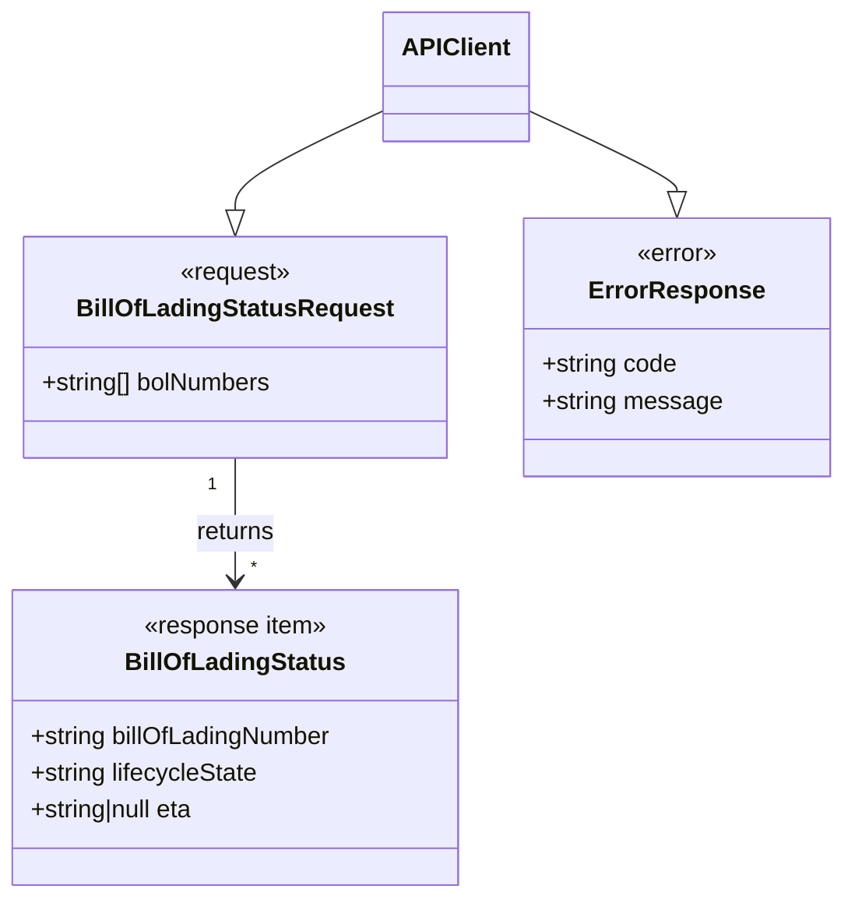

# Diagram: partview_core/partview_service/partview_service/api_definition/paths/bill_of_lading_status.yaml


> Auto-generated by Obscura crawlers

## Diagram 1

```mermaid
flowchart LR
  Client[Client] -->|POST /partview/app/bill-of-ladings/search| API[PartView API: searchBillOfLadingStatus]
  API --> Validate[Validate request body: BillOfLadingStatusRequest]
  Validate -->|missing key / not array / non-string / empty / >10 / empty item| BadReq[400 Bad Request\nErrorResponse examples]
  Validate -->|valid bolNumbers[]| Compute[Compute BOL-level ETA & status\n(derive from package containers)]
  Compute --> Success[200 OK\nBillOfLadingStatus[]]
  Success --> Client
```

> SVG rendering failed for this diagram.

## Diagram 2



### SVG

<svg id="container" width="543.95703125" xmlns="http://www.w3.org/2000/svg" class="classDiagram" height="584" viewBox="0 0 543.95703125 584" role="graphics-document document" aria-roledescription="class"><style>#container{font-family:"trebuchet ms",verdana,arial,sans-serif;font-size:16px;fill:#333;}@keyframes edge-animation-frame{from{stroke-dashoffset:0;}}@keyframes dash{to{stroke-dashoffset:0;}}#container .edge-animation-slow{stroke-dasharray:9,5!important;stroke-dashoffset:900;animation:dash 50s linear infinite;stroke-linecap:round;}#container .edge-animation-fast{stroke-dasharray:9,5!important;stroke-dashoffset:900;animation:dash 20s linear infinite;stroke-linecap:round;}#container .error-icon{fill:#552222;}#container .error-text{fill:#552222;stroke:#552222;}#container .edge-thickness-normal{stroke-width:1px;}#container .edge-thickness-thick{stroke-width:3.5px;}#container .edge-pattern-solid{stroke-dasharray:0;}#container .edge-thickness-invisible{stroke-width:0;fill:none;}#container .edge-pattern-dashed{stroke-dasharray:3;}#container .edge-pattern-dotted{stroke-dasharray:2;}#container .marker{fill:#333333;stroke:#333333;}#container .marker.cross{stroke:#333333;}#container svg{font-family:"trebuchet ms",verdana,arial,sans-serif;font-size:16px;}#container p{margin:0;}#container g.classGroup text{fill:#9370DB;stroke:none;font-family:"trebuchet ms",verdana,arial,sans-serif;font-size:10px;}#container g.classGroup text .title{font-weight:bolder;}#container .nodeLabel,#container .edgeLabel{color:#131300;}#container .edgeLabel .label rect{fill:#ECECFF;}#container .label text{fill:#131300;}#container .labelBkg{background:#ECECFF;}#container .edgeLabel .label span{background:#ECECFF;}#container .classTitle{font-weight:bolder;}#container .node rect,#container .node circle,#container .node ellipse,#container .node polygon,#container .node path{fill:#ECECFF;stroke:#9370DB;stroke-width:1px;}#container .divider{stroke:#9370DB;stroke-width:1;}#container g.clickable{cursor:pointer;}#container g.classGroup rect{fill:#ECECFF;stroke:#9370DB;}#container g.classGroup line{stroke:#9370DB;stroke-width:1;}#container .classLabel .box{stroke:none;stroke-width:0;fill:#ECECFF;opacity:0.5;}#container .classLabel .label{fill:#9370DB;font-size:10px;}#container .relation{stroke:#333333;stroke-width:1;fill:none;}#container .dashed-line{stroke-dasharray:3;}#container .dotted-line{stroke-dasharray:1 2;}#container #compositionStart,#container .composition{fill:#333333!important;stroke:#333333!important;stroke-width:1;}#container #compositionEnd,#container .composition{fill:#333333!important;stroke:#333333!important;stroke-width:1;}#container #dependencyStart,#container .dependency{fill:#333333!important;stroke:#333333!important;stroke-width:1;}#container #dependencyStart,#container .dependency{fill:#333333!important;stroke:#333333!important;stroke-width:1;}#container #extensionStart,#container .extension{fill:transparent!important;stroke:#333333!important;stroke-width:1;}#container #extensionEnd,#container .extension{fill:transparent!important;stroke:#333333!important;stroke-width:1;}#container #aggregationStart,#container .aggregation{fill:transparent!important;stroke:#333333!important;stroke-width:1;}#container #aggregationEnd,#container .aggregation{fill:transparent!important;stroke:#333333!important;stroke-width:1;}#container #lollipopStart,#container .lollipop{fill:#ECECFF!important;stroke:#333333!important;stroke-width:1;}#container #lollipopEnd,#container .lollipop{fill:#ECECFF!important;stroke:#333333!important;stroke-width:1;}#container .edgeTerminals{font-size:11px;line-height:initial;}#container .classTitleText{text-anchor:middle;font-size:18px;fill:#333;}#container .label-icon{display:inline-block;height:1em;overflow:visible;vertical-align:-0.125em;}#container .node .label-icon path{fill:currentColor;stroke:revert;stroke-width:revert;}#container :root{--mermaid-font-family:"trebuchet ms",verdana,arial,sans-serif;}</style><g><defs><marker id="container_class-aggregationStart" class="marker aggregation class" refX="18" refY="7" markerWidth="190" markerHeight="240" orient="auto"><path d="M 18,7 L9,13 L1,7 L9,1 Z"></path></marker></defs><defs><marker id="container_class-aggregationEnd" class="marker aggregation class" refX="1" refY="7" markerWidth="20" markerHeight="28" orient="auto"><path d="M 18,7 L9,13 L1,7 L9,1 Z"></path></marker></defs><defs><marker id="container_class-extensionStart" class="marker extension class" refX="18" refY="7" markerWidth="190" markerHeight="240" orient="auto"><path d="M 1,7 L18,13 V 1 Z"></path></marker></defs><defs><marker id="container_class-extensionEnd" class="marker extension class" refX="1" refY="7" markerWidth="20" markerHeight="28" orient="auto"><path d="M 1,1 V 13 L18,7 Z"></path></marker></defs><defs><marker id="container_class-compositionStart" class="marker composition class" refX="18" refY="7" markerWidth="190" markerHeight="240" orient="auto"><path d="M 18,7 L9,13 L1,7 L9,1 Z"></path></marker></defs><defs><marker id="container_class-compositionEnd" class="marker composition class" refX="1" refY="7" markerWidth="20" markerHeight="28" orient="auto"><path d="M 18,7 L9,13 L1,7 L9,1 Z"></path></marker></defs><defs><marker id="container_class-dependencyStart" class="marker dependency class" refX="6" refY="7" markerWidth="190" markerHeight="240" orient="auto"><path d="M 5,7 L9,13 L1,7 L9,1 Z"></path></marker></defs><defs><marker id="container_class-dependencyEnd" class="marker dependency class" refX="13" refY="7" markerWidth="20" markerHeight="28" orient="auto"><path d="M 18,7 L9,13 L14,7 L9,1 Z"></path></marker></defs><defs><marker id="container_class-lollipopStart" class="marker lollipop class" refX="13" refY="7" markerWidth="190" markerHeight="240" orient="auto"><circle stroke="black" fill="transparent" cx="7" cy="7" r="6"></circle></marker></defs><defs><marker id="container_class-lollipopEnd" class="marker lollipop class" refX="1" refY="7" markerWidth="190" markerHeight="240" orient="auto"><circle stroke="black" fill="transparent" cx="7" cy="7" r="6"></circle></marker></defs><g class="root"><g class="clusters"></g><g class="edgePaths"><path d="M154.309,298L154.309,306.167C154.309,314.333,154.309,330.667,154.309,344C154.309,357.333,154.309,367.667,154.309,372.833L154.309,378" id="id_BillOfLadingStatusRequest_BillOfLadingStatus_1" class="edge-thickness-normal edge-pattern-solid relation" style=";;;" data-edge="true" data-et="edge" data-id="id_BillOfLadingStatusRequest_BillOfLadingStatus_1" data-points="W3sieCI6MTU0LjMwODU5Mzc1LCJ5IjoyOTh9LHsieCI6MTU0LjMwODU5Mzc1LCJ5IjozNDd9LHsieCI6MTU0LjMwODU5Mzc1LCJ5IjozODR9XQ==" marker-end="url(#container_class-dependencyEnd)"></path><path d="M251.523,71.246L235.321,78.871C219.118,86.497,186.714,101.749,170.511,112.666C154.309,123.583,154.309,130.167,154.309,133.458L154.309,136.75" id="id_APIClient_BillOfLadingStatusRequest_2" class="edge-thickness-normal edge-pattern-solid relation" style=";;;" data-edge="true" data-et="edge" data-id="id_APIClient_BillOfLadingStatusRequest_2" data-points="W3sieCI6MjUxLjUyMzQzNzUsInkiOjcxLjI0NTU2MTU2MTg5MTE4fSx7IngiOjE1NC4zMDg1OTM3NSwieSI6MTE3fSx7IngiOjE1NC4zMDg1OTM3NSwieSI6MTU0fV0=" marker-end="url(#container_class-extensionEnd)"></path><path d="M341.805,71.246L358.007,78.871C374.21,86.497,406.615,101.749,422.817,110.666C439.02,119.583,439.02,122.167,439.02,123.458L439.02,124.75" id="id_APIClient_ErrorResponse_3" class="edge-thickness-normal edge-pattern-solid relation" style=";;;" data-edge="true" data-et="edge" data-id="id_APIClient_ErrorResponse_3" data-points="W3sieCI6MzQxLjgwNDY4NzUsInkiOjcxLjI0NTU2MTU2MTg5MTE4fSx7IngiOjQzOS4wMTk1MzEyNSwieSI6MTE3fSx7IngiOjQzOS4wMTk1MzEyNSwieSI6MTQyfV0=" marker-end="url(#container_class-extensionEnd)"></path></g><g class="edgeLabels"><g class="edgeLabel" transform="translate(154.30859375, 347)"><g class="label" data-id="id_BillOfLadingStatusRequest_BillOfLadingStatus_1" transform="translate(-26.265625, -12)"><foreignObject width="52.53125" height="24"><div xmlns="http://www.w3.org/1999/xhtml" class="labelBkg" style="display: table-cell; white-space: nowrap; line-height: 1.5; max-width: 200px; text-align: center;"><span class="edgeLabel"><p>returns</p></span></div></foreignObject></g></g><g class="edgeLabel"><g class="label" data-id="id_APIClient_BillOfLadingStatusRequest_2" transform="translate(0, 0)"><foreignObject width="0" height="0"><div xmlns="http://www.w3.org/1999/xhtml" class="labelBkg" style="display: table-cell; white-space: nowrap; line-height: 1.5; max-width: 200px; text-align: center;"><span class="edgeLabel"></span></div></foreignObject></g></g><g class="edgeLabel"><g class="label" data-id="id_APIClient_ErrorResponse_3" transform="translate(0, 0)"><foreignObject width="0" height="0"><div xmlns="http://www.w3.org/1999/xhtml" class="labelBkg" style="display: table-cell; white-space: nowrap; line-height: 1.5; max-width: 200px; text-align: center;"><span class="edgeLabel"></span></div></foreignObject></g></g><g class="edgeTerminals" transform="translate(139.30859187500008, 315.49999839285715)"><g class="inner" transform="translate(0, 0)"><foreignObject style="width: 9px; height: 12px;"><div xmlns="http://www.w3.org/1999/xhtml" style="display: inline-block; padding-right: 1px; white-space: nowrap;"><span class="edgeLabel">1</span></div></foreignObject></g></g><g class="edgeTerminals" transform="translate(164.3085918749999, 361.49999839285715)"><g class="inner" transform="translate(0, 0)"></g><foreignObject style="width: 9px; height: 12px;"><div xmlns="http://www.w3.org/1999/xhtml" style="display: inline-block; padding-right: 1px; white-space: nowrap;"><span class="edgeLabel">*</span></div></foreignObject></g></g><g class="nodes"><g class="node default" id="classId-BillOfLadingStatusRequest-0" transform="translate(154.30859375, 226)"><g class="basic label-container"><path d="M-137.7734375 -72 L137.7734375 -72 L137.7734375 72 L-137.7734375 72" stroke="none" stroke-width="0" fill="#ECECFF" style=""></path><path d="M-137.7734375 -72 C-70.45401141417798 -72, -3.1345853283559677 -72, 137.7734375 -72 M-137.7734375 -72 C-52.50676789723295 -72, 32.759901705534105 -72, 137.7734375 -72 M137.7734375 -72 C137.7734375 -19.325042374177684, 137.7734375 33.34991525164463, 137.7734375 72 M137.7734375 -72 C137.7734375 -40.45139229895567, 137.7734375 -8.902784597911335, 137.7734375 72 M137.7734375 72 C38.40521448789707 72, -60.96300852420586 72, -137.7734375 72 M137.7734375 72 C71.94171626948398 72, 6.109995038967952 72, -137.7734375 72 M-137.7734375 72 C-137.7734375 22.0452705177836, -137.7734375 -27.9094589644328, -137.7734375 -72 M-137.7734375 72 C-137.7734375 32.3587497653765, -137.7734375 -7.2825004692469975, -137.7734375 -72" stroke="#9370DB" stroke-width="1.3" fill="none" stroke-dasharray="0 0" style=""></path></g><g class="annotation-group text" transform="translate(-36.765625, -48)"><g class="label" style="" transform="translate(0,-12)"><foreignObject width="73.53125" height="24"><div xmlns="http://www.w3.org/1999/xhtml" style="display: table-cell; white-space: nowrap; line-height: 1.5; max-width: 124px; text-align: center;"><span class="nodeLabel markdown-node-label" style=""><p>«request»</p></span></div></foreignObject></g></g><g class="label-group text" transform="translate(-98.265625, -24)"><g class="label" style="font-weight: bolder" transform="translate(0,-12)"><foreignObject width="196.53125" height="24"><div xmlns="http://www.w3.org/1999/xhtml" style="display: table-cell; white-space: nowrap; line-height: 1.5; max-width: 243px; text-align: center;"><span class="nodeLabel markdown-node-label" style=""><p>BillOfLadingStatusRequest</p></span></div></foreignObject></g></g><g class="members-group text" transform="translate(-125.7734375, 24)"><g class="label" style="" transform="translate(0,-12)"><foreignObject width="153.28125" height="24"><div xmlns="http://www.w3.org/1999/xhtml" style="display: table-cell; white-space: nowrap; line-height: 1.5; max-width: 211px; text-align: center;"><span class="nodeLabel markdown-node-label" style=""><p>+string[] bolNumbers</p></span></div></foreignObject></g></g><g class="methods-group text" transform="translate(-125.7734375, 72)"></g><g class="divider" style=""><path d="M-137.7734375 0 C-38.78178090808383 0, 60.20987568383234 0, 137.7734375 0 M-137.7734375 0 C-46.3746734585459 0, 45.0240905829082 0, 137.7734375 0" stroke="#9370DB" stroke-width="1.3" fill="none" stroke-dasharray="0 0" style=""></path></g><g class="divider" style=""><path d="M-137.7734375 48 C-67.41553596139345 48, 2.94236557721311 48, 137.7734375 48 M-137.7734375 48 C-36.33469534721867 48, 65.10404680556266 48, 137.7734375 48" stroke="#9370DB" stroke-width="1.3" fill="none" stroke-dasharray="0 0" style=""></path></g></g><g class="node default" id="classId-BillOfLadingStatus-1" transform="translate(154.30859375, 480)"><g class="basic label-container"><path d="M-146.30859375 -96 L146.30859375 -96 L146.30859375 96 L-146.30859375 96" stroke="none" stroke-width="0" fill="#ECECFF" style=""></path><path d="M-146.30859375 -96 C-70.31453146585511 -96, 5.679530818289777 -96, 146.30859375 -96 M-146.30859375 -96 C-48.931512649621794 -96, 48.44556845075641 -96, 146.30859375 -96 M146.30859375 -96 C146.30859375 -50.18606580214357, 146.30859375 -4.372131604287134, 146.30859375 96 M146.30859375 -96 C146.30859375 -38.589644825828465, 146.30859375 18.82071034834307, 146.30859375 96 M146.30859375 96 C65.05141526602134 96, -16.205763217957326 96, -146.30859375 96 M146.30859375 96 C42.0415908717881 96, -62.225412006423795 96, -146.30859375 96 M-146.30859375 96 C-146.30859375 25.55207536000249, -146.30859375 -44.89584927999502, -146.30859375 -96 M-146.30859375 96 C-146.30859375 49.371908560428004, -146.30859375 2.743817120856008, -146.30859375 -96" stroke="#9370DB" stroke-width="1.3" fill="none" stroke-dasharray="0 0" style=""></path></g><g class="annotation-group text" transform="translate(-60.640625, -72)"><g class="label" style="" transform="translate(0,-12)"><foreignObject width="121.28125" height="24"><div xmlns="http://www.w3.org/1999/xhtml" style="display: table-cell; white-space: nowrap; line-height: 1.5; max-width: 171px; text-align: center;"><span class="nodeLabel markdown-node-label" style=""><p>«response item»</p></span></div></foreignObject></g></g><g class="label-group text" transform="translate(-68.2890625, -48)"><g class="label" style="font-weight: bolder" transform="translate(0,-12)"><foreignObject width="136.578125" height="24"><div xmlns="http://www.w3.org/1999/xhtml" style="display: table-cell; white-space: nowrap; line-height: 1.5; max-width: 184px; text-align: center;"><span class="nodeLabel markdown-node-label" style=""><p>BillOfLadingStatus</p></span></div></foreignObject></g></g><g class="members-group text" transform="translate(-134.30859375, 0)"><g class="label" style="" transform="translate(0,-12)"><foreignObject width="200.328125" height="24"><div xmlns="http://www.w3.org/1999/xhtml" style="display: table-cell; white-space: nowrap; line-height: 1.5; max-width: 259px; text-align: center;"><span class="nodeLabel markdown-node-label" style=""><p>+string billOfLadingNumber</p></span></div></foreignObject></g><g class="label" style="" transform="translate(0,12)"><foreignObject width="150.765625" height="24"><div xmlns="http://www.w3.org/1999/xhtml" style="display: table-cell; white-space: nowrap; line-height: 1.5; max-width: 208px; text-align: center;"><span class="nodeLabel markdown-node-label" style=""><p>+string lifecycleState</p></span></div></foreignObject></g><g class="label" style="" transform="translate(0,36)"><foreignObject width="111.46875" height="24"><div xmlns="http://www.w3.org/1999/xhtml" style="display: table-cell; white-space: nowrap; line-height: 1.5; max-width: 169px; text-align: center;"><span class="nodeLabel markdown-node-label" style=""><p>+string|null eta</p></span></div></foreignObject></g></g><g class="methods-group text" transform="translate(-134.30859375, 96)"></g><g class="divider" style=""><path d="M-146.30859375 -24 C-74.13720248024704 -24, -1.9658112104940813 -24, 146.30859375 -24 M-146.30859375 -24 C-64.23924092617139 -24, 17.83011189765722 -24, 146.30859375 -24" stroke="#9370DB" stroke-width="1.3" fill="none" stroke-dasharray="0 0" style=""></path></g><g class="divider" style=""><path d="M-146.30859375 72 C-81.18011774397324 72, -16.051641737946483 72, 146.30859375 72 M-146.30859375 72 C-81.15334147467077 72, -15.998089199341536 72, 146.30859375 72" stroke="#9370DB" stroke-width="1.3" fill="none" stroke-dasharray="0 0" style=""></path></g></g><g class="node default" id="classId-ErrorResponse-2" transform="translate(439.01953125, 226)"><g class="basic label-container"><path d="M-96.9375 -84 L96.9375 -84 L96.9375 84 L-96.9375 84" stroke="none" stroke-width="0" fill="#ECECFF" style=""></path><path d="M-96.9375 -84 C-50.79890422836635 -84, -4.660308456732693 -84, 96.9375 -84 M-96.9375 -84 C-26.439105504003706 -84, 44.05928899199259 -84, 96.9375 -84 M96.9375 -84 C96.9375 -48.28362969479827, 96.9375 -12.567259389596543, 96.9375 84 M96.9375 -84 C96.9375 -21.876173261435177, 96.9375 40.247653477129646, 96.9375 84 M96.9375 84 C37.96299654200388 84, -21.011506915992243 84, -96.9375 84 M96.9375 84 C53.379405177426065 84, 9.82131035485213 84, -96.9375 84 M-96.9375 84 C-96.9375 33.065379022513206, -96.9375 -17.86924195497359, -96.9375 -84 M-96.9375 84 C-96.9375 22.464301813290405, -96.9375 -39.07139637341919, -96.9375 -84" stroke="#9370DB" stroke-width="1.3" fill="none" stroke-dasharray="0 0" style=""></path></g><g class="annotation-group text" transform="translate(-26.9453125, -60)"><g class="label" style="" transform="translate(0,-12)"><foreignObject width="53.890625" height="24"><div xmlns="http://www.w3.org/1999/xhtml" style="display: table-cell; white-space: nowrap; line-height: 1.5; max-width: 104px; text-align: center;"><span class="nodeLabel markdown-node-label" style=""><p>«error»</p></span></div></foreignObject></g></g><g class="label-group text" transform="translate(-53.625, -36)"><g class="label" style="font-weight: bolder" transform="translate(0,-12)"><foreignObject width="107.25" height="24"><div xmlns="http://www.w3.org/1999/xhtml" style="display: table-cell; white-space: nowrap; line-height: 1.5; max-width: 156px; text-align: center;"><span class="nodeLabel markdown-node-label" style=""><p>ErrorResponse</p></span></div></foreignObject></g></g><g class="members-group text" transform="translate(-84.9375, 12)"><g class="label" style="" transform="translate(0,-12)"><foreignObject width="88.828125" height="24"><div xmlns="http://www.w3.org/1999/xhtml" style="display: table-cell; white-space: nowrap; line-height: 1.5; max-width: 146px; text-align: center;"><span class="nodeLabel markdown-node-label" style=""><p>+string code</p></span></div></foreignObject></g><g class="label" style="" transform="translate(0,12)"><foreignObject width="116.25" height="24"><div xmlns="http://www.w3.org/1999/xhtml" style="display: table-cell; white-space: nowrap; line-height: 1.5; max-width: 174px; text-align: center;"><span class="nodeLabel markdown-node-label" style=""><p>+string message</p></span></div></foreignObject></g></g><g class="methods-group text" transform="translate(-84.9375, 84)"></g><g class="divider" style=""><path d="M-96.9375 -12 C-23.752797801185423 -12, 49.431904397629154 -12, 96.9375 -12 M-96.9375 -12 C-29.33445195960428 -12, 38.26859608079144 -12, 96.9375 -12" stroke="#9370DB" stroke-width="1.3" fill="none" stroke-dasharray="0 0" style=""></path></g><g class="divider" style=""><path d="M-96.9375 60 C-52.13398597126218 60, -7.330471942524355 60, 96.9375 60 M-96.9375 60 C-34.53843166055981 60, 27.860636678880383 60, 96.9375 60" stroke="#9370DB" stroke-width="1.3" fill="none" stroke-dasharray="0 0" style=""></path></g></g><g class="node default" id="classId-APIClient-3" transform="translate(296.6640625, 50)"><g class="basic label-container"><path d="M-45.140625 -42 L45.140625 -42 L45.140625 42 L-45.140625 42" stroke="none" stroke-width="0" fill="#ECECFF" style=""></path><path d="M-45.140625 -42 C-18.169463702531335 -42, 8.80169759493733 -42, 45.140625 -42 M-45.140625 -42 C-19.96573962853566 -42, 5.209145742928683 -42, 45.140625 -42 M45.140625 -42 C45.140625 -23.912264865283124, 45.140625 -5.824529730566248, 45.140625 42 M45.140625 -42 C45.140625 -22.168364010579833, 45.140625 -2.336728021159665, 45.140625 42 M45.140625 42 C14.881213030821339 42, -15.378198938357322 42, -45.140625 42 M45.140625 42 C20.18060266602952 42, -4.779419667940957 42, -45.140625 42 M-45.140625 42 C-45.140625 23.465945916699646, -45.140625 4.931891833399291, -45.140625 -42 M-45.140625 42 C-45.140625 15.484391010391601, -45.140625 -11.031217979216798, -45.140625 -42" stroke="#9370DB" stroke-width="1.3" fill="none" stroke-dasharray="0 0" style=""></path></g><g class="annotation-group text" transform="translate(0, -18)"></g><g class="label-group text" transform="translate(-33.140625, -18)"><g class="label" style="font-weight: bolder" transform="translate(0,-12)"><foreignObject width="66.28125" height="24"><div xmlns="http://www.w3.org/1999/xhtml" style="display: table-cell; white-space: nowrap; line-height: 1.5; max-width: 115px; text-align: center;"><span class="nodeLabel markdown-node-label" style=""><p>APIClient</p></span></div></foreignObject></g></g><g class="members-group text" transform="translate(-33.140625, 30)"></g><g class="methods-group text" transform="translate(-33.140625, 60)"></g><g class="divider" style=""><path d="M-45.140625 6 C-26.53648393985953 6, -7.932342879719059 6, 45.140625 6 M-45.140625 6 C-21.622878885454636 6, 1.8948672290907282 6, 45.140625 6" stroke="#9370DB" stroke-width="1.3" fill="none" stroke-dasharray="0 0" style=""></path></g><g class="divider" style=""><path d="M-45.140625 24 C-20.37138059482394 24, 4.397863810352121 24, 45.140625 24 M-45.140625 24 C-15.895144525632656 24, 13.350335948734688 24, 45.140625 24" stroke="#9370DB" stroke-width="1.3" fill="none" stroke-dasharray="0 0" style=""></path></g></g></g></g></g></svg>
