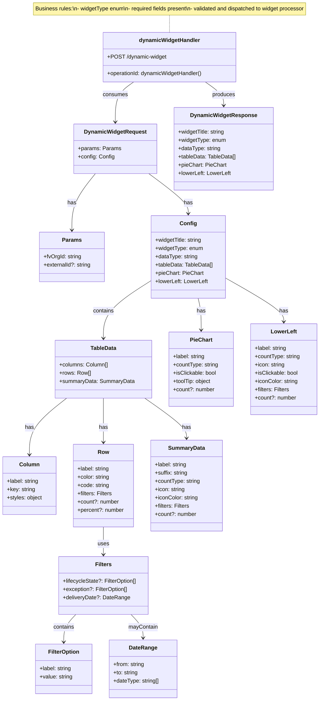

# Diagram: partview_core/partview_service/partview_service/api_definition/paths/dynamic_widget.yaml

> Auto-generated by Obscura crawlers

## Mermaid

### SVG

<svg id="container" width="928.07421875" xmlns="http://www.w3.org/2000/svg" class="classDiagram" height="2034" viewBox="0 0 928.07421875 2034" role="graphics-document document" aria-roledescription="class"><g><defs><marker id="container_class-aggregationStart" class="marker aggregation class" refX="18" refY="7" markerWidth="190" markerHeight="240" orient="auto"><path d="M 18,7 L9,13 L1,7 L9,1 Z"></path></marker></defs><defs><marker id="container_class-aggregationEnd" class="marker aggregation class" refX="1" refY="7" markerWidth="20" markerHeight="28" orient="auto"><path d="M 18,7 L9,13 L1,7 L9,1 Z"></path></marker></defs><defs><marker id="container_class-extensionStart" class="marker extension class" refX="18" refY="7" markerWidth="190" markerHeight="240" orient="auto"><path d="M 1,7 L18,13 V 1 Z"></path></marker></defs><defs><marker id="container_class-extensionEnd" class="marker extension class" refX="1" refY="7" markerWidth="20" markerHeight="28" orient="auto"><path d="M 1,1 V 13 L18,7 Z"></path></marker></defs><defs><marker id="container_class-compositionStart" class="marker composition class" refX="18" refY="7" markerWidth="190" markerHeight="240" orient="auto"><path d="M 18,7 L9,13 L1,7 L9,1 Z"></path></marker></defs><defs><marker id="container_class-compositionEnd" class="marker composition class" refX="1" refY="7" markerWidth="20" markerHeight="28" orient="auto"><path d="M 18,7 L9,13 L1,7 L9,1 Z"></path></marker></defs><defs><marker id="container_class-dependencyStart" class="marker dependency class" refX="6" refY="7" markerWidth="190" markerHeight="240" orient="auto"><path d="M 5,7 L9,13 L1,7 L9,1 Z"></path></marker></defs><defs><marker id="container_class-dependencyEnd" class="marker dependency class" refX="13" refY="7" markerWidth="20" markerHeight="28" orient="auto"><path d="M 18,7 L9,13 L14,7 L9,1 Z"></path></marker></defs><defs><marker id="container_class-lollipopStart" class="marker lollipop class" refX="13" refY="7" markerWidth="190" markerHeight="240" orient="auto"><circle stroke="black" fill="transparent" cx="7" cy="7" r="6"></circle></marker></defs><defs><marker id="container_class-lollipopEnd" class="marker lollipop class" refX="1" refY="7" markerWidth="190" markerHeight="240" orient="auto"><circle stroke="black" fill="transparent" cx="7" cy="7" r="6"></circle></marker></defs><g class="root"><g class="clusters"></g><g class="edgePaths"><path d="M488.813,44L488.813,48.167C488.813,52.333,488.813,60.667,488.813,69C488.813,77.333,488.813,85.667,488.813,89.833L488.813,94" id="edgeNote1" class="edge-thickness-normal edge-pattern-dotted relation" style="fill: none;;;fill: none" data-edge="true" data-et="edge" data-id="edgeNote1" data-points="W3sieCI6NDg4LjgxMjUsInkiOjQ0fSx7IngiOjQ4OC44MTI1LCJ5Ijo2OX0seyJ4Ijo0ODguODEyNSwieSI6OTR9XQ=="></path><path d="M276.343,504L264.945,518.167C253.546,532.333,230.749,560.667,219.35,588C207.951,615.333,207.951,641.667,207.951,654.833L207.951,668" id="id_DynamicWidgetRequest_Params_1" class="edge-thickness-normal edge-pattern-solid relation" style=";;;" data-edge="true" data-et="edge" data-id="id_DynamicWidgetRequest_Params_1" data-points="W3sieCI6Mjc2LjM0MzI2NDgyODgyMTY1LCJ5Ijo1MDR9LHsieCI6MjA3Ljk1MTE3MTg3NSwieSI6NTg5fSx7IngiOjIwNy45NTExNzE4NzUsInkiOjY3NH1d" marker-end="url(#container_class-dependencyEnd)"></path><path d="M432.662,504L452.02,518.167C471.379,532.333,510.096,560.667,529.454,580C548.813,599.333,548.813,609.667,548.813,614.833L548.813,620" id="id_DynamicWidgetRequest_Config_2" class="edge-thickness-normal edge-pattern-solid relation" style=";;;" data-edge="true" data-et="edge" data-id="id_DynamicWidgetRequest_Config_2" data-points="W3sieCI6NDMyLjY2MTgzNTY4ODY5NDMsInkiOjUwNH0seyJ4Ijo1NDguODEyNSwieSI6NTg5fSx7IngiOjU0OC44MTI1LCJ5Ijo2MjZ9XQ==" marker-end="url(#container_class-dependencyEnd)"></path><path d="M440.879,814.108L417.4,828.923C393.922,843.739,346.965,873.369,323.486,901.351C300.008,929.333,300.008,955.667,300.008,968.833L300.008,982" id="id_Config_TableData_3" class="edge-thickness-normal edge-pattern-solid relation" style=";;;" data-edge="true" data-et="edge" data-id="id_Config_TableData_3" data-points="W3sieCI6NDQwLjg3ODkwNjI1LCJ5Ijo4MTQuMTA3OTM3OTUzMzM5NH0seyJ4IjozMDAuMDA3ODEyNSwieSI6OTAzfSx7IngiOjMwMC4wMDc4MTI1LCJ5Ijo5ODh9XQ==" marker-end="url(#container_class-dependencyEnd)"></path><path d="M193.348,1156L175.359,1170.167C157.371,1184.333,121.395,1212.667,103.406,1240C85.418,1267.333,85.418,1293.667,85.418,1306.833L85.418,1320" id="id_TableData_Column_4" class="edge-thickness-normal edge-pattern-solid relation" style=";;;" data-edge="true" data-et="edge" data-id="id_TableData_Column_4" data-points="W3sieCI6MTkzLjM0Nzc3MTgxOTUyNjYzLCJ5IjoxMTU2fSx7IngiOjg1LjQxNzk2ODc1LCJ5IjoxMjQxfSx7IngiOjg1LjQxNzk2ODc1LCJ5IjoxMzI2fV0=" marker-end="url(#container_class-dependencyEnd)"></path><path d="M300.008,1156L300.008,1170.167C300.008,1184.333,300.008,1212.667,300.008,1234C300.008,1255.333,300.008,1269.667,300.008,1276.833L300.008,1284" id="id_TableData_Row_5" class="edge-thickness-normal edge-pattern-solid relation" style=";;;" data-edge="true" data-et="edge" data-id="id_TableData_Row_5" data-points="W3sieCI6MzAwLjAwNzgxMjUsInkiOjExNTZ9LHsieCI6MzAwLjAwNzgxMjUsInkiOjEyNDF9LHsieCI6MzAwLjAwNzgxMjUsInkiOjEyOTB9XQ==" marker-end="url(#container_class-dependencyEnd)"></path><path d="M300.008,1530L300.008,1538.167C300.008,1546.333,300.008,1562.667,300.008,1576C300.008,1589.333,300.008,1599.667,300.008,1604.833L300.008,1610" id="id_Row_Filters_6" class="edge-thickness-normal edge-pattern-solid relation" style=";;;" data-edge="true" data-et="edge" data-id="id_Row_Filters_6" data-points="W3sieCI6MzAwLjAwNzgxMjUsInkiOjE1MzB9LHsieCI6MzAwLjAwNzgxMjUsInkiOjE1Nzl9LHsieCI6MzAwLjAwNzgxMjUsInkiOjE2MTZ9XQ==" marker-end="url(#container_class-dependencyEnd)"></path><path d="M219.848,1784L213.963,1790.167C208.078,1796.333,196.309,1808.667,190.424,1822C184.539,1835.333,184.539,1849.667,184.539,1856.833L184.539,1864" id="id_Filters_FilterOption_7" class="edge-thickness-normal edge-pattern-solid relation" style=";;;" data-edge="true" data-et="edge" data-id="id_Filters_FilterOption_7" data-points="W3sieCI6MjE5Ljg0NzY4ODUzMzA1Nzg2LCJ5IjoxNzg0fSx7IngiOjE4NC41MzkwNjI1LCJ5IjoxODIxfSx7IngiOjE4NC41MzkwNjI1LCJ5IjoxODcwfV0=" marker-end="url(#container_class-dependencyEnd)"></path><path d="M380.168,1784L386.053,1790.167C391.937,1796.333,403.707,1808.667,409.592,1820C415.477,1831.333,415.477,1841.667,415.477,1846.833L415.477,1852" id="id_Filters_DateRange_8" class="edge-thickness-normal edge-pattern-solid relation" style=";;;" data-edge="true" data-et="edge" data-id="id_Filters_DateRange_8" data-points="W3sieCI6MzgwLjE2NzkzNjQ2Njk0MjE0LCJ5IjoxNzg0fSx7IngiOjQxNS40NzY1NjI1LCJ5IjoxODIxfSx7IngiOjQxNS40NzY1NjI1LCJ5IjoxODU4fV0=" marker-end="url(#container_class-dependencyEnd)"></path><path d="M419.845,1156L440.056,1170.167C460.267,1184.333,500.688,1212.667,520.899,1232C541.109,1251.333,541.109,1261.667,541.109,1266.833L541.109,1272" id="id_TableData_SummaryData_9" class="edge-thickness-normal edge-pattern-solid relation" style=";;;" data-edge="true" data-et="edge" data-id="id_TableData_SummaryData_9" data-points="W3sieCI6NDE5Ljg0NTI3NTUxNzc1MTUsInkiOjExNTZ9LHsieCI6NTQxLjEwOTM3NSwieSI6MTI0MX0seyJ4Ijo1NDEuMTA5Mzc1LCJ5IjoxMjc4fV0=" marker-end="url(#container_class-dependencyEnd)"></path><path d="M575.045,866L576.393,872.167C577.741,878.333,580.437,890.667,581.785,906C583.133,921.333,583.133,939.667,583.133,948.833L583.133,958" id="id_Config_PieChart_10" class="edge-thickness-normal edge-pattern-solid relation" style=";;;" data-edge="true" data-et="edge" data-id="id_Config_PieChart_10" data-points="W3sieCI6NTc1LjA0NDU4NTk4NzI2MTEsInkiOjg2Nn0seyJ4Ijo1ODMuMTMyODEyNSwieSI6OTAzfSx7IngiOjU4My4xMzI4MTI1LCJ5Ijo5NjR9XQ==" marker-end="url(#container_class-dependencyEnd)"></path><path d="M656.746,807.675L684.549,823.563C712.353,839.45,767.96,871.225,795.763,892.279C823.566,913.333,823.566,923.667,823.566,928.833L823.566,934" id="id_Config_LowerLeft_11" class="edge-thickness-normal edge-pattern-solid relation" style=";;;" data-edge="true" data-et="edge" data-id="id_Config_LowerLeft_11" data-points="W3sieCI6NjU2Ljc0NjA5Mzc1LCJ5Ijo4MDcuNjc1NDYyNDE2NjUxM30seyJ4Ijo4MjMuNTY2NDA2MjUsInkiOjkwM30seyJ4Ijo4MjMuNTY2NDA2MjUsInkiOjk0MH1d" marker-end="url(#container_class-dependencyEnd)"></path><path d="M386.733,238L377.99,244.167C369.247,250.333,351.761,262.667,343.018,282C334.275,301.333,334.275,327.667,334.275,340.833L334.275,354" id="id_dynamicWidgetHandler_DynamicWidgetRequest_12" class="edge-thickness-normal edge-pattern-solid relation" style=";;;" data-edge="true" data-et="edge" data-id="id_dynamicWidgetHandler_DynamicWidgetRequest_12" data-points="W3sieCI6Mzg2LjczMjk0MTUxMzc2MTUsInkiOjIzOH0seyJ4IjozMzQuMjc1MzkwNjI1LCJ5IjoyNzV9LHsieCI6MzM0LjI3NTM5MDYyNSwieSI6MzYwfV0=" marker-end="url(#container_class-dependencyEnd)"></path><path d="M590.892,238L599.635,244.167C608.378,250.333,625.864,262.667,634.607,274C643.35,285.333,643.35,295.667,643.35,300.833L643.35,306" id="id_dynamicWidgetHandler_DynamicWidgetResponse_13" class="edge-thickness-normal edge-pattern-solid relation" style=";;;" data-edge="true" data-et="edge" data-id="id_dynamicWidgetHandler_DynamicWidgetResponse_13" data-points="W3sieCI6NTkwLjg5MjA1ODQ4NjIzODUsInkiOjIzOH0seyJ4Ijo2NDMuMzQ5NjA5Mzc1LCJ5IjoyNzV9LHsieCI6NjQzLjM0OTYwOTM3NSwieSI6MzEyfV0=" marker-end="url(#container_class-dependencyEnd)"></path></g><g class="edgeLabels"><g class="edgeLabel"><g class="label" data-id="edgeNote1" transform="translate(0, 0)"><foreignObject width="0" height="0">

</foreignObject></g></g><g class="edgeLabel" transform="translate(207.951171875, 589)"><g class="label" data-id="id_DynamicWidgetRequest_Params_1" transform="translate(-12.703125, -12)"><foreignObject width="25.40625" height="24">

has

</foreignObject></g></g><g class="edgeLabel" transform="translate(548.8125, 589)"><g class="label" data-id="id_DynamicWidgetRequest_Config_2" transform="translate(-12.703125, -12)"><foreignObject width="25.40625" height="24">

has

</foreignObject></g></g><g class="edgeLabel" transform="translate(300.0078125, 903)"><g class="label" data-id="id_Config_TableData_3" transform="translate(-30.890625, -12)"><foreignObject width="61.78125" height="24">

contains

</foreignObject></g></g><g class="edgeLabel" transform="translate(85.41796875, 1241)"><g class="label" data-id="id_TableData_Column_4" transform="translate(-12.703125, -12)"><foreignObject width="25.40625" height="24">

has

</foreignObject></g></g><g class="edgeLabel" transform="translate(300.0078125, 1241)"><g class="label" data-id="id_TableData_Row_5" transform="translate(-12.703125, -12)"><foreignObject width="25.40625" height="24">

has

</foreignObject></g></g><g class="edgeLabel" transform="translate(300.0078125, 1579)"><g class="label" data-id="id_Row_Filters_6" transform="translate(-16.4921875, -12)"><foreignObject width="32.984375" height="24">

uses

</foreignObject></g></g><g class="edgeLabel" transform="translate(184.5390625, 1821)"><g class="label" data-id="id_Filters_FilterOption_7" transform="translate(-30.890625, -12)"><foreignObject width="61.78125" height="24">

contains

</foreignObject></g></g><g class="edgeLabel" transform="translate(415.4765625, 1821)"><g class="label" data-id="id_Filters_DateRange_8" transform="translate(-42.8359375, -12)"><foreignObject width="85.671875" height="24">

mayContain

</foreignObject></g></g><g class="edgeLabel" transform="translate(541.109375, 1241)"><g class="label" data-id="id_TableData_SummaryData_9" transform="translate(-12.703125, -12)"><foreignObject width="25.40625" height="24">

has

</foreignObject></g></g><g class="edgeLabel" transform="translate(583.1328125, 903)"><g class="label" data-id="id_Config_PieChart_10" transform="translate(-12.703125, -12)"><foreignObject width="25.40625" height="24">

has

</foreignObject></g></g><g class="edgeLabel" transform="translate(823.56640625, 903)"><g class="label" data-id="id_Config_LowerLeft_11" transform="translate(-12.703125, -12)"><foreignObject width="25.40625" height="24">

has

</foreignObject></g></g><g class="edgeLabel" transform="translate(334.275390625, 275)"><g class="label" data-id="id_dynamicWidgetHandler_DynamicWidgetRequest_12" transform="translate(-36.375, -12)"><foreignObject width="72.75" height="24">

consumes

</foreignObject></g></g><g class="edgeLabel" transform="translate(643.349609375, 275)"><g class="label" data-id="id_dynamicWidgetHandler_DynamicWidgetResponse_13" transform="translate(-33.4765625, -12)"><foreignObject width="66.953125" height="24">

produces

</foreignObject></g></g></g><g class="nodes"><g class="node default" id="classId-dynamicWidgetHandler-0" transform="translate(488.8125, 166)"><g class="basic label-container"><path d="M-195.1796875 -72 L195.1796875 -72 L195.1796875 72 L-195.1796875 72" stroke="none" stroke-width="0" fill="#ECECFF" style=""></path><path d="M-195.1796875 -72 C-80.09582762459038 -72, 34.98803225081923 -72, 195.1796875 -72 M-195.1796875 -72 C-103.7043474608244 -72, -12.229007421648788 -72, 195.1796875 -72 M195.1796875 -72 C195.1796875 -20.698054912984688, 195.1796875 30.603890174030624, 195.1796875 72 M195.1796875 -72 C195.1796875 -22.720488156621542, 195.1796875 26.559023686756916, 195.1796875 72 M195.1796875 72 C91.19623971239963 72, -12.787208075200738 72, -195.1796875 72 M195.1796875 72 C113.53078164807091 72, 31.881875796141827 72, -195.1796875 72 M-195.1796875 72 C-195.1796875 28.707166912631116, -195.1796875 -14.585666174737767, -195.1796875 -72 M-195.1796875 72 C-195.1796875 17.40419017030321, -195.1796875 -37.19161965939358, -195.1796875 -72" stroke="#9370DB" stroke-width="1.3" fill="none" stroke-dasharray="0 0" style=""></path></g><g class="annotation-group text" transform="translate(0, -48)"></g><g class="label-group text" transform="translate(-85.453125, -48)"><g class="label" style="font-weight: bolder" transform="translate(0,-12)"><foreignObject width="170.90625" height="24">

dynamicWidgetHandler

</foreignObject></g></g><g class="members-group text" transform="translate(-183.1796875, 0)"><g class="label" style="" transform="translate(0,-12)"><foreignObject width="172.03125" height="24">

+POST /dynamic-widget

</foreignObject></g></g><g class="methods-group text" transform="translate(-183.1796875, 48)"><g class="label" style="" transform="translate(0,-12)"><foreignObject width="280.90625" height="24">

+operationId: dynamicWidgetHandler()

</foreignObject></g></g><g class="divider" style=""><path d="M-195.1796875 -24 C-96.71390775957204 -24, 1.751871980855924 -24, 195.1796875 -24 M-195.1796875 -24 C-56.66689614443666 -24, 81.84589521112667 -24, 195.1796875 -24" stroke="#9370DB" stroke-width="1.3" fill="none" stroke-dasharray="0 0" style=""></path></g><g class="divider" style=""><path d="M-195.1796875 24 C-46.16381610151103 24, 102.85205529697794 24, 195.1796875 24 M-195.1796875 24 C-112.57702857998375 24, -29.974369659967493 24, 195.1796875 24" stroke="#9370DB" stroke-width="1.3" fill="none" stroke-dasharray="0 0" style=""></path></g></g><g class="node default" id="classId-DynamicWidgetRequest-1" transform="translate(334.275390625, 432)"><g class="basic label-container"><path d="M-116.5 -72 L116.5 -72 L116.5 72 L-116.5 72" stroke="none" stroke-width="0" fill="#ECECFF" style=""></path><path d="M-116.5 -72 C-68.54368912946973 -72, -20.587378258939452 -72, 116.5 -72 M-116.5 -72 C-64.07074087957332 -72, -11.641481759146629 -72, 116.5 -72 M116.5 -72 C116.5 -17.888675637191476, 116.5 36.22264872561705, 116.5 72 M116.5 -72 C116.5 -21.58534758077664, 116.5 28.829304838446717, 116.5 72 M116.5 72 C60.906687959687815 72, 5.3133759193756305 72, -116.5 72 M116.5 72 C32.834125320525374 72, -50.83174935894925 72, -116.5 72 M-116.5 72 C-116.5 23.998804812900502, -116.5 -24.002390374198995, -116.5 -72 M-116.5 72 C-116.5 14.960177098613627, -116.5 -42.079645802772745, -116.5 -72" stroke="#9370DB" stroke-width="1.3" fill="none" stroke-dasharray="0 0" style=""></path></g><g class="annotation-group text" transform="translate(0, -48)"></g><g class="label-group text" transform="translate(-86.75, -48)"><g class="label" style="font-weight: bolder" transform="translate(0,-12)"><foreignObject width="173.5" height="24">

DynamicWidgetRequest

</foreignObject></g></g><g class="members-group text" transform="translate(-104.5, 0)"><g class="label" style="" transform="translate(0,-12)"><foreignObject width="122.25" height="24">

+params: Params

</foreignObject></g><g class="label" style="" transform="translate(0,12)"><foreignObject width="104.515625" height="24">

+config: Config

</foreignObject></g></g><g class="methods-group text" transform="translate(-104.5, 72)"></g><g class="divider" style=""><path d="M-116.5 -24 C-66.0586622967023 -24, -15.617324593404604 -24, 116.5 -24 M-116.5 -24 C-35.27963115060844 -24, 45.940737698783124 -24, 116.5 -24" stroke="#9370DB" stroke-width="1.3" fill="none" stroke-dasharray="0 0" style=""></path></g><g class="divider" style=""><path d="M-116.5 48 C-54.12287100675606 48, 8.254257986487886 48, 116.5 48 M-116.5 48 C-59.67688251790704 48, -2.853765035814078 48, 116.5 48" stroke="#9370DB" stroke-width="1.3" fill="none" stroke-dasharray="0 0" style=""></path></g></g><g class="node default" id="classId-Params-2" transform="translate(207.951171875, 746)"><g class="basic label-container"><path d="M-94.71484375 -72 L94.71484375 -72 L94.71484375 72 L-94.71484375 72" stroke="none" stroke-width="0" fill="#ECECFF" style=""></path><path d="M-94.71484375 -72 C-42.52674960463897 -72, 9.661344540722055 -72, 94.71484375 -72 M-94.71484375 -72 C-47.53930864086608 -72, -0.3637735317321642 -72, 94.71484375 -72 M94.71484375 -72 C94.71484375 -38.98237401856329, 94.71484375 -5.964748037126583, 94.71484375 72 M94.71484375 -72 C94.71484375 -31.006512997743087, 94.71484375 9.986974004513826, 94.71484375 72 M94.71484375 72 C54.94715730589855 72, 15.1794708617971 72, -94.71484375 72 M94.71484375 72 C19.9153880099459 72, -54.8840677301082 72, -94.71484375 72 M-94.71484375 72 C-94.71484375 20.93476515385499, -94.71484375 -30.13046969229002, -94.71484375 -72 M-94.71484375 72 C-94.71484375 20.227142332342154, -94.71484375 -31.54571533531569, -94.71484375 -72" stroke="#9370DB" stroke-width="1.3" fill="none" stroke-dasharray="0 0" style=""></path></g><g class="annotation-group text" transform="translate(0, -48)"></g><g class="label-group text" transform="translate(-26.7109375, -48)"><g class="label" style="font-weight: bolder" transform="translate(0,-12)"><foreignObject width="53.421875" height="24">

Params

</foreignObject></g></g><g class="members-group text" transform="translate(-82.71484375, 0)"><g class="label" style="" transform="translate(0,-12)"><foreignObject width="110.3125" height="24">

+fvOrgId: string

</foreignObject></g><g class="label" style="" transform="translate(0,12)"><foreignObject width="138.71875" height="24">

+externalId?: string

</foreignObject></g></g><g class="methods-group text" transform="translate(-82.71484375, 72)"></g><g class="divider" style=""><path d="M-94.71484375 -24 C-48.60543292522894 -24, -2.4960221004578784 -24, 94.71484375 -24 M-94.71484375 -24 C-53.22625469051499 -24, -11.737665631029984 -24, 94.71484375 -24" stroke="#9370DB" stroke-width="1.3" fill="none" stroke-dasharray="0 0" style=""></path></g><g class="divider" style=""><path d="M-94.71484375 48 C-36.6929398567752 48, 21.328964036449605 48, 94.71484375 48 M-94.71484375 48 C-40.7375083464055 48, 13.239827057189004 48, 94.71484375 48" stroke="#9370DB" stroke-width="1.3" fill="none" stroke-dasharray="0 0" style=""></path></g></g><g class="node default" id="classId-Config-3" transform="translate(548.8125, 746)"><g class="basic label-container"><path d="M-107.93359375 -120 L107.93359375 -120 L107.93359375 120 L-107.93359375 120" stroke="none" stroke-width="0" fill="#ECECFF" style=""></path><path d="M-107.93359375 -120 C-62.44211537621135 -120, -16.950637002422695 -120, 107.93359375 -120 M-107.93359375 -120 C-33.402805845366146 -120, 41.12798205926771 -120, 107.93359375 -120 M107.93359375 -120 C107.93359375 -61.19657692919118, 107.93359375 -2.3931538583823624, 107.93359375 120 M107.93359375 -120 C107.93359375 -59.76937860952005, 107.93359375 0.4612427809599069, 107.93359375 120 M107.93359375 120 C45.53806107886775 120, -16.857471592264503 120, -107.93359375 120 M107.93359375 120 C24.900814719253432 120, -58.131964311493135 120, -107.93359375 120 M-107.93359375 120 C-107.93359375 64.41996195378198, -107.93359375 8.839923907563957, -107.93359375 -120 M-107.93359375 120 C-107.93359375 25.647375189667343, -107.93359375 -68.70524962066531, -107.93359375 -120" stroke="#9370DB" stroke-width="1.3" fill="none" stroke-dasharray="0 0" style=""></path></g><g class="annotation-group text" transform="translate(0, -96)"></g><g class="label-group text" transform="translate(-22.9296875, -96)"><g class="label" style="font-weight: bolder" transform="translate(0,-12)"><foreignObject width="45.859375" height="24">

Config

</foreignObject></g></g><g class="members-group text" transform="translate(-95.93359375, -48)"><g class="label" style="" transform="translate(0,-12)"><foreignObject width="137.546875" height="24">

+widgetTitle: string

</foreignObject></g><g class="label" style="" transform="translate(0,12)"><foreignObject width="139.03125" height="24">

+widgetType: enum

</foreignObject></g><g class="label" style="" transform="translate(0,36)"><foreignObject width="124.078125" height="24">

+dataType: string

</foreignObject></g><g class="label" style="" transform="translate(0,60)"><foreignObject width="168.9375" height="24">

+tableData: TableData[]

</foreignObject></g><g class="label" style="" transform="translate(0,84)"><foreignObject width="139.0625" height="24">

+pieChart: PieChart

</foreignObject></g><g class="label" style="" transform="translate(0,108)"><foreignObject width="154.578125" height="24">

+lowerLeft: LowerLeft

</foreignObject></g></g><g class="methods-group text" transform="translate(-95.93359375, 120)"></g><g class="divider" style=""><path d="M-107.93359375 -72 C-48.43647122717223 -72, 11.060651295655546 -72, 107.93359375 -72 M-107.93359375 -72 C-29.96505674618888 -72, 48.00348025762224 -72, 107.93359375 -72" stroke="#9370DB" stroke-width="1.3" fill="none" stroke-dasharray="0 0" style=""></path></g><g class="divider" style=""><path d="M-107.93359375 96 C-54.46519589893228 96, -0.9967980478645586 96, 107.93359375 96 M-107.93359375 96 C-44.1127290609457 96, 19.708135628108593 96, 107.93359375 96" stroke="#9370DB" stroke-width="1.3" fill="none" stroke-dasharray="0 0" style=""></path></g></g><g class="node default" id="classId-TableData-4" transform="translate(300.0078125, 1072)"><g class="basic label-container"><path d="M-139.19921875 -84 L139.19921875 -84 L139.19921875 84 L-139.19921875 84" stroke="none" stroke-width="0" fill="#ECECFF" style=""></path><path d="M-139.19921875 -84 C-71.7927550432285 -84, -4.386291336456992 -84, 139.19921875 -84 M-139.19921875 -84 C-58.09811807215617 -84, 23.002982605687663 -84, 139.19921875 -84 M139.19921875 -84 C139.19921875 -49.94816178381215, 139.19921875 -15.896323567624293, 139.19921875 84 M139.19921875 -84 C139.19921875 -47.23068111226583, 139.19921875 -10.461362224531655, 139.19921875 84 M139.19921875 84 C74.31477808524748 84, 9.430337420494965 84, -139.19921875 84 M139.19921875 84 C34.96368458700741 84, -69.27184957598519 84, -139.19921875 84 M-139.19921875 84 C-139.19921875 29.657298192024676, -139.19921875 -24.685403615950648, -139.19921875 -84 M-139.19921875 84 C-139.19921875 43.5768474568045, -139.19921875 3.1536949136090016, -139.19921875 -84" stroke="#9370DB" stroke-width="1.3" fill="none" stroke-dasharray="0 0" style=""></path></g><g class="annotation-group text" transform="translate(0, -60)"></g><g class="label-group text" transform="translate(-36.7265625, -60)"><g class="label" style="font-weight: bolder" transform="translate(0,-12)"><foreignObject width="73.453125" height="24">

TableData

</foreignObject></g></g><g class="members-group text" transform="translate(-127.19921875, -12)"><g class="label" style="" transform="translate(0,-12)"><foreignObject width="142.6875" height="24">

+columns: Column[]

</foreignObject></g><g class="label" style="" transform="translate(0,12)"><foreignObject width="90.609375" height="24">

+rows: Row[]

</foreignObject></g><g class="label" style="" transform="translate(0,36)"><foreignObject width="217.671875" height="24">

+summaryData: SummaryData

</foreignObject></g></g><g class="methods-group text" transform="translate(-127.19921875, 84)"></g><g class="divider" style=""><path d="M-139.19921875 -36 C-52.31110658650158 -36, 34.57700557699684 -36, 139.19921875 -36 M-139.19921875 -36 C-80.25508710412518 -36, -21.310955458250362 -36, 139.19921875 -36" stroke="#9370DB" stroke-width="1.3" fill="none" stroke-dasharray="0 0" style=""></path></g><g class="divider" style=""><path d="M-139.19921875 60 C-59.904924943705964 60, 19.38936886258807 60, 139.19921875 60 M-139.19921875 60 C-77.79676021413015 60, -16.39430167826029 60, 139.19921875 60" stroke="#9370DB" stroke-width="1.3" fill="none" stroke-dasharray="0 0" style=""></path></g></g><g class="node default" id="classId-Column-5" transform="translate(85.41796875, 1410)"><g class="basic label-container"><path d="M-77.41796875 -84 L77.41796875 -84 L77.41796875 84 L-77.41796875 84" stroke="none" stroke-width="0" fill="#ECECFF" style=""></path><path d="M-77.41796875 -84 C-31.713116276237372 -84, 13.991736197525256 -84, 77.41796875 -84 M-77.41796875 -84 C-42.13070569277405 -84, -6.843442635548101 -84, 77.41796875 -84 M77.41796875 -84 C77.41796875 -39.68115692399396, 77.41796875 4.63768615201208, 77.41796875 84 M77.41796875 -84 C77.41796875 -47.700727764575525, 77.41796875 -11.40145552915105, 77.41796875 84 M77.41796875 84 C20.216133868206967 84, -36.985701013586066 84, -77.41796875 84 M77.41796875 84 C36.265553608912185 84, -4.8868615321756295 84, -77.41796875 84 M-77.41796875 84 C-77.41796875 42.112367925959596, -77.41796875 0.224735851919192, -77.41796875 -84 M-77.41796875 84 C-77.41796875 35.27363274126657, -77.41796875 -13.452734517466865, -77.41796875 -84" stroke="#9370DB" stroke-width="1.3" fill="none" stroke-dasharray="0 0" style=""></path></g><g class="annotation-group text" transform="translate(0, -60)"></g><g class="label-group text" transform="translate(-27.4453125, -60)"><g class="label" style="font-weight: bolder" transform="translate(0,-12)"><foreignObject width="54.890625" height="24">

Column

</foreignObject></g></g><g class="members-group text" transform="translate(-65.41796875, -12)"><g class="label" style="" transform="translate(0,-12)"><foreignObject width="94.09375" height="24">

+label: string

</foreignObject></g><g class="label" style="" transform="translate(0,12)"><foreignObject width="82.34375" height="24">

+key: string

</foreignObject></g><g class="label" style="" transform="translate(0,36)"><foreignObject width="103.390625" height="24">

+styles: object

</foreignObject></g></g><g class="methods-group text" transform="translate(-65.41796875, 84)"></g><g class="divider" style=""><path d="M-77.41796875 -36 C-29.40594707826469 -36, 18.606074593470623 -36, 77.41796875 -36 M-77.41796875 -36 C-21.681273879753277 -36, 34.055420990493445 -36, 77.41796875 -36" stroke="#9370DB" stroke-width="1.3" fill="none" stroke-dasharray="0 0" style=""></path></g><g class="divider" style=""><path d="M-77.41796875 60 C-30.706106231400874 60, 16.005756287198253 60, 77.41796875 60 M-77.41796875 60 C-25.475149808029457 60, 26.467669133941087 60, 77.41796875 60" stroke="#9370DB" stroke-width="1.3" fill="none" stroke-dasharray="0 0" style=""></path></g></g><g class="node default" id="classId-Row-6" transform="translate(300.0078125, 1410)"><g class="basic label-container"><path d="M-87.171875 -120 L87.171875 -120 L87.171875 120 L-87.171875 120" stroke="none" stroke-width="0" fill="#ECECFF" style=""></path><path d="M-87.171875 -120 C-32.02609365830118 -120, 23.119687683397643 -120, 87.171875 -120 M-87.171875 -120 C-25.75471449841673 -120, 35.66244600316654 -120, 87.171875 -120 M87.171875 -120 C87.171875 -39.307609219399254, 87.171875 41.38478156120149, 87.171875 120 M87.171875 -120 C87.171875 -51.48980714742946, 87.171875 17.02038570514108, 87.171875 120 M87.171875 120 C44.329705953857946 120, 1.4875369077158922 120, -87.171875 120 M87.171875 120 C29.954127268115307 120, -27.263620463769385 120, -87.171875 120 M-87.171875 120 C-87.171875 43.5621880813857, -87.171875 -32.8756238372286, -87.171875 -120 M-87.171875 120 C-87.171875 24.823206469587504, -87.171875 -70.35358706082499, -87.171875 -120" stroke="#9370DB" stroke-width="1.3" fill="none" stroke-dasharray="0 0" style=""></path></g><g class="annotation-group text" transform="translate(0, -96)"></g><g class="label-group text" transform="translate(-15.484375, -96)"><g class="label" style="font-weight: bolder" transform="translate(0,-12)"><foreignObject width="30.96875" height="24">

Row

</foreignObject></g></g><g class="members-group text" transform="translate(-75.171875, -48)"><g class="label" style="" transform="translate(0,-12)"><foreignObject width="94.09375" height="24">

+label: string

</foreignObject></g><g class="label" style="" transform="translate(0,12)"><foreignObject width="94.65625" height="24">

+color: string

</foreignObject></g><g class="label" style="" transform="translate(0,36)"><foreignObject width="92.65625" height="24">

+code: string

</foreignObject></g><g class="label" style="" transform="translate(0,60)"><foreignObject width="101.546875" height="24">

+filters: Filters

</foreignObject></g><g class="label" style="" transform="translate(0,84)"><foreignObject width="120.875" height="24">

+count?: number

</foreignObject></g><g class="label" style="" transform="translate(0,108)"><foreignObject width="134.859375" height="24">

+percent?: number

</foreignObject></g></g><g class="methods-group text" transform="translate(-75.171875, 120)"></g><g class="divider" style=""><path d="M-87.171875 -72 C-27.61713825957537 -72, 31.93759848084926 -72, 87.171875 -72 M-87.171875 -72 C-42.284752461947804 -72, 2.6023700761043926 -72, 87.171875 -72" stroke="#9370DB" stroke-width="1.3" fill="none" stroke-dasharray="0 0" style=""></path></g><g class="divider" style=""><path d="M-87.171875 96 C-30.058852195394827 96, 27.054170609210345 96, 87.171875 96 M-87.171875 96 C-34.99738927610035 96, 17.1770964477993 96, 87.171875 96" stroke="#9370DB" stroke-width="1.3" fill="none" stroke-dasharray="0 0" style=""></path></g></g><g class="node default" id="classId-Filters-7" transform="translate(300.0078125, 1700)"><g class="basic label-container"><path d="M-131.55859375 -84 L131.55859375 -84 L131.55859375 84 L-131.55859375 84" stroke="none" stroke-width="0" fill="#ECECFF" style=""></path><path d="M-131.55859375 -84 C-32.373350728600784 -84, 66.81189229279843 -84, 131.55859375 -84 M-131.55859375 -84 C-63.83542093133417 -84, 3.8877518873316603 -84, 131.55859375 -84 M131.55859375 -84 C131.55859375 -30.552265817976178, 131.55859375 22.895468364047645, 131.55859375 84 M131.55859375 -84 C131.55859375 -30.213618609656557, 131.55859375 23.572762780686887, 131.55859375 84 M131.55859375 84 C66.780945644529 84, 2.0032975390579963 84, -131.55859375 84 M131.55859375 84 C37.049890600426224 84, -57.45881254914755 84, -131.55859375 84 M-131.55859375 84 C-131.55859375 27.124912339240744, -131.55859375 -29.750175321518512, -131.55859375 -84 M-131.55859375 84 C-131.55859375 41.11066140314599, -131.55859375 -1.7786771937080204, -131.55859375 -84" stroke="#9370DB" stroke-width="1.3" fill="none" stroke-dasharray="0 0" style=""></path></g><g class="annotation-group text" transform="translate(0, -60)"></g><g class="label-group text" transform="translate(-22.6328125, -60)"><g class="label" style="font-weight: bolder" transform="translate(0,-12)"><foreignObject width="45.265625" height="24">

Filters

</foreignObject></g></g><g class="members-group text" transform="translate(-119.55859375, -12)"><g class="label" style="" transform="translate(0,-12)"><foreignObject width="216.484375" height="24">

+lifecycleState?: FilterOption[]

</foreignObject></g><g class="label" style="" transform="translate(0,12)"><foreignObject width="190.5" height="24">

+exception?: FilterOption[]

</foreignObject></g><g class="label" style="" transform="translate(0,36)"><foreignObject width="191.4375" height="24">

+deliveryDate?: DateRange

</foreignObject></g></g><g class="methods-group text" transform="translate(-119.55859375, 84)"></g><g class="divider" style=""><path d="M-131.55859375 -36 C-52.80341098943508 -36, 25.95177177112984 -36, 131.55859375 -36 M-131.55859375 -36 C-52.519822109354934 -36, 26.518949531290133 -36, 131.55859375 -36" stroke="#9370DB" stroke-width="1.3" fill="none" stroke-dasharray="0 0" style=""></path></g><g class="divider" style=""><path d="M-131.55859375 60 C-62.69857205194255 60, 6.161449646114903 60, 131.55859375 60 M-131.55859375 60 C-72.42883118485105 60, -13.299068619702084 60, 131.55859375 60" stroke="#9370DB" stroke-width="1.3" fill="none" stroke-dasharray="0 0" style=""></path></g></g><g class="node default" id="classId-FilterOption-8" transform="translate(184.5390625, 1942)"><g class="basic label-container"><path d="M-82.11328125 -72 L82.11328125 -72 L82.11328125 72 L-82.11328125 72" stroke="none" stroke-width="0" fill="#ECECFF" style=""></path><path d="M-82.11328125 -72 C-41.62139723028031 -72, -1.1295132105606172 -72, 82.11328125 -72 M-82.11328125 -72 C-46.009704055526235 -72, -9.90612686105247 -72, 82.11328125 -72 M82.11328125 -72 C82.11328125 -43.19351599379, 82.11328125 -14.387031987579995, 82.11328125 72 M82.11328125 -72 C82.11328125 -22.132897938350972, 82.11328125 27.734204123298056, 82.11328125 72 M82.11328125 72 C42.923741391569585 72, 3.7342015331391707 72, -82.11328125 72 M82.11328125 72 C25.508892604863945 72, -31.09549604027211 72, -82.11328125 72 M-82.11328125 72 C-82.11328125 17.441172115374734, -82.11328125 -37.11765576925053, -82.11328125 -72 M-82.11328125 72 C-82.11328125 27.406941293883143, -82.11328125 -17.186117412233713, -82.11328125 -72" stroke="#9370DB" stroke-width="1.3" fill="none" stroke-dasharray="0 0" style=""></path></g><g class="annotation-group text" transform="translate(0, -48)"></g><g class="label-group text" transform="translate(-43.8046875, -48)"><g class="label" style="font-weight: bolder" transform="translate(0,-12)"><foreignObject width="87.609375" height="24">

FilterOption

</foreignObject></g></g><g class="members-group text" transform="translate(-70.11328125, 0)"><g class="label" style="" transform="translate(0,-12)"><foreignObject width="94.09375" height="24">

+label: string

</foreignObject></g><g class="label" style="" transform="translate(0,12)"><foreignObject width="96.421875" height="24">

+value: string

</foreignObject></g></g><g class="methods-group text" transform="translate(-70.11328125, 72)"></g><g class="divider" style=""><path d="M-82.11328125 -24 C-46.82135142036811 -24, -11.52942159073622 -24, 82.11328125 -24 M-82.11328125 -24 C-38.93857393962627 -24, 4.236133370747467 -24, 82.11328125 -24" stroke="#9370DB" stroke-width="1.3" fill="none" stroke-dasharray="0 0" style=""></path></g><g class="divider" style=""><path d="M-82.11328125 48 C-21.769600888748002 48, 38.574079472503996 48, 82.11328125 48 M-82.11328125 48 C-25.951317323347 48, 30.210646603306003 48, 82.11328125 48" stroke="#9370DB" stroke-width="1.3" fill="none" stroke-dasharray="0 0" style=""></path></g></g><g class="node default" id="classId-DateRange-9" transform="translate(415.4765625, 1942)"><g class="basic label-container"><path d="M-98.82421875 -84 L98.82421875 -84 L98.82421875 84 L-98.82421875 84" stroke="none" stroke-width="0" fill="#ECECFF" style=""></path><path d="M-98.82421875 -84 C-27.944798258356656 -84, 42.93462223328669 -84, 98.82421875 -84 M-98.82421875 -84 C-57.586897262518335 -84, -16.34957577503667 -84, 98.82421875 -84 M98.82421875 -84 C98.82421875 -19.95245194733465, 98.82421875 44.0950961053307, 98.82421875 84 M98.82421875 -84 C98.82421875 -43.55800576994313, 98.82421875 -3.1160115398862587, 98.82421875 84 M98.82421875 84 C38.03540636300793 84, -22.75340602398414 84, -98.82421875 84 M98.82421875 84 C55.88560973164795 84, 12.947000713295907 84, -98.82421875 84 M-98.82421875 84 C-98.82421875 20.287296360293247, -98.82421875 -43.425407279413506, -98.82421875 -84 M-98.82421875 84 C-98.82421875 40.22498028748932, -98.82421875 -3.550039425021353, -98.82421875 -84" stroke="#9370DB" stroke-width="1.3" fill="none" stroke-dasharray="0 0" style=""></path></g><g class="annotation-group text" transform="translate(0, -60)"></g><g class="label-group text" transform="translate(-39.3828125, -60)"><g class="label" style="font-weight: bolder" transform="translate(0,-12)"><foreignObject width="78.765625" height="24">

DateRange

</foreignObject></g></g><g class="members-group text" transform="translate(-86.82421875, -12)"><g class="label" style="" transform="translate(0,-12)"><foreignObject width="91.578125" height="24">

+from: string

</foreignObject></g><g class="label" style="" transform="translate(0,12)"><foreignObject width="72.5" height="24">

+to: string

</foreignObject></g><g class="label" style="" transform="translate(0,36)"><foreignObject width="134.265625" height="24">

+dateType: string[]

</foreignObject></g></g><g class="methods-group text" transform="translate(-86.82421875, 84)"></g><g class="divider" style=""><path d="M-98.82421875 -36 C-23.039176892580244 -36, 52.74586496483951 -36, 98.82421875 -36 M-98.82421875 -36 C-55.64581574809722 -36, -12.46741274619444 -36, 98.82421875 -36" stroke="#9370DB" stroke-width="1.3" fill="none" stroke-dasharray="0 0" style=""></path></g><g class="divider" style=""><path d="M-98.82421875 60 C-43.765014643025545 60, 11.29418946394891 60, 98.82421875 60 M-98.82421875 60 C-21.5403019200418 60, 55.7436149099164 60, 98.82421875 60" stroke="#9370DB" stroke-width="1.3" fill="none" stroke-dasharray="0 0" style=""></path></g></g><g class="node default" id="classId-SummaryData-10" transform="translate(541.109375, 1410)"><g class="basic label-container"><path d="M-103.9296875 -132 L103.9296875 -132 L103.9296875 132 L-103.9296875 132" stroke="none" stroke-width="0" fill="#ECECFF" style=""></path><path d="M-103.9296875 -132 C-49.917192638153665 -132, 4.09530222369267 -132, 103.9296875 -132 M-103.9296875 -132 C-54.506235840831586 -132, -5.082784181663172 -132, 103.9296875 -132 M103.9296875 -132 C103.9296875 -63.47055466761327, 103.9296875 5.0588906647734575, 103.9296875 132 M103.9296875 -132 C103.9296875 -65.33561974191441, 103.9296875 1.3287605161711724, 103.9296875 132 M103.9296875 132 C35.22149095983454 132, -33.48670558033092 132, -103.9296875 132 M103.9296875 132 C45.393582853797504 132, -13.142521792404992 132, -103.9296875 132 M-103.9296875 132 C-103.9296875 48.55386177467979, -103.9296875 -34.89227645064042, -103.9296875 -132 M-103.9296875 132 C-103.9296875 38.870477405038784, -103.9296875 -54.25904518992243, -103.9296875 -132" stroke="#9370DB" stroke-width="1.3" fill="none" stroke-dasharray="0 0" style=""></path></g><g class="annotation-group text" transform="translate(0, -108)"></g><g class="label-group text" transform="translate(-51.296875, -108)"><g class="label" style="font-weight: bolder" transform="translate(0,-12)"><foreignObject width="102.59375" height="24">

SummaryData

</foreignObject></g></g><g class="members-group text" transform="translate(-91.9296875, -60)"><g class="label" style="" transform="translate(0,-12)"><foreignObject width="94.09375" height="24">

+label: string

</foreignObject></g><g class="label" style="" transform="translate(0,12)"><foreignObject width="96.875" height="24">

+suffix: string

</foreignObject></g><g class="label" style="" transform="translate(0,36)"><foreignObject width="132.5625" height="24">

+countType: string

</foreignObject></g><g class="label" style="" transform="translate(0,60)"><foreignObject width="88.265625" height="24">

+icon: string

</foreignObject></g><g class="label" style="" transform="translate(0,84)"><foreignObject width="126.53125" height="24">

+iconColor: string

</foreignObject></g><g class="label" style="" transform="translate(0,108)"><foreignObject width="101.546875" height="24">

+filters: Filters

</foreignObject></g><g class="label" style="" transform="translate(0,132)"><foreignObject width="120.875" height="24">

+count?: number

</foreignObject></g></g><g class="methods-group text" transform="translate(-91.9296875, 132)"></g><g class="divider" style=""><path d="M-103.9296875 -84 C-46.147826554019794 -84, 11.634034391960412 -84, 103.9296875 -84 M-103.9296875 -84 C-42.670349994452955 -84, 18.58898751109409 -84, 103.9296875 -84" stroke="#9370DB" stroke-width="1.3" fill="none" stroke-dasharray="0 0" style=""></path></g><g class="divider" style=""><path d="M-103.9296875 108 C-27.323982626886846 108, 49.28172224622631 108, 103.9296875 108 M-103.9296875 108 C-28.778249055812026 108, 46.37318938837595 108, 103.9296875 108" stroke="#9370DB" stroke-width="1.3" fill="none" stroke-dasharray="0 0" style=""></path></g></g><g class="node default" id="classId-PieChart-11" transform="translate(583.1328125, 1072)"><g class="basic label-container"><path d="M-93.92578125 -108 L93.92578125 -108 L93.92578125 108 L-93.92578125 108" stroke="none" stroke-width="0" fill="#ECECFF" style=""></path><path d="M-93.92578125 -108 C-27.37887851322209 -108, 39.16802422355582 -108, 93.92578125 -108 M-93.92578125 -108 C-22.156684995807197 -108, 49.612411258385606 -108, 93.92578125 -108 M93.92578125 -108 C93.92578125 -57.16273408379613, 93.92578125 -6.325468167592263, 93.92578125 108 M93.92578125 -108 C93.92578125 -35.954177904792985, 93.92578125 36.09164419041403, 93.92578125 108 M93.92578125 108 C35.39112752646513 108, -23.143526197069747 108, -93.92578125 108 M93.92578125 108 C19.177399761669164 108, -55.57098172666167 108, -93.92578125 108 M-93.92578125 108 C-93.92578125 59.765207354767774, -93.92578125 11.530414709535549, -93.92578125 -108 M-93.92578125 108 C-93.92578125 49.91696864227722, -93.92578125 -8.166062715445563, -93.92578125 -108" stroke="#9370DB" stroke-width="1.3" fill="none" stroke-dasharray="0 0" style=""></path></g><g class="annotation-group text" transform="translate(0, -84)"></g><g class="label-group text" transform="translate(-31.2890625, -84)"><g class="label" style="font-weight: bolder" transform="translate(0,-12)"><foreignObject width="62.578125" height="24">

PieChart

</foreignObject></g></g><g class="members-group text" transform="translate(-81.92578125, -36)"><g class="label" style="" transform="translate(0,-12)"><foreignObject width="94.09375" height="24">

+label: string

</foreignObject></g><g class="label" style="" transform="translate(0,12)"><foreignObject width="132.5625" height="24">

+countType: string

</foreignObject></g><g class="label" style="" transform="translate(0,36)"><foreignObject width="126.078125" height="24">

+isClickable: bool

</foreignObject></g><g class="label" style="" transform="translate(0,60)"><foreignObject width="112.65625" height="24">

+toolTip: object

</foreignObject></g><g class="label" style="" transform="translate(0,84)"><foreignObject width="120.875" height="24">

+count?: number

</foreignObject></g></g><g class="methods-group text" transform="translate(-81.92578125, 108)"></g><g class="divider" style=""><path d="M-93.92578125 -60 C-26.20905475230191 -60, 41.50767174539618 -60, 93.92578125 -60 M-93.92578125 -60 C-46.620754363276646 -60, 0.6842725234467082 -60, 93.92578125 -60" stroke="#9370DB" stroke-width="1.3" fill="none" stroke-dasharray="0 0" style=""></path></g><g class="divider" style=""><path d="M-93.92578125 84 C-48.11028687315944 84, -2.294792496318877 84, 93.92578125 84 M-93.92578125 84 C-48.232572449187785 84, -2.53936364837557 84, 93.92578125 84" stroke="#9370DB" stroke-width="1.3" fill="none" stroke-dasharray="0 0" style=""></path></g></g><g class="node default" id="classId-LowerLeft-12" transform="translate(823.56640625, 1072)"><g class="basic label-container"><path d="M-96.5078125 -132 L96.5078125 -132 L96.5078125 132 L-96.5078125 132" stroke="none" stroke-width="0" fill="#ECECFF" style=""></path><path d="M-96.5078125 -132 C-29.857579229067426 -132, 36.79265404186515 -132, 96.5078125 -132 M-96.5078125 -132 C-36.59174414860436 -132, 23.324324202791274 -132, 96.5078125 -132 M96.5078125 -132 C96.5078125 -57.214729062673186, 96.5078125 17.570541874653628, 96.5078125 132 M96.5078125 -132 C96.5078125 -68.04069607278998, 96.5078125 -4.081392145579983, 96.5078125 132 M96.5078125 132 C51.03982946100966 132, 5.57184642201932 132, -96.5078125 132 M96.5078125 132 C53.72685739780791 132, 10.945902295615824 132, -96.5078125 132 M-96.5078125 132 C-96.5078125 43.45775661830879, -96.5078125 -45.084486763382415, -96.5078125 -132 M-96.5078125 132 C-96.5078125 60.06193073896881, -96.5078125 -11.876138522062377, -96.5078125 -132" stroke="#9370DB" stroke-width="1.3" fill="none" stroke-dasharray="0 0" style=""></path></g><g class="annotation-group text" transform="translate(0, -108)"></g><g class="label-group text" transform="translate(-36.453125, -108)"><g class="label" style="font-weight: bolder" transform="translate(0,-12)"><foreignObject width="72.90625" height="24">

LowerLeft

</foreignObject></g></g><g class="members-group text" transform="translate(-84.5078125, -60)"><g class="label" style="" transform="translate(0,-12)"><foreignObject width="94.09375" height="24">

+label: string

</foreignObject></g><g class="label" style="" transform="translate(0,12)"><foreignObject width="132.5625" height="24">

+countType: string

</foreignObject></g><g class="label" style="" transform="translate(0,36)"><foreignObject width="88.265625" height="24">

+icon: string

</foreignObject></g><g class="label" style="" transform="translate(0,60)"><foreignObject width="126.078125" height="24">

+isClickable: bool

</foreignObject></g><g class="label" style="" transform="translate(0,84)"><foreignObject width="126.53125" height="24">

+iconColor: string

</foreignObject></g><g class="label" style="" transform="translate(0,108)"><foreignObject width="101.546875" height="24">

+filters: Filters

</foreignObject></g><g class="label" style="" transform="translate(0,132)"><foreignObject width="120.875" height="24">

+count?: number

</foreignObject></g></g><g class="methods-group text" transform="translate(-84.5078125, 132)"></g><g class="divider" style=""><path d="M-96.5078125 -84 C-56.489201543028734 -84, -16.47059058605747 -84, 96.5078125 -84 M-96.5078125 -84 C-31.73896735452651 -84, 33.02987779094698 -84, 96.5078125 -84" stroke="#9370DB" stroke-width="1.3" fill="none" stroke-dasharray="0 0" style=""></path></g><g class="divider" style=""><path d="M-96.5078125 108 C-53.42474989718044 108, -10.34168729436088 108, 96.5078125 108 M-96.5078125 108 C-27.04779495169612 108, 42.41222259660776 108, 96.5078125 108" stroke="#9370DB" stroke-width="1.3" fill="none" stroke-dasharray="0 0" style=""></path></g></g><g class="node default" id="classId-DynamicWidgetResponse-13" transform="translate(643.349609375, 432)"><g class="basic label-container"><path d="M-142.57421875 -120 L142.57421875 -120 L142.57421875 120 L-142.57421875 120" stroke="none" stroke-width="0" fill="#ECECFF" style=""></path><path d="M-142.57421875 -120 C-28.68729010689873 -120, 85.19963853620254 -120, 142.57421875 -120 M-142.57421875 -120 C-85.06438016649457 -120, -27.554541582989145 -120, 142.57421875 -120 M142.57421875 -120 C142.57421875 -60.002448559053065, 142.57421875 -0.004897118106129028, 142.57421875 120 M142.57421875 -120 C142.57421875 -45.5624556674216, 142.57421875 28.875088665156795, 142.57421875 120 M142.57421875 120 C43.02176380903522 120, -56.53069113192956 120, -142.57421875 120 M142.57421875 120 C30.298795470852312 120, -81.97662780829538 120, -142.57421875 120 M-142.57421875 120 C-142.57421875 50.635915525425844, -142.57421875 -18.728168949148312, -142.57421875 -120 M-142.57421875 120 C-142.57421875 28.016717726276468, -142.57421875 -63.966564547447064, -142.57421875 -120" stroke="#9370DB" stroke-width="1.3" fill="none" stroke-dasharray="0 0" style=""></path></g><g class="annotation-group text" transform="translate(0, -96)"></g><g class="label-group text" transform="translate(-92.2109375, -96)"><g class="label" style="font-weight: bolder" transform="translate(0,-12)"><foreignObject width="184.421875" height="24">

DynamicWidgetResponse

</foreignObject></g></g><g class="members-group text" transform="translate(-130.57421875, -48)"><g class="label" style="" transform="translate(0,-12)"><foreignObject width="137.546875" height="24">

+widgetTitle: string

</foreignObject></g><g class="label" style="" transform="translate(0,12)"><foreignObject width="139.03125" height="24">

+widgetType: enum

</foreignObject></g><g class="label" style="" transform="translate(0,36)"><foreignObject width="124.078125" height="24">

+dataType: string

</foreignObject></g><g class="label" style="" transform="translate(0,60)"><foreignObject width="168.9375" height="24">

+tableData: TableData[]

</foreignObject></g><g class="label" style="" transform="translate(0,84)"><foreignObject width="139.0625" height="24">

+pieChart: PieChart

</foreignObject></g><g class="label" style="" transform="translate(0,108)"><foreignObject width="154.578125" height="24">

+lowerLeft: LowerLeft

</foreignObject></g></g><g class="methods-group text" transform="translate(-130.57421875, 120)"></g><g class="divider" style=""><path d="M-142.57421875 -72 C-78.19718182822054 -72, -13.820144906441072 -72, 142.57421875 -72 M-142.57421875 -72 C-68.5266791870242 -72, 5.5208603759515995 -72, 142.57421875 -72" stroke="#9370DB" stroke-width="1.3" fill="none" stroke-dasharray="0 0" style=""></path></g><g class="divider" style=""><path d="M-142.57421875 96 C-75.9374938534315 96, -9.30076895686301 96, 142.57421875 96 M-142.57421875 96 C-84.45525861734072 96, -26.336298484681436 96, 142.57421875 96" stroke="#9370DB" stroke-width="1.3" fill="none" stroke-dasharray="0 0" style=""></path></g></g><g class="node undefined" id="note0" transform="translate(488.8125, 26)"><g class="basic label-container"><path d="M-413.1875 -18 L413.1875 -18 L413.1875 18 L-413.1875 18" stroke="none" stroke-width="0" fill="#fff5ad" style="fill:#fff5ad !important;stroke:#aaaa33 !important"></path><path d="M-413.1875 -18 C-185.1569795120039 -18, 42.87354097599223 -18, 413.1875 -18 M-413.1875 -18 C-157.15796332127053 -18, 98.87157335745894 -18, 413.1875 -18 M413.1875 -18 C413.1875 -8.703569577651558, 413.1875 0.592860844696883, 413.1875 18 M413.1875 -18 C413.1875 -5.142340010240192, 413.1875 7.715319979519617, 413.1875 18 M413.1875 18 C174.7259389059499 18, -63.735622188100194 18, -413.1875 18 M413.1875 18 C156.14236411369927 18, -100.90277177260145 18, -413.1875 18 M-413.1875 18 C-413.1875 3.9634471453085673, -413.1875 -10.073105709382865, -413.1875 -18 M-413.1875 18 C-413.1875 7.1428811986839325, -413.1875 -3.714237602632135, -413.1875 -18" stroke="#aaaa33" stroke-width="1.3" fill="none" stroke-dasharray="0 0" style="fill:#fff5ad !important;stroke:#aaaa33 !important"></path></g><g class="label" style="text-align:left !important;white-space:nowrap !important" transform="translate(-407.1875, -12)"><rect></rect><foreignObject width="814.375" height="24">

Business rules:\n- widgetType enum\n- required fields present\n- validated and dispatched to widget processor

</foreignObject></g></g></g></g></g></svg>
