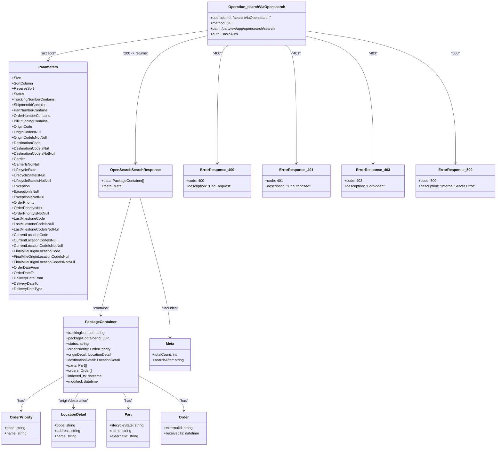

# Diagram: partview_core/partview_service/partview_service/api_definition/paths/partview_search_via_opensearch.yaml

> Auto-generated by Obscura crawlers

## Mermaid

### SVG

<svg id="container" width="2200.115234375" xmlns="http://www.w3.org/2000/svg" class="classDiagram" height="1990" viewBox="0 0 2200.115234375 1990" role="graphics-document document" aria-roledescription="class"><g><defs><marker id="container_class-aggregationStart" class="marker aggregation class" refX="18" refY="7" markerWidth="190" markerHeight="240" orient="auto"><path d="M 18,7 L9,13 L1,7 L9,1 Z"></path></marker></defs><defs><marker id="container_class-aggregationEnd" class="marker aggregation class" refX="1" refY="7" markerWidth="20" markerHeight="28" orient="auto"><path d="M 18,7 L9,13 L1,7 L9,1 Z"></path></marker></defs><defs><marker id="container_class-extensionStart" class="marker extension class" refX="18" refY="7" markerWidth="190" markerHeight="240" orient="auto"><path d="M 1,7 L18,13 V 1 Z"></path></marker></defs><defs><marker id="container_class-extensionEnd" class="marker extension class" refX="1" refY="7" markerWidth="20" markerHeight="28" orient="auto"><path d="M 1,1 V 13 L18,7 Z"></path></marker></defs><defs><marker id="container_class-compositionStart" class="marker composition class" refX="18" refY="7" markerWidth="190" markerHeight="240" orient="auto"><path d="M 18,7 L9,13 L1,7 L9,1 Z"></path></marker></defs><defs><marker id="container_class-compositionEnd" class="marker composition class" refX="1" refY="7" markerWidth="20" markerHeight="28" orient="auto"><path d="M 18,7 L9,13 L1,7 L9,1 Z"></path></marker></defs><defs><marker id="container_class-dependencyStart" class="marker dependency class" refX="6" refY="7" markerWidth="190" markerHeight="240" orient="auto"><path d="M 5,7 L9,13 L1,7 L9,1 Z"></path></marker></defs><defs><marker id="container_class-dependencyEnd" class="marker dependency class" refX="13" refY="7" markerWidth="20" markerHeight="28" orient="auto"><path d="M 18,7 L9,13 L14,7 L9,1 Z"></path></marker></defs><defs><marker id="container_class-lollipopStart" class="marker lollipop class" refX="13" refY="7" markerWidth="190" markerHeight="240" orient="auto"><circle stroke="black" fill="transparent" cx="7" cy="7" r="6"></circle></marker></defs><defs><marker id="container_class-lollipopEnd" class="marker lollipop class" refX="1" refY="7" markerWidth="190" markerHeight="240" orient="auto"><circle stroke="black" fill="transparent" cx="7" cy="7" r="6"></circle></marker></defs><g class="root"><g class="clusters"></g><g class="edgePaths"><path d="M908.947,136.423L793.803,153.186C678.66,169.949,448.372,203.474,333.228,225.404C218.084,247.333,218.084,257.667,218.084,262.833L218.084,268" id="id_Operation_searchViaOpensearch_Parameters_1" class="edge-thickness-normal edge-pattern-solid relation" style=";;;" data-edge="true" data-et="edge" data-id="id_Operation_searchViaOpensearch_Parameters_1" data-points="W3sieCI6OTA4Ljk0NzI2NTYyNSwieSI6MTM2LjQyMzE0MzAzMzA2MDI2fSx7IngiOjIxOC4wODM5ODQzNzUsInkiOjIzN30seyJ4IjoyMTguMDgzOTg0Mzc1LCJ5IjoyNzR9XQ==" marker-end="url(#container_class-dependencyEnd)"></path><path d="M908.947,159.738L857.493,172.615C806.04,185.492,703.132,211.246,651.678,305.29C600.225,399.333,600.225,561.667,600.225,642.833L600.225,724" id="id_Operation_searchViaOpensearch_OpenSearchSearchResponse_2" class="edge-thickness-normal edge-pattern-solid relation" style=";;;" data-edge="true" data-et="edge" data-id="id_Operation_searchViaOpensearch_OpenSearchSearchResponse_2" data-points="W3sieCI6OTA4Ljk0NzI2NTYyNSwieSI6MTU5LjczNzY0NDA2Njc5OTk2fSx7IngiOjYwMC4yMjQ2MDkzNzUsInkiOjIzN30seyJ4Ijo2MDAuMjI0NjA5Mzc1LCJ5Ijo3MzB9XQ==" marker-end="url(#container_class-dependencyEnd)"></path><path d="M580.52,874L558.034,956.167C535.547,1038.333,490.575,1202.667,468.088,1290C445.602,1377.333,445.602,1387.667,445.602,1392.833L445.602,1398" id="id_OpenSearchSearchResponse_PackageContainer_3" class="edge-thickness-normal edge-pattern-solid relation" style=";;;" data-edge="true" data-et="edge" data-id="id_OpenSearchSearchResponse_PackageContainer_3" data-points="W3sieCI6NTgwLjUyMDQzMzQ5MDA0NDMsInkiOjg3NH0seyJ4Ijo0NDUuNjAxNTYyNSwieSI6MTM2N30seyJ4Ijo0NDUuNjAxNTYyNSwieSI6MTQwNH1d" marker-end="url(#container_class-dependencyEnd)"></path><path d="M277.539,1669.79L246.831,1687.659C216.122,1705.527,154.706,1741.263,123.997,1766.298C93.289,1791.333,93.289,1805.667,93.289,1812.833L93.289,1820" id="id_PackageContainer_OrderPriority_4" class="edge-thickness-normal edge-pattern-solid relation" style=";;;" data-edge="true" data-et="edge" data-id="id_PackageContainer_OrderPriority_4" data-points="W3sieCI6Mjc3LjUzOTA2MjUsInkiOjE2NjkuNzkwNDkxMzk2MTMyN30seyJ4Ijo5My4yODkwNjI1LCJ5IjoxNzc3fSx7IngiOjkzLjI4OTA2MjUsInkiOjE4MjZ9XQ==" marker-end="url(#container_class-dependencyEnd)"></path><path d="M346.207,1740L342.558,1746.167C338.91,1752.333,331.613,1764.667,327.965,1776C324.316,1787.333,324.316,1797.667,324.316,1802.833L324.316,1808" id="id_PackageContainer_LocationDetail_5" class="edge-thickness-normal edge-pattern-solid relation" style=";;;" data-edge="true" data-et="edge" data-id="id_PackageContainer_LocationDetail_5" data-points="W3sieCI6MzQ2LjIwNjg5Nzg2NTg1MzY1LCJ5IjoxNzQwfSx7IngiOjMyNC4zMTY0MDYyNSwieSI6MTc3N30seyJ4IjozMjQuMzE2NDA2MjUsInkiOjE4MTR9XQ==" marker-end="url(#container_class-dependencyEnd)"></path><path d="M544.996,1740L548.645,1746.167C552.293,1752.333,559.59,1764.667,563.238,1776C566.887,1787.333,566.887,1797.667,566.887,1802.833L566.887,1808" id="id_PackageContainer_Part_6" class="edge-thickness-normal edge-pattern-solid relation" style=";;;" data-edge="true" data-et="edge" data-id="id_PackageContainer_Part_6" data-points="W3sieCI6NTQ0Ljk5NjIyNzEzNDE0NjQsInkiOjE3NDB9LHsieCI6NTY2Ljg4NjcxODc1LCJ5IjoxNzc3fSx7IngiOjU2Ni44ODY3MTg3NSwieSI6MTgxNH1d" marker-end="url(#container_class-dependencyEnd)"></path><path d="M613.664,1665.305L647.195,1683.921C680.727,1702.537,747.789,1739.768,781.32,1765.551C814.852,1791.333,814.852,1805.667,814.852,1812.833L814.852,1820" id="id_PackageContainer_Order_7" class="edge-thickness-normal edge-pattern-solid relation" style=";;;" data-edge="true" data-et="edge" data-id="id_PackageContainer_Order_7" data-points="W3sieCI6NjEzLjY2NDA2MjUsInkiOjE2NjUuMzA0ODQwODkzNzAzNH0seyJ4Ijo4MTQuODUxNTYyNSwieSI6MTc3N30seyJ4Ijo4MTQuODUxNTYyNSwieSI6MTgyNn1d" marker-end="url(#container_class-dependencyEnd)"></path><path d="M619.929,874L642.415,956.167C664.902,1038.333,709.875,1202.667,732.361,1306C754.848,1409.333,754.848,1451.667,754.848,1472.833L754.848,1494" id="id_OpenSearchSearchResponse_Meta_8" class="edge-thickness-normal edge-pattern-solid relation" style=";;;" data-edge="true" data-et="edge" data-id="id_OpenSearchSearchResponse_Meta_8" data-points="W3sieCI6NjE5LjkyODc4NTI1OTk1NTcsInkiOjg3NH0seyJ4Ijo3NTQuODQ3NjU2MjUsInkiOjEzNjd9LHsieCI6NzU0Ljg0NzY1NjI1LCJ5IjoxNTAwfV0=" marker-end="url(#container_class-dependencyEnd)"></path><path d="M1005.312,200L997.196,206.167C989.08,212.333,972.848,224.667,964.731,312C956.615,399.333,956.615,561.667,956.615,642.833L956.615,724" id="id_Operation_searchViaOpensearch_ErrorResponse_400_9" class="edge-thickness-normal edge-pattern-solid relation" style=";;;" data-edge="true" data-et="edge" data-id="id_Operation_searchViaOpensearch_ErrorResponse_400_9" data-points="W3sieCI6MTAwNS4zMTI0ODUzMTQ4NDk2LCJ5IjoyMDB9LHsieCI6OTU2LjYxNTIzNDM3NSwieSI6MjM3fSx7IngiOjk1Ni42MTUyMzQzNzUsInkiOjczMH1d" marker-end="url(#container_class-dependencyEnd)"></path><path d="M1258.012,200L1266.128,206.167C1274.244,212.333,1290.477,224.667,1298.593,312C1306.709,399.333,1306.709,561.667,1306.709,642.833L1306.709,724" id="id_Operation_searchViaOpensearch_ErrorResponse_401_10" class="edge-thickness-normal edge-pattern-solid relation" style=";;;" data-edge="true" data-et="edge" data-id="id_Operation_searchViaOpensearch_ErrorResponse_401_10" data-points="W3sieCI6MTI1OC4wMTE3MzM0MzUxNTAzLCJ5IjoyMDB9LHsieCI6MTMwNi43MDg5ODQzNzUsInkiOjIzN30seyJ4IjoxMzA2LjcwODk4NDM3NSwieSI6NzMwfV0=" marker-end="url(#container_class-dependencyEnd)"></path><path d="M1354.377,161.373L1403.307,173.977C1452.236,186.582,1550.096,211.791,1599.025,305.562C1647.955,399.333,1647.955,561.667,1647.955,642.833L1647.955,724" id="id_Operation_searchViaOpensearch_ErrorResponse_403_11" class="edge-thickness-normal edge-pattern-solid relation" style=";;;" data-edge="true" data-et="edge" data-id="id_Operation_searchViaOpensearch_ErrorResponse_403_11" data-points="W3sieCI6MTM1NC4zNzY5NTMxMjUsInkiOjE2MS4zNzI2MDgyMTIwODg5fSx7IngiOjE2NDcuOTU1MDc4MTI1LCJ5IjoyMzd9LHsieCI6MTY0Ny45NTUwNzgxMjUsInkiOjczMH1d" marker-end="url(#container_class-dependencyEnd)"></path><path d="M1354.377,137.538L1464.458,154.115C1574.538,170.692,1794.7,203.846,1904.781,301.59C2014.861,399.333,2014.861,561.667,2014.861,642.833L2014.861,724" id="id_Operation_searchViaOpensearch_ErrorResponse_500_12" class="edge-thickness-normal edge-pattern-solid relation" style=";;;" data-edge="true" data-et="edge" data-id="id_Operation_searchViaOpensearch_ErrorResponse_500_12" data-points="W3sieCI6MTM1NC4zNzY5NTMxMjUsInkiOjEzNy41MzgzODM2Mjg0MTA1N30seyJ4IjoyMDE0Ljg2MTMyODEyNSwieSI6MjM3fSx7IngiOjIwMTQuODYxMzI4MTI1LCJ5Ijo3MzB9XQ==" marker-end="url(#container_class-dependencyEnd)"></path></g><g class="edgeLabels"><g class="edgeLabel" transform="translate(218.083984375, 237)"><g class="label" data-id="id_Operation_searchViaOpensearch_Parameters_1" transform="translate(-33.5625, -12)"><foreignObject width="67.125" height="24">

"accepts"

</foreignObject></g></g><g class="edgeLabel" transform="translate(600.224609375, 237)"><g class="label" data-id="id_Operation_searchViaOpensearch_OpenSearchSearchResponse_2" transform="translate(-56.8828125, -12)"><foreignObject width="113.765625" height="24">

"200 -&gt; returns"

</foreignObject></g></g><g class="edgeLabel" transform="translate(445.6015625, 1367)"><g class="label" data-id="id_OpenSearchSearchResponse_PackageContainer_3" transform="translate(-37.078125, -12)"><foreignObject width="74.15625" height="24">

"contains"

</foreignObject></g></g><g class="edgeLabel" transform="translate(93.2890625, 1777)"><g class="label" data-id="id_PackageContainer_OrderPriority_4" transform="translate(-18.9609375, -12)"><foreignObject width="37.921875" height="24">

"has"

</foreignObject></g></g><g class="edgeLabel" transform="translate(324.31640625, 1777)"><g class="label" data-id="id_PackageContainer_LocationDetail_5" transform="translate(-72.6796875, -12)"><foreignObject width="145.359375" height="24">

"origin/destination"

</foreignObject></g></g><g class="edgeLabel" transform="translate(566.88671875, 1777)"><g class="label" data-id="id_PackageContainer_Part_6" transform="translate(-18.9609375, -12)"><foreignObject width="37.921875" height="24">

"has"

</foreignObject></g></g><g class="edgeLabel" transform="translate(814.8515625, 1777)"><g class="label" data-id="id_PackageContainer_Order_7" transform="translate(-18.9609375, -12)"><foreignObject width="37.921875" height="24">

"has"

</foreignObject></g></g><g class="edgeLabel" transform="translate(754.84765625, 1367)"><g class="label" data-id="id_OpenSearchSearchResponse_Meta_8" transform="translate(-36.9140625, -12)"><foreignObject width="73.828125" height="24">

"includes"

</foreignObject></g></g><g class="edgeLabel" transform="translate(956.615234375, 237)"><g class="label" data-id="id_Operation_searchViaOpensearch_ErrorResponse_400_9" transform="translate(-19.171875, -12)"><foreignObject width="38.34375" height="24">

"400"

</foreignObject></g></g><g class="edgeLabel" transform="translate(1306.708984375, 237)"><g class="label" data-id="id_Operation_searchViaOpensearch_ErrorResponse_401_10" transform="translate(-18.0546875, -12)"><foreignObject width="36.109375" height="24">

"401"

</foreignObject></g></g><g class="edgeLabel" transform="translate(1647.955078125, 237)"><g class="label" data-id="id_Operation_searchViaOpensearch_ErrorResponse_403_11" transform="translate(-18.703125, -12)"><foreignObject width="37.40625" height="24">

"403"

</foreignObject></g></g><g class="edgeLabel" transform="translate(2014.861328125, 237)"><g class="label" data-id="id_Operation_searchViaOpensearch_ErrorResponse_500_12" transform="translate(-19.2421875, -12)"><foreignObject width="38.484375" height="24">

"500"

</foreignObject></g></g></g><g class="nodes"><g class="node default" id="classId-Operation_searchViaOpensearch-0" transform="translate(1131.662109375, 104)"><g class="basic label-container"><path d="M-222.71484375 -96 L222.71484375 -96 L222.71484375 96 L-222.71484375 96" stroke="none" stroke-width="0" fill="#ECECFF" style=""></path><path d="M-222.71484375 -96 C-129.04259847797968 -96, -35.37035320595936 -96, 222.71484375 -96 M-222.71484375 -96 C-123.78123130566517 -96, -24.847618861330346 -96, 222.71484375 -96 M222.71484375 -96 C222.71484375 -24.00529432976984, 222.71484375 47.98941134046032, 222.71484375 96 M222.71484375 -96 C222.71484375 -56.05299181859726, 222.71484375 -16.105983637194527, 222.71484375 96 M222.71484375 96 C56.39729680769605 96, -109.9202501346079 96, -222.71484375 96 M222.71484375 96 C108.45661495473666 96, -5.80161384052667 96, -222.71484375 96 M-222.71484375 96 C-222.71484375 52.035993264852856, -222.71484375 8.071986529705711, -222.71484375 -96 M-222.71484375 96 C-222.71484375 35.43950833887179, -222.71484375 -25.12098332225642, -222.71484375 -96" stroke="#9370DB" stroke-width="1.3" fill="none" stroke-dasharray="0 0" style=""></path></g><g class="annotation-group text" transform="translate(0, -72)"></g><g class="label-group text" transform="translate(-119.3671875, -72)"><g class="label" style="font-weight: bolder" transform="translate(0,-12)"><foreignObject width="238.734375" height="24">

Operation_searchViaOpensearch

</foreignObject></g></g><g class="members-group text" transform="translate(-210.71484375, -24)"><g class="label" style="" transform="translate(0,-12)"><foreignObject width="269.40625" height="24">

+operationId: "searchViaOpensearch"

</foreignObject></g><g class="label" style="" transform="translate(0,12)"><foreignObject width="99.5" height="24">

+method: GET

</foreignObject></g><g class="label" style="" transform="translate(0,36)"><foreignObject width="302.0625" height="24">

+path: /partview/app/opensearch/search

</foreignObject></g><g class="label" style="" transform="translate(0,60)"><foreignObject width="120.53125" height="24">

+auth: BasicAuth

</foreignObject></g></g><g class="methods-group text" transform="translate(-210.71484375, 96)"></g><g class="divider" style=""><path d="M-222.71484375 -48 C-51.61635776979841 -48, 119.48212821040318 -48, 222.71484375 -48 M-222.71484375 -48 C-63.69337319988364 -48, 95.32809735023272 -48, 222.71484375 -48" stroke="#9370DB" stroke-width="1.3" fill="none" stroke-dasharray="0 0" style=""></path></g><g class="divider" style=""><path d="M-222.71484375 72 C-125.30715426481295 72, -27.8994647796259 72, 222.71484375 72 M-222.71484375 72 C-51.901602521873315 72, 118.91163870625337 72, 222.71484375 72" stroke="#9370DB" stroke-width="1.3" fill="none" stroke-dasharray="0 0" style=""></path></g></g><g class="node default" id="classId-Parameters-1" transform="translate(218.083984375, 802)"><g class="basic label-container"><path d="M-174.25 -528 L174.25 -528 L174.25 528 L-174.25 528" stroke="none" stroke-width="0" fill="#ECECFF" style=""></path><path d="M-174.25 -528 C-39.8066733125799 -528, 94.6366533748402 -528, 174.25 -528 M-174.25 -528 C-93.46822740963192 -528, -12.686454819263844 -528, 174.25 -528 M174.25 -528 C174.25 -184.67960185919748, 174.25 158.64079628160505, 174.25 528 M174.25 -528 C174.25 -149.27721004945295, 174.25 229.4455799010941, 174.25 528 M174.25 528 C41.53004286999234 528, -91.18991426001531 528, -174.25 528 M174.25 528 C52.701501735458635 528, -68.84699652908273 528, -174.25 528 M-174.25 528 C-174.25 282.85813171884524, -174.25 37.716263437690486, -174.25 -528 M-174.25 528 C-174.25 199.46499902750298, -174.25 -129.07000194499403, -174.25 -528" stroke="#9370DB" stroke-width="1.3" fill="none" stroke-dasharray="0 0" style=""></path></g><g class="annotation-group text" transform="translate(0, -504)"></g><g class="label-group text" transform="translate(-41.59375, -504)"><g class="label" style="font-weight: bolder" transform="translate(0,-12)"><foreignObject width="83.1875" height="24">

Parameters

</foreignObject></g></g><g class="members-group text" transform="translate(-162.25, -456)"><g class="label" style="" transform="translate(0,-12)"><foreignObject width="36.1875" height="24">

+Size

</foreignObject></g><g class="label" style="" transform="translate(0,12)"><foreignObject width="92.4375" height="24">

+SortColumn

</foreignObject></g><g class="label" style="" transform="translate(0,36)"><foreignObject width="94.765625" height="24">

+ReverseSort

</foreignObject></g><g class="label" style="" transform="translate(0,60)"><foreignObject width="53" height="24">

+Status

</foreignObject></g><g class="label" style="" transform="translate(0,84)"><foreignObject width="188.796875" height="24">

+TrackingNumberContains

</foreignObject></g><g class="label" style="" transform="translate(0,108)"><foreignObject width="154.421875" height="24">

+ShipmentIdContains

</foreignObject></g><g class="label" style="" transform="translate(0,132)"><foreignObject width="158.5" height="24">

+PartNumberContains

</foreignObject></g><g class="label" style="" transform="translate(0,156)"><foreignObject width="170.671875" height="24">

+OrderNumberContains

</foreignObject></g><g class="label" style="" transform="translate(0,180)"><foreignObject width="159.421875" height="24">

+BillOfLadingContains

</foreignObject></g><g class="label" style="" transform="translate(0,204)"><foreignObject width="88.234375" height="24">

+OriginCode

</foreignObject></g><g class="label" style="" transform="translate(0,228)"><foreignObject width="130.046875" height="24">

+OriginCodeIsNull

</foreignObject></g><g class="label" style="" transform="translate(0,252)"><foreignObject width="156.09375" height="24">

+OriginCodeIsNotNull

</foreignObject></g><g class="label" style="" transform="translate(0,276)"><foreignObject width="128.140625" height="24">

+DestinationCode

</foreignObject></g><g class="label" style="" transform="translate(0,300)"><foreignObject width="169.9375" height="24">

+DestinationCodeIsNull

</foreignObject></g><g class="label" style="" transform="translate(0,324)"><foreignObject width="196" height="24">

+DestinationCodeIsNotNull

</foreignObject></g><g class="label" style="" transform="translate(0,348)"><foreignObject width="57.25" height="24">

+Carrier

</foreignObject></g><g class="label" style="" transform="translate(0,372)"><foreignObject width="125.109375" height="24">

+CarrierIsNotNull

</foreignObject></g><g class="label" style="" transform="translate(0,396)"><foreignObject width="108.171875" height="24">

+LifecycleState

</foreignObject></g><g class="label" style="" transform="translate(0,420)"><foreignObject width="149.96875" height="24">

+LifecycleStateIsNull

</foreignObject></g><g class="label" style="" transform="translate(0,444)"><foreignObject width="176.03125" height="24">

+LifecycleStateIsNotNull

</foreignObject></g><g class="label" style="" transform="translate(0,468)"><foreignObject width="78.734375" height="24">

+Exception

</foreignObject></g><g class="label" style="" transform="translate(0,492)"><foreignObject width="120.53125" height="24">

+ExceptionIsNull

</foreignObject></g><g class="label" style="" transform="translate(0,516)"><foreignObject width="146.578125" height="24">

+ExceptionIsNotNull

</foreignObject></g><g class="label" style="" transform="translate(0,540)"><foreignObject width="102.484375" height="24">

+OrderPriority

</foreignObject></g><g class="label" style="" transform="translate(0,564)"><foreignObject width="144.296875" height="24">

+OrderPriorityIsNull

</foreignObject></g><g class="label" style="" transform="translate(0,588)"><foreignObject width="170.34375" height="24">

+OrderPriorityIsNotNull

</foreignObject></g><g class="label" style="" transform="translate(0,612)"><foreignObject width="144.59375" height="24">

+LastMilestoneCode

</foreignObject></g><g class="label" style="" transform="translate(0,636)"><foreignObject width="186.40625" height="24">

+LastMilestoneCodeIsNull

</foreignObject></g><g class="label" style="" transform="translate(0,660)"><foreignObject width="212.453125" height="24">

+LastMilestoneCodeIsNotNull

</foreignObject></g><g class="label" style="" transform="translate(0,684)"><foreignObject width="160.125" height="24">

+CurrentLocationCode

</foreignObject></g><g class="label" style="" transform="translate(0,708)"><foreignObject width="201.921875" height="24">

+CurrentLocationCodeIsNull

</foreignObject></g><g class="label" style="" transform="translate(0,732)"><foreignObject width="227.96875" height="24">

+CurrentLocationCodeIsNotNull

</foreignObject></g><g class="label" style="" transform="translate(0,756)"><foreignObject width="215.046875" height="24">

+FinalMileOriginLocationCode

</foreignObject></g><g class="label" style="" transform="translate(0,780)"><foreignObject width="256.859375" height="24">

+FinalMileOriginLocationCodeIsNull

</foreignObject></g><g class="label" style="" transform="translate(0,804)"><foreignObject width="282.90625" height="24">

+FinalMileOriginLocationCodeIsNotNull

</foreignObject></g><g class="label" style="" transform="translate(0,828)"><foreignObject width="118.375" height="24">

+OrderDateFrom

</foreignObject></g><g class="label" style="" transform="translate(0,852)"><foreignObject width="99.0625" height="24">

+OrderDateTo

</foreignObject></g><g class="label" style="" transform="translate(0,876)"><foreignObject width="135.9375" height="24">

+DeliveryDateFrom

</foreignObject></g><g class="label" style="" transform="translate(0,900)"><foreignObject width="116.625" height="24">

+DeliveryDateTo

</foreignObject></g><g class="label" style="" transform="translate(0,924)"><foreignObject width="133.625" height="24">

+DeliveryDateType

</foreignObject></g></g><g class="methods-group text" transform="translate(-162.25, 528)"></g><g class="divider" style=""><path d="M-174.25 -480 C-91.48068642640594 -480, -8.711372852811877 -480, 174.25 -480 M-174.25 -480 C-43.10453623508704 -480, 88.04092752982592 -480, 174.25 -480" stroke="#9370DB" stroke-width="1.3" fill="none" stroke-dasharray="0 0" style=""></path></g><g class="divider" style=""><path d="M-174.25 504 C-60.67400925060984 504, 52.901981498780316 504, 174.25 504 M-174.25 504 C-51.83398214537985 504, 70.5820357092403 504, 174.25 504" stroke="#9370DB" stroke-width="1.3" fill="none" stroke-dasharray="0 0" style=""></path></g></g><g class="node default" id="classId-OpenSearchSearchResponse-2" transform="translate(600.224609375, 802)"><g class="basic label-container"><path d="M-157.890625 -72 L157.890625 -72 L157.890625 72 L-157.890625 72" stroke="none" stroke-width="0" fill="#ECECFF" style=""></path><path d="M-157.890625 -72 C-81.80112198695016 -72, -5.711618973900329 -72, 157.890625 -72 M-157.890625 -72 C-47.08942895796392 -72, 63.711767084072164 -72, 157.890625 -72 M157.890625 -72 C157.890625 -26.150045563784488, 157.890625 19.699908872431024, 157.890625 72 M157.890625 -72 C157.890625 -31.152464894705687, 157.890625 9.695070210588625, 157.890625 72 M157.890625 72 C53.162264488487736 72, -51.56609602302453 72, -157.890625 72 M157.890625 72 C56.08778745111668 72, -45.715050097766635 72, -157.890625 72 M-157.890625 72 C-157.890625 35.989851117100486, -157.890625 -0.020297765799028866, -157.890625 -72 M-157.890625 72 C-157.890625 23.22083657601093, -157.890625 -25.558326847978137, -157.890625 -72" stroke="#9370DB" stroke-width="1.3" fill="none" stroke-dasharray="0 0" style=""></path></g><g class="annotation-group text" transform="translate(0, -48)"></g><g class="label-group text" transform="translate(-104.203125, -48)"><g class="label" style="font-weight: bolder" transform="translate(0,-12)"><foreignObject width="208.40625" height="24">

OpenSearchSearchResponse

</foreignObject></g></g><g class="members-group text" transform="translate(-145.890625, 0)"><g class="label" style="" transform="translate(0,-12)"><foreignObject width="187.578125" height="24">

+data: PackageContainer[]

</foreignObject></g><g class="label" style="" transform="translate(0,12)"><foreignObject width="88.40625" height="24">

+meta: Meta

</foreignObject></g></g><g class="methods-group text" transform="translate(-145.890625, 72)"></g><g class="divider" style=""><path d="M-157.890625 -24 C-69.93446615553599 -24, 18.021692688928027 -24, 157.890625 -24 M-157.890625 -24 C-45.22184696354566 -24, 67.44693107290868 -24, 157.890625 -24" stroke="#9370DB" stroke-width="1.3" fill="none" stroke-dasharray="0 0" style=""></path></g><g class="divider" style=""><path d="M-157.890625 48 C-33.84019543746864 48, 90.21023412506273 48, 157.890625 48 M-157.890625 48 C-83.25682080521042 48, -8.623016610420848 48, 157.890625 48" stroke="#9370DB" stroke-width="1.3" fill="none" stroke-dasharray="0 0" style=""></path></g></g><g class="node default" id="classId-PackageContainer-3" transform="translate(445.6015625, 1572)"><g class="basic label-container"><path d="M-168.0625 -168 L168.0625 -168 L168.0625 168 L-168.0625 168" stroke="none" stroke-width="0" fill="#ECECFF" style=""></path><path d="M-168.0625 -168 C-52.99360613578973 -168, 62.075287728420534 -168, 168.0625 -168 M-168.0625 -168 C-62.0923205776205 -168, 43.877858844759004 -168, 168.0625 -168 M168.0625 -168 C168.0625 -84.83419677585124, 168.0625 -1.6683935517024793, 168.0625 168 M168.0625 -168 C168.0625 -79.27140828033383, 168.0625 9.45718343933234, 168.0625 168 M168.0625 168 C95.19108447970972 168, 22.31966895941943 168, -168.0625 168 M168.0625 168 C73.45532034323912 168, -21.151859313521754 168, -168.0625 168 M-168.0625 168 C-168.0625 78.84731768858566, -168.0625 -10.305364622828677, -168.0625 -168 M-168.0625 168 C-168.0625 74.59867591568339, -168.0625 -18.802648168633226, -168.0625 -168" stroke="#9370DB" stroke-width="1.3" fill="none" stroke-dasharray="0 0" style=""></path></g><g class="annotation-group text" transform="translate(0, -144)"></g><g class="label-group text" transform="translate(-65.453125, -144)"><g class="label" style="font-weight: bolder" transform="translate(0,-12)"><foreignObject width="130.90625" height="24">

PackageContainer

</foreignObject></g></g><g class="members-group text" transform="translate(-156.0625, -96)"><g class="label" style="" transform="translate(0,-12)"><foreignObject width="174.28125" height="24">

+trackingNumber: string

</foreignObject></g><g class="label" style="" transform="translate(0,12)"><foreignObject width="192.546875" height="24">

+packageContainerId: uuid

</foreignObject></g><g class="label" style="" transform="translate(0,36)"><foreignObject width="102.109375" height="24">

+status: string

</foreignObject></g><g class="label" style="" transform="translate(0,60)"><foreignObject width="203.40625" height="24">

+orderPriority: OrderPriority

</foreignObject></g><g class="label" style="" transform="translate(0,84)"><foreignObject width="205.765625" height="24">

+originDetail: LocationDetail

</foreignObject></g><g class="label" style="" transform="translate(0,108)"><foreignObject width="246.671875" height="24">

+destinationDetail: LocationDetail

</foreignObject></g><g class="label" style="" transform="translate(0,132)"><foreignObject width="92.921875" height="24">

+parts: Part[]

</foreignObject></g><g class="label" style="" transform="translate(0,156)"><foreignObject width="114.34375" height="24">

+orders: Order[]

</foreignObject></g><g class="label" style="" transform="translate(0,180)"><foreignObject width="160.5" height="24">

+indexed_ts: datetime

</foreignObject></g><g class="label" style="" transform="translate(0,204)"><foreignObject width="145.9375" height="24">

+modified: datetime

</foreignObject></g></g><g class="methods-group text" transform="translate(-156.0625, 168)"></g><g class="divider" style=""><path d="M-168.0625 -120 C-76.17010898652168 -120, 15.722282026956634 -120, 168.0625 -120 M-168.0625 -120 C-71.8870268576573 -120, 24.288446284685392 -120, 168.0625 -120" stroke="#9370DB" stroke-width="1.3" fill="none" stroke-dasharray="0 0" style=""></path></g><g class="divider" style=""><path d="M-168.0625 144 C-34.47919715592408 144, 99.10410568815183 144, 168.0625 144 M-168.0625 144 C-96.94181710987378 144, -25.821134219747563 144, 168.0625 144" stroke="#9370DB" stroke-width="1.3" fill="none" stroke-dasharray="0 0" style=""></path></g></g><g class="node default" id="classId-OrderPriority-4" transform="translate(93.2890625, 1898)"><g class="basic label-container"><path d="M-85.2890625 -72 L85.2890625 -72 L85.2890625 72 L-85.2890625 72" stroke="none" stroke-width="0" fill="#ECECFF" style=""></path><path d="M-85.2890625 -72 C-48.329600858328845 -72, -11.370139216657691 -72, 85.2890625 -72 M-85.2890625 -72 C-48.95561500334829 -72, -12.622167506696584 -72, 85.2890625 -72 M85.2890625 -72 C85.2890625 -28.214356643489815, 85.2890625 15.57128671302037, 85.2890625 72 M85.2890625 -72 C85.2890625 -25.342307463556978, 85.2890625 21.315385072886045, 85.2890625 72 M85.2890625 72 C22.706293403347857 72, -39.876475693304286 72, -85.2890625 72 M85.2890625 72 C49.18550259077621 72, 13.08194268155242 72, -85.2890625 72 M-85.2890625 72 C-85.2890625 38.132468152659015, -85.2890625 4.264936305318031, -85.2890625 -72 M-85.2890625 72 C-85.2890625 42.850930809873454, -85.2890625 13.701861619746907, -85.2890625 -72" stroke="#9370DB" stroke-width="1.3" fill="none" stroke-dasharray="0 0" style=""></path></g><g class="annotation-group text" transform="translate(0, -48)"></g><g class="label-group text" transform="translate(-48.359375, -48)"><g class="label" style="font-weight: bolder" transform="translate(0,-12)"><foreignObject width="96.71875" height="24">

OrderPriority

</foreignObject></g></g><g class="members-group text" transform="translate(-73.2890625, 0)"><g class="label" style="" transform="translate(0,-12)"><foreignObject width="92.65625" height="24">

+code: string

</foreignObject></g><g class="label" style="" transform="translate(0,12)"><foreignObject width="98.21875" height="24">

+name: string

</foreignObject></g></g><g class="methods-group text" transform="translate(-73.2890625, 72)"></g><g class="divider" style=""><path d="M-85.2890625 -24 C-27.001472737012598 -24, 31.286117025974804 -24, 85.2890625 -24 M-85.2890625 -24 C-32.479360695476096 -24, 20.330341109047808 -24, 85.2890625 -24" stroke="#9370DB" stroke-width="1.3" fill="none" stroke-dasharray="0 0" style=""></path></g><g class="divider" style=""><path d="M-85.2890625 48 C-50.545901507834074 48, -15.802740515668148 48, 85.2890625 48 M-85.2890625 48 C-37.493818568984985 48, 10.301425362030031 48, 85.2890625 48" stroke="#9370DB" stroke-width="1.3" fill="none" stroke-dasharray="0 0" style=""></path></g></g><g class="node default" id="classId-LocationDetail-5" transform="translate(324.31640625, 1898)"><g class="basic label-container"><path d="M-95.73828125 -84 L95.73828125 -84 L95.73828125 84 L-95.73828125 84" stroke="none" stroke-width="0" fill="#ECECFF" style=""></path><path d="M-95.73828125 -84 C-36.507990013990245 -84, 22.72230122201951 -84, 95.73828125 -84 M-95.73828125 -84 C-49.048081349581906 -84, -2.3578814491638127 -84, 95.73828125 -84 M95.73828125 -84 C95.73828125 -40.60775242167914, 95.73828125 2.784495156641725, 95.73828125 84 M95.73828125 -84 C95.73828125 -41.506613250467815, 95.73828125 0.9867734990643697, 95.73828125 84 M95.73828125 84 C56.707032310399555 84, 17.67578337079911 84, -95.73828125 84 M95.73828125 84 C40.755106061475395 84, -14.22806912704921 84, -95.73828125 84 M-95.73828125 84 C-95.73828125 18.238667098547253, -95.73828125 -47.52266580290549, -95.73828125 -84 M-95.73828125 84 C-95.73828125 39.800323256185415, -95.73828125 -4.3993534876291704, -95.73828125 -84" stroke="#9370DB" stroke-width="1.3" fill="none" stroke-dasharray="0 0" style=""></path></g><g class="annotation-group text" transform="translate(0, -60)"></g><g class="label-group text" transform="translate(-52.9765625, -60)"><g class="label" style="font-weight: bolder" transform="translate(0,-12)"><foreignObject width="105.953125" height="24">

LocationDetail

</foreignObject></g></g><g class="members-group text" transform="translate(-83.73828125, -12)"><g class="label" style="" transform="translate(0,-12)"><foreignObject width="92.65625" height="24">

+code: string

</foreignObject></g><g class="label" style="" transform="translate(0,12)"><foreignObject width="114.5" height="24">

+address: string

</foreignObject></g><g class="label" style="" transform="translate(0,36)"><foreignObject width="98.21875" height="24">

+name: string

</foreignObject></g></g><g class="methods-group text" transform="translate(-83.73828125, 84)"></g><g class="divider" style=""><path d="M-95.73828125 -36 C-24.986801028030783 -36, 45.764679193938434 -36, 95.73828125 -36 M-95.73828125 -36 C-34.00441393963588 -36, 27.729453370728237 -36, 95.73828125 -36" stroke="#9370DB" stroke-width="1.3" fill="none" stroke-dasharray="0 0" style=""></path></g><g class="divider" style=""><path d="M-95.73828125 60 C-35.01383820429348 60, 25.710604841413044 60, 95.73828125 60 M-95.73828125 60 C-56.80038947244857 60, -17.862497694897144 60, 95.73828125 60" stroke="#9370DB" stroke-width="1.3" fill="none" stroke-dasharray="0 0" style=""></path></g></g><g class="node default" id="classId-Part-6" transform="translate(566.88671875, 1898)"><g class="basic label-container"><path d="M-96.83203125 -84 L96.83203125 -84 L96.83203125 84 L-96.83203125 84" stroke="none" stroke-width="0" fill="#ECECFF" style=""></path><path d="M-96.83203125 -84 C-22.502061329400576 -84, 51.82790859119885 -84, 96.83203125 -84 M-96.83203125 -84 C-35.743358952559014 -84, 25.345313344881973 -84, 96.83203125 -84 M96.83203125 -84 C96.83203125 -31.941074275170642, 96.83203125 20.117851449658716, 96.83203125 84 M96.83203125 -84 C96.83203125 -25.7278319972052, 96.83203125 32.5443360055896, 96.83203125 84 M96.83203125 84 C28.29147659648737 84, -40.24907805702526 84, -96.83203125 84 M96.83203125 84 C43.19269265266852 84, -10.446645944662961 84, -96.83203125 84 M-96.83203125 84 C-96.83203125 23.376831847227294, -96.83203125 -37.24633630554541, -96.83203125 -84 M-96.83203125 84 C-96.83203125 38.76918380802873, -96.83203125 -6.461632383942543, -96.83203125 -84" stroke="#9370DB" stroke-width="1.3" fill="none" stroke-dasharray="0 0" style=""></path></g><g class="annotation-group text" transform="translate(0, -60)"></g><g class="label-group text" transform="translate(-15.0703125, -60)"><g class="label" style="font-weight: bolder" transform="translate(0,-12)"><foreignObject width="30.140625" height="24">

Part

</foreignObject></g></g><g class="members-group text" transform="translate(-84.83203125, -12)"><g class="label" style="" transform="translate(0,-12)"><foreignObject width="154.59375" height="24">

+lifecycleState: string

</foreignObject></g><g class="label" style="" transform="translate(0,12)"><foreignObject width="98.21875" height="24">

+name: string

</foreignObject></g><g class="label" style="" transform="translate(0,36)"><foreignObject width="131.375" height="24">

+externalId: string

</foreignObject></g></g><g class="methods-group text" transform="translate(-84.83203125, 84)"></g><g class="divider" style=""><path d="M-96.83203125 -36 C-51.68108772287678 -36, -6.530144195753564 -36, 96.83203125 -36 M-96.83203125 -36 C-57.05851590528393 -36, -17.285000560567866 -36, 96.83203125 -36" stroke="#9370DB" stroke-width="1.3" fill="none" stroke-dasharray="0 0" style=""></path></g><g class="divider" style=""><path d="M-96.83203125 60 C-49.02824048509668 60, -1.2244497201933626 60, 96.83203125 60 M-96.83203125 60 C-56.31840123917778 60, -15.804771228355563 60, 96.83203125 60" stroke="#9370DB" stroke-width="1.3" fill="none" stroke-dasharray="0 0" style=""></path></g></g><g class="node default" id="classId-Order-7" transform="translate(814.8515625, 1898)"><g class="basic label-container"><path d="M-101.1328125 -72 L101.1328125 -72 L101.1328125 72 L-101.1328125 72" stroke="none" stroke-width="0" fill="#ECECFF" style=""></path><path d="M-101.1328125 -72 C-24.998663474313545 -72, 51.13548555137291 -72, 101.1328125 -72 M-101.1328125 -72 C-55.22033917085498 -72, -9.307865841709955 -72, 101.1328125 -72 M101.1328125 -72 C101.1328125 -38.910283281805626, 101.1328125 -5.820566563611251, 101.1328125 72 M101.1328125 -72 C101.1328125 -20.392019265851452, 101.1328125 31.215961468297095, 101.1328125 72 M101.1328125 72 C52.403265564879675 72, 3.6737186297593496 72, -101.1328125 72 M101.1328125 72 C30.185453724380338 72, -40.761905051239324 72, -101.1328125 72 M-101.1328125 72 C-101.1328125 39.0848483797875, -101.1328125 6.169696759575004, -101.1328125 -72 M-101.1328125 72 C-101.1328125 23.35287113549198, -101.1328125 -25.29425772901604, -101.1328125 -72" stroke="#9370DB" stroke-width="1.3" fill="none" stroke-dasharray="0 0" style=""></path></g><g class="annotation-group text" transform="translate(0, -48)"></g><g class="label-group text" transform="translate(-20.921875, -48)"><g class="label" style="font-weight: bolder" transform="translate(0,-12)"><foreignObject width="41.84375" height="24">

Order

</foreignObject></g></g><g class="members-group text" transform="translate(-89.1328125, 0)"><g class="label" style="" transform="translate(0,-12)"><foreignObject width="131.375" height="24">

+externalId: string

</foreignObject></g><g class="label" style="" transform="translate(0,12)"><foreignObject width="157.34375" height="24">

+receivedTs: datetime

</foreignObject></g></g><g class="methods-group text" transform="translate(-89.1328125, 72)"></g><g class="divider" style=""><path d="M-101.1328125 -24 C-21.4740513761472 -24, 58.1847097477056 -24, 101.1328125 -24 M-101.1328125 -24 C-53.84904504368411 -24, -6.5652775873682145 -24, 101.1328125 -24" stroke="#9370DB" stroke-width="1.3" fill="none" stroke-dasharray="0 0" style=""></path></g><g class="divider" style=""><path d="M-101.1328125 48 C-60.01051009175413 48, -18.888207683508256 48, 101.1328125 48 M-101.1328125 48 C-45.16420983622563 48, 10.804392827548739 48, 101.1328125 48" stroke="#9370DB" stroke-width="1.3" fill="none" stroke-dasharray="0 0" style=""></path></g></g><g class="node default" id="classId-Meta-8" transform="translate(754.84765625, 1572)"><g class="basic label-container"><path d="M-91.18359375 -72 L91.18359375 -72 L91.18359375 72 L-91.18359375 72" stroke="none" stroke-width="0" fill="#ECECFF" style=""></path><path d="M-91.18359375 -72 C-39.45744406237758 -72, 12.268705625244834 -72, 91.18359375 -72 M-91.18359375 -72 C-49.620143288143474 -72, -8.056692826286948 -72, 91.18359375 -72 M91.18359375 -72 C91.18359375 -37.04232577028732, 91.18359375 -2.08465154057464, 91.18359375 72 M91.18359375 -72 C91.18359375 -34.60944417972165, 91.18359375 2.781111640556702, 91.18359375 72 M91.18359375 72 C31.57365327271681 72, -28.036287204566378 72, -91.18359375 72 M91.18359375 72 C49.77577740316881 72, 8.36796105633762 72, -91.18359375 72 M-91.18359375 72 C-91.18359375 25.807544512892022, -91.18359375 -20.384910974215956, -91.18359375 -72 M-91.18359375 72 C-91.18359375 39.24635831118458, -91.18359375 6.492716622369159, -91.18359375 -72" stroke="#9370DB" stroke-width="1.3" fill="none" stroke-dasharray="0 0" style=""></path></g><g class="annotation-group text" transform="translate(0, -48)"></g><g class="label-group text" transform="translate(-18.0859375, -48)"><g class="label" style="font-weight: bolder" transform="translate(0,-12)"><foreignObject width="36.171875" height="24">

Meta

</foreignObject></g></g><g class="members-group text" transform="translate(-79.18359375, 0)"><g class="label" style="" transform="translate(0,-12)"><foreignObject width="111.9375" height="24">

+totalCount: int

</foreignObject></g><g class="label" style="" transform="translate(0,12)"><foreignObject width="140.28125" height="24">

+searchAfter: string

</foreignObject></g></g><g class="methods-group text" transform="translate(-79.18359375, 72)"></g><g class="divider" style=""><path d="M-91.18359375 -24 C-41.98046680162088 -24, 7.222660146758244 -24, 91.18359375 -24 M-91.18359375 -24 C-32.491513360517565 -24, 26.20056702896487 -24, 91.18359375 -24" stroke="#9370DB" stroke-width="1.3" fill="none" stroke-dasharray="0 0" style=""></path></g><g class="divider" style=""><path d="M-91.18359375 48 C-49.36181103957515 48, -7.540028329150303 48, 91.18359375 48 M-91.18359375 48 C-41.949674902316026 48, 7.2842439453679475 48, 91.18359375 48" stroke="#9370DB" stroke-width="1.3" fill="none" stroke-dasharray="0 0" style=""></path></g></g><g class="node default" id="classId-ErrorResponse_400-9" transform="translate(956.615234375, 802)"><g class="basic label-container"><path d="M-148.5 -72 L148.5 -72 L148.5 72 L-148.5 72" stroke="none" stroke-width="0" fill="#ECECFF" style=""></path><path d="M-148.5 -72 C-52.057390194768516 -72, 44.38521961046297 -72, 148.5 -72 M-148.5 -72 C-60.588820343996545 -72, 27.32235931200691 -72, 148.5 -72 M148.5 -72 C148.5 -31.390718279525814, 148.5 9.218563440948373, 148.5 72 M148.5 -72 C148.5 -36.44261117999886, 148.5 -0.8852223599977265, 148.5 72 M148.5 72 C45.449424289255205 72, -57.60115142148959 72, -148.5 72 M148.5 72 C30.68059012132332 72, -87.13881975735336 72, -148.5 72 M-148.5 72 C-148.5 38.930183947089574, -148.5 5.860367894179149, -148.5 -72 M-148.5 72 C-148.5 39.89286451423815, -148.5 7.785729028476297, -148.5 -72" stroke="#9370DB" stroke-width="1.3" fill="none" stroke-dasharray="0 0" style=""></path></g><g class="annotation-group text" transform="translate(0, -48)"></g><g class="label-group text" transform="translate(-70.546875, -48)"><g class="label" style="font-weight: bolder" transform="translate(0,-12)"><foreignObject width="141.09375" height="24">

ErrorResponse_400

</foreignObject></g></g><g class="members-group text" transform="translate(-136.5, 0)"><g class="label" style="" transform="translate(0,-12)"><foreignObject width="77.40625" height="24">

+code: 400

</foreignObject></g><g class="label" style="" transform="translate(0,12)"><foreignObject width="202.453125" height="24">

+description: "Bad Request"

</foreignObject></g></g><g class="methods-group text" transform="translate(-136.5, 72)"></g><g class="divider" style=""><path d="M-148.5 -24 C-47.781946925628276 -24, 52.93610614874345 -24, 148.5 -24 M-148.5 -24 C-65.43914916279459 -24, 17.621701674410815 -24, 148.5 -24" stroke="#9370DB" stroke-width="1.3" fill="none" stroke-dasharray="0 0" style=""></path></g><g class="divider" style=""><path d="M-148.5 48 C-85.38925105556483 48, -22.278502111129654 48, 148.5 48 M-148.5 48 C-32.14516073907839 48, 84.20967852184322 48, 148.5 48" stroke="#9370DB" stroke-width="1.3" fill="none" stroke-dasharray="0 0" style=""></path></g></g><g class="node default" id="classId-ErrorResponse_401-10" transform="translate(1306.708984375, 802)"><g class="basic label-container"><path d="M-151.59375 -72 L151.59375 -72 L151.59375 72 L-151.59375 72" stroke="none" stroke-width="0" fill="#ECECFF" style=""></path><path d="M-151.59375 -72 C-70.46963341562456 -72, 10.654483168750886 -72, 151.59375 -72 M-151.59375 -72 C-85.87678123173289 -72, -20.159812463465784 -72, 151.59375 -72 M151.59375 -72 C151.59375 -29.14862013780902, 151.59375 13.702759724381963, 151.59375 72 M151.59375 -72 C151.59375 -40.13629624641893, 151.59375 -8.272592492837859, 151.59375 72 M151.59375 72 C36.52407104473622 72, -78.54560791052756 72, -151.59375 72 M151.59375 72 C88.82516639721388 72, 26.05658279442774 72, -151.59375 72 M-151.59375 72 C-151.59375 14.899214660831184, -151.59375 -42.20157067833763, -151.59375 -72 M-151.59375 72 C-151.59375 33.94656038889846, -151.59375 -4.1068792222030766, -151.59375 -72" stroke="#9370DB" stroke-width="1.3" fill="none" stroke-dasharray="0 0" style=""></path></g><g class="annotation-group text" transform="translate(0, -48)"></g><g class="label-group text" transform="translate(-69.40625, -48)"><g class="label" style="font-weight: bolder" transform="translate(0,-12)"><foreignObject width="138.8125" height="24">

ErrorResponse_401

</foreignObject></g></g><g class="members-group text" transform="translate(-139.59375, 0)"><g class="label" style="" transform="translate(0,-12)"><foreignObject width="75" height="24">

+code: 401

</foreignObject></g><g class="label" style="" transform="translate(0,12)"><foreignObject width="209.78125" height="24">

+description: "Unauthorized"

</foreignObject></g></g><g class="methods-group text" transform="translate(-139.59375, 72)"></g><g class="divider" style=""><path d="M-151.59375 -24 C-54.727503824144605 -24, 42.13874235171079 -24, 151.59375 -24 M-151.59375 -24 C-35.91784329038933 -24, 79.75806341922134 -24, 151.59375 -24" stroke="#9370DB" stroke-width="1.3" fill="none" stroke-dasharray="0 0" style=""></path></g><g class="divider" style=""><path d="M-151.59375 48 C-50.408662520184706 48, 50.77642495963059 48, 151.59375 48 M-151.59375 48 C-35.70630364813934 48, 80.18114270372132 48, 151.59375 48" stroke="#9370DB" stroke-width="1.3" fill="none" stroke-dasharray="0 0" style=""></path></g></g><g class="node default" id="classId-ErrorResponse_403-11" transform="translate(1647.955078125, 802)"><g class="basic label-container"><path d="M-139.65234375 -72 L139.65234375 -72 L139.65234375 72 L-139.65234375 72" stroke="none" stroke-width="0" fill="#ECECFF" style=""></path><path d="M-139.65234375 -72 C-53.5941688344556 -72, 32.4640060810888 -72, 139.65234375 -72 M-139.65234375 -72 C-76.69447490829337 -72, -13.736606066586745 -72, 139.65234375 -72 M139.65234375 -72 C139.65234375 -18.005945990426063, 139.65234375 35.98810801914787, 139.65234375 72 M139.65234375 -72 C139.65234375 -16.747262325335974, 139.65234375 38.50547534932805, 139.65234375 72 M139.65234375 72 C42.07593385574121 72, -55.500476038517576 72, -139.65234375 72 M139.65234375 72 C30.835565957785676 72, -77.98121183442865 72, -139.65234375 72 M-139.65234375 72 C-139.65234375 33.221992011324005, -139.65234375 -5.55601597735199, -139.65234375 -72 M-139.65234375 72 C-139.65234375 27.48063930385686, -139.65234375 -17.038721392286277, -139.65234375 -72" stroke="#9370DB" stroke-width="1.3" fill="none" stroke-dasharray="0 0" style=""></path></g><g class="annotation-group text" transform="translate(0, -48)"></g><g class="label-group text" transform="translate(-69.9453125, -48)"><g class="label" style="font-weight: bolder" transform="translate(0,-12)"><foreignObject width="139.890625" height="24">

ErrorResponse_403

</foreignObject></g></g><g class="members-group text" transform="translate(-127.65234375, 0)"><g class="label" style="" transform="translate(0,-12)"><foreignObject width="76.296875" height="24">

+code: 403

</foreignObject></g><g class="label" style="" transform="translate(0,12)"><foreignObject width="185.359375" height="24">

+description: "Forbidden"

</foreignObject></g></g><g class="methods-group text" transform="translate(-127.65234375, 72)"></g><g class="divider" style=""><path d="M-139.65234375 -24 C-40.9123887707038 -24, 57.8275662085924 -24, 139.65234375 -24 M-139.65234375 -24 C-51.26443176664381 -24, 37.12348021671238 -24, 139.65234375 -24" stroke="#9370DB" stroke-width="1.3" fill="none" stroke-dasharray="0 0" style=""></path></g><g class="divider" style=""><path d="M-139.65234375 48 C-73.51993090360115 48, -7.3875180572023 48, 139.65234375 48 M-139.65234375 48 C-72.38873977462057 48, -5.12513579924115 48, 139.65234375 48" stroke="#9370DB" stroke-width="1.3" fill="none" stroke-dasharray="0 0" style=""></path></g></g><g class="node default" id="classId-ErrorResponse_500-12" transform="translate(2014.861328125, 802)"><g class="basic label-container"><path d="M-177.25390625 -72 L177.25390625 -72 L177.25390625 72 L-177.25390625 72" stroke="none" stroke-width="0" fill="#ECECFF" style=""></path><path d="M-177.25390625 -72 C-99.4126269559876 -72, -21.57134766197521 -72, 177.25390625 -72 M-177.25390625 -72 C-81.08075056543632 -72, 15.092405119127363 -72, 177.25390625 -72 M177.25390625 -72 C177.25390625 -15.03220658502488, 177.25390625 41.93558682995024, 177.25390625 72 M177.25390625 -72 C177.25390625 -25.676396394213903, 177.25390625 20.647207211572194, 177.25390625 72 M177.25390625 72 C39.92143937386098 72, -97.41102750227805 72, -177.25390625 72 M177.25390625 72 C73.4463982750807 72, -30.361109699838607 72, -177.25390625 72 M-177.25390625 72 C-177.25390625 35.009742097264805, -177.25390625 -1.9805158054703895, -177.25390625 -72 M-177.25390625 72 C-177.25390625 38.70391750839587, -177.25390625 5.407835016791736, -177.25390625 -72" stroke="#9370DB" stroke-width="1.3" fill="none" stroke-dasharray="0 0" style=""></path></g><g class="annotation-group text" transform="translate(0, -48)"></g><g class="label-group text" transform="translate(-71.2734375, -48)"><g class="label" style="font-weight: bolder" transform="translate(0,-12)"><foreignObject width="142.546875" height="24">

ErrorResponse_500

</foreignObject></g></g><g class="members-group text" transform="translate(-165.25390625, 0)"><g class="label" style="" transform="translate(0,-12)"><foreignObject width="76.90625" height="24">

+code: 500

</foreignObject></g><g class="label" style="" transform="translate(0,12)"><foreignObject width="259.234375" height="24">

+description: "Internal Server Error"

</foreignObject></g></g><g class="methods-group text" transform="translate(-165.25390625, 72)"></g><g class="divider" style=""><path d="M-177.25390625 -24 C-103.40817025757458 -24, -29.562434265149165 -24, 177.25390625 -24 M-177.25390625 -24 C-38.961667262338835 -24, 99.33057172532233 -24, 177.25390625 -24" stroke="#9370DB" stroke-width="1.3" fill="none" stroke-dasharray="0 0" style=""></path></g><g class="divider" style=""><path d="M-177.25390625 48 C-101.52686895285355 48, -25.799831655707095 48, 177.25390625 48 M-177.25390625 48 C-76.80954353395893 48, 23.63481918208214 48, 177.25390625 48" stroke="#9370DB" stroke-width="1.3" fill="none" stroke-dasharray="0 0" style=""></path></g></g></g></g></g></svg>
